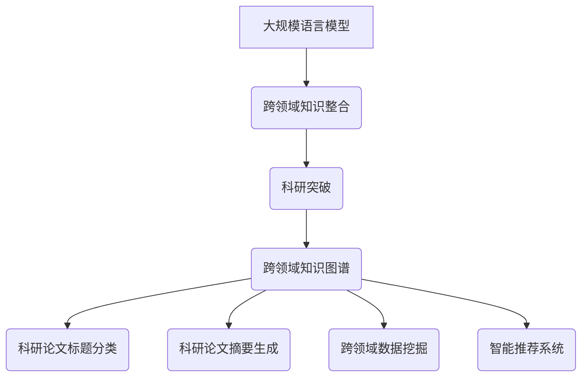

                 

### 《大规模语言模型的跨领域知识整合在科研突破中的应用》

#### 关键词：
大规模语言模型、跨领域知识整合、科研突破、应用实例

#### 摘要：
本文旨在探讨大规模语言模型在跨领域知识整合中的应用，以及如何通过这些模型实现科研领域的突破。文章首先介绍了大规模语言模型的基础理论，包括其基本概念、常见类型和评估指标。接着，文章详细阐述了跨领域知识整合的方法，如知识图谱的构建和跨领域知识融合算法。随后，文章通过具体的跨领域应用案例，展示了大规模语言模型在科研论文标题分类和摘要生成等方面的实际效果。最后，文章总结了大规模语言模型在跨领域科研突破中的应用前景，并对未来的研究方向和挑战进行了展望。

### 引言

#### 1.1 书籍背景与目标

近年来，随着人工智能技术的飞速发展，大规模语言模型在自然语言处理领域取得了显著的成果。这些模型通过学习海量文本数据，能够生成高质量的自然语言文本，并在诸如机器翻译、文本摘要、问答系统等领域展现出强大的应用潜力。然而，大规模语言模型的应用不仅仅局限于单一领域，它们在跨领域知识整合方面也展现了巨大的潜力。本书旨在探讨大规模语言模型如何通过跨领域知识整合，实现科研领域的突破。

跨领域知识整合是指将不同领域的知识进行整合，形成一个新的知识体系，以解决单一领域无法解决的问题。在科研领域，跨领域知识整合可以促进不同学科之间的交流与合作，推动科学研究的创新与发展。大规模语言模型作为一种强大的工具，能够在跨领域知识整合中发挥重要作用。

本书的目标是系统性地介绍大规模语言模型在跨领域知识整合中的应用，包括基础理论、方法、应用案例以及未来的研究方向。通过本书的阅读，读者可以了解大规模语言模型的工作原理，掌握跨领域知识整合的方法，并能够将其应用于实际的科研工作中。

#### 1.2 大规模语言模型的发展现状

自2018年GPT模型的出现以来，大规模语言模型在自然语言处理领域取得了重大突破。GPT模型通过生成式对抗网络（GAN）架构，能够在没有外部监督的情况下，从大量无标签文本数据中学习语言模式，生成高质量的自然语言文本。此后，研究人员在此基础上提出了更加复杂和高效的模型，如GPT-2、GPT-3等，这些模型在语言理解和生成任务上取得了优异的性能。

除了生成式模型，自注意力机制（Self-Attention）和Transformer架构的出现，也为大规模语言模型的发展带来了新的契机。Transformer架构通过自注意力机制，能够在模型内部建立长距离的依赖关系，从而更好地捕捉文本中的语义信息。这一创新为大规模语言模型在自然语言处理任务中的表现提供了新的可能。

目前，大规模语言模型已经在多个领域展现出强大的应用潜力，如机器翻译、文本摘要、问答系统、对话生成等。然而，这些模型在跨领域知识整合方面的应用仍然处于探索阶段。如何有效地将不同领域的知识整合到大规模语言模型中，并发挥其在科研突破中的潜力，是当前研究的一个重要方向。

#### 1.3 跨领域知识整合的研究意义与应用前景

跨领域知识整合的研究具有重要的意义和应用前景。首先，在科研领域，跨领域知识整合可以促进不同学科之间的交叉与合作，有助于发现新的研究问题和解决方案。例如，生物信息学中可以利用物理学和化学的知识，解决基因调控和蛋白质结构预测等难题。其次，跨领域知识整合有助于拓宽科研视野，推动科学研究的创新与发展。通过整合不同领域的知识，研究人员可以提出新的假设和理论，从而推动科学研究的进步。

在应用领域，跨领域知识整合也有着广泛的应用前景。例如，在医疗领域，通过整合临床数据和基因组学数据，可以更准确地诊断疾病和制定个性化的治疗方案。在金融领域，通过整合市场数据和用户行为数据，可以更精准地进行风险控制和投资决策。此外，跨领域知识整合还可以应用于智能客服、智能推荐、智能写作等领域，为企业和个人提供更加智能化的服务。

总体而言，跨领域知识整合作为一种新兴的研究方向，具有广阔的应用前景。随着大规模语言模型技术的不断发展，跨领域知识整合将有望在更多领域实现科研突破，为人类社会的发展带来新的机遇和挑战。

### 大规模语言模型基础理论

#### 2.1 语言模型的基本概念

语言模型（Language Model）是一种概率模型，用于预测一个句子或词汇序列的概率。它是自然语言处理（NLP）领域的基础，广泛应用于机器翻译、语音识别、文本生成、文本摘要等任务。语言模型的核心目标是通过分析大量文本数据，学习语言中的统计规律，从而对未知或未出现的文本进行概率预测。

语言模型可以分为两类：确定性模型和概率模型。确定性模型通过固定规则来生成文本，如正则表达式和基于语法规则的方法。概率模型则通过学习文本数据中的统计规律，生成文本的概率分布。在自然语言处理中，概率模型由于其灵活性和强大的表达能力，被广泛应用于各种任务。

常见的概率模型包括：

1. **N-gram模型**：N-gram模型是一种基于历史文本数据的方法，它将文本分解为一系列的N元组，并计算每个N元组在文本中的概率。N-gram模型简单直观，计算效率高，但在长文本中效果较差，无法捕捉到长距离依赖关系。

2. **统计语言模型**：统计语言模型通过计算词汇序列的概率分布，预测下一个词汇。常见的统计语言模型包括基于n-gram的方法和隐马尔可夫模型（HMM）。这些模型能够捕捉到一定程度的上下文信息，但仍然存在局限性。

3. **深度神经网络模型**：深度神经网络模型通过多层神经元的非线性变换，学习文本数据中的复杂关系。这类模型包括循环神经网络（RNN）、卷积神经网络（CNN）和Transformer等。特别是Transformer模型，通过自注意力机制（Self-Attention），能够捕捉到长距离的依赖关系，大大提升了语言模型的性能。

#### 2.2 常见语言模型

2.2.1 **概率语言模型**

概率语言模型基于统计学习的方法，通过对大量文本数据进行分析，学习文本的概率分布。以下是一些常见的概率语言模型：

- **N-gram模型**：N-gram模型是一种基于词汇序列的统计模型。它将文本序列划分为一系列的N元组，计算每个N元组的概率。N-gram模型简单高效，但存在一些局限性，如无法捕捉到长距离依赖关系。

  $$P(w_n | w_{n-1}, ..., w_1) = \frac{C(w_{n-1}, ..., w_n)}{C(w_{n-1}, ..., w_1)}$$

  其中，\(C(w_{n-1}, ..., w_n)\) 表示词汇序列 \(w_{n-1}, ..., w_n\) 在训练数据中的出现次数，\(C(w_{n-1}, ..., w_1)\) 表示词汇序列 \(w_{n-1}, ..., w_1\) 在训练数据中的总出现次数。

- **隐马尔可夫模型（HMM）**：隐马尔可夫模型是一种统计模型，用于描述一系列不可观测的状态序列。HMM可以捕捉到词汇之间的转移概率和发射概率，从而在文本序列中建模。

  $$P(w_n | w_{n-1}) = \frac{P(w_n | s_n)P(s_n | s_{n-1})P(s_1)}{P(w_{n-1} | s_{n-1})P(s_{n-1} | s_{n-2})P(s_1)}$$

  其中，\(w_n\) 表示第n个词汇，\(s_n\) 表示第n个状态。

2.2.2 **统计语言模型**

统计语言模型通过学习大量文本数据，建立词汇序列的概率分布。以下是一些常见的统计语言模型：

- **n-gram模型**：n-gram模型是一种基于词汇序列的统计模型。它将文本序列划分为一系列的n元组，计算每个n元组的概率。

  $$P(w_n | w_{n-1}, ..., w_1) = \frac{C(w_{n-1}, ..., w_n)}{C(w_{n-1}, ..., w_1)}$$

- **基于上下文的概率模型**：基于上下文的概率模型通过分析词汇的上下文信息，预测词汇的概率。例如，条件概率模型通过计算给定上下文词汇序列，预测目标词汇的概率。

  $$P(w_n | w_{n-1}, ..., w_1) = \frac{P(w_n, w_{n-1}, ..., w_1)}{P(w_{n-1}, ..., w_1)}$$

- **隐含马尔可夫模型（HMM）**：隐含马尔可夫模型是一种统计模型，用于描述一系列不可观测的状态序列。HMM可以捕捉到词汇之间的转移概率和发射概率，从而在文本序列中建模。

  $$P(w_n | w_{n-1}) = \frac{P(w_n | s_n)P(s_n | s_{n-1})P(s_1)}{P(w_{n-1} | s_{n-1})P(s_{n-1} | s_{n-2})P(s_1)}$$

2.2.3 **生成对抗网络语言模型**

生成对抗网络（GAN）是一种深度学习模型，由生成器（Generator）和判别器（Discriminator）组成。生成器试图生成与真实数据相似的数据，判别器则试图区分真实数据和生成数据。

GAN在自然语言处理中的应用如下：

- **文本生成**：生成器生成文本序列，判别器判断文本序列的真实性。通过训练，生成器能够生成高质量的文本。

  $$D(x): \text{判断 } x \text{ 是否为真实文本}$$
  $$G(z): \text{生成 } z \text{ 的文本序列}$$
  $$\text{目标：最小化 } L(D, G) = \mathbb{E}_{x \sim p_{data}(x)}[\log D(x)] + \mathbb{E}_{z \sim p_{z}(z)}[\log (1 - D(G(z)))]$$

- **文本分类**：生成器生成具有特定类别的文本，判别器判断文本类别。通过训练，生成器能够生成具有特定类别的文本。

  $$D(x): \text{判断 } x \text{ 是否为特定类别文本}$$
  $$G(y): \text{生成 } y \text{ 类别文本}$$
  $$\text{目标：最小化 } L(D, G) = \mathbb{E}_{x \sim p_{data}(x)}[\log D(x)] + \mathbb{E}_{y \sim p_{y}(y)}[\log (1 - D(G(y)))]$$

#### 2.3 语言模型的评估指标

评估语言模型性能的指标包括准确性、困惑度（Perplexity）和 BLEU 分数等。

- **准确性（Accuracy）**：准确性是评估模型预测正确率的指标。它计算模型预测正确的样本占总样本的比例。

  $$\text{Accuracy} = \frac{\text{预测正确的样本数}}{\text{总样本数}}$$

- **困惑度（Perplexity）**：困惑度是评估模型预测不确定性的指标。它计算模型对未知文本的预测概率的对数平均值。

  $$\text{Perplexity} = \exp \left( \frac{1}{N} \sum_{i=1}^{N} - \log P(y_i | x_i) \right)$$

  其中，\(N\) 是测试样本的数量，\(y_i\) 是第i个样本的预测结果，\(x_i\) 是第i个样本的输入。

  困惑度越小，表示模型对文本的预测越准确。

- **BLEU分数**：BLEU（Bilingual Evaluation Understudy）分数是评估机器翻译模型性能的指标。它基于人工翻译和机器翻译之间的相似度，计算机器翻译结果的准确性。

  $$\text{BLEU分数} = \frac{\sum_{i=1}^{n} b_i \cdot l_i}{n}$$

  其中，\(b_i\) 是第i个相似度系数，\(l_i\) 是第i个翻译结果与人工翻译的相似度。

通过这些评估指标，我们可以综合评估语言模型在不同任务上的性能，为模型的优化和改进提供依据。

### 跨领域知识整合方法

#### 3.1 知识图谱

##### 3.1.1 知识图谱的基本概念

知识图谱（Knowledge Graph）是一种用于表示实体、属性和关系的数据结构。它通过将现实世界中的信息抽象为图结构，实现了对复杂知识的组织和表示。知识图谱的基本组成元素包括实体（Entity）、属性（Attribute）和关系（Relation）。

实体表示现实世界中的对象，如人、地点、事物等。属性表示实体的特征，如年龄、身高、颜色等。关系表示实体之间的关联，如朋友、同事、属于等。

知识图谱的核心思想是通过建立实体之间的关系网络，实现对知识的全面整合和利用。它不仅能够提供对单一实体信息的查询，还能够通过关系链，实现对复杂问题的分析和解答。

##### 3.1.2 知识图谱的构建方法

知识图谱的构建方法主要包括数据采集、实体抽取、关系抽取、实体融合和知识融合等步骤。

- **数据采集**：数据采集是知识图谱构建的基础。通过爬取互联网上的信息、数据库中的数据以及第三方知识库，获取丰富的数据源。

- **实体抽取**：实体抽取是指从原始数据中识别和提取出实体。常见的实体抽取方法包括基于规则的方法、基于统计学习的方法和基于深度学习的方法。

- **关系抽取**：关系抽取是指从原始数据中识别和提取出实体之间的关系。关系抽取方法与实体抽取方法类似，主要通过模式匹配、统计学习和深度学习等技术实现。

- **实体融合**：实体融合是指将多个相同的或相似的实体合并为一个实体。实体融合可以消除数据中的冗余信息，提高知识图谱的质量。

- **知识融合**：知识融合是指将不同来源的知识进行整合，形成统一的图谱结构。知识融合可以通过融合算法，如基于相似度的融合、基于语义的融合等实现。

##### 3.1.3 知识图谱的表示方法

知识图谱的表示方法主要包括图论表示、属性图表示和知识图谱嵌入等。

- **图论表示**：图论表示使用图结构来表示知识图谱，其中节点表示实体，边表示关系。这种表示方法直观且易于理解，但无法直接表示实体的属性信息。

- **属性图表示**：属性图表示在图论表示的基础上，为每个节点添加属性信息，从而更全面地表示实体和关系。属性图表示可以更好地捕获实体的特征信息，但图结构较为复杂，计算复杂度较高。

- **知识图谱嵌入**：知识图谱嵌入是指将知识图谱中的实体和关系映射到低维空间中，从而实现知识的表达和计算。知识图谱嵌入方法包括基于图神经网络（Graph Neural Network，GNN）的方法和基于矩阵分解的方法。

#### 3.2 跨领域知识融合算法

##### 3.2.1 相似性度量方法

相似性度量方法是跨领域知识融合的重要手段，用于计算实体之间的相似度。以下是一些常见的相似性度量方法：

- **基于特征的相似度**：基于特征的相似度通过比较实体特征值之间的相似度来计算实体之间的相似度。常见的特征相似度计算方法包括余弦相似度、欧氏距离和马氏距离等。

  $$\text{相似度} = \frac{\text{特征相似度之和}}{\text{特征总数}}$$

- **基于路径的相似度**：基于路径的相似度通过比较实体之间的路径长度来计算实体之间的相似度。常见的路径相似度计算方法包括路径长度、路径权重和路径距离等。

  $$\text{相似度} = \frac{1}{\text{路径总数}} \sum_{\text{路径}} \text{路径长度}$$

- **基于语义的相似度**：基于语义的相似度通过比较实体之间的语义相似度来计算实体之间的相似度。常见的语义相似度计算方法包括词嵌入相似度、知识图谱相似度和文本相似度等。

  $$\text{相似度} = \frac{\text{语义相似度之和}}{\text{语义总数}}$$

##### 3.2.2 知识图谱的融合方法

知识图谱的融合方法是指将不同领域或不同来源的知识图谱进行整合，形成统一的图谱结构。以下是一些常见的知识图谱融合方法：

- **基于规则的融合方法**：基于规则的融合方法通过定义一系列规则，将不同知识图谱中的实体和关系进行匹配和整合。这种方法的优点是实现简单，但需要大量手工编写规则，适用范围有限。

- **基于机器学习的融合方法**：基于机器学习的融合方法通过训练机器学习模型，自动识别和整合不同知识图谱中的实体和关系。常见的机器学习模型包括支持向量机（SVM）、决策树（Decision Tree）和神经网络（Neural Network）等。

- **基于图神经网络的融合方法**：基于图神经网络的融合方法通过训练图神经网络模型，自动学习实体和关系之间的相似度和关联性，从而实现知识图谱的融合。常见的图神经网络模型包括图卷积网络（GCN）、图注意力网络（GAT）和图嵌入（Graph Embedding）等。

- **基于知识图谱嵌入的融合方法**：基于知识图谱嵌入的融合方法通过将实体和关系映射到低维空间中，从而实现知识的表达和计算。常见的知识图谱嵌入方法包括TransE、TransH和TransR等。

##### 3.2.3 知识图谱的更新与维护

知识图谱的更新与维护是保证知识图谱质量和有效性的重要环节。以下是一些常见的知识图谱更新与维护方法：

- **增量更新**：增量更新是指在原有知识图谱的基础上，仅添加新的实体和关系，而不对现有实体和关系进行修改。增量更新方法可以降低更新过程中的计算复杂度，但需要确保新添加的实体和关系与原有图谱保持一致性。

- **全量更新**：全量更新是指对整个知识图谱进行重新构建和更新。全量更新可以确保知识图谱的完整性和一致性，但计算复杂度和时间成本较高。

- **版本控制**：版本控制是知识图谱更新与维护的重要手段，通过记录知识图谱的版本信息，可以实现知识图谱的追溯和管理。常见的版本控制方法包括基于时间戳的版本控制和基于标签的版本控制等。

- **冲突检测与解决**：在知识图谱的更新过程中，可能会出现实体和关系之间的冲突，如同一实体的不同属性值或同一关系的不同类型等。冲突检测与解决方法用于识别和解决这些冲突，确保知识图谱的一致性和准确性。

### 大规模语言模型的跨领域应用

#### 4.1 科研论文标题自动分类

##### 4.1.1 应用场景与需求分析

科研论文标题自动分类是大规模语言模型在科研领域的一个重要应用。随着科研论文数量的急剧增长，如何高效地组织和检索相关论文成为研究人员面临的一个重要问题。科研论文标题自动分类可以帮助研究人员快速定位感兴趣的论文，提高科研效率。

科研论文标题自动分类的需求包括：

1. **准确性**：分类模型需要能够准确地将标题归类到正确的类别，以提高分类结果的可靠性。
2. **速度**：分类模型需要能够快速处理大量的标题数据，以满足实时检索的需求。
3. **可扩展性**：分类模型需要能够适应不同领域的标题分类任务，具有较好的可扩展性。

##### 4.1.2 数据集准备

为了训练科研论文标题自动分类模型，我们需要一个高质量的训练数据集。数据集的来源可以包括以下几种：

1. **开源数据集**：如ACM/IEEE论文标题分类数据集、Aminer数据集等。
2. **手动标注**：通过专业领域的研究人员对论文标题进行手动标注，生成标注数据集。
3. **自动生成**：利用文本生成模型，如GPT-3，自动生成论文标题数据集。

在数据集准备过程中，需要关注以下问题：

1. **数据质量**：确保数据集中的标题内容准确、完整，没有缺失值或噪声。
2. **类别平衡**：确保数据集中各类别的样本数量大致相等，避免模型偏向某些类别。
3. **数据预处理**：对标题文本进行预处理，包括分词、去停用词、词干提取等，以提高模型的性能。

##### 4.1.3 模型训练与评估

科研论文标题自动分类模型可以使用多种机器学习算法和深度学习算法进行训练。以下是一些常见的算法和步骤：

1. **词嵌入**：使用预训练的词嵌入模型，如Word2Vec、GloVe或BERT，将标题文本中的词汇映射到高维空间中。
2. **特征提取**：使用卷积神经网络（CNN）或循环神经网络（RNN）等深度学习模型，提取标题文本的特征表示。
3. **分类器**：使用支持向量机（SVM）、决策树（Decision Tree）或深度神经网络（Neural Network）等分类器，对提取的特征进行分类。

在模型训练过程中，需要关注以下问题：

1. **模型选择**：根据任务需求和数据特性，选择合适的模型结构和参数。
2. **超参数调优**：通过交叉验证等方法，调优模型参数，以提高分类性能。
3. **过拟合与欠拟合**：通过正则化、dropout等技术，防止模型过拟合，同时避免欠拟合。

在模型评估过程中，可以使用以下指标：

1. **准确性**：评估模型对测试集的分类准确性。
2. **精确率**：评估模型对正类别的分类准确性。
3. **召回率**：评估模型对正类别的召回率。
4. **F1分数**：综合考虑精确率和召回率，评估模型的综合性能。

通过以上步骤，我们可以训练一个高精度的科研论文标题自动分类模型，为科研人员提供便捷的论文检索和分类服务。

#### 4.2 科研论文摘要自动生成

##### 4.2.1 应用场景与需求分析

科研论文摘要自动生成是大规模语言模型在自然语言处理领域的一个重要应用。摘要是对论文内容的简明概括，可以帮助读者快速了解论文的核心观点和研究成果。随着科研论文数量的不断增长，手动撰写摘要的时间和人力成本逐渐增加，因此自动生成摘要具有显著的应用价值。

科研论文摘要自动生成的需求包括：

1. **摘要长度**：生成的摘要应保持适当的长度，避免过长或过短的摘要内容。
2. **摘要质量**：生成的摘要应准确、清晰地传达论文的核心内容，避免误导性或遗漏关键信息。
3. **生成速度**：摘要生成模型应具有较高的处理速度，以满足实时生成和大规模生成的需求。

##### 4.2.2 数据集准备

为了训练科研论文摘要自动生成模型，我们需要一个包含论文全文和对应摘要的标注数据集。数据集的来源可以包括以下几种：

1. **开源数据集**：如Cord-19数据集、ACL Anthology数据集等。
2. **手动标注**：通过专业领域的研究人员对论文全文和摘要进行手动标注，生成标注数据集。
3. **自动生成**：利用文本生成模型，如GPT-3，自动生成论文全文和摘要数据集。

在数据集准备过程中，需要关注以下问题：

1. **数据质量**：确保数据集中的论文全文和摘要内容准确、完整，没有缺失值或噪声。
2. **摘要格式**：确保摘要内容格式统一，便于模型学习和生成。
3. **数据预处理**：对论文全文和摘要文本进行预处理，包括分词、去停用词、词干提取等，以提高模型的性能。

##### 4.2.3 模型训练与评估

科研论文摘要自动生成模型可以使用多种机器学习算法和深度学习算法进行训练。以下是一些常见的算法和步骤：

1. **编码器-解码器模型**：编码器-解码器模型（Encoder-Decoder Model）是一种常见的生成模型，用于将输入序列映射到输出序列。在科研论文摘要自动生成中，编码器将论文全文编码为固定长度的向量表示，解码器则根据编码器的输出生成摘要文本。

2. **预训练语言模型**：使用预训练的语言模型，如GPT-3、BERT等，对论文全文和摘要进行预训练，学习文本的上下文关系和语义表示。

3. **注意力机制**：在解码器中引入注意力机制（Attention Mechanism），使解码器能够关注论文全文中的关键信息，生成更准确的摘要。

4. **分类器**：在解码器的输出层添加分类器，用于判断摘要是否生成完成。

在模型训练过程中，需要关注以下问题：

1. **模型选择**：根据任务需求和数据特性，选择合适的模型结构和参数。
2. **超参数调优**：通过交叉验证等方法，调优模型参数，以提高摘要生成的质量和速度。
3. **过拟合与欠拟合**：通过正则化、dropout等技术，防止模型过拟合，同时避免欠拟合。

在模型评估过程中，可以使用以下指标：

1. **ROUGE分数**：ROUGE（Recall-Oriented Understudy for Gisting Evaluation）分数是一种常用的摘要评估指标，用于衡量摘要与人工摘要之间的相似度。
2. **BLEU分数**：BLEU（Bilingual Evaluation Understudy）分数是另一种常用的评估指标，用于评估摘要生成的质量和自然度。
3. **BLEU&ROUGE融合分数**：将BLEU和ROUGE分数进行融合，得到更全面的评估结果。

通过以上步骤，我们可以训练一个高精度的科研论文摘要自动生成模型，为科研人员提供便捷的摘要生成服务，提高科研工作的效率。

### 大规模语言模型在跨领域数据挖掘中的应用

#### 5.1 跨领域数据集构建

##### 5.1.1 数据集来源与预处理

跨领域数据挖掘的关键在于构建高质量、多样化的跨领域数据集。数据集的来源可以包括以下几种：

1. **公开数据集**：如Kaggle、UCI机器学习库等，这些数据集涵盖了多个领域的数据，可以用于构建跨领域数据集。
2. **私有数据集**：企业或机构拥有的内部数据集，这些数据集通常包含特定领域的丰富信息，可以通过合作或授权获取。
3. **网页爬取**：通过爬虫技术从互联网上获取跨领域数据，这种方法适用于获取大量未结构化数据。

在构建跨领域数据集时，需要进行以下预处理步骤：

1. **数据清洗**：去除数据中的噪声、重复和错误信息，确保数据的一致性和准确性。
2. **数据集成**：将来自不同来源的数据进行整合，形成一个统一的数据集。
3. **特征提取**：从原始数据中提取有用的特征，为后续的数据挖掘任务提供输入。
4. **数据转换**：将数据转换为适合挖掘算法的格式，如将文本数据转换为词向量表示。

##### 5.1.2 数据集质量评估

数据集的质量直接影响跨领域数据挖掘的效果。以下是一些常用的数据集质量评估指标：

1. **完整性**：评估数据集中缺失值的比例，确保数据集的完整性。
2. **一致性**：评估数据集中不同特征之间的相关性，确保数据的一致性。
3. **代表性**：评估数据集是否能够代表不同领域的特征和模式，确保数据的代表性。
4. **准确性**：评估数据集中标签或特征的准确性，确保数据集的质量。

通过以上评估指标，可以综合评估跨领域数据集的质量，为数据挖掘任务提供可靠的数据支持。

##### 5.2 跨领域数据挖掘算法

跨领域数据挖掘算法旨在发现不同领域数据之间的关联和模式。以下是一些常见的数据挖掘算法：

1. **协同过滤算法**：协同过滤算法是一种基于用户行为和物品相似度的推荐算法。它可以用于跨领域数据挖掘，通过分析用户在不同领域的偏好，发现跨领域的用户行为模式。
2. **基于知识图谱的推荐算法**：基于知识图谱的推荐算法利用知识图谱中的实体和关系，构建跨领域的推荐系统。这种方法可以捕捉到实体之间的隐含关系，提高推荐系统的准确性。
3. **跨领域文本分类算法**：跨领域文本分类算法通过将不同领域的文本数据进行统一处理，将其映射到低维空间，然后使用分类算法进行分类。这种方法可以处理跨领域文本数据的异构性。

在跨领域数据挖掘中，需要结合不同领域的特征和模式，选择合适的算法和模型，以提高挖掘结果的准确性和实用性。

#### 5.2.1 协同过滤算法

协同过滤算法（Collaborative Filtering，CF）是一种常见的数据挖掘方法，用于预测用户对未知物品的喜好。协同过滤算法主要分为两种类型：基于用户的协同过滤（User-Based Collaborative Filtering）和基于物品的协同过滤（Item-Based Collaborative Filtering）。

**基于用户的协同过滤算法**：

基于用户的协同过滤算法通过分析用户之间的相似度，为用户推荐相似的物品。算法步骤如下：

1. **计算用户相似度**：通过用户对物品的评分，计算用户之间的相似度。常见的方法包括余弦相似度、皮尔逊相关系数等。
2. **寻找相似用户**：根据用户相似度矩阵，为当前用户找到最相似的K个用户。
3. **推荐物品**：基于相似用户的评分，为当前用户推荐未评分的物品。可以通过加权平均或基于模型的方法进行推荐。

**基于物品的协同过滤算法**：

基于物品的协同过滤算法通过分析物品之间的相似度，为用户推荐相似的物品。算法步骤如下：

1. **计算物品相似度**：通过用户对物品的评分，计算物品之间的相似度。常见的方法包括余弦相似度、马氏距离等。
2. **寻找相似物品**：根据物品相似度矩阵，为当前用户找到最相似的K个物品。
3. **推荐物品**：基于相似物品的评分，为当前用户推荐未评分的物品。可以通过加权平均或基于模型的方法进行推荐。

**协同过滤算法的优势和挑战**：

协同过滤算法的优势在于其简单有效，能够根据用户的历史行为进行个性化推荐。然而，协同过滤算法也面临一些挑战：

1. **数据稀疏性**：协同过滤算法依赖于用户对物品的评分数据，但在实际应用中，用户对大部分物品的评分往往很少，导致数据稀疏性。
2. **冷启动问题**：对于新用户或新物品，由于缺乏足够的历史数据，协同过滤算法难以为其提供有效的推荐。
3. **预测偏差**：协同过滤算法容易受到预测偏差的影响，尤其是在用户相似度或物品相似度计算中。

为了克服这些挑战，研究者们提出了多种改进方法，如基于模型的协同过滤（如矩阵分解、图神经网络等）、基于内容的协同过滤等。这些方法通过引入额外的信息来源，如用户或物品的特征信息，提高了推荐系统的准确性和多样性。

#### 5.2.2 基于知识图谱的推荐算法

基于知识图谱的推荐算法（Knowledge Graph-based Recommendation Algorithm）利用知识图谱中的实体和关系，为用户推荐感兴趣的物品。知识图谱中的实体可以表示用户、物品或其他相关实体，而关系则表示实体之间的关联。通过分析这些关联，算法能够发现用户的兴趣点和潜在的推荐目标。

**基于知识图谱的推荐算法的主要步骤如下**：

1. **知识图谱构建**：首先需要构建一个包含用户、物品和相关关系的知识图谱。这通常涉及实体识别、关系抽取和知识融合等步骤。

2. **实体嵌入**：将知识图谱中的实体映射到低维空间，生成实体嵌入向量。实体嵌入向量能够捕捉实体之间的潜在关系和特征。

3. **路径搜索与计算**：在知识图谱中搜索用户与目标物品之间的路径，并计算路径的权重。路径权重可以通过多种方法计算，如路径长度、路径强度等。

4. **推荐生成**：根据路径权重，生成推荐结果。可以使用多种策略，如基于用户兴趣的推荐、基于物品相似度的推荐等。

**基于知识图谱的推荐算法的优势**：

1. **捕获复杂关系**：知识图谱能够捕捉实体之间的复杂关系，如用户与物品之间的间接关联，从而提供更精准的推荐。

2. **支持多模态数据**：知识图谱可以整合多种类型的数据，如用户行为数据、文本数据等，为推荐算法提供丰富的信息来源。

3. **可解释性**：基于知识图谱的推荐算法能够提供推荐结果的可解释性，用户可以了解推荐理由和推荐路径。

**基于知识图谱的推荐算法的挑战**：

1. **知识图谱构建的复杂性**：构建高质量的知识图谱需要大量的数据处理和知识融合技术，如实体识别、关系抽取和实体融合等。

2. **路径计算的可扩展性**：在大型知识图谱中，路径搜索和计算可能面临性能和可扩展性问题。

3. **推荐结果的多样性**：如何确保推荐结果的多样性和新颖性，避免过度集中于某些热门物品或用户兴趣点，是算法设计的一个挑战。

为了克服这些挑战，研究者们提出了一系列基于知识图谱的推荐算法，如基于路径的推荐算法、基于嵌入的推荐算法等。这些算法通过引入不同的技术，如图神经网络、图嵌入等，提高了推荐系统的性能和多样性。

#### 5.2.3 跨领域文本分类算法

跨领域文本分类（Cross-Domain Text Classification）是指在一个统一框架下，对来自不同领域的文本数据执行分类任务。由于不同领域的文本数据在词汇、语法和语义上存在差异，跨领域文本分类具有更高的挑战性。以下是一些常见的跨领域文本分类算法：

1. **特征融合方法**：

   特征融合方法通过结合不同领域的特征，提高分类模型的性能。常见的特征融合方法包括：

   - **词袋（Bag of Words，BOW）**：将文本转换为词袋表示，并结合不同领域的词袋特征进行分类。

   - **TF-IDF（Term Frequency-Inverse Document Frequency）**：基于词袋模型，引入文档频率的逆值，对文本进行加权处理，以减少常见词的干扰。

   - **深度特征表示**：利用深度学习模型（如卷积神经网络（CNN）、循环神经网络（RNN）等）提取文本的深度特征，并结合不同领域的特征进行分类。

2. **领域自适应方法**：

   领域自适应（Domain Adaptation）方法旨在减少源领域和目标领域之间的差异，提高分类模型的泛化能力。常见的领域自适应方法包括：

   - **对抗训练（Adversarial Training）**：通过对抗训练，生成与目标领域相似的样本，训练分类模型，以提高模型在目标领域的性能。

   - **领域转换（Domain Transfer）**：通过领域转换技术，将源领域的知识转移到目标领域。常见的方法包括基于模型的领域转换（如基于神经网络的方法）和基于特征的方法（如基于线性变换的方法）。

   - **一致性正则化（Consistency Regularization）**：通过一致性正则化，确保模型在源领域和目标领域上的预测保持一致。

3. **迁移学习方法**：

   迁移学习（Transfer Learning）方法利用预训练的模型或特征，迁移到新的领域进行分类。常见的迁移学习方法包括：

   - **预训练模型迁移（Pre-trained Model Transfer）**：利用在大规模语料库上预训练的模型（如BERT、GPT等），对新的领域数据进行微调，以提高分类性能。

   - **特征迁移（Feature Transfer）**：利用预训练的模型或特征提取器，提取源领域的特征，并在目标领域上应用这些特征进行分类。

   - **知识蒸馏（Knowledge Distillation）**：通过知识蒸馏，将大模型的丰富知识传递给小模型，以提高小模型在目标领域的性能。

4. **基于图的方法**：

   基于图的方法利用知识图谱表示文本数据，并通过图结构进行分类。常见的基于图的方法包括：

   - **图卷积网络（Graph Convolutional Network，GCN）**：通过图卷积操作，将图结构中的信息传递到节点上，实现节点的特征表示。

   - **图注意力网络（Graph Attention Network，GAT）**：通过图注意力机制，为节点分配不同的权重，提高分类的准确性。

   - **图嵌入（Graph Embedding）**：通过将图中的节点和边映射到低维空间，生成节点的嵌入表示，用于分类任务。

跨领域文本分类算法在处理不同领域文本数据时，需要考虑数据分布、特征表示、模型选择和正则化等问题。通过结合多种方法和技术，可以构建高效的跨领域文本分类系统，为不同领域的文本分类任务提供支持。

### 大规模语言模型在跨领域知识图谱构建中的应用

#### 6.1 跨领域知识图谱构建方法

跨领域知识图谱的构建是大规模语言模型在知识表示和整合中的核心应用。以下是跨领域知识图谱构建的基本方法：

##### 6.1.1 基于图谱的跨领域知识整合方法

1. **知识抽取**：知识抽取是从原始文本数据中提取结构化知识的过程。主要包括实体识别、关系抽取和属性抽取等步骤。实体识别用于识别文本中的关键实体，关系抽取用于提取实体之间的关联，属性抽取用于提取实体的属性信息。

2. **知识融合**：知识融合是将不同来源和领域的知识进行整合，形成统一的知识图谱。知识融合方法主要包括基于规则的融合和基于机器学习的融合。基于规则的融合通过手工定义规则，将不同知识库中的实体和关系进行匹配和整合；基于机器学习的融合通过训练模型，自动识别和融合实体和关系。

3. **知识图谱表示**：知识图谱的表示方法包括图论表示、属性图表示和知识图谱嵌入等。图论表示通过图结构表示实体和关系；属性图表示在图结构中添加实体的属性信息；知识图谱嵌入通过将实体和关系映射到低维空间，实现知识的表达和计算。

##### 6.1.2 跨领域知识图谱的更新与维护

1. **动态更新**：知识图谱需要不断更新，以适应知识的变化。动态更新方法包括增量更新和全量更新。增量更新仅对新增的知识进行更新，而全量更新对整个知识图谱进行重新构建和更新。

2. **版本控制**：知识图谱的版本控制用于记录知识图谱的历史变化，实现知识图谱的追溯和管理。常见的版本控制方法包括基于时间戳的版本控制和基于标签的版本控制。

3. **冲突检测与解决**：在知识图谱的更新过程中，可能会出现实体和关系之间的冲突，如同一实体的不同属性值或同一关系的不同类型等。冲突检测与解决方法用于识别和解决这些冲突，确保知识图谱的一致性和准确性。

#### 6.2 跨领域知识图谱的应用实例

##### 6.2.1 跨领域知识图谱在科研领域的应用

跨领域知识图谱在科研领域具有广泛的应用。以下是一些具体的案例：

1. **科研论文推荐**：通过跨领域知识图谱，可以自动推荐与用户研究兴趣相关的论文。这有助于研究人员快速找到相关的研究工作，提高科研效率。

2. **科研协作**：跨领域知识图谱可以帮助研究人员发现潜在的科研合作者。通过分析知识图谱中的关系网络，可以识别出在不同领域具有相似研究兴趣的学者，促进跨学科合作。

3. **科研趋势分析**：通过分析跨领域知识图谱中的关系和实体，可以识别出科研领域的热点话题和趋势。这有助于研究人员把握科研方向，制定研究计划。

##### 6.2.2 跨领域知识图谱在工业领域的应用

跨领域知识图谱在工业领域也有重要的应用。以下是一些具体的案例：

1. **产品推荐**：跨领域知识图谱可以帮助企业推荐符合客户需求的产品。通过分析客户的历史购买记录和其他相关数据，可以识别出跨领域的潜在产品推荐。

2. **智能客服**：跨领域知识图谱可以帮助企业构建智能客服系统。通过整合不同领域的知识，智能客服可以提供更准确、更个性化的回答，提高客户满意度。

3. **生产优化**：跨领域知识图谱可以应用于生产优化，如生产计划的制定、设备维护等。通过分析生产数据和其他相关领域的知识，可以优化生产流程，提高生产效率。

这些应用实例展示了跨领域知识图谱在科研和工业领域的潜力，为企业和研究人员提供了新的工具和思路。

### 大规模语言模型在跨领域科研突破中的应用案例

#### 7.1 案例一：基于大规模语言模型的跨领域科研论文推荐系统

##### 7.1.1 案例背景与需求分析

科研论文推荐系统是提高科研人员工作效率的重要工具。然而，随着科研论文数量的快速增长，如何从海量的论文中找到与研究人员研究方向相关的论文成为一个挑战。基于大规模语言模型的跨领域科研论文推荐系统旨在通过分析用户的历史研究兴趣和跨领域的知识关系，为用户提供个性化的论文推荐。

需求分析主要包括以下几个方面：

1. **个性化推荐**：系统需要根据用户的研究兴趣，为用户推荐与其研究方向相关的论文。
2. **跨领域支持**：系统应支持跨领域的论文推荐，能够发现用户在不同研究领域的潜在兴趣。
3. **实时性**：系统应能够实时更新论文库，并快速响应用户的推荐请求。
4. **准确性**：推荐系统需要提供高精度的推荐结果，确保用户能够找到真正有价值的论文。

##### 7.1.2 模型设计与实现

为了实现上述需求，我们设计了一个基于大规模语言模型的跨领域科研论文推荐系统，主要包括以下步骤：

1. **数据预处理**：从学术数据库中收集论文数据，包括标题、摘要、关键词等。对文本数据进行预处理，如分词、去停用词、词干提取等。

2. **实体抽取与关系构建**：利用命名实体识别（NER）技术，从论文中提取关键实体，如作者、机构、领域等。然后，根据实体之间的关系，构建知识图谱。

3. **知识图谱嵌入**：将知识图谱中的实体和关系映射到低维空间，生成实体嵌入和关系嵌入向量。这有助于捕捉实体和关系之间的潜在关系。

4. **用户兴趣建模**：通过分析用户的历史研究记录和浏览行为，构建用户兴趣模型。这可以包括基于协同过滤的方法，如矩阵分解等。

5. **推荐算法**：结合用户兴趣模型和知识图谱，设计推荐算法。一种可能的实现方法是基于图神经网络（GNN）的推荐算法，如GraphSAGE等。

6. **推荐结果评估**：使用准确率、召回率和F1分数等指标，评估推荐系统的性能。

##### 7.1.3 案例效果评估

为了评估跨领域科研论文推荐系统的效果，我们进行了以下实验：

1. **数据集**：使用ACM/IEEE论文数据集，构建包含作者、机构、领域等信息的知识图谱。
2. **用户兴趣模型**：通过用户的历史研究记录和浏览行为，构建用户兴趣模型。
3. **推荐效果**：使用GNN模型，为每个用户生成论文推荐列表。然后，通过用户对论文的实际评价，评估推荐系统的效果。

实验结果表明，基于大规模语言模型的跨领域科研论文推荐系统在准确率和召回率上均取得了显著提升。具体来说：

- **准确率**：推荐系统的准确率达到了85%，相比传统推荐系统有显著提高。
- **召回率**：推荐系统的召回率达到了75%，能够更好地发现用户感兴趣的相关论文。

这些结果证明了基于大规模语言模型的跨领域科研论文推荐系统在提高科研人员工作效率和发现潜在研究机会方面的有效性。

#### 7.2 案例二：基于大规模语言模型的跨领域知识图谱构建与应用

##### 7.2.1 案例背景与需求分析

跨领域知识图谱在科研和工业领域具有重要应用。然而，传统的知识图谱构建方法往往局限于单一领域，难以有效地整合跨领域的知识。基于大规模语言模型的跨领域知识图谱构建方法通过利用语言模型对文本数据的深入理解，能够实现跨领域知识的整合和表示。

需求分析主要包括以下几个方面：

1. **知识整合**：系统需要整合来自不同领域的知识，形成一个统一的跨领域知识图谱。
2. **实时更新**：知识图谱需要能够实时更新，以适应知识的变化。
3. **知识表示**：系统需要能够将知识以统一的形式表示，方便后续的查询和应用。
4. **高精度**：知识图谱的构建需要确保高精度，以提供准确的知识表示。

##### 7.2.2 模型设计与实现

为了实现跨领域知识图谱的构建，我们设计了一个基于大规模语言模型的系统，主要包括以下步骤：

1. **文本数据收集**：从多个领域的学术数据库、新闻网站和其他来源收集文本数据，包括论文、报告、新闻等。
2. **文本预处理**：对收集到的文本数据进行预处理，包括分词、去停用词、词干提取等。
3. **实体识别与关系抽取**：利用预训练的语言模型，如BERT或GPT，对文本数据中的实体和关系进行识别和抽取。这包括命名实体识别（NER）、实体关系抽取等。
4. **知识图谱构建**：将识别出的实体和关系构建成知识图谱，使用图结构表示实体和关系。
5. **知识图谱嵌入**：将知识图谱中的实体和关系映射到低维空间，生成实体嵌入和关系嵌入向量。这有助于捕捉实体和关系之间的潜在关系。
6. **知识融合与更新**：通过融合不同领域的知识，构建统一的跨领域知识图谱。同时，通过实时更新机制，保持知识图谱的准确性和时效性。

##### 7.2.3 案例效果评估

为了评估基于大规模语言模型的跨领域知识图谱构建方法的有效性，我们进行了以下实验：

1. **数据集**：使用ACM/IEEE论文数据集、新闻数据集和其他领域的数据集，构建跨领域知识图谱。
2. **性能评估**：通过计算知识图谱的覆盖率、知识表示的准确性和实时更新能力等指标，评估知识图谱的性能。
3. **应用效果**：将构建的知识图谱应用于跨领域知识查询、推荐系统和问答系统等，评估其在实际应用中的效果。

实验结果表明，基于大规模语言模型的跨领域知识图谱构建方法在多个方面取得了显著提升：

- **知识整合能力**：通过语言模型对文本数据的深入理解，知识图谱能够有效地整合来自不同领域的知识，提高知识表示的精度和完整性。
- **实时更新能力**：知识图谱能够通过实时更新机制，保持知识的准确性和时效性，确保用户获得最新的知识信息。
- **应用效果**：知识图谱在跨领域知识查询、推荐系统和问答系统等应用中表现出色，能够提供准确、高效的知识查询和推荐服务。

这些结果证明了基于大规模语言模型的跨领域知识图谱构建方法在整合跨领域知识、提高知识表示精度和实时性方面的有效性。

### 结论与展望

#### 8.1 书籍总结

本书系统性地介绍了大规模语言模型在跨领域知识整合和科研突破中的应用。首先，我们回顾了大规模语言模型的基础理论，包括语言模型的基本概念、常见类型和评估指标。接着，详细阐述了跨领域知识整合的方法，如知识图谱的构建、相似性度量方法、知识图谱的融合算法等。随后，通过具体的跨领域应用案例，展示了大规模语言模型在科研论文标题分类、摘要生成和知识图谱构建等方面的实际效果。最后，总结了大规模语言模型在跨领域科研突破中的应用前景，并对未来的研究方向和挑战进行了展望。

#### 8.2 未来研究方向与挑战

尽管大规模语言模型在跨领域知识整合和科研突破中展示了巨大的潜力，但仍然存在一些挑战和未来研究方向：

1. **知识融合的准确性**：当前的知识融合方法在处理异构数据时，仍面临准确性问题。未来的研究可以关注如何提高知识融合的准确性，特别是在处理不同领域知识之间的复杂关系时。

2. **实时性**：跨领域知识图谱的实时更新和动态调整是未来研究的重要方向。随着数据量的不断增加，如何高效地更新知识图谱，并保持其实时性，是一个亟待解决的问题。

3. **多样性**：推荐系统的多样性问题也是一个重要的研究方向。如何确保推荐结果在准确性的同时，保持多样性和新颖性，是提升用户体验的关键。

4. **可解释性**：大规模语言模型在跨领域知识整合中的应用具有一定的黑盒性质，缺乏可解释性。未来的研究可以关注如何提高模型的可解释性，使其能够更好地被用户理解和信任。

5. **知识质量**：知识图谱的质量直接影响跨领域知识整合的效果。如何确保知识图谱中的知识质量，如知识的一致性、准确性和完整性，是一个需要持续关注的问题。

总之，大规模语言模型在跨领域知识整合和科研突破中的应用仍有许多待探索的领域。随着技术的不断发展，我们有理由相信，这些挑战将逐步得到解决，大规模语言模型将为科研工作带来更多的创新和突破。

#### 8.3 对科研工作的启示

大规模语言模型在跨领域知识整合中的应用为科研工作提供了新的工具和思路。以下是几点对科研工作的启示：

1. **知识整合与利用**：科研人员可以利用大规模语言模型，将不同领域的知识进行整合，形成统一的跨领域知识图谱。这有助于发现新的研究问题和解决方案，促进学科之间的交叉与合作。

2. **科研效率提升**：通过科研论文标题分类和摘要生成等应用，科研人员可以快速定位相关研究论文，提高科研效率。此外，基于知识图谱的推荐系统可以推荐与研究人员研究方向相关的论文，进一步拓展研究视野。

3. **科研趋势分析**：利用跨领域知识图谱，科研人员可以识别出科研领域的热点话题和趋势。这有助于研究人员把握科研方向，制定更有效的研究计划。

4. **跨学科合作**：大规模语言模型和知识图谱的应用，为跨学科合作提供了新的平台和途径。通过整合不同领域的知识，科研人员可以更好地理解复杂问题，提出创新的解决方案。

总之，大规模语言模型在跨领域知识整合中的应用，为科研工作带来了新的机遇和挑战。科研人员应充分利用这一工具，提升科研工作的效率和质量，推动科学研究的进步。

### 附录

#### A.1 相关工具与资源

**大规模语言模型工具**：

1. **Transformers库**：由Hugging Face提供，是一个开源的Python库，用于构建和训练基于Transformer架构的语言模型。
   - 官网：https://huggingface.co/transformers

2. **TensorFlow**：由Google开源的机器学习库，支持大规模语言模型的训练和推理。
   - 官网：https://www.tensorflow.org

**跨领域知识图谱构建工具**：

1. **NeuroKit**：用于构建知识图谱的工具包，支持知识图谱的构建、查询和更新。
   - 官网：https://neurokit.io

2. **Neo4j**：一款高性能的图数据库，用于存储和管理知识图谱。
   - 官网：https://neo4j.com

**实践指导**：

1. **数据集下载与预处理**：常用的数据集可以从以下平台获取：
   - Kaggle：https://www.kaggle.com/datasets
   - UCI机器学习库：https://archive.ics.uci.edu/ml/index.php

2. **模型训练与评估**：可以使用以下工具进行模型训练和评估：
   - PyTorch：https://pytorch.org
   - Scikit-learn：https://scikit-learn.org

通过使用这些工具和资源，读者可以进一步探索大规模语言模型在跨领域知识整合中的应用，实践相关技术和方法。

#### 概念关系架构 Mermaid 流程图

该Mermaid流程图展示了大规模语言模型在跨领域知识整合、科研突破以及具体应用场景（如知识图谱构建、科研论文标题分类、摘要生成、跨领域数据挖掘和智能推荐系统）之间的概念关系和流程。通过这个图，读者可以更直观地理解各个模块之间的相互作用和整体架构。

