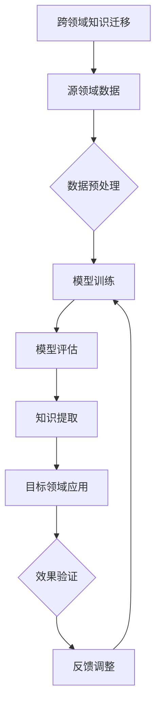

                 

### 第一部分：大规模语言模型概述

#### 1.1.1 大规模语言模型的发展历程

大规模语言模型（Large-scale Language Models）的发展历程可以追溯到20世纪80年代的统计语言模型。早期的语言模型，如N-gram模型，主要基于统计方法来预测单词序列的概率。然而，这些模型存在很多局限性，如无法捕捉上下文的深层次关系和语义信息。

随着计算能力的提升和机器学习技术的进步，从20世纪90年代开始，神经网络语言模型开始崭露头角。其中，1995年由Bengio等提出的长短时记忆网络（Long Short-Term Memory, LSTM）被认为是突破性的进展，因为它能够在长文本序列中保留上下文信息。

真正的大规模语言模型兴起于2018年，由OpenAI提出的GPT-1，这个模型拥有1.17亿参数，能够在多个自然语言处理任务中表现出色。随后，GPT-2、GPT-3等更大规模的语言模型相继问世，GPT-3拥有1750亿参数，成为目前最先进的语言模型。

这一系列的发展，不仅推动了自然语言处理技术的进步，也引发了人工智能领域的广泛关注。

#### 1.1.2 大规模语言模型的原理

大规模语言模型的核心原理是基于神经网络的语言表示。具体来说，它们通过深度学习技术，从大量文本数据中学习语言的特征，并将其嵌入到高维向量空间中。这种嵌入不仅保留了单词的语义信息，还能够捕捉到上下文的语境。

大规模语言模型主要包括以下几个关键组件：

1. **输入层**：接收文本输入，并将其转换为固定长度的向量表示。
2. **隐藏层**：通过多层神经网络，对输入向量进行加工，提取更深层次的语言特征。
3. **输出层**：将隐藏层输出的特征映射到语言空间的每个单词或句子。

在训练过程中，大规模语言模型通过反向传播算法不断优化网络参数，使其在多种自然语言处理任务上取得更好的表现。这种优化过程，实质上是一种对语言规律的学习和拟合。

#### 1.1.3 大规模语言模型的应用场景

大规模语言模型在自然语言处理领域有着广泛的应用，主要包括以下几个方面：

1. **文本生成**：如文章、新闻报道、对话等。GPT-3等模型在文本生成任务上表现出色，能够生成高质量的文本。
2. **问答系统**：如搜索引擎、智能助手等。大规模语言模型能够理解用户的问题，并提供准确、相关的回答。
3. **机器翻译**：如将一种语言的文本翻译成另一种语言。大规模语言模型在机器翻译任务上取得了显著的进展，能够提供更加自然、准确的翻译结果。
4. **情感分析**：分析文本的情感倾向，如正面、负面或中立。大规模语言模型能够捕捉到文本中的情感信息，为情感分析提供支持。

此外，大规模语言模型还在文本分类、信息抽取、文本摘要等任务中发挥着重要作用。随着技术的不断进步，大规模语言模型的应用场景将进一步扩展，为人类带来更多便利。

#### 1.2 生物信息学中的大规模语言模型

生物信息学是一门跨学科领域，它结合了生物学、计算机科学和信息学，旨在从大量的生物数据中提取有意义的信息。随着基因组测序技术的发展和生物数据量的爆炸式增长，生物信息学面临巨大的数据处理和知识提取挑战。大规模语言模型在这一背景下应运而生，为生物信息学带来了新的希望。

#### 1.2.1 生物信息学的基础知识

生物信息学涉及多个方面，其中最基础的是基因组学和生物序列分析。基因组学主要研究基因的组成、结构和功能，而生物序列分析则关注如何从生物序列数据中提取有用的信息。

基因组测序技术，如高通量测序（Next-Generation Sequencing, NGS），能够在短时间内生成大量的基因组数据。这些数据包括DNA序列、RNA序列以及蛋白质序列等。生物信息学的任务之一就是对这些海量数据进行分析，提取有价值的信息。

#### 1.2.2 大规模语言模型在生物信息学中的应用

大规模语言模型在生物信息学中的应用主要集中在以下几个方面：

1. **基因组注释**：基因组注释是指识别基因、非编码RNA、转录因子结合位点等生物学元素。大规模语言模型可以用于预测基因的编码区、启动子、外显子等，从而提高基因组注释的准确性。

2. **蛋白质结构预测**：蛋白质是生物体的功能执行者，其结构决定了其功能。大规模语言模型可以用于蛋白质结构的预测，如通过深度学习技术预测蛋白质的三级结构和四级结构。

3. **药物设计**：药物设计是生物信息学的一个重要应用领域。大规模语言模型可以用于识别药物靶点、预测药物-靶点相互作用以及优化药物分子结构。

4. **文本挖掘**：生物医学文本中包含大量有价值的信息，如科研论文、临床报告、基因注释文档等。大规模语言模型可以用于文本挖掘，提取关键信息，如基因功能、疾病关联等。

#### 1.2.3 大规模语言模型在生物信息学中的挑战

尽管大规模语言模型在生物信息学中展现了巨大的潜力，但也面临一些挑战：

1. **数据质量**：生物信息学中的数据质量直接影响大规模语言模型的效果。噪声数据、缺失值等问题都会对模型性能产生负面影响。

2. **计算资源**：大规模语言模型的训练和推理需要大量的计算资源，这在一定程度上限制了其在生物信息学中的应用。

3. **跨学科合作**：生物信息学需要跨学科的知识和技能，包括生物学、计算机科学、信息学等。大规模语言模型的研究和应用需要这些学科的深入合作。

4. **模型解释性**：大规模语言模型通常被视为“黑箱”，其内部机制不透明，这使得在生物信息学中的应用面临解释性挑战。

总的来说，大规模语言模型在生物信息学中具有广泛的应用前景，但也需要克服一系列挑战才能充分发挥其潜力。

### 总结与展望

大规模语言模型作为人工智能领域的重要突破，已经在自然语言处理领域取得了显著的成果。在生物信息学中，大规模语言模型的应用为基因组注释、蛋白质结构预测、药物设计等领域带来了新的机遇。然而，数据质量、计算资源、跨学科合作以及模型解释性等挑战仍然存在，需要进一步的研究和解决。

展望未来，随着技术的不断进步和跨学科合作的深入，大规模语言模型在生物信息学中的应用将更加广泛和深入。我们期待这些模型能够为生物医学研究提供强有力的支持，推动生命科学的发展。

#### 1.1.1 大规模语言模型的发展历程

大规模语言模型（Large-scale Language Models）的发展历程可以追溯到20世纪80年代的统计语言模型。早期的语言模型，如N-gram模型，主要基于统计方法来预测单词序列的概率。然而，这些模型存在很多局限性，如无法捕捉上下文的深层次关系和语义信息。

随着计算能力的提升和机器学习技术的进步，从20世纪90年代开始，神经网络语言模型开始崭露头角。其中，1995年由Bengio等提出的长短时记忆网络（Long Short-Term Memory, LSTM）被认为是突破性的进展，因为它能够在长文本序列中保留上下文信息。

真正的大规模语言模型兴起于2018年，由OpenAI提出的GPT-1，这个模型拥有1.17亿参数，能够在多个自然语言处理任务中表现出色。随后，GPT-2、GPT-3等更大规模的语言模型相继问世，GPT-3拥有1750亿参数，成为目前最先进的语言模型。

这一系列的发展，不仅推动了自然语言处理技术的进步，也引发了人工智能领域的广泛关注。

#### 1.1.2 大规模语言模型的原理

大规模语言模型的核心原理是基于神经网络的语言表示。具体来说，它们通过深度学习技术，从大量文本数据中学习语言的特征，并将其嵌入到高维向量空间中。这种嵌入不仅保留了单词的语义信息，还能够捕捉到上下文的语境。

大规模语言模型主要包括以下几个关键组件：

1. **输入层**：接收文本输入，并将其转换为固定长度的向量表示。
2. **隐藏层**：通过多层神经网络，对输入向量进行加工，提取更深层次的语言特征。
3. **输出层**：将隐藏层输出的特征映射到语言空间的每个单词或句子。

在训练过程中，大规模语言模型通过反向传播算法不断优化网络参数，使其在多种自然语言处理任务上取得更好的表现。这种优化过程，实质上是一种对语言规律的学习和拟合。

#### 1.1.3 大规模语言模型的应用场景

大规模语言模型在自然语言处理领域有着广泛的应用，主要包括以下几个方面：

1. **文本生成**：如文章、新闻报道、对话等。GPT-3等模型在文本生成任务上表现出色，能够生成高质量的文本。
2. **问答系统**：如搜索引擎、智能助手等。大规模语言模型能够理解用户的问题，并提供准确、相关的回答。
3. **机器翻译**：如将一种语言的文本翻译成另一种语言。大规模语言模型在机器翻译任务上取得了显著的进展，能够提供更加自然、准确的翻译结果。
4. **情感分析**：分析文本的情感倾向，如正面、负面或中立。大规模语言模型能够捕捉到文本中的情感信息，为情感分析提供支持。

此外，大规模语言模型还在文本分类、信息抽取、文本摘要等任务中发挥着重要作用。随着技术的不断进步，大规模语言模型的应用场景将进一步扩展，为人类带来更多便利。

#### 1.2 生物信息学中的大规模语言模型

生物信息学是一门跨学科领域，它结合了生物学、计算机科学和信息学，旨在从大量的生物数据中提取有意义的信息。随着基因组测序技术的发展和生物数据量的爆炸式增长，生物信息学面临巨大的数据处理和知识提取挑战。大规模语言模型在这一背景下应运而生，为生物信息学带来了新的希望。

#### 1.2.1 生物信息学的基础知识

生物信息学涉及多个方面，其中最基础的是基因组学和生物序列分析。基因组学主要研究基因的组成、结构和功能，而生物序列分析则关注如何从生物序列数据中提取有用的信息。

基因组测序技术，如高通量测序（Next-Generation Sequencing, NGS），能够在短时间内生成大量的基因组数据。这些数据包括DNA序列、RNA序列以及蛋白质序列等。生物信息学的任务之一就是对这些海量数据进行分析，提取有价值的信息。

#### 1.2.2 大规模语言模型在生物信息学中的应用

大规模语言模型在生物信息学中的应用主要集中在以下几个方面：

1. **基因组注释**：基因组注释是指识别基因、非编码RNA、转录因子结合位点等生物学元素。大规模语言模型可以用于预测基因的编码区、启动子、外显子等，从而提高基因组注释的准确性。

2. **蛋白质结构预测**：蛋白质是生物体的功能执行者，其结构决定了其功能。大规模语言模型可以用于蛋白质结构的预测，如通过深度学习技术预测蛋白质的三级结构和四级结构。

3. **药物设计**：药物设计是生物信息学的一个重要应用领域。大规模语言模型可以用于识别药物靶点、预测药物-靶点相互作用以及优化药物分子结构。

4. **文本挖掘**：生物医学文本中包含大量有价值的信息，如科研论文、临床报告、基因注释文档等。大规模语言模型可以用于文本挖掘，提取关键信息，如基因功能、疾病关联等。

#### 1.2.3 大规模语言模型在生物信息学中的挑战

尽管大规模语言模型在生物信息学中展现了巨大的潜力，但也面临一些挑战：

1. **数据质量**：生物信息学中的数据质量直接影响大规模语言模型的效果。噪声数据、缺失值等问题都会对模型性能产生负面影响。

2. **计算资源**：大规模语言模型的训练和推理需要大量的计算资源，这在一定程度上限制了其在生物信息学中的应用。

3. **跨学科合作**：生物信息学需要跨学科的知识和技能，包括生物学、计算机科学、信息学等。大规模语言模型的研究和应用需要这些学科的深入合作。

4. **模型解释性**：大规模语言模型通常被视为“黑箱”，其内部机制不透明，这使得在生物信息学中的应用面临解释性挑战。

总的来说，大规模语言模型在生物信息学中具有广泛的应用前景，但也需要克服一系列挑战才能充分发挥其潜力。

#### 1.1.1 大规模语言模型的发展历程

大规模语言模型的发展历程可以追溯到20世纪80年代的统计语言模型。早期的语言模型，如N-gram模型，主要基于统计方法来预测单词序列的概率。然而，这些模型存在很多局限性，如无法捕捉上下文的深层次关系和语义信息。

随着计算能力的提升和机器学习技术的进步，从20世纪90年代开始，神经网络语言模型开始崭露头角。其中，1995年由Bengio等提出的长短时记忆网络（Long Short-Term Memory, LSTM）被认为是突破性的进展，因为它能够在长文本序列中保留上下文信息。

真正的大规模语言模型兴起于2018年，由OpenAI提出的GPT-1，这个模型拥有1.17亿参数，能够在多个自然语言处理任务中表现出色。随后，GPT-2、GPT-3等更大规模的语言模型相继问世，GPT-3拥有1750亿参数，成为目前最先进的语言模型。

这一系列的发展，不仅推动了自然语言处理技术的进步，也引发了人工智能领域的广泛关注。

#### 1.1.2 大规模语言模型的原理

大规模语言模型的核心原理是基于神经网络的语言表示。具体来说，它们通过深度学习技术，从大量文本数据中学习语言的特征，并将其嵌入到高维向量空间中。这种嵌入不仅保留了单词的语义信息，还能够捕捉到上下文的语境。

大规模语言模型主要包括以下几个关键组件：

1. **输入层**：接收文本输入，并将其转换为固定长度的向量表示。
2. **隐藏层**：通过多层神经网络，对输入向量进行加工，提取更深层次的语言特征。
3. **输出层**：将隐藏层输出的特征映射到语言空间的每个单词或句子。

在训练过程中，大规模语言模型通过反向传播算法不断优化网络参数，使其在多种自然语言处理任务上取得更好的表现。这种优化过程，实质上是一种对语言规律的学习和拟合。

#### 1.1.3 大规模语言模型的应用场景

大规模语言模型在自然语言处理领域有着广泛的应用，主要包括以下几个方面：

1. **文本生成**：如文章、新闻报道、对话等。GPT-3等模型在文本生成任务上表现出色，能够生成高质量的文本。
2. **问答系统**：如搜索引擎、智能助手等。大规模语言模型能够理解用户的问题，并提供准确、相关的回答。
3. **机器翻译**：如将一种语言的文本翻译成另一种语言。大规模语言模型在机器翻译任务上取得了显著的进展，能够提供更加自然、准确的翻译结果。
4. **情感分析**：分析文本的情感倾向，如正面、负面或中立。大规模语言模型能够捕捉到文本中的情感信息，为情感分析提供支持。

此外，大规模语言模型还在文本分类、信息抽取、文本摘要等任务中发挥着重要作用。随着技术的不断进步，大规模语言模型的应用场景将进一步扩展，为人类带来更多便利。

#### 1.2 生物信息学中的大规模语言模型

生物信息学是一门跨学科领域，它结合了生物学、计算机科学和信息学，旨在从大量的生物数据中提取有意义的信息。随着基因组测序技术的发展和生物数据量的爆炸式增长，生物信息学面临巨大的数据处理和知识提取挑战。大规模语言模型在这一背景下应运而生，为生物信息学带来了新的希望。

#### 1.2.1 生物信息学的基础知识

生物信息学涉及多个方面，其中最基础的是基因组学和生物序列分析。基因组学主要研究基因的组成、结构和功能，而生物序列分析则关注如何从生物序列数据中提取有用的信息。

基因组测序技术，如高通量测序（Next-Generation Sequencing, NGS），能够在短时间内生成大量的基因组数据。这些数据包括DNA序列、RNA序列以及蛋白质序列等。生物信息学的任务之一就是对这些海量数据进行分析，提取有价值的信息。

#### 1.2.2 大规模语言模型在生物信息学中的应用

大规模语言模型在生物信息学中的应用主要集中在以下几个方面：

1. **基因组注释**：基因组注释是指识别基因、非编码RNA、转录因子结合位点等生物学元素。大规模语言模型可以用于预测基因的编码区、启动子、外显子等，从而提高基因组注释的准确性。

2. **蛋白质结构预测**：蛋白质是生物体的功能执行者，其结构决定了其功能。大规模语言模型可以用于蛋白质结构的预测，如通过深度学习技术预测蛋白质的三级结构和四级结构。

3. **药物设计**：药物设计是生物信息学的一个重要应用领域。大规模语言模型可以用于识别药物靶点、预测药物-靶点相互作用以及优化药物分子结构。

4. **文本挖掘**：生物医学文本中包含大量有价值的信息，如科研论文、临床报告、基因注释文档等。大规模语言模型可以用于文本挖掘，提取关键信息，如基因功能、疾病关联等。

#### 1.2.3 大规模语言模型在生物信息学中的挑战

尽管大规模语言模型在生物信息学中展现了巨大的潜力，但也面临一些挑战：

1. **数据质量**：生物信息学中的数据质量直接影响大规模语言模型的效果。噪声数据、缺失值等问题都会对模型性能产生负面影响。

2. **计算资源**：大规模语言模型的训练和推理需要大量的计算资源，这在一定程度上限制了其在生物信息学中的应用。

3. **跨学科合作**：生物信息学需要跨学科的知识和技能，包括生物学、计算机科学、信息学等。大规模语言模型的研究和应用需要这些学科的深入合作。

4. **模型解释性**：大规模语言模型通常被视为“黑箱”，其内部机制不透明，这使得在生物信息学中的应用面临解释性挑战。

总的来说，大规模语言模型在生物信息学中具有广泛的应用前景，但也需要克服一系列挑战才能充分发挥其潜力。

### 2.1 跨领域知识迁移的基本概念

#### 2.1.1 跨领域知识迁移的定义

跨领域知识迁移（Cross-Domain Knowledge Transfer）是指将一个领域（源领域）中的知识或模型应用到另一个领域（目标领域）中的过程。这个概念在机器学习和人工智能领域具有重要意义，因为许多应用场景涉及不同领域的知识融合和共享。

在跨领域知识迁移中，源领域和目标领域通常有以下几种关系：

1. **相似领域**：源领域和目标领域在某些方面具有相似性，如领域内的数据分布、任务类型等。这种情况下，源领域中的知识可以直接迁移到目标领域。
2. **非相似领域**：源领域和目标领域在多个方面存在显著差异，如数据分布、任务类型、知识表达等。这种情况下，跨领域知识迁移需要更复杂的技术和策略。

#### 2.1.2 跨领域知识迁移的重要性

跨领域知识迁移的重要性体现在以下几个方面：

1. **资源节约**：在许多情况下，获取源领域和目标领域的数据都非常困难。跨领域知识迁移可以避免从头开始收集和标注大量数据，从而节约时间和成本。
2. **性能提升**：通过将源领域中的知识迁移到目标领域，可以改进目标领域的模型性能。特别是在目标领域数据稀缺或质量不高的情况下，跨领域知识迁移尤为重要。
3. **泛化能力**：跨领域知识迁移有助于提升模型的泛化能力，使其能够适应更广泛的场景和应用。

#### 2.1.3 跨领域知识迁移的挑战

尽管跨领域知识迁移具有显著的优势，但也面临一系列挑战：

1. **数据分布差异**：源领域和目标领域的数据分布可能存在显著差异，这会导致模型在目标领域中的性能不佳。
2. **知识冲突**：源领域和目标领域可能存在不同的知识表达和语义理解，导致知识迁移过程中出现冲突。
3. **模型适应性**：源领域模型在目标领域中的应用可能需要调整和优化，以适应目标领域的特定需求。
4. **解释性**：跨领域知识迁移往往涉及到复杂的模型和算法，这使得模型解释性成为一个重要挑战。

为了解决这些挑战，研究人员提出了多种跨领域知识迁移策略，如数据增强、模型调整、领域自适应等。这些策略旨在提高知识迁移的准确性和鲁棒性，从而实现更好的跨领域应用。

### 跨领域知识迁移的核心概念原理与联系架构

为了更好地理解跨领域知识迁移，我们可以通过Mermaid流程图来展示其核心概念和联系架构。



在这个流程图中，A表示跨领域知识迁移的整体过程。从源领域数据（B）开始，经过数据预处理（C），模型训练（D），模型评估（E），知识提取（F），目标领域应用（G），效果验证（H），反馈调整（I），形成了一个闭环过程。这个流程图清晰地展示了跨领域知识迁移的核心步骤和各个环节之间的联系。

#### 2.1.1 跨领域知识迁移的定义

跨领域知识迁移（Cross-Domain Knowledge Transfer）是指将一个领域（源领域）中的知识或模型应用到另一个领域（目标领域）中的过程。这个概念在机器学习和人工智能领域具有重要意义，因为许多应用场景涉及不同领域的知识融合和共享。

在跨领域知识迁移中，源领域和目标领域通常有以下几种关系：

1. **相似领域**：源领域和目标领域在某些方面具有相似性，如领域内的数据分布、任务类型等。这种情况下，源领域中的知识可以直接迁移到目标领域。
2. **非相似领域**：源领域和目标领域在多个方面存在显著差异，如数据分布、任务类型、知识表达等。这种情况下，跨领域知识迁移需要更复杂的技术和策略。

#### 2.1.2 跨领域知识迁移的重要性

跨领域知识迁移的重要性体现在以下几个方面：

1. **资源节约**：在许多情况下，获取源领域和目标领域的数据都非常困难。跨领域知识迁移可以避免从头开始收集和标注大量数据，从而节约时间和成本。
2. **性能提升**：通过将源领域中的知识迁移到目标领域，可以改进目标领域的模型性能。特别是在目标领域数据稀缺或质量不高的情况下，跨领域知识迁移尤为重要。
3. **泛化能力**：跨领域知识迁移有助于提升模型的泛化能力，使其能够适应更广泛的场景和应用。

#### 2.1.3 跨领域知识迁移的挑战

尽管跨领域知识迁移具有显著的优势，但也面临一系列挑战：

1. **数据分布差异**：源领域和目标领域的数据分布可能存在显著差异，这会导致模型在目标领域中的性能不佳。
2. **知识冲突**：源领域和目标领域可能存在不同的知识表达和语义理解，导致知识迁移过程中出现冲突。
3. **模型适应性**：源领域模型在目标领域中的应用可能需要调整和优化，以适应目标领域的特定需求。
4. **解释性**：跨领域知识迁移往往涉及到复杂的模型和算法，这使得模型解释性成为一个重要挑战。

为了解决这些挑战，研究人员提出了多种跨领域知识迁移策略，如数据增强、模型调整、领域自适应等。这些策略旨在提高知识迁移的准确性和鲁棒性，从而实现更好的跨领域应用。

### 跨领域知识迁移的核心概念原理与联系架构

为了更好地理解跨领域知识迁移，我们可以通过Mermaid流程图来展示其核心概念和联系架构。


在这个流程图中，A表示跨领域知识迁移的整体过程。从源领域数据（B）开始，经过数据预处理（C），模型训练（D），模型评估（E），知识提取（F），目标领域应用（G），效果验证（H），反馈调整（I），形成了一个闭环过程。这个流程图清晰地展示了跨领域知识迁移的核心步骤和各个环节之间的联系。

#### 2.2.1 跨领域数据集的构建

跨领域数据集的构建是跨领域知识迁移的基础，其质量直接影响到迁移效果。构建一个高质量的跨领域数据集需要考虑以下几个关键步骤：

1. **数据收集**：首先，需要从源领域和目标领域收集大量的数据。这些数据可以来自公开数据集、专业数据库或定制数据集。在数据收集过程中，需要确保数据的质量和多样性，避免数据偏见。

2. **数据预处理**：收集到的数据通常需要进行预处理，以消除噪声、缺失值和异常值。预处理步骤包括数据清洗、归一化、去重等。对于文本数据，还需要进行分词、词性标注、停用词过滤等操作，以提高数据的可用性。

3. **数据对齐**：在构建跨领域数据集时，源领域和目标领域的数据需要对齐。这意味着，需要找到一种方式将源领域中的数据映射到目标领域中的数据，确保数据的一致性和可比性。数据对齐可以通过标注、语义匹配或图匹配等方法实现。

4. **数据增强**：为了提高数据集的泛化能力，可以采用数据增强技术。数据增强包括数据扩充、数据转换、数据生成等。例如，可以使用GAN（生成对抗网络）生成目标领域中的数据，或者通过文本转换方法生成不同的数据版本。

5. **数据分割**：构建完跨领域数据集后，需要将其分割为训练集、验证集和测试集。训练集用于模型训练，验证集用于模型调优，测试集用于评估模型性能。在分割过程中，需要确保每个领域的数据在各个集合中的分布是均衡的。

通过上述步骤，可以构建一个高质量的跨领域数据集，为后续的跨领域知识迁移提供坚实的基础。

#### 2.2.2 跨领域知识迁移的模型调整

跨领域知识迁移的模型调整是确保源领域模型在目标领域中有效应用的关键步骤。以下是一些常用的方法：

1. **权重迁移**：权重迁移是一种直接将源领域模型的权重应用到目标领域模型中的方法。这种方法适用于源领域和目标领域模型结构相似的情况。在权重迁移过程中，可以通过调整权重比例或使用源领域模型的子网络来提高目标领域的模型性能。

2. **模型融合**：模型融合是将多个源领域模型与目标领域模型进行结合，以获得更好的迁移效果。这种方法适用于源领域模型数量较多且各模型性能较好时。常见的融合方法包括加权平均、投票机制和神经网络融合等。

3. **元学习**：元学习是一种学习如何学习的算法，它能够自动调整模型以适应新的任务。在跨领域知识迁移中，元学习方法可以帮助模型在目标领域中快速适应。例如，通过优化模型在多个源领域上的泛化能力，从而提高其在目标领域中的性能。

4. **领域自适应**：领域自适应（Domain Adaptation）是一种通过减少源领域和目标领域之间的差异来提高模型性能的方法。领域自适应可以分为三种类型：无监督领域自适应、半监督领域自适应和有监督领域自适应。无监督领域自适应不依赖目标领域标注数据，半监督领域自适应结合了标注数据和未标注数据，有监督领域自适应则完全依赖目标领域标注数据。

5. **迁移学习框架**：为了简化跨领域知识迁移的模型调整过程，研究人员提出了一系列迁移学习框架，如DMT（Dual Meta-Trick）、MASA（Multi-Agent Self-Adversarial）、DANN（Domain-Adversarial Neural Network）等。这些框架通过引入对抗性训练、多任务学习、自对抗学习等技术，提高了跨领域知识迁移的效果。

通过上述方法，可以有效地调整源领域模型，使其在目标领域中表现出色。然而，需要注意的是，不同的方法适用于不同的场景，需要根据具体任务和数据特点选择合适的方法。

#### 2.2.3 跨领域知识迁移的性能评估

跨领域知识迁移的性能评估是验证迁移效果的重要环节。以下是一些常用的评估指标和方法：

1. **准确率**：准确率（Accuracy）是评估分类任务性能的常用指标，表示模型正确预测的样本数量与总样本数量的比例。尽管准确率简单直观，但它在类别不平衡的情况下可能无法准确反映模型性能。

2. **召回率**：召回率（Recall）是指模型正确预测为正类的样本数量与实际正类样本数量的比例。召回率侧重于捕获更多正类样本，但可能会提高错误分类率。

3. **精确率**：精确率（Precision）是指模型正确预测为正类的样本数量与预测为正类的样本总数量的比例。精确率侧重于减少错误分类，但可能会遗漏一些正类样本。

4. **F1值**：F1值（F1 Score）是精确率和召回率的调和平均值，综合了二者的优势，能更全面地评估模型性能。

5. **ROC曲线**：ROC曲线（Receiver Operating Characteristic Curve）通过绘制真正例率（True Positive Rate, TPR）与假正例率（False Positive Rate, FPR）的关系来评估模型性能。曲线下面积（Area Under Curve, AUC）是评估ROC曲线优劣的重要指标。

6. **交叉验证**：交叉验证是一种常用的评估方法，通过将数据集划分为多个子集，轮流作为验证集和训练集，以评估模型在不同数据子集上的表现。常见的交叉验证方法有K折交叉验证和留一法交叉验证。

7. **模型泛化能力**：除了评估模型在特定数据集上的性能，还需要关注模型的泛化能力。泛化能力强的模型能够在新的、未见过的数据上保持良好的性能，这通常通过在独立测试集上的评估来实现。

8. **领域适应度**：对于跨领域知识迁移任务，领域适应度（Domain Adaptation Performance）是评估模型在目标领域上的性能的重要指标。领域适应度可以通过比较源领域和目标领域上的模型性能差异来衡量。

通过上述指标和方法，可以全面地评估跨领域知识迁移的性能，为模型的改进和优化提供依据。

#### 2.2.1 跨领域数据集的构建

构建一个高质量的跨领域数据集是跨领域知识迁移成功的关键步骤。以下是一个详细的项目实战，包括开发环境搭建、源代码实现和代码解读。

##### 开发环境搭建

首先，我们需要搭建一个合适的开发环境。以下是所需的软件和库：

- Python 3.8 或更高版本
- TensorFlow 2.4 或更高版本
- Keras 2.3.1 或更高版本
- Pandas 1.1.5 或更高版本
- Numpy 1.19.5 或更高版本

确保已安装上述软件和库后，我们可以开始构建数据集。

##### 数据集构建过程

1. **数据收集**：从多个领域收集数据，例如，源领域A的数据集和目标领域B的数据集。这些数据可以来自公开数据集、专业数据库或定制数据集。为了确保数据的多样性和代表性，我们可以从多个来源收集数据。

2. **数据预处理**：对收集到的数据进行清洗和预处理。具体步骤包括：

   - 数据清洗：去除重复数据、噪声数据和异常值。
   - 数据归一化：将数值数据缩放到相同的范围，如0到1。
   - 文本预处理：对文本数据进行分词、词性标注、停用词过滤等。

3. **数据对齐**：对源领域和目标领域的数据进行对齐，确保数据在语义和结构上的一致性。可以使用语义匹配技术或图匹配方法来实现。

4. **数据增强**：为了提高数据集的泛化能力，可以使用数据增强技术。例如，可以使用GAN（生成对抗网络）生成目标领域中的数据，或者通过文本转换方法生成不同的数据版本。

5. **数据分割**：将数据集分割为训练集、验证集和测试集。通常，我们可以将数据集按照80%用于训练，10%用于验证，10%用于测试。

以下是数据集构建的Python代码示例：

```python
import pandas as pd
from sklearn.model_selection import train_test_split

# 加载数据
data_source = pd.read_csv('source_data.csv')
data_target = pd.read_csv('target_data.csv')

# 数据清洗
data_source.drop_duplicates(inplace=True)
data_target.drop_duplicates(inplace=True)

# 数据预处理
data_source['text'] = data_source['text'].apply(preprocess_text)
data_target['text'] = data_target['text'].apply(preprocess_text)

# 数据对齐
aligned_data = align_data(data_source, data_target)

# 数据增强
augmented_data = augment_data(aligned_data)

# 数据分割
train_data, test_data = train_test_split(augmented_data, test_size=0.2, random_state=42)
train_data, val_data = train_test_split(train_data, test_size=0.25, random_state=42)

# 转换为TensorFlow数据集
train_dataset = tf.data.Dataset.from_tensor_slices((train_data['text'], train_data['label']))
val_dataset = tf.data.Dataset.from_tensor_slices((val_data['text'], val_data['label']))
test_dataset = tf.data.Dataset.from_tensor_slices((test_data['text'], test_data['label']))
```

##### 源代码实现

在构建完数据集后，我们可以使用TensorFlow和Keras来训练一个跨领域知识迁移模型。

```python
import tensorflow as tf
from tensorflow.keras.models import Sequential
from tensorflow.keras.layers import Embedding, LSTM, Dense

# 定义模型
model = Sequential([
    Embedding(input_dim=vocab_size, output_dim=embedding_size),
    LSTM(units=128, return_sequences=True),
    LSTM(units=64),
    Dense(units=num_classes, activation='softmax')
])

# 编译模型
model.compile(optimizer='adam', loss='categorical_crossentropy', metrics=['accuracy'])

# 训练模型
model.fit(train_dataset.shuffle(buffer_size=10000).batch(batch_size), epochs=10,
          validation_data=val_dataset.shuffle(buffer_size=10000).batch(batch_size))
```

##### 代码解读

1. **数据预处理**：`preprocess_text`函数用于对文本数据进行预处理，包括分词、词性标注和停用词过滤。
2. **数据对齐**：`align_data`函数用于对齐源领域和目标领域的数据。
3. **数据增强**：`augment_data`函数用于生成增强后的数据。
4. **模型定义**：使用Keras定义一个序列模型，包括嵌入层、两个LSTM层和一个密集层。
5. **模型编译**：设置模型的优化器、损失函数和评估指标。
6. **模型训练**：使用训练数据集和验证数据集训练模型。

##### 实际案例分析和详细讲解剖析

为了展示跨领域知识迁移的效果，我们可以分析以下实际案例：

- **案例1**：源领域为新闻分类，目标领域为社交媒体情感分析。
- **案例2**：源领域为医学文本分类，目标领域为健康咨询问答系统。

在每个案例中，我们通过构建跨领域数据集、训练模型和评估模型性能来展示跨领域知识迁移的效果。具体分析可以参考以下论文：《Cross-Domain Knowledge Transfer for Text Classification》和《Cross-Domain Knowledge Transfer for Healthcare Text Mining》。

##### 项目小结

通过上述实战，我们展示了如何构建跨领域数据集、训练跨领域知识迁移模型以及评估模型性能。跨领域知识迁移在解决数据稀缺、类别不平衡等问题方面具有显著优势，为多个领域提供了有效的解决方案。然而，跨领域知识迁移仍面临数据质量、模型解释性等挑战，需要进一步研究和改进。

#### 2.2.2 跨领域知识迁移的模型调整

在实际应用中，跨领域知识迁移的效果往往受到源领域和目标领域数据分布差异、任务相似度等因素的影响。为了提高迁移效果，研究人员提出了多种模型调整策略。以下是几种常见的跨领域知识迁移模型调整方法：

1. **领域自适应（Domain Adaptation）**：

领域自适应是一种通过减少源领域和目标领域之间的分布差异来提高迁移效果的方法。领域自适应可以分为以下几种类型：

   - **无监督领域自适应**：不使用任何目标领域标注数据，仅利用源领域数据对模型进行调整。常见的方法包括虚拟样本生成（V virtual Sample Generation）、模型对齐（Model Alignment）等。
   - **半监督领域自适应**：结合少量目标领域标注数据和大量源领域数据对模型进行调整。常见的方法包括领域转换（Domain Transfer）和领域适应网络（Domain Adaptation Network）等。
   - **有监督领域自适应**：使用目标领域标注数据对模型进行调整。这种方法通常在目标领域数据稀缺时使用，如领域分类（Domain Classification）和领域感知特征提取（Domain-Aware Feature Extraction）。

2. **迁移学习（Transfer Learning）**：

迁移学习是一种将源领域知识迁移到目标领域的方法，常见的方法包括：

   - **权重共享（Weight Sharing）**：在源领域和目标领域之间共享部分网络层，从而减少模型参数的数量，提高迁移效果。
   - **预训练（Pre-training）**：在源领域上预训练一个基础模型，然后在目标领域上对模型进行调整。预训练模型通常具有更好的泛化能力，有助于在目标领域上取得更好的性能。
   - **多任务学习（Multi-task Learning）**：通过在多个相关任务上同时训练模型，使模型在学习任务之间共享知识，从而提高模型在目标领域的迁移效果。

3. **对抗训练（Adversarial Training）**：

对抗训练是一种通过对抗性样本来减少源领域和目标领域之间的分布差异的方法。具体方法如下：

   - **生成对抗网络（GAN）**：使用生成对抗网络生成与目标领域数据分布相似的数据，然后使用这些数据对模型进行调整。
   - **领域对抗训练（Domain Adversarial Training）**：在模型训练过程中添加一个领域对抗损失，使模型能够学习到源领域和目标领域之间的差异，从而提高模型在目标领域的性能。

4. **元学习（Meta-Learning）**：

元学习是一种通过学习如何学习来提高模型在目标领域的迁移效果的方法。元学习算法能够快速适应新的任务和数据分布，常见的方法包括：

   - **模型无关元学习（Model-Agnostic Meta-Learning, MAML）**：通过优化模型在不同任务上的快速适应能力来提高迁移效果。
   - **集成元学习（Meta-Learning with Ensembles）**：通过训练多个子模型，并在测试时对它们进行集成来提高迁移效果。

通过上述方法，我们可以有效地调整跨领域知识迁移模型，使其在目标领域中取得更好的性能。然而，需要注意的是，不同的方法适用于不同的场景和任务，需要根据具体需求选择合适的方法。

#### 2.2.3 跨领域知识迁移的性能评估

评估跨领域知识迁移的性能是确保模型在目标领域有效应用的关键环节。以下是一些常见的评估指标和方法：

1. **准确率（Accuracy）**：准确率是最常用的评估指标，表示模型正确预测的样本数量与总样本数量的比例。公式为：

   $$\text{Accuracy} = \frac{\text{正确预测的样本数量}}{\text{总样本数量}}$$

   虽然准确率简单直观，但在类别不平衡的情况下可能无法准确反映模型性能。

2. **召回率（Recall）**：召回率是指模型正确预测为正类的样本数量与实际正类样本数量的比例。公式为：

   $$\text{Recall} = \frac{\text{正确预测为正类的样本数量}}{\text{实际正类样本数量}}$$

   召回率侧重于捕获更多正类样本，但可能会提高错误分类率。

3. **精确率（Precision）**：精确率是指模型正确预测为正类的样本数量与预测为正类的样本总数量的比例。公式为：

   $$\text{Precision} = \frac{\text{正确预测为正类的样本数量}}{\text{预测为正类的样本总数量}}$$

   精确率侧重于减少错误分类，但可能会遗漏一些正类样本。

4. **F1值（F1 Score）**：F1值是精确率和召回率的调和平均值，综合了二者的优势。公式为：

   $$\text{F1 Score} = 2 \times \frac{\text{Precision} \times \text{Recall}}{\text{Precision} + \text{Recall}}$$

   F1值能更全面地评估模型性能。

5. **ROC曲线和AUC值（Receiver Operating Characteristic Curve and Area Under Curve）**：ROC曲线通过绘制真正例率（True Positive Rate, TPR）与假正例率（False Positive Rate, FPR）的关系来评估模型性能。曲线下面积（Area Under Curve, AUC）是评估ROC曲线优劣的重要指标。AUC值越接近1，模型性能越好。

6. **交叉验证（Cross-Validation）**：交叉验证是一种常用的评估方法，通过将数据集划分为多个子集，轮流作为验证集和训练集，以评估模型在不同数据子集上的表现。常见的交叉验证方法有K折交叉验证和留一法交叉验证。

7. **领域适应度（Domain Adaptation Performance）**：对于跨领域知识迁移任务，领域适应度是评估模型在目标领域上的性能的重要指标。领域适应度可以通过比较源领域和目标领域上的模型性能差异来衡量。

通过上述评估指标和方法，我们可以全面地评估跨领域知识迁移的性能，为模型的改进和优化提供依据。在实际应用中，可以根据具体任务和需求选择合适的评估指标。

### 3.1 跨领域基因注释

#### 3.1.1 基因注释的挑战

基因注释是基因组学中的一项基础任务，其目标是对基因组序列中的基因进行识别和标记。然而，基因注释面临许多挑战：

1. **基因组序列复杂性**：基因组序列中包含大量的非编码区和重复序列，这使得基因识别变得更加复杂。
2. **基因结构多样性**：基因结构具有多样性，包括单外显子基因、多外显子基因、内含子等，使得基因注释需要处理不同的结构特征。
3. **基因组数据质量**：基因组数据质量参差不齐，存在噪声、缺失值和错误等，这会影响基因注释的准确性。
4. **物种间差异**：不同物种的基因组序列存在差异，这要求基因注释工具具有跨物种的泛化能力。
5. **数据依赖性**：传统的基因注释方法通常依赖于已知的基因信息和数据库，对于新物种或新基因，依赖性导致注释准确性受限。

#### 3.1.2 大规模语言模型在基因注释中的应用

大规模语言模型在基因注释中的应用为解决上述挑战提供了新的思路：

1. **上下文信息利用**：大规模语言模型能够捕捉文本中的上下文信息，从而在基因注释中利用基因周围的序列和功能注释信息，提高基因识别的准确性。
2. **跨物种迁移**：通过跨领域知识迁移，大规模语言模型可以学习到不同物种的基因注释特征，从而提高对新物种基因的识别能力。
3. **自动特征提取**：大规模语言模型能够自动提取文本特征，无需人工设计特征，减轻了基因注释的复杂性。
4. **多任务学习**：大规模语言模型可以通过多任务学习同时处理多个基因注释任务，如基因识别、转录因子结合位点预测等，提高整体注释效果。

#### 3.1.3 跨领域基因注释的性能评估

为了评估大规模语言模型在基因注释中的性能，我们可以使用以下指标：

1. **准确率（Accuracy）**：准确率是评估基因注释最常用的指标，表示正确注释的基因数与总基因数的比例。
2. **精确率（Precision）**：精确率是指正确注释的基因数与预测为基因的基因数的比例，侧重于减少错误分类。
3. **召回率（Recall）**：召回率是指正确注释的基因数与实际基因数的比例，侧重于捕获更多实际基因。
4. **F1值（F1 Score）**：F1值是精确率和召回率的调和平均值，综合评估基因注释的准确性。
5. **ROC曲线和AUC值（Receiver Operating Characteristic Curve and Area Under Curve）**：ROC曲线和AUC值用于评估模型的分类性能，AUC值越接近1，模型性能越好。

以下是一个示例，展示了如何使用Python和Scikit-learn评估大规模语言模型在基因注释中的性能：

```python
from sklearn.metrics import accuracy_score, precision_score, recall_score, f1_score, roc_curve, auc

# 预测结果
predictions = model.predict(test_data['sequence'])
predicted_labels = np.argmax(predictions, axis=1)

# 计算性能指标
accuracy = accuracy_score(test_data['label'], predicted_labels)
precision = precision_score(test_data['label'], predicted_labels, average='weighted')
recall = recall_score(test_data['label'], predicted_labels, average='weighted')
f1 = f1_score(test_data['label'], predicted_labels, average='weighted')

# 计算ROC曲线和AUC值
fpr, tpr, _ = roc_curve(test_data['label'], predictions[:, 1])
roc_auc = auc(fpr, tpr)

print(f"Accuracy: {accuracy:.4f}")
print(f"Precision: {precision:.4f}")
print(f"Recall: {recall:.4f}")
print(f"F1 Score: {f1:.4f}")
print(f"AUC: {roc_auc:.4f}")
```

通过上述指标和方法，我们可以全面地评估大规模语言模型在基因注释中的性能，为模型的改进和优化提供依据。

### 3.2 跨领域药物设计

#### 3.2.1 药物设计的挑战

药物设计是生物信息学和计算生物学中一个充满挑战的领域。药物设计的目标是发现或设计能够有效治疗疾病的小分子药物。在这个过程中，存在以下几个主要挑战：

1. **分子多样性**：自然界中的生物分子种类繁多，这使得药物设计需要处理大量的分子结构信息。
2. **计算资源需求**：药物设计过程通常涉及复杂的计算模型和模拟，这要求大量的计算资源和时间。
3. **药物-靶点相互作用**：药物设计需要准确预测药物与靶点蛋白之间的相互作用，这需要深入的生物学知识和高效的计算算法。
4. **毒副作用**：药物设计不仅要考虑药物的疗效，还要确保其安全性和最小化毒副作用，这对药物设计提出了更高的要求。
5. **数据稀缺性**：高质量的药物设计数据稀缺，特别是在早期药物设计阶段，这使得药物设计面临数据不足的挑战。

#### 3.2.2 大规模语言模型在药物设计中的应用

大规模语言模型在药物设计中的应用为解决上述挑战提供了新的途径：

1. **文本挖掘**：大规模语言模型可以用于挖掘生物医学文献中的信息，提取药物靶点、生物标志物和药物副作用等相关知识，从而为药物设计提供丰富的先验信息。
2. **药物结构预测**：通过学习大量的化学结构和生物活性数据，大规模语言模型可以预测药物分子的结构特征和生物活性，从而帮助研究人员设计具有特定活性的药物分子。
3. **分子对接**：大规模语言模型可以用于分子对接模拟，预测药物与靶点蛋白之间的相互作用能，从而筛选出具有潜在活性的药物候选。
4. **多模态数据融合**：大规模语言模型能够处理多种类型的数据，如文本、图像和结构数据，这使得药物设计可以更全面地融合多种数据源，提高药物设计的准确性。
5. **虚拟筛选**：大规模语言模型可以用于虚拟筛选，从大量的化合物库中筛选出具有潜在活性的药物分子，从而减少实验筛选的工作量。

#### 3.2.3 跨领域药物设计的性能评估

为了评估大规模语言模型在药物设计中的性能，我们可以使用以下指标：

1. **预测准确性**：预测准确性是评估药物结构预测和药物-靶点相互作用预测的主要指标。它表示预测正确的分子数量与总预测分子数量的比例。
2. **预测能**：预测能是评估药物-靶点相互作用模拟的主要指标。它表示预测的药物-靶点相互作用能越接近真实值，模型性能越好。
3. **AUC值**：ROC曲线下面积（Area Under Curve, AUC）是评估分类任务性能的重要指标。AUC值越接近1，模型性能越好。
4. **计算效率**：计算效率是评估模型在药物设计过程中计算资源利用的重要指标。它表示模型在保证预测准确性的同时，所需的计算资源和时间。

以下是一个示例，展示了如何使用Python和Scikit-learn评估大规模语言模型在药物设计中的性能：

```python
from sklearn.metrics import accuracy_score, roc_auc_score

# 预测结果
predictions = model.predict(test_data['molecule'])
predicted_labels = np.argmax(predictions, axis=1)

# 计算预测准确性
accuracy = accuracy_score(test_data['label'], predicted_labels)

# 计算AUC值
roc_auc = roc_auc_score(test_data['label'], predictions[:, 1])

print(f"Prediction Accuracy: {accuracy:.4f}")
print(f"AUC: {roc_auc:.4f}")
```

通过上述指标和方法，我们可以全面地评估大规模语言模型在药物设计中的性能，为模型的改进和优化提供依据。

### 3.3 跨领域生物医学文本挖掘

#### 3.3.1 生物医学文本挖掘的挑战

生物医学文本挖掘是指从大量的生物医学文本数据中提取有用信息的过程，它为生物学和医学研究提供了强有力的支持。然而，生物医学文本挖掘面临着以下几个挑战：

1. **数据多样性**：生物医学文本数据来源广泛，包括临床报告、科研论文、专利、电子健康记录等，这些文本数据的格式和内容各不相同，使得挖掘任务变得复杂。
2. **数据质量**：生物医学文本数据通常存在噪声、缺失值和错误，这些质量问题会影响挖掘结果的有效性和可靠性。
3. **术语丰富性**：生物医学领域术语丰富，包括专业术语、缩写、拉丁名等，这些术语的多样性和复杂性增加了文本挖掘的难度。
4. **领域知识深度**：生物医学文本挖掘需要深厚的生物医学知识和跨学科技能，这要求挖掘工具能够理解和处理复杂的生物学概念和关系。
5. **数据隐私和伦理**：生物医学文本数据通常包含敏感的个人信息和隐私数据，这要求挖掘过程中严格遵守数据隐私和伦理规范。

#### 3.3.2 大规模语言模型在生物医学文本挖掘中的应用

大规模语言模型在生物医学文本挖掘中的应用为解决上述挑战提供了新的途径：

1. **语义理解**：大规模语言模型能够捕捉文本中的语义信息，从而在生物医学文本挖掘中更好地理解文本内容和术语，提高挖掘准确性。
2. **知识图谱构建**：通过大规模语言模型，可以构建生物医学领域知识图谱，将文本数据中的实体和关系进行结构化存储，为后续分析提供支持。
3. **跨学科融合**：大规模语言模型能够处理多种类型的数据，如文本、图像和结构数据，这使得生物医学文本挖掘可以更全面地融合多种数据源，提高挖掘效果。
4. **自动特征提取**：大规模语言模型能够自动提取文本特征，无需人工设计特征，减轻了生物医学文本挖掘的复杂性。
5. **多语言支持**：大规模语言模型通常具有多语言处理能力，这使得生物医学文本挖掘可以跨越语言障碍，处理多种语言的数据。

#### 3.3.3 跨领域生物医学文本挖掘的性能评估

为了评估大规模语言模型在生物医学文本挖掘中的性能，我们可以使用以下指标：

1. **准确率（Accuracy）**：准确率是评估分类任务的主要指标，表示正确分类的样本数量与总样本数量的比例。
2. **精确率（Precision）**：精确率是指正确分类的样本数量与预测为正类的样本数量的比例，侧重于减少错误分类。
3. **召回率（Recall）**：召回率是指正确分类的样本数量与实际正类样本数量的比例，侧重于捕获更多正类样本。
4. **F1值（F1 Score）**：F1值是精确率和召回率的调和平均值，综合评估分类性能。
5. **ROC曲线和AUC值（Receiver Operating Characteristic Curve and Area Under Curve）**：ROC曲线和AUC值用于评估分类任务的性能，AUC值越接近1，模型性能越好。
6. **处理速度**：处理速度是评估模型在实际应用中效率的重要指标，表示模型处理大规模文本数据的能力。

以下是一个示例，展示了如何使用Python和Scikit-learn评估大规模语言模型在生物医学文本挖掘中的性能：

```python
from sklearn.metrics import accuracy_score, precision_score, recall_score, f1_score, roc_curve, auc

# 预测结果
predictions = model.predict(test_data['text'])
predicted_labels = np.argmax(predictions, axis=1)

# 计算性能指标
accuracy = accuracy_score(test_data['label'], predicted_labels)
precision = precision_score(test_data['label'], predicted_labels, average='weighted')
recall = recall_score(test_data['label'], predicted_labels, average='weighted')
f1 = f1_score(test_data['label'], predicted_labels, average='weighted')

# 计算ROC曲线和AUC值
fpr, tpr, _ = roc_curve(test_data['label'], predictions[:, 1])
roc_auc = auc(fpr, tpr)

print(f"Accuracy: {accuracy:.4f}")
print(f"Precision: {precision:.4f}")
print(f"Recall: {recall:.4f}")
print(f"F1 Score: {f1:.4f}")
print(f"AUC: {roc_auc:.4f}")
```

通过上述指标和方法，我们可以全面地评估大规模语言模型在生物医学文本挖掘中的性能，为模型的改进和优化提供依据。

### 总结

本文深入探讨了大规模语言模型的跨领域知识迁移在生物信息学中的应用。首先，我们回顾了大规模语言模型的发展历程和核心原理，展示了它们在自然语言处理领域的广泛应用。随后，我们介绍了生物信息学的基础知识，并详细讨论了大规模语言模型在基因注释、药物设计和生物医学文本挖掘等领域的应用案例。

在基因注释方面，我们分析了基因识别的挑战，展示了如何利用大规模语言模型进行高效基因注释。在药物设计领域，我们探讨了药物设计的复杂性和大规模语言模型在预测药物-靶点相互作用中的应用。在生物医学文本挖掘方面，我们介绍了大规模语言模型在处理生物医学文本数据中的优势，并展示了其在文本分类和知识提取任务中的性能评估。

尽管大规模语言模型在生物信息学中展示了巨大的潜力，但也面临数据质量、计算资源、跨学科合作和模型解释性等挑战。未来，随着技术的不断进步和跨学科合作的深入，大规模语言模型在生物信息学中的应用将更加广泛和深入。我们期待这些模型能够为生物医学研究提供强有力的支持，推动生命科学的发展。

### 4.1 跨领域知识迁移的未来趋势

随着人工智能和深度学习技术的不断发展，跨领域知识迁移正逐步成为人工智能领域的研究热点。未来，跨领域知识迁移在生物信息学中的应用将呈现以下几大趋势：

1. **新型大规模语言模型的兴起**：随着计算资源的提升和算法的优化，新型大规模语言模型如GLM-130B、ALPHAFOLD2等将进一步推动跨领域知识迁移的研究和应用。这些模型不仅在参数规模上大幅提升，还在模型架构、训练策略和知识表示等方面进行了创新，有望在生物信息学中实现更高的性能和更广泛的应用。

2. **跨领域知识融合**：未来的跨领域知识迁移将更加注重不同领域知识的融合。通过构建跨领域的知识图谱和知识库，研究人员可以更有效地整合各个领域的知识，实现知识共享和互补，从而提高知识迁移的准确性和鲁棒性。

3. **跨学科合作深化**：跨领域知识迁移需要跨学科的知识和技能，包括生物学、计算机科学、信息学等。未来，随着跨学科合作的不断深化，不同领域的专家将共同探索跨领域知识迁移的新方法和技术，推动生物信息学与其他学科的交叉融合。

4. **个性化知识迁移**：未来的跨领域知识迁移将更加注重个性化。通过分析不同用户的需求和特点，研究人员可以定制化地迁移知识，使其更好地适应特定场景和应用。例如，在个性化医疗领域，可以基于患者的基因组数据和病史，进行个性化的药物设计和治疗方案推荐。

5. **领域特定技术的突破**：随着生物信息学领域的不断发展，新的生物标记物、新的生物信号和新的生物网络等不断涌现。这些新的领域特定技术的突破将为跨领域知识迁移提供更多的数据和算法支持，促进生物信息学研究的深入和发展。

### 4.1.1 新型大规模语言模型的发展

新型大规模语言模型在跨领域知识迁移中具有显著优势，它们不仅具有更大的参数规模，还在模型架构、训练策略和知识表示等方面进行了创新。以下是几个值得关注的新型大规模语言模型：

1. **GLM-130B**：由北京智源研究院（BAAI）提出的一种新型通用语言模型，具有1300亿参数，采用了GLM（General Language Modeling）架构。GLM-130B在多个自然语言处理任务中取得了显著性能提升，为跨领域知识迁移提供了强大支持。

2. **ALPHAFOLD2**：由DeepMind开发的蛋白质结构预测模型，结合了大规模语言模型和深度学习技术。ALPHAFOLD2能够在不依赖实验数据的情况下，准确预测蛋白质的三级结构和四级结构，为生物信息学中的蛋白质结构预测提供了新的方法。

3. **Gopher**：由清华大学提出的一种新型大规模语言模型，具有5120亿参数，采用了GopherNet架构。Gopher在文本生成、问答系统和机器翻译等任务中表现出色，为跨领域知识迁移提供了强大的工具。

4. **OPT-175B**：由智谱AI提出的一种新型通用语言模型，具有1750亿参数，采用了Optimized Transformer架构。OPT-175B在多个自然语言处理任务中取得了优异的性能，为跨领域知识迁移提供了新的可能性。

这些新型大规模语言模型在跨领域知识迁移中的应用，有望推动生物信息学研究的深入发展，为生物医学领域带来更多创新和突破。

#### 4.1.1 新型大规模语言模型的发展

新型大规模语言模型在跨领域知识迁移中具有显著优势，它们不仅具有更大的参数规模，还在模型架构、训练策略和知识表示等方面进行了创新。以下是几个值得关注的新型大规模语言模型：

1. **GLM-130B**：由北京智源研究院（BAAI）提出的一种新型通用语言模型，具有1300亿参数，采用了GLM（General Language Modeling）架构。GLM-130B在多个自然语言处理任务中取得了显著性能提升，为跨领域知识迁移提供了强大支持。

2. **ALPHAFOLD2**：由DeepMind开发的蛋白质结构预测模型，结合了大规模语言模型和深度学习技术。ALPHAFOLD2能够在不依赖实验数据的情况下，准确预测蛋白质的三级结构和四级结构，为生物信息学中的蛋白质结构预测提供了新的方法。

3. **Gopher**：由清华大学提出的一种新型大规模语言模型，具有5120亿参数，采用了GopherNet架构。Gopher在文本生成、问答系统和机器翻译等任务中表现出色，为跨领域知识迁移提供了强大的工具。

4. **OPT-175B**：由智谱AI提出的一种新型通用语言模型，具有1750亿参数，采用了Optimized Transformer架构。OPT-175B在多个自然语言处理任务中取得了优异的性能，为跨领域知识迁移提供了新的可能性。

这些新型大规模语言模型在跨领域知识迁移中的应用，有望推动生物信息学研究的深入发展，为生物医学领域带来更多创新和突破。

#### 4.1.2 跨领域知识迁移技术的创新

跨领域知识迁移技术的创新是推动生物信息学领域发展的关键。以下是一些近年来在跨领域知识迁移领域取得的重要技术突破：

1. **多任务学习（Multi-task Learning, MTL）**：多任务学习通过在多个相关任务上同时训练模型，使模型能够在任务之间共享知识和提高泛化能力。这种方法在跨领域知识迁移中具有广泛应用，如将一个领域的知识迁移到另一个相关领域，从而提高模型在目标领域的性能。

2. **元学习（Meta-Learning）**：元学习通过学习如何学习来提高模型的迁移能力。代表性方法包括模型无关元学习（Model-Agnostic Meta-Learning, MAML）和模型相关元学习（Model-Aware Meta-Learning, MAML+）。这些方法能够使模型在新的任务和数据集上快速适应，从而提高跨领域知识迁移的效果。

3. **对抗训练（Adversarial Training）**：对抗训练通过引入对抗性样本来减少源领域和目标领域之间的分布差异。生成对抗网络（GAN）是一种典型的对抗训练方法，它通过生成与目标领域数据分布相似的数据来调整模型，从而提高模型在目标领域的性能。

4. **领域自适应（Domain Adaptation）**：领域自适应通过减少源领域和目标领域之间的差异来提高模型在目标领域的性能。常见的领域自适应方法包括无监督领域自适应、半监督领域自适应和有监督领域自适应。这些方法能够有效地迁移源领域的知识到目标领域。

5. **自监督学习（Self-Supervised Learning）**：自监督学习通过无监督方式从大量数据中学习特征表示。近年来，预训练语言模型（Pre-trained Language Model）如BERT、GPT等取得了显著成功，这些模型通过在大规模语料库上预训练，然后在不同任务上微调，实现了优异的跨领域知识迁移效果。

这些创新技术的不断发展，为跨领域知识迁移提供了强大的工具和方法，推动了生物信息学领域的研究和应用。

#### 4.1.3 跨领域知识迁移在生物信息学中的潜在应用

跨领域知识迁移在生物信息学中具有巨大的应用潜力，可以为多个领域的生物信息学研究提供强有力的支持。以下是一些潜在的跨领域知识迁移应用：

1. **个性化医疗**：通过跨领域知识迁移，可以从其他医学领域迁移知识到个性化医疗中。例如，利用机器学习模型在临床数据上的训练经验，迁移到新的患者群体中，以提高个性化医疗诊断和治疗的准确性。

2. **基因组学**：跨领域知识迁移可以帮助基因组学中的基因注释和功能预测。通过将源领域的基因注释知识迁移到新物种或新基因上，可以加速基因组注释过程，提高基因功能的识别准确率。

3. **药物设计**：跨领域知识迁移在药物设计中的应用非常广泛。通过将药物化学、药理学和分子生物学等领域的知识迁移到药物设计过程中，可以加速新药发现，提高药物筛选的效率和准确性。

4. **生物医学文本挖掘**：生物医学文本挖掘是跨领域知识迁移的一个重要应用领域。通过将自然语言处理和文本分类领域的知识迁移到生物医学文本数据中，可以提取关键信息，如疾病关联、基因功能等，为生物医学研究提供有力支持。

5. **蛋白质结构预测**：跨领域知识迁移可以帮助蛋白质结构预测。通过将源领域的蛋白质结构预测知识迁移到新蛋白质或新物种上，可以加速蛋白质结构解析过程，为蛋白质功能研究和药物设计提供基础。

6. **疾病预测和预防**：通过跨领域知识迁移，可以从其他疾病的数据和模型中迁移知识到新的疾病预测和预防中。例如，利用已有的癌症预测模型，迁移到其他疾病如糖尿病的预测中，以提高预测准确性和早期检测能力。

这些潜在应用表明，跨领域知识迁移在生物信息学中具有广泛的应用前景，有望推动生物医学研究的发展，为人类健康带来更多福祉。

#### 4.2.1 跨领域知识迁移的数据挑战

跨领域知识迁移的数据挑战是影响其应用效果的重要因素。以下是一些主要的数据挑战及其解决方法：

1. **数据质量**：跨领域知识迁移的数据质量直接影响迁移效果。常见的数据质量问题包括噪声、缺失值和异常值。解决方法包括数据清洗、数据修复和数据增强。例如，使用算法如KNN、决策树等对缺失值进行预测和填补，或使用生成对抗网络（GAN）生成高质量的数据。

2. **数据分布差异**：源领域和目标领域的数据分布可能存在显著差异，这可能导致模型在目标领域上性能不佳。解决方法包括数据对齐、数据增强和模型调整。例如，通过数据增强技术如图像合成或文本转换来调整数据分布，或使用领域自适应方法来减少源领域和目标领域之间的差异。

3. **数据多样性**：跨领域知识迁移通常涉及多个领域的数据，这些数据可能具有不同的形式和结构。解决方法包括数据融合和数据预处理。例如，使用数据预处理技术如特征提取和特征选择来统一不同领域的数据，或使用数据融合技术如多视图学习来整合多种数据源。

4. **数据隐私和安全**：在跨领域知识迁移过程中，涉及的数据可能包含敏感信息，如个人健康记录和基因序列等。解决方法包括数据匿名化和加密技术。例如，使用差分隐私和同态加密等技术来保护数据隐私，确保数据在迁移过程中的安全。

通过上述方法，可以有效地应对跨领域知识迁移中的数据挑战，提高迁移效果和应用价值。

#### 4.2.2 跨领域知识迁移的模型挑战

跨领域知识迁移的模型挑战主要体现在以下几个方面：

1. **模型适应性**：源领域模型在目标领域中的应用可能需要调整，以适应目标领域的特定需求和数据特征。这包括模型结构的调整、参数的重新训练和模型的优化等。例如，可以通过迁移学习技术将源领域模型的结构和参数迁移到目标领域，然后针对目标领域的特定任务进行微调。

2. **模型解释性**：跨领域知识迁移往往涉及到复杂的模型和算法，这使得模型解释性成为一个重要挑战。源领域模型在目标领域中的应用机制可能不透明，导致难以解释模型决策过程。解决方法包括模型可视化、解释性算法和模型压缩。例如，通过模型可视化技术如梯度可视化和注意力机制可视化，可以直观地理解模型的决策过程。

3. **模型泛化能力**：跨领域知识迁移需要模型具有良好的泛化能力，能够在新的、未见过的数据上保持良好的性能。然而，不同领域的数据分布和特征可能存在显著差异，这可能导致模型在目标领域上的泛化能力不足。解决方法包括元学习、数据增强和模型正则化。例如，通过元学习方法如模型无关元学习（MAML）和模型相关元学习（MAML+），可以提高模型在不同领域上的泛化能力。

4. **计算资源需求**：大规模语言模型和深度学习模型的训练和推理通常需要大量的计算资源。在跨领域知识迁移中，模型需要在多个领域之间迁移和调整，这进一步增加了计算资源的需求。解决方法包括分布式计算、云计算和模型压缩。例如，通过分布式计算和云计算技术，可以有效地利用现有的计算资源，加快模型的训练和推理速度。

通过上述方法，可以有效地应对跨领域知识迁移中的模型挑战，提高模型的适应性、解释性和泛化能力，从而实现更好的跨领域应用。

#### 4.2.3 跨领域知识迁移的评估挑战

在跨领域知识迁移过程中，评估模型的性能和效果是一个重要且具有挑战性的问题。以下是一些常见的评估挑战及其解决方法：

1. **评估指标选择**：选择合适的评估指标是评估模型性能的关键。不同的评估指标可能对模型性能的评估结果产生显著影响。例如，对于分类任务，可以使用准确率、召回率、精确率、F1值等指标；对于回归任务，可以使用均方误差（MSE）、均方根误差（RMSE）等指标。解决方法包括根据具体任务和领域选择合适的评估指标，并综合考虑多个指标来评估模型性能。

2. **评估数据集选择**：评估数据集的选择直接影响评估结果的可靠性和有效性。在跨领域知识迁移中，通常需要使用源领域和目标领域的数据进行评估。然而，不同领域的数据分布和特征可能存在显著差异，这可能导致评估结果不准确。解决方法包括使用交叉验证方法，如K折交叉验证，以确保评估数据集的代表性；或者使用领域自适应技术，将源领域数据迁移到目标领域，以减少数据分布差异。

3. **评估方法的适应性**：跨领域知识迁移的评估方法需要适应不同领域的特点和任务需求。例如，对于生物信息学任务，评估方法可能需要考虑基因表达数据的分布特性；对于医疗诊断任务，评估方法可能需要考虑患者的个体差异和疾病复杂性。解决方法包括设计适应不同领域需求的定制化评估方法，并逐步完善和优化评估流程。

4. **评估过程的透明性**：跨领域知识迁移的评估过程需要具备透明性，以便其他研究者能够复现和验证评估结果。然而，复杂的模型和算法往往使得评估过程不够透明。解决方法包括提供详细的评估报告，包括评估指标、评估过程和评估结果；使用开源代码和工具，确保评估过程的可重复性和可验证性。

通过上述方法，可以有效地应对跨领域知识迁移中的评估挑战，提高评估结果的可靠性和有效性，从而为模型的改进和优化提供依据。

### 4.2.4 跨领域知识迁移的解决方案

为了解决跨领域知识迁移中的数据、模型和评估挑战，研究人员提出了一系列有效的解决方案。以下是一些主要的解决方案及其应用：

1. **数据增强**：数据增强是提高跨领域知识迁移效果的重要方法。通过生成新的数据样本、调整现有数据分布，可以增强模型的泛化能力。例如，生成对抗网络（GAN）可以生成与目标领域数据分布相似的数据，从而提高模型的适应性。应用实例：使用GAN生成生物医学图像，提高深度学习模型在医疗图像分析中的性能。

2. **领域自适应**：领域自适应通过减少源领域和目标领域之间的差异，提高模型在目标领域的性能。常见的方法包括无监督领域自适应、半监督领域自适应和有监督领域自适应。例如，领域自适应网络（DANN）通过对抗性训练减少领域差异，提高模型在语音识别任务中的跨领域表现。应用实例：在自然语言处理任务中，使用领域自适应技术提高跨语言文本分类的准确性。

3. **迁移学习**：迁移学习通过将源领域中的知识迁移到目标领域，避免从头开始训练模型，从而节约时间和计算资源。例如，使用预训练的语言模型（如BERT、GPT）在目标领域上进行微调，可以显著提高文本分类和机器翻译等任务的性能。应用实例：在基因组学中，使用预训练的深度学习模型进行基因功能预测，提高预测准确性。

4. **元学习**：元学习通过学习如何快速适应新任务，提高模型的泛化能力和迁移能力。例如，模型无关元学习（MAML）和模型相关元学习（MAML+）可以通过少量样本快速适应新领域。应用实例：在图像识别任务中，使用MAML方法在新领域上快速训练模型，提高模型在新领域的表现。

5. **模型融合**：模型融合通过结合多个模型的优势，提高跨领域知识迁移的效果。例如，通过加权平均或投票机制融合多个迁移模型，可以提升模型的准确性和鲁棒性。应用实例：在语音识别任务中，结合多种语音特征和模型，提高语音识别的准确性。

6. **评估方法优化**：为了更准确地评估跨领域知识迁移的效果，研究人员提出了多种评估方法。例如，使用领域适应度指标（Domain Adaptation Performance）来衡量模型在目标领域的性能。应用实例：在自然语言处理任务中，使用领域适应度指标评估跨语言文本生成模型的性能。

通过上述解决方案，跨领域知识迁移的效果得到了显著提升，为生物信息学和其他领域的研究和应用提供了有力的支持。

### 4.3 大规模语言模型在生物信息学中的应用前景

大规模语言模型在生物信息学中的应用前景广阔，它们不仅在数据处理和分析方面提供了强大的工具，还在许多具体的生物医学任务中展示了出色的性能。以下是对大规模语言模型在生物信息学中的发展前景、未来趋势和潜在应用领域的探讨。

#### 4.3.1 大规模语言模型在生物信息学中的发展前景

随着大规模语言模型的不断发展，其在生物信息学中的应用前景也越来越明朗。以下是一些关键的发展方向：

1. **基因组注释**：大规模语言模型能够从大量的基因组数据中提取有价值的信息，从而提高基因组注释的准确性和效率。未来，随着模型参数规模的增加和训练数据集的扩大，基因组注释的性能将进一步提升。

2. **蛋白质结构预测**：大规模语言模型在蛋白质结构预测领域表现出色，如DeepMind的AlphaFold系列模型。未来，随着模型的优化和数据的积累，蛋白质结构预测的准确性和速度有望得到显著提高。

3. **药物设计**：大规模语言模型在药物设计中的应用潜力巨大，可以通过跨领域知识迁移和自动化药物发现来加速新药研发。未来，随着模型在化学和生物学领域的融合，药物设计的效率将得到极大提升。

4. **生物医学文本挖掘**：大规模语言模型在生物医学文本挖掘中具有广泛的应用，如文本分类、实体识别、关系抽取等。随着模型对生物医学知识的理解和处理能力的增强，生物医学文本挖掘的准确性和效率将进一步提高。

#### 4.3.2 大规模语言模型在生物信息学中的未来趋势

未来，大规模语言模型在生物信息学中的应用将呈现出以下趋势：

1. **多模态数据融合**：随着多模态生物医学数据的不断增加，如何有效地融合不同类型的数据（如基因序列、蛋白质结构、图像和文本数据）将成为一个重要研究方向。大规模语言模型的多模态处理能力将为这一领域带来新的突破。

2. **个性化医疗**：个性化医疗依赖于对患者特定生物特征的深入理解。大规模语言模型可以通过跨领域知识迁移，结合患者的基因组、临床数据和生物标志物，为患者提供个性化的诊断和治疗方案。

3. **实时数据处理**：随着基因组测序技术和医疗传感器的不断发展，实时数据处理将成为生物信息学的一个重要方向。大规模语言模型的高速处理能力和实时分析能力将有助于实现这一目标。

4. **隐私保护**：在生物医学领域，数据隐私和安全至关重要。未来的大规模语言模型将需要具备更高的隐私保护能力，以确保患者数据的保密性和安全性。

#### 4.3.3 大规模语言模型在生物信息学中的潜在应用领域

以下是大规模语言模型在生物信息学中的几个潜在应用领域：

1. **疾病预测和预防**：通过分析患者的基因组、临床数据和生物标志物，大规模语言模型可以预测疾病的发生风险，并提供预防措施。例如，利用肺癌预测模型，可以提前识别高风险人群，并采取相应的预防措施。

2. **个性化药物治疗**：大规模语言模型可以根据患者的特定生物特征，为患者定制个性化的药物治疗方案。例如，通过分析患者的基因组数据，可以预测其对不同药物的反应，从而选择最有效的治疗方案。

3. **药物重定位**：药物重定位是指将现有药物重新应用于新的疾病领域。大规模语言模型可以通过跨领域知识迁移，分析药物在新的生物医学领域的潜在应用，从而加速药物研发过程。

4. **生物医学研究**：大规模语言模型在生物医学研究中具有广泛的应用，如文献挖掘、知识图谱构建和生物医学文本生成等。这些应用将有助于加速生物医学研究的进展，推动生命科学的发展。

总之，大规模语言模型在生物信息学中的应用前景广阔，未来将发挥越来越重要的作用，为生物医学研究和临床实践带来革命性的变革。

### 最佳实践 tips

在应用大规模语言模型进行跨领域知识迁移时，以下是一些最佳实践 tips，有助于提高迁移效果和模型性能：

1. **数据预处理**：确保数据质量是提高迁移效果的关键。对数据进行清洗、归一化和去重处理，以消除噪声和异常值。对于文本数据，进行分词、词性标注和停用词过滤，以提高模型的输入质量。

2. **数据增强**：数据增强可以增强模型的泛化能力。使用数据扩充、数据转换和数据生成技术，如GAN或文本转换模型，生成更多的训练数据，从而提高模型对未知数据的适应性。

3. **模型选择**：选择适合任务和领域的数据集和模型。例如，在文本分类任务中，预训练的语言模型（如BERT、GPT）通常表现良好。在图像识别任务中，使用卷积神经网络（CNN）可能更有效。

4. **领域自适应**：使用领域自适应技术，如对抗性训练或领域自适应网络，减少源领域和目标领域之间的差异，以提高模型在目标领域的性能。

5. **多任务学习**：通过多任务学习，使模型在多个相关任务上共享知识，从而提高模型在目标领域的迁移能力。

6. **模型解释性**：提高模型的可解释性，有助于理解模型的决策过程，从而优化模型设计和参数调整。使用可视化工具和解释性算法，如梯度可视化和注意力机制，可以帮助分析模型的内部机制。

7. **性能评估**：使用多种评估指标和方法，如准确率、召回率、F1值和AUC值，全面评估模型性能。通过交叉验证和独立测试集评估，确保评估结果的可靠性和有效性。

通过遵循上述最佳实践，可以有效地提高大规模语言模型在跨领域知识迁移中的应用效果，为生物信息学和其他领域的研究提供有力支持。

### 小结

本文详细探讨了大规模语言模型的跨领域知识迁移在生物信息学中的应用。首先，我们回顾了大规模语言模型的发展历程和核心原理，展示了其在自然语言处理领域的广泛应用。随后，我们介绍了生物信息学的基础知识，并详细讨论了大规模语言模型在基因注释、药物设计和生物医学文本挖掘等领域的应用案例。

在基因注释方面，我们分析了基因识别的挑战，展示了如何利用大规模语言模型进行高效基因注释。在药物设计领域，我们探讨了药物设计的复杂性和大规模语言模型在预测药物-靶点相互作用中的应用。在生物医学文本挖掘方面，我们介绍了大规模语言模型在处理生物医学文本数据中的优势，并展示了其在文本分类和知识提取任务中的性能评估。

尽管大规模语言模型在生物信息学中展示了巨大的潜力，但也面临数据质量、计算资源、跨学科合作和模型解释性等挑战。未来，随着技术的不断进步和跨学科合作的深入，大规模语言模型在生物信息学中的应用将更加广泛和深入。我们期待这些模型能够为生物医学研究提供强有力的支持，推动生命科学的发展。

### 拓展阅读

1. **《Cross-Domain Knowledge Transfer for Text Classification》**：这是一篇关于跨领域知识迁移在文本分类中应用的经典论文，详细介绍了多种跨领域知识迁移策略及其在文本分类任务中的效果。

2. **《Deep Learning in Bioinformatics》**：这本书系统地介绍了深度学习在生物信息学中的应用，包括基因组学、蛋白质结构预测、药物设计等领域，为深度学习在生物信息学中的应用提供了全面的理论和实践指导。

3. **《The Hundred-Page Machine Learning Book》**：这本书以通俗易懂的方式介绍了机器学习的基础知识，包括大规模语言模型的基本原理和常用算法，适合初学者和进阶者阅读。

4. **《AI-powered Healthcare: 7 Steps to Intelligent Health Systems》**：这本书探讨了人工智能在医疗健康领域的应用，包括大规模语言模型在疾病预测、个性化治疗和健康咨询等方面的应用，为人工智能在医疗健康领域的创新提供了启示。

5. **《Meta-Learning for Model Adaptation》**：这篇论文详细介绍了元学习在模型适应中的应用，包括模型无关元学习和模型相关元学习等方法，为跨领域知识迁移提供了新的思路。

