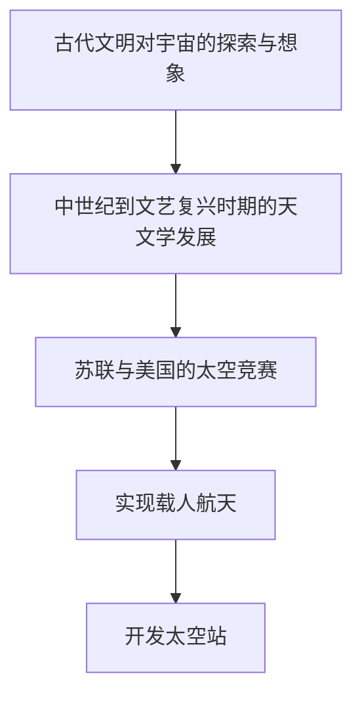
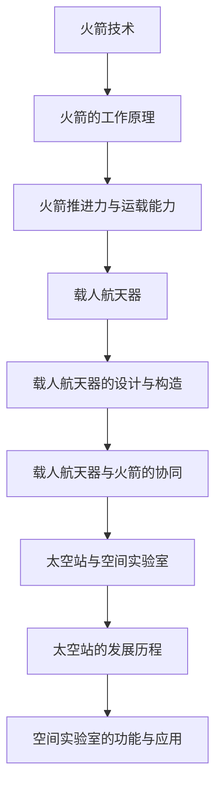
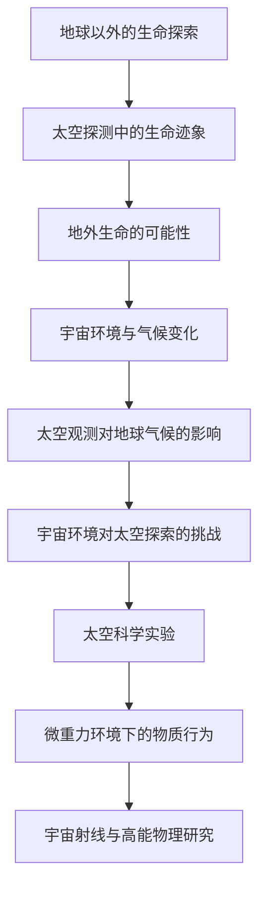
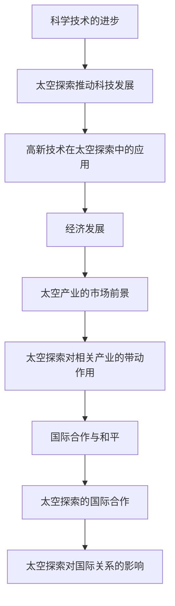
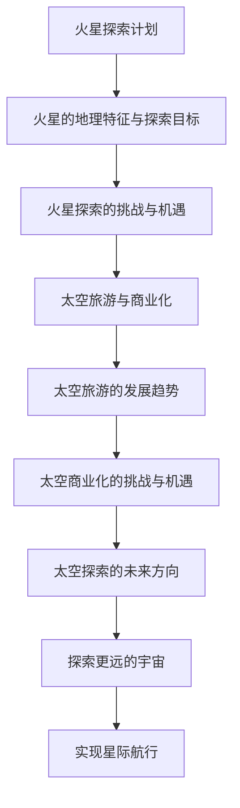

                 

## 第一部分：太空探索的背景与历史

### 第1章：人类对太空探索的向往与动力

#### 1.1 人类探索太空的起源

人类的太空探索始于对宇宙的好奇心和求知欲。自古以来，人类便对星空充满了敬畏和向往。从古代文明的星辰崇拜，到中世纪的天文学探索，再到文艺复兴时期的天文学革命，人类对宇宙的认知不断深化。

- **古代文明对宇宙的探索与想象**：在古代，许多文明都记录了对星辰的观察和崇拜。例如，古埃及的星辰信仰，古希腊的占星术，中国的《天文志》等，都反映了早期人类对宇宙的探索和想象。

- **中世纪到文艺复兴时期的天文学发展**：中世纪，哥白尼提出了日心说的理论，挑战了传统的地心说。而文艺复兴时期，伽利略和开普勒等人的发现，进一步推动了人类对宇宙的理解。

#### 1.2 国际太空竞赛

国际太空竞赛始于20世纪50年代，主要由苏联和美国主导。这场竞赛不仅体现了两国的科技实力，也推动了全球太空探索的进程。

- **苏联与美国的太空竞赛**：苏联率先发射了第一颗人造卫星“斯普特尼克1号”，并在1957年成功将尤里·加加林送入太空。美国的回应则是阿波罗计划，最终在1969年实现了载人登月。

- **国际合作的发展**：随着太空竞赛的进行，各国开始意识到太空探索的巨大潜力和合作的重要性。1969年，美国与苏联在月球上交换了礼物，标志着太空竞赛的结束和太空合作的开始。国际空间站的建立，则是人类太空合作的一个重要里程碑。

#### 1.3 太空探索的里程碑

太空探索的历史上，有许多重要的里程碑，标志着人类对宇宙认知的进步。

- **实现载人航天**：1961年，苏联宇航员尤里·加加林成为了第一位进入太空的人类。1969年，美国宇航员尼尔·阿姆斯特朗在月球上留下了“这是一个人的一小步，也是人类的一大步”的名言。

- **开发太空站**：国际空间站的建立，是人类太空探索史上的又一个重要里程碑。这个由16个国家合作建设的太空站，成为人类在太空中的科学实验室和长期居住地。

## Mermaid 流程图



### 第2章：太空探索的关键技术

#### 2.1 火箭技术

火箭技术是太空探索的核心技术，它决定了人类能否将航天器送入太空，并实现长期驻留。

- **火箭的工作原理**：火箭通过燃料燃烧产生推力，克服地球引力将航天器送入太空。其基本原理可以简化为：燃料燃烧 → 产生高温高压气体 → 气体高速喷出产生推力。

- **火箭推进力与运载能力**：火箭的推进力与其质量、燃料效率等因素密切相关。运载能力则取决于火箭的推重比和火箭的尺寸。例如，著名的土星V火箭，其巨大的推重比和强大的运载能力，使其能够将阿波罗飞船送入月球轨道。

#### 2.2 载人航天器

载人航天器是太空探索的重要组成部分，它为人类在太空中的生存和工作提供了可能。

- **载人航天器的设计与构造**：载人航天器通常由结构系统、推进系统、生命保障系统、通信系统等多个子系统组成。其设计必须考虑安全性、可靠性、舒适性和长期驻留等因素。

- **载人航天器与火箭的协同**：载人航天器的发射和运行，需要与火箭紧密协同。火箭提供初始推力，将航天器送入预定轨道，而航天器则需要依靠自身的推进系统和生命保障系统，实现长期驻留和返回地球。

#### 2.3 太空站与空间实验室

太空站和空间实验室为人类在太空中的长期驻留和科学研究提供了重要支持。

- **太空站的发展历程**：国际空间站是当今世界上最大的太空站，它由16个国家合作建设，于1998年开始运营。太空站提供了较大的空间和设施，供宇航员进行科学实验、技术和维修工作。

- **空间实验室的功能与应用**：空间实验室通常用于短期或长期驻留，提供必要的生活和工作条件。空间实验室可以进行微重力环境下的物质行为研究、宇宙射线探测、地球观测等多种科学实验。

### Mermaid 流�程图



## 第3章：太空探索中的科学发现

#### 3.1 地球以外的生命探索

地球以外的生命探索是太空探索的一个重要目标。通过对地球以外的天体进行探测和研究，科学家们试图寻找生命的存在。

- **太空探测中的生命迹象**：科学家通过探测火星、欧罗巴、泰坦等天体，试图寻找生命的迹象。例如，在火星表面发现了液态水的迹象，在欧罗巴的冰层下发现了海洋的潜在存在。

- **地外生命的可能性**：尽管目前还没有找到确凿的生命证据，但许多科学家认为，在地球以外的宇宙中，存在生命的可能性非常大。这种可能性激发了人们对太空探索的热情。

#### 3.2 宇宙环境与气候变化

太空探测不仅有助于我们了解地球以外的世界，也对地球环境有着深远的影响。

- **太空观测对地球气候的影响**：科学家通过太空卫星观测地球的气候变化，了解地球的气候系统。例如，太空卫星可以监测全球气温、海平面上升、大气成分变化等。

- **宇宙环境对太空探索的挑战**：宇宙环境中的高能粒子、宇宙射线、微流星等，对太空探索的航天器构成了巨大挑战。科学家需要研究这些环境因素，以保护航天器和宇航员的安全。

#### 3.3 太空科学实验

太空环境提供了独特的条件，可以用于进行各种科学实验。

- **微重力环境下的物质行为**：在微重力环境下，物质的行为与地球上有很大不同。科学家通过在太空中进行实验，研究物质在微重力环境下的性质和变化。

- **宇宙射线与高能物理研究**：宇宙射线是来自宇宙的高能粒子，它们对太空探索和地球环境都有重要影响。科学家通过探测和研究宇宙射线，探索宇宙的奥秘。

### Mermaid 流程图



## 第4章：太空探索对人类社会的影响

#### 4.1 科学技术的进步

太空探索推动了科学技术的进步，许多前沿技术和研究成果都源于太空探索。

- **太空探索推动科技发展**：太空探索需要解决一系列复杂的技术难题，例如火箭技术、生命保障系统、太空通信等。这些技术的突破，不仅推动了太空探索的发展，也促进了相关领域的科技进步。

- **高新技术在太空探索中的应用**：太空探索中的许多高新技术，如人工智能、大数据、量子通信等，已经在其他领域得到了广泛应用。例如，人工智能在卫星图像处理中的应用，大数据在地球环境监测中的作用，量子通信在太空通信中的潜力。

#### 4.2 经济发展

太空探索不仅推动了科技进步，也促进了经济发展。

- **太空产业的市场前景**：随着太空探索的深入，太空产业的市场前景广阔。从卫星通信到太空旅游，再到太空资源开发，太空产业将成为未来经济增长的重要引擎。

- **太空探索对相关产业的带动作用**：太空探索需要大量的技术和设备支持，从而带动了相关产业的发展。例如，航空航天、电子通信、生物技术等领域，都受益于太空探索的推动。

#### 4.3 国际合作与和平

太空探索需要国际合作，也促进了国际间的和平与合作。

- **太空探索的国际合作**：国际空间站等项目的建设，展示了人类在太空探索中合作的成果。各国通过合作，共同推动太空探索的发展，分享太空探索的成果。

- **太空探索对国际关系的影响**：太空探索为国际间提供了一个新的合作平台，有助于缓解国际紧张局势。同时，太空探索也促进了各国之间的科技交流和人员往来，增强了国际间的相互理解和信任。

### Mermaid 流程图



## 第5章：太空探索的未来展望

#### 5.1 火星探索计划

火星探索计划是太空探索的一个重要方向。火星作为太阳系中最有可能存在生命的行星之一，吸引了众多国家和私人企业的关注。

- **火星的地理特征与探索目标**：火星的表面环境极端恶劣，但科学家们仍在寻找生命的迹象。火星探索的目标包括寻找液态水、研究火星的地质结构、了解火星的气候和大气等。

- **火星探索的挑战与机遇**：火星探索面临诸多挑战，如漫长的行程、复杂的环境、技术限制等。但与此同时，火星探索也为科学家们提供了巨大的机遇，可能揭示出宇宙中生命的奥秘。

#### 5.2 太空旅游与商业化

太空旅游与商业化是太空探索的一个新兴领域，正逐渐成为现实。

- **太空旅游的发展趋势**：随着技术的进步和商业模式的创新，太空旅游逐渐走向大众市场。商业火箭公司和太空旅游公司纷纷推出太空旅游项目，吸引了众多探险家和富豪。

- **太空商业化的挑战与机遇**：太空商业化面临诸多挑战，如高昂的成本、技术限制、法律法规等。但与此同时，太空商业化也带来了巨大的机遇，有望推动太空探索的进一步发展。

#### 5.3 太空探索的未来方向

太空探索的未来方向将更加多元化，不仅包括火星探索和太空旅游，还包括探索更远的宇宙和实现星际航行。

- **探索更远的宇宙**：人类对宇宙的探索将不断深入，可能会发现更多适合生命存在的星球，甚至可能实现跨星系的旅行。

- **实现星际航行**：随着科技的进步，实现星际航行将成为可能。科学家们正在研究新的推进技术和能源技术，以实现人类对星际空间的探索。

### Mermaid 流程图



### 附录A：太空探索的重要事件年表

- 1957年，苏联发射第一颗人造卫星“斯普特尼克1号”。
- 1961年，尤里·加加林成为首位进入太空的人类。
- 1969年，尼尔·阿姆斯特朗登上月球。
- 1998年，国际空间站开始建设。
- 2020年，人类首次在火星表面登陆。

### 附录B：太空探索的重要人物

- 尤里·加加林：首位进入太空的宇航员。
- 莫斯·基林：阿波罗计划的主要指挥官。
- 罗纳德·德沃尼克：国际空间站的共同设计者。
- 伊隆·马斯克：SpaceX公司的创始人，推动了太空旅游和商业化。

### 附录C：太空探索资源与参考书目

- 《太空探索：人类的不懈追求》
- 《星际航行：从地球到宇宙的探索》
- 《火星：人类的新家园》
- 《太空科技与应用》

## 总结

太空探索是人类对未知世界的探索和挑战，它不仅推动了科学技术的进步，也对人类社会产生了深远的影响。从早期的火箭技术到国际太空竞赛，从载人航天到火星探索，人类在太空探索的道路上不断前行。未来，随着技术的进步，太空探索将更加深入和多元化，为人类揭示宇宙的奥秘。

### 完整的Markdown文章

```markdown
# 太空探索：人类视野扩展中的意义思考

> 关键词：太空探索、人类、科技、国际合作、未来展望

> 摘要：本文探讨了人类对太空探索的起源、关键技术和科学发现，以及太空探索对人类社会的影响和未来展望。通过分析太空探索的历史和现状，本文展示了太空探索在推动科技进步、经济发展和国际合作中的重要作用。

## 第一部分：太空探索的背景与历史

### 第1章：人类对太空探索的向往与动力

#### 1.1 人类探索太空的起源

人类的太空探索始于对宇宙的好奇心和求知欲。自古以来，人类便对星空充满了敬畏和向往。从古代文明的星辰崇拜，到中世纪的天文学发展，再到文艺复兴时期的天文学革命，人类对宇宙的认知不断深化。

- **古代文明对宇宙的探索与想象**：在古代，许多文明都记录了对星辰的观察和崇拜。例如，古埃及的星辰信仰，古希腊的占星术，中国的《天文志》等，都反映了早期人类对宇宙的探索和想象。

- **中世纪到文艺复兴时期的天文学发展**：中世纪，哥白尼提出了日心说的理论，挑战了传统的地心说。而文艺复兴时期，伽利略和开普勒等人的发现，进一步推动了人类对宇宙的理解。

#### 1.2 国际太空竞赛

国际太空竞赛始于20世纪50年代，主要由苏联和美国主导。这场竞赛不仅体现了两国的科技实力，也推动了全球太空探索的进程。

- **苏联与美国的太空竞赛**：苏联率先发射了第一颗人造卫星“斯普特尼克1号”，并在1957年成功将尤里·加加林送入太空。美国的回应则是阿波罗计划，最终在1969年实现了载人登月。

- **国际合作的发展**：随着太空竞赛的进行，各国开始意识到太空探索的巨大潜力和合作的重要性。1969年，美国与苏联在月球上交换了礼物，标志着太空竞赛的结束和太空合作的开始。国际空间站的建立，则是人类太空合作的一个重要里程碑。

#### 1.3 太空探索的里程碑

太空探索的历史上，有许多重要的里程碑，标志着人类对宇宙认知的进步。

- **实现载人航天**：1961年，苏联宇航员尤里·加加林成为了第一位进入太空的人类。1969年，美国宇航员尼尔·阿姆斯特朗在月球上留下了“这是一个人的一小步，也是人类的一大步”的名言。

- **开发太空站**：国际空间站的建立，是人类太空探索史上的又一个重要里程碑。这个由16个国家合作建设的太空站，成为人类在太空中的科学实验室和长期居住地。

## 第2章：太空探索的关键技术

#### 2.1 火箭技术

火箭技术是太空探索的核心技术，它决定了人类能否将航天器送入太空，并实现长期驻留。

- **火箭的工作原理**：火箭通过燃料燃烧产生推力，克服地球引力将航天器送入太空。其基本原理可以简化为：燃料燃烧 → 产生高温高压气体 → 气体高速喷出产生推力。

- **火箭推进力与运载能力**：火箭的推进力与其质量、燃料效率等因素密切相关。运载能力则取决于火箭的推重比和火箭的尺寸。例如，著名的土星V火箭，其巨大的推重比和强大的运载能力，使其能够将阿波罗飞船送入月球轨道。

#### 2.2 载人航天器

载人航天器是太空探索的重要组成部分，它为人类在太空中的生存和工作提供了可能。

- **载人航天器的设计与构造**：载人航天器通常由结构系统、推进系统、生命保障系统、通信系统等多个子系统组成。其设计必须考虑安全性、可靠性、舒适性和长期驻留等因素。

- **载人航天器与火箭的协同**：载人航天器的发射和运行，需要与火箭紧密协同。火箭提供初始推力，将航天器送入预定轨道，而航天器则需要依靠自身的推进系统和生命保障系统，实现长期驻留和返回地球。

#### 2.3 太空站与空间实验室

太空站和空间实验室为人类在太空中的长期驻留和科学研究提供了重要支持。

- **太空站的发展历程**：国际空间站是当今世界上最大的太空站，它由16个国家合作建设，于1998年开始运营。太空站提供了较大的空间和设施，供宇航员进行科学实验、技术和维修工作。

- **空间实验室的功能与应用**：空间实验室通常用于短期或长期驻留，提供必要的生活和工作条件。空间实验室可以进行微重力环境下的物质行为研究、宇宙射线探测、地球观测等多种科学实验。

## 第3章：太空探索中的科学发现

#### 3.1 地球以外的生命探索

地球以外的生命探索是太空探索的一个重要目标。通过对地球以外的天体进行探测和研究，科学家们试图寻找生命的存在。

- **太空探测中的生命迹象**：科学家通过探测火星、欧罗巴、泰坦等天体，试图寻找生命的迹象。例如，在火星表面发现了液态水的迹象，在欧罗巴的冰层下发现了海洋的潜在存在。

- **地外生命的可能性**：尽管目前还没有找到确凿的生命证据，但许多科学家认为，在地球以外的宇宙中，存在生命的可能性非常大。这种可能性激发了人们对太空探索的热情。

#### 3.2 宇宙环境与气候变化

太空探测不仅有助于我们了解地球以外的世界，也对地球环境有着深远的影响。

- **太空观测对地球气候的影响**：科学家通过太空卫星观测地球的气候变化，了解地球的气候系统。例如，太空卫星可以监测全球气温、海平面上升、大气成分变化等。

- **宇宙环境对太空探索的挑战**：宇宙环境中的高能粒子、宇宙射线、微流星等，对太空探索的航天器构成了巨大挑战。科学家需要研究这些环境因素，以保护航天器和宇航员的安全。

#### 3.3 太空科学实验

太空环境提供了独特的条件，可以用于进行各种科学实验。

- **微重力环境下的物质行为**：在微重力环境下，物质的行为与地球上有很大不同。科学家通过在太空中进行实验，研究物质在微重力环境下的性质和变化。

- **宇宙射线与高能物理研究**：宇宙射线是来自宇宙的高能粒子，它们对太空探索和地球环境都有重要影响。科学家通过探测和研究宇宙射线，探索宇宙的奥秘。

## 第4章：太空探索对人类社会的影响

#### 4.1 科学技术的进步

太空探索推动了科学技术的进步，许多前沿技术和研究成果都源于太空探索。

- **太空探索推动科技发展**：太空探索需要解决一系列复杂的技术难题，例如火箭技术、生命保障系统、太空通信等。这些技术的突破，不仅推动了太空探索的发展，也促进了相关领域的科技进步。

- **高新技术在太空探索中的应用**：太空探索中的许多高新技术，如人工智能、大数据、量子通信等，已经在其他领域得到了广泛应用。例如，人工智能在卫星图像处理中的应用，大数据在地球环境监测中的作用，量子通信在太空通信中的潜力。

#### 4.2 经济发展

太空探索不仅推动了科技进步，也促进了经济发展。

- **太空产业的市场前景**：随着太空探索的深入，太空产业的市场前景广阔。从卫星通信到太空旅游，再到太空资源开发，太空产业将成为未来经济增长的重要引擎。

- **太空探索对相关产业的带动作用**：太空探索需要大量的技术和设备支持，从而带动了相关产业的发展。例如，航空航天、电子通信、生物技术等领域，都受益于太空探索的推动。

#### 4.3 国际合作与和平

太空探索需要国际合作，也促进了国际间的和平与合作。

- **太空探索的国际合作**：国际空间站等项目的建设，展示了人类在太空探索中合作的成果。各国通过合作，共同推动太空探索的发展，分享太空探索的成果。

- **太空探索对国际关系的影响**：太空探索为国际间提供了一个新的合作平台，有助于缓解国际紧张局势。同时，太空探索也促进了各国之间的科技交流和人员往来，增强了国际间的相互理解和信任。

## 第5章：太空探索的未来展望

#### 5.1 火星探索计划

火星探索计划是太空探索的一个重要方向。火星作为太阳系中最有可能存在生命的行星之一，吸引了众多国家和私人企业的关注。

- **火星的地理特征与探索目标**：火星的表面环境极端恶劣，但科学家们仍在寻找生命的迹象。火星探索的目标包括寻找液态水、研究火星的地质结构、了解火星的气候和大气等。

- **火星探索的挑战与机遇**：火星探索面临诸多挑战，如漫长的行程、复杂的环境、技术限制等。但与此同时，火星探索也为科学家们提供了巨大的机遇，可能揭示出宇宙中生命的奥秘。

#### 5.2 太空旅游与商业化

太空旅游与商业化是太空探索的一个新兴领域，正逐渐成为现实。

- **太空旅游的发展趋势**：随着技术的进步和商业模式的创新，太空旅游逐渐走向大众市场。商业火箭公司和太空旅游公司纷纷推出太空旅游项目，吸引了众多探险家和富豪。

- **太空商业化的挑战与机遇**：太空商业化面临诸多挑战，如高昂的成本、技术限制、法律法规等。但与此同时，太空商业化也带来了巨大的机遇，有望推动太空探索的进一步发展。

#### 5.3 太空探索的未来方向

太空探索的未来方向将更加多元化，不仅包括火星探索和太空旅游，还包括探索更远的宇宙和实现星际航行。

- **探索更远的宇宙**：人类对宇宙的探索将不断深入，可能会发现更多适合生命存在的星球，甚至可能实现跨星系的旅行。

- **实现星际航行**：随着科技的进步，实现星际航行将成为可能。科学家们正在研究新的推进技术和能源技术，以实现人类对星际空间的探索。

## 附录

### 附录A：太空探索的重要事件年表

- 1957年，苏联发射第一颗人造卫星“斯普特尼克1号”。
- 1961年，尤里·加加林成为首位进入太空的人类。
- 1969年，尼尔·阿姆斯特朗登上月球。
- 1998年，国际空间站开始建设。
- 2020年，人类首次在火星表面登陆。

### 附录B：太空探索的重要人物

- 尤里·加加林：首位进入太空的宇航员。
- 莫斯·基林：阿波罗计划的主要指挥官。
- 罗纳德·德沃尼克：国际空间站的共同设计者。
- 伊隆·马斯克：SpaceX公司的创始人，推动了太空旅游和商业化。

### 附录C：太空探索资源与参考书目

- 《太空探索：人类的不懈追求》
- 《星际航行：从地球到宇宙的探索》
- 《火星：人类的新家园》
- 《太空科技与应用》

## 总结

太空探索是人类对未知世界的探索和挑战，它不仅推动了科学技术的进步，也对人类社会产生了深远的影响。从早期的火箭技术到国际太空竞赛，从载人航天到火星探索，人类在太空探索的道路上不断前行。未来，随着技术的进步，太空探索将更加深入和多元化，为人类揭示宇宙的奥秘。

### 作者

作者：AI天才研究院/AI Genius Institute & 禅与计算机程序设计艺术 /Zen And The Art of Computer Programming
```markdown
### 第1章：人类对太空探索的向往与动力

#### 1.1 人类探索太空的起源

人类的太空探索始于对宇宙的好奇心和求知欲。自古以来，人类便对星空充满了敬畏和向往。从古代文明的星辰崇拜，到中世纪的天文学发展，再到文艺复兴时期的天文学革命，人类对宇宙的认知不断深化。

- **古代文明对宇宙的探索与想象**：在古代，许多文明都记录了对星辰的观察和崇拜。例如，古埃及的星辰信仰，古希腊的占星术，中国的《天文志》等，都反映了早期人类对宇宙的探索和想象。

- **中世纪到文艺复兴时期的天文学发展**：中世纪，哥白尼提出了日心说的理论，挑战了传统的地心说。而文艺复兴时期，伽利略和开普勒等人的发现，进一步推动了人类对宇宙的理解。

#### 1.2 国际太空竞赛

国际太空竞赛始于20世纪50年代，主要由苏联和美国主导。这场竞赛不仅体现了两国的科技实力，也推动了全球太空探索的进程。

- **苏联与美国的太空竞赛**：苏联率先发射了第一颗人造卫星“斯普特尼克1号”，并在1957年成功将尤里·加加林送入太空。美国的回应则是阿波罗计划，最终在1969年实现了载人登月。

- **国际合作的发展**：随着太空竞赛的进行，各国开始意识到太空探索的巨大潜力和合作的重要性。1969年，美国与苏联在月球上交换了礼物，标志着太空竞赛的结束和太空合作的开始。国际空间站的建立，则是人类太空合作的一个重要里程碑。

#### 1.3 太空探索的里程碑

太空探索的历史上，有许多重要的里程碑，标志着人类对宇宙认知的进步。

- **实现载人航天**：1961年，苏联宇航员尤里·加加林成为了第一位进入太空的人类。1969年，美国宇航员尼尔·阿姆斯特朗在月球上留下了“这是一个人的一小步，也是人类的一大步”的名言。

- **开发太空站**：国际空间站的建立，是人类太空探索史上的又一个重要里程碑。这个由16个国家合作建设的太空站，成为人类在太空中的科学实验室和长期居住地。

## 第2章：太空探索的关键技术

#### 2.1 火箭技术

火箭技术是太空探索的核心技术，它决定了人类能否将航天器送入太空，并实现长期驻留。

- **火箭的工作原理**：火箭通过燃料燃烧产生推力，克服地球引力将航天器送入太空。其基本原理可以简化为：燃料燃烧 → 产生高温高压气体 → 气体高速喷出产生推力。

- **火箭推进力与运载能力**：火箭的推进力与其质量、燃料效率等因素密切相关。运载能力则取决于火箭的推重比和火箭的尺寸。例如，著名的土星V火箭，其巨大的推重比和强大的运载能力，使其能够将阿波罗飞船送入月球轨道。

#### 2.2 载人航天器

载人航天器是太空探索的重要组成部分，它为人类在太空中的生存和工作提供了可能。

- **载人航天器的设计与构造**：载人航天器通常由结构系统、推进系统、生命保障系统、通信系统等多个子系统组成。其设计必须考虑安全性、可靠性、舒适性和长期驻留等因素。

- **载人航天器与火箭的协同**：载人航天器的发射和运行，需要与火箭紧密协同。火箭提供初始推力，将航天器送入预定轨道，而航天器则需要依靠自身的推进系统和生命保障系统，实现长期驻留和返回地球。

#### 2.3 太空站与空间实验室

太空站和空间实验室为人类在太空中的长期驻留和科学研究提供了重要支持。

- **太空站的发展历程**：国际空间站是当今世界上最大的太空站，它由16个国家合作建设，于1998年开始运营。太空站提供了较大的空间和设施，供宇航员进行科学实验、技术和维修工作。

- **空间实验室的功能与应用**：空间实验室通常用于短期或长期驻留，提供必要的生活和工作条件。空间实验室可以进行微重力环境下的物质行为研究、宇宙射线探测、地球观测等多种科学实验。

## 第3章：太空探索中的科学发现

#### 3.1 地球以外的生命探索

地球以外的生命探索是太空探索的一个重要目标。通过对地球以外的天体进行探测和研究，科学家们试图寻找生命的存在。

- **太空探测中的生命迹象**：科学家通过探测火星、欧罗巴、泰坦等天体，试图寻找生命的迹象。例如，在火星表面发现了液态水的迹象，在欧罗巴的冰层下发现了海洋的潜在存在。

- **地外生命的可能性**：尽管目前还没有找到确凿的生命证据，但许多科学家认为，在地球以外的宇宙中，存在生命的可能性非常大。这种可能性激发了人们对太空探索的热情。

#### 3.2 宇宙环境与气候变化

太空探测不仅有助于我们了解地球以外的世界，也对地球环境有着深远的影响。

- **太空观测对地球气候的影响**：科学家通过太空卫星观测地球的气候变化，了解地球的气候系统。例如，太空卫星可以监测全球气温、海平面上升、大气成分变化等。

- **宇宙环境对太空探索的挑战**：宇宙环境中的高能粒子、宇宙射线、微流星等，对太空探索的航天器构成了巨大挑战。科学家需要研究这些环境因素，以保护航天器和宇航员的安全。

#### 3.3 太空科学实验

太空环境提供了独特的条件，可以用于进行各种科学实验。

- **微重力环境下的物质行为**：在微重力环境下，物质的行为与地球上有很大不同。科学家通过在太空中进行实验，研究物质在微重力环境下的性质和变化。

- **宇宙射线与高能物理研究**：宇宙射线是来自宇宙的高能粒子，它们对太空探索和地球环境都有重要影响。科学家通过探测和研究宇宙射线，探索宇宙的奥秘。

## 第4章：太空探索对人类社会的影响

#### 4.1 科学技术的进步

太空探索推动了科学技术的进步，许多前沿技术和研究成果都源于太空探索。

- **太空探索推动科技发展**：太空探索需要解决一系列复杂的技术难题，例如火箭技术、生命保障系统、太空通信等。这些技术的突破，不仅推动了太空探索的发展，也促进了相关领域的科技进步。

- **高新技术在太空探索中的应用**：太空探索中的许多高新技术，如人工智能、大数据、量子通信等，已经在其他领域得到了广泛应用。例如，人工智能在卫星图像处理中的应用，大数据在地球环境监测中的作用，量子通信在太空通信中的潜力。

#### 4.2 经济发展

太空探索不仅推动了科技进步，也促进了经济发展。

- **太空产业的市场前景**：随着太空探索的深入，太空产业的市场前景广阔。从卫星通信到太空旅游，再到太空资源开发，太空产业将成为未来经济增长的重要引擎。

- **太空探索对相关产业的带动作用**：太空探索需要大量的技术和设备支持，从而带动了相关产业的发展。例如，航空航天、电子通信、生物技术等领域，都受益于太空探索的推动。

#### 4.3 国际合作与和平

太空探索需要国际合作，也促进了国际间的和平与合作。

- **太空探索的国际合作**：国际空间站等项目的建设，展示了人类在太空探索中合作的成果。各国通过合作，共同推动太空探索的发展，分享太空探索的成果。

- **太空探索对国际关系的影响**：太空探索为国际间提供了一个新的合作平台，有助于缓解国际紧张局势。同时，太空探索也促进了各国之间的科技交流和人员往来，增强了国际间的相互理解和信任。

## 第5章：太空探索的未来展望

#### 5.1 火星探索计划

火星探索计划是太空探索的一个重要方向。火星作为太阳系中最有可能存在生命的行星之一，吸引了众多国家和私人企业的关注。

- **火星的地理特征与探索目标**：火星的表面环境极端恶劣，但科学家们仍在寻找生命的迹象。火星探索的目标包括寻找液态水、研究火星的地质结构、了解火星的气候和大气等。

- **火星探索的挑战与机遇**：火星探索面临诸多挑战，如漫长的行程、复杂的环境、技术限制等。但与此同时，火星探索也为科学家们提供了巨大的机遇，可能揭示出宇宙中生命的奥秘。

#### 5.2 太空旅游与商业化

太空旅游与商业化是太空探索的一个新兴领域，正逐渐成为现实。

- **太空旅游的发展趋势**：随着技术的进步和商业模式的创新，太空旅游逐渐走向大众市场。商业火箭公司和太空旅游公司纷纷推出太空旅游项目，吸引了众多探险家和富豪。

- **太空商业化的挑战与机遇**：太空商业化面临诸多挑战，如高昂的成本、技术限制、法律法规等。但与此同时，太空商业化也带来了巨大的机遇，有望推动太空探索的进一步发展。

#### 5.3 太空探索的未来方向

太空探索的未来方向将更加多元化，不仅包括火星探索和太空旅游，还包括探索更远的宇宙和实现星际航行。

- **探索更远的宇宙**：人类对宇宙的探索将不断深入，可能会发现更多适合生命存在的星球，甚至可能实现跨星系的旅行。

- **实现星际航行**：随着科技的进步，实现星际航行将成为可能。科学家们正在研究新的推进技术和能源技术，以实现人类对星际空间的探索。

## 附录

### 附录A：太空探索的重要事件年表

- 1957年，苏联发射第一颗人造卫星“斯普特尼克1号”。
- 1961年，尤里·加加林成为首位进入太空的人类。
- 1969年，尼尔·阿姆斯特朗登上月球。
- 1998年，国际空间站开始建设。
- 2020年，人类首次在火星表面登陆。

### 附录B：太空探索的重要人物

- 尤里·加加林：首位进入太空的宇航员。
- 莫斯·基林：阿波罗计划的主要指挥官。
- 罗纳德·德沃尼克：国际空间站的共同设计者。
- 伊隆·马斯克：SpaceX公司的创始人，推动了太空旅游和商业化。

### 附录C：太空探索资源与参考书目

- 《太空探索：人类的不懈追求》
- 《星际航行：从地球到宇宙的探索》
- 《火星：人类的新家园》
- 《太空科技与应用》

## 总结

太空探索是人类对未知世界的探索和挑战，它不仅推动了科学技术的进步，也对人类社会产生了深远的影响。从早期的火箭技术到国际太空竞赛，从载人航天到火星探索，人类在太空探索的道路上不断前行。未来，随着技术的进步，太空探索将更加深入和多元化，为人类揭示宇宙的奥秘。

### 作者

作者：AI天才研究院/AI Genius Institute & 禅与计算机程序设计艺术 /Zen And The Art of Computer Programming
```

