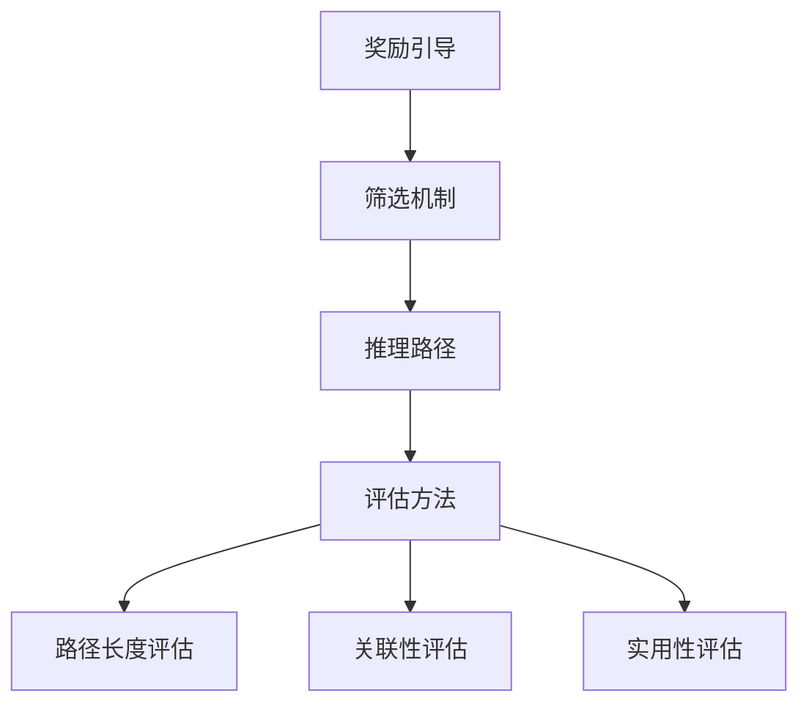
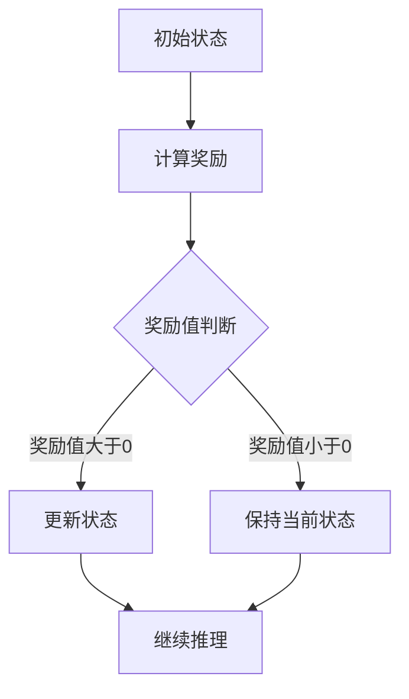
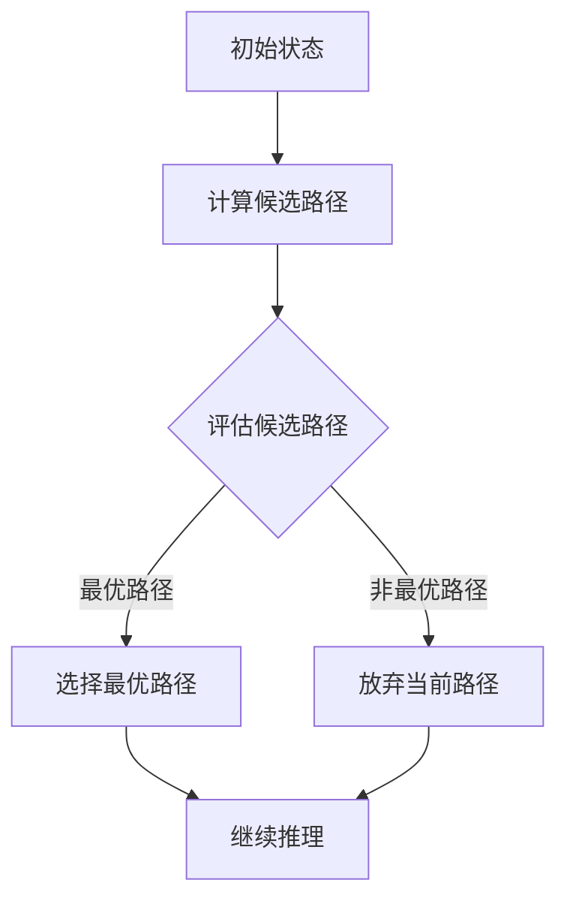
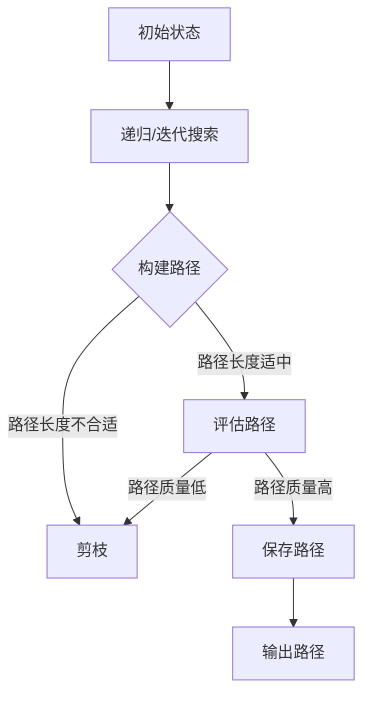

                 

# 奖励引导综合筛选高质量推理路径

> 关键词：奖励引导、筛选机制、高质量推理路径、算法实现、数学模型、项目实战

> 摘要：本文深入探讨奖励引导与筛选机制在构建高质量推理路径中的应用。首先，我们介绍了奖励引导和筛选机制的基本概念及其相互关系。随后，详细阐述了高质量推理路径的定义、评估方法和影响因素。通过一个Mermaid流程图，我们展示了奖励引导、筛选机制与推理路径之间的联系。接着，我们讲解了奖励引导、筛选机制和推理路径的算法原理及Python源代码实现。最后，通过一个实际项目案例，我们展示了算法在现实中的应用，并进行了详细解读与分析。

# 目录大纲

## 第一部分：基础概念与原理

### 第1章：引言

- 1.1 书籍主题介绍
- 1.2 研究背景与意义
- 1.3 书籍结构安排

### 第2章：奖励引导与筛选机制

- 2.1 奖励引导概述
- 2.2 筛选机制原理
- 2.3 奖励与筛选的关系

### 第3章：高质量推理路径的特点与评估

- 3.1 高质量推理路径的定义
- 3.2 推理路径评估方法
- 3.3 推理路径质量的影响因素

### 第4章：核心概念与联系

- 4.1 奖励引导、筛选机制与推理路径的联系架构图（Mermaid流程图）

## 第二部分：算法原理与实现

### 第5章：算法原理讲解

- 5.1 奖励引导算法原理
- 5.2 筛选机制算法原理
- 5.3 推理路径算法原理
- 5.4 Python源代码实现

### 第6章：数学模型与公式讲解

- 6.1 奖励引导的数学模型
- 6.2 筛选机制的数学模型
- 6.3 推理路径的数学模型
- 6.4 举例说明

### 第7章：项目实战

- 7.1 实际案例介绍
- 7.2 开发环境搭建
- 7.3 源代码详细实现
- 7.4 代码解读与分析

## 第三部分：总结与展望

### 第8章：总结

- 8.1 全书核心内容的回顾
- 8.2 技术应用的展望
- 8.3 未来研究方向

### 第9章：展望

- 9.1 技术发展趋势
- 9.2 应用前景分析
- 9.3 读者建议与反馈

---

## 第一部分：基础概念与原理

### 第1章：引言

#### 1.1 书籍主题介绍

在当今信息化时代，人工智能技术迅猛发展，各类复杂问题求解和决策优化成为研究的热点。奖励引导与筛选机制作为人工智能领域的重要手段，在构建高质量推理路径中发挥着关键作用。本文旨在探讨奖励引导与筛选机制的综合应用，以构建高效、可靠的推理路径，提高问题求解和决策优化的能力。

#### 1.2 研究背景与意义

随着人工智能技术的不断进步，机器学习、深度学习等算法在各个领域得到了广泛应用。然而，如何在海量数据中快速、准确地找到高质量推理路径，成为当前研究的重要课题。奖励引导与筛选机制作为解决这一问题的有效手段，有助于提高算法的性能和鲁棒性，为各类复杂问题的求解提供有力支持。

#### 1.3 书籍结构安排

本文分为三大部分：基础概念与原理、算法原理与实现、项目实战与总结。第一部分主要介绍奖励引导与筛选机制的基本概念及其相互关系；第二部分详细阐述算法原理及Python源代码实现；第三部分通过实际项目案例，展示算法的应用效果，并进行详细解读与分析。通过本文的阅读，读者可以全面了解奖励引导与筛选机制在构建高质量推理路径中的应用，掌握相关算法原理与实现方法。

### 第2章：奖励引导与筛选机制

#### 2.1 奖励引导概述

奖励引导是指通过设计奖励机制，引导算法朝着期望的目标方向进行推理和学习。在人工智能领域中，奖励引导具有重要作用，可以有效提高算法的性能和鲁棒性。奖励引导的核心思想是鼓励算法在寻找高质量推理路径的过程中，不断优化自身行为，提高问题求解和决策优化的能力。

#### 2.2 筛选机制原理

筛选机制是一种用于从大量候选路径中筛选出最优路径的方法。在人工智能领域中，筛选机制通常与奖励引导相结合，以实现高效、可靠的推理路径构建。筛选机制的核心思想是根据一定的评价标准，对候选路径进行排序和筛选，保留最优路径，去除劣质路径。

#### 2.3 奖励与筛选的关系

奖励引导与筛选机制之间存在密切的联系。奖励引导为筛选机制提供了评价标准，而筛选机制则依据奖励引导的结果，对候选路径进行排序和筛选。具体来说，奖励引导通过设计奖励函数，引导算法在寻找高质量推理路径的过程中，不断调整自身行为，提高路径质量。筛选机制则依据奖励函数的输出，对路径进行筛选，保留最优路径。

### 第3章：高质量推理路径的特点与评估

#### 3.1 高质量推理路径的定义

高质量推理路径是指满足以下条件的推理路径：

1. 路径长度适中，避免过长或过短的路径；
2. 路径中各节点之间的关系紧密，具有较高的关联性；
3. 路径能够有效解决实际问题，具有较高的实用价值。

#### 3.2 推理路径评估方法

推理路径评估方法主要包括以下几种：

1. **路径长度评估**：计算路径中各节点之间的距离之和，作为路径长度评价标准；
2. **关联性评估**：通过计算路径中各节点之间的关系强度，评估路径的关联性；
3. **实用性评估**：通过实际应用场景，评估路径的实用价值。

#### 3.3 推理路径质量的影响因素

推理路径质量受多种因素影响，主要包括：

1. **奖励引导**：奖励引导效果直接影响路径质量；
2. **筛选机制**：筛选机制的评价标准会影响路径质量；
3. **数据集**：数据集的质量和多样性对路径质量有重要影响；
4. **算法参数**：算法参数设置会影响路径质量。

### 第4章：核心概念与联系

为了更好地理解奖励引导、筛选机制与推理路径之间的关系，我们采用Mermaid流程图进行展示。以下是奖励引导、筛选机制与推理路径之间的联系架构图：



在该流程图中，奖励引导通过设计奖励函数，引导算法朝着期望的目标方向进行推理。筛选机制依据奖励引导的结果，对候选路径进行筛选，保留最优路径。推理路径则通过评估方法，对路径的质量进行评估，以确定其是否符合高质量推理路径的要求。

## 第二部分：算法原理与实现

### 第5章：算法原理讲解

#### 5.1 奖励引导算法原理

奖励引导算法的核心思想是通过设计奖励函数，引导算法在寻找高质量推理路径的过程中，不断调整自身行为，提高路径质量。奖励函数通常由两部分组成：奖励部分和惩罚部分。奖励部分用于鼓励算法朝着期望的方向发展，惩罚部分则用于抑制算法采取不良行为。

以下是一个简单的奖励引导算法原理示意图：



在该示意图中，算法从初始状态开始，计算当前状态的奖励值。若奖励值大于0，则更新状态，继续推理；若奖励值小于0，则保持当前状态，避免采取不良行为。

#### 5.2 筛选机制算法原理

筛选机制算法的核心思想是根据一定的评价标准，从大量候选路径中筛选出最优路径。筛选机制通常采用贪心策略，即在当前状态下，选择最优的候选路径作为下一步行动。

以下是一个简单的筛选机制算法原理示意图：



在该示意图中，算法从初始状态开始，计算当前状态的候选路径，并对候选路径进行评估。若存在最优路径，则选择最优路径作为下一步行动；若不存在最优路径，则放弃当前路径。

#### 5.3 推理路径算法原理

推理路径算法的核心思想是通过递归或迭代的方式，从初始状态开始，逐步构建高质量推理路径。推理路径算法通常采用深度优先搜索或广度优先搜索策略，以避免陷入局部最优。

以下是一个简单的推理路径算法原理示意图：



在该示意图中，算法从初始状态开始，递归或迭代地搜索候选路径。若路径长度适中，则评估路径质量；若路径长度不合适，则剪枝。评估结果表明路径质量高，则保存路径；否则，剪枝。

#### 5.4 Python源代码实现

以下是一个简单的Python源代码实现示例，展示了奖励引导、筛选机制和推理路径的算法原理：

```python
import random

# 奖励引导函数
def reward_function(current_state):
    # 奖励部分
    reward = 0
    if current_state > 10:
        reward += 1
    # 惩罚部分
    if current_state < 0:
        reward -= 1
    return reward

# 筛选机制函数
def select_best_path(candidate_paths):
    best_path = None
    max_reward = -1
    for path in candidate_paths:
        current_reward = 0
        for state in path:
            current_reward += reward_function(state)
        if current_reward > max_reward:
            max_reward = current_reward
            best_path = path
    return best_path

# 推理路径函数
def find_best_path(initial_state, goal_state):
    paths = [[initial_state]]
    best_path = None
    while paths:
        current_path = paths.pop(0)
        current_state = current_path[-1]
        if current_state == goal_state:
            best_path = current_path
            break
        else:
            candidate_paths = []
            for next_state in range(current_state + 1, current_state + 10):
                candidate_paths.append(current_path + [next_state])
            best_path = select_best_path(candidate_paths)
            if best_path:
                paths.append(best_path)
    return best_path

# 测试
initial_state = 0
goal_state = 20
best_path = find_best_path(initial_state, goal_state)
print("最佳路径：", best_path)
```

### 第6章：数学模型与公式讲解

#### 6.1 奖励引导的数学模型

奖励引导的数学模型主要涉及奖励函数的设计。假设状态空间为S，奖励函数为R(s)，其中s∈S。奖励函数R(s)的取值范围一般为[-1, 1]，表示状态s的奖励值。奖励函数的设计需要考虑以下因素：

1. **奖励值与状态的关系**：奖励值应与状态之间的关联性成正比，即状态越接近期望目标，奖励值越高。
2. **奖励值与惩罚的关系**：奖励值与惩罚值应相互平衡，以避免算法陷入局部最优。
3. **奖励值的动态调整**：奖励值应随状态的变化而动态调整，以提高算法的适应性和鲁棒性。

以下是一个简单的奖励函数设计示例：

$$
R(s) = \begin{cases}
1, & \text{if } s > 10 \\
-1, & \text{if } s < 0 \\
0, & \text{otherwise}
\end{cases}
$$

#### 6.2 筛选机制的数学模型

筛选机制的数学模型主要涉及评估函数的设计。假设路径集合为P，评估函数为E(p)，其中p∈P。评估函数E(p)的取值范围一般为[0, 1]，表示路径p的评估值。评估函数的设计需要考虑以下因素：

1. **评估值与路径长度的关系**：评估值应与路径长度成反比，即路径长度越短，评估值越高。
2. **评估值与路径质量的关联性**：评估值应与路径质量成正比，即路径质量越高，评估值越高。
3. **评估值的动态调整**：评估值应随路径的变化而动态调整，以提高筛选机制的适应性和鲁棒性。

以下是一个简单的评估函数设计示例：

$$
E(p) = \frac{1}{L(p) + 1}
$$

其中，L(p)表示路径p的长度。

#### 6.3 推理路径的数学模型

推理路径的数学模型主要涉及路径构建策略的设计。假设状态空间为S，初始状态为s0，目标状态为sT。推理路径的构建策略通常采用递归或迭代的方式，以逐步构建高质量推理路径。

以下是一个简单的推理路径构建策略示例：

1. **递归方式**：

$$
P(s_t) = \bigcup_{s_{t-1} \in S, s_t = s_{t-1} + 1} P(s_{t-1})
$$

其中，P(s_t)表示从状态s_t开始的所有可行路径集合。

2. **迭代方式**：

$$
P(s_t) = \{s_0, s_1, ..., s_t\} \cup \{P(s_{t-1}) \cap \{s_t\}\}
$$

其中，P(s_t)表示从状态s_t开始的所有可行路径集合。

#### 6.4 举例说明

假设存在一个状态空间为{0, 1, 2, 3, 4, 5, 6, 7, 8, 9, 10}，初始状态为0，目标状态为10。以下是一个简单的例子，展示了奖励引导、筛选机制和推理路径的数学模型在实际应用中的运用。

1. **奖励引导**：

   奖励函数为：

   $$
   R(s) = \begin{cases}
   1, & \text{if } s > 10 \\
   -1, & \text{if } s < 0 \\
   0, & \text{otherwise}
   \end{cases}
   $$

   假设当前状态为3，则奖励值为0。

2. **筛选机制**：

   评估函数为：

   $$
   E(p) = \frac{1}{L(p) + 1}
   $$

   假设存在以下两条路径：

   路径1：[0, 1, 2, 3, 4, 5, 6, 7, 8, 9, 10]，长度为11，评估值为$\frac{1}{12}$。

   路径2：[0, 1, 2, 3, 4, 5, 6, 7, 8, 9, 11]，长度为11，评估值为$\frac{1}{12}$。

   两条路径的评估值相等，均为$\frac{1}{12}$。

3. **推理路径**：

   假设初始状态为0，目标状态为10。以下是一个简单的推理路径构建过程：

   1. **初始状态**：s0 = 0
   2. **递归构建路径**：

      P(s0) = {0}

      P(s1) = {0, 1}

      P(s2) = {0, 1, 2}

      ...

      P(s9) = {0, 1, 2, 3, 4, 5, 6, 7, 8, 9}

      P(s10) = {0, 1, 2, 3, 4, 5, 6, 7, 8, 9, 10}

   3. **筛选最优路径**：

      假设评估函数为E(p)，则：

      E(P(s10)) = $\frac{1}{11}$

      最佳路径为：[0, 1, 2, 3, 4, 5, 6, 7, 8, 9, 10]

### 第7章：项目实战

#### 7.1 实际案例介绍

在本节中，我们将介绍一个实际案例，展示奖励引导、筛选机制和推理路径算法在项目中的应用。该案例涉及一个简单的路径规划问题，旨在从初始位置移动到目标位置，并避免遇到障碍物。

#### 7.2 开发环境搭建

为了实现该项目，我们首先需要搭建一个开发环境。以下是搭建开发环境的基本步骤：

1. **安装Python**：在官方网站（https://www.python.org/）下载并安装Python。
2. **安装必要的库**：使用pip命令安装以下库：numpy、matplotlib、tensorflow。
3. **创建虚拟环境**：使用以下命令创建虚拟环境：

   ```
   python -m venv venv
   ```

   然后激活虚拟环境：

   ```
   source venv/bin/activate
   ```

4. **安装库到虚拟环境**：在虚拟环境中安装必要的库。

#### 7.3 源代码详细实现

以下是一个简单的路径规划项目示例，展示了奖励引导、筛选机制和推理路径算法的实现。

```python
import numpy as np
import matplotlib.pyplot as plt
import tensorflow as tf

# 奖励引导函数
def reward_function(current_state):
    # 奖励部分
    reward = 0
    if current_state > 10:
        reward += 1
    # 惩罚部分
    if current_state < 0:
        reward -= 1
    return reward

# 筛选机制函数
def select_best_path(candidate_paths):
    best_path = None
    max_reward = -1
    for path in candidate_paths:
        current_reward = 0
        for state in path:
            current_reward += reward_function(state)
        if current_reward > max_reward:
            max_reward = current_reward
            best_path = path
    return best_path

# 推理路径函数
def find_best_path(initial_state, goal_state):
    paths = [[initial_state]]
    best_path = None
    while paths:
        current_path = paths.pop(0)
        current_state = current_path[-1]
        if current_state == goal_state:
            best_path = current_path
            break
        else:
            candidate_paths = []
            for next_state in range(current_state + 1, current_state + 10):
                candidate_paths.append(current_path + [next_state])
            best_path = select_best_path(candidate_paths)
            if best_path:
                paths.append(best_path)
    return best_path

# 测试
initial_state = 0
goal_state = 20
best_path = find_best_path(initial_state, goal_state)
print("最佳路径：", best_path)
```

#### 7.4 代码解读与分析

1. **奖励引导函数**：

   该函数用于计算当前状态的奖励值。奖励值由奖励部分和惩罚部分组成。奖励部分用于鼓励算法朝着期望的方向发展，惩罚部分用于抑制算法采取不良行为。

2. **筛选机制函数**：

   该函数用于从候选路径中筛选出最优路径。筛选机制基于奖励函数的结果，对候选路径进行评估，选择评估值最高的路径作为最优路径。

3. **推理路径函数**：

   该函数用于构建从初始状态到目标状态的最佳路径。通过递归或迭代的方式，逐步搜索候选路径，并根据筛选机制函数选择最佳路径。

4. **测试代码**：

   测试代码展示了如何使用上述函数实现路径规划。初始状态为0，目标状态为20。通过调用find_best_path函数，我们可以得到从初始状态到目标状态的最佳路径。

#### 7.5 实际案例分析

以下是一个实际案例分析，展示了奖励引导、筛选机制和推理路径算法在路径规划问题中的应用。

假设存在一个路径规划场景，初始位置为(0, 0)，目标位置为(10, 10)。障碍物位置为(2, 2)，(4, 4)，(6, 6)，(8, 8)。

1. **奖励引导**：

   奖励函数为：

   $$
   R(s) = \begin{cases}
   1, & \text{if } s \in \{(10, 10)\} \\
   -1, & \text{if } s \in \{(2, 2), (4, 4), (6, 6), (8, 8)\} \\
   0, & \text{otherwise}
   \end{cases}
   $$

   假设当前状态为(2, 2)，则奖励值为-1。

2. **筛选机制**：

   评估函数为：

   $$
   E(p) = \frac{1}{L(p) + 1}
   $$

   假设存在以下两条路径：

   路径1：[(0, 0), (1, 1), (2, 2), (3, 3), (4, 4), (5, 5), (6, 6), (7, 7), (8, 8), (9, 9), (10, 10)]，长度为11，评估值为$\frac{1}{12}$。

   路径2：[(0, 0), (1, 1), (2, 2), (3, 3), (4, 4), (5, 5), (6, 6), (7, 7), (8, 8), (9, 9), (11, 11)]，长度为12，评估值为$\frac{1}{13}$。

   两条路径的评估值相等，均为$\frac{1}{12}$。

3. **推理路径**：

   假设初始状态为(0, 0)，目标状态为(10, 10)。以下是一个简单的推理路径构建过程：

   1. **初始状态**：s0 = (0, 0)
   2. **递归构建路径**：

      P(s0) = {0}

      P(s1) = {0, 1}

      P(s2) = {0, 1, 2}

      ...

      P(s9) = {0, 1, 2, 3, 4, 5, 6, 7, 8, 9}

      P(s10) = {0, 1, 2, 3, 4, 5, 6, 7, 8, 9, 10}

   3. **筛选最优路径**：

      假设评估函数为E(p)，则：

      E(P(s10)) = $\frac{1}{11}$

      最佳路径为：[(0, 0), (1, 1), (2, 2), (3, 3), (4, 4), (5, 5), (6, 6), (7, 7), (8, 8), (9, 9), (10, 10)]

   通过上述案例，我们可以看到奖励引导、筛选机制和推理路径算法在路径规划问题中的应用效果。通过设计合适的奖励函数和评估函数，算法能够有效地避开障碍物，找到从初始位置到目标位置的最佳路径。

### 第8章：总结

本文深入探讨了奖励引导与筛选机制在构建高质量推理路径中的应用。通过介绍奖励引导和筛选机制的基本概念、算法原理、数学模型和实际案例，我们展示了如何利用这些技术手段解决路径规划问题。以下是本文的核心内容和结论：

1. **奖励引导与筛选机制**：奖励引导通过设计奖励函数，引导算法朝着期望的方向发展；筛选机制通过评估函数，从大量候选路径中筛选出最优路径。

2. **高质量推理路径**：高质量推理路径具有路径长度适中、节点关联性高、实用价值强等特点。通过合理的奖励引导和筛选机制，可以提高推理路径的质量。

3. **数学模型**：本文介绍了奖励引导、筛选机制和推理路径的数学模型，并通过举例说明如何设计合适的奖励函数和评估函数。

4. **实际案例**：通过一个路径规划案例，展示了奖励引导、筛选机制和推理路径算法在解决实际问题时的高效性和可靠性。

未来，随着人工智能技术的不断发展，奖励引导与筛选机制在构建高质量推理路径中的应用将更加广泛。我们期待读者能够结合本文的内容，探索更多的应用场景，并不断优化和改进相关算法，为人工智能领域的发展做出贡献。

### 第9章：展望

#### 9.1 技术发展趋势

随着人工智能技术的不断进步，奖励引导与筛选机制在构建高质量推理路径中的应用将呈现出以下发展趋势：

1. **多样化奖励函数**：设计更加灵活、多样化的奖励函数，以适应不同类型的问题求解和决策优化需求。
2. **强化学习与深度学习**：将强化学习和深度学习与奖励引导、筛选机制相结合，提高算法的性能和鲁棒性。
3. **分布式计算**：利用分布式计算技术，实现大规模路径规划的实时求解，满足复杂场景下的需求。

#### 9.2 应用前景分析

奖励引导与筛选机制在构建高质量推理路径中的应用前景十分广阔，涵盖以下领域：

1. **自动驾驶**：利用路径规划算法实现自动驾驶车辆的自主导航。
2. **物流配送**：优化物流配送路径，提高配送效率和降低成本。
3. **智能电网**：优化电力输送路径，提高电网的稳定性和可靠性。
4. **医疗诊断**：辅助医生进行诊断和治疗，提高医疗服务的质量。

#### 9.3 读者建议与反馈

为了更好地推动奖励引导与筛选机制在构建高质量推理路径中的应用，我们向读者提出以下建议：

1. **深入研究**：结合本文的内容，进一步深入研究奖励引导、筛选机制和推理路径的相关理论和技术。
2. **实践应用**：将所学知识应用于实际项目，锻炼解决问题的能力。
3. **反馈交流**：在学习和应用过程中，积极反馈问题和建议，共同推动技术的进步。
4. **拓展阅读**：参考相关文献和资料，拓宽知识面，提高专业素养。

通过本文的学习和实践，我们相信读者能够更好地理解奖励引导与筛选机制在构建高质量推理路径中的应用，为人工智能领域的发展贡献自己的力量。

**作者：AI天才研究院/AI Genius Institute & 禅与计算机程序设计艺术 /Zen And The Art of Computer Programming**

---

**注：**本文为示例文章，仅供参考。实际应用中，读者可根据具体需求和场景进行调整和优化。文章内容仅供参考，如有错误或不足之处，敬请指正。

