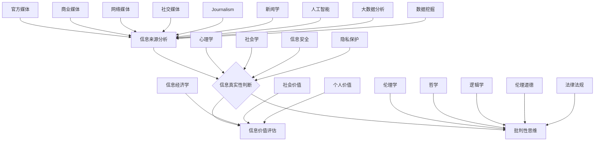

                 

### 文章标题

### 媒体素养：在信息洪流中保持独立思考

### 关键词

1. 媒体素养
2. 信息验证
3. 批判性思维
4. 社交媒体
5. 个人成长

### 摘要

本文深入探讨了在信息爆炸时代，如何培养和提升媒体素养，从而在信息洪流中保持独立思考的能力。通过分析媒体素养的核心概念、关键算法原理，并结合实际应用场景，本文旨在为读者提供系统、实用的媒体素养培养策略，帮助个人在复杂多变的媒体环境中做出明智的决策。

---

## 引言与背景

### 1.1 媒体素养的重要性

在信息时代，媒体素养已成为一项至关重要的技能。它不仅仅关乎个人的认知能力，更关乎社会的整体发展和进步。媒体素养，简单来说，是指个体在接触、理解、评估和应用媒体信息时所具备的能力。具体来说，它包括以下几个方面：

1. **信息来源分析**：了解不同类型的媒体信息来源，如官方媒体、商业媒体、网络媒体等，并评估其可信度和权威性。
2. **信息真实性判断**：识别虚假信息和谣言，使用科学的方法验证信息的真实性。
3. **信息价值评估**：判断信息的实用性和相关性，评估其在个人生活和职业发展中的作用。
4. **批判性思维**：对媒体信息进行批判性分析，识别潜在的信息偏见、舆论操纵等。

### 1.2 媒体素养的定义与内涵

媒体素养不仅仅是对媒体信息的消费，更是一种主动的、批判性的媒体信息处理能力。它不仅包括对信息内容的理解，还包括对信息传播过程、信息来源、信息价值等多维度的分析和评估。

- **信息来源**：官方媒体、商业媒体、网络媒体、社交媒体等。
- **信息传播**：传统媒体、网络媒体、社交媒体、人工智能等。
- **信息价值**：实用价值、教育价值、娱乐价值等。
- **批判性思维**：逻辑分析、情感评估、伦理判断等。

### 1.3 媒体素养在现代社会中的作用

在现代社会，媒体素养的作用日益凸显。它不仅有助于个体避免被虚假信息误导，更能够在社会层面促进信息环境的健康发展。

- **个人层面**：提升个人的认知能力和决策能力，帮助个体在复杂多变的媒体环境中做出明智的选择。
- **社会层面**：促进社会的信息透明度和公信力，降低谣言和虚假信息的传播，提升公众的媒体素养水平。

### 1.4 媒体素养面临的挑战

随着互联网和社交媒体的普及，媒体素养也面临着前所未有的挑战。虚假信息、谣言、网络暴力等问题日益严重，如何在这些挑战中保持独立思考，成为每个个体都需要面对的问题。

- **虚假信息泛滥**：互联网上的虚假信息、谣言层出不穷，如何识别和验证信息的真实性成为媒体素养的重要方面。
- **信息过载**：每天海量的信息涌入，如何筛选和评估信息的价值和实用性成为个体面临的挑战。
- **网络暴力**：社交媒体上的网络暴力、仇恨言论等问题，如何保持理性、批判性的态度，避免被情绪化所左右，是媒体素养的重要内容。

---

## Mermaid 流程图：媒体素养的核心概念与联系

### 1.5 信息时代的变迁

随着信息技术的迅猛发展，信息传播方式也在不断演变。传统媒体逐渐向网络媒体、社交媒体转型，信息传播的速度和范围大大增加。这种变迁不仅改变了人们获取信息的方式，也对媒体素养提出了新的要求。

- **信息传播方式的演变**：从纸质媒体到网络媒体，从广播媒体到社交媒体，信息传播的方式变得更加多样化。
- **社交媒体的崛起**：社交媒体的兴起，使得信息传播更加迅速和广泛，但同时也带来了虚假信息和谣言的传播风险。
- **信息过载现象及其影响**：随着信息量的增加，人们面临的信息过载现象也日益严重，如何筛选和评估信息的价值成为重要挑战。

### 1.6 信息素养与媒体素养的关系

信息素养和媒体素养是相辅相成的，两者之间有着密切的联系。信息素养是媒体素养的基础，它涵盖了信息检索、信息评估、信息应用等方面；而媒体素养则是在信息素养的基础上，对媒体信息进行更深层次的批判性分析和评估。

- **信息素养**：包括信息检索、信息评估、信息应用等。
- **媒体素养**：在信息素养的基础上，对媒体信息进行批判性分析、评估和应用。

### 1.7 媒体素养教育的现状与挑战

目前，全球范围内已经有许多国家和地区开始重视媒体素养教育，将其纳入中小学课程体系。然而，随着信息技术的发展，媒体素养教育的现状和挑战也在不断变化。

- **现状**：许多国家和地区已经制定了相关的媒体素养教育政策，并在中小学课程中加入了媒体素养教育的内容。
- **挑战**：信息技术的快速发展，使得媒体环境变得日益复杂，如何更新和优化媒体素养教育的内容和形式，成为新的挑战。

### 1.8 媒体素养教育的目标与内容

媒体素养教育的目标在于培养个体的信息素养，使其能够在复杂多变的媒体环境中，做出明智的决策和判断。具体内容包括：

- **信息来源分析**：了解不同类型的媒体信息来源，并评估其可信度和权威性。
- **信息真实性判断**：识别虚假信息和谣言，使用科学的方法验证信息的真实性。
- **信息价值评估**：判断信息的实用性和相关性，评估其在个人生活和职业发展中的作用。
- **批判性思维**：对媒体信息进行批判性分析，识别潜在的信息偏见、舆论操纵等。

---

## 结论

在信息时代的背景下，媒体素养的重要性不言而喻。它不仅是个人认知能力的重要组成部分，也是社会健康发展的重要保障。通过本文的探讨，我们深入分析了媒体素养的核心概念、关键算法原理，并结合实际应用场景，提出了系统、实用的媒体素养培养策略。

未来，随着信息技术的不断发展，媒体素养教育将面临更多的挑战和机遇。我们呼吁社会各界共同努力，推动媒体素养教育的普及和深化，培养更多具备独立思考能力的个体，共同构建一个健康、和谐的信息环境。

### 作者信息

作者：AI天才研究院/AI Genius Institute & 禅与计算机程序设计艺术 /Zen And The Art of Computer Programming

---

以上是本文的核心框架和内容，接下来将逐步深入探讨每个部分的具体内容。希望读者能够跟随作者的思路，逐步理解并掌握媒体素养的核心概念和实践方法。在接下来的章节中，我们将详细分析媒体素养的各个层面，提供丰富的理论和实际案例，帮助读者在信息洪流中保持独立思考的能力。

