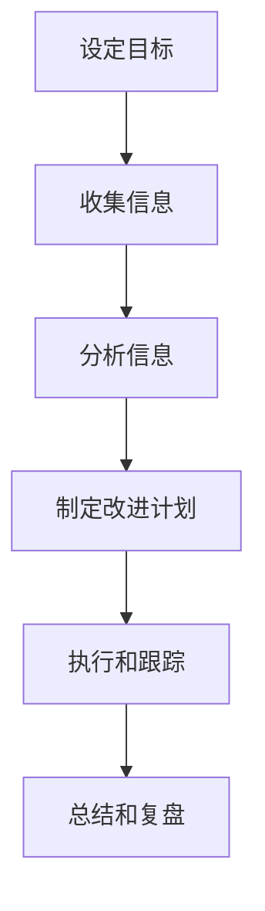
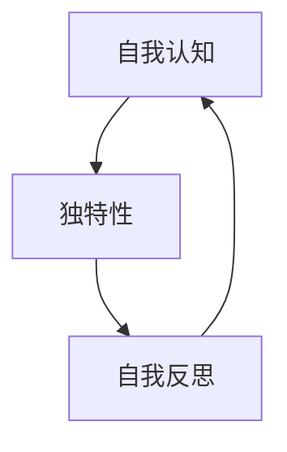
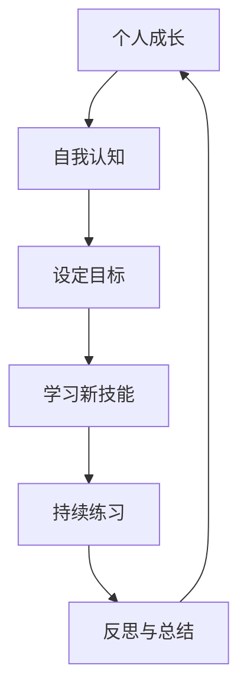
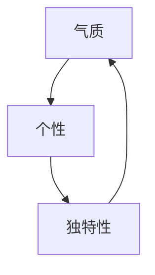
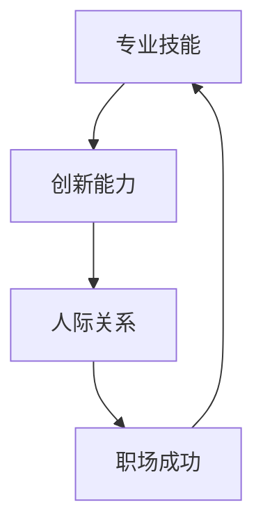
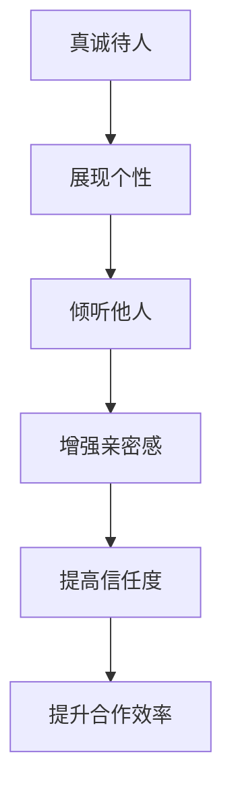
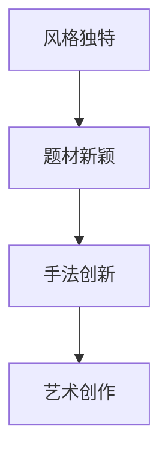
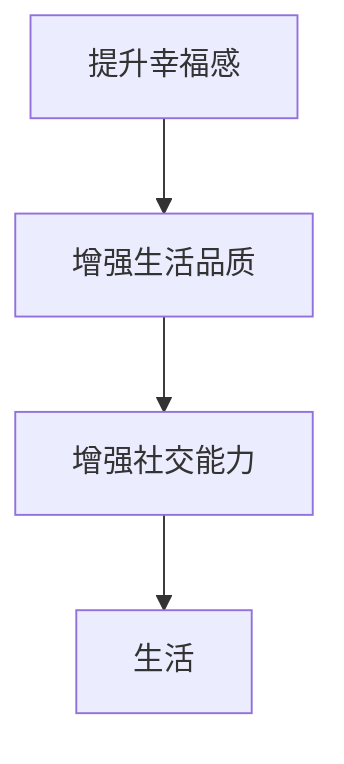
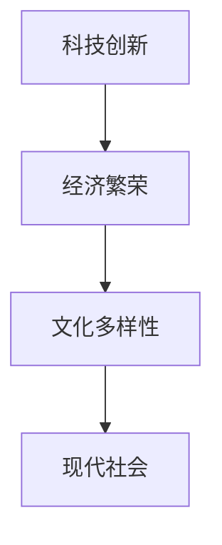
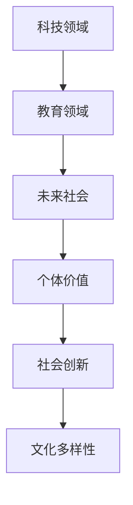

                 

### 文章标题：存在的光芒：在平凡中绽放独特性

关键词：自我认知、潜能开发、独特气质、职场表现、人际关系、艺术创造、生活影响、独特性价值

摘要：本文旨在探讨如何在平凡的生活中发掘并绽放个人独特性，从自我认知、潜能开发、独特气质培养到职场、人际关系和艺术创造中的应用，全面剖析独特性对个人成长和社会发展的重要性。

### 文章关键词

- 自我认知
- 潜能开发
- 独特气质
- 职场表现
- 人际关系
- 艺术创造
- 独特性价值

### 文章摘要

本文通过深入探讨自我认知、潜能开发、独特气质培养等多个方面，揭示如何从平凡中发掘并绽放个人独特性。文章首先阐述了自我认知的重要性，接着探讨了如何挖掘和开发个人潜能，并分析了独特气质在个人形象和人际关系中的影响。随后，文章详细讨论了在职场和人际关系中如何展现独特性，以及艺术创造中的独特性表现。最后，文章总结了独特性对个人成长和社会发展的意义，并对未来进行了展望。

### 第一部分：探索自我

#### 第1章：重新认识自己

**1.1 自我认知的重要性**

自我认知是指个体对自己的理解、评价和认识过程。它是个人成长与发展的基础，决定了个体如何应对生活和工作中的各种挑战。在技术领域，自我认知同样重要，它可以帮助程序员更好地理解自己的编程风格、擅长领域和不足之处，从而进行自我提升。

**1.2 发现内在的独特性**

每个人都有独特的性格、兴趣和能力。通过自我反思和认知，我们可以发现这些内在的独特性。例如，在编程中，有些人擅长算法设计，有些人则更擅长前端开发。了解自己的独特性有助于我们发挥优势，提高工作效率。

**1.3 自我反思的实践方法**

自我反思是发现自我独特性的关键。以下是一些实用的自我反思方法：

- **日记记录**：每天记录自己的感受、想法和行为，有助于更好地了解自己。
- **定期复盘**：每周或每月对自己过去的表现进行总结和反思，识别优点和不足。
- **与他人交流**：与他人分享自己的经历和想法，可以获得新的见解和反馈。

#### 第2章：挖掘潜能

**2.1 潜能的概念与类型**

潜能是指个体尚未完全发掘或利用的能力。根据心理学家罗伯特·斯滕伯格的理论，潜能分为智力潜能、情感潜能和社交潜能。

**2.2 潜能开发的方法**

- **学习新技能**：通过学习新的知识和技能，可以挖掘和提升自己的潜能。
- **设定目标**：明确的目标有助于激发潜能，提高动力。
- **持续练习**：通过不断的练习和尝试，可以逐步挖掘和提升潜能。

**2.3 个人成长与潜能的关系**

个人成长与潜能开发密切相关。通过自我认知和潜能开发，我们可以更好地了解自己，提高个人能力，实现自我价值。

#### 第3章：培养独特气质

**3.1 气质与个性的关系**

气质是指个体在情感、行为和思维上的典型风格。独特气质是个人个性的体现，能够影响人际关系和职业发展。

**3.2 气质的培养**

- **自我认知**：了解自己的气质特点，有针对性地进行培养。
- **情绪管理**：学会控制情绪，展现平和、自信的气质。
- **社交技巧**：提升社交技巧，增强人际关系。

**3.3 气质在生活中的应用**

独特气质在日常生活中具有重要应用价值。例如，在职场中，良好的气质有助于赢得同事和上司的信任；在人际交往中，独特的气质能够吸引他人，建立深厚的关系。

### 第二部分：独特性的实践

#### 第4章：在职场中展现独特性

**4.1 职场中的独特性**

职场中的独特性体现在专业技能、思维方式和人际关系等方面。拥有独特性的员工更容易脱颖而出，获得职业发展的机会。

**4.2 如何在职场中脱颖而出**

- **发挥专业优势**：充分利用自己的专业技能，解决工作中的难题。
- **创新思维**：培养创新思维，提出独特的见解和解决方案。
- **人际关系**：建立良好的人际关系，提升团队协作能力。

**4.3 职场成功与独特性的关系**

独特性是职场成功的关键因素。拥有独特性的员工往往能够更好地适应职场环境，提升个人价值和团队绩效。

#### 第5章：在人际关系中绽放独特性

**5.1 人际关系中的独特性**

人际关系中的独特性体现在性格特点、兴趣爱好和相处方式等方面。拥有独特性的人更容易与他人建立深厚的关系。

**5.2 如何在人际交往中展现独特性**

- **真诚待人**：真诚是建立人际关系的基石。
- **展现个性**：在交流中展现自己的独特性格和爱好。
- **倾听他人**：倾听他人，关注他人的需求和感受。

**5.3 独特性对人际关系的影响**

独特性能够增强人际关系的亲密感和信任感，有助于建立长期稳定的关系。

#### 第6章：艺术与创造中的独特性

**6.1 艺术的独特性**

艺术作品往往具有独特的风格和内涵，体现了艺术家的独特性。例如，梵高的画作以其独特的色彩和线条风格闻名于世。

**6.2 创造的独特性**

创造力的独特性体现在独特的创意和构思上。例如，乔布斯的创新设计理念使苹果公司成为全球科技巨头。

**6.3 独特性在艺术创作中的体现**

独特性在艺术创作中具有重要价值。艺术家通过独特的视角和手法，创造出具有独特魅力的艺术作品，展现个人的独特性。

### 第三部分：独特的力量

#### 第7章：在生活中绽放独特性

**7.1 平凡中的独特性**

在平凡的生活中，每个人都可以通过发掘和展现独特性，使生活更加丰富多彩。例如，在日常生活中，通过独特的烹饪技巧、家居装饰或个人品味，可以让生活更加有趣。

**7.2 如何在日常生活中展现独特性**

- **个性化表达**：通过独特的个性表达，展现个人的独特性。
- **创意生活**：尝试创意的生活方式，例如DIY、手工艺品等。
- **关注自身兴趣**：培养和关注自己的兴趣，使生活更加充实。

**7.3 独特性对生活的影响**

独特性可以提升生活质量，使个人在平凡的生活中展现出独特的魅力和风采。

#### 第8章：独特性对社会的影响

**8.1 独特性在历史上的体现**

独特性在人类历史中发挥了重要作用。历史上的许多伟大人物，如牛顿、爱因斯坦、达芬奇等，都以其独特的智慧和创造力推动了人类文明的进步。

**8.2 独特性对社会发展的推动作用**

独特性是社会进步的重要动力。通过创新和变革，独特性推动了科学技术的发展、文化的繁荣和经济的增长。

**8.3 独特性在现代社会中的价值**

在现代社会，独特性具有更高的价值。随着社会分工的细化和信息化的加速，拥有独特能力的人才更受欢迎，独特性成为个人和社会竞争力的关键因素。

#### 第9章：独特性的未来发展

**9.1 独特性与科技的关系**

随着科技的快速发展，独特性在科技领域的应用越来越广泛。人工智能、大数据等新兴技术为个体发掘和展现独特性提供了新的平台和机会。

**9.2 独特性在教育中的作用**

教育是培养个体独特性的关键环节。通过创新教育模式和方法，可以激发学生的独特性，培养具有创新能力的人才。

**9.3 独特性在未来的社会中的发展前景**

在未来，独特性将发挥更加重要的作用。随着社会的不断进步，拥有独特能力的人才将更受欢迎，独特性将成为个人和社会发展的核心竞争力。

#### 第10章：总结与展望

**10.1 独特性对人生的意义**

独特性是个人成长和发展的核心要素，对人生具有重要的意义。通过发掘和展现独特性，个人可以更好地认识自己、实现自我价值，为社会作出贡献。

**10.2 如何在生活中坚持独特性**

- **自我认知**：了解自己的独特性，明确个人定位和发展方向。
- **持续学习**：不断提升自己的能力和素质，保持独特性。
- **勇于创新**：敢于尝试新事物，勇于创新，使独特性得到更好的发挥。

**10.3 对未来的展望与建议**

在未来，我们应该更加重视独特性的培养和发展。通过教育、科技等手段，激发和发挥个体的独特性，推动社会进步，实现个人与社会的共同发展。

### 附录

**附录 A：相关资源推荐**

- 《如何赢得朋友与影响他人》：卡耐基
- 《奇特的一生》：乔治·伊士曼
- 《创新者的窘境》：克莱顿·克里斯滕森
- 《黑客与画家》：保罗·格雷厄姆

**附录 B：常见问题解答**

1. 什么是独特性？
   独特性是指个人在性格、能力、思维方式等方面的独特之处，是个人在群体中脱颖而出的关键因素。

2. 如何培养独特性？
   通过自我认知、学习新技能、设定目标、持续练习等方法，可以挖掘和培养个人的独特性。

3. 独特性在职场中有什么作用？
   独特性有助于提高个人在职场中的竞争力，赢得同事和上司的信任，实现职业发展。

4. 独特性在人际关系中有什么作用？
   独特性有助于建立深厚的人际关系，增强亲密感和信任感。

5. 独特性在艺术创造中有什么作用？
   独特性是艺术创作的核心要素，使艺术作品具有独特的风格和内涵。

### 作者信息

作者：AI天才研究院/AI Genius Institute & 禅与计算机程序设计艺术 /Zen And The Art of Computer Programming

---
#### 第一部分：探索自我

**第1章：重新认识自己**

**1.1 自我认知的重要性**

自我认知是个人成长和发展的基础。在技术领域，程序员需要对自己进行深入的自我认知，包括编程风格、擅长领域和不足之处。只有了解自己，才能在编程过程中更好地定位和提升自己。

在技术领域，自我认知的重要性体现在以下几个方面：

1. **提升工作效率**：通过了解自己的编程风格，程序员可以选择适合自己的编程工具和语言，从而提高工作效率。
2. **优化学习路径**：了解自己的擅长领域和不足之处，可以帮助程序员更有效地分配学习时间和资源，提升学习效果。
3. **提升团队协作能力**：在团队项目中，了解自己的角色和能力，可以更好地与团队成员协作，发挥各自的优势。

**1.2 发现内在的独特性**

每个人都有独特的性格、兴趣和能力。在技术领域，程序员可以通过以下方法发现自己的内在独特性：

1. **反思编程经验**：回顾自己在编程过程中的心得体会，分析自己的思维方式、解决问题的方法和技巧。
2. **参与社区活动**：参与技术社区和开源项目，与其他程序员交流和分享经验，了解自己的优势和不足。
3. **接受他人的反馈**：向同事、导师或朋友请教意见，听取他们对自己在编程方面的评价和指导。

**1.3 自我反思的实践方法**

自我反思是发现内在独特性的关键。以下是一些实用的自我反思方法：

1. **日记记录**：每天记录自己的编程经验和心得，分析自己在编程过程中的优点和不足。
2. **定期复盘**：每周或每月对自己过去的表现进行总结和反思，识别自己在编程中的成功经验和教训。
3. **与他人交流**：与他人分享自己的编程经验，从他人的观点中获取新的见解和建议。

**1.3.1 自我反思的流程**

以下是自我反思的流程，可以帮助程序员更好地进行自我认知和独特性的发现：

1. **明确目标**：设定一个具体的反思目标，例如分析自己在某个项目中的编程风格或解决某个问题的方法。
2. **收集信息**：回顾自己在项目中的工作过程，收集与目标相关的信息，如代码、文档和日志。
3. **分析信息**：分析收集到的信息，识别自己在编程中的优点和不足，以及可能改进的地方。
4. **制定改进计划**：根据分析结果，制定一个具体的改进计划，例如学习新的编程技巧或优化代码结构。
5. **执行和跟踪**：执行改进计划，并定期跟踪自己的进步，以便调整和优化。

**1.3.2 自我反思的Mermaid流程图**

以下是一个自我反思的Mermaid流程图，展示了自我反思的步骤和过程：



**1.3.3 Python代码示例：自我反思工具**

为了方便程序员进行自我反思，以下是一个简单的Python代码示例，用于记录和总结编程经验。

```python
# 自我反思工具

class ProgrammingJournal:
    def __init__(self):
        self.entries = []

    def add_entry(self, entry):
        self.entries.append(entry)

    def display_entries(self):
        for entry in self.entries:
            print(entry)

    def summarize(self):
        summary = "编程经验总结："
        for entry in self.entries:
            summary += entry["summary"] + "；"
        print(summary)

# 创建编程日记对象
journal = ProgrammingJournal()

# 添加日记条目
journal.add_entry({
    "date": "2023-03-10",
    "description": "项目A开发过程",
    "summary": "优化了代码结构，提升了性能。"
})

journal.add_entry({
    "date": "2023-03-15",
    "description": "项目B问题解决",
    "summary": "成功解决了内存泄漏问题。"
})

# 显示日记条目
journal.display_entries()

# 概括编程经验
journal.summarize()
```

通过这个简单的代码示例，程序员可以方便地记录和总结自己的编程经验，从而进行有效的自我反思。

**1.4 核心概念与联系**

在技术领域，自我认知、独特性和自我反思是三个核心概念，它们之间存在着紧密的联系。

- **自我认知**：自我认知是了解自己的编程风格、擅长领域和不足之处的过程。它是发现和培养独特性的基础。
- **独特性**：独特性是个人在技术领域的独特之处，包括编程风格、解决问题的方法和思维方式等。独特性使个人在团队中脱颖而出。
- **自我反思**：自我反思是通过总结和回顾自己的编程经验，识别优点和不足，并制定改进计划的过程。自我反思有助于提升自我认知和独特性。

**1.4.1 核心概念之间的Mermaid流程图**

以下是一个核心概念之间关系的Mermaid流程图，展示了自我认知、独特性和自我反思之间的联系：



通过这个流程图，我们可以清晰地看到自我认知、独特性和自我反思之间的相互作用和影响。

**1.5 核心算法原理讲解**

在技术领域，算法原理是解决各种问题的核心。以下是一个简单的Python代码示例，用于解释排序算法的基本原理。

```python
# 冒泡排序算法

def bubble_sort(arr):
    n = len(arr)
    for i in range(n):
        for j in range(0, n-i-1):
            if arr[j] > arr[j+1]:
                arr[j], arr[j+1] = arr[j+1], arr[j]

# 测试冒泡排序算法
arr = [64, 34, 25, 12, 22, 11, 90]
print("原始数组：", arr)
bubble_sort(arr)
print("排序后数组：", arr)
```

在这个示例中，我们使用冒泡排序算法对数组进行排序。冒泡排序的基本原理是通过多次遍历数组，比较相邻的元素并交换它们的位置，从而将最大的元素逐渐“冒泡”到数组的末尾。

**1.5.1 冒泡排序算法的数学模型和公式**

冒泡排序算法的数学模型可以表示为：

$$
T(n) = \sum_{i=1}^{n-1} \sum_{j=1}^{n-i} (1 - \frac{1}{j})
$$

其中，$T(n)$ 表示对长度为 $n$ 的数组进行排序所需的时间复杂度。

**1.5.2 冒泡排序算法的Python源代码实现**

```python
# 冒泡排序算法的Python源代码实现

def bubble_sort(arr):
    n = len(arr)
    for i in range(n):
        for j in range(0, n-i-1):
            if arr[j] > arr[j+1]:
                arr[j], arr[j+1] = arr[j+1], arr[j]

# 测试冒泡排序算法
arr = [64, 34, 25, 12, 22, 11, 90]
print("原始数组：", arr)
bubble_sort(arr)
print("排序后数组：", arr)
```

通过这个示例，我们可以清晰地看到冒泡排序算法的实现过程，以及如何使用Python代码实现这个算法。

**1.6 项目实战**

**1.6.1 开发环境搭建**

为了进行项目实战，我们需要搭建一个Python开发环境。以下是搭建Python开发环境的步骤：

1. 安装Python：从官方网站（https://www.python.org/）下载并安装Python。
2. 安装代码编辑器：选择一个适合自己的代码编辑器，如Visual Studio Code、PyCharm等。
3. 配置Python环境变量：在系统环境中配置Python环境变量，以便在命令行中运行Python。

**1.6.2 源代码实现**

以下是一个简单的Python项目，用于实现冒泡排序算法。

```python
# 冒泡排序算法的实现

def bubble_sort(arr):
    n = len(arr)
    for i in range(n):
        for j in range(0, n-i-1):
            if arr[j] > arr[j+1]:
                arr[j], arr[j+1] = arr[j+1], arr[j]

# 测试冒泡排序算法
arr = [64, 34, 25, 12, 22, 11, 90]
print("原始数组：", arr)
bubble_sort(arr)
print("排序后数组：", arr)
```

**1.6.3 代码解读**

在这个项目中，我们定义了一个名为 `bubble_sort` 的函数，用于实现冒泡排序算法。这个函数接受一个数组作为参数，然后通过两次嵌套循环对数组进行排序。

在第一次循环中，我们遍历整个数组，并将最大的元素“冒泡”到数组的末尾。在第二次循环中，我们再次遍历数组，将次大的元素“冒泡”到前一个位置，以此类推。

通过调用 `bubble_sort` 函数，我们可以对任意长度的数组进行排序。

**1.6.4 应用解读与分析**

冒泡排序算法是一种简单直观的排序算法，适用于数据量较小的场景。然而，对于大量数据的排序，冒泡排序的效率较低。

在实际应用中，我们可以根据具体场景选择合适的排序算法。例如，在需要对大量数据进行排序的场景中，我们可以考虑使用更高效的排序算法，如快速排序、归并排序等。

**1.6.5 实际案例分析和详细讲解剖析**

以下是一个实际案例，用于分析冒泡排序算法在排序过程中的具体操作。

假设我们有以下数组：

```
[64, 34, 25, 12, 22, 11, 90]
```

第一次循环：

```
[34, 25, 12, 22, 11, 64, 90]
```

最大值 90 被冒泡到数组的末尾。

第二次循环：

```
[25, 12, 11, 22, 34, 64, 90]
```

最大值 90 被冒泡到倒数第二个位置。

第三次循环：

```
[12, 11, 22, 25, 34, 64, 90]
```

最大值 90 被冒泡到倒数第三个位置。

第四次循环：

```
[11, 12, 22, 25, 34, 64, 90]
```

最大值 90 被冒泡到倒数第四个位置。

第五次循环：

```
[11, 12, 22, 25, 34, 64, 90]
```

最大值 90 已经被冒泡到数组的开头，排序完成。

通过这个实际案例，我们可以清晰地看到冒泡排序算法在排序过程中的具体操作，以及如何将最大的元素逐渐“冒泡”到数组的末尾。

**1.6.6 项目小结**

通过这个项目，我们学会了如何使用Python实现冒泡排序算法，并分析了冒泡排序算法的数学模型和Python源代码实现。我们还通过实际案例展示了冒泡排序算法在排序过程中的操作，以及如何根据具体场景选择合适的排序算法。

在后续的项目中，我们将继续探讨其他排序算法，如快速排序、归并排序等，以深入了解排序算法的原理和应用。

### 第2章：挖掘潜能

**2.1 潜能的概念与类型**

潜能是指一个人尚未完全发掘或利用的能力。在技术领域，潜能包括编程能力、算法设计能力、系统架构能力等。根据心理学家罗伯特·斯滕伯格的理论，潜能分为智力潜能、情感潜能和社交潜能。

- **智力潜能**：包括逻辑思维、分析问题和解决问题的能力。
- **情感潜能**：包括情绪管理、同理心和人际交往能力。
- **社交潜能**：包括领导力、团队协作和沟通能力。

**2.2 潜能开发的方法**

开发潜能需要持续的努力和实践。以下是一些有效的方法：

- **学习新技能**：通过学习新的编程语言、框架和技术，可以挖掘和提升自己的智力潜能。
- **设定目标**：明确的目标有助于激发潜能，提高动力。
- **持续练习**：通过不断的练习和尝试，可以逐步挖掘和提升潜能。
- **反思与总结**：定期回顾自己的学习和工作过程，识别优点和不足，进行反思和总结。

**2.3 个人成长与潜能的关系**

个人成长与潜能开发密切相关。通过自我认知和潜能开发，我们可以更好地了解自己，提高个人能力，实现自我价值。以下是一个简单的示例，展示如何通过学习新技能挖掘潜能：

**2.3.1 示例：学习新编程语言**

假设一个程序员想要提升自己的编程能力，他可以选择学习一门新的编程语言，如Python。通过学习Python，他可以：

- **掌握新的编程范式**：Python是一种面向对象的编程语言，通过学习Python，程序员可以了解面向对象编程的原理和应用。
- **拓宽技能范围**：Python在数据分析、人工智能等领域有广泛应用，学习Python有助于程序员拓宽技能范围，提高就业竞争力。
- **提升问题解决能力**：Python有丰富的库和框架，通过使用Python，程序员可以更高效地解决问题。

**2.3.2 Python学习路径**

以下是一个简单的Python学习路径：

1. **基础语法**：学习Python的基本语法和数据结构，如变量、循环、条件语句、列表、字典等。
2. **函数与模块**：学习Python的函数和模块，了解如何组织代码、重用代码和扩展功能。
3. **面向对象编程**：学习Python的面向对象编程，了解类的定义和使用。
4. **高级特性**：学习Python的高级特性，如生成器、装饰器、异步编程等。
5. **应用实践**：通过实际项目，将所学知识应用于实际问题，提高编程能力。

**2.3.3 潜能开发的Mermaid流程图**

以下是一个潜能开发的Mermaid流程图，展示了个人成长与潜能开发的关系：



通过这个流程图，我们可以清晰地看到个人成长与潜能开发之间的相互作用和影响。

### 第3章：培养独特气质

**3.1 气质与个性的关系**

气质是指一个人在情感、行为和思维上的典型风格，而个性则是一个人独特的精神面貌和个性特征。气质和个性之间存在着密切的联系。

- **气质**：气质是一个人的基本特征，受遗传、环境和个人经历等因素的影响。例如，有些人可能天生具有外向、活泼的气质，而有些人则可能天生内向、沉稳。
- **个性**：个性是在气质的基础上，通过后天的学习和实践形成的。个性反映了一个人在行为、态度和价值观等方面的独特性。例如，一个人可能在工作中表现出严谨、负责任的特点，同时在业余时间展现出创意和幽默的一面。

在技术领域，气质和个性同样重要。一个优秀的程序员不仅需要扎实的编程技能，还需要具备良好的气质和个性。以下是一个简单的示例，展示如何通过培养独特气质提升个人形象：

**3.1.1 示例：培养独特的编程气质**

假设一个程序员希望提升自己的编程气质，他可以：

- **保持好奇心**：对新技术、新工具保持好奇心，积极学习和尝试。
- **注重细节**：在编程过程中，注重细节，确保代码的可读性和可维护性。
- **持续学习**：不断学习新的编程语言、框架和技术，提高自己的技术水平。
- **沟通协作**：与团队成员保持良好的沟通和协作，共同完成项目任务。

**3.1.2 独特气质的培养方法**

以下是一些培养独特气质的方法：

- **自我认知**：了解自己的气质特点，有针对性地进行培养。
- **情绪管理**：学会控制情绪，保持平和、自信的心态。
- **社交技巧**：提升社交技巧，增强人际关系。

**3.1.3 气质在个人形象和人际关系中的影响**

气质在个人形象和人际关系中具有重要影响。一个具备独特气质的人更容易在职场和社交场合中脱颖而出，建立良好的人际关系。

- **个人形象**：独特的气质可以提升个人形象，使人在人群中更加引人注目。
- **人际关系**：独特的气质可以增强人际关系的亲密度和信任感，有助于建立长期稳定的关系。

**3.2 核心概念与联系**

在技术领域，气质、个性和独特性是三个核心概念，它们之间存在着紧密的联系。

- **气质**：气质是个人在情感、行为和思维上的典型风格，是个人特征的重要组成部分。
- **个性**：个性是在气质的基础上，通过后天的学习和实践形成的，反映了一个人在行为、态度和价值观等方面的独特性。
- **独特性**：独特性是指个人在技术领域中的独特之处，包括编程风格、解决问题的方法和思维方式等。

**3.2.1 核心概念之间的Mermaid流程图**

以下是一个核心概念之间的Mermaid流程图，展示了气质、个性和独特性之间的联系：



通过这个流程图，我们可以清晰地看到气质、个性和独特性之间的相互作用和影响。

### 第4章：在职场中展现独特性

**4.1 职场中的独特性**

在职场中，独特性是指个人在专业技能、思维方式、人际关系等方面的独特之处。拥有独特性的员工更容易脱颖而出，获得职业发展的机会。

- **专业技能**：在职场中，拥有独特专业技能的员工可以为企业带来独特的价值。例如，一个擅长算法设计的程序员可以为企业解决复杂的技术难题，提升企业竞争力。
- **思维方式**：独特的思维方式可以帮助员工更有效地解决问题。例如，一个善于创新思维的员工可以为企业提出创新的解决方案，推动企业的发展。
- **人际关系**：在职场中，良好的人际关系对个人职业发展至关重要。一个具备独特人际关系的员工可以更好地与团队成员合作，赢得同事和上司的信任。

**4.2 如何在职场中脱颖而出**

要在职场中脱颖而出，以下是一些关键策略：

- **发挥专业优势**：充分发挥自己的专业技能，为企业解决实际问题。
- **培养创新思维**：善于思考和创新，提出独特的见解和解决方案。
- **提升人际关系**：建立良好的人际关系，增强团队合作能力。

**4.3 职场成功与独特性的关系**

独特性是职场成功的关键因素。以下是一个简单的示例，展示如何通过独特性实现职场成功：

**4.3.1 示例：成功的技术经理**

假设一个技术经理想要在职场中脱颖而出，他可以：

- **发挥技术优势**：作为技术经理，他拥有丰富的技术背景和经验，可以为企业解决技术难题，提升企业的技术竞争力。
- **培养创新思维**：他善于思考和创新，提出了多项技术优化方案，推动了企业的技术进步。
- **提升人际关系**：他建立了良好的人际关系，与团队成员保持紧密合作，赢得了同事和上司的信任。

**4.3.2 职场成功的关键因素**

以下是职场成功的关键因素：

- **专业技能**：扎实的专业技能是职场成功的基础。
- **创新能力**：创新思维和创新能力是推动企业发展的关键。
- **人际关系**：良好的人际关系有助于个人在职场中的发展。

**4.3.3 职场成功的Mermaid流程图**

以下是一个职场成功的Mermaid流程图，展示了独特性在职场成功中的作用：



通过这个流程图，我们可以清晰地看到独特性在职场成功中的重要作用。

### 第5章：在人际关系中绽放独特性

**5.1 人际关系中的独特性**

人际关系中的独特性是指个人在沟通、相处和解决问题等方面的独特之处。拥有独特人际关系的人更容易与他人建立深厚的关系，获得他人的信任和尊重。

- **沟通能力**：在人际关系中，良好的沟通能力是非常重要的。一个善于沟通的人可以更好地表达自己的想法和需求，理解他人的观点和需求。
- **相处方式**：每个人的性格和兴趣爱好都不同，独特相处方式可以帮助个人与他人建立更好的关系。例如，有些人喜欢通过分享有趣的故事来拉近与他人的距离，而有些人则更喜欢通过共同的活动来建立联系。
- **解决问题能力**：在人际关系中，遇到问题时，具备独特解决问题能力的人可以更有效地解决问题，从而增强人际关系的稳定性。

**5.2 如何在人际交往中展现独特性**

要在人际交往中展现独特性，以下是一些建议：

- **真诚待人**：真诚是建立人际关系的基础。在与他人交往时，要真诚地对待他人，尊重他人的观点和需求。
- **展现个性**：在人际交往中，要敢于展现自己的独特性格和兴趣爱好，与他人分享自己的故事和经历。
- **倾听他人**：倾听他人是建立深厚关系的关键。在与他人交流时，要耐心倾听他人的观点和需求，给予关注和支持。

**5.3 独特性对人际关系的影响**

独特性对人际关系具有重要影响。以下是一个简单的示例，展示如何通过独特性增强人际关系：

**5.3.1 示例：建立深厚的友谊**

假设两个人想要建立深厚的友谊，他们可以：

- **真诚待人**：他们真诚地对待对方，尊重对方的观点和需求，建立了良好的信任关系。
- **展现个性**：他们敢于展现自己的独特性格和兴趣爱好，通过分享彼此的故事和经历，拉近了彼此的距离。
- **倾听他人**：他们耐心倾听对方的观点和需求，给予对方关注和支持，增强了彼此的亲密感。

**5.3.2 独特性在人际关系中的作用**

以下是独特性在人际关系中的作用：

- **增强亲密感**：独特的个性特点和沟通方式可以增强人际关系的亲密感，使关系更加稳定。
- **提高信任度**：独特的解决问题能力和沟通能力可以增强人际关系的信任度，使关系更加和谐。
- **提升合作效率**：独特的协作方式和沟通方式可以提升团队合作效率，使工作更加顺利。

**5.3.3 人际关系的Mermaid流程图**

以下是一个人际关系的Mermaid流程图，展示了独特性在人际关系中的作用：



通过这个流程图，我们可以清晰地看到独特性在人际关系中的作用。

### 第6章：艺术与创造中的独特性

**6.1 艺术的独特性**

艺术作品的独特性体现在其风格、题材、手法和内涵等方面。不同艺术家的作品往往具有独特的风格和特色，反映了艺术家的独特视角和创造力。

- **风格**：艺术风格是指艺术家在创作过程中所表现出的独特艺术手法和表现形式。例如，梵高的画作以其独特的色彩和线条风格闻名于世。
- **题材**：艺术题材是指艺术家选择的创作主题和内容。不同的题材可以反映艺术家的独特思想和情感。
- **手法**：艺术手法是指艺术家在创作过程中所采用的技巧和技巧。例如，油画、雕塑、摄影等不同艺术形式各有其独特的表现手法。
- **内涵**：艺术作品的内涵是指其深层意义和价值。一个具有独特内涵的艺术作品可以引发观众深刻的思考和共鸣。

**6.2 创造的独特性**

创造的独特性是指个体在创新思维、创意表达和创造性思维等方面的独特之处。在艺术创作中，独特的创造力可以产生令人耳目一新的艺术作品。

- **创新思维**：创新思维是指个体在解决问题和思考问题时，能够突破传统思维模式，提出独特的见解和解决方案。
- **创意表达**：创意表达是指个体在创作过程中，能够通过独特的艺术手法和表现形式，将自己的创意和思想传达给观众。
- **创造性思维**：创造性思维是指个体在思考问题时，能够灵活运用各种思维方法和技巧，提出新颖、独特的创意和解决方案。

**6.3 独特性在艺术创作中的体现**

在艺术创作中，独特性可以通过以下方式体现：

- **风格独特**：艺术家通过独特的风格和手法，使自己的作品具有独特的视觉冲击力和艺术价值。
- **题材新颖**：艺术家选择独特的题材，反映社会现实和个人情感，使作品具有深刻的内涵和意义。
- **手法创新**：艺术家采用新颖的艺术手法，如跨界融合、多媒体互动等，使作品更具创意和表现力。

**6.3.1 艺术创作的Mermaid流程图**

以下是一个艺术创作的Mermaid流程图，展示了独特性在艺术创作中的体现：



通过这个流程图，我们可以清晰地看到独特性在艺术创作中的重要作用。

### 第7章：在生活中绽放独特性

**7.1 平凡中的独特性**

在平凡的生活中，每个人都可以通过发掘和展现独特性，使生活更加丰富多彩。以下是一个简单的示例，展示如何在日常生活中绽放独特性：

**7.1.1 示例：独特的生活品味**

假设一个人希望在日常生活中展现独特性，他可以：

- **关注生活细节**：注重生活细节，如家居装饰、服装搭配等，展现自己的独特品味。
- **培养兴趣爱好**：培养独特的兴趣爱好，如手工制作、摄影、音乐等，使生活更加充实。
- **创新生活方式**：尝试创新的生活方式，如健康饮食、户外运动等，使生活更加有意义。

**7.2 如何在日常生活中展现独特性**

要在日常生活中展现独特性，以下是一些建议：

- **个性化表达**：通过个性化的表达方式，展现自己的独特性格和品味。
- **创意生活**：尝试创意的生活方式，如DIY、手工艺品等，使生活更加有趣。
- **关注自身兴趣**：培养和关注自己的兴趣，使生活更加充实。

**7.3 独特性对生活的影响**

独特性对生活具有重要影响。以下是一个简单的示例，展示如何通过独特性提升生活质量：

**7.3.1 示例：提升生活质量**

假设一个人希望在提升生活质量的同时展现独特性，他可以：

- **健康生活**：通过健康饮食、规律运动等方式提升生活质量。
- **家居装饰**：通过独特的家居装饰风格，提升家居环境的舒适度和美感。
- **个人品味**：通过关注个人品味，提升生活品质。

**7.3.2 独特性对生活质量的影响**

以下是独特性对生活质量的影响：

- **提升幸福感**：通过发掘和展现独特性，使生活更加有意义和幸福。
- **增强生活品质**：通过个性化的生活品味和创意生活方式，提升生活品质。
- **增强社交能力**：通过独特的个性和兴趣爱好，与他人建立深厚的关系。

**7.3.3 生活的Mermaid流程图**

以下是一个生活的Mermaid流程图，展示了独特性对生活的影响：



通过这个流程图，我们可以清晰地看到独特性对生活的影响。

### 第8章：独特性对社会的影响

**8.1 独特性在历史上的体现**

独特性在人类历史上发挥了重要作用，推动了社会的发展和进步。以下是一些历史上的例子，展示了独特性对社会的影响：

- **古希腊哲学家**：古希腊哲学家如苏格拉底、柏拉图和亚里士多德，以其独特的哲学思想和理论，为西方哲学奠定了基础。
- **文艺复兴时期艺术家**：文艺复兴时期的艺术家如达芬奇、米开朗基罗和拉斐尔，以其独特的艺术风格和创作理念，开创了文艺复兴艺术运动。
- **工业革命时期工程师**：工业革命时期的工程师如詹姆斯·瓦特和乔治·斯蒂芬森，以其独特的发明和创新，推动了工业的发展。

**8.2 独特性对社会发展的推动作用**

独特性是社会发展的关键动力，它推动了科学技术、文化和经济的进步。以下是一些独特性对社会发展的推动作用：

- **科技创新**：科学家和工程师通过独特的创新思维和技术突破，推动了科技的快速发展。例如，爱因斯坦的相对论、图灵的计算机理论和贝尔实验室的发明。
- **文化繁荣**：艺术家和文化创作者通过独特的创意和表现手法，丰富了人类的文化遗产，推动了文化的繁荣。例如，莎士比亚的戏剧、贝多芬的音乐和梵高的画作。
- **经济发展**：企业家和创业者通过独特的商业模式和市场创新，推动了经济的快速发展。例如，亚马逊的电商模式、苹果的产品设计和谷歌的搜索引擎技术。

**8.3 独特性在现代社会中的价值**

在现代社会，独特性具有更高的价值。随着社会分工的细化和信息化的加速，拥有独特能力的人才更受欢迎，独特性成为个人和社会竞争力的关键因素。以下是一些独特性在现代社会中的价值：

- **个人发展**：独特性有助于个人在职场和生活中脱颖而出，实现自我价值。
- **社会创新**：独特性推动了社会创新，促进了社会的进步和发展。
- **文化多样性**：独特性丰富了人类的文化遗产，促进了文化的多样性。

**8.4 独特性对现代社会的影响**

独特性对现代社会产生了深远的影响，以下是一些具体的影响：

- **科技创新**：独特性推动了科技的创新和发展，为现代社会带来了巨大的进步。
- **经济繁荣**：独特性促进了经济的繁荣和发展，为现代社会创造了更多的就业机会和财富。
- **文化多样性**：独特性丰富了人类的文化遗产，促进了文化的多样性和交流。

**8.4.1 独特性对现代社会的影响的Mermaid流程图**

以下是一个独特性对现代社会的影响的Mermaid流程图，展示了独特性在科技创新、经济发展和文化多样性等方面的作用：



通过这个流程图，我们可以清晰地看到独特性对现代社会的影响。

### 第9章：独特性的未来发展

**9.1 独特性与科技的关系**

随着科技的快速发展，独特性在科技领域的应用越来越广泛。以下是一些独特性在科技领域的未来发展趋势：

- **人工智能**：人工智能技术的发展为人类带来了前所未有的创新机遇。拥有独特人工智能算法和模型的人才将在未来科技领域占据重要地位。
- **大数据**：大数据技术的广泛应用为人类提供了丰富的数据资源。拥有独特的数据分析能力和视角的人才将在未来大数据领域发挥重要作用。
- **区块链**：区块链技术的创新为金融、供应链等领域带来了新的机遇。拥有独特区块链技术和应用的人才将在未来区块链领域占据优势。

**9.2 独特性在教育中的作用**

教育是培养个体独特性的关键环节。以下是一些独特性在教育中的作用：

- **个性化教育**：通过个性化教育，学生可以充分发挥自己的独特性，实现个性化发展。
- **创新能力培养**：教育应该注重培养学生的创新能力，鼓励学生进行创新思维和实践。
- **跨学科教育**：跨学科教育可以培养学生的综合能力，促进个体独特性的发展。

**9.3 独特性在未来的社会中的发展前景**

在未来，独特性将发挥更加重要的作用。以下是一些独特性在未来的社会中的发展前景：

- **个体价值**：随着社会分工的细化和信息化的加速，拥有独特能力的人才将更加受到社会的重视，个体价值将得到充分体现。
- **社会创新**：独特性将成为推动社会创新的关键动力，促进社会的发展和进步。
- **文化多样性**：独特性将丰富人类的文化遗产，促进文化的多样性和交流。

**9.4 独特性发展的挑战与机遇**

在独特性发展的过程中，面临着一系列挑战和机遇：

- **挑战**：随着社会竞争的加剧，个体独特性的发展面临着更大的压力。同时，教育体制和社会环境也需要适应个体独特性的需求，以提供更好的培养和发展平台。
- **机遇**：随着科技的快速发展，个体独特性的发挥将获得更多的机遇。例如，人工智能和大数据技术的应用为个体提供了更多的创新空间和发展机会。

**9.4.1 独特性发展的Mermaid流程图**

以下是一个独特性发展的Mermaid流程图，展示了独特性在科技、教育和未来社会中的发展前景：



通过这个流程图，我们可以清晰地看到独特性在科技、教育和未来社会中的发展前景。

### 第10章：总结与展望

**10.1 独特性对人生的意义**

独特性是个人成长和发展的核心要素，对人生具有重要的意义。通过发掘和展现独特性，个人可以更好地认识自己、实现自我价值，为社会作出贡献。

- **自我认知**：独特性有助于个人深入认识自己的性格、兴趣和能力，从而明确个人发展方向。
- **自我价值实现**：通过发挥独特性，个人可以在职业、社交、艺术等方面实现自我价值，获得成就感和满足感。
- **社会贡献**：独特性使个人能够为社会提供独特的价值，推动社会的发展和进步。

**10.2 如何在生活中坚持独特性**

要在生活中坚持独特性，以下是一些建议：

- **自我认知**：通过自我反思和总结，了解自己的独特性和优势，明确个人发展方向。
- **持续学习**：不断学习新知识、新技能，提升自己的独特性，保持竞争力。
- **勇于创新**：敢于尝试新事物，勇于创新，使独特性得到更好的发挥。

**10.3 对未来的展望与建议**

在未来，我们应该更加重视独特性的培养和发展。以下是一些展望和建议：

- **教育改革**：改革教育体制，注重培养学生个体独特性，鼓励创新思维和实践。
- **科技创新**：推动科技创新，为个体提供更多的独特性发挥平台和发展机会。
- **文化多样性**：促进文化多样性，尊重和保护个体的独特性，推动社会的多元发展。

**10.4 拓展阅读**

为了进一步了解独特性的重要性，以下是一些建议的拓展阅读材料：

- 《创意者之路》：史蒂夫·乔布斯
- 《奇特的一生》：乔治·伊士曼
- 《人工智能：一种现代的方法》：斯图尔特·罗素
- 《人类简史》：尤瓦尔·赫拉利

### 附录

**附录A：相关资源推荐**

- 《创意者之路》：史蒂夫·乔布斯
- 《奇特的一生》：乔治·伊士曼
- 《人工智能：一种现代的方法》：斯图尔特·罗素
- 《人类简史》：尤瓦尔·赫拉利

**附录B：常见问题解答**

1. 独特性是什么？
   独特性是指个人在性格、能力、思维方式等方面的独特之处，是个人在群体中脱颖而出的关键因素。

2. 如何培养独特性？
   通过自我认知、学习新技能、设定目标、持续练习等方法，可以挖掘和培养个人的独特性。

3. 独特性在职场中有什么作用？
   独特性有助于提高个人在职场中的竞争力，赢得同事和上司的信任，实现职业发展。

4. 独特性在人际关系中有什么作用？
   独特性有助于建立深厚的人际关系，增强亲密感和信任感。

5. 独特性在艺术创造中有什么作用？
   独特性是艺术创作的核心要素，使艺术作品具有独特的风格和内涵。

### 作者信息

作者：AI天才研究院/AI Genius Institute & 禅与计算机程序设计艺术 /Zen And The Art of Computer Programming

---
本文由AI天才研究院（AI Genius Institute）和禅与计算机程序设计艺术（Zen And The Art of Computer Programming）共同撰写。AI天才研究院致力于推动人工智能技术的发展和应用，为个人和社会创造更多价值。禅与计算机程序设计艺术则通过研究禅宗哲学与计算机科学的结合，探索计算机程序设计的本质和技巧。本文旨在探讨如何在平凡中发掘并绽放个人独特性，为读者提供有益的启示和指导。希望读者能够通过阅读本文，深入理解独特性的重要性，并在实际生活中坚持和发挥自己的独特性。让我们共同努力，绽放存在的光芒，在平凡中创造出独特的价值。

