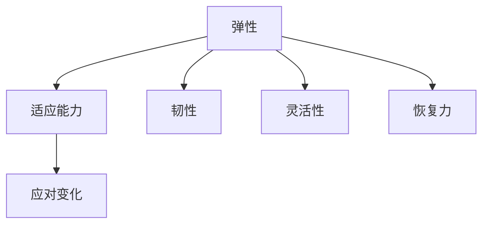

                 

### 《存在的弹性：面对变化时的适应能力》

#### 关键词：
- 变化
- 弹性
- 适应能力
- 个人成长
- 组织发展

#### 摘要：
在当今快速变化的世界中，弹性成为了个人和组织的核心能力。本文探讨了弹性的概念、重要性以及构建个人和组织弹性的策略。通过案例分析，揭示了弹性实践的重要性和实际应用，并展望了未来的发展趋势。

---

### 《存在的弹性：面对变化时的适应能力》

#### 关键词：
- 变化
- 弹性
- 适应能力
- 个人成长
- 组织发展

#### 摘要：
在当今快速变化的世界中，弹性成为了个人和组织的核心能力。本文探讨了弹性的概念、重要性以及构建个人和组织弹性的策略。通过案例分析，揭示了弹性实践的重要性和实际应用，并展望了未来的发展趋势。

### 第一部分：引言

#### 第1章：变化世界的现状与挑战

##### 1.1 现代社会的变化趋势

现代社会正经历着前所未有的变化。全球化、科技进步、社会结构变革等趋势使得变化速度不断加快。例如，互联网和移动设备的普及改变了人们的沟通方式，人工智能和自动化技术正在重塑各行各业。

##### 1.2 变化对个人和社会的影响

变化带来了机会，但同时也带来了挑战。对个人来说，变化可能导致职业转型、心理健康问题、生活节奏加快等。对社会来说，变化可能引发经济不稳定性、文化冲突、资源分配不均等问题。

##### 1.3 弹性的重要性

面对变化，弹性成为了个人和社会的必要能力。弹性意味着能够快速适应变化，保持稳定和持续发展。在个人层面，弹性有助于应对生活和工作中的挑战；在组织层面，弹性有助于适应市场变化，保持竞争优势。

### 第二部分：核心概念与联系

#### 第2章：核心概念与联系

##### 2.1 弹性的定义与类型

弹性是指个体或组织在面对外部变化时能够迅速适应并保持稳定的能力。根据作用范围和表现形式，弹性可以分为个人弹性、组织弹性和社会弹性。

##### 2.2 弹性与适应能力的关系

弹性和适应能力是相互关联的。适应能力是弹性的基础，而弹性是适应能力的体现。一个具有高弹性的个体或组织，通常具有较强的适应能力。

##### 2.3 弹性与其他相关概念的比较

弹性与韧性、灵活性、恢复力等概念密切相关。韧性是指个体或组织在逆境中保持生存和发展的能力；灵活性是指能够迅速调整策略和行为的程度；恢复力是指从危机或灾难中恢复的能力。

#### 图 2-1 弹性与适应能力的关系架构图

### 第三部分：弹性能力的构建

#### 第3章：个人弹性能力建设

##### 3.1 心理韧性培养

心理韧性是指个体在逆境中能够保持积极态度和适应能力。培养心理韧性包括认知重构、情绪管理、积极心态等。

##### 3.2 应对策略与实践

应对策略包括心理调适、压力管理、时间管理等。通过有效的策略和实践，可以提高个人应对变化的能力。

##### 3.3 资源管理与时间管理

资源管理和时间管理是构建个人弹性的重要方面。通过合理分配时间和资源，可以更好地应对变化。

##### 3.4 自我认知与成长

自我认知和成长是弹性能力的重要组成部分。通过不断学习和成长，可以更好地适应变化。

### 第四部分：组织弹性建设

#### 第4章：组织弹性建设

##### 4.1 组织文化的培养

组织文化对弹性具有深远影响。积极、开放、包容的组织文化有助于增强组织弹性。

##### 4.2 弹性组织的构建

弹性组织具备灵活的架构、流程和文化，能够迅速适应变化。构建弹性组织需要从组织设计、流程优化、文化建设等方面入手。

##### 4.3 领导者的角色与责任

领导者是组织弹性的关键推动者。领导者应具备弹性的思维和行动，带领团队应对变化。

##### 4.4 组织变革与适应

组织变革是适应变化的必要过程。组织应学会如何变革以保持弹性，同时确保变革的顺利进行。

### 第五部分：社会弹性与全球挑战

#### 第5章：社会弹性与全球挑战

##### 5.1 社会弹性与可持续发展

社会弹性是实现可持续发展的重要保障。通过提高社会弹性，可以更好地应对自然灾害、经济危机等挑战。

##### 5.2 全球化与跨文化交流

全球化带来了跨文化交流的机遇和挑战。提高社会弹性有助于更好地适应全球化进程。

##### 5.3 应对气候变化与社会弹性

气候变化对社会带来了严峻挑战。提高社会弹性有助于应对气候变化，实现可持续发展。

### 第六部分：弹性实践案例

#### 第6章：案例研究一：企业的弹性实践

##### 6.1 企业背景与面临的变化

某企业在面对市场变化时，通过提升弹性，成功应对了挑战。

##### 6.2 弹性策略的制定与实施

企业制定了包括组织结构优化、文化变革等在内的弹性策略。

##### 6.3 实践成果与评估

实施弹性策略后，企业实现了业务增长和员工满意度提升。

##### 6.4 案例反思与启示

案例为企业提供了构建弹性的有益启示。

#### 第7章：案例研究二：个人弹性实践

##### 7.1 个人背景与变化经历

某人通过提升弹性，成功应对了职业转型和生活变化。

##### 7.2 弹性策略与适应措施

个人采用了包括心理调适、学习新技能等在内的弹性策略。

##### 7.3 成长历程与心得体会

个人分享了弹性实践带来的成长和收获。

##### 7.4 案例启示与借鉴

案例为个人提供了构建弹性的有益借鉴。

### 第七部分：未来展望

#### 第8章：弹性能力的未来发展趋势

##### 8.1 科技对弹性能力的影响

科技进步将进一步推动弹性能力的发展。

##### 8.2 教育与培训的弹性发展

教育和培训将更加注重弹性能力的培养。

##### 8.3 弹性社会与全球治理

全球治理将更加关注弹性社会的建设。

##### 8.4 展望未来：弹性世界的构建

未来，弹性将成为个人和社会的核心竞争力。

### 第八部分：总结与建议

#### 第9章：总结与建议

##### 9.1 弹性的重要性

弹性是适应变化的关键能力，对于个人和社会具有重要意义。

##### 9.2 构建弹性能力的途径

通过个人成长、组织建设和社会发展，可以构建强大的弹性能力。

##### 9.3 推广弹性的策略

制定政策和措施，推动弹性理念和实践的普及。

##### 9.4 建议与未来研究方向

未来研究应关注弹性能力在不同领域的应用和提升策略。

### 附录

#### 附录A：弹性能力评估工具

提供弹性能力评估工具，帮助个体和组织了解自身弹性水平。

#### 附录B：弹性能力建设资源推荐

推荐相关书籍、论文和课程，供读者进一步学习和实践。

---

**作者：AI天才研究院/AI Genius Institute & 禅与计算机程序设计艺术 /Zen And The Art of Computer Programming**

