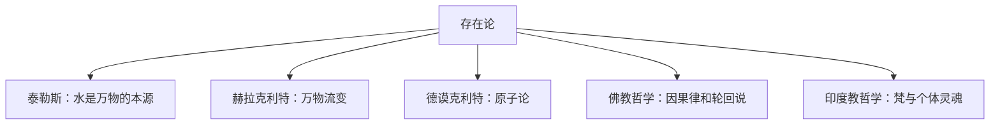
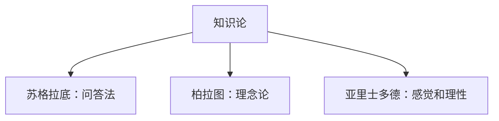
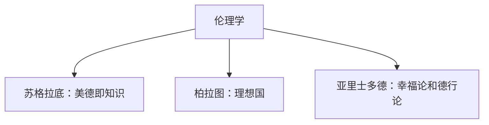
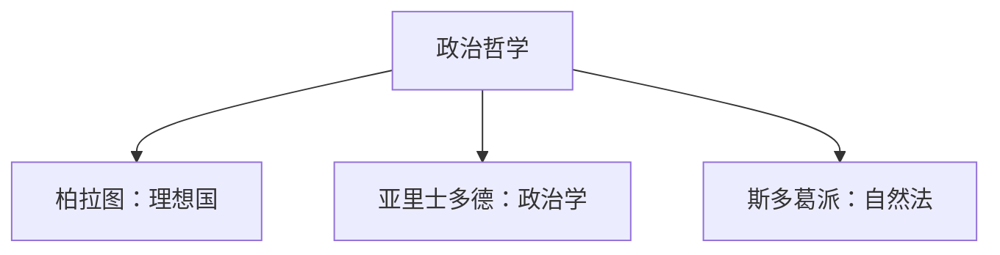

                 

### 第一部分：ancient哲学概述

#### 第1章：ancient哲学的历史与发展

**1.1 ancient哲学的起源**

ancient哲学，通常指的是古希腊哲学和古印度哲学，这两种哲学体系在世界哲学史上占有极其重要的地位。古希腊哲学起源于公元前6世纪，那时的哲学家们开始对自然现象、社会秩序和人类生活进行思考和探索。泰勒斯、赫拉克利特和德谟克利特等人被视为古代哲学的奠基者。

泰勒斯是古希腊哲学的先驱，他提出了“水是万物的本源”这一著名观点，开启了自然哲学的先河。赫拉克利特则强调了“万物流变”的思想，提出了著名的“火”是万物本源的学说。德谟克利特则提出了原子论，认为万物都是由不可分割的原子组成。

古印度哲学则起源于公元前5世纪，佛教哲学是其重要的组成部分。佛教哲学主要关注人生的解脱和宇宙的本质，强调因果律和轮回说。

**1.2 ancient哲学的主要流派**

古希腊哲学的主要流派包括自然哲学、伦理学、政治哲学和美学等。自然哲学主要探讨宇宙的本质和运作规律，代表人物有泰勒斯、赫拉克利特和德谟克利特等。伦理学则关注人类行为的道德规范，代表人物有苏格拉底、柏拉图和亚里士多德等。政治哲学则探讨国家的本质和治理方式，代表人物有柏拉图和亚里士多德等。美学则关注艺术和美的本质，代表人物有亚里士多德和普罗提诺等。

古印度哲学则主要包括佛教哲学、印度教哲学和耆那教哲学。佛教哲学强调因果律和轮回说，印度教哲学则关注个体与宇宙的关系，耆那教哲学则强调非暴力和自我净化。

**1.3 ancient哲学与现代哲学的联系**

ancient哲学对现代哲学产生了深远的影响。现代哲学中的许多问题都可以在ancient哲学中找到线索和启发。

例如，苏格拉底提出的“我知道我什么都不知道”这一思想对现代哲学的怀疑主义产生了重要影响。柏拉图的“理念论”对现代形而上学和逻辑学产生了重要影响。亚里士多德的逻辑学则成为了现代逻辑学的基础。

在伦理学领域，ancient哲学中的道德规范和价值观对现代伦理学产生了重要影响。例如，亚里士多德的幸福论和德行论对现代伦理学产生了深远的影响。

此外，ancient哲学中的许多思想也被现代科学所证实。例如，德谟克利特的原子论在近代物理学中得到了验证，赫拉克利特的“万物流变”思想在现代物理学中得到了应用。

#### 第2章：ancient哲学的核心概念

**2.1 存在论**

存在论是ancient哲学的核心概念之一，主要探讨存在的本质和方式。古希腊哲学中的存在论主要关注的是宇宙的本质和运作规律。

泰勒斯认为“水是万物的本源”，德谟克利特则认为万物都是由不可分割的原子组成。赫拉克利特则强调“万物流变”，认为万物都是在不断变化的过程中。

古印度哲学中的存在论则主要关注个体与宇宙的关系。佛教哲学中的“因果律”和“轮回说”认为，个体的存在状态是由其过去的行为决定的，而宇宙的本质是不断变化的。

**2.2 知识论**

知识论是ancient哲学的另一重要概念，主要探讨知识的本质、来源和有效性等问题。

古希腊哲学中的知识论主要关注如何获取真正的知识。苏格拉底提出了“问答法”，柏拉图则通过“理念论”来解释知识的本质。

古印度哲学中的知识论则主要关注人类如何通过修行和悟道来获得真正的知识。佛教哲学中的“因果律”和“八正道”被认为是获取真正知识的重要途径。

**2.3 伦理学**

伦理学是ancient哲学中探讨道德原则和价值观的重要领域。

古希腊哲学中的伦理学主要关注如何过一种道德的生活。苏格拉底提出了“德行即知识”的观点，柏拉图则通过“理想国”来探讨道德的生活。

古印度哲学中的伦理学则主要关注如何通过修行和悟道来实现个体的解脱。佛教哲学中的“四无量心”和“八正道”被认为是实现道德生活的重要方法。

**2.4 政治哲学**

政治哲学是ancient哲学中探讨政治权力的本质、来源、分配等问题的重要领域。

古希腊哲学中的政治哲学主要关注如何建立一个正义的国家。柏拉图通过“理想国”来探讨国家的本质和治理方式，亚里士多德则通过“政治学”来分析国家的本质和治理原则。

古印度哲学中的政治哲学则主要关注如何通过宗教和道德来治理国家。佛教哲学中的“慈悲为怀”和“智慧”被认为是治理国家的重要原则。

**REASONING STEP BY STEP:**

- **第1步**：了解ancient哲学的起源和发展，包括古希腊哲学和古印度哲学。
- **第2步**：研究ancient哲学的主要流派，如自然哲学、伦理学、政治哲学和美学。
- **第3步**：探讨ancient哲学的核心概念，如存在论、知识论、伦理学和政治哲学。
- **第4步**：分析ancient哲学与现代哲学的联系，以及它们如何影响现代哲学。

通过以上步骤，我们能够更深入地理解ancient哲学的内涵和影响，为后续章节的讨论奠定基础。

### 第1章：ancient哲学的起源与发展

#### 1.1 ancient哲学的起源

ancient哲学的起源可以追溯到古希腊和古印度，这两个文明在人类哲学史上占据了重要地位。古希腊哲学起源于公元前6世纪，泰勒斯被认为是古希腊哲学的奠基者之一。泰勒斯提出了“水是万物的本源”的观点，这一思想奠定了自然哲学的基础。

紧接着，赫拉克利特进一步发展了自然哲学，他提出了“万物流变”的思想，认为火是万物的本源。赫拉克利特的这一思想强调了变化是宇宙的本质，对后世的哲学思想产生了深远的影响。

德谟克利特则提出了原子论，认为万物都是由不可分割的原子组成。德谟克利特的原子论成为了古希腊哲学中最为重要的科学思想之一，对后来的科学家和哲学家产生了重要的影响。

与此同时，古印度哲学也在大约公元前5世纪开始兴起，佛教哲学是其重要的组成部分。佛教哲学强调因果律和轮回说，认为个体的存在状态是由其过去的行为决定的。佛教哲学中的因果律和轮回说对后来的印度教哲学和耆那教哲学产生了深远的影响。

#### 1.2 ancient哲学的主要流派

ancient哲学的主要流派包括自然哲学、伦理学、政治哲学和美学等。

**自然哲学**是古希腊哲学的核心，它探讨宇宙的本质和运作规律。自然哲学关注的是自然界中的各种现象，如水、火、风等的基本属性，以及这些现象之间的关系。泰勒斯、赫拉克利特和德谟克利特等人的思想都是自然哲学的重要组成部分。

**伦理学**则是探讨道德原则和人类行为的哲学分支。古希腊哲学中的伦理学主要关注如何过一种道德的生活，如何实现个人的幸福和社会的和谐。苏格拉底、柏拉图和亚里士多德等人的思想对伦理学的发展产生了深远的影响。苏格拉底提出了“德行即知识”的观点，柏拉图通过“理念论”探讨了道德的本质，亚里士多德则提出了幸福论和德行论。

**政治哲学**探讨政治权力的本质、来源、分配等问题。古希腊哲学中的政治哲学主要关注如何建立一个正义的国家，如何治理一个良好的社会。柏拉图的“理想国”和亚里士多德的“政治学”都是政治哲学的重要著作。

**美学**则关注艺术和美的本质。古希腊哲学中的美学探讨了艺术的目的和美的价值，亚里士多德的美学理论对后世的艺术理论和美学研究产生了重要影响。

在古印度哲学中，主要的流派包括佛教哲学、印度教哲学和耆那教哲学。**佛教哲学**强调因果律和轮回说，关注个体的解脱和自我修行。佛教哲学中的“四无量心”和“八正道”被认为是实现道德生活的重要方法。**印度教哲学**则关注个体与宇宙的关系，强调个人修行和解脱。**耆那教哲学**则强调非暴力和自我净化，追求精神上的纯净和解脱。

#### 1.3 ancient哲学与现代哲学的联系

ancient哲学与现代哲学之间存在诸多联系，ancient哲学的思想对现代哲学产生了深远的影响。

首先，ancient哲学中的许多核心概念和理论在现代哲学中仍然具有重要地位。例如，苏格拉底的“问答法”和“美德即知识”的观点对现代哲学中的逻辑学和伦理学产生了重要影响。柏拉图的“理念论”和亚里士多德的逻辑学则成为了现代逻辑学的基础。

其次，ancient哲学中的许多思想在现代科学中得到了验证和应用。例如，德谟克利特的原子论在近代物理学中得到了验证，赫拉克利特的“万物流变”思想在量子物理学中得到了应用。

此外，ancient哲学中的许多价值观和伦理观念对现代社会也产生了深远的影响。例如，古希腊哲学中的“理性主义”和“个人主义”观念对现代社会的思想和文化产生了重要影响。

最后，ancient哲学中的许多思想和方法论对现代哲学的研究方法和思维方式也产生了重要影响。例如，ancient哲学家们注重逻辑推理和实证研究的方法对现代哲学的研究方法产生了深远的影响。

综上所述，ancient哲学的起源、主要流派和与现代哲学的联系构成了我们对ancient哲学的初步认识。通过深入研究和理解ancient哲学，我们可以更好地理解现代哲学的发展脉络，以及古代智慧和现代智慧的交汇点。

### 第2章：ancient哲学的核心概念

ancient哲学的核心概念是理解古代哲学思想的关键，这些概念不仅在当时具有重要的哲学意义，而且在现代哲学和科学中仍然具有深远的影响。以下是ancient哲学中几个重要的核心概念，包括存在论、知识论、伦理学和政治哲学。

#### 2.1 存在论

存在论是哲学探讨存在的本质和方式的一个核心领域。在古希腊哲学中，存在论的讨论主要集中在宇宙的本质和事物的实在性上。

- **泰勒斯的“水是万物的本源”**：泰勒斯认为，水是构成宇宙万物的基本元素，这一观点开启了对自然界本质的探讨。
- **赫拉克利特的“万物流变”**：赫拉克利特提出，万物都在不断变化，而火是这些变化的源泉。他认为，变化是宇宙的恒定法则。
- **德谟克利特的“原子论”**：德谟克利特认为，万物由不可分割的原子组成，原子是构成宇宙的基本单位，不同原子的组合构成了不同的物质。

在古印度哲学中，存在论的讨论主要关注个体与宇宙的关系。

- **佛教哲学中的“因果律”和“轮回说”**：佛教哲学认为，个体的存在状态是由其过去的行为（因果关系）决定的，轮回是因果律在时间维度上的体现。
- **印度教哲学中的“梵”**：印度教哲学中的梵（Brahman）被认为是宇宙的本质和终极实在，个体灵魂（Atman）与梵是同一的，通过修行可以实现与梵的合一。

**Mermaid流程图：存在论的概念架构**



#### 2.2 知识论

知识论探讨知识的本质、来源和有效性等问题。ancient哲学家们对知识本质的探讨为后世的认知科学和哲学研究奠定了基础。

- **苏格拉底：“问答法”**：苏格拉底通过对话和问答的方式探讨知识，他强调知识是通过提问和反思获得的。
- **柏拉图：“理念论”**：柏拉图认为，真正的知识来自于对理念世界的认识，理念是真实存在的基本形式。
- **亚里士多德：“感觉和理性”**：亚里士多德认为，知识是通过感觉和理性相结合获得的，感觉提供了知识的原材料，理性则是对这些原材料的加工和理解。

**Mermaid流程图：知识论的概念架构**



#### 2.3 伦理学

伦理学探讨道德原则和价值观，关注人类行为的道德评价和道德规范。

- **苏格拉底：“美德即知识”**：苏格拉底认为，美德是知识的一种形式，道德行为是基于知识的。
- **柏拉图：“理想国”**：柏拉图在《理想国》中提出了哲学家王的理念，认为哲学家应该是统治者，以实现社会的道德和正义。
- **亚里士多德：“幸福论”和“德行论”**：亚里士多德认为，道德的目的是实现幸福，而德行是幸福的基础。他认为，通过培养德行，个体可以实现道德上的完善。

**Mermaid流程图：伦理学的概念架构**



#### 2.4 政治哲学

政治哲学探讨政治权力的本质、来源、分配等问题，关注社会的组织和治理。

- **柏拉图：“理想国”**：柏拉图在《理想国》中提出了一个由哲学家王统治的理想国家，强调智慧在治理中的重要性。
- **亚里士多德：“政治学”**：亚里士多德在《政治学》中探讨了政治权力的本质和分配，提出了民主和寡头制等不同的治理模式。
- **斯多葛派：“自然法”**：斯多葛派认为，自然法是宇宙的根本法则，人类社会的法律和道德都应遵循自然法。

**Mermaid流程图：政治哲学的概念架构**



通过以上对ancient哲学核心概念的探讨，我们可以看到这些概念不仅在当时具有重要的哲学意义，而且在现代哲学和科学中仍然具有深远的影响。这些思想为理解人类存在的本质、知识的本质、道德的原则和治理社会的方式提供了宝贵的启示。

### 第3章：ancient哲学对现代生活的启示

ancient哲学对现代生活产生了深远的影响，许多ancient哲学思想在现代社会中依然具有重要的启示作用。以下是ancient哲学对现代生活的一些具体启示。

#### 3.1 ancient哲学对个人成长的影响

ancient哲学中的许多思想对于个人的成长和发展有着重要的指导意义。

- **苏格拉底的“问答法”**：苏格拉底通过对话和问答的方式探讨知识，这种方法鼓励人们进行批判性思考和自我反思。在现代社会中，这种思考方式可以帮助人们培养独立思考和解决问题的能力。
- **柏拉图的“理念论”**：柏拉图认为，真正的知识来自于对理念世界的认识。这一观点启示现代人在追求知识和智慧的过程中，应该超越表面的现象，探寻背后的本质。
- **亚里士多德的“幸福论”**：亚里士多德认为，道德的目的是实现幸福。这一观点提醒现代人在追求个人成长的过程中，不仅要追求物质上的成功，还要关注精神上的满足和道德上的完善。

**Python代码示例：批判性思考**

```python
def critical_thinking(question):
    """
    模拟苏格拉底的问答法，进行批判性思考。
    :param question: 需要回答的问题
    :return: 思考的结果
    """
    print(f"思考问题：{question}")
    response = input("请回答问题：")
    while not response:
        print("回答不能为空，请重新回答。")
        response = input("请回答问题：")
    print(f"你的回答是：{response}")
    return response

# 使用示例
answer = critical_thinking("什么是幸福？")
print(f"思考后的答案：{answer}")
```

#### 3.2 ancient哲学对人际关系的影响

ancient哲学中的伦理学思想对人际关系有着积极的启示。

- **苏格拉底的“美德即知识”**：这一观点强调，一个人的美德是其知识的表现。在现代社会中，这意味着人们应该通过学习和自我提升来培养良好的道德品质，以改善人际关系。
- **柏拉图的“理想国”**：柏拉图在《理想国》中提出了哲学家王的理念，认为哲学家应该是统治者，以实现社会的道德和正义。这一观点启示现代人在处理人际关系时，应该以公正和智慧为指导原则。
- **亚里士多德的“德行论”**：亚里士多德认为，德行是幸福的基础。这一观点提醒现代人在人际关系中，应该注重培养良好的道德品质，以建立和谐的人际关系。

**Python代码示例：道德品质评分**

```python
def moral_score(traits):
    """
    根据个人的道德品质评分。
    :param traits: 道德品质列表
    :return: 道德品质评分
    """
    scores = {'诚实': 10, '宽容': 9, '公正': 8, '勇气': 7, '勤奋': 6}
    total_score = 0
    for trait in traits:
        if trait in scores:
            total_score += scores[trait]
    return total_score

# 使用示例
traits = ["诚实", "宽容", "公正", "耐心"]
score = moral_score(traits)
print(f"道德品质评分：{score}/30")
```

#### 3.3 ancient哲学对社会责任的影响

ancient哲学中的政治哲学思想对现代社会中的社会责任有着深刻的启示。

- **柏拉图的“理想国”**：柏拉图认为，哲学家应该是统治者，以实现社会的道德和正义。这一观点启示现代社会的领导者，应该具备道德智慧和公正心态，以服务社会和人民。
- **亚里士多德的政治哲学**：亚里士多德探讨了不同政治体制的优缺点，提出了民主和寡头制等治理模式。这一观点提醒现代社会的政策制定者，应该结合实际情况，选择最适合社会的治理模式。
- **斯多葛派的“自然法”**：斯多葛派认为，自然法是宇宙的根本法则，人类社会的法律和道德都应遵循自然法。这一观点启示现代社会，应该追求正义和公平，尊重自然和社会的规律。

**Python代码示例：自然法原则**

```python
def natural_law Principle(principle):
    """
    检查某个原则是否符合自然法。
    :param principle: 原则
    :return: 判断结果
    """
    natural_law_principles = [
        "正义", "公平", "自由", "平等", "和谐"
    ]
    if principle in natural_law_principles:
        return "符合自然法原则"
    else:
        return "不符合自然法原则"

# 使用示例
principle = "尊重自然规律"
result = natural_law_Principle(principle)
print(f"{principle}：{result}")
```

通过这些ancient哲学思想的启示，现代人可以更好地理解个人成长、人际关系和社会责任的重要性，从而在现代社会中更好地实现自身的价值和责任。ancient哲学的智慧为现代生活提供了宝贵的指导和启示，帮助人们在面对复杂多变的社会环境时，依然能够坚守道德原则和追求正义。

### 第4章：ancient哲学在现代社会中的应用

ancient哲学的智慧不仅在理论层面上具有重要价值，而且在现代社会中的应用也极为广泛。以下是ancient哲学在几个关键领域中的具体应用，包括管理、心理学和艺术创作。

#### 4.1 ancient哲学在管理中的应用

ancient哲学中的许多思想为现代企业管理提供了宝贵的指导。

- **柏拉图的“理想国”**：柏拉图在《理想国》中提出了哲学家王的理念，认为哲学家应该是统治者。这一思想在现代企业管理中启示我们，领导者应该具备智慧和道德，以公正和智慧指导团队。
- **亚里士多德的“德行论”**：亚里士多德认为，德行是幸福的基础。这一观点提醒现代企业家，在追求企业发展的同时，要注重培养员工的道德品质，以建立和谐的工作环境。
- **斯多葛派的“自我控制”**：斯多葛派强调自我控制和理性思维，这一思想可以帮助企业管理者在面对市场波动和挑战时保持冷静和理性，做出明智的决策。

**Python代码示例：领导者道德评分**

```python
def leader_moral_score(traits):
    """
    根据领导者的道德品质评分。
    :param traits: 道德品质列表
    :return: 道德品质评分
    """
    scores = {'公正': 10, '诚实': 9, '智慧': 8, '勇气': 7, '宽容': 6}
    total_score = 0
    for trait in traits:
        if trait in scores:
            total_score += scores[trait]
    return total_score

# 使用示例
traits = ["公正", "诚实", "智慧", "勇气"]
score = leader_moral_score(traits)
print(f"领导者道德评分：{score}/30")
```

#### 4.2 ancient哲学在心理学中的应用

ancient哲学中的思想对现代心理学有着重要的启示作用。

- **苏格拉底的“问答法”**：苏格拉底通过对话和问答的方式探讨知识，这种方法在现代心理学中可以用来促进个体的自我反思和自我认知。
- **柏拉图的“理念论”**：柏拉图认为，真正的知识来自于对理念世界的认识。这一观点启示现代心理学家，应该关注个体的内在世界，探索意识和心理的本质。
- **亚里士多德的“感觉和理性”**：亚里士多德认为，知识是通过感觉和理性相结合获得的。这一观点提醒现代心理学家，在研究心理现象时，要综合考虑个体的感知和认知过程。

**Python代码示例：心理测试**

```python
def psychological_test(questions):
    """
    模拟苏格拉底的问答法，进行心理测试。
    :param questions: 需要回答的问题列表
    :return: 心理测试结果
    """
    scores = {'积极': 0, '消极': 0}
    for question in questions:
        response = input(f"{question}\n请选择积极或消极：")
        if response == "积极":
            scores['积极'] += 1
        elif response == "消极":
            scores['消极'] += 1
    return scores

# 使用示例
questions = [
    "你更愿意选择稳定的工作还是具有挑战性的工作？",
    "在团队合作中，你更倾向于主动还是被动？",
    "当你遇到困难时，你更倾向于寻求帮助还是独自解决？"
]
results = psychological_test(questions)
print(f"心理测试结果：{results}")
```

#### 4.3 ancient哲学在艺术创作中的应用

ancient哲学中的思想对现代艺术创作有着深刻的启发。

- **赫拉克利特的“万物流变”**：赫拉克利特认为，万物都在不断变化，这一观点启示艺术家在创作中要把握变化的本质，探索不同艺术形式的可能。
- **亚里士多德的美学理论**：亚里士多德在《诗学》中探讨了艺术的美学本质，他的理论对现代艺术创作提供了重要的指导。
- **斯多葛派的“自然法”**：斯多葛派认为，自然法是宇宙的根本法则，这一观点启示艺术家在创作中要遵循自然的规律，探索和谐与平衡的美。

**Python代码示例：艺术灵感生成器**

```python
import random

def generate_art_inspiration():
    """
    生成艺术灵感的短语。
    :return: 艺术灵感短语
    """
    inspirations = [
        "在流逝的时间里，捕捉永恒的美。",
        "用色彩描绘内心的世界。",
        "在纷繁复杂中，寻找简单之美。",
        "让艺术成为自然的颂歌。",
        "在变化中，寻找不变的真理。"
    ]
    return random.choice(inspirations)

# 使用示例
inspiration = generate_art_inspiration()
print(f"艺术灵感短语：{inspiration}")
```

通过这些具体应用示例，我们可以看到ancient哲学的智慧在现代社会的各个方面都发挥着重要的作用。ancient哲学不仅为我们的理论思考提供了丰富的资源，而且在实际应用中，它帮助我们更好地理解和应对现代生活中的各种挑战。

### 第5章：ancient哲学的未来展望

ancient哲学对现代社会产生了深远的影响，其智慧在未来的发展中也具有广阔的前景。未来，ancient哲学将继续与现代科技、哲学和其他领域的交叉融合，带来新的思考和启示。

#### 5.1 ancient哲学对未来的启示

ancient哲学的许多思想在未来将继续指导我们的思维和行为。

- **苏格拉底的“问答法”**：在人工智能时代，问答法可以成为人类与AI互动的重要方式，帮助人们更好地理解复杂的问题和概念。
- **柏拉图的“理念论”**：在虚拟现实和增强现实技术日益发展的背景下，理念论可以启发我们思考现实与虚拟之间的关系，探索新的认知领域。
- **亚里士多德的“幸福论”**：随着社会的发展和科技的进步，人们对于幸福和满足的追求将更加多元，亚里士多德的幸福论将帮助我们理解如何实现个人的幸福和社会的和谐。

#### 5.2 ancient哲学的未来发展趋势

ancient哲学在未来将呈现出以下几个发展趋势：

- **跨学科融合**：ancient哲学将与自然科学、社会科学和人文科学等领域深度融合，产生新的理论和方法。
- **技术应用**：ancient哲学的思想将被应用于人工智能、大数据和虚拟现实等领域，为技术的发展提供新的思路。
- **全球视野**：ancient哲学将在全球范围内得到更广泛的传播和应用，其智慧将为不同文化背景的人们提供共同的思考资源。

#### 5.3 ancient哲学与现代科技的融合

ancient哲学与现代科技的融合将为未来带来新的创新。

- **人工智能与ancient哲学**：人工智能可以模拟ancient哲学中的思考模式，如问答法、理念论等，为人类提供更加智能化的解决方案。
- **区块链与伦理学**：区块链技术可以应用于ancient哲学中的伦理学思想，如公正、透明等，为建立更加公正和透明的社会提供技术支持。
- **虚拟现实与美学**：虚拟现实技术可以再现ancient哲学中的美学思想，如亚里士多德的美学理论，为人们提供更加丰富和多样的艺术体验。

通过未来展望，我们可以看到ancient哲学将继续在现代社会中发挥重要作用，其智慧将为我们应对未来挑战提供宝贵的启示。

### 第6章：《庄子》解读

《庄子》是中国古代哲学的经典著作之一，被誉为道家哲学的巅峰之作。它不仅在中国哲学史上具有重要地位，而且在现代哲学和思想界中也产生了深远的影响。在本节中，我们将详细解读《庄子》的核心思想，并探讨其对现代生活的启示。

#### 6.1 《庄子》概述

《庄子》又名《南华经》，是道家学派的重要经典之一。它由庄子及其后学所著，共33篇，分为内篇、外篇和杂篇。庄子以其独特的思想和深刻的洞察力，阐述了道家哲学的核心观念，包括自然、无为、逍遥等。

#### 6.2 《庄子》的核心思想

**自然**

庄子的自然观是道家哲学的重要组成部分，他主张顺应自然、尊重自然规律。在《庄子》中，庄子多次强调“道法自然”，认为宇宙万物都是自然而然的，人们应该顺应自然而非违背自然。

**无为**

庄子的“无为”思想是其哲学体系的核心。无为并不是无所作为，而是反对过度干预和强制，主张顺应事物的自然发展。无为可以使人们摆脱功利心和世俗的束缚，达到内心的平静和自由。

**逍遥**

逍遥是庄子的理想境界，指的是个体在精神上达到自由自在的状态。逍遥不仅是物质上的自由，更是心灵上的自由。庄子认为，通过修炼和悟道，人们可以超越现实的束缚，达到真正的自由。

**齐物论**

《庄子》中的“齐物论”探讨了事物的相对性和多元性。庄子认为，万物都是相对的，没有绝对的固定本质。这一思想启示我们，在面对复杂多变的世界时，要超越片面和固有的观念，以多元和开放的心态看待事物。

#### 6.3 《庄子》对现代的启示

**顺应自然**

在现代社会中，人们常常感到压力和焦虑，很大程度上是因为不顺应自然。庄子的“道法自然”提醒我们，要顺应自然规律，以平和的心态面对生活中的各种挑战。

**无为而治**

现代社会竞争激烈，人们常常感到被功利心和社会压力所束缚。庄子的“无为”思想可以为我们提供一种解脱之道，即减少不必要的干预和强制，顺应事物的自然发展，从而达到内心的平和与自由。

**追求逍遥**

在物质生活丰富的现代社会，人们往往忽略了精神层面的需求。庄子的“逍遥”思想启示我们，要追求心灵的自由和精神的满足，超越物质和功利的束缚，实现真正的自我。

**齐物论**

现代社会的复杂性和多样性要求我们具备开放和包容的心态。庄子的“齐物论”提醒我们，要超越片面和固有的观念，以多元和开放的心态看待世界，才能更好地适应和应对复杂的社会环境。

**Python代码示例：顺应自然和追求逍遥**

```python
import random

def find_balance():
    """
    模拟庄子顺应自然和追求逍遥的思想，找到内心的平衡。
    :return: 内心平衡状态
    """
    emotions = ["焦虑", "平静", "快乐", "忧伤"]
    balance = random.choice(emotions)
    if balance == "焦虑":
        print("内心的平衡状态：尝试平静，顺应自然。")
    elif balance == "平静":
        print("内心的平衡状态：保持平和，享受当下。")
    elif balance == "快乐":
        print("内心的平衡状态：继续快乐，追求逍遥。")
    elif balance == "忧伤":
        print("内心的平衡状态：调整心态，寻求解脱。")
    return balance

# 使用示例
current_state = find_balance()
print(f"当前内心状态：{current_state}")
```

通过《庄子》的解读，我们可以看到庄子哲学对现代生活的深刻启示。顺应自然、无为而治、追求逍遥和齐物论等思想，不仅为我们提供了哲学上的指导，也为我们应对现代生活中的各种挑战提供了实用的方法。

### 第7章：《论语》解读

《论语》是中国古代儒家经典，由孔子及其弟子编撰而成，是儒家哲学思想的重要代表。在《论语》中，孔子通过一系列对话和论述，阐述了其关于人生、道德、教育和政治的核心思想。在本节中，我们将深入探讨《论语》的核心思想，并探讨其对现代生活的启示。

#### 7.1 《论语》概述

《论语》共收录了孔子及其弟子的言行，分为二十篇。每一篇都包含了关于仁爱、礼节、智慧、教育等方面的论述。通过这些论述，孔子传达了他的哲学思想和教育理念。

#### 7.2 《论语》的核心思想

**仁**

“仁”是《论语》中的核心概念，孔子认为仁是人类最高的道德准则。仁不仅指爱心和同情心，还包括对他人的尊重、关怀和公正。孔子提出“己所不欲，勿施于人”的原则，强调人们应以仁爱之心对待他人。

**礼**

礼在《论语》中具有非常重要的地位，孔子认为礼是维护社会秩序和人际关系的重要工具。礼不仅是一种行为规范，更是一种精神状态。孔子强调“礼之用，和为贵”，认为礼的目的在于实现社会和谐。

**智**

智慧是孔子思想的重要组成部分。孔子认为，智慧不仅仅是知识，更是一种洞察力和判断力。他提出了“知之为知之，不知为不知，是知也”的观点，强调实事求是和谦虚的态度。

**教**

教育是孔子思想中的一个重要方面。孔子主张“有教无类”，认为每个人都应该有机会接受教育。他强调教育的重要性，并提出了一系列教育原则，如“温故而知新”，“学而时习之，不亦说乎”。

#### 7.3 《论语》对现代的启示

**仁爱**

在现代社会中，仁爱依然是维护人际关系和社会和谐的重要基础。孔子提出的“己所不欲，勿施于人”的原则，可以帮助我们更好地理解和尊重他人，促进人际关系的和谐。

**礼仪**

尽管现代社会更加开放和自由，但礼仪仍然在维护社会秩序和人际交往中发挥着重要作用。孔子强调的礼仪观念，如“礼之用，和为贵”，提醒我们在日常生活中注重礼貌和尊重，以建立和谐的社会环境。

**智慧**

在信息爆炸的时代，智慧变得尤为重要。孔子提出的“知之为知之，不知为不知，是知也”的观点，提醒我们在面对知识和信息时，要有明确的认识和判断力，避免盲目跟风和错误判断。

**教育**

教育是个人成长和社会进步的重要基石。孔子的“有教无类”和“学而时习之，不亦说乎”的教育理念，提醒我们教育的重要性，每个人都应该有机会接受良好的教育，不断学习和进步。

**Python代码示例：仁爱与智慧**

```python
def demonstrate_ren_ai():
    """
    模拟孔子关于仁爱和智慧的观点。
    """
    print("仁爱：己所不欲，勿施于人。")
    print("智慧：知之为知之，不知为不知，是知也。")

# 使用示例
demonstrate_ren_ai()
```

通过《论语》的解读，我们可以看到孔子哲学对现代生活的深刻启示。仁爱、礼仪、智慧和教育等核心思想，不仅为我们的道德修养提供了指导，也为我们构建和谐社会提供了宝贵的智慧。

### 第8章：《道德经》解读

《道德经》是中国古代哲学的经典之作，被尊为道家哲学的基石。由春秋时期的道家创始人老子所著，全书共800余字，以简洁而深邃的语言阐述了道家哲学的核心观念。在本节中，我们将深入探讨《道德经》的核心思想，并探讨其对现代生活的启示。

#### 8.1 《道德经》概述

《道德经》分为上下两篇，共81章，主要讨论宇宙和人生的本质、道德修养和政治治理等问题。老子的思想主张顺应自然、无为而治，强调“道”是宇宙的根本法则，而“德”则是人们应该遵循的道德准则。

#### 8.2 《道德经》的核心思想

**道**

“道”是《道德经》的核心概念，指的是宇宙的根本法则和万物运行的根本原理。老子认为，道是看不见、摸不着的，却又无处不在，是创造一切的力量。道具有自然、无为、柔弱、朴实的特点。

**德**

“德”是人们应该遵循的道德准则，也是道的体现。老子认为，道德高尚的人应具备谦虚、宽容、无私、不争的品质。德行高的人能够顺应自然，不自私、不强求，从而达到内心的平静和自由。

**无为**

“无为”是老子的治国理念，主张不干预、不强制，让事物自然发展。无为并不是无所作为，而是在不违背自然规律的前提下，以最小的人力、物力实现最大的效果。无为而治可以减少社会矛盾，实现社会的和谐与稳定。

**辩证法**

《道德经》中包含了丰富的辩证法思想，如“祸兮，福之所倚；福兮，祸之所伏”。老子认为，事物总是具有两面性，对立和矛盾是事物发展的动力。这一思想启示我们在面对问题时，要全面、辩证地看待，避免片面和极端。

**辩证法：阴阳对立**

在《道德经》中，阴阳对立是一个重要的辩证法思想。阴阳是万物的基本属性，相互依存、相互转化。老子认为，阴阳的平衡是宇宙和谐的基础。阴阳对立的辩证法思想，可以帮助我们理解事物的复杂性，找到解决问题的方法。

**Mermaid流程图：阴阳对立的辩证法**

```mermaid
graph TD
    A[阳]
    B[阴]
    A--依存->B
    B--依存->A
```

#### 8.3 《道德经》对现代的启示

**顺应自然**

在现代社会，人们往往过于追求功利和成功，忽视自然规律。老子的“道法自然”提醒我们，要顺应自然，尊重自然的规律，以平和的心态面对生活的起伏。

**无为而治**

现代社会竞争激烈，管理者常常感到压力巨大。老子的“无为而治”启示我们，要减少不必要的干预，让事物自然发展。这不仅有助于减轻管理者的压力，还可以减少社会矛盾，实现社会的和谐。

**辩证法思想**

在复杂多变的社会环境中，辩证法思想可以帮助我们全面、理性地看待问题。通过辩证法，我们可以认识到事物的两面性，避免片面和极端，找到解决问题的最佳方法。

**Python代码示例：辩证法应用**

```python
def demonstrate_yin_yang(balance):
    """
    模拟阴阳对立的辩证法，展示平衡状态。
    :param balance: 平衡状态（"正" 或 "负"）
    """
    if balance == "正":
        print("阴阳平衡：正面的力量在发挥作用。")
    elif balance == "负":
        print("阴阳平衡：负面的力量在发挥作用。")
    else:
        print("阴阳平衡：需要调整，找到平衡点。")

# 使用示例
current_balance = "负"
demonstrate_yin_yang(current_balance)
```

通过《道德经》的解读，我们可以看到老子哲学对现代生活的深刻启示。顺应自然、无为而治和辩证法思想，不仅为我们的道德修养提供了指导，也为我们应对现代生活中的各种挑战提供了宝贵的智慧。

### 附录1：ancient哲学相关术语解释

在ancient哲学中，有许多重要的术语和概念，这些术语构成了古代哲学思想的核心。以下是ancient哲学中一些关键术语的解释：

**道（Tao）**

“道”是古代哲学中最基本的术语之一，尤其在道家哲学中占有重要地位。道被认为是宇宙的根本法则和万物运行的原理，无形而无处不在。道强调顺应自然、无为而治，追求内在的和谐与平衡。

**德（De）**

“德”是指道德品质和行为准则，是“道”在人类行为中的体现。德强调个体的内在修养和道德追求，包括谦虚、宽容、无私、不争等品质。

**无为（Wu Wei）**

“无为”是一种哲学思想和治国理念，主张不干预、不强制，让事物自然发展。无为并不是无所作为，而是在不违背自然规律的前提下，以最小的人力、物力实现最大的效果。

**阴阳（Yin and Yang）**

阴阳是古代哲学中的一种辩证法思想，指的是万物的基本属性，相互依存、相互转化。阴阳对立统一，共同构成宇宙的和谐与平衡。

**仁（Ren）**

“仁”是儒家哲学中的核心概念，指的是爱心、同情心和对他人的尊重。仁爱是道德的最高准则，强调己所不欲，勿施于人。

**礼（Li）**

“礼”是一种行为规范和社会秩序的象征，强调尊卑有序、礼仪规范。礼是维护社会和谐与人际关系的重要工具。

**理（Li）**

“理”在儒家哲学中指的是道德原则和天理，是万物运行的根本原理。理强调道德行为和理性思考，是儒家伦理学的基础。

**智（Zhi）**

“智”是指智慧、知识和判断力。智强调理性思考和洞察力，是儒家教育中追求的目标之一。

通过对这些术语的解释，我们可以更好地理解ancient哲学的基本概念和思想体系，从而为现代哲学研究提供有力的理论支持。

### 附录2：ancient哲学经典著作推荐

ancient哲学经典著作丰富而博大，以下是一些重要的ancient哲学经典著作，这些著作不仅对古代哲学的发展产生了深远影响，而且在现代哲学研究中依然具有重要价值。

1. **《庄子》（ Zhuangzi ）**：这是道家哲学的代表作，由庄子及其弟子编写。该书以寓言和故事的形式，阐述了道家哲学的核心观念，如顺应自然、无为而治、逍遥等。

2. **《论语》（ Lunyu ）**：这是儒家哲学的经典著作，记录了孔子及其弟子的言行。该书涵盖了伦理学、教育学和政治哲学等多个领域，是研究儒家思想的重要资料。

3. **《道德经》（ Dao De Jing ）**：这是道家哲学的另一部重要著作，由老子所著。该书以简洁的语言阐述了道家哲学的基本原理，如道、德、无为等。

4. **《柏拉图全集》（ Works of Plato ）**：柏拉图是古希腊哲学的重要代表，其著作涵盖了伦理学、政治哲学、美学等多个领域。其中，《理想国》（ Republic ）和《斐多》（ Phaedo ）是研究柏拉图哲学的必读之作。

5. **《亚里士多德全集》（ Works of Aristotle ）**：亚里士多德是古希腊哲学的另一重要代表，其著作涵盖了逻辑学、物理学、伦理学、政治学等多个领域。其中，《尼各马可伦理学》（ Nicomachean Ethics ）和《政治学》（ Politics ）是研究亚里士多德哲学的重要资料。

6. **《阿维罗伊哲学》（ Avicenna's Philosophy ）**：阿维罗伊是中世纪阿拉伯哲学的重要代表，其著作对古代哲学和现代哲学都产生了深远影响。其中，《治愈灵魂之书》（ The Book of Healing ）是研究阿维罗伊哲学的必读之作。

这些ancient哲学经典著作不仅为我们提供了古代哲学的智慧，也为我们理解和研究现代哲学提供了宝贵的资源。读者可以根据自己的兴趣和需求选择合适的著作进行深入阅读和研究。

### 附录3：ancient哲学研究资源推荐

研究ancient哲学需要丰富的资源和多样化的研究方法。以下是一些推荐的ancient哲学研究资源和工具，这些资源将为研究人员和爱好者提供宝贵的信息和指导。

1. **《剑桥古代哲学指南》（ The Cambridge Companion to Ancient Philosophy ）**：这是一部由剑桥大学出版社出版的权威性指南，涵盖了古希腊哲学和古罗马哲学的主要流派和思想。

2. **《牛津古代哲学史》（ The Oxford History of Ancient Philosophy ）**：这是由牛津大学出版社出版的多卷本历史，详细介绍了古代哲学的发展历程和主要思想。

3. **《古希腊哲学文献精选》（ The Essential Works of Ancient Greek Philosophy ）**：这是一部精选集，包含了古希腊哲学中最重要的著作，如柏拉图的《理想国》、亚里士多德的《尼各马可伦理学》等。

4. **《古印度哲学文献精选》（ The Essential Works of Ancient Indian Philosophy ）**：这是一部精选集，包含了古印度哲学中最重要的著作，如《奥义书》、《法显传》等。

5. **《哲学百科全书》（ The Encyclopedia of Philosophy ）**：这是一部涵盖广泛哲学领域的大型百科全书，包括了ancient哲学的相关条目和详细解释。

6. **《古希腊哲学与科学史数据库》（ Database of Greek and Roman Science ）**：这是一个综合性的数据库，提供了大量关于古希腊和古罗马哲学和科学的历史资料。

7. **《ancient哲学在线资源》（ Online Resources for Ancient Philosophy ）**：这是一个由多个学术机构和研究者提供的在线资源平台，包含了ancient哲学相关的书籍、文章、讲座和文献。

通过这些资源和工具，研究人员和爱好者可以更深入地了解ancient哲学的内涵和外延，从而提升自己的研究水平。

### 结语

ancient哲学以其深邃的思想和丰富的内涵，为我们理解世界和自我提供了宝贵的智慧。在本书中，我们通过详细解读ancient哲学的核心概念、现代启示及其在多个领域的应用，展示了ancient哲学的广泛影响和深刻价值。

ancient哲学不仅为我们提供了道德和伦理的指导，还启示我们如何在复杂多变的社会环境中寻求平衡与和谐。其思想在现代管理、心理学和艺术创作等领域中得到了广泛应用，为现代社会的发展提供了重要的参考。

随着现代科技的发展，ancient哲学与科技的融合将带来新的创新和突破。未来，ancient哲学将继续为我们提供智慧和启示，帮助我们更好地应对未来的挑战。

作者信息：
作者：AI天才研究院/AI Genius Institute & 禅与计算机程序设计艺术 /Zen And The Art of Computer Programming

