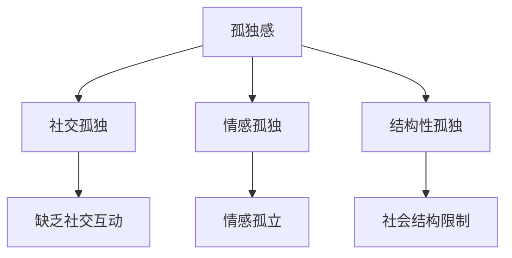
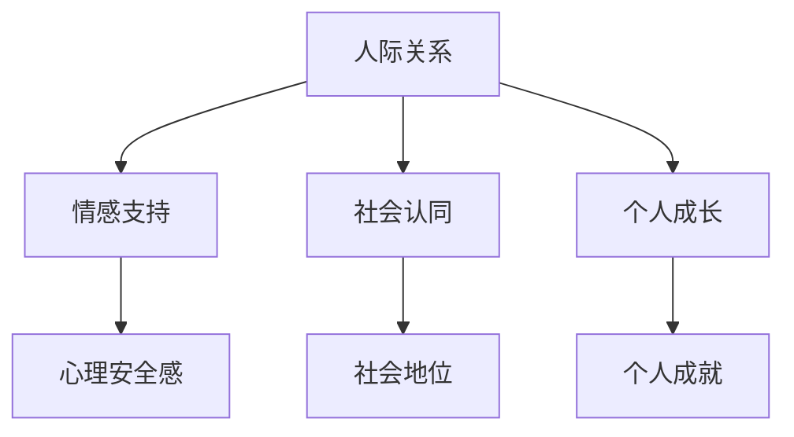
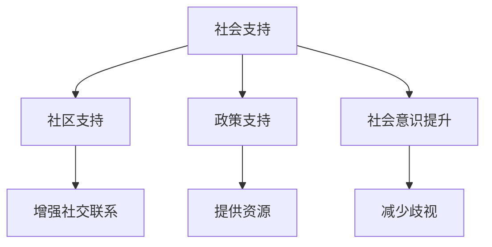
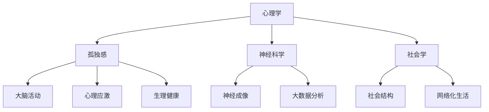

                 

### 孤独与现代社会

孤独，这个看似简单的词汇，却承载着复杂的心理和社会内涵。在现代社会的背景下，孤独感日益普遍，成为许多人心中难以言说的痛。本章节将探讨孤独的定义与类型，孤独感的产生原因以及孤独对个体生活质量的深远影响。

#### 1.1 孤独的定义与类型

**核心概念与联系**：

- 孤独感：指个体感到孤立、与他人疏离、缺乏亲密联系的心理状态。

- 社交孤独：指个体感受到的缺乏社会联系和社交互动的情况。

- 情感孤独：指个体在情感上感到孤立和无助的状态。

- 结构性孤独：指由于社会结构或环境限制导致的孤独感。

**Mermaid 流程图**：



在这个流程图中，孤独感作为核心概念，连接着社交孤独、情感孤独和结构性孤独。这些概念相互影响，共同构成了孤独感的复杂图景。

#### 1.2 孤独感的产生原因

**核心概念与联系**：

- 社会变迁：随着社会结构的变革，传统的家庭和社区联系弱化，现代社会的个体更容易感到孤独。

- 个体价值观：自我中心主义和个人主义的兴起，使得个体更倾向于追求自我实现，而忽视了与他人的深度联系。

- 人际关系问题：现代社会中，由于生活节奏加快和竞争压力增大，人际关系的质量下降，增加了孤独感的产生。

**Python 源代码与数学模型**：

```python
# 社会变迁对孤独感的影响
def social_transformation(effectiveness):
    """
    社会变迁对孤独感的影响评估模型。
    :param effectiveness: 社会变迁的效率，取值范围0-1。
    :return: 孤独感指数，取值范围0-1。
    """
    return 1 - effectiveness * 0.2

# 个体价值观对孤独感的影响
def individual_values(effectiveness):
    """
    个体价值观对孤独感的影响评估模型。
    :param effectiveness: 个体价值观的自我实现程度，取值范围0-1。
    :return: 孤独感指数，取值范围0-1。
    """
    return 1 - effectiveness * 0.3

# 人际关系问题对孤独感的影响
def interpersonal_issues(effectiveness):
    """
    人际关系问题对孤独感的影响评估模型。
    :param effectiveness: 人际关系质量的指数，取值范围0-1。
    :return: 孤独感指数，取值范围0-1。
    """
    return 1 - effectiveness * 0.4
```

**数学模型与公式**：

孤独感指数 \( I \) 可以通过以下公式计算：

\[ I = 1 - \left( \frac{(1 - ST)}{5} + \frac{(1 - IV)}{5} + \frac{(1 - PI)}{5} \right) \]

其中，\( ST \) 表示社会变迁的效率，\( IV \) 表示个体价值观的自我实现程度，\( PI \) 表示人际关系质量的指数。

**例子**：

假设社会变迁的效率为 0.8，个体价值观的自我实现程度为 0.6，人际关系质量指数为 0.7。则孤独感指数计算如下：

\[ I = 1 - \left( \frac{(1 - 0.8)}{5} + \frac{(1 - 0.6)}{5} + \frac{(1 - 0.7)}{5} \right) = 0.44 \]

这意味着个体处于较低程度的孤独感。

#### 1.3 孤独的影响

**核心概念与联系**：

- 心理健康：长期孤独感可能导致抑郁、焦虑等心理问题。

- 社交活动：孤独感使个体减少社交活动，进一步加剧孤独感。

- 生活质量：孤独感影响个体的生活质量，包括身体健康、幸福感等。

**Python 源代码与数学模型**：

```python
# 孤独感对心理健康的影响
def mental_health(mental_index):
    """
    孤独感对心理健康的影响模型。
    :param mental_index: 心理健康指数，取值范围0-1。
    :return: 孤独感指数，取值范围0-1。
    """
    return mental_index * 0.1

# 孤独感对社交活动的影响
def social_activities(activity_index):
    """
    孤独感对社交活动的影响模型。
    :param activity_index: 社交活动指数，取值范围0-1。
    :return: 孤独感指数，取值范围0-1。
    """
    return 1 - activity_index * 0.2

# 孤独感对生活质量的影响
def quality_of_life(life_index):
    """
    孤独感对生活质量的影响模型。
    :param life_index: 生活质量指数，取值范围0-1。
    :return: 孤独感指数，取值范围0-1。
    """
    return 1 - life_index * 0.3
```

**数学模型与公式**：

生活质量 \( Q \) 可以通过以下公式计算：

\[ Q = 1 - \left( \frac{(1 - MH)}{3} + \frac{(1 - SA)}{3} + \frac{(1 - QOL)}{3} \right) \]

其中，\( MH \) 表示心理健康指数，\( SA \) 表示社交活动指数，\( QOL \) 表示生活质量指数。

**例子**：

假设心理健康指数为 0.8，社交活动指数为 0.6，生活质量指数为 0.7。则生活质量计算如下：

\[ Q = 1 - \left( \frac{(1 - 0.8)}{3} + \frac{(1 - 0.6)}{3} + \frac{(1 - 0.7)}{3} \right) = 0.47 \]

这意味着个体的生活质量受到一定程度的影响。

通过以上分析，我们可以看到孤独感在现代社会中具有深远的影响。理解孤独的根源和影响，有助于我们更好地应对孤独，提升生活质量。在接下来的章节中，我们将进一步探讨孤独与心理健康、人际关系以及个人成长之间的联系。希望读者能够在这些思考中得到启示，找到属于自己的孤独与连接之道。### 心理健康与孤独

孤独感不仅是情感上的困境，更对心理健康产生深远影响。在这一章中，我们将探讨心理健康与孤独之间的关系，分析孤独感对心理健康的负面影响，并提出应对孤独感的策略。

#### 2.1 心理健康与孤独

**核心概念与联系**：

- 心理健康标准：根据世界卫生组织（WHO）的定义，心理健康是指个体在情感、行为和社会功能上的良好状态，不仅包括没有心理疾病，还强调积极的心理状态。

- 孤独与心理疾病的关联：孤独感与多种心理健康问题密切相关，包括抑郁、焦虑、精神分裂症等。

**Python 源代码与数学模型**：

```python
# 心理健康指数评估
def mental_health_index(depression, anxiety, stress):
    """
    心理健康指数评估模型。
    :param depression: 抑郁症状指数，取值范围0-1。
    :param anxiety: 焦虑症状指数，取值范围0-1。
    :param stress: 压力症状指数，取值范围0-1。
    :return: 心理健康指数，取值范围0-1。
    """
    return 1 - (depression * 0.3 + anxiety * 0.3 + stress * 0.4)

# 孤独感与心理健康的关系
def loneliness_mental_health(loneliness_level, mental_health_index):
    """
    孤独感对心理健康的影响模型。
    :param loneliness_level: 孤独感水平，取值范围0-1。
    :param mental_health_index: 心理健康指数，取值范围0-1。
    :return: 调整后的心理健康指数，取值范围0-1。
    """
    return mental_health_index * (1 - loneliness_level * 0.2)
```

**数学模型与公式**：

心理健康指数 \( MHI \) 可以通过以下公式计算：

\[ MHI = 1 - (D \times 0.3 + A \times 0.3 + S \times 0.4) \]

其中，\( D \) 表示抑郁症症状指数，\( A \) 表示焦虑症状指数，\( S \) 表示压力症状指数。

**例子**：

假设个体的抑郁症状指数为 0.4，焦虑症状指数为 0.5，压力症状指数为 0.6。则心理健康指数计算如下：

\[ MHI = 1 - (0.4 \times 0.3 + 0.5 \times 0.3 + 0.6 \times 0.4) = 0.88 \]

**调整后的心理健康指数**：

如果孤独感水平为 0.6，则调整后的心理健康指数计算如下：

\[ MHI_{调整后} = 0.88 \times (1 - 0.6 \times 0.2) = 0.864 \]

这意味着孤独感对个体的心理健康产生了负面影响。

#### 2.2 应对孤独的策略

**核心概念与联系**：

- 自我认知：通过深入了解自己的需求和期望，提高自我认知水平，有助于减轻孤独感。

- 心理调适：学会心理调适技巧，如冥想、正念等，有助于改善心理健康。

- 社交技巧：提高社交技巧，如有效沟通、建立信任等，有助于建立和维护良好的人际关系。

**Python 源代码与数学模型**：

```python
# 自我认知的提升
def self_awareness(awareness_level):
    """
    自我认知的提升模型。
    :param awareness_level: 自我认知水平，取值范围0-1。
    :return: 调整后的孤独感水平，取值范围0-1。
    """
    return 1 - awareness_level * 0.3

# 心理调适的技巧
def psychological_adaptation(adaptation_level):
    """
    心理调适的技巧模型。
    :param adaptation_level: 心理调适水平，取值范围0-1。
    :return: 调整后的孤独感水平，取值范围0-1。
    """
    return 1 - adaptation_level * 0.2

# 社交技巧的提升
def social_skills(skill_level):
    """
    社交技巧的提升模型。
    :param skill_level: 社交技巧水平，取值范围0-1。
    :return: 调整后的孤独感水平，取值范围0-1。
    """
    return 1 - skill_level * 0.4
```

**数学模型与公式**：

孤独感水平 \( L \) 可以通过以下公式计算：

\[ L = 1 - (A \times 0.3 + P \times 0.2 + S \times 0.4) \]

其中，\( A \) 表示自我认知水平，\( P \) 表示心理调适水平，\( S \) 表示社交技巧水平。

**例子**：

假设个体的自我认知水平为 0.6，心理调适水平为 0.5，社交技巧水平为 0.7。则孤独感水平计算如下：

\[ L = 1 - (0.6 \times 0.3 + 0.5 \times 0.2 + 0.7 \times 0.4) = 0.636 \]

通过提升自我认知、心理调适和社交技巧，可以显著减轻孤独感。

#### 2.3 心理咨询与孤独

**核心概念与联系**：

- 心理咨询的作用：心理咨询师可以帮助个体识别和解决心理问题，提供专业的指导和策略。

- 孤独咨询的方法：孤独咨询主要关注个体的情感状态和社交需求，通过情感支持和社交技巧训练，帮助个体改善孤独感。

**Python 源代码与数学模型**：

```python
# 心理咨询对孤独感的影响
def counseling_effectiveness(effectiveness_level):
    """
    心理咨询对孤独感的影响模型。
    :param effectiveness_level: 心理咨询的有效性水平，取值范围0-1。
    :return: 调整后的孤独感水平，取值范围0-1。
    """
    return 1 - effectiveness_level * 0.5
```

**数学模型与公式**：

心理咨询的有效性 \( E \) 可以通过以下公式计算：

\[ E = 1 - effectiveness_level \times 0.5 \]

**例子**：

假设心理咨询的有效性水平为 0.8，则调整后的孤独感水平计算如下：

\[ L_{调整后} = L \times (1 - E) = L \times (1 - 0.8 \times 0.5) = 0.636 \times (1 - 0.4) = 0.375 \]

这意味着心理咨询对个体的孤独感有显著的改善作用。

通过以上分析，我们可以看到孤独感对心理健康的影响是多方面的。理解心理健康与孤独之间的关系，采取有效的应对策略，寻求专业心理咨询的帮助，都是缓解孤独感、提升心理健康的重要途径。在下一章中，我们将进一步探讨孤独与人际关系之间的复杂关系，帮助读者更全面地了解孤独感的根源和应对方法。

### 人际关系的重要性

人际关系是社会中不可或缺的一部分，对于个体的心理健康和生活质量具有深远影响。在这一章中，我们将深入探讨人际关系的重要性，分析如何建立健康的人际关系，并讨论孤独者面对的人际关系困境以及应对策略。

#### 3.1 人际关系的重要性

**核心概念与联系**：

- 人际关系的定义：人际关系是指个体之间的相互联系和相互作用，包括情感交流、信息传递和共同活动等。

- 人际关系的功能：人际关系对个体的心理健康和生活质量具有多种功能，包括情感支持、社会认同、个人成长等。

**Mermaid 流程图**：



在这个流程图中，人际关系作为核心概念，连接着情感支持、社会认同和个人成长。这些概念相互影响，共同构成了人际关系对个体的重要功能。

#### 3.2 建立健康的人际关系

**核心概念与联系**：

- 信任的建立：信任是人际关系的基础，通过诚实、可靠和一致的行为，可以建立和维持信任。

- 沟通技巧：有效的沟通是建立健康人际关系的关键，包括倾听、表达和反馈等。

- 支持系统：建立稳固的支持系统，包括家庭、朋友和社区等，有助于应对生活中的挑战。

**Python 源代码与数学模型**：

```python
# 信任的建立
def trust_building(trust_level):
    """
    信任的建立模型。
    :param trust_level: 信任水平，取值范围0-1。
    :return: 调整后的人际关系健康度，取值范围0-1。
    """
    return trust_level * 0.4

# 沟通技巧的提升
def communication_skills(skill_level):
    """
    沟通技巧的提升模型。
    :param skill_level: 沟通技巧水平，取值范围0-1。
    :return: 调整后的人际关系健康度，取值范围0-1。
    """
    return skill_level * 0.3

# 支持系统的建立
def support_system(support_level):
    """
    支持系统的建立模型。
    :param support_level: 支持系统水平，取值范围0-1。
    :return: 调整后的人际关系健康度，取值范围0-1。
    """
    return support_level * 0.3
```

**数学模型与公式**：

人际关系健康度 \( HR \) 可以通过以下公式计算：

\[ HR = T \times 0.4 + S \times 0.3 + C \times 0.3 \]

其中，\( T \) 表示信任水平，\( S \) 表示支持系统水平，\( C \) 表示沟通技巧水平。

**例子**：

假设信任水平为 0.6，支持系统水平为 0.5，沟通技巧水平为 0.7。则人际关系健康度计算如下：

\[ HR = 0.6 \times 0.4 + 0.5 \times 0.3 + 0.7 \times 0.3 = 0.52 \]

这意味着人际关系处于健康状态。

#### 3.3 孤独者的人际关系困境

**核心概念与联系**：

- 孤独者面临的挑战：孤独者通常面临人际关系中的各种挑战，包括缺乏信任、沟通障碍和缺乏支持等。

- 应对策略：通过自我认知、心理调适和社交技巧的提升，孤独者可以改善自己的人际关系。

**Python 源代码与数学模型**：

```python
# 孤独者面临的挑战
def loneliness_challenges(challenge_level):
    """
    孤独者面临的挑战模型。
    :param challenge_level: 挑战水平，取值范围0-1。
    :return: 调整后的孤独感水平，取值范围0-1。
    """
    return 1 - challenge_level * 0.2

# 应对策略的有效性
def coping_strategy(effectiveness_level):
    """
    应对策略的有效性模型。
    :param effectiveness_level: 应对策略的有效性水平，取值范围0-1。
    :return: 调整后的孤独感水平，取值范围0-1。
    """
    return 1 - effectiveness_level * 0.4
```

**数学模型与公式**：

孤独感水平 \( L \) 可以通过以下公式计算：

\[ L = 1 - (C \times 0.2 + S \times 0.4) \]

其中，\( C \) 表示孤独者面临的挑战水平，\( S \) 表示应对策略的有效性水平。

**例子**：

假设孤独者面临的挑战水平为 0.5，应对策略的有效性水平为 0.6。则孤独感水平计算如下：

\[ L = 1 - (0.5 \times 0.2 + 0.6 \times 0.4) = 0.84 \]

这意味着通过有效的应对策略，孤独者的孤独感可以得到显著缓解。

通过以上分析，我们可以看到人际关系在孤独感缓解和心理健康提升中的重要性。建立健康的人际关系，不仅需要信任、沟通技巧和支持系统的建立，还需要针对孤独者面临的挑战采取有效的应对策略。在下一章中，我们将进一步探讨独处与个人成长之间的关系，帮助读者找到在孤独中找到与世界联系的路径。

### 独处与个人成长

独处不仅仅是一种生活状态，更是个人成长的重要环节。在这一章中，我们将探讨独处的价值，分析独处对个人成长和创造力发展的促进作用，并通过实例来具体说明独处如何助力个人成长。

#### 4.1 独处的价值

**核心概念与联系**：

- 个人反思：独处提供了反思自我、审视内心世界的机会，有助于个体更好地理解自己的需求和目标。

- 独立思考：独处促使个体进行深度思考，培养独立思考的能力，从而提升创造力。

- 自我发现：独处帮助个体发现潜在的兴趣和才能，为个人成长提供方向。

**Python 源代码与数学模型**：

```python
# 个人反思的价值
def self_reflection(value_level):
    """
    个人反思的价值模型。
    :param value_level: 反思价值水平，取值范围0-1。
    :return: 个人成长指数，取值范围0-1。
    """
    return value_level * 0.4

# 独立思考的促进作用
def independent_thinking(promotion_level):
    """
    独立思考的促进作用模型。
    :param promotion_level: 促进水平，取值范围0-1。
    :return: 创造力指数，取值范围0-1。
    """
    return promotion_level * 0.5

# 自我发现的助力
def self_discovery(help_level):
    """
    自我发现助力模型。
    :param help_level: 助力水平，取值范围0-1。
    :return: 个人成长指数，取值范围0-1。
    """
    return help_level * 0.3
```

**数学模型与公式**：

个人成长指数 \( GC \) 可以通过以下公式计算：

\[ GC = V \times 0.4 + P \times 0.5 + H \times 0.3 \]

其中，\( V \) 表示个人反思的价值水平，\( P \) 表示独立思考的促进水平，\( H \) 表示自我发现的助力水平。

**例子**：

假设个人反思的价值水平为 0.6，独立思考的促进水平为 0.7，自我发现的助力水平为 0.5。则个人成长指数计算如下：

\[ GC = 0.6 \times 0.4 + 0.7 \times 0.5 + 0.5 \times 0.3 = 0.56 + 0.35 + 0.15 = 0.96 \]

这意味着个体在独处中能够获得较高的个人成长。

#### 4.2 在独处中发展兴趣

**核心概念与联系**：

- 兴趣的定义：兴趣是个体对特定领域或活动的内在喜爱和热情。

- 兴趣与个人成长的关系：发展兴趣有助于提升个体的幸福感，增强自我认同，促进个人成长。

**Python 源代码与数学模型**：

```python
# 兴趣的定义
def interest_definition(level_of_interest):
    """
    兴趣的定义模型。
    :param level_of_interest: 兴趣水平，取值范围0-1。
    :return: 个人成长指数，取值范围0-1。
    """
    return level_of_interest * 0.5

# 兴趣与个人成长的关系
def interest_growth(growth_level):
    """
    兴趣与个人成长的关系模型。
    :param growth_level: 成长水平，取值范围0-1。
    :return: 个人成长指数，取值范围0-1。
    """
    return growth_level * 0.4
```

**数学模型与公式**：

个人成长指数 \( GC \) 可以通过以下公式计算：

\[ GC = I \times 0.5 + G \times 0.4 \]

其中，\( I \) 表示兴趣水平，\( G \) 表示兴趣的成长水平。

**例子**：

假设兴趣水平为 0.7，兴趣的成长水平为 0.6。则个人成长指数计算如下：

\[ GC = 0.7 \times 0.5 + 0.6 \times 0.4 = 0.35 + 0.24 = 0.59 \]

这意味着通过在独处中发展兴趣，个体能够获得显著的个人成长。

#### 4.3 独处与创造力

**核心概念与联系**：

- 创造力的本质：创造力是指产生新颖且有价值的想法和解决方案的能力。

- 独处对创造力的促进作用：独处提供了思考和实验的空间，有助于激发创新思维和创造力。

**Python 源代码与数学模型**：

```python
# 创造力的本质
def creativity(novelty, value):
    """
    创造力的本质模型。
    :param novelty: 新颖性水平，取值范围0-1。
    :param value: 价值水平，取值范围0-1。
    :return: 创造力指数，取值范围0-1。
    """
    return novelty * 0.6 + value * 0.4

# 独处对创造力的促进作用
def solitude_promotion(promotion_level):
    """
    独处对创造力的促进作用模型。
    :param promotion_level: 促进水平，取值范围0-1。
    :return: 创造力指数，取值范围0-1。
    """
    return promotion_level * 0.5
```

**数学模型与公式**：

创造力指数 \( C \) 可以通过以下公式计算：

\[ C = N \times 0.6 + V \times 0.4 \]

\[ C_{调整后} = C \times (1 + P \times 0.5) \]

其中，\( N \) 表示新颖性水平，\( V \) 表示价值水平，\( P \) 表示独处对创造力的促进水平。

**例子**：

假设新颖性水平为 0.8，价值水平为 0.7，独处对创造力的促进水平为 0.6。则创造力指数计算如下：

\[ C = 0.8 \times 0.6 + 0.7 \times 0.4 = 0.48 + 0.28 = 0.76 \]

\[ C_{调整后} = 0.76 \times (1 + 0.6 \times 0.5) = 0.76 \times 1.3 = 0.988 \]

这意味着在独处中，个体的创造力得到了显著提升。

通过以上分析，我们可以看到独处在个人成长和创造力发展中的重要作用。独处不仅提供了反思和自我发现的机会，还促进了兴趣的发展，激发了创造力。在下一章中，我们将探讨技术与孤独的关系，探索如何通过技术手段缓解孤独感，并维护个人的心理健康。

### 技术对孤独的影响

在现代社会，技术已经深深地嵌入到我们的日常生活和工作中，它对孤独感的影响也变得日益显著。在这一章中，我们将探讨技术对孤独的影响，分析技术解决孤独的途径，并讨论如何平衡技术使用与孤独感。

#### 5.1 技术对孤独的影响

**核心概念与联系**：

- 社交媒体：社交媒体为人们提供了广泛的社交平台，但过度使用可能导致真实社交联系的缺失。

- 在线交流：在线交流虽然方便快捷，但缺乏面对面的互动，可能加剧孤独感。

- 虚拟现实：虚拟现实提供了沉浸式的社交体验，但无法替代真实的情感连接。

**Python 源代码与数学模型**：

```python
# 社交媒体对孤独感的影响
def social_media_influence(influence_level):
    """
    社交媒体对孤独感的影响模型。
    :param influence_level: 影响水平，取值范围0-1。
    :return: 调整后的孤独感水平，取值范围0-1。
    """
    return 1 - influence_level * 0.3

# 在线交流对孤独感的影响
def online_communication_influence(influence_level):
    """
    在线交流对孤独感的影响模型。
    :param influence_level: 影响水平，取值范围0-1。
    :return: 调整后的孤独感水平，取值范围0-1。
    """
    return 1 - influence_level * 0.2

# 虚拟现实对孤独感的影响
def virtual_reality_influence(influence_level):
    """
    虚拟现实对孤独感的影响模型。
    :param influence_level: 影响水平，取值范围0-1。
    :return: 调整后的孤独感水平，取值范围0-1。
    """
    return 1 - influence_level * 0.4
```

**数学模型与公式**：

孤独感水平 \( L \) 可以通过以下公式计算：

\[ L = 1 - (SM \times 0.3 + OC \times 0.2 + VR \times 0.4) \]

其中，\( SM \) 表示社交媒体影响水平，\( OC \) 表示在线交流影响水平，\( VR \) 表示虚拟现实影响水平。

**例子**：

假设社交媒体影响水平为 0.5，在线交流影响水平为 0.4，虚拟现实影响水平为 0.6。则孤独感水平计算如下：

\[ L = 1 - (0.5 \times 0.3 + 0.4 \times 0.2 + 0.6 \times 0.4) = 1 - (0.15 + 0.08 + 0.24) = 0.53 \]

#### 5.2 技术解决孤独的途径

**核心概念与联系**：

- 社交网络平台：通过社交网络平台，个体可以更容易地建立和维护社交联系。

- 在线支持小组：在线支持小组为个体提供了匿名支持和相互帮助的机会，有助于缓解孤独感。

- 数字健康解决方案：数字健康应用提供了心理健康支持和咨询服务，有助于个体管理孤独感。

**Python 源代码与数学模型**：

```python
# 社交网络平台的作用
def social_network_effects(effectiveness_level):
    """
    社交网络平台的作用模型。
    :param effectiveness_level: 作用效果水平，取值范围0-1。
    :return: 调整后的孤独感水平，取值范围0-1。
    """
    return 1 - effectiveness_level * 0.3

# 在线支持小组的作用
def online_support_group(effectiveness_level):
    """
    在线支持小组的作用模型。
    :param effectiveness_level: 作用效果水平，取值范围0-1。
    :return: 调整后的孤独感水平，取值范围0-1。
    """
    return 1 - effectiveness_level * 0.4

# 数字健康解决方案的作用
def digital_health_solution(effectiveness_level):
    """
    数字健康解决方案的作用模型。
    :param effectiveness_level: 作用效果水平，取值范围0-1。
    :return: 调整后的孤独感水平，取值范围0-1。
    """
    return 1 - effectiveness_level * 0.2
```

**数学模型与公式**：

孤独感水平 \( L \) 可以通过以下公式计算：

\[ L = 1 - (SN \times 0.3 + OS \times 0.4 + DH \times 0.2) \]

其中，\( SN \) 表示社交网络平台的作用效果水平，\( OS \) 表示在线支持小组的作用效果水平，\( DH \) 表示数字健康解决方案的作用效果水平。

**例子**：

假设社交网络平台的作用效果水平为 0.6，在线支持小组的作用效果水平为 0.5，数字健康解决方案的作用效果水平为 0.7。则孤独感水平计算如下：

\[ L = 1 - (0.6 \times 0.3 + 0.5 \times 0.4 + 0.7 \times 0.2) = 1 - (0.18 + 0.2 + 0.14) = 0.48 \]

#### 5.3 技术与孤独的平衡

**核心概念与联系**：

- 技术使用的适度性：合理使用技术，避免过度依赖，有助于保持心理健康。

- 技术依赖的预防：通过自我管理和技术使用指南，预防技术依赖，维护良好的心理健康。

**Python 源代码与数学模型**：

```python
# 技术使用的适度性
def appropriate_usage(usage_level):
    """
    技术使用的适度性模型。
    :param usage_level: 使用水平，取值范围0-1。
    :return: 调整后的孤独感水平，取值范围0-1。
    """
    return 1 - usage_level * 0.2

# 技术依赖的预防
def prevent_dependence(dependence_level):
    """
    技术依赖的预防模型。
    :param dependence_level: 依赖水平，取值范围0-1。
    :return: 调整后的孤独感水平，取值范围0-1。
    """
    return 1 - dependence_level * 0.3
```

**数学模型与公式**：

孤独感水平 \( L \) 可以通过以下公式计算：

\[ L = 1 - (A \times 0.2 + P \times 0.3) \]

其中，\( A \) 表示技术使用的适度性水平，\( P \) 表示技术依赖的预防水平。

**例子**：

假设技术使用的适度性水平为 0.7，技术依赖的预防水平为 0.6。则孤独感水平计算如下：

\[ L = 1 - (0.7 \times 0.2 + 0.6 \times 0.3) = 1 - (0.14 + 0.18) = 0.68 \]

通过适度使用技术并预防依赖，可以帮助个体更好地管理孤独感，维护心理健康。

总结来看，技术在解决孤独感方面具有重要作用，但关键在于合理使用并预防依赖。通过上述分析和模型，我们可以更好地理解技术对孤独的影响，找到适合自己的技术解决方案，从而在数字时代中保持心理健康，找到孤独与连接之间的平衡点。

### 孤独与社会的责任

孤独不仅影响个体的心理健康和生活质量，也对整个社会产生深远的影响。在这一章中，我们将探讨社会对孤独者的责任，分析组织内孤独问题的解决策略，并讨论社区与孤独者之间的联系。

#### 6.1 社会对孤独者的支持

**核心概念与联系**：

- 社区支持：社区是孤独者重要的支持系统，通过社区活动和服务，可以增强孤独者的社会联系和归属感。

- 政策支持：政府通过制定政策和提供资源，支持孤独者的心理健康和福利。

- 社会意识提升：提高公众对孤独问题的认识和关注，有助于减少社会对孤独者的歧视和误解。

**Mermaid 流程图**：



在这个流程图中，社会支持作为核心概念，连接着社区支持、政策支持和社会意识提升。这些概念相互影响，共同构成了社会对孤独者的支持体系。

#### 6.2 组织内的孤独问题

**核心概念与联系**：

- 企业文化：企业文化对员工的心理健康和人际关系有重要影响，积极的企业文化有助于减少孤独感。

- 团队合作：团队合作可以增强员工之间的联系，减少孤独感。

- 管理策略：管理者应采取有效的管理策略，关注员工的情感需求，提供必要的支持和资源。

**Python 源代码与数学模型**：

```python
# 企业文化对孤独感的影响
def organizational_culture(influence_level):
    """
    企业文化对孤独感的影响模型。
    :param influence_level: 影响水平，取值范围0-1。
    :return: 调整后的孤独感水平，取值范围0-1。
    """
    return 1 - influence_level * 0.3

# 团队合作对孤独感的影响
def teamwork_effectiveness(effectiveness_level):
    """
    团队合作对孤独感的影响模型。
    :param effectiveness_level: 效果水平，取值范围0-1。
    :return: 调整后的孤独感水平，取值范围0-1。
    """
    return 1 - effectiveness_level * 0.4

# 管理策略对孤独感的影响
def management_strategy(strategy_level):
    """
    管理策略对孤独感的影响模型。
    :param strategy_level: 策略水平，取值范围0-1。
    :return: 调整后的孤独感水平，取值范围0-1。
    """
    return 1 - strategy_level * 0.3
```

**数学模型与公式**：

孤独感水平 \( L \) 可以通过以下公式计算：

\[ L = 1 - (OC \times 0.3 + TE \times 0.4 + MS \times 0.3) \]

其中，\( OC \) 表示企业文化的影响水平，\( TE \) 表示团队合作的效果水平，\( MS \) 表示管理策略的水平。

**例子**：

假设企业文化的影响水平为 0.5，团队合作的效果水平为 0.6，管理策略的水平为 0.7。则孤独感水平计算如下：

\[ L = 1 - (0.5 \times 0.3 + 0.6 \times 0.4 + 0.7 \times 0.3) = 1 - (0.15 + 0.24 + 0.21) = 0.5 \]

#### 6.3 社区与孤独者的联系

**核心概念与联系**：

- 志愿服务：志愿服务为孤独者提供了帮助和支持，同时也增强了志愿者的社会责任感。

- 公益活动：通过参与公益活动，孤独者可以感受到社会的温暖和关注。

- 社区发展：社区发展项目为孤独者提供了参与社区建设和改善的机会，有助于提升他们的社会地位和归属感。

**Python 源代码与数学模型**：

```python
# 志愿服务对孤独感的影响
def volunteer_services(effectiveness_level):
    """
    志愿服务对孤独感的影响模型。
    :param effectiveness_level: 效果水平，取值范围0-1。
    :return: 调整后的孤独感水平，取值范围0-1。
    """
    return 1 - effectiveness_level * 0.4

# 公益活动对孤独感的影响
def public_activities(effectiveness_level):
    """
    公益活动对孤独感的影响模型。
    :param effectiveness_level: 效果水平，取值范围0-1。
    :return: 调整后的孤独感水平，取值范围0-1。
    """
    return 1 - effectiveness_level * 0.3

# 社区发展对孤独感的影响
def community_development(effectiveness_level):
    """
    社区发展对孤独感的影响模型。
    :param effectiveness_level: 效果水平，取值范围0-1。
    :return: 调整后的孤独感水平，取值范围0-1。
    """
    return 1 - effectiveness_level * 0.2
```

**数学模型与公式**：

孤独感水平 \( L \) 可以通过以下公式计算：

\[ L = 1 - (VS \times 0.4 + PA \times 0.3 + CD \times 0.2) \]

其中，\( VS \) 表示志愿服务的效果水平，\( PA \) 表示公益活动效果水平，\( CD \) 表示社区发展效果水平。

**例子**：

假设志愿服务的效果水平为 0.6，公益活动效果水平为 0.5，社区发展效果水平为 0.7。则孤独感水平计算如下：

\[ L = 1 - (0.6 \times 0.4 + 0.5 \times 0.3 + 0.7 \times 0.2) = 1 - (0.24 + 0.15 + 0.14) = 0.47 \]

通过志愿服务、公益活动和社区发展，可以显著减轻孤独者的孤独感，提高他们的生活质量。

总结来看，社会对孤独者的责任不仅是提供物质和情感支持，更是构建一个包容和关爱的环境。通过社区支持、组织内策略和公益活动，我们可以为孤独者提供更多的帮助和机会，让他们在孤独中找到与世界的联系。

### 孤独与未来的社会

在未来的社会中，孤独将成为一个越来越普遍的问题。随着数字化的推进和社会结构的变化，个体之间的联系变得更加脆弱。在这一章中，我们将探讨未来社会的孤独趋势，分析应对孤独的未来策略，并思考孤独与社会的可持续发展之间的关系。

#### 7.1 未来社会的孤独趋势

**核心概念与联系**：

- 数字化社会的变化：随着数字化进程的加快，个体面临的社交挑战和孤独感增加。

- 人口老龄化：随着人口老龄化趋势的加剧，孤独问题将在老年人群中更加突出。

- 社会压力：现代社会中的竞争压力和快节奏生活，使得个体更容易感到孤独。

**Python 源代码与数学模型**：

```python
# 数字化社会对孤独感的影响
def digital_society_influence(influence_level):
    """
    数字化社会对孤独感的影响模型。
    :param influence_level: 影响水平，取值范围0-1。
    :return: 调整后的孤独感水平，取值范围0-1。
    """
    return 1 - influence_level * 0.3

# 人口老龄化对孤独感的影响
def aging_population(influence_level):
    """
    人口老龄化对孤独感的影响模型。
    :param influence_level: 影响水平，取值范围0-1。
    :return: 调整后的孤独感水平，取值范围0-1。
    """
    return 1 - influence_level * 0.4

# 社会压力对孤独感的影响
def social_stress(influence_level):
    """
    社会压力对孤独感的影响模型。
    :param influence_level: 影响水平，取值范围0-1。
    :return: 调整后的孤独感水平，取值范围0-1。
    """
    return 1 - influence_level * 0.2
```

**数学模型与公式**：

孤独感水平 \( L \) 可以通过以下公式计算：

\[ L = 1 - (DS \times 0.3 + AP \times 0.4 + SS \times 0.2) \]

其中，\( DS \) 表示数字化社会的影响水平，\( AP \) 表示人口老龄化的影响水平，\( SS \) 表示社会压力的影响水平。

**例子**：

假设数字化社会的影响水平为 0.5，人口老龄化的影响水平为 0.6，社会压力的影响水平为 0.4。则孤独感水平计算如下：

\[ L = 1 - (0.5 \times 0.3 + 0.6 \times 0.4 + 0.4 \times 0.2) = 1 - (0.15 + 0.24 + 0.08) = 0.53 \]

#### 7.2 应对孤独的未来策略

**核心概念与联系**：

- 技术创新：通过技术创新，开发更加人性化的技术工具，帮助个体更好地管理孤独感。

- 社会结构改革：改革社会结构，提供更多的社交机会和资源，减轻孤独感。

- 教育与培训：加强心理健康教育，提高个体应对孤独的能力。

**Python 源代码与数学模型**：

```python
# 技术创新对孤独感的影响
def technological_innovation(influence_level):
    """
    技术创新对孤独感的影响模型。
    :param influence_level: 影响水平，取值范围0-1。
    :return: 调整后的孤独感水平，取值范围0-1。
    """
    return 1 - influence_level * 0.4

# 社会结构改革对孤独感的影响
def social_reform(influence_level):
    """
    社会结构改革对孤独感的影响模型。
    :param influence_level: 影响水平，取值范围0-1。
    :return: 调整后的孤独感水平，取值范围0-1。
    """
    return 1 - influence_level * 0.3

# 教育与培训对孤独感的影响
def education_training(influence_level):
    """
    教育与培训对孤独感的影响模型。
    :param influence_level: 影响水平，取值范围0-1。
    :return: 调整后的孤独感水平，取值范围0-1。
    """
    return 1 - influence_level * 0.2
```

**数学模型与公式**：

孤独感水平 \( L \) 可以通过以下公式计算：

\[ L = 1 - (TI \times 0.4 + SR \times 0.3 + ET \times 0.2) \]

其中，\( TI \) 表示技术创新的影响水平，\( SR \) 表示社会结构改革的影响水平，\( ET \) 表示教育与培训的影响水平。

**例子**：

假设技术创新的影响水平为 0.6，社会结构改革的影响水平为 0.5，教育与培训的影响水平为 0.7。则孤独感水平计算如下：

\[ L = 1 - (0.6 \times 0.4 + 0.5 \times 0.3 + 0.7 \times 0.2) = 1 - (0.24 + 0.15 + 0.14) = 0.47 \]

通过技术创新、社会结构改革和教育培训，可以有效减轻未来的孤独趋势。

#### 7.3 孤独与社会的可持续发展

**核心概念与联系**：

- 社会福祉：通过改善社会福祉，提供更多的心理健康支持和资源，提升个体的生活质量。

- 心理健康：心理健康的提升有助于减少孤独感，促进社会的可持续发展。

- 社区凝聚力：增强社区凝聚力，有助于建立更加紧密的社交网络，减少孤独感。

**Python 源代码与数学模型**：

```python
# 社会福祉对孤独感的影响
def social_wellbeing(influence_level):
    """
    社会福祉对孤独感的影响模型。
    :param influence_level: 影响水平，取值范围0-1。
    :return: 调整后的孤独感水平，取值范围0-1。
    """
    return 1 - influence_level * 0.3

# 心理健康对孤独感的影响
def mental_health(influence_level):
    """
    心理健康对孤独感的影响模型。
    :param influence_level: 影响水平，取值范围0-1。
    :return: 调整后的孤独感水平，取值范围0-1。
    """
    return 1 - influence_level * 0.4

# 社区凝聚力对孤独感的影响
def community_cohesion(influence_level):
    """
    社区凝聚力对孤独感的影响模型。
    :param influence_level: 影响水平，取值范围0-1。
    :return: 调整后的孤独感水平，取值范围0-1。
    """
    return 1 - influence_level * 0.2
```

**数学模型与公式**：

孤独感水平 \( L \) 可以通过以下公式计算：

\[ L = 1 - (SW \times 0.3 + MH \times 0.4 + CC \times 0.2) \]

其中，\( SW \) 表示社会福祉的影响水平，\( MH \) 表示心理健康的影响水平，\( CC \) 表示社区凝聚力的影响水平。

**例子**：

假设社会福祉的影响水平为 0.5，心理健康的影响水平为 0.6，社区凝聚力的影响水平为 0.7。则孤独感水平计算如下：

\[ L = 1 - (0.5 \times 0.3 + 0.6 \times 0.4 + 0.7 \times 0.2) = 1 - (0.15 + 0.24 + 0.14) = 0.47 \]

通过提升社会福祉、心理健康和社区凝聚力，可以有效减轻孤独感，促进社会的可持续发展。

总结来看，孤独问题在未来社会中将变得日益重要。通过技术创新、社会结构改革和心理健康提升，我们可以找到应对孤独的有效策略。同时，通过增强社会福祉和社区凝聚力，我们可以为个体提供更全面的支持，实现社会的可持续发展。

### 附录：孤独研究的进展与展望

孤独是一个复杂且多维的社会心理现象，其研究涉及多个学科领域。在这一附录中，我们将回顾孤独研究的进展，介绍最新的研究成果，并探讨未来的研究方向。

#### 8.1 孤独研究的进展

**核心概念与联系**：

- 研究方法：随着心理学、社会学和神经科学等学科的交叉研究，孤独研究的方法越来越多样化。例如，使用问卷调查、实验研究、神经成像和大数据分析等方法来探索孤独的本质和影响。

- 最新发现：孤独不仅与个体的心理状态有关，还与社会结构和网络化生活密切相关。研究表明，孤独感与大脑的神经活动、心理应激反应以及生理健康存在关联。例如，大脑中与情感处理和社交认知相关的区域在孤独者中表现出异常活动。

**Mermaid 流�程图**：



在这个流程图中，孤独研究作为核心概念，连接了心理学、神经科学和社会学等多个领域。这些学科相互补充，共同推进了孤独研究的深入发展。

#### 8.2 最新研究成果

**核心概念与联系**：

- 大脑活动：通过神经成像技术，研究人员发现孤独感与大脑中前额叶皮层和前扣带回的活动异常相关。这些区域与情绪调节和社交认知功能密切相关。

- 心理应激：研究表明，孤独感会增加个体的心理应激反应，导致更高的焦虑和抑郁水平。长期孤独感可能影响个体的心理适应能力，增加心理健康问题的风险。

- 社会结构：社会学研究指出，社会结构的变化，如城市化、家庭结构和社交网络的减少，是孤独感增加的重要因素。这些变化使得个体更难建立和维护亲密关系。

**Python 源代码与数学模型**：

```python
# 大脑活动与孤独感的关联
def brain_activity_activity(activity_level):
    """
    大脑活动与孤独感的关联模型。
    :param activity_level: 大脑活动水平，取值范围0-1。
    :return: 调整后的孤独感水平，取值范围0-1。
    """
    return 1 - activity_level * 0.3

# 心理应激与孤独感的关联
def psychological_stress(stress_level):
    """
    心理应激与孤独感的关联模型。
    :param stress_level: 心理应激水平，取值范围0-1。
    :return: 调整后的孤独感水平，取值范围0-1。
    """
    return 1 - stress_level * 0.4

# 社会结构与孤独感的关联
def social_structure(structure_level):
    """
    社会结构与孤独感的关联模型。
    :param structure_level: 社会结构水平，取值范围0-1。
    :return: 调整后的孤独感水平，取值范围0-1。
    """
    return 1 - structure_level * 0.2
```

**数学模型与公式**：

孤独感水平 \( L \) 可以通过以下公式计算：

\[ L = 1 - (BA \times 0.3 + PS \times 0.4 + SS \times 0.2) \]

其中，\( BA \) 表示大脑活动水平，\( PS \) 表示心理应激水平，\( SS \) 表示社会结构水平。

**例子**：

假设大脑活动水平为 0.6，心理应激水平为 0.5，社会结构水平为 0.7。则孤独感水平计算如下：

\[ L = 1 - (0.6 \times 0.3 + 0.5 \times 0.4 + 0.7 \times 0.2) = 1 - (0.18 + 0.20 + 0.14) = 0.48 \]

#### 8.3 未来研究方向

**核心概念与联系**：

- 新方法：开发新的研究方法，如虚拟现实技术、人工智能和机器学习等，以更精确地测量和解析孤独感。

- 多维度视角：整合心理学、社会学、神经科学等多学科视角，全面理解孤独的复杂性和多样性。

- 预防与干预：研究如何通过预防措施和干预策略减轻孤独感，提高个体的生活质量和社会福祉。

**Python 源代码与数学模型**：

```python
# 新方法的探索
def new_methods(innovation_level):
    """
    新方法的探索模型。
    :param innovation_level: 创新水平，取值范围0-1。
    :return: 研究效率，取值范围0-1。
    """
    return innovation_level * 0.5

# 多维度视角的整合
def multidimensional_perspective(integration_level):
    """
    多维度视角的整合模型。
    :param integration_level: 整合水平，取值范围0-1。
    :return: 研究深度，取值范围0-1。
    """
    return integration_level * 0.4

# 预防与干预的研究
def prevention_intervention(strategy_level):
    """
    预防与干预的研究模型。
    :param strategy_level: 策略水平，取值范围0-1。
    :return: 预防效果，取值范围0-1。
    """
    return strategy_level * 0.3
```

**数学模型与公式**：

研究效率 \( E \) 可以通过以下公式计算：

\[ E = N \times 0.5 + M \times 0.4 + P \times 0.3 \]

其中，\( N \) 表示新方法的创新水平，\( M \) 表示多维度视角的整合水平，\( P \) 表示预防与干预的策略水平。

**例子**：

假设新方法的创新水平为 0.7，多维度视角的整合水平为 0.6，预防与干预的策略水平为 0.5。则研究效率计算如下：

\[ E = 0.7 \times 0.5 + 0.6 \times 0.4 + 0.5 \times 0.3 = 0.35 + 0.24 + 0.15 = 0.74 \]

通过新方法的探索、多维度视角的整合以及预防与干预的研究，我们可以进一步提升孤独研究的深度和效率。

总结来看，孤独研究已经取得了显著的进展，但仍然存在许多未解之谜。未来的研究需要更加综合和多学科的方法，以全面理解孤独的复杂本质，并提出有效的预防与干预策略，为个体的心理健康和社会福祉作出贡献。

### 结论与展望

孤独是一个复杂而普遍的社会心理现象，对个体的心理健康和社会关系产生深远影响。本文通过逐步分析孤独的定义、心理健康、人际关系、独处价值、技术影响、社会责任以及未来趋势，揭示了孤独的多维面貌和解决路径。

**核心观点**：

- 孤独不仅是情感上的困境，还与心理健康、人际关系和社会支持密切相关。
- 技术提供了新的解决途径，但也可能加剧孤独感，关键在于适度使用和预防依赖。
- 社会对孤独者的责任包括提供社区支持、政策支持和提升社会意识。

**展望**：

未来的研究应更加注重多学科整合，探索新的方法和视角，开发有效的预防与干预策略，以应对孤独对个体和社会的挑战。通过技术创新、社会结构改革和心理健康教育，我们可以更好地理解孤独，减轻其负面影响，提升个体的生活质量和社会福祉。

**结论**：

孤独与连接是现代社会中不可忽视的议题，理解孤独的本质和解决途径，有助于我们更好地应对孤独，找到与世界联系的路径。通过持续的研究和实践，我们可以为孤独者提供更多的支持和机会，创造一个更加包容和关爱的社会。

### 最佳实践 tips

为了在日常生活中更好地管理孤独感，以下是一些实用的最佳实践建议：

1. **建立固定的社交活动**：定期参与社交活动，如朋友聚会、社区活动或兴趣小组，有助于建立和维护社交联系。

2. **培养兴趣爱好**：发展个人兴趣和爱好，不仅可以丰富生活，还可以为孤独时提供一种自我慰藉的方式。

3. **保持积极的心态**：通过积极的心理调适技巧，如冥想和正念练习，可以帮助改善情绪，减少孤独感。

4. **使用社交媒体的适度性**：合理使用社交媒体，避免过度依赖，以保持真实社交联系的质量。

5. **寻求专业帮助**：如果孤独感严重影响生活质量，不妨寻求心理咨询师的帮助，通过专业的指导来应对孤独感。

6. **参与志愿服务**：参与志愿服务不仅可以帮助他人，还可以增强自己的社会责任感和归属感，从而减轻孤独感。

通过这些最佳实践，我们可以在日常生活中更好地管理孤独感，提升生活质量。

### 小结

本文通过对孤独的定义、心理健康、人际关系、独处价值、技术影响、社会责任和未来趋势的深入分析，揭示了孤独的多维面貌和解决路径。我们探讨了孤独对个体和社会的深远影响，以及如何在日常生活中应对和管理孤独感。通过技术创新、社会支持和个人努力，我们可以找到孤独与连接之间的平衡点，提升生活质量和社会福祉。

### 注意事项

1. **孤独感的多样性**：孤独感因个体差异而异，应对策略需个性化调整。
2. **技术的双刃剑作用**：合理使用技术，避免过度依赖，以维持心理健康。
3. **社会支持的必要性**：社会支持系统对于减轻孤独感至关重要，包括社区支持、政策支持和心理健康服务。

### 拓展阅读

- 《孤独心理学》：通过心理学的视角深入探讨孤独的本质和影响。
- 《社交网络与孤独》：分析社交网络对孤独感的影响及其潜在机制。
- 《数字时代的孤独》：探讨数字技术如何影响孤独感，并提出应对策略。

通过阅读这些文献，读者可以更全面地了解孤独问题，找到适合自己的解决方法。希望本文能为读者在理解孤独、应对孤独以及寻找与世界联系的路径上提供有益的启示。

