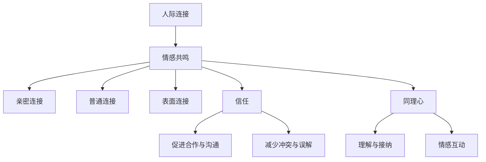

                 

### 《寻找人际连接的共鸣：建立深层的情感纽带》

在当今复杂多变的社会环境中，人与人之间的情感纽带显得尤为重要。这些纽带不仅仅是朋友和家人之间简单的关系，更是一种深层次的情感连接，它能够为个体提供支持和安全感。本文旨在探讨如何通过理解和应用人际连接的核心概念，建立和维系深层的情感纽带。

> **关键词**：人际连接、情感共鸣、信任、同理心、沟通技巧

> **摘要**：本文首先介绍了人际连接和情感共鸣的基本概念，并探讨了它们之间的相互关系。随后，文章深入分析了信任和同理心在建立情感纽带中的作用，并提出了实用的方法和技巧。最后，本文提供了一些有效的沟通策略，帮助读者在实践中提升人际连接和情感纽带的质量。

### 概述与核心概念

#### 人际连接的概念与类型

人际连接是指个体在社交活动中与他人建立起的联系。这种连接可以分为不同的类型：

- **亲密连接**：这是在情感和心理上紧密相连的关系，通常存在于亲人、亲密伴侣和挚友之间。
- **普通连接**：这类连接相对疏远，但仍保持友好的关系，如同事、邻居等。
- **表面连接**：这种连接仅仅是形式上的社交关系，可能缺乏深层次的情感互动。

#### 情感共鸣的定义与特征

情感共鸣是指个体在情感上与他人的强烈共振。它具有以下特征：

- **情绪共享**：个体能够与他人分享情感体验。
- **理解与接纳**：个体对他人的感受有深刻的理解，并能接纳这种感受。
- **情感互动**：双方的情感能够相互激发和回应。

#### 人际连接与情感共鸣的关系

人际连接是情感共鸣的基础，而情感共鸣又能加深人际连接。具体来说：

- **人际连接是情感共鸣的前提**：只有在建立了稳固的人际连接之后，个体才能感受到深层次的情感共鸣。
- **情感共鸣增强人际连接**：通过情感共鸣，个体能够更好地理解和支持他人，从而加深彼此的情感联系。

#### 信任的概念与重要性

信任是人际关系中的一种基本要素，指的是个体对他人诚实和可靠性的信心。它在人际互动中起着至关重要的作用：

- **促进合作与沟通**：信任能够减少不确定性，促进个体之间的合作和沟通。
- **减少冲突与误解**：信任的存在能够降低误解和冲突的可能性，使关系更加和谐。

#### 同理心的概念与类型

同理心是指理解并感受他人情绪和情感的能力。它分为以下两种类型：

- **情感同理心**：这种同理心专注于感受他人的情感。
- **认知同理心**：这种同理心则强调理解他人行为背后的原因。

#### 信任与同理心在建立情感纽带中的作用

信任和同理心是建立深层情感纽带的关键因素：

- **信任是情感纽带的基石**：只有建立了信任，个体才会感到安全和被理解，从而愿意分享内心深处的情感。
- **同理心加深情感纽带**：通过同理心，个体能够更好地理解他人的情感需求，从而更好地维系和增强这种情感纽带。

#### Mermaid流程图展示

以下是一个Mermaid流程图，展示了人际连接、情感共鸣、信任和同理心之间的相互关系：

### 总结

在本文中，我们探讨了人际连接和情感共鸣的基本概念，以及信任和同理心在建立深层情感纽带中的作用。通过理解和应用这些核心概念，我们可以更有效地建立和维护人际连接，从而创造更丰富、更深刻的情感体验。在接下来的章节中，我们将深入讨论如何在实际生活中应用这些概念，提升人际交往的质量。希望本文能够为读者提供有价值的见解和实用的方法。

