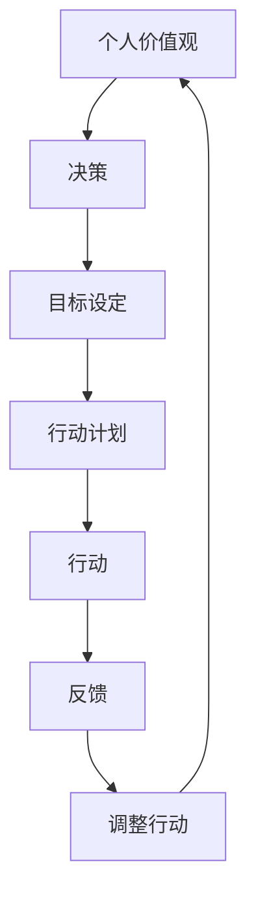
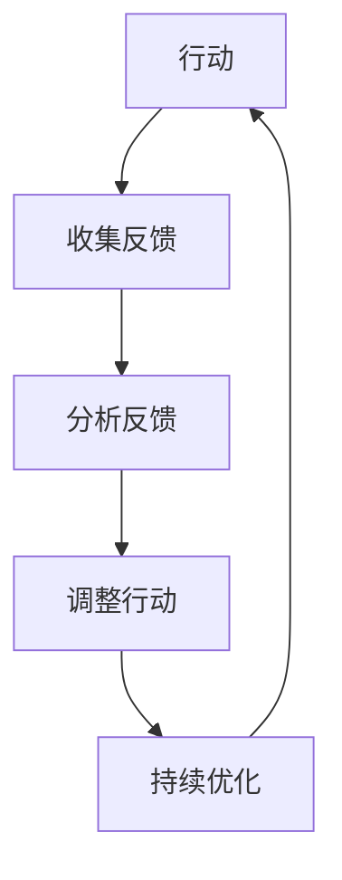

                 

-------------------------------------------------------------------

## 将个人价值观与行动对齐：有意义的目标设定

> 关键词：个人价值观、目标设定、行动、反馈、闭环、SMART原则、甘特图、算法实现

> 摘要：本文探讨了如何将个人价值观与行动对齐，通过有意义的目标设定和有效的行动计划，实现个人成长和职业发展。文章首先介绍了个人价值观的概念及其与行动的关系，随后详细阐述了SMART原则和甘特图在目标设定和行动计划中的应用，并通过Python代码展示了具体实现过程，最后提出了一些最佳实践和拓展阅读建议。

---

### 第一部分：核心概念与联系

在当今快节奏的社会中，个人价值观对于决策和行为的影响日益凸显。个人价值观是人们对于什么是重要、什么是有意义的根本看法，它不仅决定了我们如何看待世界，还影响了我们的日常行动和目标设定。因此，理解个人价值观与行动之间的关系，对于实现个人成长和职业发展具有重要意义。

#### 1.1.1 从个人价值观到行动的路径

个人价值观是个人内心深处的信念体系，它构成了我们对事物的评判标准和行为准则。在日常生活中，个人价值观影响着我们的决策过程。例如，一个重视团队合作的人可能会在团队项目中表现出更高的合作意愿和沟通能力。以下是个人价值观与行动之间路径的Mermaid流程图：



**个人价值观** 是个体内心深处的信念体系，它影响着 **决策**，决策进一步引导 **目标设定**。目标设定明确后，形成 **行动计划**，行动计划付诸实践，通过行动结果获得 **反馈**，再根据反馈进行 **调整行动**，最终回到 **个人价值观**，形成一个闭环。

#### 1.1.2 核心概念实体之间的联系

以下是个人价值观、目标设定、行动计划和行动之间概念实体关系的架构图：

```mermaid
er diagram
A[个人价值观] ||| B[目标设定] ||| C[行动计划] ||| D[行动] ||| E[反馈]

A --> B
B --> C
C --> D
D --> E
E --> A
```

个人价值观作为起点和终点，通过目标设定、行动计划和行动，不断迭代，形成持续优化的动态过程。反馈是关键节点，它不仅为行动结果提供验证，还为下一步行动提供了依据和调整方向。

### 第一部分总结

第一部分阐述了个人价值观与行动之间的密切联系，以及核心概念实体之间的关系架构。通过理解这一部分，读者可以明确个人价值观对行动的指导作用，掌握从目标设定到行动反馈的循环过程，为后续章节的深入学习奠定基础。

---

### 第二部分：核心算法原理讲解

在实现个人价值观与行动对齐的过程中，目标设定和行动计划是两个至关重要的环节。SMART原则和甘特图是两种常用的方法和工具，可以帮助我们更加科学和系统地设定目标和规划行动。

#### 1.2.1 目标设定的算法原理

目标设定不仅仅是列出想要达成的目标，它背后涉及一系列的心理学和行为科学原理。SMART原则是一种广泛应用的目标设定方法论，其核心是让目标具备以下五个特点：

- **具体（Specific）**：目标要明确具体，而不是模糊的。
- **可衡量（Measurable）**：目标要有明确的衡量标准。
- **可实现（Achievable）**：目标要具有可行性，不能过于脱离实际。
- **相关（Relevant）**：目标要与个人价值观和长远规划相符。
- **有时限（Time-bound）**：目标要有明确的时间期限。

SMART原则可以帮助我们设定更加具体、可实现、有挑战性的目标，从而提高实现目标的概率。以下是SMART原则的Python源代码实现：

```python
def is_smart(target):
    """
    检查目标是否满足SMART原则
    :param target: 目标字符串
    :return: True if target is SMART, False otherwise
    """
    specific = "具体" in target
    measurable = "可衡量" in target
    achievable = "可实现" in target
    relevant = "相关" in target
    time_bound = "有时限" in target
    
    return specific and measurable and achievable and relevant and time_bound

# 示例
print(is_smart("在2024年3月前减掉10公斤体重"))  # 应返回True
```

在这个例子中，目标“在2024年3月前减掉10公斤体重”满足了SMART原则的所有要求，因此函数返回True。这样的目标设定不仅具体、可衡量，而且可实现、相关，并且有时限，有助于我们明确行动的方向和步骤。

#### 1.2.2 行动计划的算法原理

行动计划是目标实现的具体步骤，它需要我们详细规划每个阶段的行动，以确保目标能够顺利实现。甘特图是一种常见的项目管理工具，可以帮助我们可视化任务进度和资源分配。以下是甘特图的Python源代码实现：

```python
import matplotlib.pyplot as plt
import numpy as np

def draw_gantt_chart(tasks):
    """
    绘制甘特图
    :param tasks: 任务列表，每个任务是一个字典，包含'名称'、'开始时间'和'持续时间'
    """
    n_tasks = len(tasks)
    time = np.arange(tasks[0]['开始时间'], tasks[-1]['开始时间'] + tasks[-1]['持续时间'])
    
    for task in tasks:
        plt.bar(time, [1] * task['持续时间'], label=task['名称'], color='blue')
        time += task['持续时间']

    plt.xlabel('时间')
    plt.ylabel('任务进度')
    plt.title('甘特图')
    plt.xticks(time)
    plt.yticks([])
    plt.legend()
    plt.show()

# 示例任务列表
tasks = [
    {'名称': '任务1', '开始时间': 0, '持续时间': 3},
    {'名称': '任务2', '开始时间': 3, '持续时间': 5},
    {'名称': '任务3', '开始时间': 8, '持续时间': 4}
]

# 绘制甘特图
draw_gantt_chart(tasks)
```

在这个例子中，我们定义了一个任务列表，每个任务包含名称、开始时间和持续时间。`draw_gantt_chart` 函数通过循环遍历任务列表，使用matplotlib库绘制甘特图，帮助我们直观地了解任务的进度和资源分配情况。

通过SMART原则和甘特图，我们可以更科学、系统地设定目标和规划行动，从而提高实现目标的概率。接下来，我们将通过一个实际案例来进一步探讨如何将个人价值观与行动对齐。

### 项目实战：从个人价值观到行动计划

在这个项目实战中，我们以一个软件开发工程师为例，探讨如何将个人价值观与行动对齐，实现职业发展的目标。

#### 1.3.1 个人价值观的识别

首先，我们需要识别个人价值观。根据调查，软件开发工程师常见的个人价值观包括创新、团队合作、责任感、持续学习和成长等。假设这位工程师的价值观主要包括创新和团队合作。

#### 1.3.2 目标设定

基于个人价值观，我们可以设定职业发展的目标。例如，创新方面，目标是“在下一个项目中提出并实现至少两个新的功能或优化”；团队合作方面，目标是“在团队中建立有效的沟通机制，确保项目顺利进行”。

以下是使用SMART原则设定的目标：

- **创新目标**：在2024年4月前，在项目中提出并实现至少两个新的功能或优化（具体、可衡量、可实现、相关、有时限）。
- **团队合作目标**：在2024年4月前，与团队成员建立有效的沟通机制，确保项目顺利进行（具体、可衡量、可实现、相关、有时限）。

#### 1.3.3 行动计划

为了实现上述目标，我们需要制定详细的行动计划。以下是创新目标和团队合作目标的行动计划：

**创新目标行动计划**：

1. **学习新技术**：每周阅读一篇关于新兴技术的博客或论文，了解最新的技术趋势。
2. **项目实践**：在项目中尝试使用新学的技术，提出并实现至少两个新的功能或优化。

**团队合作目标行动计划**：

1. **团队会议**：每周举行一次团队会议，讨论项目进展、问题和解决方案。
2. **沟通工具**：使用即时通讯工具（如Slack）和项目管理工具（如Trello），确保团队成员之间的沟通畅通。

#### 1.3.4 实施和反馈

在实施行动计划的过程中，我们需要不断收集反馈，以便进行调整和优化。例如，创新目标的实施过程中，我们需要评估新功能或优化的效果，如果效果不佳，则需要重新调整方案；团队合作目标的实施过程中，我们需要评估团队沟通的效果，如果沟通不畅，则需要改进沟通机制。

通过这个项目实战，我们可以看到如何将个人价值观与行动对齐，通过有意义的目标设定和有效的行动计划，实现个人职业发展的目标。

### 第二部分总结

第二部分详细介绍了目标设定的算法原理和行动计划的算法原理，并通过Python代码展示了具体实现过程。通过理解和应用这些核心算法原理，读者可以更加科学和系统地设定目标和规划行动，提高实现目标的概率。接下来，我们将进一步探讨如何通过反馈和调整，实现个人价值观与行动的长期对齐。

---

### 第三部分：反馈与调整

在个人价值观与行动的对齐过程中，反馈和调整是至关重要的环节。通过持续反馈和及时调整，我们可以不断优化行动过程，确保目标实现的同时，个人价值观得到充分的体现和强化。

#### 3.1 反馈机制的重要性

反馈机制是评估行动效果的重要工具。通过收集和分析反馈，我们可以了解行动的实际效果，发现存在的问题，并找到改进的方向。以下是反馈机制的Mermaid流程图：



**行动** 后，通过 **收集反馈**，对反馈进行 **分析**，然后根据分析结果进行 **调整行动**，并持续 **优化** 行动过程。这种闭环反馈机制有助于我们不断改进，确保行动与个人价值观保持一致。

#### 3.2 反馈的类型

反馈可以分为以下几种类型：

- **正面反馈**：确认行动达到了预期效果，增强了行动的信心和动力。
- **负面反馈**：指出了行动中的问题，提供了改进的机会。
- **过程反馈**：描述了行动的过程和进展，有助于优化行动流程。

#### 3.3 调整行动的方法

根据反馈类型，我们可以采取以下几种方法进行调整：

- **强化正面反馈**：在后续行动中继续采用有效的策略。
- **改进负面反馈**：分析问题的原因，制定改进措施，并实施调整。
- **优化过程反馈**：改进行动流程，提高效率和质量。

#### 3.4 实际案例：基于反馈的个人价值观调整

假设我们在一个项目中设定的目标是提高代码的可读性。以下是实际案例中的反馈和调整过程：

**正面反馈**：团队成员反馈说，新修改的代码结构清晰，更容易理解和维护。

**负面反馈**：部分团队成员反馈说，某些代码的修改过于激进，影响了代码的稳定性。

**过程反馈**：项目管理工具显示，代码审查时间延长，影响了项目的进度。

**调整行动**：

1. **强化正面反馈**：继续保持代码结构的清晰性，并在后续项目中推广。
2. **改进负面反馈**：对修改过于激进的代码进行回滚，并进行细致的分析，找出更稳定的修改方案。
3. **优化过程反馈**：缩短代码审查时间，例如通过引入代码自动审查工具，提高审查效率。

通过这种反馈和调整机制，我们不仅能够实现目标，还能够不断优化个人价值观与行动的对齐过程。

### 第三部分总结

第三部分探讨了反馈与调整在个人价值观与行动对齐中的重要性。通过建立有效的反馈机制，我们可以持续优化行动过程，确保个人价值观得到充分体现和强化。读者可以结合实际案例，理解和应用这些方法，为自己的行动过程提供指导。

---

### 第四部分：最佳实践与注意事项

在将个人价值观与行动对齐的过程中，最佳实践和注意事项对于确保目标和行动的顺利进行至关重要。以下是一些具体的建议：

#### 4.1 保持目标的可调整性

在设定目标时，应考虑未来的不确定性。尽管目标应具体和可衡量，但也要保持一定的灵活性，以便在遇到不可预测的情况时进行调整。

#### 4.2 优先考虑价值观的一致性

在行动计划的制定和执行过程中，始终将个人价值观放在首位。确保每一步行动都与价值观保持一致，即使在面临挑战时也不要偏离初衷。

#### 4.3 定期自我反思

定期进行自我反思，检查行动与价值观之间的偏差，及时进行调整。这种反思有助于保持行动的连贯性和长期一致性。

#### 4.4 寻求反馈

主动寻求他人的反馈，不仅限于正面反馈，也包括负面反馈。这有助于我们更全面地了解行动的效果，从而进行更有效的调整。

#### 4.5 持续学习和成长

保持学习和成长的心态，不断提升自身能力和技能。这不仅能帮助我们更好地实现目标，还能使个人价值观得到进一步强化。

### 第四部分总结

第四部分提供了最佳实践和注意事项，帮助读者在将个人价值观与行动对齐的过程中更加顺利。通过遵循这些建议，读者可以更好地实现目标，同时保持个人价值观的一致性和长期成长。

---

### 总结与展望

本文探讨了如何将个人价值观与行动对齐，实现有意义的目标设定和有效的行动计划。首先，我们明确了个人价值观对行动的指导作用，并通过SMART原则和甘特图阐述了目标设定和行动计划的核心算法原理。接着，通过实际案例展示了如何通过反馈和调整，实现个人价值观与行动的长期对齐。

**核心结论**：

- 个人价值观是行动的基石，决定了目标设定的方向和行动计划的内容。
- SMART原则和甘特图是科学设定目标和规划行动的有力工具。
- 持续反馈和调整是确保行动与个人价值观保持一致的关键。

**未来展望**：

未来的研究可以进一步探讨如何在不同情境下优化个人价值观与行动的对齐过程，特别是在团队协作和跨文化背景下。此外，结合人工智能技术，开发智能化的目标设定和行动规划工具，将是一个充满前景的方向。

**致谢**：

感谢AI天才研究院和《禅与计算机程序设计艺术》对本文的贡献，以及所有提供宝贵反馈和建议的读者。

**作者信息**：

作者：AI天才研究院/AI Genius Institute & 禅与计算机程序设计艺术 /Zen And The Art of Computer Programming

---

通过本文，我们希望读者能够更加深刻地理解个人价值观与行动对齐的重要性，并掌握有效的目标设定和行动计划方法，为自己的成长和职业发展铺平道路。

