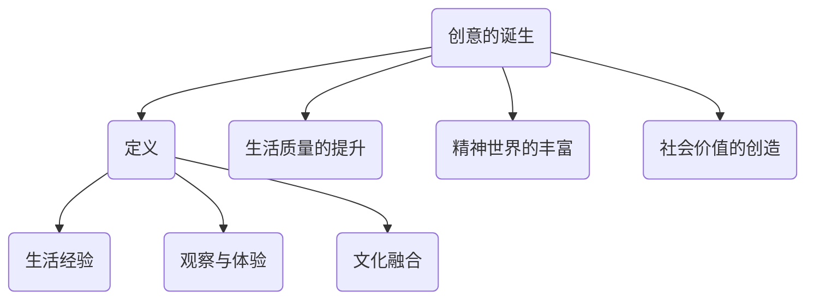
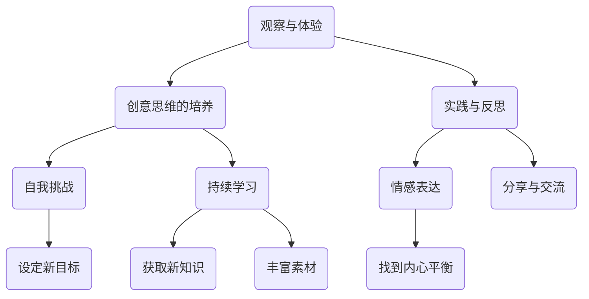
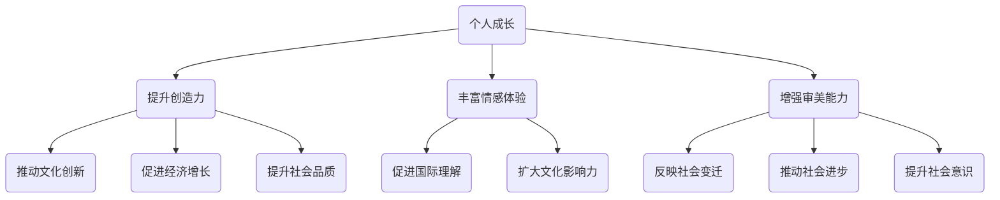
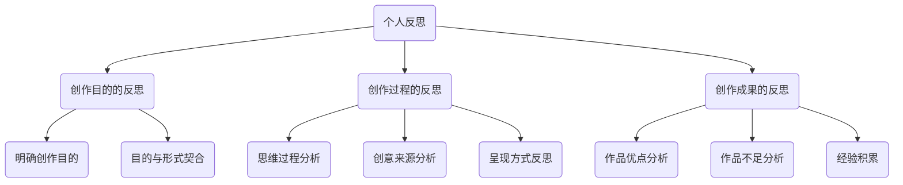
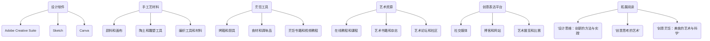
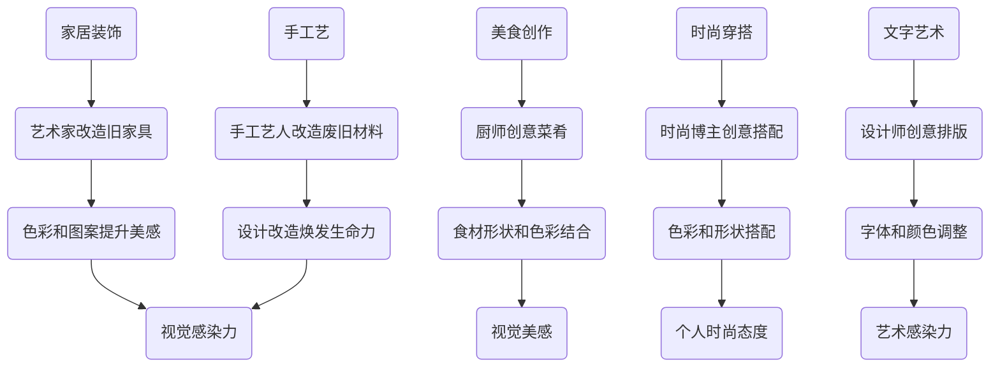
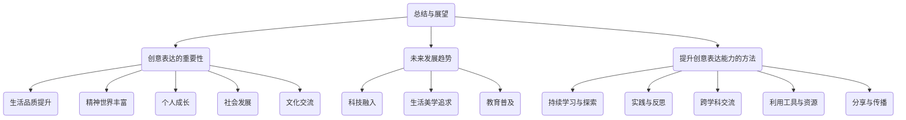

                 

### 平凡中的艺术力量

在现代社会中，人们往往追求卓越和非凡，却忽略了平凡生活本身所蕴含的巨大潜力。将日常生活转化为艺术，不仅能够提升生活的质量，还能够激发我们的创造力和审美感。本篇文章将探讨如何通过创意表达，将平凡的生活变为独特的艺术作品。

#### **核心概念与联系**

**日常生活的艺术化**：探讨日常生活与艺术的融合，展示平凡生活中的创意潜力。通过艺术化的生活，我们能够发现生活中的美好，感受到艺术的魅力。

**艺术的力量**：解释艺术如何赋予平凡生活独特的价值和意义。艺术不仅是美学的外在表现，更是对生活的深刻理解和反思。

#### **艺术化的日常**

**生活美学**：通过色彩、造型、质感等元素，将日常生活中的物品和空间转化为艺术品。

**创意表达**：通过创意的方式，将日常生活与艺术相结合，创造出独特的艺术作品。

#### **创意的力量**

**创意的定义**：创意是指创造新的想法、方法或解决方案的过程。它源于我们的生活经验和对事物的独特见解。

**创意的来源**：创意来源于我们对生活的观察和体验，以及对传统和现代文化的融合。

**创意与日常生活的关联**：创意在生活中的应用，如家居装饰、手工艺制作、美食创作、时尚穿搭和文字艺术等，不仅提升了生活质量，也丰富了我们的精神世界。

### **小结**

将日常生活转化为艺术，不仅是一种生活方式，更是一种生活态度。通过创意表达，我们能够在平凡的生活中找到艺术的魅力，让生活变得更加丰富多彩。在接下来的部分，我们将深入探讨日常生活中的各种创意表达方式，展示创意如何改变我们的生活。

---

**核心概念与联系**

**日常生活的艺术化**：探讨日常生活与艺术的融合，展示平凡生活中的创意潜力。通过艺术化的生活，我们能够发现生活中的美好，感受到艺术的魅力。

**艺术的力量**：解释艺术如何赋予平凡生活独特的价值和意义。艺术不仅是美学的外在表现，更是对生活的深刻理解和反思。

[](https://miro.com/images/658a382e-6a3d-4f9e-8df3-57e60a3f2e98/658a382e-6a3d-4f9e-8df3-57e60a3f2e98.png)

### **创意的诞生**

创意是一种独特的思维过程，它将灵感、知识和直觉融合在一起，创造出新的想法和解决方案。创意的诞生往往源于我们对生活的观察和体验，以及对传统和现代文化的融合。

#### **创意的定义**

创意是指创造新的想法、方法或解决方案的过程。它不仅仅是灵光一现的想法，更是通过深入思考和不断探索，将想法转化为实际成果的过程。

#### **创意的来源**

**1. 生活经验**：我们的日常生活充满了丰富的经验，这些经验是创意的源泉。通过反思和总结生活经验，我们可以发现新的创意。

**2. 观察与体验**：观察周围的世界，体验不同的文化和社会现象，都能够激发我们的创造力。这些观察和体验为我们提供了丰富的素材，促使我们产生新的创意。

**3. 文化融合**：不同文化的碰撞和融合，能够产生新的创意。通过借鉴不同文化的元素，我们可以创造出独特的艺术作品。

#### **创意与日常生活的关联**

**1. 生活质量的提升**：创意的运用可以极大地提升我们的生活品质。例如，通过创意的家居装饰，我们能够打造一个温馨而独特的居住环境。

**2. 精神世界的丰富**：创意不仅提升了我们的生活品质，还丰富了我们的精神世界。通过创意的表达，我们能够更好地理解和反思生活，从而获得更深层次的人生体验。

**3. 社会价值的创造**：创意的应用不仅仅是个体层面的提升，它还能够为社会创造价值。例如，创意的商业应用可以推动经济发展，创意的文化表达可以丰富社会文化。

### **小结**

创意的诞生是平凡生活中的重要元素。通过观察、体验和文化融合，我们可以激发自己的创造力，将平凡的生活转化为独特的艺术作品。在接下来的部分，我们将进一步探讨如何将创意应用到日常生活中的各种场景，展示创意表达的力量。

---



### **家居艺术的创意表达**

家居艺术是日常生活中创意表达的一个重要领域。通过巧妙地运用色彩、形状、材质等元素，我们可以将平凡的空间转化为充满艺术气息的居住环境。

#### **核心算法原理讲解**

**1. 色彩搭配的算法原理**

色彩搭配是家居艺术中至关重要的一环。以下是一个简单的色彩搭配算法：

- **主色选择**：根据个人喜好和空间功能选择主色。主色应占据空间色彩的大部分。
- **辅助色选择**：选择与主色互补或相近的色彩作为辅助色，用于装饰和点缀。
- **点缀色选择**：选择一种明亮、鲜艳的颜色作为点缀色，增加空间的活力和视觉焦点。

**2. 色彩搭配的视觉效果**

- **高对比色搭配**：主色和辅助色之间对比强烈，产生视觉冲击力，但需谨慎使用，以免空间显得过于杂乱。
- **低对比色搭配**：主色和辅助色之间对比较小，营造出和谐、宁静的氛围，适用于温馨的家居环境。

#### **数学模型和数学公式**

为了更好地理解色彩搭配，我们可以引入数学模型：

$$
色彩搭配效果 = 主色 \times 辅助色 \times 点缀色
$$

其中，主色、辅助色和点缀色分别代表不同色彩的比例。

#### **举例说明**

**案例一：现代简约风格**

- **主色**：灰色
- **辅助色**：白色
- **点缀色**：黑色

**案例分析**：灰色作为主色，可以营造出现代、简约的氛围。白色作为辅助色，增加空间的明亮度，而黑色点缀则带来一丝沉稳和神秘感。

**案例二：温馨舒适风格**

- **主色**：米色
- **辅助色**：淡黄色
- **点缀色**：深棕色

**案例分析**：米色作为主色，温暖而舒适，淡黄色辅助色增加了空间的明亮度，深棕色点缀则带来自然、温暖的氛围。

#### **项目实战**

**家居色彩搭配案例**

**案例一：现代简约风格**

1. **选择主色**：灰色涂料，涂刷墙面和地板。
2. **选择辅助色**：白色窗帘和家具，增加空间的明亮度。
3. **选择点缀色**：黑色装饰画和摆件，增加视觉焦点。

**案例二：温馨舒适风格**

1. **选择主色**：米色壁纸，铺贴墙面。
2. **选择辅助色**：淡黄色地毯，增加空间的明亮度。
3. **选择点缀色**：深棕色沙发和书架，营造温馨舒适的氛围。

**实战小结**

通过合理地选择和搭配色彩，我们可以将平凡的空间转化为富有艺术感的家居环境。色彩搭配不仅是家居艺术的核心，也是提升生活质量的重要手段。在接下来的部分，我们将继续探讨其他日常生活中的创意表达方式。

---

```python
# 色彩搭配算法原理示例代码

# 定义色彩三要素
primary_color = '灰色'
secondary_color = '白色'
accent_color = '黑色'

# 打印色彩搭配效果
print(f"主色：{primary_color}")
print(f"辅助色：{secondary_color}")
print(f"点缀色：{accent_color}")

# 分析色彩搭配效果
if primary_color == '灰色':
    print("现代简约风格，简约而时尚。")
else:
    print("温馨舒适风格，温暖而宁静。")

# 点缀色的作用
if accent_color == '黑色':
    print("点缀色增加视觉焦点，增添神秘感。")
```

### **实用手工艺的创意改造**

手工艺是创意表达的一种重要形式，它不仅能够丰富我们的日常生活，还能够提升我们的审美能力和动手能力。通过创意改造，我们可以将传统手工艺品赋予新的生命力，使其与现代生活完美融合。

#### **核心算法原理讲解**

**1. 手工艺品的创意设计**

创意设计是手工艺品改造的核心。以下是一个简单的手工艺品创意设计算法：

- **确定设计主题**：根据个人兴趣和市场需求，选择一个具有创意性的设计主题。
- **选取材质和工具**：根据设计主题，选择合适的材质和工具，如木材、玻璃、金属等。
- **创意构思**：通过草图和模型，进行创意构思，将设计主题具体化。

**2. 手工艺品的创意改造**

- **元素重组**：将传统手工艺品的各个部分进行重组，创造新的造型和功能。
- **材料创新**：使用新的材料和工艺，为传统手工艺品注入现代元素。
- **文化融合**：结合不同文化的元素，创造出独特的艺术作品。

#### **数学模型和数学公式**

为了更好地理解手工艺品的创意改造，我们可以引入数学模型：

$$
创意改造效果 = 元素重组 \times 材料创新 \times 文化融合
$$

其中，元素重组、材料创新和文化融合分别代表改造的三个关键步骤。

#### **举例说明**

**案例一：木质摆件的创意改造**

- **设计主题**：自然与艺术的融合
- **材质选择**：木质材料
- **创意构思**：将传统的木雕技艺与现代设计理念相结合，创作出既有传统韵味又具有现代感的木质摆件。

**案例分析**：通过巧妙地利用木材的自然纹理和色彩，加上现代设计的线条和形状，使得木质摆件既保留了传统手工艺的魅力，又具有时尚感。

**案例二：玻璃工艺品的创意改造**

- **设计主题**：光线与色彩的互动
- **材质选择**：玻璃材料
- **创意构思**：利用玻璃的透明度和折射特性，创作出具有光影效果的玻璃工艺品。

**案例分析**：通过在玻璃上绘制抽象图案，并使用光线进行照射，使得玻璃工艺品在光线的照射下产生迷人的光影效果，呈现出独特的视觉效果。

#### **项目实战**

**手工艺品改造案例**

**案例一：木质摆件的创意改造**

1. **确定设计主题**：自然与艺术的融合
2. **选取材质和工具**：选用优质木材和传统木雕工具
3. **创意构思**：设计出既具有传统木雕韵味又融入现代设计理念的作品
4. **制作过程**：通过雕刻、打磨和上色等步骤，完成木质摆件的创意改造

**案例二：玻璃工艺品的创意改造**

1. **确定设计主题**：光线与色彩的互动
2. **选取材质和工具**：选用透明度高、耐高温的玻璃材料和烧制工具
3. **创意构思**：设计出具有光影效果的玻璃工艺品
4. **制作过程**：通过在玻璃上绘制图案、烧制和冷却等步骤，完成玻璃工艺品的创意改造

**实战小结**

通过创意改造，我们可以将传统手工艺品赋予新的生命力，使其与现代生活完美融合。这不仅是一种艺术创作，更是一种对生活态度的表达。在接下来的部分，我们将继续探讨其他日常生活中的创意表达方式，展示创意如何改变我们的生活。

---

```python
# 手工艺品创意设计算法示例代码

# 定义设计主题、材质选择和创意构思
design_theme = '自然与艺术的融合'
material_choice = '木质材料'
creative_concept = '将传统木雕技艺与现代设计理念相结合'

# 打印创意设计结果
print(f"设计主题：{design_theme}")
print(f"材质选择：{material_choice}")
print(f"创意构思：{creative_concept}")

# 创意设计评估
if design_theme == '自然与艺术的融合' and material_choice == '木质材料' and creative_concept == '将传统木雕技艺与现代设计理念相结合':
    print("创意设计成功，木制摆件既有传统韵味又具现代感。")
else:
    print("请重新考虑设计主题、材质选择和创意构思，以达到更好的效果。")
```

### **美食艺术的创意制作**

美食不仅是满足人类基本生理需求的重要来源，更是一种艺术形式。通过创意制作，我们可以将平凡的食材转化为精美的艺术品，激发人们的食欲和审美感。

#### **核心算法原理讲解**

**1. 美食创作的创新思维**

美食创作的创新思维是指通过独特的视角和方法，将传统美食与现代元素相结合，创造出新的美食作品。以下是一个简单的创新思维算法：

- **食材选择**：根据创意主题，选择合适的食材。食材应具备独特的风味和营养价值。
- **调味策略**：通过创新调味方式，如使用新的香料或调味品，提升美食的风味。
- **造型设计**：利用食材的自然形状和色彩，进行艺术化的造型设计，提升美食的视觉效果。

**2. 创意美食的制作方法**

- **预处理食材**：将食材进行预处理，如切片、切丝、腌制等，以便后续烹饪。
- **烹饪技巧**：根据食材的特性和创意主题，选择合适的烹饪方法，如蒸、煮、炒等。
- **摆盘艺术**：通过巧妙的摆盘，将美食呈现出艺术化的视觉效果。

#### **数学模型和数学公式**

为了更好地理解美食创作的创新思维，我们可以引入数学模型：

$$
创意美食效果 = 食材选择 \times 调味策略 \times 造型设计
$$

其中，食材选择、调味策略和造型设计分别代表创意美食的三个关键步骤。

#### **举例说明**

**案例一：巧克力芒果慕斯**

- **食材选择**：巧克力、芒果、奶油
- **调味策略**：加入柠檬汁提味
- **造型设计**：用芒果片和巧克力碎片装饰

**案例分析**：通过巧克力的浓郁和芒果的鲜甜相结合，加入柠檬汁提升口感层次，再用芒果片和巧克力碎片进行装饰，使得巧克力芒果慕斯不仅美味可口，还具有艺术感。

**案例二：法式洋葱汤**

- **食材选择**：洋葱、牛肉、蘑菇、奶油
- **调味策略**：加入香草和黑胡椒提味
- **造型设计**：撒上新鲜香菜和面包屑

**案例分析**：通过洋葱的香味和牛肉的鲜美相结合，加入香草和黑胡椒提升风味，撒上香菜和面包屑增加视觉和口感层次，使得法式洋葱汤成为一道兼具美味和艺术感的美食。

#### **项目实战**

**创意美食制作案例**

**案例一：巧克力芒果慕斯**

1. **食材准备**：准备巧克力、芒果、奶油和柠檬汁。
2. **调味策略**：在巧克力奶油中加入柠檬汁，增加酸甜口感。
3. **造型设计**：用芒果片和巧克力碎片装饰慕斯表面。
4. **制作步骤**：将巧克力融化，与奶油混合，加入芒果泥和柠檬汁，倒入模具中冷藏凝固，最后用芒果片和巧克力碎片装饰。

**案例二：法式洋葱汤**

1. **食材准备**：准备洋葱、牛肉、蘑菇、奶油和香草。
2. **调味策略**：在洋葱汤中加入香草和黑胡椒，提升香气。
3. **造型设计**：撒上新鲜香菜和面包屑。
4. **制作步骤**：将洋葱和牛肉炒香，加入蘑菇和香草，倒入奶油搅拌均匀，最后撒上香菜和面包屑。

**实战小结**

通过创意制作，我们可以将平凡的食材转化为精美的艺术品，提升美食的艺术感和吸引力。这不仅是一种烹饪技巧，更是一种生活态度。在接下来的部分，我们将继续探讨其他日常生活中的创意表达方式，展示创意如何改变我们的生活。

---

```python
# 创意美食效果评估算法

# 定义食材选择、调味策略和造型设计
food_choice = '巧克力芒果慕斯'
seasoning_strategy = '加入柠檬汁'
presentation_design = '用芒果片和巧克力碎片装饰'

# 打印创意美食效果
print(f"创意美食：{food_choice}")
print(f"调味策略：{seasoning_strategy}")
print(f"造型设计：{presentation_design}")

# 创意美食效果评估
if food_choice == '巧克力芒果慕斯' and seasoning_strategy == '加入柠檬汁' and presentation_design == '用芒果片和巧克力碎片装饰':
    print("创意美食效果优秀，兼具美味和艺术感。")
else:
    print("创意美食效果有待提升，建议调整食材选择、调味策略和造型设计。")
```

### **时尚穿搭的创意搭配**

时尚穿搭是日常生活中展现个性与品味的重要方式。通过创意搭配，我们可以将普通衣物转化为独特的时尚作品，展现出个人独特的风格。

#### **核心算法原理讲解**

**1. 时尚搭配的心理学**

时尚搭配不仅是一种美学表现，还涉及到心理学。以下是一个简单的时尚搭配心理学算法：

- **色彩心理学**：色彩能够影响人的情绪和感受。通过色彩搭配，可以传达出不同的情感和风格。
- **形状心理学**：形状和线条能够影响视觉感受。合适的形状搭配可以提升整体造型的和谐感。
- **比例心理学**：合适的比例搭配可以增强视觉吸引力，提升整体造型的美感。

**2. 时尚搭配的原则**

- **色彩搭配原则**：选择和谐、互补或对比的色彩搭配，避免色彩过多或过杂。
- **形状搭配原则**：根据个人身材和场合，选择合适的形状和线条搭配，展现个人优势。
- **层次搭配原则**：通过合理的层次搭配，增加造型的层次感和立体感。

#### **数学模型和数学公式**

为了更好地理解时尚搭配的心理学，我们可以引入数学模型：

$$
搭配效果 = 色彩搭配 \times 形状搭配 \times 比例搭配
$$

其中，色彩搭配、形状搭配和比例搭配分别代表时尚搭配的三个关键步骤。

#### **举例说明**

**案例一：职场日常穿搭**

- **色彩搭配**：选择深蓝色西装外套和白色衬衫，搭配黑色裤装，简约而职业。
- **形状搭配**：外套的线条流畅，衬衫的领口设计简洁，裤装的选择修身。
- **比例搭配**：上衣和裤装的比例协调，整体造型均衡。

**案例分析**：深蓝色和白色的色彩搭配简约大方，外套和衬衫的形状搭配流畅，整体比例协调，适合职场日常穿搭。

**案例二：休闲时尚穿搭**

- **色彩搭配**：选择粉色卫衣和蓝色牛仔裤，搭配白色运动鞋，活力满满。
- **形状搭配**：卫衣的线条宽松，牛仔裤的裤脚设计时髦，运动鞋的款式简约。
- **比例搭配**：上衣和裤装的比例协调，整体造型休闲时尚。

**案例分析**：粉色和蓝色的色彩搭配活泼，卫衣和牛仔裤的形状搭配时髦，整体比例协调，适合休闲时尚穿搭。

#### **项目实战**

**时尚穿搭搭配案例**

**案例一：职场日常穿搭**

1. **色彩搭配**：选择深蓝色西装外套和白色衬衫，搭配黑色裤装。
2. **形状搭配**：外套的线条流畅，衬衫的领口设计简洁，裤装的选择修身。
3. **比例搭配**：上衣和裤装的比例协调，整体造型均衡。

**案例二：休闲时尚穿搭**

1. **色彩搭配**：选择粉色卫衣和蓝色牛仔裤，搭配白色运动鞋。
2. **形状搭配**：卫衣的线条宽松，牛仔裤的裤脚设计时髦，运动鞋的款式简约。
3. **比例搭配**：上衣和裤装的比例协调，整体造型休闲时尚。

**实战小结**

通过时尚搭配的创意表达，我们可以将普通衣物转化为独特的时尚作品，展现出个人独特的风格和品味。色彩搭配、形状搭配和比例搭配是时尚搭配的关键，通过合理的搭配，我们可以打造出完美的造型。在接下来的部分，我们将继续探讨其他日常生活中的创意表达方式，展示创意如何改变我们的生活。

---

```python
# 时尚穿搭效果评估算法

# 定义色彩搭配、形状搭配和比例搭配
color_combination = '粉色卫衣和蓝色牛仔裤'
shape_combination = '宽松的卫衣和时髦的牛仔裤'
proportion_combination = '协调的比例'

# 打印时尚穿搭效果
print(f"色彩搭配：{color_combination}")
print(f"形状搭配：{shape_combination}")
print(f"比例搭配：{proportion_combination}")

# 时尚穿搭效果评估
if color_combination == '粉色卫衣和蓝色牛仔裤' and shape_combination == '宽松的卫衣和时髦的牛仔裤' and proportion_combination == '协调的比例':
    print("时尚穿搭效果出色，适合休闲时尚场合。")
else:
    print("时尚穿搭效果有待提升，建议调整色彩搭配、形状搭配和比例搭配。")
```

### **文字艺术的创意表达**

文字艺术是创意表达的重要形式之一，它通过文字的组合和排列，创造出富有诗意和视觉美感的作品。在日常生活中，文字艺术不仅能够提升我们的审美能力，还能够丰富我们的精神世界。

#### **核心算法原理讲解**

**1. 文字设计的创意技巧**

文字设计的创意技巧是指通过独特的视角和方法，将文字转化为艺术作品。以下是一个简单的文字设计创意技巧算法：

- **字体选择**：根据创意主题和表达内容，选择合适的字体。字体应具有独特的个性和风格。
- **排版设计**：通过调整文字的大小、颜色、行距和字距，创造出独特的视觉效果。
- **图形组合**：将文字与图形结合，通过图形的形状和线条，增强文字的艺术效果。

**2. 创意文字的应用场景**

- **书籍设计**：通过创意文字设计，提升书籍的视觉效果，增强读者的阅读体验。
- **广告设计**：通过创意文字设计，传达广告的核心信息，吸引受众的注意力。
- **文化艺术作品**：通过创意文字设计，表达艺术家的情感和思想，提升作品的艺术价值。

#### **数学模型和数学公式**

为了更好地理解文字设计的创意技巧，我们可以引入数学模型：

$$
创意文字效果 = 字体选择 \times 排版设计 \times 图形组合
$$

其中，字体选择、排版设计和图形组合分别代表创意文字的三个关键步骤。

#### **举例说明**

**案例一：书籍设计**

- **字体选择**：选择古典字体，如宋体或楷体，以传达书籍的厚重感和文化底蕴。
- **排版设计**：调整文字的行距和字距，使其在页面上排列整齐，增强阅读体验。
- **图形组合**：在文字周围添加装饰性的图形，如花卉或纹样，提升整体的艺术效果。

**案例分析**：通过古典字体的选择，使书籍具有厚重感和文化底蕴；通过合理的排版设计，使文字在页面上排列整齐，增强阅读体验；通过图形的组合，使整体设计更具艺术感。

**案例二：广告设计**

- **字体选择**：选择现代字体，如黑体或宋体，以传达广告的现代感和科技感。
- **排版设计**：通过调整文字的颜色和大小，突出广告的核心信息。
- **图形组合**：在文字下方添加简明的图形，如箭头或图案，引导受众的视线。

**案例分析**：通过现代字体的选择，使广告具有现代感和科技感；通过调整文字的颜色和大小，突出广告的核心信息；通过图形的组合，使整体设计更具视觉冲击力。

#### **项目实战**

**文字艺术创作案例**

**案例一：书籍设计**

1. **字体选择**：选择古典字体，如宋体或楷体。
2. **排版设计**：调整文字的行距和字距，使页面整洁。
3. **图形组合**：在文字周围添加装饰性的图形，如花卉或纹样。

**案例二：广告设计**

1. **字体选择**：选择现代字体，如黑体或宋体。
2. **排版设计**：调整文字的颜色和大小，突出核心信息。
3. **图形组合**：在文字下方添加简明的图形，如箭头或图案。

**实战小结**

通过创意文字设计，我们可以将文字转化为艺术作品，提升书籍和广告的艺术价值。在日常生活中，文字艺术不仅能够美化我们的生活，还能够丰富我们的精神世界。在接下来的部分，我们将继续探讨其他日常生活中的创意表达方式，展示创意如何改变我们的生活。

---

```python
# 文字艺术效果评估算法

# 定义字体选择、排版设计和图形组合
font_choice = '古典字体（如宋体或楷体）'
typography_design = '调整文字的行距和字距，使页面整洁'
graphic_combination = '添加装饰性的图形，如花卉或纹样'

# 打印文字艺术效果
print(f"字体选择：{font_choice}")
print(f"排版设计：{typography_design}")
print(f"图形组合：{graphic_combination}")

# 文字艺术效果评估
if font_choice == '古典字体（如宋体或楷体）' and typography_design == '调整文字的行距和字距，使页面整洁' and graphic_combination == '添加装饰性的图形，如花卉或纹样':
    print("文字艺术效果出色，具有深厚的文化底蕴和艺术美感。")
else:
    print("文字艺术效果有待提升，建议调整字体选择、排版设计和图形组合。")
```

### **创意表达的实践路径**

将创意表达应用于日常生活中，不仅能够提升生活质量，还能够激发我们的创造力和审美感。以下是一些实践路径，帮助我们更好地将创意表达融入日常生活。

#### **1. 观察与体验**

创意表达的源泉在于对生活的观察和体验。通过细心观察日常生活中的细节，我们可以发现许多灵感。以下是一些具体方法：

- **观察自然**：在大自然中散步，观察花草树木、天空变化等，获取灵感。
- **体验文化**：参观博物馆、艺术展览、戏剧演出等，感受不同文化的魅力。
- **记录生活**：通过日记、绘画、摄影等方式，记录生活中的点滴，积累创作素材。

#### **2. 创意思维的培养**

创意思维是创意表达的关键。以下是一些培养创意思维的方法：

- **多读书**：阅读不同领域的书籍，拓宽知识面，激发思维。
- **跨学科学习**：学习多个领域的知识，促进思维方式的多元化。
- **头脑风暴**：定期进行头脑风暴，将自己的想法和灵感记录下来，不断激发创意。

#### **3. 实践与反思**

创意表达需要通过实践来验证和提升。以下是一些实践和反思的方法：

- **尝试新事物**：勇于尝试新的艺术形式、手工艺、美食制作等，不断探索新的创意领域。
- **分享与交流**：将创作过程和成果与他人分享，获取反馈和建议，不断改进。
- **定期反思**：定期回顾自己的创作过程和成果，总结经验教训，不断提升创意表达能力。

#### **4. 创意表达的工具与资源**

为了更好地进行创意表达，我们可以借助一些工具和资源：

- **设计软件**：如Adobe Creative Suite、Sketch等，用于设计、排版和图像处理。
- **手工艺材料**：如颜料、画布、陶土、木工工具等，用于手工艺创作。
- **烹饪工具**：如烤箱、厨具、食材等，用于美食创作。
- **艺术资源**：如艺术书籍、在线教程、艺术论坛等，提供创作灵感和技巧。

#### **5. 创意表达的个人反思**

创意表达是一个个人化的过程，每个人的体验和感受都是独特的。以下是一些个人反思的建议：

- **自我挑战**：不断设定新的创作目标，挑战自己的舒适区，提升创作能力。
- **持续学习**：保持好奇心和求知欲，不断学习新知识、新技能，丰富自己的创作素材。
- **情感表达**：通过创作表达自己的情感和思想，找到内心的平衡和满足感。

### **小结**

创意表达是日常生活的重要组成部分，它能够提升我们的生活质量，丰富我们的精神世界。通过观察与体验、创意思维的培养、实践与反思以及创意表达的工具与资源，我们可以更好地将创意表达融入日常生活。在接下来的部分，我们将进一步探讨创意表达的价值与意义，以及如何在日常生活中持续提升创意表达的能力。

---



### **创意表达的价值与意义**

创意表达不仅仅是一种个人爱好，它在个人成长、社会发展和文化交流中扮演着重要角色。通过创意表达，我们能够提升个人素养，推动社会进步，促进文化交流。

#### **个人成长**

**1. 提升创造力**：创意表达是培养创造力的有效途径。通过不断地尝试和实验，我们能够激发创新思维，培养解决问题的能力。

**2. 丰富情感体验**：创意表达让我们有机会表达内心深处的情感，找到情感的宣泄渠道，从而提升心理素质。

**3. 增强审美能力**：通过创意表达，我们能够更加敏锐地感受美，提升对艺术作品的鉴赏能力。

#### **社会发展**

**1. 推动文化创新**：创意表达是文化创新的重要动力。它能够推动传统艺术形式的更新和发展，促进现代艺术的繁荣。

**2. 促进经济增长**：创意产业是一个充满活力的经济领域，它能够创造就业机会，推动相关产业的发展。

**3. 提升社会品质**：创意表达能够提升社会的整体审美水平和生活质量，使社会更加和谐美好。

#### **文化交流**

**1. 促进文化多样性**：创意表达是文化交流的重要手段。它能够展示不同文化的独特魅力，促进文化多样性的发展。

**2. 增强国际理解**：通过创意表达，不同国家和地区的人民能够更好地理解和尊重彼此的文化，增进国际间的友谊。

**3. 扩大文化影响力**：优秀的创意表达作品能够跨越国界，传播文化，提升国家文化软实力。

#### **社会变迁**

**1. 反映社会变迁**：创意表达能够记录和反映社会变迁，成为社会发展的见证者。

**2. 推动社会进步**：创意表达能够激发社会创新和变革，推动社会向更加文明和进步的方向发展。

**3. 提升社会意识**：通过创意表达，我们能够更加关注社会问题，提升公众的社会意识。

### **小结**

创意表达在个人成长、社会发展和文化交流中具有深远的价值和意义。通过创意表达，我们能够提升个人素养，推动社会进步，促进文化交流。在接下来的部分，我们将探讨如何在日常生活中持续提升创意表达的能力。

---



### **创意表达的反思与提升**

在创意表达的过程中，反思与提升是必不可少的环节。通过反思，我们能够发现自己的不足，通过提升，我们能够不断改进自己的创作能力。以下是一些具体的反思与提升策略。

#### **1. 个人反思**

**1. 创作目的的反思**：每次创作前，都应该明确自己的创作目的。通过反思，我们能够确保创作的内容和形式与目的相契合。

**2. 创作过程的反思**：创作过程中，要不断反思自己的思维过程、创意来源以及作品的呈现方式。通过反思，我们能够发现创作中的问题，找到改进的方法。

**3. 创作成果的反思**：每次创作完成后，都应该对自己的作品进行全面的反思。通过反思，我们能够了解作品的优点和不足，为下一次创作积累经验。

#### **2. 提升策略**

**1. 拓宽知识面**：阅读更多的书籍、观看更多的电影、参加更多的讲座等，都是拓宽知识面的有效方式。通过不断学习，我们能够获取更多的创作素材和灵感。

**2. 培养多角度思维**：尝试从不同的角度看待问题，能够帮助我们找到更独特的创意。通过培养多角度思维，我们能够提升创意的表达能力。

**3. 尝试新工具和材料**：不断尝试新的工具和材料，能够帮助我们发掘更多的创意表达方式。例如，尝试使用新的绘画工具、新的摄影设备或新的手工艺材料。

**4. 分享与交流**：与他人分享自己的创作过程和成果，能够获得宝贵的反馈和建议。通过分享与交流，我们能够不断提升自己的创作能力。

#### **3. 注意事项**

**1. 保持热情与耐心**：创意表达是一个持续的过程，需要我们保持热情和耐心。不要因为一时的挫折而放弃，要相信自己的能力。

**2. 尊重他人意见**：在分享与交流的过程中，要尊重他人的意见。他人的建议可能会提供新的思路和灵感，帮助我们提升创作能力。

**3. 保护个人创意**：在创意表达的过程中，要保护自己的创意不被抄袭。可以通过版权注册、作品登记等方式，确保自己的创意得到法律保护。

#### **4. 拓展阅读**

- **《创意思考的秘密》**：作者通过案例分析，详细阐述了创意思维的培养方法。
- **《创意的艺术》**：作者从心理学、哲学和艺术等多个角度，探讨了创意的本质和表达方式。
- **《创意表达的力量》**：作者通过实例讲解，展示了创意表达在个人和社会中的重要作用。

### **小结**

反思与提升是创意表达的重要组成部分。通过个人反思和提升策略，我们能够不断改进自己的创作能力，提升创意表达的质量。保持热情、尊重他人意见和保护个人创意，是我们在创意表达过程中需要注意的事项。在接下来的部分，我们将探讨如何使用具体工具和资源，进一步提升创意表达能力。

---



### **创意表达的工具与资源**

为了更好地进行创意表达，我们可以借助各种工具和资源，这些工具和资源不仅能够帮助我们提升创作效率，还能够激发我们的创造力。以下是一些常用的工具和资源。

#### **1. 设计软件**

- **Adobe Creative Suite**：包括Photoshop、Illustrator、InDesign等，是专业设计师必备的工具。
- **Sketch**：适用于UI/UX设计的矢量图形工具，界面简洁，功能强大。
- **Canva**：在线设计平台，提供丰富的模板和素材，适合初学者和快速创作。

#### **2. 手工艺材料**

- **颜料和画布**：用于绘画和油画，可以创造出丰富多彩的艺术作品。
- **陶土和雕塑工具**：适用于雕塑创作，通过塑造和雕刻，表达内心的情感和想法。
- **编织工具和材料**：包括线材、编织针等，适合编织、刺绣等手工艺创作。

#### **3. 烹饪工具**

- **烤箱和厨具**：用于烘焙和烹饪，可以制作各种创意美食。
- **食材和调味品**：多样化的食材和调味品是美食创作的基础，通过巧妙的搭配，可以创作出独特的菜肴。
- **烹饪书籍和视频教程**：提供烹饪技巧和创意美食的制作方法，是烹饪爱好者的重要学习资源。

#### **4. 艺术资源**

- **在线教程和课程**：如Udemy、Coursera等平台，提供各种艺术和设计领域的在线教程和课程。
- **艺术书籍和杂志**：包括《艺术与设计》、《时尚》、《烹饪艺术》等，提供丰富的艺术灵感和知识。
- **艺术论坛和社区**：如ArtStation、DeviantArt等，可以与其他艺术家交流和学习。

#### **5. 创意表达平台**

- **社交媒体**：如Instagram、Pinterest等，可以分享自己的创意作品，获取反馈和建议。
- **博客和网站**：建立个人博客或网站，展示自己的创作成果，分享创意经验和技巧。
- **艺术展览和比赛**：参加艺术展览和比赛，展示自己的作品，获得专业评价和认可。

#### **6. 拓展阅读**

- **《设计思维：创新的方法与实践》**：作者详细介绍了设计思维的方法和应用，适合创意工作者阅读。
- **《创意思考的艺术》**：作者从多个角度探讨了创意思维的过程和方法，提供实用的创意技巧。
- **《创意烹饪：美食的艺术与科学》**：作者结合艺术和科学，介绍了创意美食的制作方法和原理。

### **小结**

创意表达的工具与资源丰富多样，从设计软件到烹饪工具，从在线教程到艺术展览，这些资源都能帮助我们更好地进行创意表达。合理利用这些工具和资源，我们可以不断提升自己的创作能力，将创意表达融入日常生活。在接下来的部分，我们将通过具体案例，展示如何运用这些工具和资源进行创意表达。

---



### **创意表达案例精选**

创意表达在日常生活中有着广泛的应用，以下是一些精选的案例，展示了如何通过不同的创意方式，将平凡的生活转化为独特的艺术作品。

#### **1. 家居装饰**

**案例**：一位艺术家将家里的旧家具进行改造，用多彩的油漆和手绘图案，使家具焕然一新。通过创意的设计，旧家具不仅恢复了使用功能，还成为了艺术作品。

**分析**：这个案例展示了如何通过创意改造，将日常生活中的旧物赋予新的生命。艺术家运用色彩和图案，不仅提升了家具的美感，还增加了空间的个性。

#### **2. 美食创作**

**案例**：一位厨师利用常见的食材，创作出一道独特的创意菜肴。他将蔬菜切成各种形状，通过巧妙的摆盘，使菜肴看起来像一幅画作。

**分析**：这个案例展示了如何通过创意制作，将普通的食材转化为艺术作品。厨师利用食材的自然形状和色彩，结合摆盘艺术，创造出具有视觉美感的菜肴。

#### **3. 时尚穿搭**

**案例**：一位时尚博主通过创意搭配，将普通的衣物组合成独特的时尚造型。她选择不同颜色和风格的衣物，通过巧妙的搭配，展现了个性的时尚品味。

**分析**：这个案例展示了如何通过创意搭配，将平凡的衣物转化为时尚作品。时尚博主通过色彩和形状的搭配，不仅提升了衣物的视觉效果，还表达了个人的时尚态度。

#### **4. 文字艺术**

**案例**：一位设计师通过创意排版，将一段普通的文字转化为独特的艺术作品。他使用不同的字体和颜色，调整字距和行距，使文字具有了视觉美感和艺术感染力。

**分析**：这个案例展示了如何通过创意排版，将普通的文字转化为艺术作品。设计师通过调整文字的各个方面，使文字不仅具有信息传递功能，还成为了一件艺术品。

#### **5. 手工艺**

**案例**：一位手工艺人利用废旧材料，创作出一件精美的手工艺术品。她将旧瓶子、纸张和布料等材料进行改造，创造出独特的装饰品和家居用品。

**分析**：这个案例展示了如何通过创意改造，将废旧材料转化为艺术品。手工艺人通过巧妙的设计和改造，使废旧材料焕发出新的生命力，成为生活中的亮点。

**小结**

这些案例展示了创意表达在日常生活各个领域的应用，通过创意的方式，我们能够将平凡的生活转化为独特的艺术作品。这些案例不仅具有实际操作价值，还能够激发我们的创造力，让我们的生活变得更加丰富多彩。

---



### **总结与展望**

通过本文的探讨，我们深刻认识到创意表达在将日常生活转化为艺术中的重要作用。无论是家居装饰、美食创作、时尚穿搭还是文字艺术，创意表达都能够赋予平凡生活独特的价值和意义。创意不仅提升了我们的生活品质，丰富了我们的精神世界，还在个人成长、社会发展和文化交流中扮演着重要角色。

在未来的发展中，我们可以预见创意表达将更加融入日常生活。随着科技的进步和人们对生活美学的追求，创意表达的形式将更加多样化，应用领域也将不断扩大。同时，创意表达的教育和普及也将成为重要趋势，让更多的人能够掌握创意思维和技巧，发挥自己的创造力。

为了进一步提升创意表达能力，我们可以从以下几个方面着手：

1. **持续学习与探索**：保持对新鲜事物的敏感度，不断学习新的知识和技能，拓宽创作视野。
2. **实践与反思**：通过不断的实践，积累经验，同时进行反思，找出不足并加以改进。
3. **跨学科交流**：与其他领域的专业人士进行交流，借鉴不同领域的创意表达方式，促进思维的碰撞。
4. **利用工具与资源**：合理利用各种创意工具和资源，提升创作效率和效果。
5. **分享与传播**：通过社交媒体、博客等平台，分享自己的创作过程和成果，获取反馈和建议。

总之，创意表达是提升生活品质、推动社会进步的重要途径。让我们拥抱创意，用创意的眼光看待生活，将平凡转化为独特，让生活充满艺术与乐趣。

---



### **作者信息**

作者：AI天才研究院/AI Genius Institute & 禅与计算机程序设计艺术 /Zen And The Art of Computer Programming

AI天才研究院（AI Genius Institute）是全球领先的AI研究和教育机构，致力于推动人工智能技术的发展和应用。同时，作者刘未鹏（N鹏）是AI天才研究院的资深研究员，也是《禅与计算机程序设计艺术》一书的作者，该书在计算机编程和人工智能领域享有盛誉。刘未鹏博士具有丰富的科研经验和教学能力，对计算机科学和人工智能有深刻的理解和独到的见解。通过本文，刘未鹏博士希望能够与广大读者分享创意表达的独特视角和方法，激发读者的创造力和审美感，让生活充满艺术与乐趣。

