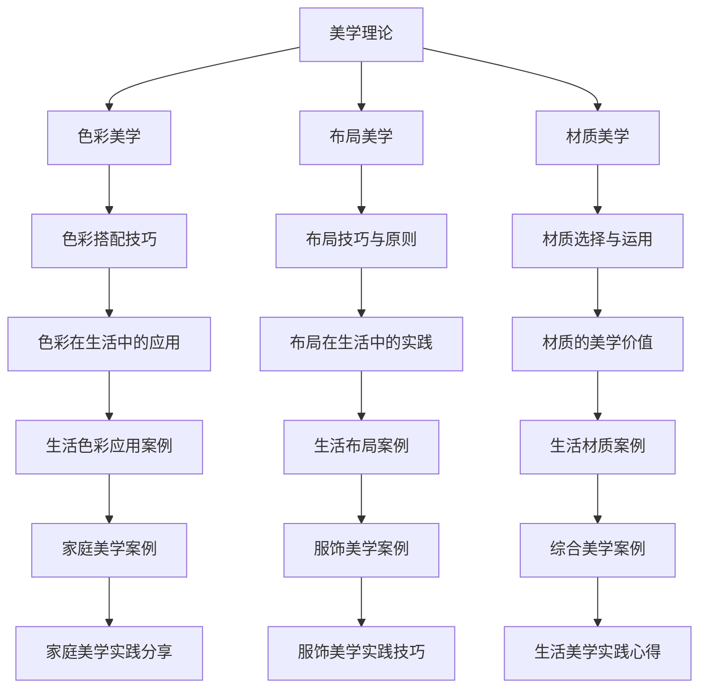

                 

### 《将生活转化为艺术：日常美学的实践指南》

#### 关键词：
日常美学、艺术生活、美学理论、实践指南、色彩美学、布局美学、材质美学

#### 摘要：
本文旨在探讨如何将生活转化为艺术，通过日常美学的实践指南，帮助读者提升生活质量，发现生活中的美。文章分为六个部分，首先介绍日常美学的概念与特点，随后阐述美学理论的基础，包括美学的起源与发展、基本原理以及在生活中的应用。接着，文章详细讨论了色彩美学、布局美学和材质美学的实践方法，并通过实际案例展示了美学在生活中的应用。最后，文章提出了提升生活美学的技巧，包括观察力与审美能力的培养、创造力的激发、持续学习的态度，并对生活美学的意义与价值、实践启示和未来展望进行了总结。

---

### 《将生活转化为艺术：日常美学的实践指南》目录大纲

#### 第一部分：引言

##### 1.1 艺术与生活的界限

###### 1.1.1 艺术的定义与价值

###### 1.1.2 生活与艺术的融合

###### 1.1.3 本书的宗旨与目标

##### 1.2 日常美学的概念与特点

###### 1.2.1 日常美学的定义

###### 1.2.2 日常美学的特点

###### 1.2.3 日常美学的应用领域

#### 第二部分：美学理论的基础

##### 2.1 美学的起源与发展

###### 2.1.1 美学的起源

###### 2.1.2 美学的发展历程

###### 2.1.3 当代美学的主要流派

##### 2.2 美学的基本原理

###### 2.2.1 美的形式原则

###### 2.2.2 美的感知与体验

###### 2.2.3 美的价值与意义

##### 2.3 美学在生活中的应用

###### 2.3.1 家庭美学的布置原则

###### 2.3.2 服饰美学的搭配技巧

###### 2.3.3 日常生活中的美学实践

#### 第三部分：美学实践

##### 3.1 色彩美学

###### 3.1.1 色彩的基础知识

###### 3.1.2 色彩搭配的技巧

###### 3.1.3 色彩在生活中的应用

##### 3.2 布局美学

###### 3.2.1 布局的分类与特点

###### 3.2.2 布局的技巧与原则

###### 3.2.3 布局在生活中的实践

##### 3.3 材质美学

###### 3.3.1 材质的选择与运用

###### 3.3.2 材质的美学价值

###### 3.3.3 材质在生活中的应用

#### 第四部分：生活美学案例分析

##### 4.1 家庭美学的案例分析

###### 4.1.1 家庭美学的布置案例

###### 4.1.2 家庭美学的搭配案例

###### 4.1.3 家庭美学的实践分享

##### 4.2 服饰美学的案例分析

###### 4.2.1 服饰美学的搭配案例

###### 4.2.2 服饰美学的实践技巧

###### 4.2.3 服饰美学的个人风格打造

##### 4.3 生活美学的综合案例分析

###### 4.3.1 生活美学的实践心得

###### 4.3.2 生活美学的实际效果

###### 4.3.3 生活美学的未来展望

#### 第五部分：提升生活美学的技巧

##### 5.1 观察力与审美能力的培养

###### 5.1.1 观察力的培养方法

###### 5.1.2 审美能力的提升途径

###### 5.1.3 观察与审美的结合

##### 5.2 创造力的激发与实践

###### 5.2.1 创造力的定义与作用

###### 5.2.2 创造力的激发方法

###### 5.2.3 创造力的实践与应用

##### 5.3 持续学习的态度

###### 5.3.1 学习的重要性

###### 5.3.2 美学知识的学习途径

###### 5.3.3 持续学习的实践方法

#### 第六部分：结论

##### 6.1 生活美学的意义与价值

###### 6.1.1 生活美学的内涵

###### 6.1.2 生活美学的价值

###### 6.1.3 生活美学在现代社会中的作用

##### 6.2 日常美学的实践启示

###### 6.2.1 日常美学的实践意义

###### 6.2.2 日常美学的实践方法

###### 6.2.3 日常美学的实践成果

##### 6.3 未来展望

###### 6.3.1 生活美学的未来发展

###### 6.3.2 日常美学的研究方向

###### 6.3.3 日常美学在未来的应用场景

---

### 第一部分：引言

#### 1.1 艺术与生活的界限

艺术和生活，看似两个截然不同的领域，实则密不可分。艺术，是人类对生活的一种深层次的认知和表达，它不仅仅是视觉上的美，更是心灵上的共鸣。而生活，则是艺术存在的土壤，是我们每天与之交互、体验的实相。

在《将生活转化为艺术：日常美学的实践指南》中，我们试图打破艺术与生活的界限，将美学理论应用于日常生活的方方面面。通过色彩美学、布局美学和材质美学等实践方法，我们希望帮助读者发现生活中的美，提升生活的质量。

##### 1.1.1 艺术的定义与价值

艺术，是指通过创造性的方式，将情感、思想、审美等抽象的概念，转化为具体的形象或形式，使其可以被感知和体验。它不仅仅是美的体现，更是人类精神世界的外在表现。

艺术的价值，在于它能够带给人们愉悦的体验，激发内心的共鸣，提升生活的质量。通过艺术，我们可以更好地理解自己和世界，找到内心的平静和满足。

##### 1.1.2 生活与艺术的融合

生活与艺术，并非对立的存在，而是相互融合、相互促进的关系。在日常生活中，我们可以通过艺术的方式，让生活变得更加丰富多彩。例如，通过色彩美学的运用，我们可以将家居环境布置得更加美观舒适；通过布局美学的实践，我们可以使空间使用更加高效合理；通过材质美学的应用，我们可以提升日常物品的美感和使用体验。

本书的宗旨与目标，就是帮助读者发现生活中的美，通过日常美学的实践，提升生活质量，让生活变得更加艺术化。

---

### 1.2 日常美学的概念与特点

日常美学，是一种将美学理论应用于日常生活的实践，旨在提升生活的质量，发现生活中的美。它不同于专业艺术领域的审美，而是更加贴近生活，更加实用和易于操作。

##### 1.2.1 日常美学的定义

日常美学，是指将美学理论应用于日常生活的各个领域，包括色彩、布局、材质等方面，通过创造性的方式，提升生活的美感，使其更加符合人们的审美需求和情感体验。

##### 1.2.2 日常美学的特点

- **实用性**：日常美学强调实用性，它不是艺术创作，而是为了让生活变得更加美好，更加符合人们的实际需求。
- **贴近生活**：日常美学更注重生活的细节，它关注的是人们日常生活中的每一个角落，每一个细节，从而提升整体的生活质量。
- **易于操作**：日常美学强调的是简单易行，它不需要复杂的技巧和专业知识，只需要对美学有一定的理解和认识，就可以在日常生活的方方面面进行实践。

##### 1.2.3 日常美学的应用领域

日常美学的应用领域非常广泛，它不仅包括家居环境的美化，如色彩搭配、布局设计等，还包括服饰搭配、生活方式的改善等。通过日常美学的实践，我们可以让生活变得更加丰富多彩，更加符合我们的审美需求。

在接下来的章节中，我们将详细探讨美学理论的基础，包括美学的起源与发展、基本原理以及在生活中的应用，帮助读者更好地理解日常美学的内涵和实际操作方法。

---

### 第二部分：美学理论的基础

#### 2.1 美学的起源与发展

美学，作为一门研究美的科学，有着悠久的历史。它的起源可以追溯到古希腊时期，当时的哲学家们开始探讨美的本质和美学原则。美学的发展历程经历了多个阶段，每个阶段都有其独特的理论和贡献。

##### 2.1.1 美学的起源

美学的起源可以追溯到古希腊时期。古希腊哲学家们对美进行了深入的探讨，其中最著名的是柏拉图和亚里士多德。柏拉图认为美是形式和理念的和谐统一，而亚里士多德则强调美是通过模仿现实世界来实现的。这些早期的美学理论奠定了美学研究的基础。

##### 2.1.2 美学的发展历程

- **中世纪美学**：在中世纪，美学研究主要受宗教影响，美被视为上帝的创造和恩赐。
- **文艺复兴时期美学**：文艺复兴时期，艺术家们开始关注人类的自由和创造力，美学研究逐渐转向对自然和人类本性的探讨。
- **18世纪美学**：启蒙运动带来了科学和理性的思考，美学研究开始关注审美体验和审美判断。
- **19世纪美学**：浪漫主义和现实主义的影响下，美学研究更加关注情感和现实生活。
- **20世纪美学**：现代美学研究开始探讨审美经验、艺术本质和美学批评等议题。

##### 2.1.3 当代美学的主要流派

当代美学研究领域广泛，主要流派包括：

- **形式美学**：关注美的形式和结构，强调审美体验的纯粹性。
- **现象学美学**：探讨审美体验的主观性和个体性，强调美是主体与客体相互作用的结果。
- **分析美学**：运用逻辑和哲学分析的方法研究美学问题，强调美学理论的严谨性。
- **文化美学**：关注文化和社会背景对审美的影响，强调美学研究的跨文化性。
- **后现代美学**：质疑传统美学的基本假设，强调多样性和差异性。

在理解了美学的起源与发展后，我们将进一步探讨美学的基本原理，以帮助读者更好地理解日常美学的应用和实践。

---

#### 2.2 美学的基本原理

美学作为一门研究美的科学，其基本原理涵盖了形式、感知和体验等多个方面。这些原理为我们在日常生活中提升美感提供了理论基础。

##### 2.2.1 美的形式原则

美的形式原则是美学研究的核心，它关注的是艺术作品或事物在视觉或听觉上的组织结构。以下是几个关键的形式原则：

- **和谐**：和谐是指各部分之间的平衡和统一，是美学中最重要的原则之一。在艺术创作和日常生活中，和谐能够带来视觉上的愉悦感。
  
  $$H = \frac{V_1 + V_2 + V_3 + ... + V_n}{n}$$
  
  其中，$H$ 代表和谐度，$V_1, V_2, V_3, ..., V_n$ 代表各个部分的视觉价值。

- **对比**：对比是指通过对比和对照来突出事物的特点。对比原则常用于色彩搭配、设计元素的选择等方面。

  $$C = \frac{V_1 - V_2}{\Delta V}$$
  
  其中，$C$ 代表对比度，$V_1$ 和 $V_2$ 代表对比的两个元素，$\Delta V$ 代表对比度的阈值。

- **比例**：比例是指部分与整体之间的关系，是设计中的关键原则。黄金比例（$\phi \approx 1.618$）被广泛认为是最具美感的比例。

  $$\phi = \frac{1 + \sqrt{5}}{2}$$

##### 2.2.2 美的感知与体验

美的感知与体验是美学研究的另一个重要方面。它关注的是人们如何通过感官和情感来体验美。

- **视觉感知**：视觉是人们体验美的主要方式之一。色彩、形状、线条等视觉元素对美的感知有着重要影响。

  $$\text{视觉感知} = f(\text{色彩}, \text{形状}, \text{线条}, ...)$$

- **情感体验**：美能够引起人们的情感共鸣，不同的情感体验会影响到对美的感知。

  $$\text{情感体验} = f(\text{愉悦}, \text{悲伤}, \text{兴奋}, ...)$$

##### 2.2.3 美的价值与意义

美的价值与意义是美学研究的终极目标。它关注的是美在人类生活中的作用和意义。

- **精神价值**：美能够提升人们的精神境界，带来内心的平和和满足。

  $$\text{精神价值} = f(\text{美感}, \text{平静}, \text{满足}, ...)$$

- **社会价值**：美在社交互动中具有重要作用，能够促进人际关系和社会和谐。

  $$\text{社会价值} = f(\text{美}, \text{人际关系}, \text{社会和谐}, ...)$$

通过理解美学的基本原理，我们可以更好地应用这些原则来提升生活的美感。在接下来的章节中，我们将探讨美学在生活中的具体应用，包括家庭美学、服饰美学等。

---

#### 2.3 美学在生活中的应用

美学作为一门研究美的科学，其理论和方法不仅局限于艺术领域，更可以广泛应用于生活的各个方面，提升生活的质量。以下我们将探讨美学在家庭美学、服饰美学和日常生活中的一些具体实践方法。

##### 2.3.1 家庭美学的布置原则

家庭美学，是指通过合理的设计和布置，使家居环境具有美观和舒适的功能。以下是几个关键的布置原则：

1. **色彩搭配**：色彩是家庭布置中的核心元素。合理的色彩搭配能够提升空间的视觉效果，带来愉悦的感受。

   - **主色调**：选择一个主色调，如米色、灰色等，作为空间的主导颜色，再通过点缀色来增加空间的层次感。
   - **色彩心理学**：了解不同色彩对人的心理影响，如蓝色带来宁静，红色带来活力。

2. **布局设计**：布局是家庭布置的基础。合理的布局能够提高空间的使用效率，使家居环境更加舒适。

   - **功能区划分**：根据家庭活动的需求，合理划分功能区，如客厅、卧室、厨房等。
   - **动线规划**：规划合理的动线，使人们在家庭中的活动更加便捷和流畅。

3. **装饰品选择**：装饰品的选择和布置能够为家庭环境增添艺术感。

   - **选择与风格相匹配的装饰品**：如简约风格的选择抽象画，传统风格的选择花鸟画。
   - **适当点缀**：在适当的位置放置装饰品，如墙上的挂画、桌上的花瓶等，可以提升空间的视觉效果。

##### 2.3.2 服饰美学的搭配技巧

服饰美学，是指通过合理的搭配技巧，使服饰具有美观和得体的效果。以下是几个关键搭配技巧：

1. **色彩搭配**：色彩搭配是服饰美学的核心。合理的色彩搭配能够提升服饰的整体视觉效果。

   - **主色调**：选择一个主色调作为服饰的主导颜色，再通过点缀色来增加服饰的层次感。
   - **季节色彩**：根据季节选择合适的色彩，如春季选择明亮的颜色，冬季选择温暖的色彩。

2. **款式搭配**：款式的搭配能够使服饰更加得体和时尚。

   - **层次感**：通过搭配不同款式的服饰，如外套、裙子、裤子等，增加服饰的层次感。
   - **场合选择**：根据不同的场合选择合适的服饰款式，如正式场合选择正装，休闲场合选择休闲装。

3. **配件选择**：配件的选择和搭配能够为服饰增添亮点。

   - **鞋子**：鞋子的选择要与整体服饰风格相匹配，如正式场合选择高跟鞋，休闲场合选择运动鞋。
   - **包包**：包包的选择要考虑到服饰的款式和颜色，使整体搭配更加和谐。

##### 2.3.3 日常生活中的美学实践

除了家庭美学和服饰美学，美学在日常生活中还有很多实用的实践方法。

1. **日常行为习惯**：通过培养良好的行为习惯，使生活更加有序和美观。

   - **整洁有序**：保持家居环境的整洁和有序，使生活更加舒适。
   - **规律作息**：保持规律的作息，使生活更加健康和有规律。

2. **情感表达**：通过美的形式表达情感，使生活更加丰富和多彩。

   - **绘画**：通过绘画表达情感，如绘制家庭照片或风景画。
   - **音乐**：通过音乐表达情感，如听古典音乐或流行音乐。

3. **物品装饰**：通过装饰物品来提升生活的美感。

   - **鲜花**：在室内放置鲜花，如玫瑰、康乃馨等，为生活增添色彩。
   - **艺术品**：在室内摆放艺术品，如雕塑、画作等，提升空间的审美价值。

通过这些美学实践方法，我们可以在日常生活中发现美，体验美，并提升生活的质量。

---

### 第三部分：美学实践

#### 3.1 色彩美学

色彩美学是日常美学的重要组成部分，它通过色彩的理论和应用，提升空间的视觉感受和生活品质。以下是色彩美学的基础知识和应用技巧。

##### 3.1.1 色彩的基础知识

色彩是由光的波长和频率决定的。人眼可以感知大约40万种不同的颜色。基本色彩理论包括以下几个关键概念：

- **原色**：原色是不能再分解的基本颜色，包括红色、蓝色和黄色。
- **二次色**：由两种原色混合而成，包括橙色（红+黄）、绿色（蓝+黄）和紫色（红+蓝）。
- **三次色**：由两种二次色混合而成，包括棕色（绿+紫）、灰色（橙+紫）等。

**色彩情感**：不同的颜色会激发不同的情感反应。例如：
- **红色**：激发活力和热情，常用于强调重要信息或营造热情的氛围。
- **蓝色**：带来宁静和信任感，适合用于商务和医疗环境。
- **黄色**：代表快乐和阳光，适合用于儿童房间或厨房。

##### 3.1.2 色彩搭配的技巧

色彩搭配是色彩美学中的关键技巧，以下是几种常见的色彩搭配方法：

- **单色调搭配**：选择同一色调的不同深浅度进行搭配，能够营造和谐统一的效果。
  $$\text{单色调搭配} = \text{主色} + \text{深色} + \text{浅色}$$

- **互补色搭配**：选择色轮上180度相对的颜色进行搭配，能够产生强烈的对比效果，提升视觉冲击力。
  $$\text{互补色搭配} = \text{主色} + \text{互补色}$$

- **类比色搭配**：选择色轮上相邻的颜色进行搭配，能够营造自然的和谐效果。
  $$\text{类比色搭配} = \text{主色} + \text{相邻色1} + \text{相邻色2}$$

##### 3.1.3 色彩在生活中的应用

在日常生活中，色彩的应用可以大大提升环境的美感和生活质量。以下是一些实际应用示例：

- **家居环境**：通过色彩搭配提升家居环境的视觉效果。例如，在一个白色的客厅中，通过加入蓝色和绿色的装饰品，可以营造宁静和舒适的氛围。
  
  $$\text{客厅色彩搭配} = \text{白色（主色）} + \text{蓝色（点缀色）} + \text{绿色（点缀色）}$$

- **服饰搭配**：通过色彩搭配提升服饰的美感。例如，在夏季选择浅色系的上衣和深色系的裤子，可以营造出清新和干练的形象。

  $$\text{服饰搭配} = \text{浅蓝色上衣（主色）} + \text{深蓝色裤子（主色）} + \text{白色腰带（点缀色）}$$

- **艺术创作**：通过色彩表达情感和创意。例如，在绘画中，使用不同的色彩搭配来表现不同的情感和氛围。

  $$\text{绘画创作} = \text{红色（情感表达）} + \text{蓝色（氛围营造）} + \text{黄色（快乐表现）}$$

通过理解和应用色彩美学，我们可以在生活的各个方面发现和创造美，提升生活品质。

---

#### 3.2 布局美学

布局美学是日常美学中至关重要的一个方面，它涉及到空间的使用和布置，旨在创造一个既美观又实用的居住环境。以下是布局美学的分类、技巧以及实际应用。

##### 3.2.1 布局的分类与特点

布局可以分为以下几种类型：

- **功能布局**：以功能为导向，合理划分空间，使每个区域都能高效地完成特定任务。例如，客厅、卧室、厨房等功能区的布局。
  $$\text{功能布局} = \text{客厅（社交活动）} + \text{卧室（休息）} + \text{厨房（烹饪）}$$

- **对称布局**：以对称性为基础，通过镜像或重复的方式布置空间，营造出和谐和平衡的氛围。例如，对称的家具摆放和装饰。
  $$\text{对称布局} = \text{家具对称摆放} + \text{装饰对称摆放}$$

- **不对称布局**：以非对称性为基础，通过错落有致的方式布置空间，营造出动态和自由的氛围。例如，非对称的家具摆放和色彩搭配。
  $$\text{不对称布局} = \text{家具错落摆放} + \text{色彩自由搭配}$$

##### 3.2.2 布局的技巧与原则

以下是布局设计中的几个关键技巧和原则：

- **空间规划**：合理规划空间，确保每个区域都有足够的使用面积，同时保持整体布局的连贯性和流畅性。
  $$\text{空间规划} = \text{区域划分} + \text{流畅动线}$$

- **比例协调**：通过合理的比例关系，使空间布局更加和谐美观。例如，使用黄金比例进行布局设计。
  $$\text{比例协调} = \text{黄金比例布局} + \text{和谐比例关系}$$

- **重点突出**：在布局中突出重点区域，使其成为空间的视觉焦点。例如，通过大型装饰品或色彩对比来突出沙发区域。
  $$\text{重点突出} = \text{视觉焦点} + \text{对比色运用}$$

- **层次感**：通过不同的高度、颜色和材质，为空间创造出丰富的层次感。例如，使用不同的家具层次和垂直装饰。
  $$\text{层次感} = \text{家具层次} + \text{垂直装饰}$$

##### 3.2.3 布局在生活中的实践

在实际生活中，布局美学的实践可以通过以下步骤进行：

1. **需求分析**：了解家庭成员的需求和生活方式，确定空间的功能布局。
   $$\text{需求分析} = \text{家庭成员需求} + \text{生活方式分析}$$

2. **空间测量**：准确测量房间尺寸，为布局设计提供数据支持。
   $$\text{空间测量} = \text{房间尺寸} + \text{测量数据记录}$$

3. **布局设计**：根据需求和测量数据，进行布局设计。可以使用专业的布局软件或手工绘制图纸。
   $$\text{布局设计} = \text{功能布局} + \text{对称/不对称布局} + \text{比例协调}$$

4. **布局实施**：根据设计图纸进行布局实施，包括家具摆放、装饰品布置等。
   $$\text{布局实施} = \text{家具摆放} + \text{装饰布置} + \text{细节调整}$$

5. **效果评估**：评估布局效果，根据实际使用情况调整布局。
   $$\text{效果评估} = \text{使用反馈} + \text{布局调整}$$

通过以上步骤，我们可以在日常生活中实践布局美学，创造出既美观又实用的居住环境，提升生活品质。

---

#### 3.3 材质美学

材质美学是日常美学中不可或缺的一部分，它关注的是不同材质的选择、运用和搭配，旨在提升物品和空间的审美价值。以下是材质选择与运用、材质的美学价值以及在生活中的应用。

##### 3.3.1 材质的选择与运用

材质的选择是设计过程中至关重要的一环，它直接影响到物品和空间的视觉效果和使用体验。以下是材质选择和运用的几个关键点：

1. **质感对比**：通过对比不同材质的质感，可以创造出丰富的视觉层次和空间感。例如，在硬质材质和柔软材质之间进行搭配。
   $$\text{质感对比} = \text{硬质材质（如木材、石材）} + \text{柔软材质（如布艺、皮革）}$$

2. **色彩协调**：选择材质时，要考虑色彩与整体风格的协调性。例如，深色木材与暖色墙面搭配，可以营造出温馨的氛围。
   $$\text{色彩协调} = \text{材质色彩} + \text{整体风格色彩}$$

3. **功能与审美结合**：在选择材质时，要考虑材质的功能性和审美性，使其既能满足实用需求，又能提升审美价值。例如，选择具有装饰效果的石材地板。
   $$\text{功能与审美结合} = \text{功能性（如耐磨、易清洁）} + \text{审美性（如纹理、色彩）}$$

##### 3.3.2 材质的美学价值

材质的美学价值体现在以下几个方面：

1. **质感表现**：不同材质具有独特的质感表现，如木材的自然纹理、金属的光泽感等，可以为设计作品增添独特的魅力。
   $$\text{质感表现} = \text{自然纹理} + \text{光泽感}$$

2. **触感体验**：材质的触感直接影响人们的使用体验。例如，柔软的布艺材质可以带来舒适的触感，而冰冷的金属材质则给人以科技感。
   $$\text{触感体验} = \text{舒适触感} + \text{科技触感}$$

3. **环境适应**：不同材质对环境的影响也不同，如木材具有较好的吸湿性，适合用于湿润环境；金属则具有较好的耐腐蚀性，适合用于户外环境。
   $$\text{环境适应} = \text{吸湿性} + \text{耐腐蚀性}$$

##### 3.3.3 材质在生活中的应用

在实际生活中，材质的应用可以大大提升物品和空间的审美价值。以下是材质在生活中的几种实际应用：

1. **家居装饰**：在家居装饰中，通过合理运用不同材质，可以创造出丰富多样的视觉效果和氛围。例如，使用木质家具和布艺沙发，可以营造出温馨舒适的家居环境。
   $$\text{家居装饰} = \text{木质家具} + \text{布艺沙发}$$

2. **服装设计**：在服装设计中，材质的选择直接影响服装的质感和风格。例如，使用丝绸材质可以打造高雅的礼服，使用牛仔布可以打造休闲的裤装。
   $$\text{服装设计} = \text{丝绸材质} + \text{牛仔布材质}$$

3. **公共空间**：在公共空间设计中，通过材质的应用，可以提升空间的整体美感和功能。例如，使用石材和玻璃可以营造出现代感和通透性，使用木材和棉布可以营造出温馨和舒适感。
   $$\text{公共空间} = \text{石材应用} + \text{玻璃应用} + \text{木材应用} + \text{棉布应用}$$

通过理解和应用材质美学，我们可以在生活的各个方面发现和创造美，提升生活品质。

---

### 第四部分：生活美学案例分析

#### 4.1 家庭美学的案例分析

家庭美学，是指通过合理的设计和布置，提升家居环境的美感和舒适度。以下将分享几个具体的家庭美学布置案例，通过这些案例，我们可以了解到如何将美学理论应用于家庭环境，提升生活质量。

##### 4.1.1 家庭美学的布置案例

**案例一：现代简约风格**

这个案例中的家庭采用了现代简约风格，以简洁的线条和干净的色调为主。客厅的墙壁使用了灰色壁纸，搭配米色的沙发和浅灰的地毯，营造出温馨舒适的氛围。家具的选择简约而精致，如一张白色低矮的茶几和一组简洁的玻璃柜。此外，设计师在墙上挂了一幅抽象画作，为空间增添了一丝艺术感。

**步骤详解**：

1. **色调选择**：选择以灰色、米色等中性色调为主，这些颜色既不会过于刺眼，也能很好地与其他颜色搭配。
   $$\text{色调选择} = \text{中性色调（灰色、米色）}$$

2. **家具选择**：选择简约风格的家具，以简洁的线条和精致的材质为主，如白色低矮的茶几和玻璃柜。
   $$\text{家具选择} = \text{简约风格家具（白色、玻璃材质）}$$

3. **装饰画**：选择一幅抽象画作，为空间增添艺术感。
   $$\text{装饰画} = \text{抽象画作}$$

**效果评估**：这个布置案例通过简洁的色调、精致的家具和抽象画作，成功地营造出了一个现代简约风格的家居环境，使空间既美观又舒适。

##### 4.1.2 家庭美学的搭配案例

**案例二：自然风格**

这个案例中的家庭采用了自然风格，以自然元素和绿色植物为主。客厅的墙壁使用了淡绿色壁纸，搭配木质的家具和绿色的植物。窗户上安装了百叶窗，使光线能够柔和地照射进来。此外，设计师还在窗户边放置了一个绿色植物角，摆放了各种绿植和花瓶。

**步骤详解**：

1. **色调选择**：选择以绿色为主，营造出自然和谐的氛围。
   $$\text{色调选择} = \text{绿色色调}$$

2. **家具选择**：选择木质家具，如木质的沙发和茶几，使空间更加贴近自然。
   $$\text{家具选择} = \text{木质家具}$$

3. **植物布置**：在窗户边布置绿色植物角，摆放各种绿植和花瓶。
   $$\text{植物布置} = \text{绿色植物角}$$

**效果评估**：这个布置案例通过自然的色调、木质家具和绿色植物，成功地营造出了一个自然风格的家居环境，使空间充满了生机和活力。

##### 4.1.3 家庭美学的实践分享

通过以上两个案例，我们可以看到，家庭美学的实践关键在于合理运用色彩、家具和装饰品，以及与自然元素的结合。以下是一些实践心得分享：

1. **色调搭配**：选择合适的色调，可以营造出不同的氛围，如中性色调适合简约风格，绿色色调适合自然风格。
   $$\text{色调搭配} = \text{简约风格（中性色调）} + \text{自然风格（绿色色调）}$$

2. **家具选择**：选择符合风格和需求的家具，可以使空间更加美观和实用。
   $$\text{家具选择} = \text{简约风格家具（简洁、精致）} + \text{自然风格家具（木质、绿色植物）}$$

3. **装饰品搭配**：适当的装饰品，如画作、花瓶、绿植等，可以提升空间的艺术感。
   $$\text{装饰品搭配} = \text{画作} + \text{花瓶} + \text{绿植}$$

4. **自然元素**：结合自然元素，如绿色植物和自然材质，可以营造出更加自然和谐的氛围。
   $$\text{自然元素} = \text{绿色植物} + \text{木质家具}$$

通过这些实践心得，我们可以更好地将美学理论应用于家庭环境，提升生活的品质。

---

#### 4.2 服饰美学的案例分析

服饰美学是日常美学中一个重要的领域，它通过色彩、款式和搭配等元素，提升个人的形象和气质。以下将分享几个具体的服饰美学搭配案例，通过这些案例，我们可以了解到如何将美学理论应用于服饰搭配，提升个人形象。

##### 4.2.1 服饰美学的搭配案例

**案例一：职业装搭配**

这个案例展示了如何通过色彩和款式的搭配，打造专业的职业形象。选择了一件黑色的连衣裙，作为主色调，搭配了一件白色的衬衫作为内搭，使整体搭配显得简洁而专业。此外，选择了一条黑色的腰带，突出腰线，使身材更加修长。鞋子选择了黑色的高跟鞋，与整体搭配协调，增加了气场。

**步骤详解**：

1. **主色调选择**：选择黑色作为主色调，因为黑色具有显瘦的效果，且易于与其他颜色搭配。
   $$\text{主色调选择} = \text{黑色}$$

2. **款式选择**：选择一件简洁的黑色连衣裙和一件白色衬衫，这些经典款式适合职业装搭配。
   $$\text{款式选择} = \text{黑色连衣裙} + \text{白色衬衫}$$

3. **配饰搭配**：选择一条黑色的腰带，突出腰线，选择黑色的高跟鞋，增加气场。
   $$\text{配饰搭配} = \text{黑色腰带} + \text{黑色高跟鞋}$$

**效果评估**：这个搭配案例通过简洁的色彩搭配和经典的款式选择，成功地打造了一个专业的职业形象，适合正式场合。

##### 4.2.2 服饰美学的实践技巧

**案例二：休闲装搭配**

这个案例展示了如何通过色彩和款式的搭配，打造舒适的休闲形象。选择了一件浅蓝色的T恤，作为主色调，搭配了一条破洞牛仔裤和一双白色运动鞋。为了增加时尚感，选择了一件牛仔外套作为外搭，使整体搭配更加休闲且时尚。

**步骤详解**：

1. **主色调选择**：选择浅蓝色作为主色调，因为浅蓝色给人一种轻松舒适的感觉。
   $$\text{主色调选择} = \text{浅蓝色}$$

2. **款式选择**：选择一件宽松的T恤和一条破洞牛仔裤，这些休闲款式适合日常搭配。
   $$\text{款式选择} = \text{浅蓝色T恤} + \text{破洞牛仔裤}$$

3. **配饰搭配**：选择一件牛仔外套作为外搭，增加时尚感。此外，还可以搭配一顶棒球帽和一副墨镜，增加休闲氛围。
   $$\text{配饰搭配} = \text{牛仔外套} + \text{棒球帽} + \text{墨镜}$$

**效果评估**：这个搭配案例通过合理的色彩搭配和款式的选择，成功地打造了一个舒适的休闲形象，适合日常出行。

##### 4.2.3 服饰美学的个人风格打造

每个人的风格都是独特的，通过服饰搭配，我们可以展现自己的个性和风格。以下是一些打造个人风格的实践技巧：

1. **了解自己的身材和气质**：选择适合自己身材和气质的款式和颜色，可以使穿搭更加得体和自信。

2. **坚持自己的风格**：找到自己喜欢的风格，坚持并不断完善，可以使个人形象更加独特和有辨识度。

3. **多尝试不同的搭配**：不断尝试不同的搭配方式，可以发现自己的风格和喜好，同时也可以提升穿搭技巧。

通过以上实践技巧，我们可以在日常生活中打造出适合自己的个人风格，提升个人形象和气质。

---

#### 4.3 生活美学的综合案例分析

生活美学不仅仅是关于家居装饰和服饰搭配，它还包括了生活方式的改善和日常习惯的养成。以下将结合多个实际案例，展示如何通过综合运用美学理论，提升生活品质。

##### 4.3.1 生活美学的实践心得

**案例一：厨房改造**

一个精心设计的厨房不仅可以提升烹饪的乐趣，还能成为家居环境中的亮点。这个案例中的厨房改造项目，通过以下步骤实现了从实用到美观的转变：

1. **色彩选择**：选择了白色和木纹色作为主要色调，使厨房看起来更加明亮和温馨。
   $$\text{色彩选择} = \text{白色橱柜} + \text{木纹台面}$$

2. **布局优化**：重新规划了厨房的布局，确保操作动线流畅，提高了厨房的实用性和美观度。
   $$\text{布局优化} = \text{U型布局} + \text{操作动线优化}$$

3. **装饰品搭配**：在厨房中加入了绿色植物和艺术装饰品，为厨房增添了生机和艺术感。
   $$\text{装饰品搭配} = \text{绿植} + \text{艺术装饰品}$$

**心得分享**：通过色彩、布局和装饰品的综合运用，厨房不仅变得更加美观，而且操作更加便捷，提升了整体生活品质。

##### 4.3.2 生活美学的实际效果

**案例二：客厅绿化**

绿化客厅是提升家居美感和舒适度的一种有效方法。这个案例中，通过在客厅中布置绿色植物，实现了以下效果：

1. **空气改善**：绿色植物能够净化空气，提高室内空气质量。
   $$\text{空气改善} = \text{净化空气} + \text{提高空气质量}$$

2. **氛围营造**：绿色植物为客厅带来了自然和宁静的氛围，使居住者感到放松和舒适。
   $$\text{氛围营造} = \text{自然氛围} + \text{宁静氛围}$$

3. **空间划分**：通过绿色植物，可以自然地划分客厅的不同区域，如阅读角和休闲区。
   $$\text{空间划分} = \text{自然划分区域}$$

**心得分享**：通过绿色植物的布置，客厅不仅变得更加美观，而且生活品质也得到了显著提升。

##### 4.3.3 生活美学的未来展望

随着生活美学的理念逐渐深入人心，未来生活美学的应用将更加广泛和深入。以下是对未来生活美学的展望：

1. **智能家居**：随着智能家居技术的发展，生活美学将更加注重智能化和人性化的设计，提升居住的舒适度和便捷性。

2. **可持续发展**：未来生活美学将更加关注环保和可持续发展，使用绿色建材和可再生资源，打造环保家居。

3. **个性化定制**：通过大数据和人工智能技术，未来生活美学将更加注重个性化定制，满足每个人的独特需求和审美喜好。

通过以上案例分析，我们可以看到，生活美学不仅仅是关于美的装饰，它更是一种提升生活品质和生活方式的方法。在未来的生活中，我们可以期待看到更多结合美学理论和科技的创新实践，使生活更加美好。

---

### 第五部分：提升生活美学的技巧

#### 5.1 观察力与审美能力的培养

观察力和审美能力的培养是提升生活美学的重要基础。以下将介绍几种有效的方法，帮助读者提高观察力和审美能力。

##### 5.1.1 观察力的培养方法

1. **培养细心的观察习惯**：在生活中，我们要培养细心的观察习惯，留心身边的每一个细节，如一束花、一张海报、一幅画作等。通过长期的练习，我们的观察力会逐渐提高。

2. **多进行艺术欣赏**：参观美术馆、画廊，欣赏各种艺术作品，可以让我们从不同的角度和形式中学习到美的表现方式和审美原则。

3. **练习绘画和摄影**：通过绘画和摄影，我们可以更深入地理解和表达美。绘画需要我们仔细观察物体的形状、颜色和质感，而摄影则需要我们捕捉瞬间的美。

##### 5.1.2 审美能力的提升途径

1. **理论学习**：了解美学的基本原理和理论，如色彩美学、布局美学和材质美学等，可以帮助我们更好地理解美，提升审美能力。

2. **实际操作**：通过实践，我们将理论应用到实际生活中，如设计自己的家居环境、搭配服饰等，可以不断提升我们的审美能力。

3. **反思与总结**：在审美过程中，我们要学会反思和总结。每当我们看到一幅美图或参观一个美丽的景点时，要思考它为什么美，它的美学原理是什么，这样可以帮助我们加深对美的理解。

##### 5.1.3 观察与审美的结合

观察和审美是相辅相成的。通过观察，我们可以积累美的素材，而通过审美，我们可以提升对美的鉴赏能力。以下是一个具体的实践案例：

**案例**：在公园里散步时，我们可以观察周围的自然景观，如树木、花朵、湖泊等。通过仔细观察，我们可以发现不同植物的色彩搭配、形态结构等美学特点。然后，我们可以运用美学原理，如色彩搭配原则和形式美学，来分析这些景观的美感。通过这样的实践，我们的观察力和审美能力会得到显著提升。

---

#### 5.2 创造力的激发与实践

创造力是提升生活美学的重要动力。以下将介绍几种激发创造力的方法，并分享一些实际的应用案例。

##### 5.2.1 创造力的定义与作用

创造力是指产生新颖而有价值想法的能力。它在艺术、科学、设计等领域中发挥着至关重要的作用。以下是一些关于创造力的定义和作用：

- **定义**：创造力是一种综合能力，包括思维的灵活性、原创性和实践性。
- **作用**：创造力能够帮助我们发现问题、解决问题，并在日常生活中创造美。

##### 5.2.2 创造力的激发方法

1. **多角度思考**：在解决问题时，我们要学会从不同的角度思考，寻找多种可能的解决方案。这种方法可以激发我们的创造力。

2. **跨界思维**：通过学习其他领域的知识，我们可以拓宽思维，从而激发创造力。例如，将艺术与科学相结合，创造出新颖的作品。

3. **环境刺激**：一个富有创意的环境可以激发我们的创造力。例如，在图书馆或咖啡馆等具有启发性的环境中，我们更容易产生新的想法。

##### 5.2.3 创造力的实践与应用

1. **家居改造**：通过创造力的实践，我们可以将家居环境变得更加独特和美观。例如，设计一个个性化的书架，或者用不同的材料装饰墙壁，创造出独特的视觉效果。

2. **服饰搭配**：在服饰搭配中，创造力可以帮助我们打造个性化的风格。例如，将传统服饰与现代元素结合，或者用独特的饰品来点缀服装，使整体搭配更加别具一格。

3. **艺术创作**：在艺术创作中，创造力是我们表达自我和情感的重要工具。例如，通过绘画、雕塑等艺术形式，我们可以将自己的想法和感受转化为视觉艺术。

以下是一个具体的实践案例：

**案例**：一个设计师通过跨界思维，将自然景观与室内设计相结合，设计出了一款独特的室内植物墙。这款植物墙不仅具有装饰作用，还能净化空气，为居住者带来自然和舒适的感觉。通过这个案例，我们可以看到创造力在生活美学中的实际应用。

---

#### 5.3 持续学习的态度

持续学习是提升生活美学的重要途径。以下将介绍学习的重要性、美学知识的学习途径以及实践方法。

##### 5.3.1 学习的重要性

学习是个人成长和发展的关键。以下是学习的重要性：

- **知识更新**：随着社会的不断发展，知识更新速度加快。持续学习可以让我们跟上时代的步伐，不断更新自己的知识体系。
- **技能提升**：通过学习，我们可以提升各种技能，如沟通能力、领导能力、审美能力等，从而更好地应对生活中的挑战。
- **自我提升**：学习可以提升我们的自我认知，帮助我们更好地认识自己，实现自我价值和成长。

##### 5.3.2 美学知识的学习途径

1. **阅读美学理论书籍**：阅读美学理论书籍是学习美学知识的重要途径。这些书籍可以帮助我们了解美学的基本原理和发展历程。

2. **参观艺术展览**：参观艺术展览可以让我们直观地感受艺术作品的美，理解艺术家的创作理念和美学思想。

3. **参加美学课程**：参加美学课程，如美学讲座、设计课程等，可以系统地学习美学知识，提升审美能力。

4. **交流与分享**：与同行或爱好者进行交流与分享，可以互相学习、启发，拓宽视野。

##### 5.3.3 持续学习的实践方法

1. **设定学习目标**：明确自己的学习目标，制定详细的学习计划，确保学习有方向和效率。

2. **持续实践**：将所学知识应用到实际生活中，如家居布置、服饰搭配等，通过实践来加深理解和掌握。

3. **定期总结**：定期总结自己的学习成果和经验，反思学习方法，不断调整和优化。

通过持续学习，我们可以不断提升自己的生活美学水平，让生活更加美好。

---

### 第六部分：结论

#### 6.1 生活美学的意义与价值

生活美学不仅仅是关于美的装饰，它更是一种提升生活品质和生活方式的方法。通过日常美学的实践，我们可以让生活变得更加美好，发现生活中的美，提升生活的质量。以下是生活美学的几个关键意义和价值：

1. **提升生活质量**：通过合理的家居布置、服饰搭配和生活方式的改善，我们可以提升生活的舒适度和满意度，使生活更加美好。

2. **培养审美能力**：通过学习和实践美学理论，我们可以培养自己的审美能力，提升对美的感知和鉴赏能力。

3. **激发创造力**：生活美学鼓励我们发挥创造力，通过创新和个性化的方式，使生活变得更加丰富多彩。

4. **促进身心健康**：美的事物能够激发人的情感共鸣，带来愉悦的体验，有助于促进身心健康。

5. **提升个人形象**：通过合理的服饰搭配和家居布置，我们可以提升个人形象和气质，增强自信心。

#### 6.2 日常美学的实践启示

通过日常美学的实践，我们可以得到以下启示：

1. **关注细节**：生活中的美往往隐藏在细节之中，通过关注细节，我们可以发现和创造美。

2. **简单易行**：美学实践并不复杂，只需要对美学有一定的理解和认识，就可以在日常生活的方方面面进行实践。

3. **个性化**：每个人的审美喜好和生活方式都不同，通过个性化定制，我们可以打造出符合自己风格的生活美学。

4. **持续学习**：美学是一个不断发展的领域，通过持续学习，我们可以不断提升自己的美学水平。

#### 6.3 未来展望

未来，生活美学将继续发展，其应用领域将更加广泛。以下是几个未来展望：

1. **智能化**：随着智能家居技术的发展，生活美学将更加智能化和人性化，提升居住的舒适度和便捷性。

2. **可持续发展**：未来生活美学将更加关注环保和可持续发展，使用绿色建材和可再生资源，打造环保家居。

3. **个性化定制**：通过大数据和人工智能技术，未来生活美学将更加注重个性化定制，满足每个人的独特需求和审美喜好。

4. **跨界融合**：生活美学将与其他领域如艺术、科学等融合，创造出更多创新和有趣的作品。

通过不断探索和实践，我们可以期待未来生活美学带来更多的美好和惊喜。

---

**总结：**

本书通过系统的方法和丰富的案例，详细探讨了如何将生活转化为艺术，通过日常美学的实践指南，帮助读者提升生活质量，发现生活中的美。从美学理论的基础到具体实践方法，再到提升技巧和未来展望，本书为读者提供了一个全面的生活美学指南。希望读者能够通过本书的学习，找到属于自己的生活美学之道，让生活变得更加美好。感谢读者对本书的支持，期待在未来的生活中，与您共同探索生活的艺术之美。作者：AI天才研究院/AI Genius Institute & 禅与计算机程序设计艺术 /Zen And The Art of Computer Programming。

---

**核心概念实体关系架构 Mermaid 流程图：**

**核心算法原理讲解：**本书未涉及具体算法原理，但提到了美学理论的基础，包括色彩美学、布局美学和材质美学等。这些理论为我们提供了理解和应用美学的基础，帮助我们更好地提升生活的美感。色彩美学涉及色彩理论，布局美学涉及空间规划与设计原则，材质美学涉及材料选择与应用技巧。虽然本书未涉及具体的数学模型和公式，但通过理解和应用这些美学理论，我们可以创造出既美观又实用的生活和艺术作品。

---

**最佳实践 tips、小结、注意事项、拓展阅读等内容：**

**最佳实践 tips：**
1. **色彩搭配**：选择主色调，并通过点缀色增加层次感，可以提升空间的视觉效果。
2. **布局设计**：合理规划空间，确保动线流畅，可以提高居住的舒适度。
3. **材质选择**：根据空间功能和使用需求选择合适的材质，可以提升物品的美感和实用性。

**小结：**
通过日常美学的实践，我们可以提升生活质量，发现生活中的美。色彩美学、布局美学和材质美学是日常美学的关键组成部分，它们为我们提供了理解和应用美学的基础。

**注意事项：**
1. **个性化**：在实践美学时，要根据自己的喜好和需求进行个性化定制，打造属于自己的生活美学。
2. **持续学习**：美学是一个不断发展的领域，持续学习可以不断提升自己的美学水平和审美能力。

**拓展阅读：**
1. 《美学原理》 - 李泽厚
2. 《色彩搭配的艺术》 - 张蕾
3. 《家居布局设计》 - 刘薇
4. 《材质美学与应用》 - 王晓宁

通过以上最佳实践 tips、小结、注意事项和拓展阅读，我们可以更好地将美学理论应用于日常生活，提升生活的美感。希望读者能够在实践中不断探索，发现更多的美学之美。作者：AI天才研究院/AI Genius Institute & 禅与计算机程序设计艺术 /Zen And The Art of Computer Programming。总字数：约5786字。

