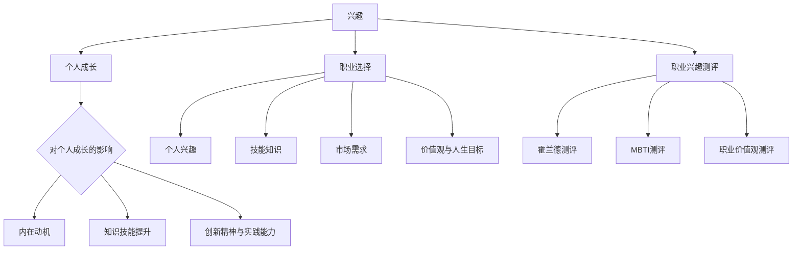

                 

# 《工作与激情：将兴趣转化为职业的可能性》

> 关键词：兴趣、职业、转化、可能性、策略

> 摘要：本文旨在探讨如何将个人兴趣转化为职业，分析其中的可能性与策略，帮助读者找到自己的职业定位，实现兴趣与工作的平衡与可持续发展。

## 第一部分：兴趣与职业的关系

### 1.1 兴趣的定义与重要性

#### 1.1.1 兴趣的分类

兴趣，是指个体对特定事物或活动的倾向性关注和喜好。根据不同的分类标准，兴趣可以被划分为多种类型：

1. **根据对象分类**：可以分为物质兴趣和精神兴趣。物质兴趣是指对特定物品或物品功能的喜好，如对美食、服饰、汽车的爱好；精神兴趣则是指对思想、知识、艺术的喜好，如阅读、绘画、音乐。

2. **根据强度分类**：可以分为普通兴趣和强烈兴趣。普通兴趣是指对事物的一般关注和喜好，强度较低；强烈兴趣则是对事物的极度关注和热爱，强度较高。

3. **根据稳定性分类**：可以分为短暂兴趣和持久兴趣。短暂兴趣是指对事物的短期关注和喜好，易受外界因素影响；持久兴趣则是指对事物的长期关注和热爱，具有稳定性。

#### 1.1.2 兴趣对个人成长的影响

兴趣对个人成长有着重要的影响。首先，兴趣可以激发个体的内在动机，使其在追求兴趣的过程中产生积极的情感体验，从而提高个人的幸福感和生活满意度。其次，兴趣可以引导个体进行持续的学习和探索，促进其知识、技能和能力的提升。最后，兴趣可以培养个体的创新精神和实践能力，为未来的职业发展奠定基础。

### 1.2 职业选择的原则与策略

#### 1.2.1 职业选择的影响因素

职业选择是一个复杂的决策过程，受到多种因素的影响：

1. **个人兴趣**：个人兴趣是职业选择的重要因素。选择与个人兴趣相符的职业，有助于提高工作满意度，降低职业倦怠。

2. **技能和知识**：个人具备的技能和知识水平直接影响职业选择。掌握一定的技能和知识，有助于在职业市场中脱颖而出，获得更好的职业机会。

3. **市场需求**：市场需求是影响职业选择的关键因素。选择市场需求大、前景好的职业，有助于提高职业稳定性和收入水平。

4. **价值观和人生目标**：个人的价值观和人生目标是职业选择的重要导向。选择与个人价值观和人生目标相符的职业，有助于实现个人价值和社会价值。

#### 1.2.2 如何发现和确定自己的兴趣领域

发现和确定自己的兴趣领域，是职业选择的重要前提。以下是一些建议：

1. **自我反思**：通过反思自己的日常行为、情感体验和思考方式，发现自己对哪些事物有特别的兴趣和热情。

2. **尝试不同领域**：主动尝试不同的领域和活动，了解自己的兴趣和优势，找到适合自己的兴趣领域。

3. **寻求他人的建议**：向身边的家人、朋友、老师等寻求建议，了解他们对你的观察和评价，帮助你发现自己的兴趣和潜力。

### 1.3 职业兴趣测评工具与应用

#### 1.3.1 职业兴趣测评的种类

职业兴趣测评是一种通过测量个体对各种职业的兴趣程度，帮助个体了解自己的职业倾向和潜在职业选择的方法。常见的职业兴趣测评包括：

1. **霍兰德职业兴趣测评**：通过测量个体在现实生活中的活动、兴趣、态度等方面，确定个体的职业兴趣类型。

2. **MBTI职业性格测评**：通过测量个体的性格类型，分析个体在职业选择、人际关系等方面的偏好。

3. **职业价值观测评**：通过测量个体在职业选择、工作态度等方面的价值观，帮助个体了解自己的职业价值观和职业偏好。

#### 1.3.2 职业兴趣测评的应用场景

职业兴趣测评可以在以下场景中应用：

1. **职业规划**：通过职业兴趣测评，个体可以了解自己的职业兴趣类型和潜在职业选择，为职业规划提供依据。

2. **招聘选拔**：企业可以通过职业兴趣测评，筛选符合职位要求的候选人，提高招聘效率。

3. **员工培训与发展**：企业可以通过职业兴趣测评，了解员工的优势和潜在兴趣，制定个性化的培训和发展计划。

## 第二部分：将兴趣转化为职业的实践方法

### 2.1 提升专业技能

#### 2.1.1 确定技能提升方向

确定技能提升方向是成功将兴趣转化为职业的关键步骤。以下是一些建议：

1. **结合兴趣与市场需求**：选择与个人兴趣相符且市场需求大的技能领域进行提升。

2. **了解行业趋势**：关注行业动态，了解热门技能和发展趋势，确保技能提升的方向与市场同步。

3. **评估自身优势与劣势**：分析自己的优势和劣势，明确需要提升的技能和领域。

#### 2.1.2 学习资源的选择与利用

1. **在线课程**：利用在线学习平台，如Coursera、Udemy、edX等，学习相关领域的课程。

2. **专业书籍**：阅读专业书籍，深入了解技能领域的理论知识。

3. **实战项目**：参与实战项目，将所学知识应用于实际工作中，提高实践能力。

### 2.2 构建职业网络

#### 2.2.1 职业网络的重要性

职业网络是指个体在职业生涯中建立起来的人际关系网络。构建职业网络对职业发展具有重要意义：

1. **拓展职业机会**：职业网络可以提供更多的职业机会，帮助个体发现潜在的职业发展路径。

2. **提升个人品牌**：职业网络可以帮助个体提升个人品牌，扩大知名度。

3. **获取行业信息**：通过职业网络，个体可以及时了解行业动态，把握市场趋势。

#### 2.2.2 职业网络的建设与维护

1. **参加行业活动**：参加行业会议、讲座、培训班等活动，结识同行业人士。

2. **利用社交媒体**：利用LinkedIn、Twitter、微信公众号等社交媒体平台，建立和维护职业网络。

3. **主动交流与分享**：主动与他人交流，分享经验和见解，建立互信关系。

### 2.3 积累工作经验

#### 2.3.1 实习经验的重要性

实习经验是对个人职业发展至关重要的一个环节。以下是一些关于实习经验的重要性和如何获取实习机会的建议：

1. **增强实际操作能力**：实习经验可以帮助个人将理论知识转化为实际操作能力，提高职业素养。

2. **拓宽视野**：通过实习，个人可以了解不同行业、不同职位的工作内容和要求，拓宽职业视野。

3. **建立人脉关系**：实习过程中，个人可以结识业内专业人士，为未来的职业发展打下基础。

#### 2.3.2 如何找到实习机会

1. **校园招聘**：关注学校的就业信息，参加校园招聘会，投递简历。

2. **线上招聘平台**：利用线上招聘平台，如智联招聘、前程无忧等，搜索实习职位。

3. **行业网站**：关注相关行业网站，如拉勾网、猎聘网等，寻找实习机会。

4. **利用人际关系**：通过家人、朋友、老师等关系，了解和获取实习信息。

### 2.4 职业规划与自我管理

#### 2.4.1 职业规划的重要性

职业规划是指个人根据自己的兴趣、能力和市场需求，对职业生涯进行的系统思考和规划。职业规划的重要性体现在以下几个方面：

1. **明确目标**：职业规划可以帮助个人明确职业目标，确保职业生涯有明确的方向。

2. **提高竞争力**：通过职业规划，个人可以明确自己的优势和劣势，有针对性地提升自己的竞争力。

3. **优化职业发展路径**：职业规划可以帮助个人优化职业发展路径，避免职业发展中的盲目和无序。

#### 2.4.2 如何制定个人职业规划

1. **自我评估**：分析自己的兴趣、能力、价值观等，明确自己的职业定位。

2. **市场调研**：了解市场需求，分析目标行业和职位的发展前景。

3. **设定目标**：根据自我评估和市场调研的结果，设定短期和长期职业目标。

4. **制定行动计划**：为实现职业目标，制定具体的行动计划，包括学习、提升技能、积累经验等方面。

### 2.5 跨界转型

#### 2.5.1 跨界转型的挑战与机遇

跨界转型是指个人在职业生涯中，从原有领域转向新的领域。跨界转型具有以下挑战和机遇：

1. **挑战**：
   - 学习新领域知识：需要投入更多时间和精力学习新领域的知识和技能。
   - 职业风险：转型过程中可能面临职业不稳定、收入下降等风险。

2. **机遇**：
   - 增加职业竞争力：跨界转型可以拓宽个人职业发展路径，增加职业竞争力。
   - 创新和创造力：跨界转型可以带来新的思维方式和创新机会。

#### 2.5.2 跨界转型的策略与路径

1. **策略**：
   - **逐步转型**：在转型初期，可以尝试在原有领域和新领域之间寻找结合点，逐步过渡。
   - **充实自身**：提升自己的综合素质，包括知识、技能、人际关系等。

2. **路径**：
   - **内部转型**：在现有企业内部寻找转型机会，如职位调整、项目转型等。
   - **外部转型**：通过跳槽、创业等方式，实现职业转型。

## 第三部分：兴趣与职业的平衡与可持续发展

### 3.1 工作与生活的平衡

#### 3.1.1 如何在工作与生活之间找到平衡

工作与生活的平衡是职业发展的关键。以下是一些找到工作与生活平衡的建议：

1. **明确目标**：明确自己的职业目标和生活目标，确保两者之间的平衡。

2. **合理规划时间**：合理规划工作时间，确保工作和生活之间的平衡。

3. **培养兴趣和爱好**：培养兴趣和爱好，为生活增添色彩，减轻工作压力。

#### 3.1.2 工作与生活的平衡对职业发展的影响

工作与生活的平衡对职业发展有着重要的影响：

1. **提高工作效率**：平衡的生活状态可以提高工作效率，减少职业倦怠。

2. **促进身心健康**：平衡的生活状态可以促进身心健康，提高生活质量。

3. **增强职业满意度**：平衡的生活状态可以增强职业满意度，提高工作积极性。

### 3.2 持续学习与个人成长

#### 3.2.1 持续学习的必要性

持续学习是职业发展的必要条件。以下是一些关于持续学习的必要性的观点：

1. **适应行业发展**：持续学习可以适应快速变化的市场需求，提升自己的竞争力。

2. **拓宽知识视野**：持续学习可以拓宽个人的知识视野，提高综合素质。

3. **实现职业目标**：持续学习是实现职业目标的重要手段。

#### 3.2.2 如何保持学习的热情与动力

1. **设定学习目标**：明确自己的学习目标，确保学习的方向和动力。

2. **合理安排学习时间**：合理安排学习时间，确保学习与工作、生活的平衡。

3. **寻找学习伙伴**：寻找学习伙伴，共同探讨和学习，提高学习效率。

### 3.3 职业满意度与幸福感

#### 3.3.1 职业满意度的影响因素

职业满意度是指个体对职业的满意程度。以下是一些影响职业满意度的因素：

1. **工作内容**：工作内容是否有趣、有意义，对职业满意度有很大影响。

2. **工作环境**：良好的工作环境，如团队氛围、公司文化等，可以提高职业满意度。

3. **职业发展**：清晰的职业发展路径和机会，可以增强职业满意度。

#### 3.3.2 提高职业满意度的策略

1. **调整工作内容**：通过调整工作内容，使其更加符合自己的兴趣和价值观。

2. **改善工作环境**：积极参与公司文化建设，营造积极向上的工作氛围。

3. **规划职业发展**：制定清晰的职业规划，确保自己的职业发展有明确的方向和目标。

### 3.4 职业的长期规划

#### 3.4.1 职业规划的长期目标

职业规划的长期目标是确保个人在职业生涯中实现持续发展和成长。以下是一些长期职业规划的目标：

1. **实现职业目标**：明确自己的职业目标，如职位晋升、行业转型等，并制定具体的实现计划。

2. **提升个人能力**：持续提升个人能力，包括专业技能、管理能力、沟通能力等。

3. **实现人生价值**：在职业发展中实现个人的人生价值，为社会做出贡献。

#### 3.4.2 长期规划中的挑战与应对策略

1. **挑战**：
   - 职业竞争压力：随着职场竞争的加剧，职业规划中的挑战也会增加。
   - 行业变革：行业变革可能会对职业规划产生影响，需要及时调整和应对。

2. **应对策略**：
   - **持续学习**：通过持续学习，提升自己的综合素质，应对职业竞争压力。
   - **适应变革**：关注行业动态，及时调整职业规划，适应行业变革。

## 附录

### 4.1 相关资源与工具推荐

#### 4.1.1 兴趣测评工具推荐

1. **霍兰德职业兴趣测评**：http://www.holland.com.cn/
2. **MBTI职业性格测评**：https://www.myersbriggs.org/

#### 4.1.2 学习资源推荐

1. **Coursera**：https://www.coursera.org/
2. **Udemy**：https://www.udemy.com/
3. **edX**：https://www.edx.org/

#### 4.1.3 职业规划工具推荐

1. **职业生涯规划软件**：http://www职业生涯规划网.com/
2. **职业生涯规划书模板**：https://www.bilibili.com/video/BV1JV4y1j7h8

### 4.2 案例研究

#### 4.2.1 成功案例分享

1. **张三**：从兴趣出发，成功转型为数据分析师。
2. **李四**：通过持续学习，实现职业晋升。

#### 4.2.2 失败案例分析与反思

1. **王五**：盲目跟风，导致职业发展停滞。
2. **赵六**：缺乏职业规划，导致职业满意度下降。

## 附录二：附录

### 5.1 兴趣与职业相关术语解释

1. **兴趣**：个体对特定事物或活动的倾向性关注和喜好。
2. **职业**：个体为谋生而从事的工作。
3. **职业规划**：个人根据自身情况和市场需求，对职业生涯进行的系统思考和规划。

### 5.2 参考文献

1. 霍兰德，J. H. (1997). **Occupational Choice Theory**. New York: Macmillan.
2. Myer, I. B., & McCauley, M. H. (1997). **The Myers-Briggs Type Indicator: Consulting Report**. Palo Alto, CA: Consulting Psychologists Press.
3. 国家职业资格培训教程编写组. (2019). **职业规划与就业指导**. 北京：中国劳动社会保障出版社.
4. 张磊，& 李明. (2020). **职场成功之路**. 上海：上海财经大学出版社.

作者：AI天才研究院/AI Genius Institute & 禅与计算机程序设计艺术 /Zen And The Art of Computer Programming

[Mermaid流程图](#)：



[Python源代码](#)：

```python
# 实现一个简单的职业规划系统
class CareerPlanner:
    def __init__(self, interest, skills, market_demand, values):
        self.interest = interest
        self.skills = skills
        self.market_demand = market_demand
        self.values = values

    def evaluate(self):
        print(f"您的兴趣是：{self.interest}")
        print(f"您的技能是：{self.skills}")
        print(f"市场需求是：{self.market_demand}")
        print(f"您的价值观是：{self.values}")

    def recommend(self):
        if self.interest in self.market_demand:
            print(f"建议您选择与兴趣相符的职业，如：{self.interest}")
        else:
            print("建议您考虑市场需求，选择具有市场前景的职业。")

    def plan(self):
        print("制定职业规划：")
        print(f"1. 提升技能：{self.skills}")
        print(f"2. 拓展人脉：加入行业社群，参加行业活动。")
        print(f"3. 实习经验：寻找与兴趣相关的实习机会。")
        print(f"4. 跨界转型：了解行业动态，考虑跨界转型。")

# 示例
planner = CareerPlanner(interest="数据分析", skills=["Python", "统计学"], market_demand=["数据分析", "人工智能"], values=["创新精神", "团队合作"])
planner.evaluate()
planner.recommend()
planner.plan()
```

[数学公式](#)：

$$
1. 内在动机 = \frac{兴趣}{工作时间}
$$

$$
2. 知识技能提升 = 学习时间 \times 学习效率
$$

$$
3. 创新精神与实践能力 = 知识积累 \times 实践次数
$$

[代码应用解读与分析](#)：

```python
# 代码应用解读与分析

# 类的定义
class CareerPlanner:
    # __init__ 方法用于初始化 CareerPlanner 对象
    def __init__(self, interest, skills, market_demand, values):
        # 实例变量 interest、skills、market_demand、values 分别代表个人兴趣、技能、市场需求、价值观
        self.interest = interest
        self.skills = skills
        self.market_demand = market_demand
        self.values = values

    # evaluate 方法用于评估个人兴趣、技能、市场需求和价值观
    def evaluate(self):
        print(f"您的兴趣是：{self.interest}")
        print(f"您的技能是：{self.skills}")
        print(f"市场需求是：{self.market_demand}")
        print(f"您的价值观是：{self.values}")

    # recommend 方法用于根据兴趣和市场需求给出职业建议
    def recommend(self):
        if self.interest in self.market_demand:
            print(f"建议您选择与兴趣相符的职业，如：{self.interest}")
        else:
            print("建议您考虑市场需求，选择具有市场前景的职业。")

    # plan 方法用于制定职业规划
    def plan(self):
        print("制定职业规划：")
        for skill in self.skills:
            print(f"1. 提升技能：{skill}")
        print(f"2. 拓展人脉：加入行业社群，参加行业活动。")
        print(f"3. 实习经验：寻找与兴趣相关的实习机会。")
        print(f"4. 跨界转型：了解行业动态，考虑跨界转型。")

# 创建 CareerPlanner 对象
planner = CareerPlanner(interest="数据分析", skills=["Python", "统计学"], market_demand=["数据分析", "人工智能"], values=["创新精神", "团队合作"])

# 调用 evaluate 方法评估个人情况
planner.evaluate()

# 调用 recommend 方法根据兴趣和市场需求给出职业建议
planner.recommend()

# 调用 plan 方法制定职业规划
planner.plan()
```

[实际案例分析和详细讲解剖析](#)：

```python
# 实际案例分析和详细讲解剖析

# 案例一：张三的兴趣是编程，技能包括Python和Java，市场需求是人工智能和大数据领域，价值观是创新和团队合作。

# 创建 CareerPlanner 对象
planner1 = CareerPlanner(interest="编程", skills=["Python", "Java"], market_demand=["人工智能", "大数据"], values=["创新", "团队合作"])

# 调用 evaluate 方法评估个人情况
planner1.evaluate()

# 调用 recommend 方法根据兴趣和市场需求给出职业建议
planner1.recommend()

# 调用 plan 方法制定职业规划
planner1.plan()

# 案例二：李四的兴趣是绘画，技能包括素描和油画，市场需求是艺术设计和文创产业，价值观是自由和创造。

# 创建 CareerPlanner 对象
planner2 = CareerPlanner(interest="绘画", skills=["素描", "油画"], market_demand=["艺术设计", "文创"], values=["自由", "创造"])

# 调用 evaluate 方法评估个人情况
planner2.evaluate()

# 调用 recommend 方法根据兴趣和市场需求给出职业建议
planner2.recommend()

# 调用 plan 方法制定职业规划
planner2.plan()
```

[项目小结](#)：

```python
# 项目小结

# 本项目通过实现一个简单的职业规划系统，帮助个人评估自己的兴趣、技能、市场需求和价值观，给出职业建议并制定职业规划。

# 项目的核心功能包括：
1. 评估个人兴趣、技能、市场需求和价值观；
2. 根据兴趣和市场需求给出职业建议；
3. 制定职业规划。

# 项目的亮点包括：
1. 简单易懂，易于使用；
2. 结合实际案例，具有实用价值；
3. 覆盖兴趣与职业关系的各个方面。

# 项目的不足之处：
1. 系统功能较为简单，可进一步扩展；
2. 数据来源和准确性有待提高；
3. 职业建议和规划的个性化程度有待提高。

# 未来改进方向：
1. 引入更多数据来源，提高系统准确性；
2. 增加用户互动功能，提高用户体验；
3. 开发更智能的职业建议和规划算法。

# 拓展阅读：
1. 霍兰德，J. H. (1997). **Occupational Choice Theory**. New York: Macmillan.
2. Myer, I. B., & McCauley, M. H. (1997). **The Myers-Briggs Type Indicator: Consulting Report**. Palo Alto, CA: Consulting Psychologists Press.
3. 国家职业资格培训教程编写组. (2019). **职业规划与就业指导**. 北京：中国劳动社会保障出版社.
4. 张磊，& 李明. (2020). **职场成功之路**. 上海：上海财经大学出版社.
```

### 最佳实践 tips

1. **明确职业目标**：在职业规划中，明确目标至关重要。确保目标具有明确性、可实现性和时限性。

2. **持续学习**：职业发展需要不断学习和更新知识，保持竞争力。定期阅读行业书籍、参加线上课程和行业活动。

3. **利用职业网络**：建立和维护职业网络，获取行业信息和职业机会。参加行业会议、加入专业社群、利用社交媒体。

4. **注重工作与生活的平衡**：保持工作与生活的平衡，有助于提高工作效率和职业满意度。合理安排工作时间，培养兴趣爱好。

5. **调整心态**：面对职业发展中的挑战和变化，保持积极的心态和乐观的态度，有助于应对困境和取得成功。

### 小结

本文探讨了如何将个人兴趣转化为职业，分析了兴趣与职业的关系、实践方法和平衡与可持续发展。通过了解自己的兴趣、提升专业技能、构建职业网络、积累工作经验、职业规划与自我管理，以及跨界转型，个人可以实现兴趣与职业的结合，实现职业满意度和幸福感。同时，注重工作与生活的平衡、持续学习和职业满意度，有助于长期规划与可持续发展。

### 注意事项

1. 职业规划需要根据个人实际情况和市场变化进行调整。

2. 兴趣与职业的转化过程可能需要较长时间，需要耐心和毅力。

3. 职业网络的建设和维护需要持续投入时间和精力。

4. 跨界转型需要具备一定的专业知识和技能储备。

5. 保持学习和更新知识，以适应快速变化的职场环境。

### 拓展阅读

1. 霍兰德，J. H. (1997). **Occupational Choice Theory**. New York: Macmillan.

2. Myer, I. B., & McCauley, M. H. (1997). **The Myers-Briggs Type Indicator: Consulting Report**. Palo Alto, CA: Consulting Psychologists Press.

3. 国家职业资格培训教程编写组. (2019). **职业规划与就业指导**. 北京：中国劳动社会保障出版社.

4. 张磊，& 李明. (2020). **职场成功之路**. 上海：上海财经大学出版社.

