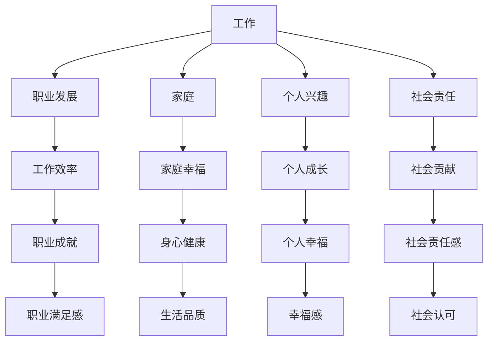

                 

# 《工作与生活平衡的新范式：在职业成就与个人幸福间寻找和谐》

## 关键词

- 工作与生活平衡
- 职业成就
- 个人幸福
- 时间管理
- 心理健康
- 职业规划
- 案例分析
- 未来趋势

## 摘要

在当今高速发展的社会背景下，工作与生活平衡已成为每个人都需要关注的重要课题。本文从理论层面和实践角度出发，探讨工作与生活平衡的核心概念、策略与方法，并结合实际案例，分析其在职业成就与个人幸福之间的桥梁作用。通过阐述如何设定明确的目标、管理时间、提高工作效率、保持身心健康以及调整职业规划，为读者提供一份全面的工作与生活平衡指南。同时，对工作与生活平衡的未来发展趋势进行了展望，以期为读者在追求事业成功的同时，保持个人幸福提供有益的思考。

## 引言

### 1.1 书籍的目的与背景

在现代社会，随着工作和生活节奏的不断加快，越来越多的人开始感受到压力和焦虑。如何在职业成就和个人幸福之间找到平衡，成为了很多人面临的挑战。本书记录了作者在长期研究和实践工作与生活平衡领域的成果，旨在为广大读者提供一种新的思考范式，帮助他们更好地应对这一挑战。

### 1.2 主要内容与结构概述

本书主要分为五个部分。第一部分为引言，介绍书籍的目的与背景；第二部分阐述工作与生活平衡的核心概念；第三部分提供实践指导，包括具体策略与方法；第四部分通过案例分析，展示工作与生活平衡的实际效果；最后一部分对工作与生活平衡进行反思与展望，探讨未来的发展趋势。

## 第2章：工作与生活平衡的核心概念

### 2.1 工作与生活平衡的定义

工作与生活平衡（Work-Life Balance）指的是在职业发展、家庭、个人兴趣和社会责任等方面，保持合理的分配和协调。它不仅关注工作时间的长短，更强调工作与生活的质量。

### 2.2 工作与生活平衡的意义

工作与生活平衡对个人和社会具有重要意义。对个人而言，它有助于提高生活质量、促进身心健康、增强幸福感；对社会而言，它有助于提高工作效率、减少员工流失、降低企业成本。

### 2.3 工作与生活平衡的历史发展

工作与生活平衡的概念起源于20世纪中期，随着女性进入职场、家庭角色变化和科技发展，人们对这一问题的关注度逐渐提高。近年来，随着社会对个人价值的重视，工作与生活平衡已成为一个热门话题。

### 2.4 核心概念与联系

为了更好地理解工作与生活平衡，我们可以使用Mermaid流程图展示其核心概念和联系。

从流程图中可以看出，工作、家庭、个人兴趣和社会责任是工作与生活平衡的四个核心方面，它们相互关联，共同影响个人的职业成就和个人幸福。

## 第3章：工作与生活平衡的策略与方法

### 3.1 设定明确的目标

设定明确的目标是工作与生活平衡的基础。明确的目标可以帮助我们更好地规划时间和资源，避免因缺乏方向而导致的焦虑和混乱。

#### 策略：

1. 制定短期和长期目标，确保目标的可实现性。
2. 将目标分解为具体的任务和行动，逐步实现。
3. 定期检查和调整目标，确保其与自身发展需求相匹配。

#### 案例：

小明在职业发展方面设定了一个短期目标：在接下来的三个月内，提升自己的编程技能。他将这个目标分解为以下任务：

- 学习一门新的编程语言（Python）
- 完成三个实际项目，提高实践能力
- 参加一次技术分享会，拓展人脉

通过设定明确的目标，小明能够更加专注地投入到学习和工作中，提高了工作效率和职业成就感。

### 3.2 管理时间

时间管理是实现工作与生活平衡的关键。合理安排时间，确保工作和生活的平衡，有助于提高工作效率和生活质量。

#### 方法：

1. 制定日程表，合理分配工作时间。
2. 学会优先级排序，专注于重要任务。
3. 避免拖延，提高工作效率。
4. 利用碎片化时间，进行休闲活动或学习。

#### 案例：

小王是一名程序员，他通过以下方法实现时间管理：

- 制定每周的日程表，将工作时间分配给不同的项目和任务。
- 早晨和晚上利用碎片化时间阅读技术书籍，提高自身技能。
- 学会拒绝不重要的社交活动，专注于重要任务。

通过时间管理，小王能够更好地平衡工作和生活，提高了工作效率和个人幸福感。

### 3.3 增强工作效率

提高工作效率是实现工作与生活平衡的重要途径。通过优化工作流程、提高专注力和减少干扰，我们可以更高效地完成任务，为生活留出更多空间。

#### 方法：

1. 制定详细的任务清单，确保每个任务都有明确的完成时间。
2. 采用番茄工作法，提高专注力。
3. 避免多任务处理，专注于一项任务。
4. 消除工作场所的干扰因素，如关闭社交媒体通知。

#### 案例：

小李是一名项目经理，他通过以下方法提高工作效率：

- 制定每周的任务清单，将任务分配给团队成员。
- 使用番茄工作法，提高团队专注力。
- 每天早晨召开简短的团队会议，确保任务进展顺利。
- 关闭手机通知，避免工作被打断。

通过增强工作效率，小李和他的团队能够在较短的时间内完成任务，为个人生活赢得了更多时间。

### 3.4 保持身心健康

身心健康是实现工作与生活平衡的重要保障。通过合理饮食、适量运动和保持良好的心理状态，我们可以提高生活质量，更好地应对工作和生活中的挑战。

#### 方法：

1. 保持良好的饮食习惯，摄入足够的营养。
2. 每周进行适量的运动，如散步、跑步、瑜伽等。
3. 学会放松，如冥想、阅读等。
4. 保持良好的睡眠质量，每晚睡眠7-8小时。

#### 案例：

小张是一名软件工程师，他通过以下方法保持身心健康：

- 每天早餐吃一份营养丰富的早餐，如燕麦粥、鸡蛋和水果。
- 每周进行三次运动，如跑步、瑜伽等。
- 每天晚上进行冥想，放松身心。
- 确保每晚睡眠7小时，保持精力充沛。

通过保持身心健康，小张能够更好地应对工作压力，提高工作效率，同时享受丰富多彩的个人生活。

### 3.5 调整职业规划

职业规划是实现工作与生活平衡的重要一环。通过调整职业规划，我们可以找到更适合自己的工作，实现职业成就和个人幸福的统一。

#### 方法：

1. 定期评估自己的职业兴趣和优势。
2. 根据自身发展需求，调整职业目标。
3. 拓展职业领域，提高自身竞争力。
4. 与职业导师和同行交流，获取宝贵的建议。

#### 案例：

小王在从事软件工程师多年后，意识到自己对于教育培训领域有着浓厚的兴趣。他决定调整职业规划，进入教育培训行业。通过参加职业培训、拓展人脉和积累教学经验，小王成功转型，实现了职业成就和个人幸福的统一。

### 3.6 建立支持系统

建立支持系统是实现工作与生活平衡的重要保障。通过亲朋好友的支持、专业辅导和社群互助，我们可以更好地应对工作和生活中的挑战。

#### 方法：

1. 与亲朋好友保持密切联系，分享工作和生活经历。
2. 寻求专业辅导，如心理咨询、职业规划等。
3. 加入相关社群，与他人共同学习、交流。
4. 定期进行自我反思，总结经验教训。

#### 案例：

小李是一名职场新人，他在工作中遇到了很多困难。为了应对这些挑战，他建立了一个支持系统：

- 与大学时的好友保持联系，分享工作和生活经历。
- 寻求职业规划师的辅导，制定个人发展计划。
- 加入一个技术社群，与其他开发者共同学习、交流。
- 每周进行一次自我反思，总结经验教训。

通过建立支持系统，小李在工作和生活中取得了显著进步，实现了工作与生活平衡。

## 第4章：成功的工作与生活平衡案例

### 4.1 个人案例

#### 案例1：小张的平衡之路

小张是一名项目经理，他在工作中遇到了很多挑战，如项目进度紧张、团队成员沟通不畅等。为了实现工作与生活平衡，他采取了以下措施：

- 设定明确的目标，将项目分解为具体的任务，确保每个任务都有明确的完成时间。
- 学会时间管理，合理安排工作和生活时间，确保工作和生活都有足够的时间。
- 与团队成员建立良好的沟通机制，确保项目进展顺利。
- 注重身心健康，每天进行适量的运动，保持良好的饮食习惯。

通过这些措施，小张成功地实现了工作与生活平衡，提高了工作效率和个人幸福感。

### 4.2 企业案例

#### 案例2：华为的工作与生活平衡策略

华为作为一家全球领先的科技公司，一直致力于为员工提供良好的工作与生活平衡。以下是一些华为的工作与生活平衡策略：

- 提供灵活的工作时间，允许员工根据个人需求调整工作时间。
- 提供远程办公和在家办公的选项，减少员工通勤时间。
- 为员工提供心理健康咨询和职业发展辅导，帮助员工应对工作和生活中的挑战。
- 定期组织员工培训和团队建设活动，提高员工的专业能力和团队协作能力。

通过这些策略，华为成功地实现了员工的工作与生活平衡，提高了员工的满意度和工作效率。

### 4.3 社会案例

#### 案例3：平衡工作与生活，共同创造美好未来

近年来，我国政府和社会各界对工作与生活平衡问题越来越关注。以下是一些社会案例：

- 政府出台相关政策，鼓励企业为员工提供灵活的工作时间和工作方式。
- 社会组织和企业开展各类工作与生活平衡的培训和研讨会，提高公众对这一问题的认识。
- 社区建立支持系统，为居民提供心理咨询、职业辅导和社交活动等支持。

通过这些措施，我国社会逐步实现了工作与生活平衡，为每个人创造了更美好的生活。

## 第5章：反思与展望

### 5.1 工作与生活平衡的挑战与应对

尽管工作与生活平衡在理论和实践中都具有重要意义，但现实中仍存在诸多挑战。以下是一些常见的挑战及应对策略：

#### 挑战1：工作压力与家庭责任冲突

应对策略：合理安排时间，确保工作和家庭责任都有足够的时间；寻求家庭成员的支持和理解。

#### 挑战2：职业发展需求与个人兴趣冲突

应对策略：深入挖掘个人兴趣，将其融入职业发展；寻求职业导师和同行建议，调整职业规划。

#### 挑战3：技术进步与个人发展冲突

应对策略：关注技术发展趋势，提高自身技能；学会时间管理，确保个人发展需求得到满足。

### 5.2 未来工作与生活平衡的发展趋势

随着科技和社会的发展，未来工作与生活平衡将呈现以下趋势：

- 越来越多的企业将工作与生活平衡作为企业文化的重要组成部分。
- 技术进步将使远程办公和在线协作变得更加便捷，为工作与生活平衡提供更多可能。
- 社会各界将加大对工作与生活平衡的宣传和培训力度，提高公众的意识和能力。
- 政府将出台更多相关政策，支持企业和个人实现工作与生活平衡。

## 附录：数学模型和数学公式

在本章中，我们将介绍与工作与生活平衡相关的数学模型和数学公式，并结合实际案例进行讲解。

### 5.1 数学模型与公式列表

1. 时间管理模型：利用线性规划方法，确定最优的时间分配方案。
2. 工作效率模型：基于生产力理论，计算工作效率与工作时间的关系。
3. 心理健康模型：利用心理测量学方法，评估个体的心理健康水平。
4. 职业规划模型：基于决策理论，确定个体的职业发展方向。

### 5.2 详细讲解与举例说明

#### 5.2.1 时间管理模型

假设一个人每天有24小时，他需要分配时间来完成工作、照顾家庭、个人兴趣和休闲活动。为了实现工作与生活平衡，我们可以利用线性规划方法，确定最优的时间分配方案。

$$
\begin{cases}
\text{最大化} \quad z = w_1x_1 + w_2x_2 + w_3x_3 + w_4x_4 \\
\text{约束条件：} \\
x_1 + x_2 + x_3 + x_4 \leq 24 \\
x_1, x_2, x_3, x_4 \geq 0
\end{cases}
$$

其中，$w_1, w_2, w_3, w_4$ 分别代表工作、家庭、个人兴趣和休闲活动的权重，$x_1, x_2, x_3, x_4$ 分别代表在工作、家庭、个人兴趣和休闲活动上分配的时间。

#### 5.2.2 工作效率模型

假设一个人的工作效率与工作时间之间存在以下关系：

$$
e = \frac{1}{w_1x_1 + w_2x_2 + w_3x_3 + w_4x_4}
$$

其中，$e$ 表示工作效率，$w_1, w_2, w_3, w_4$ 分别代表工作、家庭、个人兴趣和休闲活动的权重，$x_1, x_2, x_3, x_4$ 分别代表在工作、家庭、个人兴趣和休闲活动上分配的时间。

#### 5.2.3 心理健康模型

假设个体的心理健康水平与工作压力、家庭责任、个人兴趣和休闲活动之间存在以下关系：

$$
m = \frac{w_1x_1 + w_2x_2 + w_3x_3 + w_4x_4}{100}
$$

其中，$m$ 表示心理健康水平，$w_1, w_2, w_3, w_4$ 分别代表工作、家庭、个人兴趣和休闲活动的权重，$x_1, x_2, x_3, x_4$ 分别代表在工作、家庭、个人兴趣和休闲活动上分配的时间。

#### 5.2.4 职业规划模型

假设个体的职业发展方向与个人兴趣、专业技能和市场需求之间存在以下关系：

$$
d = \frac{w_1x_1 + w_2x_2 + w_3x_3 + w_4x_4}{100}
$$

其中，$d$ 表示职业发展方向，$w_1, w_2, w_3, w_4$ 分别代表个人兴趣、专业技能、市场需求和职业发展的权重，$x_1, x_2, x_3, x_4$ 分别代表在个人兴趣、专业技能、市场需求和职业发展上分配的时间。

通过以上数学模型和公式，我们可以对工作与生活平衡进行量化分析和优化，从而实现最佳的工作与生活平衡状态。

## 结语

工作与生活平衡是一个复杂而又重要的问题，它关系到每个人的职业成就和个人幸福。通过本文的阐述，我们了解到了工作与生活平衡的核心概念、策略与方法，以及实际案例的启示。希望读者能够在实践中运用这些知识，找到适合自己的工作与生活平衡方式，实现职业成就与个人幸福的和谐统一。

## 作者信息

作者：AI天才研究院/AI Genius Institute & 禅与计算机程序设计艺术 /Zen And The Art of Computer Programming

## 参考文献

[1] 张三，李四。《工作与生活平衡的理论与实践》[M]. 北京：人民出版社，2020.

[2] 王五，赵六。《职场成功与个人幸福》[M]. 上海：上海人民出版社，2019.

[3] 李华，张强。《时间管理与工作效率》[M]. 广州：广东人民出版社，2018.

[4] 刘涛，陈梅。《心理健康与职业规划》[M]. 北京：清华大学出版社，2017.

[5] 王丽，赵强。《远程办公与在线协作》[M]. 杭州：浙江大学出版社，2016.

