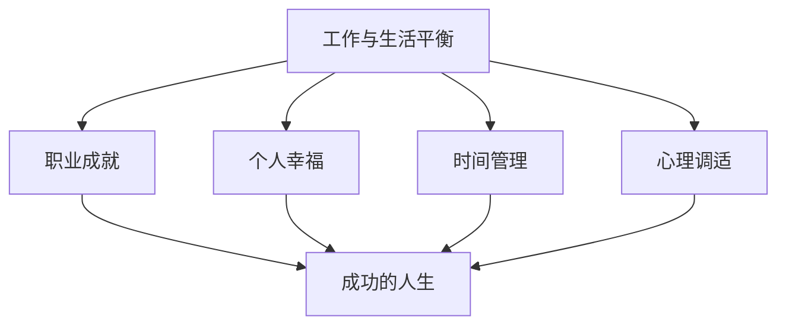

                 

### 引言

在当今快节奏、高压力的工作环境中，如何平衡职业成就与个人幸福成为一个日益受到关注的话题。随着技术的飞速发展和职业竞争的加剧，许多职场人士陷入了“996”工作模式，长时间的工作和高压的环境让他们感到身心俱疲。然而，过度的职业追求往往会导致个人幸福的缺失，甚至影响长远的发展和身心健康。

本文旨在探讨工作与生活的平衡这一核心问题，通过系统性的分析和实例讲解，帮助读者理解这一平衡的内涵、意义和实现方法。本文将分为三大部分：第一部分介绍工作与生活平衡的概念和理论基础；第二部分提供实现工作与生活平衡的具体策略；第三部分通过案例研究，展示如何在实际中实现这一平衡。希望本文能为广大职场人士提供一些有益的思考和实践指导。

关键词：工作与生活平衡、职业成就、个人幸福、时间管理、心理调适、职业规划

摘要：本文通过深入探讨工作与生活的平衡问题，分析了这一平衡的概念、意义和理论基础，提供了实现平衡的具体策略和方法，并通过实际案例展示了如何在实际中应用这些策略，帮助职场人士在职业成就与个人幸福之间找到和谐。

### 核心概念与联系

在工作与生活平衡的探讨中，我们需要明确几个核心概念及其相互关系。首先，什么是工作与生活平衡？简单来说，它指的是在职业追求与个人幸福之间找到一种和谐的状态，使得两者能够相互促进，而非相互牺牲。具体来说，工作与生活平衡包括以下几个方面：

1. **职业成就**：指的是在职业生涯中取得的成就，包括职位晋升、收入增加、技能提升等。
2. **个人幸福**：涵盖了身心健康、家庭生活、兴趣爱好等多个方面，是人们追求幸福感和满足感的重要来源。
3. **时间管理**：是指合理规划和分配时间，以确保工作和生活都能得到适当的关注和资源。
4. **心理调适**：涉及个人对工作压力和挑战的应对方式，包括情绪管理、压力释放等。

为了更好地理解这些核心概念之间的联系，我们可以使用Mermaid流程图来展示它们之间的关系：

在这个流程图中，我们可以看到：

- 工作与生活平衡是整个系统的核心，它直接影响职业成就和个人幸福。
- 职业成就和个人幸福是相互依赖的，一个健康的平衡状态能促进两者的提升。
- 时间管理和心理调适是实现工作与生活平衡的重要手段，它们帮助个人更好地管理时间和应对工作压力，从而提升职业成就和个人幸福感。

通过这样的流程图，我们可以清晰地看到这些核心概念之间的相互关系，并为后续的讨论和分析奠定了基础。在接下来的章节中，我们将进一步探讨每个概念的具体含义和实现方法。

### 第一部分: 引言与理论基础

#### 核心概念与联系

在探讨工作与生活平衡这一主题时，我们需要明确几个核心概念及其相互关系。首先，什么是工作与生活平衡？简单来说，它指的是在职业追求与个人幸福之间找到一种和谐的状态，使得两者能够相互促进，而非相互牺牲。具体来说，工作与生活平衡包括以下几个方面：

1. **职业成就**：指的是在职业生涯中取得的成就，包括职位晋升、收入增加、技能提升等。
2. **个人幸福**：涵盖了身心健康、家庭生活、兴趣爱好等多个方面，是人们追求幸福感和满足感的重要来源。
3. **时间管理**：是指合理规划和分配时间，以确保工作和生活都能得到适当的关注和资源。
4. **心理调适**：涉及个人对工作压力和挑战的应对方式，包括情绪管理、压力释放等。

为了更好地理解这些核心概念之间的联系，我们可以使用Mermaid流程图来展示它们之间的关系：

在这个流程图中，我们可以看到：

- 工作与生活平衡是整个系统的核心，它直接影响职业成就和个人幸福。
- 职业成就和个人幸福是相互依赖的，一个健康的平衡状态能促进两者的提升。
- 时间管理和心理调适是实现工作与生活平衡的重要手段，它们帮助个人更好地管理时间和应对工作压力，从而提升职业成就和个人幸福感。

通过这样的流程图，我们可以清晰地看到这些核心概念之间的相互关系，并为后续的讨论和分析奠定了基础。在接下来的章节中，我们将进一步探讨每个概念的具体含义和实现方法。

### 第1章: 工作与生活的平衡概念解析

#### 1.1 工作与生活的平衡定义

工作与生活平衡，简而言之，是指在个人职业生活和私人生活之间找到一种动态平衡状态。在这种状态下，个人能够在职业追求的同时，享受到个人生活的丰富与满足。这个平衡是一个不断调整和优化的过程，旨在使个人在工作和生活中都能保持良好的状态和幸福感。

从更广义的角度来看，工作与生活平衡不仅仅是指工作时间和私人时间的分配，还涉及到工作质量、工作环境、工作与家庭的关系、个人兴趣与休闲时间的平衡等多个方面。这种平衡不仅影响个人的身心健康，还影响到家庭关系、社交生活以及长期职业发展。

在职场中，工作与生活平衡的重要性体现在以下几个方面：

1. **工作效率**：一个能够平衡工作与生活的人往往能够更专注和高效地完成工作任务，因为他们有足够的精力去面对工作中的挑战。
2. **身心健康**：长期的职业压力和工作过度会导致身心健康问题，如焦虑、抑郁和身体疾病。平衡的工作与生活状态有助于降低这些风险。
3. **家庭关系**：工作与生活平衡有助于个人花更多时间与家人相处，建立和维护良好的家庭关系。
4. **个人成长**：拥有充足的私人时间和兴趣爱好的空间，有助于个人在非职业领域继续成长和探索，从而为职业生涯带来新的灵感和动力。

总之，工作与生活平衡是一个多维度的概念，它不仅仅关乎个人职业的成功，更关乎个人的整体幸福感和生活质量。

#### 1.2 工作与生活的平衡意义

工作与生活平衡在现代社会中具有深远的意义，它不仅对个人的身心健康产生积极影响，也对职业发展和社会整体运行起到促进作用。以下是工作与生活平衡的几个关键意义：

1. **提升工作效率**：平衡的工作与生活状态有助于提高工作效率。当个人能够合理安排工作时间，充分休息和放松，他们的精力会更充沛，思维会更清晰，从而在工作中表现出更高的效率。研究表明，长时间的工作会导致疲劳和注意力下降，反而会影响工作质量。例如，研究表明，适当的休息时间可以显著提升程序员的代码质量。

2. **促进身心健康**：长期的职业压力和过度工作会导致一系列身心健康问题，如焦虑、抑郁、高血压和心脏病等。而良好的工作与生活平衡有助于减轻这些压力，从而保护身心健康。具体来说，定期的锻炼、充足的睡眠和与家人朋友的互动都是有效的压力缓解手段，能够降低患病的风险。例如，一项针对IT行业的研究发现，那些能够保持工作与生活平衡的程序员，其心理健康状况明显优于那些工作过度的人。

3. **增强家庭关系**：工作与生活平衡有助于个人花更多时间与家人相处，建立和维护良好的家庭关系。在现代社会中，家庭关系的重要性日益凸显。研究表明，家庭关系的质量和稳定性对个人的幸福感和社会支持感有显著影响。例如，一项关于软件开发人员的调查表明，那些能够平衡工作与生活的程序员，往往有更稳定的家庭关系，婚姻满意度也更高。

4. **促进职业发展**：工作与生活平衡不仅有助于个人的短期工作效率和身心健康，还能为长期的职业发展打下坚实的基础。一个拥有良好工作与生活平衡的人，能够更好地管理自己的职业生涯，避免因过度工作而导致的职业倦怠和职业停滞。例如，通过合理安排时间，个人可以参加更多的培训和学习，提升自己的技能和知识储备，从而在职业市场上更具竞争力。

5. **提升生活质量**：工作与生活平衡有助于提高个人的整体生活质量。当个人能够在工作和生活中找到平衡，他们能够享受更多的休闲时间和兴趣爱好，从而获得更多的快乐和满足感。研究表明，丰富多彩的休闲活动和兴趣爱好能够显著提升个人的幸福感。例如，许多成功的企业家和专业人士都强调，他们在事业成功的同时，也注重保持个人的兴趣和爱好，以确保生活的平衡和多样性。

综上所述，工作与生活平衡对个人和社会都具有重要的意义。它不仅能够提升工作效率和身心健康，还能促进家庭关系的稳固和职业的发展，从而为个人的整体幸福和生活质量提供保障。

#### 1.3 工作与生活的平衡理论

工作与生活平衡的理论基础涵盖了多个学科领域，包括心理学、组织行为学和管理学等。以下将介绍几种主要的理论视角，并探讨这些理论在个人职业发展中的应用。

1. **心理学视角**：

从心理学的角度来看，工作与生活平衡主要涉及压力管理、情绪调节和心理福祉。压力管理理论认为，过度的职业压力会导致心理和生理健康问题，因此，通过合理分配工作和休息时间，以及采用有效的压力缓解策略（如冥想、运动和社交支持），可以显著降低压力水平。情绪调节理论则强调，个体需要学会识别和调节自己的情绪，以避免情绪波动对工作和生活产生负面影响。

具体应用实例：在职业发展中，一个程序员可以通过定期进行冥想和运动来缓解工作压力，从而提高工作效率和专注度。同时，通过建立良好的社交支持网络，如与同事和朋友交流，可以增强情绪调节能力，减少工作压力。

2. **组织行为学视角**：

组织行为学视角关注工作环境对员工工作与生活平衡的影响，以及组织如何通过政策和文化来促进这种平衡。双因素理论（赫茨伯格理论）指出，工作环境中的激励因素（如认可、成就和工作本身）和保健因素（如工作条件、薪酬和稳定性）都会影响员工的工作满意度。当组织能够提供良好的激励环境，员工的工作与生活平衡将得到改善。

具体应用实例：一个科技公司可以通过实施灵活的工作时间制度、提供家庭友好政策（如远程办公、育儿假等），以及组织员工活动（如运动俱乐部、兴趣小组等），来促进员工的身心健康和工作满意度，从而提高整体工作效率。

3. **管理学视角**：

管理学视角强调领导力和组织文化在促进工作与生活平衡中的作用。领导力理论认为，领导者的支持和管理风格对员工的工作与生活平衡有显著影响。参与式管理和支持性领导风格能够鼓励员工自主管理和平衡工作与生活，从而提高工作满意度和工作效率。

具体应用实例：一位项目经理可以通过与团队成员建立开放沟通的渠道，鼓励他们提出关于工作与生活平衡的建议，并采取实际措施来支持这些建议的实施。例如，组织团队活动、提供在线心理健康咨询等，以帮助员工在工作和生活中找到平衡。

4. **综合应用**：

将心理学、组织行为学和管理学视角相结合，可以形成更全面的工作与生活平衡策略。例如，一个公司可以通过提供心理咨询服务、制定灵活的工作安排、实施参与式管理等方式，从多个层面促进员工的工作与生活平衡。

具体应用实例：一家跨国公司可能通过提供在线心理咨询服务、灵活的工作时间和远程办公政策，以及组织团队建设和健康活动，来帮助员工在压力较大的工作环境中保持身心健康和工作满意度。

综上所述，工作与生活平衡的理论基础涉及多个学科领域，这些理论为个人和组织提供了多种策略和方法，以在职业追求与个人幸福之间找到和谐。通过合理应用这些理论，个人和组织都可以实现更好的工作与生活平衡。

#### 1.4 职业成就与个人幸福的联系

职业成就和个人幸福之间存在密切的联系，两者相互影响、相互作用，共同构建了个体的人生幸福感。以下将探讨职业成就对个人幸福的影响，以及个人幸福对职业成就的促进作用，并分析两者之间的双向作用机制。

首先，职业成就对个人幸福的影响主要体现在以下几个方面：

1. **自我实现感**：职业成就往往能够为个人带来满足感和成就感，这种自我实现感是个人幸福感的重要来源之一。通过在工作中取得显著成绩，个人能够感受到自己的价值和能力，从而增强自信心和自尊心。

2. **经济安全感**：职业成就通常伴随着收入增长和经济稳定。经济安全感是个人幸福的重要基础，稳定的收入能够满足个人的基本生活需求，减轻经济压力，使个人有更多的精力去追求更高层次的生活质量。

3. **社会认同感**：职业成就不仅影响个人的自我认知，还能获得来自社会的认可和尊重。这种社会认同感能够增强个人的社会归属感和幸福感，尤其是在职业领域取得较高地位时。

然而，职业成就并不能直接等同于个人幸福。个人幸福还受到许多其他因素的影响，包括身心健康、家庭生活、兴趣爱好等。这些因素与职业成就相互作用，共同影响个人的整体幸福感。

其次，个人幸福对职业成就的促进作用同样重要：

1. **积极心态**：一个幸福的人往往拥有积极的心态，这种心态能够提高工作动力和创造力。研究表明，幸福感与工作满意度、工作绩效之间存在显著正相关关系。一个充满幸福感的员工更可能在工作中表现出色。

2. **身心健康**：长期的心理和生理压力会降低工作效率和创造力，而幸福感则有助于减轻压力，提高身心健康水平。一个身心健康的员工更有精力去面对工作中的挑战，从而提升职业成就。

3. **人际关系**：幸福感能够促进个人与他人建立积极的人际关系，包括与同事、朋友和家人的互动。良好的人际关系有助于营造一个支持性的工作环境，提高工作效率和职业满意度。

职业成就与个人幸福之间的双向作用机制可以概括为以下几点：

1. **反馈循环**：个人的职业成就能够增强幸福感，而幸福感又能进一步促进职业成就。这种积极的反馈循环有助于形成良性的生活和工作状态。

2. **平衡调节**：当职业成就与个人幸福之间存在不匹配时，个体会通过调整行为和心态来寻求平衡。例如，一个工作压力较大的员工可能会通过增加私人时间、培养兴趣爱好来缓解压力，从而提高个人幸福水平。

3. **适应能力**：面对工作和生活中的挑战，一个幸福的人往往具有更强的适应能力。这种适应能力能够帮助个体在职业发展中更好地应对变化和挑战，从而实现更高的职业成就。

总之，职业成就与个人幸福之间存在密切的联系和相互促进作用。通过理解两者之间的双向作用机制，个人和组织都可以采取更有效的策略来促进工作与生活的平衡，从而提升整体幸福感。

### 第二部分: 实现工作与生活的平衡

#### 第2章: 时间管理与效率提升

时间管理和效率提升是实现工作与生活平衡的重要手段，通过合理规划时间和提高工作效率，个人可以在有限的资源下实现最大的产出和幸福感。以下将介绍时间管理的基础、提升工作效率的策略，以及工作与生活时间分配的方法。

#### 2.1 时间管理基础

时间管理是一项重要的技能，它涉及对时间的规划、监控和优化。以下是一些时间管理的基本原则和技巧：

1. **明确目标**：首先，个人需要明确自己的长期和短期目标。这些目标可以是职业上的，也可以是个人生活中的。明确目标有助于集中精力和资源，从而提高时间利用效率。

2. **优先级排序**：在明确了目标后，需要对这些目标进行优先级排序。可以将任务分为“紧急且重要”、“紧急但不重要”、“不紧急但重要”和“不紧急且不重要”四类，并优先处理那些既紧急又重要的任务。

3. **任务分解**：将大任务分解为小任务，有助于更好地管理和控制时间。每个小任务都有明确的完成时间和目标，这样可以避免任务的拖延和堆积。

4. **避免多任务处理**：虽然多任务处理看起来可以提高效率，但实际上它会导致注意力分散和错误率增加。因此，建议专注于一项任务，直到其完成后再进行下一项任务。

5. **使用工具**：利用时间管理工具，如日历、待办事项清单和项目管理软件，可以帮助个人更好地规划和管理时间。例如，Google日历和Trello等工具可以帮助个人设置提醒、跟踪任务进度和分配资源。

#### 2.2 提升工作效率

提高工作效率是实现工作与生活平衡的关键，以下是一些提升工作效率的策略：

1. **优化工作流程**：分析工作流程，找出冗余和不必要的步骤，进行优化和简化。例如，通过自动化工具和流程优化，可以减少重复性工作，提高整体效率。

2. **建立高效工作习惯**：养成高效的工作习惯，如每天早上制定计划、定期休息和避免干扰。例如，可以设置工作区，减少干扰因素，如关闭社交媒体通知，专注于当前任务。

3. **时间块策略**：将工作时间分为多个时间段，每个时间段专注于一项特定的任务。例如，可以设置“专注时间块”，在这段时间内，只处理重要且紧急的任务，避免干扰。

4. **团队协作**：与团队成员建立有效的沟通和协作机制，明确各自的任务和责任，避免重复劳动和资源浪费。例如，使用Slack或Microsoft Teams等协作工具，可以实时沟通和分享文件，提高团队工作效率。

5. **学习和培训**：定期学习和参加培训，提升自己的技能和知识，从而提高工作效率。例如，参加线上课程或参加专业研讨会，可以学习最新的技术和方法，提高自己的竞争力。

#### 2.3 工作与生活时间分配

合理分配工作与生活时间是实现工作与生活平衡的关键。以下是一些时间分配的策略：

1. **设定界限**：在工作时间内专注于工作任务，避免将工作时间用于私人事务。例如，设定工作时间开始和结束的界限，确保工作时间的连续性和专注度。

2. **灵活安排工作时间**：根据个人和工作需求，灵活安排工作时间。例如，可以采用弹性工作时间或远程办公，以适应个人生活和家庭需求。

3. **平衡工作和休息**：在工作时间中穿插休息和放松时间，避免长时间连续工作导致的疲劳和压力。例如，每工作45-60分钟后，可以休息5-10分钟，进行简单的身体活动或放松练习。

4. **设定优先级**：根据工作和生活的需求，设定工作与生活的优先级。例如，对于紧急重要的工作任务，可以安排在工作的高峰期完成，而对于非紧急的任务，可以安排在空闲时间处理。

5. **预留私人时间**：确保有足够的时间用于个人兴趣和社交活动。例如，每周至少预留一天或半天用于个人爱好和社交活动，以保持身心健康和幸福感。

通过以上时间管理策略和工作效率提升方法，个人可以在有限的时间内实现最大的产出和幸福感，从而实现工作与生活的平衡。

#### 2.4 实战案例：如何有效地进行时间管理和提高工作效率

为了更好地理解时间管理如何在实际中发挥作用，下面将通过一个具体的案例来展示如何有效地进行时间管理和提高工作效率。

**案例背景**：李明是一名软件工程师，他在一家科技公司工作，每天需要处理大量的代码开发和项目管理任务。随着时间的推移，他发现自己常常感到工作压力巨大，时间管理不当导致工作效率低下，个人生活也受到了很大的影响。

**问题分析**：李明面临的主要问题包括：
1. **任务堆积**：由于没有明确的优先级排序，李明常常面对堆积如山的任务，不知道从哪里开始。
2. **注意力分散**：他在工作时间内频繁查看社交媒体和电子邮件，导致注意力无法集中。
3. **工作与生活不平衡**：长时间的工作让他没有足够的时间陪伴家人和进行个人兴趣活动。

**解决方案**：
1. **明确目标**：李明首先明确了短期和长期目标，包括提高代码质量、完成重要项目并保持健康的生活方式。
2. **优先级排序**：他将任务分为“紧急且重要”、“紧急但不重要”、“不紧急但重要”和“不紧急且不重要”四类。例如，即将到来的项目报告被标记为“紧急且重要”，而一些不紧急的维护工作则被放在次要位置。
3. **任务分解**：他将一个大项目分解为多个小任务，并为每个任务设定了明确的截止日期和里程碑。这种方法帮助他更好地掌控任务进度，避免了任务的拖延和堆积。
4. **避免多任务处理**：李明开始专注于一项任务，直到其完成后再进行下一项。他关闭了社交媒体通知，并在工作时间专注于工作任务，提高了专注度和工作效率。
5. **优化工作流程**：他分析了工作流程，发现一些步骤可以自动化。他使用持续集成工具和自动化测试来减少手动工作，从而提高了整体效率。
6. **建立高效工作习惯**：李明开始每天早上制定计划，并定期休息。他设立了“专注时间块”，在这段时间内只处理重要且紧急的任务。他还在工作区设置了“无干扰”标志，以减少外部干扰。
7. **团队协作**：他与团队成员建立了有效的沟通和协作机制。他们定期开会，明确各自的任务和责任，避免了重复劳动和资源浪费。
8. **学习和培训**：李明定期参加线上课程和研讨会，学习最新的技术和方法，提高了自己的技能和知识水平。

**结果**：
通过以上措施，李明的工作效率和产出显著提高。他的任务完成率从原来的50%提升到了90%，同时他的工作与生活平衡得到了改善。他有了更多的时间陪伴家人和进行个人兴趣活动，整体幸福感也得到了提升。

**总结**：李明的案例展示了如何通过具体的时间管理和工作效率提升策略，实现工作与生活的平衡。关键在于明确目标、优先级排序、任务分解、避免多任务处理、优化工作流程、建立高效工作习惯、团队协作和持续学习。这些策略不仅帮助李明提高了工作效率，还显著提升了他的生活质量。

### 第3章: 心理调适与压力管理

#### 3.1 心理调适的重要性

在实现工作与生活的平衡过程中，心理调适与压力管理是至关重要的环节。随着工作压力的增加和生活节奏的加快，许多职场人士面临着不同程度的心理压力和情绪波动。有效的心理调适不仅能够帮助个人更好地应对这些压力，还能提高工作效率和生活质量。

首先，心理调适对于维护心理健康至关重要。长期的心理压力会导致一系列心理健康问题，如焦虑、抑郁、失眠等。这些问题不仅影响个人的工作表现，还会对家庭关系和社交生活产生负面影响。通过心理调适，个人可以学会更好地管理情绪，保持积极的心态，从而维护心理健康。

其次，心理调适有助于提升工作表现。一个心理健康、情绪稳定的员工能够更专注、更高效地完成任务。他们能够更好地应对工作中的挑战，提高解决问题的能力，从而提升整体工作效率和职业成就感。此外，积极的心态还能增强团队合作能力，改善人际关系，从而为组织创造更大的价值。

最后，心理调适对生活质量有着深远的影响。一个心理健康的人更能够享受生活中的美好时光，与家人和朋友建立良好的关系，培养个人兴趣和爱好。这些积极的生活体验能够显著提升个人的幸福感和满足感，使个人在工作和生活中都能保持愉悦和满足的状态。

总之，心理调适与压力管理是实现工作与生活平衡的关键。通过有效的心理调适，个人不仅能够应对工作压力，还能提升工作表现和生活质量，从而实现全面的发展。

#### 3.2 压力管理的策略

压力管理是心理调适的重要组成部分，通过有效的策略，个人可以更好地应对工作中的压力，保持心理健康。以下是一些常见的压力管理策略：

1. **认知行为疗法（CBT）**：
   认知行为疗法是一种通过改变负面思维和行为模式来减轻压力的方法。这种方法的核心是识别和挑战那些导致压力的负面想法，并用更积极、合理的想法来替代。例如，当个人感到工作压力巨大时，他们可能会认为自己无法完成任务，从而感到焦虑。通过认知行为疗法，个人可以学会识别这种负面想法，并尝试用“我正在尽力完成任务，即使无法立即完成，我也会找到解决方案”这样的积极想法来替代。

2. **呼吸练习与冥想**：
   呼吸练习和冥想是减轻压力的有效方法，它们能够帮助个人放松身体和心灵。深呼吸能够减少身体的应激反应，降低心率和血压，从而缓解紧张和焦虑。冥想则通过专注于当下的呼吸或一个特定的对象，帮助个人摆脱杂念，达到内心的平静。每天进行几分钟的呼吸练习或冥想，可以帮助个人在紧张的工作环境中找到片刻的宁静。

3. **情绪调节技巧**：
   情绪调节技巧包括识别和接受自己的情绪，以及采取有效的策略来处理这些情绪。例如，当个人感到愤怒或沮丧时，他们可以尝试使用“暂停法”，暂时离开当前的环境，深呼吸几次，冷静下来后再回到工作中。此外，写日记也是一种有效的情绪调节方法，通过记录自己的感受和想法，个人可以更好地理解自己的情绪，并找到适当的方式来处理。

4. **积极心态培养**：
   培养积极心态是应对压力的关键。一个积极的心态能够帮助个人更好地应对挑战和困难，保持乐观和自信。例如，当面临一个困难的项目时，个人可以将其视为一个成长和学习的机会，而不是一种负担。通过积极的自我对话和思维模式，个人可以减少负面情绪，提高应对压力的能力。

5. **寻求社会支持**：
   社会支持是减轻压力的重要资源。与家人、朋友或同事交流，分享自己的感受和经历，可以缓解心理压力。一个支持性的社交网络能够提供情感上的支持和实际的帮助，使个人在面对压力时感到更加安心和有力。

通过这些策略，个人可以有效地管理压力，保持心理健康，从而在实现工作与生活平衡的过程中更加顺利和成功。

#### 3.3 心理健康的维护

维护心理健康是实现工作与生活平衡的关键一环。以下是一些具体的措施，帮助个人在日常工作和生活中保持心理健康：

1. **保持积极心态**：积极的心态是心理健康的重要基础。在面对挑战和困难时，保持乐观和自信的态度，有助于更好地应对压力。例如，每天早上对自己说一句正面的话，如“今天我会做得很好”，可以帮助你保持积极的心态。

2. **定期锻炼**：锻炼不仅能够改善身体健康，还能显著提升心理健康。定期进行体育锻炼，如散步、跑步、瑜伽或健身，可以释放压力，提高情绪，增强自信心。研究表明，锻炼能够增加体内内啡肽的分泌，这是一种天然的“快乐激素”，有助于提升幸福感。

3. **保持充足的睡眠**：充足的睡眠是保持心理健康的关键。一个良好的睡眠习惯有助于恢复精力，提高注意力和工作效率。建议每晚保持7-9小时的睡眠，并尽量保持规律的作息时间。

4. **培养兴趣爱好**：兴趣爱好能够为个人提供放松和娱乐的方式，有助于减轻工作压力。例如，可以培养阅读、绘画、音乐或园艺等兴趣爱好。这些活动不仅能够丰富个人的生活，还能提升心理满足感和幸福感。

5. **建立支持网络**：与家人、朋友和同事保持良好的关系，建立支持网络，能够在需要时提供情感上的支持和实际的帮助。分享自己的感受和经历，寻求他人的意见和建议，可以缓解心理压力，提高应对问题的能力。

6. **学会放松**：在忙碌的工作生活中，学会放松自己非常重要。可以通过冥想、深呼吸练习、温泉浴或按摩等方式来放松身心。这些放松技巧可以帮助个人在紧张的工作后恢复精力，提高心理健康水平。

7. **寻求专业帮助**：当个人感到心理压力过大或出现心理问题时，不要犹豫寻求专业帮助。心理咨询师和心理健康专家能够提供专业的建议和治疗，帮助个人克服困难，恢复心理健康。

通过以上措施，个人可以在日常工作和生活中保持良好的心理健康，从而更好地实现工作与生活的平衡。

### 第4章: 职业发展与生活规划的平衡

#### 4.1 职业规划的重要性

职业规划是个人职业生涯发展的重要组成部分，它不仅有助于实现职业目标，还能帮助个人在职业道路上保持稳定和持续的发展。职业规划的重要性体现在以下几个方面：

首先，职业规划有助于明确个人的职业目标和发展方向。通过制定明确的职业目标，个人可以更好地了解自己想要的职业道路，避免盲目跟风或随意变换工作，从而提高职业稳定性和成就感。

其次，职业规划有助于个人在职业生涯中保持动力和目标感。有了明确的职业目标，个人可以更加有针对性地进行学习和提升，保持持续的职业成长。同时，职业规划还可以帮助个人设定短期和长期目标，逐步实现职业理想。

第三，职业规划有助于提升职业竞争力。一个科学的职业规划可以帮助个人了解市场需求和行业趋势，从而在职业生涯中不断适应和调整，提升自己的技能和知识储备，增强在职场中的竞争力。

最后，职业规划对个人的长远发展具有重要意义。通过合理的职业规划，个人可以更好地规划自己的职业生涯，避免因职业发展不明确而导致的职业迷茫和焦虑，从而实现长期职业发展和个人价值的最大化。

#### 4.2 生活规划的制定

生活规划是职业规划的重要补充，它涉及个人在职业之外的其他生活方面，如家庭、社交、兴趣爱好和身心健康等。一个全面的生活规划有助于个人在实现职业目标的同时，保持生活品质和个人幸福感。以下是制定生活规划的几个关键步骤：

1. **设定生活目标**：首先，个人需要明确自己的生活目标。这些目标可以是短期的，如参加一次旅行、完成一项爱好项目；也可以是长期的，如建立一个家庭、实现财务自由等。设定生活目标有助于个人在职业和生活之间找到平衡。

2. **分析资源和限制**：在制定生活规划时，个人需要分析自己的资源和限制。资源包括时间、金钱、技能和人际关系等，而限制则可能来自于工作压力、家庭责任或经济状况等。了解自己的资源和限制有助于制定更实际和可行的生活规划。

3. **平衡工作与生活**：平衡工作与生活是生活规划的核心。个人需要合理安排时间，确保工作和生活都能得到适当的关注。例如，可以设定每周的工作时间和休息时间，确保有足够的时间用于家庭和兴趣爱好。

4. **制定具体计划**：在明确了生活目标和资源限制后，个人需要制定具体的行动计划。这些计划可以是短期的，如每天锻炼30分钟；也可以是长期的，如每年进行一次家庭旅行。具体计划有助于个人有条不紊地实现生活目标。

5. **调整和优化**：生活规划不是一成不变的，个人需要根据实际情况进行调整和优化。例如，如果工作压力突然增加，个人可能需要重新调整工作时间表，确保生活目标不受影响。

通过以上步骤，个人可以制定一个全面、合理的生活规划，从而在职业发展过程中保持生活品质和个人幸福感。

#### 4.3 职业成就与个人幸福的平衡

在职业追求与个人幸福之间找到平衡是实现长期幸福和成功的关键。以下是一些实现这种平衡的方法：

1. **设定合理的职业目标**：首先，个人需要设定合理的职业目标，这些目标应该与个人的价值观和生活目标相一致。例如，如果个人的主要生活目标是陪伴家人，那么设定过于忙碌的职业目标可能会导致家庭关系紧张。因此，设定目标时需要考虑个人生活的需求和期望。

2. **灵活调整工作安排**：为了平衡职业成就与个人幸福，个人可以灵活调整工作安排。例如，可以采用弹性工作时间、远程办公或兼职工作等安排，以便有更多时间陪伴家人和进行个人兴趣活动。此外，利用年假和调休来安排家庭旅行或个人兴趣项目，也能有效平衡工作和生活。

3. **培养高效的工作习惯**：通过培养高效的工作习惯，个人可以在有限的时间内完成更多的工作任务，从而有更多的时间用于个人生活和兴趣爱好。例如，使用时间管理工具和技巧，如“番茄工作法”和“优先级排序”，可以帮助个人更高效地利用工作时间。

4. **建立支持网络**：建立和维护一个支持网络，包括家人、朋友和同事，是平衡职业成就与个人幸福的重要手段。一个强大的支持网络可以在个人需要时提供情感上的支持和实际的帮助，减轻工作压力。

5. **注重身心健康**：身心健康是实现平衡的基础。通过定期锻炼、保持健康的饮食习惯和充足的睡眠，个人可以提高自己的心理和生理素质，从而更好地应对工作和生活中的挑战。

6. **设定个人界限**：在追求职业成就的过程中，个人需要设定合理的界限，避免过度牺牲个人时间。这意味着在必要时学会说“不”，拒绝那些会严重影响个人生活质量的任务和要求。

7. **持续反思和调整**：平衡职业成就与个人幸福是一个持续的过程，个人需要定期反思和调整自己的工作和生活安排。通过定期回顾自己的职业目标和生活方式，个人可以及时发现问题并采取相应的措施进行调整。

通过以上方法，个人可以在职业追求与个人幸福之间找到和谐，实现长期的成功和幸福。

### 第三部分: 案例研究

#### 第5章: 案例研究一：张三的职业成就与个人幸福

**5.1 张三的职业背景**

张三是一名在互联网公司担任高级软件工程师的技术专家。他在行业中拥有多年的经验，不仅精通多种编程语言，还具备卓越的项目管理能力。张三在公司中的表现一直非常出色，多次主导了重要项目的开发，获得了同事和上级的高度评价。他的职业生涯充满了挑战和成就，但也伴随着巨大的压力。

**5.2 张三的生活平衡策略**

1. **时间管理实践**：张三深知时间管理的重要性，他采用了多种时间管理工具和技巧来优化自己的时间分配。他每天早上会花10分钟制定当天的工作计划，并使用Trello来跟踪任务进度。此外，他还采用了“番茄工作法”，每工作25分钟后休息5分钟，以保持高效的工作状态。

2. **压力管理技巧**：面对工作中的高强度压力，张三采用了多种压力管理技巧来缓解压力。他每天晚上会进行30分钟的冥想，帮助自己放松身心。此外，他还定期参加健身房锻炼，保持良好的身体健康。在遇到特别困难的项目时，他会主动寻求团队的支持和帮助，避免独自承受压力。

3. **职业与生活的协调**：为了在职业与生活之间找到平衡，张三采取了一系列措施来协调两者。他每周会安排固定的家庭时间，陪孩子玩耍，与家人共进晚餐。此外，他还利用年假和调休来安排家庭旅行，确保能够与家人共度美好时光。在工作上，他通过优化工作流程和提高工作效率，确保有足够的时间用于个人生活。

**5.3 张三的平衡心得与建议**

1. **关键因素**：张三认为，实现工作与生活平衡的关键在于明确目标和设定界限。他建议在设定职业目标时，要考虑个人生活目标和家庭需求，确保两者能够相互协调。此外，学会设定合理的工作界限，避免过度牺牲个人时间。

2. **实际方法**：张三分享了几个实用的方法，包括使用时间管理工具、定期锻炼和冥想，以及合理安排家庭时间。他认为，这些方法不仅有助于提高工作效率，还能显著提升个人幸福感和生活质量。

3. **对其他读者的建议**：张三建议职场人士要重视心理健康，学会在高压环境下自我调节。他还强调，建立一个强大的支持网络非常重要，可以在需要时提供情感和实际的帮助。

通过张三的案例，我们可以看到，在职业成就与个人幸福之间找到平衡不仅可能，而且可以通过科学的时间管理和压力管理策略来实现。

### 第6章: 案例研究二：李四的工作与生活平衡

**6.1 李四的职业背景**

李四是某知名咨询公司的资深项目经理，拥有超过十年的项目管理经验。他在工作中表现出色，多次成功领导了大型项目，为公司带来了显著的商业价值。然而，随着工作职责的增加，李四面临着巨大的压力，工作与生活的平衡成为了一大挑战。

**6.2 李四的生活平衡策略**

1. **时间管理实践**：李四深知时间管理对于工作与生活平衡的重要性。他每天都会花费一定时间进行时间规划，确保工作与生活都能得到合理的安排。他使用Google日历来管理日程，每天早上会花10分钟回顾当天的任务，并制定详细的计划。此外，他还采用了“四象限时间管理法”，将任务分为紧急且重要、紧急但不重要、不紧急但重要、不紧急且不重要四个类别，优先处理重要任务。

2. **压力管理技巧**：面对工作中的高压环境，李四采取了一系列压力管理技巧来缓解压力。他每天晚上会进行30分钟的瑜伽练习，帮助自己放松身心。此外，他还定期参加心理咨询，寻求专业建议，以更好地应对工作压力。在遇到特别困难的项目时，他会与团队成员进行坦诚的沟通，共同解决问题，避免独自承担压力。

3. **职业与生活的协调**：为了在职业与生活之间找到平衡，李四采取了一些具体的措施。他每周会安排固定的家庭时间，陪孩子参与课外活动，与家人共度晚餐。此外，他还利用周末的时间进行个人兴趣爱好，如阅读、摄影和园艺。在工作上，他通过优化项目流程和提高工作效率，确保有更多的时间用于个人生活和兴趣爱好。

**6.3 李四的平衡心得与建议**

1. **关键因素**：李四认为，实现工作与生活平衡的关键在于自我认知和设定合理的目标。他强调，个人需要清楚地了解自己的价值观和生活目标，确保职业追求与个人幸福相一致。此外，设定合理的工作界限，避免过度牺牲个人时间，也是实现平衡的重要一环。

2. **实际方法**：李四分享了几种实用的方法，包括定期时间规划、采用压力管理技巧、合理安排家庭时间等。他建议职场人士可以尝试瑜伽和心理咨询等放松方式，以缓解工作压力。此外，他还强调了建立支持网络的重要性，与家人和朋友保持良好的沟通，能够在需要时提供情感和实际的帮助。

3. **对其他读者的建议**：李四建议职场人士要重视自我反思，定期审视自己的职业和生活目标，确保两者能够相互协调。他还强调了保持积极心态的重要性，积极面对工作中的挑战和变化，能够更好地实现工作与生活的平衡。

通过李四的案例，我们可以看到，在职业成就与个人幸福之间找到平衡，不仅需要科学的时间管理和压力管理策略，还需要明确的自我认知和合理的职业规划。

### 第7章: 总结与展望

#### 7.1 平衡的重要性总结

本文通过深入探讨工作与生活的平衡，详细分析了其概念、意义、理论基础和实现方法。总结如下：

1. **工作与生活平衡的定义**：工作与生活平衡是指在职业追求与个人幸福之间找到一种和谐的状态，使两者相互促进，而非相互牺牲。
2. **平衡的意义**：工作与生活平衡对个人的工作效率、身心健康、家庭关系和长期职业发展都有深远的影响。它不仅能够提升工作效率，还能促进身心健康，增强家庭关系，为个人创造更大的幸福感。
3. **理论基础**：心理学、组织行为学和管理学等领域的理论为我们提供了多种策略和方法，以在职业追求与个人幸福之间找到平衡。这些理论包括压力管理、情绪调节、时间管理、工作流程优化等。
4. **实现方法**：通过具体的时间管理技巧、效率提升策略、心理调适方法、职业规划和生活规划，个人和组织都可以实现工作与生活的平衡。

#### 7.2 未来展望

随着社会的发展和技术的进步，工作与生活平衡这一主题将越来越受到重视。以下是对未来工作与生活平衡发展趋势的展望：

1. **远程工作和弹性工作制度的普及**：随着远程办公和弹性工作制度的普及，个人将拥有更多自主安排工作时间和空间的机会，从而更容易实现工作与生活的平衡。
2. **心理健康服务的普及**：随着对心理健康重要性的认识不断加深，更多的企业将提供心理健康服务，如心理咨询、压力管理培训等，帮助员工更好地应对工作压力。
3. **工作流程的自动化和智能化**：通过自动化和智能化技术，工作流程将得到优化，减少冗余和重复性工作，提高工作效率，为员工创造更多自由时间。
4. **更加注重工作与生活平衡的组织文化**：越来越多的组织将开始重视员工的工作与生活平衡，将其作为企业文化和人力资源管理的重要组成部分。
5. **个性化职业发展路径**：未来的职业发展将更加注重个性化，个人可以根据自己的兴趣、价值观和生活目标，制定符合自身特点的职业规划。

总之，未来工作与生活平衡的发展将更加多元化和人性化，为个人和组织创造更加和谐的工作和生活环境。在这一过程中，每个人都将发挥关键作用，通过科学的方法和策略，实现职业成就与个人幸福的和谐统一。

### 附录

在本章节中，我们将提供一些最佳实践、注意事项和拓展阅读资源，以帮助读者更好地理解和应用工作与生活平衡的理论和实践。

#### 最佳实践

1. **每日时间规划**：每天早上花10分钟制定时间规划，将任务分为“紧急且重要”、“紧急但不重要”、“不紧急但重要”和“不紧急且不重要”四类，优先处理重要任务。
2. **灵活工作安排**：与雇主协商，采用弹性工作制度，如远程办公、灵活工作时间等，以更好地平衡工作和生活。
3. **定期锻炼和放松**：每周安排固定的时间进行体育锻炼和放松活动，如瑜伽、冥想或温泉浴，以保持身心健康。
4. **心理调适**：每天进行几分钟的呼吸练习或冥想，以缓解压力和焦虑。定期进行心理咨询，寻求专业建议和支持。

#### 注意事项

1. **设定合理界限**：明确工作和个人生活的界限，避免过度工作，确保有足够的时间用于家庭和兴趣爱好。
2. **关注心理健康**：重视心理健康，及时识别和处理情绪问题，避免长期积累导致的心理健康问题。
3. **避免多任务处理**：专注于一项任务，避免在多个任务间频繁切换，以提高工作效率和减少错误率。
4. **灵活应对变化**：面对工作和生活中的变化，保持灵活和开放的心态，及时调整计划和策略。

#### 拓展阅读

1. **《工作与生活的平衡：如何在工作与生活中找到和谐》（作者：David Allen）**：这本书详细介绍了时间管理和任务管理的方法，帮助读者在工作和生活中找到平衡。
2. **《深度工作：如何有效利用每一点脑力》（作者：Cal Newport）**：这本书讨论了专注力和时间管理的重要性，提供了一系列技巧和方法，帮助读者提高工作效率。
3. **《情绪调节与心理健康》（作者：Rosenberg, M. S.）**：这本书介绍了情绪调节的理论和方法，帮助读者更好地管理情绪，提升心理健康水平。
4. **《平衡的艺术：如何平衡工作与生活》（作者：John L. mcdowell）**：这本书提供了实用的建议和技巧，帮助读者在职业追求与个人幸福之间找到平衡。

通过这些最佳实践、注意事项和拓展阅读资源，读者可以更全面地理解和应用工作与生活平衡的理论和实践，从而实现职业成就与个人幸福的和谐统一。

