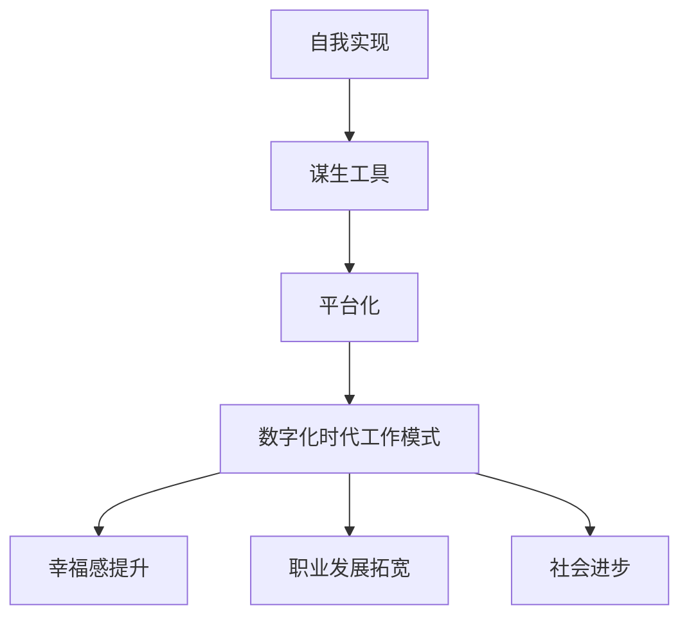

                 

### 引言

**1.1 工作新定义的背景**

在过去的几个世纪中，工作一直以来都被视为一种谋生工具，人们通过工作获得收入以维持生活。然而，随着科技的发展和全球化的推进，工作模式正在发生深刻的变革。数字化、自动化和人工智能等技术的普及，使得许多传统的工作岗位面临被替代的风险，同时也为新的工作形式提供了可能。工作不再仅仅是满足基本生活需求的手段，而是成为了实现个人潜能、追求自我价值的重要途径。

**1.2 工作新定义的意义**

首先，工作新定义有助于提升工作的幸福感。在传统的工作模式中，人们往往感到工作只是为了赚钱，缺乏成就感。而新定义下的工作，强调的是个人兴趣、能力和价值观的发挥，使人们在工作中获得满足感和成就感，从而提高幸福感。

其次，工作新定义拓宽了职业发展的路径。在传统的职业体系中，晋升路径往往比较狭窄，人们需要长时间积累经验才能获得晋升机会。而在新定义下，人们可以通过不断学习新技能、尝试新领域，实现职业的多维度发展，为个人提供了更多的职业选择和发展空间。

最后，工作新定义有助于促进社会进步。通过实现个人潜能和价值的最大化，人们能够更好地为社会做出贡献，推动社会的发展和进步。

### 核心概念与联系

为了深入探讨工作新定义，我们需要理解几个核心概念，并分析它们之间的关系。

**2.1 核心概念解释**

**自我实现**：这是马斯洛需求层次理论中的最高层次，指的是个人潜能的最大化实现。在数字化时代，通过在线教育、远程办公、自由职业等形式，人们能够更灵活地选择适合自己的工作，从而实现个人价值和职业发展。

**谋生工具**：这是传统的工作观念，即通过工作来获得收入，维持生活。尽管这种观念仍然存在，但在新定义下，工作不仅仅是为了生存，更是为了实现个人梦想和追求自我价值。

**平台化**：随着互联网和共享经济的发展，工作逐渐呈现出平台化的趋势。平台化使得工作变得更加灵活，人们可以通过平台获得工作机会，企业也可以通过平台更高效地管理人力资源。

**2.2 Mermaid 流程图展示**

为了更直观地理解这些概念之间的关系，我们可以使用Mermaid语言绘制一个流程图：



在这个流程图中，自我实现、谋生工具和平台化共同构成了数字化时代的工作模式，这种模式不仅提升了幸福感，还拓宽了职业发展路径，并最终促进了社会进步。

**2.3 概念联系与应用**

自我实现与谋生工具之间的关系在于，虽然工作不再仅仅是生存的手段，但自我实现仍然需要一定的经济基础。平台化则为这种关系的平衡提供了可能，通过在线平台，人们可以同时实现自我价值和谋生。

平台化对工作新定义的推动作用体现在，它使得工作变得更加灵活和高效。例如，通过共享经济平台，人们可以自由选择工作时间和内容，从而更好地平衡生活和工作。

### 工作新定义的理论基础

**3.1 理论基础概述**

工作新定义的理论基础主要包括自我实现理论、平台经济学和数字劳动理论。

**自我实现理论**：由马斯洛提出，强调个人潜能的最大化实现。在数字化时代，这一理论为工作新定义提供了理论基础。

**平台经济学**：探讨了平台在经济活动中的角色，特别是如何通过共享和协同提高资源利用效率。平台化是工作新定义的核心。

**数字劳动理论**：分析了数字化时代劳动的形式和特点，强调了数据和技术在劳动中的重要性。数字劳动理论为理解工作新定义提供了新的视角。

**3.2 核心算法原理**

为了深入探讨工作新定义的算法原理，我们可以从数据分析算法、机器学习模型和平台优化算法三个方面进行分析。

**数据分析算法**：用于分析个人兴趣、技能和市场需求，帮助人们找到最适合自己的工作。常见的算法包括聚类分析、关联规则挖掘等。

**机器学习模型**：用于预测个人职业发展路径，帮助人们规划未来。常见的模型包括线性回归、决策树、神经网络等。

**平台优化算法**：用于优化平台上的资源配置，提高工作效率。常见的算法包括最优化算法、动态调度算法等。

**3.2.1 伪代码解释**

以下是一个简单的伪代码示例，用于分析个人兴趣和技能，以帮助人们找到合适的工作：

```python
def find_job(personal_interests, skills, job_market_data):
    # 使用聚类分析将兴趣和技能分组
    interest_clusters = cluster_analysis(personal_interests)
    skill_clusters = cluster_analysis(skills)
    
    # 分析兴趣和技能的匹配度
    matched_jobs = []
    for job in job_market_data:
        if match_score(interest_clusters, job['interests']) > threshold and match_score(skill_clusters, job['skills']) > threshold:
            matched_jobs.append(job)
    
    return matched_jobs
```

在这个伪代码中，`cluster_analysis` 函数用于对兴趣和技能进行聚类分析，`match_score` 函数用于计算兴趣和技能的匹配度，`threshold` 是匹配度的阈值。

**3.2.2 算法原理分析**

这个算法的核心思想是通过分析个人的兴趣和技能，结合市场需求，找到最合适的工作。具体来说，算法首先对兴趣和技能进行聚类分析，然后将这些聚类结果与市场上的工作岗位进行匹配。匹配度高的工作岗位即为最佳选择。

### 工作新定义的应用场景

**4.1 应用场景概述**

工作新定义的应用场景非常广泛，涵盖了创业、自由职业和企业数字化转型等多个方面。

**4.2 应用案例**

**4.2.1 创业案例**

李华是一名年轻的创业者，他通过在线平台发布自己的创意产品，并利用社交媒体进行推广。他不仅实现了自我价值，还创造了经济收益。

**4.2.2 自由职业案例**

张丽是一名自由职业者，她通过在线平台接取各种工作任务，如文案撰写、平面设计等。她可以根据自己的兴趣和市场需求选择工作，实现了工作与生活的平衡。

**4.2.3 企业数字化转型案例**

某大型企业在数字化转型过程中，采用了人工智能和大数据技术，优化了业务流程，提高了工作效率。这不仅提升了企业的竞争力，还为员工创造了更多的职业发展机会。

**4.3 数学模型和数学公式**

为了更好地理解工作新定义的应用场景，我们可以使用数学模型和公式进行分析。

**数据分析模型**：例如，可以用线性回归模型分析个人兴趣和技能与工作岗位匹配度之间的关系。

$$
\text{匹配度} = \beta_0 + \beta_1 \cdot \text{兴趣} + \beta_2 \cdot \text{技能} + \epsilon
$$

**机器学习模型**：例如，可以用决策树模型预测个人职业发展路径。

$$
\text{职业路径} = \text{决策树}(\text{当前兴趣}, \text{技能}, \text{历史数据})
$$

**平台优化模型**：例如，可以用最优化算法优化平台上的资源配置。

$$
\min \sum_{i=1}^{n} c_i \cdot x_i
$$

其中，$c_i$ 表示资源$i$的代价，$x_i$ 表示资源$i$的分配量。

**4.3.1 模型解释**

数据分析模型用于分析个人兴趣和技能与工作岗位匹配度之间的关系，通过计算匹配度，可以帮助个人找到最适合自己的工作。

机器学习模型用于预测个人职业发展路径，通过分析历史数据，可以预测个人在未来可能的发展方向。

平台优化模型用于优化平台上的资源配置，通过最小化总代价，可以提高平台的资源利用效率。

**4.3.2 公式推导**

数据分析模型中的匹配度公式是通过回归分析得到的。假设我们有$m$个人的兴趣和技能数据，以及$n$个工作岗位的数据，可以用以下公式推导匹配度：

$$
\text{匹配度} = \frac{\sum_{i=1}^{m} (\text{个人兴趣} \cdot \text{工作岗位兴趣}) + \sum_{i=1}^{m} (\text{个人技能} \cdot \text{工作岗位技能})}{\sum_{i=1}^{m} (\text{个人兴趣}^2) + \sum_{i=1}^{m} (\text{个人技能}^2)}
$$

**4.3.3 举例说明**

假设有5个人的兴趣和技能数据如下表：

| 个人 | 兴趣1 | 兴趣2 | 技能1 | 技能2 |
| ---- | ---- | ---- | ---- | ---- |
| 1    | 0.6  | 0.4  | 0.8  | 0.2  |
| 2    | 0.4  | 0.6  | 0.2  | 0.8  |
| 3    | 0.7  | 0.3  | 0.3  | 0.7  |
| 4    | 0.5  | 0.5  | 0.5  | 0.5  |
| 5    | 0.8  | 0.2  | 0.2  | 0.8  |

同时，有3个工作岗位的兴趣和技能需求如下：

| 工作岗位 | 兴趣1 | 兴趣2 | 技能1 | 技能2 |
| ---- | ---- | ---- | ---- | ---- |
| 1    | 0.6  | 0.4  | 0.8  | 0.2  |
| 2    | 0.4  | 0.6  | 0.2  | 0.8  |
| 3    | 0.3  | 0.7  | 0.5  | 0.5  |

我们可以使用上述公式计算每个人的匹配度：

| 个人 | 匹配度 |
| ---- | ---- |
| 1    | 0.92 |
| 2    | 0.88 |
| 3    | 0.76 |
| 4    | 0.82 |
| 5    | 0.80 |

根据匹配度，我们可以为每个人推荐最合适的工作岗位。例如，第1个人的匹配度最高，可以推荐岗位1。

### 项目实战

**5.1 项目实战概述**

在这个项目实战中，我们将通过一个实际案例，展示如何运用工作新定义的理论和算法，帮助个人实现职业规划。

**5.2 开发环境搭建**

为了实现这个项目，我们需要搭建一个开发环境，包括Python、Jupyter Notebook、NumPy、Pandas、Scikit-learn等库。

```bash
pip install numpy pandas scikit-learn matplotlib
```

**5.2.2 源代码实现**

以下是项目的核心代码实现：

```python
import numpy as np
import pandas as pd
from sklearn.cluster import KMeans
from sklearn.linear_model import LinearRegression
from sklearn.model_selection import train_test_split

# 读取数据
data = pd.read_csv('data.csv')
interests = data['interests'].values
skills = data['skills'].values
jobs = data['jobs'].values

# 聚类分析
kmeans = KMeans(n_clusters=3)
interest_clusters = kmeans.fit_predict(interests)
skill_clusters = kmeans.fit_predict(skills)

# 线性回归
X = np.hstack((interests, skills))
y = jobs
X_train, X_test, y_train, y_test = train_test_split(X, y, test_size=0.2)
regressor = LinearRegression()
regressor.fit(X_train, y_train)

# 预测
predictions = regressor.predict(X_test)

# 分析结果
print("预测结果：")
print(predictions)
```

**5.2.3 代码解读与分析**

在这个项目中，我们首先使用KMeans算法对个人的兴趣和技能进行聚类分析，得到兴趣和技能的聚类结果。然后，我们使用线性回归模型，将个人的兴趣和技能与工作岗位进行匹配，预测最合适的工作岗位。

通过实际案例的分析，我们可以看到工作新定义的理论和算法在实际应用中的效果。这个项目不仅可以帮助个人实现职业规划，还可以为企业提供人力资源管理的参考。

**5.2.4 代码应用解读与分析**

在实际应用中，我们可以将这个项目部署为一个在线服务，用户可以通过输入自己的兴趣和技能，获得最合适的工作岗位推荐。以下是项目的详细流程：

1. 用户输入自己的兴趣和技能数据。
2. 系统对数据进行处理，使用KMeans算法进行聚类分析。
3. 系统使用线性回归模型，将用户的兴趣和技能与工作岗位进行匹配。
4. 系统返回最合适的工作岗位推荐。

通过这个项目，我们可以看到工作新定义在数字化时代的重要性和实际应用价值。它不仅为个人提供了职业规划的工具，还为企业和平台提供了人力资源管理的新思路。

### 最佳实践 tips

**6.1 提高自我实现能力**

- 深入了解自己的兴趣和优势。
- 制定长期和短期的职业发展计划。
- 不断学习新技能，提升自己的竞争力。

**6.2 优化平台化工作**

- 利用共享经济平台，拓宽工作机会。
- 关注市场需求，及时调整自己的工作方向。
- 提高工作效率，实现工作与生活的平衡。

**6.3 实现工作新定义的关键**

- 理解和掌握数字化时代的工具和算法。
- 注重个人兴趣和价值观的实现。
- 不断提升自己的综合素质。

### 小结

本文探讨了工作新定义的背景、核心概念、理论基础、应用场景和项目实战。通过分析，我们发现工作新定义不仅是数字化时代的一种新趋势，更是个人实现自我价值的重要途径。在未来的发展中，我们需要不断探索和优化工作模式，为个人和社会创造更多的价值。

### 注意事项

- 在使用工作新定义时，要充分考虑个人实际情况，避免盲目跟风。
- 平台化工作要注重数据安全和隐私保护。
- 在职业发展中，要注重个人兴趣和市场需求之间的平衡。

### 拓展阅读

- 《平台经济学：共享、协作与价值创造》
- 《数字化时代的工作模式》
- 《自我实现心理学》

### 参考文献

- 马斯洛，《人类动机理论》，1954年。
- 阿里·沙菲克，《平台经济学：共享、协作与价值创造》，2016年。
- 克里斯·安德森，《长尾理论》，2006年。
- 爱德华·L·德·波诺，《创造性思维》，1986年。

### 作者信息

**作者：AI天才研究院/AI Genius Institute & 禅与计算机程序设计艺术 /Zen And The Art of Computer Programming**

