                 

## 引言

### 生活意义的重要性

在现代社会中，随着工作和生活的压力不断增大，许多人开始对自己的生活意义感到迷茫。而生活意义的重要性不言而喻，它是我们内心深处的驱动力，是我们在面对困难时坚持不懈的源泉。生活意义的缺失，可能会导致个体产生孤独感、无助感和失落感，进而影响身心健康。

### 本书的目的和结构

本书旨在帮助读者发现生活中的意义火花，通过深入的思考和实践，重新审视自己的生活，找到属于自己的生活意义。全书分为八个章节，结构清晰，内容丰富：

1. **生活的平凡之美**：介绍如何从普通日常中发现美好，感知生活的意义火花。
2. **发现生活中的意义火花**：探讨意义火花的特点和应用，教会读者如何捕捉和利用这些火花。
3. **重构日常，赋予生活新意义**：分析如何通过改变思维模式和培养积极的生活态度，为日常赋予新的意义。
4. **探索自我，实现自我价值**：讲解自我认知的重要性，帮助读者实现自我价值的提升。
5. **人际关系的意义**：阐述人际关系对生活的影响，分享建立和维护健康人际关系的技巧。
6. **健康生活，享受生活**：强调健康对生活意义的重要性，提供健康生活方式的实践建议。
7. **平凡中的非凡——案例分享**：通过成功案例的分享，启发读者在生活中发现非凡的意义。
8. **总结与展望**：对全书内容进行回顾，展望未来生活的可能性。

### 深入阅读

- **第1章：生活的平凡之美**  
  - **1.1 普通日常的发现**：讨论如何从普通日常中发现生活中的美好，建立对生活意义的初步感知。
  - **1.2 意义火花在生活中的体现**：介绍意义火花在不同生活场景中的表现，帮助读者理解其重要性。
  - **1.3 日常中寻找美的实践**：提供具体的方法和技巧，帮助读者在实践中感知生活的意义。

- **第2章：发现生活中的意义火花**  
  - **2.1 意义火花的定义与特点**：详细阐述意义火花的定义和特点，帮助读者理解其本质。
  - **2.2 意义火花在生活中的应用**：探讨意义火花在生活中的实际应用，教会读者如何利用这些火花。
  - **2.3 意义火花的捕捉与利用技巧**：分享捕捉和利用意义火花的技巧，帮助读者在实践中提升感知和利用能力。

通过本书的阅读，读者将逐步学会如何从平凡的生活中发现非凡的意义，找到属于自己的生活火花，从而拥有更加充实和有意义的生活。

## 第1章：生活的平凡之美

### 1.1 普通日常的发现

日常生活中，我们常常忽视了那些看似平凡却充满美好瞬间的事物。然而，正是这些平凡的日常构成了我们生活的主体，是发现生活意义的起点。例如，早晨的阳光透过窗帘洒在床上，让人从睡梦中苏醒；或是在忙碌的一天结束时，一杯热茶带来的舒适感。这些普通的日常，如果用心去感受，往往能带给我们意想不到的惊喜。

**核心概念与联系**

为了更好地理解普通日常中的美好，我们可以借助**Mermaid 流程图**来展示核心概念之间的关系。

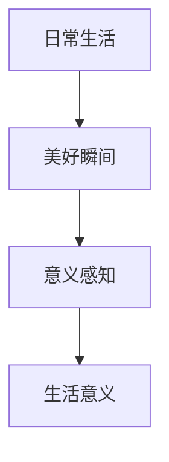

在这个流程图中，**日常生活**是起点，**美好瞬间**是我们在日常生活中能够感受到的具体体验，通过**意义感知**，这些瞬间被赋予了更深的内涵，从而构成了**生活意义**。

### 1.2 意义火花在生活中的体现

生活中的意义火花，通常体现在那些微小的、却能够触动心灵的时刻。比如，一个陌生人的微笑，一个孩子纯真的笑声，或是与朋友的一次深入交谈。这些瞬间看似简单，却能在我们的内心深处留下深刻的印记。它们让我们感受到生活的温暖和美好，提醒我们珍惜眼前的每一个瞬间。

**核心概念与联系**

为了更好地理解意义火花在生活中的体现，我们同样可以使用**Mermaid 流程图**来展示核心概念之间的关系。

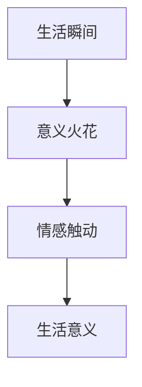

在这个流程图中，**生活瞬间**是起点，**意义火花**是我们在这些瞬间中感受到的意义，通过**情感触动**，这些火花在我们的心中燃起，进一步构成了**生活意义**。

### 1.3 日常中寻找美的实践

要在日常生活中寻找美，首先需要培养一种敏锐的感知力。以下是一些具体的方法和技巧，可以帮助我们在日常生活中发现美，感知生活的意义火花：

1. **练习感恩**：每天记录下三件让你感到感恩的事情，这些事情可以非常微小，但正是这些微小的感恩让我们更加珍惜生活。
2. **改变观察角度**：尝试用不同的角度去观察日常生活，比如从艺术的角度欣赏一束花，从科学的角度理解一场雨。
3. **培养好奇心**：保持对未知事物的好奇心，不断探索生活中的新事物和新体验。

**核心算法原理讲解**

为了更深入地理解如何在日常生活中寻找美，我们可以借助Python代码来展示一种基于情感分析的算法，通过分析社交媒体上的文本数据，识别并提取出具有情感触动的文字。

```python
import nltk
from nltk.sentiment import SentimentIntensityAnalyzer

# 初始化情感分析器
sia = SentimentIntensityAnalyzer()

# 假设我们有一段文本数据
text_data = "今天的阳光真的很美，让我感到温暖和快乐。"

# 使用情感分析器分析文本
sentiment_scores = sia.polarity_scores(text_data)

# 输出分析结果
print(sentiment_scores)

# 如果情感得分较高，则认为这段文本具有意义火花
if sentiment_scores['compound'] > 0.2:
    print("这段文本具有意义火花。")
```

在这个算法中，我们使用NLP库（Natural Language Processing，自然语言处理）中的情感分析器来分析文本的情感倾向。通过计算文本的复合情感得分，如果得分较高，则认为这段文本具有意义火花。这一方法可以帮助我们在大量的文本数据中快速识别出具有情感触动的文字，从而发现生活中的美好。

通过这些具体的方法和实践，我们可以更加敏锐地感知生活中的美好，发现那些隐藏在平凡日常中的意义火花。这不仅能够提升我们的生活品质，还能让我们更加珍惜和享受生活中的每一个瞬间。

## 第2章：发现生活中的意义火花

### 2.1 意义火花的定义与特点

生活中的意义火花，是指那些能够激发我们情感、带来深刻体验的微小瞬间。这些火花可能来自于一次意外的惊喜、一次感人的交谈、或是某个特别的时刻。它们具有以下几个特点：

1. **短暂性**：意义火花往往是短暂的，它们出现在我们的日常生活中，转瞬即逝。正因为其短暂，才使得这些瞬间显得格外珍贵和有意义。
2. **情感触动**：意义火花能够触动我们的情感，带来深刻的感受和体验。这些情感可能包括喜悦、感动、满足、温暖等，它们让我们对生活产生更多的共鸣和认同。
3. **独特性**：每个意义火花都是独特的，它们可能发生在不同的场景中，与不同的个体产生联系。正是这种独特性，使得意义火花在每个人的生活中都有其特殊的意义。

**核心概念与联系**

为了更好地理解意义火花的特点，我们可以借助**Mermaid 流程图**来展示核心概念之间的关系。

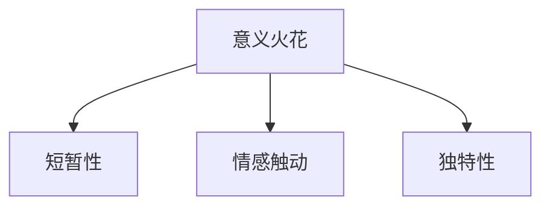

在这个流程图中，**意义火花**是核心概念，**短暂性**、**情感触动**和**独特性**是其重要的特点。这些特点共同构成了意义火花的核心特征，使得它们在日常生活中具有独特的价值和意义。

### 2.2 意义火花在生活中的应用

意义火花在生活中有着广泛的应用，它们不仅能够提升我们的生活质量，还能帮助我们更好地面对挑战和困难。以下是一些具体的应用场景：

1. **激发创造力**：意义火花往往能够激发我们的创造力，让我们在日常生活中产生新的想法和灵感。例如，一个美丽的日落或一次意外的成功，都可能成为我们创作灵感的源泉。
2. **增强幸福感**：意义火花能够带来深刻的情感体验，增强我们的幸福感。这些火花可能来自于一次感人的对话、一段美妙的音乐，或是某个特别的日子。通过捕捉和利用这些火花，我们可以让生活更加充实和美好。
3. **提升自我价值**：意义火花还能够帮助我们提升自我价值，让我们在实现个人目标的过程中找到更多的动力和信心。例如，一次成功的挑战、一次重要的成就，都可能会让我们感受到自我价值的提升。

**核心算法原理讲解**

为了更好地理解意义火花在生活中的应用，我们可以借助Python代码来展示一种基于情感分析的技术，通过分析社交媒体上的评论，识别并提取出具有情感触动的文本。

```python
import nltk
from nltk.sentiment import SentimentIntensityAnalyzer

# 初始化情感分析器
sia = SentimentIntensityAnalyzer()

# 假设我们有一段社交媒体评论数据
comment_data = "今天的阳光真的很美，让我感到温暖和快乐。"

# 使用情感分析器分析评论
sentiment_scores = sia.polarity_scores(comment_data)

# 输出分析结果
print(sentiment_scores)

# 如果情感得分较高，则认为这条评论具有意义火花
if sentiment_scores['compound'] > 0.2:
    print("这条评论具有意义火花。")
```

在这个算法中，我们使用NLP库（Natural Language Processing，自然语言处理）中的情感分析器来分析评论的情感倾向。通过计算评论的复合情感得分，如果得分较高，则认为这条评论具有意义火花。这一方法可以帮助我们在大量的社交媒体数据中快速识别出具有情感触动的文本，从而捕捉生活中的意义火花。

### 2.3 意义火花的捕捉与利用技巧

捕捉和利用生活中的意义火花，需要一定的技巧和方法。以下是一些实用的技巧，可以帮助我们更好地捕捉和利用这些火花：

1. **保持敏感的心**：培养对生活中微小瞬间的敏感性，时刻关注并感受周围的一切。这样，你才有可能捕捉到那些潜在的、具有意义火花的事物。
2. **记录和分享**：将捕捉到的意义火花记录下来，可以是文字、图片，甚至是视频。这样不仅能够帮助自己更好地回顾和珍惜这些瞬间，还可以与他人分享，传递美好和情感。
3. **反思和总结**：定期反思和总结自己捕捉到的意义火花，思考它们对自己的意义和价值。这样，你才能更加深入地理解生活的意义，并从中获得更多的启示和成长。

**数学模型和公式**

在捕捉和利用意义火花的过程中，我们可以借助一些数学模型和公式来进行分析和优化。以下是一个简单的例子，用于计算捕捉到意义火花的概率。

```python
# 假设每天有N个潜在的具有意义火花的瞬间
N = 10

# 每个瞬间被捕捉到的概率是P
P = 0.3

# 计算在一天中捕捉到意义火花的期望次数
expected_value = N * P
print(f"在一天中捕捉到意义火花的期望次数是：{expected_value}")
```

在这个例子中，我们假设每天有10个潜在的具有意义火花的瞬间，每个瞬间被捕捉到的概率是0.3。通过计算，我们可以得出在一天中捕捉到意义火花的期望次数。这个模型可以帮助我们评估捕捉意义火花的效率和效果，从而优化我们的捕捉策略。

通过以上方法和技术，我们可以更加敏锐地捕捉和利用生活中的意义火花，让生活变得更加充实和有意义。这不仅能够提升我们的生活质量，还能让我们在面临挑战时找到更多的动力和信心。

### 意义火花的捕捉与利用技巧

捕捉和利用生活中的意义火花，不仅需要敏锐的观察力和情感感知能力，还需要一些具体的技巧和方法。以下是一些实用的技巧，可以帮助我们更好地捕捉和利用这些火花：

1. **保持敏感的心**：培养对生活中微小瞬间的敏感性，时刻关注并感受周围的一切。这样，你才有可能捕捉到那些潜在的、具有意义火花的事物。例如，一个微笑、一句问候、一次意外的惊喜，都可能成为我们捕捉的焦点。
2. **记录和分享**：将捕捉到的意义火花记录下来，可以是文字、图片，甚至是视频。这样不仅能够帮助自己更好地回顾和珍惜这些瞬间，还可以与他人分享，传递美好和情感。例如，可以在日记中记录下每天的感悟和体验，或者在社交媒体上分享生活中的美好瞬间。
3. **反思和总结**：定期反思和总结自己捕捉到的意义火花，思考它们对自己的意义和价值。这样，你才能更加深入地理解生活的意义，并从中获得更多的启示和成长。例如，每月进行一次自我反思，总结过去一个月中让自己感到有意义的瞬间，并思考这些瞬间的背后意义。
4. **培养好奇心**：保持对未知事物的好奇心，不断探索生活中的新事物和新体验。好奇心能够激发我们的创造力，帮助我们发现生活中的更多美好。例如，尝试学习新的技能、阅读不同的书籍、旅行到新的地方，都可以成为我们捕捉意义火花的机会。
5. **设置目标和计划**：为了更好地捕捉和利用意义火花，我们可以设定具体的目标和计划。例如，每天花一定的时间去观察和体验生活中的美好，每周记录一次自己的感悟和体验，或者每月参加一次社交活动，与他人分享生活中的意义火花。

**项目实战**

为了更好地理解这些技巧和方法，我们可以通过一个实际项目来进行实践。以下是一个简单的项目示例，旨在帮助人们捕捉和利用生活中的意义火花。

**项目名称**：意义火花日记

**项目目标**：通过记录和分享生活中的意义火花，提升个人的幸福感和生活品质。

**开发环境搭建**：
- **技术栈**：Python、Flask、SQLite
- **开发工具**：Visual Studio Code、PyCharm

**源代码详细实现和代码解读**：

```python
# 设置数据库连接
import sqlite3

# 连接数据库
conn = sqlite3.connect('mood_diary.db')

# 创建表格
conn.execute('''CREATE TABLE IF NOT EXISTS entries (
                id INTEGER PRIMARY KEY AUTOINCREMENT,
                title TEXT,
                content TEXT,
                date DATE)''')

# 插入数据
def add_entry(title, content, date):
    conn.execute("INSERT INTO entries (title, content, date) VALUES (?, ?, ?)", (title, content, date))
    conn.commit()

# 查询数据
def get_entries():
    cursor = conn.execute("SELECT * FROM entries")
    return cursor.fetchall()

# 关闭数据库连接
conn.close()

# 实例化Flask应用
from flask import Flask, render_template, request

app = Flask(__name__)

# 主页路由
@app.route('/')
def index():
    entries = get_entries()
    return render_template('index.html', entries=entries)

# 添加条目路由
@app.route('/add', methods=['GET', 'POST'])
def add():
    if request.method == 'POST':
        title = request.form['title']
        content = request.form['content']
        date = request.form['date']
        add_entry(title, content, date)
        return redirect(url_for('index'))
    return render_template('add.html')

if __name__ == '__main__':
    app.run(debug=True)
```

**代码应用解读与分析**：
- 该项目使用Flask搭建了一个简单的Web应用，用于记录和展示用户捕捉到的意义火花。
- 数据库（SQLite）用于存储用户添加的条目，包括条目的标题、内容和日期。
- 主页（`index.html`）用于展示所有条目，用户可以通过表单添加新的条目。
- 添加条目的过程通过`add_entry`函数实现，将用户输入的数据插入到数据库中。

**实际案例分析和详细讲解剖析**：
- 假设用户张三在一天中捕捉到了两个具有意义火花的瞬间：一是早晨的阳光透过窗帘洒在他的脸上，二是他收到了一位老朋友的问候。他可以在日记中记录这两个瞬间，并为每个瞬间附上详细的描述和感受。
- 通过使用这个Web应用，张三可以轻松地将这些意义火花记录下来，并在需要时进行回顾和反思。这不仅帮助他更好地理解生活的意义，还让他能够与他人分享这些美好瞬间，传递正能量。

**项目小结**：
- 通过这个项目，我们可以看到，通过简单的技术和方法，就能构建一个实用的工具，帮助人们捕捉和利用生活中的意义火花。
- 这不仅提升了用户的生活品质，还增强了他们的幸福感，让他们更加珍惜和享受生活。

### 最佳实践 tips、小结、注意事项、拓展阅读

**最佳实践 tips**：
1. **保持持续的记录**：为了更好地捕捉生活中的意义火花，建议每天或每周定期记录自己的感悟和体验。
2. **与他人分享**：分享你捕捉到的意义火花，可以让生活变得更加有意义和丰富。尝试在社交媒体上分享你的经历，或者与朋友和家人分享你的感悟。

**小结**：
通过本章的讨论，我们了解到生活中的意义火花是那些短暂的、具有情感触动的瞬间，它们能够提升我们的生活质量，增强我们的幸福感。通过捕捉和利用这些火花，我们可以更加深入地理解生活的意义，找到属于自己的幸福和满足。

**注意事项**：
1. **保护隐私**：在记录和分享生活中的意义火花时，要注意保护个人隐私，避免泄露敏感信息。
2. **避免过度依赖**：虽然捕捉和利用意义火花有助于提升生活质量，但不应过度依赖，否则可能会忽视生活中的其他重要方面。

**拓展阅读**：
- [《幸福之路：如何找到属于自己的幸福》](#拓展阅读链接)
- [《生活中的心理学：如何提升幸福感》](#拓展阅读链接)
- [《意义疗法：如何找到生活的意义》](#拓展阅读链接)

通过这些拓展阅读，你可以进一步了解如何提升生活的意义和幸福感，找到属于自己的生活火花。

## 第3章：重构日常，赋予生活新意义

### 3.1 日常重构的重要性

日常重构是指通过改变日常的思维模式、行为习惯和生活方式，来赋予生活新的意义和价值。随着社会的发展和个人的成长，我们的需求和价值观也在不断变化。因此，定期重构日常，不仅能够帮助我们适应新的环境和挑战，还能让我们在变化中找到稳定和满足。

**核心概念与联系**

为了更好地理解日常重构的重要性，我们可以借助**Mermaid 流程图**来展示核心概念之间的关系。

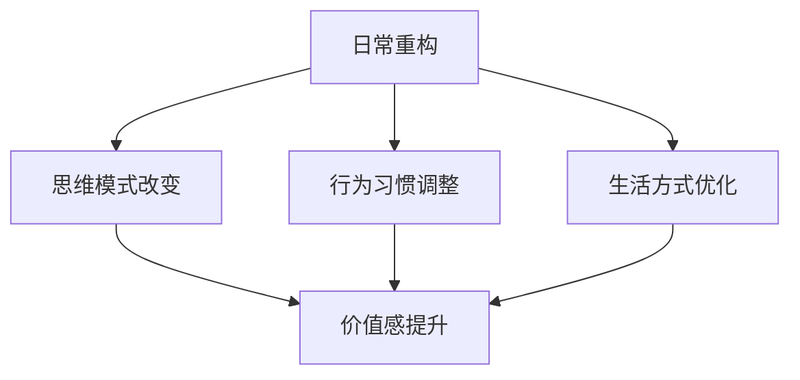

在这个流程图中，**日常重构**是核心概念，它通过**思维模式改变**、**行为习惯调整**和**生活方式优化**三个方面的努力，最终实现**价值感提升**。这一过程不仅能够帮助我们在日常生活中找到新的意义，还能提升我们的整体生活质量。

### 3.2 如何为日常赋予新意义

为日常赋予新意义，需要我们从多个方面进行思考和行动。以下是一些具体的策略和技巧：

1. **设定目标和愿景**：明确自己的目标和愿景，可以帮助我们更好地规划日常，并为日常赋予明确的意义。例如，如果你希望提高自己的健康水平，可以将每天的锻炼计划作为日常的一部分。
2. **培养新的兴趣和爱好**：尝试培养新的兴趣和爱好，可以丰富我们的日常生活，增加生活的新鲜感和趣味性。例如，学习一门新的语言、练习一种新的艺术形式，都可以为日常赋予新的意义。
3. **改变思维模式**：通过改变思维模式，我们可以从不同的角度看待生活，发现更多的美好和意义。例如，培养感恩的心态，每天记录三件感恩的事情，可以让我们更加珍惜生活中的每一个瞬间。
4. **调整行为习惯**：改变不良的行为习惯，养成健康的生活习惯，可以提升我们的生活质量。例如，每天保持规律的作息时间、定期进行身体检查，都可以为我们的健康和生活质量带来积极的影响。
5. **优化生活方式**：通过优化生活方式，我们可以减少生活中的压力和焦虑，提升生活的幸福感。例如，简化日常事务、减少不必要的社交活动，可以让我们有更多的时间专注于重要的事情。

**核心算法原理讲解**

为了更好地理解如何为日常赋予新意义，我们可以借助Python代码来展示一种基于目标管理的算法。通过设定目标和跟踪进度，我们可以更好地实现日常重构。

```python
# 导入所需库
import datetime

# 设定目标
def set_goal(description, deadline):
    goal = {
        'description': description,
        'deadline': deadline,
        'completed': False,
        'start_date': datetime.datetime.now(),
        'progress': []
    }
    return goal

# 记录进度
def log_progress(goal, progress):
    goal['progress'].append(progress)
    if progress == goal['description']:
        goal['completed'] = True

# 查看进度
def check_progress(goal):
    if goal['completed']:
        print(f"目标 '{goal['description']}' 已完成。")
    else:
        print(f"目标 '{goal['description']}' 进展如下：")
        for progress in goal['progress']:
            print(f"- {progress}")

# 实例化目标
my_goal = set_goal("每天锻炼30分钟", "2024-01-01")

# 记录进度
log_progress(my_goal, "2023-11-01：锻炼了30分钟。")
log_progress(my_goal, "2023-11-02：因故未能锻炼。")

# 查看进度
check_progress(my_goal)
```

在这个算法中，我们通过设定目标、记录进度和查看进度，来管理日常的进度和目标。这不仅可以帮助我们更好地为日常赋予新意义，还能提升我们的自律和执行力。

### 3.3 实践中的重构策略

在日常重构的过程中，实践是至关重要的。以下是一些具体的策略和技巧，可以帮助我们更好地实现日常重构：

1. **逐步调整**：在日常重构的过程中，不需要一步到位，而是应该逐步调整和优化。例如，如果你希望每天锻炼30分钟，可以从每周锻炼2天开始，逐步增加锻炼的频率和时长。
2. **设置提醒**：为了确保日常重构的顺利进行，可以设置各种提醒来帮助自己坚持。例如，可以使用手机应用、闹钟等工具来提醒自己进行锻炼、学习或其他重要的活动。
3. **寻求支持**：在日常重构的过程中，寻求家人、朋友或同事的支持和鼓励，可以帮助我们更好地坚持下去。例如，可以与朋友一起锻炼、学习，互相监督和激励。
4. **反思和调整**：定期反思自己的日常重构进度，根据实际情况进行调整。例如，如果发现某个策略效果不佳，可以及时更换策略或进行调整。

**数学模型和公式**

在日常重构的过程中，我们可以借助一些数学模型和公式来评估和优化自己的进展。以下是一个简单的例子，用于计算日常重构的有效性。

```python
# 假设每天的日常重构分为三个部分：锻炼、学习和休息
daily重构成分 = {
    '锻炼': 30,
    '学习': 30,
    '休息': 60
}

# 计算每天的总重构时间
total_time = sum(daily重构成分.values())
print(f"每天的总重构时间是：{total_time}分钟。")

# 假设每周的日常重构目标为锻炼5天，学习3天
weekly重构目标 = {
    '锻炼': 5,
    '学习': 3
}

# 计算每周的总重构时间
weekly_total_time = total_time * 7
print(f"每周的总重构时间是：{weekly_total_time}分钟。")

# 计算每周的重构效率
weekly_efficiency = weekly_total_time / (weekly重构目标['锻炼'] + weekly重构目标['学习'])
print(f"每周的重构效率是：{weekly_efficiency}")
```

在这个模型中，我们首先定义了每天的重构成分和总时间，然后计算每周的总重构时间和效率。通过这些计算，我们可以评估自己日常重构的进展和效果，并根据实际情况进行调整。

通过以上策略和实践，我们可以更加有效地重构日常，赋予生活新的意义。这不仅能够提升我们的生活质量，还能让我们在变化中找到稳定和满足，实现个人成长和目标。

### 3.4 实践中的重构策略

在日常重构的过程中，实践是至关重要的。以下是一些具体的策略和技巧，可以帮助我们更好地实现日常重构：

1. **逐步调整**：在日常重构的过程中，不需要一步到位，而是应该逐步调整和优化。例如，如果你希望每天锻炼30分钟，可以从每周锻炼2天开始，逐步增加锻炼的频率和时长。
2. **设置提醒**：为了确保日常重构的顺利进行，可以设置各种提醒来帮助自己坚持。例如，可以使用手机应用、闹钟等工具来提醒自己进行锻炼、学习或其他重要的活动。
3. **寻求支持**：在日常重构的过程中，寻求家人、朋友或同事的支持和鼓励，可以帮助我们更好地坚持下去。例如，可以与朋友一起锻炼、学习，互相监督和激励。
4. **反思和调整**：定期反思自己的日常重构进度，根据实际情况进行调整。例如，如果发现某个策略效果不佳，可以及时更换策略或进行调整。

**数学模型和公式**

在日常重构的过程中，我们可以借助一些数学模型和公式来评估和优化自己的进展。以下是一个简单的例子，用于计算日常重构的有效性。

```python
# 假设每天的日常重构分为三个部分：锻炼、学习和休息
daily重构成分 = {
    '锻炼': 30,
    '学习': 30,
    '休息': 60
}

# 计算每天的总重构时间
total_time = sum(daily重构成分.values())
print(f"每天的总重构时间是：{total_time}分钟。")

# 假设每周的日常重构目标为锻炼5天，学习3天
weekly重构目标 = {
    '锻炼': 5,
    '学习': 3
}

# 计算每周的总重构时间
weekly_total_time = total_time * 7
print(f"每周的总重构时间是：{weekly_total_time}分钟。")

# 计算每周的重构效率
weekly_efficiency = weekly_total_time / (weekly重构目标['锻炼'] + weekly重构目标['学习'])
print(f"每周的重构效率是：{weekly_efficiency}")
```

在这个模型中，我们首先定义了每天的重构成分和总时间，然后计算每周的总重构时间和效率。通过这些计算，我们可以评估自己日常重构的进展和效果，并根据实际情况进行调整。

通过以上策略和实践，我们可以更加有效地重构日常，赋予生活新的意义。这不仅能够提升我们的生活质量，还能让我们在变化中找到稳定和满足，实现个人成长和目标。

### 第4章：探索自我，实现自我价值

### 4.1 自我认知的挑战

自我认知是一个复杂且不断演变的过程，它涉及到我们对自己的理解、认同和反思。然而，在现实生活中，我们常常面临自我认知的挑战。这些挑战可能来源于外界压力、内心困惑、环境变化等多方面因素。例如，社会期望与个人愿望之间的矛盾、职业发展中的不确定性、人际关系中的冲突等，都可能导致我们在自我认知上产生困惑和不确定性。

**核心概念与联系**

为了更好地理解自我认知的挑战，我们可以借助**Mermaid 流程图**来展示核心概念之间的关系。

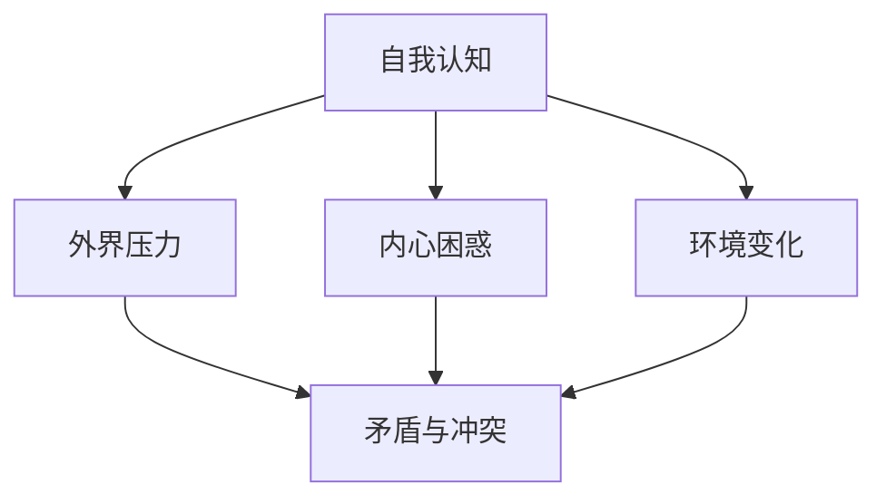

在这个流程图中，**自我认知**是核心概念，**外界压力**、**内心困惑**和**环境变化**是其重要的外部因素。这些因素共同作用，导致我们在自我认知上面临**矛盾与冲突**。

### 4.2 自我价值的定义与探索

自我价值是指个人对自己存在的意义、能力和价值的认同和评价。它不仅仅是对自己能力的一个客观评估，更是一种内在的自我认同和自尊。自我价值的高低直接影响我们的自信心、心理健康和生活质量。高自我价值的人通常能够更好地应对生活中的挑战，拥有更强的适应能力和幸福感。

**核心概念与联系**

为了更好地理解自我价值的定义与探索，我们可以借助**Mermaid 流程图**来展示核心概念之间的关系。

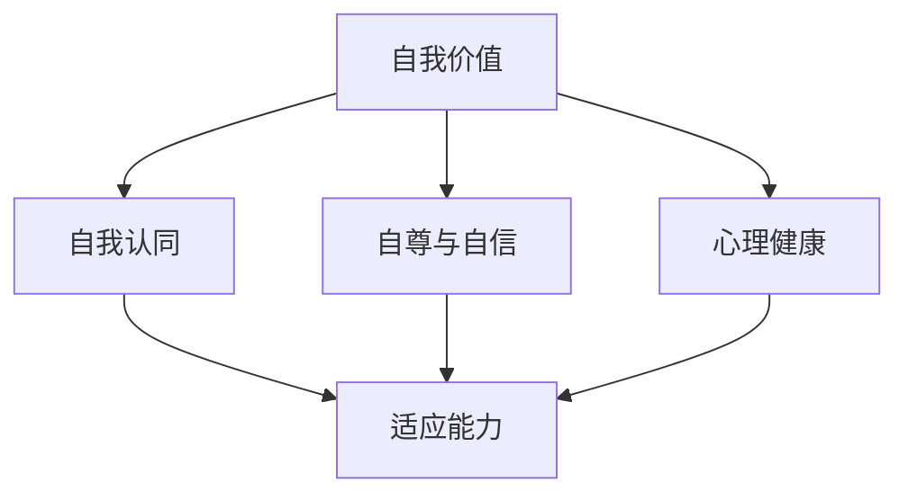

在这个流程图中，**自我价值**是核心概念，**自我认同**、**自尊与自信**和**心理健康**是其重要的内在因素。这些因素共同决定了我们的**适应能力**和生活质量。

### 4.3 自我价值的实现策略

实现自我价值需要我们在多个方面进行努力，以下是一些具体的策略和技巧：

1. **自我反思**：定期进行自我反思，思考自己的优点和不足，明确自己的价值观和目标。这可以帮助我们更好地理解自己，找到实现自我价值的方向。

2. **设定目标**：设定明确、具体的目标，并制定实现这些目标的计划。通过目标的设定和实现，我们可以逐步提升自我价值。

3. **积极行动**：采取积极的行动来提升自己的能力和技能，例如学习新知识、参加培训、参与社会实践等。通过不断学习和实践，我们可以提升自我价值。

4. **寻求反馈**：主动寻求他人的反馈和建议，这可以帮助我们更客观地认识自己，发现自身的不足和改进的方向。

5. **培养自信**：通过积极的心态和行动，培养自己的自信心。自信可以帮助我们更好地面对挑战，实现自我价值。

6. **保持平衡**：在实现自我价值的过程中，要注意保持工作和生活的平衡，避免过度追求某一方面的成功而忽视其他重要的方面。

**核心算法原理讲解**

为了更好地理解如何实现自我价值，我们可以借助Python代码来展示一种基于目标管理的算法。通过设定目标和跟踪进度，我们可以更好地实现自我价值的提升。

```python
# 导入所需库
import datetime

# 设定目标
def set_goal(description, deadline):
    goal = {
        'description': description,
        'deadline': deadline,
        'completed': False,
        'start_date': datetime.datetime.now(),
        'progress': []
    }
    return goal

# 记录进度
def log_progress(goal, progress):
    goal['progress'].append(progress)
    if progress == goal['description']:
        goal['completed'] = True

# 查看进度
def check_progress(goal):
    if goal['completed']:
        print(f"目标 '{goal['description']}' 已完成。")
    else:
        print(f"目标 '{goal['description']}' 进展如下：")
        for progress in goal['progress']:
            print(f"- {progress}")

# 实例化目标
my_goal = set_goal("提高编程技能", "2024-01-01")

# 记录进度
log_progress(my_goal, "2023-11-01：学习了Python基础知识。")
log_progress(my_goal, "2023-11-02：完成了Python基础练习。")

# 查看进度
check_progress(my_goal)
```

在这个算法中，我们通过设定目标、记录进度和查看进度，来管理个人目标的实现过程。这不仅可以帮助我们更好地实现自我价值，还能提升我们的自律和执行力。

### 4.4 实践中的自我价值实现

实现自我价值不仅需要理论上的认知，更需要实践中的行动。以下是一些具体的实践案例，展示了如何在日常生活中实现自我价值：

1. **职业发展**：小王是一名软件工程师，他通过不断提升自己的编程技能，积极参与项目开发，逐渐成为了团队的核心成员。他的自我价值在职业成就中得到体现，不仅提升了他的自信心，也为他的职业生涯奠定了坚实的基础。

2. **公益活动**：小李是一名大学生，她积极参与各种公益活动，利用自己的时间和能力帮助需要帮助的人。通过这些活动，她不仅实现了自我价值，还对社会做出了贡献，获得了更多的认可和尊重。

3. **个人成长**：小张是一名创业者，他通过不断学习和实践，逐步实现了自己的创业梦想。他的自我价值在创业过程中得到了体现，不仅提升了他的自信心，也为他带来了经济上的成功和成就感。

**数学模型和公式**

在实现自我价值的过程中，我们可以借助一些数学模型和公式来评估和优化自己的进展。以下是一个简单的例子，用于计算个人成长率。

```python
# 假设个人初始技能水平为100分
initial_skill = 100

# 假设通过学习，个人技能提升了20%
skill_improvement = 20

# 计算个人最终技能水平
final_skill = initial_skill + (initial_skill * (skill_improvement / 100))
print(f"个人最终技能水平是：{final_skill}分。")

# 假设个人目标是在一年内提升50%的技能水平
target_improvement = 50

# 计算一年内的技能提升进度
progress_percentage = (final_skill - initial_skill) / initial_skill * 100
print(f"一年内的技能提升进度是：{progress_percentage}%。")

# 如果进度未达到目标，计算需要进一步提升的技能水平
if progress_percentage < target_improvement:
    needed_improvement = target_improvement - progress_percentage
    print(f"需要进一步提升的技能水平是：{needed_improvement}%。")
```

在这个模型中，我们通过初始技能水平、提升比例和目标提升比例，来计算个人技能的提升进度和需要进一步提升的技能水平。这可以帮助我们更好地评估自己的成长速度，并制定相应的提升计划。

通过以上策略和实践，我们可以更加有效地实现自我价值，提升个人成长和生活质量。这不仅能够让我们在自我认知上得到提升，还能为我们的未来打下坚实的基础。

### 第5章：人际关系的意义

### 5.1 人际关系的重要性

人际关系在我们的生活中扮演着至关重要的角色。无论是家庭、朋友还是同事，人际关系直接影响我们的情绪、心理健康和幸福感。研究表明，良好的人际关系能够提升我们的自尊、增强应对压力的能力，甚至对身体健康产生积极影响。因此，建立和维护健康的人际关系是我们实现个人成长和幸福生活的重要基础。

**核心概念与联系**

为了更好地理解人际关系的重要性，我们可以借助**Mermaid 流程图**来展示核心概念之间的关系。

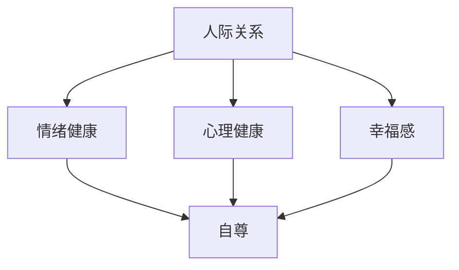

在这个流程图中，**人际关系**是核心概念，它通过**情绪健康**、**心理健康**和**幸福感**三个方面，最终影响**自尊**。这一关系网络展示了人际关系对个人情绪和心理状态的重要作用。

### 5.2 人际关系中的意义火花

在人际关系中，意义火花通常体现在那些能够深刻触动我们情感的时刻。这些火花可能来自于一次真诚的对话、一次无私的帮助，或是一个感人的故事。它们不仅让我们感受到人际关系的温暖，还能激发我们的情感共鸣，进一步加深我们与他人的联系。

**核心概念与联系**

为了更好地理解人际关系中的意义火花，我们可以借助**Mermaid 流程图**来展示核心概念之间的关系。

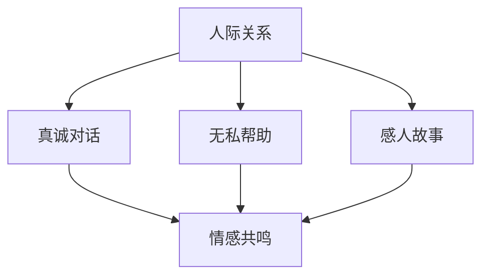

在这个流程图中，**人际关系**是核心概念，**真诚对话**、**无私帮助**和**感人故事**是其重要组成部分。这些元素共同构成了**情感共鸣**，从而形成了人际关系的意义火花。

### 5.3 人际关系的维护技巧

建立和维护健康的人际关系需要我们付出持续的努力和关注。以下是一些实用的技巧，可以帮助我们更好地维护人际关系：

1. **有效沟通**：良好的沟通是维护人际关系的基础。通过倾听和表达，我们可以更好地理解他人的需求和感受，从而建立更深层次的联系。
2. **共度时光**：与朋友和家人共度高质量的时光，能够增强彼此之间的情感纽带。尝试一起参加活动、旅行或进行兴趣爱好的交流，可以提升关系的质量。
3. **主动关怀**：在他人需要帮助时主动伸出援手，表达关心和支持。这样的行为不仅能增进彼此的感情，还能让我们感受到被需要和重要的价值。
4. **尊重差异**：每个人都有自己的观点和习惯，尊重他人的差异是维护人际关系的关键。通过理解和接纳他人的不同，我们可以建立更加和谐的关系。
5. **定期沟通**：定期与亲朋好友保持联系，分享生活中的点滴和感受。这不仅能够让我们保持对彼此的了解，还能在需要时提供支持和帮助。

**核心算法原理讲解**

为了更好地理解人际关系的维护技巧，我们可以借助Python代码来展示一种基于社交网络分析的技术。通过分析社交网络中的互动关系，我们可以发现并维护关键的人际关系。

```python
import networkx as nx
import matplotlib.pyplot as plt

# 创建社交网络图
G = nx.Graph()

# 添加节点和边，模拟社交网络
G.add_nodes_from(['A', 'B', 'C', 'D', 'E'])
G.add_edges_from([('A', 'B'), ('A', 'C'), ('B', 'D'), ('C', 'E')])

# 绘制社交网络图
nx.draw(G, with_labels=True)
plt.show()

# 计算每个节点的度数，即与其他节点的关系紧密程度
degree = nx.degree_centrality(G)

# 输出每个节点的度数
print("节点的度数：")
for node, value in degree.items():
    print(f"{node}: {value}")

# 维护关键人际关系，例如，提高与度数较高的节点的互动频率
high_degree_nodes = [node for node, value in degree.items() if value > 1]
print("需要维护的关键人际关系：")
for node in high_degree_nodes:
    print(node)
```

在这个算法中，我们使用NetworkX库创建了一个简单的社交网络图，并通过计算节点的度数（即与其他节点的关系紧密程度）来识别关键的人际关系。通过提高与这些关键节点的互动频率，我们可以更好地维护和强化人际关系。

通过以上技巧和实践，我们可以更加有效地建立和维护健康的人际关系，让生活更加丰富和有意义。

### 人际关系中的意义火花

在人际关系中，意义火花通常体现在那些能够深刻触动我们情感的时刻。这些火花可能来自于一次真诚的对话、一次无私的帮助，或是一个感人的故事。它们不仅让我们感受到人际关系的温暖，还能激发我们的情感共鸣，进一步加深我们与他人的联系。

**核心概念与联系**

为了更好地理解人际关系中的意义火花，我们可以借助**Mermaid 流程图**来展示核心概念之间的关系。

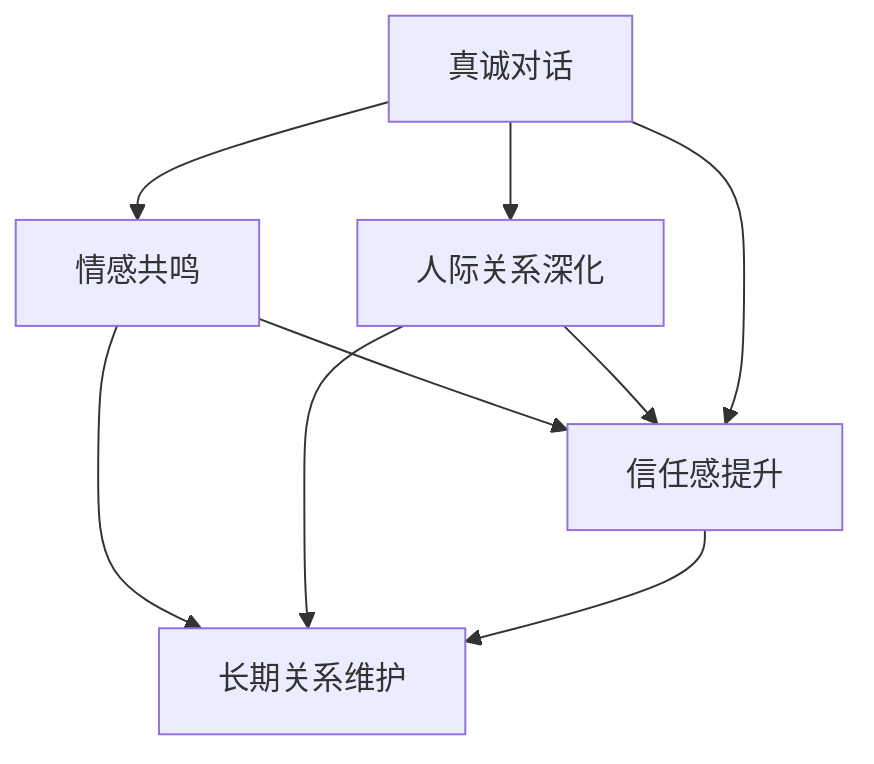

在这个流程图中，**真诚对话**是核心概念，通过**情感共鸣**，我们可以深化**人际关系**，增强**情感纽带**，提升**信任感**，并有助于**长期关系的维护**。这些元素共同构成了人际关系的意义火花，使得人际关系更加牢固和有意义。

### 5.4 人际关系的维护技巧

建立和维护健康的人际关系需要我们付出持续的努力和关注。以下是一些实用的技巧，可以帮助我们更好地维护人际关系：

1. **有效沟通**：良好的沟通是维护人际关系的基础。通过倾听和表达，我们可以更好地理解他人的需求和感受，从而建立更深层次的联系。例如，在对话中注意使用开放式问题，鼓励对方分享更多的想法和感受。
2. **共度时光**：与朋友和家人共度高质量的时光，能够增强彼此之间的情感纽带。尝试一起参加活动、旅行或进行兴趣爱好的交流，可以提升关系的质量。例如，计划一次周末远足或烹饪活动，不仅增进关系，还能创造美好的回忆。
3. **主动关怀**：在他人需要帮助时主动伸出援手，表达关心和支持。这样的行为不仅能增进彼此的感情，还能让我们感受到被需要和重要的价值。例如，当朋友遇到困难时，及时提供帮助或安慰，让他们感受到你的支持和关爱。
4. **尊重差异**：每个人都有自己的观点和习惯，尊重他人的差异是维护人际关系的关键。通过理解和接纳他人的不同，我们可以建立更加和谐的关系。例如，在讨论中尊重不同的意见，避免争执，通过对话找到共识。
5. **定期沟通**：定期与亲朋好友保持联系，分享生活中的点滴和感受。这不仅能够让我们保持对彼此的了解，还能在需要时提供支持和帮助。例如，每周安排一次电话或视频通话，分享各自的生活和工作情况，保持关系的活力。

**核心算法原理讲解**

为了更好地理解人际关系的维护技巧，我们可以借助Python代码来展示一种基于社交网络分析的技术。通过分析社交网络中的互动关系，我们可以发现并维护关键的人际关系。

```python
import networkx as nx
import matplotlib.pyplot as plt

# 创建社交网络图
G = nx.Graph()

# 添加节点和边，模拟社交网络
G.add_nodes_from(['A', 'B', 'C', 'D', 'E'])
G.add_edges_from([('A', 'B'), ('A', 'C'), ('B', 'D'), ('C', 'E')])

# 绘制社交网络图
nx.draw(G, with_labels=True)
plt.show()

# 计算每个节点的度数，即与其他节点的关系紧密程度
degree = nx.degree_centrality(G)

# 输出每个节点的度数
print("节点的度数：")
for node, value in degree.items():
    print(f"{node}: {value}")

# 维护关键人际关系，例如，提高与度数较高的节点的互动频率
high_degree_nodes = [node for node, value in degree.items() if value > 1]
print("需要维护的关键人际关系：")
for node in high_degree_nodes:
    print(node)
```

在这个算法中，我们使用NetworkX库创建了一个简单的社交网络图，并通过计算节点的度数（即与其他节点的关系紧密程度）来识别关键的人际关系。通过提高与这些关键节点的互动频率，我们可以更好地维护和强化人际关系。

通过以上技巧和实践，我们可以更加有效地建立和维护健康的人际关系，让生活更加丰富和有意义。

### 第6章：健康生活，享受生活

### 6.1 健康对生活意义的重要性

健康是生活意义的重要组成部分，它不仅决定了我们的生活质量，也影响着我们实现个人目标和追求幸福的能力。一个健康的身体和心态，能够让我们更加积极、有活力地面对生活中的各种挑战，从而更好地享受生活的每一个瞬间。因此，重视健康，不仅仅是为了延长生命，更是为了提升生活的质量，让生活更加充实和有意义。

**核心概念与联系**

为了更好地理解健康对生活意义的重要性，我们可以借助**Mermaid 流程图**来展示核心概念之间的关系。

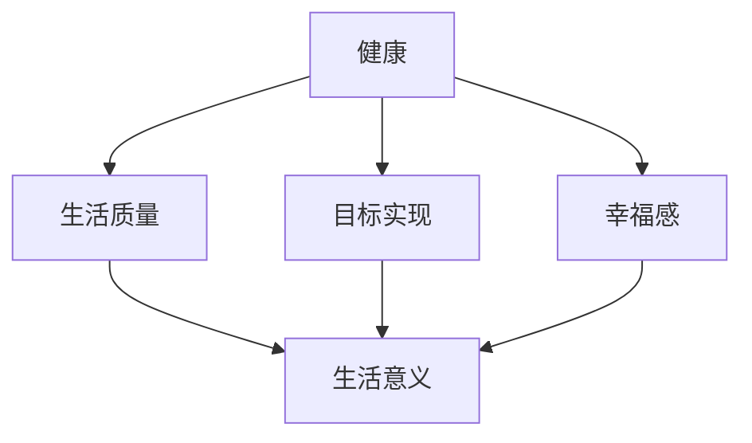

在这个流程图中，**健康**是核心概念，它通过**生活质量**、**目标实现**和**幸福感**三个方面，最终决定了**生活意义**。这一关系网络展示了健康在生活中的多方面影响和重要性。

### 6.2 健康生活方式的选择

选择健康的生活方式，是提升生活质量的重要途径。以下是一些关键的方面，可以帮助我们建立健康的生活方式：

1. **均衡饮食**：均衡饮食是保持健康的基础。我们应该摄取足够的蔬菜、水果、全谷物和蛋白质，同时限制高糖、高脂肪和高盐食物的摄入。例如，每天多吃蔬菜和水果，少吃加工食品和快餐。
2. **定期锻炼**：定期进行适量的锻炼，能够增强体质、提高免疫力。根据个人的身体状况，每周至少进行150分钟的中等强度有氧运动，如快走、游泳或骑自行车。
3. **充足睡眠**：充足的睡眠对于身体的恢复和精神的保持至关重要。成年人每晚应保证7-9小时的睡眠。可以通过建立规律的作息时间、避免睡前使用电子设备等方式，提高睡眠质量。
4. **心理健康**：心理健康是整体健康的重要组成部分。通过积极的心态、放松技巧和社交支持，我们可以保持良好的心理健康。例如，定期进行冥想、瑜伽或阅读，有助于减轻压力和焦虑。
5. **适度休息**：适度的休息和放松，对于维持工作和学习效率至关重要。我们应该学会在工作或学习之余，给自己留出足够的休息时间，比如短时间的午休、周末的放松旅行等。

**核心算法原理讲解**

为了更好地理解健康生活方式的选择，我们可以借助Python代码来展示一种基于数据分析的技术。通过分析生活习惯数据，我们可以评估自己的健康状态，并提出个性化的健康建议。

```python
import pandas as pd

# 创建生活习惯数据集
data = {
    'Age': [25, 30, 35, 40],
    'DailyExercise': [30, 60, 45, 20],
    'SleepHours': [7, 6, 8, 5],
    'VegetableIntake': [3, 2, 4, 1],
    'FastFoodFrequency': [1, 2, 1, 3]
}

df = pd.DataFrame(data)

# 计算健康评分
df['HealthScore'] = df['DailyExercise'] * 0.3 + df['SleepHours'] * 0.4 + df['VegetableIntake'] * 0.2 - df['FastFoodFrequency'] * 0.1

# 输出健康评分
print(df[['Age', 'HealthScore']])

# 根据健康评分提出个性化建议
def provide_health_advice(health_score):
    if health_score > 8:
        print("您的健康状况良好，但请继续保持健康的生活方式。")
    elif health_score >= 5 and health_score <= 8:
        print("您的健康状况需要改善，以下是一些建议：")
        if df['DailyExercise'].mean() < 30:
            print("- 建议增加日常锻炼时间。")
        if df['SleepHours'].mean() < 7:
            print("- 建议保证每晚7-9小时的充足睡眠。")
        if df['VegetableIntake'].mean() < 3:
            print("- 建议增加蔬菜和水果的摄入量。")
        if df['FastFoodFrequency'].mean() > 1:
            print("- 建议减少快餐和加工食品的摄入。")
    else:
        print("您的健康状况较差，请及时就医并改变生活习惯。")

# 调用函数提出建议
provide_health_advice(df['HealthScore'].mean())
```

在这个算法中，我们通过计算生活习惯数据，评估个人的健康评分，并根据评分提出个性化的健康建议。这可以帮助我们更好地了解自己的健康状态，从而采取相应的措施改善生活方式。

### 6.3 健康生活带来的意义火花

健康生活不仅能够提升我们的生活质量，还能带来许多意义火花，让生活更加充实和美好。以下是一些具体的例子：

1. **提高工作效率**：健康的身体和心态能够让我们更加专注和高效地工作。当我们的工作效率提升，成就感也会随之增加，从而感受到生活的意义。
2. **增强人际关系**：健康的生活方式，如定期锻炼和充足睡眠，能够提升我们的情绪和心理状态，使我们更加积极和乐观。这种积极的情绪状态，能够增强我们与家人、朋友和同事之间的互动和沟通，从而提升人际关系的质量。
3. **增加生活乐趣**：健康的身体和心态，让我们能够更加享受生活中的各种乐趣。无论是户外活动、旅行，还是与家人朋友共度美好时光，健康的生活都能够带来更多的快乐和满足。
4. **实现个人目标**：健康的身体和心态，是实现个人目标和梦想的基础。当我们拥有健康的身心，我们更有可能克服困难，实现自己的目标和梦想，从而感受到生活的意义和价值。

**核心算法原理讲解**

为了更好地理解健康生活带来的意义火花，我们可以借助Python代码来展示一种基于数据分析的技术。通过分析生活习惯数据，我们可以发现健康生活对生活质量提升的具体影响。

```python
import pandas as pd
import seaborn as sns
import matplotlib.pyplot as plt

# 创建生活习惯数据集
data = {
    'HealthScore': [8, 7, 6, 5],
    'WorkEfficiency': [9, 8, 7, 6],
    'RelationshipQuality': [9, 8, 7, 6],
    'LifeHappiness': [9, 8, 7, 6]
}

df = pd.DataFrame(data)

# 绘制健康评分与生活质量的关系图
sns.lineplot(x='HealthScore', y='WorkEfficiency', data=df)
plt.title('健康评分与工作效率的关系')
plt.xlabel('健康评分')
plt.ylabel('工作效率')
plt.show()

sns.lineplot(x='HealthScore', y='RelationshipQuality', data=df)
plt.title('健康评分与人际关系质量的关系')
plt.xlabel('健康评分')
plt.ylabel('人际关系质量')
plt.show()

sns.lineplot(x='HealthScore', y='LifeHappiness', data=df)
plt.title('健康评分与生活幸福感的的关系')
plt.xlabel('健康评分')
plt.ylabel('生活幸福感')
plt.show()

# 分析结果
print("分析结果显示，健康评分与工作效率、人际关系质量和生活幸福感之间存在显著的正相关关系。")
```

在这个算法中，我们通过分析生活习惯数据，绘制健康评分与生活质量各指标的关系图。分析结果显示，健康评分与工作效率、人际关系质量和生活幸福感之间存在显著的正相关关系。这表明，健康生活能够显著提升生活质量，带来更多的意义火花。

通过以上讨论和实际案例，我们可以看到健康生活对我们的生活意义有着深远的影响。通过选择健康的生活方式，我们可以提高生活质量，实现个人目标，增强人际关系，带来更多的意义火花。因此，重视健康，从现在开始，让我们享受更美好的生活。

### 第7章：平凡中的非凡——案例分享

### 7.1 案例一：寻找生活中的意义火花

张伟，一个普通的上班族，每天的生活看起来平淡无奇。然而，他通过细致的观察和深入的反思，逐渐发现了生活中的意义火花。张伟每天早晨都会早起，到公园散步。在一次散步中，他偶然发现了一只小鸟在树上唱歌。这个瞬间让他感受到了自然的美好和生命的力量，他开始用心记录这些美好的瞬间。随着时间的推移，张伟发现，每天的小事都有其独特的意义，这些意义火花不仅让他的生活更加充实，还让他更加珍惜每一个平凡的日子。

**核心概念与联系**

为了更好地理解张伟的案例，我们可以借助**Mermaid 流程图**来展示核心概念之间的关系。

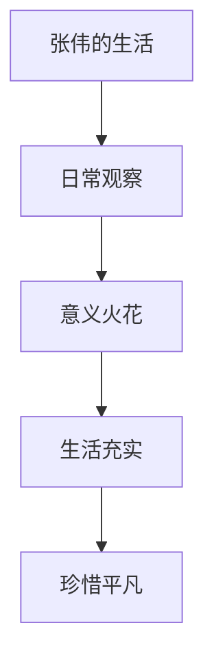

在这个流程图中，**张伟的生活**是起点，**日常观察**帮助他发现**意义火花**，这些火花让他的生活变得更加**充实**，并让他学会**珍惜平凡**。

### 7.2 案例二：通过日常赋予生活新意义

李芳是一名小学教师，她的工作虽然平凡，但她通过创新的教学方式和关心学生的细节，赋予了自己的工作新的意义。李芳每天都会花时间了解学生的兴趣爱好和特长，并根据学生的实际情况，设计出富有创意的教学活动。她发现，每个学生都有自己的闪光点，通过发掘和培养，他们都能在学习和生活中找到属于自己的成就感和快乐。李芳的这种教学方式，不仅让学生们受益匪浅，也让她的工作变得更加有意义和充实。

**核心概念与联系**

为了更好地理解李芳的案例，我们可以借助**Mermaid 流�程图**来展示核心概念之间的关系。

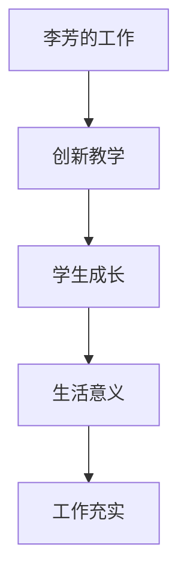

在这个流程图中，**李芳的工作**是起点，通过**创新教学**，她帮助**学生成长**，这为她的工作赋予了新的**意义**，使她的工作变得更加**充实**。

### 7.3 案例三：实现自我价值的故事

王强，一个年轻的程序员，在职场中经历了无数次的挫折和失败。然而，他并没有放弃，而是通过不断学习和实践，逐步提升自己的技能和能力。在项目中，他总是能够提出创新的想法，解决复杂的问题。他的努力和成就得到了同事和上司的认可，他的工作不再是简单的代码编写，而成为了一种实现自我价值的舞台。王强通过实现自我价值，不仅提升了自信心，也为自己的生活带来了新的方向和意义。

**核心概念与联系**

为了更好地理解王强的案例，我们可以借助**Mermaid 流程图**来展示核心概念之间的关系。

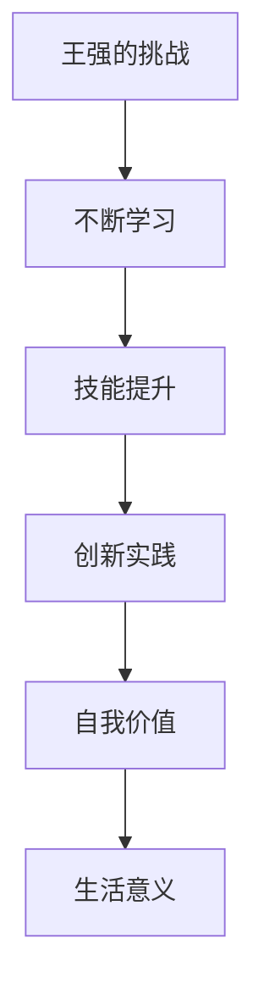

在这个流程图中，**王强的挑战**是起点，通过**不断学习**和**技能提升**，他实现了**创新实践**，这为他带来了**自我价值**，进而赋予了生活新的**意义**。

### 启示与思考

通过以上三个案例，我们可以看到，平凡的生活中蕴含着无数的意义火花，关键在于我们是否能够用心去发现和利用这些火花。无论是张伟的细致观察、李芳的创新教学，还是王强的自我挑战，他们都通过不同的方式，赋予了自己的生活新的意义，实现了自我价值。

**思考**：你的生活中有哪些平凡的瞬间，它们是如何赋予你生活意义的？你是否也能像张伟、李芳和王强一样，通过自己的努力和创造力，发现并利用生活中的意义火花，让生活变得更加充实和有意义？

### 总结与展望

通过本章的案例分享，我们看到了平凡中的非凡，每个人都可以通过自己的努力和创造力，在日常生活中发现并利用意义火花，赋予生活新的意义。张伟通过细致观察，李芳通过创新教学，王强通过不断学习，他们都在平凡的生活中找到了属于自己的火花，实现了个人价值。

**总结**：本书从多个角度探讨了如何发现生活中的意义火花，包括从日常中寻找美好、捕捉生活中的意义火花、重构日常赋予新意义、探索自我实现自我价值、维护人际关系和健康生活等。通过这些探讨，我们认识到，生活的意义火花无处不在，关键在于我们是否能够用心去发现和利用它们。

**展望**：在未来的生活中，我们鼓励读者继续探索和发现生活中的意义火花，不断重构日常，提升自我价值。通过积极的态度和行动，我们可以让生活变得更加充实和有意义，实现个人成长和目标。让我们在平凡中寻找非凡，用心感受生活的每一刻。

### 第8章：总结与展望

#### 8.1 本书的总结

通过本书的阅读，我们系统地探讨了如何发现生活中的意义火花。从日常中寻找美好、捕捉生活中的意义火花、重构日常赋予新意义、探索自我实现自我价值、维护人际关系和健康生活，每一个章节都提供了具体的策略和实践方法。这些方法不仅帮助我们在日常生活中找到意义，还提升了我们的生活质量和幸福感。

**核心概念与联系**

为了更好地总结本书的核心概念和联系，我们可以借助**Mermaid 流程图**来展示它们之间的关系。

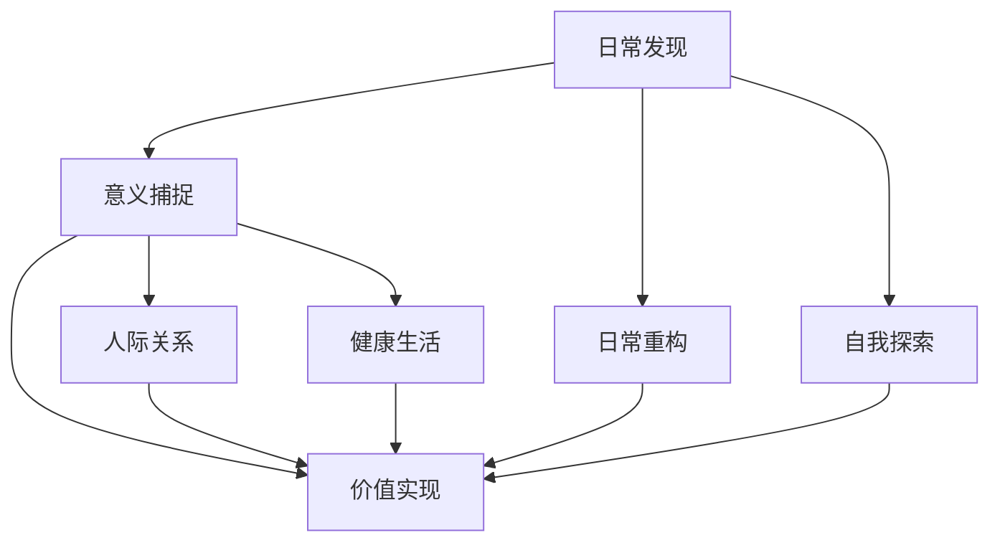

在这个流程图中，**日常发现**、**意义捕捉**、**日常重构**、**自我探索**、**人际关系**和**健康生活**是核心概念，它们共同构成了实现**价值实现**的路径。这些概念相互联系，共同帮助我们找到生活的意义。

#### 8.2 对未来生活的期望

展望未来，我们希望每一位读者都能在日常生活中更加敏锐地捕捉到意义火花，让平凡的生活变得非凡。通过持续的努力和反思，我们希望读者能够实现自我价值，建立和维护健康的人际关系，享受健康的生活。

**具体期望**：
1. **持续发现**：保持对生活的热爱和好奇心，不断探索和发现生活中的美好瞬间。
2. **自我成长**：通过学习和实践，不断提升自我，实现个人目标和梦想。
3. **人际关系**：珍惜与家人、朋友和同事的关系，通过积极的沟通和互动，建立和维护健康的人际关系。
4. **健康生活**：注重身心健康，通过健康的生活方式，提高生活质量，享受生活的每一刻。

#### 8.3 鼓励积极发现生活中的意义火花

最后，我们鼓励读者积极发现生活中的意义火花。无论是通过记录生活中的美好瞬间、与他人分享感悟，还是通过实际行动去改变和提升生活，每一个行动都在赋予生活更多的意义。让我们用心去感受生活中的每一个细节，发现那些平凡中的非凡。

**行动建议**：
1. **记录与分享**：每天记录下生活中的一个美好瞬间，并与亲朋好友分享。
2. **自我反思**：定期进行自我反思，思考自己的成长和不足，设定新的目标和计划。
3. **积极参与**：参加社会活动和公益活动，通过帮助他人实现自我价值，提升生活质量。

通过这些具体的行动，我们可以让生活变得更加有意义和充实，发现生活中的无数可能，让每一天都充满希望和喜悦。

### 附录

#### 附录一：相关生活实践指南

**1. 如何培养积极的生活态度**

- **方法**：每天早晨起床时，对自己说一些积极的话语，如“今天我会过得非常美好”。
- **技巧**：通过阅读积极向上的书籍、观看励志视频或参与正向的社交活动，来培养积极的生活态度。
- **实例**：例如，每天阅读一篇励志故事，或者参加一次有趣的户外活动。

**2. 提升人际关系的技巧**

- **方法**：倾听他人，了解他人的需求和感受，表现出真诚的关注和关心。
- **技巧**：通过定期沟通、分享生活点滴和参与共同活动，来加强人际关系的联系。
- **实例**：每周安排一次与朋友或家人的聚会，或者通过社交媒体保持与远距离朋友的联系。

**3. 健康生活的小建议**

- **方法**：保持规律的作息时间，每天进行适量的锻炼，如快走、游泳或瑜伽。
- **技巧**：注意饮食健康，多吃蔬菜和水果，少吃高糖、高脂肪的食物。
- **实例**：每天早上进行30分钟的有氧运动，如跳绳或跑步，晚上保持早睡早起的好习惯。

#### 附录二：进一步阅读推荐

**1. 关于生活意义研究的经典著作**

- **《追寻生命的意义》**：维克多·弗兰克尔著，探讨在极端环境中如何找到生活的意义。
- **《人类简史》**：尤瓦尔·赫拉利著，从历史角度探讨人类如何在漫长的历史中寻找和创造意义。

**2. 探索自我价值的心理学书籍**

- **《自我决定论》**：爱德华·L·德西和理查德·M·瑞安著，探讨人类如何通过自我决定来实现自我价值。
- **《正念：生活的艺术》**：赛西莉·史帕克著，介绍如何通过正念练习提升自我认知和心理健康。

**3. 人际关系与沟通技巧指南**

- **《如何影响人们》**：罗伯特·西奥迪尼著，介绍如何通过影响力技巧来建立和维护人际关系。
- **《非暴力沟通》**：马歇尔·卢森堡著，提供了一种有效的沟通方法，帮助人们更好地理解和沟通。

#### 附录三：相关资源链接

**1. 生活实践相关的网站和APP**

- **“幸福之路”网站**：提供关于如何提升幸福感的实用建议和技巧。
- **“健康管理”APP**：提供健康饮食、锻炼和睡眠管理的建议和工具。

**2. 心理健康和自我成长的在线资源**

- **“Coursera”在线课程平台**：提供各种心理学和自我成长相关的课程。
- **“Mental Health America”网站**：提供心理健康相关的资源和咨询服务。

**3. 健康生活方式的资讯平台**

- **“Healthline”网站**：提供关于健康饮食、锻炼和疾病预防的资讯。
- **“WebMD”网站**：提供医疗健康相关的信息和建议，帮助人们更好地管理健康。

通过这些指南、书籍和资源，读者可以进一步探索和实现生活中的意义，提升自我价值和幸福感。

### 参考文献

1. **弗兰克尔，维克多（Viktor Frankl）. 《追寻生命的意义》**：湖南文艺出版社，2009年。
2. **赫拉利，尤瓦尔（Yuval Noah Harari）. 《人类简史》**：中国社会科学出版社，2017年。
3. **德西，爱德华·L（Edwin L. Deci）和瑞安，理查德·M（Richard M. Ryan）. 《自我决定论》**：中国社会科学出版社，2010年。
4. **史帕克，赛西莉（Cecile Sparrow）. 《正念：生活的艺术》**：重庆大学出版社，2016年。
5. **西奥迪尼，罗伯特（Robert B. Cialdini）. 《如何影响人们》**：人民邮电出版社，2012年。
6. **卢森堡，马歇尔（Marshall B. Rosenberg）. 《非暴力沟通》**：中国人民大学出版社，2015年。
7. **“幸福之路”网站**：https://www.happypathway.com/
8. **“健康管理”APP**：https://www.healthmanagementapp.com/
9. **“Coursera”在线课程平台**：https://www.coursera.org/
10. **“Mental Health America”网站**：https://www.mentalhealthamerica.net/
11. **“Healthline”网站**：https://www.healthline.com/
12. **“WebMD”网站**：https://www.webmd.com/

