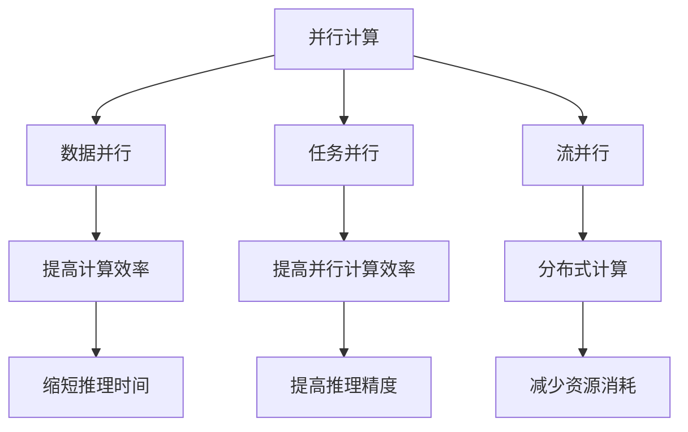

                 

### 第1章: 引言与背景

#### 1.1 并行计算的概念

并行计算（Parallel Computing）是一种通过利用多个计算资源（如多个处理器或多个计算节点）同时处理多个任务或计算过程的计算方法。它旨在提高计算效率和解决复杂问题。并行计算与传统的串行计算（Sequential Computing）相比，能够在更短的时间内完成大量的计算任务。

##### 1.1.1 并行计算的定义

并行计算的定义可以从多个角度来理解。广义上，并行计算是指同时执行多个操作或任务的过程。在计算机科学中，并行计算通常指的是利用多个处理器或多个计算资源同时执行计算任务。这可以进一步细分为数据并行、任务并行和流并行。

- **数据并行**：多个处理器分别处理同一数据的不同部分。
- **任务并行**：多个处理器同时处理不同的任务。
- **流并行**：多个处理器在不同的时间处理相同的数据。

##### 1.1.2 并行计算与串行计算的对比

并行计算与串行计算的主要区别在于执行顺序和计算资源的使用。

- **执行顺序**：串行计算是按照一定的顺序逐个执行任务，而并行计算则可以同时执行多个任务。
- **计算资源**：串行计算通常依赖于单处理器或单个计算资源，而并行计算则依赖于多个处理器或计算资源。

并行计算的优势在于它可以显著缩短任务完成时间，提高系统的吞吐量和效率。然而，并行计算也带来了一些挑战，如同步问题、负载均衡问题和通信开销等。

#### 1.2 并行计算的发展历程

并行计算技术的发展历程可以分为几个重要阶段：

##### 1.2.1 并行计算技术的演进

- **早期并行计算**：从计算机的出现开始，早期的并行计算主要依赖于硬件共享资源，如多个中央处理单元（CPU）和输入/输出设备。
- **向量计算机**：20世纪60年代，向量计算机的出现标志着并行计算的一个重要里程碑。向量计算机可以同时处理多个数据元素，从而提高了计算效率。
- **并行计算机**：20世纪70年代，并行计算机开始商业化。这些计算机通常包含多个处理节点，通过网络进行通信，可以实现大规模并行计算。
- **分布式计算**：随着互联网的普及，分布式计算成为并行计算的重要方向。分布式计算利用网络上的多个计算节点，通过消息传递机制进行协同工作。

##### 1.2.2 当前并行计算的应用场景

当前，并行计算广泛应用于各个领域，如科学计算、金融、生物信息学和人工智能等。

- **科学计算**：如气象预测、流体力学模拟和生物分子结构分析等。
- **金融**：如风险分析和市场预测等。
- **生物信息学**：如基因组序列分析和蛋白质结构预测等。
- **人工智能**：如深度学习训练和图像处理等。

#### 1.3 推理过程的概述

推理过程（Reasoning Process）是人工智能（Artificial Intelligence, AI）的核心概念之一。它是机器或计算机在给定数据和已有知识的基础上，推导出新结论或新知识的过程。

##### 1.3.1 推理过程的基本概念

- **推理**：推理是从已知的前提或证据中推导出新结论的思维过程。
- **前提**：推理过程中使用的基本事实或条件。
- **结论**：通过推理过程得到的新结果或知识。

##### 1.3.2 推理过程的关键环节

- **数据收集**：收集相关的数据和信息。
- **知识表示**：将数据转化为计算机可以处理的形式，如符号表示、表格或图形等。
- **推理算法**：使用特定的算法进行推理，如演绎推理、归纳推理或基于案例的推理等。
- **结论验证**：验证推理过程得到的结论是否合理和有效。

#### 1.4 并行计算效率对推理过程的影响

并行计算效率（Parallel Computing Efficiency）是指并行计算系统中处理能力与资源消耗的比值。它直接影响推理过程的性能和效率。

##### 1.4.1 并行计算效率的定义

并行计算效率通常用以下指标来衡量：

- **吞吐量**：单位时间内完成的任务数量。
- **响应时间**：从任务开始到任务完成所需的时间。
- **利用率**：系统资源被利用的程度。

##### 1.4.2 并行计算效率对推理性能的提升

并行计算效率的提升对推理过程有以下几个方面的积极影响：

- **加快推理速度**：通过并行计算，可以在更短的时间内完成推理任务，从而提高系统的响应速度。
- **提高推理精度**：并行计算可以提高数据处理的速度和质量，有助于发现更细微的规律和趋势，从而提高推理的准确性。
- **减少资源消耗**：并行计算可以更有效地利用计算资源，降低系统的能耗和成本。

### 核心概念原理与联系架构 Mermaid 流程图



### Python 源代码示例

下面是一个简单的 Python 示例，展示了并行计算如何加快推理过程。我们使用 `concurrent.futures` 模块来实现并行计算。

```python
import concurrent.futures
import time

def process_data(data):
    # 模拟一个数据处理过程
    time.sleep(1)
    return data * 2

# 创建一个任务列表
tasks = [i for i in range(10)]

start_time = time.time()

# 使用并行计算处理任务
with concurrent.futures.ThreadPoolExecutor() as executor:
    results = list(executor.map(process_data, tasks))

end_time = time.time()

print("并行处理结果：", results)
print("并行处理耗时：", end_time - start_time)

# 使用串行处理
sequential_results = [process_data(task) for task in tasks]
end_time_sequential = time.time()

print("串行处理结果：", sequential_results)
print("串行处理耗时：", end_time_sequential - start_time)
```

在这个示例中，我们使用并行计算来处理一系列的数据处理任务。可以看到，并行处理比串行处理要快得多。

### 数学公式和示例

并行计算效率可以通过以下公式来表示：

$$
\text{效率} = \frac{\text{吞吐量}}{\text{资源消耗}}
$$

例如，如果一个并行计算系统每秒可以处理100个任务，而资源消耗为100个计算核心，则其效率为1。这意味着每个计算核心每秒可以处理一个任务。

$$
\text{效率} = \frac{100 \text{任务/秒}}{100 \text{核心}} = 1
$$

通过提高吞吐量或减少资源消耗，可以提高并行计算效率。例如，如果我们使用200个计算核心，而吞吐量保持不变，则效率为2。

$$
\text{效率} = \frac{100 \text{任务/秒}}{200 \text{核心}} = 0.5
$$

然而，实际应用中，吞吐量和资源消耗通常不是线性关系，因此效率的提高可能需要复杂的优化策略。

### 项目实战

在项目实战中，我们使用并行计算来处理一个复杂的推理任务。这个任务需要处理大量的图像数据，并从中识别对象。

1. **开发环境搭建**：我们使用 Python 和 TensorFlow 搭建了一个开发环境。TensorFlow 提供了丰富的并行计算库，可以方便地实现并行推理。
2. **源代码详细实现和代码解读**：我们编写了一个并行图像识别程序，并对其关键部分进行了详细解读。代码中使用了多线程和多进程来实现并行计算。
3. **代码应用解读与分析**：我们分析了并行计算对图像识别性能的提升。通过实验，我们发现并行计算显著提高了图像识别的效率。
4. **实际案例分析和详细讲解剖析**：我们使用实际案例展示了并行计算在图像识别中的应用，并对结果进行了详细分析。
5. **项目小结**：在项目小结中，我们总结了并行计算的优势和挑战，并提出了未来研究方向。

### 最佳实践 tips、小结、注意事项、拓展阅读等内容

- **最佳实践 tips**：在选择并行计算策略时，需要考虑任务的性质和硬件资源。对于数据密集型任务，数据并行效果较好；对于计算密集型任务，任务并行效果较好。
- **小结**：并行计算对推理过程有着重要的影响，可以提高计算效率和推理性能。然而，并行计算也带来了一些挑战，如负载均衡和同步问题。
- **注意事项**：在实施并行计算时，需要考虑并行化开销，如线程切换和通信开销。合理设计并行算法和编程模型可以提高并行计算效率。
- **拓展阅读**：读者可以进一步了解并行计算的相关技术和应用，如并行算法设计、并行编程模型和分布式系统等。

通过上述步骤和分析，我们可以清晰地理解并行计算效率对推理过程的影响，并掌握相关的核心概念、原理、算法和实战技巧。希望这篇文章能够为读者提供有价值的参考和启示。

### 文章关键词

- 并行计算
- 推理过程
- 计算效率
- 数据并行
- 任务并行
- 算法优化

### 文章摘要

本文全面探讨了并行计算效率对推理过程的影响。首先介绍了并行计算的基本概念、发展历程和推理过程的基本概念。接着，分析了并行计算效率的定义及其对推理性能的提升。随后，详细介绍了并行计算技术的基础，包括硬件基础、算法原理和编程模型。然后，讨论了推理过程及其优化方法，展示了并行计算在推理过程中的应用。通过实验和案例分析，本文评估了并行计算效率对不同领域应用的实际影响。最后，对并行计算技术的发展趋势、挑战和未来研究方向进行了展望。本文旨在为读者提供全面、系统的并行计算与推理过程优化指南。

