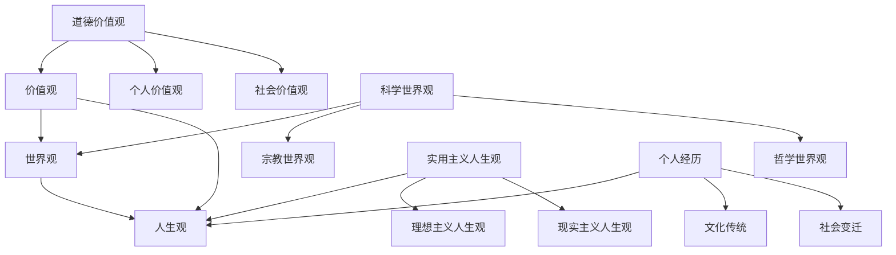

                 

### 1. 引言

在当今复杂多变的社会和技术环境中，个人信念体系的建立显得尤为重要。无论是在职业发展、个人生活，还是在面对社会挑战时，一个坚实的信念体系能够提供明确的方向和强大的支撑。所谓信念体系，是指个人对世界观、人生观和价值观的总体认知和坚定信仰，它是个人决策和行为的指南针。

本文旨在探讨如何建立个人信念体系，使其成为坚实的价值观基础。我们将从以下几个方面展开讨论：

1. **信念体系的重要性**：理解信念体系对于个人成长和发展的关键作用。
2. **信念体系的构成要素**：详细分析价值观、世界观和人生观在信念体系中的角色和相互关系。
3. **信念体系的建立与培养**：探讨如何通过自我认知、学习与思考、经验积累和情感管理来构建和培养信念体系。
4. **信念体系的实践与应用**：讨论信念体系在决策、人际关系以及职业生涯规划中的应用。
5. **信念体系的挑战与调适**：分析信念体系可能面临的挑战，并提出调适的方法和策略。
6. **案例研究**：通过具体案例展示信念体系构建的实际效果。
7. **实践指南**：提供实用的信念体系构建实践步骤和工具。

通过以上步骤，我们将帮助读者理解信念体系的建立过程，掌握构建坚实价值观基础的方法，从而更好地应对生活中的各种挑战。文章将以逻辑清晰、结构紧凑、简单易懂的专业技术语言，结合实际案例和实践经验，为读者提供有深度、有思考、有见解的内容。

### 2. 关键词

- 信念体系
- 价值观
- 世界观
- 人生观
- 自我认知
- 学习与思考
- 经验积累
- 情感管理
- 决策应用
- 人际关系

### 3. 摘要

本文围绕建立个人信念体系的重要性，探讨了信念体系的构成要素、建立与培养方法、实践与应用，以及面临的挑战与调适策略。通过具体案例研究和实践指南，本文旨在为读者提供清晰、实用的构建坚实价值观基础的路径，帮助个人在复杂多变的社会环境中找到明确的方向和强大的支持。

### 第1章：信念体系的重要性

信念体系，作为个人信念的总体框架，是我们思考、决策和行为的重要基础。它不仅影响着我们的内心世界，还在很大程度上决定了我们在社会中的表现。因此，深入理解信念体系的重要性，有助于我们更好地把握个人成长和发展的方向。

#### 1.1.1 信念体系的定义

信念体系是一个多层次的、结构化的信念系统，它涵盖了我们对世界观、人生观和价值观的认知。具体来说，信念体系包括以下三个主要组成部分：

1. **世界观**：是我们对整个宇宙、自然界以及人类社会的总体认知。它涉及我们对存在、时间和空间的看法，反映了我们对世界的根本理解。
2. **人生观**：是对人生目的、意义和价值的理解。它涵盖了我们对自我价值、生命意义、人生目标的看法，直接影响我们的生活方式和人生选择。
3. **价值观**：是我们对道德、正义、真理、美等基本价值观念的判断。价值观决定了我们在面对不同情境时的行为准则和优先级。

这些组成部分相互交织、相互作用，共同构成了我们的信念体系。信念体系不仅是个体内在的心理结构，也是我们应对外部世界的重要工具。

#### 1.1.2 信念体系对个人生活的影响

信念体系对个人生活的影响是深远而广泛的。它不仅影响我们的思想观念，还影响我们的行为和情感。以下是信念体系对个人生活的几个关键方面：

1. **思想观念**：信念体系塑造了我们的世界观、人生观和价值观，决定了我们对世界的看法和自身的定位。一个健康的信念体系能够帮助我们形成正确的思想观念，从而更好地理解自己和世界。
   
2. **行为准则**：信念体系是我们行为的指导原则，它决定了我们在面对不同情境时的选择和行动。一个健全的信念体系有助于我们做出明智的决策，遵循道德和伦理准则，避免因冲动或短视行为带来的负面影响。

3. **情感体验**：信念体系影响着我们的情感体验，包括自我认同、幸福感和满足感。一个积极的信念体系能够增强我们的自信心和幸福感，使我们更加乐观和坚韧。

#### 1.1.3 信念体系与社会价值观的联系

信念体系不仅影响个人生活，也与社会价值观密切相关。社会价值观是指一个社会普遍认可和推崇的基本价值观念，它们在一定程度上反映了社会的文化和伦理标准。信念体系与社会价值观的联系体现在以下几个方面：

1. **文化传承**：信念体系是文化传承的重要组成部分。社会价值观通过家庭教育、社会教育等方式传递给个体，形成个体的信念体系。同时，个体的信念体系又通过言行举止传递给下一代，从而实现文化的代际传递。

2. **社会规范**：社会价值观为个体的行为提供了规范和指导。一个健康的信念体系能够使个体更好地遵守社会规范，积极参与社会生活，为社会的发展和进步贡献力量。

3. **社会认同**：信念体系与社会价值观的一致性，有助于个体获得社会认同感和归属感。当个体的信念体系与社会的价值观相契合时，个体更容易获得他人的认可和支持，从而增强个人的社会地位和影响力。

总之，信念体系是个人内心世界的核心，它不仅影响个人的思想观念、行为准则和情感体验，也与社会价值观有着密切的联系。一个健全的信念体系，能够帮助个体在复杂多变的社会环境中找到明确的方向，实现自我价值和社会价值的有机统一。

### 第2章：信念体系的构成要素

信念体系作为个人信念的总体框架，由多个层次和要素构成，其中价值观、世界观和人生观是最为关键的三个部分。它们相互交织，共同塑造了我们的信念体系。

#### 2.1.1 价值观

价值观是指个人对道德、正义、真理、美等基本价值观念的判断和选择。它决定了我们在面对不同情境时的行为准则和优先级。价值观的形成受到多种因素的影响，包括家庭、文化、教育和个人经历等。

1. **价值观的定义**：
   - 价值观（Values）是对行为和选择的基本准则和偏好。
   - 它们是我们内心深处的信念，决定了我们如何看待自己和他人，以及如何行动。

2. **价值观的类型**：
   - **道德价值观**：涉及正义、公平、诚实和责任等。
   - **个人价值观**：如自由、成就、自尊和健康。
   - **社会价值观**：包括尊重、团结、爱国和社会责任感。

3. **价值观的形成与变化**：
   - **形成**：价值观通常在童年和青少年时期通过家庭、学校和社交环境等途径形成。
   - **变化**：随着个人经历和认知的发展，价值观可能会发生调整和改变。

#### 2.1.2 世界观

世界观是指我们对整个宇宙、自然界以及人类社会的总体认知。它反映了我们对存在、时间和空间的看法，构成了我们对世界的根本理解。

1. **世界观的定义**：
   - 世界观（Worldview）是关于世界的整体观念和解释框架。
   - 它包括对自然界、人类行为和社会制度的理解。

2. **世界观的类型**：
   - **科学世界观**：基于科学方法和实证证据，强调客观事实和规律。
   - **宗教世界观**：基于宗教信仰和神话，强调超自然力量和道德规范。
   - **哲学世界观**：涉及形而上学、伦理学和逻辑学等，探讨存在的本质和人类的意义。

3. **世界观与价值观的关系**：
   - **关系**：世界观为价值观提供了背景和基础。不同的世界观会导致不同的价值观。
   - **影响**：世界观影响着我们的认知和行为选择，从而影响我们的价值观。

#### 2.1.3 人生观

人生观是对人生目的、意义和价值的基本看法。它涵盖了我们对自我价值、生命意义和人生目标的认知。

1. **人生观的定义**：
   - 人生观（Life Philosophy）是对人生命运的根本看法和态度。
   - 它涉及对个人存在的意义、目标和价值的探讨。

2. **人生观的影响因素**：
   - **个人经历**：包括成长环境、教育背景和生活经历。
   - **文化传统**：包括社会习俗、宗教信仰和文化价值观。
   - **社会变迁**：社会和经济环境的变化也会影响人生观。

3. **人生观的类型**：
   - **实用主义人生观**：强调实际效用和功利主义。
   - **理想主义人生观**：强调道德、美和人类理想的实现。
   - **现实主义人生观**：强调现实条件和实际可行性。

#### 2.1.4 信念体系的构成要素关系架构

为了更清晰地理解信念体系的构成要素，我们使用Mermaid流程图展示它们之间的关系：



通过这个流程图，我们可以看到价值观、世界观和人生观是如何相互影响和交织在一起的，它们共同构成了我们的信念体系。

### 第3章：信念体系的建立

建立信念体系是一个复杂而长期的过程，它需要我们在多个层面上进行深入的思考和持续的实践。以下我们将探讨信念体系建立的几个关键步骤，包括自我认知、学习与思考、经验积累和情感管理。

#### 3.1.1 自我认知

自我认知是建立信念体系的第一步，它帮助我们理解自己的性格、兴趣、优势和弱点。以下是几个重要的自我认知方法：

1. **反思日记**：通过写反思日记，我们可以记录自己的思考过程、情感体验和行为模式，从而更好地了解自己的内心世界。
2. **心理咨询**：专业的心理咨询师可以帮助我们深入探索自己的潜意识，发现潜在的问题和矛盾。
3. **反馈机制**：通过向朋友、家人和同事寻求反馈，我们可以了解自己在外界的形象和表现，从而进行有针对性的调整。

#### 3.1.1.1 自我认知的重要性

自我认知的重要性在于它为我们提供了一个清晰的自我画像，使我们能够更准确地评估自己的能力和需求。一个良好的自我认知有助于我们：

- 明确自己的目标：通过了解自己的兴趣和优势，我们可以更明确地设定个人目标，并制定合理的行动计划。
- 避免自我局限：自我认知可以帮助我们识别并克服内心的恐惧和偏见，从而拓宽我们的视野和思维方式。
- 提高生活质量：了解自己的需求和偏好，可以帮助我们更好地照顾自己，提高生活质量和幸福感。

#### 3.1.1.2 自我认知的方法

以下是几种有效的自我认知方法：

1. **SWOT分析**：SWOT分析是一种常用的自我评估工具，通过分析自己的优势（Strengths）、劣势（Weaknesses）、机会（Opportunities）和威胁（Threats），我们可以全面了解自己。
2. **角色扮演**：通过角色扮演，我们可以模拟自己在不同情境下的表现，从而更好地了解自己的性格和行为模式。
3. **心理测试**：如MBTI（性格类型指标）、DISC（行为风格指标）等心理测试，可以帮助我们了解自己的性格特点和行为倾向。

#### 3.1.1.3 自我认知的挑战与应对

自我认知过程中可能会遇到以下挑战：

- **恐惧和抵触**：人们往往害怕面对自己的弱点和不足，抵触进行深入的自我探索。
- **缺乏客观性**：自我认知容易受到主观偏见的影响，导致评估结果不准确。

应对这些挑战的方法包括：

- **接受自己的不足**：接受自己的不足是自我认知的第一步，只有勇敢面对，才能实现真正的成长。
- **寻求外部反馈**：通过向他人寻求反馈，可以帮助我们更客观地认识自己。
- **持续反思**：自我认知是一个持续的过程，需要我们不断反思和调整。

#### 3.1.2 学习与思考

学习与思考是建立信念体系的重要手段，通过不断的学习和深入的思考，我们可以拓展自己的知识和视野，形成更加全面和深刻的信念体系。

1. **终身学习**：在信息爆炸的时代，终身学习成为了一种必要的能力。通过学习，我们可以不断更新自己的知识体系，适应快速变化的环境。
2. **批判性思维**：批判性思维是一种通过质疑和分析信息，形成独立判断的能力。通过培养批判性思维，我们可以避免盲目接受信息，形成更加理性、独立的信念体系。

#### 3.1.2.1 学习的重要性

学习的重要性在于：

- **提升认知水平**：通过学习，我们可以不断拓展自己的认知边界，了解更多的知识，从而更加全面地看待问题。
- **培养解决问题的能力**：学习不仅仅是获取知识，更是培养解决问题的能力。通过学习，我们可以学会如何应用知识解决实际问题，从而更好地应对生活中的挑战。

#### 3.1.2.2 思考的技巧

以下是几种有效的思考技巧：

- **深度思考**：深度思考是一种通过深入分析问题，挖掘问题本质的思维方式。通过深度思考，我们可以更加全面地理解问题，从而做出更明智的决策。
- **联想思考**：联想思考是一种通过关联不同信息和概念，发现新观点和新方法的思维方式。通过联想思考，我们可以打破思维的局限，激发创新的灵感。
- **系统性思考**：系统性思考是一种通过整体视角，分析问题和解决问题的方式。通过系统性思考，我们可以更好地理解问题之间的相互关系，从而制定更加全面和有效的解决方案。

#### 3.1.2.3 学习与思考的结合

学习和思考是相辅相成的，有效的结合可以显著提升我们的认知水平：

- **实践与反思**：通过将学习到的知识应用到实际问题中，并在实践中不断反思和总结，我们可以更好地理解和掌握知识。
- **跨学科学习**：跨学科学习可以拓展我们的思维视野，帮助我们从不同角度看待问题，形成更加全面和深刻的认知。

#### 3.1.3 经验积累

经验积累是信念体系建立的重要过程，通过不断地实践和经历，我们可以获取宝贵的经验，并将其转化为信念体系的一部分。

1. **实践的重要性**：实践是验证理论、提升能力的有效手段。通过实践，我们可以将理论知识应用到实际情境中，从而更好地理解问题的本质。
2. **反思与总结**：反思与总结是经验积累的重要环节，通过反思和总结，我们可以从经验中学习和成长，不断提升自己的能力和认知水平。

#### 3.1.3.1 经验积累的重要性

经验积累的重要性在于：

- **提升能力**：通过不断的实践和经验积累，我们可以提高自己的能力，更好地应对各种挑战。
- **完善信念体系**：经验积累可以丰富我们的认知，使我们的信念体系更加全面和深刻。

#### 3.1.3.2 经验积累的方法

以下是几种有效的经验积累方法：

- **刻意练习**：刻意练习是一种通过有意识地重复特定任务，提升技能和能力的训练方法。通过刻意练习，我们可以不断提高自己的能力和水平。
- **多角度体验**：通过尝试不同的角色和任务，我们可以从不同角度体验生活，从而积累更多的经验和见识。
- **反思与总结**：通过反思和总结，我们可以从经验中学习和成长，不断提升自己的能力和认知水平。

#### 3.1.3.3 经验积累与信念体系的关系

经验积累与信念体系之间存在密切的关系：

- **相互促进**：经验积累可以丰富我们的信念体系，使其更加全面和深刻。同时，信念体系也可以指导我们的实践，使我们的经验积累更加有针对性和有效性。
- **动态调整**：随着经验积累的增加，我们的信念体系也会不断调整和优化，以适应新的环境和挑战。

### 3.2 信念体系的培养

信念体系的建立是一个持续的过程，需要我们在多个层面上进行培养和巩固。以下我们将探讨信念体系培养的几个关键步骤，包括知识积累、经验积累和情感管理。

#### 3.2.1 知识积累

知识积累是信念体系培养的基础，通过不断地学习和积累知识，我们可以丰富我们的认知，为信念体系提供坚实的理论基础。

1. **知识积累的重要性**：知识积累不仅可以提升我们的认知水平，还可以帮助我们更好地理解世界和自我。一个丰富而扎实的知识体系，可以为我们提供更多的视角和思考方式，从而构建一个更加全面和深刻的信念体系。

2. **知识积累的方法**：

   - **深度学习**：深度学习是一种通过深入研究某一领域，掌握其核心概念和原理的方法。通过深度学习，我们可以深入理解知识，形成更加扎实的理论基础。
   - **广泛阅读**：广泛阅读是一种通过阅读不同领域、不同类型的书籍，拓展知识面的方法。通过广泛阅读，我们可以接触到不同的观点和理论，从而开阔视野，丰富知识。
   - **学术研究**：学术研究是一种通过参与学术讨论、撰写论文和发表研究成果，深入探索某一领域的方法。通过学术研究，我们可以不断深化对知识的理解，提升自己的学术水平。

3. **知识积累的挑战**：

   - **信息过载**：随着互联网和数字技术的发展，我们面临的信息量越来越大，如何筛选和消化这些信息成为一个挑战。
   - **持续学习**：知识更新速度加快，我们需要不断学习和更新知识，以保持自己的竞争力。

4. **知识积累与信念体系的关系**：

   - **相互促进**：知识积累可以丰富我们的信念体系，使其更加全面和深刻。同时，信念体系也可以指导我们的学习，使我们的知识积累更加有针对性和有效性。

#### 3.2.2 经验积累

经验积累是信念体系培养的重要过程，通过不断地实践和经历，我们可以获取宝贵的经验，并将其转化为信念体系的一部分。

1. **经验积累的重要性**：经验积累不仅可以提升我们的能力，还可以帮助我们更好地理解和应用知识。一个丰富的经验体系，可以为我们提供更多的实践视角和解决方法，从而构建一个更加实用和有效的信念体系。

2. **经验积累的方法**：

   - **刻意练习**：刻意练习是一种通过有意识地重复特定任务，提升技能和能力的训练方法。通过刻意练习，我们可以不断提高自己的能力和水平。
   - **多角度体验**：通过尝试不同的角色和任务，我们可以从不同角度体验生活，从而积累更多的经验和见识。
   - **反思与总结**：通过反思和总结，我们可以从经验中学习和成长，不断提升自己的能力和认知水平。

3. **经验积累的挑战**：

   - **经验主义**：过度依赖经验可能导致思维僵化，难以适应新的变化。
   - **信息不对称**：不同领域的经验积累存在信息不对称，我们需要不断拓宽视野，提升跨领域的经验积累能力。

4. **经验积累与信念体系的关系**：

   - **相互促进**：经验积累可以丰富我们的信念体系，使其更加全面和深刻。同时，信念体系也可以指导我们的实践，使我们的经验积累更加有针对性和有效性。
   - **动态调整**：随着经验积累的增加，我们的信念体系也会不断调整和优化，以适应新的环境和挑战。

#### 3.2.3 情感管理

情感管理是信念体系培养的重要方面，通过有效地管理情感，我们可以保持内心的平静和稳定，从而更好地构建和维持信念体系。

1. **情感管理的重要性**：情感管理不仅影响我们的心理健康，也直接影响我们的信念体系和行为选择。一个良好的情感管理能力，可以帮助我们保持内心的平衡，增强信念体系的稳定性。

2. **情感管理的方法**：

   - **情绪认知**：情绪认知是一种通过识别和理解自己的情绪，从而更好地管理情感的方法。通过情绪认知，我们可以更好地了解自己的情感状态，从而做出更理性的决策。
   - **情感表达**：情感表达是一种通过适当地表达自己的情感，减少负面情绪影响的方法。通过情感表达，我们可以释放内心的压力，保持情绪的平衡。
   - **情感调节**：情感调节是一种通过调整自己的情绪反应，减少负面情绪影响的方法。通过情感调节，我们可以更好地应对生活中的挑战，保持内心的稳定。

3. **情感管理对信念体系的影响**：

   - **增强信念稳定性**：良好的情感管理能力可以帮助我们保持内心的平静，增强信念体系的稳定性。
   - **提高决策质量**：情感稳定有助于我们做出更理性的决策，避免因情绪波动导致的错误判断。

4. **情感管理与信念体系的关系**：

   - **相互影响**：情感管理能力直接影响信念体系的稳定性，良好的情感管理可以增强信念体系的稳定性。
   - **动态调整**：随着情感管理能力的提升，我们的信念体系也会不断调整和优化，以适应新的情感变化和挑战。

### 3.3 信念体系的建立与培养总结

信念体系的建立与培养是一个复杂而长期的过程，需要我们在自我认知、学习与思考、经验积累和情感管理等多个层面上进行深入的探索和实践。通过以下步骤，我们可以逐步构建一个坚实而全面的信念体系：

1. **自我认知**：通过反思日记、心理咨询和反馈机制等方法，深入理解自己的性格、兴趣、优势和弱点，形成清晰的自我认知。
2. **学习与思考**：通过终身学习、批判性思维和跨学科学习等方法，不断拓展知识面和认知水平，为信念体系提供坚实的理论基础。
3. **经验积累**：通过刻意练习、多角度体验和反思总结等方法，积累丰富的经验，并将其转化为信念体系的一部分。
4. **情感管理**：通过情绪认知、情感表达和情感调节等方法，有效地管理情感，保持内心的平静和稳定，增强信念体系的稳定性。

通过以上步骤，我们可以逐步构建一个坚实而全面的信念体系，为个人成长和发展提供强大的支持。

### 第4章：信念体系的实践与应用

信念体系不仅是个人内心的指南，更在实际生活中有着广泛的应用。本章将探讨信念体系在决策、人际关系和职业生涯规划中的具体应用，以及如何通过信念体系指导日常行为和应对挑战。

#### 4.1 信念体系在决策中的应用

决策是日常生活中不可避免的一部分，信念体系在这一过程中起着至关重要的作用。以下是信念体系在决策中的应用：

1. **明确决策目标**：在做出决策前，首先要明确自己的目标和价值观。信念体系可以帮助我们清晰地界定自己的决策目标，从而避免因短视或情绪化而做出错误的选择。
2. **评估选项**：信念体系提供了一套评价标准，使我们能够客观、理性地评估不同的决策选项。通过信念体系，我们可以衡量每个选项是否符合自己的价值观和长期目标。
3. **风险与回报分析**：信念体系帮助我们权衡决策中的风险与回报。一个健全的信念体系可以指导我们理性地看待风险，并做出符合自己价值观和长远利益的决策。

#### 4.1.1 决策与信念体系

决策（Decision-making）是指从多个选择中选取最优选项的过程。信念体系在这一过程中起到以下作用：

- **价值观导向**：信念体系中的价值观决定了我们在面对选择时的优先级和判断标准。一个明确的信念体系可以帮助我们保持决策的一致性和连贯性。
- **减少心理压力**：信念体系为我们提供了一个明确的决策框架，减少了决策时的不确定性和心理压力。当我们遵循自己的信念体系做出决策时，往往会感到更加自信和安心。

#### 4.1.2 信念体系在职业生涯规划中的应用

职业生涯规划是每个人都需要面对的重要任务，信念体系在这一过程中同样发挥着关键作用。

1. **职业目标设定**：信念体系帮助我们明确自己的职业目标和价值观。通过信念体系，我们可以更好地了解自己的兴趣和优势，从而设定符合自己价值观的职业目标。
2. **职业选择**：信念体系提供了评价职业选择的标准，使我们能够理性地评估不同的职业路径。一个健全的信念体系可以帮助我们选择与自己价值观和长期目标相符合的职业。
3. **职业发展**：信念体系指导我们的职业行为和职业发展策略。通过信念体系，我们可以更好地处理职业中的挑战和困境，保持职业的稳定和持续发展。

#### 4.1.3 信念体系在人际关系中的应用

人际关系是生活中不可或缺的一部分，信念体系在这一过程中同样具有重要作用。

1. **沟通与理解**：信念体系帮助我们更好地理解和沟通他人。一个健全的信念体系使我们能够从他人的角度看待问题，从而增进相互理解和沟通。
2. **情感管理**：信念体系指导我们如何处理情感冲突和压力。通过信念体系，我们可以更好地管理自己的情绪，减少冲突和误解。
3. **建立信任**：信念体系中的价值观和原则为我们建立信任提供了基础。当我们言行一致，遵循自己的信念体系时，他人更容易信任我们。

#### 4.1.4 信念体系指导日常行为

信念体系不仅指导我们的重大决策，也影响我们的日常行为。以下是如何通过信念体系指导日常行为的几个方面：

1. **行为一致性**：信念体系帮助我们保持行为的一致性。当我们遵循自己的信念体系时，我们的行为会更加连贯和一致，从而增强他人的信任感。
2. **道德判断**：信念体系为我们的道德判断提供了标准。通过信念体系，我们可以更好地判断行为是否符合道德规范，从而做出正确的决策。
3. **情绪调节**：信念体系帮助我们管理情绪。当我们遵循自己的信念体系时，我们的情绪会更加稳定，从而减少负面情绪的影响。

#### 4.1.5 应对挑战

生活中不可避免会遇到各种挑战，信念体系在这一过程中同样发挥着关键作用。

1. **保持冷静**：信念体系帮助我们保持冷静和理智，从而更好地应对挑战。当我们面临困难时，信念体系中的原则和价值观可以指导我们做出理性的决策。
2. **寻求支持**：信念体系为我们提供了一个寻求支持的框架。通过信念体系，我们可以识别和寻求能够帮助我们度过困难的人或资源。
3. **调整信念**：面对挑战时，我们可能需要调整自己的信念体系。通过反思和总结，我们可以发现信念体系中的不足，并进行必要的调整和优化。

总之，信念体系在实际生活中的应用非常广泛，它不仅指导我们的决策、职业生涯规划和人际关系，也影响我们的日常行为和应对挑战。通过建立健全的信念体系，我们可以更好地应对生活中的各种挑战，实现个人价值和目标的实现。

### 第5章：信念体系的挑战与调适

在构建和维持信念体系的过程中，个人不可避免地会面临各种挑战。这些挑战可能来自内部，也可能来自外部，它们会影响信念体系的稳定性和有效性。了解这些挑战，并掌握调适方法，对于维持一个健康和动态发展的信念体系至关重要。

#### 5.1.1 信念体系的挑战

信念体系的挑战可以分为内部挑战和外部挑战。

1. **内部挑战**：
   - **自我认知的局限性**：自我认知是一个不断发展的过程，我们的认知可能会受到自身经验、知识和情感的局限。这可能导致信念体系的偏见和不完整性。
   - **情感波动**：情感波动是人类的自然现象，但强烈的情感波动可能会影响信念体系的稳定。负面情绪如焦虑、恐惧和愤怒可能会扭曲我们的认知和价值观。
   - **认知失调**：当我们的行为与信念不一致时，会产生认知失调，这可能导致内心的冲突和焦虑。认知失调会削弱信念体系的稳定性，甚至导致信念体系的崩溃。

2. **外部挑战**：
   - **社会压力**：社会环境中的价值观和期望可能会对我们的信念体系产生压力。尤其是当社会价值观与个人信念体系存在冲突时，这种压力尤为明显。
   - **信息过载**：随着互联网和媒体的发展，我们面临着海量的信息。这些信息可能互相矛盾，导致我们的信念体系受到冲击。
   - **外部冲突**：与他人或环境的冲突可能会对我们的信念体系产生挑战。例如，当我们的信念体系与他人或社会价值观不一致时，可能会面临排斥或误解。

#### 5.1.2 挑战的处理方法

面对信念体系的挑战，以下是一些有效的处理方法：

1. **自我反思**：定期进行自我反思，评估自己的信念体系是否合理和有效。通过反思，我们可以识别信念体系中的不足，并进行必要的调整。
2. **情感管理**：学会有效地管理情感，避免情感波动对信念体系产生负面影响。通过情绪认知和调节技巧，我们可以保持内心的平静和稳定。
3. **获取外部反馈**：向信任的朋友、家人或专业人士寻求反馈，了解他人的观点和看法。外部反馈可以帮助我们识别信念体系中的偏见和盲点。
4. **持续学习**：通过不断学习和积累新知识，我们可以增强自己的认知能力，使信念体系更加全面和深刻。
5. **开放心态**：保持开放心态，接受新观点和不同的价值观。通过开放心态，我们可以更好地理解和适应外部环境的变化。

#### 5.1.3 信念体系的调适

信念体系的调适是一个动态的过程，它需要我们根据新的经验和信息，不断调整和优化自己的信念体系。

1. **评估与调整**：定期评估信念体系的有效性和适用性。当发现信念体系不再适用于当前环境时，进行必要的调整和优化。
2. **灵活适应**：在面对新的挑战和变化时，灵活调整信念体系。通过调整，我们可以保持信念体系的活力和适应性。
3. **知识更新**：随着知识的发展，及时更新自己的知识体系。通过知识更新，我们可以使信念体系更加符合现实，从而提高其有效性和实用性。

#### 5.1.4 调适的效果评估

为了评估信念体系调适的效果，我们可以采用以下几种方法：

1. **行为观察**：观察自身行为的变化，评估信念体系调整后是否带来了积极的改变。
2. **反馈收集**：向他人收集反馈，了解他们对自己行为和决策的看法。外部反馈可以帮助我们更全面地评估信念体系调整的效果。
3. **情感体验**：评估情感体验的变化，信念体系调整后是否带来了更积极和稳定的情感体验。
4. **生活质量**：评估生活质量的变化，信念体系调整后是否带来了更高质量的生活体验。

通过以上方法，我们可以系统地评估信念体系调适的效果，并根据评估结果进行进一步的优化。

总之，信念体系的建立和维护是一个充满挑战的过程，但通过有效的处理方法和持续的努力，我们可以克服这些挑战，建立和维护一个健康、稳定和有效的信念体系。这不仅有助于个人成长和发展，也为应对生活中的各种挑战提供了强大的支持。

### 第6章：案例研究

为了更好地理解信念体系的构建和应用，本章节将通过具体案例来展示信念体系在实际生活中的应用效果。这些案例包括不同领域的个人和企业，通过信念体系的建立和实施，取得了显著的成果。

#### 6.1.1 案例选择标准

在选择案例时，我们遵循以下标准：

1. **代表性**：案例必须能够代表信念体系在不同领域的应用，反映信念体系构建的普遍性和多样性。
2. **效果显著**：案例中信念体系的构建和应用必须带来显著的积极效果，能够为读者提供有价值的参考和启示。
3. **具有挑战性**：案例中必须面临和克服一定的挑战，通过信念体系的调适和优化，实现了目标。

#### 6.1.2 案例选择的理由

以下案例被选择的原因：

- **个人成长案例**：通过一个个人的成长故事，展示信念体系对个人发展的关键作用。
- **企业成功案例**：通过一个企业的成功故事，展示信念体系在企业战略和运营中的重要性。
- **社会贡献案例**：通过一个社会公益项目的案例，展示信念体系对社会价值和伦理的积极影响。

#### 6.1.3 案例分析

##### 案例一：个人成长案例

**背景**：张华是一名年轻的工程师，他毕业后进入了一家知名科技公司。在工作中，他遇到了很多挑战，如技术难题、项目压力和人际冲突。张华意识到，要想在职业生涯中取得成功，他需要建立一套坚实的信念体系。

**信念体系构建**：
- **价值观**：张华的价值观包括诚实、责任、创新和学习。他坚信这些价值观是他成功的基石。
- **世界观**：张华的世界观是“知识改变命运”，他认为通过不断学习和积累知识，可以实现个人价值的最大化。
- **人生观**：张华的人生观是“终身学习，不断进步”，他致力于通过学习和实践，不断提升自己的能力和素质。

**案例分析**：
张华通过坚定的信念体系，在面对各种挑战时，始终保持积极的态度。他在项目中积极承担责任，勇于接受新任务，并在团队中建立了良好的合作关系。通过不断学习和实践，张华的技术能力得到了显著提升，最终获得了公司的高层认可。

**启示与反思**：
张华的案例表明，坚定的信念体系可以帮助个人在面对挑战时保持积极态度，克服困难，实现个人成长。同时，我们也需要不断反思和调整自己的信念体系，以适应新的环境和需求。

##### 案例二：企业成功案例

**背景**：腾讯是一家全球知名的科技公司，其成功的背后有一个强大的信念体系。腾讯的信念体系以“用户价值至上”为核心，通过不断创新和优化，为用户提供了优质的产品和服务。

**信念体系构建**：
- **价值观**：腾讯的价值观包括用户价值、团队协作、诚信和创新。这些价值观贯穿于腾讯的整个企业文化中。
- **世界观**：腾讯的世界观是“互联网+”时代，认为互联网技术将深刻改变人们的生活方式，创造无限可能。
- **人生观**：腾讯的人生观是“终身学习，不断进取”，鼓励员工不断学习和成长，为公司和社会创造价值。

**案例分析**：
腾讯通过坚定的信念体系，成功引领了互联网产业的发展。从QQ到微信，从网络游戏到云计算，腾讯不断推出创新产品，赢得了用户的广泛认可。同时，腾讯还积极承担社会责任，通过公益项目回馈社会。

**启示与反思**：
腾讯的案例表明，坚定的信念体系可以为企业提供明确的发展方向和强大的动力。企业需要将信念体系融入企业文化，通过持续的创新和优化，实现长期稳定的发展。同时，企业也需要不断反思和调整信念体系，以适应市场的变化和用户需求。

##### 案例三：社会贡献案例

**背景**：中国扶贫基金会是一家致力于消除贫困、促进社会和谐的非营利组织。其信念体系以“人人参与、人人享有”为核心，通过社会公益事业，帮助贫困地区的人民实现脱贫。

**信念体系构建**：
- **价值观**：中国扶贫基金会的价值观包括公正、透明、责任和关爱。这些价值观贯穿于基金会的一切行动中。
- **世界观**：基金会的世界观是“共同富裕”，认为通过帮助贫困地区的人民，可以实现社会的共同繁荣。
- **人生观**：基金会的世界观是“人人都有价值”，鼓励每个人通过努力实现自我价值和贡献社会。

**案例分析**：
中国扶贫基金会通过坚定的信念体系，成功实施了多个扶贫项目，帮助了数百万贫困人口实现脱贫。基金会的透明运作和高效执行，赢得了社会各界的广泛认可和支持。

**启示与反思**：
中国扶贫基金会的案例表明，坚定的信念体系可以激发社会公益事业的发展，实现社会的共同繁荣。个人和组织需要通过信念体系明确自己的使命和责任，积极参与社会公益事业，为社会的发展和进步贡献力量。

### 总结与启示

以上三个案例展示了信念体系在不同领域的应用效果，无论是个人成长、企业成功还是社会贡献，坚定的信念体系都发挥了关键作用。通过这些案例，我们可以得出以下启示：

- **信念体系是个人成长和成功的重要基础**。坚定的信念体系可以帮助个人在面对挑战时保持积极态度，克服困难，实现自我价值。
- **信念体系是企业发展的核心动力**。坚定的信念体系可以为企业提供明确的发展方向和强大的动力，实现长期稳定的发展。
- **信念体系是社会公益事业的重要支撑**。坚定的信念体系可以激发社会公益事业的发展，实现社会的共同繁荣。

通过学习和借鉴这些案例，我们可以更好地构建和实施自己的信念体系，为个人、企业和社会的成长和发展贡献力量。

### 第7章：信念体系构建实践指南

构建信念体系是一个复杂而长期的过程，需要我们在多个层面上进行深入的实践和探索。以下我们将提供具体的实践步骤、工具与方法，帮助读者有效地构建自己的信念体系。

#### 7.1.1 实践步骤

构建信念体系可以遵循以下四个步骤：

1. **自我评估**：通过反思日记、心理测试和反馈机制，了解自己的价值观、世界观和人生观，明确自己的优势和不足。

2. **学习与思考**：通过深度学习和批判性思维，不断积累知识，拓展视野，形成系统化的认知框架。

3. **经验积累**：通过实践和反思，积累宝贵的经验，将经验转化为信念体系的一部分。

4. **情感管理**：通过情绪认知和情感调节，保持内心的平静和稳定，增强信念体系的稳定性。

#### 7.1.1.1 自我评估

自我评估是构建信念体系的第一步，它帮助我们了解自己的价值观、世界观和人生观。以下是几种自我评估的方法：

- **反思日记**：每天记录自己的思考、情感和行为，通过反思，了解自己的内心世界。
- **心理测试**：通过性格测试、价值观测试等，了解自己的性格特征和价值观倾向。
- **反馈机制**：向朋友、家人和同事寻求反馈，了解自己在他人眼中的形象和行为表现。

#### 7.1.1.2 学习与思考

学习与思考是构建信念体系的重要环节，以下是一些建议：

- **深度学习**：选择一个特定领域，深入学习相关知识和理论，形成深入的理解。
- **批判性思维**：学会质疑和分析信息，避免盲目接受，形成独立的判断。
- **跨学科学习**：学习不同领域的知识，开阔视野，形成更加全面和深刻的认知。

#### 7.1.1.3 经验积累

经验积累是信念体系的重要来源，以下是一些建议：

- **刻意练习**：通过有意识地重复特定任务，提升技能和经验。
- **多角度体验**：尝试不同的角色和任务，积累多样化的经验。
- **反思与总结**：定期反思和总结经验，从中学习和成长。

#### 7.1.1.4 情感管理

情感管理是保持信念体系稳定的重要手段，以下是一些建议：

- **情绪认知**：学会识别和理解自己的情绪，避免被情绪所左右。
- **情感表达**：学会适当地表达自己的情感，避免压抑和积累。
- **情感调节**：通过冥想、运动等方式，调节自己的情绪，保持内心的平静。

#### 7.1.2 实践工具与方法

为了更有效地构建信念体系，以下是一些建议的实践工具和方法：

1. **SWOT分析**：通过SWOT（优势、劣势、机会、威胁）分析，全面评估自己的现状，为信念体系的构建提供依据。
2. **思维导图**：使用思维导图，梳理和整合自己的知识和思考，形成系统化的认知框架。
3. **阅读**：定期阅读相关书籍和文献，不断扩展自己的知识面和思考深度。
4. **交流与讨论**：与他人交流，分享自己的观点和思考，从他人的反馈中获取新的启示。

#### 7.1.3 实践效果评估

为了评估信念体系构建的效果，可以采用以下方法：

1. **行为观察**：观察自己的行为变化，评估信念体系是否带来了积极的影响。
2. **自我反馈**：定期进行自我反馈，评估信念体系是否符合自己的价值观和目标。
3. **外部反馈**：向信任的朋友、家人或专业人士寻求反馈，了解他人对自己的看法。

#### 7.1.4 评估反馈与改进

在信念体系构建的过程中，不断进行评估和反馈是非常重要的。以下是一些建议：

- **持续反思**：定期反思自己的信念体系，评估其有效性和适用性，及时进行调整和优化。
- **开放心态**：保持开放的心态，接受新的观点和反馈，不断丰富和更新自己的信念体系。
- **实践修正**：将信念体系应用到实际生活中，通过实践检验其效果，根据反馈进行必要的修正和改进。

通过以上实践步骤、工具与方法，我们可以有效地构建和维持一个坚实而全面的信念体系，为个人成长和社会发展贡献力量。

### 第8章：信念体系案例研究

#### 8.1.1 案例选择

在本章中，我们选择了两个具有代表性的案例：一位个人成长案例和一家企业成功案例。这两个案例分别展示了个人信念体系和企业在不同领域中的具体应用和成果。

**个人成长案例**：李明是一名年轻的技术创业者。他大学毕业后进入了知名科技公司，但在工作中遇到了技术瓶颈和职业发展的困惑。通过反思和自我评估，李明决定建立一套坚实的信念体系，以指导自己的职业生涯。

**企业成功案例**：华为技术有限公司是一家全球领先的科技公司。其创始人任正非先生在企业发展过程中，始终坚持一套明确的信念体系，这成为华为取得巨大成功的关键因素之一。

#### 8.1.2 案例背景

**李明**：李明在进入职场后，发现自己对技术的热情逐渐减弱，同时感到职业发展缺乏方向。为了摆脱这种困境，他开始反思自己的价值观、世界观和人生观，试图找到一条适合自己的职业道路。

**华为**：华为成立于1987年，从一个小型企业逐步发展成为全球领先的科技公司。任正非先生在创业初期就明确了企业的核心价值观和愿景，这成为华为不断发展的动力源泉。

#### 8.1.3 信念体系构建

**李明**：
- **价值观**：李明将诚实、创新、责任和持续学习作为自己的核心价值观。他认为，这些价值观不仅指导自己的职业生涯，也影响自己的日常生活。
- **世界观**：李明认为技术是推动社会进步的重要力量，他希望通过自己的努力，为技术发展做出贡献。
- **人生观**：李明的人生观是“终身学习，不断进步”，他坚信通过不断学习和实践，可以实现个人价值和职业成功。

**华为**：
- **价值观**：华为的核心价值观包括客户至上、团队合作、诚信、创新和长期主义。这些价值观贯穿于企业的方方面面，指导着华为的运营和发展。
- **世界观**：华为认为全球市场和技术发展是互相依赖的，通过全球合作和创新，可以实现企业的长期发展。
- **人生观**：华为的创始人任正非先生强调，企业家的使命不仅是创造商业成功，还要为社会和员工创造价值。

#### 8.1.4 信念体系分析

**李明**：
李明的信念体系帮助他在职业发展中找到了明确的方向。他通过不断学习和实践，提升了自己的技术能力和领导力，最终在职场中取得了显著的成绩。李明的信念体系使他能够在面对挑战时保持积极态度，克服困难，实现个人价值。

**华为**：
华为的信念体系是公司成功的基石。通过坚持客户至上、团队合作和诚信等核心价值观，华为赢得了全球客户的信任和支持。华为的信念体系不仅推动了企业的快速发展，还促进了技术创新和全球合作。任正非先生的人生观和世界观为华为的发展提供了强大的动力和方向。

#### 8.1.5 案例启示与反思

**个人成长启示**：
- **明确信念体系**：通过建立一套坚实的信念体系，个人可以找到明确的发展方向，克服职业发展中的困惑和挑战。
- **持续学习和实践**：信念体系的建立是一个持续的过程，需要个人不断学习和实践，以适应不断变化的环境。

**企业成功启示**：
- **价值观引领**：企业通过明确的核心价值观，可以形成强大的企业文化，指导企业的运营和发展。
- **全球视野**：企业需要具备全球视野，通过国际合作和创新，实现企业的长期发展。

通过这两个案例，我们可以看到信念体系在个人成长和企业成功中的重要作用。建立一个坚实的信念体系，不仅能够为个人提供明确的方向和强大的动力，也能为企业提供持续发展的基础。在未来的发展中，我们应该不断反思和优化自己的信念体系，以适应新的挑战和机遇。

### 第9章：信念体系构建实践指南

在前面章节中，我们详细探讨了信念体系的重要性、构成要素、建立方法以及实践应用。为了帮助读者更好地理解和应用这些理念，本章将提供一套具体的信念体系构建实践指南，包括具体的步骤、工具、方法以及评估反馈机制，帮助读者在日常生活中构建和维持一个坚实的信念体系。

#### 9.1 实践步骤

构建信念体系是一个系统的过程，需要我们按照以下步骤逐步进行：

1. **自我评估**：通过反思日记、心理测试和反馈机制，了解自己的价值观、世界观和人生观。
2. **学习与思考**：通过深度学习和批判性思维，不断积累知识，拓展视野，形成系统化的认知框架。
3. **经验积累**：通过实践和反思，积累宝贵的经验，将经验转化为信念体系的一部分。
4. **情感管理**：通过情绪认知和情感调节，保持内心的平静和稳定，增强信念体系的稳定性。

#### 9.1.1 自我评估

自我评估是构建信念体系的第一步，以下是一些建议的方法：

- **反思日记**：每天花时间记录自己的思考、情感和行为，通过反思，了解自己的内心世界。
- **心理测试**：使用性格测试、价值观测试等工具，了解自己的性格特征和价值观倾向。
- **反馈机制**：向朋友、家人和同事寻求反馈，了解自己在他人眼中的形象和行为表现。

#### 9.1.2 学习与思考

学习与思考是信念体系构建的重要环节，以下是一些建议的方法：

- **深度学习**：选择一个特定领域，深入学习相关知识和理论，形成深入的理解。
- **批判性思维**：学会质疑和分析信息，避免盲目接受，形成独立的判断。
- **跨学科学习**：学习不同领域的知识，开阔视野，形成更加全面和深刻的认知。

#### 9.1.3 经验积累

经验积累是信念体系的重要来源，以下是一些建议的方法：

- **刻意练习**：通过有意识地重复特定任务，提升技能和经验。
- **多角度体验**：尝试不同的角色和任务，积累多样化的经验。
- **反思与总结**：定期反思和总结经验，从中学习和成长。

#### 9.1.4 情感管理

情感管理是保持信念体系稳定的重要手段，以下是一些建议的方法：

- **情绪认知**：学会识别和理解自己的情绪，避免被情绪所左右。
- **情感表达**：学会适当地表达自己的情感，避免压抑和积累。
- **情感调节**：通过冥想、运动等方式，调节自己的情绪，保持内心的平静。

#### 9.2 实践工具与方法

为了更有效地构建信念体系，以下是一些建议的实践工具和方法：

1. **SWOT分析**：通过SWOT（优势、劣势、机会、威胁）分析，全面评估自己的现状，为信念体系的构建提供依据。
2. **思维导图**：使用思维导图，梳理和整合自己的知识和思考，形成系统化的认知框架。
3. **阅读**：定期阅读相关书籍和文献，不断扩展自己的知识面和思考深度。
4. **交流与讨论**：与他人交流，分享自己的观点和思考，从他人的反馈中获取新的启示。

#### 9.3 实践效果评估

为了评估信念体系构建的效果，可以采用以下方法：

1. **行为观察**：观察自己的行为变化，评估信念体系是否带来了积极的影响。
2. **自我反馈**：定期进行自我反馈，评估信念体系是否符合自己的价值观和目标。
3. **外部反馈**：向信任的朋友、家人或专业人士寻求反馈，了解他人对自己的看法。

#### 9.4 评估反馈与改进

在信念体系构建的过程中，不断进行评估和反馈是非常重要的。以下是一些建议的方法：

- **持续反思**：定期反思自己的信念体系，评估其有效性和适用性，及时进行调整和优化。
- **开放心态**：保持开放的心态，接受新的观点和反馈，不断丰富和更新自己的信念体系。
- **实践修正**：将信念体系应用到实际生活中，通过实践检验其效果，根据反馈进行必要的修正和改进。

通过以上实践步骤、工具与方法，以及评估反馈与改进机制，我们可以有效地构建和维持一个坚实而全面的信念体系，为个人成长和社会发展贡献力量。

### 最佳实践 tips

在构建个人信念体系的过程中，以下是一些最佳实践的建议，可以帮助您更加高效地形成和维护坚实的价值观基础：

1. **定期反思**：每天或每周花时间反思自己的信念和价值观，思考它们是否仍然符合您的需求和目标。
2. **倾听他人**：倾听朋友、家人和同事的观点，了解他们对您信念体系的看法，这有助于您发现盲点和改进机会。
3. **持续学习**：保持好奇心，不断学习新知识，这将帮助您适应不断变化的环境，并丰富您的信念体系。
4. **实践行动**：将信念体系付诸实践，通过实际行动验证和巩固您的信念。
5. **记录心得**：记录您的思考过程和心得体会，这有助于您回顾和反思，从而更好地理解和巩固信念。
6. **设定目标**：根据您的信念体系设定短期和长期目标，这有助于您保持动力和方向。
7. **调整适应**：随着生活和工作环境的变化，适时调整您的信念体系，以保持其适应性和有效性。

### 小结

通过本章的讨论，我们深入探讨了如何建立和维持个人信念体系，从自我评估、学习与思考、经验积累到情感管理，每个环节都至关重要。一个坚实的信念体系不仅能为个人提供明确的方向和强大的动力，还能在社会中产生积极的影响。希望读者能够根据本章提供的实践指南，构建自己的信念体系，为个人成长和社会发展贡献力量。

### 注意事项

在构建个人信念体系的过程中，以下是一些需要注意的事项，以避免常见的误区和挑战：

1. **避免过度依赖**：不要让信念体系成为固定的教条，而应该是一个灵活的框架，能够根据实际情况进行调整。
2. **重视情感管理**：情感管理是信念体系的重要组成部分，不要忽视情感的波动和调节，以免影响信念体系的稳定性。
3. **持续反思与调整**：信念体系需要不断反思和调整，以适应不断变化的环境和需求。
4. **保持开放心态**：对新的观点和反馈保持开放，这有助于您不断丰富和完善信念体系。
5. **避免极端化**：在信念体系的构建过程中，避免走向极端，要寻求平衡和多样性。

### 拓展阅读

为了进一步深入了解信念体系的构建和应用，以下是一些推荐的拓展阅读资源：

1. **《高效能人士的七个习惯》（Stephen R. Covey）**：本书详细介绍了如何通过七个习惯建立坚实的个人价值观体系，对信念体系的构建有深刻的启示。
2. **《原则》（Ray Dalio）**：作者分享了他如何通过信念体系实现成功的人生管理，对个人和企业都有重要参考价值。
3. **《思考，快与慢》（Daniel Kahneman）**：本书探讨了人类思考方式的两种模式，有助于我们更好地理解信念体系的构建和决策过程。

### 结语

通过本篇博客，我们深入探讨了建立个人信念体系的重要性和方法，从核心概念到具体实践，提供了全面的指导。希望读者能够根据自己的实际情况，构建出适合自己的信念体系，为个人成长和社会发展贡献力量。最后，作者信息如下：

作者：AI天才研究院/AI Genius Institute & 禅与计算机程序设计艺术 /Zen And The Art of Computer Programming

感谢您的阅读与支持！希望这篇文章对您有所帮助。如果您有任何疑问或反馈，欢迎在评论区留言，我们一起交流与探讨。再次感谢您的关注！

```markdown
# 作者信息

作者：AI天才研究院/AI Genius Institute & 禅与计算机程序设计艺术 /Zen And The Art of Computer Programming

感谢您的阅读与支持！希望这篇文章对您有所帮助。如果您有任何疑问或反馈，欢迎在评论区留言，我们一起交流与探讨。再次感谢您的关注！
```

