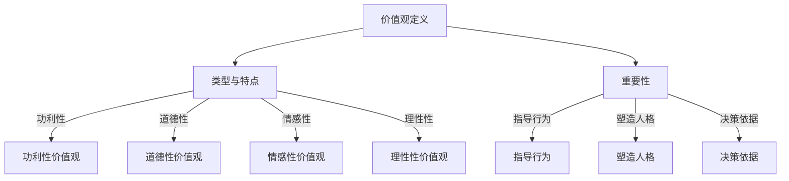
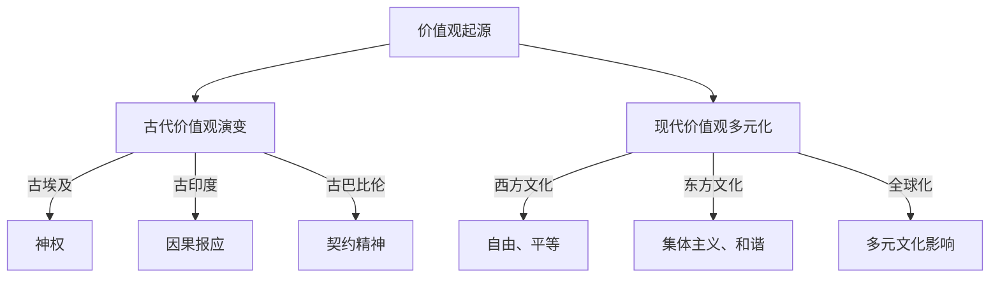
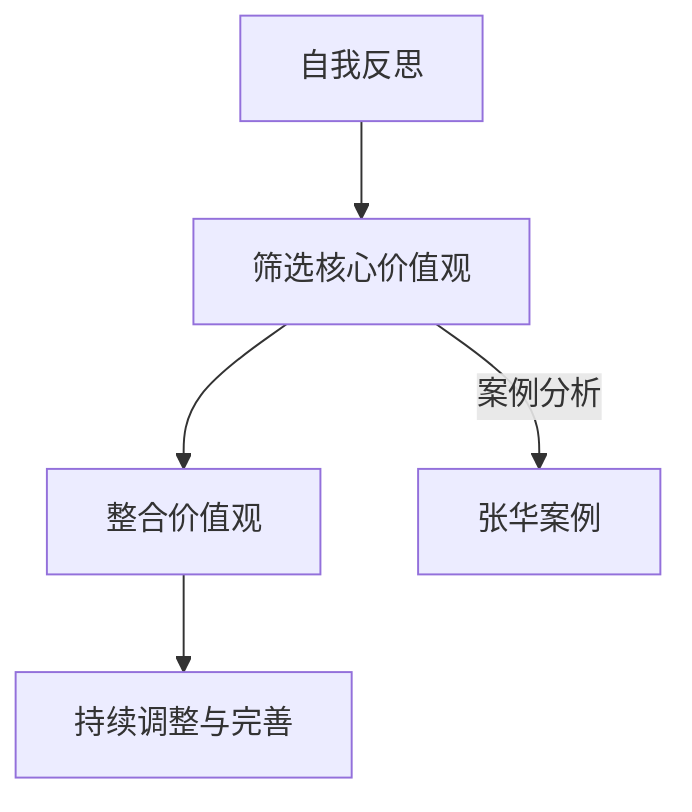
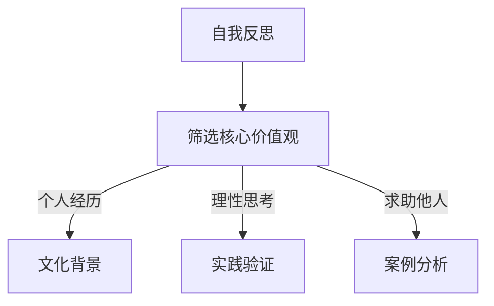
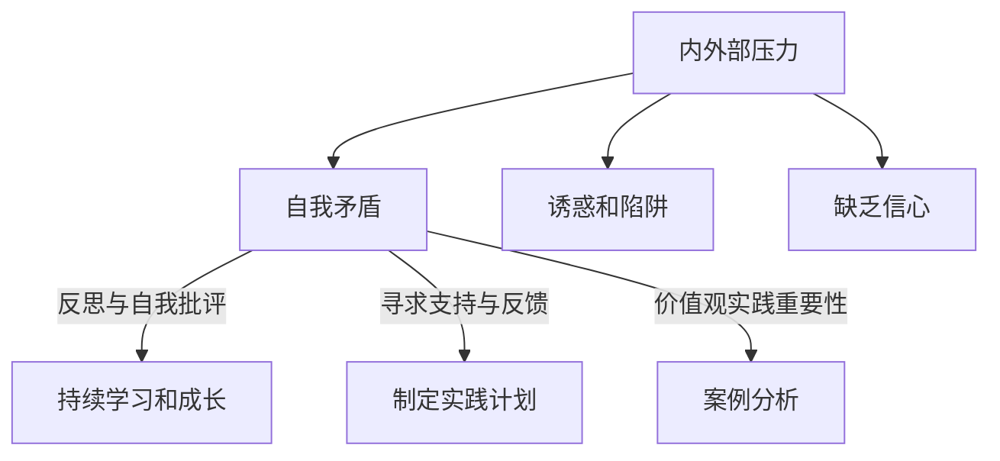
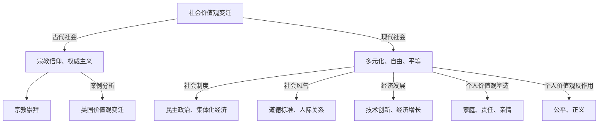
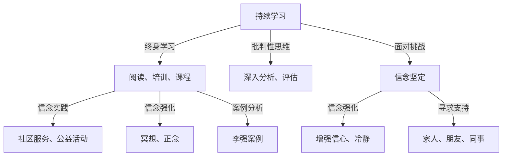
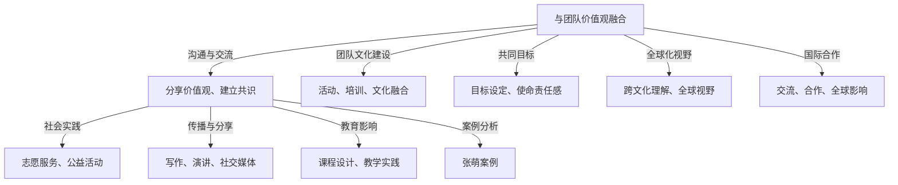
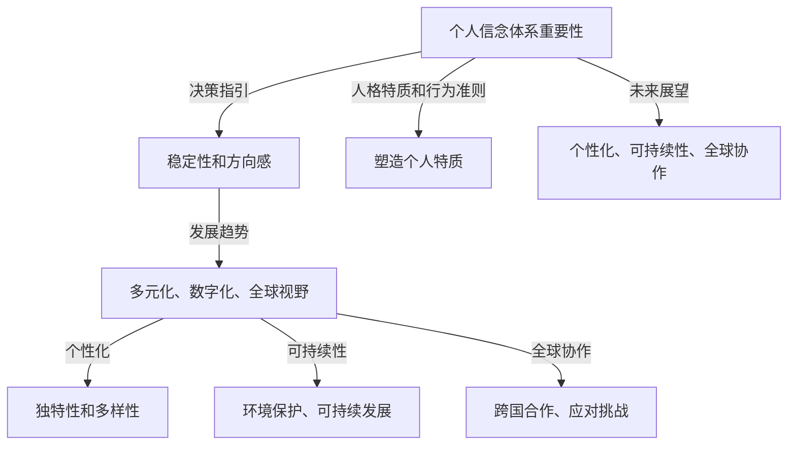

                 

### 建立个人信念体系：形成坚实的价值观基础

#### 关键词：价值观、信念体系、个人成长、决策、社会影响

> 在这个快速变化的时代，个人信念体系成为了我们面对复杂世界的指南针。本文将探讨如何建立个人信念体系，从而奠定坚实的价值观基础，为个人的成长与社会的发展提供强有力的支撑。

#### 摘要：

本文从价值观的起源与发展出发，详细解析了个人信念体系的构建过程。通过核心价值观的选择与实践，探讨了价值观在社会中的影响，并借助实际案例分析，提供了建立个人信念体系的指南。最后，本文强调了个人信念体系的巩固与拓展，为读者提供了在个人成长和社会责任中坚持信念的方法。

---

#### 目录：

##### 第一部分：价值观的起源与发展

##### 第1章：价值观的基本概念  
1.1.1 价值观的定义  
1.1.2 价值观的类型与特点  
1.1.3 价值观的重要性

##### 第2章：价值观的起源与历史演变  
2.1.1 价值观的起源  
2.1.2 古代价值观的演变  
2.1.3 现代价值观的多元化

##### 第3章：个人信念体系的构建  
3.1.1 个人信念体系的概念  
3.1.2 个人信念体系与价值观的关系  
3.1.3 建立个人信念体系的步骤

##### 第二部分：核心价值观的选择与实践

##### 第4章：核心价值观的确定  
4.1.1 核心价值观的筛选  
4.1.2 核心价值观的选择原则  
4.1.3 核心价值观的实践

##### 第5章：价值观的实践与调整  
5.1.1 价值观实践的挑战  
5.1.2 价值观的调整与完善  
5.1.3 价值观实践的重要性

##### 第6章：价值观在社会中的影响  
6.1.1 社会价值观的变迁  
6.1.2 价值观对社会的影响  
6.1.3 个人价值观与社会价值观的互动

##### 第7章：建立个人信念体系的案例分析  
7.1.1 案例分析1：成功建立个人信念体系的个体  
7.1.2 案例分析2：在价值观冲突中调整信念体系的案例  
7.1.3 案例分析3：建立个人信念体系对社会贡献的案例

##### 第三部分：个人信念体系的巩固与拓展

##### 第8章：个人信念体系的巩固  
8.1.1 持续学习的重要性  
8.1.2 个人信念体系的维护  
8.1.3 面对挑战时信念体系的坚定

##### 第9章：个人信念体系的拓展  
9.1.1 个人信念体系与团队价值观的融合  
9.1.2 个人信念体系对社会价值观的引导  
9.1.3 个人信念体系的全球化视野

##### 第10章：结论与展望  
10.1.1 个人信念体系的重要性  
10.1.2 个人信念体系的发展趋势  
10.1.3 对未来的展望

---

#### 引言：

在当今社会，个人信念体系的重要性愈发凸显。它不仅影响着个人的决策和成长，也在很大程度上塑造了社会的风貌。价值观是信念体系的基石，它们共同构成了我们的行为准则和人生哲学。因此，建立坚实的价值观基础，对于每个人来说都是至关重要的。

本文将围绕这一主题展开，首先探讨价值观的起源与发展，接着深入解析个人信念体系的构建。通过具体案例的分析，我们将了解如何选择和实践核心价值观，以及价值观在社会中的深远影响。最后，本文将提出个人信念体系的巩固与拓展策略，为读者提供全面的指导。

##### 第1章：价值观的基本概念

**1.1.1 价值观的定义**

价值观是指一个人或集体对于事物所持有的基本判断和评价标准。它涉及到人们对道德、生活、工作、学习等各个方面的看法和态度。价值观不仅仅是对某一具体事物的喜好或厌恶，而是对整个生活世界的根本认识。例如，诚信、尊重、责任等都是常见的价值观。

**1.1.2 价值观的类型与特点**

价值观可以分为以下几种类型：

- **功利性价值观**：以功利为导向，追求实际利益的最大化。
- **道德性价值观**：以道德规范为依据，强调正义、公平、仁爱等。
- **情感性价值观**：以情感体验为核心，追求个人的情感满足和幸福感。
- **理性性价值观**：以理性思考为基础，强调科学、逻辑和分析。

这些价值观各自有其特点，但它们并不是孤立存在的，很多时候会相互交织和影响。

**1.1.3 价值观的重要性**

价值观在我们的生活中扮演着至关重要的角色：

- **指导行为**：价值观决定了我们的行为选择，影响着我们日常的言行举止。
- **塑造人格**：一个人的价值观会影响其人格特质，塑造其性格和品质。
- **决策依据**：在面对复杂问题时，价值观为我们提供了判断和决策的依据。

因此，深入理解和建立正确的价值观，对于我们个人的成长和社会的发展都是至关重要的。

---

**Mermaid 流程图：**



---

通过上述章节，我们初步了解了价值观的定义、类型及其重要性。接下来，我们将探讨价值观的起源与历史演变，深入理解这一概念的历史背景和发展过程。

##### 第2章：价值观的起源与历史演变

**2.1.1 价值观的起源**

价值观的形成有着悠久的历史渊源，它起源于人类对自然界和社会现象的认知与理解。在原始社会，人们通过观察自然、模仿动物的行为来获取生存技能，这种对自然界的认知逐渐形成了原始的价值观。

随着社会的发展和文明的出现，价值观开始逐渐体系化和多样化。在古代，不同文明和文化的价值观各有特色，但都反映了当时社会的基本需求和信仰。例如，中国古代的儒家文化强调“仁爱”、“礼义”，而古希腊文化则崇尚“理性”和“自由”。

**2.1.2 古代价值观的演变**

古代社会的价值观经历了从简单到复杂、从单一到多元的演变过程。古代文明的兴起，如古埃及、古印度、古巴比伦等，都形成了自己独特的价值观体系。

- **古埃及**：古埃及文明崇尚神权，强调来世的永生，价值观以宗教为核心。
- **古印度**：古印度文明中的佛教和印度教对后世价值观产生了深远影响，强调因果报应、灵魂轮回等概念。
- **古巴比伦**：古巴比伦文明的法律体系奠定了现代法律的雏形，强调契约精神和公正。

这些古代价值观不仅影响了当时的社会结构和文化，也为后世价值观的发展提供了基础。

**2.1.3 现代价值观的多元化**

进入现代社会，随着全球化、信息化的推进，价值观呈现出更加多元化的趋势。现代社会的价值观不仅受到传统文化的影响，还受到现代科技、经济、政治等多种因素的影响。

- **西方文化**：在西方，自由、平等、民主等价值观占据主导地位，强调个体的权利和自由。
- **东方文化**：在东方，儒家文化、道家文化和佛教文化仍然影响着人们的价值观，强调集体主义、和谐与道德。

此外，现代社会的价值观也受到全球化和多元文化的影响，如环保意识、人权观念、女性权益等都在不断发展和演变。

**总结：**

价值观的起源与历史演变是一个复杂而多样的过程。从古代的简单到现代的多元，价值观的演变反映了人类社会的进步和文化的交融。了解这些历史背景和发展过程，有助于我们更好地理解和构建个人信念体系。

---

**Mermaid 流程图：**



---

在了解了价值观的起源与历史演变后，我们将深入探讨个人信念体系的构建，探究如何从众多价值观中筛选和确立核心价值观，并建立坚实的个人信念体系。

##### 第3章：个人信念体系的构建

**3.1.1 个人信念体系的概念**

个人信念体系是指一个人基于自身经历、教育、文化背景和价值观体系所形成的对世界和生活的总体认知。它不仅包括对事物的判断和评价，还涵盖了个人的行为准则、人生目标和决策方式。信念体系是个性化、稳定和持久的，对个体的行为具有指导意义。

**3.1.2 个人信念体系与价值观的关系**

价值观是信念体系的基础，但信念体系不仅仅是由价值观构成的。信念体系还包括对个人信仰、人生观、世界观的理解和认知。价值观是信念体系的一部分，它们相互关联，共同构成一个整体。

- **价值观**：对事物的基本判断和评价标准，如诚信、尊重、责任等。
- **信念体系**：对价值观的理解、整合和应用，包括对生活的总体认知和行为准则。

例如，一个人可能认为诚信是非常重要的价值观，但这并不意味着他在生活中始终遵守诚信的原则。只有当诚信成为其信念体系的一部分，并体现在其日常行为中，它才真正成为信念体系的一部分。

**3.1.3 建立个人信念体系的步骤**

建立个人信念体系是一个系统性、持续性的过程，通常包括以下几个步骤：

1. **自我反思**：通过反思自己的行为、经历和内心感受，了解自己的价值观和行为模式。这一步是建立信念体系的基础，需要诚实地面对自己，挖掘内心的真实想法和感受。

2. **筛选核心价值观**：在众多价值观中，筛选出对个人影响最大、最具指导性的核心价值观。这一步需要运用批判性思维，对不同的价值观进行评估和比较，选择对自己最有意义的价值观。

3. **整合价值观**：将筛选出的核心价值观整合进信念体系中，使其成为信念体系的一部分。这一步需要将价值观与个人的行为、决策和人生目标相结合，确保价值观在实际生活中得到贯彻。

4. **持续调整与完善**：信念体系并非一成不变的，它需要随着个人的成长和环境的变化进行调整和完善。这一步需要持续地反思和评估信念体系的有效性，确保其始终符合个人的需求和价值观。

**案例分析：**

张华是一名年轻的程序员，他通过自我反思，发现自己对创新、效率和技术进步非常看重。因此，他将“创新”、“效率”和“技术进步”作为自己的核心价值观。在日常生活中，张华努力将这三个价值观体现在自己的工作和技术学习中，不断追求技术上的突破和效率的提升。随着时间的推移，张华的信念体系不断完善，为他个人和职业发展提供了强大的动力。

**总结：**

个人信念体系的建立是一个复杂而重要的过程。通过自我反思、筛选核心价值观和持续调整，我们可以构建一个坚实而个性化的信念体系，为个人的成长和社会的发展提供坚实的支撑。

---

**Mermaid 流流程图：**



---

通过第3章的学习，我们了解了个人信念体系的概念、与价值观的关系以及建立信念体系的步骤。接下来，我们将深入探讨核心价值观的选择和确立，探讨如何从众多价值观中筛选出对个人最有意义的价值观。

##### 第4章：核心价值观的确定

**4.1.1 核心价值观的筛选**

核心价值观的筛选是建立个人信念体系的关键步骤。在这个过程中，我们需要从众多的价值观中挑选出对个人影响最深、最具指导性的价值观。以下是筛选核心价值观的几个原则：

1. **自我认同**：筛选的价值观应该与个人的价值观和信仰相符，能够体现个人的自我认同和内在需求。
2. **影响力**：核心价值观应该是对个人行为和决策具有深远影响的价值观，它们应该能够在关键时刻引导个人的选择。
3. **普遍性**：核心价值观应该具有普遍性，即不仅在个人层面重要，在更广泛的社会和文化背景下也具有重要意义。
4. **持续性**：核心价值观应该是持久的，不会因为一时的情绪波动或环境变化而改变。

**4.1.2 核心价值观的选择原则**

在选择核心价值观时，以下原则可以提供指导：

1. **个人经历**：个人的经历和成长历程对核心价值观的形成具有重要影响。通过对个人经历的反思，可以识别出对自己影响最大的价值观。
2. **文化背景**：个人的文化背景和家庭环境也是核心价值观形成的重要因素。了解自己的文化背景可以帮助我们更好地理解核心价值观的来源。
3. **理性思考**：在选择核心价值观时，需要运用理性思考，对不同的价值观进行评估和比较，确保选择最符合个人需求和价值观的价值观。
4. **实践验证**：核心价值观的选择需要在实践中得到验证。通过观察这些价值观在实际生活中的应用和效果，可以进一步确认它们的重要性。

**4.1.3 核心价值观的实践**

确定了核心价值观之后，接下来的任务是将其融入到日常生活中，并在实践中不断完善。以下是几个实践核心价值观的建议：

1. **日常反思**：定期反思自己的行为和决策，评估是否符合核心价值观。通过自我反思，可以更好地理解核心价值观的内涵，并在实践中不断改进。
2. **行为训练**：通过行为训练，将核心价值观转化为日常行为习惯。例如，如果核心价值观包括“诚信”，可以通过坚持诚实和透明的行为来培养诚信的习惯。
3. **设定目标**：将核心价值观与个人目标相结合，设定与核心价值观一致的生活和工作目标。这样的目标不仅有助于实现个人成长，还能强化核心价值观的实践。
4. **求助他人**：与他人交流和分享自己的核心价值观，获取他人的反馈和建议。这有助于我们更全面地理解核心价值观的内涵，并在实践中得到更多的支持和鼓励。

**案例分析：**

李明是一名大学生，他在自我反思和理性思考的基础上，确定了“学习”、“创新”和“团队合作”作为自己的核心价值观。他将这些价值观融入到学习和生活中，通过设定学术目标、参与创新项目和团队合作活动，不断提升自己的能力和价值观的实践。随着时间的推移，李明的信念体系不断完善，为他未来的职业发展奠定了坚实的基础。

**总结：**

核心价值观的确定是建立个人信念体系的关键。通过自我反思、文化背景分析和理性思考，我们可以筛选出对个人最有意义的价值观。在实践中，将这些价值观融入日常生活，并通过反思、行为训练和目标设定来不断完善和强化。这样，我们才能建立起一个坚实而具有指导意义的核心价值观体系。

---

**Mermaid 流程图：**



---

通过第4章的讨论，我们了解了核心价值观的筛选原则和选择方法，并探讨了如何将核心价值观融入到日常生活中。接下来，我们将深入探讨价值观的实践与调整，如何在实际生活中不断优化和强化核心价值观。

##### 第5章：价值观的实践与调整

**5.1.1 价值观实践的挑战**

在将核心价值观融入日常生活时，我们可能会面临一系列挑战：

1. **内外部压力**：社会和文化环境、家庭和工作压力等外部因素可能会影响我们价值观的实践。例如，面对同事的不诚实行为，我们可能会因压力而选择妥协。
2. **自我矛盾**：个人的核心价值观之间可能存在矛盾，导致实践中的困境。例如，一方面我们强调“创新”，另一方面又害怕失败。
3. **诱惑和陷阱**：生活中充满了各种诱惑，如物质享受、社交活动等，这些可能会分散我们的注意力和价值观的实践。
4. **缺乏信心**：在实践核心价值观时，我们可能会感到不确定和缺乏信心，尤其是在面对困难和挑战时。

**5.1.2 价值观的调整与完善**

为了克服这些挑战，我们需要不断调整和完善价值观：

1. **反思与自我批评**：定期反思自己的行为和决策，识别出与核心价值观不符的地方，进行自我批评和调整。
2. **持续学习和成长**：通过学习和培训，不断提升自己的知识和技能，增强对核心价值观的信心和实践能力。
3. **寻求支持与反馈**：与家人、朋友和同事交流，获取他们的支持和反馈。他们的观点和建议可以帮助我们更好地理解和实践核心价值观。
4. **制定实践计划**：制定具体的实践计划，将核心价值观融入到日常工作和生活中。例如，设定每天进行一定时间的阅读和学习，定期参与创新项目等。

**5.1.3 价值观实践的重要性**

价值观的实践不仅对个人的成长具有重要意义，也对社会的发展产生深远影响：

1. **个人成长**：通过实践核心价值观，我们能够塑造积极的人格特质，提升自我价值和幸福感。
2. **团队协作**：在团队中，共同的核心价值观可以增强团队凝聚力，提高协作效率。
3. **社会进步**：核心价值观的广泛实践有助于构建公正、和谐的社会，推动社会的进步和发展。

**案例分析：**

小王是一名公司高管，他非常重视“诚信”和“责任”的核心价值观。在职业生涯中，他始终坚持诚信的原则，即使在面对巨大的利益诱惑时也不妥协。同时，他鼓励团队成员也秉持这些价值观，通过制定明确的规章制度和激励机制，营造了一个诚信和责任的文化氛围。这种文化不仅提升了公司的整体业绩，也为员工创造了良好的工作环境。

**总结：**

价值观的实践与调整是一个持续的过程，我们需要面对各种挑战，通过反思、学习和实践来不断完善核心价值观。通过价值观的实践，我们不仅能够实现个人成长，还能为社会的发展贡献力量。

---

**Mermaid 流程图：**



---

通过第5章的学习，我们了解了价值观实践中的挑战以及如何进行价值观的调整与完善。接下来，我们将探讨价值观在社会中的影响，分析价值观如何塑造社会风貌和推动社会发展。

##### 第6章：价值观在社会中的影响

**6.1.1 社会价值观的变迁**

社会价值观的变迁是社会发展的一个重要方面，它受到历史、文化、经济等多方面因素的影响。在不同的历史时期，社会价值观会有不同的表现：

- **古代社会**：在古代社会，宗教信仰和权威主义是社会价值观的主要组成部分。例如，古埃及社会强调对神权的崇拜，古希腊社会则强调理性思考和个人的自由。
- **现代社会**：在现代社会，随着科技的发展和全球化的推进，社会价值观变得更加多元化和复杂化。自由、平等、民主等价值观成为现代社会的基本原则，而环保、人权、科技伦理等新兴价值观也逐渐得到重视。

**6.1.2 价值观对社会的影响**

价值观对社会的影响是深远而多方面的，主要体现在以下几个方面：

1. **社会制度**：价值观对社会的制度设计和社会规范具有决定性影响。例如，自由民主的价值观推动了现代民主政治制度的发展，而集体主义的价值观则促进了集体化经济模式的出现。
2. **社会风气**：价值观对社会风气和道德标准具有塑造作用。一个重视诚信和责任感的社会，其成员的行为会普遍更加规范和正直。
3. **人际关系**：价值观影响人与人之间的互动方式。例如，尊重他人和公平正义的价值观有助于建立和谐的人际关系。
4. **经济发展**：价值观对经济发展方向和模式具有指导作用。一个创新和竞争精神浓厚的社会，往往会促进经济的快速增长和技术创新。

**6.1.3 个人价值观与社会价值观的互动**

个人价值观与社会价值观之间存在互动和相互影响的关系：

1. **社会价值观对个人价值观的塑造**：社会价值观通过教育、文化、媒体等渠道对个人的价值观产生深远影响。例如，一个强调家庭价值观的社会，其成员可能会更加重视家庭责任和亲情。
2. **个人价值观对社会价值观的反作用**：个人的价值观也会反过来影响社会价值观。当越来越多的个人认同并实践某种价值观时，这种价值观可能会在社会中占据主导地位，从而推动社会价值观的变迁。

**案例分析：**

在20世纪初期，美国社会的价值观以个人主义和自由市场为主。这种价值观推动了美国经济的快速发展，但也带来了一些社会问题，如贫富差距的扩大和工人的权益得不到保障。随着时间的发展，美国社会逐渐开始重视公平和正义，通过立法和政策调整，逐步缩小贫富差距，保障工人权益。这种价值观的转变不仅改善了美国的社会环境，也为经济的可持续发展奠定了基础。

**总结：**

价值观在社会中的影响是深远而多方面的。社会价值观的变迁受到历史、文化、经济等多种因素的影响，同时也会对个人价值观产生塑造作用。个人价值观与社会价值观的互动和相互影响，推动了社会的进步和发展。

---

**Mermaid 流程图：**



---

通过第6章的探讨，我们了解了社会价值观的变迁及其对社会和个人价值观的影响。接下来，我们将通过实际案例来分析个人信念体系的建立过程，提供具体的实践指导和借鉴。

##### 第7章：建立个人信念体系的案例分析

**7.1.1 案例分析1：成功建立个人信念体系的个体**

**案例介绍**：

李华是一名年轻的技术创业者，他在创业初期就明确了自己的核心价值观：创新、诚信和团队合作。他坚信这些价值观能够帮助他在激烈的市场竞争中脱颖而出。

**具体实践**：

- **创新**：李华不断追求技术创新，通过研发新产品和改进现有产品，提升了公司的市场竞争力。他鼓励团队成员大胆尝试，即使失败也从中吸取教训。
- **诚信**：李华始终坚持以诚信为本，对待客户和合作伙伴始终真诚透明。这种诚信赢得了客户的信任，为公司的长期发展奠定了基础。
- **团队合作**：李华重视团队合作，通过建立开放的沟通机制和协作文化，提升了团队的整体效率和凝聚力。

**效果与启示**：

李华的成功证明了个人信念体系在实践中的重要性。他的核心价值观不仅指导了个人行为，也成为了团队和企业文化的核心。这种信念体系帮助他在创业过程中克服了重重困难，最终取得了显著的成功。

**7.1.2 案例分析2：在价值观冲突中调整信念体系的案例**

**案例介绍**：

王强是一名年轻的公务员，他在职业生涯中面临着频繁的价值观冲突。一方面，他坚信公平和正义是公务员职业的核心价值观；另一方面，在实际工作中，有时需要做出妥协以应对复杂的社会关系。

**具体实践**：

- **价值观冲突**：在一次项目评估中，王强发现一个同事存在不公平行为，但为了避免引起更大的冲突，他选择保持沉默。
- **调整信念体系**：意识到这种妥协不利于个人价值观的实践后，王强决定进行信念体系的调整。他重新审视自己的核心价值观，将其更加具体化和明确化，如“坚守原则、勇于挑战、追求正义”。

**效果与启示**：

王强的案例表明，在价值观冲突中，及时调整信念体系是必要的。通过明确和坚守核心价值观，他不仅提升了个人职业道德，也增强了在工作中的信心和决策能力。

**7.1.3 案例分析3：建立个人信念体系对社会贡献的案例**

**案例介绍**：

张琳是一名环保志愿者，她致力于推动环境保护事业。她的核心价值观是“关爱地球、承担责任”。

**具体实践**：

- **行动实践**：张琳通过组织环保活动和倡导环保理念，提高了公众对环境保护的意识。她积极参与植树造林、垃圾分类等环保项目，用实际行动践行自己的价值观。
- **社会影响**：张琳的环保活动得到了广泛的社会认可和支持，她的信念体系不仅影响了个人，也对整个社会产生了积极的影响。

**效果与启示**：

张琳的案例展示了个人信念体系对社会贡献的重要性。通过坚定的信念和实际行动，她不仅实现了个人价值，也为社会的可持续发展做出了贡献。

**总结**：

以上三个案例从不同角度展示了个人信念体系的建立和实践。无论是技术创业者、公务员还是环保志愿者，他们通过坚定的信念和实际行动，不仅实现了个人价值，也为社会做出了积极贡献。这些案例为我们提供了宝贵的经验和启示，帮助我们更好地理解和实践个人信念体系。

---

**Mermaid 流程图：**

```mermaid
graph TD
    A[案例分析1] -->|李华| B[核心价值观：创新、诚信、团队合作]
    B -->|具体实践| C[技术创新、客户信任、团队协作]
    C -->|效果与启示| D[成功经验：信念体系的重要性]
    A -->|案例分析2| E[王强| B[核心价值观：公平、正义]
    E -->|具体实践| F[价值观冲突、信念体系调整]
    F -->|效果与启示| G[调整信念体系的重要性]
    A -->|案例分析3| H[张琳| B[核心价值观：关爱地球、承担责任]
    H -->|具体实践| I[环保活动、社会影响]
    I -->|效果与启示| J[信念体系对社会贡献的重要性]
```

---

通过第7章的案例分析，我们了解了个人信念体系在不同场景下的实践和影响。接下来，我们将探讨如何巩固和拓展个人信念体系，以应对复杂多变的社会环境。

##### 第8章：个人信念体系的巩固

**8.1.1 持续学习的重要性**

个人信念体系的巩固需要持续的学习和成长。在快速变化的社会环境中，新的知识和技能不断涌现，这要求我们不断更新自己的认知和信念体系。

**具体策略**：

1. **终身学习**：树立终身学习的观念，不断吸收新的知识和信息。通过阅读、培训、课程等方式，提升自己的知识储备和认知水平。
2. **批判性思维**：培养批判性思维能力，对所学知识进行深入分析和评估。通过批判性思维，我们可以更好地理解和应用新知识，同时保持信念体系的稳定性和适应性。

**8.1.2 个人信念体系的维护**

维护个人信念体系是巩固其有效性的关键。以下是一些维护策略：

1. **自我反思**：定期进行自我反思，审视自己的信念和行为是否符合核心价值观。通过自我反思，可以及时发现和纠正与信念体系不符的行为。
2. **信念实践**：将核心价值观融入到日常生活中，通过实际行动来体现和强化信念体系。例如，通过参与社区服务、公益活动等，实践对社会责任的承诺。

**8.1.3 面对挑战时信念体系的坚定**

在面临挑战和困境时，信念体系的坚定至关重要。以下是一些建议：

1. **信念强化**：通过信念强化训练，如冥想、正念等，增强内心的平静和坚定。信念强化可以帮助我们在压力和挑战面前保持冷静和理智。
2. **寻求支持**：在面临困境时，寻求家人、朋友和同事的支持和帮助。他们的鼓励和帮助可以增强我们的信心，帮助我们坚定信念。

**案例分析**：

李强是一名企业家，他在创业过程中面临了诸多挑战。然而，他始终坚定自己的核心价值观：创新、责任和诚信。通过持续学习和自我反思，他不断提升自己的能力和信念。在面对困境时，他坚信信念体系的力量，不断调整和优化自己的策略，最终取得了成功。

**总结**：

通过持续学习、自我反思和实践，我们可以巩固个人信念体系。在面对挑战时，坚定的信念体系不仅提供了指引，还能增强我们的信心和决心。因此，巩固个人信念体系是个人成长和发展的关键。

---

**Mermaid 流程图：**



---

通过第8章的探讨，我们了解了如何通过持续学习、自我反思和实践来巩固个人信念体系。接下来，我们将探讨个人信念体系的拓展，如何在更广泛的社会环境中发挥其作用。

##### 第9章：个人信念体系的拓展

**9.1.1 个人信念体系与团队价值观的融合**

个人信念体系不仅对个人成长至关重要，在团队环境中，它们也能发挥重要作用。将个人信念体系与团队价值观融合，可以提升团队凝聚力和协作效率。

**具体策略**：

1. **沟通与交流**：团队成员之间通过沟通和交流，分享个人信念体系，了解彼此的价值观。这有助于建立共同的价值观基础，促进团队内部的和谐与协作。
2. **团队文化建设**：将个人信念体系融入到团队文化中，通过团队活动、培训等方式，强化团队成员的信念共识。团队文化可以成为信念体系的有力支撑。
3. **共同目标**：设定与团队价值观相符的共同目标，将个人信念体系与团队目标相结合。这有助于增强团队成员的使命感和责任感。

**9.1.2 个人信念体系对社会价值观的引导**

个人信念体系不仅影响个人行为，还能对社会价值观产生积极引导作用。以下是一些建议：

1. **社会实践**：通过参与社会实践，如志愿服务、公益活动等，将个人信念体系融入到社会实践中，对社会价值观产生积极影响。
2. **传播与分享**：通过写作、演讲、社交媒体等方式，分享个人信念体系，传播积极的社会价值观。这有助于提高社会对正确价值观的认知和认同。
3. **教育影响**：在教育过程中，通过课程设计、教学实践等方式，将个人信念体系融入教育内容，引导年轻一代树立正确的价值观。

**9.1.3 个人信念体系的全球化视野**

在全球化的背景下，个人信念体系的拓展需要具备全球化的视野和思维方式。以下是一些建议：

1. **跨文化理解**：了解不同文化背景下的价值观，尊重和包容多元文化。这有助于我们在全球化环境中更好地融合个人信念体系和社会价值观。
2. **全球视野**：培养全球视野，关注全球问题和挑战，将个人信念体系与全球社会问题相结合。这有助于我们更好地理解和应对全球化的挑战。
3. **国际合作**：通过国际合作和交流，将个人信念体系融入到全球化的进程中。这有助于提升个人信念体系的影响力，推动全球社会的进步。

**案例分析**：

张萌是一名跨国公司的员工，她将自己的核心价值观：诚信、责任和创新融入到工作中。她在全球团队中积极沟通和交流，通过团队合作项目，将个人信念体系与团队价值观融合。同时，她参与国际公益活动，将个人信念体系与全球社会价值观相结合。这种拓展不仅提升了她的个人影响力，也为公司和社会带来了积极的变化。

**总结**：

通过融合团队价值观、引导社会价值观和拓展全球化视野，我们可以拓展个人信念体系的影响范围。这种拓展不仅有助于个人成长和社会发展，也为全球化的背景下的国际合作和进步提供了有力的支持。

---

**Mermaid 流程图：**



---

通过第9章的探讨，我们了解了个人信念体系如何通过融合团队价值观、引导社会价值观和拓展全球化视野来发挥更大的作用。接下来，我们将总结全文，强调个人信念体系的重要性，并展望未来的发展趋势。

##### 第10章：结论与展望

**10.1.1 个人信念体系的重要性**

个人信念体系是个体在面对复杂多变的世界时的重要指南。它不仅帮助我们做出明智的决策，还塑造了我们的人格特质和行为准则。一个坚实而清晰的信念体系，能够为我们在不确定的环境中提供稳定性和方向感。

**10.1.2 个人信念体系的发展趋势**

随着社会的进步和全球化的推进，个人信念体系的发展趋势呈现出以下几个特点：

1. **多元化**：随着文化交融和价值观的碰撞，个人信念体系越来越多元化。人们开始更加重视多元文化和包容性，追求在多元价值观中找到自己的平衡点。
2. **数字化**：随着数字化技术的发展，个人信念体系的表达和传播方式也在发生变革。通过社交媒体、在线教育等平台，个人信念体系可以更快、更广泛地传播和分享。
3. **全球视野**：全球化的背景下，个人信念体系需要具备全球视野。了解不同文化和价值观，尊重和包容多元文化，成为个人信念体系的重要发展趋势。

**10.1.3 对未来的展望**

在未来，个人信念体系的发展将更加注重个性化、可持续性和全球协作：

1. **个性化**：每个人都是独一无二的，未来的个人信念体系将更加注重个性化，体现个体的独特性和多样性。
2. **可持续性**：随着环保和可持续发展的重要性日益凸显，个人信念体系将更加关注环境保护和可持续发展，推动社会的可持续发展。
3. **全球协作**：在全球化的背景下，个人信念体系将更加注重全球协作，通过跨国合作和交流，共同应对全球性挑战。

**总结**：

个人信念体系是个人成长和社会发展的关键。通过持续学习和实践，我们可以建立和巩固个人信念体系。在未来，随着社会的发展，个人信念体系将变得更加多元化、数字化和全球化。因此，重视和培养个人信念体系，不仅对个人成长具有重要意义，也为社会的进步和可持续发展提供了强有力的支持。

---

**Mermaid 流程图：**



---

通过全文的探讨，我们深入了解了个人信念体系的构建、核心价值观的确定、价值观的实践与调整，以及信念体系在社会中的影响。这些内容为我们提供了一个全面的视角，帮助我们建立和巩固坚实的信念体系。让我们在未来的道路上，坚定信念，不断前行。

