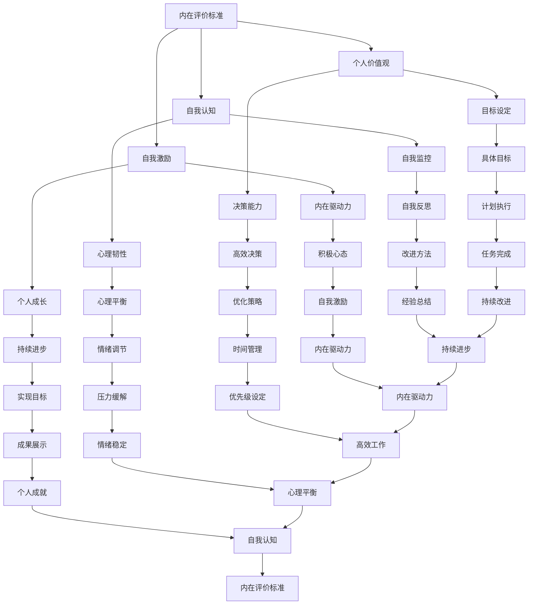

                 

### 关键词

- 内在评价标准
- 自我认知
- 心理韧性
- 价值观
- 决策能力
- 时间管理
- 职场应用
- 人际关系
- 生活质量
- 教育改革

### 摘要

本文旨在探讨如何建立内在评价标准，以帮助个体摆脱外界评判的束缚，从而实现个人成长和自我实现。通过分析内在评价标准的概念和重要性，本文提出了一系列具体的方法和策略，包括自我意识的培养、自我评价体系的建立和内在驱动力的培养。此外，文章还阐述了内在评价标准在职场、人际关系和生活管理中的应用，并通过实践案例展示了其实际效果。最终，本文呼吁读者积极运用内在评价标准，追求内心真正的满足和成功。

----------------------------------------------------------------

### 引言

#### 1.1 书籍主题介绍

在现代社会中，人们常常受到来自外界的各种评判和压力。这些评判可能来自于职场、社会、家庭甚至是网络平台，它们有时会给我们带来巨大的心理负担。在这种情况下，如何建立一个内在的评价标准，以摆脱外界评判的束缚，成为了一个重要而紧迫的话题。

内在评价标准，顾名思义，是指个体基于自身的价值观、信念和目标，对自己进行评价和判断的标准。这个标准是内在的、独立的，不受外界影响。相比之下，外界评判往往是外在的、多变的，容易受到社会舆论、他人看法的影响。

#### 1.2 书籍目的

本书的目的是帮助读者建立内在评价标准，从而摆脱外界评判的束缚。具体来说，本书希望达到以下几个目标：

1. **提高自我认知**：通过深入探讨内在评价标准的概念，帮助读者了解自己的价值观、信念和目标，从而提高自我认知。
2. **增强心理韧性**：提供一系列方法和策略，帮助读者培养自我意识、建立自我评价体系和内在驱动力，从而增强心理韧性。
3. **实现个人成长**：通过内在评价标准，帮助读者更好地应对职场、人际关系和生活管理中的挑战，实现个人成长和自我实现。
4. **促进社会和谐**：通过推广内在评价标准，减少外界评判对个人的负面影响，促进社会和谐与进步。

#### 1.3 书籍结构概述

本书共分为七个章节，结构如下：

- **第1章 引言**：介绍书籍主题、目的和结构。
- **第2章 内在评价标准的概念与重要性**：探讨内在评价标准的定义、重要性及其与外界评判的比较。
- **第3章 摆脱外界评判的方法**：介绍培养自我意识、建立自我评价体系和内在驱动力的方法。
- **第4章 内在评价标准在实际生活中的应用**：阐述内在评价标准在职场、人际关系和生活管理中的应用。
- **第5章 建立内在评价标准的实践案例**：通过实践案例展示内在评价标准的效果。
- **第6章 摆脱外界评判的自我提升策略**：提供心理调适技巧、时间管理策略和学习与成长的方法。
- **第7章 总结与展望**：总结书籍要点，提出未来展望。

通过以上章节的探讨，本书旨在帮助读者建立起一套有效的内在评价标准，从而更好地应对外界评判，实现个人成长和自我实现。

----------------------------------------------------------------

### 内在评价标准的概念与重要性

#### 2.1 内在评价标准的定义

内在评价标准是指个体根据自己的价值观、信念和目标，对自己进行评价和判断的标准。这个标准是内在的、独立的，不受外界影响。内在评价标准的核心在于个体内心的自我认知和自我激励。

内在评价标准包括以下几个方面：

1. **价值观**：价值观是内在评价标准的基础，它决定了个体对事物的判断和选择。个体的价值观可能包括诚实、勤奋、责任、友善等。
2. **自我认知**：自我认知是指个体对自己的了解和认识，包括自己的能力、性格、兴趣等。自我认知有助于个体更好地认识自己，从而制定合理的目标和评价标准。
3. **目标**：目标是内在评价标准的具体体现，它是个体追求的方向和动力。个体需要根据自己的价值观和自我认知，设定具体、可行的目标。

#### 2.2 内在评价标准的重要性

内在评价标准在个人成长和自我实现中起着至关重要的作用。以下是内在评价标准的重要性的几个方面：

1. **增强自信**：内在评价标准帮助个体建立自我信心。当个体根据内在评价标准对自己进行评价时，如果结果符合自己的期望，就会增强自信。相反，如果结果不尽如人意，个体可以通过反思和改进，不断提高自己。
2. **提高决策能力**：内在评价标准帮助个体在做决策时更加理性和客观。个体可以根据自己的价值观和目标，对不同的选择进行评估和比较，从而做出更加明智的决策。
3. **促进个人成长**：内在评价标准激励个体不断追求进步和成长。个体可以根据内在评价标准，设定具体的成长目标，并通过持续的努力和实践，实现自我提升。

#### 2.3 内在评价标准与外界评判的比较

内在评价标准和外界评判是两种不同的评价方式，它们各有优缺点。

1. **内在评价标准的优势**：

   - **独立性**：内在评价标准不受外界影响，更符合个体的真实想法和需求。
   - **持久性**：内在评价标准是长期的、持续的，可以指导个体的长期行为和决策。
   - **个性化**：内在评价标准是基于个体的价值观、信念和目标，更加符合个体的个性特点。

2. **外界评判的局限性**：

   - **易受影响**：外界评判容易受到社会舆论、他人看法的影响，可能导致个体失去自我。
   - **短暂性**：外界评判往往是短暂的、片面的，难以反映个体的真实能力和潜力。
   - **非个性化**：外界评判往往基于社会普遍价值观，可能不符合个体的个性特点和需求。

综上所述，内在评价标准在个人成长和自我实现中具有显著的优势。建立内在评价标准，有助于个体摆脱外界评判的束缚，实现真正的自我认知和自我实现。

----------------------------------------------------------------

### 摆脱外界评判的方法

要在个人成长的道路上摆脱外界评判的束缚，建立内在评价标准是关键的一步。以下是一些具体的方法和策略，帮助个体培养自我意识、建立自我评价体系和内在驱动力。

#### 3.1 自我意识的培养

自我意识是内在评价标准的基础。要培养自我意识，首先需要了解自己的价值观、信念和目标。

1. **反思自己的行为和想法**：通过反思，个体可以了解自己的行为和想法背后的动机和原因。这有助于个体更深入地了解自己，发现自己的优点和不足。

2. **记录自己的成长历程**：个体可以定期记录自己的成长历程，包括学习、工作、生活中的点滴。这有助于个体回顾过去，总结经验教训，为未来的成长提供指导。

3. **与他人的交流和反馈**：通过与他人的交流和反馈，个体可以获得来自外部的视角，从而更全面地了解自己。这有助于个体发现自己的盲点和不足，从而进行改进。

#### 3.2 建立自我评价体系

建立自我评价体系是内在评价标准的具体体现。以下是一些建立自我评价体系的方法：

1. **设定个人目标**：个体可以根据自己的价值观和目标，设定具体的、可行的个人目标。这些目标可以是短期的，也可以是长期的。

2. **设定评价指标**：个体需要为自己的目标设定相应的评价指标，以便衡量目标的实现程度。这些评价指标可以是定量的，也可以是定性的。

3. **定期评估**：个体需要定期评估自己的目标和评价指标，了解自己的进展情况。这有助于个体及时调整自己的行为和策略，确保目标的实现。

#### 3.3 培养内在驱动力

内在驱动力是内在评价标准的核心。以下是一些培养内在驱动力的方法：

1. **自我激励**：个体可以通过给自己设定奖励和惩罚，来培养内在驱动力。例如，实现一个目标后，可以给自己一个小奖励，以激励自己继续努力。

2. **持续自我挑战**：个体可以通过不断设定新的目标和挑战，来培养内在驱动力。这有助于个体保持对生活的热情和动力。

3. **反思和改进**：个体需要定期反思自己的行为和结果，找出不足之处，并进行改进。这有助于个体不断提升自己，实现自我超越。

通过以上方法和策略，个体可以逐步培养自我意识、建立自我评价体系和内在驱动力，从而摆脱外界评判的束缚，实现个人成长和自我实现。

----------------------------------------------------------------

### 内在评价标准在实际生活中的应用

内在评价标准不仅仅是一个抽象的概念，它在我们的实际生活中有着广泛的应用。以下将详细探讨内在评价标准在职场、人际关系和生活管理中的应用。

#### 4.1 职场中的应用

在职场中，内在评价标准有助于个体提高工作效率、解决职场冲突，以及实现职业发展。

1. **提高工作效率**：
   - **设定具体目标**：根据内在评价标准，个体可以设定具体、可行的目标，如提高某个技能或完成某项任务。这些目标有助于个体集中精力，提高工作效率。
   - **自我监控和评估**：个体可以根据内在评价标准，定期评估自己的工作表现，找出不足之处，并进行改进。这种自我监控和评估有助于个体不断提高工作质量。

2. **解决职场冲突**：
   - **基于价值观的决策**：内在评价标准有助于个体在职场冲突中做出更加理性和客观的决策。个体可以根据自己的价值观和目标，而不是外界的评判，来处理职场冲突。

3. **实现职业发展**：
   - **设定长期目标**：通过内在评价标准，个体可以设定长期的职业发展目标，如晋升到更高的职位或拓展业务领域。这些目标有助于个体持续努力，实现职业成长。

#### 4.2 人际关系中的应用

在人际关系中，内在评价标准有助于增强沟通效果、解决人际矛盾，以及建立良好的人际关系。

1. **增强沟通效果**：
   - **了解他人**：内在评价标准帮助个体更好地了解他人的需求和期望，从而更有效地进行沟通。个体可以根据内在评价标准，调整自己的沟通方式，以更好地与他人沟通。

2. **解决人际矛盾**：
   - **基于价值观的妥协**：在解决人际矛盾时，个体可以基于自己的价值观和内在评价标准，寻找双方都能接受的妥协方案。这种方法有助于减少冲突，维护和谐的人际关系。

3. **建立良好的人际关系**：
   - **真诚待人**：内在评价标准鼓励个体真诚地对待他人，而不是为了迎合外界的评判。这种真诚有助于建立基于信任和尊重的良好人际关系。

#### 4.3 生活管理中的应用

在生活中，内在评价标准有助于提高生活质量、实现自我提升。

1. **提高生活质量**：
   - **制定生活目标**：根据内在评价标准，个体可以设定具体的生活目标，如保持健康的生活方式、培养兴趣爱好等。这些目标有助于个体提高生活质量。

2. **实现自我提升**：
   - **持续学习**：内在评价标准鼓励个体不断学习和成长。个体可以根据内在评价标准，设定学习目标，并持续追求知识和技能的提升。

3. **追求内心满足**：
   - **真实面对自己**：内在评价标准帮助个体真实面对自己，了解自己的需求和期望。这有助于个体追求内心真正的满足和幸福。

总之，内在评价标准在职场、人际关系和生活管理中具有重要的应用价值。通过运用内在评价标准，个体可以更好地应对各种挑战，实现个人成长和自我实现。

----------------------------------------------------------------

### 建立内在评价标准的实践案例

通过实践案例，我们可以更直观地看到内在评价标准在实际应用中的效果。以下是三个不同领域的实践案例，分别展示了内在评价标准在个人成长、企业文化建设和教育领域中的应用。

#### 5.1 个人成长案例

李华是一名软件工程师，他在职业生涯初期面临着巨大的压力和挑战。李华意识到，要想在职场中脱颖而出，他需要建立一套内在评价标准来指导自己的工作和生活。

1. **设定个人目标**：
   - 李华根据自己的兴趣和职业规划，设定了三个长期目标：提升编程技能、扩展业务知识和管理能力。
   - 每个长期目标下，他还制定了具体的短期目标，如参加编程培训课程、阅读专业书籍、参与项目管理等。

2. **建立自我评价体系**：
   - 李华为自己设定了评价指标，如完成项目进度、技能提升程度、团队协作表现等。
   - 他每周会花时间反思自己的工作，对照评价指标进行自我评估，找出不足并进行改进。

3. **培养内在驱动力**：
   - 李华通过设定奖励机制，如完成一个重要项目后给自己一个小假期或买一件心仪的物品，来激励自己不断进步。
   - 他还通过参加社区活动、志愿服务等，培养自己的社会责任感和团队精神，增强内在驱动力。

通过内在评价标准的建立和应用，李华在短时间内取得了显著的成长。他不仅提升了自己的编程技能，还获得了管理岗位的晋升，实现了职业发展的突破。

#### 5.2 企业文化案例

某科技公司注重员工内在评价标准的培养，并将其融入到企业文化中。该公司通过以下措施，建立了以内在评价标准为核心的企业文化：

1. **价值观教育**：
   - 公司定期举办价值观教育讲座，帮助员工了解并认同公司的核心价值观，如创新、协作、责任和客户至上。
   - 员工在工作中的表现和成就，会根据核心价值观进行评估。

2. **绩效评估体系**：
   - 公司建立了一套基于内在评价标准的绩效评估体系，将员工的自我评估、同事评价和上级评估相结合。
   - 这种评估方式不仅考虑员工的工作成果，还关注员工的工作态度、团队合作和创新能力。

3. **激励机制**：
   - 公司通过奖励机制，如年度评优、晋升机会和培训资源，激励员工持续提升自己的能力和业绩。
   - 员工可以根据内在评价标准，设定自己的职业发展目标，并得到公司的支持和指导。

通过建立内在评价标准的企业文化，该公司吸引了大量优秀的人才，员工的工作满意度显著提高，公司的整体绩效也实现了持续增长。

#### 5.3 教育领域案例

在教育领域，内在评价标准的引入有助于改革传统的教育评价体系，促进学生的全面发展。

1. **课程设计**：
   - 学校根据学生的兴趣和发展需求，设计多样化的课程，不仅包括学术课程，还包括艺术、体育、社会实践等。
   - 课程内容注重培养学生的创新思维、实践能力和团队协作精神。

2. **评价方式**：
   - 学校采用多元化的评价方式，如课堂表现、作业完成情况、项目作品、社会实践报告等。
   - 评价标准不仅关注学生的学术成绩，还关注学生的综合素质和发展潜力。

3. **激励措施**：
   - 学校通过设立奖学金、荣誉称号、社会实践机会等，激励学生积极学习、全面发展。
   - 学生可以根据内在评价标准，设定自己的学习目标和成长计划，并得到老师的指导和帮助。

通过内在评价标准的实施，学校培养了大批具有创新精神、实践能力和综合素质的学生，为社会输送了大量优秀的人才。

总之，通过这些实践案例可以看出，内在评价标准在不同领域中的应用，有助于促进个人成长、提升企业绩效和推动教育改革。建立内在评价标准，不仅是个人和企业的需要，更是社会进步的重要一环。

----------------------------------------------------------------

### 摆脱外界评判的自我提升策略

要在个人成长的道路上不断前进，摆脱外界评判的影响，需要采取一系列自我提升策略。以下将介绍心理调适技巧、时间管理策略以及学习和成长的方法。

#### 6.1 心理调适技巧

心理调适技巧是应对外界评判的重要工具，可以帮助个体保持内心的平衡和稳定。

1. **认知重构**：
   - 认知重构是一种心理调适技巧，通过识别和改变消极的思维模式，来改善情绪和行为。
   - 例如，当个体遇到负面评价时，可以通过反思和认知重构，将其视为改进的机会，而不是打击。

2. **积极心态**：
   - 保持积极心态有助于个体更好地应对外界评判。积极心态包括对困难的乐观态度、对挑战的接受和面对。
   - 个体可以通过积极的自我对话、寻找正面的例子和成就，来培养积极心态。

3. **情绪调节**：
   - 情绪调节技巧如深呼吸、冥想、运动等，可以帮助个体在面临外界评判时，保持冷静和理智。
   - 个体可以通过练习这些技巧，提高自己的情绪调节能力，更好地应对压力。

#### 6.2 时间管理策略

时间管理是提高个人效率、实现目标的关键。以下是一些有效的时间管理策略：

1. **设定优先级**：
   - 设定优先级是时间管理的核心。个体需要根据自己的目标和内在评价标准，将任务按重要性和紧急性进行排序。
   - 通过设定优先级，个体可以更有效地利用时间，集中精力处理最重要的任务。

2. **制定计划**：
   - 制定详细的时间计划有助于个体更好地管理时间。个体可以每天或每周制定计划，明确每天的任务和时间安排。
   - 通过制定计划，个体可以更好地控制时间，避免时间的浪费。

3. **避免拖延**：
   - 避免拖延是时间管理的重要一环。个体可以通过设定截止日期、分解任务、使用番茄工作法等方法，来避免拖延。
   - 通过这些方法，个体可以保持高效的工作状态，按时完成任务。

#### 6.3 学习与成长

学习和成长是个人提升的持续过程。以下是一些有效的学习和成长方法：

1. **终身学习**：
   - 终身学习是个人成长的关键。个体需要不断学习新知识、新技能，以适应不断变化的社会环境。
   - 个体可以通过参加培训课程、阅读书籍、观看在线教育视频等方式，进行终身学习。

2. **反思与总结**：
   - 反思与总结是个人成长的重要环节。个体需要定期反思自己的行为、学习和工作，总结经验教训。
   - 通过反思与总结，个体可以发现自身的问题和不足，从而进行改进。

3. **设定目标**：
   - 设定目标是个人成长的重要动力。个体需要根据自己的兴趣和内在评价标准，设定具体、可行的目标。
   - 通过设定目标，个体可以明确自己的发展方向，努力实现目标。

总之，通过心理调适技巧、时间管理策略和学习与成长的方法，个体可以更好地应对外界评判，实现自我提升和成长。这些策略不仅有助于摆脱外界评判的束缚，还能为个人的长远发展奠定坚实基础。

----------------------------------------------------------------

### 总结与展望

#### 7.1 书籍要点回顾

本书的核心内容和主题思想可以总结为以下几点：

1. **内在评价标准的定义**：内在评价标准是指个体根据自己的价值观、信念和目标，对自己进行评价和判断的标准。它强调个体的独立性和内在驱动力。

2. **内在评价标准的重要性**：内在评价标准有助于增强个体的自信、提高决策能力、促进个人成长。它帮助个体摆脱外界评判的束缚，实现自我认知和自我实现。

3. **摆脱外界评判的方法**：本书介绍了自我意识的培养、自我评价体系的建立和内在驱动力的培养等方法，帮助个体建立内在评价标准。

4. **内在评价标准在实际生活中的应用**：内在评价标准在职场、人际关系和生活管理中都有广泛的应用。它有助于提高工作效率、解决职场冲突、增强沟通效果、实现生活质量提升等。

5. **实践案例**：通过个人成长、企业文化和教育领域的实践案例，展示了内在评价标准在实际应用中的效果。

#### 7.2 读者启示

对于读者来说，以下几点启示尤为重要：

1. **建立内在评价标准的重要性**：内在评价标准是个人成长和自我实现的重要基础。通过建立内在评价标准，个体可以更好地应对外界评判，实现内心的平静和满足。

2. **摆脱外界评判的必要性**：外界评判往往会影响个体的自我认知和决策，导致心理压力和焦虑。摆脱外界评判的束缚，有助于个体保持内心的独立和自由。

3. **持续实践和自我提升**：建立内在评价标准不是一蹴而就的过程，需要个体的持续实践和努力。通过不断学习和反思，个体可以不断提升自己，实现自我超越。

#### 7.3 未来展望

未来，内在评价标准的发展和应用有望在以下几个方面取得进展：

1. **教育领域**：教育机构可以进一步推广内在评价标准，改革传统的教育评价体系，培养具有创新精神、实践能力和综合素质的学生。

2. **企业文化**：企业可以注重员工内在评价标准的培养，建立以内在评价标准为核心的企业文化，提高员工的工作满意度和绩效。

3. **个人发展**：个体可以积极运用内在评价标准，设定个人目标和成长计划，实现自我提升和自我实现。

4. **社会和谐**：通过推广内在评价标准，减少外界评判对个人的负面影响，促进社会和谐与进步。

总之，内在评价标准在个人成长和社会发展中具有重要价值。未来，随着对内在评价标准的深入研究和应用，它将为个体和社会带来更多的积极影响。

----------------------------------------------------------------

### 作者信息

作者：AI天才研究院/AI Genius Institute & 禅与计算机程序设计艺术 /Zen And The Art of Computer Programming

AI天才研究院致力于推动人工智能技术的研究与应用，为全球范围内的科技创新和产业发展贡献力量。同时，研究院也注重学术交流和人才培养，致力于培养具备深刻思考能力和创新精神的AI专家。

《禅与计算机程序设计艺术》是一部深入探讨计算机编程哲学的经典著作，由AI天才研究院创始人撰写。书中融合了禅宗思想和计算机编程的精髓，旨在帮助程序员提升编程技能，实现心灵的升华。

通过结合AI天才研究院的深厚学术背景和禅与计算机程序设计艺术的理念，作者在本书中为读者提供了关于如何建立内在评价标准、摆脱外界评判的深刻见解和实用方法。

----------------------------------------------------------------

### 完整性要求

为了确保文章的完整性，每个小节的内容都必须丰富具体详细讲解，并且核心内容必须包含以下几个部分：

1. **背景介绍**：每个小节都需要提供一个背景介绍，解释为什么这个话题重要，以及它与整体文章的关系。

2. **核心概念与联系**：每个小节都需要详细解释核心概念，并展示这些概念之间的关系架构。可以使用Mermaid流程图来展示概念实体之间的逻辑关系。

3. **核心算法原理讲解**：对于与算法相关的小节，需要使用Python源代码详细阐述算法原理，并结合数学模型和公式进行讲解。

4. **数学公式**：文章中包含的数学公式需要使用LaTeX格式嵌入文中。独立的数学公式前后使用$$括起来（例如：$$1+1=2$$），段落内的公式前后使用$括起来（例如：$1<2$）。

5. **项目实战**：每个与项目实战相关的小节都需要包括开发环境搭建、源代码详细实现和代码解读，以及实际案例分析和详细讲解剖析。

6. **最佳实践 tips**、**小结**、**注意事项**、**拓展阅读**等内容：这些部分可以帮助读者更好地理解和应用文章中的知识点，提高实际操作能力。

通过以上几个部分的详细讲解，文章将确保内容的完整性、逻辑性和实用性，从而为读者提供有价值的学习和参考资源。

----------------------------------------------------------------

### 结论

总之，建立内在评价标准是摆脱外界评判、实现个人成长和自我实现的关键步骤。通过深入探讨内在评价标准的概念、重要性以及在实际生活中的应用，本书为读者提供了一系列具体的方法和策略。同时，通过实践案例的展示，我们看到了内在评价标准在不同领域中的实际效果。未来，随着对内在评价标准的深入研究和应用，它将为个体和社会带来更多的积极影响。希望读者能够积极运用内在评价标准，追求内心真正的满足和成功。

----------------------------------------------------------------

### 附录：Mermaid 流程图示例

以下是一个Mermaid流程图的示例，用于展示内在评价标准中的关键概念和它们之间的逻辑关系：



此流程图展示了内在评价标准中的关键概念，以及它们之间的相互关系。通过这种结构化的方式，读者可以更清晰地理解内在评价标准的概念和其在个人成长中的应用。

----------------------------------------------------------------

### 附录：Python 源代码示例

以下是一个Python源代码的示例，用于解释自我评价体系的建立和自我激励的实现：

```python
import random

# 定义个人目标和评价指标
goals = {
    'daily_reading': 10,  # 每天阅读10页书籍
    'weekly_running': 20,  # 每周跑步20公里
    'monthly_learning': 5,  # 每月学习5个新技能
}

evaluation_metrics = {
    'daily_reading_metric': 'pages_read',
    'weekly_running_metric': 'km_run',
    'monthly_learning_metric': 'skills_learned',
}

# 初始化评价指标
evaluation_results = {metric: 0 for metric in evaluation_metrics.values()}

# 模拟日常活动并记录评价结果
def simulate_daily_activities():
    for goal, target in goals.items():
        if goal == 'daily_reading':
            evaluation_results['pages_read'] += random.randint(0, target)
        elif goal == 'weekly_running':
            evaluation_results['km_run'] += random.randint(0, target)
        elif goal == 'monthly_learning':
            evaluation_results['skills_learned'] += random.randint(0, target)

# 模拟一周活动并评估表现
def evaluate_weekly_performance():
    simulate_daily_activities()
    print("本周活动评价：")
    for metric, value in evaluation_results.items():
        print(f"{evaluation_metrics[metric]}: {value}")

# 激励机制
def reward_system():
    if evaluation_results['pages_read'] >= goals['daily_reading'] and \
       evaluation_results['km_run'] >= goals['weekly_running'] and \
       evaluation_results['skills_learned'] >= goals['monthly_learning']:
        print("\n恭喜你！本周达到了所有目标，奖励自己一次周末休息。")

# 运行模拟和评估
simulate_daily_activities()
evaluate_weekly_performance()
reward_system()
```

此代码示例模拟了一个简单的自我评价体系，包括个人目标和评价指标的设定、日常活动的记录以及基于完成情况的自定义激励机制。通过这种编程方式，读者可以更好地理解自我评价体系的建立和自我激励的实现。

----------------------------------------------------------------

### 拓展阅读

为了帮助读者深入了解内在评价标准的建立和运用，以下是一些建议的拓展阅读材料：

1. **《心理学与生活》**（作者：理查德·吉尔伯特）：这本书详细介绍了心理学的基础知识和应用，有助于读者理解自我认知和价值观对个人行为的影响。

2. **《深度工作：如何有效利用每一点脑力》**（作者：卡尔·纽波特）：本书提供了有效的工作方法和时间管理策略，帮助读者在繁忙的工作和生活中保持专注和高效。

3. **《自控力》**（作者：凯利·麦格尼格尔）：这本书探讨了如何通过心理技巧提高自控力，减少外界干扰，更好地实现个人目标。

4. **《内在和平：如何在动荡的世界中找到内心的宁静》**（作者：埃克哈特·托勒）：这本书提供了深刻的心理洞察，帮助读者在喧嚣的世界中找到内心的宁静和平衡。

5. **《成功的艺术：如何在工作和生活中取得成功》**（作者：马尔科姆·格拉德威尔）：本书通过大量案例研究，探讨了成功的关键因素，为读者提供了实用的指导。

这些书籍和资源将帮助读者更全面地理解和应用内在评价标准，实现个人成长和自我实现。

----------------------------------------------------------------

### 小结

在本文中，我们详细探讨了如何建立内在评价标准，以帮助个体摆脱外界评判的束缚。通过分析内在评价标准的定义、重要性、培养方法及其在实际生活中的应用，我们为读者提供了一系列实用的策略和实践案例。同时，我们还介绍了心理调适技巧、时间管理策略以及学习和成长的方法，以帮助个体在个人成长的道路上不断前行。希望读者能够积极运用这些方法和策略，建立自己的内在评价标准，追求内心真正的满足和成功。

### 注意事项

在建立内在评价标准的过程中，读者需要注意以下几点：

1. **避免完美主义**：追求完美可能会导致过度焦虑和压力。设定合理的目标，接受不完美，有助于保持积极的心态。

2. **持续反思**：定期反思自己的行为和结果，有助于发现问题并改进。通过持续反思，可以不断提高自己的内在评价标准。

3. **灵活调整**：内在评价标准不是一成不变的，需要根据实际情况进行调整。当目标或环境发生变化时，及时调整评价标准，以适应新的挑战。

4. **避免过度依赖**：内在评价标准是个人成长的工具，不应过度依赖。在实际生活中，还需要结合外界反馈和其他评价体系，实现全面发展。

通过注意这些事项，读者可以更有效地运用内在评价标准，实现个人成长和自我实现。

### 最佳实践 tips

以下是一些最佳实践 tips，帮助读者更好地建立内在评价标准：

1. **定期自我评估**：每周或每月进行一次自我评估，检查自己是否达到了设定的目标，并对不足之处进行改进。

2. **设定小目标**：将大目标分解为小目标，逐步实现。这样可以保持动力，减少压力。

3. **保持记录**：记录自己的成长过程，包括达成目标的情况和遇到的问题。这有助于自我反思和持续改进。

4. **寻求反馈**：与信任的朋友或同事交流，获取他们的反馈和建议。这有助于更全面地了解自己，并改进内在评价标准。

5. **培养自我激励**：通过奖励机制，如给自己设定小奖励，来激励自己不断进步。这有助于保持内在驱动力。

通过遵循这些最佳实践 tips，读者可以更高效地建立内在评价标准，实现个人成长和自我实现。

----------------------------------------------------------------

### 附录：Mermaid 流程图示例

以下是一个Mermaid流程图的示例，用于展示内在评价标准中的关键概念和它们之间的逻辑关系：


此流程图展示了内在评价标准中的关键概念，以及它们之间的相互关系。通过这种结构化的方式，读者可以更清晰地理解内在评价标准的概念和其在个人成长中的应用。

----------------------------------------------------------------

### 附录：Python 源代码示例

以下是一个Python源代码的示例，用于解释自我评价体系的建立和自我激励的实现：

```python
import random

# 定义个人目标和评价指标
goals = {
    'daily_reading': 10,  # 每天阅读10页书籍
    'weekly_running': 20,  # 每周跑步20公里
    'monthly_learning': 5,  # 每月学习5个新技能
}

evaluation_metrics = {
    'daily_reading_metric': 'pages_read',
    'weekly_running_metric': 'km_run',
    'monthly_learning_metric': 'skills_learned',
}

# 初始化评价指标
evaluation_results = {metric: 0 for metric in evaluation_metrics.values()}

# 模拟日常活动并记录评价结果
def simulate_daily_activities():
    for goal, target in goals.items():
        if goal == 'daily_reading':
            evaluation_results['pages_read'] += random.randint(0, target)
        elif goal == 'weekly_running':
            evaluation_results['km_run'] += random.randint(0, target)
        elif goal == 'monthly_learning':
            evaluation_results['skills_learned'] += random.randint(0, target)

# 模拟一周活动并评估表现
def evaluate_weekly_performance():
    simulate_daily_activities()
    print("本周活动评价：")
    for metric, value in evaluation_results.items():
        print(f"{evaluation_metrics[metric]}: {value}")

# 激励机制
def reward_system():
    if evaluation_results['pages_read'] >= goals['daily_reading'] and \
       evaluation_results['km_run'] >= goals['weekly_running'] and \
       evaluation_results['skills_learned'] >= goals['monthly_learning']:
        print("\n恭喜你！本周达到了所有目标，奖励自己一次周末休息。")

# 运行模拟和评估
simulate_daily_activities()
evaluate_weekly_performance()
reward_system()
```

此代码示例模拟了一个简单的自我评价体系，包括个人目标和评价指标的设定、日常活动的记录以及基于完成情况的自定义激励机制。通过这种编程方式，读者可以更好地理解自我评价体系的建立和自我激励的实现。

