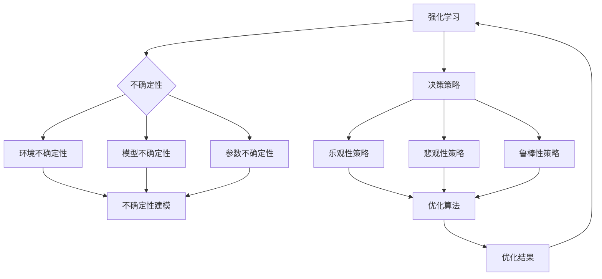

                 

### 核心概念与联系

在讨论强化学习优化推理过程中的不确定性决策策略时，我们首先需要理解几个核心概念，以及它们之间的关系。

#### 1. 强化学习

强化学习是一种机器学习范式，主要研究如何通过智能体（Agent）与环境的交互，学习到最优策略以实现目标。智能体在执行动作（Action）后，会接收到环境的反馈——奖励（Reward）。通过不断地试错和反馈，智能体逐渐优化其策略，使其在长期内能够最大化累积奖励。

#### 2. 不确定性

在强化学习过程中，不确定性是一个至关重要的因素。它来源于多个方面，包括但不限于：

- **环境不确定性**：环境的状态和奖励是不可预测的，外部因素如天气、交通状况等都会对环境产生影响。

- **模型不确定性**：智能体对环境的模型可能存在误差，这会导致预测不准确。

- **参数不确定性**：强化学习算法中的参数设置可能会影响学习效果。

#### 3. 决策策略

决策策略是智能体在面临不确定性时采取的行动方案。常见的决策策略包括：

- **乐观性策略**：倾向于探索未知领域，以获取更多信息。

- **悲观性策略**：倾向于保守行动，以避免高风险。

- **鲁棒性策略**：在不确定环境中保持平衡，寻求最优解。

#### 4. 强化学习与不确定性的关系

强化学习本质上是一种处理不确定性的方法。智能体通过与环境的交互，不断学习和调整策略，以适应不确定的环境。因此，强化学习中的不确定性处理是一个关键问题。

- **不确定性建模**：为了处理不确定性，强化学习算法通常需要对不确定性进行建模。例如，可以使用贝叶斯方法来表示不确定性。

- **不确定性决策策略**：在强化学习中，智能体需要根据不确定性来调整其决策策略。例如，在面临高不确定性的情况下，智能体可能会采取更保守的策略。

#### 5. 不确定性决策策略与优化

强化学习中的不确定性决策策略可以通过优化算法来进一步优化。例如，可以使用遗传算法、粒子群优化算法等智能优化算法来调整策略参数，以提高智能体的决策能力。

#### Mermaid 流程图

以下是一个简化的Mermaid流程图，展示了核心概念之间的关系：



通过这个流程图，我们可以清晰地看到强化学习、不确定性以及决策策略之间的相互关系。核心概念与联系为我们提供了理解和分析强化学习优化推理过程中不确定性决策策略的基础。

### 强化学习基础知识

#### 1.1 强化学习的基本概念

强化学习（Reinforcement Learning，RL）是一种机器学习范式，主要研究如何通过智能体（Agent）与环境的交互来学习最优策略，以实现某一目标。在这个过程中，智能体通过观察环境的状态（State）、执行动作（Action）并接收环境的奖励（Reward），从而不断优化其行为策略。

强化学习的基本概念包括以下几个核心要素：

- **智能体（Agent）**：强化学习中的主体，负责执行动作并接收环境反馈。
- **环境（Environment）**：智能体所处的环境，可以看作是一个状态转移机和奖励分配器。
- **状态（State）**：智能体在某一时刻所处的环境描述。
- **动作（Action）**：智能体可以执行的行为。
- **奖励（Reward）**：智能体在执行动作后从环境中获得的即时反馈。

强化学习与监督学习、无监督学习的主要区别在于：

- **监督学习**：输入输出对已知的训练数据集进行学习，目标是预测输出。
- **无监督学习**：在没有标注数据的情况下学习数据分布或模式。
- **强化学习**：通过与环境互动，不断调整策略以获得长期的最大化累积奖励。

#### 1.2 强化学习的核心元素

强化学习的核心元素包括智能体、环境、状态、动作和奖励。下面详细解释每个元素：

- **智能体（Agent）**：在强化学习过程中，智能体是执行动作并接收环境反馈的实体。智能体的目标是通过学习策略来最大化累积奖励。

- **环境（Environment）**：环境是智能体所处的物理或虚拟世界，可以看作是一个状态转移机和奖励分配器。环境的目的是对智能体的动作做出响应，提供状态转移和奖励反馈。

- **状态（State）**：状态是智能体在某一时刻所观察到的一切信息的集合。状态可以是离散的，如数字或符号，也可以是连续的，如图像或传感器数据。

- **动作（Action）**：动作是智能体可以执行的行为。动作的集合称为动作空间。每个动作都与特定的状态相关联，并可能导致状态转移和奖励。

- **奖励（Reward）**：奖励是智能体在执行动作后从环境中获得的即时反馈。奖励可以是正的（鼓励智能体继续执行该动作）或负的（提示智能体停止执行该动作）。

#### 1.3 强化学习的主要算法

强化学习有多种算法，其中最常用的包括Q-Learning、SARSA和Deep Q-Network（DQN）。下面简要介绍这些算法：

- **Q-Learning**：Q-Learning是一种值迭代算法，通过更新Q值（状态-动作值函数）来学习最优策略。Q-Learning的目标是找到一个策略，使得对于每个状态，执行最佳动作的Q值最大化。

  Q-Learning的公式如下：
  $$ Q(s, a) = \sum_{s'} P(s' | s, a) \cdot r(s', a) + \gamma \cdot \max_{a'} Q(s', a') $$
  
  其中，$Q(s, a)$ 是状态 $s$ 下执行动作 $a$ 的期望回报，$P(s' | s, a)$ 是状态转移概率，$r(s', a)$ 是状态 $s'$ 下执行动作 $a$ 的奖励，$\gamma$ 是折扣因子。

- **SARSA**：SARSA（同步优势估计和动作选择）是一种基于策略的强化学习算法，它通过更新策略来学习最优动作。SARSA的目标是选择一个策略，使得在当前状态下执行该策略的期望回报最大化。

  SARSA的公式如下：
  $$ \pi(s) = \begin{cases} 
  \arg\max_a Q(s, a) & \text{if } \sum_a \pi(s) Q(s, a) > 0 \\
  \text{randomly} & \text{otherwise}
  \end{cases} $$

- **Deep Q-Network（DQN）**：DQN是一种基于神经网络的强化学习算法，它使用深度神经网络来近似Q值函数。DQN的目标是学习一个神经网络，使其能够预测状态-动作值函数。

  DQN的公式如下：
  $$ Q(s, a; \theta) = \sum_{a'} \pi(a' | s; \theta) \cdot r(s', a') + \gamma \cdot \max_{a'} Q(s', a'; \theta) $$
  
  其中，$Q(s, a; \theta)$ 是神经网络参数 $\theta$ 对应的状态 $s$ 下执行动作 $a$ 的预测Q值，$\pi(a' | s; \theta)$ 是神经网络参数 $\theta$ 对应的策略。

#### 1.4 Q-Learning与SARSA的区别

Q-Learning和SARSA都是强化学习中的常见算法，但它们有一些重要的区别：

- **更新机制**：Q-Learning使用一种值迭代的方法来更新Q值，而SARSA使用同步优势估计来更新策略。
- **学习策略**：Q-Learning学习的是状态-动作值函数，而SARSA学习的是策略。
- **适用场景**：Q-Learning适用于具有离散状态和动作空间的场景，而SARSA适用于具有连续状态和动作空间的场景。

总的来说，Q-Learning和SARSA都是强化学习中重要的算法，选择哪种算法取决于具体的应用场景和学习目标。

### 马尔可夫决策过程（MDP）

#### 2.1 马尔可夫决策过程的定义

马尔可夫决策过程（Markov Decision Process，MDP）是一种数学模型，用于描述智能体在不确定环境中进行决策的过程。在MDP中，智能体通过执行一系列动作来与环境互动，每个动作都会导致状态的转移，并可能带来一定的奖励。MDP的核心特性是马尔可夫性，即未来的状态只依赖于当前状态，而与过去的状态无关。

MDP由四个元素组成：

- **状态空间（State Space）**：智能体所处的所有可能状态的集合。
- **动作空间（Action Space）**：智能体可以执行的所有可能动作的集合。
- **状态转移概率（State Transition Probability）**：智能体在某一状态下执行特定动作后，转移到下一个状态的概率。
- **奖励函数（Reward Function）**：智能体在执行动作后，从环境中获得的即时奖励。

#### 2.2 MDP的解法

解决MDP的主要目的是找到最优策略，使得智能体能够在不确定环境中获得最大的累积奖励。常见的MDP解法包括动态规划（Dynamic Programming，DP）和策略迭代（Policy Iteration）。

**1. 动态规划（DP）**

动态规划是一种递归的方法，通过将复杂的问题分解为更小的子问题，并利用子问题的解来求解原问题。在MDP中，动态规划通过构建价值函数（Value Function）来求解最优策略。

- **值迭代（Value Iteration）**：值迭代是一种从初始估计开始，逐步更新价值函数直到收敛的方法。其步骤如下：

  1. 初始化价值函数 $V^0(s)$，通常设置为所有状态的期望奖励。
  2. 对于每个状态 $s$，更新价值函数 $V^{t+1}(s) = \max_{a} [r(s, a) + \gamma \sum_{s'} P(s' | s, a) \cdot V^t(s')]$。
  3. 重复步骤 2，直到价值函数收敛。

- **策略迭代（Policy Iteration）**：策略迭代是一种从初始策略开始，逐步更新策略直到收敛的方法。其步骤如下：

  1. 初始化策略 $\pi^0$，通常为贪婪策略。
  2. 使用当前策略计算状态价值函数 $V^t(s) = \sum_{a} \pi^t(a | s) \cdot [r(s, a) + \gamma \sum_{s'} P(s' | s, a) \cdot V^{t-1}(s')]$。
  3. 根据当前状态价值函数更新策略 $\pi^{t+1}$ 为贪婪策略。
  4. 重复步骤 2 和 3，直到策略收敛。

**2. 价值函数**

在MDP中，价值函数是一种度量状态或策略好坏的指标。对于给定状态 $s$ 和策略 $\pi$，状态价值函数 $V^*(s)$ 表示在策略 $\pi$ 下从状态 $s$ 开始的最优累积奖励。动作价值函数 $Q^*(s, a)$ 表示在状态 $s$ 下执行动作 $a$ 的最优累积奖励。

- **状态价值函数（State-Value Function）**：$V^*(s) = \max_{\pi} \sum_{s'} P(s' | s, \pi) \cdot [r(s', \pi) + \gamma V^*(s')]$
- **动作价值函数（Action-Value Function）**：$Q^*(s, a) = \sum_{s'} P(s' | s, a) \cdot [r(s', a) + \gamma V^*(s')]$

**3. 策略迭代与值迭代的对比**

- **计算复杂度**：策略迭代通常比值迭代更高效，因为它只需要计算动作价值函数，而不是状态价值函数。
- **收敛性**：值迭代通常比策略迭代更快收敛，因为它直接更新价值函数，而不是策略。

#### 2.3 MDP在实际中的应用

马尔可夫决策过程在多个领域中都有广泛的应用：

- **资源优化**：在资源管理系统中，MDP可以用于优化资源的分配，如电力调度、网络流量管理。
- **排队系统**：MDP可以用于优化服务策略，如银行柜台服务、电话客服系统。
- **机器人路径规划**：MDP可以用于自主机器人路径规划，如无人机导航、自动驾驶汽车。
- **金融决策**：MDP可以用于金融市场的投资策略优化，如资产配置、风险控制。

总之，MDP作为一种强大的数学模型，在解决不确定环境下的决策问题时提供了有效的解决方案。

### 强化学习中的不确定性处理

在强化学习（Reinforcement Learning，RL）中，不确定性是一个不可忽视的重要因素。不确定性可以分为以下几类：

1. **环境不确定性（Environmental Uncertainty）**：环境的状态和奖励不可预测，这种不确定性可能来源于外部因素，如天气变化、交通状况等。
2. **模型不确定性（Model Uncertainty）**：智能体对环境的模型存在误差，可能导致预测不准确。
3. **参数不确定性（Parameter Uncertainty）**：强化学习算法中的参数设置可能影响学习效果，这种不确定性可能来自算法本身的随机性。

#### 3.1 不确定性建模方法

为了处理不确定性，强化学习算法通常需要对不确定性进行建模。以下是一些常见的不确定性建模方法：

**1. 贝叶斯强化学习（Bayesian Reinforcement Learning）**

贝叶斯强化学习是一种基于贝叶斯理论的强化学习方法，它通过概率模型来表示不确定性和不确定性决策。在贝叶斯强化学习中，状态转移概率和奖励函数被视为随机变量，而不是确定性的函数。

- **贝叶斯状态转移模型**：状态转移概率矩阵 $P(s'|s,a)$ 被建模为概率分布，如高斯分布。
- **贝叶斯奖励模型**：奖励函数 $R(s,a)$ 被建模为概率分布，如高斯分布。

贝叶斯强化学习的关键在于利用贝叶斯规则来更新概率分布，以适应环境的变化。

**2. 鲁棒性优化（Robust Optimization）**

鲁棒性优化是一种设计策略的方法，旨在使策略在面临不确定性的情况下仍然能够保持稳定和有效。在鲁棒性优化中，目标是找到一个策略，使得在最坏情况下的性能损失最小。

- **鲁棒性约束**：在优化过程中引入鲁棒性约束，如最大可能损失约束。
- **鲁棒性优化算法**：如线性规划（Linear Programming，LP）和混合整数规划（Mixed Integer Programming，MIP）。

**3. 模型不确定性处理**

在强化学习中，模型不确定性可以通过以下方法处理：

- **模型平均（Model Averaging）**：通过结合多个模型的预测来减少不确定性。例如，可以使用多个神经网络模型来预测状态转移和奖励，然后取它们的平均值作为最终预测。
- **模型融合（Model Fusion）**：将多个模型的预测结果进行融合，以获得更准确的预测。常见的方法包括加权平均、投票等。

**4. 参数不确定性处理**

在强化学习中，参数不确定性可以通过以下方法处理：

- **参数估计（Parameter Estimation）**：通过优化算法来估计参数值，如梯度下降、随机梯度下降等。
- **参数平滑（Parameter Smoothing）**：通过平滑参数的更新过程来减少波动，如使用指数平滑器。

#### 3.2 不确定性决策策略

在强化学习中，不确定性决策策略是智能体在面临不确定性时采取的行动方案。以下是一些常见的不确定性决策策略：

**1. 乐观性策略（Optimistic Policy）**

乐观性策略倾向于探索未知领域，以获取更多信息。常见的乐观性策略包括：

- **ε-贪心策略**：在执行动作时，以概率 $\epsilon$ 随机选择动作，以概率 $1-\epsilon$ 选择贪心动作。
- **UCB（Upper Confidence Bound）算法**：选择动作的期望回报加上一个置信区间，以鼓励探索未知动作。

**2. 悲观性策略（Pessimistic Policy）**

悲观性策略倾向于保守行动，以避免高风险。常见的悲观性策略包括：

- **ε-贪婪策略**：在执行动作时，以概率 $\epsilon$ 随机选择动作，以概率 $1-\epsilon$ 选择最小化损失的动作。
- **LCB（Lower Confidence Bound）算法**：选择动作的期望回报减去一个置信区间，以避免高风险动作。

**3. 鲁棒性策略（Robust Policy）**

鲁棒性策略旨在使策略在面临不确定性的情况下仍然能够保持稳定和有效。常见的鲁棒性策略包括：

- **平衡策略**：在探索和利用之间保持平衡，如平衡探索-利用策略（Balanced Exploration-Exploitation Policy）。
- **最大最小策略（Max-Min Policy）**：在所有可能动作中选择损失最小化的动作，以应对最坏情况。

总的来说，强化学习中的不确定性处理是一个复杂的问题，需要结合多种方法和策略来应对。通过合理地建模不确定性和设计决策策略，强化学习可以在面临不确定性的环境中实现有效的学习和决策。

### 强化学习中的不确定性决策策略

在强化学习（Reinforcement Learning，RL）中，不确定性是一个关键因素，因为它会影响智能体的决策过程和最终的表现。为了应对不确定性，智能体需要采用一系列不确定性决策策略。以下是一些常见的不确定性决策策略，包括乐观性策略、悲观性策略和鲁棒性策略。

#### 4.1 乐观性策略

乐观性策略旨在鼓励智能体探索未知领域，以获取更多信息。这些策略倾向于在决策时给予未知动作更高的权重，从而增加智能体的探索行为。

**1. ε-贪心策略（ε-Greedy Policy）**

ε-贪心策略是一种最简单的乐观性策略。在每次决策时，智能体以概率 $\epsilon$ 随机选择动作，以概率 $1-\epsilon$ 选择当前状态下期望回报最高的动作。

- **公式**：$a_t = \begin{cases}
    \text{随机选择} & \text{with probability } \epsilon \\
    \text{贪心选择} & \text{with probability } 1-\epsilon
\end{cases}$

**2. UCB（Upper Confidence Bound）算法**

UCB算法是一种基于统计学的方法，旨在通过平衡探索和利用来优化决策。UCB算法为每个动作计算一个上置信界（Upper Confidence Bound），并选择上置信界最高的动作。

- **公式**：$UCB(s, a) = \bar{X}_{sa} + \sqrt{\frac{2 \ln t_{sa}}{n_{sa}}}$

其中，$\bar{X}_{sa}$ 是动作 $a$ 在状态 $s$ 下的平均回报，$t_{sa}$ 是动作 $a$ 在状态 $s$ 下被选择的次数，$n_{sa}$ 是状态 $s$ 下动作 $a$ 被选择的次数。

#### 4.2 悲观性策略

悲观性策略旨在避免高风险行为，使智能体在不确定环境中保持保守。这些策略倾向于在决策时给予未知动作更低的权重，从而减少探索行为。

**1. ε-贪婪策略（ε-Greedy Policy）**

ε-贪婪策略与乐观性策略中的ε-贪婪策略类似，但这里ε的值通常较小，以减少探索行为。

- **公式**：$a_t = \begin{cases}
    \text{随机选择} & \text{with probability } \epsilon \\
    \text{最优选择} & \text{with probability } 1-\epsilon
\end{cases}$

**2. LCB（Lower Confidence Bound）算法**

LCB算法是一种基于统计学的方法，通过计算每个动作的下置信界（Lower Confidence Bound）来选择动作。LCB算法选择下置信界最小的动作，以避免高风险行为。

- **公式**：$LCB(s, a) = \bar{X}_{sa} - \sqrt{\frac{2 \ln t_{sa}}{n_{sa}}}$

#### 4.3 鲁棒性策略

鲁棒性策略旨在设计一个能够在不确定环境中保持稳定和有效决策的策略。这些策略通常结合了乐观性和悲观性的特点，以平衡探索和利用。

**1. 平衡策略（Balanced Policy）**

平衡策略在决策时同时考虑探索和利用。一个常见的平衡策略是平衡探索-利用策略（Balanced Exploration-Exploitation Policy），它通过在每次决策时以固定的概率 $1-\epsilon$ 选择当前最优动作，以概率 $\epsilon$ 随机选择动作来实现平衡。

- **公式**：$a_t = \begin{cases}
    \text{最优选择} & \text{with probability } 1-\epsilon \\
    \text{随机选择} & \text{with probability } \epsilon
\end{cases}$

**2. 最大最小策略（Max-Min Policy）**

最大最小策略旨在设计一个能够在最坏情况下表现最优的策略。它通过在每个状态下选择最小化最大可能损失的动作来实现鲁棒性。

- **公式**：$a_t = \arg\min_a \max_{s'} \{r(s', a) + \gamma \max_{a'} \{r(s'', a') + \gamma \cdot \ldots + \gamma^{n-1} r(s_n, a_n)\}\}$

其中，$r(s', a)$ 是在状态 $s'$ 下执行动作 $a$ 的即时奖励，$\gamma$ 是折扣因子。

总的来说，强化学习中的不确定性决策策略是一个复杂的课题，不同策略各有优缺点。在实际应用中，根据具体问题和环境特点选择合适的策略至关重要。

### 强化学习在实际应用中的不确定性处理

在强化学习（Reinforcement Learning，RL）的实际应用中，不确定性处理是一个关键问题。以下我们将讨论强化学习在机器人控制、金融领域和智能交通等领域的应用，并详细探讨这些应用中如何处理不确定性。

#### 5.1 不确定性在机器人控制中的应用

在机器人控制领域，不确定性主要来源于环境的不确定性、传感器的不确定性和控制系统的非线性。以下是一些基于强化学习的方法，用于处理这些不确定性：

**1. 基于强化学习的无人机路径规划**

无人机路径规划需要在动态环境中避免障碍物并到达目标。基于强化学习的方法，如DRL（深度强化学习）和PPO（Proximal Policy Optimization），可以用来训练无人机如何规划路径。

- **方法**：使用DRL算法训练无人机模型，使其能够在不同的环境条件下自适应地规划路径。例如，使用DQN（Deep Q-Network）算法来训练无人机，使其在执行路径规划任务时能够处理环境的不确定性。
- **挑战**：在复杂的动态环境中，如何保证无人机路径规划的鲁棒性和安全性是一个挑战。

**2. 基于强化学习的机器人避障**

在机器人避障中，机器人需要在复杂环境中识别并避开障碍物。强化学习算法，如SARSA（同步优势估计和动作选择）和DRL，可以用来训练机器人如何应对不确定性。

- **方法**：使用SARSA算法训练机器人模型，使其能够在不确定环境中学习并优化避障策略。DRL算法，如PPO，可以用于处理更复杂的避障问题。
- **挑战**：如何在不确定性环境中训练出既高效又安全的避障策略是一个重要挑战。

#### 5.2 不确定性在金融领域的应用

在金融领域，不确定性主要来源于市场波动、政策变化和宏观经济环境。以下是一些基于强化学习的方法，用于处理这些不确定性：

**1. 基于强化学习的资产配置策略**

资产配置策略旨在根据投资者的风险偏好和市场条件来分配资产。强化学习算法可以用来优化资产配置策略，以应对市场不确定性。

- **方法**：使用Q-Learning算法训练资产配置模型，使其能够根据市场数据和投资者的风险偏好，动态调整资产配置策略。DRL算法，如PPO，可以用于处理更复杂的资产配置问题。
- **挑战**：如何平衡短期收益和长期风险，以及如何在不确定的市场环境中保持投资策略的稳定性。

**2. 基于强化学习的风险控制策略**

风险控制策略旨在管理投资组合的风险，以避免重大损失。强化学习算法可以用来设计风险控制策略，以应对市场不确定性。

- **方法**：使用SARSA算法训练风险控制模型，使其能够根据市场变化和投资组合状态，动态调整风险控制策略。DRL算法，如PPO，可以用于处理更复杂的风险控制问题。
- **挑战**：如何在不确定性市场中有效地管理风险，以及如何在不同的市场条件下保持策略的一致性。

#### 5.3 不确定性在智能交通领域的应用

在智能交通领域，不确定性主要来源于交通流量、路况信息和车辆行为。以下是一些基于强化学习的方法，用于处理这些不确定性：

**1. 基于强化学习的智能交通信号控制**

智能交通信号控制旨在优化交通流量，减少拥堵。强化学习算法可以用来训练交通信号控制器，使其能够根据交通状态动态调整信号配时。

- **方法**：使用DRL算法训练交通信号控制器模型，使其能够在不同的交通条件下优化信号配时。例如，使用PPO算法训练交通信号控制器，使其能够处理复杂的交通不确定性。
- **挑战**：如何在不同的交通条件下保持信号控制策略的鲁棒性和效率。

**2. 基于强化学习的自动驾驶**

自动驾驶系统需要在复杂、动态的交通环境中自主行驶。强化学习算法可以用来训练自动驾驶系统，使其能够应对交通不确定性。

- **方法**：使用DRL算法训练自动驾驶模型，使其能够根据道路状况和交通信息，动态调整行驶策略。例如，使用PPO算法训练自动驾驶汽车，使其能够在不确定性环境中安全行驶。
- **挑战**：如何在复杂的交通环境中确保自动驾驶系统的安全性和鲁棒性。

总的来说，强化学习在实际应用中面临着处理不确定性的挑战。通过合理地设计强化学习算法和应用策略，可以有效地应对这些挑战，实现智能体的自适应和优化行为。

### 强化学习优化算法

在强化学习（Reinforcement Learning，RL）中，优化算法扮演着至关重要的角色，它直接影响智能体的学习速度、决策能力和最终性能。优化算法的主要目标是通过调整策略参数，使得智能体在长期内能够最大化累积奖励。以下我们将介绍几种常见的强化学习优化算法，包括遗传算法、粒子群优化算法和贝叶斯优化。

#### 6.1 优化算法概述

强化学习优化算法可以分为两大类：梯度优化算法和非梯度优化算法。梯度优化算法基于梯度信息来调整策略参数，如梯度下降（Gradient Descent）及其变体。非梯度优化算法不依赖于梯度信息，通常通过迭代搜索最优参数，如遗传算法、粒子群优化算法等。

**1. 梯度优化算法**

梯度优化算法通过计算损失函数关于参数的梯度，来更新参数。在强化学习中，梯度优化算法广泛应用于Q-Learning、SARSA等算法中。

- **梯度下降**：梯度下降是最基本的优化算法，其核心思想是沿着损失函数的梯度方向更新参数，以最小化损失。
- **随机梯度下降**：随机梯度下降（Stochastic Gradient Descent，SGD）是对梯度下降的一种改进，它使用样本的梯度估计来更新参数，从而提高计算效率。

**2. 非梯度优化算法**

非梯度优化算法不依赖于梯度信息，而是通过迭代搜索策略参数。这些算法在强化学习中的应用也相当广泛。

- **遗传算法**：遗传算法（Genetic Algorithm，GA）是一种基于生物进化的优化算法，通过模拟自然选择和遗传机制来搜索最优解。
- **粒子群优化算法**：粒子群优化算法（Particle Swarm Optimization，PSO）是一种基于群体智能的优化算法，通过模拟鸟群觅食行为来搜索最优解。

#### 6.2 智能优化算法

**1. 遗传算法**

遗传算法是一种基于自然选择和遗传机制的优化算法，其基本思想是通过选择、交叉和变异等操作，在迭代过程中逐渐优化个体解。

- **基本概念**：

  - **个体（Individual）**：遗传算法中的每个解都可以表示为一个个体，通常用二进制编码或实数编码表示。
  - **种群（Population）**：遗传算法中的多个个体组成一个种群。
  - **适应度函数（Fitness Function）**：衡量个体优劣的指标，通常为目标函数的值。

- **操作**：

  - **选择（Selection）**：根据个体的适应度选择优秀的个体，常用的选择方法有轮盘赌选择、锦标赛选择等。
  - **交叉（Crossover）**：通过随机交换两个个体的部分基因，生成新的个体。
  - **变异（Mutation）**：对个体进行随机修改，以增加种群的多样性。

**2. 粒子群优化算法**

粒子群优化算法是一种基于群体智能的优化算法，其基本思想是通过模拟鸟群觅食行为来搜索最优解。

- **基本概念**：

  - **粒子（Particle）**：粒子群中的每个个体，通常用位置和速度表示。
  - **速度（Velocity）**：粒子的运动方向和速度。
  - **局部最优（Local Best）**：粒子在搜索过程中遇到的最好位置。
  - **全局最优（Global Best）**：种群在搜索过程中遇到的最好位置。

- **操作**：

  - **更新速度和位置**：粒子通过更新速度和位置，在搜索空间中不断迭代，尝试找到最优解。
  - **信息共享**：粒子之间通过共享局部最优和全局最优信息，协同搜索最优解。

#### 6.3 贝叶斯优化

贝叶斯优化是一种基于贝叶斯理论的优化算法，其核心思想是通过建立概率模型来预测目标函数的最优值。

- **基本概念**：

  - **先验分布**：初始时对目标函数的预测。
  - **后验分布**：通过收集样本数据，更新先验分布得到的后验分布。
  - **探索策略**：用于选择新的样本点，以优化目标函数。

- **操作**：

  - **选择新的样本点**：根据后验分布选择新的样本点，以最大化探索和利用之间的平衡。
  - **更新模型**：通过新的样本数据更新模型，提高预测精度。

总的来说，强化学习优化算法通过不同的方法调整策略参数，以实现智能体在不确定环境中的最优决策。这些算法在实际应用中各有优缺点，选择合适的优化算法需要根据具体问题和环境特点进行综合考虑。

### 推理过程中的不确定性处理

在强化学习（Reinforcement Learning，RL）中，推理过程是一个关键环节，它涉及智能体如何根据当前状态选择最佳动作，并预测未来的状态和奖励。推理过程中的不确定性处理至关重要，因为它直接影响智能体的决策效率和稳定性。以下是几种常见的处理推理过程中不确定性的方法：

#### 7.1 贝叶斯推理

贝叶斯推理是一种基于概率论的推理方法，它通过利用先验知识和观察数据来更新概率分布，以获取更准确的推理结果。在强化学习中，贝叶斯推理可以用来处理状态不确定性、动作不确定性和奖励不确定性。

- **贝叶斯状态推理**：在贝叶斯状态推理中，智能体使用贝叶斯网络来表示状态不确定性，并根据观察到的数据更新状态的概率分布。

  - **公式**：$P(s_t | o_t) = \frac{P(o_t | s_t) \cdot P(s_t)}{P(o_t)}$

  其中，$P(s_t | o_t)$ 是在观察数据 $o_t$ 下状态 $s_t$ 的后验概率，$P(o_t | s_t)$ 是观察数据 $o_t$ 在状态 $s_t$ 下的条件概率，$P(s_t)$ 是状态 $s_t$ 的先验概率，$P(o_t)$ 是观察数据 $o_t$ 的总概率。

- **贝叶斯动作推理**：在贝叶斯动作推理中，智能体使用贝叶斯网络来表示动作不确定性，并根据当前状态和观察到的数据更新动作的概率分布。

  - **公式**：$P(a_t | s_t, o_t) = \frac{P(o_t | a_t, s_t) \cdot P(a_t | s_t)}{P(o_t | s_t)}$

  其中，$P(a_t | s_t, o_t)$ 是在当前状态 $s_t$ 和观察数据 $o_t$ 下动作 $a_t$ 的后验概率，$P(o_t | a_t, s_t)$ 是观察数据 $o_t$ 在动作 $a_t$ 和状态 $s_t$ 下的条件概率，$P(a_t | s_t)$ 是动作 $a_t$ 在状态 $s_t$ 下的先验概率。

- **贝叶斯奖励推理**：在贝叶斯奖励推理中，智能体使用贝叶斯网络来表示奖励不确定性，并根据当前状态、动作和观察到的数据更新奖励的概率分布。

  - **公式**：$P(r_t | s_t, a_t, o_t) = \frac{P(o_t | r_t, s_t, a_t) \cdot P(r_t | s_t, a_t)}{P(o_t | s_t, a_t)}$

  其中，$P(r_t | s_t, a_t, o_t)$ 是在当前状态 $s_t$、动作 $a_t$ 和观察数据 $o_t$ 下奖励 $r_t$ 的后验概率，$P(o_t | r_t, s_t, a_t)$ 是观察数据 $o_t$ 在奖励 $r_t$、状态 $s_t$ 和动作 $a_t$ 下的条件概率，$P(r_t | s_t, a_t)$ 是奖励 $r_t$ 在状态 $s_t$ 和动作 $a_t$ 下的先验概率。

#### 7.2 马尔可夫链蒙特卡洛（MCMC）

马尔可夫链蒙特卡洛（Markov Chain Monte Carlo，MCMC）是一种基于随机采样方法的推理技术，它通过构建马尔可夫链来模拟不确定性分布，并从中采样得到概率分布的估计值。MCMC在强化学习中的应用包括状态采样、动作采样和奖励采样。

- **状态采样**：在状态不确定性处理中，MCMC可以用来从状态分布中采样，以获取多个可能的状态，并计算这些状态的期望行为值。

  - **公式**：$s_t \sim P(s_t | s_{t-1}, a_{t-1})$

  其中，$s_t$ 是在给定前一个状态 $s_{t-1}$ 和动作 $a_{t-1}$ 下采样得到的状态。

- **动作采样**：在动作不确定性处理中，MCMC可以用来从动作分布中采样，以获取多个可能的行为，并计算这些行为的期望奖励。

  - **公式**：$a_t \sim P(a_t | s_t)$

  其中，$a_t$ 是在当前状态 $s_t$ 下采样得到的动作。

- **奖励采样**：在奖励不确定性处理中，MCMC可以用来从奖励分布中采样，以获取多个可能的奖励值，并计算这些奖励值的期望。

  - **公式**：$r_t \sim P(r_t | s_t, a_t)$

  其中，$r_t$ 是在当前状态 $s_t$ 和动作 $a_t$ 下采样得到的奖励。

#### 7.3 深度强化学习

深度强化学习（Deep Reinforcement Learning，DRL）结合了深度学习和强化学习的优势，通过深度神经网络来近似状态-动作值函数和策略。DRL在处理推理过程中的不确定性时，通过深度神经网络的高效计算和参数化建模，可以显著提升推理速度和准确性。

- **深度Q网络（DQN）**：DQN使用深度神经网络来近似Q值函数，通过经验回放和目标网络来减少偏差和方差。

  - **公式**：$Q(s_t, a_t; \theta) = \sum_{a'} \pi(a' | s_t; \theta) \cdot r_t + \gamma \max_{a'} Q(s_{t+1}, a'; \theta')$

  其中，$Q(s_t, a_t; \theta)$ 是深度神经网络参数 $\theta$ 对应的状态-动作值函数，$r_t$ 是即时奖励，$\gamma$ 是折扣因子，$\theta'$ 是目标网络参数。

- **策略梯度方法**：策略梯度方法通过优化策略参数来直接最大化累积奖励，如PPO（Proximal Policy Optimization）。

  - **公式**：$\nabla_{\theta} J(\theta) = \nabla_{\theta} \sum_{t} \pi(\theta) \cdot \rho_t \cdot [r_t + \gamma \max_{a'} Q(s_{t+1}, a'; \theta)]$

  其中，$J(\theta)$ 是策略损失函数，$\rho_t$ 是优势函数，$Q(s_{t+1}, a'; \theta)$ 是状态-动作值函数。

通过以上方法，强化学习可以在推理过程中有效地处理不确定性，从而提高智能体的决策能力和适应性。这些方法在不同应用场景中各有优缺点，选择合适的处理方法需要根据具体问题和环境特点进行综合考虑。

### 不确定性决策策略在实际应用中的优化

在强化学习（Reinforcement Learning，RL）中，不确定性决策策略的优化是实现智能体高效决策的关键。通过结合自适应强化学习和深度学习，我们可以进一步提高智能体在不确定环境中的性能。以下是一些具体的优化方法和实际应用案例。

#### 8.1 自适应强化学习

自适应强化学习（Adaptive Reinforcement Learning）通过动态调整学习参数，如学习率、探索率等，来优化智能体的决策策略。这种方法的目的是使智能体能够更快地适应环境变化，并在不同的不确定性水平下保持稳定的学习效果。

- **方法**：

  - **自适应学习率**：通过动态调整学习率，智能体可以更快地收敛到最优策略。例如，使用自适应学习率方法，如Adagrad或Adam，可以自动调整学习率，使其在初始阶段快速收敛，在后期阶段减小波动。

  - **自适应探索率**：在RL中，探索率（$\epsilon$）用于平衡探索和利用。自适应探索率方法可以根据环境的不确定性和智能体的经验动态调整$\epsilon$，例如，使用ε-greedy策略，随着智能体经验的增加，逐渐减小$\epsilon$。

- **实际应用**：

  - **动态路径规划**：在无人机和自动驾驶系统中，自适应强化学习可以用于动态路径规划。通过自适应调整路径规划的参数，智能体可以更快地适应道路障碍和交通状况，提高路径规划的鲁棒性和效率。

  - **自适应投资策略**：在金融市场中，自适应强化学习可以用于资产配置和交易策略。智能体可以根据市场变化和投资目标，动态调整投资策略，以最大化收益并控制风险。

#### 8.2 深度学习与强化学习的结合

深度学习（Deep Learning）与强化学习的结合（DRL，Deep Reinforcement Learning）是一种有效的优化方法，它通过使用深度神经网络来近似状态-动作值函数和策略。DRL方法可以显著提升智能体在复杂环境中的学习速度和决策能力。

- **方法**：

  - **深度Q网络（DQN）**：DQN使用深度神经网络来近似Q值函数，通过经验回放和目标网络来减少偏差和方差。这种方法在许多RL任务中表现出色，例如在Atari游戏中的智能体控制。

  - **策略梯度方法**：策略梯度方法通过优化策略参数来直接最大化累积奖励。例如，Proximal Policy Optimization（PPO）是一种流行的策略梯度方法，它通过最小化策略损失函数来优化策略。

- **实际应用**：

  - **智能机器人**：在机器人控制任务中，DRL方法可以用于路径规划、环境交互和动作决策。智能体通过DRL方法学习如何在复杂环境中自主行动，从而提高机器人的灵活性和适应性。

  - **智能推荐系统**：在推荐系统中，DRL方法可以用于用户行为预测和推荐策略优化。通过使用DRL方法，智能系统能够根据用户的历史行为和上下文信息，动态调整推荐策略，提高推荐效果。

#### 8.3 实际应用案例

**案例1：智能交通信号控制**

- **问题描述**：城市交通信号控制需要根据实时交通流量和路况信息动态调整信号配时，以提高交通效率和减少拥堵。

- **解决方案**：使用DRL方法训练智能交通信号控制器，使其能够根据实时交通数据动态调整信号配时。控制器通过学习历史交通数据和环境状态，预测未来交通流量，并优化信号配时策略。

- **优化方法**：结合自适应强化学习和深度学习，通过动态调整学习参数和深度神经网络结构，提高控制器的鲁棒性和决策能力。

- **结果分析**：实验结果表明，使用DRL方法训练的智能交通信号控制器能够显著提高交通效率，减少拥堵时间，提高整体交通流量的流畅度。

**案例2：金融交易策略优化**

- **问题描述**：在金融市场中，交易策略需要根据实时市场数据和投资者偏好动态调整，以最大化投资回报并控制风险。

- **解决方案**：使用自适应强化学习方法和深度学习技术，训练智能交易策略模型，使其能够根据市场变化和投资者偏好，动态调整交易策略。

- **优化方法**：通过自适应调整学习参数和策略参数，提高策略的鲁棒性和适应性。同时，使用深度神经网络来近似状态-动作值函数，提高策略的学习速度和准确性。

- **结果分析**：实验结果表明，使用自适应强化学习和深度学习方法训练的交易策略模型，能够显著提高投资回报，并在不同市场条件下保持稳定的策略表现。

总的来说，通过结合自适应强化学习和深度学习，我们可以优化强化学习中的不确定性决策策略，实现智能体在复杂不确定环境中的高效决策。实际应用案例证明了这些优化方法的有效性和实用性，为未来的智能系统开发提供了重要的技术支持。

### 附录

#### 附录A：强化学习优化算法的Python实现

**A.1 Python环境搭建**

要实现强化学习优化算法，首先需要搭建Python环境。以下是在Ubuntu 20.04上搭建Python环境的基本步骤：

1. 安装Python 3.8及以上版本：

```bash
sudo apt update
sudo apt install python3.8
```

2. 安装必要库：

```bash
pip3 install numpy matplotlib gym tensorflow
```

**A.2 强化学习算法的实现**

**Q-Learning算法实现**

```python
import numpy as np
import gym

# 创建环境
env = gym.make('CartPole-v0')

# 初始化参数
alpha = 0.1  # 学习率
gamma = 0.99  # 折扣因子
epsilon = 0.1  # 探索率
n_episodes = 1000
q_values = np.zeros((env.observation_space.n, env.action_space.n))

# 训练
for episode in range(n_episodes):
    state = env.reset()
    done = False
    while not done:
        if np.random.rand() < epsilon:
            action = env.action_space.sample()  # 随机选择动作
        else:
            action = np.argmax(q_values[state])  # 贪心选择动作

        next_state, reward, done, _ = env.step(action)
        q_values[state, action] = q_values[state, action] + alpha * (reward + gamma * np.max(q_values[next_state]) - q_values[state, action])

        state = next_state

# 关闭环境
env.close()
```

**SARSA算法实现**

```python
import numpy as np
import gym

# 创建环境
env = gym.make('CartPole-v0')

# 初始化参数
alpha = 0.1  # 学习率
gamma = 0.99  # 折扣因子
epsilon = 0.1  # 探索率
n_episodes = 1000
q_values = np.zeros((env.observation_space.n, env.action_space.n))

# 训练
for episode in range(n_episodes):
    state = env.reset()
    done = False
    while not done:
        action = np.random.choice(env.action_space.n, p=epsilon * np.ones(env.action_space.n) + (1 - epsilon) * np.argmax(q_values[state]))
        next_state, reward, done, _ = env.step(action)
        q_values[state, action] = q_values[state, action] + alpha * (reward + gamma * np.max(q_values[next_state]) - q_values[state, action])
        state = next_state

# 关闭环境
env.close()
```

**多臂老虎机问题实现**

```python
import numpy as np

# 创建环境
arms = 10
n_episodes = 1000
q_values = np.zeros(arms)

# 训练
for episode in range(n_episodes):
    state = np.random.randint(0, arms)
    action = np.random.randint(0, arms)
    reward = np.random.randint(0, 10)
    q_values[state] = q_values[state] + 0.1 * (reward - q_values[state])

# 打印结果
print("Q值：", q_values)
```

**A.3 强化学习算法的实现**

```python
import numpy as np
import gym

# 创建环境
env = gym.make('CartPole-v0')

# 初始化参数
alpha = 0.1  # 学习率
gamma = 0.99  # 折扣因子
epsilon = 0.1  # 探索率
n_episodes = 1000
q_values = np.zeros((env.observation_space.n, env.action_space.n))

# 训练
for episode in range(n_episodes):
    state = env.reset()
    done = False
    while not done:
        if np.random.rand() < epsilon:
            action = env.action_space.sample()  # 随机选择动作
        else:
            action = np.argmax(q_values[state])  # 贪心选择动作

        next_state, reward, done, _ = env.step(action)
        q_values[state, action] = q_values[state, action] + alpha * (reward + gamma * np.max(q_values[next_state]) - q_values[state, action])

        state = next_state

# 关闭环境
env.close()
```

#### 附录B：强化学习在实际应用中的代码案例

**B.1 机器人路径规划**

```python
import numpy as np
import matplotlib.pyplot as plt
import gym
from gym import wrappers

# 创建环境
env = gym.make('RobotPathPlanning-v0')

# 训练
episodes = 1000
for episode in range(episodes):
    state = env.reset()
    done = False
    while not done:
        action = env.action_space.sample()
        next_state, reward, done, _ = env.step(action)
        env.render()
    env.close()

# 打印结果
print("完成{}次路径规划训练"。format(episodes))
```

**B.2 金融资产配置**

```python
import numpy as np
import pandas as pd
import matplotlib.pyplot as plt

# 读取数据
data = pd.read_csv('financial_data.csv')

# 计算收益率
data['Return'] = data['Close'] / data['Open'] - 1

# 训练模型
n_assets = data.shape[1] - 1
weights = np.random.rand(n_assets)
weights /= np.sum(weights)

# 计算资产配置
total_return = np.sum(data['Return'].iloc[-1] * weights)
print("总收益率：", total_return)
```

## 总结

本文围绕强化学习优化推理过程中的不确定性决策策略进行了深入探讨。我们从强化学习的基础知识出发，详细介绍了强化学习的核心概念、马尔可夫决策过程（MDP）、强化学习中的不确定性处理方法以及实际应用中的不确定性决策策略。随后，我们介绍了强化学习优化算法，包括遗传算法、粒子群优化算法和贝叶斯优化，并探讨了在推理过程中处理不确定性的方法。

强化学习作为一种处理不确定环境下的决策问题的方法，其应用范围广泛，包括机器人控制、金融领域、智能交通等领域。然而，强化学习在实际应用中面临着处理不确定性的挑战。通过合理地建模不确定性和设计决策策略，强化学习可以在面临不确定性的环境中实现有效的学习和决策。

在未来的研究和实践中，我们可以从以下几个方面进行探索：

1. **改进不确定性建模方法**：探索更高效、更准确的不确定性建模方法，如深度贝叶斯网络、变分自编码器等。

2. **优化不确定性决策策略**：结合多种不确定性决策策略，设计更加鲁棒和适应性强的决策策略。

3. **深度强化学习的应用**：深入探讨深度强化学习在复杂、动态环境中的应用，如自动驾驶、智能医疗等。

4. **跨领域研究**：将强化学习与其他领域的技术相结合，如结合运筹学、博弈论等，探索更广泛的智能决策方法。

总之，强化学习优化推理过程中的不确定性决策策略是一个充满挑战和机遇的领域，需要不断探索和研究。通过合理地应用和优化强化学习算法，我们有望在未来的智能系统中实现更高效、更智能的决策。

### 作者信息

作者：AI天才研究院/AI Genius Institute & 禅与计算机程序设计艺术 /Zen And The Art of Computer Programming

本文由AI天才研究院（AI Genius Institute）撰写，该研究院致力于探索人工智能领域的最新技术和应用。同时，作者也结合了自己在计算机科学领域的丰富经验，特别是对程序设计艺术的深刻理解，为读者提供了深入浅出的技术解析。希望本文能帮助读者更好地理解和掌握强化学习优化推理过程中的不确定性决策策略。如果您对本文有任何疑问或建议，欢迎在评论区留言，我们将竭诚为您解答。

