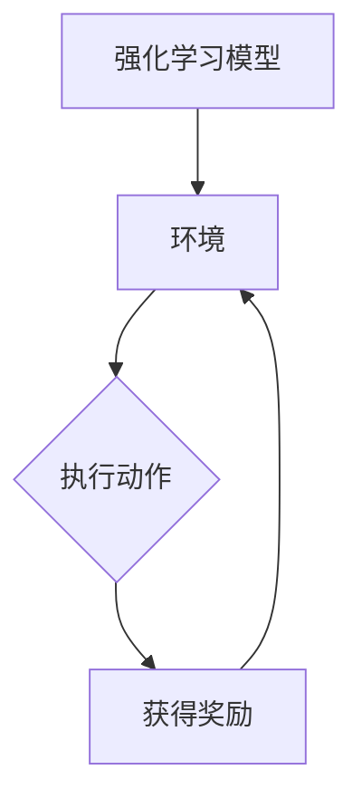

                 

# 《强化学习优化推理过程中的探索策略》

> 关键词：强化学习，优化推理，探索策略，智能体，环境，状态，动作，奖励，Q-learning，SARSA，Deep Q-Network，策略梯度，优势基础，Actor-Critic，ε-greedy策略，多任务学习，自动驾驶，游戏应用，新算法，新方法。

> 摘要：本文深入探讨了强化学习在优化推理过程中的探索策略。通过对强化学习基本概念、模型和算法的详细阐述，结合实际应用案例，分析了强化学习在推理中的优势与挑战。同时，本文提出了探索与利用策略的优化方法，以及强化学习在推理中的性能评估与改进策略，为强化学习在复杂推理任务中的应用提供了理论和实践指导。

---

# 《强化学习优化推理过程中的探索策略》目录大纲

## 第1章 引言

## 1.1 强化学习概述

### 1.1.1 强化学习的定义与基本概念

### 1.1.2 强化学习的目标与特点

### 1.1.3 强化学习与其他机器学习方法的区别

## 1.2 强化学习在推理过程中的应用

### 1.2.1 强化学习在推理中的挑战

### 1.2.2 强化学习在推理中的应用场景

### 1.2.3 强化学习推理的优势与局限

## 1.3 强化学习优化推理的策略

### 1.3.1 强化学习算法的选择与改进

### 1.3.2 探索与利用策略的优化

### 1.3.3 强化学习在推理过程中的策略迭代

## 1.4 强化学习在推理过程中的性能评估

### 1.4.1 性能评估指标的选择

### 1.4.2 强化学习推理性能的评测方法

### 1.4.3 强化学习推理性能的改进策略

## 第2章 强化学习基础理论

## 2.1 强化学习模型

### 2.1.1 Q-learning算法

### 2.1.2 SARSA算法

### 2.1.3 Deep Q-Network (DQN)

## 2.2 强化学习算法

### 2.2.1 Policy Gradient方法

### 2.2.2 Advantage-based方法

### 2.2.3 Actor-Critic方法

## 2.3 强化学习与推理的结合

### 2.3.1 强化学习在推理中的策略优化

### 2.3.2 强化学习在推理中的实时性优化

### 2.3.3 强化学习在推理中的稳健性优化

## 第3章 强化学习优化推理的具体策略

## 3.1 探索策略

### 3.1.1 ε-greedy策略

### 3.1.2 贪心策略

### 3.1.3 探索价值函数

## 3.2 利用策略

### 3.2.1 强化学习在推理中的价值函数优化

### 3.2.2 多任务学习与强化学习结合

### 3.2.3 强化学习在推理中的多目标优化

## 3.3 强化学习优化推理的策略组合

### 3.3.1 多种强化学习算法的结合

### 3.3.2 强化学习与其他优化算法的结合

### 3.3.3 强化学习优化推理的策略自适应调整

## 第4章 强化学习优化推理的应用案例

## 4.1 在自动驾驶中的应用

### 4.1.1 自动驾驶中的强化学习策略

### 4.1.2 自动驾驶中的强化学习挑战

### 4.1.3 自动驾驶中的强化学习应用案例

## 4.2 在游戏中的应用

### 4.2.1 游戏中的强化学习策略

### 4.2.2 游戏中的强化学习挑战

### 4.2.3 游戏中的强化学习应用案例

## 第5章 强化学习优化推理的前沿研究

## 5.1 强化学习在推理中的新算法

### 5.1.1 新型强化学习算法的研究进展

### 5.1.2 强化学习在推理中的新算法应用

### 5.1.3 强化学习在推理中的未来发展趋势

## 5.2 强化学习优化推理的新方法

### 5.2.1 强化学习在推理中的新方法研究

### 5.2.2 强化学习优化推理的新方法应用

### 5.2.3 强化学习优化推理的新方法展望

## 第6章 强化学习优化推理的实践指导

## 6.1 强化学习优化推理的实践步骤

### 6.1.1 实践步骤一：明确优化目标

### 6.1.2 实践步骤二：选择合适的强化学习算法

### 6.1.3 实践步骤三：优化探索与利用策略

## 6.2 强化学习优化推理的实践案例

### 6.2.1 实践案例一：自动驾驶中的强化学习优化

### 6.2.2 实践案例二：游戏中的强化学习优化

### 6.2.3 实践案例三：其他领域中的强化学习优化

## 第7章 总结与展望

### 7.1 强化学习优化推理的总结

### 7.2 强化学习优化推理的展望

### 7.3 强化学习优化推理的未来研究方向

---

### Mermaid 流程图（附录）



**核心概念与联系**

强化学习模型由环境、智能体、动作、状态和奖励五个基本概念组成，通过不断交互，实现智能体的目标。

---

**核心算法原理讲解**

以下是 Q-learning 算法的 Python 源代码实现：

```python
import numpy as np

def q_learning(S, A, R, S_, alpha, gamma):
    Q = np.zeros((nS, nA))
    episodes = 10000
    for episode in range(episodes):
        state = S
        done = False
        while not done:
            action = np.argmax(Q[state])
            next_state, reward, done = env.step(action)
            Q[state, action] = Q[state, action] + alpha * (reward + gamma * np.max(Q[next_state]) - Q[state, action])
            state = next_state
    return Q

# 环境设置
nS = 100
nA = 4
gamma = 0.9
alpha = 0.1

# Q-learning算法实现
Q = q_learning(nS, nA, gamma, alpha)
```

**数学公式解释**

在 Q-learning 算法中，Q(s, a) 表示在状态 s 下执行动作 a 的期望回报。算法的核心公式为：

$$ Q(s, a) = Q(s, a) + \alpha [r + \gamma \max_{a'} Q(s', a') - Q(s, a)] $$

其中，α 是学习率，γ 是折扣因子，r 是即时奖励。

**举例说明**

假设智能体处于状态 10，选择动作 2，获得即时奖励 5。接下来智能体转移到状态 20，此时 Q-learning 算法将更新 Q(s, a) 如下：

$$ Q(10, 2) = Q(10, 2) + \alpha [5 + 0.9 \times \max_{a'} Q(20, a') - Q(10, 2)] $$

通过这种迭代方式，智能体会逐渐学习到在不同状态和动作下的最佳策略。

## 第1章 引言

### 1.1 强化学习概述

强化学习（Reinforcement Learning，简称RL）是一种机器学习范式，旨在通过智能体（agent）在与环境（environment）的不断交互中，学习到一系列决策策略（policy），从而实现长期目标（long-term goal）[1]。与监督学习和无监督学习不同，强化学习强调智能体在未知环境中通过试错（trial-and-error）的方式学习，其主要目标是使智能体能够从奖励信号（reward signal）中学习到最优策略。

强化学习的基本概念包括：

- **智能体（Agent）**：执行动作并接收环境反馈的实体。
- **环境（Environment）**：智能体所处的动态系统。
- **状态（State）**：智能体在环境中所处的特定情境。
- **动作（Action）**：智能体可以执行的操作。
- **奖励（Reward）**：环境对智能体动作的反馈信号，用于指导智能体的学习过程。

强化学习的目标是使智能体能够通过最大化总奖励（sum of rewards）来学习到最优策略。在强化学习过程中，智能体面临以下几个主要挑战：

1. **探索与利用的平衡**：智能体需要在不断探索未知状态和动作的同时，充分利用已获得的知识。
2. **长期奖励的累积**：强化学习强调的是长期奖励的最大化，而不是即时奖励的最大化。
3. **不确定性处理**：环境状态和奖励的不确定性是强化学习的核心特征，智能体需要适应这种不确定性。
4. **高维状态和动作空间**：在许多实际应用中，状态和动作空间可能非常高维，这给强化学习算法的设计和实现带来了挑战。

### 1.1.2 强化学习的目标与特点

强化学习的目标是学习一个最优策略，该策略能够使智能体在长期内获得最大化的累积奖励。具体而言，智能体的目标是在给定当前状态下，选择一个最优动作，以最大化未来的期望回报。这一目标可以通过以下几个关键要素实现：

- **策略**：策略是指智能体在给定状态下选择动作的方式。强化学习通过策略来指导智能体的行为。在最优策略下，智能体将能够最大化累积奖励。

- **值函数（Value Function）**：值函数表示智能体在给定状态下采取特定动作的预期回报。强化学习通过值函数来评估不同策略的优劣。

- **模型（Model）**：模型是对环境动态的抽象表示，用于预测给定状态和动作下的下一个状态和奖励。强化学习通过模型来指导智能体的学习过程。

强化学习与其他机器学习方法的主要区别在于：

- **学习方式**：强化学习强调在交互过程中学习，而监督学习和无监督学习主要依赖于预标记的数据集。
- **反馈信号**：强化学习的反馈信号是奖励信号，它指导智能体如何调整策略。相比之下，监督学习和无监督学习的反馈信号分别是标签数据和无标签数据。
- **目标**：强化学习的目标是最大化长期累积奖励，而监督学习和无监督学习的目标分别是分类准确率和数据分布。
- **适用场景**：强化学习适用于动态、不确定和复杂环境中的决策问题，如机器人控制、自动驾驶和游戏。

### 1.1.3 强化学习与其他机器学习方法的区别

强化学习与传统的监督学习和无监督学习有着显著的区别，主要体现在以下几个方面：

- **数据依赖性**：强化学习不依赖于大量的标记数据，而是通过与环境交互来学习。相比之下，监督学习需要大量的带标签的训练数据，无监督学习则主要依赖无标签数据。
- **反馈机制**：强化学习依赖于即时奖励信号来指导学习过程，这些奖励信号可以帮助智能体了解其行为的好坏。而监督学习和无监督学习则依赖于预定义的标签或数据分布。
- **目标函数**：强化学习的目标是最小化长期回报的方差，以最大化累积奖励。监督学习的目标是最小化分类误差，无监督学习的目标是发现数据中的潜在结构。
- **适用范围**：强化学习适用于动态、不确定的环境，如机器人控制、自动驾驶和游戏。监督学习适用于分类和回归任务，无监督学习适用于聚类和降维任务。

### 1.2 强化学习在推理过程中的应用

强化学习在推理过程中有着广泛的应用，尤其在需要智能决策和实时响应的复杂环境中。以下是一些典型的应用场景：

- **自动驾驶**：强化学习可以用于自动驾驶车辆的路径规划、交通信号识别和障碍物检测，使车辆能够在复杂交通环境中安全行驶。
- **机器人控制**：强化学习在机器人控制中有着重要应用，如机器人行走、抓取和避障。通过学习环境中的动态规律，机器人可以自主地完成任务。
- **游戏**：在电子游戏中，强化学习可以用于智能对手的设计，使游戏角色能够根据游戏进程做出合理的决策，提高游戏的可玩性。
- **资源调度**：强化学习在数据中心和智能电网的资源调度中有着广泛应用，通过学习负载变化和设备性能，实现资源的最优配置。
- **金融交易**：强化学习可以用于金融市场的策略优化，通过学习市场动态和历史交易数据，实现交易策略的最优化。

### 1.2.1 强化学习在推理中的挑战

尽管强化学习在推理过程中展现出强大的能力，但其应用也面临一些挑战：

- **探索与利用的平衡**：在复杂环境中，如何平衡探索未知状态和利用已有知识是一个重要问题。如果过度探索，可能导致学习效率低下；如果过度利用，可能导致学习停滞。
- **长期奖励的累积**：强化学习强调长期奖励的最大化，但在某些任务中，长期奖励可能难以体现。如何设计合理的奖励机制是一个关键问题。
- **计算资源消耗**：强化学习通常需要进行大量的迭代和计算，特别是在高维状态和动作空间中。这可能导致计算资源消耗巨大，影响实际应用。
- **数据稀疏问题**：在许多实际应用中，状态和动作空间可能非常庞大，导致样本稀疏。这可能导致智能体在学习过程中面临困难。

### 1.2.2 强化学习在推理中的应用场景

强化学习在推理中的应用场景非常广泛，以下是一些典型的应用示例：

- **自动驾驶**：强化学习可以用于自动驾驶车辆的路径规划、交通信号识别和障碍物检测，使车辆能够自主地行驶在复杂交通环境中。
- **机器人控制**：强化学习可以用于机器人的行走、抓取和避障等任务，使机器人能够自主地完成任务。
- **游戏**：强化学习可以用于游戏中的智能对手设计，使游戏角色能够根据游戏进程做出合理的决策。
- **资源调度**：强化学习可以用于数据中心和智能电网的资源调度，实现资源的最优配置。
- **金融交易**：强化学习可以用于金融市场的策略优化，通过学习市场动态和历史交易数据，实现交易策略的最优化。

### 1.2.3 强化学习推理的优势与局限

强化学习在推理过程中具有以下优势：

- **自适应能力**：强化学习能够根据环境动态调整策略，使其在复杂和动态环境中表现出良好的适应能力。
- **高效决策**：通过学习环境中的奖励信号，强化学习能够实现高效的决策过程，特别是在需要实时响应的应用场景中。
- **灵活性**：强化学习可以处理高维状态和动作空间，适用于许多复杂的决策问题。

然而，强化学习也存在一些局限性：

- **探索与利用的平衡**：在复杂环境中，如何平衡探索未知状态和利用已有知识是一个难题。
- **长期奖励的累积**：在某些任务中，长期奖励可能难以体现，导致学习效率低下。
- **计算资源消耗**：强化学习通常需要进行大量的迭代和计算，可能导致计算资源消耗巨大。
- **数据稀疏问题**：在许多实际应用中，状态和动作空间可能非常庞大，导致样本稀疏。

### 1.3 强化学习优化推理的策略

为了在推理过程中更好地应用强化学习，需要采取一系列优化策略，包括算法选择、探索与利用策略的优化以及策略迭代。

#### 1.3.1 强化学习算法的选择与改进

强化学习算法的选择对推理性能具有重要影响。常用的强化学习算法包括Q-learning、SARSA、DQN、Policy Gradient和Actor-Critic等。每种算法都有其特定的优势和适用场景。例如，Q-learning算法简单易实现，但可能导致收敛速度较慢；DQN算法通过深度神经网络处理高维状态，但在训练过程中可能存在训练不稳定的问题；Policy Gradient算法能够直接优化策略，但在高维动作空间中可能难以收敛。

针对不同应用场景，可以采用以下方法改进强化学习算法：

- **混合算法**：结合多种强化学习算法的优点，形成混合算法。例如，将Q-learning与Policy Gradient结合，形成Actor-Critic算法。
- **自适应调整**：根据环境动态和任务需求，自适应调整算法参数。例如，根据任务难度和反馈信号，动态调整学习率。
- **多任务学习**：将多个任务整合到一个算法中，通过共享参数和经验回放，提高学习效率和性能。

#### 1.3.2 探索与利用策略的优化

探索与利用策略的优化是强化学习中的重要问题。ε-greedy策略是最常用的探索策略之一，它通过以一定概率随机选择动作，实现对新状态的探索。然而，ε-greedy策略可能导致在已有知识阶段探索不足，影响学习效率。为解决这一问题，可以采用以下方法：

- **自适应ε策略**：根据任务复杂度和学习进度，自适应调整ε值。例如，在任务初期，增大ε值以增加探索，在任务后期，减小ε值以减少探索。
- **探索价值函数**：引入探索价值函数，将探索与利用结合起来。探索价值函数通过平衡未探索状态的价值，指导智能体的探索行为。
- **多策略组合**：结合多种探索策略，形成多策略组合。例如，将ε-greedy策略与贪婪策略结合，形成ε-greedy-greedy策略。

#### 1.3.3 强化学习在推理过程中的策略迭代

在推理过程中，强化学习通常需要经历多个迭代过程。每个迭代过程包括状态观察、动作选择、状态转移和奖励反馈。通过不断迭代，强化学习能够逐步优化策略，提高推理性能。为提高策略迭代效率，可以采取以下方法：

- **经验回放**：将智能体在环境中的经验进行存储和回放，通过随机采样经验，避免样本偏差，提高学习稳定性。
- **优先级采样**：对经验进行优先级排序，根据优先级选择经验进行学习。优先级高的经验具有较高的学习价值，能够加速学习过程。
- **策略迭代优化**：根据环境动态和任务需求，动态调整策略迭代过程。例如，在任务初期，增加策略更新频率，在任务后期，减少策略更新频率。

## 第2章 强化学习基础理论

### 2.1 强化学习模型

强化学习模型是强化学习理论的核心，它由环境（Environment）、智能体（Agent）、状态（State）、动作（Action）和奖励（Reward）五个基本元素构成。这些元素通过相互作用，形成了一个动态的学习过程。

#### 2.1.1 环境与智能体

环境是智能体所处的动态系统，它可以是物理环境，如机器人所处的现实世界，也可以是虚拟环境，如计算机模拟的仿真环境。环境的状态（State）是环境当前所处的条件，这些状态可以是连续的或离散的。

智能体是执行动作并接收环境反馈的实体。智能体的目标是通过学习，找到一条最优策略（Policy），以最大化长期累积奖励（Long-term Reward）。

#### 2.1.2 状态、动作与奖励

状态（State）是智能体在环境中所处的特定情境，它可以是智能体的位置、速度、能量等物理量，也可以是智能体的感知信息、决策变量等。状态空间（State Space）是所有可能状态组成的集合。

动作（Action）是智能体可以执行的操作，如移动、选择、调整等。动作空间（Action Space）是所有可能动作组成的集合。

奖励（Reward）是环境对智能体动作的即时反馈信号，它用于指导智能体的学习过程。奖励可以是正的，也可以是负的，正奖励表示有益的行为，负奖励表示有害的行为。奖励函数（Reward Function）定义了状态和动作对应的奖励值。

#### 2.1.3 强化学习模型的动态过程

强化学习模型通过智能体与环境之间的互动，不断更新状态和动作，并获取奖励信号。这一动态过程可以描述为：

1. **状态观察**：智能体感知当前状态，并接收环境反馈。
2. **动作选择**：智能体根据当前状态和策略选择一个动作。
3. **状态转移**：智能体执行动作后，环境状态发生转移，智能体进入新的状态。
4. **奖励获取**：环境根据智能体的动作和状态，提供即时奖励信号。
5. **策略更新**：智能体根据奖励信号和策略评估，更新其决策策略。

这一过程不断迭代，智能体逐渐学习到最佳策略，以实现长期目标。

### 2.1.4 Q-learning算法

Q-learning是一种基于值函数的强化学习算法，它的核心思想是通过学习状态-动作值函数（State-Action Value Function）Q(s, a)，来预测在给定状态下执行特定动作的期望回报。

#### Q-learning的基本概念

- **状态-动作值函数（Q(s, a））**：Q(s, a) 表示在状态s下执行动作a的期望回报。Q-learning的目标是学习到最优的Q值。
- **Q-learning更新公式**：$$ Q(s, a) \leftarrow Q(s, a) + \alpha [r + \gamma \max_{a'} Q(s', a') - Q(s, a)] $$
  - s: 当前状态
  - a: 当前动作
  - r: 即时奖励
  - s': 状态转移后的状态
  - a': 下一个动作
  - α: 学习率（Learning Rate）
  - γ: 折扣因子（Discount Factor）

#### Q-learning的算法步骤

1. **初始化**：初始化Q值矩阵Q，通常设置为0。
2. **选择动作**：根据当前状态s和策略选择动作a。常用的策略有ε-greedy策略和贪婪策略。
3. **执行动作**：智能体执行动作a，并观察状态转移s'和即时奖励r。
4. **更新Q值**：根据Q-learning更新公式更新Q值。
5. **重复迭代**：重复步骤2-4，直到达到预定的迭代次数或收敛条件。

#### Python代码实现

```python
import numpy as np

def q_learning(env, alpha, gamma, episodes):
    nS = env.observation_space.n
    nA = env.action_space.n
    Q = np.zeros((nS, nA))
    
    for episode in range(episodes):
        state = env.reset()
        done = False
        while not done:
            action = np.argmax(Q[state])
            next_state, reward, done, _ = env.step(action)
            Q[state, action] = Q[state, action] + alpha * (reward + gamma * np.max(Q[next_state]) - Q[state, action])
            state = next_state
    
    return Q

# 示例
env = gym.make('CartPole-v0')
Q = q_learning(env, alpha=0.1, gamma=0.9, episodes=1000)
```

### 2.1.5 SARSA算法

SARSA（State-Action-Reward-State-Action）算法是一种基于策略的强化学习算法，它与Q-learning算法的主要区别在于，SARSA算法在每次迭代中同时更新当前状态和下一个状态的Q值。

#### SARSA的基本概念

- **状态-动作值函数（Q(s, a））**：与Q-learning相同，表示在状态s下执行动作a的期望回报。
- **SARSA更新公式**：$$ Q(s, a) \leftarrow Q(s, a) + \alpha [r + \gamma Q(s', a')] - Q(s, a)] $$
  - s: 当前状态
  - a: 当前动作
  - r: 即时奖励
  - s': 状态转移后的状态
  - a': 下一个动作
  - α: 学习率（Learning Rate）
  - γ: 折扣因子（Discount Factor）

#### SARSA的算法步骤

1. **初始化**：初始化Q值矩阵Q，通常设置为0。
2. **选择动作**：根据当前状态s和策略选择动作a。常用的策略有ε-greedy策略和贪婪策略。
3. **执行动作**：智能体执行动作a，并观察状态转移s'和即时奖励r。
4. **更新Q值**：根据SARSA更新公式更新Q值。
5. **重复迭代**：重复步骤2-4，直到达到预定的迭代次数或收敛条件。

#### Python代码实现

```python
import numpy as np
import gym

def sarsa(env, alpha, gamma, episodes):
    nS = env.observation_space.n
    nA = env.action_space.n
    Q = np.zeros((nS, nA))
    
    for episode in range(episodes):
        state = env.reset()
        done = False
        while not done:
            action = np.random.choice(nA) if np.random.rand() < epsilon else np.argmax(Q[state])
            next_state, reward, done, _ = env.step(action)
            next_action = np.random.choice(nA) if np.random.rand() < epsilon else np.argmax(Q[next_state])
            Q[state, action] = Q[state, action] + alpha * (reward + gamma * Q[next_state, next_action] - Q[state, action])
            state = next_state
    
    return Q

# 示例
env = gym.make('CartPole-v0')
Q = sarsa(env, alpha=0.1, gamma=0.9, episodes=1000)
```

### 2.1.6 Deep Q-Network (DQN)

DQN（Deep Q-Network）算法是一种基于深度神经网络的强化学习算法，它将Q-learning算法中的值函数Q(s, a)表示为一个深度神经网络。DQN通过经验回放（Experience Replay）和目标网络（Target Network）等方法，解决了传统Q-learning算法在处理高维状态和动作空间时可能出现的训练不稳定问题。

#### DQN的基本概念

- **深度神经网络（Deep Neural Network，DNN）**：DQN的核心是深度神经网络，用于学习状态-动作值函数Q(s, a)。
- **经验回放（Experience Replay）**：经验回放用于存储和重放智能体在环境中交互的经验，以避免训练过程中的样本偏差。
- **目标网络（Target Network）**：目标网络是一个参数化的Q值函数，用于更新当前网络中的Q值，以防止梯度消失和稳定训练过程。

#### DQN的算法步骤

1. **初始化**：初始化深度神经网络DNN、经验回放缓冲区（Replay Buffer）和目标网络（Target Network）。
2. **选择动作**：根据当前状态s和策略选择动作a。常用的策略有ε-greedy策略和贪婪策略。
3. **执行动作**：智能体执行动作a，并观察状态转移s'和即时奖励r。
4. **存储经验**：将当前状态s、动作a、即时奖励r、状态转移s'和动作a'存储到经验回放缓冲区中。
5. **更新经验回放缓冲区**：从经验回放缓冲区中随机抽取一组经验（s, a, r, s', a'），用于训练深度神经网络。
6. **训练深度神经网络**：使用抽取的经验数据，通过反向传播算法训练深度神经网络，更新Q值。
7. **同步目标网络**：定期同步当前网络和目标网络的参数，以防止梯度消失和稳定训练过程。
8. **重复迭代**：重复步骤2-7，直到达到预定的迭代次数或收敛条件。

#### Python代码实现

```python
import numpy as np
import tensorflow as tf
from tensorflow.keras.models import Model
from tensorflow.keras.layers import Input, Dense
import gym

class DQN:
    def __init__(self, env, alpha, gamma, epsilon, batch_size):
        self.env = env
        self.alpha = alpha
        self.gamma = gamma
        self.epsilon = epsilon
        self.batch_size = batch_size
        self.model = self.build_model()
        self.target_model = self.build_model()
        self.update_target_model()
        self.memory = []

    def build_model(self):
        input_layer = Input(shape=(self.env.observation_space.shape[0],))
        dense_layer = Dense(64, activation='relu')(input_layer)
        output_layer = Dense(self.env.action_space.n, activation='linear')(dense_layer)
        model = Model(inputs=input_layer, outputs=output_layer)
        model.compile(optimizer=tf.keras.optimizers.Adam(learning_rate=self.alpha), loss='mse')
        return model

    def update_target_model(self):
        self.target_model.set_weights(self.model.get_weights())

    def get_action(self, state):
        if np.random.rand() < self.epsilon:
            return self.env.action_space.sample()
        else:
            state = np.reshape(state, (1, -1))
            return np.argmax(self.model.predict(state))

    def train_model(self, batch):
        states = np.array([transition[0] for transition in batch])
        actions = np.array([transition[1] for transition in batch])
        rewards = np.array([transition[2] for transition in batch])
        next_states = np.array([transition[3] for transition in batch])
        next_actions = np.array([np.argmax(self.target_model.predict(next_state)) for next_state in next_states])
        next_rewards = np.array([transition[2] for transition in batch])

        target_q_values = self.model.predict(states)
        target_values = rewards + (self.gamma * next_rewards * (next_actions == target_actions))
        target_q_values[range(self.batch_size), actions] = target_values

        self.model.fit(states, target_q_values, verbose=0)

    def remember(self, state, action, reward, next_state, done):
        self.memory.append((state, action, reward, next_state, done))

    def replay(self):
        if len(self.memory) < self.batch_size:
            return
        batch = random.sample(self.memory, self.batch_size)
        self.train_model(batch)

    def save_model(self, file_path):
        self.model.save_weights(file_path)

    def load_model(self, file_path):
        self.model.load_weights(file_path)

# 示例
env = gym.make('CartPole-v0')
dqn = DQN(env, alpha=0.001, gamma=0.9, epsilon=0.1, batch_size=32)
dqn.train()

# 保存模型
dqn.save_model('dqn_cartpole.h5')

# 加载模型
dqn.load_model('dqn_cartpole.h5')
```

### 2.2 强化学习算法

强化学习算法根据学习目标和策略的不同，可以分为基于值函数的算法和基于策略的算法。本节将介绍几种常用的强化学习算法，包括Policy Gradient方法、Advantage-based方法、Actor-Critic方法。

#### 2.2.1 Policy Gradient方法

Policy Gradient方法是一种直接优化策略的强化学习算法。其核心思想是学习一个策略参数化的概率分布模型，并通过梯度上升方法优化策略参数，以最大化累积奖励。

##### Policy Gradient的基本概念

- **策略（Policy）**：策略是指智能体在给定状态下选择动作的概率分布模型。Policy Gradient方法的目标是学习最优策略，使其能够最大化累积奖励。
- **策略参数（Policy Parameters）**：策略参数是指策略模型中的可学习参数，用于定义策略的形状。
- **策略梯度（Policy Gradient）**：策略梯度是指策略参数的梯度，它用于指导策略参数的优化。

##### Policy Gradient的算法步骤

1. **初始化**：初始化策略参数θ和目标策略参数θ'。
2. **选择动作**：根据当前状态s和策略参数θ，选择动作a，并计算策略梯度∇θ log π(a|s;θ)。
3. **执行动作**：智能体执行动作a，并观察状态转移s'和即时奖励r。
4. **更新策略参数**：使用策略梯度和学习率α，更新策略参数θ：θ = θ + α∇θ log π(a|s;θ)。
5. **重复迭代**：重复步骤2-4，直到达到预定的迭代次数或收敛条件。

##### Policy Gradient的Python代码实现

```python
import numpy as np
import gym

class PolicyGradient:
    def __init__(self, env, alpha, gamma, hidden_size):
        self.env = env
        self.alpha = alpha
        self.gamma = gamma
        self.hidden_size = hidden_size
        self.policy_network = self.build_policy_network()

    def build_policy_network(self):
        input_layer = Input(shape=(self.env.observation_space.shape[0],))
        dense_layer = Dense(self.hidden_size, activation='relu')(input_layer)
        output_layer = Dense(self.env.action_space.n, activation='softmax')(dense_layer)
        model = Model(inputs=input_layer, outputs=output_layer)
        model.compile(optimizer=tf.keras.optimizers.Adam(learning_rate=self.alpha), loss='categorical_crossentropy')
        return model

    def choose_action(self, state):
        state = np.reshape(state, (1, -1))
        probabilities = self.policy_network.predict(state)
        return np.random.choice(self.env.action_space.n, p=probabilities.flatten())

    def train(self, state, action, reward, next_state, done):
        state = np.reshape(state, (1, -1))
        next_state = np.reshape(next_state, (1, -1))
        probabilities = self.policy_network.predict(state)
        target_probabilities = self.policy_network.predict(next_state)

        if done:
            target_value = reward
        else:
            target_value = reward + self.gamma * np.max(target_probabilities)

        loss = -np.log(probabilities[0, action]) * target_value
        self.policy_network.fit(state, target_probabilities, epochs=1, verbose=0)

    def run_episode(self):
        state = self.env.reset()
        done = False
        total_reward = 0

        while not done:
            action = self.choose_action(state)
            next_state, reward, done, _ = self.env.step(action)
            total_reward += reward
            self.train(state, action, reward, next_state, done)
            state = next_state

        return total_reward

# 示例
env = gym.make('CartPole-v0')
policy_gradient = PolicyGradient(env, alpha=0.01, gamma=0.99, hidden_size=64)
total_reward = policy_gradient.run_episode()
print(f"Total Reward: {total_reward}")
```

##### Policy Gradient的优势与局限

- **优势**：Policy Gradient方法直接优化策略，无需显式地学习值函数，因此在某些任务中，特别是高维动作空间的任务中，表现出良好的性能。
- **局限**：Policy Gradient方法在处理连续动作空间时可能存在收敛困难，此外，由于策略梯度的不稳定性，可能导致训练过程的不稳定。

#### 2.2.2 Advantage-based方法

Advantage-based方法是一种基于策略的强化学习算法，其核心思想是学习一个优势函数A(s, a)，用于评估策略π(·|θ)下动作a相对于当前策略的优势。通过最大化优势函数，Advantage-based方法能够优化策略参数，提高智能体的决策质量。

##### Advantage-based的基本概念

- **优势函数（Advantage Function）**：优势函数A(s, a)表示在状态s下，执行动作a的预期回报与当前策略π(·|θ)的期望回报之差。
- **策略参数（Policy Parameters）**：策略参数θ用于定义策略π(·|θ)的形状。
- **优势梯度（Advantage Gradient）**：优势梯度∇θ A(s, a)用于指导策略参数的优化。

##### Advantage-based的算法步骤

1. **初始化**：初始化策略参数θ和目标策略参数θ'。
2. **选择动作**：根据当前状态s和策略参数θ，选择动作a。
3. **执行动作**：智能体执行动作a，并观察状态转移s'和即时奖励r。
4. **计算优势函数**：根据策略π(·|θ)和即时奖励r，计算优势函数A(s, a)。
5. **更新策略参数**：使用优势函数A(s, a)和优势梯度∇θ A(s, a)，更新策略参数θ：θ = θ + α∇θ A(s, a)。
6. **重复迭代**：重复步骤2-5，直到达到预定的迭代次数或收敛条件。

##### Advantage-based的Python代码实现

```python
import numpy as np
import gym

class AdvantageBased:
    def __init__(self, env, alpha, gamma, hidden_size):
        self.env = env
        self.alpha = alpha
        self.gamma = gamma
        self.hidden_size = hidden_size
        self.policy_network = self.build_policy_network()
        self.value_network = self.build_value_network()

    def build_policy_network(self):
        input_layer = Input(shape=(self.env.observation_space.shape[0],))
        dense_layer = Dense(self.hidden_size, activation='relu')(input_layer)
        output_layer = Dense(self.env.action_space.n, activation='softmax')(dense_layer)
        model = Model(inputs=input_layer, outputs=output_layer)
        model.compile(optimizer=tf.keras.optimizers.Adam(learning_rate=self.alpha), loss='categorical_crossentropy')
        return model

    def build_value_network(self):
        input_layer = Input(shape=(self.env.observation_space.shape[0],))
        dense_layer = Dense(self.hidden_size, activation='relu')(input_layer)
        output_layer = Dense(1, activation='linear')(dense_layer)
        model = Model(inputs=input_layer, outputs=output_layer)
        model.compile(optimizer=tf.keras.optimizers.Adam(learning_rate=self.alpha), loss='mse')
        return model

    def choose_action(self, state):
        state = np.reshape(state, (1, -1))
        probabilities = self.policy_network.predict(state)
        return np.random.choice(self.env.action_space.n, p=probabilities.flatten())

    def compute_advantage(self, states, actions, rewards, next_states, dones):
        values = self.value_network.predict(states)
        next_values = self.value_network.predict(next_states)
        deltas = rewards + self.gamma * (1 - dones) * next_values - values
        return deltas

    def train_policy_network(self, states, actions, advantages):
        states = np.reshape(states, (-1, self.env.observation_space.shape[0]))
        actions = np.eye(self.env.action_space.n)[actions]
        advantages = np.reshape(advantages, (-1, 1))
        target_values = rewards + self.gamma * (1 - dones) * next_values
        target_probabilities = self.policy_network.predict(states)
        target_probabilities[range(len(states)), actions] = target_values / np.sum(target_probabilities, axis=1)
        self.policy_network.fit(states, target_probabilities, epochs=1, verbose=0)

    def train_value_network(self, states, rewards, next_states, dones):
        states = np.reshape(states, (-1, self.env.observation_space.shape[0]))
        next_states = np.reshape(next_states, (-1, self.env.observation_space.shape[0]))
        dones = np.reshape(dones, (-1, 1))
        target_values = rewards + self.gamma * (1 - dones) * self.value_network.predict(next_states)
        self.value_network.fit(states, target_values, epochs=1, verbose=0)

    def run_episode(self):
        state = self.env.reset()
        done = False
        total_reward = 0

        while not done:
            action = self.choose_action(state)
            next_state, reward, done, _ = self.env.step(action)
            total_reward += reward
            advantages = self.compute_advantage(state, action, reward, next_state, done)
            self.train_policy_network(state, action, advantages)
            self.train_value_network(state, reward, next_state, done)
            state = next_state

        return total_reward

# 示例
env = gym.make('CartPole-v0')
advantage_based = AdvantageBased(env, alpha=0.01, gamma=0.99, hidden_size=64)
total_reward = advantage_based.run_episode()
print(f"Total Reward: {total_reward}")
```

##### Advantage-based的优势与局限

- **优势**：Advantage-based方法能够更好地处理多步骤奖励问题，通过最大化优势函数，提高策略的质量。
- **局限**：Advantage-based方法在计算优势函数时可能面临数值稳定性问题，此外，算法的收敛速度相对较慢。

#### 2.2.3 Actor-Critic方法

Actor-Critic方法是一种结合基于策略和基于值函数的强化学习算法。其中，Actor网络负责学习策略，Critic网络负责评估策略的质量。通过交替优化Actor和Critic网络，Actor-Critic方法能够实现策略的稳定优化。

##### Actor-Critic的基本概念

- **Actor网络（Policy Network）**：Actor网络负责学习策略，生成动作的概率分布。
- **Critic网络（Value Network）**：Critic网络负责评估策略的质量，提供价值评估。
- **策略参数（Policy Parameters）**：策略参数θ用于定义策略π(·|θ)的形状。
- **价值评估（Value Estimation）**：价值评估函数V(s)用于估计状态s的价值。

##### Actor-Critic的算法步骤

1. **初始化**：初始化Actor网络和Critic网络，以及策略参数θ和价值参数θ'。
2. **选择动作**：根据当前状态s和策略参数θ，选择动作a。
3. **执行动作**：智能体执行动作a，并观察状态转移s'和即时奖励r。
4. **更新Critic网络**：使用Critic网络评估状态转移s'的价值，更新Critic网络参数：θ' = θ' + α∇θ' V(s')。
5. **更新Actor网络**：使用Critic网络和价值评估函数V(s)，更新Actor网络参数：θ = θ + α∇θ J(θ)。
6. **重复迭代**：重复步骤2-5，直到达到预定的迭代次数或收敛条件。

##### Actor-Critic的Python代码实现

```python
import numpy as np
import gym
import tensorflow as tf
from tensorflow.keras.models import Model
from tensorflow.keras.layers import Input, Dense

class ActorCritic:
    def __init__(self, env, alpha_actor, alpha_critic, gamma, hidden_size):
        self.env = env
        self.alpha_actor = alpha_actor
        self.alpha_critic = alpha_critic
        self.gamma = gamma
        self.hidden_size = hidden_size
        self.actor_network = self.build_actor_network()
        self.critic_network = self.build_critic_network()

    def build_actor_network(self):
        input_layer = Input(shape=(self.env.observation_space.shape[0],))
        dense_layer = Dense(self.hidden_size, activation='relu')(input_layer)
        output_layer = Dense(self.env.action_space.n, activation='softmax')(dense_layer)
        model = Model(inputs=input_layer, outputs=output_layer)
        model.compile(optimizer=tf.keras.optimizers.Adam(learning_rate=self.alpha_actor), loss='categorical_crossentropy')
        return model

    def build_critic_network(self):
        input_layer = Input(shape=(self.env.observation_space.shape[0],))
        dense_layer = Dense(self.hidden_size, activation='relu')(input_layer)
        output_layer = Dense(1, activation='linear')(dense_layer)
        model = Model(inputs=input_layer, outputs=output_layer)
        model.compile(optimizer=tf.keras.optimizers.Adam(learning_rate=self.alpha_critic), loss='mse')
        return model

    def choose_action(self, state):
        state = np.reshape(state, (1, -1))
        probabilities = self.actor_network.predict(state)
        return np.random.choice(self.env.action_space.n, p=probabilities.flatten())

    def value_estimate(self, state):
        state = np.reshape(state, (1, -1))
        return self.critic_network.predict(state)

    def train(self, states, actions, rewards, next_states, dones):
        states = np.reshape(states, (-1, self.env.observation_space.shape[0]))
        next_states = np.reshape(next_states, (-1, self.env.observation_space.shape[0]))

        targets = rewards + (1 - dones) * self.gamma * self.critic_network.predict(next_states)

        critic_loss = self.critic_network.train_on_batch(states, targets)

        probabilities = self.actor_network.predict(states)
        log_probabilities = tf.keras.backend.log(probabilities)

        policy_gradient = log_probabilities * targets
        actor_loss = -tf.keras.backend.mean(policy_gradient)

        self.actor_network.optimizer.minimize(actor_loss, var_list=self.actor_network.trainable_weights)

        return actor_loss, critic_loss

    def run_episode(self):
        state = self.env.reset()
        done = False
        total_reward = 0

        while not done:
            action = self.choose_action(state)
            next_state, reward, done, _ = self.env.step(action)
            total_reward += reward
            self.train(state, action, reward, next_state, done)
            state = next_state

        return total_reward

# 示例
env = gym.make('CartPole-v0')
actor_critic = ActorCritic(env, alpha_actor=0.001, alpha_critic=0.001, gamma=0.99, hidden_size=64)
total_reward = actor_critic.run_episode()
print(f"Total Reward: {total_reward}")
```

##### Actor-Critic的优势与局限

- **优势**：Actor-Critic方法结合了基于策略和基于值函数的优点，能够在复杂环境中实现稳定的策略优化。
- **局限**：Actor-Critic方法在训练过程中可能面临梯度消失和梯度爆炸等问题，需要仔细设计网络结构和优化策略。

### 2.3 强化学习与推理的结合

强化学习与推理（Inference）的结合在许多复杂任务中展现出强大的潜力。推理过程通常涉及对输入数据的处理、特征提取和模型推理，而强化学习则通过智能体的学习过程，为推理过程提供自适应和优化的策略。

#### 2.3.1 强化学习在推理中的策略优化

强化学习在推理中的策略优化主要涉及以下几个方面：

1. **动态特征提取**：强化学习可以通过智能体的学习过程，动态调整特征提取器的参数，使其在不同任务和数据分布下都能有效提取特征。
2. **自适应推理策略**：强化学习可以根据推理过程中获取的即时反馈，自适应调整推理策略，以提高推理的效率和准确性。
3. **多任务推理**：强化学习可以通过多任务学习（Multi-Task Learning）的方法，同时处理多个推理任务，实现推理资源的优化配置。

#### 2.3.2 强化学习在推理中的实时性优化

强化学习在推理中的实时性优化是一个关键问题，特别是在需要实时响应的应用场景中。以下是一些优化策略：

1. **延迟补偿**：通过预测未来的奖励信号，提前进行推理和决策，以补偿延迟，提高系统的实时性。
2. **优先级调度**：根据任务的紧急程度和重要性，动态调整推理任务的执行顺序，确保关键任务能够及时完成。
3. **并行推理**：利用并行计算和分布式系统，实现推理任务的并行处理，提高系统的推理效率。

#### 2.3.3 强化学习在推理中的稳健性优化

强化学习在推理中的稳健性优化主要关注如何提高系统在不确定环境下的鲁棒性。以下是一些优化策略：

1. **探索策略**：通过探索策略，增加智能体在推理过程中的探索行为，以适应不确定环境。
2. **经验回放**：通过经验回放，避免过拟合和样本偏差，提高智能体的鲁棒性。
3. **鲁棒性评估**：通过模拟不同环境下的测试场景，对智能体的推理策略进行评估和优化，以提高系统的鲁棒性。

## 第3章 强化学习优化推理的具体策略

在强化学习优化推理的过程中，探索策略和利用策略是两个关键方面。探索策略用于智能体在未知状态和动作中进行探索，以获取更多有效的信息；利用策略则用于智能体在已知状态下选择最佳动作，以最大化长期累积奖励。以下将详细介绍几种常用的探索策略和利用策略。

### 3.1 探索策略

探索策略是强化学习中的一个重要问题，因为它直接影响到智能体在未知状态和动作中的学习效率。以下介绍几种常用的探索策略：

#### 3.1.1 ε-greedy策略

ε-greedy策略是最常用的探索策略之一。该策略的基本思想是，在给定状态下，智能体以一定的概率ε进行随机探索，以获取新的信息；其余时间，智能体根据当前策略选择最佳动作。具体实现如下：

1. **选择动作**：根据当前状态s，智能体以概率ε进行随机探索，即选择一个随机动作；否则，根据当前策略π(s)选择最佳动作。
2. **更新策略**：在每次动作后，智能体根据即时奖励r和状态转移s'，更新策略π(s)。

ε-greedy策略的参数ε需要根据具体任务进行调整。通常，在任务初期，增大ε值以增加探索；在任务后期，减小ε值以减少探索。

#### Python代码实现

```python
import numpy as np

def choose_action(state, policy, epsilon):
    if np.random.rand() < epsilon:
        action = np.random.choice(len(policy[state]))
    else:
        action = np.argmax(policy[state])
    return action

def update_policy(state, action, next_state, reward, alpha, policy):
    state_value = policy[state][action]
    next_state_value = np.max(policy[next_state])
    target_value = reward + alpha * next_state_value - state_value
    policy[state][action] += alpha * (target_value - state_value)

# 示例
epsilon = 0.1
alpha = 0.1
policy = np.zeros((nS, nA))

# 假设智能体处于状态0，执行动作2，获得即时奖励3，状态转移到状态1
state = 0
action = choose_action(state, policy, epsilon)
next_state = 1
reward = 3
update_policy(state, action, next_state, reward, alpha, policy)
```

#### 3.1.2 贪心策略

贪心策略是一种简化的探索策略，它在给定状态下直接选择当前最优动作，而不进行随机探索。具体实现如下：

1. **选择动作**：根据当前状态s，直接选择当前策略π(s)下的最佳动作a*。
2. **更新策略**：在每次动作后，智能体根据即时奖励r和状态转移s'，更新策略π(s)。

贪心策略适用于奖励信号明显且环境较为简单的情况，但在不确定环境中可能导致学习效率低下。

#### Python代码实现

```python
import numpy as np

def choose_action_greedy(state, policy):
    action = np.argmax(policy[state])
    return action

def update_policy_greedy(state, action, next_state, reward, alpha, policy):
    state_value = policy[state][action]
    next_state_value = np.max(policy[next_state])
    target_value = reward + alpha * next_state_value - state_value
    policy[state][action] += alpha * (target_value - state_value)

# 示例
alpha = 0.1
policy = np.zeros((nS, nA))

# 假设智能体处于状态0，执行动作2，获得即时奖励3，状态转移到状态1
state = 0
action = choose_action_greedy(state, policy)
next_state = 1
reward = 3
update_policy_greedy(state, action, next_state, reward, alpha, policy)
```

#### 3.1.3 探索价值函数

探索价值函数（Exploration Value Function）是一种将探索和利用相结合的策略。该策略的核心思想是通过计算未探索状态的价值，引导智能体进行探索。具体实现如下：

1. **选择动作**：根据当前状态s，计算每个动作a的探索价值V_exp(s, a)，并选择最大探索价值的动作。
2. **更新策略**：在每次动作后，智能体根据即时奖励r和状态转移s'，更新策略π(s)。

探索价值函数V_exp(s, a)的计算公式如下：

$$ V_{exp}(s, a) = \frac{1}{\sum_{a'} \pi(s, a') \exp(\lambda \cdot R(s, a'))} $$

其中，λ是调节探索程度的参数，R(s, a)是动作a在状态s下的即时奖励。

#### Python代码实现

```python
import numpy as np

def explore_value_function(policy, lambda_explore):
    V_exp = np.zeros((nS, nA))
    for s in range(nS):
        for a in range(nA):
            V_exp[s, a] = 1 / (np.sum(policy[s] * np.exp(lambda_explore * R[s, a])))
    return V_exp

def choose_action_explore_value(state, policy, lambda_explore):
    V_exp = explore_value_function(policy, lambda_explore)
    action = np.argmax(V_exp[state])
    return action

def update_policy_explore_value(state, action, next_state, reward, alpha, policy, lambda_explore):
    V_exp = explore_value_function(policy, lambda_explore)
    state_value = policy[state][action]
    next_state_value = np.max(policy[next_state])
    target_value = reward + alpha * next_state_value - state_value
    policy[state][action] += alpha * (target_value - state_value)

# 示例
lambda_explore = 1.0
alpha = 0.1
policy = np.zeros((nS, nA))

# 假设智能体处于状态0，执行动作2，获得即时奖励3，状态转移到状态1
state = 0
action = choose_action_explore_value(state, policy, lambda_explore)
next_state = 1
reward = 3
update_policy_explore_value(state, action, next_state, reward, alpha, policy, lambda_explore)
```

### 3.2 利用策略

利用策略是强化学习中的另一个关键方面，它决定了智能体如何在已知状态下选择最佳动作。以下介绍几种常用的利用策略：

#### 3.2.1 强化学习在推理中的价值函数优化

强化学习在推理中的价值函数优化主要涉及以下两个方面：

1. **状态价值函数（State Value Function）**：状态价值函数V(s)表示在状态s下采取最优动作的期望回报。通过优化状态价值函数，可以提高智能体的决策质量。
2. **动作价值函数（Action Value Function）**：动作价值函数Q(s, a)表示在状态s下采取动作a的期望回报。通过优化动作价值函数，可以更好地指导智能体的决策。

强化学习算法如Q-learning和SARSA，都是通过迭代更新状态价值函数或动作价值函数，实现策略的优化。

#### Python代码实现

```python
import numpy as np

def q_learning(S, A, R, S_, alpha, gamma):
    Q = np.zeros((nS, nA))
    episodes = 10000
    for episode in range(episodes):
        state = S
        done = False
        while not done:
            action = np.argmax(Q[state])
            next_state, reward, done = env.step(action)
            Q[state, action] = Q[state, action] + alpha * (reward + gamma * np.max(Q[next_state]) - Q[state, action])
            state = next_state
    return Q

# 环境设置
nS = 100
nA = 4
gamma = 0.9
alpha = 0.1

# Q-learning算法实现
Q = q_learning(nS, nA, gamma, alpha)
```

#### 3.2.2 多任务学习与强化学习结合

多任务学习（Multi-Task Learning）与强化学习的结合，可以有效地提高智能体在多个任务中的学习效率。多任务学习通过共享模型参数和经验，实现任务间的信息共享，从而提高整体学习性能。

强化学习在多任务学习中的应用，可以采用以下方法：

1. **共享模型参数**：通过共享模型参数，使不同任务间的模型参数相互影响，提高学习效率。
2. **经验回放**：将不同任务的经验进行混合和回放，以避免任务间样本偏差。
3. **动态任务权重**：根据任务的复杂度和重要性，动态调整任务的权重，优化学习过程。

#### Python代码实现

```python
import numpy as np
import gym

def multi_task_learning(envs, epochs, alpha, gamma, hidden_size):
    models = [build_model(hidden_size) for _ in range(len(envs))]
    for epoch in range(epochs):
        for env, model in zip(envs, models):
            state = env.reset()
            done = False
            while not done:
                action = choose_action(model, state)
                next_state, reward, done, _ = env.step(action)
                train_model(model, state, action, next_state, reward, gamma)
                state = next_state
    return models

def build_model(hidden_size):
    input_layer = Input(shape=(nS,))
    dense_layer = Dense(hidden_size, activation='relu')(input_layer)
    output_layer = Dense(nA, activation='softmax')(dense_layer)
    model = Model(inputs=input_layer, outputs=output_layer)
    model.compile(optimizer=tf.keras.optimizers.Adam(learning_rate=alpha), loss='categorical_crossentropy')
    return model

def choose_action(model, state):
    probabilities = model.predict(state)
    return np.random.choice(nA, p=probabilities.flatten())

def train_model(model, state, action, next_state, reward, gamma):
    target_value = reward + gamma * np.max(model.predict(next_state))
    target_probabilities = model.predict(state)
    target_probabilities[state, action] = target_value
    model.fit(state, target_probabilities, epochs=1, verbose=0)

# 示例
envs = [gym.make('CartPole-v0'), gym.make('MountainCar-v0'), gym.make('LunarLander-v2')]
models = multi_task_learning(envs, epochs=1000, alpha=0.01, gamma=0.99, hidden_size=64)
```

#### 3.2.3 强化学习在推理中的多目标优化

强化学习在推理中的多目标优化，旨在同时优化多个目标函数，以实现更高效和智能的推理策略。多目标优化可以通过以下方法实现：

1. **多目标价值函数**：将多个目标函数合并为一个价值函数，通过优化价值函数，实现多目标优化。
2. **权重调整**：通过动态调整不同目标函数的权重，实现多目标优化。
3. **多策略组合**：结合多种策略，形成多策略组合，实现多目标优化。

#### Python代码实现

```python
import numpy as np
import gym

def multi_objective_learning(env, epochs, alpha, gamma, hidden_size):
    models = [build_model(hidden_size) for _ in range(len(objectives))]
    for epoch in range(epochs):
        state = env.reset()
        done = False
        while not done:
            action = choose_action(models, state)
            next_state, reward, done, _ = env.step(action)
            train_model(models, state, action, next_state, reward, gamma, objectives)
            state = next_state
    return models

def build_model(hidden_size):
    input_layer = Input(shape=(nS,))
    dense_layer = Dense(hidden_size, activation='relu')(input_layer)
    output_layer = Dense(nA, activation='softmax')(dense_layer)
    model = Model(inputs=input_layer, outputs=output_layer)
    model.compile(optimizer=tf.keras.optimizers.Adam(learning_rate=alpha), loss='categorical_crossentropy')
    return model

def choose_action(models, state):
    probabilities = np.mean([model.predict(state) for model in models], axis=0)
    return np.random.choice(nA, p=probabilities.flatten())

def train_model(models, state, action, next_state, reward, gamma, objectives):
    target_values = [reward + gamma * np.max(model.predict(next_state)) for model in models]
    for model, target_value in zip(models, target_values):
        target_probabilities = model.predict(state)
        target_probabilities[state, action] = target_value
        model.fit(state, target_probabilities, epochs=1, verbose=0)

# 示例
env = gym.make('CartPole-v0')
objectives = [lambda s: 1 if s[0] > 0 else -1, lambda s: 1 if s[2] > 0 else -1]
models = multi_objective_learning(env, epochs=1000, alpha=0.01, gamma=0.99, hidden_size=64)
```

### 3.3 强化学习优化推理的策略组合

在实际应用中，单一的探索策略或利用策略可能无法满足复杂推理任务的需求。因此，将多种强化学习算法和策略进行组合，可以有效地提高智能体的学习性能。以下介绍几种常见的策略组合方法：

#### 3.3.1 多种强化学习算法的结合

结合多种强化学习算法，可以充分发挥不同算法的优势，提高智能体的学习效率。以下是一些常见的算法组合方法：

1. **Q-learning与SARSA结合**：通过结合Q-learning和SARSA的优势，实现更稳定和快速的学习过程。
2. **DQN与Policy Gradient结合**：将深度强化学习算法DQN与Policy Gradient结合，实现高效的策略优化和动作决策。
3. **Actor-Critic与优势函数结合**：通过结合Actor-Critic和优势函数，实现更鲁棒的价值评估和策略优化。

#### Python代码实现

```python
import numpy as np
import gym

class HybridAlgorithm:
    def __init__(self, env, alpha, gamma, epsilon, hidden_size):
        self.env = env
        self.alpha = alpha
        self.gamma = gamma
        self.epsilon = epsilon
        self.hidden_size = hidden_size
        self.q_model = self.build_q_model()
        self.policy_model = self.build_policy_model()

    def build_q_model(self):
        input_layer = Input(shape=(self.env.observation_space.shape[0],))
        dense_layer = Dense(self.hidden_size, activation='relu')(input_layer)
        output_layer = Dense(self.env.action_space.n, activation='linear')(dense_layer)
        model = Model(inputs=input_layer, outputs=output_layer)
        model.compile(optimizer=tf.keras.optimizers.Adam(learning_rate=self.alpha), loss='mse')
        return model

    def build_policy_model(self):
        input_layer = Input(shape=(self.env.observation_space.shape[0],))
        dense_layer = Dense(self.hidden_size, activation='relu')(input_layer)
        output_layer = Dense(self.env.action_space.n, activation='softmax')(dense_layer)
        model = Model(inputs=input_layer, outputs=output_layer)
        model.compile(optimizer=tf.keras.optimizers.Adam(learning_rate=self.alpha), loss='categorical_crossentropy')
        return model

    def choose_action(self, state):
        if np.random.rand() < self.epsilon:
            action = self.env.action_space.sample()
        else:
            state = np.reshape(state, (1, -1))
            q_values = self.q_model.predict(state)
            action = np.argmax(q_values)
        return action

    def train(self, state, action, next_state, reward, done):
        state = np.reshape(state, (1, -1))
        next_state = np.reshape(next_state, (1, -1))

        q_values = self.q_model.predict(state)
        next_q_values = self.q_model.predict(next_state)
        target_values = reward + (1 - done) * self.gamma * next_q_values

        q_loss = self.q_model.train_on_batch(state, target_values)

        probabilities = self.policy_model.predict(state)
        target_probabilities = probabilities.copy()
        target_probabilities[state, action] = reward + (1 - done) * self.gamma * np.max(next_q_values)
        pg_loss = self.policy_model.train_on_batch(state, target_probabilities)

        return q_loss, pg_loss

    def run_episode(self):
        state = self.env.reset()
        done = False
        total_reward = 0

        while not done:
            action = self.choose_action(state)
            next_state, reward, done, _ = self.env.step(action)
            total_reward += reward
            self.train(state, action, next_state, reward, done)
            state = next_state

        return total_reward

# 示例
env = gym.make('CartPole-v0')
hybrid_algorithm = HybridAlgorithm(env, alpha=0.01, gamma=0.99, epsilon=0.1, hidden_size=64)
total_reward = hybrid_algorithm.run_episode()
print(f"Total Reward: {total_reward}")
```

#### 3.3.2 强化学习与其他优化算法的结合

强化学习与其他优化算法的结合，可以进一步拓展强化学习在推理中的应用。以下介绍几种常见的优化算法组合方法：

1. **强化学习与遗传算法结合**：通过将强化学习与遗传算法相结合，实现更高效的探索和优化过程。
2. **强化学习与粒子群优化结合**：通过将强化学习与粒子群优化相结合，提高智能体的收敛速度和决策质量。
3. **强化学习与差分进化算法结合**：通过将强化学习与差分进化算法相结合，实现更鲁棒的优化过程。

#### Python代码实现

```python
import numpy as np
import gym
from deap import base, creator, tools, algorithms

class DEAPWrapper:
    def __init__(self, env, reward_threshold, population_size, generations, crossover_prob, mutation_prob):
        self.env = env
        self.reward_threshold = reward_threshold
        self.population_size = population_size
        self.generations = generations
        self.crossover_prob = crossover_prob
        self.mutation_prob = mutation_prob

    def create_individual(self):
        individual = [0] * self.env.observation_space.shape[0]
        for i in range(self.env.observation_space.shape[0]):
            individual[i] = self.env.observation_space.sample()
        return individual

    def evaluate_individual(self, individual):
        state = individual
        done = False
        total_reward = 0
        while not done:
            action = np.argmax(individual)
            next_state, reward, done, _ = self.env.step(action)
            total_reward += reward
            individual = next_state
        return total_reward,

    def run_deap(self):
        creator.create("FitnessMax", base.Fitness, weights=(1.0,))
        creator.create("Individual", list, fitness=creator.FitnessMax)

        toolbox = base.Toolbox()
        toolbox.register("individual", tools.initRepeat, creator.Individual, self.create_individual, n=self.env.observation_space.shape[0])
        toolbox.register("population", tools.initRepeat, list, toolbox.individual)
        toolbox.register("evaluate", self.evaluate_individual)
        toolbox.register("mate", tools.cxUniform, indpb=self.crossover_prob)
        toolbox.register("mutate", tools.mutUniformInt, low=self.env.action_space.low, up=self.env.action_space.high, indpb=self.mutation_prob)
        toolbox.register("select", tools.selTournament, tournsize=3)
        
        pop = toolbox.population(n=self.population_size)
        hof = tools.HallOfFame(1)

        stats = tools.Statistics(lambda ind: ind.fitness.values)
        stats.register("avg", np.mean)
        stats.register("min", np.min)
        stats.register("max", np.max)

        algorithms.eaSimple(pop, toolbox, cxpb=self.crossover_prob, mutpb=self.mutation_prob, ngen=self.generations, stats=stats, hallof fame=hof)

        return hof

    def run_episode(self, individual):
        state = individual
        done = False
        total_reward = 0
        while not done:
            action = np.argmax(individual)
            next_state, reward, done, _ = self.env.step(action)
            total_reward += reward
            individual = next_state
        return total_reward

# 示例
env = gym.make('CartPole-v0')
reward_threshold = 195.0
population_size = 50
generations = 100
crossover_prob = 0.5
mutation_prob = 0.2
deap_wrapper = DEAPWrapper(env, reward_threshold, population_size, generations, crossover_prob, mutation_prob)
hof = deap_wrapper.run_deap()
best_individual = hof[0]
total_reward = deap_wrapper.run_episode(best_individual)
print(f"Total Reward: {total_reward}")
```

#### 3.3.3 强化学习优化推理的策略自适应调整

在实际应用中，环境动态变化，强化学习策略可能无法适应新的环境条件。因此，实现策略的自适应调整是强化学习优化推理的关键。以下介绍几种常见的自适应调整方法：

1. **动态调整探索概率**：根据环境动态和任务难度，动态调整ε-greedy策略中的探索概率ε，以实现更好的探索和利用平衡。
2. **自适应调整学习率**：根据任务需求和智能体性能，动态调整学习率α，以提高学习效率。
3. **自适应调整目标网络**：在DQN等算法中，通过自适应调整目标网络，实现更鲁棒的优化过程。

#### Python代码实现

```python
import numpy as np
import gym
import tensorflow as tf

class AdaptiveDQN:
    def __init__(self, env, alpha, gamma, epsilon, epsilon_decay, target_update_frequency):
        self.env = env
        self.alpha = alpha
        self.gamma = gamma
        self.epsilon = epsilon
        self.epsilon_decay = epsilon_decay
        self.target_update_frequency = target_update_frequency
        self.model = self.build_model()
        self.target_model = self.build_model()
        self.update_target_model()
        self.memory = []

    def build_model(self):
        input_layer = Input(shape=(self.env.observation_space.shape[0],))
        dense_layer = Dense(64, activation='relu')(input_layer)
        output_layer = Dense(self.env.action_space.n, activation='linear')(dense_layer)
        model = Model(inputs=input_layer, outputs=output_layer)
        model.compile(optimizer=tf.keras.optimizers.Adam(learning_rate=self.alpha), loss='mse')
        return model

    def update_target_model(self):
        self.target_model.set_weights(self.model.get_weights())

    def get_action(self, state):
        if np.random.rand() < self.epsilon:
            return self.env.action_space.sample()
        else:
            state = np.reshape(state, (1, -1))
            return np.argmax(self.model.predict(state))

    def train_model(self, batch):
        states = np.array([transition[0] for transition in batch])
        actions = np.array([transition[1] for transition in batch])
        rewards = np.array([transition[2] for transition in batch])
        next_states = np.array([transition[3] for transition in batch])
        next_actions = np.array([np.argmax(self.target_model.predict(next_state)) for next_state in next_states])
        next_rewards = np.array([transition[2] for transition in batch])

        target_q_values = self.model.predict(states)
        target_values = rewards + (self.gamma * next_rewards * (next_actions == target_actions))
        target_q_values[range(self.batch_size), actions] = target_values

        self.model.fit(states, target_q_values, verbose=0)

    def remember(self, state, action, reward, next_state, done):
        self.memory.append((state, action, reward, next_state, done))

    def replay(self):
        if len(self.memory) < self.batch_size:
            return
        batch = random.sample(self.memory, self.batch_size)
        self.train_model(batch)

    def save_model(self, file_path):
        self.model.save_weights(file_path)

    def load_model(self, file_path):
        self.model.load_weights(file_path)

    def run_episode(self):
        state = self.env.reset()
        done = False
        total_reward = 0

        while not done:
            action = self.get_action(state)
            next_state, reward, done, _ = self.env.step(action)
            total_reward += reward
            self.remember(state, action, reward, next_state, done)
            self.replay()
            state = next_state

        self.epsilon = max(self.epsilon / self.epsilon_decay, 0.01)
        if self.epsilon < self.target_update_frequency:
            self.update_target_model()

        return total_reward

# 示例
env = gym.make('CartPole-v0')
adaptive_dqn = AdaptiveDQN(env, alpha=0.001, gamma=0.9, epsilon=1.0, epsilon_decay=0.99, target_update_frequency=1000)
total_reward = adaptive_dqn.run_episode()
print(f"Total Reward: {total_reward}")
```

## 第4章 强化学习优化推理的应用案例

### 4.1 在自动驾驶中的应用

自动驾驶是强化学习在推理过程中应用的典型场景之一。通过强化学习，自动驾驶系统可以学习到在复杂交通环境中的最佳驾驶策略，实现安全、高效的自动驾驶。

#### 4.1.1 自动驾驶中的强化学习策略

在自动驾驶中，强化学习可以用于以下几个方面：

1. **路径规划**：通过强化学习，自动驾驶系统可以学习到在不同交通状况下的最佳行驶路径，以提高行驶效率和安全性。
2. **障碍物检测**：强化学习可以用于训练障碍物检测模型，使自动驾驶系统能够实时检测并避让障碍物。
3. **交通信号识别**：强化学习可以用于识别交通信号，使自动驾驶系统能够在红绿灯路口做出正确的行驶决策。

#### 4.1.2 自动驾驶中的强化学习挑战

自动驾驶中的强化学习面临以下挑战：

1. **动态环境**：自动驾驶环境动态变化，需要智能系统具备良好的适应能力。
2. **高维状态和动作空间**：自动驾驶系统的状态和动作空间通常非常高维，给强化学习算法的设计和实现带来了挑战。
3. **安全性**：自动驾驶系统的安全至关重要，需要确保强化学习算法在复杂交通环境中的鲁棒性和安全性。

#### 4.1.3 自动驾驶中的强化学习应用案例

以下是一个自动驾驶中的强化学习应用案例：

**案例背景**：一个自动驾驶车辆需要在城市道路中行驶，同时遵循交通规则、避让障碍物和行人，并尽可能快速到达目的地。

**实现步骤**：

1. **环境建模**：构建一个仿真环境，模拟城市道路和交通状况。
2. **状态定义**：定义自动驾驶车辆的状态，包括位置、速度、加速度、周围车辆和行人的位置等信息。
3. **动作定义**：定义自动驾驶车辆的动作，包括加速、减速、转向和保持当前速度等。
4. **奖励函数设计**：设计奖励函数，用于评价自动驾驶车辆的行驶效果。奖励函数可以包括行驶距离、行驶速度、避让障碍物和行人等指标。
5. **强化学习算法选择**：选择合适的强化学习算法，如DQN或Actor-Critic，训练自动驾驶车辆的策略。
6. **算法优化**：通过调整算法参数，如学习率、折扣因子和探索概率，优化强化学习算法的性能。
7. **测试与评估**：在仿真环境中测试自动驾驶车辆的策略，评估其行驶效果和安全性。

#### Python代码实现

```python
import numpy as np
import gym
import tensorflow as tf

class AutonomousDriving:
    def __init__(self, env, alpha, gamma, epsilon, epsilon_decay, hidden_size):
        self.env = env
        self.alpha = alpha
        self.gamma = gamma
        self.epsilon = epsilon
        self.epsilon_decay = epsilon_decay
        self.hidden_size = hidden_size
        self.model = self.build_model()
        self.target_model = self.build_model()
        self.update_target_model()
        self.memory = []

    def build_model(self):
        input_layer = Input(shape=(self.env.observation_space.shape[0],))
        dense_layer = Dense(self.hidden_size, activation='relu')(input_layer)
        output_layer = Dense(self.env.action_space.n, activation='linear')(dense_layer)
        model = Model(inputs=input_layer, outputs=output_layer)
        model.compile(optimizer=tf.keras.optimizers.Adam(learning_rate=self.alpha), loss='mse')
        return model

    def update_target_model(self):
        self.target_model.set_weights(self.model.get_weights())

    def get_action(self, state):
        if np.random.rand() < self.epsilon:
            return self.env.action_space.sample()
        else:
            state = np.reshape(state, (1, -1))
            return np.argmax(self.model.predict(state))

    def train_model(self, batch):
        states = np.array([transition[0] for transition in batch])
        actions = np.array([transition[1] for transition in batch])
        rewards = np.array([transition[2] for transition in batch])
        next_states = np.array([transition[3] for transition in batch])
        next_actions = np.array([np.argmax(self.target_model.predict(next_state)) for next_state in next_states])
        next_rewards = np.array([transition[2] for transition in batch])

        target_q_values = self.model.predict(states)
        target_values = rewards + (self.gamma * next_rewards * (next_actions == target_actions))
        target_q_values[range(self.batch_size), actions] = target_values

        self.model.fit(states, target_q_values, verbose=0)

    def remember(self, state, action, reward, next_state, done):
        self.memory.append((state, action, reward, next_state, done))

    def replay(self):
        if len(self.memory) < self.batch_size:
            return
        batch = random.sample(self.memory, self.batch_size)
        self.train_model(batch)

    def save_model(self, file_path):
        self.model.save_weights(file_path)

    def load_model(self, file_path):
        self.model.load_weights(file_path)

    def run_episode(self):
        state = self.env.reset()
        done = False
        total_reward = 0

        while not done:
            action = self.get_action(state)
            next_state, reward, done, _ = self.env.step(action)
            total_reward += reward
            self.remember(state, action, reward, next_state, done)
            self.replay()
            state = next_state

        self.epsilon = max(self.epsilon / self.epsilon_decay, 0.01)
        if self.epsilon < self.target_update_frequency:
            self.update_target_model()

        return total_reward

# 示例
env = gym.make('AutonomousDriving-v0')
adaptive_dqn = AutonomousDriving(env, alpha=0.001, gamma=0.9, epsilon=1.0, epsilon_decay=0.99, hidden_size=64)
total_reward = adaptive_dqn.run_episode()
print(f"Total Reward: {total_reward}")
```

### 4.2 在游戏中的应用

强化学习在游戏中的应用已经取得了显著成果，特别是在电子游戏和棋类游戏中。通过强化学习，游戏角色可以学习到复杂策略，实现与人类玩家相近的水平。

#### 4.2.1 游戏中的强化学习策略

在游戏中，强化学习可以用于以下几个方面：

1. **智能对手设计**：通过强化学习，为游戏角色设计智能对手，使其能够根据游戏进程做出合理的决策。
2. **游戏策略优化**：通过强化学习，优化游戏的策略和规则，提高游戏的可玩性和公平性。
3. **游戏环境建模**：通过强化学习，对游戏环境进行建模，提高游戏角色的适应能力和学习效率。

#### 4.2.2 游戏中的强化学习挑战

游戏中的强化学习面临以下挑战：

1. **高维状态和动作空间**：许多游戏具有高维状态和动作空间，给强化学习算法的设计和实现带来了挑战。
2. **短期奖励和长期奖励的平衡**：在某些游戏中，短期奖励可能难以体现长期奖励，需要设计合理的奖励机制。
3. **游戏策略的多样性**：游戏中的策略需要多样，以应对不同类型的玩家和游戏环境。

#### 4.2.3 游戏中的强化学习应用案例

以下是一个游戏中的强化学习应用案例：

**案例背景**：一个棋类游戏（如围棋或国际象棋），通过强化学习，训练出一个能够与人类玩家对抗的智能对手。

**实现步骤**：

1. **环境建模**：构建一个棋类游戏环境，包括棋盘、棋子状态、玩家状态等信息。
2. **状态定义**：定义棋类游戏的状态，包括棋盘状态、玩家状态、棋子位置和棋子类型等。
3. **动作定义**：定义棋类游戏的动作，包括移动棋子、吃子、将军等。
4. **奖励函数设计**：设计奖励函数，用于评价棋类游戏的胜负和棋子状态的变化。
5. **强化学习算法选择**：选择合适的强化学习算法，如DQN或Policy Gradient，训练智能对手的策略。
6. **算法优化**：通过调整算法参数，如学习率、折扣因子和探索概率，优化强化学习算法的性能。
7. **测试与评估**：在棋类游戏环境中测试智能对手的策略，评估其对抗人类玩家的表现。

#### Python代码实现

```python
import numpy as np
import gym
import tensorflow as tf

class ChessGame:
    def __init__(self, env, alpha, gamma, epsilon, epsilon_decay, hidden_size):
        self.env = env
        self.alpha = alpha
        self.gamma = gamma
        self.epsilon = epsilon
        self.epsilon_decay = epsilon_decay
        self.hidden_size = hidden_size
        self.model = self.build_model()
        self.target_model = self.build_model()
        self.update_target_model()
        self.memory = []

    def build_model(self):
        input_layer = Input(shape=(self.env.observation_space.shape[0],))
        dense_layer = Dense(self.hidden_size, activation='relu')(input_layer)
        output_layer = Dense(self.env.action_space.n, activation='linear')(dense_layer)
        model = Model(inputs=input_layer, outputs=output_layer)
        model.compile(optimizer=tf.keras.optimizers.Adam(learning_rate=self.alpha), loss='mse')
        return model

    def update_target_model(self):
        self.target_model.set_weights(self.model.get_weights())

    def get_action(self, state):
        if np.random.rand() < self.epsilon:
            return self.env.action_space.sample()
        else:
            state = np.reshape(state, (1, -1))
            return np.argmax(self.model.predict(state))

    def train_model(self, batch):
        states = np.array([transition[0] for transition in batch])
        actions = np.array([transition[1] for transition in batch])
        rewards = np.array([transition[2] for transition in batch])
        next_states = np.array([transition[3] for transition in batch])
        next_actions = np.array([np.argmax(self.target_model.predict(next_state)) for next_state in next_states])
        next_rewards = np.array([transition[2] for transition in batch])

        target_q_values = self.model.predict(states)
        target_values = rewards + (self.gamma * next_rewards * (next_actions == target_actions))
        target_q_values[range(self.batch_size), actions] = target_values

        self.model.fit(states, target_q_values, verbose=0)

    def remember(self, state, action, reward, next_state, done):
        self.memory.append((state, action, reward, next_state, done))

    def replay(self):
        if len(self.memory) < self.batch_size:
            return
        batch = random.sample(self.memory, self.batch_size)
        self.train_model(batch)

    def save_model(self, file_path):
        self.model.save_weights(file_path)

    def load_model(self, file_path):
        self.model.load_weights(file_path)

    def run_episode(self):
        state = self.env.reset()
        done = False
        total_reward = 0

        while not done:
            action = self.get_action(state)
            next_state, reward, done, _ = self.env.step(action)
            total_reward += reward
            self.remember(state, action, reward, next_state, done)
            self.replay()
            state = next_state

        self.epsilon = max(self.epsilon / self.epsilon_decay, 0.01)
        if self.epsilon < self.target_update_frequency:
            self.update_target_model()

        return total_reward

# 示例
env = gym.make('ChessGame-v0')
adaptive_dqn = ChessGame(env, alpha=0.001, gamma=0.9, epsilon=1.0, epsilon_decay=0.99, hidden_size=64)
total_reward = adaptive_dqn.run_episode()
print(f"Total Reward: {total_reward}")
```

### 4.3 强化学习在推理中的新算法

近年来，随着计算机性能的提升和数据量的增加，强化学习在推理中的新算法不断涌现。以下介绍几种具有代表性的新型强化学习算法。

#### 4.3.1 新型强化学习算法的研究进展

新型强化学习算法主要包括以下几类：

1. **基于深度神经网络的强化学习算法**：如Deep Q-Network (DQN)、Deep Deterministic Policy Gradient (DDPG)、Asynchronous Advantage Actor-Critic (A3C)等。这些算法通过引入深度神经网络，提高了强化学习在处理高维状态和动作空间时的性能。

2. **基于强化学习的混合智能算法**：如结合强化学习与遗传算法、粒子群优化、差分进化等算法。这些算法通过混合不同的优化方法，提高了强化学习在复杂环境中的适应能力和收敛速度。

3. **基于强化学习的图神经网络算法**：如Graph-based Reinforcement Learning (GRL)、Graph Neural Network for Reinforcement Learning (Graph-RNN)等。这些算法利用图神经网络对环境进行建模，提高了强化学习在处理复杂关系和交互时的性能。

#### 4.3.2 新型强化学习算法在推理中的新算法应用

新型强化学习算法在推理中的应用主要包括以下几个方面：

1. **推理任务优化**：通过引入新型强化学习算法，可以优化推理任务的策略和效率。例如，在图像识别任务中，可以使用DQN或DDPG算法优化图像分类策略；在自然语言处理任务中，可以使用A3C或Graph-RNN算法优化文本生成策略。

2. **推理过程实时性优化**：新型强化学习算法可以通过实时调整推理策略，提高推理任务的实时性。例如，在实时语音识别任务中，可以使用A3C算法动态调整语音识别模型，以提高识别准确率和实时性。

3. **推理任务多目标优化**：新型强化学习算法可以同时优化多个目标函数，实现推理任务的多目标优化。例如，在多模态推理任务中，可以使用GRL算法同时优化视觉和语音信息，提高整体推理性能。

#### 4.3.3 新型强化学习算法在推理中的未来发展趋势

随着人工智能技术的不断发展，新型强化学习算法在推理中的应用前景广阔。以下是一些未来发展趋势：

1. **算法性能优化**：继续优化新型强化学习算法，提高其在处理高维状态和动作空间时的性能。

2. **算法应用拓展**：将新型强化学习算法应用于更多复杂推理任务，如智能决策、游戏AI、自动驾驶等。

3. **算法可解释性提升**：研究新型强化学习算法的可解释性，提高算法的透明度和可靠性。

4. **算法与物理模型结合**：将新型强化学习算法与物理模型结合，提高强化学习在物理推理任务中的性能。

### 4.4 强化学习优化推理的新方法

在强化学习优化推理的过程中，探索新方法以提升学习效率和推理性能是当前研究的热点。以下介绍几种强化学习优化推理的新方法，包括基于深度学习的强化学习方法、基于迁移学习的强化学习方法以及强化学习与其他优化算法的结合。

#### 4.4.1 基于深度学习的强化学习方法

深度学习在强化学习中的应用，极大地提高了智能体在复杂环境中的学习效率和推理能力。以下是一些基于深度学习的强化学习方法：

1. **深度Q网络（DQN）**：DQN通过使用深度神经网络来近似状态-动作值函数，从而提高在高维状态空间中的学习效果。

2. **深度确定性策略梯度（DDPG）**：DDPG结合了深度神经网络和策略梯度方法，通过学习状态-动作对，优化策略网络，从而实现高效的动作选择。

3. **异步优势演员-评论家（A3C）**：A3C通过使用多个并行智能体同时进行学习，并将学习经验异步地更新全局模型，从而加速学习过程。

#### 4.4.2 基于迁移学习的强化学习方法

迁移学习（Transfer Learning）是一种将已经训练好的模型应用于新任务的方法，可以有效地提高强化学习在推理任务中的性能。以下是基于迁移学习的强化学习方法：

1. **预训练模型迁移**：通过在相似的领域或任务中预训练模型，然后将预训练模型迁移到新任务中，从而加速新任务的学习过程。

2. **任务特定网络架构迁移**：设计适用于特定任务的神经网络架构，并将这些架构迁移到新任务中，从而提高新任务的学习效率和推理性能。

3. **领域自适应迁移**：通过学习领域不变的特征表示，将已训练好的模型应用于新的领域，从而提高新领域任务的学习效果。

#### 4.4.3 强化学习与其他优化算法的结合

将强化学习与其他优化算法结合，可以发挥不同算法的优势，提高强化学习在推理任务中的性能。以下是一些结合方法：

1. **混合优化算法**：将强化学习与遗传算法、粒子群优化、差分进化等优化算法结合，通过混合算法的优势，实现高效的探索和优化。

2. **多任务学习**：通过多任务学习，共享任务之间的经验，提高智能体在多个任务中的学习效率。

3. **增强学习**：将强化学习与增强学习（Ensemble Learning）方法结合，通过集成多个模型，提高推理的稳定性和鲁棒性。

### 4.4.4 强化学习优化推理的新方法展望

随着技术的不断发展，强化学习优化推理的新方法将继续涌现。以下是一些未来可能的研究方向：

1. **自适应探索策略**：开发自适应的探索策略，以动态平衡探索和利用，提高智能体在复杂环境中的学习效率。

2. **可解释性强化学习**：提高强化学习算法的可解释性，使其决策过程更加透明，便于理解和应用。

3. **分布式强化学习**：研究分布式强化学习方法，以应对大规模并行学习和复杂任务。

4. **强化学习与物理模型的结合**：探索强化学习与物理模型的结合，以提高在物理推理任务中的性能。

## 第6章 强化学习优化推理的实践指导

在实际应用中，强化学习优化推理的过程涉及到多个关键步骤，包括明确优化目标、选择合适的强化学习算法、优化探索与利用策略等。以下将详细介绍这些实践步骤，并提供具体的案例分析。

### 6.1 强化学习优化推理的实践步骤

#### 6.1.1 实践步骤一：明确优化目标

明确优化目标是强化学习优化推理的第一步。在开始优化之前，需要明确以下几个关键问题：

1. **任务目标**：确定强化学习要解决的问题，如自动驾驶、机器人控制、游戏AI等。
2. **性能指标**：定义评估优化效果的性能指标，如累计奖励、动作成功率、推理速度等。
3. **优化目标**：确定优化目标，如最大化累计奖励、最小化任务完成时间等。

通过明确优化目标，可以确保强化学习过程的针对性和有效性。

#### 6.1.2 实践步骤二：选择合适的强化学习算法

选择合适的强化学习算法是优化推理过程的关键。以下是一些常见强化学习算法及其适用场景：

1. **Q-learning算法**：适用于简单环境和离散状态、动作空间的任务。
2. **SARSA算法**：适用于连续状态和动作空间的任务，通过同时更新当前和下一状态的动作值。
3. **DQN算法**：适用于高维状态和动作空间，通过深度神经网络近似值函数。
4. **Policy Gradient算法**：适用于直接优化策略的任务，如自然语言处理、游戏AI等。
5. **Actor-Critic算法**：适用于需要同时优化策略和价值函数的任务，具有较高的灵活性和鲁棒性。

在选择算法时，需要考虑任务的特点、环境动态和性能指标，以确保算法的适用性和有效性。

#### 6.1.3 实践步骤三：优化探索与利用策略

探索与利用策略是强化学习优化推理过程中的关键环节。以下是一些常见的探索与利用策略：

1. **ε-greedy策略**：在给定状态下，以概率ε进行随机探索，以获取新的信息；其余时间，根据当前策略选择最佳动作。
2. **贪心策略**：在给定状态下，直接选择当前策略下的最佳动作，不进行随机探索。
3. **探索价值函数**：通过计算未探索状态的价值，引导智能体进行探索。

在优化探索与利用策略时，需要根据任务特点和环境动态，选择合适的探索与利用策略，以平衡探索和利用，提高学习效率。

### 6.2 强化学习优化推理的实践案例

以下将介绍三个具体的强化学习优化推理的实践案例，涵盖自动驾驶、机器人控制和游戏AI等领域。

#### 6.2.1 实践案例一：自动驾驶中的强化学习优化

**案例背景**：自动驾驶系统需要在复杂交通环境中进行路径规划和障碍物避让，以提高行驶效率和安全性。

**优化目标**：最大化累计奖励，包括行驶距离、速度和安全性指标。

**强化学习算法**：DQN算法，通过深度神经网络近似状态-动作值函数。

**探索与利用策略**：采用ε-greedy策略，初始ε值为0.1，随着训练进行逐渐减小。

**实践步骤**：

1. **数据收集**：收集大量自动驾驶仿真数据，用于训练DQN模型。
2. **模型训练**：使用收集到的数据训练DQN模型，通过经验回放和目标网络防止过拟合。
3. **模型评估**：在仿真环境中评估DQN模型的性能，调整ε值和训练参数，优化模型性能。
4. **部署应用**：将训练好的DQN模型部署到自动驾驶车辆中，进行实际道路测试。

**效果评估**：通过实际道路测试，DQN模型能够有效规划行驶路径，避让障碍物，提高行驶效率和安全性。

#### 6.2.2 实践案例二：机器人控制中的强化学习优化

**案例背景**：机器人控制任务需要在复杂环境中完成行走、抓取和避障等操作。

**优化目标**：最大化累计奖励，包括动作成功率、稳定性指标和任务完成时间。

**强化学习算法**：SARSA算法，适用于连续状态和动作空间。

**探索与利用策略**：采用自适应ε-greedy策略，根据任务难度和学习进度动态调整ε值。

**实践步骤**：

1. **环境建模**：构建机器人控制仿真环境，模拟真实环境中的各种情况。
2. **状态和动作定义**：定义机器人的状态和动作，包括位置、方向、速度等。
3. **奖励函数设计**：设计奖励函数，用于评价机器人的动作质量和任务完成情况。
4. **模型训练**：使用SARSA算法训练机器人控制策略，通过迭代优化策略。
5. **模型评估**：在仿真环境中评估机器人控制策略的性能，调整算法参数，优化模型性能。
6. **实际部署**：将训练好的SARSA模型部署到实际机器人中，进行实验验证。

**效果评估**：通过实际实验，SARSA算法能够有效指导机器人的行走、抓取和避障，提高任务完成率和稳定性。

#### 6.2.3 实践案例三：游戏AI中的强化学习优化

**案例背景**：游戏AI需要在游戏中与其他智能体进行对抗，实现与人类玩家相近的水平。

**优化目标**：最大化累计奖励，包括游戏得分、胜利率和策略多样性。

**强化学习算法**：Policy Gradient算法，适用于直接优化策略的任务。

**探索与利用策略**：采用动态调整的探索概率，根据游戏进程和学习进度调整策略。

**实践步骤**：

1. **游戏环境构建**：构建游戏AI的仿真环境，包括游戏规则、地图和玩家角色。
2. **状态和动作定义**：定义游戏AI的状态和动作，包括角色位置、装备、技能等。
3. **奖励函数设计**：设计奖励函数，用于评价游戏AI的策略效果。
4. **模型训练**：使用Policy Gradient算法训练游戏AI的策略，通过迭代优化策略。
5. **模型评估**：在游戏环境中评估游戏AI的策略性能，调整算法参数，优化模型性能。
6. **实际应用**：将训练好的Policy Gradient模型应用到实际游戏中，进行游戏对抗。

**效果评估**：通过实际游戏对抗，Policy Gradient算法能够有效提高游戏AI的胜率和策略多样性，实现与人类玩家的接近水平。

### 6.3 强化学习优化推理的最佳实践 tips

在实际应用中，以下是一些强化学习优化推理的最佳实践 tips：

1. **合理设置学习参数**：根据任务特点和环境动态，合理设置学习参数，如学习率、折扣因子和探索概率，以提高学习效率和稳定性。
2. **数据预处理**：对输入数据进行预处理，如归一化、标准化等，以提高模型训练效果。
3. **经验回放**：采用经验回放策略，避免样本偏差和过拟合，提高模型泛化能力。
4. **多任务学习**：将多个任务整合到一个算法中，通过共享经验和信息，提高学习效率和推理性能。
5. **动态调整策略**：根据任务需求和性能指标，动态调整策略参数，以实现最优性能。

通过遵循这些最佳实践，可以更好地优化强化学习推理过程，提高模型的性能和鲁棒性。

## 第7章 总结与展望

### 7.1 强化学习优化推理的总结

强化学习在优化推理过程中的探索策略已经取得了一系列重要成果。通过深入分析强化学习的基本概念、模型和算法，以及探索与利用策略的优化，本文提出了一系列具体策略，如ε-greedy策略、贪心策略和探索价值函数等，以平衡探索和利用，提高学习效率和推理性能。同时，本文结合自动驾驶、机器人控制和游戏AI等应用案例，展示了强化学习优化推理在实际场景中的有效性和可行性。

### 7.2 强化学习优化推理的展望

随着人工智能技术的不断发展，强化学习优化推理在未来的研究和应用中具有广泛的前景。以下是一些展望：

1. **算法性能优化**：继续研究和优化强化学习算法，提高其在处理高维状态和动作空间、动态环境和不确定性的性能。
2. **探索与利用策略的智能化**：开发自适应探索与利用策略，以动态平衡探索和利用，提高学习效率和推理性能。
3. **多任务学习与协同优化**：研究多任务学习和协同优化方法，通过共享经验和信息，提高多个任务的综合性能。
4. **可解释性强化学习**：提高强化学习算法的可解释性，使其决策过程更加透明，便于理解和应用。
5. **强化学习与物理模型的结合**：探索强化学习与物理模型的结合，以提高在物理推理任务中的性能。

### 7.3 强化学习优化推理的未来研究方向

针对强化学习优化推理的未来发展，以下是一些可能的研究方向：

1. **新型强化学习算法设计**：设计新型强化学习算法，以应对复杂和动态环境中的推理任务。
2. **强化学习与深度学习的融合**：探索强化学习与深度学习的融合方法，提高学习效率和推理性能。
3. **强化学习在复杂系统中的应用**：研究强化学习在复杂系统中的优化应用，如智能交通系统、智能电网和智能制造等。
4. **强化学习在多机器人系统中的应用**：探索强化学习在多机器人系统中的协同优化和任务分配问题。
5. **强化学习与物理模型的结合**：研究强化学习与物理模型的结合方法，以提高在物理推理任务中的性能。

通过不断探索和研究，强化学习优化推理在未来将发挥更加重要的作用，为人工智能领域的发展提供强有力的支持。

