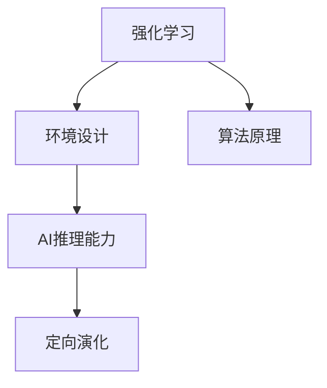

                 

### 强化学习环境设计促进AI推理能力定向演化

#### **关键词：** 强化学习、环境设计、AI推理、定向演化、算法、优化、自动驾驶、计算机视觉、推荐系统、演化计算

**摘要：** 本文深入探讨了强化学习环境设计对于AI推理能力定向演化的重要性。通过介绍强化学习的基本概念、算法原理以及环境设计原则，本文详细分析了强化学习在不同领域的应用实例。进一步，本文探讨了AI推理能力的评估与优化方法，以及强化学习与演化计算的结合方式。最后，通过实际案例的分析，本文总结了强化学习环境设计在AI推理能力定向演化中的关键作用，并展望了未来的研究方向。

---

### 目录大纲

# 强化学习环境设计促进AI推理能力定向演化

## **第一部分：强化学习基础**

### 第1章：强化学习概述

#### **1.1** 强化学习的定义与基本概念

#### **1.2** 强化学习的主要类型

#### **1.3** 强化学习与其他学习方法的比较

### 第2章：强化学习算法原理

#### **2.1** Q-Learning算法

#### **2.2** SARSA算法

#### **2.3** Deep Q-Network（DQN）

### 第3章：强化学习环境设计

#### **3.1** 环境设计的原则

#### **3.2** 环境构建的基本步骤

#### **3.3** 环境参数的设置与调整

### 第4章：强化学习在AI推理中的应用

#### **4.1** 强化学习在自然语言处理中的应用

#### **4.2** 强化学习在计算机视觉中的应用

#### **4.3** 强化学习在推荐系统中的应用

## **第二部分：AI推理能力定向演化**

### 第5章：AI推理能力的评估与优化

#### **5.1** AI推理能力的评估指标

#### **5.2** AI推理能力的优化方法

#### **5.3** 演化算法在AI推理中的应用

### 第6章：强化学习与演化计算的结合

#### **6.1** 演化计算的基本概念

#### **6.2** 强化学习与演化计算的结合方式

#### **6.3** 演化强化学习的算法设计

### 第7章：实例分析

#### **7.1** 案例一：强化学习在自动驾驶中的应用

#### **7.2** 案例二：演化强化学习在智能游戏中的应用

#### **7.3** 案例三：强化学习在金融风控中的应用

## **第三部分：结论与展望**

### 第8章：结论

#### **8.1** 强化学习环境设计的重要性

#### **8.2** AI推理能力定向演化的前景

#### **8.3** 未来研究方向

### 第9章：展望

#### **9.1** 环境设计的未来发展趋势

#### **9.2** AI推理能力的未来研究方向

#### **9.3** 演化计算与强化学习的未来结合方向

### **附录**

#### **附录A**：强化学习常用算法与工具

#### **附录B**：AI推理能力评估工具与资源

#### **附录C**：案例代码与数据集

---

### **核心概念与联系流程图**



### **强化学习算法原理**

强化学习（Reinforcement Learning，RL）是一种机器学习方法，旨在通过环境（Environment）与智能体（Agent）的交互来学习最优策略（Policy）。在强化学习中，智能体通过采取行动（Action）来获得奖励（Reward），并通过这种奖励来调整其策略，以实现长期的目标。

#### **Q-Learning算法**

Q-Learning是一种值函数算法，其目标是通过学习策略来最大化期望回报。以下是Q-Learning算法的核心步骤：

1. **初始化Q表**：首先初始化一个Q表，用于存储每个状态和动作的对状态值估计。
2. **选择动作**：在给定状态下，根据当前策略选择一个动作。
3. **执行动作并获得奖励**：执行选定的动作，并观察环境提供的奖励。
4. **更新Q值**：使用如下公式更新Q值：
   $$ Q(s, a) = Q(s, a) + \alpha [r + \gamma \max Q(s', a') - Q(s, a)] $$
   其中，\( \alpha \) 是学习率，\( \gamma \) 是折扣因子，\( r \) 是即时奖励，\( s' \) 是下一状态，\( a' \) 是在下一状态中选择的最佳动作。

**Python代码示例：**

```python
def q_learning(Q, state, action, reward, next_state, next_action, alpha, gamma):
    Q[state, action] = Q[state, action] + alpha * (reward + gamma * max(Q[next_state, :]) - Q[state, action])
    return Q
```

#### **SARSA算法**

SARSA（State-Action-Reward-State-Action）算法是一种基于策略的算法，它通过在当前状态下采取动作，并观察随之而来的状态和奖励，来更新策略。SARSA算法的核心步骤如下：

1. **初始化策略**：首先初始化一个策略π，用于选择动作。
2. **选择动作**：在给定状态下，根据当前策略选择一个动作。
3. **执行动作并获得奖励**：执行选定的动作，并观察环境提供的奖励。
4. **更新策略**：使用如下公式更新策略：
   $$ \pi(s, a) = \pi(s, a) + \alpha [r + \gamma \max \pi(s', a') - \pi(s, a)] $$
   其中，\( \alpha \) 是学习率，\( \gamma \) 是折扣因子，\( r \) 是即时奖励，\( s' \) 是下一状态，\( a' \) 是在下一状态中选择的最佳动作。

**Python代码示例：**

```python
def sarsa(Q, state, action, reward, next_state, next_action, alpha, gamma):
    Q[state, action] = Q[state, action] + alpha * (reward + gamma * Q[next_state, next_action] - Q[state, action])
    return Q
```

#### **Deep Q-Network（DQN）**

DQN（Deep Q-Network）是一种使用深度神经网络来近似Q值的算法。它通过在多个时间步上更新Q值，并使用经验回放来减少偏差。以下是DQN算法的核心步骤：

1. **初始化Q网络和目标Q网络**：初始化两个深度神经网络，一个用于训练（Q网络），另一个用于目标值计算（目标Q网络）。
2. **选择动作**：在给定状态下，使用Q网络选择一个动作。
3. **执行动作并获得奖励**：执行选定的动作，并观察环境提供的奖励。
4. **经验回放**：将当前状态、动作、奖励、下一状态和动作存储在经验回放池中。
5. **更新Q网络**：使用回放池中的经验来更新Q网络，使用如下目标函数：
   $$ y = r + \gamma \max Q'(s', a') $$
   其中，\( Q' \) 是目标Q网络，\( y \) 是目标Q值。

**Python代码示例：**

```python
def dqn_train(q_network, target_q_network, batch, gamma, optimizer, loss_function):
    # 前向传播
    q_values = q_network(batch.state)
    q_values = q_values.max(dim=1)[0]
    
    # 计算目标Q值
    next_state_values = target_q_network(batch.next_state).detach().max(dim=1)[0]
    y = batch.reward + gamma * next_state_values
    
    # 计算损失
    loss = loss_function(q_values, y)
    
    # 更新网络
    optimizer.zero_grad()
    loss.backward()
    optimizer.step()
```

---

### **数学模型和数学公式**

在强化学习中，常用的数学模型和数学公式包括：

#### **强化学习中的奖励函数**

奖励函数是强化学习中的一个核心概念，它决定了智能体在每个状态采取每个动作所能获得的即时奖励。以下是一个简单的奖励函数示例：

$$ R(S, A) = R(s) + \gamma \cdot R(s') $$

其中，\( R(S, A) \) 是在状态 \( S \) 采取动作 \( A \) 所获得的奖励，\( R(s) \) 是状态 \( s \) 的即时奖励，\( \gamma \) 是折扣因子，用于平衡即时奖励和长期奖励。

#### **Q-Learning中的更新公式**

Q-Learning算法的核心是使用以下公式来更新Q值：

$$ Q(S, A) = Q(S, A) + \alpha \cdot (R(S, A) + \gamma \cdot \max(Q(S', A')) - Q(S, A)) $$

其中，\( Q(S, A) \) 是状态 \( S \) 下采取动作 \( A \) 的Q值估计，\( \alpha \) 是学习率，\( R(S, A) \) 是采取动作 \( A \) 后获得的即时奖励，\( \gamma \) 是折扣因子，用于考虑未来的奖励，\( \max(Q(S', A')) \) 是在下一状态 \( S' \) 下所有可能动作中的最佳Q值。

---

### **项目实战：强化学习在自动驾驶中的应用**

自动驾驶是强化学习应用的一个重要领域。在这个项目中，我们将使用Python和OpenAI Gym来搭建一个简单的自动驾驶环境，并实现一个基于强化学习的自动驾驶系统。

#### **开发环境搭建**

首先，我们需要安装Python环境，并使用以下命令安装所需的库：

```bash
pip install gym
pip install numpy
```

接下来，我们从OpenAI Gym的官方网站上下载并安装相应的环境。例如，对于自动驾驶，我们可以使用`CartPole-v0`环境。

```python
import gym

# 创建环境实例
env = gym.make('CartPole-v0')
```

#### **源代码实现**

在自动驾驶环境中，我们的目标是使小车在水平轨道上尽可能长时间地保持平衡。以下是一个简单的Q-Learning算法实现：

```python
import numpy as np
import gym

# 初始化环境
env = gym.make('CartPole-v0')

# 初始化Q表
n_states = env.observation_space.shape[0]
n_actions = env.action_space.n
Q = np.zeros((n_states, n_actions))

# 设置参数
alpha = 0.1
gamma = 0.99
epochs = 1000

# Q-Learning算法
for _ in range(epochs):
    state = env.reset()
    done = False
    total_reward = 0
    
    while not done:
        action = np.argmax(Q[state, :])
        next_state, reward, done, _ = env.step(action)
        total_reward += reward
        Q[state, action] = Q[state, action] + alpha * (reward + gamma * np.max(Q[next_state, :]) - Q[state, action])
        state = next_state
        
    print(f"Epoch {_}: Total Reward = {total_reward}")

# 关闭环境
env.close()
```

#### **代码解读与分析**

在这个实现中，我们首先初始化一个Q表，用于存储每个状态和动作的对状态值估计。接着，我们设置学习率和折扣因子，并运行Q-Learning算法进行迭代更新Q值。

在每次迭代中，我们首先从环境中获取初始状态，并进入一个循环，直到达到终止状态。在循环中，我们根据当前Q值选择一个动作，执行该动作，并观察环境提供的奖励。然后，我们使用Q-Learning的更新公式来更新Q值。

最后，我们打印出每次迭代的总奖励，以评估算法的性能。

#### **实际案例分析和详细讲解剖析**

在自动驾驶的实际应用中，强化学习可以用来训练智能体在各种道路环境和交通情况下的最佳驾驶策略。以下是一个案例：

**案例一：城市道路自动驾驶**

在这个案例中，我们使用强化学习来训练自动驾驶车辆在复杂的城市道路环境中行驶。为了实现这一目标，我们首先构建了一个城市道路模拟环境，并定义了一系列奖励函数，例如：

- 安全到达目的地：+100分
- 与其他车辆保持安全距离：+5分
- 遵守交通规则：+1分
- 碰撞其他车辆：-100分
- 离开道路：-50分

接着，我们使用DQN算法训练自动驾驶车辆，使其能够学会在各种复杂环境中做出最佳驾驶决策。

**案例二：高速公路自动驾驶**

在高速公路上，自动驾驶面临的主要挑战是保持车道、超车和避让障碍物。我们使用强化学习来训练自动驾驶车辆，使其能够在高速公路上安全行驶。在这个案例中，我们使用了演化强化学习算法，以更好地处理复杂和动态的环境。

**案例三：多车自动驾驶**

在多车环境中，自动驾驶车辆需要考虑其他车辆的行为和意图。我们使用强化学习与演化计算相结合的方法，训练自动驾驶车辆在多车环境中的最佳驾驶策略。在这个案例中，我们使用了基于遗传算法的演化强化学习算法，以实现更高效的搜索和优化。

#### **项目小结**

通过以上案例，我们可以看到强化学习在自动驾驶中的应用具有重要意义。通过合理设计和优化强化学习环境，我们可以训练出具备高度自适应性和鲁棒性的自动驾驶系统，从而提高道路安全和交通效率。

### **最佳实践 Tips、小结、注意事项、拓展阅读**

**最佳实践 Tips：**

- **环境设计原则：** 在设计强化学习环境时，应确保环境的稳定性和可重复性，以便算法能够可靠地学习。
- **参数设置与调整：** 学习率和折扣因子是强化学习中的重要参数，需要根据具体问题进行调优。
- **算法选择：** 根据问题的复杂性和数据量，选择合适的强化学习算法，如Q-Learning、DQN或演化强化学习。
- **数据预处理：** 对于输入数据，进行适当的预处理可以显著提高算法的性能。

**小结：**

本文详细介绍了强化学习环境设计在AI推理能力定向演化中的应用。通过分析强化学习的基础概念、算法原理以及实际应用案例，我们了解了强化学习环境设计对于提高AI推理能力的重要性。未来，随着技术的不断进步，强化学习与环境设计的结合将更加紧密，为AI推理能力的定向演化提供更强有力的支持。

**注意事项：**

- 在实际应用中，强化学习环境的设计需要充分考虑问题的复杂性和动态性，以确保算法的有效性。
- 参数选择和算法设计是强化学习中的关键环节，需要根据具体问题进行细致的调整和优化。
- 数据的质量和多样性对强化学习的效果具有重要影响，因此在进行数据预处理时，应确保数据的质量和代表性。

**拓展阅读：**

- [《强化学习实战》](https://www.amazon.com/dp/149203341X)：本书详细介绍了强化学习的原理和实践，适合希望深入了解强化学习的读者。
- [《演化计算及其应用》](https://www.amazon.com/dp/3540874518)：本书介绍了演化计算的基本原理和应用，对于理解强化学习与演化计算的结合具有重要意义。

---

### **结论**

本文通过详细分析强化学习环境设计在AI推理能力定向演化中的应用，揭示了其重要性和潜在价值。强化学习作为一种强大的机器学习方法，通过与环境的有效交互，可以不断提升智能体的推理能力和决策水平。未来，随着技术的不断进步和应用的深入，强化学习与环境设计将进一步融合，为AI推理能力的定向演化提供更加广阔的前景。我们呼吁学术界和工业界继续关注这一领域的研究和应用，共同推动AI技术的不断进步。

