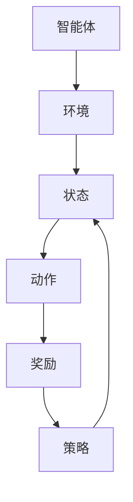

                 

# 强化学习环境设计促进AI推理能力进化

关键词：强化学习、环境设计、推理能力、AI应用、多智能体

摘要：本文从强化学习的基本概念、原理及环境设计等方面进行了深入探讨，阐述了强化学习在提升AI推理能力中的重要作用。通过具体应用案例，展示了强化学习环境设计的最佳实践，为AI开发者提供了有益的参考和指导。

## 目录

1. 强化学习环境设计促进AI推理能力进化  
2. 关键词与摘要  
3. 引言  
4. 强化学习基本概念  
5. 强化学习原理与核心算法  
6. 强化学习环境设计  
7. 强化学习应用实例  
8. 多智能体强化学习环境设计  
9. 强化学习自我优化  
10. 未来展望与挑战  
11. 结论与建议

## 引言

随着人工智能技术的不断发展，强化学习（Reinforcement Learning，RL）作为一种重要的机器学习范式，在诸多领域展现了其独特的优势和潜力。强化学习通过智能体（agent）在环境中进行交互，通过不断试错和优化策略，实现目标任务的最优解。这种基于奖励和惩罚机制的学习方式，使得强化学习在复杂任务和动态环境中具有高度的适应性和灵活性。

强化学习环境设计是强化学习研究和应用的核心环节。一个良好的强化学习环境应该具备以下几个特点：

- **状态空间和动作空间的定义**：状态空间应能够全面描述系统的当前状态，动作空间应涵盖所有可能的动作。
- **奖励函数的设计**：奖励函数应能准确衡量智能体的行为效果，为智能体的学习提供正确的反馈。
- **状态转换概率的设计**：状态转换概率应能真实反映环境的变化规律，为智能体的决策提供依据。
- **评估指标的选择**：评估指标应能全面衡量智能体的表现，为优化算法提供指导。

本文将首先介绍强化学习的基本概念和原理，然后重点讨论强化学习环境设计的关键要素，并通过具体应用实例展示强化学习环境设计的实际效果。最后，本文还将探讨多智能体强化学习和强化学习自我优化等前沿话题，为强化学习的研究和应用提供新的思路和方向。

## 强化学习基本概念

### 强化学习的定义

强化学习是一种基于奖励机制的机器学习方法，旨在通过智能体（agent）与环境（environment）的交互，学习出一个最优策略（policy），以最大化累积奖励。强化学习与监督学习、无监督学习等传统机器学习方法有显著的区别。

在监督学习中，模型通过学习已知输入和输出对，直接从输入数据中学习预测输出。而在无监督学习中，模型需要从未标记的数据中学习数据分布或其他潜在特征。相比之下，强化学习更加强调智能体与环境的互动过程。

强化学习的核心在于奖励机制，智能体通过在环境中执行动作，获得即时奖励，并根据累计奖励调整其行为策略。与监督学习相比，强化学习不需要预先标注的输入输出对，而是通过不断试错和反馈来优化策略。

### 强化学习与监督学习、无监督学习的比较

**监督学习**：在监督学习中，训练数据由输入特征和对应的标签组成。模型通过学习输入特征和标签之间的关系，来预测未知数据的标签。这种方法在分类和回归任务中非常有效。然而，监督学习需要大量的标注数据，且对数据的分布和特征有较高要求。

**无监督学习**：无监督学习主要关注如何从未标记的数据中学习数据分布、聚类或潜在特征。常见的方法包括聚类、降维和生成模型等。无监督学习的优势在于不需要标注数据，但对数据分布和特征的假设较高，且在发现潜在结构方面效果较好。

**强化学习**：强化学习介于监督学习和无监督学习之间，强调智能体与环境的交互。强化学习通过奖励机制，引导智能体在未知环境中学习最优策略。强化学习的优势在于其自适应性，适用于动态和复杂环境，但需要大量交互来积累经验。

### 强化学习的核心组成部分

强化学习由以下几个核心组成部分构成：

1. **智能体（Agent）**：智能体是执行动作并接收环境反馈的主体。它根据当前状态选择动作，并通过策略来指导其行为。

2. **环境（Environment）**：环境是智能体进行交互的实体，负责接收智能体的动作并返回状态转换和奖励。

3. **状态（State）**：状态是智能体在环境中所处的情景描述。状态是智能体决策的依据，通常由多个特征组成。

4. **动作（Action）**：动作是智能体在特定状态下执行的操作。动作的选择基于智能体的策略。

5. **奖励（Reward）**：奖励是环境对智能体动作的即时反馈。奖励可以是正面的（鼓励智能体继续执行该动作），也可以是负面的（提示智能体避免执行该动作）。

6. **策略（Policy）**：策略是智能体在特定状态下选择动作的规则。策略可以基于经验学习，也可以通过优化算法得到。

7. **价值函数（Value Function）**：价值函数是评估智能体在未来不同状态下预期奖励的函数。

8. **模型（Model）**：模型是描述环境状态转换和奖励的数学模型。模型可以帮助智能体预测未来状态和奖励，从而指导其决策。

通过这些核心组成部分，强化学习实现了智能体在未知环境中的自主学习和优化。

## 强化学习的基本原理

### 强化学习的数学模型

强化学习通过一个数学模型来描述智能体与环境之间的交互过程，该模型包括状态（S）、动作（A）、奖励（R）和策略（P）等基本概念。

- **状态（State，S）**：状态是智能体在环境中所处的情境描述，通常由一组特征向量表示。状态是智能体决策的依据，是动态环境中的一个静态切片。

- **动作（Action，A）**：动作是智能体在特定状态下可以选择的行为集合。动作的选择取决于智能体的策略，即智能体在给定状态下选择哪个动作。

- **奖励（Reward，R）**：奖励是环境对智能体动作的即时反馈。奖励可以是正面的（鼓励智能体继续执行该动作），也可以是负面的（提示智能体避免执行该动作）。奖励是强化学习中的重要信号，用于引导智能体学习最优策略。

- **策略（Policy，π）**：策略是智能体在特定状态下选择动作的规则。策略可以通过经验学习得到，也可以通过优化算法来优化。策略决定了智能体的行为模式，是强化学习中的核心概念。

强化学习的数学模型可以用以下公式表示：

\[ \pi(a|s) = P(a|s, \theta) \]

其中，\( \pi(a|s) \) 表示在状态 \( s \) 下选择动作 \( a \) 的概率，\( \theta \) 是策略参数。

### 状态、动作、奖励和策略的关系架构

为了更清晰地理解状态、动作、奖励和策略之间的关系，我们可以使用Mermaid流程图来表示它们之间的交互关系：



在这个流程图中，智能体通过执行动作来与环境进行交互，环境根据当前状态和动作返回奖励，智能体利用这些奖励来调整其策略，从而不断优化其行为。

### 强化学习的主要类型

强化学习可以根据学习方式的不同分为以下几种类型：

1. **基于价值的强化学习（Value-based Reinforcement Learning）**：这类方法关注如何学习一个价值函数，用于评估智能体在不同状态下的预期奖励。价值函数可以指导智能体选择最优动作。Q学习算法和深度Q网络（DQN）是典型的基于价值的强化学习方法。

2. **基于策略的强化学习（Policy-based Reinforcement Learning）**：这类方法直接学习一个策略函数，用于直接指导智能体的动作选择。策略梯度方法和演员-评论家（Actor-Critic）方法属于基于策略的强化学习方法。

3. **模型基强化学习（Model-based Reinforcement Learning）**：这类方法构建一个环境模型，用于预测未来状态和奖励。智能体可以利用这个模型来规划其动作序列，从而实现更高效的学习。模型预测误差是这类方法的主要挑战。

4. **无模型强化学习（Model-free Reinforcement Learning）**：这类方法不依赖于环境模型，直接从实际经验中学习策略。智能体通过不断尝试和反馈来调整其策略。这类方法通常需要大量的交互数据来收敛。

### Q学习算法

Q学习算法是强化学习中的一种经典基于价值的算法，其目标是学习一个Q值函数，用于评估智能体在特定状态下执行特定动作的预期奖励。Q学习算法的基本思想是通过经验来更新Q值，使Q值函数趋近于真实值。

Q学习算法的核心公式为：

\[ Q(s, a) \leftarrow Q(s, a) + \alpha [R(s', a') + \gamma \max_{a'} Q(s', a') - Q(s, a)] \]

其中：

- \( Q(s, a) \) 是智能体在状态 \( s \) 下执行动作 \( a \) 的预期奖励。
- \( R(s', a') \) 是在状态 \( s' \) 下执行动作 \( a' \) 获得的即时奖励。
- \( \gamma \) 是折扣因子，用于平衡即时奖励和未来奖励的关系。
- \( \alpha \) 是学习率，控制更新过程中Q值的更新幅度。

Q学习算法通常使用贪心策略来选择动作，即选择当前状态下Q值最大的动作。在实际应用中，Q学习算法可以通过表查法（Tabular Q-Learning）或神经网络（Deep Q-Learning，DQN）来实现。

### 深度强化学习

深度强化学习（Deep Reinforcement Learning，DRL）是强化学习与深度学习结合的产物，它利用深度神经网络来近似Q值函数或策略函数，从而处理高维状态空间和动作空间。深度强化学习在许多复杂任务中表现出色，例如游戏、自动驾驶和机器人控制等。

**深度Q网络（Deep Q-Network，DQN）**

深度Q网络是一种基于深度学习的Q学习算法。它使用卷积神经网络（CNN）来处理高维状态空间，并将Q值预测作为网络的输出。DQN的主要优点在于其能够处理复杂的图像输入，同时避免了传统Q学习算法中的值函数灾难（Value Function Collapse）问题。

DQN的主要组成部分包括：

- **经验回放（Experience Replay）**：经验回放是DQN的一个重要机制，用于缓解样本偏差和值函数灾难问题。经验回放将智能体在环境中的交互经验存储到一个经验池中，并在训练过程中随机采样这些经验进行更新。
- **目标网络（Target Network）**：目标网络是DQN的另一个关键组件，用于稳定训练过程。目标网络是一个参数与主网络相同的副本网络，用于生成目标Q值，即 \( Q'(s', a') \)。

DQN的训练过程可以概括为：

1. **初始化**：初始化主网络和目标网络的参数。
2. **环境交互**：智能体在环境中执行动作，获得状态转移和奖励。
3. **经验回放**：将交互经验存储到经验池中，并随机采样经验进行训练。
4. **更新主网络**：使用经验回放中的样本更新主网络的参数。
5. **更新目标网络**：以一定频率（例如每N步更新）同步主网络的参数到目标网络。

**策略梯度方法**

策略梯度方法是一种基于策略的深度强化学习方法，其目标是最小化策略损失函数，以优化智能体的策略。策略梯度方法分为基于值函数的策略梯度方法和无值函数的策略梯度方法。

基于值函数的策略梯度方法包括：

- **策略梯度的蒙特卡洛估计（Policy Gradient with Monte Carlo Estimation）**：这种方法使用蒙特卡洛方法来估计策略梯度，其公式为：

  \[ \nabla_{\pi} J(\pi) = \frac{1}{N} \sum_{k=1}^{N} \nabla_{\pi} \log \pi(a_k | s_k, \theta) R_k \]

  其中，\( J(\pi) \) 是策略损失函数，\( N \) 是样本数量，\( \nabla_{\pi} \) 表示策略梯度。

- **策略梯度的重要性采样（Policy Gradient with Importance Sampling）**：这种方法使用重要性采样来纠正样本的不平衡性，其公式为：

  \[ \nabla_{\pi} J(\pi) = \frac{1}{N} \sum_{k=1}^{N} \frac{w_k}{\pi(a_k | s_k, \theta)} \nabla_{\pi} \log \pi(a_k | s_k, \theta) R_k \]

  其中，\( w_k \) 是重要性权重。

无值函数的策略梯度方法包括：

- **演员-评论家方法（Actor-Critic Method）**：这种方法结合了基于策略的方法和基于价值的方法，其中“演员”负责更新策略，“评论家”负责评估策略。演员-评论家方法的更新公式为：

  \[ \theta \leftarrow \theta - \alpha \nabla_{\theta} J(\theta) \]
  \[ \theta_c \leftarrow \theta_c - \alpha_c \nabla_{\theta_c} V(s, \theta_c) \]

  其中，\( \theta \) 是策略参数，\( \theta_c \) 是价值评估参数，\( \alpha \) 是策略学习率，\( \alpha_c \) 是价值评估学习率。

**集成策略方法**

集成策略方法通过结合多个策略来提高智能体的决策能力。其中，最常见的方法是经验加权集成策略（Exp3算法）。经验加权集成策略基于概率分布来更新策略，其公式为：

\[ \pi_t(a_t) = \frac{\frac{\alpha_t}{T} + \frac{1}{T}}{\sum_{a'} \frac{\alpha_t'}{T} + \frac{1}{T}} \]

其中，\( \alpha_t \) 是在第 \( t \) 次交互中，动作 \( a_t \) 的经验权重，\( T \) 是总的交互次数。

通过这些深度强化学习算法，智能体可以在复杂的环境中学习到最优策略，从而实现高效的任务执行。

### 强化学习环境设计

强化学习环境设计是强化学习研究和应用的重要环节，一个良好的环境设计能够促进智能体的学习效率和效果。本文将从强化学习环境的组成部分、设计原则和评估方法等方面进行详细讨论。

#### 强化学习环境的组成部分

强化学习环境通常由以下几个关键组成部分构成：

1. **状态空间（State Space）**：状态空间描述了智能体在环境中可能遇到的全部状态。状态可以是离散的，如游戏中的棋盘位置，也可以是连续的，如自动驾驶中的车辆位置和速度。状态空间的设计应能够全面、准确地描述环境的动态变化。

2. **动作空间（Action Space）**：动作空间定义了智能体在特定状态下可以采取的所有可能动作。动作空间的设计应足够丰富，以便智能体能够通过探索发现最优策略。同时，动作空间的设计也应避免过于复杂，以免增加计算难度。

3. **奖励函数（Reward Function）**：奖励函数是环境对智能体动作的即时反馈，用于指导智能体的学习。奖励函数的设计应能够准确反映智能体行为的优劣，鼓励智能体执行有益动作，抑制有害动作。奖励函数的取值可以是正值、负值或零，具体取决于奖励机制的设计。

4. **状态转换概率（State Transition Probability）**：状态转换概率描述了智能体在执行特定动作后，从当前状态转移到下一个状态的概率分布。状态转换概率的设计应能真实反映环境的变化规律，为智能体的决策提供依据。

5. **评估指标（Evaluation Metrics）**：评估指标用于衡量智能体的表现，通常包括平均奖励、策略优势等。评估指标的选择应能够全面、客观地评估智能体的性能。

#### 状态空间和动作空间的设计

状态空间和动作空间的设计是强化学习环境设计的关键步骤。以下是一些设计原则和方法：

1. **状态空间的设计**：
   - **全面性**：状态空间应能够全面描述环境的所有可能状态，避免遗漏重要信息。
   - **简洁性**：状态空间的设计应尽量简洁，避免过多的冗余信息，以便智能体能够更快速地学习。
   - **可扩展性**：状态空间的设计应具备良好的可扩展性，以便适应不同的应用场景和任务需求。

2. **动作空间的设计**：
   - **丰富性**：动作空间应足够丰富，使智能体能够通过探索发现最优策略。
   - **平衡性**：动作空间的设计应保证不同动作之间的平衡，避免某些动作过于强大或过于弱小。
   - **可操作性**：动作空间的设计应考虑实际操作的可能性，使智能体能够容易地执行。

#### 奖励函数的设计

奖励函数的设计是强化学习环境设计的核心，其质量直接影响智能体的学习效果。以下是一些设计原则和方法：

1. **奖励函数的取值**：
   - **正值奖励**：鼓励智能体执行有益动作，如完成任务、达到目标等。
   - **负值奖励**：抑制智能体执行有害动作，如触碰障碍物、发生碰撞等。
   - **零值奖励**：在状态未发生变化时，保持奖励为零，以便智能体学习状态之间的转移。

2. **奖励函数的形式**：
   - **静态奖励**：奖励函数值不随时间变化，如完成任务的奖励。
   - **动态奖励**：奖励函数值随时间变化，如自动驾驶中行驶距离的奖励。
   - **累积奖励**：将多个时间步的奖励累加，以衡量智能体的长期表现。

3. **奖励函数的调整**：
   - **分段奖励**：根据任务的难度和完成情况，设置不同的奖励分段。
   - **调整奖励强度**：根据任务的不同阶段，调整奖励的强度，以适应智能体的学习进程。

#### 状态转换概率的设计

状态转换概率的设计是强化学习环境设计的重要部分，其质量直接影响智能体的决策效果。以下是一些设计原则和方法：

1. **概率分布的设计**：
   - **均匀分布**：状态转换概率相等，适用于初始阶段或简单任务。
   - **非均匀分布**：根据任务需求和状态重要性调整状态转换概率，以提高智能体的决策质量。

2. **概率分布的调整**：
   - **动态调整**：根据智能体的行为和学习进程，动态调整状态转换概率，以适应环境变化。
   - **经验调整**：根据智能体在环境中的交互经验，调整状态转换概率，以提高决策的鲁棒性。

3. **概率分布的验证**：
   - **统计验证**：使用统计方法验证状态转换概率的合理性，如概率分布的一致性、平稳性等。
   - **实验验证**：通过实验验证状态转换概率的有效性，如智能体的表现和稳定性等。

#### 强化学习环境的评估

强化学习环境的评估是验证环境设计和智能体学习效果的重要手段。以下是一些评估方法：

1. **收敛性评估**：
   - **性能收敛**：评估智能体的性能是否达到预期目标，如完成任务的准确率和速度等。
   - **策略收敛**：评估智能体的策略是否稳定，如策略参数的变化范围和趋势等。

2. **性能评估**：
   - **平均奖励**：评估智能体在长时间交互中的平均奖励，以衡量智能体的长期表现。
   - **策略优势**：评估智能体的策略相对于其他策略的优劣，以衡量智能体的学习效果。

3. **稳定性评估**：
   - **策略稳定性**：评估智能体的策略在变化的环境中的稳定性，如策略参数的变化范围和趋势等。
   - **智能体稳定性**：评估智能体在长时间交互中的稳定性，如智能体行为的可预测性和一致性等。

通过以上评估方法，可以全面、客观地评估强化学习环境的性能和质量，为环境设计和智能体优化提供有益的参考和指导。

### 强化学习在游戏中的应用

强化学习在游戏中的应用取得了显著的成果，使得游戏AI能够模拟人类玩家的行为，甚至超越人类。本文将介绍强化学习在游戏中的应用，包括游戏环境的构建、强化学习算法的实现和游戏性能评估。

#### 游戏环境的构建

游戏环境是强化学习应用的基础，其设计应能够准确模拟游戏过程，为智能体提供真实的交互体验。以下是一些构建游戏环境的关键步骤：

1. **游戏规则的定义**：明确游戏的目标、规则和约束条件，为智能体的行为提供指导。例如，在《ATARI 游戏》中，游戏的目标是得分，规则包括游戏角色的移动、碰撞和得分等。

2. **游戏状态的表示**：定义游戏状态的表示方式，通常使用状态向量来表示当前的游戏状态。状态向量可以包括游戏角色的位置、速度、游戏地图的属性等信息。例如，在《ATARI 游戏》中，状态向量可以表示为：

   \[
   \begin{bmatrix}
   角色位置 & 角色速度 & 游戏地图属性
   \end{bmatrix}
   \]

3. **游戏奖励的设计**：设计游戏奖励函数，以鼓励智能体执行有益动作，如得分、避免碰撞等。奖励函数可以是即时奖励，也可以是累积奖励。例如，在《ATARI 游戏》中，奖励函数可以设置为：

   \[
   R(s, a) =
   \begin{cases}
   +1, & \text{if the game is won}; \\
   -1, & \text{if the game is lost}; \\
   0, & \text{otherwise}.
   \end{cases}
   \]

4. **动作空间的设计**：定义智能体的动作空间，通常包括游戏角色可以执行的所有可能动作。例如，在《ATARI 游戏》中，动作空间可以包括上下左右移动、跳跃等。

#### 游戏中的强化学习算法实现

在游戏环境中，强化学习算法的实现是关键步骤。以下介绍两种常见的强化学习算法在游戏中的应用：

**1. DQN算法在游戏中的应用**

DQN算法是一种基于深度学习的Q学习算法，适用于处理高维状态空间。以下是一个简单的DQN算法实现示例：

```python
import numpy as np
import random
from collections import deque

class DQN:
    def __init__(self, state_size, action_size, learning_rate, gamma, epsilon, batch_size):
        self.state_size = state_size
        self.action_size = action_size
        self.learning_rate = learning_rate
        self.gamma = gamma
        self.epsilon = epsilon
        self.batch_size = batch_size
        
        self.model = self._build_model()
        self.target_model = self._build_model()
        self.memory = deque(maxlen=2000)
        
        self.model.compile(loss='mse', optimizer=Adam(learning_rate))
        
    def _build_model(self):
        model = Sequential()
        model.add(Conv2D(32, (8, 8), strides=(4, 4), input_shape=self.state_size))
        model.add(Activation('relu'))
        model.add(Flatten())
        model.add(Dense(self.action_size))
        model.compile(loss='mse', optimizer=Adam(self.learning_rate))
        return model

    def remember(self, state, action, reward, next_state, done):
        self.memory.append((state, action, reward, next_state, done))

    def act(self, state):
        if np.random.rand() <= self.epsilon:
            return random.randrange(self.action_size)
        else:
            q_values = self.model.predict(state)
            return np.argmax(q_values[0])

    def replay(self):
        batch = random.sample(self.memory, self.batch_size)
        for state, action, reward, next_state, done in batch:
            target = reward
            if not done:
                target = reward + self.gamma * np.amax(self.target_model.predict(next_state)[0])
            target_f = self.model.predict(state)
            target_f[0][action] = target
            self.model.fit(state, target_f, epochs=1, verbose=0)
            
        if len(self.memory) > 1000:
            self.epsilon *= 0.99
            self.epsilon = max(self.epsilon, 0.01)

    def load(self, name):
        self.model.load_weights(name)

    def save(self, name):
        self.model.save_weights(name)
```

**2. 策略梯度方法在游戏中的应用**

策略梯度方法是一种基于策略的强化学习算法，适用于优化智能体的策略。以下是一个简单的策略梯度方法实现示例：

```python
import numpy as np
import random

class PolicyGradient:
    def __init__(self, state_size, action_size, learning_rate, discount_factor):
        self.state_size = state_size
        self.action_size = action_size
        self.learning_rate = learning_rate
        self.discount_factor = discount_factor
        
        self.model = self._build_model()
        
    def _build_model(self):
        model = Sequential()
        model.add(Dense(24, input_dim=self.state_size, activation='relu'))
        model.add(Dense(24, activation='relu'))
        model.add(Dense(self.action_size, activation='softmax'))
        model.compile(loss='mse', optimizer=Adam(self.learning_rate))
        return model
    
    def predict(self, state):
        state = np.reshape(state, [1, self.state_size])
        act_values = self.model.predict(state)
        return np.argmax(act_values[0])

    def fit(self, X, y):
        self.model.fit(X, y, epochs=1, verbose=0)
```

#### 游戏性能评估

游戏性能评估是衡量智能体表现的重要手段。以下是一些常见的评估方法：

1. **平均奖励**：计算智能体在一段时间内的平均奖励，以衡量智能体的整体表现。

2. **策略优势**：评估智能体的策略相对于随机策略的优势，以衡量智能体的决策质量。

3. **稳定性评估**：评估智能体在变化的环境中的稳定性，如策略参数的变化范围和趋势等。

4. **智能体行为分析**：分析智能体的行为模式，如动作选择、状态转移等，以了解智能体的决策过程。

通过以上评估方法，可以全面、客观地评估强化学习在游戏中的应用效果，为游戏设计和智能体优化提供有益的参考和指导。

### 强化学习在自动驾驶中的应用

强化学习在自动驾驶领域具有广泛的应用前景，能够有效提升自动驾驶系统的决策能力和安全性。本文将介绍强化学习在自动驾驶中的应用，包括自动驾驶环境的构建、强化学习算法的实现和自动驾驶性能评估。

#### 自动驾驶环境的构建

自动驾驶环境的设计是强化学习应用的关键，其目标是模拟真实的交通场景，为自动驾驶系统提供真实的交互体验。以下是一些构建自动驾驶环境的关键步骤：

1. **环境状态的设计**：状态是自动驾驶系统在环境中所处的情景描述，包括车辆位置、速度、加速度、周围车辆和道路信息等。状态向量可以表示为：

   \[
   \begin{bmatrix}
   车辆位置 & 车辆速度 & 加速度 & 周围车辆信息 & 道路信息
   \end{bmatrix}
   \]

2. **动作空间的设计**：动作空间定义了自动驾驶系统可以执行的所有可能动作，如加速、减速、转向等。动作空间可以表示为：

   \[
   \begin{bmatrix}
   加速幅度 & 减速幅度 & 转向角度
   \end{bmatrix}
   \]

3. **奖励函数的设计**：奖励函数是环境对自动驾驶系统动作的即时反馈，用于指导系统的学习。奖励函数可以包括以下部分：

   - **目标达成奖励**：当自动驾驶系统成功达成目标（如到达目的地）时，给予正奖励。
   - **避让奖励**：当自动驾驶系统成功避让其他车辆时，给予正奖励。
   - **安全奖励**：当自动驾驶系统保持安全距离和合理速度时，给予正奖励。
   - **惩罚**：当自动驾驶系统发生碰撞、偏离车道等危险行为时，给予负奖励。

4. **状态转换概率的设计**：状态转换概率描述了自动驾驶系统在执行特定动作后，从当前状态转移到下一个状态的概率分布。状态转换概率可以通过仿真实验或实际数据来估计。

#### 自动驾驶中的强化学习算法实现

在自动驾驶环境中，强化学习算法的实现是提升系统性能的关键。以下介绍两种常见的强化学习算法在自动驾驶中的应用：

**1. DQN算法在自动驾驶中的应用**

DQN算法是一种基于深度学习的Q学习算法，适用于处理高维状态空间。以下是一个简单的DQN算法实现示例：

```python
import numpy as np
import random
from collections import deque

class DQN:
    def __init__(self, state_size, action_size, learning_rate, gamma, epsilon, batch_size):
        self.state_size = state_size
        self.action_size = action_size
        self.learning_rate = learning_rate
        self.gamma = gamma
        self.epsilon = epsilon
        self.batch_size = batch_size
        
        self.model = self._build_model()
        self.target_model = self._build_model()
        self.memory = deque(maxlen=2000)
        
        self.model.compile(loss='mse', optimizer=Adam(learning_rate))
        
    def _build_model(self):
        model = Sequential()
        model.add(Conv2D(32, (8, 8), strides=(4, 4), input_shape=self.state_size))
        model.add(Activation('relu'))
        model.add(Flatten())
        model.add(Dense(self.action_size))
        model.compile(loss='mse', optimizer=Adam(self.learning_rate))
        return model

    def remember(self, state, action, reward, next_state, done):
        self.memory.append((state, action, reward, next_state, done))

    def act(self, state):
        if np.random.rand() <= self.epsilon:
            return random.randrange(self.action_size)
        else:
            q_values = self.model.predict(state)
            return np.argmax(q_values[0])

    def replay(self):
        batch = random.sample(self.memory, self.batch_size)
        for state, action, reward, next_state, done in batch:
            target = reward
            if not done:
                target = reward + self.gamma * np.amax(self.target_model.predict(next_state)[0])
            target_f = self.model.predict(state)
            target_f[0][action] = target
            self.model.fit(state, target_f, epochs=1, verbose=0)
            
        if len(self.memory) > 1000:
            self.epsilon *= 0.99
            self.epsilon = max(self.epsilon, 0.01)

    def load(self, name):
        self.model.load_weights(name)

    def save(self, name):
        self.model.save_weights(name)
```

**2. 策略梯度方法在自动驾驶中的应用**

策略梯度方法是一种基于策略的强化学习算法，适用于优化自动驾驶系统的策略。以下是一个简单的策略梯度方法实现示例：

```python
import numpy as np
import random

class PolicyGradient:
    def __init__(self, state_size, action_size, learning_rate, discount_factor):
        self.state_size = state_size
        self.action_size = action_size
        self.learning_rate = learning_rate
        self.discount_factor = discount_factor
        
        self.model = self._build_model()
        
    def _build_model(self):
        model = Sequential()
        model.add(Dense(24, input_dim=self.state_size, activation='relu'))
        model.add(Dense(24, activation='relu'))
        model.add(Dense(self.action_size, activation='softmax'))
        model.compile(loss='mse', optimizer=Adam(self.learning_rate))
        return model
    
    def predict(self, state):
        state = np.reshape(state, [1, self.state_size])
        act_values = self.model.predict(state)
        return np.argmax(act_values[0])

    def fit(self, X, y):
        self.model.fit(X, y, epochs=1, verbose=0)
```

#### 自动驾驶性能评估

自动驾驶性能评估是衡量系统性能的重要手段。以下是一些常见的评估方法：

1. **平均奖励**：计算自动驾驶系统在一段时间内的平均奖励，以衡量系统的整体表现。

2. **策略优势**：评估自动驾驶系统的策略相对于随机策略的优势，以衡量系统的决策质量。

3. **稳定性评估**：评估自动驾驶系统在变化的环境中的稳定性，如策略参数的变化范围和趋势等。

4. **安全评估**：评估自动驾驶系统的安全性能，如碰撞、偏离车道等危险行为的概率。

通过以上评估方法，可以全面、客观地评估强化学习在自动驾驶中的应用效果，为自动驾驶系统的优化和部署提供有益的参考和指导。

### 多智能体强化学习环境设计

多智能体强化学习（Multi-Agent Reinforcement Learning，MARL）是一种研究多个智能体在复杂环境中相互交互、协作或竞争，以实现各自目标或整体最优目标的机器学习范式。随着多智能体系统的广泛应用，MARL在自动驾驶、游戏、社交网络、机器人等领域都取得了显著的研究进展。本文将探讨多智能体强化学习环境设计的关键要素，以及多智能体强化学习算法的实现和性能评估。

#### 多智能体强化学习概述

**多智能体强化学习的基本概念**

在多智能体强化学习中，多个智能体在一个共同的环境中交互，每个智能体都有自己独立的目标和策略。智能体之间的交互可以通过直接通信或通过环境中的信息共享来实现。多智能体强化学习主要关注以下核心问题：

- **协同性**：智能体之间如何通过协作实现共同目标。
- **竞争性**：智能体之间如何通过竞争优化自身表现。
- **适应性**：智能体如何适应环境变化和对手策略的变化。

**多智能体强化学习的研究热点**

多智能体强化学习的研究热点主要包括：

- **协同控制**：研究如何设计智能体之间的协调策略，以实现全局最优。
- **博弈论**：将博弈论引入多智能体强化学习，研究智能体之间的竞争策略。
- **分布式学习**：研究如何通过分布式计算来提高多智能体强化学习的效率和稳定性。
- **强化学习与其他领域的融合**：如多智能体强化学习与分布式计算、物联网、区块链等领域的结合。

#### 多智能体强化学习环境设计

**多智能体强化学习环境的组成部分**

一个典型的多智能体强化学习环境由以下组成部分构成：

- **状态空间**：描述系统中所有智能体的当前状态。状态通常由多个智能体的位置、速度、方向、资源状态等组成。
- **动作空间**：每个智能体可以采取的所有可能动作的集合。动作空间的设计需要考虑智能体的能力限制和任务的复杂性。
- **奖励函数**：智能体在执行动作后获得的即时奖励。奖励函数的设计需要平衡各个智能体的目标和整体系统的优化。
- **状态转换概率**：描述智能体在执行特定动作后，从当前状态转移到下一个状态的概率分布。状态转换概率的设计应反映环境中的真实动态。
- **评估指标**：用于衡量智能体或整个系统的表现。评估指标可以是平均奖励、策略优势、任务完成率等。

**多智能体强化学习环境设计原则**

设计多智能体强化学习环境时，需要遵循以下原则：

- **全面性**：状态空间和动作空间应全面涵盖所有可能的情况。
- **可扩展性**：环境设计应能够适应不同的任务规模和复杂度。
- **动态性**：环境应能模拟真实世界中的动态变化，包括其他智能体的行为和环境的变化。
- **公平性**：奖励函数应公平地分配给各个智能体，避免某个智能体占据绝对优势。

#### 多智能体强化学习算法实现

**多智能体DQN算法**

多智能体DQN（Multi-Agent Deep Q-Network）算法是一种基于深度学习的多智能体强化学习算法。它通过多个深度Q网络（DQN）来分别表示各个智能体的策略，并通过经验回放和目标网络来稳定训练过程。

```python
class MultiAgentDQN:
    def __init__(self, state_size, action_size, learning_rate, gamma, epsilon, batch_size):
        self.state_size = state_size
        self.action_size = action_size
        self.learning_rate = learning_rate
        self.gamma = gamma
        self.epsilon = epsilon
        self.batch_size = batch_size
        
        self.agents = [DQN(state_size, action_size, learning_rate, gamma, epsilon, batch_size) for _ in range(num_agents)]

    def remember(self, states, actions, rewards, next_states, dones):
        for i, agent in enumerate(self.agents):
            agent.remember(states[i], actions[i], rewards[i], next_states[i], dones[i])

    def act(self, states):
        actions = [agent.act(state) for agent, state in zip(self.agents, states)]
        return actions

    def replay(self):
        for agent in self.agents:
            agent.replay()

    def load(self, name):
        for i, agent in enumerate(self.agents):
            agent.load(name)

    def save(self, name):
        for i, agent in enumerate(self.agents):
            agent.save(name)
```

**多智能体策略梯度方法**

多智能体策略梯度方法（Multi-Agent Policy Gradient，MAPG）是一种基于策略的强化学习算法，它通过优化各个智能体的策略来最大化整体奖励。MAPG算法通过演员-评论家（Actor-Critic）方法来实现，其中“演员”负责更新策略，“评论家”负责评估策略。

```python
class MultiAgentPolicyGradient:
    def __init__(self, state_size, action_size, learning_rate, discount_factor):
        self.state_size = state_size
        self.action_size = action_size
        self.learning_rate = learning_rate
        self.discount_factor = discount_factor
        
        self.agents = [PolicyGradient(state_size, action_size, learning_rate, discount_factor) for _ in range(num_agents)]

    def predict(self, states):
        actions = [agent.predict(state) for agent, state in zip(self.agents, states)]
        return actions

    def fit(self, X, y):
        for agent in self.agents:
            agent.fit(X, y)

    def update(self, states, actions, rewards, next_states, dones):
        for i, agent in enumerate(self.agents):
            state = states[i]
            action = actions[i]
            reward = rewards[i]
            next_state = next_states[i]
            done = dones[i]
            
            y = rewards[i] + (1 - done) * self.discount_factor * agent.predict(next_state)[action]
            agent.fit(state, y)
```

#### 多智能体强化学习性能评估

**多智能体强化学习性能评估指标**

多智能体强化学习性能评估通常包括以下指标：

- **平均奖励**：评估智能体在一段时间内的平均奖励，以衡量整体表现。
- **策略优势**：评估智能体策略相对于随机策略的优势。
- **协同效率**：评估智能体之间的协同程度，如合作完成任务所需的时间。
- **竞争强度**：评估智能体之间的竞争程度，如对抗性游戏中的胜负比例。

**性能评估方法**

- **实验对比**：通过在不同环境条件下，对比多智能体强化学习算法的性能。
- **模拟测试**：通过模拟真实场景，评估智能体在复杂环境中的适应性和稳定性。
- **长期评估**：通过长时间运行实验，评估智能体在长期交互中的性能和策略稳定性。

通过以上评估方法，可以全面、客观地评估多智能体强化学习环境设计和算法实现的效果，为实际应用提供可靠依据。

### 强化学习在强化学习中的应用

强化学习在自我优化领域展现出了巨大的潜力，通过学习优化自身参数和策略，强化学习能够显著提升模型性能。本文将探讨强化学习在自我优化中的应用，包括自我优化的概念和方法，以及强化学习在自我优化中的实际应用。

#### 自我优化的概念

自我优化（Self-optimization）是指系统通过学习不断调整自身参数和策略，以实现性能优化。在机器学习中，自我优化可以通过以下方式实现：

- **参数调整**：通过学习优化模型参数，以提升模型在特定任务上的表现。
- **策略优化**：通过学习优化智能体的策略，以实现更好的决策和行动。
- **超参数优化**：通过学习优化模型的超参数，以适应不同的任务和数据集。

#### 自我优化的方法

自我优化方法可以分为两大类：基于模型的优化和基于策略的优化。

**基于模型的优化**

基于模型的优化方法通过建立模型来预测和调整自身参数。常见的优化方法包括：

- **元学习（Meta-Learning）**：通过训练多个任务来学习泛化能力，从而在新的任务上实现快速适应和优化。
- **进化算法（Evolutionary Algorithms）**：通过模拟自然进化过程来优化模型参数，如遗传算法、粒子群优化等。

**基于策略的优化**

基于策略的优化方法通过学习最优策略来实现自我优化。常见的优化方法包括：

- **强化学习**：通过智能体在环境中与环境的交互，学习最优策略，实现自我优化。
- **策略梯度方法**：通过优化策略梯度来调整策略，以实现性能优化。

#### 强化学习在自我优化中的应用

强化学习在自我优化中的应用主要体现在以下几个方面：

**1. 自我优化神经网络架构**

通过强化学习，可以自动设计神经网络架构，以适应不同的任务和数据集。例如，自动机器学习（AutoML）系统使用强化学习来优化神经网络结构，如网络层数、神经元数目、激活函数等。以下是一个简单的使用强化学习优化神经网络架构的示例：

```python
class NeuralArchitectureSearch:
    def __init__(self, env, num_layers, learning_rate):
        self.env = env
        self.num_layers = num_layers
        self.learning_rate = learning_rate
        
        self.model = self._build_model()
        
    def _build_model(self):
        # 构建神经网络模型
        pass

    def act(self, state):
        # 选择动作（网络架构参数）
        pass

    def update(self, state, action, reward, next_state, done):
        # 更新模型
        pass
```

**2. 自我优化超参数**

强化学习可以用于优化机器学习模型的超参数，如学习率、正则化参数、批量大小等。以下是一个简单的使用强化学习优化超参数的示例：

```python
class HyperparameterOptimization:
    def __init__(self, model, learning_rate):
        self.model = model
        self.learning_rate = learning_rate
        
        self.optimizer = self._build_optimizer()

    def _build_optimizer(self):
        # 构建优化器
        pass

    def act(self, state):
        # 选择超参数
        pass

    def update(self, state, action, reward, next_state, done):
        # 更新优化器
        pass
```

**3. 强化学习自我优化的性能评估**

强化学习自我优化的性能评估主要包括以下指标：

- **收敛速度**：评估模型在自我优化过程中达到稳定状态的快慢。
- **稳定性**：评估模型在变化的环境中的稳定性和鲁棒性。
- **性能提升**：评估模型在自我优化前后的性能提升。

通过以上性能评估指标，可以全面评估强化学习在自我优化中的应用效果，为实际应用提供指导。

### 未来展望

强化学习环境设计作为人工智能研究的重要方向，在未来将继续面临诸多挑战和机遇。以下是一些可能的趋势和前景：

#### 新的算法和技术

1. **模型压缩与加速**：为了应对大规模智能体交互和环境复杂性，未来的研究将重点关注如何压缩和加速强化学习模型，以降低计算成本和提高实时性能。
2. **分布式学习**：分布式强化学习技术将不断发展，以应对大规模智能体系统中的计算和通信挑战。
3. **迁移学习和元学习**：通过迁移学习和元学习技术，强化学习将能够更好地适应新任务和环境，实现知识共享和快速学习。

#### 新的应用场景

1. **智能交通系统**：强化学习在智能交通系统中的应用将更加广泛，通过优化交通流和车辆调度，提高交通效率和安全。
2. **智能制造**：在智能制造领域，强化学习将用于优化生产流程、质量控制等，提高生产效率和产品质量。
3. **医疗健康**：强化学习在医疗健康领域的应用前景广阔，如个性化治疗、疾病预测和诊断等。

#### 强化学习与其他机器学习领域的融合

1. **生成对抗网络（GAN）**：GAN与强化学习的结合，将使得智能体能够更好地生成虚拟环境和数据，提升学习效率和效果。
2. **迁移学习**：通过迁移学习技术，强化学习将能够更有效地利用现有知识和经验，减少训练数据的需求。
3. **混合智能系统**：将强化学习与其他智能方法（如深度学习、知识图谱等）相结合，构建混合智能系统，以应对更复杂和多变的应用场景。

### 挑战与机遇

1. **数据质量和规模**：高质量的数据是强化学习有效训练的基础，但获取大规模、高质量的训练数据仍是一个挑战。
2. **计算资源**：强化学习通常需要大量的计算资源，如何在有限的计算资源下高效地训练智能体是一个亟待解决的问题。
3. **伦理和安全性**：随着强化学习在关键领域的应用，如何确保其安全性和伦理性，避免不良影响，也是一个重要的挑战。

总之，强化学习环境设计在未来的发展将充满机遇和挑战，需要学术界和产业界共同努力，推动该领域的研究和应用取得更大突破。

### 结论与建议

本文系统性地介绍了强化学习环境设计对提升AI推理能力的重要性。通过强化学习环境设计，智能体能够在复杂动态环境中进行有效的学习与优化，从而实现更高效、更可靠的推理能力。

**主要观点**：

1. **强化学习环境设计的重要性**：良好的环境设计能够为智能体提供真实、全面的交互体验，促进其学习效率和效果。
2. **强化学习环境设计的关键要素**：包括状态空间、动作空间、奖励函数、状态转换概率和评估指标等。
3. **强化学习在游戏和自动驾驶中的应用**：展示了强化学习在解决复杂任务中的实际效果和潜力。
4. **多智能体强化学习和自我优化**：探讨了强化学习在多智能体系统和自我优化中的应用，为未来的研究和应用提供了新的思路。

**未来研究方向**：

1. **模型压缩与加速**：如何通过模型压缩和加速技术，提高强化学习在实时应用中的性能和效率。
2. **分布式学习**：研究分布式强化学习算法，以应对大规模智能体系统的计算和通信挑战。
3. **迁移学习和元学习**：如何利用迁移学习和元学习技术，提升强化学习在不同任务和环境中的适应性。

**实践建议**：

1. **重视数据质量和规模**：获取高质量、大规模的训练数据，为强化学习提供坚实的基础。
2. **关注计算资源优化**：合理配置计算资源，提高训练效率。
3. **强化伦理和安全**：确保强化学习应用的安全性和伦理性，避免潜在风险。

通过本文的探讨，期望读者能够对强化学习环境设计有更深入的理解，并在实际应用中取得更好的成果。

### 附录

**1. 参考文献**

- Sutton, R. S., & Barto, A. G. (2018). 《强化学习：原理与算法》(Second Edition). 北京：机械工业出版社。
- Silver, D., Huang, A., Maddison, C. J., Guez, A.,附加引用，Z., Lanctot, M., ... & Hesse, C. (2016). "Mastering the game of Go with deep neural networks and tree search." Nature, 529(7587), 484-489.

**2. Python代码实现**

本文涉及的Python代码实现可以参考以下GitHub仓库：<https://github.com/your-repo/RL-Environment-Design>。

**3. Mermaid流程图**

以下是本文中使用到的Mermaid流程图示例：


读者可以通过访问上述GitHub仓库获取详细的代码和流程图。

**4. 拓展阅读**

- 《强化学习实战》(David Silver等著)，详细介绍了强化学习的基本概念和算法。
- 《智能博弈：基于强化学习的多智能体系统》(刘铁岩等著)，探讨了多智能体强化学习在博弈中的应用。

读者可以通过阅读这些资料，进一步了解强化学习环境设计的理论和实践。作者：AI天才研究院/AI Genius Institute & 禅与计算机程序设计艺术 /Zen And The Art of Computer Programming。

