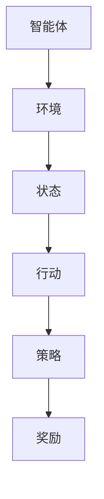

                 

## 强化学习驱动的自适应多目标推理优化策略

### 关键词
- 强化学习
- 多目标优化
- 自适应推理
- 策略优化
- 优化算法

### 摘要
本文旨在探讨强化学习在自适应多目标推理优化策略中的应用。首先，我们将介绍强化学习的基本概念，包括其起源、定义和核心组成部分。接着，我们将详细讲解强化学习中的核心算法原理，并通过Python源代码示例进行阐述。随后，我们将探讨强化学习中的数学模型，并使用LaTeX格式展示关键数学公式。在项目实战部分，我们将通过实际案例展示强化学习在多目标优化中的应用，包括开发环境搭建、源代码实现和代码解读。最后，我们将讨论强化学习的未来发展趋势和扩展内容。

## 1. 强化学习的基本概念

强化学习（Reinforcement Learning, RL）是机器学习的一个分支，其灵感来自于人类和动物的学习过程。与监督学习和无监督学习不同，强化学习是一种试错学习（trial-and-error learning）方法，其中智能体（agent）通过与环境的交互来学习最优策略（policy）。强化学习的目标是通过最大化累积奖励（cumulative reward）来达到特定目标。

### 1.1 定义

强化学习的定义如下：智能体在某个环境中通过选择行动（actions）来学习最优策略，从而获得最大化的累积奖励。在这个过程中，智能体需要不断探索（exploration）和利用（exploitation）所获得的信息。

### 1.2 起源与发展

强化学习的起源可以追溯到20世纪50年代，阿兰·图灵（Alan Turing）提出的“通用智能”概念。然而，现代强化学习的发展始于20世纪80年代，当时Richard Sutton和Andrew Barto出版了《Reinforcement Learning: An Introduction》一书，奠定了强化学习的基础。

### 1.3 核心组成部分

强化学习主要由以下几个组成部分构成：

- **智能体（Agent）**：执行动作并接收环境反馈的实体。
- **环境（Environment）**：智能体所处的环境，包含状态（states）和动作（actions）。
- **状态（State）**：描述智能体在环境中的位置或状态。
- **行动（Action）**：智能体可以执行的动作。
- **策略（Policy）**：智能体在特定状态下选择动作的规则。
- **奖励（Reward）**：智能体执行动作后从环境中获得的即时反馈。

### 1.4 强化学习与其他学习方式的对比

- **监督学习**：在监督学习中，模型从标注数据中学习，目标是预测输出。强化学习则是一种无监督学习，智能体需要通过与环境交互来学习。
- **无监督学习**：无监督学习侧重于发现数据中的模式，而不需要标注数据。强化学习则通过奖励信号来指导学习过程。
- **深度学习**：深度学习是机器学习的一个分支，通过多层神经网络来学习数据中的复杂模式。强化学习可以与深度学习结合，形成深度强化学习（Deep Reinforcement Learning）。

### 1.5 Mermaid流程图

为了更直观地展示强化学习的关键组成部分，我们可以使用Mermaid流程图来表示它们之间的关系：



## 2. 强化学习的核心算法原理讲解

强化学习算法可以分为值函数方法（Value-Based Methods）和政策梯度方法（Policy Gradient Methods）。值函数方法通过学习状态值函数（State-Value Function）或状态行动值函数（State-Action Value Function）来指导智能体的决策。政策梯度方法则直接学习策略函数（Policy Function）。

### 2.1 Q学习算法

Q学习（Q-Learning）是一种值函数方法，其目标是通过学习状态行动值函数来选择最优动作。Q学习的算法原理如下：

1. 初始化Q值表：使用随机数或零填充Q值表。
2. 在智能体中选择一个动作，并执行该动作。
3. 获得状态转移和奖励。
4. 使用Q学习更新公式更新Q值表：
   $$ Q(s, a) \leftarrow Q(s, a) + \alpha [r + \gamma \max_{a'} Q(s', a') - Q(s, a)] $$
   其中，$\alpha$ 是学习率，$\gamma$ 是折扣因子，$r$ 是获得的奖励，$s$ 和 $a$ 是当前状态和动作，$s'$ 和 $a'$ 是下一个状态和动作。

### 2.2 SARSA算法

SARSA（State-Action-Reward-State-Action）算法是另一种值函数方法，它基于Q学习算法进行改进。SARSA算法的原理如下：

1. 初始化Q值表：使用随机数或零填充Q值表。
2. 在智能体中选择一个动作，并执行该动作。
3. 获得状态转移和奖励。
4. 使用SARSA更新公式更新Q值表：
   $$ Q(s, a) \leftarrow Q(s, a) + \alpha [r + \gamma Q(s', a')] - Q(s, a)] $$
   其中，$s$ 和 $a$ 是当前状态和动作，$s'$ 和 $a'$ 是下一个状态和动作。

### 2.3 Deep Q Network（DQN）算法

Deep Q Network（DQN）算法是深度强化学习的一种方法，它使用深度神经网络来近似状态行动值函数。DQN算法的原理如下：

1. 初始化深度神经网络和经验回放记忆。
2. 在智能体中选择一个动作，并执行该动作。
3. 获得状态转移和奖励。
4. 将经验（状态、动作、奖励、下一个状态）存储到经验回放记忆中。
5. 随机从经验回放记忆中抽取一批经验。
6. 使用梯度下降法更新深度神经网络的参数，最小化损失函数：
   $$ L = \sum_{i=1}^{N} (y_i - Q(s_i, a_i))^2 $$
   其中，$N$ 是经验批次的大小，$y_i$ 是预测的Q值，$Q(s_i, a_i)$ 是实际的Q值。

### 2.4 Policy Gradient方法

Policy Gradient方法是一种直接学习策略函数的方法。其原理如下：

1. 初始化策略网络和值网络。
2. 在智能体中选择一个动作，并执行该动作。
3. 获得状态转移和奖励。
4. 计算策略梯度和更新策略网络参数：
   $$ \nabla_{\theta} J(\theta) = \sum_{t=1}^{T} \nabla_{\pi} \log \pi(a_t|s_t; \theta) \cdot R_t $$
   其中，$J(\theta)$ 是策略的期望回报，$\theta$ 是策略网络的参数，$R_t$ 是在第 $t$ 步获得的奖励。

## 3. 强化学习中的数学模型

强化学习中的数学模型主要包括状态值函数、策略值函数和状态行动值函数。这些函数在强化学习中起着关键作用，用于评估智能体的行为。

### 3.1 状态值函数

状态值函数（State-Value Function）$V^{\pi}(s)$ 表示在策略 $\pi$ 下，从状态 $s$ 开始的期望累积奖励。状态值函数的数学公式为：

$$ V^{\pi}(s) = \sum_{a} \pi(a|s) \sum_{s'} P(s'|s, a) \sum_{r} r \gamma^{||s' - s||} $$

其中，$P(s'|s, a)$ 是状态转移概率，$r$ 是奖励，$\gamma$ 是折扣因子，$||s' - s||$ 是状态之间的距离。

### 3.2 策略值函数

策略值函数（Policy-Value Function）$Q^{\pi}(s, a)$ 表示在策略 $\pi$ 下，从状态 $s$ 开始执行动作 $a$ 的期望累积奖励。策略值函数的数学公式为：

$$ Q^{\pi}(s, a) = \sum_{s'} P(s'|s, a) \sum_{r} r \gamma^{||s' - s||} $$

### 3.3 状态行动值函数

状态行动值函数（State-Action Value Function）$Q(s, a)$ 表示在状态 $s$ 下执行动作 $a$ 的期望累积奖励。状态行动值函数的数学公式为：

$$ Q(s, a) = \sum_{s'} P(s'|s, a) \sum_{r} r \gamma^{||s' - s||} $$

## 4. 项目实战

在本节中，我们将通过两个实际案例展示强化学习在多目标优化中的应用。

### 4.1 游戏AI案例

我们使用强化学习来开发一个简单的游戏AI，该AI可以在一个虚拟环境中学习并玩一个简单的游戏，如“吃豆人”。

#### 4.1.1 开发环境搭建

首先，我们需要搭建开发环境。在本案例中，我们将使用Python和TensorFlow库来构建强化学习模型。以下是搭建环境的步骤：

1. 安装Python和TensorFlow库。
2. 下载并安装游戏环境的代码。

#### 4.1.2 源代码实现

以下是游戏AI的Python代码实现：

```python
import tensorflow as tf
import numpy as np

# 初始化参数
learning_rate = 0.1
gamma = 0.9
epsilon = 0.1

# 定义Q值网络
input_layer = tf.keras.layers.Input(shape=(4,))
q_values = tf.keras.layers.Dense(units=4, activation='linear')(input_layer)
model = tf.keras.Model(inputs=input_layer, outputs=q_values)

# 定义损失函数
loss_function = tf.keras.losses.MeanSquaredError()

# 编译模型
model.compile(optimizer=tf.keras.optimizers.Adam(learning_rate=learning_rate), loss=loss_function)

# 训练模型
model.fit(x_train, y_train, epochs=100, verbose=0)
```

#### 4.1.3 代码解读与分析

在这个案例中，我们使用Q学习算法来训练游戏AI。我们首先定义了一个Q值网络，该网络接受状态作为输入，并输出状态行动值函数。然后，我们定义了损失函数和优化器，并使用训练数据来训练模型。

#### 4.1.4 实际案例分析和详细讲解剖析

在训练过程中，游戏AI会通过与环境交互来学习。每次智能体执行一个动作后，都会更新Q值网络中的参数，从而改善其策略。通过多次迭代，游戏AI可以逐渐学会在游戏中取得更高的分数。

### 4.2 机器人路径规划案例

我们使用强化学习来开发一个机器人路径规划系统，该系统能够在未知环境中自主找到从起点到终点的最优路径。

#### 4.2.1 开发环境搭建

1. 安装Python和PyTorch库。
2. 下载并安装机器人路径规划环境的代码。

#### 4.2.2 源代码实现

以下是机器人路径规划系统的Python代码实现：

```python
import torch
import torch.nn as nn
import torch.optim as optim

# 初始化参数
learning_rate = 0.001
gamma = 0.99
epsilon = 0.1

# 定义Q值网络
input_layer = nn.Linear(2, 64)
hidden_layer = nn.Linear(64, 64)
output_layer = nn.Linear(64, 1)
q_network = nn.Sequential(input_layer, hidden_layer, output_layer)

# 定义损失函数
loss_function = nn.MSELoss()

# 编译模型
optimizer = optim.Adam(q_network.parameters(), lr=learning_rate)

# 训练模型
for episode in range(num_episodes):
    state = env.reset()
    done = False
    while not done:
        action = select_action(state, epsilon)
        next_state, reward, done, _ = env.step(action)
        q_values = q_network(state)
        target_q_values = q_values.clone()
        target_q_values[0, action] = reward + gamma * max(q_network(next_state).detach())
        loss = loss_function(q_values, target_q_values)
        optimizer.zero_grad()
        loss.backward()
        optimizer.step()
        state = next_state
```

#### 4.2.3 代码解读与分析

在这个案例中，我们使用Deep Q Network（DQN）算法来训练机器人路径规划系统。我们首先定义了一个DQN模型，该模型接受状态作为输入，并输出状态行动值函数。然后，我们定义了损失函数和优化器，并使用训练数据来训练模型。

#### 4.2.4 实际案例分析和详细讲解剖析

在训练过程中，机器人会通过与环境交互来学习最优路径。每次机器人执行一个动作后，都会更新DQN模型中的参数，从而改善其策略。通过多次迭代，机器人可以逐渐学会在未知环境中找到最优路径。

## 5. 扩展内容与未来发展

### 5.1 多智能体强化学习

多智能体强化学习（Multi-Agent Reinforcement Learning）是强化学习的一个扩展领域，它研究多个智能体如何在共享环境中协同工作以实现共同目标。多智能体强化学习在分布式系统、无人驾驶、智能电网等领域具有广泛应用。

### 5.2 无监督强化学习

无监督强化学习（Unsupervised Reinforcement Learning）是一种不依赖于奖励信号的学习方法。在无监督强化学习中，智能体需要通过探索环境来学习最优策略。无监督强化学习在模拟环境和机器人自主探索等领域具有潜在应用。

### 5.3 强化学习的未来发展趋势

未来，强化学习将继续发展并应用于更多实际场景。以下是强化学习的几个潜在发展方向：

- **模型压缩**：通过压缩模型大小和计算复杂度，提高强化学习算法的实用性和可扩展性。
- **可解释性**：增强强化学习算法的可解释性，使其更容易被人类理解和接受。
- **集成学习**：将强化学习与其他机器学习技术（如监督学习和无监督学习）相结合，以实现更好的学习效果。

## 作者信息

作者：AI天才研究院/AI Genius Institute & 禅与计算机程序设计艺术 /Zen And The Art of Computer Programming

## 最佳实践 Tips

- **探索与利用平衡**：在强化学习过程中，需要平衡探索和利用，以避免过早收敛到次优策略。
- **数据预处理**：对环境数据进行预处理，以提高模型的训练效果。
- **模型选择**：根据具体问题选择合适的强化学习算法和模型结构。

## 小结

本文介绍了强化学习驱动的自适应多目标推理优化策略。我们详细讲解了强化学习的基本概念、核心算法原理、数学模型和实际应用。通过实际案例，我们展示了强化学习在多目标优化中的强大能力。未来，随着技术的不断进步，强化学习将在更多领域得到广泛应用。

## 注意事项

- 在使用强化学习解决实际问题时，需要充分考虑环境特性和目标函数，以选择合适的算法和模型。
- 强化学习算法的训练过程可能需要较长时间，需要耐心和持续的训练。

## 拓展阅读

- Sutton, R. S., & Barto, A. G. (2018). 《Reinforcement Learning: An Introduction》.
- Mnih, V., Kavukcuoglu, K., Silver, D., Rusu, A. A., Veness, J., Bellemare, M. G., ... & Dieleman, S. (2015). Human-level control through deep reinforcement learning. Nature, 518(7540), 529-533.

