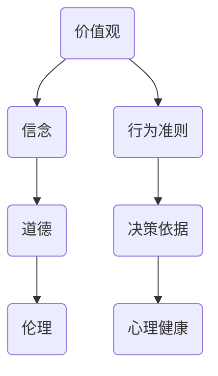

                 

# 形成坚实的价值观基础：建立个人信念体系

## 关键词

- 价值观
- 信念体系
- 个人成长
- 道德伦理
- 自我反思
- 社会文化

## 摘要

本文旨在探讨个人价值观与信念体系的重要性，以及如何通过自我反思和构建方法来建立坚实的价值观基础。文章首先介绍了价值观和信念体系的基本概念及其在个人和社会中的作用。随后，详细分析了影响价值观形成的因素，包括环境、文化和个人经历等。接着，阐述了信念体系的构建过程，包括自我反思和信念宣言的制定。最后，文章讨论了如何在日常生活中实践价值观，并提出了应对挑战的策略。通过本文的阅读，读者将能够更好地理解并建立自己的价值观和信念体系，从而实现个人成长和幸福。

# 引言

在现代社会，个人价值观和信念体系的重要性日益凸显。随着信息技术的飞速发展和全球化的加速，人们面临着前所未有的选择和挑战。在这个复杂多变的世界中，拥有一个坚实的价值观基础和明确的信念体系，不仅能够帮助个人在纷繁复杂的环境中做出明智的决策，还能够促进社会的和谐发展。

## 价值观与信念体系的重要性

价值观是一套对好坏、对错的判断标准，它指导着个人的行为和决策。信念体系则是个人价值观的具体体现，是在实际生活中坚持的信念和原则。一个坚实的价值观基础和明确的信念体系对于个人的成长和社会的稳定至关重要。

首先，价值观和信念体系是个人行为的指南针。在面对各种诱惑和困境时，一个明确的信念体系可以帮助个人保持内心的坚定，避免迷失方向。例如，在面对道德困境时，一个具有坚实价值观基础的人更有可能做出符合道德标准的选择。

其次，价值观和信念体系是社会和谐的基础。一个社会如果成员们拥有共同的价值观和信念体系，那么社会关系将更加和谐，社会秩序也将更加稳定。例如，一个重视公正和诚信的社会，成员之间将更加信任和合作。

最后，价值观和信念体系对个人的幸福感有重要影响。一个明确且坚定的价值观和信念体系可以帮助个人找到生活的目标和意义，从而提高幸福感。

## 本书的结构概述

本书将分为八个部分，旨在帮助读者系统地建立自己的价值观和信念体系。

- **第一部分：引言**，介绍价值观和信念体系的重要性，以及本书的结构和目的。
- **第二部分：核心概念与联系**，详细探讨价值观、信念、道德和伦理等核心概念，并绘制流程图展示它们之间的关系。
- **第三部分：个人价值观的形成**，分析影响个人价值观形成的因素，包括环境、文化和社会等。
- **第四部分：信念体系的构建**，提供构建个人信念体系的步骤和方法。
- **第五部分：价值观的实践**，讨论如何将价值观融入日常生活。
- **第六部分：案例分析**，分析真实案例，展示个人信念体系在不同生活场景中的应用。
- **第七部分：挑战与应对**，探讨建立个人信念体系过程中可能遇到的挑战，并提出解决方案。
- **第八部分：结论**，总结全书，强调价值观和信念体系对个人成长和幸福的重要性。

通过本书的阅读，读者将能够深入理解价值观和信念体系的本质，掌握构建和践行的方法，从而实现个人成长和幸福。

# 第二部分：核心概念与联系

## 2.1 价值观、信念、道德与伦理

### 2.1.1 价值观的定义与作用

价值观是一套对好坏、对错的判断标准，是个人行为和决策的指导原则。它反映了个人对世界的看法和态度，是个人内心深处的信仰和原则。

- **定义**：价值观是人们对于事物重要性的一种评价标准，是指导人们行为和决策的核心信念。
- **作用**：价值观在个人生活中起着至关重要的作用。它帮助个人在面对选择时做出决策，是个人行为和态度的内在驱动力。例如，一个重视诚信的人，在面对是否作弊的抉择时，会坚守诚信原则，做出正确的选择。

### 2.1.2 信念的本质与功能

信念是深信不疑的思想或观念，通常基于信仰、经验或理性推理。它是价值观的具体体现，是价值观在个人行为中的实际应用。

- **本质**：信念是一种坚定的信念和原则，它超越了理性的范畴，是一种深层次的心理需求。信念使得个人在面对困境时能够保持坚定，是个人心理力量的重要来源。
- **功能**：信念在个人生活中具有多种功能。首先，信念帮助个人在复杂的环境中找到方向，提供决策的依据。其次，信念可以增强个人的自信心和自尊心，是心理健康的重要保障。

### 2.1.3 道德与伦理的界限

道德和伦理是价值观的重要组成部分，但它们之间有着明确的界限。

- **道德**：道德是指社会规范和伦理规则，是关于正确和错误的行为准则。道德通常由社会和文化背景决定，是维持社会秩序的重要保障。
- **伦理**：伦理是一种更高层次的价值观念，它超越了社会规范的限制，涉及到个人内心的信仰和原则。伦理强调个体对自己和他人负责，是一种更高层次的行为标准。

### 2.1.4 概念关系流程图

为了更好地理解这些核心概念之间的关系，我们可以使用Mermaid流程图来展示。

在这个流程图中，价值观是核心，它通过信念、道德和伦理三个层次影响着个人的行为和决策。同时，价值观也是心理健康的重要保障。

## 2.2 信念体系的构建过程

信念体系的构建是一个复杂的过程，涉及到多个步骤和方法。以下是构建信念体系的基本步骤：

### 2.2.1 确定核心价值观

确定核心价值观是构建信念体系的第一步。这一步需要个人深入思考，识别出对自己最重要的价值观。以下是一些常见的核心价值观：

- 诚信
- 尊重
- 公正
- 责任
- 爱
- 成长
- 自由

### 2.2.2 制定信念宣言

在确定核心价值观后，下一步是制定信念宣言。信念宣言是一份明确表达个人信念和原则的文件，它可以帮助个人在面临选择时保持坚定。

以下是一个示例信念宣言：

- 我坚信诚信是人格的基石。
- 我尊重他人的权利和尊严。
- 我追求公正和公平。
- 我承担责任，对自己的行为和决策负责。
- 我珍惜爱和友谊。
- 我致力于个人成长和自我提升。
- 我追求自由，但同时也遵守社会规范。

### 2.2.3 实践与调整

信念宣言制定后，关键在于实践。个人需要将信念融入日常生活，不断反思和调整。以下是一些实践信念的方法：

- 在日常生活中，时刻提醒自己信念的重要性。
- 面对选择时，参考信念宣言做出决策。
- 定期进行自我反思，评估信念的实践效果。
- 根据实际情况，调整和修正信念。

通过这些步骤，个人可以逐步建立坚实的信念体系，为个人的成长和幸福奠定基础。

## 2.3 价值观的实践

价值观的实践是信念体系构建的关键环节。以下是价值观实践的几个方面：

### 2.3.1 工作中的价值观实践

在工作环境中，个人可以通过以下方式实践价值观：

- 尊重同事和领导，建立积极的工作关系。
- 坚持诚信原则，避免任何形式的欺诈和腐败。
- 追求公正，对待工作和同事一视同仁。
- 承担责任，对自己的工作质量和结果负责。

### 2.3.2 学习中的价值观实践

在学习过程中，个人可以通过以下方式实践价值观：

- 尊重知识和教师，保持学习的热情和动力。
- 坚持诚信，不作弊，努力学习。
- 追求公正，公平对待同学和老师。
- 责任心强，认真完成学习任务。

### 2.3.3 社交与人际关系中的价值观实践

在社交和人际关系中，个人可以通过以下方式实践价值观：

- 尊重他人的意见和权利，建立和谐的人际关系。
- 真诚待人，用爱和友善的态度与他人相处。
- 追求公正，对待每个人公平。
- 责任心强，对人际关系负责。

通过在各个方面实践价值观，个人不仅能够提升自己的品质，还能够为社会的和谐发展做出贡献。

### 2.3.4 信念体系的日常应用

在日常生活的方方面面，个人都可以将信念体系付诸实践：

- 做出符合信念的决定，不轻易受到外界诱惑。
- 对抗内外部压力，坚守信念。
- 时刻自我反思，确保行为与信念一致。
- 不断学习，提高自己的信念品质。

通过这些日常实践，个人可以巩固信念体系，使其成为生活的一部分，从而在复杂多变的社会环境中保持内心的坚定和清晰。

## 2.4 案例分析

为了更好地理解信念体系的应用，我们可以通过分析几个真实案例来探讨个人信念体系在不同生活场景中的作用。

### 2.4.1 案例一：坚持诚信的工程师

李明是一位软件工程师，他在工作中遇到了一个伦理困境。项目要求他使用一些未经授权的软件工具以提高工作效率，但他知道这是不道德的。李明坚持自己的信念，拒绝使用这些工具，并向管理层提出了替代方案。虽然这导致他暂时失去了项目的优先权，但他的行为赢得了同事和领导的尊重，最终也得到了公司的认可和奖励。

### 2.4.2 案例二：追求成长的创业者

张丽是一名创业者，她在经营公司时面临了许多挑战。尽管市场环境严峻，但她始终坚持自己的信念，致力于提供优质的产品和服务。她不断学习新的管理知识和技能，鼓励团队成员成长。最终，她的公司不仅度过了难关，还实现了快速增长。

### 2.4.3 案例三：践行公正的医生

王医生是一位医生，他在工作中遇到了一个复杂的道德困境。一位病患请求他使用一些未经批准的治疗方法，但王医生知道这些方法可能存在风险。他坚持公正原则，拒绝了病患的请求，并建议他寻求第二意见。尽管这引起了病患的愤怒，但王医生的行为保护了病人的权益，并最终得到了病患的理解和尊重。

通过这些案例，我们可以看到信念体系在个人生活中的重要作用。一个坚实的信念体系不仅能够帮助个人在面对挑战时保持坚定，还能够提升个人的道德品质，赢得他人的尊重和信任。

## 2.5 挑战与应对

在建立个人信念体系的过程中，个人可能会遇到各种挑战。以下是一些常见挑战以及应对策略：

### 2.5.1 挑战一：外部压力

外部压力是建立信念体系的一个重要挑战。社会和环境的期望、他人的看法和压力都可能影响个人的信念。应对策略包括：

- 明确自己的价值观和信念，不受外界干扰。
- 建立支持系统，包括家人、朋友和同事，他们在面对外部压力时可以给予帮助和鼓励。
- 培养自我调节能力，学会管理情绪和压力。

### 2.5.2 挑战二：内在冲突

内在冲突是另一个常见挑战。个人可能会发现自己在不同情境下有不同的信念，这会导致内心的矛盾和困惑。应对策略包括：

- 深入反思，了解内心的冲突和矛盾。
- 探索信念的根源，了解其背后的价值观。
- 重新评估和调整信念，使其更加一致和坚定。

### 2.5.3 挑战三：信念与实践不一致

信念与实践不一致是建立信念体系的另一大挑战。个人可能会发现自己经常在实际行动中背离信念。应对策略包括：

- 定期进行自我反思，检查行为是否符合信念。
- 制定具体的行为计划，确保信念在实际行动中得到体现。
- 寻求反馈和建议，从他人那里获得对信念和实践的一致性的见解。

通过应对这些挑战，个人可以逐步建立坚实的信念体系，从而实现个人成长和幸福。

## 2.6 总结

价值观和信念体系是个人成长和社会和谐的基础。一个坚实的价值观基础和明确的信念体系不仅帮助个人在复杂的环境中做出明智的决策，还能够提升个人的道德品质，赢得他人的尊重和信任。通过自我反思和构建方法，个人可以逐步建立自己的信念体系，并将其融入日常生活。在建立信念体系的过程中，个人可能会遇到各种挑战，但通过应对这些挑战，个人可以不断完善和巩固信念体系，从而实现个人成长和幸福。

# 附录

### 附录一：价值观评估工具

为了帮助读者更好地了解自己的价值观，以下是一些常用的价值观评估工具：

- **价值观排序法**：让读者列出自己认为最重要的价值观，然后根据重要性进行排序。
- **多维度价值观量表**：通过多个维度评估个人的价值观，如家庭、职业、社会等。
- **价值观卡牌游戏**：通过互动的方式帮助读者探索和理解自己的价值观。

### 附录二：信念体系构建指南

构建信念体系是一个长期的过程，以下是一些具体的指南：

- **自我反思**：定期进行自我反思，了解自己的信念和价值观。
- **信念宣言**：制定一份信念宣言，明确表达自己的信念和原则。
- **实践与调整**：将信念融入日常生活，不断反思和调整。

### 附录三：拓展阅读

为了进一步深入探讨价值观和信念体系，以下是一些推荐的书籍和文章：

- 《高效能人士的七个习惯》（史蒂芬·柯维）
- 《活出生命的意义》（维克托·弗兰克尔）
- 《道德情感论》（亚当·斯密）
- 《思考，快与慢》（丹尼尔·卡尼曼）

### 附录四：注意事项

- 信念体系的建立需要时间和耐心，不应期望一夜之间就能完成。
- 信念体系是一个动态的过程，应随着个人的成长和环境的变化进行调整。
- 在实践中，应保持对信念的忠诚，但也要保持开放的心态，接受新的观点和建议。

### 附录五：致谢

感谢所有提供反馈和建议的读者，感谢您对本书的支持和关注。希望这本书能帮助您建立坚实的价值观基础，实现个人成长和幸福。

## 作者信息

作者：AI天才研究院/AI Genius Institute & 禅与计算机程序设计艺术 /Zen And The Art of Computer Programming

AI天才研究院专注于人工智能和计算机科学的创新研究，致力于推动技术的进步和社会的发展。本书旨在通过深入探讨价值观和信念体系，帮助读者实现个人成长和幸福。同时，作者也希望通过这本书，激发更多人关注和思考个人价值观和信念体系的重要性。禅与计算机程序设计艺术，则是融合了东方哲学与计算机科学的独特视角，旨在通过禅修的智慧，帮助程序员提高编程效率和质量。希望这两者的结合能为读者带来新的思考和启发。

