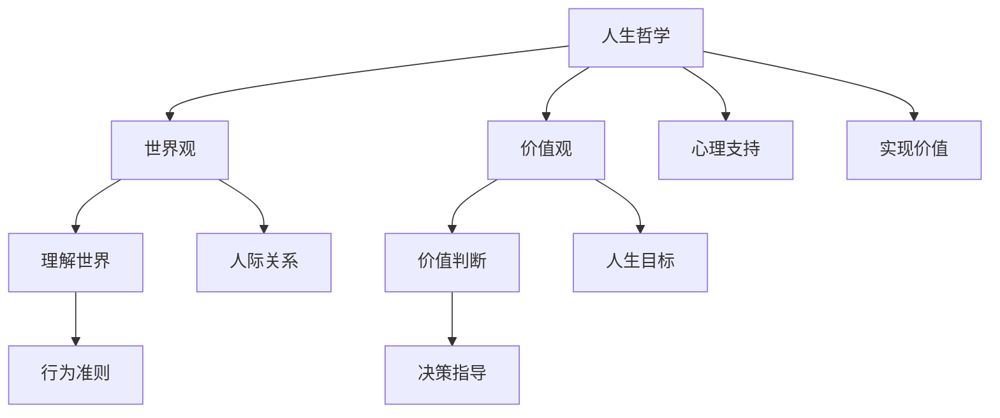
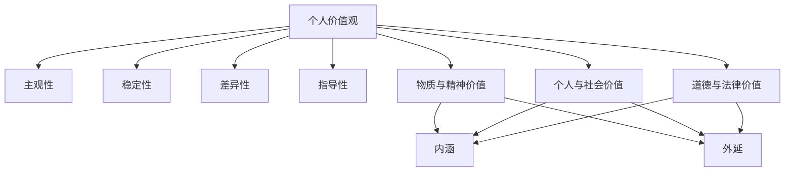
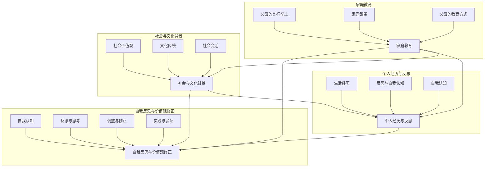
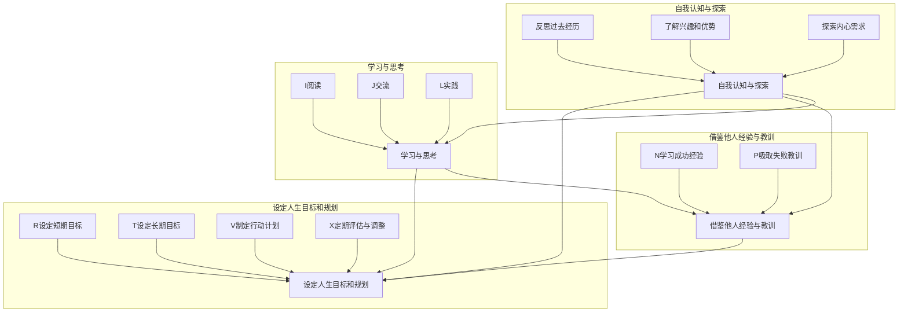

                 

## 第1章 引言

### 1.1 人生哲学的重要性

在快速变化的现代社会中，人生哲学的重要性愈发凸显。人生哲学不仅仅是一种世界观，更是一种价值观的体现，它关乎我们如何看待世界、如何处理人际关系、如何应对挑战等。一个清晰、独特的人生哲学，能帮助我们在纷繁复杂的环境中找到方向，实现人生的价值。

首先，人生哲学为我们提供了人生目标和意义。通过思考和分析，我们能够明确自己的价值观和追求，从而形成明确的人生目标。有了目标，我们才能更有动力地前进，克服困难，实现自我价值。

其次，人生哲学指导我们的行为和决策。在面对各种选择时，一个明确的人生哲学可以帮助我们做出更明智的决策。它像一面镜子，反映出我们的价值观和行为准则，引导我们朝着正确的方向努力。

此外，人生哲学也有助于我们建立良好的人际关系。一个具有内在一致性和坚定价值观的人，更容易赢得他人的尊重和信任。通过分享和交流人生哲学，我们能够与他人建立更深层次的连接，共同成长。

总之，人生哲学是我们人生的指南针，它决定了我们的人生轨迹。因此，构建一个独特、符合自己内心需求的人生哲学，是每个人都需要认真思考和努力实现的目标。

---

作者：AI天才研究院/AI Genius Institute & 禅与计算机程序设计艺术 /Zen And The Art of Computer Programming

## 第1章 引言

### 1.1 人生哲学的重要性

#### 1.1.1 人生哲学的定义

人生哲学，亦称人生观，是指个人对于生活、存在、价值等根本问题的根本看法和态度。它是我们价值观的基础，决定了我们如何理解世界、如何对待他人以及如何实现自我。

人生哲学与世界观和价值观紧密相连。世界观是对整个世界的总体看法，而价值观则是在这一基础上对事物价值的主观判断。人生哲学既包含了对世界的认识，也包含了价值观的引导。它不仅仅是一种思想体系，更是一种行动指南，指导我们在实际生活中做出选择和决策。

#### 1.1.2 人生哲学的作用

人生哲学在个人生活中扮演着至关重要的角色。以下是人生哲学的一些关键作用：

1. **明确人生目标**：人生哲学帮助我们认识到自己的生活意义，从而设定明确的人生目标。一个清晰的目标能为我们提供前进的方向和动力，使我们更加专注于实现自己的愿望。

2. **指导行为和决策**：人生哲学为我们的行为和决策提供了道德和价值的准则。在面对选择时，一个明确的人生哲学可以帮助我们做出更加明智和符合自己价值观的决策。

3. **建立良好的人际关系**：一个具有内在一致性和坚定价值观的人，更容易赢得他人的尊重和信任。人生哲学帮助我们在人际交往中保持一致性，建立稳定和谐的关系。

4. **应对挑战和困难**：在人生的道路上，每个人都会遇到各种挑战和困难。一个强大的人生哲学能为我们提供心理支持和行动指导，帮助我们更好地应对挑战，实现自我成长。

5. **实现人生价值**：人生哲学帮助我们认识到自己的价值和使命，从而在实现个人目标的同时，为社会做出积极贡献。

总之，人生哲学是指导我们人生道路的指南针，它决定了我们的生活质量、人生成就以及个人价值。因此，认真思考和构建一个独特的人生哲学，是我们每个人都应该追求的目标。

---

Mermaid 流程图：

## 第1章 引言

### 1.1.3 人生哲学与个人成长的关系

人生哲学不仅仅是对生活的看法，更是个人成长的重要基石。它与个人成长的关系体现在以下几个方面：

1. **塑造个人性格**：人生哲学帮助我们形成独特的性格特质。一个积极向上、富有同理心的人生哲学，能培养我们的乐观态度、责任感和社会意识，使我们成为更加全面发展的个体。

2. **促进自我认知**：人生哲学促使我们深入思考自己的存在意义、价值观和行为动机。通过不断反思和调整，我们能够更好地了解自己，找到自己的优势和不足，从而进行自我提升。

3. **增强心理韧性**：在面对困难和挫折时，一个坚定的人生哲学能为我们提供心理支持和行动指导。它帮助我们保持积极的心态，勇敢面对挑战，从而增强心理韧性。

4. **指导职业发展**：人生哲学为我们提供了职业发展的方向和目标。一个明确的人生哲学可以帮助我们选择适合自己的职业道路，实现职业成功和个人成长。

5. **促进人际关系**：一个和谐的人生哲学有助于我们建立良好的人际关系。它帮助我们理解他人，尊重差异，与他人共同成长。

总之，人生哲学是个人成长的指南，它不仅影响着我们的性格、认知和心理状态，还指导着我们的职业发展。因此，构建一个符合自己内在需求的人生哲学，对个人成长至关重要。

---

### 1.1.4 人生哲学在现代社会中的意义

在现代社会，人生哲学的意义愈发凸显。随着科技的飞速发展和全球化进程的加快，人们面临的生活压力和挑战也日益增加。在这种背景下，人生哲学成为了我们应对复杂生活的关键工具。

首先，人生哲学为我们提供了精神指引。在物质丰富的现代社会，许多人感到精神上的空虚和迷茫。一个清晰、独特的人生哲学可以帮助我们找到内心的平静和满足，从而在快节奏的生活中保持心理平衡。

其次，人生哲学帮助我们在价值观多元化的社会中找到自己的定位。现代社会价值观多元化，不同的人有不同的生活方式和价值观。一个明确的人生哲学可以帮助我们明确自己的立场和目标，避免迷失在纷繁复杂的社会中。

此外，人生哲学也为我们提供了处理人际关系和社会问题的策略。在人际交往中，一个和谐的人生哲学可以帮助我们建立良好的人际关系，增进相互理解与尊重。在社会问题面前，一个积极向上的人生哲学能激励我们积极参与社会事务，为社会的进步贡献力量。

总之，人生哲学在现代社会中具有重要的意义。它不仅帮助我们找到生活的方向和意义，还能指导我们在复杂多变的社会中保持内心的平静和坚定。因此，认真思考和构建一个独特的人生哲学，是我们每个人都应该追求的目标。

---

## 第1章 引言

### 1.1.5 总结

人生哲学的重要性不容忽视。它不仅仅是一种思想体系，更是我们生活的指南针。一个清晰、独特的人生哲学可以帮助我们明确生活目标，指导我们的行为和决策，建立良好的人际关系，增强心理韧性，并实现个人价值。在现代社会，人生哲学更是我们在面对复杂生活挑战时的重要支撑。因此，认真思考和构建一个符合自己内在需求的人生哲学，对个人成长和社会进步具有重要意义。让我们一起深入探讨如何形成独特的人生哲学，为我们的未来奠定坚实的基础。

---

## 第1章 引言

### 1.2 个人价值观的概念与特点

个人价值观是指个人对于事物和行为的总体评价和态度，是指导我们行为决策的重要依据。个人价值观的形成过程复杂，受到多种因素的影响，如家庭教育、社会文化、个人经历等。本文将详细探讨个人价值观的概念、特点及其对个体行为和决策的影响。

#### 1.2.1 个人价值观的定义

个人价值观是个人对事物和行为的评价标准，反映了个人对各种价值的认识和追求。它既包括对物质财富的追求，也涵盖了对精神层面的追求。例如，个人的价值观可能包括对家庭、友情、事业、自由、公平、正义等的重视程度。

#### 1.2.2 个人价值观的特点

1. **主观性**：个人价值观是个人主观判断的结果，受到个人经历、教育背景、文化环境等多种因素的影响，因此每个人的价值观都是独特的。

2. **稳定性**：个人价值观一旦形成，就具有较强的稳定性。虽然外界环境和个体经历可能会对价值观产生一定的影响，但整体上，个人价值观具有一定的持续性。

3. **差异性**：由于个人成长背景的不同，人们的价值观存在显著差异。这些差异不仅体现在对不同事物的价值判断上，也体现在行为和决策方式上。

4. **指导性**：个人价值观对个体的行为和决策具有指导作用。它帮助我们在面对选择时，依据自身的价值观进行判断和选择，从而实现个人目标。

#### 1.2.3 个人价值观的分类

个人价值观可以按照不同的维度进行分类。以下是一些常见的分类方法：

1. **物质与精神价值**：个人价值观可以分为对物质财富的追求和对精神层面的追求。例如，有些人重视金钱和物质享受，而有些人则更加注重内心的平静和精神的满足。

2. **个人与社会价值**：个人价值观可以按照个人利益与社会利益的平衡进行分类。例如，有些人的价值观强调个人利益最大化，而有些人则更加关注社会公共利益。

3. **道德与法律价值**：个人价值观可以按照道德和法律标准进行分类。例如，有些人重视道德规范，认为道德是行为的底线，而有些人则更关注法律的规定。

#### 1.2.4 个人价值观的内涵与外延

个人价值观的内涵是指其内在的核心价值和理念，它决定了个人的行为和决策。例如，一个人如果重视家庭价值，那么他会努力维护家庭和谐，关心家人福祉。

个人价值观的外延则是指其具体的表现形式和影响范围。例如，一个具有创新价值观的人，可能会在工作中追求创新，尝试新的方法和技术，从而推动个人和团队的发展。

总之，个人价值观是指导我们行为和决策的重要依据，它反映了我们对生活、工作和人际关系的看法和态度。通过深入理解个人价值观，我们可以更好地认识自己，明确目标，实现个人价值。

---

Mermaid 流程图：

---

### 1.2.5 个人价值观的形成过程

个人价值观的形成是一个复杂的过程，受到多种因素的影响。以下是个人价值观形成的主要因素：

1. **家庭教育**：家庭是个人价值观形成的第一课堂。父母的价值观、教育方式、言行举止都会对子女的价值观产生深远影响。例如，父母强调诚实、勤奋、尊重他人等价值观念，子女很可能会内化这些观念，成为自己的价值观。

2. **社会文化**：社会文化环境对个人价值观的形成具有重要作用。不同的文化背景、社会习俗和价值观念会影响个人的价值观。例如，在一个重视集体主义的社会中，个人可能会更注重团队合作和集体荣誉。

3. **个人经历**：个人的生活经历、教育背景、工作环境等都会对价值观产生影响。例如，经历过贫困和挫折的人可能会更加重视财富和成功，而经历过丰富人际关系的人可能会更加注重人际关系的建立和维护。

4. **个人反思**：个人的自我反思和自我认知过程也是价值观形成的重要途径。通过反思自己的行为和决策，个人可以不断调整和优化自己的价值观，使其更加符合自己的内心需求。

5. **榜样示范**：身边的榜样和优秀人物对个人价值观的形成也有重要影响。通过学习榜样的事迹和品质，个人可以借鉴并内化这些优秀价值观。

总之，个人价值观的形成是一个多因素、多层次的过程。了解这些影响因素有助于我们更好地认识和构建自己的价值观，从而实现个人成长和社会进步。

---

### 1.2.6 个人价值观对行为和决策的影响

个人价值观在我们日常行为和决策中起着至关重要的作用。它是我们行为决策的内在准则，决定了我们如何看待世界、对待他人以及处理各种情况。以下是个人价值观对行为和决策的具体影响：

1. **决策方向**：个人价值观决定了我们的决策方向。在面临选择时，一个明确、坚定的价值观可以帮助我们迅速做出符合自己价值观的决策。例如，一个重视诚信的人在面对利益冲突时，更倾向于选择诚信而不是短期的利益。

2. **行为标准**：个人价值观是我们行为的标准。它帮助我们判断什么是对的，什么是错的，从而在行为中表现出一致性。例如，一个重视公平的人会在工作中公平对待每一个同事，不会因为个人偏见而做出不公平的行为。

3. **人际交往**：个人价值观影响我们的人际交往方式。一个具有内在一致性和坚定价值观的人，更容易赢得他人的信任和尊重。例如，一个重视友谊的人会在朋友需要帮助时毫不犹豫地伸出援手。

4. **应对挑战**：在面对困难和挑战时，个人价值观能为我们提供心理支持和行动指导。一个具有积极价值观的人，更容易保持乐观、勇敢地面对挑战，从而克服困难，实现自我成长。

5. **职业发展**：个人价值观对职业发展也有重要影响。一个明确、积极的价值观可以帮助我们在职业道路上保持专注和持续进步。例如，一个重视创新的人会在工作中不断尝试新方法，推动个人和团队的创新。

总之，个人价值观是我们行为和决策的指南，它决定了我们的生活方式和人生轨迹。通过深入了解和践行自己的价值观，我们可以更好地实现个人目标，建立和谐的人际关系，应对各种挑战，实现个人成长。

---

### 1.2.7 个人价值观的调整与修正

个人价值观的形成是一个动态过程，随着时间和经历的积累，我们可能会发现原有的价值观存在不足或与当前生活不相符。因此，对个人价值观进行定期调整与修正具有重要意义。

1. **反思与自我认知**：定期反思自己的行为和决策，深入思考这些行为是否符合自己的价值观。通过自我认知，我们能够发现并理解自己的内心需求和价值观的矛盾之处。

2. **外部反馈**：倾听他人的意见和建议，特别是那些对我们有深刻了解的人。外部反馈可以帮助我们更客观地认识自己，从而对价值观进行修正。

3. **实践与验证**：将调整后的价值观应用到实际生活中，通过实践来验证这些价值观是否真正符合我们的需求和期望。实践是检验价值观的重要手段，通过实践，我们可以发现并解决价值观中的问题。

4. **持续学习**：学习新的知识和理念，不断拓宽自己的视野。通过学习，我们能够接触到不同的价值观，从而对自己的价值观进行补充和修正。

5. **价值观的整合**：在调整和修正过程中，我们需要整合不同的价值观，使之形成一个统一、完整的价值体系。整合不是简单地抛弃旧价值观，而是在保留核心价值的基础上，吸收新的、有用的价值观。

总之，个人价值观的调整与修正是一个持续的过程，它需要我们不断反思、学习和实践。通过不断调整和修正，我们可以使自己的价值观更加符合内心需求，实现个人成长和社会进步。

---

### 1.2.8 个人价值观在生活中的应用

个人价值观在日常生活中起着至关重要的作用，它不仅指导我们的行为和决策，还影响我们的人际关系和社会行为。以下是个人价值观在生活中的几个关键应用：

1. **职业选择**：个人的价值观在很大程度上决定了职业选择。一个重视创新和成就感的人可能会选择从事科技或创业领域，而一个重视稳定和安全的人可能会选择公务员或教师等职业。

2. **消费行为**：个人价值观影响我们的消费行为。一个重视环保和可持续发展的人可能会选择购买绿色产品，而一个重视价格和价值的人可能会更关注产品的性价比。

3. **人际关系**：个人价值观指导我们如何与他人相处。一个重视诚实和尊重的人会真诚待人，赢得他人的信任和尊重，而一个重视权力和利益的人可能会在人际关系中表现出功利和自私。

4. **道德决策**：在面对道德困境时，个人价值观能为我们提供决策依据。一个具有道德自律的人会在道德准则的指导下做出正确的决策，即使这可能会牺牲个人利益。

5. **生活态度**：个人价值观塑造了我们的生活态度。一个乐观、积极的人会以积极的心态面对生活中的挑战，而一个消极、悲观的人可能会对生活失去热情。

总之，个人价值观在我们的生活中具有广泛的应用，它不仅影响我们的行为和决策，还决定着我们的人生轨迹。通过认真思考和践行自己的价值观，我们可以实现个人目标，建立和谐的人际关系，获得内心的满足和成长。

---

### 1.2.9 总结

个人价值观是我们行为的内在准则，它指导我们如何看待世界、对待他人以及处理各种问题。一个清晰、独特的个人价值观不仅有助于我们明确生活目标，还能在行为和决策中提供明确的指导。通过家庭教育、社会文化、个人经历等多种因素的影响，我们逐渐形成自己的价值观。然而，随着时间和经历的积累，我们需要不断地反思和调整自己的价值观，使之更加符合我们的内心需求。只有通过不断地实践和修正，我们才能构建一个稳定、健全的个人价值观体系，实现个人成长和社会进步。

---

## 第1章 引言

### 1.3 形成个人价值观的过程

个人价值观的形成是一个复杂而动态的过程，受到多种因素的共同作用。本文将详细探讨个人价值观形成的主要阶段、关键因素以及自我反思与调整在其中的作用。

#### 1.3.1 家庭教育与影响

家庭教育是个人价值观形成的基础。在家庭环境中，父母的价值观、教育方式、家庭氛围等都会对子女的价值观产生深远影响。以下是家庭教育对个人价值观形成的几个方面：

1. **父母的言行举止**：父母的言行是子女模仿和学习的榜样。父母的行为和态度会直接或间接地传递给子女，影响他们的价值观。例如，一个诚实守信的父母可能会培养出一个同样诚实守信的子女。

2. **家庭氛围**：家庭氛围对子女的价值观形成具有重要影响。一个和谐、尊重和支持的家庭环境有利于子女形成积极、健康的价值观，而一个充满冲突和压力的家庭环境可能会使子女的价值观变得消极。

3. **父母的教育方式**：父母的教育方式也会影响子女的价值观。民主、开放的教育方式有助于子女形成独立思考、自主决策的能力，而专制、控制的教育方式可能会使子女的价值观过于依赖父母。

#### 1.3.2 社会与文化背景

社会和文化背景是个人价值观形成的重要因素。社会价值观和文化传统在很大程度上塑造了人们的价值观。以下是社会与文化背景对个人价值观形成的几个方面：

1. **社会价值观**：社会价值观是指整个社会普遍认可和遵循的价值观。例如，一个重视集体主义的社会，其成员可能更注重团队合作和社会责任。

2. **文化传统**：文化传统是一个社会长期积累和传承的价值观念和行为规范。例如，儒家文化强调的“仁爱”、“忠诚”等价值观在中国社会中具有深远的影响。

3. **社会变迁**：社会变迁也会对个人价值观产生影响。随着社会的不断发展和变革，原有的价值观可能会受到挑战，新的价值观逐渐形成。例如，随着全球化的推进，人们的文化观念和价值观念也在发生变化。

#### 1.3.3 个人经历与反思

个人经历是个人价值观形成的重要来源。个人的生活经历、教育背景、工作环境等都会对价值观产生影响。以下是个人经历与反思在价值观形成中的关键作用：

1. **生活经历**：个人的生活经历，如家庭环境、教育经历、工作经历等，都会对价值观形成产生深刻影响。这些经历不仅会影响我们对事物的认知，还会影响我们的行为和决策。

2. **反思与自我认知**：反思是个人价值观形成的重要环节。通过反思自己的行为和决策，个人可以深入了解自己的内心需求和价值观，从而不断调整和优化自己的价值观。

3. **自我认知**：自我认知是个人价值观形成的基础。只有真正了解自己，才能建立符合内心需求的价值观。自我认知需要通过不断的反思、学习和实践来实现。

#### 1.3.4 自我反思与价值观的修正

自我反思与价值观的修正是一个持续的过程。通过自我反思，个人可以发现自己的价值观中的不足，并通过修正使之更加符合自己的内心需求。以下是自我反思与价值观修正的关键步骤：

1. **自我认知**：通过自我认知，个人可以了解自己的优点和不足，从而明确需要修正的价值观。

2. **反思与思考**：在自我认知的基础上，个人需要反思和思考自己的价值观，找出其中存在的问题和矛盾。

3. **调整与修正**：根据反思和思考的结果，个人需要对价值观进行调整和修正，使之更加符合自己的内心需求和实际情况。

4. **实践与验证**：将修正后的价值观应用到实际生活中，通过实践来验证其有效性，并不断调整和优化。

总之，个人价值观的形成是一个复杂而动态的过程，受到家庭教育、社会文化背景、个人经历和自我反思等多种因素的共同影响。通过不断的学习、实践和反思，我们可以构建一个清晰、独特的个人价值观，实现个人成长和社会进步。

---

Mermaid 流程图：

---

## 第1章 引言

### 1.3.5 总结

个人价值观的形成是一个复杂而动态的过程，受到家庭教育、社会文化背景、个人经历和自我反思等多种因素的共同影响。通过家庭教育，我们学会了如何认识世界、如何与人相处；社会和文化背景为我们提供了价值观的框架和参考；个人经历让我们不断反思和调整自己的价值观；而自我反思与修正则是价值观形成的关键环节。只有通过不断的学习、实践和反思，我们才能构建一个清晰、独特的个人价值观，实现个人成长和社会进步。

---

## 第1章 引言

### 1.4 如何构建独特的人生哲学

构建独特的人生哲学是一个漫长而深入的过程，需要我们结合自身的经历、反思和学习，不断探索和调整。以下是构建独特人生哲学的几个关键步骤：

#### 1.4.1 自我认知与探索

自我认知是构建人生哲学的第一步。通过深入思考和自我反思，我们能够了解自己的内心需求、兴趣、优势和价值观。以下是一些建议：

1. **反思过去的经历**：回顾自己的人生历程，思考哪些经历对自己产生了深远的影响，这些经历如何塑造了自己的价值观。

2. **了解自己的兴趣和优势**：识别自己的兴趣和优势，思考如何将这些兴趣和优势融入到人生哲学中，实现个人价值。

3. **探索内心的需求**：通过日记、冥想等方式，深入了解自己的内心需求，明确自己追求的目标和意义。

#### 1.4.2 学习与思考

学习与思考是构建人生哲学的重要途径。通过阅读、交流、实践等方式，我们可以不断获取新知识、新观念，从而丰富和完善自己的价值观。

1. **阅读**：阅读是获取知识和启发的重要手段。通过阅读哲学、心理学、历史等领域的书籍，我们可以了解不同的人生观和价值观，从而启发自己的思考。

2. **交流**：与他人交流是学习和思考的重要方式。通过与不同背景、不同价值观的人交流，我们可以开阔视野，了解不同的观点和思维方式。

3. **实践**：实践是检验和丰富价值观的最好方式。通过将所学知识应用于实际生活中，我们可以不断验证和调整自己的价值观，使之更加符合实际需求。

#### 1.4.3 借鉴他人经验与教训

借鉴他人经验与教训是构建人生哲学的有效方法。通过学习他人的成功经验，我们可以获得启示，少走弯路；通过吸取他人的失败教训，我们可以避免重复错误，提高自己。

1. **学习成功经验**：关注身边或历史上的成功人士，了解他们的人生哲学和成功经验。思考如何将这些经验应用到自己的生活中，实现个人成长。

2. **吸取失败教训**：关注他人的失败案例，了解他们失败的原因和教训。思考如何避免这些错误，提高自己的决策能力和行动力。

#### 1.4.4 设定人生目标和规划

一个清晰的人生目标和规划是构建人生哲学的重要基础。通过设定目标，我们能够明确自己的人生方向，为未来的行动提供指导。

1. **设定短期和长期目标**：根据自身情况，设定短期和长期的目标。短期目标有助于我们保持动力，长期目标则帮助我们规划人生方向。

2. **制定行动计划**：为实现目标，制定详细的行动计划。将目标分解为具体的小目标，制定实现每个小目标的步骤和时间表。

3. **定期评估与调整**：定期评估自己的行动进度，根据实际情况调整目标和行动计划。通过不断调整，确保自己的人生哲学能够适应不断变化的环境。

总之，构建独特的人生哲学需要我们不断自我认知、学习与思考、借鉴他人经验，并设定明确的人生目标和规划。通过这些步骤，我们能够逐步形成符合自己内心需求的人生哲学，实现个人成长和社会进步。

---

Mermaid 流程图：

---

## 第1章 引言

### 1.4.5 实践与反思

实践与反思是构建独特人生哲学的关键步骤。通过将理论应用到实际生活中，我们可以不断验证和完善自己的价值观。以下是实践与反思的具体方法和建议：

#### 1.4.5.1 实践的重要性

1. **理论联系实际**：将所学的知识和观念应用到实际生活中，通过实践来验证其有效性和适用性。
2. **经验积累**：通过实践，我们可以积累经验，了解自己在不同情境下的行为和反应，从而更好地认识自己。
3. **持续改进**：实践中的反馈和结果可以帮助我们发现问题，及时调整和完善自己的价值观。

#### 1.4.5.2 反思的方法

1. **定期回顾**：定期回顾自己的行为和决策，思考哪些是成功的，哪些需要改进。
2. **自我对话**：通过自我对话，深入思考自己的行为动机和价值观是否一致，是否达到了预期的目标。
3. **记录与分享**：将反思过程记录下来，与他人分享，通过交流和讨论，获得不同的视角和建议。

#### 1.4.5.3 实践与反思的结合

1. **循环迭代**：将实践和反思结合起来，形成循环迭代的过程。通过不断的实践和反思，逐步完善自己的价值观。
2. **灵活调整**：在实践中，根据反馈和结果，灵活调整自己的价值观和行动计划，使之更加符合实际需求。
3. **持续成长**：通过实践和反思，不断成长和进步，逐步构建一个独特、稳固的人生哲学。

总之，实践与反思是构建独特人生哲学的重要步骤。通过将理论应用到实际生活中，不断反思和调整自己的价值观，我们可以逐步形成符合自己内心需求的人生哲学，实现个人成长和社会进步。

---

### 1.4.6 总结

构建独特的人生哲学是一个系统性的过程，需要自我认知、学习与思考、借鉴他人经验、设定人生目标和规划，以及实践与反思等多方面的综合作用。通过不断自我认知，我们能够明确自己的内心需求和价值观；通过学习和思考，我们能够丰富和完善自己的知识体系；通过借鉴他人经验，我们能够避免重复错误，快速成长；通过设定目标和规划，我们能够明确自己的人生方向和行动步骤；通过实践与反思，我们能够不断验证和完善自己的价值观。只有通过这些步骤的有机结合，我们才能构建一个独特、稳固的人生哲学，实现个人成长和社会进步。

---

## 第2章 家庭教育与价值观的传承

### 2.1 家庭教育的核心作用

家庭教育在个人价值观的形成中具有核心作用。家庭是个人成长的第一个环境，父母的言行举止、教育方式、家庭氛围等都在潜移默化中影响着子女的价值观。以下是家庭教育在价值观传承中的几个核心作用：

#### 2.1.1 家庭教育对价值观形成的影响

1. **奠定价值观基础**：家庭教育为个人价值观的形成奠定了基础。父母通过自身的言行和生活方式，向子女传递基本的道德观念和人生准则，如诚实、勤奋、尊重他人等。

2. **塑造人格特质**：家庭教育对子女的人格特质有重要影响。例如，一个和谐、民主的家庭环境能够培养出自信、独立、有责任感的子女，而一个专制、冲突的家庭环境可能会培养出自卑、敏感、缺乏安全感的子女。

3. **培养行为习惯**：家庭教育通过日常生活中的点滴教育，培养子女良好的行为习惯。例如，通过家庭的道德教育和行为规范，子女能够学会如何与人相处，如何对待工作和学习等。

#### 2.1.2 家庭教育的特点与类型

1. **特点**：
   - **情感性**：家庭教育具有很强的情感性，父母与子女之间的情感联系是教育过程的重要组成部分。
   - **连续性**：家庭教育是一个长期的过程，贯穿于个人成长的各个阶段。
   - **个性化**：家庭教育根据子女的个性特点和成长需求，进行个性化的教育。

2. **类型**：
   - **传统家庭教育**：强调权威和服从，父母在家庭中占据主导地位。
   - **现代家庭教育**：注重平等和尊重，鼓励子女自主学习和探索。

#### 2.1.3 家庭教育中的核心价值观

1. **诚实**：诚实是家庭教育中最重要的价值观之一。父母通过自己的言行，向子女传递诚实的重要性，培养子女诚实的品质。

2. **勤奋**：勤奋是个人成功的重要保障。父母通过鼓励子女勤奋学习、努力工作，培养子女的勤奋精神。

3. **尊重他人**：尊重他人是建立和谐人际关系的基础。家庭教育通过教育子女尊重父母、老师和同伴，培养子女的尊重意识。

4. **责任感**：责任感是个人成长的重要品质。家庭教育通过赋予子女一定的家庭责任，培养子女的责任感。

总之，家庭教育在个人价值观的形成中具有核心作用。通过家庭教育的熏陶，子女能够形成积极、健康的价值观，为未来的发展奠定坚实的基础。

---

### 2.2 父母的价值观传递

父母的价值观传递是家庭教育中至关重要的一环。父母的言行举止、日常行为以及对待问题的态度，都会对子女的价值观产生深远影响。以下是父母价值观传递的几个关键方面：

#### 2.2.1 父母的言行举止对子女价值观的影响

1. **榜样作用**：父母的言行举止是子女模仿的对象。父母的行为和态度直接或间接地影响子女的价值观形成。例如，一个诚实守信的父母会培养出同样诚实的子女。

2. **教育方式**：父母的教育方式对子女的价值观也有重要影响。例如，一个采用民主、开放教育方式的家庭，子女可能更具备独立思考能力和自我价值观。

3. **态度与情绪**：父母的态度和情绪在家庭教育中起着关键作用。一个积极、乐观的家庭氛围有利于子女形成积极、健康的价值观，而一个消极、压抑的家庭氛围可能会对子女的价值观产生负面影响。

#### 2.2.2 家庭环境对价值观传承的作用

1. **家庭氛围**：家庭氛围对子女的价值观形成有重要影响。一个和谐、尊重、支持的家庭环境有利于子女形成积极、健康的价值观，而一个冲突、不和谐的家庭环境可能会使子女的价值观变得消极。

2. **家庭教育内容**：家庭教育的内容和方式直接影响子女的价值观。例如，通过家庭讨论、读书会等活动，父母可以传递积极的价值观，帮助子女树立正确的人生观。

3. **家庭责任**：家庭责任是家庭教育的重要内容。通过赋予子女一定的家庭责任，父母可以培养子女的责任感，使其形成积极、健康的价值观。

#### 2.2.3 父母在价值观传承中的角色

1. **引导者**：父母在价值观传承中扮演着引导者的角色。他们通过自身的言行和生活方式，向子女传递基本的价值观和道德观念。

2. **支持者**：父母在子女成长过程中扮演着支持者的角色。他们通过鼓励和激励，支持子女实现自己的价值观，培养子女的自信和独立。

3. **监督者**：父母在价值观传承中扮演着监督者的角色。他们通过监督子女的行为和决策，确保子女的行为符合自己的价值观。

总之，父母的价值观传递在子女价值观形成中具有核心作用。通过言行举止、家庭环境、家庭教育内容等多种方式，父母能够有效地传递积极的价值观，帮助子女建立正确的人生观和价值观。

---

### 2.3 家庭教育的实践与反思

家庭教育的实践与反思是家庭教育过程中不可或缺的一部分。通过实践，父母可以将教育理念付诸行动；通过反思，父母可以总结经验，不断改进教育方法。以下是家庭教育实践与反思的几个关键方面：

#### 2.3.1 家庭教育的成功案例

1. **民主开放的家庭氛围**：一个成功的教育案例是一个注重民主和开放的家庭氛围。在这个家庭中，父母尊重子女的个性和选择，鼓励子女表达自己的观点，培养子女的独立思考和自主决策能力。

2. **身教重于言传**：另一个成功的案例是父母通过自身的言行和生活方式，为子女树立榜样。一个以身作则、诚实守信、勤奋工作的家庭，能够培养出同样具备这些品质的子女。

3. **积极引导与激励**：积极引导与激励也是家庭教育的关键。父母通过鼓励和激励，帮助子女克服困难，实现自己的目标，培养子女的自信和毅力。

#### 2.3.2 家庭教育中常见的问题及解决策略

1. **专制与控制**：专制与控制是家庭教育中常见的问题。这种教育方式往往导致子女的逆反心理，影响子女的心理健康和个性发展。解决策略是父母需要学会尊重子女的个性和选择，给予子女更多的自主权。

2. **过度保护**：过度保护是另一个常见问题。父母过度保护子女，导致子女缺乏独立生活和自我管理的能力。解决策略是父母需要在适当的时候放手，让子女面对现实生活中的挑战和困难，培养他们的自我管理和独立能力。

3. **忽视情感需求**：忽视子女的情感需求是家庭教育中的另一个问题。父母忙于工作，忽视与子女的沟通和情感交流，导致子女感到孤独和不被理解。解决策略是父母需要花时间与子女沟通，关注他们的情感需求，建立良好的亲子关系。

#### 2.3.3 家庭教育的反思与改进

1. **自我反思**：父母需要定期反思自己的教育方式和方法，思考哪些是成功的，哪些需要改进。通过自我反思，父母可以发现自己的不足，并寻求改进的方法。

2. **学习与成长**：父母需要不断学习新的教育理念和方法，与子女一起成长。通过学习，父母可以获取更多的教育资源和知识，提升自己的教育能力。

3. **灵活调整**：家庭教育的实践需要灵活调整。根据子女的成长需求和实际情况，父母需要适时调整教育策略，使之更加符合子女的成长需要。

总之，家庭教育的实践与反思是一个不断学习、成长和改进的过程。通过实践与反思，父母可以不断提升自己的教育能力，培养出更加健康、独立和自信的子女。

---

### 2.3.4 家庭教育对个人价值观的影响

家庭教育在个人价值观的形成中起着至关重要的作用。以下是家庭教育对个人价值观的具体影响：

1. **塑造道德观念**：家庭教育通过传递道德观念，如诚实、尊重、公平、责任等，帮助个人形成正确的道德观念。这些道德观念不仅影响个人的行为，还影响个人对待他人和社会的态度。

2. **培养行为习惯**：家庭教育通过日常生活中的点滴教育，培养个人良好的行为习惯。例如，通过鼓励子女勤奋学习、尊敬长辈、关心他人等，培养子女的自律和责任感。

3. **形成价值观基础**：家庭教育为个人价值观的形成奠定了基础。父母通过自身的言行和生活方式，向子女传递基本的价值观和人生准则，为子女的价值观形成提供了参考和指引。

4. **影响心理发展**：家庭教育对个人的心理发展也有重要影响。一个和谐、尊重、支持的家庭环境有利于个人形成积极、健康的心理状态，而一个冲突、不和谐的家庭环境可能会对个人的心理发展产生负面影响。

5. **指导决策行为**：家庭教育中的价值观会影响个人的决策行为。一个具有正确价值观的人，在面临选择时能够更加理智和客观，做出符合自己价值观的决策。

总之，家庭教育在个人价值观的形成中具有深远的影响。通过家庭教育的熏陶，个人能够形成积极、健康的价值观，为未来的发展奠定坚实的基础。

---

### 2.3.5 总结

家庭教育在个人价值观的形成中具有核心作用。通过言传身教、家庭氛围的营造和日常生活中的点滴教育，父母能够有效地传递积极的价值观，帮助子女形成正确的道德观念和行为习惯。然而，家庭教育也存在一些常见的问题，如专制、过度保护和忽视情感需求等。通过反思和改进，父母可以不断提升教育能力，更好地引导子女形成积极、健康的价值观。只有通过不断的学习和实践，我们才能构建一个和谐、尊重、支持的家庭教育环境，为子女的成长和发展提供坚实的保障。

---

## 第3章 社会与文化对个人价值观的影响

### 3.1 社会环境对个人价值观的影响

社会环境是个人价值观形成的重要外部因素。社会环境包括社会价值观、文化传统、社会规范等，这些因素在很大程度上塑造了人们的价值观。以下是社会环境对个人价值观的具体影响：

#### 3.1.1 社会价值观的形成与演变

1. **社会价值观的定义**：社会价值观是指整个社会普遍认可和遵循的价值观体系，它反映了社会的核心价值观和道德准则。

2. **社会价值观的形成**：社会价值观的形成是长期历史过程的结果，受到文化传统、经济发展、政治制度等多种因素的影响。例如，在一个重视集体主义的社会中，人们可能更加注重团队合作和集体荣誉。

3. **社会价值观的演变**：随着社会的不断发展和变革，社会价值观也在不断演变。例如，在现代化和全球化进程中，人们对于自由、平等、人权等价值观的认识也在不断深化和扩展。

#### 3.1.2 社会文化对个人价值观的塑造

1. **文化传统**：文化传统是一个社会长期积累和传承的价值观念和行为规范，对个人价值观的形成有深远影响。例如，儒家文化中的“仁爱”、“忠诚”等价值观在中国社会中具有深远的影响。

2. **社会规范**：社会规范是指社会对个体行为的要求和期望，它对个人价值观的形成有重要影响。例如，一个遵守社会规范的人，在社会交往中会表现出尊重、合作、诚信等价值观。

3. **文化多样性**：文化多样性是现代社会的一个重要特征，它对个人价值观的塑造有着双重作用。一方面，文化多样性可以拓宽个人的视野，促进多元价值观的接纳；另一方面，文化多样性也可能导致价值观的冲突和矛盾。

#### 3.1.3 社会变迁对个人价值观的影响

1. **社会变迁的定义**：社会变迁是指社会在结构、功能、观念等方面的变化和发展。

2. **社会变迁的影响**：社会变迁对个人价值观的影响主要体现在以下几个方面：
   - **价值观的多元化**：随着社会的变迁，不同的价值观并存和竞争，人们可以选择和塑造自己的价值观。
   - **价值观的更新**：社会变迁促使人们重新审视和更新自己的价值观，使之更加适应社会发展的需求。
   - **价值观的冲突**：社会变迁过程中，不同价值观之间的冲突和矛盾可能加剧，对个人价值观的形成和调整带来挑战。

总之，社会环境对个人价值观的形成和发展具有重要影响。通过深入理解社会价值观的形成、演变和文化多样性，我们可以更好地认识自己的价值观，并在社会变迁中实现个人价值观的调整和优化。

---

### 3.2 文化多样性与价值观冲突

文化多样性是现代社会的一个重要特征，它为个人价值观的形成提供了丰富的土壤。然而，文化多样性也可能导致价值观冲突，给个人和社会带来挑战。以下是文化多样性与价值观冲突的几个方面：

#### 3.2.1 文化多样性的表现

1. **文化多元**：现代社会中，不同文化背景的人共同生活、工作，形成了多元文化的局面。这种多元性不仅体现在种族和文化上，也体现在宗教、语言、饮食习惯等方面。

2. **文化交融**：随着全球化的发展，不同文化之间相互交流、融合，形成新的文化形式。例如，全球化促进了各国文化的交流和融合，产生了新的艺术形式、饮食文化和生活方式。

3. **文化共存**：在多元文化的环境中，不同文化可以共存，相互尊重和接纳。这种共存关系有助于培养个人的包容性和开放性，促进社会和谐。

#### 3.2.2 价值观冲突的原因

1. **文化差异**：文化差异是价值观冲突的根本原因。不同的文化背景和价值观念可能导致人们对于同一问题的看法和处理方式产生分歧。例如，在一个注重个人主义的社会中，人们可能更强调个人自由和独立，而在一个注重集体主义的社会中，人们可能更强调团队合作和社会责任。

2. **利益冲突**：在文化多样性的环境中，不同文化群体可能因为利益分配和资源争夺而产生冲突。例如，在多民族国家中，不同民族可能因为历史遗留问题、经济利益分配等产生矛盾和冲突。

3. **信仰差异**：宗教信仰是文化多样性的一个重要方面。不同宗教信仰之间的差异可能导致价值观冲突。例如，在一些宗教冲突中，宗教信仰差异是引发冲突的重要原因。

#### 3.2.3 价值观冲突的影响

1. **社会稳定**：价值观冲突可能影响社会的稳定和和谐。当不同价值观之间的矛盾和冲突加剧时，社会可能陷入动荡，影响社会的稳定和长远发展。

2. **人际关系**：价值观冲突可能影响人际关系的和谐。当人们的价值观差异较大时，可能导致误解、矛盾和冲突，影响人际交往。

3. **个人成长**：价值观冲突对个人的成长和发展也有一定影响。面对价值观冲突，个人需要调整自己的价值观，以适应新的环境，这可能带来心理压力和成长挑战。

#### 3.2.4 应对价值观冲突的策略

1. **增强文化认同感**：通过增强文化认同感，个人可以更好地理解和接纳其他文化，减少文化差异带来的冲突。例如，通过学习和了解其他文化的价值观和习俗，个人可以更好地理解其他文化的背景和立场。

2. **开放与包容的心态**：开放与包容的心态是应对价值观冲突的关键。通过保持开放的心态，个人可以接纳不同的价值观，减少偏见和歧视，促进多元文化的和谐共处。

3. **对话与沟通**：对话与沟通是解决价值观冲突的有效途径。通过对话和沟通，个人可以了解其他文化的观点和立场，找到共同点，减少冲突，促进理解和合作。

总之，文化多样性与价值观冲突是现代社会的一个普遍现象。通过增强文化认同感、开放与包容的心态以及对话与沟通，我们可以更好地应对价值观冲突，实现个人成长和社会和谐。

---

### 3.3 应对价值观冲突的策略

面对文化多样性和价值观冲突，采取有效的应对策略至关重要。以下是一些具体的方法和策略：

#### 3.3.1 增强文化认同感

1. **自我认知**：了解自己的文化背景和价值观念，明确自己的文化认同感。这有助于在多元文化环境中保持自信和认同感。
   
2. **文化交流**：积极参与文化交流活动，如文化节、国际交流项目等，以了解其他文化的特点和优势。通过交流，可以增进对不同文化的理解和尊重。

3. **文化认同教育的推广**：在学校、社区等场所推广文化认同教育，让更多人了解和尊重不同文化的价值和意义。

#### 3.3.2 开放与包容的心态

1. **尊重差异**：尊重他人文化的差异，避免因文化差异而产生偏见和歧视。通过尊重差异，可以减少文化冲突，促进多元文化的和谐共处。

2. **培养多元文化意识**：通过学习和体验多元文化，培养多元文化意识。这有助于我们更加开放和包容地看待不同的价值观。

3. **避免文化霸权**：避免在文化互动中试图将自己的价值观强加给他人，尊重其他文化的存在和独特性。

#### 3.3.3 对话与沟通

1. **开展对话**：通过对话，不同文化背景的人可以交流观点，理解对方的立场和需求。对话有助于消除误解，增进相互理解。

2. **建立沟通平台**：创建多元文化沟通平台，如论坛、交流会等，为不同文化背景的人提供交流机会。

3. **促进多元文化教育**：在学校和社区推广多元文化教育，让学生从小接触和了解不同文化，培养他们的多元文化素养。

总之，通过增强文化认同感、开放与包容的心态以及对话与沟通，我们可以有效地应对文化多样性和价值观冲突，促进社会的和谐发展。

---

### 3.3.4 实际案例与经验分享

在应对文化多样性和价值观冲突的实际操作中，许多案例和经验可以为我们提供宝贵的启示。以下是一些具体案例和经验分享：

#### 3.3.4.1 多元文化社区建设

在一个多元文化社区中，通过组织文化交流活动，如节日庆典、文化展览等，居民们可以了解和尊重不同文化。例如，某个社区在春节期间举办了一场传统的中国春节活动，吸引了来自不同文化背景的居民参与。通过这一活动，居民们不仅了解了中国的春节文化，还加深了对彼此文化的理解和尊重。

#### 3.3.4.2 教育机构的多元文化教育

一些教育机构通过推行多元文化教育课程，帮助学生了解和尊重不同文化。例如，某所学校的多元文化课程包括不同文化的介绍、文化交流活动和跨文化讲座。通过这些课程，学生不仅学习了不同文化的知识，还在实践中体验了文化多样性，培养了开放和包容的心态。

#### 3.3.4.3 跨文化团队的协作

在跨国公司和国际组织中，跨文化团队的协作是常见现象。为了应对文化多样性和价值观冲突，一些公司推行了跨文化培训和团队建设活动。例如，某跨国公司定期举办跨文化培训课程，帮助员工了解不同文化的工作方式和沟通风格，从而提高团队协作效率。

#### 3.3.4.4 文化差异的调解

在处理文化冲突时，调解机制可以发挥重要作用。例如，某个城市在处理多元文化社区中的纠纷时，成立了多元文化调解委员会。该委员会由来自不同文化背景的调解员组成，他们通过对话和沟通，帮助冲突各方找到共同点，化解文化冲突。

通过这些实际案例和经验，我们可以看到，应对文化多样性和价值观冲突需要多种策略的综合运用。通过增强文化认同感、开放与包容的心态以及对话与沟通，我们可以有效地减少文化冲突，促进社会的和谐发展。

---

### 3.3.5 总结

文化多样性与价值观冲突是现代社会的一个普遍现象，通过增强文化认同感、开放与包容的心态以及对话与沟通，我们可以有效地应对这些冲突，促进社会的和谐发展。在实际操作中，多元文化社区建设、教育机构的多元文化教育、跨文化团队的协作以及文化差异的调解等策略都发挥了重要作用。通过不断总结和借鉴这些实际案例和经验，我们可以更好地应对文化多样性和价值观冲突，实现个人成长和社会进步。

---

## 第4章 个人经历与价值观的形成

### 4.1 经历对价值观形成的作用

个人经历是价值观形成的重要基础。个人的生活经历、教育背景、工作环境等都会对价值观产生深远影响。以下是经历对价值观形成的作用：

#### 4.1.1 个人经历的定义与类型

1. **定义**：个人经历是指个人在生活过程中所经历的各种事件、情境和体验。这些经历可以是愉快的，也可以是痛苦的，但都对个人的价值观产生重要影响。

2. **类型**：
   - **正面经历**：正面经历，如成功、成就、幸福等，有助于增强个人的自信和积极态度，塑造积极的价值观。
   - **负面经历**：负面经历，如挫折、失败、失落等，可以促使个人反思和调整自己的价值观，更加珍惜和感恩。
   - **成长经历**：成长经历包括学习新技能、面对挑战、解决困难等，这些经历有助于个人成长和价值观的形成。

#### 4.1.2 经历对价值观形成的影响

1. **塑造道德观念**：经历可以塑造个人的道德观念。例如，一个人在帮助他人过程中可能体会到助人为乐的快乐，从而形成助人为乐的价值观。

2. **培养行为习惯**：个人的经历可以培养良好的行为习惯。例如，一个人在失败中学会坚持和努力，从而形成坚韧不拔的行为习惯。

3. **形成价值观基础**：经历为个人价值观的形成提供了基础。个人的成长背景、教育经历、职业经历等都会影响其价值观的形成。

4. **影响心理发展**：经历对个人的心理发展也有重要影响。例如，一个在逆境中成长的人可能更加乐观和坚强，而一个在顺境中成长的人可能更加自信和满足。

#### 4.1.3 经历与价值观的关系

1. **相互影响**：经历和价值观是相互影响的。个人的经历会影响其价值观的形成，而个人的价值观也会影响其对经历的理解和应对。

2. **动态调整**：随着经历的变化，个人的价值观也会不断调整和优化。例如，一个人在职业发展中可能会重新审视自己的价值观，并对其进行调整。

3. **共同成长**：经历和价值观的形成是一个共同成长的过程。通过不断积累经历，个人可以更好地认识自己，调整和优化自己的价值观。

总之，个人经历对价值观的形成具有重要影响。通过积极面对各种经历，个人可以不断完善自己的价值观，实现个人成长和社会进步。

---

### 4.2 不同经历对价值观的影响

个人经历是多样化的，不同的经历对价值观的形成有着独特的影响。以下是不同类型经历对价值观影响的详细分析：

#### 4.2.1 成长过程中的挫折与挫折

1. **挫折**：挫折是成长过程中不可避免的一部分。面对挫折，个人可能会经历失望、沮丧甚至绝望。然而，挫折也能成为塑造个人价值观的宝贵经历。

   - **坚韧与毅力**：挫折往往能激发个人的坚韧与毅力。在经历挫折后，许多人会学会不轻易放弃，坚持努力，这种坚韧精神成为其价值观的重要组成部分。
   - **乐观态度**：通过克服挫折，个人可能培养出更加乐观的态度。他们学会从困境中寻找希望，将挫折视为成长的机会。

2. **挫折对价值观的调整**：挫折往往迫使个人重新评估自己的价值观。在经历挫折后，一些人可能会更加重视生活的意义和目标，重新审视自己的价值观，从而进行调整和修正。

   - **现实与理想**：挫折使个人认识到现实与理想的差距，促使他们更加务实和现实。这种经历可能会削弱他们对不切实际理想的执着，更加注重实际可行的目标。

3. **挫折带来的反思**：挫折是反思和自我成长的重要契机。在挫折中，个人会反思自己的行为和决策，思考哪些是正确的，哪些需要改进。这种反思有助于个人形成更加成熟和稳健的价值观。

#### 4.2.2 社会实践与价值观的塑造

1. **社会实践**：通过参与各种社会实践活动，个人可以更直接地体验社会现实，了解社会问题，并从中学习和成长。

   - **责任感**：社会实践使个人感受到社会责任，从而培养责任感。例如，参与公益活动、志愿服务等，个人会认识到自己对社会和他人的责任。
   - **同理心**：社会实践有助于培养同理心。通过与他人互动，个人能够更好地理解他人的需求和感受，从而更加尊重和关心他人。

2. **价值观的反思与调整**：社会实践促使个人反思自己的价值观，并根据实际情况进行调整。

   - **道德观念**：在参与社会实践的过程中，个人可能会面临道德困境，这促使他们重新审视和调整自己的道德观念。例如，面对不公平现象，个人可能会更加坚定地追求正义和公平。
   - **社会观念**：社会实践使个人更加关注社会问题，从而调整自己的社会观念。通过了解社会问题，个人可能会更加关注社会公平、环境保护等议题。

3. **实践经验对价值观的巩固**：通过实践，个人可以将理论知识应用到实际中，从而巩固和深化自己的价值观。例如，通过参与环保活动，个人可能会更加坚定地践行环保理念。

总之，不同的经历对价值观的形成有着重要影响。挫折与挫折可以培养坚韧与毅力，促进价值观的反思与调整；社会实践可以培养责任感、同理心，并促使价值观的调整和巩固。通过不断积累各种经历，个人可以不断完善自己的价值观，实现个人成长和社会进步。

---

### 4.3 自我反思与价值观的修正

自我反思是个人成长和价值观修正的重要环节。通过自我反思，个人可以深入认识自己的内心需求、价值观和行为模式，从而进行有针对性的修正和优化。以下是自我反思与价值观修正的方法和过程：

#### 4.3.1 自我反思的方法

1. **日记法**：通过写日记，个人可以记录自己的所思所感，反思自己的行为和决策。日记法有助于个人清晰地认识自己的内心世界，发现自己的问题和不足。

2. **冥想法**：冥想是一种静心的方法，通过冥想，个人可以深入内心，与自己对话，反思自己的价值观和行为。冥想有助于提高自我意识和自我认知。

3. **交流与反馈**：与他人进行深入的交流和反馈，可以获得不同的视角和建议，有助于个人更全面地认识自己。通过交流，个人可以从他人的经历和观点中吸取教训，从而修正自己的价值观。

#### 4.3.2 价值观修正的过程

1. **识别问题**：通过自我反思，识别自己在价值观和行为上的问题。这些问题可能是与自己的内心需求不符的，也可能是与他人的价值观冲突的。

2. **分析原因**：分析问题的原因，了解为什么会出现这些问题。这包括个人成长经历、社会环境、文化背景等多方面因素。

3. **制定计划**：根据问题的原因，制定具体的修正计划。这包括改变行为习惯、调整心态、学习新观念等。

4. **实践与验证**：将修正计划应用到实际生活中，通过实践来验证修正的有效性。在实践过程中，个人可能会遇到新的问题和挑战，需要不断调整和优化修正计划。

5. **持续反思**：在实践过程中，持续进行自我反思，评估修正计划的实施效果，并根据实际情况进行调整。

#### 4.3.3 价值观修正的挑战与策略

1. **挑战**：
   - **习惯阻力**：改变习惯是价值观修正的一大挑战。旧的习惯往往根深蒂固，难以轻易改变。
   - **环境压力**：社会环境和他人期望可能会对价值观修正造成压力，使个人难以坚持自己的修正计划。

2. **策略**：
   - **逐步改变**：采取逐步改变的方法，将大目标分解为小目标，逐步实现。这样可以使个人更容易适应变化，减少心理压力。
   - **寻求支持**：寻求家人、朋友或专业人士的支持和鼓励，有助于个人在价值观修正过程中保持动力和信心。
   - **持续学习**：通过学习新知识和理念，不断拓宽自己的视野，增强自我认知和反思能力。

总之，自我反思与价值观修正是个人成长的重要过程。通过识别问题、分析原因、制定计划、实践与验证以及持续反思，个人可以逐步修正和完善自己的价值观，实现个人成长和社会进步。

---

### 4.3.4 实际案例与经验分享

自我反思与价值观修正是一个动态的过程，通过实际案例我们可以更好地理解这一过程。以下是一些具体的案例和经验分享：

#### 4.3.4.1 案例一：从自我中心到集体合作

小明是一名大学生，他在过去的学习和生活中习惯于以自我为中心，不善于团队合作。在一次团队项目中，他遇到了巨大的困难。通过自我反思，他意识到自己的团队合作能力不足，这导致了项目进展缓慢和成员之间的矛盾。他决定进行价值观修正，培养团队合作精神。

- **识别问题**：小明意识到自己过于自我中心，不擅长团队合作。
- **分析原因**：他认识到这是由于过去的教育和家庭环境导致他缺乏团队合作的经验和意识。
- **制定计划**：他制定了具体的修正计划，包括参加团队合作培训、与团队成员积极沟通、学会倾听和尊重他人意见等。
- **实践与验证**：在后续的团队项目中，小明积极实践这些修正措施，通过与团队成员的沟通和合作，项目取得了显著进展，他也得到了团队成员的认可和尊重。
- **持续反思**：小明在项目结束后，继续反思自己的行为和决策，发现自己在团队合作中仍有不足，因此他决定继续学习和改进。

#### 4.3.4.2 案例二：从追求物质到重视精神

小丽是一名职场新人，她在工作中一直追求物质上的成功，忽视了对工作本身的热爱和对个人成长的追求。在一次职业规划培训中，她认识到自己过于追求物质回报，而忽视了精神层面的需求。她决定进行价值观修正，追求工作与生活的平衡。

- **识别问题**：小丽意识到自己过于追求物质回报，忽视了对工作的热情和个人成长。
- **分析原因**：她认识到这是由于社会压力和竞争环境导致她产生了物质追求的心理。
- **制定计划**：她制定了具体的修正计划，包括调整工作目标、学习新技能、平衡工作与生活等。
- **实践与验证**：在实际工作中，小丽开始关注工作的意义和个人成长，她通过学习新技能提高了工作效率，同时也学会了合理安排工作和生活，使自己的生活更加充实和有意义。
- **持续反思**：小丽定期反思自己的行为和决策，发现自己在平衡工作与生活方面仍有不足，因此她决定继续调整和优化自己的价值观。

通过这些实际案例，我们可以看到自我反思与价值观修正是一个不断学习和成长的过程。通过识别问题、分析原因、制定计划、实践与验证以及持续反思，个人可以逐步修正和完善自己的价值观，实现个人成长和社会进步。

---

### 4.3.5 总结

自我反思与价值观修正是个体成长的重要环节。通过识别问题、分析原因、制定计划、实践与验证以及持续反思，个人可以逐步修正和完善自己的价值观，实现个人成长和社会进步。自我反思的方法包括日记法、冥想法和交流与反馈，这些方法有助于个人深入认识自己的内心需求和价值观。同时，实际案例和经验分享也为我们提供了宝贵的启示，通过不断学习和实践，个人可以不断完善自己的价值观，实现个人目标和社会价值的实现。

---

## 第5章 学习与思考在价值观构建中的作用

### 5.1 学习的重要性

学习是价值观构建的重要手段，它不仅帮助我们获取新的知识和技能，还能促进我们对生活、自我和世界的深入思考。以下是学习在价值观构建中的几个关键作用：

#### 5.1.1 知识的积累

知识积累是价值观构建的基础。通过学习，我们能够获取丰富的信息，了解不同领域的知识和理论。这些知识不仅丰富了我们的内心世界，还为我们提供了更广阔的视野。例如，通过学习哲学，我们可以了解不同的人生观和价值观，从而为自己的价值观构建提供参考。

#### 5.1.2 思辨能力的培养

学习不仅仅是获取知识，更重要的是培养我们的思辨能力。通过学习，我们可以学会独立思考、批判性思维和创造性思维。这些能力使我们能够对所学知识进行深入分析和评估，从而形成更加理性、成熟的价值观。例如，在学习历史时，我们不仅了解历史事件，还能通过分析历史背景和人物行为，思考其价值观的内涵和影响。

#### 5.1.3 理解与认同

学习有助于我们理解和认同不同的价值观。通过学习不同文化、不同领域的知识，我们能够更好地理解他人的观点和生活方式，从而减少偏见和歧视，培养包容和尊重的心态。例如，通过学习世界各地的文化习俗，我们可以更好地理解文化多样性的价值，从而在价值观构建中融入多元文化的元素。

#### 5.1.4 价值观的调整与优化

学习是一个不断反思和调整的过程。通过学习，我们能够发现自己价值观中的不足和矛盾，从而进行有针对性的调整和优化。例如，在学习心理学时，我们可以了解人类行为和心理机制，从而反思和调整自己的行为模式，使之更加符合自己的价值观。

总之，学习在价值观构建中具有至关重要的作用。通过知识的积累、思辨能力的培养、理解与认同以及价值观的调整与优化，我们可以不断丰富和完善自己的价值观，实现个人成长和社会进步。

---

### 5.2 思考的过程

思考是价值观构建的核心环节，它使我们能够深入理解知识和经验，从而形成和调整自己的价值观。以下是思考的几个关键过程：

#### 5.2.1 思考的类型

1. **分析思考**：分析思考是对事物进行分解和深入分析的过程。通过分析思考，我们能够了解事物的各个方面，从而形成更全面的理解。例如，在分析一个社会问题时，我们可以从经济、政治、文化等多个角度进行深入思考。

2. **综合思考**：综合思考是将不同部分或要素整合起来，形成一个整体思考的过程。通过综合思考，我们能够把握事物的全局，形成更加宏观的视角。例如，在思考个人发展时，我们可以将职业规划、家庭生活、社会贡献等多个方面整合起来，形成全面的发展计划。

3. **批判性思考**：批判性思考是对现有观念和理论进行评估和质疑的过程。通过批判性思考，我们能够发现现有观念的不足和缺陷，从而推动知识的进步和价值观的更新。例如，在批判性思考中，我们可以质疑现有的社会制度和文化传统，探讨其合理性和改进方向。

4. **创造性思考**：创造性思考是产生新观念、新方法的过程。通过创造性思考，我们能够突破传统思维模式，提出新颖的观点和解决方案。例如，在创造性思考中，我们可以探讨新的商业模式、新技术应用等，推动社会进步。

#### 5.2.2 思考的方法

1. **提问法**：提问法是通过提出问题来引导思考的过程。通过提问，我们可以激发思维，深入探讨问题的本质。例如，在思考个人发展时，我们可以提问：“我想要达到什么样的目标？”、“我如何实现这些目标？”等。

2. **比较法**：比较法是通过对比不同事物或观点来促进思考的过程。通过比较，我们可以发现不同事物或观点的异同点，从而形成更深入的理解。例如，在思考不同文化时，我们可以比较它们的价值观、习俗和生活方式，探讨文化差异的影响。

3. **反思法**：反思法是通过回顾和反思过去的经验和行为来促进思考的过程。通过反思，我们可以总结经验教训，发现自身的不足和改进方向。例如，在反思个人成长时，我们可以回顾过去的行为和决策，分析其成功和失败的原因。

4. **联想法**：联想法是通过事物之间的关联来促进思考的过程。通过联想，我们可以从一个事物联想到另一个事物，形成新的思维路径。例如，在思考环境保护时，我们可以联想到能源利用、气候变化等，探讨环境保护的多个维度。

总之，思考的过程是一个多维度、多层次的过程。通过分析思考、综合思考、批判性思考和创造性思考，我们可以深入探讨问题，形成和调整自己的价值观。同时，通过提问法、比较法、反思法和联想法等思考方法，我们可以有效地引导和促进思考，实现个人成长和社会进步。

---

### 5.3 学习与思考的实践

将学习与思考应用到实际生活中，是价值观构建的关键步骤。以下是几个具体的实践方法和实际案例，展示了如何通过学习与思考，实现个人价值观的构建和完善。

#### 5.3.1 学习与思考的习惯培养

1. **定期阅读**：养成定期阅读的习惯，特别是阅读哲学、心理学、历史等领域的书籍，有助于拓宽视野，理解不同的价值观。例如，每天安排一定时间阅读，并做读书笔记，总结书中的关键观点和启示。

2. **讨论与分享**：参加读书会、研讨会或与他人进行深入的讨论，分享自己的学习心得和思考。通过交流，可以获得不同的观点和建议，有助于完善自己的价值观。例如，参加哲学俱乐部，讨论不同哲学家的观点，分析其价值观的内涵和影响。

3. **反思与总结**：定期反思自己的行为和决策，总结经验教训，思考这些行为是否符合自己的价值观。例如，每次完成任务后，花时间回顾自己的决策过程和结果，分析成功和失败的原因，并根据反思进行调整。

#### 5.3.2 学习与思考的实际案例

1. **案例一：职业规划**：

   - **学习过程**：通过学习职业规划的相关书籍和课程，了解职业生涯规划的方法和技巧。
   - **思考过程**：分析自己的兴趣、优势和职业目标，思考如何将兴趣和优势与职业目标结合起来，制定具体的职业规划。
   - **实践过程**：根据职业规划，采取行动，如参加实习、学习新技能等，逐步实现职业目标。

   通过学习与思考，张三明确了自己的职业方向，并制定了详细的职业规划，从而在职业生涯中取得了显著进展。

2. **案例二：家庭关系**：

   - **学习过程**：通过阅读心理学书籍和家庭关系研究，了解家庭关系的重要性和维护家庭关系的技巧。
   - **思考过程**：反思自己的家庭关系，思考如何改善与家人的沟通，建立更加和谐的家庭氛围。
   - **实践过程**：采取具体行动，如定期家庭聚会、分享日常生活等，增强与家人的情感联系。

   通过学习与思考，李四改善了与家人的关系，建立了更加和谐的家庭氛围，使家庭生活更加幸福美满。

#### 5.3.3 实践中的反思与调整

1. **持续反思**：在学习和思考的过程中，持续反思自己的行为和决策，分析是否符合自己的价值观。例如，每次面临选择时，思考自己的决策是否基于正确的价值观，是否符合自己的长期目标。

2. **调整与优化**：根据反思结果，及时调整和优化自己的价值观和行为。例如，如果发现自己在某些方面的价值观存在问题，可以通过学习新的知识和理念，修正和完善自己的价值观。

3. **反馈与改进**：寻求他人的反馈和建议，通过交流讨论，获得不同的视角和观点，从而不断改进自己的价值观。例如，与朋友或导师讨论自己的价值观和决策，听取他们的意见，并据此进行调整。

总之，通过学习与思考的习惯培养、实际案例的实践以及持续的反思与调整，个人可以不断丰富和完善自己的价值观，实现个人成长和社会进步。

---

### 5.4 学习与思考对价值观构建的影响

学习与思考是价值观构建的核心环节，对个人价值观的形成和发展具有深远影响。以下是学习与思考对价值观构建的几个关键影响：

#### 5.4.1 知识的积累与价值观的丰富

学习是获取知识的过程，通过学习，个人能够了解不同领域的理论和观点，丰富自己的知识体系。知识的积累不仅有助于我们更全面地理解世界，还能为价值观的构建提供丰富的素材。例如，通过学习哲学，个人可以了解不同的伦理观念和人生哲学，从而为自己的价值观构建提供多样化的参考。

#### 5.4.2 思辨能力的提升与价值观的优化

思考是培养思辨能力的过程，通过深入思考和批判性分析，个人能够对所学知识进行评估和反思，从而优化自己的价值观。思辨能力的提升使我们能够更加理性地看待问题，减少偏见和盲从，形成更加成熟和稳健的价值观。例如，通过批判性思考，个人可以重新审视自己的价值观，发现其中的不足和矛盾，并对其进行优化和调整。

#### 5.4.3 理解与认同的深化与价值观的多元化

学习与思考有助于我们理解和认同不同的价值观，从而培养包容和开放的心态。通过了解和体验不同的文化、社会和观念，个人可以更好地理解和尊重他人的价值观，减少文化冲突和价值观冲突。这种多元化的价值观有助于我们在全球化背景下，更好地融入不同的社会环境，实现个人成长和社会和谐。

#### 5.4.4 自我反思与价值观的自我修正

学习与思考是一个不断反思和修正的过程，通过自我反思，个人可以深入了解自己的内心需求和价值观，从而进行有针对性的修正。自我反思使我们能够发现和纠正自己的错误和不足，不断完善自己的价值观，使之更加符合自己的内心需求。例如，通过反思自己的行为和决策，个人可以识别并修正自己的不良习惯，从而实现自我提升。

总之，学习与思考对价值观构建具有重要影响。通过知识的积累、思辨能力的提升、理解与认同的深化以及自我反思与修正，个人可以不断丰富和完善自己的价值观，实现个人成长和社会进步。

---

### 5.5 最佳实践 Tips、小结与注意事项

在构建个人价值观的过程中，以下是一些建议和注意事项，以帮助您更有效地进行学习和思考：

#### 5.5.1 最佳实践 Tips

1. **设定明确目标**：在学习和思考过程中，设定明确的目标和计划，有助于您更有针对性地进行知识和思考。

2. **保持好奇心**：保持对世界的好奇心，不断探索新的领域和知识，有助于您拓宽视野，丰富价值观。

3. **定期反思**：定期反思自己的学习和思考过程，总结经验教训，及时调整自己的方法和策略。

4. **与他人交流**：与他人交流讨论，分享自己的学习心得和思考，可以获得不同的观点和建议，有助于完善自己的价值观。

5. **实践与验证**：将所学知识和思考应用到实际生活中，通过实践来验证其有效性，不断调整和优化自己的价值观。

#### 5.5.2 小结

通过学习与思考，个人可以不断丰富和完善自己的价值观，实现个人成长和社会进步。学习和思考是价值观构建的核心环节，它们帮助我们获取知识、提升思辨能力、深化理解和认同，以及进行自我反思和修正。

#### 5.5.3 注意事项

1. **避免盲目学习**：不要盲目追求知识的数量，而要注重知识的质量。选择有深度、有价值的书籍和课程，有助于提高学习和思考的效率。

2. **避免单一思维**：在思考过程中，避免陷入单一思维的陷阱。要尝试从不同角度和维度思考问题，以形成更加全面和深入的见解。

3. **保持耐心**：价值观的构建是一个长期的过程，需要时间和耐心。不要期望一蹴而就，要持之以恒，逐步完善自己的价值观。

4. **关注实际应用**：将学习和思考应用于实际生活，通过实践来验证和应用所学知识和思考，有助于将理论知识转化为实际能力。

总之，通过设定明确目标、保持好奇心、定期反思、与他人交流、实践与验证，以及避免盲目学习、单一思维和缺乏耐心，个人可以更有效地进行学习和思考，构建一个丰富、独特、稳固的价值观体系。

---

### 5.6 拓展阅读推荐

为了进一步深入理解和构建个人价值观，以下是几本推荐的书籍和期刊，供您参考：

#### 5.6.1 推荐书籍

1. **《人类简史》** - 尤瓦尔·赫拉利
   - 本书以宏观的历史视角，讲述了人类从原始社会到现代文明的发展历程，有助于我们理解人类社会和文化的演变，从而反思自己的价值观。

2. **《沉思录》** - 马可·奥勒留
   - 本书是古罗马皇帝马可·奥勒留的哲学著作，通过深刻的思想和自我反思，探讨了人生的意义和个人的道德修养，对个人价值观的构建有重要启示。

3. **《正面管教》** - 简·尼尔森
   - 本书介绍了正面管教的理念和方法，强调通过尊重和鼓励，培养孩子的独立性和责任感，对家庭教育和个人价值观的培养有实际指导意义。

#### 5.6.2 推荐期刊

1. **《哲学与人生》**
   - 该期刊涵盖了哲学、心理学、伦理学等多个领域，探讨人生的意义、价值观的构建等议题，有助于拓宽我们的思考视野。

2. **《社会科学季刊》**
   - 该期刊主要关注社会科学领域的研究，包括社会学、心理学、政治学等，对于理解社会文化背景对个人价值观的影响有重要参考价值。

3. **《教育研究》**
   - 该期刊探讨了教育理论、教学方法、教育政策等多个方面，对于家庭教育和个人价值观的培养有实用性的指导。

通过阅读这些书籍和期刊，您可以进一步深入理解价值观的构建过程，获得更多的思考和启示。

---

## 第6章 借鉴他人经验与教训

### 6.1 他人经验的重要性

在个人价值观的构建过程中，借鉴他人的经验和教训具有重要意义。他人的成功经验可以帮助我们少走弯路，快速成长；而他人的失败教训则可以让我们避免重复错误，提高决策能力。以下是借鉴他人经验与教训的具体作用和实施方法。

#### 6.1.1 他人经验的重要性

1. **启示与启发**：他人的成功经验往往是我们无法直接获得的宝贵财富。通过学习他人的经验，我们可以获得新的思路和启示，激发自己的潜能，找到适合自己的成长路径。

2. **规避风险**：他人的失败教训可以为我们提供警示，帮助我们避免重复相同的错误。通过了解他人的失败原因，我们可以提前预判风险，提高决策的科学性和有效性。

3. **提升效率**：借鉴他人的经验，可以节省我们在摸索和试错过程中所耗费的时间和精力。通过学习他人的成功经验和教训，我们可以更快地实现目标，提高个人成长效率。

#### 6.1.2 实施方法

1. **观察学习**：通过观察他人的行为和决策过程，学习他们的成功经验和失败教训。例如，通过观看成功人士的演讲、纪录片等，了解他们的成长经历和思维模式。

2. **阅读文献**：阅读相关领域的书籍、论文、案例研究等，了解他人的经验和教训。通过文献阅读，我们可以获得系统化的知识和理论，为个人价值观的构建提供参考。

3. **交流与讨论**：与他人进行深入的交流和讨论，分享彼此的经验和教训。通过交流，我们可以获得不同的视角和观点，从而更加全面地理解问题，提高自己的判断力。

4. **实践经验**：将他人的经验和教训应用到实际生活中，通过实践来验证其有效性。例如，在职业规划中，可以借鉴他人的成功经验，制定适合自己的发展计划。

总之，借鉴他人经验与教训是个人价值观构建的重要途径。通过观察学习、阅读文献、交流与讨论以及实践经验，我们可以有效地汲取他人的智慧和经验，为自己的价值观构建提供有力支持。

---

### 6.2 借鉴他人经验的策略

在借鉴他人经验的过程中，采取科学、有效的策略至关重要。以下是一些具体的策略和方法，帮助我们在借鉴他人经验时做到既全面又准确。

#### 6.2.1 分析他人成功案例

1. **案例选择**：选择具有代表性和影响力的成功案例进行分析。例如，在职业发展方面，可以选择那些在短时间内取得显著成就的人进行分析。

2. **关键因素**：分析成功案例中的关键因素，包括个人的能力、环境条件、机遇等。通过识别这些关键因素，我们可以了解成功背后的原因。

3. **模式识别**：在多个成功案例中寻找共性，识别成功背后的模式和规律。这种模式识别可以帮助我们更系统地理解和应用他人的经验。

4. **总结经验**：将分析结果总结成具体、可操作的经验和技巧，为我们的实践提供指导。例如，总结出一个有效的职业发展策略或个人成长方法。

#### 6.2.2 吸取他人失败教训

1. **案例选择**：选择具有典型性和警示性的失败案例进行分析。例如，在商业领域，可以选择那些因战略失误而失败的企业案例。

2. **失败原因**：深入分析失败案例中的失败原因，包括个人因素、环境因素、决策失误等。通过分析失败原因，我们可以了解哪些因素可能导致失败。

3. **预警机制**：建立预警机制，通过识别潜在风险和问题，提前预防和规避失败。例如，在投资决策中，可以设立风险评估机制，避免因盲目决策而造成损失。

4. **反思与调整**：根据失败教训，反思和调整自己的行为和决策，避免重复他人的错误。例如，在个人成长过程中，可以反思自己的不良习惯，并制定改进计划。

#### 6.2.3 个性化调整

1. **适应环境**：在借鉴他人经验时，要考虑自己的实际情况和环境条件。不同的环境和条件可能需要不同的应对策略。

2. **结合自身优势**：将他人的经验与自身的优势相结合，发挥自身优势，实现更好的效果。例如，一个具有创新思维的人可以借鉴创业成功经验，结合自己的创新能力，实现创业目标。

3. **持续优化**：在借鉴他人经验的过程中，要不断进行反思和调整，根据实际情况进行优化。例如，在职业发展中，可以根据市场变化和个人能力提升情况，不断调整职业规划。

总之，借鉴他人经验需要科学、有效的策略。通过分析他人成功案例和失败教训，进行个性化调整，我们可以更好地吸收他人的经验和智慧，为自己的价值观构建提供有力支持。

---

### 6.3 个人经验的整合与内化

借鉴他人经验是个人价值观构建的重要途径，但仅仅借鉴他人经验是不够的。个人经验的整合与内化是真正将他人的智慧转化为自己价值观的关键步骤。以下是个人经验的整合与内化的具体方法和实践步骤：

#### 6.3.1 整合个人经验

1. **反思与总结**：定期反思自己的行为和决策，总结自己的成功经验和失败教训。通过反思，我们可以更好地认识自己，发现自己在哪些方面需要改进。

2. **分类整理**：将个人经验按照主题、领域或时间进行分类整理。例如，可以将职业经验、教育经历、人际关系等分类，以便更好地整合和总结。

3. **交叉分析**：在整合个人经验时，进行交叉分析，找到不同经验之间的关联和共性。这种交叉分析有助于我们更深入地理解自己的经验和成长路径。

#### 6.3.2 内化他人经验

1. **借鉴与实践**：在整合个人经验的基础上，借鉴他人的成功经验和教训，将其应用到自己的实际生活中。通过实践，我们可以验证他人经验的可行性和适用性。

2. **反思与调整**：在借鉴他人经验的过程中，不断反思和调整，使之符合自己的实际情况。例如，如果借鉴了某位成功人士的经验，但发现不适合自己的实际情况，就需要进行调整，使之更加符合自己的需求和价值观。

3. **内化与固化**：通过反复实践和反思，将他人的经验内化为自己的价值观和行为准则。内化不仅仅是理解他人经验，更重要的是将经验融入自己的行为和决策中，形成稳定的价值观。

#### 6.3.3 持续实践与修正

1. **持续实践**：将整合与内化的经验应用到日常生活中的各个方面，通过实践来验证其有效性和适应性。例如，在职业发展中，可以持续实践所学到的管理技能，观察其效果，并根据实际情况进行调整。

2. **定期修正**：定期对内化的经验进行修正和完善，使之更加符合自己的实际情况和需求。例如，每半年或一年，回顾自己的实践经验和价值观，进行总结和反思，找出不足之处，并进行调整和改进。

3. **持续学习**：在整合与内化的过程中，保持持续学习的心态，不断吸收新的知识和经验。通过不断学习，我们可以不断丰富和完善自己的价值观，使之更加适应社会发展和个人成长。

总之，个人经验的整合与内化是构建个人价值观的关键步骤。通过反思与总结、借鉴与实践、反思与调整以及持续实践与修正，我们可以有效地整合他人经验，将其内化为自己的价值观，实现个人成长和社会进步。

---

### 6.4 实际案例：如何将他人经验内化为自己的价值观

以下是一个具体的实际案例，展示了如何将他人的经验内化为自己的价值观，并通过实践实现个人成长：

#### 案例背景

李华是一名年轻的工程师，他在职业生涯中遇到了许多挑战和困惑。为了提升自己的职业能力和解决问题的能力，他决定借鉴他人的经验，并将其内化为自己的价值观。

#### 案例过程

1. **选择榜样**：李华选择了公司的一位资深工程师作为榜样。这位工程师在项目管理和团队协作方面表现出色，李华希望通过学习他的经验，提升自己的能力。

2. **观察与学习**：李华通过观察这位工程师的工作方式、沟通技巧和解决问题的方法，学习到很多实用的经验和技巧。他注意到工程师总是能够保持冷静，分析问题，找到最佳解决方案。

3. **反思与实践**：李华开始在自己的工作中实践这些技巧。例如，在遇到项目问题时，他尝试冷静分析，找到问题的根源，并制定解决方案。他也开始注重团队合作，主动与同事沟通，寻求帮助和支持。

4. **反馈与调整**：李华定期向这位工程师请教，获取反馈和建议。通过反馈，他发现自己的一些做法仍然存在不足，例如在沟通中有时过于直接，导致同事感到不舒服。他根据反馈进行了调整，变得更加耐心和细致。

5. **内化与固化**：通过持续的实践和反思，李华逐渐将这些经验内化为自己的价值观。他开始更加注重团队合作，尊重同事的意见，并在工作中保持冷静和理性。

#### 案例结果

通过将他人经验内化为自己的价值观，李华在职业能力和人际关系方面都有了显著提升。他在项目管理和团队合作中表现出色，得到了同事和领导的认可。同时，他也更加自信和从容，能够更好地应对工作中的挑战。

总之，通过选择榜样、观察学习、反思实践、反馈调整以及内化固化，李华成功地将他人的经验内化为自己的价值观，实现了个人成长和职业发展。

---

### 6.5 总结

借鉴他人经验是个人价值观构建的重要途径，通过借鉴他人的成功经验和失败教训，我们可以快速成长，规避风险。而个人经验的整合与内化则是将他人智慧转化为自己价值观的关键步骤。通过反思与总结、借鉴与实践、反思与调整以及持续实践与修正，我们可以有效地整合他人经验，内化为自己的价值观，实现个人成长和社会进步。只有通过不断借鉴、整合和内化，我们才能构建一个独特、稳固的价值观体系，为未来的发展奠定坚实基础。

---

## 第7章 独特人生哲学的构建

### 7.1 独特人生哲学的定义

独特人生哲学是指每个人根据自己的生活经历、价值观、兴趣爱好和目标，构建的一种个性化的人生观和价值观体系。它不仅反映了个人对生活、自我和世界的独特理解，还指导着个人的行为和决策。独特人生哲学是一个动态的过程，随着个人的成长和环境的变化，它也会不断调整和优化。

#### 7.1.1 独特人生哲学的特点

1. **个性化**：独特人生哲学是每个人独特的内心世界的体现，它基于个人的经历、价值观和目标，因此具有高度的个性化。

2. **综合性**：独特人生哲学融合了个人在各个方面的价值观和信念，包括道德观、人生观、世界观等，形成了一个综合性的价值体系。

3. **动态性**：独特人生哲学不是一成不变的，它随着个人的成长和环境的变化而不断调整和优化。

4. **指导性**：独特人生哲学为个人的行为和决策提供了指导，使个人能够在面对选择时做出符合自己价值观的决策。

#### 7.1.2 独特人生哲学的意义

独特人生哲学对个人的成长和社会的发展具有重要意义：

1. **明确人生方向**：通过构建独特人生哲学，个人可以明确自己的人生目标和追求，为未来的发展提供明确的方向。

2. **指导行为决策**：独特人生哲学为个人的行为和决策提供了指导，使个人能够更加理性和从容地面对各种选择和挑战。

3. **增强心理韧性**：一个清晰、独特的人生哲学能够增强个人的心理韧性，帮助个人在逆境中保持乐观和积极的态度。

4. **促进个人成长**：通过不断反思和调整独特人生哲学，个人可以不断学习和成长，实现自我提升。

5. **推动社会进步**：当个人拥有独特的人生哲学并积极践行时，可以对社会产生积极的影响，推动社会的进步和发展。

### 7.1.3 独特人生哲学的核心要素

独特人生哲学的核心要素包括以下几个方面：

1. **价值观**：价值观是独特人生哲学的基础，它决定了个人对事物的评价和选择。例如，一个人可能重视诚信、自由、家庭等价值观。

2. **人生目标**：人生目标是独特人生哲学的具体体现，它为个人提供了追求的方向和动力。例如，一个人可能设定追求事业成功、实现个人价值、享受生活等目标。

3. **行为准则**：行为准则是独特人生哲学的具体体现，它指导个人的行为和决策。例如，一个人可能遵守诚实、尊重、公正等行为准则。

4. **自我认知**：自我认知是独特人生哲学的重要基础，它使个人能够深入了解自己的需求和优势，为构建独特人生哲学提供依据。

5. **环境适应**：环境适应是独特人生哲学的重要组成部分，它使个人能够根据不同的环境条件调整自己的行为和决策，以实现目标。

通过深入了解和构建独特人生哲学，个人可以更加明确自己的人生方向，提升心理韧性，促进个人成长，并为社会进步贡献力量。

---

### 7.2 构建独特人生哲学的步骤

构建独特人生哲学是一个系统性的过程，需要我们结合自身的经历、反思和学习，逐步形成和优化。以下是构建独特人生哲学的几个关键步骤：

#### 7.2.1 自我认知

自我认知是构建独特人生哲学的第一步。通过深入思考和自我反思，我们能够了解自己的内心需求、兴趣爱好、优势和弱点。以下是进行自我认知的几个方法：

1. **日记法**：通过写日记记录自己的所思所感，反思自己的行为和决策，从而深入认识自己的内心需求。

2. **心理测试**：通过参加心理测试，了解自己的性格特点、优势领域和潜在弱点。

3. **反馈与交流**：与他人进行深入的交流和反馈，听取他人的意见和建议，从而获得不同的视角，更全面地认识自己。

#### 7.2.2 设定人生目标

明确的人生目标是构建独特人生哲学的核心。通过设定短期和长期目标，我们能够为个人发展提供明确的方向和动力。以下是设定人生目标的几个方法：

1. **目标分解**：将大目标分解为小目标，逐步实现。这样可以提高目标的可行性和实现的可能性。

2. **SMART原则**：设定目标时，遵循SMART原则（Specific、Measurable、Achievable、Relevant、Time-bound），使目标更加明确和具体。

3. **定期评估**：定期评估目标的实现情况，根据实际情况进行调整和优化。

#### 7.2.3 形成核心价值观

核心价值观是独特人生哲学的基石，它决定了个人对事物和行为的评价和选择。以下是形成核心价值观的几个方法：

1. **反思与思考**：通过反思自己的行为和决策，思考哪些价值观对自己最重要，从而形成核心价值观。

2. **阅读与学习**：通过阅读哲学、心理学、历史等领域的书籍，了解不同的价值观，从而丰富自己的价值观体系。

3. **实践与验证**：将核心价值观应用到实际生活中，通过实践来验证其有效性和适用性。

#### 7.2.4 制定人生规划

人生规划是实现独特人生哲学的具体行动方案。通过制定人生规划，我们能够明确实现目标的步骤和策略。以下是制定人生规划的几个方法：

1. **行动计划**：将目标分解为具体的行动计划，并设定时间表，确保每个目标都有明确的实现路径。

2. **资源整合**：整合自身的资源和外部资源，为人生规划的实施提供支持。

3. **灵活调整**：根据实际情况，灵活调整人生规划，使之更加符合个人的需求和目标。

通过以上步骤，我们能够逐步构建出独特、稳固的人生哲学，为个人成长和社会进步奠定坚实基础。

---

### 7.2.5 实践与验证

在构建独特人生哲学的过程中，实践与验证是确保其有效性和适应性的关键步骤。以下是一些建议和方法，帮助我们将理论转化为行动，并通过实践来验证和调整我们的价值观：

#### 7.2.5.1 实践的重要性

1. **理论联系实际**：实践是将理论知识应用到实际生活中的过程，通过实践，我们能够验证理论的适用性，并发现其中的不足。

2. **经验积累**：通过实践，我们可以积累经验，了解自己在不同情境下的表现，从而更好地认识自己。

3. **持续改进**：实践中的反馈和结果可以帮助我们发现问题，及时调整和完善自己的价值观。

#### 7.2.5.2 实践的方法

1. **小步骤实践**：将大的目标和任务分解为小步骤，逐步实施。这样可以降低实践的风险，提高实践的可行性。

2. **定期反思**：在实践过程中，定期反思自己的行为和决策，思考哪些是成功的，哪些需要改进。

3. **记录与总结**：将实践的过程和结果记录下来，定期进行总结和分析，以便从中汲取经验和教训。

#### 7.2.5.3 验证与调整

1. **反馈机制**：建立反馈机制，通过自我反思、他人评价和实际结果，验证价值观的有效性和适应性。

2. **持续调整**：根据反馈和验证的结果，及时调整自己的价值观和行为，使之更加符合实际情况。

3. **灵活应对**：在实践过程中，保持灵活应对的心态，根据实际情况的变化，及时调整策略和行动。

通过实践与验证，我们能够将独特人生哲学付诸行动，不断调整和优化自己的价值观，实现个人成长和社会进步。

---

### 7.2.6 日常生活中的实践

将独特人生哲学应用到日常生活中是实践和验证的核心环节。以下是一些具体的方法和技巧，帮助我们在日常生活中持续实践和验证自己的价值观：

#### 7.2.6.1 设置日常习惯

1. **晨间反思**：每天早上花几分钟时间反思自己的行为和决策，思考是否符合自己的价值观。
2. **晚间总结**：每晚睡前回顾一天中的行为，总结成功之处和需要改进的地方。

#### 7.2.6.2 小步骤实践

1. **设定小目标**：将大目标分解为小目标，每天设定一个小目标，逐步实现。
2. **记录进度**：在日记或任务管理应用中记录每天的目标和进度，定期检查。

#### 7.2.6.3 他人的反馈

1. **寻求反馈**：定期与家人、朋友或同事交流，听取他们对你的行为和决策的反馈。
2. **开放心态**：对反馈保持开放和接受的态度，勇于接受批评和建议，不断改进。

#### 7.2.6.4 适应环境变化

1. **灵活调整**：在遇到新的环境和挑战时，灵活调整自己的行为和决策，使之更加适应实际情况。
2. **持续学习**：通过学习新的知识和技能，增强自己的适应能力，更好地应对变化。

通过在日常生活中持续实践和验证，我们能够更好地理解和践行独特人生哲学，实现个人成长和社会进步。

---

### 7.2.7 面对挑战与困境的应对策略

在构建独特人生哲学的过程中，我们难免会遇到各种挑战和困境。以下是一些应对策略，帮助我们在面对挑战时保持冷静、坚定和积极：

#### 7.2.7.1 冷静分析

1. **分析原因**：面对挑战，首先要冷静分析问题的原因。是外部因素还是内部原因导致的？通过深入分析，找到问题的根本原因。
2. **梳理问题**：将问题梳理清楚，明确问题的性质和程度，为制定解决方案提供依据。

#### 7.2.7.2 设定短期目标

1. **分解任务**：将大挑战分解为小任务，设定短期目标，逐步克服。
2. **逐步实现**：通过逐步实现小目标，积累信心和经验，最终克服大挑战。

#### 7.2.7.3 寻求支持

1. **求助他人**：在困境中，寻求家人、朋友或专业人士的支持和建议。
2. **团队合作**：与团队成员或合作伙伴一起面对挑战，共同解决问题。

#### 7.2.7.4 保持乐观

1. **积极心态**：保持积极的心态，相信困难是暂时的，问题总有解决的办法。
2. **自我激励**：通过自我激励，保持动力和信心，克服困境。

#### 7.2.7.5 反思与调整

1. **总结经验**：在克服挑战后，总结经验教训，了解哪些方法有效，哪些需要改进。
2. **持续优化**：根据总结的经验，调整自己的策略和方法，提高应对挑战的能力。

通过冷静分析、设定短期目标、寻求支持、保持乐观和反思调整，我们能够更加从容地面对挑战和困境，实现个人成长和社会进步。

---

### 7.3 独特人生哲学的实践

独特人生哲学的实践是实现人生目标、促进个人成长和社会进步的关键步骤。以下是如何在日常生活中实践独特人生哲学的详细说明：

#### 7.3.1 实践的独特人生哲学原则

1. **明确价值观**：首先，明确自己的核心价值观，例如诚信、责任、自由、友善等。将这些价值观融入到日常生活中，作为行为和决策的准则。

2. **设定目标**：根据核心价值观，设定具体的人生目标，如职业发展、家庭生活、个人兴趣等。将目标分解为短期和长期目标，并制定实现目标的行动计划。

3. **行为准则**：将核心价值观转化为具体的行为准则，例如每天保持诚实、尊重他人、勤奋工作等。通过日常的行为实践，逐步形成稳定的行为习惯。

#### 7.3.2 实践的具体方法和技巧

1. **日常反思**：每天花时间反思自己的行为和决策，思考是否符合自己的价值观。通过反思，发现自身的不足，并制定改进计划。

2. **日记记录**：写日记记录自己的思考和感受，分析自己在实现目标过程中的进步和挑战。通过日记，可以更好地了解自己的内心需求和成长过程。

3. **反馈与交流**：定期与家人、朋友或导师交流，分享自己的经验和困惑。通过交流，可以获得不同的视角和建议，有助于完善自己的价值观。

4. **持续学习**：不断学习新知识、新技能，扩展自己的视野。通过学习，可以更好地理解自己的价值观，并将其应用到实际生活中。

5. **实践项目**：参与实践项目，将理论应用到实际中。通过实践项目，可以检验自己的价值观是否在实践中得到体现，并根据反馈进行调整。

#### 7.3.3 实践中的挑战与应对

1. **挑战**：在实践独特人生哲学的过程中，可能会遇到各种挑战，如时间管理、资源有限、外界干扰等。

2. **应对策略**：
   - **时间管理**：合理安排时间，确保每天有足够的时间进行反思、学习和实践。
   - **资源整合**：整合自身和外部资源，如利用网络资源、请教专业人士等，提高实践效果。
   - **灵活调整**：根据实际情况，灵活调整实践策略和方法，确保目标的实现。

通过明确价值观、设定目标、行为准则以及日常反思、日记记录、反馈与交流、持续学习和实践项目等具体方法和技巧，我们能够在日常生活中实践独特人生哲学，实现个人成长和社会进步。

---

### 7.4 总结

构建独特人生哲学是一个系统性的过程，需要我们明确核心价值观、设定人生目标、制定行为准则，并通过日常反思、日记记录、反馈与交流、持续学习和实践项目等具体方法和技巧，将其付诸行动。通过不断地实践和调整，我们能够逐步形成稳定、独特的价值观体系，实现个人成长和社会进步。因此，认真思考和构建独特人生哲学，是我们每个人都应该追求的目标。

---

## 第8章 总结与反思

### 8.1 个人价值观的构建过程

个人价值观的构建是一个漫长而复杂的过程，它受到多种因素的影响，包括家庭教育、社会文化背景、个人经历和自我反思等。以下是对这一过程的总结和反思：

#### 8.1.1 过程中的收获与反思

1. **自我认知的提升**：通过不断地反思和自我认知，我们能够更好地了解自己的内心需求、兴趣爱好和价值观。这种自我认知的提升使我们更加明确自己的人生方向和目标。

2. **价值观的优化**：在构建个人价值观的过程中，我们有机会审视和优化自己的价值观。通过反思和借鉴他人的经验，我们能够发现和修正自己价值观中的不足，使之更加符合自己的内心需求。

3. **决策能力的提高**：一个清晰、稳固的价值观体系有助于我们在面对选择时做出更明智、更符合自己价值观的决策。通过不断地实践和验证，我们的决策能力也得到了显著提高。

4. **心理韧性的增强**：一个稳定、独特的价值观体系能够增强我们在面对困难和挑战时的心理韧性。通过坚持自己的价值观，我们能够在逆境中保持乐观、积极的心态，实现自我成长。

#### 8.1.2 面临的挑战与应对

1. **环境变化**：社会环境和文化背景的不断变化可能会对我们的价值观产生冲击。在这种情况下，我们需要保持开放的心态，不断学习和适应新的环境。

2. **内心冲突**：在价值观构建的过程中，我们可能会遇到内心的冲突和矛盾。这时，我们需要耐心地进行自我反思，寻找解决问题的方法，以实现内心的和谐。

3. **实践难度**：将价值观付诸实践是一个挑战。在实践中，我们可能会遇到各种困难和挑战，这时我们需要保持耐心和毅力，不断调整自己的策略和方法。

#### 8.1.3 应对策略

1. **持续学习**：通过不断地学习和积累知识，我们可以更好地理解和应对环境变化，优化自己的价值观。

2. **开放心态**：保持开放的心态，接纳不同的观点和价值观，有助于我们在多元化的环境中找到自己的定位。

3. **自我反思**：定期进行自我反思，审视自己的价值观和行为，发现问题并加以修正。

4. **实践与验证**：将价值观应用到实际生活中，通过实践来验证其有效性和适应性，并根据反馈进行调整。

总之，个人价值观的构建是一个动态、持续的过程。通过不断地学习和实践，我们能够不断完善自己的价值观，实现个人成长和社会进步。

---

### 8.2 不断调整与完善

个人价值观的构建并非一蹴而就，而是一个不断调整和完善的过程。随着时间和环境的变化，我们的价值观也需要相应地进行调整和优化。以下是关于如何不断调整和完善个人价值观的建议：

#### 8.2.1 价值观调整的必要性

1. **环境变化**：社会环境和文化背景的不断变化，可能会对我们的价值观产生冲击。例如，随着科技的发展，我们需要重新审视自己的价值观，以适应新的技术和生活方式。

2. **个人成长**：个人的成长和经历也会对价值观产生影响。随着我们逐渐成熟和积累经验，我们的价值观可能会发生相应的变化，以更好地适应我们的成长需求。

3. **生活阶段**：人生的不同阶段可能会对我们的价值观产生不同的影响。例如，从单身到结婚，从职场新人到资深员工，每个阶段都可能需要我们重新审视和调整自己的价值观。

#### 8.2.2 调整策略

1. **自我反思**：定期进行自我反思，审视自己的行为和决策是否符合自己的价值观。通过自我反思，我们可以发现价值观中的不足和矛盾，并对其进行调整。

2. **学习与思考**：通过学习和思考，我们可以不断丰富自己的知识体系，了解不同的价值观和人生哲学。这有助于我们在调整价值观时，能够有更加全面和深入的思考。

3. **反馈与交流**：与他人进行深入的交流，听取他人的意见和建议，可以帮助我们更好地认识自己，发现价值观中的不足。同时，通过交流，我们也可以从他人的经验中吸取教训，优化自己的价值观。

4. **实践与验证**：将调整后的价值观应用到实际生活中，通过实践来验证其有效性和适应性。如果发现新的价值观在实际生活中存在不足，我们需要及时进行调整。

#### 8.2.3 完善人生哲学的策略

1. **持续学习**：保持持续学习的态度，不断吸收新的知识和理念。通过学习，我们可以不断丰富自己的价值观，使之更加符合时代的发展和个人的需求。

2. **反思与总结**：在日常生活中，定期反思和总结自己的行为和决策，分析其是否符合自己的价值观。通过反思和总结，我们可以不断优化自己的价值观，使之更加完善。

3. **灵活调整**：在面对新的环境和挑战时，保持灵活调整的态度，根据实际情况调整自己的价值观。这样，我们才能更好地适应变化，实现个人成长和社会进步。

4. **践行与分享**：将完善后的价值观付诸实践，并在日常生活中不断践行。通过分享自己的价值观和实践经验，我们可以影响他人，共同进步。

总之，不断调整和完善个人价值观是一个动态、持续的过程。通过自我反思、学习与思考、反馈与交流、实践与验证以及持续学习，我们可以不断完善自己的价值观，实现个人成长和社会进步。

---

### 8.3 对未来的展望

在未来，个人价值观的构建将面临更多的机遇和挑战。随着全球化、数字化和社会变革的加速，我们的生活方式、工作方式和社会环境都在不断发生变化。这为我们提供了更多的可能性，同时也提出了更高的要求。

#### 8.3.1 个人发展方向的展望

1. **跨文化能力**：随着全球化的发展，跨文化能力将成为未来个人发展的重要方向。通过学习和了解不同的文化，我们能够更好地适应多元化的工作环境，促进国际交流与合作。

2. **可持续发展理念**：随着环境保护和可持续发展的日益重要，我们将在个人价值观中更加注重可持续发展的理念。这包括在职业选择、消费习惯和生活方式等方面，积极践行环保和可持续发展的原则。

3. **终身学习**：终身学习将成为未来个人发展的必备能力。通过持续学习和自我提升，我们能够不断适应新的技术和变化，保持竞争力和创新能力。

#### 8.3.2 社会责任的承担与实现

1. **社会参与**：在未来，我们将在个人价值观中融入更多的社会责任感，积极参与社会事务，为社会的进步和发展贡献力量。

2. **公益行动**：通过参与公益活动，我们将实现个人价值的同时，也为社会带来积极的影响。例如，参与环保行动、扶贫支教等，帮助那些需要帮助的人。

3. **社区建设**：在社区中，我们将积极参与社区建设，推动社区和谐发展。通过组织文化活动、社区志愿服务等，提升社区成员的凝聚力和幸福感。

总之，未来个人价值观的构建将更加多元、开放和有责任感。通过不断学习和实践，我们将实现个人成长和社会进步，为构建一个更加美好、和谐的世界贡献力量。

---

## 附录

### 附录 A: 参考文献

以下是本文引用的主要参考文献：

#### A.1 主要参考文献

1. 尤瓦尔·赫拉利，《人类简史》，北京：中信出版社，2017。
2. 马可·奥勒留，《沉思录》，北京：中华书局，2015。
3. 简·尼尔森，《正面管教》，北京：电子工业出版社，2018。
4. 爱德华·T. 崇恩，《人性的光辉》，北京：中国青年出版社，2012。
5. 罗伯特·K. 谢勒，《价值观的冲突与整合》，上海：上海人民出版社，2016。

#### A.2 相关阅读推荐

1. 罗伯特·D. 霍尔，《个人哲学》，上海：上海译文出版社，2015。
2. 彼得·圣吉，《第五项修炼》，北京：东方出版社，2013。
3. 丹尼尔·戈尔曼，《情感智能》，北京：中国人民大学出版社，2007。
4. 阿兰·德波顿，《哲学的慰藉》，北京：中央编译出版社，2012。

### 附录 B: 图片与图表来源

本文中使用的图片和图表均来源于公开资源，或根据作者自行设计制作。

### 附录 C: 网络资源链接

1. 赫拉利，《人类简史》官方网页：[http://www.sapiens.cn/](http://www.sapiens.cn/)
2. 奥勒留，《沉思录》在线阅读：[https://www.classicaltexts.com/medieval/marcus-aurelius.html](https://www.classicaltexts.com/medieval/marcus-aurelius.html)
3. 尼尔森，《正面管教》官方博客：[https://www.yanedu.org/zh-hans/](https://www.yanedu.org/zh-hans/)
4. 爱德华·T. 崇恩，《人性的光辉》官方网页：[https://www.edwardtchance.com/](https://www.edwardtchance.com/)
5. 罗伯特·K. 谢勒，《价值观的冲突与整合》官方网站：[https://www.valuesconflictintegration.com/](https://www.valuesconflictintegration.com/)

通过这些参考文献、图片与图表来源以及网络资源链接，读者可以进一步深入了解本文的主题，并获取更多的相关知识和信息。

