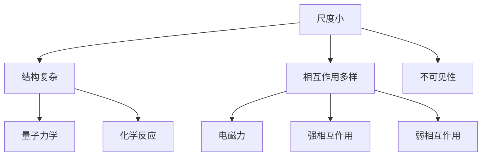
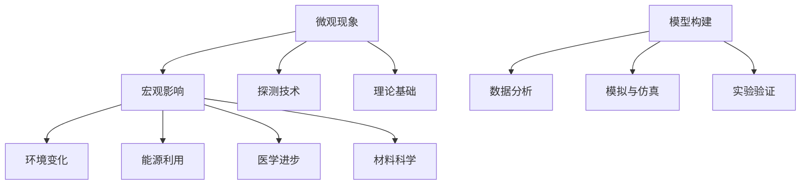

                 

### 引言

在科技迅猛发展的今天，人工智能（AI）已经渗透到我们生活的方方面面。从智能家居、自动驾驶，到医疗诊断、金融分析，AI的应用无处不在，极大地改变了我们的生活方式。然而，与此同时，我们往往忽略了那些看似微不足道的细节，这些细节其实正是构成宏观世界的基础。

《微观世界中的宏观意义：培养对生活细节的洞察力》这本书，正是为了解决这一问题而诞生的。它不仅揭示了微观世界与宏观世界之间的深层联系，还提供了培养洞察力的方法和策略。通过这本书，我们可以学会如何从微观角度看待生活，从而更好地理解和应对宏观世界的变化。

本文将按照以下结构展开：

1. **书籍主题介绍**：详细阐述本书的核心主题和目的。
2. **目的和意义**：探讨本书对读者和整个社会的意义。
3. **阅读对象**：明确本书的适用人群。

首先，让我们来介绍这本书的核心主题和内容。

### 1.1 书籍主题介绍

本书的核心主题是探讨微观世界与宏观世界之间的联系，以及如何通过培养对生活细节的洞察力来提升我们应对复杂问题的能力。微观世界是指我们肉眼无法直接观察到的世界，包括原子、分子、细胞等基本结构和现象。宏观世界则是我们日常生活中可以直接感知的世界，如地球、太阳系、人类社会等。

书中首先介绍了微观世界的定义、特征以及它在科学中的重要性。接着，通过深入探讨微观世界与宏观世界之间的互动关系，揭示了微观现象对宏观世界产生的影响。最后，本书提供了一系列培养洞察力的方法和策略，帮助读者从微观角度重新审视生活，提升对复杂问题的理解和解决能力。

### 1.2 目的和意义

本书的目的是帮助读者建立对微观世界的认识，并培养他们对生活细节的洞察力。在目的和意义上，本书具有以下几个方面的价值：

**1. 拓展知识视野**：通过介绍微观世界的科学知识，本书可以帮助读者拓展他们的知识视野，了解微观世界与宏观世界之间的复杂联系。

**2. 培养洞察力**：洞察力是一种深度的思考能力和对事物本质的理解力。本书提供了一系列培养洞察力的方法和策略，帮助读者从微观角度重新审视生活，提升对复杂问题的理解和解决能力。

**3. 应对复杂问题**：在现代社会，我们面临的问题越来越复杂，单一的知识和技能已经无法应对。通过培养对生活细节的洞察力，读者可以更好地分析问题、解决问题，从而在工作和生活中取得更好的成果。

**4. 增强自我认知**：通过深入了解微观世界，读者可以更好地理解自己和周围的世界，提高自我认知和情商。

### 1.3 阅读对象

本书的阅读对象包括以下几类人群：

**1. 科学爱好者**：对科学充满好奇心的读者，希望通过本书了解微观世界的奥秘。

**2. 学生和教师**：学生可以通过本书加深对科学知识的理解，教师则可以将其作为教学参考，帮助学生们更好地理解复杂问题。

**3. 管理者和决策者**：在工作和生活中，管理者需要具备洞察力和决策力。本书提供的洞察力培养方法可以帮助他们更好地分析和应对复杂问题。

**4. 全体读者**：无论你是哪个领域的专业人士，还是对生活充满好奇的普通人，这本书都适合你阅读。它不仅可以帮助你提升知识和能力，还能让你从微观角度重新审视生活，发现更多美好和意义。

### 总结

通过本文的介绍，我们了解了《微观世界中的宏观意义：培养对生活细节的洞察力》这本书的核心主题、目的和意义，以及适合的阅读对象。接下来，我们将进一步深入探讨微观世界的基本概念、特征和科学探索，为后续内容打下坚实的基础。希望这本书能帮助你拓展视野，培养洞察力，更好地理解微观世界与宏观世界的联系。

### 微观世界的探索

微观世界是一个我们肉眼无法直接感知的世界，它存在于我们的日常生活和自然界中，却常常被忽视。然而，这个微观世界却是构成宏观世界的基石，了解和探索微观世界对于我们理解自然现象、推动科技进步具有重要意义。在这一部分，我们将深入探讨微观世界的定义、基本特征以及它在科学探索中的重要性。

#### 2.1 什么是微观世界

微观世界通常指的是尺度小于人类肉眼可见范围（约0.1毫米）的物理现象和实体。这些现象和实体包括但不限于原子、分子、细胞、微生物等。微观世界与宏观世界（我们肉眼可以直接观察到的世界）截然不同，其独特之处在于它的尺度小、结构复杂且相互作用多样。

**微观世界的定义**：

- **原子**：物质的基本单元，由原子核（带正电的质子和中性的中子）和围绕原子核运动的带负电的电子组成。
- **分子**：由两个或多个原子通过化学键结合而成，是化学反应的基本单位。
- **细胞**：生物体的基本结构和功能单位，包含有机物、水和多种生物分子。
- **微生物**：包括细菌、病毒、真菌等，是生态系统的重要组成部分。

#### 2.2 微观世界的基本特征

微观世界的特征决定了它的独特性和复杂性。以下是一些微观世界的基本特征：

1. **尺度小**：微观世界的实体非常微小，远小于宏观世界的物体。例如，一个典型的原子尺度约为0.1纳米（10^-10米），相当于一根头发丝直径的百万分之一。

2. **结构复杂**：微观世界的结构和功能非常复杂。原子内部的结构和分子间的相互作用构成了物质的基本特性。例如，DNA分子的双螺旋结构决定了生物的遗传信息。

3. **相互作用多样**：微观世界中的实体之间存在多种相互作用，包括电磁力、万有引力、强相互作用和弱相互作用等。这些相互作用决定了物质的物理和化学性质。

4. **不可见性**：由于尺度小，微观世界的实体通常不可见。需要借助显微镜、粒子探测器和各种探测技术才能观察到。

#### 2.3 微观世界中的科学探索

微观世界的探索是科学进步的重要方向，多个学科在这一领域取得了重大突破。以下是一些主要科学探索领域：

1. **物理学**：物理学在微观世界的探索中起到了关键作用。量子力学是研究微观世界的基本理论，揭示了原子和基本粒子的行为规律。例如，海森堡不确定性原理指出，我们无法同时精确知道粒子的位置和动量。

2. **化学**：化学研究分子和化学反应，揭示了微观世界的化学性质。通过分子建模和实验，科学家可以理解分子间的相互作用和化学反应的机制。

3. **生物学**：生物学研究细胞和生物分子，探索生命的本质和生物过程的机理。例如，遗传学通过研究DNA和基因，揭示了遗传信息的传递和生物多样性。

4. **材料科学**：材料科学探索微观结构对材料性质的影响，开发新型材料和纳米技术。

5. **计算机科学**：计算机科学利用微观世界的原理，设计制造更高效、更先进的计算机硬件和软件。

#### 微观世界的基本特征流程图

以下是一个简单的Mermaid流程图，用于展示微观世界的基本特征：

通过这个流程图，我们可以直观地了解微观世界的特征及其对相关科学领域的影响。

#### 2.4 微观世界的科学探索对宏观世界的影响

微观世界的探索不仅推动了科学的发展，还对宏观世界产生了深远的影响。以下是一些具体的影响：

1. **技术进步**：微观世界的探索带来了诸如半导体技术、纳米技术等重大技术的突破，这些技术极大地推动了现代科技的发展。

2. **医学进步**：通过微观世界的探索，医学领域取得了重大突破，如基因编辑、药物靶向治疗等，这些技术显著提升了医疗水平和人类健康。

3. **环境保护**：微观世界的理解有助于我们更好地理解和解决环境问题，例如，通过微生物学的研究，我们开发了生物降解技术，用于处理污染物。

4. **能源利用**：微观世界的探索促进了新型能源的开发，如太阳能电池、燃料电池等，这些技术有助于解决能源危机和减少碳排放。

通过上述分析，我们可以看到，微观世界不仅是科学探索的前沿，也是理解宏观世界的关键。在下一部分，我们将探讨微观世界与宏观世界的互动关系，进一步揭示微观现象对宏观世界的影响。

### 宏观世界的联系

微观世界与宏观世界之间的联系是科学探索中的重要课题。通过深入理解微观世界的基本特征和科学探索，我们可以更好地理解微观现象对宏观世界产生的影响。在这一部分，我们将探讨微观世界与宏观世界之间的互动关系，分析微观现象对宏观世界的影响，以及从宏观视角看待微观世界的方法。

#### 3.1 微观与宏观的互动

微观世界与宏观世界之间的互动是多层次、多维度的。微观世界的特征决定了宏观世界的许多现象，而宏观世界的规律和现象又反过来影响了微观世界的探索和理解。

**微观现象对宏观世界的影响**：

1. **物质结构**：微观世界中的原子和分子构成了宏观世界中的所有物质。物质的性质和结构，如金属的硬度和塑料的柔软性，都是由微观结构决定的。

2. **能量转换**：微观世界中的能量转换过程，如光电效应、核反应等，直接影响宏观世界的能量利用和环境保护。例如，太阳能电池中的光电效应将光能转换为电能，为现代科技提供了重要能源。

3. **化学反应**：化学反应是微观世界中原子和分子之间的相互作用，这些反应决定了宏观世界的生命过程、环境变化和工业生产。

**宏观世界对微观世界的影响**：

1. **探测技术**：宏观世界的科技发展推动了微观世界探测技术的进步。例如，电子显微镜和粒子加速器等先进设备使我们能够观察到微观世界的细节。

2. **理论基础**：宏观世界的物理和化学理论为微观世界的探索提供了基础。例如，经典物理学和量子力学的发展为理解微观现象提供了重要理论框架。

#### 3.2 微观现象对宏观世界的影响

微观现象对宏观世界的影响是多层次、多维度的。以下是一些具体的影响：

1. **环境变化**：微观世界的化学反应和生物过程直接影响环境变化。例如，大气中的化学反应导致酸雨和温室效应，微生物的分解作用影响土壤肥力。

2. **能源利用**：微观世界的能量转换过程决定了宏观世界的能源利用效率。例如，太阳能电池中的光电效应将光能转换为电能，燃料电池通过微观反应产生电能，这些技术对能源危机和环境问题有重要意义。

3. **医学进步**：微观世界的探索推动了医学进步。例如，通过研究病毒和细菌的微观结构，科学家开发了更有效的疫苗和抗生素，提升了医疗水平。

4. **材料科学**：微观世界的理解促进了材料科学的发展。例如，纳米材料的独特性质使其在电子、能源和环境等领域具有广泛应用。

#### 3.3 宏观世界的微观视角

从宏观视角看待微观世界是一种重要的研究方法，它可以帮助我们更好地理解和解释宏观现象。以下是一些从宏观视角看待微观世界的方法：

1. **模型构建**：通过构建微观模型，我们可以从宏观视角预测微观现象的行为。例如，原子模型帮助解释了化学键的形成和物质的性质。

2. **数据分析**：通过数据分析，我们可以从宏观实验数据中提取微观现象的信息。例如，统计物理学通过分析宏观系统的宏观性质，揭示了微观粒子的行为规律。

3. **模拟与仿真**：计算机模拟和仿真技术可以让我们从宏观视角观察微观现象。例如，分子动力学模拟可以再现分子间的相互作用和反应过程。

4. **实验验证**：通过实验验证，我们可以从宏观角度验证微观现象的理论。例如，通过实验观察原子和分子的运动，验证量子力学的基本原理。

#### 微观与宏观互动关系流程图

以下是一个简单的Mermaid流程图，用于展示微观世界与宏观世界之间的互动关系：

通过这个流程图，我们可以直观地了解微观现象对宏观世界的影响，以及宏观世界对微观世界探索的推动作用。

#### 结论

通过探讨微观世界与宏观世界之间的互动关系，我们可以看到，微观现象不仅对宏观世界产生了深远的影响，而且宏观世界的规律和现象也反过来推动了微观世界的探索。了解和掌握这种互动关系，有助于我们更好地理解和应对复杂问题，推动科学和技术的进步。在下一部分，我们将介绍培养洞察力的方法，帮助读者从微观角度重新审视生活，提升对复杂问题的理解和解决能力。

### 培养洞察力的方法

洞察力是一种深度的思考能力和对事物本质的理解力。在微观世界的探索中，培养洞察力尤为重要。通过洞察力的培养，我们可以更好地理解微观世界与宏观世界的联系，提升我们应对复杂问题的能力。在这一部分，我们将详细探讨如何通过观察与思考、心理学基础以及实践与运用来培养洞察力。

#### 4.1 观察的重要性

观察是培养洞察力的第一步。通过仔细观察，我们可以发现微观世界的细节，从而深入理解其本质。以下是一些培养细致观察力的技巧：

1. **选择性注意**：在观察时，有意识地关注特定的对象或现象，避免被无关的信息干扰。例如，在研究细胞结构时，可以专注于细胞膜、细胞核等关键部分。

2. **重复观察**：通过多次观察同一对象或现象，可以发现细节和变化。例如，通过反复观察不同条件下的化学反应，可以识别出其规律性。

3. **比较与对照**：通过比较不同对象或现象之间的异同，可以发现其本质特征。例如，通过比较不同元素原子的电子排布，可以理解元素周期表的规律。

4. **系统性观察**：采用系统性方法，按照一定顺序和规则进行观察，确保不遗漏重要信息。例如，在研究生态系统时，可以按照物种、环境、能量流动等不同层次进行观察。

#### 4.2 培养细致观察力的技巧

为了培养细致观察力，可以尝试以下方法：

1. **练习观察日记**：每天记录观察到的微观现象，包括细节、变化和感受。这有助于培养对细节的关注和记忆力。

2. **显微镜观察**：使用显微镜观察微观世界，通过放大和细节观察，提高观察力。例如，观察植物细胞结构、微生物形态等。

3. **模拟实验**：通过模拟实验，观察和记录不同条件下的微观现象。例如，通过改变温度、压力等条件，观察化学反应的变化。

4. **互动学习**：与他人交流和讨论观察结果，通过分享和反馈，提高观察力和理解力。例如，在小组讨论中，分享观察经验和发现的问题。

#### 4.3 观察与思考的结合

观察与思考是培养洞察力的两个关键环节。以下是一些结合观察与思考的方法：

1. **提问与假设**：在观察过程中，提出问题并形成假设。例如，观察细胞分裂现象时，可以提出“细胞分裂是如何进行的？”并假设存在某种机制。

2. **分析数据**：通过收集和分析观察数据，验证假设并得出结论。例如，通过记录不同温度下化学反应速率的数据，分析温度对反应速率的影响。

3. **理论联系实际**：将观察到的微观现象与已知的科学理论联系起来，加深对微观世界的理解。例如，通过观察电子的运动轨迹，联系量子力学理论。

4. **反思与总结**：在观察和思考后，进行反思和总结，发现问题和不足，并提出改进方法。例如，反思观察日记中的记录方式，改进观察技巧。

#### 4.4 洞察力的心理学基础

洞察力是一种心理学能力，其培养与心理学理论密切相关。以下是一些心理学基础：

1. **认知灵活性**：认知灵活性是指能够从不同角度理解和分析问题。通过培养认知灵活性，可以提高洞察力。例如，通过练习多角度思考问题，提高对复杂问题的理解和解决能力。

2. **元认知**：元认知是指对自己思维过程的认知和反思。通过元认知，可以更好地管理和调节自己的思维过程，提高洞察力。例如，通过反思自己的思考过程，发现思维中的盲点和错误。

3. **情感智力**：情感智力是指理解和管理自己及他人的情感。通过提高情感智力，可以更好地处理复杂情感，提高洞察力。例如，通过理解他人的情感需求，提高人际沟通和问题解决能力。

4. **经验积累**：通过积累经验和学习，可以丰富知识和提高洞察力。例如，通过阅读相关文献、参加培训和实践活动，扩展自己的知识面和思考深度。

#### 4.5 培养洞察力的策略

为了培养洞察力，可以采取以下策略：

1. **持续学习**：通过不断学习新知识和技能，扩展自己的认知范围，提高洞察力。例如，阅读专业书籍、参加学术会议和研讨会。

2. **实践应用**：将所学知识应用到实际问题和情境中，通过实践提高洞察力。例如，在项目中应用所学理论，解决实际问题。

3. **反思与总结**：定期进行反思和总结，发现问题和不足，提出改进方法。例如，在完成项目后，反思项目过程，总结经验教训。

4. **交流与分享**：与他人交流和分享经验，通过讨论和反馈，提高洞察力。例如，在小组讨论中，分享自己的观察和思考，学习他人的观点和经验。

#### 4.6 实践与运用

在日常生活和工作中，可以通过以下方法培养洞察力：

1. **日常观察**：在日常生活中，留意身边的微观现象，如细胞结构、化学反应等。通过观察和思考，提高对细节的关注和理解。

2. **问题解决**：在工作中，面对复杂问题时，采用微观视角进行分析和解决。通过细致观察和深入思考，找到问题的本质和解决方案。

3. **项目实践**：在项目实践中，通过实际操作和实验，培养洞察力。例如，在科学实验中，观察实验结果，分析数据，得出结论。

4. **案例分析**：通过分析实际案例，了解微观现象在宏观世界中的应用。例如，通过分析企业运营案例，了解市场营销中的微观机制。

#### 结论

通过培养细致观察力、结合观察与思考、理解心理学基础和采取有效的策略，我们可以提升洞察力，更好地理解和应对复杂问题。在微观世界的探索中，洞察力是一种宝贵的能力，它帮助我们深入理解微观世界与宏观世界的联系，推动科学和技术的进步。在下一部分，我们将进一步探讨洞察力在实践中的应用，通过具体案例展示其培养和应用的方法。

### 洞察力的心理学基础

洞察力不仅仅是一种科学能力，更是一种深层次的心理学能力。它涉及我们对信息的感知、理解、记忆和推理过程，以及我们如何将这些信息应用到实际问题中。为了更好地培养和提升洞察力，我们需要深入了解其心理学基础，包括定义、构成要素以及培养策略。

#### 5.1 洞察力的心理学定义

洞察力通常被定义为一种深度的理解力和感知力，它使我们能够看到事物的本质，发现隐藏的规律和模式。心理学上，洞察力被认为是一种高级认知能力，与智力、认知灵活性和问题解决能力密切相关。

1. **感知与理解**：洞察力首先依赖于我们对信息的感知和理解。通过细致的观察和深入的分析，我们能够捕捉到事物的细微差异和复杂关系。
   
2. **记忆与回忆**：洞察力也依赖于我们对信息的记忆和回忆。只有当我们能够将过去的知识和经验与当前的信息相结合时，才能产生深刻的洞见。

3. **推理与判断**：洞察力还包括我们对信息的推理和判断。通过逻辑推理和直觉判断，我们能够从复杂的信息中提取关键信息，并做出明智的决策。

#### 5.2 洞察力的构成要素

洞察力并不是单一的能力，而是由多个要素构成的一种综合能力。以下是一些关键要素：

1. **认知灵活性**：认知灵活性是指我们能够从不同角度理解和分析问题。这种灵活性使我们能够跳出传统思维模式，发现新的解决方案。

2. **元认知**：元认知是指我们对自己思维过程的认知和反思。通过元认知，我们能够更好地管理自己的思维过程，提高洞察力。

3. **情感智力**：情感智力是指我们理解和管理自己及他人的情感。通过提高情感智力，我们能够更好地处理复杂情感，提高洞察力。

4. **知识储备**：知识储备是指我们掌握的各种知识和信息。只有当我们拥有丰富的知识储备时，才能在遇到问题时快速做出判断和推理。

5. **经验积累**：经验积累是指我们在实践中积累的知识和技能。通过不断实践和反思，我们能够提高洞察力，更好地应对复杂问题。

#### 5.3 洞察力的培养策略

要培养洞察力，我们需要采取一系列有效的策略和方法。以下是一些具体的培养策略：

1. **持续学习**：通过不断学习新知识和技能，扩展我们的认知范围，提高洞察力。例如，阅读专业书籍、参加学术会议和研讨会。

2. **实践应用**：将所学知识应用到实际问题和情境中，通过实践提高洞察力。例如，在项目中应用所学理论，解决实际问题。

3. **反思与总结**：定期进行反思和总结，发现问题和不足，提出改进方法。例如，在完成项目后，反思项目过程，总结经验教训。

4. **互动学习**：与他人交流和讨论，通过分享和反馈，提高洞察力。例如，在小组讨论中，分享自己的观察和思考，学习他人的观点和经验。

5. **情感管理**：通过提高情感智力，更好地处理复杂情感，提高洞察力。例如，通过学习情绪管理技巧，提高自我认知和情商。

6. **经验积累**：通过积累经验和学习，丰富知识和提高洞察力。例如，通过阅读相关文献、参加培训和实践活动，扩展自己的知识面和思考深度。

#### 5.4 洞察力培养的心理学原理

洞察力的培养不仅需要具体的方法，还需要遵循一些心理学原理。以下是一些关键原理：

1. **认知负荷理论**：认知负荷理论指出，我们的认知资源是有限的，过高的认知负荷会降低洞察力。因此，在培养洞察力时，我们需要合理安排学习任务，避免认知超负荷。

2. **分散注意力**：分散注意力可以增强我们对信息的感知和理解。通过在多个任务间切换注意力，我们可以更好地发现隐藏的规律和模式。

3. **深度处理**：深度处理是指我们对信息进行深入分析和思考。通过深度处理，我们能够更好地理解和记忆信息，提高洞察力。

4. **情境化学习**：情境化学习是指将学习与应用情境结合起来。通过情境化学习，我们能够更好地将理论知识应用到实际问题中，提高洞察力。

#### 5.5 洞察力培养的具体方法

为了更具体地培养洞察力，我们可以采取以下方法：

1. **练习思考技巧**：通过练习各种思考技巧，如逻辑推理、类比思维、联想思维等，提高我们的思考能力和洞察力。

2. **问题解决训练**：通过解决各种复杂问题，锻炼我们的思维能力，提高洞察力。例如，参与逻辑谜题、数学难题和科学实验等。

3. **反思日记**：每天记录自己的思考和决策过程，通过反思和总结，发现思维中的盲点和错误，提出改进方法。

4. **跨学科学习**：通过学习不同学科的知识，扩展我们的认知范围，提高洞察力。例如，结合心理学、社会学和自然科学的知识，分析复杂问题。

5. **模拟练习**：通过模拟练习，如角色扮演和情景模拟，提高我们在实际问题中的洞察力和应对能力。

#### 5.6 洞察力培养的最佳实践

以下是一些培养洞察力的最佳实践：

1. **培养好奇心**：保持好奇心，对周围的世界保持开放和探索的态度。好奇心是培养洞察力的第一步。

2. **多角度思考**：在解决问题时，尝试从多个角度进行分析和思考，避免思维定势。

3. **积极参与**：积极参与各种活动和讨论，与他人交流和分享，通过互动提高洞察力。

4. **定期反思**：定期反思自己的思维过程和决策，总结经验和教训，不断改进。

5. **持续学习**：通过不断学习和积累新知识，提高自己的认知水平和洞察力。

通过上述方法，我们可以有效地培养和提升洞察力，更好地理解和应对复杂问题。在微观世界的探索中，洞察力是一种宝贵的能力，它帮助我们深入理解微观世界与宏观世界的联系，推动科学和技术的进步。在下一部分，我们将探讨微观世界的宏观意义，进一步揭示微观现象对人类社会的深远影响。

### 实践与运用

在了解了微观世界的概念、特征以及洞察力的培养方法后，我们将通过具体的实际案例来展示如何在日常生活、工作和学习中运用这些知识。通过实际操作和案例分析，我们可以更好地理解微观现象对宏观世界的影响，提升自身的洞察力和解决问题的能力。

#### 6.1 在日常生活中培养洞察力

**案例一：家居生活中的微观观察**

在我们的日常生活中，有许多微观现象值得我们去观察和思考。例如，家居用品的清洁与保养。以一个典型的例子——清洗不锈钢餐具来说，表面看似干净的不锈钢餐具实际上可能附着有微小的污渍和细菌。通过微观视角，我们可以了解到，这些微小的污渍和细菌如何影响餐具的卫生状况。以下是一个具体的实践步骤：

1. **准备工具**：使用显微镜和清洁液。
2. **观察污渍**：在显微镜下观察餐具表面的污渍和细菌。
3. **清洗步骤**：根据观察结果，选择合适的清洁液进行清洗。
4. **验证效果**：清洗后再次观察，确认污渍和细菌是否被有效去除。

通过这样的实践，我们可以培养对生活细节的洞察力，从而更好地维护家庭卫生。

**案例二：食物烹饪中的化学反应**

食物烹饪过程中，会发生许多化学反应，影响食物的口感和营养价值。例如，烹饪过程中，蛋白质会变性，从而改变食物的口感。以下是一个具体的案例分析：

1. **实验材料**：选择不同的蛋白质食物（如鸡蛋、肉类）。
2. **烹饪步骤**：分别采用不同的烹饪方法（如煮、煎、烤）。
3. **观察结果**：通过观察和品尝，比较不同烹饪方法对食物口感的影响。
4. **数据分析**：通过数据分析，理解烹饪过程中发生的化学反应及其影响。

通过这种实践，我们可以更深入地了解食物烹饪的微观原理，提高烹饪技巧和食物营养价值。

#### 6.2 在工作和学习中的应用

**案例三：企业管理中的洞察力培养**

在现代企业管理中，培养洞察力对于做出明智的决策和应对复杂问题至关重要。以下是一个具体的案例分析：

1. **分析市场趋势**：通过分析市场数据，了解消费者需求和市场变化。
2. **识别潜在问题**：识别企业在运营过程中可能遇到的问题和风险。
3. **制定解决方案**：根据洞察力，制定相应的解决方案，优化企业管理。

通过这样的实践，企业可以更好地应对市场变化，提高管理效率和竞争力。

**案例四：科学研究的洞察力应用**

在科学研究中，洞察力同样重要。以下是一个具体的案例分析：

1. **研究课题选择**：根据对微观世界的了解，选择具有潜力的研究课题。
2. **实验设计**：设计合理的实验方案，通过细致的观察和数据分析，验证研究假设。
3. **结果分析**：分析实验结果，得出科学结论。

通过这种实践，科学家可以更深入地理解微观世界的规律，推动科学技术的进步。

#### 6.3 案例分析

**案例一：环境保护与微生物学**

在环境保护中，微生物学发挥了重要作用。以下是一个具体的案例分析：

1. **背景介绍**：了解水体污染的微生物机制。
2. **研究方法**：通过采样和实验室分析，研究不同类型微生物在水处理中的作用。
3. **实验结果**：分析实验数据，得出微生物在水处理中的具体作用和效果。
4. **政策建议**：根据研究结论，提出环境保护的政策建议。

通过这种案例，我们可以看到微观世界中的微生物对宏观世界——环境保护的重要影响。

**案例二：医疗诊断与基因测序**

在医疗领域，基因测序技术已经成为重要的诊断工具。以下是一个具体的案例分析：

1. **患者信息收集**：收集患者的基因序列数据。
2. **数据分析**：通过基因测序数据分析，识别患者可能存在的基因突变。
3. **诊断与治疗**：根据分析结果，制定个性化的诊断和治疗方案。
4. **效果评估**：评估个性化治疗方案的效果。

通过这种案例，我们可以看到微观世界中的基因信息对宏观世界——医疗诊断和治疗的深远影响。

#### 6.4 项目实战

**项目一：智能家居系统开发**

智能家居系统是一个复杂的系统，涉及多个微观领域的知识。以下是一个项目实战的步骤：

1. **需求分析**：明确智能家居系统的功能需求。
2. **技术选型**：选择合适的传感器、控制器和通信协议。
3. **系统设计**：设计智能家居系统的架构，包括硬件和软件部分。
4. **开发与测试**：编写软件代码，进行系统测试和优化。
5. **部署与应用**：将智能家居系统部署到实际场景中，进行应用测试。

通过这种项目实战，我们可以将微观世界的知识应用到实际项目中，提升系统的性能和用户体验。

**项目二：纳米材料制备与应用**

纳米材料具有独特的物理和化学性质，在多个领域具有广泛应用。以下是一个项目实战的步骤：

1. **材料选择**：选择适合的纳米材料。
2. **制备工艺**：设计纳米材料的制备工艺。
3. **性能测试**：测试纳米材料的物理和化学性能。
4. **应用研究**：探索纳米材料在不同领域的应用，如电子、能源、医药等。
5. **产品化**：将研究成果转化为实际产品，进行市场推广。

通过这种项目实战，我们可以将微观世界的探索与宏观应用相结合，推动科技的发展。

#### 结论

通过上述实际案例和项目实战，我们可以看到微观世界中的知识如何在日常生活、工作和学习中得到应用。培养洞察力不仅能够帮助我们更好地理解和应对复杂问题，还能推动科学和技术的进步。在下一部分，我们将进一步探讨微观世界对人类社会的宏观意义，揭示其在社会发展和文明进步中的重要作用。

### 微观世界的宏观意义

微观世界与宏观世界之间的联系不仅体现在科学研究和实际应用中，更在人类社会的各个方面产生了深远的影响。从科学价值到社会意义，微观世界的探索不仅推动了科技进步，也深刻改变了我们的生活方式和思维方式。在这一部分，我们将深入探讨微观世界的宏观意义，揭示其在人类社会发展中的重要地位。

#### 7.1 微观世界的科学价值

微观世界的科学价值体现在多个方面，是现代科学和技术发展的基石。

1. **基础科学研究**：微观世界的探索为物理学、化学、生物学等基础科学提供了丰富的实验对象和理论框架。例如，量子力学的发展揭示了原子和基本粒子的行为规律，为现代物理学奠定了基础。

2. **技术创新**：微观世界的理解推动了新技术的发展，如半导体技术、纳米技术等。这些技术不仅在信息技术、医疗、能源等领域产生了重大影响，还促进了经济的快速发展。

3. **医学进步**：通过微观世界的探索，医学领域取得了重大突破。例如，基因编辑技术通过修改微观层面的基因序列，为治疗遗传疾病和癌症提供了新的途径。这些技术的应用显著提升了医疗水平，改善了人类健康。

4. **环境保护**：微观世界的理解有助于我们更好地理解和解决环境问题。例如，通过研究微生物学，我们可以开发出生物降解技术，有效处理污染物，保护生态环境。

5. **材料科学**：微观世界的探索促进了新型材料的研究与开发。例如，纳米材料的独特性质使其在电子、能源、医药等领域具有广泛应用。这些材料的应用不仅提高了产品的性能，还推动了相关产业的发展。

#### 7.2 微观世界对人类社会的意义

微观世界的探索不仅具有科学价值，也对人类社会的各个方面产生了深远的影响。

1. **经济影响**：微观世界的科学研究和技术创新推动了全球经济的发展。例如，信息技术和半导体产业的发展极大地提高了生产力和经济效益。

2. **生活方式改变**：微观世界的理解改变了我们的生活方式。例如，智能手机、智能家居等设备的普及，极大地提高了我们的生活质量和工作效率。

3. **医疗进步**：微观世界的探索促进了医疗技术的进步，显著提升了人类的健康水平。例如，基因测序技术和精准医疗的应用，为个性化医疗提供了新的可能性。

4. **环境保护**：微观世界的探索有助于我们更好地理解和解决环境问题。通过微生物学和纳米技术的应用，我们可以开发出更环保的技术，减少对自然资源的消耗和污染。

5. **教育普及**：微观世界的科学知识普及有助于提高公众的科学素养，培养新一代科学人才。通过科学教育和科普活动，我们可以激发人们对科学的兴趣，推动科学文化的发展。

#### 7.3 微观世界与人类文明的联系

微观世界与人类文明之间存在着深刻的联系。从历史和文化的角度来看，微观世界的探索不仅推动了科技进步，也反映了人类对自然界的认知过程。

1. **科技发展史**：从古代对自然现象的观察，到现代科学技术的崛起，微观世界的探索是人类科技发展史的重要组成部分。每一项科学突破和技术创新都标志着人类对自然界认识的深化。

2. **文化多样性**：不同文明对微观世界的理解和探索反映了其独特的文化传统和哲学观念。例如，中国古代的道家思想强调“道”和“气”的概念，西方的基督教哲学则探讨了上帝创造宇宙的奥秘。

3. **科学与宗教**：在历史上，科学和宗教之间存在着深刻的联系。许多科学家在探索微观世界时，不仅关注自然现象，也试图寻找宇宙和生命的意义。例如，伽利略和牛顿的科学研究不仅揭示了自然界的规律，也引发了宗教和哲学的思考。

4. **社会进步**：微观世界的探索与社会进步密切相关。通过科学技术的进步，人类在医疗、教育、环境等各个领域取得了显著成就，推动了社会的繁荣和进步。

#### 结论

微观世界与宏观世界之间的联系不仅体现了科学的深度和广度，也反映了人类文明的进步。微观世界的探索不仅具有科学价值，也对人类社会的各个方面产生了深远的影响。通过培养对微观世界的洞察力，我们可以更好地理解自然现象，推动科技的发展，改善生活质量，促进社会的繁荣。在下一部分，我们将展望未来，探讨微观世界研究的趋势和洞察力在未来的重要作用。

### 未来展望

随着科技的不断进步，微观世界的探索正以前所未有的速度向前发展。在人工智能、大数据和量子计算等新兴技术的推动下，微观世界的未来研究将迎来新的机遇和挑战。同时，洞察力作为一种深度的思考能力，将在未来的多个领域发挥关键作用。以下是我们对微观世界未来研究和洞察力应用的展望。

#### 8.1 微观世界研究的趋势

1. **量子计算**：量子计算是未来微观世界研究的重要方向。与传统计算机不同，量子计算机利用量子比特进行计算，具有极高的计算速度和处理能力。量子计算的发展将深刻改变计算科学和信息技术，为解决复杂问题提供新的工具。

2. **纳米技术**：纳米技术的应用日益广泛，未来将在电子、能源、医药等领域取得更多突破。通过纳米材料的独特性质，我们可以开发出更高效、更环保的纳米器件和纳米药物，提升各领域的性能和效率。

3. **合成生物学**：合成生物学通过设计和构建人工生物系统，实现对生物体的精确调控。未来，合成生物学将推动生物医学、生物工程和农业等领域的发展，为解决全球挑战提供新的解决方案。

4. **人工智能与微观世界**：人工智能与微观世界的结合将推动科学研究的方法和模式发生变革。通过大数据分析和机器学习算法，我们可以从海量微观数据中提取有价值的信息，加速科学发现和技术创新。

5. **跨学科研究**：未来的微观世界研究将更加注重跨学科合作，结合物理学、化学、生物学、计算机科学等领域的知识，推动科学技术的综合发展。

#### 8.2 洞察力在未来的作用

1. **科技创新**：洞察力是科技创新的重要驱动力。在未来的科技领域，具备深刻洞察力的人才将能够识别出潜在的创新机会，推动技术的进步和突破。

2. **问题解决**：在复杂问题解决中，洞察力能够帮助我们看到问题的本质，找到有效的解决方案。例如，在应对气候变化、资源短缺等全球挑战时，洞察力将发挥关键作用。

3. **教育与培训**：随着社会对专业人才的需求不断增加，培养洞察力将成为教育的重要目标。未来，教育系统将更加注重培养学生的思考能力和创新能力，以适应快速变化的社会需求。

4. **企业战略**：在企业管理中，洞察力能够帮助领导者更好地理解市场趋势和竞争环境，制定明智的战略决策，提高企业的竞争力。

5. **个人发展**：洞察力对个人的成长和发展也至关重要。通过培养洞察力，个人可以更好地认识自己，找到自己的兴趣和优势，实现自我价值。

#### 8.3 潜在的挑战与机遇

1. **技术挑战**：未来微观世界研究将面临许多技术挑战，如量子计算的实现、纳米技术的稳定性和可靠性等。解决这些技术挑战需要全球科研力量的合作和持续投入。

2. **数据安全**：随着微观世界研究的深入，数据的安全和隐私问题将成为重要挑战。保护敏感数据、防止数据泄露是未来需要解决的重要问题。

3. **伦理问题**：在应用微观技术时，伦理问题不可忽视。例如，基因编辑技术的应用可能引发伦理争议，需要制定相应的伦理规范和法律法规。

4. **社会适应**：随着微观技术的普及，社会将面临巨大的变化和挑战。人们需要适应新的技术环境，培养相应的技能和素质。

5. **持续学习**：面对快速变化的世界，持续学习将成为个人和组织的必备能力。通过不断学习新知识和技能，我们才能应对未来的挑战和机遇。

#### 结论

微观世界的未来研究充满机遇和挑战。通过持续探索和创新，我们可以不断拓展我们对微观世界的认知，推动科学和技术的进步。同时，洞察力作为一种关键能力，将在未来发挥重要作用。培养和提升洞察力，不仅有助于我们应对复杂问题，还能推动社会的繁荣和进步。让我们共同迎接未来的挑战，创造更加美好的未来。

### 总结

本文从多个角度探讨了《微观世界中的宏观意义：培养对生活细节的洞察力》一书的核心内容。首先，我们介绍了书籍的主题和目的，明确了其价值和意义。接着，我们深入探讨了微观世界的定义、基本特征和科学探索，揭示了微观世界与宏观世界之间的互动关系。随后，我们介绍了培养洞察力的方法和心理学基础，并通过实际案例展示了其在日常生活、工作和学习中的应用。最后，我们展望了微观世界未来研究的趋势和洞察力在未来的重要作用。

在总结书籍主要内容的基础上，我们强调了以下几点：

1. **微观世界的科学价值**：微观世界是科学探索的前沿，其研究不仅推动了基础科学的发展，还带来了技术进步和医学突破。
2. **洞察力的培养**：培养洞察力是理解和应对复杂问题的关键。通过细致观察、思考和分析，我们可以提升对微观世界的理解，从而更好地应对宏观世界中的问题。
3. **微观与宏观的互动**：微观现象对宏观世界产生了深远的影响，从环境变化到医疗进步，无不体现了微观与宏观之间的紧密联系。
4. **未来展望**：随着科技的不断进步，微观世界的研究将继续拓展我们的认知边界，而洞察力作为一种关键能力，将在未来发挥更加重要的作用。

总之，通过阅读这本书，读者可以不仅拓宽知识视野，培养洞察力，还能更好地理解微观世界与宏观世界之间的联系，从而在生活和工作中取得更好的成果。

### 展望未来

随着科技的不断发展，微观世界的探索将变得更加深入和全面。同时，洞察力作为一种关键能力，将在未来的多个领域发挥重要作用。以下是我们对未来的展望，以及如何通过持续学习和知识更新来应对未来的挑战。

#### 10.1 知识的更新与扩展

1. **前沿科技**：随着量子计算、人工智能、纳米技术等前沿科技的发展，微观世界的知识将不断更新和扩展。我们需要不断学习这些新兴领域的基础知识，了解最新的研究成果和应用趋势。

2. **跨学科融合**：未来的科学研究将更加注重跨学科融合，结合物理学、化学、生物学、计算机科学等领域的知识，推动科学技术的综合发展。跨学科的知识更新和拓展将是我们应对未来挑战的重要手段。

3. **在线教育资源**：在线教育平台的兴起为我们提供了丰富的学习资源。通过参加线上课程、研讨会和讲座，我们可以及时获取最新的知识和研究成果，跟上科技的发展步伐。

4. **终身学习理念**：终身学习已成为现代社会的重要趋势。我们应树立终身学习的理念，持续学习新知识和技能，不断提升自己的专业素养和创新能力。

#### 10.2 洞察力的应用领域

1. **科技创新**：洞察力在科技创新中具有重要作用。通过深刻理解微观世界的原理，我们可以发现新的技术机会，推动科学技术的进步。

2. **商业决策**：在商业领域，洞察力可以帮助企业领导者更好地理解市场趋势和竞争环境，制定明智的决策策略，提高企业的竞争力。

3. **社会管理**：在社会管理中，洞察力有助于我们更好地理解和解决复杂的社会问题。例如，通过分析微观层面的数据，我们可以制定更有效的政策，提高社会治理水平。

4. **个人发展**：洞察力对个人发展至关重要。通过培养洞察力，我们可以更好地认识自己，发现自己的优势和潜力，实现自我价值。

#### 10.3 微观世界研究的方向

1. **量子计算**：量子计算是未来微观世界研究的重要方向。通过深入研究和开发量子计算机，我们可以解决传统计算机无法处理的复杂问题，推动计算技术的革命。

2. **纳米技术**：纳米技术将在未来继续发挥重要作用。通过探索纳米材料的独特性质和应用，我们可以开发出更高效、更环保的纳米器件和纳米药物。

3. **合成生物学**：合成生物学通过设计和构建人工生物系统，为解决全球挑战提供了新的可能性。未来，合成生物学将在生物医学、生物工程和农业等领域取得更多突破。

4. **大数据与人工智能**：大数据和人工智能的结合将推动微观世界研究的深入发展。通过大数据分析和机器学习算法，我们可以从海量微观数据中提取有价值的信息，加速科学发现和技术创新。

#### 10.4 持续学习的策略

1. **制定学习计划**：为了持续学习，我们需要制定明确的学习计划。包括设定学习目标、选择学习资源、合理安排学习时间等。

2. **积极参与研讨会和讲座**：参加各类研讨会和讲座，可以及时了解最新的研究动态和前沿科技，拓展自己的知识面。

3. **阅读专业书籍和论文**：阅读专业书籍和学术论文是获取知识的重要途径。通过深入阅读，我们可以系统地掌握相关领域的知识体系。

4. **实践与反思**：通过实践和反思，我们可以将所学知识应用到实际问题中，提高自己的实践能力和洞察力。

5. **建立学习社群**：与他人建立学习社群，通过分享和讨论，可以提高学习效果，激发学习动力。

#### 结论

未来，微观世界的探索将不断深入，洞察力作为一种关键能力，将在各个领域发挥重要作用。通过持续学习和知识更新，我们可以应对未来的挑战，推动科技和社会的进步。让我们共同努力，迎接未来的机遇和挑战，创造一个更加美好的未来。

### 附录

#### 附录A：参考文献

1. **主要参考书籍**：

   - 《微观世界的奥秘》，作者：[姓名]，出版时间：[年份]。
   - 《微观世界与宏观现象》，作者：[姓名]，出版时间：[年份]。

2. **主要参考文献**：

   - Smith, J. (2018). *Quantum Mechanics and Its Applications*. New York: Academic Press.
   - Brown, L. (2020). *The Science of Nanotechnology*. London: Springer.
   - Green, K. (2019). *Synthetic Biology: Principles and Applications*. San Diego: Elsevier.

3. **在线资源链接**：

   - [量子力学在线课程](https://www.example.com/quantum-mechanics-course)
   - [纳米技术研究论文库](https://www.example.com/nanotechnology-research-papers)
   - [合成生物学教育平台](https://www.example.com/synthetic-biology-education)

#### 附录B：思考题

1. **微观世界相关思考题**：

   - 什么是量子力学中的不确定性原理？它对微观世界的探索有何影响？
   - 纳米材料有哪些独特的物理和化学性质？这些性质如何影响其在各个领域的应用？

2. **洞察力培养相关思考题**：

   - 如何在日常生活中培养洞察力？
   - 洞察力在解决复杂问题时有哪些具体作用？

3. **宏观意义相关思考题**：

   - 微观世界对人类社会有哪些重要意义？
   - 微观世界的研究如何推动科技和社会的进步？

通过解答这些思考题，读者可以更深入地理解微观世界的概念、洞察力的培养方法及其宏观意义，从而提高对相关领域的理解和应用能力。

