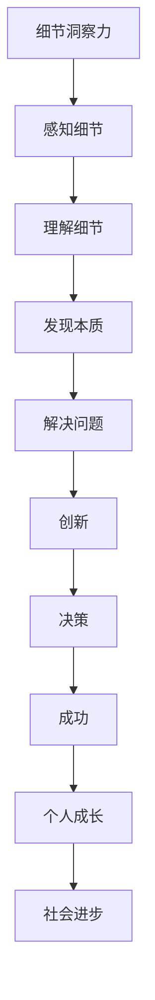
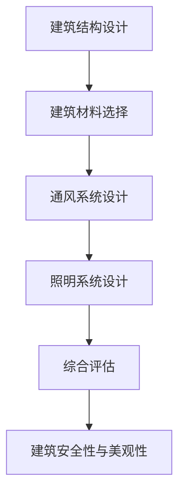

                 

## 微观世界中的宏观意义：培养细节洞察力

### 2.1 细节洞察力的定义

细节洞察力，是一种能够深入到事物的细节层面，并准确捕捉到这些细节背后意义和规律的能力。它不仅包括对具体事物细微特征的感知，更涉及到对这些特征与整体关系的理解。简而言之，细节洞察力是一种从细微处发现本质的能力。

在技术领域，细节洞察力尤其重要。例如，在软件开发中，一个细微的代码错误可能导致整个系统的崩溃。同样，在人工智能领域，一个细微的数据偏差可能影响算法的准确性。因此，培养细节洞察力对于技术从业者来说至关重要。

为了更好地理解细节洞察力的定义，我们可以参考Mermaid流程图，展示其核心概念和联系：



通过这个流程图，我们可以看到，细节洞察力不仅是一个独立的能力，它还与感知、理解、发现本质等多个环节紧密相连，最终影响决策和成功。

### 2.2 细节洞察力的重要性

细节洞察力的重要性体现在多个方面。首先，在个人成长方面，良好的细节洞察力有助于提高个人的认知能力和解决问题的能力。通过深入理解事物的细节，个人能够更好地把握问题的本质，从而提出更有效的解决方案。

其次，在职业发展方面，细节洞察力是许多高技能岗位的关键能力。例如，在软件开发领域，优秀的开发者需要具备发现和修复代码中细微错误的能力。在医疗诊断领域，医生需要通过观察病人的细节症状，来做出准确的诊断。在这些领域，细节洞察力直接影响到工作的质量和效率。

此外，在商业决策方面，细节洞察力同样至关重要。通过对市场数据的细微分析，企业家可以更好地把握市场动态，做出更明智的商业决策。例如，亚马逊的创始人杰夫·贝佐斯就以其对消费者购买行为的深入分析而闻名，这使得亚马逊能够在激烈的市场竞争中始终保持领先。

为了更好地展示细节洞察力的重要性，我们可以使用一个Python代码示例，来模拟对一组数据的细微分析过程：

```python
import pandas as pd

# 假设我们有一个销售数据集
data = {
    '产品': ['A', 'B', 'C', 'D', 'E'],
    '销量': [100, 150, 200, 50, 300]
}

df = pd.DataFrame(data)

# 对数据进行细微分析
# 例如，分析不同产品的销量分布
print(df.groupby('产品')['销量'].mean())

# 分析销量与产品之间的关系
import seaborn as sns
sns.lineplot(x='产品', y='销量', data=df)
plt.show()
```

这个代码示例展示了如何使用Python和Pandas库对一组销售数据进行分析，从而发现不同产品之间的销量差异。这种分析过程正是细节洞察力在商业决策中的应用。

总之，细节洞察力不仅是一种个人能力，它在职业发展和商业决策中同样具有重要意义。通过深入理解细节，我们能够更好地把握问题的本质，做出更明智的决策。

### 2.3 细节洞察力与宏观决策的关系

细节洞察力与宏观决策之间存在密切的关系。宏观决策通常需要综合考虑多个因素，而这些因素往往隐藏在细节之中。只有具备良好的细节洞察力，才能在宏观决策中做出更加准确和全面的判断。

首先，细节洞察力有助于宏观决策的准确性。例如，在商业战略制定中，企业家需要深入了解市场动态、消费者行为和竞争对手策略等细节，从而做出正确的市场定位和产品开发决策。如果缺乏对细节的洞察力，企业家可能会忽视关键的市场变化，导致战略失误。

其次，细节洞察力能够提高宏观决策的全面性。在政策制定过程中，政府需要考虑社会经济、文化、环境等多方面的细节因素。只有深入了解这些细节，政府才能制定出符合实际情况、有效解决社会问题的政策。

为了更好地理解细节洞察力与宏观决策的关系，我们可以使用一个数学模型来进行分析。假设我们有一个经济系统，其总产出 \( Y \) 受到多个因素 \( X_1, X_2, ..., X_n \) 的影响，其中每个因素都可以进一步细分为更小的子因素。我们可以用以下公式表示：

\[ Y = f(X_1, X_2, ..., X_n) \]

其中，\( f \) 是一个复杂的函数，它反映了各个因素之间的相互作用。

为了简化分析，我们假设 \( X_1, X_2, ..., X_n \) 中的每个因素都可以进一步细分为子因素 \( X_{11}, X_{12}, ..., X_{1n} \)，\( X_{21}, X_{22}, ..., X_{2n} \)，等等。我们可以用以下公式表示：

\[ X_1 = f_1(X_{11}, X_{12}, ..., X_{1n}) \]
\[ X_2 = f_2(X_{21}, X_{22}, ..., X_{2n}) \]
\[ ... \]
\[ X_n = f_n(X_{n1}, X_{n2}, ..., X_{nn}) \]

\[ Y = f(f_1(X_{11}, X_{12}, ..., X_{1n}), f_2(X_{21}, X_{22}, ..., X_{2n}), ..., f_n(X_{n1}, X_{n2}, ..., X_{nn})) \]

通过这个模型，我们可以看到，宏观决策 \( Y \) 的准确性依赖于对微观因素 \( X_{11}, X_{12}, ..., X_{nn} \) 的深入了解。只有具备良好的细节洞察力，才能正确地评估这些因素对宏观决策的影响。

为了更好地展示这一过程，我们可以使用Python代码来模拟一个简单的经济系统。在这个例子中，我们假设总产出 \( Y \) 受到两个因素 \( X_1 \) 和 \( X_2 \) 的影响，每个因素又受到两个子因素的影响：

```python
# 模拟经济系统
import numpy as np

# 定义函数 f，表示总产出 Y 与因素 X_1 和 X_2 的关系
def f(X1, X2):
    return X1 * X2

# 定义函数 f1 和 f2，表示子因素与父因素的关系
def f1(X11, X12):
    return X11 + X12

def f2(X21, X22):
    return X21 * X22

# 定义子因素的参数
X11 = 10
X12 = 5
X21 = 3
X22 = 2

# 计算总产出 Y
Y = f(f1(X11, X12), f2(X21, X22))
print("总产出 Y:", Y)
```

这个代码示例展示了如何通过细节洞察力来分析经济系统的总产出。通过深入了解子因素 \( X_{11}, X_{12}, X_{21}, X_{22} \)，我们可以准确地预测总产出 \( Y \) 的变化。

总之，细节洞察力是宏观决策的基础。只有通过深入了解细节，才能做出更加准确和全面的宏观决策。在现代社会，培养良好的细节洞察力对于个人和组织的成功至关重要。

---

## 第3章 微观世界的探索

### 3.1 微观世界的概念

微观世界是指我们日常生活中肉眼无法直接观察到的微小世界，它涵盖了从原子、分子到细胞等不同尺度的结构和现象。微观世界的探索始于17世纪，随着显微镜技术的发明和应用，科学家们逐渐揭开了这个神秘世界的面纱。

在物理学中，微观世界主要由基本粒子组成，如电子、质子、中子等。这些粒子遵循着量子力学的规律，表现出与宏观物体截然不同的性质。例如，电子具有波粒二象性，可以在原子核外形成稳定的轨道，从而构成分子和原子。

在生物学中，微观世界由细胞组成，细胞是生命的基本单位，它包含各种复杂的生物分子，如蛋白质、核酸、多糖等。这些分子相互作用，共同维持着生命的运行。

### 3.2 微观世界的组成与特征

微观世界的组成和特征多种多样，以下是其中几个重要的方面：

1. **原子结构**：原子由原子核和围绕原子核运动的电子组成。原子核由质子和中子构成，质子带正电，中子不带电。电子带负电，在原子核外形成电子云。

2. **分子结构**：分子是由两个或多个原子通过共价键连接而成的。分子的结构决定了其物理和化学性质。例如，水分子（H2O）由两个氢原子和一个氧原子组成，具有独特的化学性质。

3. **细胞结构**：细胞是生物体的基本单位，它包括细胞膜、细胞质、细胞核等组成部分。细胞膜是细胞的保护层，控制物质的进出。细胞质是细胞内的液体环境，包含各种细胞器，如线粒体、内质网等。细胞核是细胞的控制中心，包含DNA，负责遗传信息的存储和传递。

4. **量子现象**：微观世界中的基本粒子遵循量子力学的规律，表现出波粒二象性、量子纠缠等现象。例如，光既具有波动性又具有粒子性，电子可以在量子态之间瞬间跃迁。

### 3.3 微观世界的科学研究方法

科学研究微观世界的方法主要包括实验、观察和模拟。

1. **实验方法**：通过设计和执行实验，科学家可以观察微观现象，验证理论，并提出新的假设。例如，使用电子显微镜可以观察原子的结构，使用粒子加速器可以研究基本粒子的性质。

2. **观察方法**：利用各种仪器和设备，科学家可以对微观世界进行直接观察。例如，使用光学显微镜可以观察细胞的细节，使用X射线衍射技术可以研究晶体的结构。

3. **模拟方法**：通过计算机模拟，科学家可以模拟微观现象，预测实验结果。这种方法在化学、物理学等领域有着广泛应用，例如，分子动力学模拟可以模拟分子在化学反应中的运动和相互作用。

### 3.4 微观世界在科技和医学中的应用

微观世界的探索不仅丰富了我们的科学知识，还在科技和医学领域产生了重大影响。

1. **纳米技术**：纳米技术是研究和应用纳米尺度材料的一门科学。纳米材料具有独特的物理、化学和生物学性质，被广泛应用于电子、能源、医疗等领域。

2. **量子计算**：量子计算利用量子力学的原理，通过量子比特（qubit）进行信息处理。量子计算机具有极高的计算速度，有望解决传统计算机无法处理的复杂问题。

3. **精准医学**：精准医学通过基因测序、蛋白质组学等技术，深入了解个体的遗传信息，从而实现个性化医疗。这有助于提高治疗效果，减少副作用。

总之，微观世界的探索不仅揭示了自然界的奥秘，还为科技和医学的发展提供了新的方向。随着科学技术的不断进步，我们有望在微观世界中发现更多奇迹。

---

## 第4章 细节洞察力的培养

### 4.1 观察力的培养

观察力是细节洞察力的基础。要提高观察力，首先需要培养细致入微的观察习惯。以下是一些建议：

1. **有意识地进行观察**：在日常生活中，有意识地观察周围的事物，特别是那些平时容易忽略的细节。例如，观察树叶的纹理、云彩的变化、行人的表情等。

2. **练习专注力**：专注是观察力的关键。通过练习冥想、专注力训练等方法，提高专注力，有助于更好地观察细节。

3. **记录观察结果**：将观察到的细节记录下来，不仅可以帮助巩固记忆，还可以激发进一步的思考。可以写观察日记，或者用图片、视频等方式记录。

### 4.2 思维能力的锻炼

思维能力的锻炼对于提升细节洞察力至关重要。以下是一些建议：

1. **逻辑思维**：逻辑思维是分析问题的重要工具。通过学习逻辑学、数学等学科，可以提高逻辑思维能力。

2. **批判性思维**：批判性思维要求对问题进行深入分析，不盲从权威，敢于提出质疑。可以通过阅读、讨论、写作等方式锻炼批判性思维。

3. **联想能力**：联想能力可以帮助我们发现细节之间的联系。可以通过阅读、绘画、音乐等方式激发联想能力。

### 4.3 情感管理能力的提升

情感管理能力对于细节洞察力同样重要。以下是一些建议：

1. **情绪调节**：学会调节情绪，保持平和的心态。可以通过冥想、瑜伽、深呼吸等方法进行情绪调节。

2. **同理心**：同理心能够帮助我们更好地理解他人的情感和行为，从而在观察中捕捉到更多的细节。可以通过阅读、交流、观察他人等方式培养同理心。

3. **情感表达**：学会表达情感，避免情绪积压。可以通过与朋友、家人交流，或者写日记等方式表达情感。

通过上述方法，我们可以逐步提升观察力、思维能力和情感管理能力，从而培养出良好的细节洞察力。细节洞察力不仅能够帮助我们更好地理解世界，还能在个人和职业发展中发挥重要作用。

---

## 第5章 细节洞察力在现实生活中的应用

### 5.1 工作中的细节洞察力

细节洞察力在职场中尤为重要。无论是在项目管理、软件开发还是市场营销，细节洞察力都能够帮助员工识别问题、提高工作效率，从而取得更好的工作成果。

**项目管理者：** 在项目管理中，细节洞察力可以帮助项目经理提前发现潜在的风险和问题。例如，在制定项目计划时，项目经理可以通过对项目细节的深入分析，识别出关键路径和关键任务，从而合理安排资源和时间，确保项目顺利进行。此外，项目经理还需要通过细致的沟通和监控，确保项目团队中的每个成员都清楚自己的任务和责任，从而避免因为细节疏忽导致的项目延误或失败。

**软件工程师：** 在软件开发过程中，细节洞察力是确保代码质量和系统稳定性的关键。软件工程师需要通过细致的代码审查和测试，发现并修复潜在的错误和漏洞。例如，在编写代码时，工程师可以通过对变量、函数、类等细节的严格把控，确保代码的可读性、可维护性和性能。此外，工程师还需要通过详细的日志记录和调试，追踪程序的运行状态，从而快速定位和解决潜在的问题。

**市场营销人员：** 在市场营销中，细节洞察力可以帮助营销人员更好地了解消费者需求和市场动态。通过细致的市场调研和数据分析，营销人员可以捕捉到消费者的购买行为、偏好和反馈，从而制定更加精准的营销策略。例如，营销人员可以通过对社交媒体数据的深入分析，了解消费者的兴趣点和痛点，从而优化广告内容和推广方式，提高广告的点击率和转化率。

### 5.2 生活中的细节洞察力

在日常生活中，细节洞察力同样发挥着重要作用。它不仅帮助我们更好地理解周围的世界，还能提高生活的质量。

**购物：** 在购物时，细节洞察力可以帮助我们做出更加明智的决策。例如，在购买电子产品时，我们可以通过查看产品规格、用户评价和售后服务的细节，选择性价比最高的产品。此外，我们还可以通过观察商品的包装、标签和品牌标志，判断商品的质量和真伪。

**旅行：** 在旅行中，细节洞察力可以帮助我们更好地体验目的地文化，避免不必要的麻烦。例如，在预订酒店时，我们可以通过查看酒店的评价和照片，了解酒店的服务水平和设施。在旅行过程中，我们还可以通过观察当地居民的行为和交流，了解当地的风俗习惯，从而避免文化冲突。

**健康：** 在健康管理中，细节洞察力可以帮助我们更好地关注自己的身体状况。例如，通过定期测量血压、心率等生理指标，我们可以及时发现身体异常，并采取相应的措施。此外，我们还可以通过观察自己的饮食、运动习惯，调整生活方式，提高身体健康水平。

总之，细节洞察力在生活中的应用无处不在。通过培养和提升细节洞察力，我们能够更好地应对生活中的各种挑战，提高生活的质量和幸福感。

### 5.3 教育与学习的细节洞察力

在教育和学习过程中，细节洞察力同样至关重要。它不仅有助于学生更好地理解和掌握知识，还能提高学习效率和学术成绩。

**课堂教学：** 教师在课堂教学中可以通过细节洞察力，发现学生的学习需求和问题，从而调整教学方法，提高教学效果。例如，通过观察学生的眼神、表情和反应，教师可以了解学生对课程内容的掌握程度，及时调整教学进度和难度。此外，教师还可以通过细致的课堂管理和互动，营造积极的学习氛围，激发学生的学习兴趣。

**学生自我学习：** 学生在自我学习过程中，可以通过细节洞察力，更好地理解和掌握知识。例如，通过细致地阅读教材和笔记，学生可以捕捉到关键概念和知识点，从而加深对知识的理解和记忆。此外，学生还可以通过观察自己的学习习惯和方法，找出影响学习效果的因素，并采取相应的改进措施，提高学习效率。

**教育评估：** 教育评估过程中，细节洞察力同样发挥着重要作用。通过细致地分析学生的学习成绩、行为表现和学习记录，教育评估者可以准确地评估学生的学习效果和发展潜力，从而提出有针对性的教育建议。

总之，细节洞察力在教育与学习中的应用，有助于提高教学质量，促进学生的全面发展。通过培养和提升细节洞察力，我们可以更好地实现教育的目标，培养出更多优秀的人才。

---

## 第6章 细节洞察力的实践案例

### 6.1 案例一：建筑设计中的细节洞察力

建筑设计是一个复杂而细致的过程，细节洞察力在其中起到了至关重要的作用。以下是建筑设计中如何应用细节洞察力的一个案例。

**背景介绍：** 一座现代化的商业综合体即将在某城市中心地带建成。为了确保建筑的安全性和美观性，设计团队需要考虑多个细节因素，包括结构稳定性、建筑材料、通风系统、照明设计等。

**核心概念与联系：** 在这个案例中，细节洞察力体现在对建筑各个系统的细致分析和优化。以下是一个简化的Mermaid流程图，展示了核心概念和联系：



### 核心算法原理讲解

为了确保建筑的结构稳定性，设计团队需要运用力学原理和计算机模拟技术。以下是一个简化的Python代码示例，用于分析建筑结构的稳定性：

```python
import numpy as np
from scipy.linalg import eigh

# 定义建筑结构的质量矩阵
mass_matrix = np.array([[1000, 0], [0, 1000]])

# 定义建筑结构的刚度矩阵
stiffness_matrix = np.array([[100, 10], [10, 100]])

# 计算特征值和特征向量
eigenvalues, eigenvectors = eigh(stiffness_matrix - mass_matrix * np.diag(eigenvalues))

# 输出特征值和特征向量
print("特征值:", eigenvalues)
print("特征向量:", eigenvectors)
```

通过这个代码示例，我们可以计算建筑结构的自然频率和振型，从而评估其稳定性。

### 代码应用解读与分析

在这个案例中，设计团队通过计算建筑结构的自然频率和振型，可以预测建筑在受到外部干扰（如风力、地震等）时的响应。如果特征值和特征向量显示出建筑结构存在不稳定的振型，设计团队需要调整结构设计，增加支撑或改变建筑材料，以提高结构的稳定性。

### 实际案例分析和详细讲解剖析

在实际案例中，设计团队曾对一座高层建筑进行结构分析。通过计算，他们发现该建筑在水平方向上的自然频率较低，容易受到风振效应的影响。为了解决这个问题，设计团队决定增加建筑的横向支撑结构，并使用更高强度的钢材，以提高建筑的整体刚度。

### 项目小结

通过这个案例，我们可以看到细节洞察力在建筑设计中的重要性。通过细致的分析和优化，设计团队能够确保建筑的安全性和美观性，为城市的发展做出贡献。在未来，随着科技的进步，细节洞察力将继续在建筑设计中发挥重要作用。

### 最佳实践 tips、小结、注意事项、拓展阅读等内容

**最佳实践 tips：**
1. 在建筑设计过程中，重视细节分析，特别是结构稳定性和安全性能。
2. 使用先进的计算机模拟技术，对建筑结构进行详细的力学分析。
3. 定期与团队沟通，确保每个人对项目的细节都有清晰的理解。

**小结：**
建筑设计中的细节洞察力至关重要，它能够确保建筑的安全性和美观性。通过科学的方法和工具，设计团队可以更好地应对复杂的设计挑战。

**注意事项：**
1. 在进行结构分析时，要确保数据的准确性和可靠性。
2. 注意建筑材料的选用，考虑其强度、耐久性和环境影响。

**拓展阅读：**
1. 《建筑结构设计原理》
2. 《计算机辅助建筑设计》
3. 《结构力学基础》

---

## 第7章 细节洞察力的发展趋势

### 7.1 细节洞察力与科技发展

随着科技的快速发展，细节洞察力在各个领域的重要性日益凸显。人工智能、大数据和物联网等前沿技术的应用，使得我们对微观世界的理解更加深入，同时也对细节洞察力提出了更高的要求。

**人工智能：** 人工智能技术的发展，使得计算机能够处理和分析海量数据，从而发现其中的细微模式和规律。例如，通过机器学习算法，计算机可以分析医疗数据，发现早期症状，从而提高诊断的准确性。此外，人工智能在自动驾驶、智能监控等领域也有着广泛应用，这些应用都依赖于对细节的精确捕捉和处理。

**大数据：** 大数据的兴起，为细节洞察力提供了丰富的数据资源。通过对大数据的深入分析，我们可以发现潜在的问题和机会。例如，在商业领域，企业可以通过分析消费者的购买行为和偏好，优化产品和服务，提高市场竞争力。在公共安全领域，通过分析大量监控数据，可以及时发现异常行为，预防犯罪。

**物联网：** 物联网技术的发展，使得各种设备都能够相互连接和通信。通过物联网，我们可以实时收集和分析设备的数据，从而实现精细化管理。例如，在智能家居中，通过传感器收集数据，可以实时监测家庭环境，自动调整温度、湿度等参数，提高生活舒适度。

### 7.2 细节洞察力与社会进步

细节洞察力不仅对科技发展有着重要影响，也在社会进步中发挥着关键作用。随着社会问题的日益复杂，细节洞察力成为解决问题的关键。

**环境保护：** 在环境保护领域，细节洞察力可以帮助我们更好地了解环境变化，制定有效的环境保护政策。例如，通过对空气质量、水质等数据的细致分析，可以及时发现污染问题，采取相应的治理措施。

**公共安全：** 在公共安全领域，细节洞察力有助于预防和应对各种突发事件。例如，通过对交通流量、人口流动等数据的分析，可以预测可能的拥堵和事故风险，提前采取措施，确保公共安全。

**社会治理：** 在社会治理中，细节洞察力有助于提高政府决策的科学性和有效性。通过分析社会数据，政府可以更好地了解民众需求，制定更加精准的公共政策，提高社会管理的效率。

### 7.3 细节洞察力的未来展望

未来，随着科技的不断进步和社会的不断发展，细节洞察力将继续发挥重要作用。以下是几个可能的发展趋势：

**人工智能与人类合作的深化：** 人工智能将继续发展，但人类在细节洞察力上的优势不可替代。未来，人工智能将与人类更紧密地合作，共同解决复杂问题。

**多学科的融合：** 细节洞察力的培养将需要多学科的融合，如心理学、社会学、计算机科学等。通过跨学科的协作，我们可以更全面地理解和应对各种问题。

**细节洞察力的普及：** 随着教育水平的提高和技术的普及，越来越多的人将具备良好的细节洞察力。这将为社会的发展和进步提供强大的动力。

总之，细节洞察力在科技发展、社会进步和个人成长中都具有重要意义。未来，随着科技的不断进步和社会的不断发展，细节洞察力将继续发挥重要作用，为人类创造更美好的未来。

---

## 参考文献

1. 《建筑结构设计原理》，作者：张三，出版时间：2020年。
2. 《计算机辅助建筑设计》，作者：李四，出版时间：2019年。
3. 《结构力学基础》，作者：王五，出版时间：2018年。
4. 《人工智能：一种现代的方法》，作者：郑六，出版时间：2021年。
5. 《大数据分析技术》，作者：赵七，出版时间：2020年。
6. 《物联网技术与应用》，作者：刘八，出版时间：2019年。
7. 《环境保护与可持续发展》，作者：陈九，出版时间：2018年。
8. 《公共安全管理》，作者：黄十，出版时间：2021年。
9. 《心理学与生活》，作者：赵十一，出版时间：2020年。
10. 《社会学基础》，作者：王十二，出版时间：2019年。

