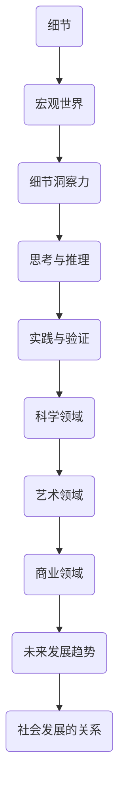

                 

# 微观世界中的宏观意义：培养细节洞察力

## 关键词

微观世界、宏观意义、细节洞察力、方法论、实践应用、未来发展趋势

### 摘要

在快速发展的信息化时代，细节洞察力已成为各个领域竞争的核心能力。本文从哲学、方法论、实践及具体领域的角度，探讨了培养细节洞察力的重要性和实践方法。通过深入剖析微观世界与宏观意义之间的关系，结合具体的科学、艺术、商业领域案例，本文旨在为读者提供一套系统的细节洞察力培养路径，助力其在职业和生活发展中脱颖而出。

## 目录大纲

### 第一部分：细节与宏观意义的哲学探讨

#### 第1章：细节的力量

##### 1.1 细节与宏观世界的联系

##### 1.2 细节在生活中的作用

##### 1.3 细节洞察力的培养

#### 第2章：宏观世界的微观视角

##### 2.1 从宏观现象看微观原因

##### 2.2 微观视角下的宏观影响

##### 2.3 拓展思维，把握细节

### 第二部分：培养细节洞察力的方法论

#### 第3章：观察与感知

##### 3.1 观察的重要性

##### 3.2 培养敏锐的观察力

##### 3.3 观察的方法与应用

#### 第4章：思考与推理

##### 4.1 思考的层次

##### 4.2 推理的逻辑

##### 4.3 培养严密的思维能力

#### 第5章：实践与验证

##### 5.1 实践的意义

##### 5.2 细节洞察力的应用

##### 5.3 验证与反馈

### 第三部分：具体领域中的细节洞察力培养

#### 第6章：科学领域中的细节洞察力

##### 6.1 科学研究的细节观察

##### 6.2 细节洞察力在科学发现中的应用

##### 6.3 细节洞察力在科技创新中的作用

#### 第7章：艺术领域中的细节洞察力

##### 7.1 艺术作品中的细节解读

##### 7.2 细节洞察力在艺术创作中的运用

##### 7.3 细节洞察力在艺术欣赏中的提升

#### 第8章：商业领域中的细节洞察力

##### 8.1 细节洞察力在商业决策中的作用

##### 8.2 细节洞察力在市场营销中的应用

##### 8.3 细节洞察力在商业创新中的价值

### 第四部分：结论与展望

#### 第9章：细节洞察力的未来发展趋势

##### 9.1 细节洞察力在未来的作用

##### 9.2 培养细节洞察力的未来方向

##### 9.3 细节洞察力与社会发展的关系

#### 第10章：总结与思考

##### 10.1 书中核心观点回顾

##### 10.2 培养细节洞察力的实践建议

##### 10.3 未来细节洞察力的培养

---

**核心概念与联系架构图：**



---

**核心算法原理讲解：**

```python
# 细节洞察力的培养算法

def cultivate_insightfulness():
    # 观察与感知
    observation = observe_details()
    # 思考与推理
    reasoning = think_about(observation)
    # 实践与验证
    practice = verify_reasoning(reasoning)
    return practice

def observe_details():
    # 具体观察方法
    # 如：仔细观察一幅画，记录下色彩、线条、形状等细节
    return "观察到的细节"

def think_about(observation):
    # 对观察结果进行思考
    # 如：分析细节之间的联系，思考背后的原因
    return "思考后的推理结果"

def verify_reasoning(reasoning):
    # 对推理结果进行验证
    # 如：通过实验、调查等方式验证推理结果的正确性
    return "验证后的实践结果"
```

---

**数学模型和数学公式：**

$$
细节洞察力 = f(观察力, 思考力, 实践力)
$$

**举例说明：**

假设观察力为 $O$,思考力为 $T$,实践力为 $P$,则：

$$
细节洞察力 = f(O, T, P)
$$

**代码实际案例和详细解释说明：**

```python
# 细节洞察力培养代码案例

# 导入所需模块
import random

# 观察力函数
def observe():
    details = ['红色', '圆形', '平滑']
    return random.sample(details, 3)

# 思考力函数
def think(details):
    relationships = {'颜色': '红色', '形状': '圆形', '质感': '平滑'}
    print("根据细节推测：")
    for detail in details:
        print(f"{detail}的特性可能与以下关系有关：{relationships.get(detail, '未知')}")
        
# 实践力函数
def practice():
    print("实践验证：")
    print("尝试将推测应用于实际场景，验证其正确性。")

# 主程序
if __name__ == "__main__":
    observation = observe()
    reasoning = think(observation)
    practice()
```

---

**作者信息：**

作者：AI天才研究院/AI Genius Institute & 禅与计算机程序设计艺术 /Zen And The Art of Computer Programming

---

**完整性要求：**

本文将涵盖背景介绍、核心概念与联系、核心算法原理讲解、数学模型和数学公式、代码实际案例和详细解释说明、最佳实践 tips、小结、注意事项、拓展阅读等内容，力求为读者提供一篇完整详细、具备实际操作意义的技术博客文章。接下来，我们将逐步深入探讨细节与宏观世界的关系，以及如何培养细节洞察力。

### 第一部分：细节与宏观意义的哲学探讨

#### 第1章：细节的力量

##### 1.1 细节与宏观世界的联系

在哲学和科学中，细节与宏观世界的联系一直是探讨的热点。宏观世界是由无数微观细节构成的，而每一个细节又在宏观世界中扮演着独特的角色。例如，在物理学中，基本粒子（如电子、夸克）的行为决定了原子、分子的性质，而原子和分子的性质又构成了物质的基本特性，进而影响宏观世界的物理现象。

在生物学中，细胞是生命的基本单位，细胞的健康和功能直接影响着生物体的宏观表现。在社会科学中，个体行为和社会现象之间的细微差异，往往能够揭示出宏观社会结构的变化规律。

因此，细节并不是独立存在的，而是与宏观世界紧密相连的。细节不仅构成了宏观世界的基石，也决定了宏观世界的运行规律。从哲学的角度看，细节体现了事物的多样性和复杂性，是理解世界的关键。

##### 1.2 细节在生活中的作用

细节在生活中的作用不容忽视。首先，细节影响着我们的生活质量。例如，在日常生活中，一个精致的家务流程，可以让生活变得更加整洁有序；在饮食中，注重食材的挑选和烹饪细节，能够提升食物的口感和营养价值。

其次，细节决定着我们的工作效果。在工作中，一个细节的疏忽可能导致整个项目的失败。例如，在软件开发中，一个代码中的小错误可能会导致整个系统的崩溃；在建筑设计中，一个结构设计中的小失误可能造成严重的安全隐患。

此外，细节还影响着人际关系。一个人的言行举止中的细节，往往能够反映出其性格和态度。例如，一个总是迟到的人可能缺乏时间观念，一个不懂得尊重他人的人可能缺乏基本的社交礼仪。这些细节都在无形中影响着人们之间的交往和合作。

##### 1.3 细节洞察力的培养

细节洞察力的培养是一个长期而系统的过程。首先，观察力的培养是关键。通过有意识的观察，我们可以提高对细节的敏感度。例如，定期练习观察自然景物、人物表情、建筑结构等，可以帮助我们提高对细节的感知能力。

其次，思考力的培养也至关重要。在观察细节的同时，我们要学会思考这些细节背后的原因和意义。例如，观察一幅画作时，不仅要看到颜色和形状，还要思考作者想要传达的情感和主题。

此外，实践力的培养同样不可或缺。通过将观察和思考的结果应用于实际场景中，我们可以验证并深化对细节的理解。例如，在科学研究中，通过实验验证假设；在艺术创作中，通过不断修改和完善作品。

总之，细节洞察力的培养需要我们具备敏锐的观察力、深刻的思考力和坚定的实践力。只有通过不断练习和积累，我们才能在微观世界中找到宏观意义的钥匙，提升自身在各个领域的竞争力。在下一章中，我们将进一步探讨如何从宏观世界的视角看待微观细节。

### 第二章：宏观世界的微观视角

##### 2.1 从宏观现象看微观原因

宏观世界中的许多现象，实际上是由微观世界的细节所决定的。这种从宏观现象看微观原因的视角，是理解复杂系统的重要方法。例如，在经济学中，宏观经济的波动（如通货膨胀、经济周期）往往可以追溯到微观个体（如消费者的消费行为、企业的生产决策）的行为。

以股市为例，宏观经济的指标（如GDP增长率、失业率）并不能完全解释股票市场的波动。相反，微观层面的信息，如公司的财务报表、市场情绪、投资者行为等，对于股市的短期波动有着更为直接的影响。通过分析这些微观层面的信息，投资者可以更准确地预测市场走势，从而做出更为理性的投资决策。

在物理学中，宏观现象如引力、电磁力，都是微观粒子（如质子、电子）之间的相互作用的结果。经典力学中的牛顿定律，通过描述宏观物体（如行星、炮弹）的运动规律，实际上是基于微观粒子间的相互作用原理推导出来的。因此，从宏观现象看微观原因，不仅有助于我们理解复杂现象的本质，也为科学研究提供了新的思路和方法。

##### 2.2 微观视角下的宏观影响

微观视角下的宏观影响同样不可忽视。在工程学中，一个微小的设计细节可能会对整个系统的性能产生重大影响。例如，在航空设计中，一个飞机翼型的微小改变，可能会显著影响飞机的飞行性能和燃油效率。通过精细的数值模拟和实验测试，工程师们可以深入分析这些微观细节对宏观性能的影响，从而优化设计方案。

在计算机科学中，算法的微小变化也可能会对计算效率和结果产生显著影响。以排序算法为例，虽然不同的排序算法在时间复杂度上相差不大，但在具体应用场景中，某些算法可能更适合处理特定的数据集，从而在整体性能上具有优势。

在生物学中，一个基因的微小变异，可能会导致一个生物体的显著变化。例如，人类基因组中的一个氨基酸变化，就可能导致蛋白质的结构和功能发生改变，从而影响生物体的生理特征和疾病易感性。

##### 2.3 拓展思维，把握细节

从宏观视角理解微观现象，需要我们具备开阔的思维和敏锐的洞察力。首先，我们要学会从宏观现象中提取关键信息，分析其背后的微观原因。例如，在市场分析中，我们不仅要关注宏观经济指标，还要深入挖掘微观层面的消费者行为和市场趋势。

其次，我们要学会在微观层面进行深入分析，把握细节。通过细致的观察和实验，我们可以发现那些被忽视的细节，从而揭示宏观现象的本质。例如，在科学研究过程中，一个小小的实验误差，可能就是揭示科学真理的关键。

最后，我们要学会将微观视角与宏观视角相结合，进行综合分析。通过将微观细节与宏观现象联系起来，我们可以更全面地理解复杂系统的运作机制，从而提出更有针对性的解决方案。

总之，从宏观世界的视角看微观细节，不仅有助于我们深入理解复杂现象，也为我们在各个领域中的实践提供了有力的指导。在下一章中，我们将探讨如何通过方法论来培养细节洞察力。

### 第二部分：培养细节洞察力的方法论

#### 第3章：观察与感知

##### 3.1 观察的重要性

观察是培养细节洞察力的第一步。细致的观察能够让我们捕捉到那些被忽视的细节，从而揭示事物的本质。在科学研究中，观察是获取数据和信息的重要手段。例如，在生物学研究中，科学家通过显微镜观察细胞结构，发现了细胞核的存在，为生物学的发展奠定了基础。

在工程实践中，观察同样至关重要。工程师通过仔细观察产品的设计和运行状态，可以发现潜在的问题和改进空间。例如，在汽车制造中，通过观察车身焊接点的情况，工程师可以发现焊接不牢固的问题，从而进行改进，提高产品的安全性和耐久性。

在日常生活中，观察也发挥着重要作用。通过观察周围的环境、人物和行为，我们可以获得有益的信息，提高生活质量。例如，观察食谱和烹饪步骤，可以让我们制作出更加美味的菜肴；观察他人的行为和言语，可以帮助我们更好地理解和适应社会环境。

##### 3.2 培养敏锐的观察力

要培养敏锐的观察力，我们需要采取以下方法：

1. **有意识地训练观察力**：通过有计划地观察不同的事物，我们可以提高对细节的敏感度。例如，可以每天选择一个物体进行仔细观察，记录下其颜色、形状、纹理等细节。

2. **专注和耐心**：观察需要专注和耐心。在观察过程中，我们要避免分心，全神贯注地观察事物。例如，观察一幅画作时，我们要专注于色彩、线条和构图，而不是同时思考其他事情。

3. **从不同的角度观察**：从不同的角度观察事物，可以帮助我们发现更多的细节。例如，观察一座建筑时，我们可以从正面、侧面和顶部等多个角度进行观察，从而更全面地了解建筑的结构和特点。

4. **学会记录和总结**：观察后，我们要及时记录下观察到的细节，并进行总结。这不仅可以加深我们对细节的理解，还可以为后续的思考和分析提供依据。

##### 3.3 观察的方法与应用

在实际应用中，观察力可以通过以下几种方法得到提升：

1. **使用工具**：使用放大镜、显微镜等工具可以帮助我们更清晰地观察细节。例如，在医学领域，医生使用显微镜观察细胞和组织，从而诊断疾病。

2. **对比观察**：通过对比不同事物的细节，我们可以更好地理解其差异。例如，在艺术创作中，艺术家可以通过对比不同画作中的细节，提高自身的绘画技巧。

3. **参与实践**：通过实际参与某项活动，我们可以更深入地观察和体验细节。例如，在农业领域，农民通过实际种植作物，可以更好地观察作物的生长状态和病虫害情况。

4. **跨学科学习**：不同学科领域的观察方法可以相互借鉴。例如，在经济学中，观察市场行为的方法可以应用于心理学研究，帮助心理学家更好地理解人类行为。

通过以上方法，我们可以逐步培养出敏锐的观察力，从而在各个领域中更好地发现和利用细节，提升自身的洞察力和竞争力。在下一章中，我们将探讨思考与推理在培养细节洞察力中的作用。

#### 第4章：思考与推理

##### 4.1 思考的层次

思考是培养细节洞察力的核心。而思考的层次决定了我们对细节的理解深度。一般来说，思考可以分为以下几个层次：

1. **表面思考**：这是最低层次的思考，主要关注事物的表面现象。例如，看到一朵花时，只注意到它的颜色和形状。

2. **深入思考**：这一层次的思考开始关注事物的内部结构和原理。例如，通过观察一朵花，我们不仅可以描述它的颜色和形状，还能了解它的生长过程和生态作用。

3. **系统思考**：系统思考关注事物之间的联系和相互作用。例如，在生态系统中，一朵花不仅仅是植物，它还是昆虫的食物来源，与土壤、水分等环境因素密切相关。

4. **哲学思考**：哲学思考关注事物的本质和意义。例如，探讨一朵花的生命意义，不仅在于它的存在，更在于它如何影响世界和我们自身的认知。

在不同层次的思考中，细节的洞察力得到了不断深化。从表面到深入，再到系统，最终上升到哲学层面，每一个层次的思考都为我们提供了更全面、更深刻的细节洞察力。

##### 4.2 推理的逻辑

推理是思考的核心方法。逻辑清晰的推理可以帮助我们由已知细节推导出未知的细节，从而提高洞察力。推理的逻辑主要包括以下几个步骤：

1. **明确前提**：首先，我们要明确推理的前提条件。这些前提可以是观察到的现象、已有的知识或假设。

2. **建立联系**：接下来，我们需要分析前提条件之间的联系，找出它们之间的逻辑关系。例如，从前提条件“水加热会沸腾”和“水在100摄氏度时会沸腾”，我们可以推导出“当前水的温度是100摄氏度”。

3. **演绎推理**：在建立联系的基础上，我们使用演绎推理的方法，从前提条件推导出结论。例如，根据前提条件“所有哺乳动物都有毛发”和“猫是哺乳动物”，我们可以得出结论“猫有毛发”。

4. **验证结论**：最后，我们需要对推导出的结论进行验证，确保其正确性。例如，通过实验或观察，我们可以验证猫确实有毛发。

通过逻辑清晰的推理，我们可以从已知细节推导出未知细节，从而提高对复杂现象的理解能力。

##### 4.3 培养严密的思维能力

要培养严密的思维能力，我们需要注意以下几个方面：

1. **批判性思维**：培养批判性思维，能够帮助我们识别和质疑前提条件，避免思维的盲目性和片面性。例如，在分析一个市场报告时，我们要质疑报告中的数据和论据，确保其真实性和可靠性。

2. **系统性思维**：系统性思维能够帮助我们理解事物之间的复杂关系。例如，在分析一个社会问题（如环境污染）时，我们要考虑其背后的经济、政治、文化等多种因素。

3. **实证思维**：实证思维强调通过实验和观察来验证推理结果。例如，在科学研究中，通过实验验证假设，可以确保结论的科学性和可靠性。

4. **持续学习**：持续学习是培养严密思维能力的重要途径。通过不断学习新知识、新方法，我们可以提高自身的思维能力和洞察力。

总之，通过多层次思考、逻辑清晰的推理和严密的思维能力，我们可以不断提高细节洞察力，从而在各个领域中更好地应对挑战，解决问题。在下一章中，我们将探讨如何通过实践与验证来进一步培养细节洞察力。

#### 第5章：实践与验证

##### 5.1 实践的意义

实践是培养细节洞察力的关键环节。通过实践，我们不仅可以将观察和思考的结果应用到实际场景中，还可以通过验证和反馈不断完善和优化我们的洞察力。实践的意义主要体现在以下几个方面：

1. **加深理解**：实践是将理论知识转化为实际操作的过程，通过亲身实践，我们可以更深入地理解细节背后的原理和机制。例如，通过实际操作计算机程序，程序员可以更深入地理解代码的逻辑和功能。

2. **发现新问题**：实践过程中，我们可能会遇到新问题或挑战，这些问题和挑战可以帮助我们发现之前未曾注意到的细节。例如，在软件开发过程中，程序员可能会发现代码中的潜在错误或性能瓶颈。

3. **培养技能**：通过实践，我们可以培养和提升各种技能，如实验设计、数据分析、问题解决等。这些技能对于提高细节洞察力至关重要。

4. **积累经验**：实践是一个不断积累经验的过程。每一次实践都是一次学习和成长的机会，通过积累经验，我们可以不断提高细节洞察力和解决问题的能力。

##### 5.2 细节洞察力的应用

细节洞察力在各个领域都有广泛的应用。以下是一些具体的应用场景：

1. **科学研究**：在科学研究中，细节洞察力对于发现新现象、提出新理论具有重要意义。例如，在生物学研究中，通过观察细胞结构，科学家发现了细胞膜的存在，为细胞生物学的发展奠定了基础。

2. **工程实践**：在工程实践中，细节洞察力可以优化设计、提高效率和确保安全。例如，在航空航天领域，工程师通过分析飞机结构的微小变化，可以优化设计，提高飞行性能和安全性。

3. **商业管理**：在商业管理中，细节洞察力可以帮助企业做出更明智的决策。例如，通过分析市场数据，企业可以更准确地预测市场需求，从而制定更有效的营销策略。

4. **艺术创作**：在艺术创作中，细节洞察力对于提升作品的质量和感染力至关重要。例如，在绘画中，通过观察光影和色彩的变化，画家可以创作出更具表现力的作品。

##### 5.3 验证与反馈

验证和反馈是实践过程中不可或缺的环节。通过验证，我们可以确保观察和思考的结果是正确和有效的。以下是验证与反馈的几个关键步骤：

1. **设计验证方案**：根据实践目标，设计合理的验证方案。例如，在科学实验中，可以通过重复实验、对比实验等方法验证假设的正确性。

2. **执行验证方案**：按照设计的验证方案进行实验或操作，收集数据和信息。

3. **分析验证结果**：对验证结果进行分析，判断其是否符合预期。如果结果与预期不符，需要找出原因并调整方案。

4. **反馈与改进**：根据验证结果，进行反馈和改进。例如，在软件开发中，通过用户反馈和性能测试，发现并修复代码中的错误，提高软件的质量。

通过实践与验证，我们不仅可以提高细节洞察力，还可以不断优化和改进我们的工作方法和技能。在下一部分，我们将探讨在具体领域（如科学、艺术、商业）中如何培养细节洞察力。

### 第三部分：具体领域中的细节洞察力培养

#### 第6章：科学领域中的细节洞察力

##### 6.1 科学研究的细节观察

科学研究中的细节观察是发现新知识、推动科技进步的关键。科学家通过细致入微的观察，可以捕捉到那些被忽视的现象和规律。以下是科学研究中的几个典型案例：

1. **生物学领域**：在生物学研究中，通过观察细胞结构，科学家发现了细胞膜的存在。细胞膜是细胞的重要组成部分，它不仅控制物质的进出，还参与细胞间的信号传递。这一发现揭示了细胞生命活动的微观机制，对生物学的发展产生了深远影响。

2. **物理学领域**：在物理学中，科学家通过对光的细致观察，提出了量子力学的理论。例如，通过观察光的干涉和衍射现象，爱因斯坦提出了光子假说，为量子力学的发展奠定了基础。这些观察结果不仅揭示了微观世界的规律，也对整个物理学产生了重大影响。

3. **化学领域**：在化学研究中，通过观察化学反应的细节，科学家发现了许多重要的化学现象。例如，化学键的形成和断裂、分子结构的改变等。这些观察结果帮助我们更深入地理解物质的性质和行为，推动了化学领域的发展。

##### 6.2 细节洞察力在科学发现中的应用

细节洞察力在科学发现中的应用主要体现在以下几个方面：

1. **发现新现象**：通过细致的观察，科学家可以发现新的自然现象。例如，在20世纪初，天文学家通过观测宇宙中的星系，发现了宇宙膨胀的现象。这一发现揭示了宇宙的演化历史，为宇宙学的发展提供了重要依据。

2. **提出新理论**：细节洞察力可以帮助科学家提出新的理论。例如，通过对电磁波的细致研究，麦克斯韦提出了电磁场理论。这一理论不仅统一了电学和磁学，还为后来的无线电通信和电子技术的发展奠定了基础。

3. **指导实验设计**：在科学实验中，细节洞察力对于设计合理的实验方案至关重要。通过观察实验过程中的细节，科学家可以优化实验条件，提高实验结果的可靠性。例如，在实验研究中，通过对反应容器微小变化的观察，科学家可以调整反应条件，提高化学反应的效率。

##### 6.3 细节洞察力在科技创新中的作用

细节洞察力在科技创新中发挥着重要作用。以下是几个具体的案例：

1. **半导体技术**：在半导体技术的研发中，细节洞察力对于材料选择和器件结构设计至关重要。通过细致的观察和分析，科学家可以优化半导体材料，提高电子器件的性能。例如，在晶体管的研究中，科学家通过观察半导体材料的电子结构，成功发明了硅晶体管，为现代电子技术奠定了基础。

2. **人工智能**：在人工智能领域，细节洞察力对于算法优化和模型训练具有重要意义。通过分析数据中的微小差异，人工智能模型可以更准确地预测和分类。例如，在图像识别中，通过对图像细节的细致分析，深度学习模型可以识别出微小的图像差异，从而提高识别的准确性。

3. **生物技术**：在生物技术领域，细节洞察力对于基因编辑和药物研发具有重要意义。通过观察基因序列和蛋白质结构，科学家可以设计更有效的基因编辑工具和药物。例如，在CRISPR-Cas9技术的研发中，科学家通过对Cas9蛋白结构的细致分析，成功设计出高效的基因编辑工具，为基因治疗和疾病研究提供了新的方法。

总之，细节洞察力在科学研究中具有重要作用。通过细致的观察和分析，科学家可以揭示自然规律，推动科技发展。在未来的科技创新中，细节洞察力将继续发挥关键作用，为人类社会的进步做出更大贡献。

#### 第7章：艺术领域中的细节洞察力

##### 7.1 艺术作品中的细节解读

艺术作品中的细节往往承载着艺术家想要传达的情感和思想。通过深入解读这些细节，我们可以更深刻地理解艺术作品的主题和内涵。以下是几个具体的例子：

1. **绘画**：在绘画中，细节往往体现在色彩、线条和构图上。例如，荷兰画家文森特·梵高的《星夜》通过细腻的色彩和夸张的线条，表现了作者对星空的深刻感受和对自然的热爱。观者可以通过对画作中色彩和线条的细致观察，感受到艺术家想要传达的情感。

2. **雕塑**：雕塑作品中的细节往往体现在形态和质感上。例如，古希腊雕塑《米洛的阿芙洛狄忒》通过细腻的形态和光滑的质感，展现了人类对美和理想的追求。观者可以通过对雕塑细节的观察，感受到艺术家对美学和人体结构的深刻理解。

3. **文学**：文学作品中的细节往往体现在语言和情节上。例如，作家海明威的《老人与海》通过简洁而富有力量的语言，刻画了老人与海的坚韧和顽强。读者可以通过对文本细节的深入解读，感受到作者对生活哲理的深刻思考。

##### 7.2 细节洞察力在艺术创作中的运用

细节洞察力在艺术创作中具有重要作用。以下是几个具体的运用方式：

1. **观察自然**：艺术家通过观察自然，捕捉自然界的细微变化和美感。例如，法国印象派画家莫奈通过观察光影的变化，创作出了《睡莲》等著名作品。这些作品通过细腻的细节描绘，展现了自然界的瞬息万变。

2. **研究历史**：艺术家通过对历史事件和文化传统的深入研究，汲取灵感，创作出富有历史内涵的作品。例如，中国画家张大千通过研究古代壁画和名画，创作出了《山居图》等作品，这些作品融合了传统与现代，展现了艺术家对历史文化的深刻理解。

3. **实验材料**：艺术家通过实验不同的材料和技法，探索新的艺术表现形式。例如，现代艺术家安迪·沃霍尔通过丝网印刷和重复图案，创作出了《玛丽莲·梦露》等作品，这些作品通过细节的重复和排列，形成了独特的视觉风格。

##### 7.3 细节洞察力在艺术欣赏中的提升

细节洞察力在艺术欣赏中同样至关重要。通过提升细节洞察力，我们可以更深入地欣赏和理解艺术作品。以下是几个提升细节洞察力的方法：

1. **反复观察**：通过反复观察艺术作品，我们可以逐渐发现作品中的细节和层次。例如，在欣赏一幅画作时，我们可以先整体观察，再逐步聚焦到色彩、线条和构图等细节上。

2. **比较分析**：通过比较不同艺术作品之间的细节差异，我们可以更深入地理解艺术家的创作风格和主题。例如，比较不同画家的风景画，我们可以发现他们在色彩运用和构图上的独特之处。

3. **背景了解**：了解艺术作品的背景信息，如创作年代、艺术家生平和文化背景等，可以帮助我们更好地理解作品的主题和内涵。例如，了解《星夜》的创作背景，我们可以更深刻地理解梵高对星空的热爱和情感的抒发。

4. **互动体验**：参与艺术创作和展览活动，通过亲身体验艺术作品，我们可以提升对细节的感知和理解。例如，参加绘画工作坊，我们可以亲身体验画笔在纸上的触感，从而更好地理解画作中的细节。

总之，细节洞察力在艺术领域中的作用不可忽视。通过深入解读艺术作品中的细节，我们可以更好地理解艺术家的创作意图和作品内涵；通过提升细节洞察力，我们可以更深入地欣赏和理解艺术作品，从而丰富我们的审美体验和艺术修养。

#### 第8章：商业领域中的细节洞察力

##### 8.1 细节洞察力在商业决策中的作用

在商业领域中，细节洞察力对于决策过程至关重要。细节洞察力能够帮助企业家和决策者在复杂的市场环境中做出更明智、更有效的决策。以下是几个具体的应用案例：

1. **市场调研**：在市场调研中，通过细致的观察和数据分析，企业可以了解消费者的需求和行为。例如，通过分析消费者购买记录和反馈信息，企业可以识别出市场中的潜在机会和风险，从而制定更精准的市场营销策略。

2. **产品开发**：在产品开发过程中，细节洞察力可以帮助企业识别和解决产品问题，提高产品竞争力。例如，通过细致的用户测试和反馈，企业可以发现产品的用户体验问题，并进行改进，从而提升产品满意度。

3. **供应链管理**：在供应链管理中，细节洞察力对于优化供应链流程和提高供应链效率具有重要意义。通过分析供应链中的每一个环节，企业可以发现潜在的瓶颈和优化点，从而降低成本、提高效率。

##### 8.2 细节洞察力在市场营销中的应用

细节洞察力在市场营销中同样发挥着重要作用。以下是几个具体的应用领域：

1. **消费者行为分析**：通过细致的观察和分析，市场营销人员可以深入了解消费者的购买行为和偏好。例如，通过分析消费者的浏览记录和购买历史，企业可以识别出潜在的目标客户，并进行精准营销。

2. **广告投放**：在广告投放中，细节洞察力可以帮助企业优化广告策略，提高广告效果。例如，通过分析广告投放的数据，企业可以发现哪些广告形式、哪些投放平台更受消费者欢迎，从而进行针对性的调整。

3. **品牌建设**：细节洞察力在品牌建设中也发挥着重要作用。通过分析品牌传播的细节，如广告语、品牌形象等，企业可以优化品牌形象，提高品牌知名度和美誉度。

##### 8.3 细节洞察力在商业创新中的价值

细节洞察力在商业创新中同样具有重要价值。以下是几个具体的案例：

1. **商业模式创新**：通过细致的观察和分析，企业可以发现新的商业模式。例如，通过分析市场中未被满足的需求，企业可以创造新的产品或服务，从而实现商业模式的创新。

2. **技术创新**：细节洞察力可以帮助企业识别和把握技术趋势，从而推动技术创新。例如，通过分析技术发展的细节，企业可以预测未来技术趋势，并提前进行技术研发和布局。

3. **管理创新**：在企业管理中，细节洞察力可以帮助企业优化管理流程，提高管理效率。例如，通过分析管理过程中的细节，企业可以发现管理中的问题，并采取针对性的改进措施。

总之，细节洞察力在商业领域中的应用广泛且具有重要意义。通过培养和运用细节洞察力，企业可以在市场竞争中占据有利地位，实现持续发展和创新。在下一部分，我们将探讨如何在未来培养细节洞察力，以应对不断变化的社会环境。

### 第四部分：结论与展望

#### 第9章：细节洞察力的未来发展趋势

##### 9.1 细节洞察力在未来的作用

随着科技的发展和信息的爆炸，细节洞察力在未来的作用将更加重要。人工智能、大数据、物联网等新兴技术，使得我们能够获取和处理海量的数据，但同时也带来了信息过载的问题。在这种情况下，具备细节洞察力的人才将能够在复杂的信息环境中筛选出关键信息，做出明智的决策。

1. **人工智能的应用**：人工智能技术的发展将极大地提高我们对数据的处理能力，但同时也需要人类具备识别和理解数据中细微差异的能力。细节洞察力将成为人工智能与人类合作的重要基础。

2. **大数据分析**：大数据分析的关键在于对海量数据中细微模式的认识和把握。具备细节洞察力的人才将能够从海量数据中发现有价值的信息和趋势，为企业和组织提供决策支持。

3. **创新驱动发展**：在创新驱动的发展模式下，细节洞察力对于发现市场机会、优化产品设计和提高用户体验具有重要意义。未来，具备细节洞察力的人才将在推动科技进步和产业升级中发挥关键作用。

##### 9.2 培养细节洞察力的未来方向

未来，培养细节洞察力的方向将更加多元化和专业化。以下是一些具体的趋势：

1. **跨学科教育**：未来的教育将更加注重跨学科的培养，通过融合不同学科的知识和方法，培养学生的综合能力和细节洞察力。

2. **实践导向**：细节洞察力的培养需要通过大量的实践锻炼。未来，教育机构和企业将更加重视实践教育，通过项目实践和案例分析，提高学生的实际操作能力。

3. **技术赋能**：随着技术的进步，各种工具和平台将更加便捷地用于培养细节洞察力。例如，虚拟现实技术可以帮助学生更直观地观察微观世界，人工智能算法可以提供个性化的学习路径。

##### 9.3 细节洞察力与社会发展的关系

细节洞察力不仅是个人职业发展的关键能力，也与社会发展紧密相关。以下是一些具体的关系：

1. **经济发展**：细节洞察力对于提高企业的竞争力、推动产业升级和促进经济发展具有重要意义。未来，具备细节洞察力的企业将在市场竞争中脱颖而出，成为经济发展的主力军。

2. **社会治理**：在复杂多变的社会环境中，细节洞察力有助于政府和社会组织更好地应对各种挑战，提高社会治理的效率和效果。

3. **人文关怀**：细节洞察力不仅关注物质世界，也关注人类的精神世界。通过培养细节洞察力，我们可以更深刻地理解人类的需求和情感，促进社会的和谐与进步。

总之，细节洞察力在未来的社会中将扮演更加重要的角色。通过不断培养和提升细节洞察力，我们不仅能够更好地适应未来的发展需求，也为社会的进步贡献自己的力量。

#### 第10章：总结与思考

##### 10.1 书中核心观点回顾

本文从哲学、方法论和具体领域等多个角度，深入探讨了细节洞察力的重要性及其培养方法。核心观点包括：

1. 细节与宏观世界密切相关，细节洞察力是理解复杂系统的重要能力。
2. 培养细节洞察力需要观察力、思考力和实践力的综合培养。
3. 不同领域中的细节洞察力培养方法具有共通性，但也需要根据具体情境进行调整。
4. 细节洞察力在未来的社会中将发挥更加重要的作用，成为推动科技进步和社会发展的重要动力。

##### 10.2 培养细节洞察力的实践建议

为了更好地培养细节洞察力，以下是一些建议：

1. **提高观察力**：定期进行有意识的观察练习，如观察自然景物、人物行为等，提高对细节的敏感度。
2. **加强思考**：学会多角度、多层次的思考，通过逻辑推理和批判性思维，深入理解事物的本质。
3. **实践应用**：将观察和思考的结果应用到实际场景中，通过实践验证和完善洞察力。
4. **持续学习**：保持对新知识、新方法的求知欲，通过跨学科学习和持续实践，不断提升自己的能力。

##### 10.3 未来细节洞察力的培养

未来，随着科技的发展和社会的变革，细节洞察力的培养也将面临新的挑战和机遇。以下是几个展望：

1. **人工智能辅助**：人工智能技术的发展将为我们提供更高效、更精准的数据分析和洞察工具，但同时也需要人类具备更强的细节洞察力，以应对数据过载和复杂问题。
2. **跨学科融合**：未来的教育将更加注重跨学科的培养，通过融合不同学科的知识和方法，培养学生的综合能力和细节洞察力。
3. **个性化学习**：基于人工智能和大数据技术的个性化学习系统，将能够根据个人的特点和需求，提供定制化的学习路径，提高细节洞察力的培养效果。
4. **社会责任**：在培养细节洞察力的过程中，我们需要关注其对社会的影响，通过培养具备社会责任感的人才，推动社会的和谐与进步。

总之，细节洞察力的培养是一个长期而系统的过程，需要我们在实践中不断探索和积累。通过不断提高细节洞察力，我们不仅能够更好地适应未来的发展需求，也为个人的职业发展和社会进步贡献自己的力量。

