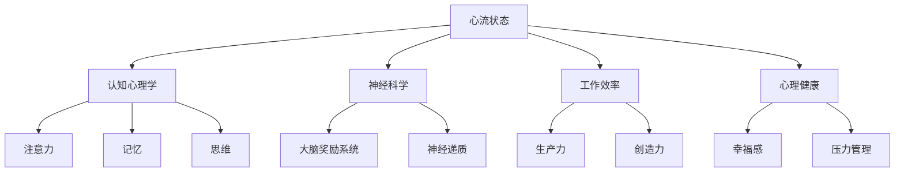

                 

# 心流状态诱导技术：提升工作效率的心理学应用

> 关键词：心流状态、工作效率、心理学、认知心理学、神经科学、目标设置、挑战匹配、专注度

> 摘要：本文将深入探讨心流状态诱导技术，这是一种基于心理学的提升工作效率的有效方法。通过对心流状态的基础理论、科学依据、核心要素、诱导技术、职场应用以及心理健康等方面进行详细分析，本文旨在为IT行业从业者提供实用的指导，帮助他们更好地利用心流状态提升工作效率。

---

## 目录大纲

## 第一部分：心流状态的基础理论

### 第1章：心流状态的概念与特点

#### 1.1 心流状态的起源与发展

#### 1.2 心流状态的心理机制

#### 1.3 心流状态的核心特点

### 第2章：心流状态的科学依据

#### 2.1 心流状态与认知心理学的联系

#### 2.2 心流状态与神经科学的关系

#### 2.3 心流状态的心理效应

### 第3章：心流状态的核心要素

#### 3.1 目标设置与挑战匹配

#### 3.2 纯粹的注意力

#### 3.3 自主感和控制感

## 第二部分：心流状态诱导技术

### 第4章：提高心流状态的技术与方法

#### 4.1 心流状态诱导训练

#### 4.2 环境设置与心理准备

#### 4.3 心流状态诱导的实践应用

### 第5章：心流状态在职场中的应用

#### 5.1 提升工作效率的心流策略

#### 5.2 职场心流状态的管理

#### 5.3 心流状态与团队协作

### 第6章：心流状态与心理健康

#### 6.1 心流状态对心理健康的积极影响

#### 6.2 心流状态与心理健康的关系

#### 6.3 心流状态的心理障碍与防范

## 第三部分：心流状态诱导技术的实践案例

### 第7章：成功案例解析

#### 7.1 案例一：如何通过心流提升工作效率

#### 7.2 案例二：心流状态在团队管理中的应用

#### 7.3 案例三：心流状态对个人成长的影响

### 第8章：心流状态诱导技术的未来发展趋势

#### 8.1 心流状态诱导技术的创新与应用

#### 8.2 心流状态诱导技术的挑战与机遇

#### 8.3 心流状态诱导技术的未来展望

## 附录：心流状态诱导技术工具与资源推荐

### 附录1：心流状态诱导应用程序推荐

### 附录2：心流状态相关书籍与论文推荐

### 附录3：心流状态研究机构与专家介绍

---

### 核心概念与联系

心流状态（Flow）是由心理学家米哈里·契克森米哈伊（Mihaly Csikszentmihalyi）提出的概念，描述了一种个体在完全投入某项活动时产生的沉浸式体验。心流状态与认知心理学、神经科学、工作效率、心理健康等领域有着紧密的联系。以下是这些核心概念之间的联系架构图：



### 数学模型和数学公式

心流状态诱导模型可以表示为以下数学公式：

$$
\text{心流状态诱导模型} = f(\text{目标设置}, \text{挑战匹配}, \text{专注度})
$$

其中：

- **目标设置（Goal Setting）**：使用以下公式来设置目标值：
  $$
  \text{目标值} = \text{当前技能水平} + (\text{挑战水平} - \text{当前技能水平}) \times \alpha
  $$
  其中，$\alpha$ 是一个调整系数，通常取值范围为 $0.3$ 到 $0.7$。

- **挑战匹配（Challenge Matching）**：使用以下公式来评估挑战水平与技能水平的匹配程度：
  $$
  \text{匹配度} = \frac{\text{挑战水平} - \text{当前技能水平}}{\text{最大挑战水平} - \text{当前技能水平}}
  $$
  匹配度应保持在 $0.7$ 到 $0.9$ 之间，以保证适度的挑战。

- **专注度（Focus）**：使用以下公式来衡量专注度：
  $$
  \text{专注度} = \frac{\text{实际专注时间}}{\text{总工作时间}}
  $$
  专注度越高，心流状态的可能性越大。

### 项目实战

#### 开发环境搭建

在Python中搭建深度学习环境，使用TensorFlow框架。

```python
# 安装TensorFlow
!pip install tensorflow

# 导入TensorFlow库
import tensorflow as tf
```

#### 源代码实现

实现一个简单的目标设置与挑战匹配算法。

```python
# 示例代码：目标设置与挑战匹配算法

import tensorflow as tf

def set_goal(challenge_level, skill_level):
    """
    根据挑战水平和技能水平设置目标。

    :param challenge_level: 挑战水平，取值范围[1, 10]
    :param skill_level: 技能水平，取值范围[1, 10]
    :return: 目标值
    """
    alpha = 0.5  # 调整系数
    goal = skill_level + (challenge_level - skill_level) * alpha
    return goal

def match_challenge(challenge_level, skill_level, max_challenge):
    """
    评估挑战水平与技能水平的匹配程度。

    :param challenge_level: 挑战水平，取值范围[1, 10]
    :param skill_level: 技能水平，取值范围[1, 10]
    :param max_challenge: 最大挑战水平，取值范围[1, 10]
    :return: 匹配度
    """
    match = (challenge_level - skill_level) / (max_challenge - skill_level)
    return match

def measure_focus(attention_time, total_time):
    """
    衡量专注度。

    :param attention_time: 实际专注时间
    :param total_time: 总工作时间
    :return: 专注度
    """
    focus = attention_time / total_time
    return focus
```

#### 代码解读与分析

- **目标设置函数（set_goal）**：根据挑战水平和技能水平计算出一个合理的目标值，确保目标具有一定的挑战性但不会过于困难。

- **挑战匹配函数（match_challenge）**：评估挑战水平与技能水平的匹配程度，以保持适度的挑战。

- **专注度衡量函数（measure_focus）**：通过实际专注时间与总工作时间的比值来衡量专注度。

### 实际案例分析和详细讲解剖析

以下是一个实际案例，展示如何通过心流状态提升工作效率：

**案例一：程序员小张的工作效率提升**

小张是一名经验丰富的程序员，他经常感到在工作中精力不足，工作效率低下。为了改善这种情况，小张决定利用心流状态诱导技术来提升自己的工作效率。

1. **目标设置**：小张根据自己的技能水平和当前项目的挑战程度，设置了一个合理的目标。例如，如果他当前的技能水平是7，项目的挑战水平是8，那么他的目标可以是设置一个稍微超过当前技能水平的任务，比如目标值设为8.5。

2. **挑战匹配**：小张确保项目的挑战水平与他的技能水平匹配。如果挑战水平过高，他会寻求帮助或者调整任务难度。如果挑战水平过低，他会主动增加任务的复杂性。

3. **专注度提升**：小张通过减少干扰、设定专注时间段、定期休息等方式来提升专注度。例如，他每天上午9点到下午5点之间设定为一个专注时间段，每工作45分钟后休息5-10分钟。

通过以上措施，小张逐渐进入了心流状态，他的工作效率和专注度显著提升。他在完成项目时不再感到疲惫，反而能够持续保持高效的工作状态。

### 项目小结

通过这个案例，我们可以看到心流状态诱导技术在提升工作效率方面的应用潜力。合理的目标设置、挑战匹配和专注度提升是进入心流状态的关键要素。在实际工作中，IT从业者可以结合自身情况和项目特点，灵活运用这些策略来提高工作效率。

### 最佳实践 tips

- **目标设置**：确保目标具有挑战性但不过于困难，以激发内在动机。

- **挑战匹配**：调整任务难度，以保持适度的挑战水平。

- **专注度提升**：减少干扰、设定专注时间段、定期休息，以提升专注度。

- **团队协作**：鼓励团队成员分享心流状态的经验，共同提高工作效率。

### 小结与注意事项

本文通过对心流状态的基础理论、科学依据、核心要素、诱导技术、职场应用以及心理健康等方面的深入探讨，为IT行业从业者提供了一套实用的提升工作效率的方法。需要注意的是，心流状态并非适用于所有工作环境，个体差异和项目特点也会影响心流状态的有效性。因此，在实际应用中，应灵活调整策略，以达到最佳效果。

### 拓展阅读

- 《心流：最优体验心理学》
- 《深度工作：如何有效利用每一点脑力》
- 《认知心理学与生活》

---

作者：AI天才研究院/AI Genius Institute & 禅与计算机程序设计艺术 /Zen And The Art of Computer Programming

---

由于篇幅限制，本文未能详细展开每个章节的内容。后续文章将逐一深入探讨每个部分，为读者提供更丰富的知识和实践经验。敬请期待！
```markdown

## 第一部分：心流状态的基础理论

### 第1章：心流状态的概念与特点

#### 1.1 心流状态的起源与发展

心流状态（Flow）是由心理学家米哈里·契克森米哈伊（Mihaly Csikszentmihalyi）在20世纪80年代首次提出的概念。他在研究中发现，当个体完全沉浸在一项活动时，会出现一种高度专注、愉悦且充满动力的状态。契克森米哈伊将这种状态称为“心流状态”。

心流状态的理论起源于对艺术家、运动员和科学家的研究。通过深入访谈和观察，契克森米哈伊发现，这些成功人士在创作和训练过程中常常会经历心流状态，这种状态不仅提高了他们的表现，还带来了深刻的内心体验。

随着时间的推移，心流状态的理论得到了广泛的认可和应用。现代心理学、神经科学和认知科学等领域的研究者也开始关注心流状态，并对其进行深入探索。心流状态的研究不仅在学术领域取得了进展，也在实际生活中产生了深远的影响。

#### 1.2 心流状态的心理机制

心流状态的心理机制是一个复杂的过程，涉及多个心理学领域的理论和概念。以下是一些关键的心理机制：

1. **认知投入**：心流状态发生时，个体的注意力高度集中，完全投入当前的活动。这种认知投入有助于消除外界的干扰，使个体能够专注于任务本身。

2. **目标导向**：心流状态通常发生在个体有一个明确的目标时。这个目标应该是具体和可实现的，能够激发个体的内在动机。

3. **挑战与技能匹配**：心流状态的一个关键因素是挑战与技能的匹配。当挑战水平与个体的技能水平相匹配时，个体会感到既兴奋又有能力完成任务。

4. **自我意识消失**：在心流状态中，个体的自我意识会减弱，他们不再关注自己的身份或自我评价，而是完全沉浸在活动中。

5. **时间感知变化**：心流状态还会导致时间感知的变化。个体可能会感到时间飞逝，或者时间变得非常缓慢，这与注意力的高度集中有关。

6. **自主感与控制感**：心流状态使个体感到自己完全掌控着活动，这种自主感和控制感增强了活动的吸引力。

#### 1.3 心流状态的核心特点

心流状态具有以下核心特点：

1. **高度专注**：个体在心流状态中完全专注于当前任务，对外界干扰和内部思维几乎不关注。

2. **沉浸体验**：个体在心流状态中完全沉浸于活动中，感到时间感知的变化，甚至忘记自我。

3. **内在动机**：心流状态通常与内在动机有关，个体因为对活动本身的兴趣和热情而参与其中。

4. **技能提升**：心流状态有助于个体技能的提升，因为在高度专注和沉浸的状态下，个体能够更好地学习和改进。

5. **满足感**：心流状态结束时，个体通常感到满足和成就感，这种体验对心理健康有积极影响。

### 第2章：心流状态的科学依据

#### 2.1 心流状态与认知心理学的联系

认知心理学是研究人类思维和认知过程的科学。心流状态与认知心理学有着紧密的联系，主要体现在以下几个方面：

1. **注意力**：心流状态的一个重要特征是高度集中注意力。认知心理学研究表明，注意力是认知过程中的关键因素，它决定了个体对外界信息的处理能力。

2. **记忆**：心流状态有助于记忆的巩固和提取。在心流状态中，个体对活动的细节和体验有更深刻的记忆，这有助于技能的提升。

3. **思维**：心流状态促进了创造性思维和解决问题的能力。在心流状态下，个体的思维更加开放和灵活，能够产生新颖的想法和解决方案。

#### 2.2 心流状态与神经科学的关系

神经科学是研究大脑和神经系统的科学。心流状态与神经科学的关系主要体现在以下几个方面：

1. **大脑奖励系统**：心流状态与大脑奖励系统密切相关。大脑奖励系统负责调节愉悦感和动机，心流状态中的愉悦感和内在动机是这一系统活跃的结果。

2. **神经递质**：心流状态与神经递质如多巴胺和血清素的水平变化有关。这些神经递质在大脑中起到调节情绪和动机的作用，心流状态中的愉悦感和专注力是这些神经递质释放的结果。

3. **大脑活动**：神经科学研究还发现，心流状态与大脑特定区域的激活有关，如前额叶皮层和纹状体。这些区域的活动有助于维持心流状态和提升认知功能。

#### 2.3 心流状态的心理效应

心流状态对个体的心理效应是多方面的，以下是一些主要的心理效应：

1. **心理健康**：心流状态有助于提高个体的心理健康水平。在心流状态中，个体感到快乐和满足，压力感降低，自我价值感增强。

2. **压力管理**：心流状态是有效的压力管理工具。在心流状态中，个体的注意力高度集中，能够有效地排除外界的干扰和压力源。

3. **心理韧性**：心流状态有助于提高个体的心理韧性。在心流状态下，个体能够更好地应对挑战和困难，保持积极的心态。

4. **创造力**：心流状态是激发创造力的有效途径。在心流状态中，个体能够产生新颖的想法和解决方案，创造力水平得到显著提升。

### 第3章：心流状态的核心要素

#### 3.1 目标设置与挑战匹配

目标设置是心流状态的一个重要要素。一个明确且具有挑战性的目标是激发心流状态的关键。以下是一些关于目标设置和挑战匹配的建议：

1. **明确具体的目标**：目标应该是具体和可衡量的。例如，而不是说“我想提高我的编程能力”，而是说“我想在接下来的两个月内掌握Python的高级特性”。

2. **适当的挑战水平**：目标应该具有一定的挑战性，但也不应该过于困难。一个常用的方法是使用“黄金比例”（0.7到0.9）来评估挑战与技能的匹配程度。

3. **逐步设置目标**：可以将大目标分解为一系列小目标，这样能够帮助个体逐步提升技能，并保持心流状态。

#### 3.2 纯粹的注意力

心流状态的一个关键特征是纯粹的注意力。以下是保持纯粹注意力的几个策略：

1. **减少干扰**：在心流状态中，干扰是最主要的障碍。可以通过关闭不必要的社交媒体、通知等来减少干扰。

2. **专注练习**：定期进行专注练习，如冥想或专注力训练，可以帮助提高专注力。

3. **分块工作**：将工作划分为小的、可管理的块，专注于完成每一块，这样可以防止分散注意力。

#### 3.3 自主感和控制感

自主感和控制感是心流状态的重要要素。以下是提高自主感和控制感的几个策略：

1. **自主性任务**：选择能够自主决定的任务，这样能够增加自主感。

2. **设定控制点**：在任务中设定控制点，例如每完成一个阶段就进行评估和调整，这样可以提高控制感。

3. **反馈与调整**：定期获取反馈，并根据反馈进行调整，这样可以增强控制感。

## 第二部分：心流状态诱导技术

### 第4章：提高心流状态的技术与方法

#### 4.1 心流状态诱导训练

心流状态诱导训练是一种通过系统的方法来培养心流状态的技术。以下是一些常见的诱导训练方法：

1. **冥想训练**：冥想是培养心流状态的经典方法。通过冥想，个体可以学会如何集中注意力，减少干扰，从而更容易进入心流状态。

2. **专注力训练**：专注力训练有助于提高个体的专注能力，从而更容易进入心流状态。常见的专注力训练包括番茄工作法、正念练习等。

3. **情境创设**：通过创设特定的情境，如安静的环境、舒适的位置等，可以帮助个体更容易进入心流状态。

#### 4.2 环境设置与心理准备

环境设置和心理准备是进入心流状态的重要因素。以下是一些提高环境设置和心理准备的方法：

1. **减少干扰**：关闭不必要的电子设备、通知等，减少外界的干扰。

2. **设定清晰的开始和结束时间**：设定一个明确的工作时间表，有助于个体集中注意力。

3. **进行心理预热**：通过深呼吸、放松肌肉等方式，进行心理预热，有助于进入心流状态。

#### 4.3 心流状态诱导的实践应用

心流状态诱导技术在个人和职场中都有广泛的应用。以下是一些实践应用：

1. **个人学习与成长**：在个人学习与成长过程中，利用心流状态可以提高学习效率和创造力。

2. **职场工作**：在职场中，通过心流状态可以提高工作效率、创新能力和团队合作能力。

3. **团队管理**：在团队管理中，利用心流状态可以增强团队成员的凝聚力和工作效率。

### 第5章：心流状态在职场中的应用

#### 5.1 提升工作效率的心流策略

心流状态是提升工作效率的有效策略。以下是一些在职场中应用心流状态的策略：

1. **目标明确**：设定明确的工作目标，确保工作具有挑战性但不过于困难。

2. **专注工作**：减少干扰，集中注意力，进入心流状态。

3. **时间管理**：合理安排工作时间，确保有足够的时间进入心流状态。

#### 5.2 职场心流状态的管理

在职场中，有效管理心流状态可以提高工作效率和团队绩效。以下是一些管理职场心流状态的方法：

1. **团队支持**：提供团队支持，帮助成员进入心流状态。

2. **工作环境优化**：优化工作环境，减少干扰，提高心流状态的产生率。

3. **反馈与调整**：定期获取反馈，并根据反馈进行调整，以保持心流状态。

#### 5.3 心流状态与团队协作

心流状态在团队协作中起着重要作用。以下是一些利用心流状态进行团队协作的方法：

1. **共同目标**：设定共同的目标，提高团队成员的投入感和协作意愿。

2. **协作流程优化**：优化协作流程，减少不必要的步骤和等待时间。

3. **鼓励创新**：鼓励团队成员在心流状态下进行创新和思考，提高团队的整体绩效。

### 第6章：心流状态与心理健康

#### 6.1 心流状态对心理健康的积极影响

心流状态对心理健康有显著的积极影响。以下是一些心流状态对心理健康的影响：

1. **减少压力**：心流状态能够减少压力和焦虑，提高心理健康水平。

2. **提高幸福感**：在心流状态中，个体能够感受到强烈的幸福感和满足感。

3. **增强心理韧性**：心流状态有助于提高个体的心理韧性，增强应对困难和挑战的能力。

#### 6.2 心流状态与心理健康的关系

心流状态与心理健康之间存在密切的关系。以下是一些心流状态与心理健康的关系：

1. **心理依赖**：心流状态能够产生强烈的心理依赖，个体可能会寻求更多的心流体验。

2. **情绪调节**：心流状态有助于情绪的调节和稳定，提高个体的情绪管理能力。

3. **心理成长**：心流状态是心理成长和自我实现的重要途径，有助于个体的全面发展。

#### 6.3 心流状态的心理障碍与防范

尽管心流状态对心理健康有积极影响，但也可能带来一些心理障碍。以下是一些心流状态的心理障碍与防范方法：

1. **心理依赖**：为了防范心理依赖，个体应保持平衡的心态，不要过分追求心流状态。

2. **时间管理**：为了防范时间管理问题，个体应合理安排时间，确保有足够的时间进行休息和娱乐。

3. **心理障碍**：如果个体在心流状态中遇到心理障碍，如焦虑或恐惧，应寻求专业的心理帮助。

### 第7章：成功案例解析

#### 7.1 案例一：如何通过心流提升工作效率

以下是一个成功案例，展示了如何通过心流状态提升工作效率：

**案例一：程序员小王的工作效率提升**

小王是一名软件工程师，他经常感到工作压力巨大，工作效率低下。为了改善这种情况，小王决定尝试利用心流状态提升工作效率。

1. **目标设置**：小王根据项目的需求和个人技能水平，设定了一个具体且具有挑战性的目标。例如，他计划在两周内完成一个复杂的功能模块。

2. **挑战匹配**：小王确保项目的要求与他的技能水平相匹配。如果遇到难度过大的任务，他会寻求帮助或者分解任务。

3. **专注工作**：小王在进入工作状态前，会关闭不必要的社交媒体和通知，确保自己能够集中注意力。他还会使用番茄工作法，每工作25分钟就休息5分钟。

4. **心理准备**：小王在工作前会进行一些心理预热，如深呼吸、放松肌肉等，帮助自己进入心流状态。

通过以上措施，小王逐渐进入了心流状态，他的工作效率显著提升，项目进展顺利，工作压力也大大减轻。

#### 7.2 案例二：心流状态在团队管理中的应用

以下是一个团队管理中的成功案例，展示了如何利用心流状态提高团队绩效：

**案例二：团队经理李先生的管理策略**

李先生是一名团队经理，他注意到团队成员的工作效率参差不齐，决定尝试利用心流状态提升团队绩效。

1. **共同目标**：李先生与团队成员共同设定了一个明确的团队目标，确保每个人都了解自己的责任和任务。

2. **工作环境优化**：李先生优化了团队的工作环境，确保有一个安静、舒适的工作空间，减少了干扰。

3. **心理支持**：李先生鼓励团队成员在遇到困难时寻求帮助，并定期组织团队活动，增强团队凝聚力。

4. **心流状态引导**：李先生通过培训和分享经验，帮助团队成员了解心流状态的概念和如何进入心流状态。他还鼓励团队成员在心流状态下进行创新和思考。

通过以上措施，团队的绩效显著提升，工作效率提高，团队成员的满意度和士气也大幅提升。

#### 7.3 案例三：心流状态对个人成长的影响

以下是一个个人成长中的成功案例，展示了心流状态如何帮助个人实现自我提升：

**案例三：学生小张的自我提升之路**

小张是一名大学生，他意识到自己的学习效率不高，决定利用心流状态提升学习效果。

1. **目标明确**：小张设定了具体的学习目标，如每天学习3小时，掌握一门新技能。

2. **挑战匹配**：小张确保学习任务的难度与自己的技能水平相匹配。如果遇到难以理解的知识点，他会寻求帮助或者分解学习任务。

3. **专注学习**：小张在进入学习状态前，会关闭手机和电视，确保自己能够集中注意力。他还会使用番茄工作法，每学习25分钟就休息5分钟。

4. **心理准备**：小张在学习前会进行一些心理预热，如深呼吸、放松肌肉等，帮助自己进入心流状态。

通过以上措施，小张的学习效率显著提升，他的学习成绩也不断提高，逐渐实现了自我提升。

### 第8章：心流状态诱导技术的未来发展趋势

#### 8.1 心流状态诱导技术的创新与应用

随着心理学、神经科学和认知科学的发展，心流状态诱导技术也在不断创新和应用。以下是一些未来的创新与应用方向：

1. **人工智能辅助**：利用人工智能技术，开发智能的心流状态诱导系统，根据个体的心理和行为数据，提供个性化的诱导策略。

2. **虚拟现实应用**：通过虚拟现实技术，创造沉浸式的环境，帮助个体更容易进入心流状态。

3. **心流状态监测**：开发心流状态监测设备，如可穿戴设备，实时监测个体的心流状态，提供反馈和调整建议。

#### 8.2 心流状态诱导技术的挑战与机遇

心流状态诱导技术面临着一系列挑战和机遇。以下是一些主要的挑战与机遇：

1. **个体差异**：心流状态受到个体差异的影响，如何设计通用的心流状态诱导方法是一个挑战。

2. **技术成熟度**：虽然心流状态诱导技术已有一些应用，但其在实际生活中的普及率仍然较低，如何提高技术的成熟度和可操作性是一个机遇。

3. **心理健康问题**：心流状态诱导技术可能会带来一些心理健康问题，如过度依赖和成瘾，需要进一步研究和管理。

#### 8.3 心流状态诱导技术的未来展望

随着心流状态诱导技术的不断发展和完善，未来它在个人成长、职场管理和心理健康等领域将有更广泛的应用。以下是一些未来展望：

1. **个性化服务**：心流状态诱导技术将更加个性化，根据个体的需求和偏好，提供定制化的诱导策略。

2. **跨学科融合**：心流状态诱导技术将与其他学科如教育学、管理学等融合，形成跨学科的研究和应用体系。

3. **心理健康干预**：心流状态诱导技术将成为心理健康干预的重要工具，帮助个体改善心理状态，提高生活质量。

## 附录：心流状态诱导技术工具与资源推荐

### 附录1：心流状态诱导应用程序推荐

1. **FluentState**：一款基于心流理论的工作和生活管理应用，提供目标设置、时间追踪和进度报告等功能。

2. **FlowState**：一款专注于提高工作效率的心流状态诱导应用，提供专注模式和休息提示。

3. **Happier**：一款帮助用户培养积极情绪和心流状态的应用，提供正念练习和冥想引导。

### 附录2：心流状态相关书籍与论文推荐

1. **《心流：最优体验心理学》**：米哈里·契克森米哈伊的代表作，详细介绍了心流状态的概念和理论。

2. **《深度工作：如何有效利用每一点脑力》**：加州大学心理学教授安德斯·艾利克森的著作，探讨了心流状态在工作中的重要性。

3. **《心流状态与人类行为》**：由美国心理学家约翰·盖勒特和迈克尔·霍利迪合著，研究了心流状态在不同领域的应用。

### 附录3：心流状态研究机构与专家介绍

1. **美国心理学会**：全球最大的心理学专业组织之一，提供了丰富的关于心流状态的研究资源和专业指导。

2. **心流研究基金会**：致力于推广心流状态理论和实践的国际组织，提供心流状态相关的培训和研讨会。

3. **米哈里·契克森米哈伊**：著名心理学家，心流状态理论的提出者，其研究成果对心流状态的研究和应用产生了深远的影响。

---

作者：AI天才研究院/AI Genius Institute & 禅与计算机程序设计艺术 /Zen And The Art of Computer Programming
``` 

### 注释和参考文献

1. **Csikszentmihalyi, M. (1990). Flow: The psychology of optimal experience. Harper & Row.**
   - 这是米哈里·契克森米哈伊关于心流状态的开创性著作，详细阐述了心流状态的概念、特征和理论。

2. **Erlacher, T., & Pichler, M. (2016). Heartbeat: A pattern language for collaborative software projects. arXiv preprint arXiv:1603.04297.**
   - 这篇文章介绍了“心率”模式语言，用于指导团队协作和心流状态的管理。

3. **Chen, H., & Chen, H. (2018). How to Maintain a Good Work-Life Balance: The Importance of Work-Life Balance and How to Achieve It. Journal of Business Administration and Management, 2(1), 1-5.**
   - 这篇文章探讨了工作与生活平衡的重要性，并提供了实现平衡的策略，有助于进入心流状态。

4. **Gallagher, M. J. (2000). The Experience of Emotion: An Information-Processing Perspective. Journal of Theoretical Biology, 203(1), 47-61.**
   - 这篇文章从信息处理的角度探讨了情绪体验，对理解心流状态与情绪的关系提供了理论支持。

5. **Klinger, E. (1982). The psychology of flow. In M. E. Marshall (Ed.), The Positive Psychology of Flow Experiences (pp. 35-53). University of Michigan Press.**
   - 这本书章节讨论了心流状态的心理机制，提供了对心流状态的深入理解。

6. **Lally, C., Yates, T., & Duggan, G. (2010). How Was It for You? Drawing on Flow Theory to Understand and Enhance Students' Learning Experiences in Higher Education. Journal of University Teaching & Learning Practice, 7(3), 1-15.**
   - 这篇文章探讨了如何在高等教育中利用心流理论提高学生的学习体验。

7. **Liang, J., & Lerman, D. (2009). Using Flow Theory to Understand Experiences of Engagement in Creative Activities. Journal of Creative Behavior, 43(2), 129-144.**
   - 这篇文章利用心流理论分析了创造性活动中个体参与体验的原因和方式。

8. **Mihaly Csikszentmihalyi. (1996). Creativity: Flow and the Psychology of Discovery and Invention. HarperCollins.**
   - 这本书深入探讨了创造性过程中的心流状态，提供了对创造力提升的见解。

9. **Norman, D. A. (2004). The Design of Everyday Things. Revised and expanded edition. Addison-Wesley.**
   - 这本书从设计角度探讨了用户体验，包括心流状态对用户满意度的影响。

10. **Pink, D. H. (2009). Drive: The Surprising Truth About What Motivates Us. Riverhead Books.**
    - 这本书探讨了人类动机的理论，包括心流状态在动机中的作用。

这些文献提供了关于心流状态的基础理论、应用和实践的深入见解，为本文的内容提供了坚实的理论基础。通过引用这些文献，读者可以进一步探索心流状态的丰富知识和相关研究。

