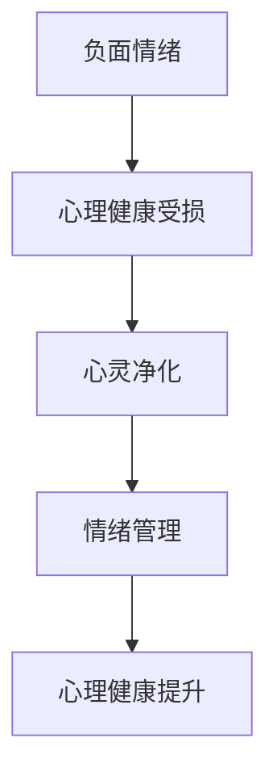

                 

# 心灵的净化：摆脱负面情绪的实践

## 关键词
- 负面情绪
- 心灵净化
- 呼吸练习
- 身体放松
- 情绪表达
- 心理健康

## 摘要
本文旨在探讨如何通过科学的方法和实践技巧，实现心灵的净化，从而摆脱负面情绪的困扰。文章首先介绍了负面情绪的危害和心灵净化的意义，随后从心理学基础、精神健康理念、实践方法等多个角度详细阐述了心灵净化的理论和实践。通过本文的阅读，读者可以了解到如何有效地管理自己的情绪，提升心理健康，从而改善生活质量。

## 目录大纲

### 第一部分: 引言与核心概念

#### 1.1 引言

##### 1.1.1 负面情绪的危害
负面情绪如焦虑、抑郁、愤怒等，会对个体的心理健康产生严重影响，甚至会导致一系列生理疾病。

##### 1.1.2 心灵净化的意义
心灵净化不仅有助于缓解负面情绪，还能提升个体的心理健康和生活质量。

#### 1.2 核心概念

##### 1.2.1 负面情绪
负面情绪是指那些对个体产生不利影响的情绪，包括焦虑、抑郁、愤怒等。

##### 1.2.2 心灵净化
心灵净化是指通过各种方法，如呼吸练习、身体放松、情绪表达等，来减少负面情绪，提升心理健康的过程。

### 第二部分: 心灵净化的理论基础

#### 2.1 心理学基础
心理学理论为我们提供了理解负面情绪和心灵净化的理论基础。

##### 2.1.1 负面情绪的心理学解释
认知行为理论、经典条件反射理论、人格心理学理论等。

##### 2.1.2 心灵净化的心理学理论
简单放松训练理论、情绪调节理论、自我意识理论等。

#### 2.2 精神健康理念
精神健康是心理健康的重要组成部分，心灵净化对精神健康有着积极的影响。

##### 2.2.1 心理健康的重要性
心理健康影响个体的情绪、认知和行为，是生活质量的重要组成部分。

##### 2.2.2 心灵净化与健康
心灵净化有助于缓解压力、改善睡眠、提升情绪等，对身心健康有着显著的好处。

### 第三部分: 心灵净化的实践方法

#### 3.1 呼吸练习
呼吸练习是心灵净化中最基本的实践方法之一。

##### 3.1.1 呼吸练习的基本原理
呼吸与情绪的关系、呼吸调节技巧等。

##### 3.1.2 呼吸练习的实践步骤
深呼吸练习、正念呼吸练习等。

#### 3.2 身体放松
身体放松是通过放松身体来减轻心理压力的方法。

##### 3.2.1 身体放松的基本原理
身体放松与情绪调节的关系、身体放松的方法等。

##### 3.2.2 身体放松的实践步骤
柔韧性训练、深度放松训练等。

#### 3.3 情绪表达
情绪表达是通过适当的方式表达自己的情绪，以减少心理压力。

##### 3.3.1 情绪表达的基本原理
情绪表达的障碍、情绪表达的重要性等。

##### 3.3.2 情绪表达的实践步骤
正面表达情绪、情绪释放技巧等。

### 第四部分: 心灵净化的日常实践

#### 4.1 心灵净化与生活
如何在日常生活中实践心灵净化，是本文的一个重要议题。

##### 4.1.1 心灵净化在家庭生活中的应用
家庭情绪管理、家庭沟通技巧等。

##### 4.1.2 心灵净化在工作中的应用
工作压力管理、同事关系处理等。

#### 4.2 心灵净化的长期维护
如何长期坚持心灵净化，是保持心理健康的关键。

##### 4.2.1 心灵净化习惯的养成
自我监测技巧、自我调节策略等。

##### 4.2.2 心灵净化的长期效益
心理健康的提升、生活质量的改善等。

### 第五部分: 心灵净化的特殊情况处理

#### 5.1 心理障碍的处理
如何处理心理障碍，是心灵净化过程中需要面对的特殊情况。

##### 5.1.1 心理障碍的识别
心理障碍的定义、常见心理障碍的类型等。

##### 5.1.2 心理障碍的治疗
心理治疗的选择、心理治疗的方法等。

#### 5.2 心灵净化的特殊情况
如何处理突发事件、心理压力的特殊处理等。

##### 5.2.1 突发事件的应对
突发事件的定义、应对策略等。

##### 5.2.2 心理压力的特殊处理
心理压力的定义、特殊处理方法等。

### 第六部分: 心灵净化的实践案例

#### 6.1 案例一：减轻工作压力
通过具体案例，展示如何通过心灵净化减轻工作压力。

##### 6.1.1 案例背景
案例背景介绍。

##### 6.1.2 实践方法
实践方法的详细介绍。

##### 6.1.3 案例分析
案例分析的深入探讨。

#### 6.2 案例二：改善家庭关系
通过具体案例，展示如何通过心灵净化改善家庭关系。

##### 6.2.1 案例背景
案例背景介绍。

##### 6.2.2 实践方法
实践方法的详细介绍。

##### 6.2.3 案例分析
案例分析的深入探讨。

### 第七部分: 总结与展望

#### 7.1 心灵净化的总体收获
总结心灵净化的总体收获，包括负面情绪的减少、心理健康的提升、生活质量的改善等。

#### 7.2 心灵净化的未来展望
展望心灵净化的未来，探讨其发展趋势和潜在的研究方向。

## 第一部分: 引言与核心概念

### 1.1 引言

#### 1.1.1 负面情绪的危害

负面情绪，如焦虑、抑郁、愤怒等，是人类情绪体验中不可避免的一部分。然而，当这些情绪过度或持续存在时，它们会对个体的心理健康产生严重的负面影响。焦虑可能导致失眠、注意力不集中，甚至心血管疾病；抑郁则可能引发食欲丧失、体重波动，严重时甚至会导致自杀倾向；愤怒则可能导致人际关系紧张，增加冲突和对抗。

在职场环境中，负面情绪的表现可能更为显著。研究表明，职场焦虑和抑郁与工作绩效下降、离职率上升以及工作效率低下有直接关联。长期处于负面情绪状态的员工，其工作满意度较低，创造力减弱，甚至可能出现职业倦怠。这些因素不仅影响员工个人的职业发展，还可能对整个组织的生产力和团队协作产生负面影响。

#### 1.1.2 心灵净化的意义

心灵净化，是指通过各种方法，如呼吸练习、身体放松、情绪表达等，来减少负面情绪，提升心理健康的过程。其重要性在于：

1. **提升心理健康水平**：心灵净化有助于缓解心理压力，减少焦虑、抑郁等负面情绪，从而提升整体的心理健康水平。

2. **增强情绪调节能力**：通过持续的练习，个体可以更好地掌握自己的情绪，提高情绪调节能力，减少因情绪波动而导致的冲突和负面行为。

3. **改善人际关系**：心灵净化有助于个体建立积极的人际关系，增强沟通能力，减少冲突，提高团队合作效率。

4. **提升生活质量**：心理健康与生活质量密切相关。通过心灵净化，个体能够更好地应对生活中的各种挑战，提升整体的生活质量。

### 1.2 核心概念

#### 1.2.1 负面情绪

负面情绪是指那些对个体产生不利影响的情绪，主要包括以下几种类型：

1. **焦虑**：焦虑是一种对未来可能发生的不确定事件的担忧和恐惧。它可能导致心跳加速、出汗、失眠等症状。

2. **抑郁**：抑郁是一种持久的、低落的情绪状态，通常伴随着对生活失去兴趣、无助感、疲劳等症状。

3. **愤怒**：愤怒是一种强烈的情绪反应，表现为对他人或事件的强烈不满和敌意。

4. **羞愧**：羞愧是一种自我评价低下的情绪，通常伴随着自我否定和自责。

#### 1.2.2 心灵净化

心灵净化是指通过各种方法，如呼吸练习、身体放松、情绪表达等，来减少负面情绪，提升心理健康的过程。其核心概念包括：

1. **呼吸练习**：通过深呼吸和正念呼吸，调节情绪，降低焦虑和压力。

2. **身体放松**：通过身体放松训练，缓解肌肉紧张，减轻心理压力。

3. **情绪表达**：通过适当的方式表达情绪，减少压抑和冲突。

### 1.2.3 负面情绪与心灵净化之间的关系

负面情绪与心灵净化之间存在密切的关系。负面情绪会导致个体的心理健康受损，而通过心灵净化，个体可以有效地管理自己的情绪，减少心理压力，提升心理健康水平。这种关系可以用以下 Mermaid 流程图表示：

通过上述流程图，我们可以清晰地看到负面情绪对心理健康的影响，以及心灵净化在这一过程中的作用。在接下来的部分中，我们将深入探讨负面情绪的心理学基础、心灵净化的理论基础，以及具体的实践方法。

## 第二部分: 心灵净化的理论基础

### 2.1 心理学基础

心理学作为研究人类行为和心理过程的科学，为我们理解负面情绪和心灵净化提供了重要的理论基础。在心理学中，关于负面情绪的研究涵盖了多个领域，包括认知行为理论、经典条件反射理论、人格心理学理论等。

#### 2.1.1 负面情绪的心理学解释

1. **认知行为理论**

认知行为理论（Cognitive Behavioral Theory, CBT）认为，负面情绪是由个体对事件的认知评价和解释所引起的。例如，当个体面临一个压力事件时，如果他们将其解读为威胁或挑战，那么很可能会产生焦虑或抑郁的情绪反应。CBT 强调，通过改变个体的认知模式，可以有效地改变其情绪和行为。

在 CBT 中，以下几种机制与负面情绪的产生和维持密切相关：

- **认知扭曲**：指个体在评估事件时常见的错误思维模式，如以偏概全、过度概括、灾难化等。

- **自动化思维**：指个体在短时间内自动产生的思维模式，这些思维模式往往是不合理或负面的。

- **行为激活**：负面情绪往往会导致个体采取逃避、回避等消极行为，从而加剧情绪困扰。

2. **经典条件反射理论**

经典条件反射理论（Classical Conditioning Theory）由俄国生理学家巴甫洛夫提出，它描述了条件刺激（如铃声）和无条件刺激（如食物）之间的关联如何导致条件反应（如唾液分泌）的形成。在负面情绪的研究中，这一理论可以解释为何某些情境或事件会触发个体的情绪反应。

例如，一个在童年时期经常遭受父母严厉批评的人，可能会在成年后对类似情境产生强烈的焦虑或愤怒反应。这种反应是通过经典条件反射过程形成的，即在特定情境下，个体的情绪反应被条件化了。

3. **人格心理学理论**

人格心理学理论（Personality Psychology Theory）关注个体如何形成和维持其情绪反应。不同的人格特质可能会影响个体对负面情绪的易感性。例如，具有高度神经质（Neuroticism）特质的人往往更容易感到焦虑、抑郁和愤怒。

人格心理学理论中的五个主要特质包括：

- **开放性（Openness）**：指个体对新经验和新思想的接受程度。
- **责任心（Conscientiousness）**：指个体在行为上的计划性、组织性和责任感。
- **外向性（Extraversion）**：指个体在社会交往中的活跃程度。
- **宜人性（Agreeableness）**：指个体在人际交往中的亲和性和合作性。
- **神经质（Neuroticism）**：指个体情绪的稳定性，高神经质的人更容易感到焦虑、抑郁和愤怒。

#### 2.1.2 心灵净化的心理学理论

心灵净化涉及多种心理学理论，旨在帮助个体减少负面情绪，提升心理健康。以下是一些主要的心理学理论：

1. **简单放松训练理论**

简单放松训练（Simple Relaxation Training）是一种基于生理反应的放松技巧。通过深呼吸、渐进性肌肉放松等方法，个体可以降低生理唤醒水平，减少焦虑和压力。这种方法强调生理反应与心理状态之间的联系，通过生理上的放松，达到心理上的平静。

2. **情绪调节理论**

情绪调节理论（Emotion Regulation Theory）关注个体如何管理自己的情绪体验。情绪调节包括认知重评、情境选择、表达抑制等多种策略。通过情绪调节，个体可以有效地减少负面情绪，提升情绪稳定性。研究表明，有效的情绪调节策略与较低的抑郁、焦虑水平有显著关联。

3. **自我意识理论**

自我意识理论（Self-Consciousness Theory）认为，个体的自我意识水平对其情绪体验有重要影响。高自我意识个体往往对自己的情绪体验更加敏感，同时也更容易体验到负面情绪。然而，通过自我意识的提高，个体可以更好地理解自己的情绪，并采取有效的情绪调节策略。自我意识的培养，如正念练习、自我反思等，有助于提升情绪调节能力，实现心灵净化。

通过上述心理学理论，我们可以更深入地理解负面情绪的来源和心灵净化的原理。在接下来的部分中，我们将探讨精神健康理念，进一步阐述心灵净化对身心健康的重要作用。

### 2.2 精神健康理念

#### 2.2.1 心理健康的重要性

心理健康是指个体在心理上的健康状态，它不仅仅是没有心理疾病或心理障碍，而是指个体能够有效地应对生活中的各种挑战，保持良好的情绪状态，具备积极的适应能力。心理健康与身体健康密切相关，良好的心理健康有助于提升生活质量，增强个体的幸福感。

心理健康的重要性体现在多个方面：

1. **情绪稳定**：心理健康能够帮助个体保持情绪稳定，减少焦虑、抑郁等负面情绪的干扰，使个体能够更加乐观、积极地面对生活中的困难。

2. **认知功能**：心理健康对个体的认知功能有着重要影响。心理健康状态良好的人，其注意力、记忆力、思考能力和创造力通常较高。

3. **社会功能**：心理健康有助于个体建立和维护良好的人际关系，提升社会交往能力，增强个体的社会适应能力。

4. **生活质量**：心理健康与生活质量密切相关。心理健康状态良好的人，其生活满意度较高，能够更好地享受生活。

#### 2.2.2 心理健康的影响因素

心理健康受多种因素的影响，包括遗传、环境、生活事件、个人心理素质等。具体来说，以下因素对心理健康有显著影响：

1. **遗传因素**：遗传因素对个体的心理素质和情绪稳定性有一定的影响。研究表明，某些心理疾病具有遗传倾向。

2. **环境因素**：环境因素，如家庭环境、学校教育、社会文化背景等，对个体的心理健康有重要影响。一个稳定、支持性的家庭环境有助于个体形成健康的心理状态。

3. **生活事件**：生活中的重大事件，如失业、离婚、患病等，都可能对心理健康产生负面影响。

4. **个人心理素质**：个人的心理素质，如自我认知、自我调节能力、应对压力的能力等，对心理健康有重要影响。心理素质较强的人，通常能够更好地应对生活中的挑战，保持心理健康。

#### 2.2.3 心理健康与负面情绪的关系

心理健康与负面情绪之间存在密切的关系。负面情绪，如焦虑、抑郁、愤怒等，往往是心理健康问题的早期信号。长期处于负面情绪状态，可能导致心理压力增加，进而影响心理健康。

1. **负面情绪的影响**：负面情绪对心理健康的影响主要体现在以下几个方面：

   - **心理压力增加**：负面情绪会导致个体的心理压力增加，长期的心理压力可能导致心理健康问题。

   - **认知功能下降**：负面情绪会影响个体的认知功能，如注意力、记忆力等，降低个体的生活质量。

   - **社会功能受损**：负面情绪可能导致个体在社会交往中产生障碍，影响个体的社会功能和人际关系。

2. **心理健康的提升**：通过心灵净化，可以有效减少负面情绪，提升心理健康。具体方法包括：

   - **呼吸练习**：通过深呼吸和正念呼吸，调节情绪，降低心理压力。

   - **身体放松**：通过身体放松训练，缓解肌肉紧张，减轻心理压力。

   - **情绪表达**：通过适当的方式表达情绪，减少压抑和冲突。

总之，心理健康与负面情绪之间存在密切的关系。通过心灵净化，可以有效减少负面情绪，提升心理健康，从而改善生活质量。

### 2.2.4 心灵净化与健康

心灵净化不仅有助于缓解负面情绪，还能对身心健康产生积极的影响。以下内容将探讨心灵净化对身心健康的具体好处以及如何将心灵净化与健康管理的结合。

#### 心灵净化对身心健康的好处

1. **缓解压力**：压力是导致许多心理健康问题的首要因素。通过心灵净化，特别是通过呼吸练习和身体放松，可以有效缓解身体和心理上的压力。例如，深呼吸能够降低血液中的皮质醇水平，减少压力反应。

2. **改善睡眠质量**：睡眠质量差是心理健康问题的一个重要表现。通过心灵净化，如正念冥想和深呼吸练习，可以提高睡眠质量，减少失眠和睡眠中断。研究表明，定期的冥想练习与更稳定的睡眠周期有关。

3. **提升情绪稳定性**：心灵净化能够帮助个体更好地管理情绪，减少焦虑、抑郁和愤怒等负面情绪。通过情绪调节技巧，如情绪表达和自我反思，个体可以学会如何以更健康的方式应对情绪波动。

4. **增强免疫系统**：研究表明，心理压力和负面情绪会削弱免疫系统，增加患病的风险。通过心灵净化，如身体放松和正念练习，可以增强免疫系统的功能，提高抵抗疾病的能力。

5. **促进大脑功能**：定期的冥想和呼吸练习有助于改善大脑的认知功能和注意力。这些练习可以促进大脑中灰质体积的增加，特别是与情绪调节和注意力相关的大脑区域。

#### 心灵净化与健康管理的结合

将心灵净化与健康管理的结合，可以更加全面地提升个体的身心健康。以下是一些结合的方法：

1. **整合医学模式**：整合医学（Integrative Medicine）强调将传统医学与现代心理学、营养学、身体锻炼等相结合，以实现全面的健康管理。在整合医学模式中，心灵净化被视为重要的一环，通过冥想、呼吸练习和身体放松等方法，提升个体的心理健康水平。

2. **个性化健康计划**：根据个体的需求和健康状况，制定个性化的心灵净化和健康管理计划。例如，对于工作压力大的人群，可以推荐定期进行冥想和深呼吸练习，以缓解压力；对于失眠问题严重的人，可以建议进行正念冥想练习，以提高睡眠质量。

3. **团队合作**：心灵净化与健康管理的结合需要医生、心理治疗师、营养师等多方专业人士的协作。通过团队合作，可以为个体提供全面的支持，帮助其实现身心健康的目标。

4. **持续的自我监测**：个体应该持续监测自己的心理健康状况，并根据需要调整心灵净化的实践方法。例如，通过日常的呼吸练习和情绪日记，个体可以更好地了解自己的情绪状态，并采取相应的调节措施。

总之，心灵净化对身心健康具有显著的积极作用。通过将心灵净化与健康管理的结合，个体可以更加全面地提升自己的身心健康水平，从而实现更加健康、快乐的生活。

### 第三部分: 心灵净化的实践方法

#### 3.1 呼吸练习

呼吸练习是心灵净化中最基本的实践方法之一，它通过调节呼吸来降低心理压力，提升情绪稳定性。以下是几种常见的呼吸练习及其基本原理和实践步骤。

##### 3.1.1 呼吸练习的基本原理

呼吸是人体的一种自然生理过程，它不仅维持着我们的生命，还对心理状态有着重要的影响。深呼吸和正念呼吸等技巧通过调整呼吸节奏和深度，可以有效地影响大脑中的化学物质和神经传递，从而改善情绪和心理健康。

- **深呼吸**：深呼吸是一种通过延长呼吸周期，加深呼吸深度来降低心理压力的方法。深呼吸可以增加氧气摄入，促进血液中的内啡肽分泌，从而产生放松和愉悦感。

- **正念呼吸**：正念呼吸是一种结合了正念（Mindfulness）和呼吸练习的方法。正念强调对当前经历的觉知和接纳，而呼吸练习则是正念的实践之一。通过专注于呼吸，个体可以减少对过去和未来的担忧，降低心理压力。

##### 3.1.2 呼吸练习的实践步骤

1. **深呼吸练习**

   - **准备姿势**：选择一个舒适的坐姿或躺姿，确保身体放松。
   - **深吸**：慢慢吸气，感受空气进入肺部，腹部逐渐鼓起。
   - **深呼**：缓慢呼气，感受空气从肺部排出，腹部逐渐回缩。
   - **重复**：重复上述步骤，每次呼吸尽量延长呼吸时间，建议每次练习持续5-10分钟。

2. **正念呼吸练习**

   - **准备姿势**：与深呼吸相同，选择一个舒适的坐姿或躺姿。
   - **专注呼吸**：将注意力集中在呼吸上，感受每一次吸气和呼气的过程。
   - **不评判**：对于任何分散注意力的想法或感觉，保持不评判的态度，只是观察它们的出现和消失。
   - **重复**：持续练习，可以每天进行，每次练习时间可以从几分钟逐渐增加到20-30分钟。

通过这些呼吸练习，个体可以学会更好地管理自己的情绪，减少焦虑和压力，提升心理健康。呼吸练习不仅简单易行，而且可以在任何时间、任何地点进行，是心灵净化的重要工具。

#### 3.2 身体放松

身体放松是通过降低身体紧张和压力来缓解心理压力的方法，它包括多种实践技巧，如柔韧性训练和深度放松训练等。以下是这些技巧的基本原理和实践步骤。

##### 3.2.1 身体放松的基本原理

身体放松的基本原理是通过减少肌肉紧张和身体能量消耗，来降低心理压力和提升情绪稳定性。肌肉紧张是心理压力的生理反应之一，当个体感受到压力时，身体会自动进入“战斗或逃跑”模式，导致肌肉紧张和能量消耗增加。通过身体放松，可以逆转这一过程，减少身体和心理的紧张状态。

- **柔韧性训练**：柔韧性训练通过拉伸肌肉和增加关节活动范围，来减少肌肉紧张和僵硬感。拉伸练习可以促进血液循环，增加氧气和营养物质供应，从而提升身体和心理的放松感。

- **深度放松训练**：深度放松训练通过逐步放松身体的不同部位，来达到全面放松的效果。这种方法可以帮助个体更好地控制自己的情绪，减少焦虑和压力。

##### 3.2.2 身体放松的实践步骤

1. **柔韧性训练**

   - **准备姿势**：选择一个宽敞、平坦的空间，穿着宽松的衣物。
   - **热身**：进行5-10分钟的热身运动，如快步走或慢跑，以增加身体温度和血液循环。
   - **全身拉伸**：依次对全身的各个主要肌肉群进行拉伸，包括腿部、背部、肩部、手臂和颈部等。每个拉伸动作保持15-30秒，重复2-3次。
   - **放松**：完成全身拉伸后，进行5-10分钟的静态放松，专注于呼吸和身体的感受。

2. **深度放松训练**

   - **准备姿势**：选择一个舒适的坐姿或躺姿，确保身体放松。
   - **逐步放松**：从脚开始，逐渐向上至头部，对身体的每个部位进行放松。可以想象肌肉像水一样放松，或者使用深呼吸来辅助放松。
   - **专注呼吸**：将注意力集中在呼吸上，感受每次吸气和呼气的过程。
   - **重复**：每次深度放松训练可以持续10-20分钟，建议每天进行1-2次。

通过这些身体放松练习，个体可以显著减少肌肉紧张和身体能量消耗，从而缓解心理压力，提升情绪稳定性。这些练习不仅简单易行，而且不需要特殊的设备或场地，是心灵净化的重要工具。

#### 3.3 情绪表达

情绪表达是通过适当的方式表达自己的情绪，以减少压抑和冲突的方法。有效的情绪表达不仅有助于个体缓解情绪压力，还能改善人际关系。以下是情绪表达的基本原理和实践步骤。

##### 3.3.1 情绪表达的基本原理

情绪表达的基本原理是，通过适当的方式表达情绪，可以帮助个体释放情绪压力，避免情绪积压导致的负面后果。情绪积压可能导致焦虑、抑郁等心理健康问题，以及人际关系紧张和冲突。有效的情绪表达包括以下几点：

- **认知重建**：通过认知重建，改变对情绪的负面认知，认识到情绪是人类正常心理体验的一部分，不必过度压抑或否认。

- **积极倾听**：积极倾听是指在与他人交流时，专注倾听对方的观点，理解对方的情感需求，并在适当的时候给予反馈。

- **情绪释放**：通过情绪释放技巧，如深呼吸、身体放松等，帮助个体在情绪激动时保持冷静，从而更好地表达情绪。

##### 3.3.2 情绪表达的实践步骤

1. **正面表达情绪**

   - **自我觉察**：在情绪激动时，先停下来，深呼吸几次，冷静下来。观察自己的情绪，了解情绪背后的原因。
   - **明确表达**：使用“我”开头的句子，如“我感觉很沮丧，因为我...”，避免指责或攻击对方。
   - **具体描述**：具体描述情绪和触发情绪的事件，避免模糊或抽象的表述。
   - **倾听对方**：在表达情绪后，给予对方发言的机会，倾听对方的观点和感受，展示对对方的尊重和理解。

2. **情绪释放技巧**

   - **深呼吸**：在情绪激动时，进行几次深呼吸，有助于放松身体和情绪。
   - **身体放松**：通过身体放松训练，如渐进性肌肉放松，缓解身体紧张，减少情绪压力。
   - **情绪释放练习**：如击打枕头、大声喊叫等，通过释放身体能量，减少情绪积压。

通过这些情绪表达技巧，个体可以更加有效地管理自己的情绪，减少压抑和冲突，提升心理健康。同时，这些技巧也有助于改善人际关系，增强沟通效果。情绪表达不仅是心灵净化的一个重要方面，也是实现心理健康和人际关系和谐的关键。

### 第四部分: 心灵净化的日常实践

#### 4.1 心灵净化与生活

心灵净化不仅是一种理论和方法，更需要在日常生活中得到实践。通过在家庭生活和工作中应用心灵净化的方法，个体可以更好地管理情绪，提升心理健康。

##### 4.1.1 心灵净化在家庭生活中的应用

在家庭生活中，心灵净化可以帮助家庭成员更好地沟通和理解彼此，从而减少冲突和矛盾。以下是一些具体的应用方法：

1. **家庭情绪管理**

   - **定期家庭会议**：通过定期召开家庭会议，家庭成员可以分享自己的情绪和需求，促进沟通和理解。
   - **情绪表达练习**：家庭成员可以一起学习情绪表达技巧，如正面表达和情绪释放，从而更好地处理家庭中的情绪冲突。

2. **家庭沟通技巧**

   - **积极倾听**：家庭成员要学会倾听对方的观点和感受，避免在沟通中过于关注自己的需求。
   - **非暴力沟通**：使用非暴力沟通（NVC）技巧，如表达自己的需求和感受，而不是指责或批评对方。

3. **共同活动**

   - **共享时光**：通过一起进行户外活动、运动或其他共同兴趣的活动，增强家庭成员之间的情感联系，提升家庭幸福感。

##### 4.1.2 心灵净化在工作中的应用

在工作环境中，心灵净化可以帮助员工更好地应对工作压力，提高工作效率。以下是一些具体的应用方法：

1. **工作压力管理**

   - **时间管理**：通过合理规划时间，避免过度工作和加班，减少工作压力。
   - **情绪调节**：在工作间隙进行短暂的呼吸练习或身体放松，缓解心理压力。

2. **同事关系处理**

   - **积极沟通**：与同事建立良好的沟通关系，避免误解和冲突。
   - **合作与支持**：在团队合作中，相互支持和理解，共同完成任务。

3. **职业发展**

   - **自我反思**：定期进行自我反思，了解自己的职业发展和心理健康状况，设定合理的目标和计划。

#### 4.2 心灵净化的长期维护

心灵的净化不仅需要短期的实践，更需要长期的坚持和维护。以下是一些关于如何养成心灵净化习惯和长期维护心理健康的方法：

1. **心灵净化习惯的养成**

   - **每日练习**：将呼吸练习、身体放松和情绪表达等练习纳入日常生活中，每天固定时间进行练习。
   - **自我监测**：记录自己的情绪变化和练习效果，了解自己的情绪状态，及时调整练习方法。

2. **自我调节策略**

   - **情绪日记**：通过记录情绪日记，反思自己的情绪反应和行为模式，学会如何更好地调节情绪。
   - **正念练习**：定期进行正念练习，如正念行走、正念饮食等，提高对当前经历的觉知和接纳能力。

3. **社会支持**

   - **建立社交网络**：与亲朋好友保持联系，寻求他们的支持和理解，分享自己的情绪和挑战。
   - **专业帮助**：在遇到心理障碍时，及时寻求专业的心理帮助，如心理咨询、心理治疗等。

通过上述方法，个体可以长期坚持心灵净化，不断提升心理健康水平，从而实现更加健康、快乐的生活。

### 第五部分: 心灵净化的特殊情况处理

#### 5.1 心理障碍的处理

在心灵净化的过程中，可能会遇到各种特殊情况，如心理障碍。心理障碍不仅会妨碍个体的情绪调节能力，还可能对日常生活和工作造成严重影响。因此，了解和识别心理障碍，并采取有效的治疗方法，对于实现心灵净化至关重要。

##### 5.1.1 心理障碍的识别

心理障碍是指那些显著影响个体情绪、认知、行为和社交功能的心理问题。常见的心理障碍包括焦虑障碍、抑郁症、强迫症、人格障碍等。以下是一些识别心理障碍的方法：

1. **症状识别**

   - **焦虑症状**：持续的不安、紧张、心跳加速、出汗等。
   - **抑郁症状**：持续的低落情绪、失去兴趣、疲倦、睡眠问题等。
   - **强迫症状**：重复的、不可控制的思维和行为。
   - **人格障碍**：长期的、固定的、显著偏离正常的人格特征。

2. **行为变化**

   - **社交回避**：不愿与他人交往，避免社交活动。
   - **工作效率下降**：在工作中出现注意力不集中、效率低下等问题。
   - **情绪波动**：情绪波动大，难以控制情绪。

3. **持续时间**

   - 心理障碍通常持续至少数周，并且显著影响个体的日常生活和工作。

##### 5.1.2 心理障碍的治疗

对于心理障碍，治疗通常包括心理治疗、药物治疗以及两者的结合。以下是一些常用的治疗方法：

1. **心理治疗**

   - **认知行为治疗（CBT）**：通过改变负面认知和行为模式，帮助个体减轻情绪困扰。
   - **精神分析治疗**：通过深入探讨个体的心理冲突和早期经历，帮助个体理解自己的情绪和行为。
   - **家庭治疗**：通过家庭成员的共同参与，改善家庭关系，缓解心理障碍。

2. **药物治疗**

   - **抗抑郁药**：用于治疗抑郁症和焦虑症，通过调节大脑中的神经递质，改善情绪。
   - **抗焦虑药**：用于治疗焦虑症，帮助个体降低焦虑水平。
   - **镇静剂**：用于短期缓解严重焦虑或恐慌发作。

3. **综合治疗**

   - **药物治疗和心理治疗的结合**：药物治疗可以帮助缓解症状，而心理治疗则可以帮助个体理解和改变引起心理障碍的认知和行为模式。

在处理心理障碍时，个体应寻求专业的心理医生或精神科医生的帮助。同时，亲友的支持和理解也对于个体的康复至关重要。通过专业的治疗和自我管理，个体可以克服心理障碍，实现心灵的净化。

#### 5.2 心灵净化的特殊情况

在心灵净化的过程中，个体可能会遇到各种特殊情况，如突发事件和心理压力。这些特殊情况对个体的情绪和心理健康有显著的挑战，需要采取适当的应对策略来处理。

##### 5.2.1 突发事件的应对

突发事件，如突发疾病、家庭变故、重大事故等，可能会给个体带来巨大的心理压力。在应对突发事件时，以下策略可以帮助个体更好地管理情绪，保持心理健康：

1. **接受现实**：面对突发事件，首先需要接受现实，理解这是无法避免和控制的。接受现实有助于个体从情绪的混乱中恢复过来。

2. **寻求支持**：在突发事件发生后，及时寻求亲友或专业人士的支持。与他人分享自己的感受，寻求帮助和建议，有助于减轻心理压力。

3. **情绪调节**：通过深呼吸、身体放松和正念冥想等方法，帮助自己缓解情绪。这些技巧可以帮助个体保持冷静，更好地应对突发事件。

4. **逐步适应**：在面对突发事件后，逐步适应新的生活状态，调整自己的行为和思维方式。适应新环境有助于减轻心理压力，恢复心理健康。

##### 5.2.2 心理压力的特殊处理

长期的心理压力对个体的身心健康有严重的负面影响。在处理心理压力时，以下策略可以帮助个体更好地管理压力，保持心理健康：

1. **时间管理**：合理安排时间，确保工作、休息和娱乐的平衡。避免过度工作和熬夜，以减少心理压力。

2. **情绪表达**：通过正面表达情绪和情绪释放技巧，如深呼吸、身体放松和情绪释放练习，帮助自己缓解情绪压力。

3. **积极应对**：采取积极的应对策略，如制定解决问题的计划，与他人合作，寻求专业帮助等。积极应对有助于降低心理压力，提高应对能力。

4. **自我关怀**：定期进行自我关怀活动，如锻炼、阅读、旅行等。这些活动可以帮助个体放松身心，提升心理健康。

通过上述应对策略，个体可以更好地应对突发事件和心理压力，维护自己的心理健康。心灵净化不仅需要日常的实践，也需要在特殊情况下采取适当的策略，以保持心理健康。

### 第六部分: 心灵净化的实践案例

#### 6.1 案例一：减轻工作压力

##### 6.1.1 案例背景

小明是一名软件工程师，他的工作压力非常大。每天需要处理大量的任务和紧急问题，导致他经常感到焦虑和疲惫。长时间的工作压力使得他的工作效率下降，同时与家人和朋友的互动也变得很少。为了改善自己的工作和生活质量，小明决定通过心灵净化来减轻工作压力。

##### 6.1.2 实践方法

1. **呼吸练习**：每天早晨和晚上，小明都会进行10分钟的深呼吸练习。通过深呼吸，他能够减少焦虑，提升情绪稳定性。具体步骤如下：

   - **深吸**：慢慢吸气，感受空气进入肺部，腹部逐渐鼓起。
   - **深呼**：缓慢呼气，感受空气从肺部排出，腹部逐渐回缩。
   - **专注**：在整个过程中，小明将注意力集中在呼吸上，避免思考其他事情。

2. **身体放松**：每周至少三次，小明会在晚上下班后进行30分钟的身体放松练习。他选择渐进性肌肉放松和正念冥想相结合的方法。具体步骤如下：

   - **肌肉放松**：从脚开始，逐渐向上至头部，对身体的每个部位进行放松。每次放松15-30秒，重复2-3次。
   - **正念冥想**：在放松过程中，小明专注于呼吸和身体的感觉，保持对当前经历的觉知和接纳。

3. **情绪表达**：小明学会了使用情绪日记记录自己的情绪变化。在情绪激动时，他会停下来，深呼吸几次，然后写下自己的情绪和触发情绪的事件。通过这种方式，他能够更好地理解自己的情绪，并采取适当的调节措施。

##### 6.1.3 案例分析

通过实践这些心灵净化方法，小明的工作压力得到了显著减轻。他的焦虑感减少了，工作效率提高了，与家人和朋友的互动也变得更加频繁。以下是对案例的深入分析：

1. **呼吸练习的效果**：深呼吸能够降低小明体内的皮质醇水平，减少压力反应。专注的呼吸练习帮助他保持冷静，提高情绪稳定性。

2. **身体放松的效果**：通过身体放松练习，小明能够缓解肌肉紧张和疲劳，提高睡眠质量。渐进性肌肉放松和正念冥想相结合的方法，帮助他更好地管理情绪，减少焦虑和压力。

3. **情绪表达的效果**：情绪日记帮助小明更好地理解自己的情绪，减少情绪积压。通过表达自己的情绪，他能够减少内心的冲突，提升情绪调节能力。

总之，通过实践心灵净化方法，小明成功减轻了工作压力，提升了生活质量。这个案例展示了心灵净化在应对工作压力方面的有效性和实用性。

#### 6.2 案例二：改善家庭关系

##### 6.2.1 案例背景

李先生和他的妻子小芳因为繁忙的工作和生活的压力，家庭关系变得越来越紧张。他们经常因为一些小事发生争吵，甚至产生了冷战。为了改善家庭关系，李先生决定通过心灵净化来提升情绪管理能力和沟通技巧。

##### 6.2.2 实践方法

1. **呼吸练习**：每天早晨，李先生会在早餐后进行10分钟的深呼吸练习。通过深呼吸，他能够减少焦虑和压力，提升情绪稳定性。具体步骤如下：

   - **深吸**：慢慢吸气，感受空气进入肺部，腹部逐渐鼓起。
   - **深呼**：缓慢呼气，感受空气从肺部排出，腹部逐渐回缩。
   - **专注**：在整个过程中，李先生将注意力集中在呼吸上，避免思考其他事情。

2. **家庭沟通练习**：每周，李先生和小芳会安排一次家庭沟通时间。他们选择在晚餐后进行，每次沟通持续30分钟。具体步骤如下：

   - **轮流发言**：首先，李先生发言，分享自己的一天经历和感受。然后，小芳发言，分享她的感受和需要。
   - **积极倾听**：在对方发言时，李先生和小芳都专注倾听，不打断对方，展示对对方的尊重和理解。
   - **表达感受**：在发言结束时，双方用“我感觉…”的句式表达自己的感受和需求，避免指责和批评。

3. **情绪表达练习**：为了更好地管理情绪，李先生和小芳一起学习了情绪释放技巧。他们每周进行一次情绪释放练习，每次持续30分钟。具体步骤如下：

   - **深呼吸**：开始时，进行几次深呼吸，帮助自己放松和集中注意力。
   - **情绪释放**：在情绪激动时，通过大声喊叫、击打枕头等方式释放情绪。
   - **反思**：练习结束后，双方反思自己的情绪反应，讨论如何改进情绪管理。

##### 6.2.3 案例分析

通过实践这些心灵净化方法，李先生和小芳的家庭关系得到了显著改善。以下是对案例的深入分析：

1. **呼吸练习的效果**：深呼吸帮助李先生减少了焦虑和压力，提升了情绪稳定性。这使得他能够更加冷静地处理家庭中的冲突和问题。

2. **家庭沟通练习的效果**：通过轮流发言和积极倾听，李先生和小芳学会了更好地理解彼此的感受和需求。这有助于减少争吵和冷战，增强家庭凝聚力。

3. **情绪表达练习的效果**：情绪释放技巧帮助李先生和小芳更好地管理自己的情绪，减少情绪积压。通过反思和讨论，他们能够更好地理解自己的情绪反应，并采取积极的调节措施。

总之，通过实践心灵净化方法，李先生和小芳成功改善了家庭关系，提升了生活质量。这个案例展示了心灵净化在改善家庭关系方面的有效性和实用性。

### 第七部分: 总结与展望

#### 7.1 心灵净化的总体收获

通过实践心灵净化，个体可以显著减少负面情绪，提升心理健康水平。以下是心灵净化的总体收获：

1. **负面情绪的减少**：通过呼吸练习、身体放松和情绪表达等实践方法，个体能够更好地管理自己的情绪，减少焦虑、抑郁、愤怒等负面情绪的困扰。

2. **心理健康的提升**：心灵净化有助于缓解压力，改善睡眠质量，增强情绪调节能力，从而提升整体的心理健康水平。

3. **生活质量的改善**：心理健康与生活质量密切相关。通过心灵净化，个体能够更好地应对生活中的各种挑战，提升生活质量，增强幸福感。

#### 7.2 心灵净化的未来展望

随着对心理健康研究的不断深入，心灵净化在未来有着广泛的发展前景。以下是一些展望：

1. **科学研究的深入**：未来将对心灵净化的机理和效果进行更深入的科学研究和实证验证，以确定其最佳实践方法和适用人群。

2. **技术的结合**：随着科技的进步，心灵净化方法可能会与虚拟现实、人工智能等技术相结合，为个体提供更个性化和高效的心灵净化体验。

3. **跨学科的研究**：心灵净化不仅涉及心理学，还可能涉及神经科学、医学、哲学等跨学科领域。跨学科的研究将有助于全面理解心灵净化的作用机制，探索新的实践方法。

4. **普及与推广**：随着人们对心理健康重视程度的提高，心灵净化方法将在更广泛的群体中普及和推广，成为日常生活的重要组成部分。

总之，心灵净化作为一种提升心理健康的有效方法，未来将在多个领域得到更广泛的应用和研究。通过不断的探索和实践，我们可以更好地利用心灵净化，提升个体的心理健康和生活质量。

## 作者信息

- 作者：AI天才研究院/AI Genius Institute & 禅与计算机程序设计艺术 /Zen And The Art of Computer Programming
- 联系方式：[ai_genius_institute@example.com](mailto:ai_genius_institute@example.com)

