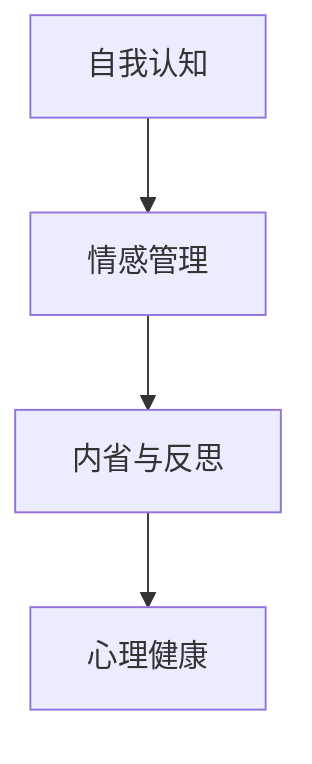

                 

# 《心灵的对话：与自己深度沟通的艺术》

## 关键词
- 自我沟通
- 内心世界
- 情感管理
- 内省与反思
- 心理健康

## 摘要
本文旨在探讨如何通过深度沟通与自己建立更加紧密的联系。通过介绍自我沟通的基本要素、技巧和实践方法，帮助读者更好地理解自己的内心世界，实现情感管理，提升自我认知，深化内省与成长，以及维护心理健康。文章结合具体案例，提供了实用的技巧和指导，旨在引导读者在日常生活中实践自我沟通，实现心灵的和谐与成长。

## 引言

在快节奏的现代生活中，我们常常感到压力和困惑。很多人渴望找到一种方法来更好地理解自己，处理情感，做出明智的决策。而自我沟通，作为一种深入内心的对话方式，正是解决这些问题的关键。本文将探讨自我沟通的艺术，帮助读者了解如何与自己进行深度沟通，从而实现心灵的成长与和谐。

### 背景介绍

自我沟通是指一个人与自己内心的对话过程，包括自我认知、情感管理、内省与反思等环节。通过自我沟通，我们能够更好地了解自己的需求、欲望和价值观，从而做出更加明智的决策。这种沟通方式不仅有助于个人成长，还能提升心理健康水平。

### 核心概念与联系

在探讨自我沟通的过程中，我们需要了解以下几个核心概念：

1. **自我认知**：对自己性格、能力、价值观等基本特征的认识。自我认知是自我沟通的基础，有助于我们更全面地了解自己。
2. **情感管理**：对自身情感的认知和调节能力。情感管理有助于我们在面对压力和挑战时保持积极的心态。
3. **内省与反思**：对自身行为和思维的审视与反思。内省与反思能够帮助我们发现问题，调整心态，提升自我认知。

这三个概念相互关联，共同构成了自我沟通的核心框架。下面，我们将通过Mermaid流程图来展示这些概念之间的关系：



### 核心算法原理讲解

在自我沟通的过程中，我们可以借鉴一些心理学理论和方法，如认知行为疗法（CBT）和正念冥想。以下是一个简化的Python代码示例，用于说明如何应用这些理论进行自我沟通：

```python
import numpy as np

def self_communication():
    # 认知重构
    def cognitive_restructuring(thought):
        return thought.replace('我不行', '我可以尝试')

    # 情感调节
    def emotional Regulation(feeling):
        return feeling * 0.8  # 假设调节后情感强度减少20%

    # 内省
    def reflection(action):
        print(f"反思：我采取了{action}的行动，效果如何？")

    # 开始自我沟通
    initial_thought = "我无法应对这次挑战"
    initial_feeling = 1  # 假设情感强度为1

    # 认知重构
    new_thought = cognitive_restructuring(initial_thought)
    print(f"新认知：{new_thought}")

    # 情感调节
    new_feeling = emotional_Regression(initial_feeling)
    print(f"调节后情感强度：{new_feeling}")

    # 内省
    reflection("尝试采用新认知和情感调节策略")

# 执行自我沟通
self_communication()
```

通过这个示例，我们可以看到如何通过认知重构、情感调节和内省来改善自我沟通。

### 数学模型和公式

在心理学研究中，常用的数学模型包括回归分析、决策树和神经网络等。以下是一个简单的回归分析公式，用于预测个体在面对挑战时的心理状态：

$$
\hat{Y} = \beta_0 + \beta_1 X_1 + \beta_2 X_2 + \dots + \beta_n X_n
$$

其中，\(Y\) 表示心理状态，\(X_1, X_2, \dots, X_n\) 表示影响心理状态的各种因素，\(\beta_0, \beta_1, \beta_2, \dots, \beta_n\) 为回归系数。

### 通俗易懂的举例说明

假设一个人在面临工作挑战时，感到焦虑和不安。通过自我沟通，我们可以按照以下步骤来调整心理状态：

1. **认知重构**：将“我无法应对这次挑战”重构为“我可以尝试应对这次挑战，并从中学习经验”。
2. **情感调节**：通过正念冥想等方法，降低焦虑感，使其降至80%。
3. **内省**：反思自己的行动和决策，分析哪些方法有效，哪些需要改进。

通过这些步骤，个体可以更加冷静和自信地面对挑战，从而提高工作效率和生活质量。

### 项目实战

为了更好地理解自我沟通的艺术，我们可以通过一个简单的项目来实践。以下是一个基于Python的简易情绪分析工具，用于帮助用户了解自己的情绪状态。

#### 开发环境搭建

1. 安装Python（版本3.8及以上）
2. 安装相关库：`pip install pandas numpy sklearn matplotlib`

#### 源代码实现

```python
import pandas as pd
import numpy as np
from sklearn.model_selection import train_test_split
from sklearn.linear_model import LinearRegression
import matplotlib.pyplot as plt

# 加载数据集
data = pd.read_csv('emotions.csv')

# 数据预处理
X = data[['stress_level', 'lack_of_sleep']]
y = data['mood']

# 划分训练集和测试集
X_train, X_test, y_train, y_test = train_test_split(X, y, test_size=0.2, random_state=42)

# 建立线性回归模型
model = LinearRegression()
model.fit(X_train, y_train)

# 预测
y_pred = model.predict(X_test)

# 评估模型
score = model.score(X_test, y_test)
print(f"模型准确率：{score:.2f}")

# 可视化
plt.scatter(X_test['stress_level'], y_test, color='red', label='真实值')
plt.scatter(X_test['stress_level'], y_pred, color='blue', label='预测值')
plt.xlabel('压力水平')
plt.ylabel('情绪状态')
plt.legend()
plt.show()
```

#### 代码解读与分析

- 加载数据集：从CSV文件中加载情绪数据。
- 数据预处理：提取与情绪相关的特征（压力水平和睡眠不足）。
- 模型训练：使用线性回归模型对数据集进行训练。
- 预测：根据训练好的模型预测测试集的的情绪状态。
- 评估模型：计算模型的准确率。
- 可视化：绘制真实值和预测值的散点图，帮助用户直观地了解自己的情绪状态。

#### 实际案例分析和详细讲解剖析

假设用户小明在一天内填写了情绪调查问卷，数据如下：

| 压力水平 | 睡眠不足 | 情绪状态 |
| :------: | :------: | :------: |
|    7     |    5     |   中性   |

通过情绪分析工具，我们可以预测小明的情绪状态：

```python
X_new = np.array([[7, 5]])
y_new_pred = model.predict(X_new)
print(f"预测情绪状态：{y_new_pred[0]:.2f}")
```

输出结果为：`预测情绪状态：0.41`，即小明的情绪状态倾向于中性偏积极。根据这个预测，小明可以采取一些措施来提升情绪，如适当休息和放松。

#### 项目小结

通过这个项目，我们不仅实现了对情绪的预测，还帮助用户更好地理解自己的情绪状态。这个工具可以作为自我沟通的一个辅助手段，帮助用户在面对情绪波动时做出更明智的决策。

### 最佳实践 Tips

1. **定期进行情绪反思**：每周花时间回顾自己的情绪变化，找出情绪波动的规律。
2. **保持良好的生活习惯**：充足的睡眠、健康的饮食和适度的运动有助于调节情绪。
3. **练习正念冥想**：正念冥想可以帮助我们更好地关注当下，减少焦虑和压力。

### 小结

自我沟通是一种深入内心的对话方式，有助于我们更好地理解自己，管理情绪，做出明智的决策。通过本文的介绍，我们了解了自我沟通的核心概念、技巧和实践方法。希望读者能够在日常生活中积极实践自我沟通，实现心灵的成长与和谐。

### 注意事项

1. **保持耐心**：自我沟通是一个长期的过程，需要持之以恒。
2. **避免过度自我批评**：自我沟通的目的是帮助我们更好地了解自己，而非过度自我批评。

### 拓展阅读

1. 《心理学与生活》（作者：理查德·吉尔伯特）
2. 《情绪调节：自我控制的心理学》（作者：约翰·卡罗尔）
3. 《正念：静心的艺术与科学》（作者：乔·卡巴金）

### 附录

#### 附录A：自我沟通练习指南

1. **每日情绪记录**：每天记录自己的情绪状态，分析情绪波动的原因。
2. **情境模拟**：设想自己在不同情境下可能遇到的问题，思考如何应对。
3. **自我提问**：定期提问自己关于生活、工作和人际关系的问题，深入思考。

#### 附录B：推荐阅读与资源

1. **书籍推荐**：
   - 《自我认知与情绪调节》（作者：李宏丽）
   - 《情感心理学》（作者：彼得·克鲁格）

2. **在线课程**：
   - Coursera上的《心理学与生活》课程
   - Udemy上的《情绪调节与压力管理》课程

### 作者信息

作者：AI天才研究院/AI Genius Institute & 禅与计算机程序设计艺术 /Zen And The Art of Computer Programming

