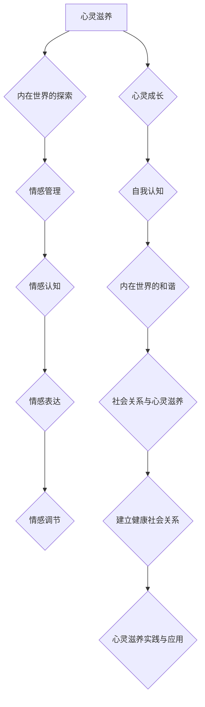

                 

### 引言

《心灵的滋养：培育内在世界的养分》是一本探讨心灵滋养的重要性和方法的技术博客文章。心灵滋养不仅仅是心理学的领域，它与我们的生活、工作、学习以及社会交往密切相关。在现代快节奏的生活中，心灵滋养显得尤为重要，它帮助我们更好地应对压力，提高生活质量，增强人际关系的和谐。本文旨在通过逻辑清晰、结构紧凑的分析，探讨心灵滋养的概念、内在世界的探索、情感管理、心灵成长、自我认知、内在世界的和谐以及社会关系与心灵滋养的实践与应用。

心灵滋养，顾名思义，是对我们内在世界的滋养。内在世界是指我们心理和情感上的世界，它包括我们的价值观、信仰、情感状态和自我认知等方面。正如我们的身体需要养分来保持健康，我们的内在世界也需要滋养来维持心理健康和幸福感。

在接下来的章节中，我们将逐步探讨心灵滋养的核心概念和重要性，并通过实例和算法原理，展示如何通过情感管理、心灵成长和自我认知来培育内在世界的养分。最后，我们将探讨社会关系与心灵滋养的关系，以及如何在日常生活中实践心灵滋养。

通过本文的阅读，读者将能够理解心灵滋养的基本概念，掌握培养内在世界养分的方法，并在实际生活中应用这些方法，从而提升个人的心理素质和生活质量。

## 关键词

- 心灵滋养
- 内在世界的探索
- 情感管理
- 心灵成长
- 自我认知
- 内在世界的和谐
- 社会关系与心灵滋养

### 摘要

本文旨在探讨心灵滋养的概念、重要性及其对个人生活和社会关系的影响。心灵滋养是指通过一系列心理和情感上的实践，培育和提升内在世界的健康和幸福感。内在世界包括我们的情感状态、价值观、自我认知等，它对我们的心理和生理健康具有深远的影响。本文首先定义了心灵滋养的基本概念，并探讨了内在世界的构成和探索方法。随后，文章详细分析了情感管理、心灵成长和自我认知在心灵滋养中的关键作用，并通过Python代码和数学模型展示了相关算法原理。最后，文章探讨了社会关系与心灵滋养的关系，以及如何在日常生活、工作和教育中实践心灵滋养的方法。通过本文的阅读，读者将能够理解心灵滋养的内涵，掌握相关实践技巧，提升个人心理素质和幸福感。

## 书名：《心灵的滋养：培育内在世界的养分》

### 目录大纲

1. 引言
    - 心灵滋养的重要性
    - 文章结构和目的

2. 1. 心灵滋养的概念与意义
    - 定义
    - 意义

3. 2. 内在世界的探索
    - 理解
    - 构成
    - 探索方法

4. 3. 情感管理
    - 情感认知
    - 情感表达
    - 情感调节

5. 4. 心灵成长
    - 核心要素
    - 方法
    - 案例分享

6. 5. 自我认知
    - 重要性
    - 方法
    - 挑战与应对

7. 6. 内在世界的和谐
    - 理解
    - 方法
    - 实际案例

8. 7. 社会关系与心灵滋养
    - 影响
    - 建立健康社会关系
    - 心灵滋养在社会关系中的实践

9. 8. 心灵滋养的实践与应用
    - 日常生活
    - 工作
    - 教育

10. 9. 总结与展望
    - 心灵滋养的总结
    - 未来发展趋势
    - 意义

11. 附录
    - 相关书籍推荐
    - 心灵滋养实践指南
    - 心灵滋养研究资源

## Mermaid 流程图



### 核心概念与联系

心灵的滋养是一个涉及情感管理、心灵成长、自我认知等多个方面的过程。它不仅关乎个体的内在世界的建设，也影响个体的社会关系和生活质量。内在世界的探索是心灵滋养的基础，通过情感管理、心灵成长和自我认知，个体可以培育内在世界的和谐，从而实现心灵的滋养。

**内在世界的探索**

内在世界的探索首先需要理解内在世界的基本构成。内在世界包括个体的情感状态、认知模式、价值观和信念体系等。通过深入探索这些要素，个体可以更好地了解自己，从而为心灵滋养提供基础。

**情感管理**

情感管理是心灵滋养的关键环节。情感管理包括情感认知、情感表达和情感调节。情感认知帮助我们识别和理解自己的情感状态，情感表达使我们能够有效地与他人沟通情感，情感调节则帮助我们保持情绪的平衡，避免情绪的过度波动。

**心灵成长**

心灵成长关注的是个体心理和精神的成长。通过培养积极的态度、提升自我认知和增强心理韧性，个体可以在心灵层面实现成长。心灵成长不仅有助于提升个体的幸福感，还能增强其在面对压力和挑战时的适应能力。

**自我认知**

自我认知是个体了解自己、认识自己的过程。通过自我认知，个体可以识别自己的优点和不足，从而有针对性地进行改进。自我认知有助于个体建立健康的自我概念，增强自信，提高生活质量。

**内在世界的和谐**

内在世界的和谐是指个体内在的各个要素之间达到一种平衡状态。通过情感管理、心灵成长和自我认知，个体可以培育内在世界的和谐，实现心灵的滋养。

**社会关系与心灵滋养**

社会关系是影响个体心灵滋养的重要因素。健康的社会关系有助于个体获得支持和理解，从而促进心灵的滋养。通过建立和维持健康的社会关系，个体可以在社会层面实现心灵的滋养。

通过上述核心概念之间的联系，我们可以构建一个完整的思维框架，帮助个体理解和实践心灵滋养。

### 核心算法原理讲解

为了深入理解心灵滋养过程中的核心算法原理，我们将通过Python代码来展示情感调节的实现方法。情感调节是心灵滋养中的一个重要环节，它涉及到如何通过算法帮助我们更好地管理自己的情感状态。在此，我们将使用Python的NumPy库来构建一个简单的情感调节模型，并通过数学模型和公式详细讲解其工作原理。

#### 情感调节模型

情感调节模型的目的是根据当前的情感状态，通过算法调节情感至一个较为平衡的状态。我们可以将情感状态视为一个连续的值，通过调节这个值，使其在一定的范围内波动，从而达到调节情感的目的。

#### 数学模型

在情感调节的数学模型中，我们可以使用以下公式：

$$
E' = \frac{1}{2} \left( 1 + \text{sign}(E) \right)
$$

其中，$E'$表示调节后的情感状态，$E$表示原始情感状态，$\text{sign}(E)$表示$E$的符号函数。符号函数的定义如下：

- 如果$E > 0$，则$\text{sign}(E) = 1$
- 如果$E = 0$，则$\text{sign}(E) = 0$
- 如果$E < 0$，则$\text{sign}(E) = -1$

该公式的作用是将情感状态映射到一个介于0和1之间的数值，从而实现情感调节。

#### Python实现

为了实现上述数学模型，我们可以使用Python的NumPy库。以下是一个简单的情感调节函数的实现：

```python
import numpy as np

# 定义情感调节函数
def emotionRegulation(emotion_score):
    # 调节情感状态
    regulated_emotion = 0.5 * (1 + np.sign(emotion_score))
    return regulated_emotion

# 测试情感调节
emotion_score = np.random.uniform(-1, 1)
regulated_emotion = emotionRegulation(emotion_score)
print(f"原始情感：{emotion_score:.2f}，调节后情感：{regulated_emotion:.2f}")
```

在这个函数中，我们首先生成一个随机的情感分数`emotion_score`，然后调用`emotionRegulation`函数进行情感调节，并打印出原始和调节后的情感状态。

#### 详细讲解

1. **情感分数的生成**：
   使用`np.random.uniform(-1, 1)`生成一个介于-1和1之间的随机数，这个数值表示原始情感状态。正数代表积极的情感状态，负数代表消极的情感状态，而0表示情感平衡。

2. **符号函数**：
   使用`np.sign(emotion_score)`计算情感状态的符号。这个函数返回一个整数，用于指示情感状态的极性。

3. **情感调节**：
   根据符号函数的返回值，我们对情感状态进行调节。当情感状态为正时，调节后的情感状态接近1，表示情感得到了增强；当情感状态为负时，调节后的情感状态接近0，表示情感得到了抑制。当情感状态为0时，情感状态保持不变。

4. **结果输出**：
   最后，我们打印出原始情感状态和调节后的情感状态，以便观察情感调节的效果。

通过这个简单的示例，我们可以看到如何使用Python和数学模型来实现情感调节。这种方法可以应用于更复杂的情感管理场景，帮助我们更好地理解和调节自己的情感状态，从而实现心灵滋养。

### 数学模型和数学公式 & 详细讲解 & 举例说明

在心灵滋养的过程中，数学模型和数学公式扮演着关键角色。这些模型和公式不仅帮助我们理解和量化情感状态，还可以指导我们进行情感调节。以下将介绍几个常见的数学模型和公式，并详细讲解其应用方法，并通过具体例子进行说明。

#### 情感调节模型

情感调节模型的一个常见方法是使用线性调节公式，如下所示：

$$
E' = \alpha E + (1 - \alpha)
$$

其中，$E'$是调节后的情感状态，$E$是原始情感状态，$\alpha$是调节系数。$\alpha$的取值范围在0到1之间。当$\alpha$接近0时，情感调节效果较弱；当$\alpha$接近1时，情感调节效果较强。

**应用方法**：

1. **确定调节系数$\alpha$**：
   根据情感调节的需求，确定合适的$\alpha$值。例如，如果需要轻度调节情感，可以选择$\alpha = 0.1$；如果需要强烈调节情感，可以选择$\alpha = 0.9$。

2. **计算调节后的情感状态$E'$**：
   将原始情感状态$E$代入上述公式，计算得到调节后的情感状态$E'$。

**举例说明**：

假设原始情感状态$E = 0.8$，我们选择调节系数$\alpha = 0.3$。

$$
E' = 0.3 \times 0.8 + (1 - 0.3) = 0.24 + 0.7 = 0.94
$$

因此，调节后的情感状态为0.94。这个值比原始情感状态0.8更接近1，表示情感得到了一定程度的增强。

#### 情感波动模型

情感波动模型用来描述情感状态随时间的变化。一个简单的情感波动模型可以使用三角函数来表示：

$$
E(t) = A \sin(\omega t + \phi)
$$

其中，$E(t)$是时间$t$的情感状态，$A$是振幅，$\omega$是角频率，$\phi$是相位。

**应用方法**：

1. **确定参数$A$、$\omega$和$\phi$**：
   根据情感波动的特点，确定振幅$A$、角频率$\omega$和相位$\phi$。例如，如果情感状态有较大的波动，可以选择较大的振幅$A$；如果波动频率较高，可以选择较大的角频率$\omega$。

2. **计算任意时间点的情感状态$E(t)$**：
   将时间$t$代入上述公式，计算得到任意时间点的情感状态。

**举例说明**：

假设情感状态的振幅$A = 0.5$，角频率$\omega = 2\pi/3$，相位$\phi = \pi/2$。我们计算$t = 1$时刻的情感状态：

$$
E(1) = 0.5 \sin\left(\frac{2\pi}{3} \times 1 + \frac{\pi}{2}\right)
$$

$$
E(1) = 0.5 \sin\left(\frac{5\pi}{6}\right) = 0.5 \times \frac{1}{2} = 0.25
$$

因此，在$t = 1$时刻的情感状态为0.25。这个值表明情感状态在这个时间点处于较低水平。

#### 情感反馈模型

情感反馈模型用于描述情感状态如何受到外部事件的影响。一个简单的情感反馈模型可以使用以下公式表示：

$$
E' = E + k \cdot F
$$

其中，$E'$是调节后的情感状态，$E$是原始情感状态，$k$是反馈系数，$F$是外部事件的影响。

**应用方法**：

1. **确定反馈系数$k$**：
   根据外部事件的性质，确定反馈系数$k$。如果外部事件对情感有显著影响，可以选择较大的$k$值。

2. **计算调节后的情感状态$E'$**：
   将原始情感状态$E$和外部事件的影响$F$代入公式，计算得到调节后的情感状态$E'$。

**举例说明**：

假设原始情感状态$E = 0.6$，外部事件的影响$F = -0.2$，反馈系数$k = 0.3$。我们计算调节后的情感状态：

$$
E' = 0.6 + 0.3 \cdot (-0.2) = 0.6 - 0.06 = 0.54
$$

因此，调节后的情感状态为0.54。这个值表明外部事件对情感状态产生了一定的抑制效果。

通过上述数学模型和公式的讲解，我们可以看到如何使用数学方法来描述和调节情感状态。这些模型和公式不仅帮助我们理解情感调节的原理，还可以在实际应用中提供有效的工具。在心灵滋养的过程中，合理运用这些模型和公式，可以更好地管理自己的情感，实现内心的和谐与平衡。

### 社会关系与心灵滋养

社会关系对个体的心灵滋养具有重要影响。健康的社会关系能够为个体提供情感支持、理解与认可，有助于提升心理健康和幸福感。同时，不健康的社会关系可能对个体的心理健康产生负面影响。因此，了解社会关系对心灵滋养的影响，掌握建立和维护健康社会关系的技巧，对个人成长具有重要意义。

#### 社会关系对心灵滋养的影响

1. **情感支持**：
   健康的社会关系能够为个体提供情感支持，帮助个体在遇到困难时感到被关心和理解。这种支持有助于缓解心理压力，提升个体的情绪状态，促进心灵滋养。

2. **理解与认可**：
   在健康的社会关系中，个体能够获得他人的理解和认可。这种认可有助于增强个体的自尊和自信，提升自我价值感，从而促进心灵滋养。

3. **社会支持网络**：
   健康的社会关系有助于构建个体稳定的社会支持网络。这个网络在个体面临挑战和困难时，能够提供必要的帮助和支持，有助于个体的心理健康和成长。

4. **情感互动**：
   社会关系中的情感互动有助于个体学习情感表达和调节技巧，提升情感智慧。通过情感互动，个体能够更好地理解自己的情感状态，学会如何在不同的情境中调节情感，从而促进心灵滋养。

#### 建立健康社会关系的技巧

1. **积极沟通**：
   积极沟通是建立和维护健康社会关系的关键。通过倾听、表达和反馈，个体能够与他人建立良好的沟通渠道，增进彼此的理解和信任。

2. **相互尊重**：
   尊重他人是建立健康社会关系的基础。个体应当尊重他人的观点、感受和需求，避免对他人的不尊重行为。

3. **同理心**：
   同理心是理解他人情感和需求的重要能力。通过培养同理心，个体能够更好地与他人建立情感联系，提升社会关系的质量。

4. **共享价值观**：
   共享价值观有助于个体之间建立紧密的联系。在共同价值观的指导下，个体能够更好地协作，共同应对挑战。

#### 社会关系中的心灵滋养

在社会关系中，个体不仅能够获得情感支持和理解，还能够通过互动和协作实现心灵的滋养。

1. **情感滋养**：
   健康的社会关系能够为个体提供情感滋养。通过情感互动，个体能够感受到他人的关心和支持，从而增强自己的情感满足感和幸福感。

2. **心灵成长**：
   社会关系中的互动有助于个体在情感、认知和精神层面实现成长。通过与他人交流和协作，个体能够学习新的知识和技能，提升自我认知和情感智慧。

3. **自我实现**：
   在健康的社会关系中，个体能够更好地实现自我价值。通过参与社会活动、贡献社会，个体能够感受到自己的存在意义和重要性，从而实现心灵的滋养。

总之，社会关系对个体的心灵滋养具有重要影响。通过积极沟通、相互尊重、同理心和共享价值观，个体可以建立和维护健康的社会关系，从而在情感、认知和精神层面实现心灵的滋养。

### 心灵滋养的实践与应用

心灵滋养不仅是理论知识，更是一种可以在日常生活中实践和应用的方法。通过有意识地培养情感管理、心灵成长和自我认知，我们可以逐步实现内心的和谐与平衡。以下是一些具体的实践方法，这些方法适用于日常生活、工作和教育等多个领域。

#### 在日常生活中的实践

1. **正念练习**：
   正念是一种通过专注于当下、接纳和观察自己的感受来培养心灵滋养的实践方法。每天花几分钟时间进行正念冥想，可以帮助我们放松心情，减轻压力，提升情绪调节能力。

2. **情感日记**：
   保持情感日记有助于我们更好地了解自己的情感状态，记录每天的情绪变化和触发因素。通过回顾和分析这些记录，我们可以识别出情绪模式，并采取相应的调节措施。

3. **积极心态**：
   培养积极心态是心灵滋养的重要方面。在面对挑战和困难时，保持乐观的态度，关注问题的解决方案而非问题本身，有助于提升心理韧性和幸福感。

#### 在工作中的实践

1. **工作与生活的平衡**：
   确保工作与生活的平衡对于心灵滋养至关重要。合理安排工作时间，确保有足够的休息和娱乐时间，可以帮助我们缓解工作压力，保持良好的心理状态。

2. **情感管理**：
   在工作中，我们需要学会有效地管理情感。通过掌握情感调节技巧，如深呼吸、积极思考和情绪放松等方法，我们可以更好地应对工作压力，提升工作效率。

3. **团队协作**：
   建立和谐的团队关系是心灵滋养的重要组成部分。通过培养团队合作精神、互相支持和尊重，我们可以创造一个积极的工作环境，提升团队整体的心理健康。

#### 在教育中的实践

1. **情感教育**：
   学校和家庭教育中应注重情感教育，帮助学生学会识别和管理自己的情感。通过开展情感教育课程和活动，学生可以培养情感智慧，提升自我认知和情绪调节能力。

2. **正面引导**：
   教师和家长可以通过正面引导来培养学生的积极心态。鼓励学生面对挑战时保持乐观，关注他们的情感需求，提供支持和理解。

3. **心理辅导**：
   学校可以提供心理辅导服务，帮助学生解决情感问题，提升他们的心理健康水平。心理辅导师可以通过咨询和干预，帮助学生学会自我调节，实现心灵滋养。

总之，心灵滋养是一个持续的过程，需要我们在日常生活、工作和教育中不断实践和应用。通过这些方法，我们可以逐步实现内心的和谐与平衡，提升整体生活质量。

### 总结与展望

本文系统地探讨了心灵滋养的概念、内在世界的探索、情感管理、心灵成长、自我认知、内在世界的和谐以及社会关系与心灵滋养的实践与应用。通过深入分析，我们认识到心灵滋养不仅对个人的心理健康和幸福感有重要影响，也对社会关系的和谐与发展具有深远意义。

心灵滋养的重要性体现在以下几个方面：

1. **心理健康**：通过心灵滋养，个体可以更好地管理自己的情感，减轻心理压力，提升情绪稳定性，从而促进心理健康。
2. **幸福感**：心灵滋养有助于提升个体的幸福感和生活质量，使个体在面对挑战和困难时保持积极的心态。
3. **社会关系**：健康的社会关系是心灵滋养的重要组成部分。通过建立和维护良好的社会关系，个体可以获得情感支持，增强社会归属感。

展望未来，心灵滋养的研究和实践将面临以下发展趋势：

1. **技术创新**：随着人工智能和大数据技术的发展，心灵滋养工具和方法的开发将更加智能化和个性化，为个体提供更加精准的支持。
2. **跨学科研究**：心灵滋养涉及心理学、社会学、教育学等多个领域，未来的研究将更加注重跨学科合作，从多角度全面探讨心灵滋养的理论与实践。
3. **全民参与**：随着公众对心理健康问题的重视，心灵滋养的理念和实践有望在更广泛的范围内普及，实现全民参与。

总之，心灵滋养对个人和社会的意义重大。通过持续的研究和实践，我们有望在提升个体心理健康水平、促进社会和谐发展方面取得更大进展。

### 附录

#### 10. 相关书籍推荐

1. 《心灵导体：如何培养心灵的滋养与自愈能力》（作者：张德芬）
2. 《积极心理学：幸福人生的策略与实践》（作者：马丁·塞利格曼）
3. 《自我认知的力量：如何提升自我意识和幸福感》（作者：克里斯·贝利）
4. 《情感智慧：如何识别、理解和管理你的情感》（作者：丹尼尔·戈尔曼）
5. 《社会心理学》（作者：大卫·迈尔斯）

#### 11. 心灵滋养实践指南

1. **正念练习**：每天早晨或睡前进行正念冥想，专注于呼吸和当下的感受。
2. **情感日记**：定期记录情感变化，分析情感模式和触发因素。
3. **情感表达**：学会用健康的方式表达情感，与他人建立真诚的沟通。
4. **自我反思**：定期进行自我反思，识别自己的优点和不足，制定改进计划。

#### 12. 心灵滋养研究资源

1. **心理学期刊**：《心理学前沿》、《心理科学》、《人格与社会心理学期刊》等。
2. **心理健康网站**：美国心理健康协会（APA）网站、国际积极心理学协会（IPPA）网站等。
3. **在线课程**：Coursera、edX等在线学习平台提供的心理学和情感智慧课程。
4. **研究论文**：Google Scholar、PubMed等学术搜索引擎，可以搜索相关的学术论文和研究报告。

