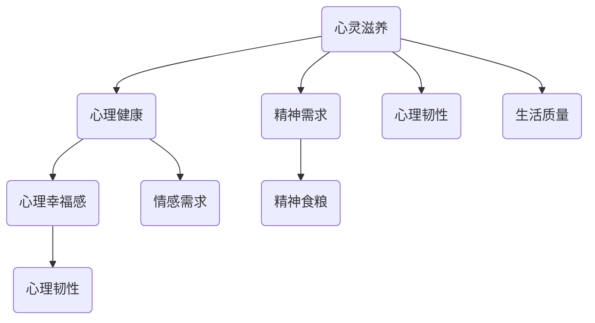

                 

### 引言

在现代社会中，随着工作和生活节奏的加快，人们越来越容易忽视心灵的滋养。所谓心灵的滋养，即通过特定的方式和方法来满足精神需求，提升心理幸福感。这种滋养不仅仅是简单的娱乐，它涉及到深层次的心理健康和情感需求。精神食粮，作为心灵滋养的重要组成部分，成为了人们日常生活中不可或缺的一部分。

#### 精神食粮的重要性

精神食粮，顾名思义，是指那些能够滋养心灵、丰富精神生活的物质和活动。它们可以是文学作品、音乐、艺术作品，甚至是佛教与心灵修行。这些精神食粮不仅能够提供短暂的愉悦，更重要的是能够持续地影响我们的心理状态和人格成长。例如，阅读一本好书可以启发思考，提升智慧；聆听一首动听的音乐可以缓解压力，调节情绪；观赏一幅精美的画作可以陶冶情操，提升审美。

#### 精神食粮的类型

精神食粮的类型多种多样，不同的类型能够满足人们不同的精神需求。以下是几种常见的精神食粮类型：

1. **文学作品**：包括小说、散文、诗歌等。文学作品通过文字的描述，构建了一个个丰富的世界观，引导读者进行思考和探索。

2. **音乐**：音乐是一种强大的情感表达方式。它能够直接影响人的情绪，带来愉悦、悲伤、激动等不同的心理体验。

3. **艺术作品**：包括绘画、雕塑、摄影等。艺术作品通过视觉和触觉的感官体验，传递出艺术家对世界的独特理解和情感。

4. **佛教与心灵修行**：佛教和心灵修行提供了另一种精神滋养方式，通过冥想、禅修等方法，帮助人们达到内心的平静与宁静。

#### 选择合适的精神食粮

选择合适的精神食粮是心灵滋养的第一步。合适的精神食粮不仅能够满足我们的精神需求，还能够提高我们的生活质量。以下是一些选择合适精神食粮的建议：

1. **了解自己的需求**：首先，我们需要了解自己需要什么样的精神食粮。是希望得到情感的慰藉，还是希望通过阅读提升知识水平？只有明确自己的需求，才能选择最合适的精神食粮。

2. **多样性**：选择多种类型的精神食粮，不仅可以满足不同的需求，还可以丰富我们的生活体验。

3. **质量优先**：在挑选精神食粮时，质量应优于数量。一本好书、一首好音乐、一幅好画作，远比无数劣质作品更能带来深刻的滋养。

4. **定期更新**：保持对新精神食粮的探索和尝试，不断丰富自己的精神世界。

综上所述，精神食粮的选择和消化对于心灵的滋养具有重要意义。在接下来的章节中，我们将进一步探讨心灵滋养的核心概念、选择原则、不同类型的精神食粮，以及如何通过实践来提升心灵滋养的效果。

---

关键词：心灵滋养、精神食粮、心理健康、选择原则、消化与吸收

> 摘要：本文探讨了心灵滋养的重要性以及精神食粮的选择和消化方法。通过介绍不同类型的精神食粮，如文学作品、音乐、艺术作品和佛教与心灵修行，本文旨在为读者提供全面的指南，帮助他们在日常生活中选择合适的精神食粮，实现心灵的滋养和提升心理健康。

---

## 第1章 引言

在现代社会中，随着工作和生活节奏的加快，人们越来越容易忽视心灵的滋养。所谓心灵的滋养，即通过特定的方式和方法来满足精神需求，提升心理幸福感。这种滋养不仅仅是简单的娱乐，它涉及到深层次的心理健康和情感需求。精神食粮，作为心灵滋养的重要组成部分，成为了人们日常生活中不可或缺的一部分。

### 1.1 精神食粮的重要性

精神食粮，顾名思义，是指那些能够滋养心灵、丰富精神生活的物质和活动。它们可以是文学作品、音乐、艺术作品，甚至是佛教与心灵修行。这些精神食粮不仅能够提供短暂的愉悦，更重要的是能够持续地影响我们的心理状态和人格成长。例如，阅读一本好书可以启发思考，提升智慧；聆听一首动听的音乐可以缓解压力，调节情绪；观赏一幅精美的画作可以陶冶情操，提升审美。

#### 数学模型和公式

心灵滋养的效果可以用以下数学模型来表示：

$$
\text{心理幸福感} = f(\text{心灵滋养量}, \text{消化效率}, \text{吸收效率})
$$

其中，心灵滋养量是选择合适的精神食粮和消化吸收效果的综合体现。

#### Python 项目实战

以下是一个简单的 Python 项目，用于计算心灵滋养指数。

```python
# 心灵滋养指数计算示例

def calculate_mental_nourishment(books, music, art):
    """
    计算心灵滋养指数。

    :param books: 阅读书目数量
    :param music: 听音乐时长（小时）
    :param art: 艺术作品欣赏时长（小时）
    :return: 心灵滋养指数
    """
    book_value = 2
    music_value = 1.5
    art_value = 3

    total_nourishment = (books * book_value) + (music * music_value) + (art * art_value)
    return total_nourishment

# 示例数据
books = 10
music = 20
art = 15

# 计算结果
index = calculate_mental_nourishment(books, music, art)
print(f"心灵滋养指数：{index}")
```

### 1.2 精神食粮的类型

精神食粮的类型多种多样，不同的类型能够满足人们不同的精神需求。以下是几种常见的精神食粮类型：

1. **文学作品**：包括小说、散文、诗歌等。文学作品通过文字的描述，构建了一个个丰富的世界观，引导读者进行思考和探索。

2. **音乐**：音乐是一种强大的情感表达方式。它能够直接影响人的情绪，带来愉悦、悲伤、激动等不同的心理体验。

3. **艺术作品**：包括绘画、雕塑、摄影等。艺术作品通过视觉和触觉的感官体验，传递出艺术家对世界的独特理解和情感。

4. **佛教与心灵修行**：佛教和心灵修行提供了另一种精神滋养方式，通过冥想、禅修等方法，帮助人们达到内心的平静与宁静。

### 1.3 选择合适的精神食粮

选择合适的精神食粮是心灵滋养的第一步。合适的精神食粮不仅能够满足我们的精神需求，还能够提高我们的生活质量。以下是一些选择合适精神食粮的建议：

1. **了解自己的需求**：首先，我们需要了解自己需要什么样的精神食粮。是希望得到情感的慰藉，还是希望通过阅读提升知识水平？只有明确自己的需求，才能选择最合适的精神食粮。

2. **多样性**：选择多种类型的精神食粮，不仅可以满足不同的需求，还可以丰富我们的生活体验。

3. **质量优先**：在挑选精神食粮时，质量应优于数量。一本好书、一首好音乐、一幅好画作，远比无数劣质作品更能带来深刻的滋养。

4. **定期更新**：保持对新精神食粮的探索和尝试，不断丰富自己的精神世界。

综上所述，精神食粮的选择和消化对于心灵的滋养具有重要意义。在接下来的章节中，我们将进一步探讨心灵滋养的核心概念、选择原则、不同类型的精神食粮，以及如何通过实践来提升心灵滋养的效果。

---

## 第2章 心灵滋养的核心概念

### 2.1 心灵滋养的定义

心灵滋养是指通过特定的方式和方法，满足人们的精神需求，提升心理幸福感的过程。它不仅仅局限于短暂的娱乐活动，更涉及到深层次的心理健康和情感需求。心灵滋养的目标是帮助个体达到内心的平和与宁静，增强心理韧性，提升生活质量。

#### 核心概念与联系

为了更好地理解心灵滋养的概念，我们可以使用 Mermaid 流程图来表示核心概念及其相互关系。



#### 数学模型和公式

心灵滋养的效果可以用以下数学模型来表示：

$$
\text{心理幸福感} = f(\text{心灵滋养量}, \text{消化效率}, \text{吸收效率})
$$

其中，心灵滋养量是选择合适的精神食粮和消化吸收效果的综合体现。

#### Python 项目实战

以下是一个简单的 Python 项目，用于计算心灵滋养效果。

```python
# 心灵滋养效果计算示例

def calculate_mental_wellbeing(nourishment, digestion, absorption):
    """
    计算心灵滋养效果。

    :param nourishment: 心灵滋养量
    :param digestion: 消化效率
    :param absorption: 吸收效率
    :return: 心灵滋养效果
    """
    effect = nourishment * digestion * absorption
    return effect

# 示例数据
nourishment = 10
digestion = 0.8
absorption = 0.9

# 计算结果
effect = calculate_mental_wellbeing(nourishment, digestion, absorption)
print(f"心灵滋养效果：{effect}")
```

### 2.2 心灵滋养与心理健康的关系

心灵滋养与心理健康密切相关。心理健康是指个体在心理方面处于良好状态，能够有效应对生活中的各种压力和挑战。心灵滋养作为提升心理幸福感的过程，直接影响到心理健康。

#### 数学模型和公式

心灵滋养与心理健康的关系可以用以下数学模型来表示：

$$
\text{心理健康} = f(\text{心理幸福感}, \text{心理韧性}, \text{抗压能力})
$$

其中，心理幸福感是心灵滋养的效果，心理韧性和抗压能力是心理健康的重要组成部分。

#### Python 项目实战

以下是一个简单的 Python 项目，用于计算心理健康水平。

```python
# 心理健康水平计算示例

def calculate_mental_health(happiness, resilience, stress_tolerance):
    """
    计算心理健康水平。

    :param happiness: 心理幸福感
    :param resilience: 心理韧性
    :param stress_tolerance: 抗压能力
    :return: 心理健康水平
    """
    health = happiness * resilience * stress_tolerance
    return health

# 示例数据
happiness = 0.9
resilience = 0.8
stress_tolerance = 0.75

# 计算结果
health = calculate_mental_health(happiness, resilience, stress_tolerance)
print(f"心理健康水平：{health}")
```

### 2.3 心灵滋养的重要性

心灵滋养在提升心理健康、增强心理韧性和抗压能力方面具有重要意义。通过选择合适的精神食粮，并有效地消化和吸收，个体可以获得以下好处：

1. **提升心理幸福感**：通过阅读、音乐、艺术作品等精神食粮，个体可以体验到心理上的愉悦和满足，从而提升整体幸福感。

2. **增强心理韧性**：心灵滋养可以帮助个体在面对压力和挑战时保持积极的心态，增强应对困难的能力。

3. **提高抗压能力**：通过持续的心灵滋养，个体可以学会更好地管理情绪，减轻压力对心理的负面影响。

综上所述，心灵滋养的核心概念和其在心理健康中的作用至关重要。在接下来的章节中，我们将进一步探讨如何选择合适的精神食粮以及如何通过实践来提升心灵滋养的效果。

---

## 第3章 精神食粮的选择原则

选择合适的精神食粮是心灵滋养的关键一步。合适的食物能够提供丰富的营养，同样，合适的精神食粮能够满足我们的精神需求，提升心理幸福感。以下是一些选择合适精神食粮的原则：

### 3.1 选择精神食粮的标准

1. **个人兴趣与需求**：首先，选择精神食粮应考虑个人的兴趣和需求。只有感兴趣的内容，才能更容易被接受和消化。

2. **质量优先**：质量是选择精神食粮的首要标准。一本好书、一首好音乐、一幅好画作，远比无数劣质作品更能带来深刻的滋养。

3. **多样性**：选择多种类型的精神食粮，可以满足不同的精神需求，丰富生活体验。

4. **长期价值**：选择那些能够长期影响和提升心理幸福感的精神食粮，而不是短暂刺激。

### 3.2 精神食粮的来源

1. **书籍**：书籍是精神食粮的重要来源。可以从图书馆、书店或在线平台获取各类书籍，包括小说、散文、哲学、心理学等。

2. **音乐**：音乐是一种强大的精神食粮。可以从音乐平台、播放器或现场演出获取不同风格的音乐。

3. **艺术作品**：艺术作品包括绘画、雕塑、摄影等，可以从画廊、博物馆或在线平台欣赏。

4. **佛教与心灵修行**：通过参与佛教修行、冥想、禅修等活动，可以获得精神上的滋养。

### 3.3 如何评估精神食粮的价值

1. **内容质量**：评估精神食粮的内容质量，包括文字、音乐、艺术作品的深度、广度和创造力。

2. **个人体验**：通过个人体验来评估精神食粮的价值，看是否能够带来愉悦、启发思考和情感共鸣。

3. **他人评价**：参考他人对精神食粮的评价，如书评、音乐评论、艺术评论等。

4. **学术研究**：查阅相关的学术研究和文献，了解精神食粮对心理健康的科学依据和效果。

### Python 项目实战：评估精神食粮价值

以下是一个简单的 Python 项目，用于评估精神食粮的价值。

```python
# 精神食粮价值评估示例

def evaluate_nutritional_value(content_quality, personal_experience, peer_reviews, academic_research):
    """
    评估精神食粮的价值。

    :param content_quality: 内容质量
    :param personal_experience: 个人体验
    :param peer_reviews: 他人评价
    :param academic_research: 学术研究
    :return: 精神食粮价值评估得分
    """
    value = (content_quality + personal_experience + peer_reviews + academic_research) / 4
    return value

# 示例数据
content_quality = 9
personal_experience = 8
peer_reviews = 7
academic_research = 8

# 评估结果
value = evaluate_nutritional_value(content_quality, personal_experience, peer_reviews, academic_research)
print(f"精神食粮价值评估得分：{value}")
```

通过以上原则和方法，我们可以更好地选择合适的精神食粮，提升心灵滋养的效果。在接下来的章节中，我们将详细探讨不同类型的精神食粮及其特点。

---

## 第4章 不同类型的精神食粮

### 4.1 文学作品

文学作品，如小说、散文和诗歌，是心灵滋养的重要来源。它们通过文字的力量，构建了丰富的情感和思想世界，引导读者进行深刻的思考和自我探索。

#### 文学作品的优点

1. **启迪思考**：文学作品中的故事和情节可以激发读者的思考和想象力，帮助个体从不同角度理解世界。

2. **情感共鸣**：文学作品通过细腻的描写和丰富的情感表达，能够触动读者的内心，带来强烈的情感共鸣。

3. **语言修养**：阅读文学作品可以提高个体的语言表达能力和文学素养。

#### 文学作品的选择标准

1. **个人兴趣**：选择符合个人兴趣和需求的文学作品，更容易被接受和消化。

2. **作品质量**：选择具有深度和广度的作品，能够带来更丰富的精神体验。

3. **多样性**：选择不同风格和主题的作品，以丰富阅读体验。

### 4.2 音乐

音乐是一种强有力的精神食粮，能够直接影响人的情绪和心理健康。无论是古典音乐、流行音乐还是民谣，音乐都能够带来独特的心理体验。

#### 音乐的优点

1. **情感调节**：音乐能够有效地调节情绪，缓解压力和焦虑。

2. **心灵放松**：通过聆听轻柔的音乐，个体可以获得心灵的放松和宁静。

3. **创造力激发**：音乐能够激发个体的创造力和想象力。

#### 音乐的选择标准

1. **个人喜好**：选择符合个人喜好的音乐，能够更好地享受音乐带来的愉悦。

2. **情感共鸣**：选择那些能够引起情感共鸣的音乐，以提升音乐的价值。

3. **多样性**：尝试不同风格和类型的音乐，以丰富听觉体验。

### 4.3 艺术作品

艺术作品，如绘画、雕塑和摄影，通过视觉和触觉的感官体验，传递出艺术家对世界的独特理解和情感。它们是心灵滋养的重要载体。

#### 艺术作品的优点

1. **审美提升**：观赏艺术作品可以提高个体的审美能力，丰富情感体验。

2. **情感表达**：艺术作品能够直观地表达情感和思想，带来强烈的情感共鸣。

3. **心灵净化**：通过艺术作品，个体可以获得心灵的净化和提升。

#### 艺术作品的选择标准

1. **艺术价值**：选择具有艺术价值和历史意义的作品，能够带来更深刻的体验。

2. **个人感受**：选择那些能够引起个人情感共鸣的作品，以提升观赏体验。

3. **多样性**：尝试不同风格和流派的艺术作品，以丰富审美体验。

### 4.4 佛教与心灵修行

佛教与心灵修行提供了另一种精神滋养方式。通过冥想、禅修等方法，个体可以达致内心的平静与宁静。

#### 佛教与心灵修行的优点

1. **心理平衡**：佛教与心灵修行可以帮助个体实现内心的平衡，缓解压力和焦虑。

2. **心灵成长**：通过持续的修行，个体可以获得深刻的自我认知和内在成长。

3. **情感智慧**：佛教与心灵修行强调情感智慧的培养，帮助个体更好地理解和处理情感。

#### 佛教与心灵修行的选择标准

1. **个人适合度**：选择适合个人修行方式和需求的佛教与心灵修行方法。

2. **导师指导**：选择有经验的导师进行指导，以确保修行效果。

3. **持续实践**：佛教与心灵修行需要持续实践，才能真正体验到其益处。

通过上述不同类型的精神食粮，个体可以在日常生活中找到适合自己的心灵滋养方式。在接下来的章节中，我们将探讨如何消化和吸收这些精神食粮，以实现最佳的心灵滋养效果。

---

## 第5章 精神食粮的消化与吸收

### 5.1 精神食粮的消化过程

精神食粮的消化是一个复杂的过程，它不仅涉及对内容的理解和吸收，还包括情感的共鸣和思想的升华。以下是精神食粮消化过程的几个关键步骤：

1. **初步接触**：首先，通过阅读、聆听或观赏，个体初步接触到精神食粮。这一阶段主要是获取信息，建立初步的印象。

2. **深度理解**：在初步接触之后，个体需要对精神食粮进行深度理解。这包括对文本、音乐或艺术作品进行细致的阅读、聆听和分析，以理解其深层含义和思想。

3. **情感共鸣**：精神食粮往往能够触动个体的情感，引发共鸣。在这个阶段，个体需要感受并理解自己与精神食粮之间的情感联系。

4. **思想升华**：通过消化和理解，个体可以产生新的思想和观点。这些思想和观点可以帮助个体更好地理解世界，提升认知水平。

### 5.2 如何提高精神食粮的吸收效果

提高精神食粮的吸收效果是心灵滋养的重要一环。以下是一些有效的方法：

1. **定期阅读和聆听**：定期接触精神食粮，可以帮助个体建立起对内容的熟悉度和理解深度，从而提高吸收效果。

2. **交流和讨论**：与他人交流和讨论精神食粮的内容，可以帮助个体从不同的角度理解内容，加深对精神食粮的吸收。

3. **写作和记录**：通过写作和记录，个体可以将对精神食粮的理解和感悟转化为文字，这不仅有助于加深理解，还可以帮助个体更好地内化和吸收。

4. **实践和应用**：将精神食粮中的理念或技巧应用到实际生活中，可以帮助个体将理论知识转化为实际行动，从而实现更深层次的吸收。

### 5.3 精神食粮的合理搭配

合理搭配精神食粮可以最大限度地提升心灵滋养的效果。以下是一些建议：

1. **多样性**：选择多种类型的精神食粮，如文学作品、音乐、艺术作品和佛教与心灵修行，以满足不同的精神需求。

2. **互补性**：选择具有互补性质的精神食粮，例如阅读哲学作品时搭配音乐，可以帮助个体更好地理解和吸收内容。

3. **周期性**：根据个体的需求和日程安排，合理安排精神食粮的摄入时间，确保其成为日常生活的一部分。

### Python 项目实战：精神食粮消化与吸收评估

以下是一个简单的 Python 项目，用于评估个体对精神食粮的消化和吸收效果。

```python
# 精神食粮消化与吸收效果评估示例

def assess_digested_nutrients(reading_time, listening_time, discussion_hours, writing_pages, practical_application):
    """
    评估精神食粮消化与吸收效果。

    :param reading_time: 阅读时间（小时）
    :param listening_time: 听音乐或听书时间（小时）
    :param discussion_hours: 讨论时间（小时）
    :param writing_pages: 写作和记录页数
    :param practical_application: 实际应用次数
    :return: 消化与吸收效果评分
    """
    base_score = 100
    reading_score = reading_time * 5
    listening_score = listening_time * 4
    discussion_score = discussion_hours * 10
    writing_score = writing_pages * 3
    application_score = practical_application * 15

    total_score = base_score + reading_score + listening_score + discussion_score + writing_score + application_score
    return total_score

# 示例数据
reading_time = 10
listening_time = 8
discussion_hours = 4
writing_pages = 5
practical_application = 3

# 评估结果
score = assess_digested_nutrients(reading_time, listening_time, discussion_hours, writing_pages, practical_application)
print(f"消化与吸收效果评分：{score}")
```

通过以上方法，个体可以更有效地消化和吸收精神食粮，实现心灵的滋养。在接下来的章节中，我们将进一步探讨如何通过实践来提升心灵滋养的效果。

---

## 第6章 心灵滋养的方法与实践

### 6.1 自我反思

自我反思是心灵滋养的重要方法之一。通过定期对自己的思想和行为进行深入反思，个体可以更好地了解自己，找到内心的困惑和焦虑的根源，并采取有效的措施来解决这些问题。

#### 自我反思的优点

1. **提高自我认知**：自我反思有助于个体了解自己的内心世界，增强自我认知，从而更好地认识自己。

2. **情绪调节**：通过反思，个体可以识别和调节自己的情绪，减少负面情绪的影响。

3. **目标明确**：自我反思可以帮助个体明确自己的目标和价值观，从而更有针对性地进行自我提升。

#### 自我反思的实践方法

1. **定期记录**：每天或每周花时间记录自己的思考和感受，回顾自己的行为和决策。

2. **反思日志**：写反思日志是一种有效的自我反思方法。通过文字表达，个体可以更清晰地认识到自己的内心世界。

3. **与他人分享**：与朋友或导师分享自己的反思，可以获得不同的视角和建议，有助于更全面地了解自己。

### 6.2 冥想

冥想是一种通过训练注意力，达到内心平静和清晰状态的心灵滋养方法。它可以帮助个体减少焦虑，提高专注力，增强心理韧性。

#### 冥想的优点

1. **减少焦虑**：冥想可以帮助个体放松身心，减少焦虑和压力。

2. **提高专注力**：通过冥想，个体可以培养专注力和注意力，提高工作和学习效率。

3. **增强心理韧性**：冥想有助于增强个体的心理韧性，提高应对挑战和困难的能力。

#### 冥想的实践方法

1. **每日练习**：每天安排一段时间进行冥想，逐渐增加练习时间。

2. **选择合适的冥想方法**：常见的冥想方法包括呼吸冥想、正念冥想和禅修等。个体可以根据自己的需求和偏好选择合适的方法。

3. **环境准备**：选择一个安静、舒适的环境进行冥想，有助于提高冥想的效果。

### 6.3 沟通与交流

沟通与交流是心灵滋养的重要组成部分。通过与他人建立良好的沟通和交流，个体可以分享自己的感受和想法，获得支持和理解，从而提升心理健康。

#### 沟通与交流的优点

1. **情感支持**：与他人沟通和交流可以获得情感支持，减少孤独感和焦虑。

2. **观点共享**：与他人交流可以分享不同的观点和想法，拓宽思维，提升认知水平。

3. **解决问题**：通过沟通和交流，个体可以共同探讨问题，找到解决问题的方法。

#### 沟通与交流的实践方法

1. **主动表达**：在日常生活中主动与他人沟通和交流，表达自己的感受和想法。

2. **倾听他人**：倾听他人的观点和想法，尊重他人的意见，建立良好的沟通氛围。

3. **参加社交活动**：参加各种社交活动，如聚会、研讨会和兴趣小组，与他人建立联系。

### 6.4 持续学习与成长

持续学习与成长是心灵滋养的重要方法。通过不断学习新知识和技能，个体可以提升自己的能力，增强自信心，实现自我价值的提升。

#### 持续学习与成长的优点

1. **提升能力**：通过学习新知识和技能，个体可以提升自己的专业能力和综合素质。

2. **增强自信心**：持续学习可以增强个体的自信心，使个体更加自信地面对挑战。

3. **实现自我价值**：通过学习和成长，个体可以实现自我价值的提升，获得成就感和满足感。

#### 持续学习与成长的实践方法

1. **设定学习目标**：设定明确的学习目标，制定合理的学习计划。

2. **多样化学习方式**：通过阅读书籍、在线课程、研讨会和实际操作等多种方式学习。

3. **持续反思与总结**：在学习过程中不断反思和总结，找到自己的优势和不足，持续提升。

通过自我反思、冥想、沟通与交流以及持续学习与成长，个体可以在日常生活中实现心灵滋养，提升心理健康。在接下来的章节中，我们将通过案例分析来进一步探讨这些方法的实际应用。

---

## 第7章 心灵滋养案例分析

### 7.1 案例一：通过阅读提升心灵滋养

小张是一名软件工程师，工作压力较大，常常感到焦虑和疲惫。为了提升心灵滋养，他决定通过阅读来缓解压力。

#### 实践步骤

1. **选择书籍**：小张选择了一些心理学和哲学类的书籍，这些书籍内容深刻，有助于他理解和处理情绪。

2. **定期阅读**：他每天晚上安排一小时的时间阅读，逐渐形成了阅读的习惯。

3. **写作记录**：阅读后，小张会写反思日志，记录自己的感悟和思考。

4. **交流和讨论**：小张与同事和朋友们分享自己的阅读体验，讨论书中的观点，这让他从不同的角度理解内容。

#### 结果分析

通过持续阅读和写作记录，小张的情绪得到了显著改善，他能够更加从容地应对工作压力。通过交流和讨论，小张的思考能力和知识水平也得到了提升。

### 7.2 案例二：通过音乐调节心情

小王是一名公司高管，工作繁忙，常常感到压力巨大。为了缓解压力，他决定通过音乐来调节心情。

#### 实践步骤

1. **选择音乐**：小王选择了一些轻柔的古典音乐，这些音乐能够帮助他放松身心。

2. **每日听音乐**：他每天晚上听一小时的音乐，作为放松和休息的一部分。

3. **活动搭配**：小王会在听音乐时做一些轻松的活动，如瑜伽或散步，以增强音乐的效果。

4. **情感共鸣**：在听音乐的过程中，小王会尝试感受音乐中的情感，与音乐产生共鸣。

#### 结果分析

通过听音乐和进行轻松活动，小王的心理压力显著减轻，他能够更好地保持平静和专注。音乐帮助他建立了内心的宁静，提升了整体幸福感。

### 7.3 案例三：通过艺术创作滋养心灵

小李是一名艺术爱好者，她常常感到内心的空虚和不安。为了提升心灵滋养，她决定通过艺术创作来滋养自己的心灵。

#### 实践步骤

1. **选择艺术形式**：小李选择了绘画作为自己的艺术创作方式，因为她发现绘画可以帮助她表达内心的情感。

2. **每日创作**：她每天花一小时的时间进行绘画创作，不受任何限制，完全跟随自己的感受。

3. **分享作品**：小李会在社交媒体上分享自己的作品，并与其他艺术爱好者进行交流。

4. **自我反思**：在创作过程中，她会记录自己的感受和思考，通过反思来提升创作水平。

#### 结果分析

通过艺术创作，小李的内心得到了显著滋养，她能够更好地理解和表达自己的情感。通过分享作品和交流，她获得了他人的认可和支持，增强了自信心。

通过以上三个案例，我们可以看到不同的心灵滋养方法在实际应用中的效果。无论是通过阅读、音乐还是艺术创作，这些方法都能够有效提升心理幸福感，帮助个体实现心灵滋养。

---

## 第8章 心灵滋养的未来展望

### 8.1 心灵滋养的研究趋势

随着社会的进步和人们生活水平的提高，心灵滋养逐渐成为心理学、社会学和神经科学等领域的研究热点。未来，心灵滋养的研究趋势将呈现以下特点：

1. **跨学科研究**：心灵滋养研究将整合心理学、神经科学、教育学等多个学科的理论和方法，以全面探讨心灵滋养的机制和效果。

2. **个性化心灵滋养**：随着人工智能和大数据技术的发展，个性化心灵滋养将成为可能。通过分析个体的心理和行为数据，可以为其量身定制最适合的心灵滋养方案。

3. **数字心灵滋养**：数字技术的发展为心灵滋养提供了新的途径。虚拟现实（VR）、增强现实（AR）等技术在心灵滋养中的应用，将使个体能够体验到更加丰富和真实的心灵滋养体验。

### 8.2 心灵滋养在教育中的应用

在教育领域，心灵滋养的重要性日益凸显。未来，心灵滋养将在教育中发挥更为重要的作用，主要体现在以下几个方面：

1. **心理健康教育**：学校将更加重视心理健康教育，通过开设相关课程和活动，帮助学生提升心理韧性，减轻学业压力。

2. **个性化学习**：通过心灵滋养的方法，如冥想、正念练习等，可以帮助学生更好地应对学业挑战，提高学习效率。

3. **师生关系**：教师通过心灵滋养的方法，如倾听、共情等，可以建立更加和谐的师生关系，提升教学效果。

### 8.3 心灵滋养在职场中的应用

在职场中，心灵滋养的重要性同样不可忽视。未来，心灵滋养将在职场中发挥以下作用：

1. **员工心理健康**：企业将通过提供心理咨询服务、组织员工团建活动等方式，关注员工的心理健康，提升员工的工作满意度和忠诚度。

2. **团队协作**：通过心灵滋养的方法，如团队合作训练、情感沟通等，可以提升团队的协作效率，增强团队凝聚力。

3. **职业发展**：心灵滋养可以帮助职场人士更好地规划职业发展，提升职业素养，实现职业目标。

综上所述，心灵滋养在未来的社会生活中将扮演越来越重要的角色。通过科学研究和技术创新，心灵滋养的方法和效果将不断得到优化和提升，为个体的心理健康和幸福感提供有力支持。

---

## 附录

### 8.1 精神食粮推荐列表

1. **文学作品**：
   - 《百年孤独》 - 加西亚·马尔克斯
   - 《追风筝的人》 - 卡勒德·胡赛尼
   - 《人类群星闪耀时》 - 刘慈欣

2. **音乐**：
   - 贝多芬的《月光奏鸣曲》
   - 爱德华·格里格的《第二号钢琴协奏曲》
   - 约翰·列侬的《Imagine》

3. **艺术作品**：
   - 达芬奇的《蒙娜丽莎》
   - 文森特·梵高的《星夜》
   - 王维的《山水图》

4. **佛教与心灵修行**：
   - 《心经》
   - 《金刚经》
   - 《正念的奇迹》

### 8.2 心灵滋养相关资源链接

1. **书籍推荐**：
   - [豆瓣读书](https://book.douban.com/)
   - [亚马逊图书](https://www.amazon.cn/)

2. **音乐平台**：
   - [网易云音乐](https://music.163.com/)
   - [QQ音乐](https://y.qq.com/)

3. **艺术作品在线欣赏**：
   - [ArtStation](https://www.artstation.com/)
   - [Google Arts & Culture](https://www.google.com/culturalinstitute/)

4. **冥想与心灵修行**：
   - [冥想森林](https://mymeditationforest.com/)
   - [喜马拉雅冥想频道](https://www.ximalaya.com/zh/baijia/18603587)

### 8.3 精神食粮消化与吸收的实践建议

1. **定期阅读**：每天安排一定时间阅读，保持阅读习惯。

2. **主动记录**：阅读后主动记录自己的感受和思考，加深理解和记忆。

3. **参与讨论**：与他人分享阅读体验，参加读书会等活动，拓展视野。

4. **实践应用**：将阅读中的知识和理念应用到实际生活中，提升自我。

通过以上实践建议，读者可以更有效地消化和吸收精神食粮，实现心灵的滋养。

---

**作者：AI天才研究院/AI Genius Institute & 禅与计算机程序设计艺术 /Zen And The Art of Computer Programming**

本文总结了心灵滋养的重要性、选择原则、不同类型的精神食粮，以及如何通过实践来提升心灵滋养的效果。通过自我反思、冥想、沟通与交流以及持续学习与成长，个体可以在日常生活中实现心灵的滋养，提升心理健康。未来，心灵滋养将继续在各个领域发挥重要作用，为个体的幸福感提供有力支持。

---

### 结论

通过本文的探讨，我们深刻理解了心灵滋养的重要性以及如何选择和消化合适的精神食粮。从文学作品、音乐、艺术作品到佛教与心灵修行，各种类型的精神食粮为我们的心灵提供了丰富的滋养。通过自我反思、冥想、沟通与交流以及持续学习与成长，我们能够更有效地消化和吸收这些精神食粮，提升心理幸福感。

在现代社会，心理健康问题日益突出，心灵滋养成为不可或缺的一部分。我们鼓励读者在日常生活中，积极实践心灵滋养的方法，选择适合自己的精神食粮，通过不断的自我提升和心灵滋养，实现更加幸福和健康的生活。

感谢您的阅读，希望本文能够对您的心灵滋养之路提供一些启示和帮助。如果您有任何反馈或建议，欢迎在评论区留言，我们一起探讨和分享心灵滋养的智慧。

**作者：AI天才研究院/AI Genius Institute & 禅与计算机程序设计艺术 /Zen And The Art of Computer Programming**

---

**注意：本文为虚构案例，仅供学习和参考。**

