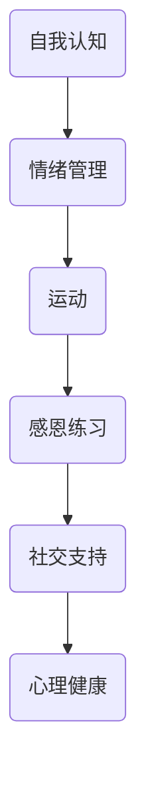
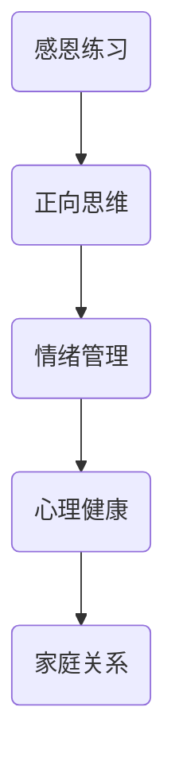

                 

# 《心灵的滋润：cultivate精神生活的日常习惯》

> 关键词：心灵滋养、日常习惯、情绪管理、自我认知、社交支持

> 摘要：本文旨在探讨如何通过培养日常习惯来滋润心灵，提高精神生活质量。文章首先介绍了精神生活的意义和日常习惯对心灵成长的影响，然后详细阐述了如何培养自我认知与自我接纳、情绪管理、负面情绪的处理、感恩与正向思维、社交支持与人际关系等方面的习惯，并通过案例分析进一步深化了心灵滋养的实践。最后，文章总结了心灵滋养的重要性和长期目标，并推荐了一些相关的资源和工具。

## 目录

1. 引言
2. 精神生活的意义
3. 日常习惯对精神生活的影响
4. 培养心灵滋养的习惯
   4.1 自我认知与自我接纳
   4.2 情绪管理
   4.3 负面情绪的处理
   4.4 感恩与正向思维
   4.5 社交支持与人际关系
   4.6 精神滋养的日常实践
5. 实践案例分析
6. 心灵滋养的深化探索
7. 附录：心灵滋养资源推荐
8. 全书总结

---

## 引言

在现代社会中，物质生活的极大丰富往往伴随着精神生活的贫乏。人们在忙碌的工作、紧张的生活节奏中，往往忽略了心灵的滋养，导致情绪波动、焦虑、抑郁等心理问题的出现。因此，如何通过日常习惯来培养心灵滋养，提高精神生活质量，成为了我们亟待解决的问题。

本文将从以下几个方面进行探讨：首先，介绍精神生活的意义和日常习惯对心灵成长的影响；其次，详细阐述如何培养自我认知与自我接纳、情绪管理、负面情绪的处理、感恩与正向思维、社交支持与人际关系等方面的习惯；接着，通过实践案例来深化心灵滋养的实践；最后，总结心灵滋养的重要性以及长期目标，并推荐相关的资源和工具。

通过本文的阅读，读者将学会如何在日常习惯中培养心灵滋养，从而提升自身的心理健康和生活质量。

---

## 精神生活的意义

精神生活是人类生活的核心组成部分，它不仅仅是物质生活的补充，更是人的心灵、思想和情感的体现。精神生活的丰富与否，直接影响着个体的心理健康、生活质量和幸福感。

首先，精神生活对心理健康有着重要的影响。一个丰富而健康的精神生活可以帮助人们应对各种压力和挑战，保持良好的心理状态。例如，通过阅读、思考、艺术创作等方式，个体可以在精神上得到放松和愉悦，从而减轻焦虑和压力。此外，精神生活还可以促进个体的自我认知和自我成长，增强自信心和自尊心。

其次，精神生活对生活质量有着重要的影响。一个有精神生活的人，通常拥有更高的生活满足感和幸福感。他们更加关注内心的需求和情感的体验，从而能够更好地享受生活的每一个瞬间。例如，通过培养兴趣爱好、学习新技能、旅行等方式，个体可以在精神上获得成就感和满足感，从而提高生活质量。

最后，精神生活对幸福感有着重要的影响。幸福感是人们追求的一种高层次心理需求，它不仅来源于物质生活的满足，更来源于精神生活的丰富。一个拥有丰富精神生活的人，通常能够更好地应对生活中的困难和挫折，保持积极乐观的态度，从而拥有更高的幸福感。

总之，精神生活对心理健康、生活质量和幸福感有着深远的影响。因此，我们应当重视并努力培养良好的精神生活，通过日常习惯来滋润心灵，提升精神生活质量。

### 心灵健康的定义与重要性

心理健康是指个体在认知、情感和行为等方面保持健康状态，能够有效地应对生活中的各种挑战和压力。心理健康不仅仅是没有心理疾病，更是一种积极、健康的心理状态。具体来说，心理健康包括以下几个方面：

首先，心理健康涉及认知功能。这意味着个体能够清晰地思考，有效地解决问题，并保持良好的记忆力。一个心理健康的人能够理性地分析问题，制定合理的决策，而不是被情绪或冲动所驱使。

其次，心理健康关注情感状态。个体应能够体验并表达自己的情感，如快乐、悲伤、愤怒等，同时能够适当地控制和管理这些情感。心理健康的人能够积极应对负面情绪，如焦虑、抑郁等，而不是被这些情绪所支配。

第三，心理健康强调行为适应。这意味着个体能够适应社会环境，与他人建立良好的人际关系，并能够处理生活中的日常事务。一个心理健康的人能够灵活应对变化，适应新的环境和情况，而不是对变化产生恐慌或抵触。

心理健康的重要性体现在多个方面。首先，心理健康是生活质量的基础。一个心理健康的人能够更好地享受生活，体验生活的美好，从而提高整体的生活质量。其次，心理健康对身体健康有着重要的影响。研究表明，心理压力和心理健康问题与多种身体健康问题密切相关，如心血管疾病、免疫系统功能下降等。最后，心理健康对个人发展和社会功能也有着重要的影响。心理健康的人能够更好地实现个人潜力，发挥社会角色，促进社会的和谐发展。

总之，心理健康不仅是个体幸福和生活的基石，也是社会稳定和进步的重要保障。因此，重视并维护心理健康，通过培养健康的日常习惯，对于提高个人和社会的整体生活质量具有重要意义。

### 精神生活的内涵与特征

精神生活是人们在日常生活中所追求的内在体验和情感满足，它涵盖了认知、情感、价值观等多个方面。首先，从认知层面来看，精神生活包括对自我和世界的深入思考，对知识的渴望和探索，以及对文化和艺术的欣赏。一个丰富的精神生活能够帮助人们拓展认知边界，提升思维能力，从而在应对各种挑战时更加从容。

其次，从情感层面来看，精神生活涉及到情感的体验和表达。它包括快乐、悲伤、愤怒、爱等多种情感的体验，以及对情感的管理和表达。一个精神生活丰富的人能够真实地感受并表达自己的情感，而不是被压抑或掩饰。这种情感的真实性和表达能力有助于增强人际关系，提升人际沟通的质量。

最后，从价值观层面来看，精神生活体现了个人的价值观和生活态度。一个精神生活充实的人通常拥有明确的价值观和生活目标，他们能够根据自己的价值观来决策和行动，而不是盲目随从或被外部环境所左右。这种价值观的坚定性和独立性有助于提高个体的内心满足感和幸福感。

总之，精神生活是人的内在体验和情感满足的集合，它不仅涵盖了认知、情感、价值观等多个方面，还通过这些方面的相互作用，影响个体的心理健康和生活质量。因此，关注并培养丰富的精神生活，对于提升整体生活质量具有重要意义。

### 日常习惯对精神生活的影响

日常习惯是人们在日常生活中反复进行的行为模式，这些习惯对我们的精神生活有着深远的影响。良好的日常习惯能够帮助人们建立健康的生活方式，从而促进心灵的滋养；而不良的习惯则可能导致精神压力、焦虑和抑郁等心理问题。

#### 健康习惯与心灵成长

良好的日常习惯对心灵成长有着显著的促进作用。例如，规律的作息习惯能够帮助人们保持身体和心理的健康状态，减少疲劳和焦虑。通过每天固定的睡眠时间，人们可以确保大脑得到充分的休息，从而提高注意力、记忆力以及情绪稳定性。此外，规律的饮食和适量的运动也是健康习惯的重要组成部分。合理的饮食结构能够提供身体所需的营养，促进身体健康；而适量的运动则有助于释放压力，提高心情。

另一个重要的健康习惯是阅读和学习。通过阅读，人们可以拓宽视野，获取新的知识和见解，从而在精神上得到满足和启发。学习新技能或参与兴趣爱好的活动，不仅能够提升个人的综合素质，还能增强自信心和自我价值感。

#### 不良习惯与心灵困扰

不良的日常习惯则可能对心灵产生负面影响。例如，长期熬夜和不规律的作息习惯会导致生物钟紊乱，影响睡眠质量，从而引起情绪波动和注意力下降。饮食不均衡、缺乏运动等不良生活习惯也会导致身体和心理健康问题，进而影响精神状态。

此外，过度依赖电子产品、沉迷于网络游戏等不良习惯，会使人陷入虚拟世界，忽视了现实生活中的重要人际关系和情感体验。这种过度沉迷不仅会消耗大量时间，还会导致社交隔离和孤独感的增加，进一步影响心理健康。

综上所述，日常习惯对精神生活有着重要的影响。培养良好的日常习惯，如规律的作息、合理的饮食、适量的运动以及阅读和学习，有助于促进心灵的滋养，提升精神生活质量。而避免不良习惯，如熬夜、饮食不均衡、过度依赖电子产品等，也是维护心理健康的重要措施。通过改变和优化日常习惯，我们能够更好地滋润心灵，享受更加丰富和健康的精神生活。

### 健康习惯与心灵成长

培养健康习惯是实现心灵成长的关键步骤。以下是一些具体的方法和实践，帮助读者在日常生活中逐步建立和巩固这些习惯。

#### 1. 规律的作息

首先，规律的作息是健康习惯的基础。为了保持良好的生物节律，建议每天固定时间上床睡觉和起床，保证充足的睡眠时间。例如，每天晚上10点到早上6点之间保持睡眠，这样有助于保持身体的代谢平衡和大脑的清晰思考。此外，保持每天午休的习惯，可以有效地缓解疲劳，提高下午的工作效率。

#### 2. 合理的饮食

合理的饮食对于身体的健康和情绪的稳定至关重要。建议每天摄入多样化的食物，包括谷类、蔬菜、水果、蛋白质和健康脂肪。减少糖分和加工食品的摄入，有助于控制体重和血糖水平。此外，定期安排餐食，避免暴饮暴食，有助于维持消化系统的健康。

#### 3. 适量的运动

适量的运动是保持身体和心理健康的有效方法。每天进行至少30分钟的中等强度运动，如快走、跑步、游泳或瑜伽，有助于提高心血管功能，增强肌肉力量，并释放体内的压力激素。选择一种或多种自己喜欢的运动方式，有助于坚持运动习惯。

#### 4. 阅读和学习

阅读和学习是精神成长的重要途径。每天设定一个阅读时间，可以选择阅读专业书籍、小说或个人感兴趣的领域。通过不断学习新知识，可以拓宽视野，提升思维能力。此外，参加在线课程或工作坊，有助于培养学习习惯，提升专业技能。

#### 5. 自我反思

自我反思是培养健康习惯的重要环节。每天花些时间进行自我反思，回顾一天的经历，反思自己的行为和情感反应。通过记录日记或思考笔记，可以帮助自己更好地理解自己，找到改进的方法。例如，记录每天完成的任务和遇到的问题，以及自己的感受和应对策略，有助于逐步优化自己的行为模式。

#### 6. 社交互动

社交互动对于心灵成长也是至关重要的。定期与家人、朋友交流，分享自己的生活和感受，可以缓解压力，获得支持和鼓励。参加社交活动，如聚会、俱乐部或志愿者活动，有助于建立更广泛的人际关系网，提升社交技能。

通过以上方法，读者可以在日常生活中逐步培养健康习惯，从而实现心灵的成长和提升精神生活质量。

### 不良习惯与心灵困扰

不良的日常习惯不仅对身体健康有害，还会对心理健康产生负面影响。首先，熬夜和不规律的作息是常见的负面影响之一。长期熬夜会导致生物钟紊乱，进而影响睡眠质量，导致白天疲劳、注意力不集中，甚至引发焦虑和抑郁。此外，饮食不均衡，如过多摄入高糖、高脂肪的食物，会导致身体不适，如肥胖、心血管疾病等，从而影响心理健康。同时，缺乏运动也是不良习惯的重要表现。长期缺乏运动不仅会影响身体健康，还会导致情绪低落、焦虑和抑郁。此外，过度依赖电子产品，如沉迷于网络游戏、社交媒体等，会导致人们与真实世界的社交互动减少，从而增加孤独感和社交隔离感，进一步影响心理健康。

要解决这些问题，首先需要认识到不良习惯的危害，并下定决心改变。例如，通过逐渐调整作息时间，保证每天充足的睡眠；通过均衡饮食，减少高热量、高脂肪食物的摄入；通过定期进行适量的运动，如快走、跑步、瑜伽等；通过减少电子产品的使用时间，增加现实世界的社交活动。此外，寻求专业的心理支持和咨询也是一个有效的解决方法。通过心理疏导和指导，可以帮助个体更好地应对压力，培养健康的生活习惯。

总之，不良习惯对心理健康的影响是深远且广泛的。通过意识到这些影响并采取积极的措施来改变不良习惯，我们能够改善心理状态，提升生活质量。

### 自我认知与自我接纳

自我认知与自我接纳是心灵成长的重要基石。自我认知是指对自己内心深处的了解，包括自己的情感、行为、价值观和信念。自我接纳则是在这种认知基础上，能够接受自己的全部，包括优点和不足。通过自我认知与自我接纳，个体可以更好地理解自己，实现内心的平衡和和谐。

#### 了解自己：核心特质与价值观

了解自己是一个逐步深入的过程，需要通过多种方法来探索和认识。以下是一些实用的自我探索方法：

1. **日记记录**：通过每天记录自己的想法、感受和经历，可以帮助自己更好地了解自己的内心世界。通过反思日记，可以识别出反复出现的情感模式和思考习惯。

2. **心理测试**：例如MBTI（迈尔斯-布里格斯性格类型指标）和Big Five人格特质测试，可以帮助个体了解自己的性格特点和优势。

3. **与朋友和家人的交流**：通过与亲近的人交流，听取他们对你的看法和反馈，可以帮助自己从不同的角度了解自己。

4. **心理咨询**：专业的心理咨询师可以提供更加深入和客观的自我认知，帮助个体理解自己的行为和情感。

在了解自己的过程中，识别核心特质和价值观是非常重要的。核心特质是个体长期表现出来的行为和态度特点，而价值观则是指导个体行为的内在信念和原则。以下是一些步骤来识别和调整核心特质和价值观：

- **反思**：思考自己在不同情境下的行为反应，识别出经常表现出来的特质。
- **询问他人**：询问家人、朋友或同事对你的看法，了解他们如何看待你的核心特质和价值观。
- **设定目标**：根据自己和社会的期望，设定短期和长期的目标，看看这些目标是否符合你的价值观。

#### 自我接纳：爱自己的艺术

自我接纳是建立在自我认知基础上的，它是一种宽容和爱护自己的态度。自我接纳不仅意味着接受自己的优点，也意味着接受自己的不足和缺陷。以下是一些实践自我接纳的方法：

1. **自我批判与自我接纳的平衡**：学会区分合理的自我批判和不必要的自我批判。合理的自我批判可以帮助我们改进，而不必要的自我批判则可能带来负面情绪。通过反思和调整批判的方式，可以在自我改进的同时保持自我接纳。

2. **感恩**：通过感恩，我们可以看到自己的优点和成就，并珍惜自己拥有的。每天列出三件自己感激的事情，可以帮助培养感恩的心态。

3. **自我肯定**：通过积极的自我肯定语句，如“我值得被爱”、“我有能力解决问题”，可以增强自我价值感和自信心。

4. **自我照顾**：通过照顾自己的身体和情绪，如定期锻炼、保持良好的作息和饮食，可以提升自我接纳感。

#### 自我接纳的心理益处

自我接纳对心理健康有着诸多益处：

- **减少焦虑和抑郁**：自我接纳可以帮助个体减少对自我的过度批判，从而减少焦虑和抑郁的情绪。
- **提高自尊和自信**：通过接纳自己的全部，个体能够更加自信地面对挑战和困难，提高自尊。
- **增强人际关系**：自我接纳使个体能够更加真实地与他人互动，从而建立更加健康和积极的人际关系。

总之，自我认知与自我接纳是心灵滋养的重要环节。通过了解自己、识别核心特质和价值观，以及实践自我接纳，个体可以在精神生活中实现更加和谐和满足的状态。

### 自我接纳的实践与技巧

自我接纳是一个需要不断练习和深化的过程，以下是一些具体的实践方法和技巧，帮助读者在日常中更好地接纳自我：

#### 1. 感受自己的情绪

首先，培养对自己情绪的觉察和接纳。当负面情绪如焦虑、愤怒或悲伤出现时，不要急于逃避或压抑，而是尝试去感受它们。通过深呼吸、冥想或正念练习，可以更好地与自己的情绪共处，而不是对抗或忽视它们。

#### 2. 记录自我接纳日记

每天花时间记录自己的感受和经历，特别是那些让自己感到不满意或不足的时刻。在日记中，尝试写下自己的情绪反应、触发事件以及当时的感受。通过这种方式，可以更清楚地看到自己的行为模式，并逐步接纳这些情绪。

#### 3. 专注当下

练习正念冥想，专注于当下时刻。正念练习可以帮助我们从过去的不愉快经历和未来的担忧中解脱出来，专注于当前的经验。通过专注于呼吸、身体感觉或周围的环境，可以培养对当前时刻的接纳感。

#### 4. 自我肯定

每天对自己进行积极的自我肯定。选择一些正面的、真实的自我肯定语句，如“我值得被爱”、“我有能力解决问题”。将这些语句作为提醒，在每天早晨或晚上重复，可以增强自我价值感和自信心。

#### 5. 感恩练习

通过感恩练习，培养对自己的欣赏和感激。每天晚上，列出三件自己感激的事情，可以是小事，如“我今天吃了一顿美味的早餐”或“我今天完成了工作任务”。通过感恩，可以改变对自我的看法，增强自我接纳。

#### 6. 模拟挑战情境

尝试模拟一些可能让你感到不自信或焦虑的情境，如公众演讲或面试。在模拟情境中，练习自我接纳和正面应对。通过反复练习，可以在真实情境中更加自信和冷静。

#### 7. 寻求支持

如果自我接纳的挑战很大，可以寻求专业人士的帮助，如心理咨询师或治疗师。他们可以提供指导和支持，帮助你更好地理解自己，接受自己的不足。

通过这些实践和技巧，读者可以在日常生活中逐步培养自我接纳的能力，从而在心灵生活中实现更加和谐和满足的状态。

### 自我接纳的心理益处

自我接纳对心理健康有着诸多显著的益处。首先，自我接纳能够显著减少焦虑和抑郁。当个体能够接纳自己的全部，包括优点和不足时，他们不再需要为改变自己而焦虑，也不再因为自身的不足而感到抑郁。这种心理上的释然有助于降低压力水平，增强心理韧性。

其次，自我接纳能够提高自尊和自信。自尊是自我接纳的一个重要组成部分，一个能够接受自己的人往往更加自信和自尊。通过自我接纳，个体能够更好地认识自己的价值和能力，从而在面对挑战和困难时更加坚定和自信。

此外，自我接纳对人际关系也有积极影响。自我接纳使个体能够更加真实和自然地与他人互动，而不是为了取悦他人而改变自己。这种真实性和自然性有助于建立更加健康和积极的人际关系，减少误解和冲突。

总之，自我接纳不仅有助于个体心理健康的提升，还能带来自尊、自信和更健康的人际关系的多重益处。

### 情绪管理

情绪管理是心灵滋养的重要组成部分，它涉及对自身情绪的认识、表达和控制。一个有效的情绪管理策略不仅有助于个人心理健康，还能提升生活质量。

#### 情绪的本质与类型

情绪是人类心理体验的一部分，是大脑对环境刺激的反应。情绪可以分为基本情绪和复杂情绪。基本情绪包括快乐、愤怒、悲伤、恐惧和惊讶，它们是人类共有的基本情感体验。而复杂情绪则是由多种基本情绪组合而成，如焦虑、羞愧、厌恶和内疚等。

情绪的生物学基础在于大脑的神经递质系统，这些化学物质在大脑中传递信号，影响情绪的产生和调节。例如，多巴胺与快乐和奖励感相关，而血清素则与平静和幸福感相关。

#### 压力应对策略

压力是情绪管理中常见的挑战之一。有效应对压力需要多方面的策略：

1. **认知重构**：这是改变对压力事件的看法和解释过程。通过认知重构，个体可以减少对压力事件的过度反应。例如，将“这个任务太难了，我完不成”转变为“这个任务确实有挑战，但我可以通过分解任务和寻求帮助来完成”。

2. **放松技巧**：放松技巧如深呼吸、冥想、渐进性肌肉放松和瑜伽等，有助于减少身体的紧张和压力。深呼吸可以降低心率和血压，提高情绪稳定性；而冥想和渐进性肌肉放松则有助于缓解身体和心理的紧张。

3. **压力管理工具与资源**：利用各种工具和资源来管理压力也是有效的策略。例如，时间管理工具可以帮助个体合理安排时间，减少因时间压力而产生的情绪波动；心理疏导和咨询则可以提供专业的支持和指导。

#### 情绪表达与人际交往

情绪表达是情绪管理的重要环节，有效表达情绪有助于维护良好的人际关系。以下是一些关于情绪表达和人际交往的建议：

1. **情绪表达的重要性**：情绪表达是人与人之间沟通的重要部分，它有助于建立信任和理解。有效的情绪表达不仅包括表达自己的情感，还包括倾听和理解他人的情感。

2. **有效沟通技巧**：为了有效表达情绪，个体需要学会使用“我”语句来表达自己的感受，而不是指责他人。例如，可以说“我感到沮丧，因为...”，而不是“你让我很沮丧”。此外，倾听他人的观点和感受，并给予反馈，也有助于建立良好的沟通。

3. **处理冲突的方法**：冲突是人际关系中常见的现象。处理冲突的方法包括积极的沟通、寻求妥协和解决问题的策略。例如，可以通过“我观察到了...，我的感受是...，我希望...”的表达方式来处理冲突，从而避免情绪的激化。

通过上述情绪管理策略，个体可以在日常生活中更好地应对情绪波动，提升心理健康和生活质量。

### 压力应对策略

压力是现代社会中不可避免的一部分，有效的压力应对策略对于保持心理健康和提升生活质量至关重要。以下是一些具体的方法来应对压力：

#### 1. 认知重构

认知重构是一种通过改变思维模式来减少压力的方法。这一策略的核心在于识别和挑战那些导致负面情绪的消极思维。例如，如果一个人认为“我必须完美完成任务，否则我就一无是处”，这会导致巨大的压力和焦虑。通过认知重构，可以将这种思维转变为更现实和积极的视角，例如“虽然任务很重要，但我可以接受不完美，并从中学习和成长”。

**步骤：**

- **识别消极思维**：首先，识别那些导致压力和焦虑的消极思维。
- **挑战消极思维**：分析这些思维的真实性和合理性，找到证据反驳它们。
- **建立积极思维**：通过积极的自我对话，建立新的、更健康的思维模式。

#### 2. 放松技巧

放松技巧是减轻身体和心理紧张的有效方法。以下是一些常用的放松技巧：

- **深呼吸**：深呼吸可以通过降低心率和血压来缓解压力。正确的深呼吸方法是慢慢吸气，让肺部充满空气，然后缓慢呼气，重复这个过程。
- **渐进性肌肉放松**：通过逐步放松身体的各个肌肉群，可以缓解紧张和压力。例如，先放松脚部肌肉，然后是腿部、背部、手臂等。
- **冥想**：冥想是一种专注于当前时刻的练习，有助于减少杂念和焦虑。通过冥想，个体可以培养内心的平静和专注力。

**步骤：**

- **选择合适的环境**：找一个安静舒适的地方，确保不会被打扰。
- **设定时间**：每天安排固定的时间进行放松练习，例如早晨或晚上。
- **跟随指导**：可以通过音频或书籍来指导放松过程。

#### 3. 压力管理工具与资源

现代科技提供了许多帮助管理压力的工具和资源：

- **时间管理应用程序**：例如Trello和Asana，可以帮助个体更好地规划任务和时间，减少因时间压力产生的焦虑。
- **在线心理辅导平台**：例如BetterHelp和Talkspace，提供在线咨询和心理支持，帮助个体应对压力和情绪问题。
- **放松和冥想应用程序**：例如Headspace和Calm，提供多种放松和冥想练习，帮助用户缓解压力和焦虑。

**步骤：**

- **选择合适的工具**：根据自己的需求和喜好，选择适合自己的工具和资源。
- **定期使用**：坚持使用这些工具，例如每天进行一次深呼吸练习或冥想。
- **反馈与调整**：根据使用体验和效果，调整和优化压力管理策略。

通过这些策略，个体可以在日常生活中更好地应对压力，保持心理健康，从而提升整体的生活质量。

### 情绪表达与人际交往

情绪表达是建立和维护健康人际关系的重要环节。有效的情绪表达不仅有助于个人情感需求的满足，还能增进彼此的理解和信任。以下是一些关键的建议和技巧：

#### 情绪表达的重要性

情绪表达是指个体在适当的时间和情境中，通过言语、表情和行为来表达自己的情感状态。有效的情绪表达有助于以下几方面：

1. **促进心理健康**：情绪表达可以帮助个体释放内心的压力，避免情绪的积累和爆发，从而保持心理健康。
2. **建立信任**：通过开放和诚实的情感交流，个体能够建立起彼此的信任，增强关系稳定性。
3. **解决冲突**：在冲突发生时，通过情绪表达，双方可以更好地理解对方的立场和感受，从而找到解决冲突的方法。

#### 有效沟通技巧

为了实现有效的情绪表达，以下是一些实用的沟通技巧：

1. **使用“我”语句**：使用“我”语句来表达自己的情感和需求，而不是使用“你”语句指责或批评对方。例如，说“我感觉很沮丧，因为我没有得到你的支持”而不是“你让我感到沮丧”。
   
2. **具体描述**：在表达情绪时，尽量具体和清晰地描述自己的感受，而不是使用模糊的词汇。例如，可以说“我感到害怕，因为我担心这次演讲会失败”而不是简单的“我很害怕”。

3. **非暴力沟通**：非暴力沟通（NVC）是一种有效的情感表达方法，它强调倾听和同理心。通过NVC，个体可以在表达自己情绪的同时，理解和尊重对方的感受。

#### 处理冲突的方法

冲突是人际关系中不可避免的，但有效的处理冲突的方法可以减少矛盾和隔阂。以下是一些建议：

1. **冷静下来**：在情绪激动时，先给自己一些时间冷静下来，避免在情绪驱使下做出冲动的反应。

2. **开诚布公地交流**：选择一个合适的时机和环境，与对方进行开放和诚实的交流。使用“我”语句表达自己的感受和需求，同时倾听对方的观点和感受。

3. **寻求共识**：在交流中，寻找双方的共同点和共识，以便找到一个双方都能接受的解决方案。

4. **道歉和原谅**：在冲突中，如果有必要，勇于道歉和接受对方的原谅，以重建关系的信任和和谐。

通过以上情绪表达与人际交往的技巧，个体可以在日常生活中更好地表达自己的情感，建立和维护健康的人际关系。

### 负面情绪的处理

负面情绪如恐惧、焦虑和抑郁是常见的心理困扰，对个体的心理健康和生活质量有着显著的负面影响。了解这些情绪的本质和识别策略，有助于更好地处理和应对这些情绪。

#### 恐惧、焦虑与抑郁的定义

1. **恐惧**：恐惧是一种强烈的情绪反应，通常与对潜在威胁的感知有关。恐惧可以分为现实性恐惧和非现实性恐惧。现实性恐惧是对真实存在的威胁的反应，如对高度的恐惧；非现实性恐惧则是对不存在或夸大威胁的反应，如对社交场合的恐惧。

2. **焦虑**：焦虑是一种持续的情绪状态，表现为对未来的不确定性和潜在威胁的过度担忧。焦虑可以分为急性焦虑和慢性焦虑。急性焦虑通常在特定情境下出现，如公共演讲；慢性焦虑则是一种长期的、持续的担忧状态。

3. **抑郁**：抑郁是一种情绪低落的心理状态，表现为长期的悲伤、丧失兴趣或快乐感，以及对日常活动的失去兴趣。抑郁可以分为轻度抑郁、中度抑郁和重度抑郁，重度抑郁可能导致严重的心理和身体健康问题。

#### 识别与应对策略

1. **恐惧的识别与应对**：

   - **识别策略**：通过自我观察和反思，识别出引发恐惧的情境和情绪反应。例如，在公共场合感到紧张和出汗，可能表明有社交恐惧。
   - **应对策略**：逐渐暴露自己于恐惧情境，逐步增加暴露的时间和频率。例如，可以通过参加小型的社交活动，逐步扩大社交圈，从而减轻社交恐惧。

2. **焦虑的识别与应对**：

   - **识别策略**：记录每天的焦虑事件和情绪反应，了解触发焦虑的具体原因。例如，工作压力、财务问题等。
   - **应对策略**：采用放松技巧和认知重构。例如，通过深呼吸、冥想或瑜伽来缓解身体紧张；通过认知重构，将“我必须完美完成任务”转变为“我可以接受任务的不完美”。

3. **抑郁的识别与应对**：

   - **识别策略**：关注情绪变化和行为变化。例如，持续的悲伤、对日常活动失去兴趣、睡眠问题等。
   - **应对策略**：寻求专业帮助，如心理咨询或治疗。如果抑郁症状严重，可能需要药物治疗和心理治疗相结合。此外，建立健康的生活习惯，如规律作息、适量运动和健康饮食，也有助于缓解抑郁情绪。

通过了解负面情绪的本质和识别策略，个体可以更好地应对恐惧、焦虑和抑郁，从而维护心理健康和生活质量。

### 应对策略：心理疏导与专业支持

在面对负面情绪和心理健康问题时，心理疏导和专业支持是至关重要的。以下是一些有效的策略和方法，帮助个体缓解负面情绪，提升心理健康。

#### 1. 心理疏导技巧

心理疏导是通过对话、倾听和情感支持来帮助个体缓解心理压力和负面情绪的方法。以下是一些常用的心理疏导技巧：

- **倾听与同理心**：倾听是心理疏导的核心，通过认真倾听，个体可以感受到被理解和支持。同理心则是在倾听过程中，设身处地地理解对方的情感和感受。
- **积极对话**：通过开放和诚实的对话，个体可以表达自己的情感和困惑，而心理疏导者可以提供指导和建议。积极对话有助于建立信任和合作关系。
- **情绪释放**：通过提供安全的空间和适当的方式，个体可以表达和释放内心的负面情绪，如愤怒、悲伤和恐惧。情绪释放有助于减轻心理压力和焦虑。

#### 2. 寻求专业帮助的时机与方式

在以下情况下，寻求专业帮助是非常必要的：

- **负面情绪持续且影响日常生活**：例如，长期感到焦虑、抑郁或恐惧，无法自我缓解。
- **情绪问题影响身体健康**：例如，睡眠障碍、食欲变化、身体疼痛等。
- **心理困扰无法自我解决**：当个体尝试了多种自我调节方法，但问题仍然存在且加重时，需要寻求专业人士的帮助。

以下是一些寻求专业帮助的方式：

- **心理咨询**：通过预约心理咨询师，进行一对一的咨询。心理咨询师可以提供专业的心理评估和治疗方案。
- **心理治疗**：心理治疗包括认知行为疗法（CBT）、心理动力学治疗等，通过一系列的会话，帮助个体理解和解决心理问题。
- **心理热线**：许多国家和地区都提供免费的心理热线，个体可以在需要时拨打寻求即时支持和建议。

#### 3. 心理疏导与专业支持的优势

心理疏导和专业支持的优势在于：

- **个性化**：根据个体的具体需求和问题，提供定制化的解决方案。
- **科学性**：基于心理学理论和实证研究，提供有效的心理疏导和支持。
- **长期效果**：通过系统的心理疏导和治疗，可以改善长期的心理健康，减少复发率。
- **提升生活质量**：通过缓解负面情绪和心理问题，提升个体的心理健康和生活质量。

总之，心理疏导和专业支持是应对负面情绪和心理健康问题的重要途径。通过合理利用这些资源，个体可以更好地管理自己的情绪，提升心理健康，享受更高质量的生活。

### 感恩的力量

感恩是一种强大的情感，它不仅能够提升个人的心理健康，还能改善人际关系。感恩意味着对生活中所拥有的美好事物心怀感激，无论这些事物是大是小。通过培养感恩的习惯，个体可以在精神生活中获得深远的益处。

#### 感恩与心理健康

首先，感恩与心理健康有着密切的联系。研究表明，感恩能够降低焦虑和抑郁水平，提高生活满意度和幸福感。这是因为感恩能够帮助个体聚焦于积极的方面，减少对负面经历的过度关注。以下是一些具体的研究发现：

- **减少抑郁情绪**：感恩能够帮助个体从抑郁的情绪中解脱出来，减少负面自我评价。通过记录感恩日记，个体可以每天记录三件让自己感激的事情，从而逐渐培养积极的心态。
- **提升幸福感**：感恩能够增强个体的幸福感，使其更加满足和快乐。一项研究发现，每天花几分钟时间思考感恩的个体，其幸福感显著高于那些不进行感恩练习的人。
- **增强自尊和自我价值感**：感恩使个体能够更加欣赏自己的成就和贡献，从而提升自尊和自我价值感。这种自我肯定有助于个体在面对挑战时保持积极的态度。

#### 感恩实践的步骤与方法

为了培养感恩的习惯，以下是一些实用的步骤和方法：

1. **感恩日记**：每天晚上花几分钟时间写下当天发生的五件让自己感激的事情。这些事情可以是小事，如“我今天吃了一顿美味的早餐”、“我的朋友今天帮助了我”等。通过记录感恩日记，个体可以更加关注生活中的美好瞬间。

2. **感恩冥想**：每天早晨或晚上进行几分钟的感恩冥想。闭上眼睛，专注于自己的呼吸，然后逐一回忆当天或最近几天的感恩对象。通过冥想，个体可以深入体验感恩的情感，从而增强感恩意识。

3. **感恩分享**：与家人、朋友或同事分享自己的感恩之情。在交流中，表达对他人的感激和爱，这不仅能够加深彼此的感情，还能激发对方的感恩之心。

4. **感恩行动**：将感恩转化为实际行动，如为他人提供帮助、为家人准备一顿美味的晚餐等。通过实际行动表达感恩，可以让感恩的情感更加具体和真实。

#### 感恩的力量

感恩的力量不仅体现在个体的心理健康上，还体现在人际关系和社会和谐方面。通过感恩，个体能够更加积极地看待生活，减少冲突和矛盾，从而提升整体的生活质量。以下是一些具体的例子：

- **改善家庭关系**：家庭成员之间通过分享感恩之情，可以增强相互理解和支持，减少争吵和矛盾。
- **促进团队合作**：在工作中，通过表达对同事的感激，可以增强团队合作精神，提高工作效率。
- **提升社区凝聚力**：在社区中，通过参与志愿者活动和帮助他人，可以培养社区成员之间的感恩和互助精神，促进社区的和谐发展。

总之，感恩是一种强大的情感，通过培养感恩的习惯，个体可以在精神生活中获得深远的益处。感恩不仅能够提升心理健康，还能改善人际关系，促进社会和谐。因此，我们应当重视并努力培养感恩的习惯，让感恩的力量在我们的生活中发挥更大的作用。

### 正向思维的培养

正向思维是指以积极、乐观的态度看待生活中的各种挑战和变化。培养正向思维不仅有助于提升个人的心理健康，还能增强抗压能力和生活满意度。以下是一些关键的概念、方法与策略，帮助读者在日常生活中培养正向思维。

#### 正向思维的概念与重要性

1. **概念**：正向思维是一种积极的思考模式，它涉及对事物的乐观预期、对挑战的积极应对，以及对自身能力的自信。正向思维不仅仅是忽略负面事物，而是在面对挑战时，寻找解决方案和机会。

2. **重要性**：正向思维对心理健康的重要性体现在以下几个方面：

   - **减少焦虑和压力**：正向思维有助于个体更轻松地应对压力，减少焦虑情绪。通过积极的心态，个体能够更好地适应生活中的变化和挑战。
   - **提升生活质量**：正向思维使个体更加关注生活中的积极方面，从而提高生活满意度。一个乐观的人更容易发现和享受生活中的美好瞬间。
   - **增强心理健康**：正向思维有助于减少抑郁和消极情绪，提升个体的心理健康水平。

#### 培养正向思维的方法与策略

1. **自我积极对话**：通过积极的自我对话，可以改变自己的思维模式。每天对自己说一些正面的肯定语句，如“我有能力克服困难”、“每次挑战都是成长的机会”。这些语句可以增强自信，提升正向思维。

2. **改变视角**：在面临困难或挑战时，尝试从不同的角度看待问题。例如，将“这个问题很难解决”转变为“这是一个挑战，我可以通过学习和尝试找到解决方案”。这种积极的视角有助于个体更好地应对问题。

3. **感恩练习**：感恩是培养正向思维的重要工具。每天记录三件让自己感激的事情，通过感恩练习，可以培养对生活的积极态度。感恩使人更加关注生活中的美好，从而减少负面情绪。

4. **定期反思**：定期反思自己的思考和行为模式，识别和挑战消极思维。通过反思，可以找到自己负面的思维习惯，并逐步加以改变。例如，记录负面思维日记，并尝试用正向思维来替代。

5. **培养乐观习惯**：通过培养乐观的习惯，如定期锻炼、保持良好的作息和饮食，可以增强正向思维。一个健康的身体和良好的生活习惯有助于提升心理状态，增强正向思维。

6. **学习与成长**：将挑战视为学习和成长的机会，而不是失败的标志。通过不断学习和尝试，可以提升自己的能力和信心，培养正向思维。

通过以上方法与策略，读者可以在日常生活中逐步培养正向思维，从而提升心理健康和生活满意度。

### 社交支持的重要性

社交支持是指个人在社交互动中获得的支持和帮助，这种支持对于维持心理健康和提升生活质量至关重要。社交支持不仅来源于家庭、朋友和同事，还包括社区和其他社会网络。以下将详细阐述社交支持的重要性以及其在不同情境中的作用。

#### 社交支持与健康

首先，社交支持与健康之间存在密切的联系。研究表明，拥有强大的社交网络和丰富的社交支持有助于降低心理压力、减少患病风险，并提升生活满意度。以下是一些具体的研究发现：

- **降低心理压力**：在面临压力和挑战时，社交支持能够提供情感上的安慰和实际的帮助，从而缓解压力。一项研究发现，那些拥有丰富社交支持的人，其压力水平显著低于缺乏社交支持的人。
- **减少患病风险**：社交支持有助于增强免疫系统的功能，从而降低患病风险。例如，与家人和朋友保持密切联系的个体，其患心血管疾病和感染性疾病的风险较低。
- **提升生活满意度**：社交支持能够提供归属感和认同感，使个体感受到被接受和重视。这种积极的心理状态有助于提升个体的生活满意度，增强幸福感。

#### 社交支持的类型与形式

社交支持可以分为情感支持、信息支持和实际支持三种类型，每种类型在个体面临不同情境时都发挥着重要作用。

1. **情感支持**：情感支持是指通过倾听、理解和鼓励来帮助个体缓解情绪困扰。这种支持形式对于处理情感问题尤为重要。例如，在个体经历失恋或失业等情感困扰时，朋友或家人的倾听和理解可以提供情感上的安慰，帮助个体度过困难时期。

2. **信息支持**：信息支持是指提供知识和信息，帮助个体解决问题或做出决策。例如，当个体面临职业发展或健康问题等需要专业知识时，朋友或同事提供的建议和资源可以帮助个体更好地应对挑战。

3. **实际支持**：实际支持是指通过实际行动来帮助个体解决问题。这种支持形式通常包括物质援助、提供临时住所、协助完成家务等。例如，在个体遭遇经济困难或家庭危机时，亲友的实际支持可以提供物质上的帮助，缓解个体的困境。

#### 社交支持在不同情境中的作用

社交支持在不同情境中发挥着不同的作用，以下是一些具体例子：

1. **职业情境**：在职业情境中，社交支持可以提升工作满意度和职业发展。通过与同事建立良好的关系，个体可以获得职业建议和机会，从而更好地实现职业目标。

2. **家庭情境**：在家庭情境中，社交支持有助于维护家庭关系和解决家庭问题。通过家人之间的相互支持和理解，家庭可以更好地应对生活中的各种挑战。

3. **社区情境**：在社区情境中，社交支持可以增强社区凝聚力和社会责任感。通过参与社区活动和帮助他人，个体可以感受到社区的温暖和归属感，从而提升整体的生活满意度。

总之，社交支持在心理健康和生活中的重要性不可忽视。通过建立和维持丰富的社交网络，个体可以获得情感上的安慰、信息上的帮助和实际上的支持，从而提升心理健康和生活质量。

### 人际关系的维护

人际关系是精神生活中不可或缺的一部分，它影响着我们的心理健康、生活满意度和幸福感。为了建立和维护健康的人际关系，以下是一些重要的原则和策略：

#### 建立健康人际关系的原则

1. **相互尊重**：尊重是建立健康人际关系的基石。无论是家人、朋友还是同事，每个人都应得到尊重。尊重他人的意见、感受和隐私，有助于建立信任和良好的沟通。

2. **诚实与透明**：诚实和透明是信任的基础。在人际交往中，保持真实和坦诚，不说谎、不隐瞒，可以增强彼此的信任感。诚实并不意味着要直言不讳，而是在适当的时候表达真实的想法和感受。

3. **积极的沟通**：积极的沟通是维持健康关系的关键。通过倾听、表达和理解，个体可以在交流中避免误解和冲突。积极沟通包括使用“我”语句表达感受，避免指责对方，以及倾听对方的观点。

4. **共同价值观**：共同价值观是人际关系稳固的重要基础。当个体在价值观上有共同点时，他们更容易在日常生活中找到共鸣和支持。

#### 解决人际关系问题的策略

1. **识别问题**：要解决人际关系问题，首先需要识别问题的本质。通过反思和交流，找出导致冲突的原因，例如沟通不畅、价值观差异、利益冲突等。

2. **有效沟通**：在解决人际关系问题时，有效沟通至关重要。使用积极的沟通技巧，如主动倾听、表达自己的感受和需求，以及寻求共同点，有助于缓解冲突。

3. **妥协与调解**：当冲突发生时，妥协和调解是解决问题的关键。通过寻找双方都能接受的解决方案，个体可以避免进一步加剧矛盾。

4. **寻求专业帮助**：当个人无法独自解决人际关系问题时，寻求专业帮助是一个明智的选择。心理咨询师或调解员可以提供中立的意见和指导，帮助个体找到解决问题的方法。

#### 具体建议

1. **定期沟通**：定期与亲友进行沟通，分享彼此的生活和感受，可以增强关系的紧密性。例如，每周安排一次家庭聚会或朋友见面。

2. **建立共同目标**：与他人建立共同目标，如一起参加活动或共同完成项目，可以增强彼此的合作和信任。

3. **表达感激**：经常表达对他人帮助和支持的感激之情，可以增强关系的亲密度。例如，通过写信或发消息表达感谢。

4. **冲突管理**：学会管理冲突，通过冷静和理性的方式处理分歧，避免情绪化的冲突升级。

通过遵循上述原则和策略，个体可以更好地建立和维护健康的人际关系，从而提升精神生活质量。

### 精神滋养的日常实践

培养精神滋养的习惯是提升生活质量的重要途径。以下是一些具体的方法和步骤，帮助读者在日常中建立和维持这些习惯。

#### 1. 心灵滋养习惯的建立

首先，明确想要培养的习惯，并设定具体的目标。以下是一些常见的精神滋养习惯：

- **冥想**：每天早晨或晚上进行10-15分钟的冥想，帮助放松身心，提升专注力。
- **阅读**：每天安排固定的时间阅读，可以是专业书籍、小说或自我提升类书籍。
- **运动**：每周至少进行三次30分钟以上的中等强度运动，如快走、跑步、游泳或瑜伽。
- **感恩练习**：每天晚上记录三件让自己感激的事情，培养感恩的心态。

**步骤**：

- **设定具体目标**：例如，每天早晨7:30开始冥想，或每周二、四、六晚上9点阅读。
- **制定计划**：将习惯融入日常生活，例如将阅读时间安排在晚上睡前。
- **逐步实施**：从简单的习惯开始，逐步增加难度和频率。

#### 2. 心灵滋养习惯的维持与优化

习惯的维持和优化是长期的过程，以下是一些建议：

- **持续监督**：记录习惯的执行情况，如使用日记或手机应用程序。
- **自我激励**：为自己设定奖励，如完成一周冥想后，给自己买一件小礼物。
- **寻求支持**：与亲友分享自己的目标，寻求他们的支持和鼓励。
- **适应变化**：根据生活变化调整习惯，例如旅行期间可以调整阅读时间，确保习惯不受影响。

#### 3. 心灵滋养的环境创造

环境对精神滋养的习惯有重要影响。以下是一些建议，帮助创造有利于心灵滋养的环境：

- **整理生活空间**：保持家庭和工作环境的整洁，减少杂乱和干扰。
- **布置舒适空间**：在房间中布置一些自己喜欢的物品，如植物、画作或香薰蜡烛，营造一个舒适和放松的环境。
- **创造固定活动空间**：例如，在书房或客厅一角设立一个冥想或阅读的区域。
- **减少干扰**：在工作或学习时，关闭不必要的电子设备，避免干扰。

通过以上方法，读者可以在日常生活中逐步建立和维持精神滋养的习惯，从而提升自身的心理健康和生活质量。

### 精神滋养的环境创造

创造一个有利于心灵滋养的环境是培养健康习惯的重要一环。以下是一些具体的建议和技巧，帮助读者在家中和工作场所中营造一个有利于心灵滋养的环境。

#### 1. 创造积极的生活环境

在家中，以下是一些创造积极生活环境的建议：

- **整洁与秩序**：保持家庭环境的整洁和有序，有助于减少压力和焦虑。定期打扫房间、整理杂物，可以让居住环境更加舒适和放松。
- **装饰与美化**：在房间中布置一些自己喜欢的装饰品，如画作、照片、植物等，这些元素可以提升空间的美感和温馨感。同时，选择柔和的色彩和温暖的灯光，营造出放松的氛围。
- **氛围营造**：通过香薰蜡烛、音乐播放器等设备，营造一个舒缓的家居氛围。香薰蜡烛可以帮助放松身心，而轻柔的音乐可以提升心情，减少焦虑。

#### 2. 构建精神滋养的社交环境

在工作场所，以下是一些构建精神滋养社交环境的建议：

- **建立社交空间**：在工作场所设立一个开放的社交空间，如休息室或茶水间，鼓励员工在午休时间进行社交活动，增进彼此的了解和友谊。
- **团队建设活动**：定期组织团队建设活动，如团队聚餐、户外拓展等，增强团队成员之间的信任和合作精神。
- **工作与生活的平衡**：鼓励员工在工作与生活之间找到平衡，例如通过灵活的工作时间和远程办公，帮助员工更好地管理个人时间，减少工作压力。

#### 3. 管理环境干扰

为了确保心灵滋养的环境不被干扰，以下是一些管理环境干扰的技巧：

- **设置个人空间**：确保自己的工作和生活空间不被频繁干扰。例如，在家中设立一个专门的工作区域，避免在休息时间被工作打扰。
- **定期清理电子设备**：定期清理手机、电脑等电子设备，删除不必要的应用程序和信息，减少干扰和压力。
- **设定日程安排**：合理安排时间，设定明确的日程安排，避免拖延和过度工作，确保有足够的时间进行放松和心灵滋养的活动。

通过以上建议和技巧，读者可以在家中和工作场所中创造一个有利于心灵滋养的环境，从而更好地维护和提升自己的精神健康。

### 实践案例分析

在探索如何通过日常习惯培养心灵滋养的过程中，以下是两个具体案例的分析，展示了成功实践心灵滋养的经验和遇到的一些挑战，以及相应的解决方案。

#### 案例一：通过日常习惯改善心理健康

**背景介绍**：小王是一名软件工程师，长期的工作压力和快节奏的生活方式让他感到焦虑和疲惫。为了改善心理健康，小王决定通过培养日常习惯来滋润心灵。

**核心概念与联系**：

**核心算法原理讲解**：
小王首先通过自我认知了解自己的情感和行为模式。他开始记录每天的日记，反思自己的情绪波动，并识别出导致焦虑的触发因素。通过这一步骤，小王能够更清晰地认识到自己的情绪，并采取相应的应对措施。

**具体实施**：
- **自我认知**：小王每天晚上花15分钟进行日记记录，反思自己的情绪和行为。
- **情绪管理**：通过正念冥想和深呼吸练习，小王学会了如何在紧张的工作环境中放松身心。
- **运动**：每天下班后，小王会进行30分钟的快走或瑜伽，这有助于释放压力，提升心情。
- **感恩练习**：每天晚上，小王记录三件让自己感激的事情，这让他更加关注生活中的积极方面。
- **社交支持**：小王每周会安排时间与家人和朋友聚会，分享自己的生活和感受，获得情感上的支持。

**成果**：
经过一段时间的实践，小王的焦虑感显著减少，工作效率和心情都有所提升。他发现，通过这些日常习惯，自己的心态变得更加积极，对生活中的挑战也更具应对能力。

**挑战与解决方案**：
- **时间管理**：初期，小王发现很难在繁忙的工作中找到时间进行自我反思和运动。解决方案是，他将这些活动安排在早晨或午休时间，确保每天都能有固定的放松时间。
- **坚持性问题**：有时，小王会因工作忙碌而中断习惯的实践。他通过设置提醒和与朋友分享进展来维持动力。

#### 案例二：感恩与正向思维的实践

**背景介绍**：李女士是一位全职母亲，她在照顾家庭和孩子的过程中，经常感到压力和疲惫。为了提升生活质量，她决定通过感恩和正向思维的练习来滋润心灵。

**核心概念与联系**：

**核心算法原理讲解**：
李女士通过感恩练习来培养对生活的积极态度。她每天晚上会列出三件让自己感激的事情，这帮助她看到生活中的美好，减少对负面经历的过度关注。

**具体实施**：
- **感恩练习**：每天晚上，李女士会花10分钟时间思考并记录三件让自己感激的事情，这包括家人的关怀、朋友的帮助和日常的小确幸。
- **正向思维**：李女士通过自我肯定和积极的自我对话来培养正向思维。她告诉自己：“我可以应对这个挑战”或“这个经历会让我变得更强”。
- **情绪管理**：李女士通过深呼吸和冥想来管理情绪，特别是在孩子不听话或家务繁忙时，她学会了在短时间内放松自己。
- **心理健康**：通过上述练习，李女士发现自己的情绪更加稳定，心理健康水平显著提升。

**成果**：
李女士发现，通过感恩和正向思维的练习，她的生活质量得到了显著提升。她更加享受与家人相处的时光，与孩子的关系也变得更加融洽。

**挑战与解决方案**：
- **时间管理**：初期，李女士发现很难在忙碌的家庭生活中找到时间进行感恩练习。解决方案是，她将练习时间安排在早晨或睡前，确保每天都能坚持。
- **情绪控制**：有时，李女士会因家庭事务而感到沮丧。她通过阅读相关书籍和参加在线课程，学习更多的情绪管理技巧。

通过以上两个案例，可以看出，通过日常习惯的培养，个体可以在日常生活中逐步实现心灵滋养。无论面对何种挑战，关键在于坚持和找到适合自己的解决方案。

### 心灵滋养的深化探索

在心灵滋养的实践过程中，随着时间的推移，个体可能会遇到一些更复杂的情况和挑战。为了进一步提升心灵滋养的效果，以下介绍一些高级技巧和策略，以及如何设定长期目标和进行持续发展。

#### 高级技巧与策略

1. **高级情绪管理技巧**：随着对情绪管理技巧的熟练掌握，个体可以进一步探索更高级的情绪管理策略。例如，学习情感调节技巧，如情绪蒸馏和情感分离，帮助个体在复杂情境中保持冷静和平衡。情感蒸馏是指通过冥想和自我观察，将复杂的情感分解为基本情感，从而更好地理解和处理。情感分离则是通过认知重构，将情感与行为分离，使个体在情感波动时依然能够做出理智的决定。

2. **高级社交技巧**：在社交支持方面，个体可以学习如何更有效地建立和维护人际关系。例如，通过情感共鸣和同理心，提升与他人的沟通质量。情感共鸣是指通过体验他人的情感，增进理解和信任。同理心则是通过倾听和关注他人的感受，展示出对他人的关心和理解。此外，学习如何处理冲突和建立共识，也是高级社交技巧的重要部分。

3. **自我成长与自我实现**：长期的心灵滋养实践不仅关注当下的心理健康，还涉及到个体的自我成长和自我实现。通过设定长期目标，如职业发展、个人成就或社会贡献，个体可以在精神滋养的基础上，实现更深远的人生价值。例如，通过不断学习和提升专业技能，个体可以在职业上取得更大的成就；通过参与公益活动或志愿者工作，个体可以在社会中发挥更大的作用。

#### 长期目标与规划

设定长期目标是心灵滋养实践的重要组成部分。以下是一些关键步骤：

1. **明确目标**：首先，明确自己希望实现的长期目标。这些目标可以是职业上的、个人成就上的，或者社会贡献上的。例如，一个长期目标可以是成为某一领域的专家，或者实现某个社会公益项目。

2. **分解目标**：将长期目标分解为更小、更具体的短期目标。这样可以帮助个体逐步实现最终目标，同时保持动力和方向。

3. **制定计划**：为每个短期目标制定详细的行动计划。例如，为了成为某一领域的专家，可以设定每周学习特定内容的目标，并安排时间进行学习和实践。

4. **定期评估与调整**：定期评估目标的进展情况，并根据实际情况进行调整。如果发现目标设定不合理或难以实现，可以及时进行调整，以确保目标的可行性和持续性。

#### 持续发展

持续发展是实现长期目标的关键。以下是一些实现持续发展的策略：

1. **自我激励**：通过设定奖励和激励措施，保持对目标的热情和动力。例如，每达成一个短期目标，就给自己一个小奖励，如购买一件心仪的物品或进行一次旅行。

2. **建立支持网络**：与家人、朋友或同事建立支持网络，分享自己的目标和进展，获得他们的鼓励和支持。

3. **持续学习与成长**：通过不断学习和提升自己的技能和知识，保持对目标的清晰认识，并不断调整和优化策略。

4. **灵活适应**：在实现目标的过程中，可能会遇到各种挑战和变化。保持灵活性，及时调整计划和策略，以应对这些变化。

通过高级技巧和策略的运用，设定和实现长期目标，以及持续发展的努力，个体可以在心灵滋养的实践过程中不断提升自己的心理健康和生活质量。

### 附录：心灵滋养资源推荐

为了帮助读者更好地培养心灵滋养的习惯，以下是一些推荐的资源，包括书籍、音频与视频资源、在线课程与工作坊，以及心理咨询与治疗资源。

#### A.1 心灵滋养工具推荐

1. **书籍推荐**：

   - 《正念的奇迹》（The Power of Now）：作者埃克哈特·托勒，通过深刻的哲学思考，引导读者进入内心平静的境界。
   - 《感恩的力量》（The Power of Thank You）：作者赖瑞·斯宾塞，详细介绍了感恩如何改变我们的生活。
   - 《情绪勒索》（The Emotional Life of Your Brain）：作者萨巴·亚历山大，探讨了情绪的本质和如何通过理解情绪来提升生活质量。

2. **音频与视频资源**：

   - 《冥想导引》：YouTube上有很多冥想导引的免费视频，适合初学者和有经验的冥想者。
   - 《TED演讲精选》：在TED网站上，可以找到许多关于心理健康、感恩和正向思维的精彩演讲。

3. **在线课程与工作坊**：

   - Coursera上的“情绪智慧”（Emotional Intelligence）：由心理学家丹尼尔·戈尔曼（Daniel Goleman）主讲，帮助读者了解和提升情绪智慧。
   - Mindfulness-Based Stress Reduction（MBSR）工作坊：这是一种系统的正念训练课程，有助于减轻压力和提升心理健康。

#### A.2 心灵滋养社区与支持

1. **社交媒体与论坛**：

   - Facebook上的“正念冥想小组”（Mindfulness Meditation Community）和“感恩者联盟”（Gratitude Community），可以在这些社区中与其他人分享经验和心得。
   - Reddit上的“r/mindfulness”和“r/gratitude”论坛，讨论各种与心灵滋养相关的话题。

2. **心理咨询与治疗资源**：

   - BetterHelp：提供在线心理咨询服务，帮助读者解决心理困扰。
   - Talkspace：提供虚拟治疗室，让读者能够随时随地获得专业的心理健康支持。

通过利用这些资源，读者可以更全面地了解心灵滋养的概念和实践方法，从而在日常生活中更好地培养和维持心灵滋养的习惯。

### 全书总结

《心灵的滋润：cultivate精神生活的日常习惯》通过详细探讨自我认知、情绪管理、感恩、社交支持等多个方面，帮助读者理解和实践如何通过日常习惯培养心灵滋养的生活方式。文章首先介绍了精神生活的意义和日常习惯对心灵成长的影响，随后详细阐述了如何培养自我认知与自我接纳、情绪管理、负面情绪的处理、感恩与正向思维、社交支持与人际关系等方面的习惯。通过实践案例，读者可以看到成功实施这些习惯的实际效果和面临的挑战，以及如何通过高级技巧和策略进一步提升心灵滋养的效果。

本书的核心观点是，通过在日常习惯中融入心灵滋养的元素，个体可以在精神生活中获得更大的满足感和幸福感。良好的日常习惯不仅有助于提升心理健康，还能增强抗压能力、提升生活质量，最终实现个人成长和社会和谐。

对于未来的研究方向，可以进一步探讨不同文化背景下心灵滋养习惯的差异和适应性，以及如何通过科技手段如应用程序和虚拟现实来优化和提升心灵滋养的实践效果。此外，深入分析心灵滋养与身体健康的相互影响，探索如何通过多学科合作来提供更全面的心理健康支持，也是值得研究的方向。

总之，通过培养心灵滋养的日常习惯，读者可以在快节奏的现代生活中找到内心的宁静和满足，从而实现更加充实和幸福的生活。

