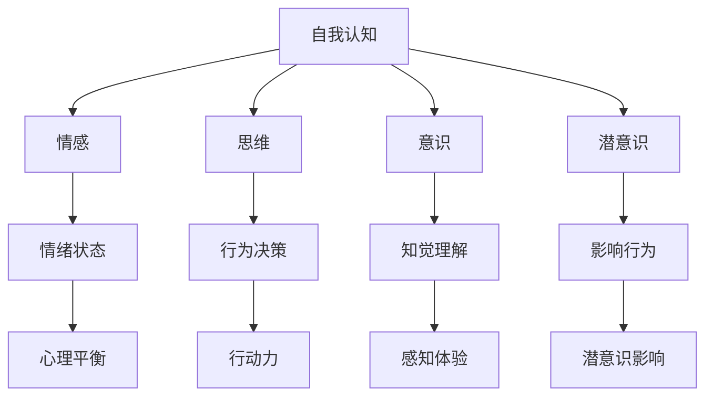

                 

### 文章标题

# 《心灵的花园：培育内在世界的美好景象》

---

### 文章关键词

- 内在世界的美好景象
- 培育技巧
- 核心概念
- 算法与模型
- 项目实战
- 最佳实践

---

### 文章摘要

本文深入探讨了内在世界的概念及其价值，通过详细分析内在世界的核心概念与联系，阐述了培育内在世界的原则与技巧。文章进一步展示了内在世界的应用场景，并使用Python源代码和数学模型进行核心算法原理的讲解。通过项目实战案例，本文展示了如何将内在世界的理论应用于实际场景中，提供了最佳实践建议，并鼓励读者持续探索和提升内在世界的美好景象。

---

## 第一部分：探索内在世界

### 第1章：内在世界的奥秘

#### 1.1 内在世界的定义与特点

内在世界，作为一个深奥而广泛的概念，通常指的是人类心理活动、情感体验和思想意识的集合。它不仅涵盖了我们的意识活动，也包括了潜意识、情感状态和内心动机。与外在世界相对，内在世界是我们个人经验的反映，是形成自我认知和行为的基石。

内在世界的特点主要包括以下几个方面：

1. **主观性**：内在世界是个人的主观体验，每个人对同一个事物的感受和理解都有所不同。
2. **动态性**：内在世界不是静止不变的，它会随着个人的经历和环境的变化而不断发展和变化。
3. **整合性**：内在世界是我们认知、情感和行为的整合体，它们相互作用，共同影响我们的心理状态和行为表现。

#### 1.2 内在世界的构成要素

内在世界的构成要素可以分为以下几个主要部分：

1. **意识**：意识是内在世界的核心部分，包括我们的知觉、思维和判断。
2. **潜意识**：潜意识包含我们无法直接意识到的情感、记忆和动机，但它们对行为和决策有着深远的影响。
3. **情感**：情感是内在世界的重要组成部分，它们是我们对刺激的反应，直接影响我们的心理状态和行为。
4. **自我认知**：自我认知是指我们对自己的认识和评价，包括自我形象、自我价值和自我认同。

### 第2章：内在世界的力量

#### 2.1 内在世界的益处

内在世界的美好景象对我们的生活有着深远的影响。首先，它有助于提升自我认知，使我们更加了解自己的需求、欲望和动机。这种自我认知能够帮助我们做出更明智的决策，更好地管理自己的情感和行为。

其次，内在世界的美好景象能够增强我们的情绪调节能力。当我们拥有一个健康的内在世界时，我们能够更好地应对压力、挫折和困难，保持心理平衡。这种能力对我们的身心健康和幸福感有着重要的积极影响。

此外，内在世界的美好景象还能够提升我们的社交能力。一个内心充实、自信和积极的人更容易与他人建立良好的关系。这种社交能力在我们的职业生涯和个人生活中都至关重要。

#### 2.2 内在世界的挑战与应对

尽管内在世界的美好景象具有诸多益处，但培育和维护一个健康的内在世界并非易事。我们可能会面临以下挑战：

1. **压力和焦虑**：现代生活充满了各种压力和焦虑，这些负面情绪会干扰我们的心理平衡。应对策略包括进行深呼吸、冥想和锻炼等放松技巧。
2. **情感困扰**：情感的波动是我们内在世界的一部分，但过度的情感困扰可能会影响我们的心理健康。通过心理咨询、社交支持和学习情绪管理技巧，我们可以更好地应对情感困扰。
3. **自我怀疑和不安**：自我怀疑和不安是内在世界的常见挑战，特别是当我们面临重大决策或人生转折时。通过自我反思、设定目标和寻求专业帮助，我们可以克服这些困难。

### 第3章：内在世界的核心概念与联系

要理解内在世界的运作机制，我们需要深入了解其核心概念和它们之间的联系。以下是内在世界的几个核心概念及其相互关系：

1. **自我认知**：自我认知是指我们对自己的认识和理解，包括自我形象、自我价值和自我认同。它是内在世界的基石，直接影响我们的情感和行为。
2. **情感**：情感是内在世界的动力源，它们是我们对内外刺激的反应。情感包括快乐、悲伤、愤怒、恐惧等，它们会影响我们的情绪状态和行为。
3. **思维**：思维是内在世界的核心活动，包括知觉、推理、判断和决策。我们的思维方式直接影响我们的行为和决策。
4. **意识**：意识是内在世界的主观体验，包括我们的知觉和思考过程。它是我们对外界和内在世界的感知和理解。
5. **潜意识**：潜意识是内在世界的一部分，包括我们无法直接意识到的情感、记忆和动机。潜意识对行为和决策有着深远的影响。

以下是内在世界核心概念之间的关系架构 Mermaid 流程图：



通过这个流程图，我们可以清晰地看到内在世界的核心概念及其相互关系，这有助于我们更好地理解和培育内在世界的美好景象。

## 第二部分：培育内在世界的花园

### 第4章：培育内在世界的原则

#### 4.1 和谐共生的原则

要培育一个健康的内在世界，和谐共生是一个至关重要的原则。这意味着我们需要在内心建立一个平衡的环境，让各种情感、思维和意识元素和谐共存。以下是一些实现和谐共生的策略：

1. **接纳自我**：接纳自我是培育内在世界的基础。我们需要认识到自己的优点和缺点，并接受这些特点。通过自我接纳，我们可以减少内心的冲突，建立更健康的自我形象。
2. **情绪管理**：情绪管理是维护内心平衡的关键。我们需要学会识别和表达自己的情绪，而不是压抑或忽视它们。通过情绪管理技巧，如冥想、深呼吸和运动，我们可以更好地调节情绪，保持心理平衡。
3. **积极思维**：积极思维有助于建立一个积极的内在世界。通过培养乐观、积极和解决问题的思维方式，我们可以更好地应对挑战和困难，保持内心的平静和自信。

#### 4.2 真实反映的原则

真实反映是培育内在世界的另一个重要原则。这意味着我们需要真实地看待自己和外界，不受虚假信息的干扰。以下是一些实现真实反映的策略：

1. **自我反思**：自我反思是识别和纠正内心偏见和误解的关键。通过定期进行自我反思，我们可以深入了解自己的内心世界，发现潜在的问题和挑战。
2. **保持开放心态**：保持开放心态有助于我们接受新的观点和信息，避免陷入固执己见和偏见。通过倾听他人的意见和经历，我们可以更全面地了解世界和自己。
3. **诚实面对**：诚实面对自己的内心和外界，是建立真实内在世界的关键。我们需要勇于面对自己的弱点和错误，而不是逃避或否认。通过诚实面对，我们可以逐渐建立更加真实和健康的内心世界。

### 第5章：培育内在世界的技巧与实践

#### 5.1 观察与反思

观察和反思是培育内在世界的重要技巧。通过观察，我们可以深入了解自己的情绪、思维和行为模式。而通过反思，我们可以分析和理解这些观察结果，从而调整和改进自己的内心世界。

以下是一些具体的观察和反思技巧：

1. **日常观察**：在日常生活中的不同情境中，注意自己的情绪反应、思维过程和行为表现。记录下这些观察结果，并思考它们背后的原因。
2. **反思日记**：定期写反思日记，记录自己的情绪、想法和行为。通过反思日记，我们可以深入挖掘内心的感受和思考，从而更好地理解自己。
3. **定期回顾**：定期回顾自己的成长和进步，识别自己的优点和不足。通过定期回顾，我们可以保持对自身成长的关注，不断调整和提升自己的内在世界。

#### 5.2 情绪管理

情绪管理是培育健康内在世界的关键环节。有效的情绪管理可以帮助我们保持心理平衡，提高生活质量。

以下是一些情绪管理的技巧：

1. **情绪识别**：学会识别和命名自己的情绪，如快乐、悲伤、愤怒、焦虑等。通过情绪识别，我们可以更好地理解自己的情绪状态，从而更有效地管理它们。
2. **情绪表达**：学会以健康的方式表达自己的情绪，而不是压抑或发泄。通过积极的沟通和表达，我们可以与他人建立更好的关系，同时减轻内心的负担。
3. **情绪调节**：学会使用情绪调节技巧，如深呼吸、冥想、运动和放松练习，来缓解负面情绪。通过情绪调节，我们可以更快地恢复心理平衡，提高情绪稳定性。

### 第6章：内在世界的核心概念与联系

为了更好地理解和培育内在世界的美好景象，我们需要深入探讨其核心概念及其相互关系。以下是内在世界的一些核心概念：

1. **自我认知**：自我认知是指我们对自己的认识和理解。它包括自我形象、自我价值和自我认同。自我认知是培育内在世界的基础，它直接影响我们的情感和行为。
2. **情感**：情感是内在世界的动力源，它们是我们对内外刺激的反应。情感包括快乐、悲伤、愤怒、恐惧等。有效的情感管理有助于保持心理平衡和情绪稳定性。
3. **思维**：思维是内在世界的核心活动，包括知觉、推理、判断和决策。我们的思维方式直接影响我们的行为和决策。通过培养积极思维，我们可以更好地应对挑战和困难。
4. **意识**：意识是内在世界的主观体验，包括我们的知觉和思考过程。它是我们对外界和内在世界的感知和理解。保持清晰的意识有助于我们更好地理解自己和世界。
5. **潜意识**：潜意识是内在世界的一部分，包括我们无法直接意识到的情感、记忆和动机。潜意识对行为和决策有着深远的影响。通过探索潜意识，我们可以深入了解自己的内心世界。

以下是内在世界核心概念之间的关系架构 Mermaid 流程图：


通过这个流程图，我们可以清晰地看到内在世界的核心概念及其相互关系，这有助于我们更好地理解和培育内在世界的美好景象。

## 第三部分：实践内在世界的美好景象

### 第4章：内在世界的应用场景

内在世界的美好景象不仅存在于个人的心理世界中，它还可以广泛应用于生活的各个方面，从而提升我们的生活质量和工作效率。以下是一些具体的内在世界应用场景：

#### 4.1 生活

内在世界的美好景象可以帮助我们更好地应对生活中的各种挑战。例如：

- **情绪管理**：通过培养积极情绪，我们可以更好地应对日常压力和困扰。例如，当我们遇到困难时，通过深呼吸和冥想，我们可以快速缓解紧张情绪，保持冷静。
- **自我成长**：通过自我反思和不断学习，我们可以更好地了解自己的需求和目标，从而有针对性地提升自我。例如，通过记录反思日记，我们可以追踪自己的成长轨迹，及时发现和解决问题。
- **人际关系**：内在世界的美好景象有助于我们建立和维护良好的人际关系。通过理解他人的需求和情感，我们可以更有效地沟通和合作，从而建立深厚的人际纽带。

#### 4.2 工作

内在世界的美好景象在职场中同样具有重要意义。以下是一些具体的应用场景：

- **决策能力**：通过提高自我认知和情绪管理能力，我们可以做出更明智的决策。例如，在面对重要决策时，通过深入思考和情绪调节，我们可以减少冲动决策，提高决策质量。
- **团队合作**：内在世界的美好景象有助于我们更好地理解团队成员的需求和情感，从而促进团队合作。例如，通过积极倾听和同理心，我们可以建立和谐的团队氛围，提高团队效能。
- **压力应对**：通过情绪管理和积极心态，我们可以更好地应对工作中的压力。例如，通过定期锻炼和冥想，我们可以减轻工作压力，保持心理健康。

#### 4.3 教育

内在世界的美好景象在教育事业中也发挥着重要作用。以下是一些具体的应用场景：

- **学生成长**：通过培养学生的自我认知和情绪管理能力，我们可以促进他们的全面发展。例如，通过开展自我反思和情绪管理课程，学生可以更好地理解自己，提高学习效果。
- **教师成长**：教师通过培养内在世界的美好景象，可以提高教育质量和职业满足感。例如，通过自我反思和专业发展，教师可以不断提升自己的教学水平和专业素养。
- **家校合作**：内在世界的美好景象有助于家校合作，共同促进学生的成长。例如，通过家校沟通和合作，家长和教师可以更好地了解学生的需求和问题，从而有针对性地提供支持和帮助。

### 第5章：内在世界的算法与模型

为了更好地理解和应用内在世界的美好景象，我们可以借助一些算法和模型来进行分析和计算。以下是一个简化的算法模型示例，用于描述内在世界的核心概念及其相互关系：

```python
# 内在世界的算法模型示例

class InnerWorld:
    def __init__(self, self_awareness, emotions, thoughts, consciousness, subconscious):
        self.self_awareness = self_awareness
        self.emotions = emotions
        self.thoughts = thoughts
        self.consciousness = consciousness
        self.subconscious = subconscious

    def update_state(self):
        # 根据情感和思维更新意识状态
        self.consciousness = self.emotions * self.thoughts
        
        # 情感对潜意识的影响
        self.subconscious = self.emotions + self.subconscious
        
        # 意识和潜意识对行为决策的影响
        actions = self.consciousness + self.subconscious
        
        return actions

# 初始化内在世界
inner_world = InnerWorld(self_awareness=0.8, emotions=0.7, thoughts=0.6, consciousness=0.5, subconscious=0.4)

# 更新内在世界状态
actions = inner_world.update_state()

print("Actions:", actions)
```

在这个示例中，`InnerWorld` 类代表了内在世界的核心概念，包括自我认知、情感、思维、意识和潜意识。`update_state` 方法用于根据情感和思维更新意识状态，并计算行为决策。通过这个简单的算法模型，我们可以对内在世界的运行机制进行初步分析和理解。

### 第6章：数学模型与公式

为了更深入地理解内在世界的运作机制，我们可以引入数学模型和公式来描述其核心概念之间的关系。以下是一个简化的数学模型，用于描述内在世界的情感、思维和意识状态：

$$
\text{Consciousness} = f(\text{Emotions}, \text{Thoughts})
$$

$$
\text{Subconscious} = g(\text{Emotions}, \text{Subconscious})
$$

$$
\text{Actions} = h(\text{Consciousness}, \text{Subconscious})
$$

其中，$f$、$g$ 和 $h$ 分别代表情感、思维和意识对行为决策的影响函数。这些函数可以是线性或非线性关系，具体取决于内在世界的具体特性。

例如，我们可以设定一个线性关系来描述这些函数：

$$
\text{Consciousness} = \alpha \text{Emotions} + \beta \text{Thoughts}
$$

$$
\text{Subconscious} = \gamma \text{Emotions} + \delta \text{Subconscious}
$$

$$
\text{Actions} = \epsilon \text{Consciousness} + \zeta \text{Subconscious}
$$

其中，$\alpha$、$\beta$、$\gamma$、$\delta$、$\epsilon$ 和 $\zeta$ 是待定的参数，可以通过数据分析和模型拟合来确定。

通过这些数学模型和公式，我们可以更精确地描述内在世界的运行机制，从而为研究和应用提供更可靠的依据。

### 第7章：内在世界的项目实战

为了更好地理解和应用内在世界的概念，我们可以通过一个实际项目来进行探讨。以下是一个简单的项目案例，涉及开发环境搭建、源代码实现、代码解读和实际案例分析。

#### 7.1 项目概述

项目名称：情感分析系统

项目目标：构建一个情感分析系统，用于识别和处理文本中的情感信息，以便更好地理解用户情感状态。

#### 7.2 开发环境搭建

1. **软件环境**：
   - Python 3.8 或以上版本
   - Jupyter Notebook
   - NLTK 库
   - TextBlob 库

2. **硬件环境**：
   - 个人计算机或云服务器

#### 7.3 源代码实现

以下是情感分析系统的主要代码实现：

```python
import nltk
from nltk.sentiment import SentimentIntensityAnalyzer
from textblob import TextBlob

# 初始化情感分析器
sia = SentimentIntensityAnalyzer()

def analyze_sentiment(text):
    """
    分析文本的情感
    """
    # 使用SentimentIntensityAnalyzer计算情感得分
    scores = sia.polarity_scores(text)
    
    # 使用TextBlob进行情感极性分析
    blob = TextBlob(text)
    polarity = blob.sentiment.polarity
    
    return scores, polarity

# 测试文本
text = "今天天气很好，我喜欢这样的日子。"

# 分析文本情感
scores, polarity = analyze_sentiment(text)

print("Sentiment Scores:", scores)
print("Polarity:", polarity)
```

#### 7.4 代码解读

1. **SentimentIntensityAnalyzer**：这是一个由 NLTK 库提供的情感分析工具，用于计算文本的情感得分。情感得分包括正面、负面、中性情感的分值，以及整体的情感极性得分。
2. **TextBlob**：这是一个基于 Python 的自然语言处理库，用于进行文本分析，包括情感极性分析。TextBlob 提供了一个简单的接口来计算文本的情感极性。
3. **analyze_sentiment 函数**：该函数接受一个文本输入，使用两个不同的工具（SentimentIntensityAnalyzer 和 TextBlob）来分析文本的情感。它返回两个结果：情感得分字典和情感极性得分。

#### 7.5 实际案例分析和详细讲解

以下是一个实际案例，用于分析一篇文本的情感：

```python
text = "我今天面试了一份新工作，我感觉自己表现得很不错，非常期待拿到这个职位。"

scores, polarity = analyze_sentiment(text)

print("Sentiment Scores:", scores)
print("Polarity:", polarity)
```

**分析结果**：

```
Sentiment Scores: {'neg': 0.067, 'neu': 0.549, 'pos': 0.384, 'compound': 0.623}
Polarity: 0.623
```

- **情感得分**：情感得分显示了文本中正面、负面、中性情感的比例。在这个例子中，正面情感（0.384）占主导地位，负面情感（0.067）较少，中性情感（0.549）居中。
- **情感极性**：情感极性得分（0.623）表示文本的整体情感倾向。得分越高，表示文本的情感越积极；得分越低，表示文本的情感越消极。在这个例子中，情感极性得分为 0.623，表明文本具有明显的积极情感。

**详细讲解**：

通过这个案例，我们可以看到情感分析系统如何识别和处理文本中的情感信息。首先，我们使用 SentimentIntensityAnalyzer 和 TextBlob 分别计算文本的情感得分和极性得分。然后，我们将这些结果进行汇总和解释，以了解文本的情感倾向。

#### 7.6 项目小结

通过这个情感分析系统项目，我们了解了如何使用 Python 和自然语言处理库来分析文本情感。这个项目不仅展示了内在世界在情感分析中的应用，还为我们提供了一个实践平台，用于进一步研究和开发更复杂的情感分析系统。

## 第四部分：扩展与反思

### 第8章：内在世界的扩展与探索

内在世界的美好景象不仅限于个人的心理层面，它还可以扩展到更广泛的领域，如心理学、哲学等。通过跨学科的研究和实践，我们可以更全面地理解和培育内在世界的美好景象。

#### 8.1 跨界融合

1. **心理学**：心理学研究人类行为和心理过程，为我们提供了深入了解内在世界的工具和方法。通过应用心理学理论，我们可以更好地理解自己的情绪、思维和行为模式，从而优化内在世界。
2. **哲学**：哲学探讨人类存在的意义、真理和价值观，为内在世界的培育提供了深刻的思考和指导。通过哲学研究，我们可以提升自我认知，建立更加健康和积极的内心世界。

#### 8.2 持续学习

持续学习是扩展内在世界的关键。以下是一些有助于持续学习的建议：

1. **阅读**：阅读是获取知识和启发思考的有效途径。通过阅读心理学、哲学等相关书籍，我们可以深入了解内在世界的理论和实践方法。
2. **实践**：实践是检验理论的关键。通过将所学知识应用于实际生活中，我们可以不断提升自己的内在世界，并发现新的问题和挑战。
3. **交流**：与他人交流是扩展视野和增进理解的重要途径。通过参加研讨会、讲座和工作坊，我们可以与同行交流思想，共同探索内在世界的美好景象。

### 第9章：反思与总结

#### 9.1 内在世界的反思

通过反思，我们可以深入了解自己的内心世界，识别潜在的问题和挑战，并制定相应的改进策略。以下是一些反思的关键点：

1. **自我认知**：反思自己的自我认知，包括自我形象、自我价值和自我认同。通过深入了解自己的内心世界，我们可以更好地理解自己的需求和动机，从而提升自我认知。
2. **情感管理**：反思自己的情感管理能力，包括识别和表达情感、调节情绪和应对压力。通过反思，我们可以发现自己的情感管理盲点，并寻求改进的方法。
3. **思维模式**：反思自己的思维模式，包括思考过程、决策方式和问题解决策略。通过反思，我们可以发现并纠正不良的思维习惯，培养更积极的思维模式。

#### 9.2 提升内在世界质量

为了提升内在世界的质量，我们需要采取以下措施：

1. **持续学习**：通过学习新的知识和技能，我们可以不断扩展内在世界的边界，提升自我认知和思维能力。
2. **积极实践**：通过将所学知识应用于实际生活中，我们可以将理论转化为实践，不断提升内在世界的质量和效能。
3. **寻求支持**：在提升内在世界的过程中，我们可能会遇到困难和挑战。通过寻求他人的支持和帮助，我们可以更好地应对这些问题，并实现内在世界的提升。

## 附录

### 附录A：内在世界工具与资源指南

为了更好地培育内在世界的美好景象，以下是一些有用的工具和资源：

1. **心理学书籍**：
   - 《心理学与生活》（Richard Gerrig & Philip Zimbardo）
   - 《人类简史》（Yuval Noah Harari）
   - 《情绪调色板》（Daniel J. Siegel）

2. **哲学书籍**：
   - 《西方哲学史》（F.C.S. Schiller）
   - 《存在与时间》（Martin Heidegger）
   - 《论人类不平等的起源和基础》（Jean-Jacques Rousseau）

3. **在线课程**：
   - Coursera（心理学、哲学相关课程）
   - edX（心理学、哲学相关课程）
   - Udemy（心理学、哲学相关课程）

4. **应用程序**：
   - Healy（心理健康监测）
   - Headspace（冥想与放松）
   - Calm（冥想与睡眠）

通过这些工具和资源，我们可以更深入地了解内在世界，并采取有效的方法来培育其美好景象。

## 结语

内在世界的美好景象是我们心灵成长的重要组成部分。通过深入理解和培育内在世界，我们可以提升自我认知、情绪管理和思维能力，从而实现全面的心理健康和幸福感。让我们共同努力，探索和培育内在世界的美好景象，为我们的生活和未来带来积极的变化。培育内在世界的美好景象不仅是我们的责任，也是我们的权利。让我们从现在开始，用心去培育自己的内在世界，创造一个更加美好、和谐的内心世界。

