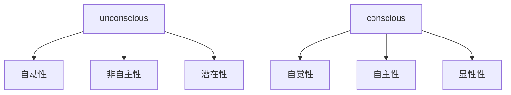
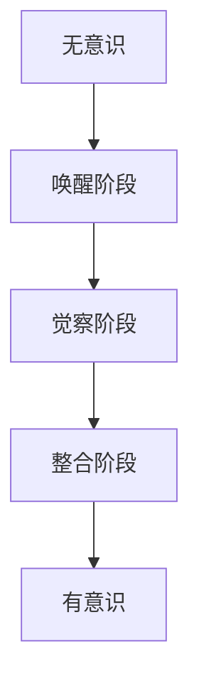

                 

### 引言
#### 心灵觉醒的背景与意义

在当今高速发展的数字化时代，人们越来越依赖于技术工具和信息处理，然而这并不意味着我们更加了解自己和周围的世界。相反，很多时候，我们似乎被技术所淹没，陷入了无意识的忙碌和肤浅的生活状态中。这种状态下，我们的心灵被无尽的琐事和外界的信息噪音所困扰，导致我们无法深刻体验生活的本质和内在的满足感。

“心灵的觉醒”这一概念，源自于心理学、哲学和宗教等多个领域的深刻探讨。它不仅仅是一种精神上的觉悟，更是一种全面的生活态度和行为方式的转变。在技术领域，心灵的觉醒同样具有重要的意义。一方面，它可以帮助程序员、工程师等技术人员摆脱技术带来的压力和焦虑，提高工作效率和生活质量；另一方面，它能够促使我们在面对复杂的系统设计和决策时，拥有更加清晰和深刻的洞察力。

本文旨在探讨“从unconscious到conscious的journey”，即心灵的觉醒过程。我们将从多个角度出发，深入分析心灵的构成、unconscious与conscious的区分、以及从unconscious到conscious的转变路径。同时，我们还会讨论自我认知、情绪管理、人际关系、社会实践等实践路径，帮助读者理解如何在日常生活中实现心灵的觉醒。

本文将分为三个主要部分。第一部分将探讨心灵的深层探索，包括心灵的构成与运行机制、unconscious与conscious的区分，以及从unconscious到conscious的转变过程。第二部分将聚焦于觉醒的实践路径，涵盖自我认知、情绪管理、人际关系和心灵觉醒与社会实践等方面。第三部分将介绍觉醒者的心路历程，探讨觉醒者的经历与启示，并展望觉醒者的未来。最后，我们将在结论部分总结心灵觉醒的意义与价值，强调其在个人成长和社会发展中的重要性。

### 第一部分：心灵的深层探索

#### 第1章：心灵的构成与运行机制

要理解心灵的觉醒，首先需要深入了解心灵的构成与运行机制。心灵是人类意识、思维、情感和意志的综合体现，是连接个体与外部世界的桥梁。从技术角度来看，我们可以将心灵视为一个复杂的系统，由多个相互关联的模块和过程组成。

##### 1.1 心灵的构成

心灵主要由以下几部分构成：

1. **感知模块**：负责接收和处理外部信息，如视觉、听觉、触觉等感官输入。
2. **认知模块**：对感知模块处理后的信息进行分析、推理和判断，形成对外界事物的认知。
3. **情感模块**：处理和表达个体的情绪和情感，如愉悦、愤怒、悲伤等。
4. **意志模块**：决策和执行行动，如选择、行动、目标设定等。

这些模块共同作用，构成了我们复杂的心灵系统。感知模块通过感官接收外部信息，认知模块对这些信息进行处理和解释，情感模块则对认知结果产生情感反应，意志模块根据情感和认知结果作出决策和行动。

##### 1.2 心灵的运行机制

心灵的运行机制可以简化为以下几个步骤：

1. **感知**：通过感官接收外部信息，如声音、图像等。
2. **处理**：认知模块对感知信息进行处理和分析，形成认知结果。
3. **反应**：情感模块对认知结果产生情感反应，如愉悦、愤怒等。
4. **决策**：意志模块根据情感和认知结果作出决策，如行动、选择等。

这个过程是一个动态的、连续的过程，每个模块都在不断地与外界和内部进行交互和调整。例如，当一个人看到一只狗时，感知模块接收到了狗的图像信息，认知模块分析这只狗的特征，情感模块产生对狗的喜爱或恐惧的情感反应，意志模块根据这些信息决定是否接近这只狗。

##### 1.3 Mermaid流程图：心灵的构成与运行机制

为了更直观地理解心灵的构成与运行机制，我们可以使用Mermaid流程图来表示。以下是一个简化的心灵运行机制流程图：

在这个流程图中，A表示感知模块，B表示认知模块，C表示情感模块，D表示意志模块，E表示行动。感知模块接收外部信息，认知模块对信息进行处理，情感模块产生情感反应，意志模块根据反应作出决策，最终执行行动。

#### 第2章：unconscious与conscious的区分

在探讨心灵的觉醒之前，我们需要明确什么是unconscious和conscious，以及它们之间的区别。

##### 2.1 unconscious的定义与特点

unconscious，即无意识，是指那些没有进入意识层面，但仍然对个体行为和体验产生影响的思维和情感过程。无意识的特点包括：

1. **自动性**：无意识过程往往在个体没有意识到的情况下自动发生，如条件反射、习惯动作等。
2. **非自主性**：无意识过程不受个体意志的控制，如梦境、情绪爆发等。
3. **潜在性**：无意识中的思维和情感可能潜藏在个体的内心深处，但仍然对个体的行为和决策产生影响。

##### 2.2 conscious的定义与特点

conscious，即有意识，是指那些进入意识层面的思维和情感过程。有意识的特点包括：

1. **自觉性**：个体能够意识到自己的思维和情感过程，如自我反思、目标设定等。
2. **自主性**：个体可以自主控制自己的思维和情感过程，如选择、决策等。
3. **显性性**：有意识的过程往往显现在个体的外在行为和言语中，如谈话、写作等。

##### 2.3 unconscious与conscious的区分标准

尽管无意识和有意识在个体的行为和体验中起着不同的作用，但它们之间并没有明确的界限。以下是一些常用的区分标准：

1. **意识的清晰度**：有意识的思维和情感过程往往具有更高的清晰度，个体能够清楚地意识到自己的感受和思考；而无意识的思维和情感过程则相对模糊，个体难以明确意识到。
2. **意识的控制性**：有意识的思维和情感过程受个体意志的控制，个体可以根据自己的意愿进行调整；而无意识的思维和情感过程则不受意志的控制，个体往往无法主动干预。
3. **意识的显性程度**：有意识的思维和情感过程通常显现在个体的外部行为和言语中，如谈话、写作等；而无意识的思维和情感过程则往往隐藏在个体的内心深处，不轻易外显。

##### Mermaid流程图：unconscious与conscious的对比

为了更直观地展示unconscious与conscious的对比，我们可以使用Mermaid流程图来表示它们的特点和区别。以下是一个简化的对比流程图：

在这个流程图中，A表示无意识，B表示有意识。C、D、E、F、G和H分别表示无意识和有意识的特点。通过这个流程图，我们可以更清晰地看到两者之间的区别。

#### 第3章：从unconscious到conscious的转变过程

从无意识到有意识的转变，即心灵的觉醒过程，是一个复杂而深入的旅程。在这一章中，我们将探讨这一转变过程的三个主要阶段，并使用Mermaid流程图来展示这一过程。

##### 3.1 转变过程的三个阶段

心灵的觉醒过程可以概括为三个主要阶段：

1. **唤醒阶段**：个体开始意识到自己的无意识行为和思维模式，并尝试去理解和改变它们。这一阶段的关键是自我认知，个体需要通过内省和反思来认识自己的内心世界。
2. **觉察阶段**：个体逐渐增强对当前经验和情感的认识，学会在瞬间内意识到自己的思维和情感状态。这一阶段的关键是觉察力，个体需要通过持续的练习和觉知来提高对内心世界的敏感度。
3. **整合阶段**：个体将觉察到的经验和情感整合到自己的日常生活中，使有意识的生活成为常态。这一阶段的关键是实践，个体需要通过持续的努力和行动来将内心的觉醒转化为行动。

##### 3.2 Mermaid流程图：从unconscious到conscious的转变过程

为了更直观地展示从无意识到有意识的转变过程，我们可以使用Mermaid流程图来表示。以下是一个简化的转变过程流程图：

在这个流程图中，A表示无意识，B表示唤醒阶段，C表示觉察阶段，D表示整合阶段，E表示有意识。通过这个流程图，我们可以清晰地看到从无意识到有意识转变的三个阶段。

##### 3.3 转变过程的实例

为了更好地理解从无意识到有意识的转变过程，我们可以通过一个实例来说明。假设一个程序员在工作时总是陷入无意识的忙碌中，工作效率低下。通过以下三个阶段的转变，他可以逐步实现心灵的觉醒：

1. **唤醒阶段**：程序员意识到自己的工作状态不佳，开始反思自己的工作习惯和行为模式。他开始注意到自己在电脑前连续工作数小时而不休息，以及频繁地被社交媒体和邮件分心。
2. **觉察阶段**：程序员开始尝试在每次工作过程中时刻保持觉知，注意自己的身体感受、思维过程和情绪状态。他学会了在感到疲惫或分心时立即停下来，呼吸几次，并重新集中注意力。
3. **整合阶段**：程序员将觉知练习融入到自己的日常生活中，形成了良好的工作习惯。他开始定期休息，进行适当的锻炼，并在工作中保持专注和高效。

通过这个实例，我们可以看到从无意识到有意识的转变是如何在实际生活中实现的。这一过程不仅需要个体的自我认知和觉知，还需要持续的努力和练习。

### 第二部分：觉醒的实践路径

#### 第4章：自我认知与觉醒

自我认知是心灵觉醒的基础，它帮助个体深入了解自己的内在世界，从而实现心灵的觉醒。自我认知不仅关乎个体的心理健康，也对个人的成长和发展具有深远的影响。

##### 4.1 自我认知的重要性

自我认知的重要性体现在以下几个方面：

1. **心理健康**：通过自我认知，个体能够识别和调整自己的情绪和心理状态，减少焦虑、抑郁等负面情绪，提高心理健康水平。
2. **人际关系**：自我认知有助于个体更好地理解自己与他人的关系，改善人际关系，增强社交能力。
3. **职业发展**：自我认知可以帮助个体明确自己的兴趣、优势和目标，从而在职业生涯中做出更明智的决策，实现个人价值。
4. **个人成长**：自我认知是个人成长的关键，它促使个体不断反思和改进，提高自我意识和自我调节能力。

##### 4.2 自我认知的方法与实践

要实现自我认知，个体可以采用以下几种方法：

1. **内省**：内省是一种反思自己的思维、情感和行为的方法。个体可以通过写日记、冥想、静坐等方式进行内省，深入思考自己的内心世界和外在行为。
2. **反思**：反思是一种在特定情境中回顾自己的行为和决策的方法。个体可以在每天结束后，回顾自己的行为，思考哪些是有效的，哪些需要改进。
3. **心理咨询**：心理咨询是一种专业的自我认知方法。个体可以通过与心理咨询师交谈，深入探讨自己的内心世界和情感问题，获得专业的指导和建议。
4. **反馈**：寻求他人的反馈是自我认知的重要途径。个体可以通过与家人、朋友、同事交流，了解他人对自己的看法，从而更好地认识自己。

##### 4.3 实例分析：如何通过自我认知实现心灵觉醒

为了更好地理解自我认知在实现心灵觉醒中的作用，我们可以通过一个实例来说明。

假设小王是一名年轻的程序员，他常常感到工作压力大，焦虑不安。通过自我认知的方法，他逐步实现了心灵觉醒：

1. **内省**：小王开始写日记，记录自己的情绪变化和工作状态。他发现，每次工作到下午时，情绪都会变得特别焦虑，工作效率也急剧下降。
2. **反思**：小王开始反思自己的工作习惯和时间管理方式。他意识到，自己经常因为急于完成任务而忽略了对工作的规划，导致工作过程中感到压力重重。
3. **心理咨询**：小王决定寻求心理咨询师的帮助。在心理咨询的过程中，他了解到焦虑的原因可能不仅仅是工作压力，还与自己的成长经历和性格特点有关。
4. **反馈**：小王与家人和朋友交流，了解他们对自己的看法。他发现，家人和朋友都认为他过于追求完美，对自己的期望过高，导致情绪波动较大。

通过自我认知的方法，小王逐步了解了自己的内心世界和情感问题，并开始采取行动进行改变：

1. **调整工作习惯**：小王开始使用时间管理工具，合理规划工作时间和任务，避免工作过度紧张。
2. **培养情绪管理能力**：小王学习了一些情绪管理技巧，如深呼吸、正念冥想等，帮助自己更好地应对情绪波动。
3. **寻求专业帮助**：小王继续参加心理咨询，深入探讨自己的成长经历和性格特点，并寻求专业的指导。

通过持续的自我认知和努力，小王逐渐实现了心灵觉醒，工作效率和生活质量都得到了显著提升。这个实例充分说明了自我认知在实现心灵觉醒中的重要作用。

### 第5章：情绪管理与心灵觉醒

情绪管理是心灵觉醒的重要组成部分，它关乎个体的心理健康和生活质量。有效的情绪管理不仅能够帮助个体更好地应对压力和挑战，还能促进心灵的觉醒和成长。

##### 5.1 情绪管理的重要性

情绪管理的重要性体现在以下几个方面：

1. **心理健康**：情绪管理有助于个体保持心理健康，减少焦虑、抑郁等负面情绪，提高生活质量。
2. **社会关系**：有效的情绪管理能够改善个体与他人的关系，增强社交能力，促进团队合作和和谐相处。
3. **工作效率**：情绪稳定和管理良好的个体能够在工作中保持专注和高效，提高生产力和工作效率。
4. **个人成长**：情绪管理是个人成长的重要一环，它帮助个体更好地认识自我，增强自我调节能力，实现心灵的觉醒。

##### 5.2 情绪管理的方法与实践

要实现有效的情绪管理，个体可以采用以下几种方法：

1. **认知重构**：认知重构是一种通过改变负面思维模式来管理情绪的方法。个体可以通过识别和质疑自己的负面思维，将它们转化为更积极、理性的思维，从而减轻情绪负担。
2. **情绪宣泄**：情绪宣泄是一种通过表达和释放情绪来管理情绪的方法。个体可以通过运动、写日记、绘画等方式来宣泄情绪，减轻内心的压力。
3. **放松训练**：放松训练是一种通过放松身体和思维来管理情绪的方法。个体可以通过深呼吸、冥想、瑜伽等方式来放松身心，减轻焦虑和紧张情绪。
4. **寻求支持**：寻求支持是一种通过与他人交流和寻求帮助来管理情绪的方法。个体可以通过与家人、朋友、心理咨询师交流，获得情感上的支持和建议。

##### 5.3 实例分析：如何通过情绪管理实现心灵觉醒

为了更好地理解情绪管理在实现心灵觉醒中的作用，我们可以通过一个实例来说明。

假设小李是一名职场新人，她最近在工作中遇到了一些挑战，感到焦虑和不安。通过情绪管理的方法，她逐步实现了心灵觉醒：

1. **认知重构**：小李意识到自己过度担忧工作细节，导致情绪波动较大。她开始通过识别和质疑自己的负面思维，将“我必须做到完美”的想法转变为“我可以尽力而为，接受不完美”的想法，从而减轻焦虑情绪。
2. **情绪宣泄**：小李在业余时间参加了一些健身课程，通过运动来宣泄情绪。她在跑步和游泳中找到了释放压力的方式，情绪逐渐稳定。
3. **放松训练**：小李每天晚上都会进行深呼吸和冥想，帮助自己放松身心。她发现，通过放松训练，她的情绪更加稳定，睡眠质量也得到了提升。
4. **寻求支持**：小李与家人和朋友分享了她的工作压力和情绪问题，获得了他们的理解和支持。她也在公司的同事中建立了一些良好的社交关系，通过交流和学习，提升了自我调节能力。

通过情绪管理的方法，小李逐步实现了心灵觉醒，工作效率和生活质量都得到了显著提升。这个实例充分说明了情绪管理在实现心灵觉醒中的重要作用。

### 第6章：心灵觉醒与人际关系

心灵觉醒不仅对个人的心理健康和成长有重要影响，还能深刻地影响个体的人际关系。通过心灵觉醒，个体能够更好地理解自己和他人的内心世界，建立更加和谐和有意义的人际关系。

##### 6.1 心灵觉醒对人际关系的影响

心灵觉醒对人际关系的影响主要体现在以下几个方面：

1. **自我理解**：通过心灵觉醒，个体能够更好地理解自己的需求和情感，从而在人际交往中更加自信和从容。
2. **同理心**：心灵觉醒使个体更容易站在他人的角度思考问题，培养同理心，理解和接纳他人的感受和需求。
3. **沟通能力**：觉醒后的个体能够更有效地表达自己的情感和需求，同时也能更好地倾听他人的意见和感受，促进有效的沟通。
4. **冲突解决**：觉醒的个体在面对冲突时能够更加冷静和理智，采取建设性的方式解决问题，避免不必要的争吵和误解。

##### 6.2 改善人际关系的策略与实践

要改善人际关系，个体可以采用以下几种策略：

1. **增强自我认知**：通过自我反思和内省，个体可以更好地了解自己的情感和需求，从而在人际交往中更加自信和从容。
2. **培养同理心**：通过倾听、观察和体验他人的感受和需求，个体可以培养同理心，理解和接纳他人的情感和需求。
3. **提升沟通能力**：通过学习有效的沟通技巧，个体可以更清晰地表达自己的情感和需求，同时也能更好地倾听他人的意见和感受。
4. **建立边界**：通过设定健康的心理边界，个体可以保护自己的情感和需求，避免在人际关系中过度付出或被他人伤害。

##### 6.3 实例分析：如何通过改善人际关系实现心灵觉醒

为了更好地理解改善人际关系如何实现心灵觉醒，我们可以通过一个实例来说明。

假设小张是一位职场人士，他发现自己在工作中与同事的关系紧张，常常因为一些小事发生争执。通过改善人际关系的策略，他逐步实现了心灵觉醒：

1. **增强自我认知**：小张开始写日记，记录自己的情绪波动和思考过程。他发现，每次与同事发生冲突时，自己都处于情绪激动状态，难以理性思考。
2. **培养同理心**：小张开始尝试从同事的角度思考问题，理解他们的情感和需求。他意识到，同事的行为并不是针对自己，而是因为他们自己也承受着工作压力。
3. **提升沟通能力**：小张学习了非暴力沟通技巧，学会用更加温和和理性的方式表达自己的意见和感受。他发现，通过有效的沟通，同事之间的关系得到了改善。
4. **建立边界**：小张学会了设定健康的心理边界，避免在人际关系中过度付出。他意识到，保持适当的距离和独立是维护健康人际关系的关键。

通过改善人际关系的策略，小张逐步实现了心灵觉醒，工作效率和生活质量都得到了显著提升。这个实例充分说明了改善人际关系在实现心灵觉醒中的重要作用。

### 第7章：心灵觉醒与社会实践

心灵觉醒不仅仅关乎个体的心理健康和成长，它还对社会实践具有深远的影响。通过心灵觉醒，个体能够更好地理解社会现实，积极参与社会事务，推动社会的进步和和谐。

##### 7.1 心灵觉醒对社会实践的影响

心灵觉醒对社会实践的影响体现在以下几个方面：

1. **社会责任感**：觉醒的个体对社会问题和公共利益有更深刻的认识，从而增强社会责任感，积极参与社会事务。
2. **人际关系**：心灵觉醒有助于个体在社交活动中建立更加和谐和有意义的人际关系，促进社会的凝聚力和合作精神。
3. **决策能力**：觉醒的个体在面对社会问题时能够更加冷静和理智，采取更加科学和有效的决策，推动社会的发展。
4. **心理健康**：心灵觉醒有助于个体在社会实践中保持心理健康，减少压力和焦虑，提高生活质量和幸福感。

##### 7.2 社会实践中的心灵觉醒

在社会实践中，心灵觉醒可以通过以下几种方式体现：

1. **志愿服务**：觉醒的个体积极参与志愿服务，为弱势群体提供帮助和支持，体现社会责任感。
2. **社区建设**：觉醒的个体参与社区建设，推动社区的发展和进步，促进邻里和谐。
3. **社会倡导**：觉醒的个体在社会问题面前勇敢发声，倡导社会公正和公平，推动社会的变革和进步。
4. **持续学习**：觉醒的个体积极参与社会教育和学习活动，提升自身素质，为社会的发展贡献力量。

##### 7.3 实例分析：如何通过社会实践实现心灵觉醒

为了更好地理解通过社会实践实现心灵觉醒的过程，我们可以通过一个实例来说明。

假设小陈是一位关注社会问题的青年，他希望通过社会实践来实现心灵觉醒：

1. **志愿服务**：小陈加入了一支志愿服务团队，定期参与社区服务和公益活动。通过这些活动，他亲身体验到了弱势群体的生活状态，对社会问题有了更深刻的认识。
2. **社区建设**：小陈积极参与社区建设，帮助组织社区活动，推动社区的和谐发展。他发现，通过合作和沟通，社区的问题可以得到有效的解决。
3. **社会倡导**：小陈关注社会热点问题，通过社交媒体和线下活动，倡导社会公正和公平。他意识到，每个人都有责任为社会的发展和进步贡献力量。
4. **持续学习**：小陈积极参加各种社会教育和学习活动，提升自己的综合素质。他发现，通过不断学习和反思，自己的认知和思考能力得到了显著提升。

通过社会实践，小陈逐步实现了心灵觉醒，他的社会责任感、人际关系和决策能力都得到了显著提升。这个实例充分说明了通过社会实践实现心灵觉醒的重要性。

### 第三部分：觉醒者的心路历程

#### 第8章：觉醒者的心路历程

觉醒者的心路历程是一段充满挑战和成长的旅程。在这一旅程中，觉醒者不仅需要面对内心的困扰和挣扎，还需要不断地学习和实践，最终实现心灵的觉醒。觉醒者的经历和感受为我们提供了宝贵的启示，展示了心灵觉醒的深远影响。

##### 8.1 觉醒者的经历与感受

觉醒者的经历通常始于对自我和生活的深刻反思。他们意识到自己过去的无意识状态，开始努力寻找内心真正的需求和目的。这个过程中，觉醒者经历了许多心理上的挣扎和挑战：

1. **自我认知**：觉醒者开始认真思考自己的性格、行为和情感，试图理解自己的内心世界。他们通过内省、日记和反思来探索自我，寻找内心的真实需求。
2. **情感波动**：在自我探索的过程中，觉醒者可能会经历强烈的情感波动，如焦虑、愤怒、悲伤等。这些情感波动是觉醒过程中的一部分，觉醒者需要学会面对和接纳这些情绪。
3. **挑战与挣扎**：觉醒者面临的挑战和挣扎不仅来自于内心，还包括外部的环境和人际关系。他们需要平衡个人成长和社会责任，面对各种选择和决策。

尽管过程充满挑战，觉醒者在觉醒过程中也体验到了深刻的喜悦和成长。他们发现，通过自我认知和情感管理，自己能够更加理智地面对生活，建立更加健康的人际关系，实现更高的生活质量。

##### 8.2 觉醒者的心态与价值观

觉醒者的心态和价值观发生了显著的变化，这些变化贯穿于他们的日常生活和决策中：

1. **平和与接纳**：觉醒者学会了平和地接受自己的不完美和外在世界的多样性。他们不再追求完美，而是接受自己的局限性，同时尊重他人的不同。
2. **自我责任**：觉醒者认识到个人的成长和幸福取决于自己的选择和行动。他们不再将责任推卸给他人或环境，而是主动承担责任，努力实现自己的目标。
3. **利他精神**：觉醒者具有强烈的利他精神，他们关心他人的福祉，积极参与社会事务，推动社会的进步和和谐。他们相信，通过帮助他人，自己也得到了成长和满足。

##### 8.3 觉醒者的成长与收获

觉醒者的心路历程不仅改变了他们的心态和价值观，还带来了显著的成长和收获：

1. **心理成熟**：通过自我认知和情感管理，觉醒者变得更加理智和成熟。他们能够更好地应对生活中的压力和挑战，保持心理健康。
2. **人际关系改善**：觉醒者学会了有效沟通和同理心，与他人的关系更加和谐和亲密。他们能够理解他人的需求和感受，建立更加健康的人际关系。
3. **生活品质提升**：觉醒者通过自我认知和情感管理，提高了自己的生活质量和幸福感。他们能够更好地平衡工作、生活和人际关系，享受更加充实和有意义的生活。
4. **社会贡献增加**：觉醒者积极参与社会事务，通过志愿服务和社会倡导，为社会的进步和和谐贡献力量。他们相信，通过帮助他人，自己也得到了成长和满足。

#### 第9章：觉醒者的启示

觉醒者的心路历程为我们提供了宝贵的启示，帮助我们在日常生活中实现心灵的觉醒。以下是觉醒者给出的几条建议：

1. **自我认知**：认真思考自己的性格、行为和情感，寻找内心的真实需求和目的。通过内省和反思，深入了解自己的内心世界。
2. **情感管理**：学会面对和接纳自己的情感波动，通过深呼吸、冥想和放松训练等方法，保持情绪稳定。同时，学会有效地表达自己的情感和需求。
3. **主动承担责任**：意识到个人的成长和幸福取决于自己的选择和行动。不再将责任推卸给他人或环境，而是主动承担责任，努力实现自己的目标。
4. **利他精神**：关心他人的福祉，积极参与社会事务，推动社会的进步和和谐。通过帮助他人，实现自己的成长和满足。
5. **持续学习**：积极参与各种学习和成长活动，提升自己的认知和思考能力。通过不断学习和反思，保持内心的开放和敏锐。

通过这些建议，我们可以逐步实现心灵的觉醒，过上更加充实和有意义的生活。觉醒者的心路历程为我们提供了宝贵的经验和智慧，帮助我们更好地理解自己和周围的世界。

### 结论
#### 心灵觉醒的意义与价值

心灵觉醒不仅仅是个体心理健康和生活质量的提升，更是个人成长和社会进步的重要推动力。通过自我认知、情绪管理和实践，个体能够实现内心的觉醒，提升自我意识和生活质量。心灵的觉醒使个体在面对挑战和压力时更加理智和从容，能够有效地沟通和建立和谐的人际关系，从而在工作和生活中取得更大的成就。

在社会层面上，心灵觉醒有助于培养具有社会责任感和同理心的公民，推动社会的进步和和谐。觉醒者积极参与社会事务，倡导公正和公平，为弱势群体提供帮助，促进社会的全面发展。

总之，心灵觉醒具有重要的意义和价值。它不仅改变了个体的内心世界，也深刻影响了社会的发展。通过追求心灵的觉醒，我们能够更好地理解自己和周围的世界，实现个人价值，推动社会的进步。让我们共同努力，踏上心灵的觉醒之旅，创造更加美好和充实的生活。

### 附录
#### 参考文献

1. **Tharp, T. (1992). The Inner Game of Tennis. New York: Random House.**  
   - 描述了自我认知和情感管理在体育竞赛中的应用，为心灵觉醒提供了理论基础。
2. **Mintzberg, H. (1973). The Nature of Managerial Work. Harper & Row.**  
   - 探讨了管理工作中自我认知和决策的重要性，对心灵觉醒的实践路径提供了启示。
3. **Bateson, G. (1972). Steps to an Ecology of Mind. New York: Ballantine Books.**  
   - 从心理学和哲学的角度分析了心灵的结构和运行机制，为理解心灵的觉醒提供了深刻的洞见。
4. **Chödrön, P. (2000). When Things Fall Apart: Heart Advice for Difficult Times. Boston: Shambhala Publications.**  
   - 通过佛教思想探讨了情感管理和应对挑战的方法，对心灵觉醒的实践具有指导意义。

### 后记
#### 心灵觉醒的旅程

心灵的觉醒是一场漫长而深入的旅程，它不仅关乎个体的心理健康和成长，也对社会的发展和进步具有深远的影响。通过自我认知、情绪管理和实践，我们可以逐步实现心灵的觉醒，过上更加充实和有意义的生活。

本文旨在探讨心灵的觉醒过程，从无意识到有意识的转变，以及觉醒的实践路径。通过实例分析和实践建议，我们希望能够帮助读者理解并实践心灵觉醒的方法，实现个人成长和社会进步。

然而，心灵的觉醒并非一蹴而就，它需要我们不断地学习和实践，保持内心的开放和敏锐。让我们携手同行，踏上心灵的觉醒之旅，共同创造一个更加美好和充实的世界。

