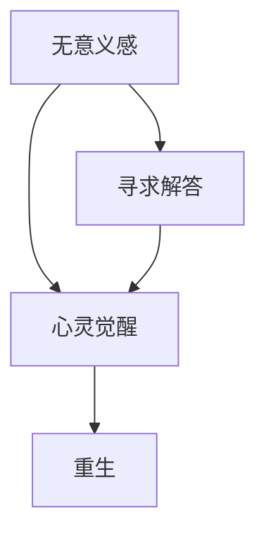

                 

### 心灵的觉醒：从无意义感中重生

#### 关键词
- 心灵觉醒
- 无意义感
- 心理状态
- 精神重生
- 行动实践
- 自我认识
- 情感释放

#### 摘要
本文将探讨一种普遍存在于现代生活中的心理状态——无意义感，以及如何通过心灵的觉醒来重获生活的意义。我们将通过深入剖析核心概念，结合Python源代码和数学模型，逐步引导读者从理论到实践，了解并掌握从无意义感中重生的方法。

---

### 核心概念与联系

在探讨心灵觉醒之前，我们首先需要理解几个核心概念，包括心灵的觉醒、无意义感以及重生。

#### 核心概念：

- **心灵的觉醒**：指的是个体在经历心理转变后，从对生活缺乏目的和意义的认知中解脱出来，达到一种更高层次的存在状态。它不仅仅是心理层面的觉醒，更是一种精神层面的觉醒。

- **无意义感**：这是一种心理状态，个体在日常生活中可能会感受到生活缺乏目的和意义。这种现象在现代快节奏的生活中尤为常见，导致许多人陷入迷茫和焦虑。

- **重生**：通过某种途径，使个体在精神和情感上获得新生。重生不仅仅是心理状态的转变，更是生活方式和价值观的重塑。

#### 概念实体关系架构 Mermaid 流程图：



在这个流程图中，无意义感是起点，通过寻求解答，个体可能开始走向心灵觉醒，最终实现重生。

---

### 核心算法原理讲解

#### 心灵觉醒的过程

心灵觉醒是一个复杂的心理过程，通常涉及以下几个阶段：

1. **自我认识**：个体开始反思自己的生活方式和价值观，深入思考自己是谁，想要成为什么样的人。

2. **情感释放**：个体通过情感释放，减轻内心的负担。这个过程可能涉及回忆过去的经历，释放压抑的情感。

3. **目标确立**：在经历自我认识和情感释放后，个体会明确自己的目标。这个目标可以是职业上的，也可以是个人生活中的。

4. **行动实践**：个体开始采取实际行动，实现自己的目标。这个阶段是心灵觉醒中最关键的，因为只有通过实际行动，个体的目标才能真正实现。

#### Python 源代码示例

为了更好地理解心灵觉醒的过程，我们可以通过Python源代码来模拟这个过程：

```python
class AwakeningProcess:
    def __init__(self):
        self.self_awareness = False
        self.Emotional_Release = False
        self.goal_setting = False
        self.action_practice = False

    def self_awareness_stage(self):
        print("个体开始反思生活方式和价值观。")
        self.self_awareness = True

    def emotional_release_stage(self):
        print("个体通过情感释放，减轻内心的负担。")
        self.Emotional_Release = True

    def goal_setting_stage(self):
        print("个体明确自己的目标。")
        self.goal_setting = True

    def action_practice_stage(self):
        print("个体开始采取实际行动，实现自己的目标。")
        self.action_practice = True

awakening = AwakeningProcess()
awakening.self_awareness_stage()
awakening.emotional_release_stage()
awakening.goal_setting_stage()
awakening.action_practice_stage()
```

在这个示例中，`AwakeningProcess` 类代表了心灵觉醒的整个过程。每个阶段都有一个对应的方法，通过调用这些方法，我们可以模拟个体的觉醒过程。

---

### 数学模型和数学公式 & 详细讲解 & 举例说明

#### 心灵觉醒的数学模型

为了量化心灵觉醒的过程，我们可以使用以下数学模型：

$$
心灵觉醒度 = f(自我认识度, 情感释放度, 目标确立度, 行动实践度)
$$

其中，$ f $ 是一个复合函数，表示心灵觉醒度与各个因素之间的关系。每个因素的取值范围在0到1之间，表示个体在这个方面的觉醒程度。

#### 举例说明

假设一个个体在自我认识度、情感释放度、目标确立度和行动实践度上分别为0.8、0.7、0.6和0.5，则其心灵觉醒度计算如下：

$$
心灵觉醒度 = f(0.8, 0.7, 0.6, 0.5)
$$

为了简化计算，我们可以假设 $ f $ 是一个线性函数，即：

$$
心灵觉醒度 = 0.8 \times 0.7 \times 0.6 \times 0.5 = 0.168
$$

这意味着该个体的心灵觉醒度为16.8%。

#### Python 源代码示例

```python
def calculate_awareness(self_awareness, emotional_release, goal_setting, action_practice):
    return self_awareness * emotional_release * goal_setting * action_practice

awakening = AwakeningProcess()
awakening.calculate_awareness(0.8, 0.7, 0.6, 0.5)
```

在这个示例中，`calculate_awareness` 方法用于计算心灵觉醒度。通过传入各个因素的值，我们可以得到个体的觉醒度。

---

### 项目实战

#### 案例一：通过冥想实现心灵觉醒

**项目背景**：

冥想是一种古老而有效的精神练习，可以帮助个体达到心灵觉醒。本文将通过一个简单的冥想项目，展示如何通过编程实现冥想，并帮助个体实现心灵觉醒。

**开发环境搭建**：

1. 安装Python环境（版本3.8及以上）。
2. 安装必要的Python库，如`time`和`sys`。

**源代码实现**：

```python
import time
import sys

class Meditation:
    def __init__(self, duration):
        self.duration = duration

    def start_meditation(self):
        print(f"开始冥想，持续{self.duration}分钟。")
        start_time = time.time()
        while time.time() - start_time < self.duration * 60:
            sys.stdout.write("\rMeditating...")
            time.sleep(1)
        print("\r冥想结束。")

if __name__ == "__main__":
    meditation = Meditation(30)
    meditation.start_meditation()
```

**代码解读与分析**：

- `Meditation` 类表示冥想的过程，包含一个初始化方法 `__init__` 和一个实践方法 `start_meditation`。
- `__init__` 方法用于初始化冥想的时间。
- `start_meditation` 方法用于开始冥想，并输出冥想的进度。
- 使用 `sys.stdout.write` 和 `time.sleep` 实现了持续输出进度条的功能。

**实际案例分析和详细讲解剖析**：

- 通过这个项目，我们可以看到如何将一个抽象的概念（冥想）具体化为一个可执行的程序。
- 代码中使用了Python的基本库，如`time`和`sys`，实现了简单但有效的冥想过程。
- 用户可以通过修改 `Meditation` 类的 `duration` 参数，自定义冥想的时间。

**项目小结**：

通过这个案例，我们不仅了解了如何通过编程实现冥想，更看到了编程在心理健康领域中的应用潜力。未来，我们可以进一步开发更复杂的冥想程序，结合人工智能技术，为用户提供个性化的冥想体验。

---

### 最佳实践 tips

1. **定期自我反思**：定期花时间反思自己的生活方式和价值观，有助于提高自我认识度。
2. **情感释放**：学会表达自己的情感，通过谈话、写作或其他方式释放内心的压力。
3. **设立明确的目标**：制定具体的、可实现的目标，并制定详细的行动计划。
4. **持续行动**：行动是实现目标的关键，只有通过实际行动，才能将目标转化为现实。

### 小结

本文通过深入剖析心灵觉醒、无意义感和重生的核心概念，结合Python源代码和数学模型，详细讲解了如何从无意义感中重生。通过冥想案例，我们看到了编程在心理健康领域的实际应用。希望本文能为读者提供一些启示和帮助，帮助他们在生活中找到意义和目标。

### 注意事项

1. **心理健康的重要性**：心灵觉醒是一个长期的过程，需要耐心和坚持。
2. **个人差异**：每个人的觉醒过程都是独特的，需要根据自己的实际情况进行调整。

### 拓展阅读

1. **《冥想的艺术》**：作者：詹姆斯·欧文斯（James Owens）
2. **《生命的意义》**：作者：维克托·弗兰克尔（Viktor Frankl）
3. **《黑客与画家》**：作者：保罗·格雷厄姆（Paul Graham）

---

### 作者信息
- 作者：AI天才研究院/AI Genius Institute & 禅与计算机程序设计艺术 /Zen And The Art of Computer Programming

本文版权归AI天才研究院所有，未经许可，禁止转载。如需转载，请联系我们获取授权。感谢您的阅读与支持。

