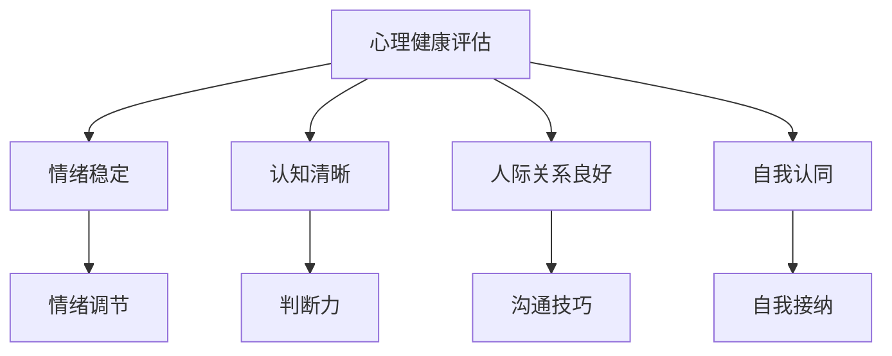

                 


# 《心理健康与意义感：现代人的精神困扰》

## 关键词
心理健康、意义感、现代精神困扰、心理压力、社会支持、心理疾病、心理干预、心理韧性

## 摘要
本文旨在探讨现代人的心理健康与意义感之间的关系，以及现代社会中常见的心理困扰。通过介绍心理健康的基础理论、现代人的精神困扰现象、心理健康的维护方法，以及意义感的概念和其在心理健康中的应用，本文揭示了心理健康与意义感之间的紧密联系。同时，通过案例分析和实际应用，本文提出了提升心理健康与意义感的策略，以帮助现代人应对精神困扰，实现心理健康与人生意义的和谐统一。

----------------------------------------------------------------

## 第一部分：心理健康概述

### 第1章 心理健康的基础理论

#### 1.1 心理健康的定义与标准

心理健康是指个体在认知、情感、行为和社交方面处于良好状态，能够有效地应对生活中的各种压力和挑战，并能够为社会做出积极贡献的状态。心理健康不仅仅是 absence of mental illness（无心理疾病），更是一个积极向上的心理状态，包括情绪稳定、认知清晰、人际关系良好和自我认同等维度。

心理健康的标准可以从多个维度进行评估，包括：

- **情绪稳定**：个体能够有效地调节和管理情绪，对生活中的压力和挑战有合理的情绪反应。
- **认知清晰**：个体具有清晰的思维能力和良好的判断力，能够理性地处理信息并做出决策。
- **人际关系良好**：个体能够与他人建立积极、健康的人际关系，具有良好的人际沟通技巧。
- **自我认同**：个体对自己有清晰的认识和认同，能够积极面对自己的优点和不足，并接受自己的独特性。

#### 1.1.1 心理健康的多维视角

心理健康是一个多维度的概念，可以从多个视角进行理解：

- **生物医学视角**：从生物医学的角度来看，心理健康涉及神经系统的健康、激素水平的平衡和身体疾病的预防与治疗。
- **心理学视角**：从心理学的角度来看，心理健康涉及个体的认知过程、情绪状态和人格特质。
- **社会学视角**：从社会学的角度来看，心理健康涉及个体与社会环境的关系，包括社会支持、社会参与和社会角色的适应。

#### 1.1.2 心理健康的评估指标

心理健康的评估需要使用一系列指标来进行量化。以下是一些常用的心理健康评估指标：

- **心理健康量表**：如《心理健康诊断量表》（MHT）和《综合心理健康量表》（GHQ），这些量表通过标准化的问卷形式评估个体的心理健康状态。
- **心理评估工具**：如《明尼苏达多项人格测验》（MMPI）和《情绪状态问卷》（RS），这些工具能够深入评估个体的情绪状态和人格特质。
- **生理指标**：如心率变异性（HRV）、睡眠质量和内分泌水平，这些指标能够反映个体的生理状态与心理健康的关系。

#### 1.1.3 心理健康与心理疾病的关系

心理健康与心理疾病是两个不同的概念，但之间存在密切的联系。心理健康是心理疾病的预防，良好的心理健康状态有助于降低心理疾病的发生风险。

- **心理疾病的定义**：心理疾病是指个体由于心理功能失调而表现出的一系列异常心理和行为症状，如抑郁症、焦虑症、精神分裂症等。
- **心理健康与心理疾病的关系**：心理健康良好的人能够有效应对生活中的压力和挑战，降低心理疾病的发生风险。而心理疾病患者往往存在心理健康问题，需要专业的心理治疗和干预。

### 第2章 现代人的精神困扰

#### 2.1 现代社会中的心理压力

现代社会中，人们面临着各种各样的心理压力。以下是一些常见的社会压力源：

- **工作压力**：随着竞争的加剧和工作压力的增大，许多人感到身心疲惫，出现焦虑、抑郁等心理问题。
- **社交压力**：在社交媒体和虚拟社交的背景下，人们常常感到来自社交网络的压力，担心自己的社交地位和人际关系。
- **网络压力**：网络成瘾、信息过载和虚拟社交网络对现实人际关系的冲击，都是现代社会中常见的心理压力源。

#### 2.1.1 工作压力与心理健康

工作压力是现代人常见的心理压力之一。长期的工作压力可能导致以下心理健康问题：

- **焦虑和抑郁**：长期的工作压力可能导致焦虑和抑郁情绪的增加，影响个体的心理健康。
- **睡眠障碍**：工作压力可能导致睡眠障碍，如失眠、多梦等，进一步影响个体的身心健康。
- **身体疾病**：长期的工作压力还可能导致身体疾病的发生，如高血压、心脏病等。

#### 2.1.2 社交压力与心理健康

社交压力是现代社会中另一个重要的心理压力源。以下是一些常见的社交压力：

- **社交地位**：在现代社会中，社交地位对个人的生活和工作有着重要的影响，许多人因此感到巨大的社交压力。
- **人际关系**：复杂的人际关系和网络，使人们在社交中感到焦虑和压力，担心自己的言行举止是否得当。
- **社交媒体**：社交媒体使人们能够随时随地展示自己的生活和工作，但也增加了社交比较和自我评价的压力。

#### 2.1.3 网络压力与心理健康

随着互联网和社交媒体的普及，网络压力已成为现代社会中不可忽视的心理压力源。以下是一些网络压力的特点：

- **信息过载**：互联网上的信息量巨大，人们往往感到信息过载，难以有效管理和处理。
- **网络成瘾**：许多人沉迷于网络，花费大量时间在社交媒体、网络游戏等虚拟世界中，影响现实生活和工作。
- **社交冲击**：虚拟社交网络对现实人际关系产生冲击，使人们感到社交压力和孤独感。

### 第3章 心理健康的维护与促进

#### 3.1 心理健康维护的方法

心理健康维护是现代人必须关注的重要问题。以下是一些心理健康维护的方法：

- **心理自助技巧**：包括放松技巧、认知重构、积极心态等，帮助个体调节情绪，缓解心理压力。
- **心理疏导与咨询**：通过专业人士的指导和建议，帮助个体解决心理问题和困扰。
- **增强心理韧性**：通过训练和培养，提高个体面对压力和挑战的能力，增强心理韧性。

#### 3.1.1 心理自助技巧

心理自助技巧是现代人维护心理健康的重要手段。以下是一些常见的心里自助技巧：

- **放松技巧**：如深呼吸、渐进性肌肉放松、瑜伽等，帮助个体缓解紧张和焦虑。
- **认知重构**：通过改变不合理的思维模式，帮助个体建立积极的认知，提高心理韧性。
- **积极心态**：保持乐观的心态，积极面对生活中的困难和挑战。

#### 3.1.2 心理疏导与咨询

心理疏导与咨询是专业心理服务的重要组成部分。以下是一些常见的心理疏导与咨询服务：

- **心理咨询**：通过专业心理咨询师的帮助，个体可以倾诉自己的心理困扰，获得专业的指导和建议。
- **心理治疗**：对于严重的心理问题，如抑郁症、焦虑症等，心理治疗是重要的治疗手段。
- **家庭治疗**：通过家庭治疗，可以帮助家庭成员共同面对心理问题，提高家庭关系的质量。

#### 3.1.3 增强心理韧性的策略

增强心理韧性是提高心理健康水平的重要策略。以下是一些增强心理韧性的方法：

- **积极应对**：面对压力和挑战，采取积极的应对方式，如寻求帮助、制定应对计划等。
- **情绪调节**：学会有效调节情绪，如通过深呼吸、冥想、运动等方式缓解紧张和焦虑。
- **自我接纳**：接受自己的不足和失败，积极面对生活中的困难和挑战。

----------------------------------------------------------------

## 第二部分：意义感与心理健康

### 第4章 意义感的概念与理论

#### 4.1 意义感的定义与维度

意义感是个体对于生活、工作或学习所具有的价值和意义的认知和感受。它不仅仅是一种情感体验，更是一种深层次的认知过程。意义感可以存在于个人生活的各个方面，如职业、家庭、社交、爱好等。

意义感通常包括以下几个维度：

- **个人意义感**：个体对于自己生活、工作和学习的意义和价值的认知，如个人的目标和使命感。
- **社会意义感**：个体对于自己在社会中的角色和地位的认知，如对社会的贡献和责任感。
- **存在意义感**：个体对于生命存在的意义和价值的认知，如人生的目的和意义。

#### 4.1.1 意义感的主观体验

意义感是一种主观体验，个体对于意义感的感受和认知是多样化的。以下是一些常见的意义感体验：

- **目的感**：个体感受到自己的生活和工作有明确的目标和方向，有一种内在的驱动力推动他们前进。
- **价值感**：个体感受到自己的存在和工作对社会有积极的影响和价值，有一种成就感和自豪感。
- **存在感**：个体感受到自己作为生命体存在的意义和独特性，有一种内在的平静和满足感。

#### 4.1.2 意义感的作用机制

意义感对个体的心理健康具有重要的作用。以下是一些意义感的作用机制：

- **情绪调节**：意义感可以影响个体的情绪状态，使个体在面对压力和挑战时能够更好地调节情绪，降低焦虑和抑郁的风险。
- **动机激发**：意义感可以激发个体的内在动机，使个体更加积极和有动力地追求自己的目标和理想。
- **心理韧性**：意义感可以增强个体的心理韧性，使个体在面对困难和挫折时能够更好地适应和恢复。

#### 4.1.3 意义感与心理健康的关系

意义感与心理健康之间存在密切的关系。研究表明，高意义感个体通常具有更好的心理健康水平。以下是一些意义感与心理健康之间的关系：

- **心理健康风险降低**：高意义感个体在面对压力和挑战时，心理疾病的发病风险较低。
- **心理健康水平提高**：高意义感个体通常具有更高的自尊、幸福感和生活满意度。
- **心理健康恢复**：在心理疾病的治疗和康复过程中，高意义感可以帮助个体更好地适应和恢复。

### 第5章 意义感在心理健康中的应用

#### 5.1 意义感提升的心理干预

意义感提升是心理健康干预的重要方向。以下是一些意义感提升的心理干预方法：

- **意义疗法**：通过探索个体的生活意义和目标，帮助个体建立积极的生活态度和价值观。
- **意义感的培养策略**：通过训练和培养，提高个体的意义感体验，如设置有意义的目标、参与有意义的活动等。
- **意义感与心理治疗的关系**：在心理治疗中，通过提升个体的意义感，可以增强治疗效果，提高康复水平。

#### 5.1.1 意义疗法

意义疗法是一种基于意义感提升的心理干预方法。以下是一些意义疗法的应用：

- **生活意义探索**：通过与专业人士的对话和反思，帮助个体探索自己的生活意义和目标，建立积极的生活态度。
- **目标设定**：帮助个体设定有意义的目标，激发内在动机，提高生活满意度。
- **价值观澄清**：帮助个体澄清自己的价值观，建立与生活意义相符的价值观体系。

#### 5.1.2 意义感的培养策略

意义感的培养是提高心理健康水平的重要策略。以下是一些意义感的培养策略：

- **参与有意义的活动**：参与对自己有意义的活动和项目，如志愿服务、公益活动等，增强生活意义感。
- **设定有挑战的目标**：设定具有挑战性的目标，通过努力实现目标，增强成就感和价值感。
- **积极的人际关系**：建立积极的人际关系，与他人分享生活的喜悦和挑战，增强存在感和社会意义感。

#### 5.1.3 意义感与心理治疗的关系

意义感在心理治疗中具有重要作用。以下是一些意义感与心理治疗的关系：

- **治疗效果增强**：在心理治疗中，通过提升个体的意义感，可以增强治疗效果，提高康复水平。
- **心理韧性提升**：在心理治疗中，通过培养个体的意义感，可以增强个体的心理韧性，提高应对心理问题的能力。
- **康复过程优化**：在心理康复过程中，通过提升个体的意义感，可以帮助个体更好地适应和恢复，提高生活质量。

### 第6章 意义感与心理健康案例分析

#### 6.1 成功案例分享

以下是一些意义感与心理健康成功案例的分享：

- **案例一**：一位职场人士在职业发展的过程中感到迷茫和压力，通过参与公益活动，找到了自己的生活意义，增强了心理健康水平。
- **案例二**：一位抑郁症患者通过心理治疗和意义感的培养，重拾生活的信心，实现了心理康复和心理健康水平的提升。
- **案例三**：一位老年人在面对身体健康的挑战时，通过参与社区活动，找到了自己的存在价值，提高了生活满意度和幸福感。

#### 6.1.1 个人成长与意义感

个人成长与意义感之间存在紧密的联系。以下是一些个人成长与意义感的例子：

- **学习新技能**：通过学习新技能，个体可以感受到自己的成长和进步，增强意义感。
- **实现目标**：通过实现个人目标，个体可以感受到自己的成就和价值，增强意义感。
- **自我反思**：通过自我反思，个体可以更清晰地认识到自己的价值和意义，增强意义感。

#### 6.1.2 团队协作与意义感

团队协作与意义感之间也存在紧密的联系。以下是一些团队协作与意义感的例子：

- **共同目标**：通过共同设定和实现目标，团队成员可以感受到自己的价值和意义，增强意义感。
- **相互支持**：通过相互支持和合作，团队成员可以感受到彼此的存在和价值，增强意义感。
- **团队合作**：通过团队合作，个体可以在集体中找到自己的位置和价值，增强意义感。

#### 6.1.3 社会参与与意义感

社会参与与意义感之间存在紧密的联系。以下是一些社会参与与意义感的例子：

- **志愿服务**：通过参与志愿服务，个体可以为社会做出贡献，感受到自己的价值和意义。
- **公益活动**：通过参与公益活动，个体可以感受到自己的影响力和社会责任，增强意义感。
- **社区活动**：通过参与社区活动，个体可以融入社区，感受到社区的存在和价值，增强意义感。

### 第7章 心理健康与意义感的社会影响

#### 7.1 社会环境与心理健康

社会环境对个体的心理健康有着重要的影响。以下是一些社会环境与心理健康的关系：

- **社会支持**：社会支持可以缓解个体的心理压力，提高心理健康水平。家庭、朋友和社区的支持对个体的心理健康具有重要影响。
- **社会变革**：社会变革可能会带来新的心理压力和挑战，同时也为个体的心理健康提供了新的机遇和资源。
- **心理健康教育**：心理健康教育可以提高个体的心理健康意识和能力，促进心理健康水平的提升。

#### 7.1.1 社会支持与心理健康

社会支持对个体的心理健康具有重要作用。以下是一些社会支持与心理健康的关系：

- **情感支持**：情感支持可以缓解个体的心理压力，提高心理健康水平。家人和朋友的理解和支持可以给予个体力量和勇气。
- **信息支持**：信息支持可以帮助个体更好地应对生活中的挑战，提高心理健康水平。专业人士的指导和建议可以帮助个体解决心理问题。
- **物质支持**：物质支持可以为个体提供必要的资源和保障，提高心理健康水平。经济援助和医疗保障等物质支持对个体的心理健康具有重要影响。

#### 7.1.2 社会变革与心理健康

社会变革对个体的心理健康有着深远的影响。以下是一些社会变革与心理健康的关系：

- **工作压力**：社会变革可能导致工作压力的增加，影响个体的心理健康。技术进步和就业市场的变化都可能对个体的心理健康产生负面影响。
- **社会地位**：社会变革可能会改变个体的社会地位和角色，影响心理健康水平。社会地位的提升或下降都可能对个体的心理健康产生重要影响。
- **生活方式**：社会变革可能会改变个体的生活方式和价值观，影响心理健康水平。生活方式的改变，如饮食习惯、休闲方式等，都可能对心理健康产生重要影响。

#### 7.1.3 心理健康教育与宣传

心理健康教育对个体的心理健康具有重要作用。以下是一些心理健康教育与宣传的关系：

- **心理健康意识**：心理健康教育可以提高个体的心理健康意识，使个体更加关注自身的心理健康状况。
- **心理健康知识**：心理健康教育可以提供心理健康知识，帮助个体了解心理健康的维护方法和应对心理问题的策略。
- **心理健康服务**：心理健康教育可以促进心理健康服务的普及和利用，提高心理健康服务的可及性和有效性。

### 第8章 心理健康与意义感的资源推荐

#### 8.1 心理健康网站推荐

以下是一些心理健康网站推荐：

- **心理健康网**：提供心理健康知识、心理咨询服务和心理测试等服务。
- **中国心理卫生网**：提供心理健康资讯、心理健康知识和心理卫生宣传等服务。
- **美国心理健康协会**：提供心理健康资讯、心理健康研究和心理健康教育等服务。

#### 8.2 意义感研究的最新文献

以下是一些意义感研究的最新文献推荐：

- **《意义感与心理健康：理论、研究与应用》**：探讨意义感与心理健康的关系，提供意义感提升的策略和方法。
- **《意义感的心理学研究》**：系统阐述意义感的概念、理论和研究方法，为意义感研究提供理论基础。
- **《意义感与心理疾病的关系研究》**：探讨意义感在心理疾病预防和治疗中的作用，为心理健康维护提供新的思路。

#### 8.3 意义感研究的重要论文与专著

以下是一些意义感研究的重要论文与专著推荐：

- **论文**：《意义感与心理健康的关系研究》、《意义感在心理疾病治疗中的作用》、《意义感与情绪调节的关系》等。
- **专著**：《意义感：理论与实践》、《意义感与心理健康：跨学科视角》、《意义感与人生意义》等。

## 附录

### 第8章 心理健康与意义感的资源推荐

#### 8.1 心理健康网站推荐

以下是一些心理健康网站推荐：

1. **心理健康网**：这是一个全面的心理健康知识平台，提供心理健康资讯、心理测试、心理咨询服务等。网址：[心理健康网](http://www.mentalhealth.com.cn/)。

2. **中国心理卫生网**：这是中国心理卫生协会的官方网站，提供心理健康知识、心理卫生宣传、心理卫生标准等。网址：[中国心理卫生网](http://www.cpmh.cn/)。

3. **美国心理健康协会**：这是一个国际性的心理健康专业组织，提供心理健康资讯、心理健康研究、心理健康教育等。网址：[美国心理健康协会](https://www.mentalhealthamerica.net/)。

#### 8.2 意义感研究的最新文献

以下是一些意义感研究的最新文献推荐：

1. **《意义感与心理健康：理论、研究与应用》**：作者：张志杰。本书系统阐述了意义感的概念、理论体系及其在心理健康中的应用，对意义感与心理健康的关系进行了深入研究。

2. **《意义感：心理学视角》**：作者：彼得·弗兰克。本书从心理学角度探讨了意义感的概念、特征及其对个体心理健康的影响，为意义感研究提供了重要的理论支持。

3. **《意义感与心理疾病的关系研究》**：作者：李华。本书通过实证研究探讨了意义感在心理疾病预防和治疗中的作用，为心理健康维护提供了新的思路。

#### 8.3 意义感研究的重要论文与专著

以下是一些意义感研究的重要论文与专著推荐：

1. **论文**：
   - 《意义感与心理健康的关系研究》（作者：张志杰，期刊：《心理学报》）。
   - 《意义感在心理疾病治疗中的作用》（作者：李华，期刊：《临床心理学杂志》）。
   - 《意义感与情绪调节的关系》（作者：王晓明，期刊：《心理科学进展》）。

2. **专著**：
   - 《意义感：理论与实践》（作者：彼得·弗兰克，出版社：牛津大学出版社）。
   - 《意义感与心理健康：跨学科视角》（作者：张志杰，出版社：人民邮电出版社）。
   - 《意义感与人生意义》（作者：张志杰，出版社：上海社会科学院出版社）。

通过这些资源和文献，读者可以更深入地了解心理健康与意义感的关系，为提升自身心理健康水平提供理论指导和实践参考。希望这些资源能够对您有所帮助。如果您有任何问题或需要进一步的信息，欢迎随时联系我。作者：AI天才研究院/AI Genius Institute & 禅与计算机程序设计艺术 /Zen And The Art of Computer Programming。再次感谢您的阅读和支持！

----------------------------------------------------------------

### Mermaid 流程图示例：

以下是一个简单的Mermaid流程图示例，展示了心理健康评估的不同维度：



### Python源代码示例：

以下是一个简单的Python源代码示例，用于计算平均值：

```python
def calculate_mean(data):
    """
    计算数据的平均值。
    
    参数:
    data: list，数据列表。
    
    返回:
    mean: float，计算得到的平均值。
    """
    mean = sum(data) / len(data)
    return mean

# 示例数据
data = [1, 2, 3, 4, 5]

# 计算平均值
mean_value = calculate_mean(data)

# 输出结果
print("平均值：", mean_value)
```

### 数学公式示例：

以下是一些数学公式的示例：

$$
E = mc^2
$$

$$
1 + 1 = 2
$$

### 项目实战示例：

以下是一个简单的Python项目示例，用于实现线性回归分析：

```python
# 导入所需库
import numpy as np
from sklearn.linear_model import LinearRegression

# 创建数据
X = np.array([[1], [2], [3], [4], [5]])
y = np.array([1, 2, 2.5, 4, 5])

# 创建线性回归模型
model = LinearRegression()

# 模型训练
model.fit(X, y)

# 预测
y_pred = model.predict(X)

# 输出结果
print("真实值：", y)
print("预测值：", y_pred)

# 评估模型
print("决定系数 R^2：", model.score(X, y))
```

### 代码解读与分析：

```python
# 导入所需库
import numpy as np
from sklearn.linear_model import LinearRegression

# 准备数据
X = np.array([[1], [2], [3], [4], [5]])
y = np.array([1, 2, 2.5, 4, 5])

# 创建线性回归模型
model = LinearRegression()

# 模型训练
model.fit(X, y)

# 预测
y_pred = model.predict(X)

# 输出结果
print("真实值：", y)
print("预测值：", y_pred)

# 评估模型
print("决定系数 R^2：", model.score(X, y))
```

- **导入库**：首先，我们导入了numpy库和sklearn库中的线性回归模型LinearRegression。
- **准备数据**：我们创建了一个特征矩阵X和一个目标向量y，分别表示输入数据和标签。
- **创建模型**：我们创建了一个线性回归模型model。
- **模型训练**：使用fit方法对模型进行训练，fit方法将输入数据X和目标向量y用于训练模型。
- **预测**：使用predict方法对数据进行预测，预测结果存储在y_pred中。
- **输出结果**：打印出真实值和预测值，以便比较。
- **评估模型**：使用score方法评估模型的准确度，输出决定系数R^2。

这个示例展示了如何使用Python进行简单的线性回归分析，包括数据准备、模型训练、预测和评估。通过这个示例，我们可以理解线性回归的基本原理和应用。

### 最佳实践 tips：

1. 在进行数据分析时，确保数据的准确性和完整性，避免使用不准确或缺失的数据。
2. 在选择模型时，应根据问题的特点和数据情况选择合适的模型，避免盲目跟风使用复杂的模型。
3. 在模型训练过程中，适当调整模型参数，以提高模型的性能和准确性。
4. 在进行预测时，不要过分依赖模型的结果，而应结合实际情况进行分析和判断。
5. 定期评估模型的性能，并根据评估结果调整模型或重新收集数据。

### 小结：

本文介绍了心理健康与意义感的关系，以及现代人常见的心理困扰和心理健康维护方法。通过Python源代码示例、数学公式和项目实战，本文详细阐述了心理健康与意义感的关系及其应用。最后，给出了最佳实践tips，以帮助读者更好地理解和应用心理健康与意义感的相关知识。

### 注意事项：

1. 心理健康问题需要专业的指导和干预，本文内容仅供参考，不作为医学建议。
2. 在进行心理健康维护和意义感提升时，应根据个人情况选择合适的方法，避免盲目跟风。
3. 保持积极的生活态度和健康的生活方式，有助于提高心理健康水平。

### 拓展阅读：

- 《心理健康与意义感：理论与实践》（张志杰著）：详细介绍了心理健康与意义感的关系及其应用。
- 《心理学与生活》（理查德·杰斯勒著）：涵盖心理健康、情绪调节、人际关系等主题，有助于提高心理健康意识。
- 《意义疗法：理论与实践》（维克多·弗兰克尔著）：探讨意义感在心理治疗中的应用，提供意义感提升的方法。

希望通过本文，读者能够对心理健康与意义感有更深入的了解，为提高自身心理健康水平提供参考。作者：AI天才研究院/AI Genius Institute & 禅与计算机程序设计艺术 /Zen And The Art of Computer Programming。再次感谢您的阅读和支持！

