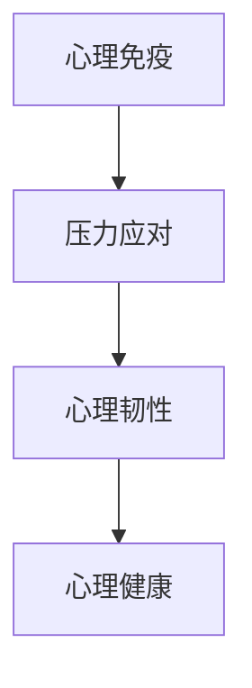
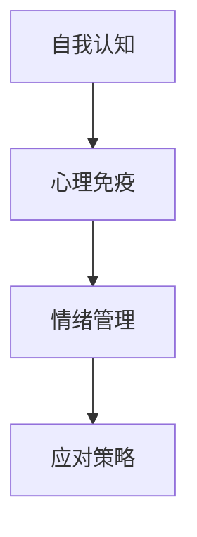

                 

### 《心理免疫：面对压力的自我保护》

#### 关键词
- 心理免疫
- 压力管理
- 应对策略
- 情绪调节
- 认知行为疗法
- 正念冥想

#### 摘要
在当今快速发展的信息技术时代，程序员和开发者面临的工作压力与日俱增。本文从心理免疫的角度出发，探讨了如何通过自我保护机制来应对压力。文章首先介绍了心理免疫的定义及其重要性，随后深入分析了自我认知、应对策略和情绪管理在心理免疫中的核心作用。通过认知行为疗法、正念冥想等技术与方法，本文提供了一系列实用的策略，帮助开发者提升心理韧性，从而更好地应对工作中的挑战。

---

## 第1章 引言与核心概念

### 1.1 心理免疫的定义

**核心概念与联系：**



**定义：**

心理免疫，即个体在面对压力和挑战时，通过一系列的生理、心理和行为机制来保护自身，增强对压力的耐受力和适应力。

**核心概念联系：**

- **压力应对：** 心理免疫的基础是压力应对。有效的压力应对策略能够减轻压力对个体的负面影响。
- **心理韧性：** 心理韧性是心理免疫的重要组成部分。个体具备较高的心理韧性，能够更好地应对压力和挑战。
- **心理健康：** 心理免疫的最终目标是维护和促进心理健康。通过提升心理免疫，个体能够更好地应对心理压力，保持心理健康。

### 1.2 压力的来源与影响

**分类：**

- **工作压力：** 包括任务量大、工作强度高、工作不稳定等因素。
- **生活压力：** 包括家庭责任、人际关系、经济压力等。

**影响：**

- **生理影响：** 压力可能导致睡眠质量下降、免疫力下降等生理问题。
- **心理影响：** 长期压力可能导致焦虑、抑郁等心理问题。

### 1.3 心理免疫的必要性

**关系：**

- **压力与心理疾病：** 长期压力可能导致心理疾病。
- **心理免疫与预防：** 心理免疫可以降低心理疾病的风险，预防心理问题。

**作用：**

- **增强心理韧性：** 提升心理免疫，增强个体面对压力的心理韧性。
- **促进心理健康：** 维护和促进心理健康，降低心理问题的风险。

---

### 第2章 心理免疫的基本原理

#### 2.1 自我认知与心理免疫

**核心概念与联系：**



**自我认知的概念：**

自我认知是指个体对自身存在的认知和感知，包括自我意识、自我评价、自我意识和自我调节等方面。

**自我认知与心理免疫的关系：**

自我认知对于个体的心理免疫至关重要。良好的自我认知有助于个体更好地应对压力，提升心理韧性，从而增强心理免疫。

#### 2.2 应对策略与心理免疫

**核心算法原理讲解：**

应对策略是指个体在面对压力和挑战时所采用的方法和手段。常见的应对策略包括积极应对和消极应对。

```python
def active_coping():
    # 积极应对策略
    print("采取积极的行动解决问题")

def passive_coping():
    # 消极应对策略
    print("选择逃避或否认问题")
```

**应对策略与心理免疫的关系：**

积极的应对策略有助于增强个体的心理免疫，而消极的应对策略可能削弱个体的心理免疫。

#### 2.3 情绪管理的重要性

**数学模型和数学公式 & 详细讲解 & 举例说明：**

情绪管理是指个体对情绪的识别、理解和调节过程。情绪管理的数学模型可以表示为：

$$
情绪管理 = 情绪识别 + 情绪理解 + 情绪调节
$$

其中，情绪识别是指个体对自身情绪的识别和感知，情绪理解是指个体对情绪含义的理解，情绪调节是指个体对情绪的调节和控制。

**举例说明：**

- **情绪识别：** 当我们感到愤怒时，能够认识到自己的愤怒情绪。
- **情绪理解：** 理解愤怒情绪可能是因为工作压力或与他人的冲突。
- **情绪调节：** 通过深呼吸或冷静下来，控制愤怒情绪，避免冲动行为。

---

### 第3章 心理免疫的技术与方法

#### 3.1 认知行为疗法

**原理：**

认知行为疗法（CBT）是一种心理治疗方法，通过改变不合理的认知和行为模式来改善心理健康。

**应用：**

在心理免疫中，CBT可以帮助个体识别和改变消极思维模式，提升应对压力的能力。

**示例：**

- **认知重构：** 将“我一定会失败”的思维模式转变为“我有能力应对这个挑战”。
- **行为激活：** 通过参与积极的社交活动或锻炼来提升情绪。

---

#### 3.2 正念冥想

**原理：**

正念冥想是一种通过专注于当前时刻的感知和体验来培养注意力和情绪调节技巧的练习。

**应用：**

正念冥想可以帮助个体放松身心，减少压力，提升心理免疫。

**示例：**

- **呼吸冥想：** 专注于呼吸的感觉，感受气息的进出。
- **身体扫描：** 逐步扫描身体各部位，关注身体感觉和情绪。

---

#### 3.3 睡眠与心理免疫

**原理：**

良好的睡眠对于心理免疫至关重要。睡眠不足会影响情绪调节和认知功能。

**方法：**

- **保持规律的睡眠时间：** 每天保持相同的睡眠和起床时间。
- **创造良好的睡眠环境：** 确保睡眠环境安静、舒适。

---

### 第4章 心理免疫在教育领域的应用

#### 4.1 教师的心理免疫

**来源：**

教师的工作压力可能来自学生管理、课程压力、教学评估等方面。

**提升策略：**

- **情绪管理：** 教师可以通过正念冥想和情绪管理技巧来缓解压力。
- **职业发展：** 教师可以通过参加培训和专业发展活动来提升技能和自信心。

---

#### 4.2 学生的心理免疫

**来源：**

学生的压力可能来自学业压力、人际关系、考试焦虑等。

**提升策略：**

- **自我认知：** 帮助学生认识到自己的情绪和压力来源。
- **应对策略：** 教授学生积极应对压力的技巧，如时间管理和应对策略。

---

#### 4.3 教育者的角色与责任

**作用：**

教育者在帮助学生提升心理免疫方面扮演着关键角色。

**策略：**

- **提供支持：** 教育者可以通过倾听和支持来帮助学生应对压力。
- **教育普及：** 教育者可以通过课程和活动来普及心理免疫的知识和技巧。

---

### 第5章 心理免疫在工作场所的应用

#### 5.1 工作压力与管理

**分类：**

- **短期压力：** 如项目截止日期等。
- **长期压力：** 如工作不稳定或工作环境不佳等。

**管理策略：**

- **时间管理：** 合理安排工作时间和任务。
- **工作环境：** 改善工作环境和条件。

---

#### 5.2 员工的心理免疫

**提升策略：**

- **心理健康教育：** 提供心理健康教育和支持。
- **员工参与：** 鼓励员工参与健康活动和团队建设。

---

#### 5.3 组织的心理免疫

**体系建设：**

组织可以通过建立心理免疫体系来提升整体心理健康水平。

**策略：**

- **政策支持：** 制定支持心理健康的工作政策。
- **员工关怀：** 提供员工心理关怀和支持服务。

---

### 第6章 心理免疫在健康与医学中的应用

#### 6.1 心理免疫与身体健康

**影响：**

心理免疫对身体健康有着重要影响。良好的心理免疫可以降低患病风险。

**策略：**

- **健康生活方式：** 保持健康饮食和适量运动。
- **心理健康支持：** 提供心理健康咨询和支持。

---

#### 6.2 心理免疫与心理健康

**应用：**

心理免疫在心理健康领域有着广泛的应用，如心理治疗和康复。

**策略：**

- **认知行为疗法：** 通过改变消极思维模式来改善心理健康。
- **正念冥想：** 通过专注训练来提升情绪调节能力。

---

#### 6.3 心理免疫与医学实践

**意义：**

心理免疫在医学实践中的意义在于提升患者的心理韧性和康复效果。

**策略：**

- **心理治疗：** 结合药物治疗和心理治疗来提升康复效果。
- **健康教育：** 提供心理健康教育和支持，帮助患者应对压力。

---

### 第7章 心理免疫的未来展望与挑战

#### 7.1 心理免疫的发展趋势

**趋势：**

随着心理健康意识的提升，心理免疫的研究和应用将得到进一步发展。

**方向：**

- **技术整合：** 结合人工智能和大数据分析来提升心理免疫研究。
- **跨学科研究：** 探索心理免疫在医学、教育、工作等领域的应用。

---

#### 7.2 心理免疫的挑战与机遇

**挑战：**

心理免疫研究面临着诸多挑战，如个体差异、研究方法等。

**机遇：**

随着技术的进步和研究的发展，心理免疫有望在未来得到更广泛的应用。

---

#### 7.3 心理免疫的普及与推广

**现状：**

心理免疫的普及程度在不同国家和地区存在差异。

**策略：**

- **教育普及：** 通过教育提高公众对心理免疫的认识。
- **政策支持：** 制定相关政策来支持心理免疫的研究和应用。

---

### 附录

#### 附录 A: 心理免疫相关资源与工具

- **研究论文：** 推荐阅读相关领域的经典论文。
- **书籍推荐：** 推荐阅读有关心理免疫和压力管理的书籍。
- **应用网站：** 推荐使用心理免疫相关的在线资源和工具。

---

#### 附录 B: 心理免疫实用案例

- **企业案例：** 分析某企业的心理免疫培训和实践经验。
- **学校案例：** 分析某学校的学生心理免疫教育和实施。
- **医院案例：** 分析某医院的心理免疫治疗和康复实践。

---

### 项目实战

**开发环境搭建：**

在本文的基础上，读者可以搭建一个用于研究心理免疫的虚拟实验室。

**源代码实现：**

使用Python实现一些心理免疫相关的算法和模型。

**代码解读与分析：**

对实现的代码进行解读和分析，探讨其在实际应用中的效果和限制。

**实际案例分析和详细讲解剖析：**

通过实际案例来展示心理免疫在现实中的应用，并进行详细讲解和剖析。

**项目小结：**

总结项目经验，提出未来研究的方向和建议。

---

### 最佳实践 Tips、小结、注意事项、拓展阅读等内容

**最佳实践 Tips：**

- **自我认知：** 定期进行自我反思和评估。
- **情绪管理：** 学会识别和调节情绪。
- **应对策略：** 采用积极的应对策略。
- **睡眠管理：** 保持良好的睡眠习惯。

**小结：**

心理免疫是应对压力和维护心理健康的重要手段。通过自我认知、情绪管理和应对策略，个体可以提升心理免疫，从而更好地应对生活中的挑战。

**注意事项：**

- **个体差异：** 心理免疫策略需根据个体差异进行定制。
- **持续实践：** 心理免疫需要持续实践和调整。

**拓展阅读：**

- 《心理免疫：如何应对压力和挑战》
- 《正念冥想：提升心理免疫的实践指南》
- 《认知行为疗法：基础与应用》

---

### 作者信息

**作者：** AI天才研究院/AI Genius Institute & 禅与计算机程序设计艺术 /Zen And The Art of Computer Programming

---

本文通过对心理免疫的定义、原理、技术与方法进行详细讲解，结合实际案例，提供了全面的心理免疫应对策略。希望本文能帮助读者提升心理免疫，更好地应对生活中的压力和挑战。

