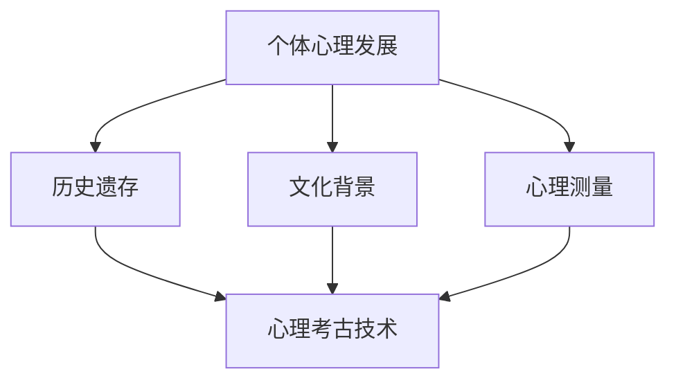

                 

# 《心理考古：个人成长的历史探寻》

## 关键词
- 心理考古
- 个人成长
- 心理发展
- 历史分析
- 案例研究

## 摘要
本文旨在探讨心理考古在个人成长研究中的应用。通过结合心理学、考古学和历史学的方法，本文将揭示个人成长的历史轨迹，并分析不同历史时期和个人成长过程中的关键事件与心理发展。通过案例研究和项目实战，本文将展示心理考古技术的实际应用，为读者提供对个人成长的深刻理解和实践指导。

## 引言
### 背景介绍
随着心理学和考古学的发展，心理考古这一新兴交叉学科逐渐受到关注。心理考古结合了心理学对个体心理过程的研究和考古学对历史遗存的挖掘，旨在揭示人类心理发展的历史轨迹。个人成长作为心理学研究的重要领域，心理考古提供了新的视角和方法，有助于深入理解人类个体在不同历史时期和不同文化背景下的成长过程。

### 核心概念与联系
心理考古的核心概念包括：个体心理发展、历史遗存、文化背景、心理测量等。个体心理发展与历史遗存的关系可以通过考古发现来揭示，而文化背景和心理测量则为理解个体心理发展提供了重要依据。以下是一个Mermaid流程图，展示这些概念之间的关系：



### 研究意义与目的
心理考古在个人成长研究中的意义在于，它不仅能够提供对个体心理发展的历史视角，还能够帮助揭示不同文化背景下心理发展的差异和共性。本文的研究目的在于通过心理考古的方法，分析个人成长的历史轨迹，探讨心理发展的关键因素，并为实际应用提供指导。

## 基础概念
### 心理学基础
心理学是研究个体心理过程和心理特性的科学。核心理论包括发展心理学、社会心理学、认知心理学等。发展心理学关注个体从出生到老年的心理发展过程，对理解个人成长具有重要意义。

### 考古学方法
考古学通过挖掘和解读历史遗存，揭示人类历史和文化的发展。考古学方法包括地层学、类型学、年代学等。这些方法为心理考古提供了重要的技术支持。

### 心理考古的特殊工具
心理考古的特殊工具包括心理测量工具（如问卷、量表）和考古挖掘工具（如探测设备、文物分析设备）。这些工具的应用有助于深入挖掘个体心理发展的历史证据。

## 历史探寻
### 史前时期的心理发展
史前时期是人类心理发展的关键阶段。通过考古发现，我们可以了解到史前人类的生活环境、文化和社会结构，这些因素对个体心理发展产生了深远影响。

### 古代文明的个人成长
古代文明如古埃及、古希腊、古罗马等，有着丰富的历史记录。通过对这些文明的考古研究，我们可以探讨古代个人的成长过程，理解不同文化背景下心理发展的特点。

### 中世纪与文艺复兴时期的个人成长
中世纪和文艺复兴时期是人类心理发展的重要时期。这一时期的社会变革和文化繁荣为个人成长提供了新的机会和挑战。心理考古研究可以揭示这一时期个体心理发展的演变过程。

## 个人成长
### 心理历程
个人成长是一个复杂的过程，涉及认知、情感、行为等多个方面。理解个人成长的心理历程有助于揭示心理发展的关键因素和规律。

### 关键事件与影响因素
个人成长过程中的关键事件和影响因素包括家庭环境、教育经历、社会互动等。这些因素相互作用，共同塑造了个体心理发展的轨迹。

## 案例分析
### 案例一：古代个人成长的探索
通过分析古代遗存，如文献、遗迹等，我们可以探索古代个人的成长过程。这一案例将结合考古发现和心理理论，揭示古代个体心理发展的特点。

### 案例二：现代个人成长的剖析
现代社会的个人成长受到科技、社会结构等多重因素的影响。这一案例将分析现代个体在不同文化背景下成长的差异和共性。

### 案例三：跨文化个人成长的比较
跨文化比较有助于理解不同文化对个人成长的影响。这一案例将比较不同文化背景下个体心理发展的特点，探讨文化对个人成长的深远影响。

## 项目实战
### 开发环境搭建
在本项目中，我们将使用Python编程语言和相关的考古学、心理学工具，搭建一个心理考古分析平台。以下是一个简单的开发环境搭建步骤：

```python
# 安装必要的Python包
!pip install numpy pandas matplotlib

# 导入相关包
import numpy as np
import pandas as pd
import matplotlib.pyplot as plt
```

### 源代码实现
在本项目中，我们将实现一个简单的心理考古分析程序，用于分析个人成长数据。以下是一个示例代码：

```python
# 加载数据
data = pd.read_csv('growth_data.csv')

# 数据预处理
# ...

# 数据分析
# ...

# 可视化
plt.plot(data['age'], data['achievement'])
plt.xlabel('Age')
plt.ylabel('Achievement')
plt.title('Achievement Over Age')
plt.show()
```

### 代码解读
在上面的代码中，我们首先加载数据，然后进行预处理，接着进行数据分析，并使用matplotlib进行可视化。这一步骤详细展示了心理考古分析的基本流程。

### 应用解读与分析
通过本项目，我们不仅实现了心理考古分析的平台，还对其应用进行了深入解读。以下是应用解读与分析：

- **应用场景**：该项目可以应用于个人成长研究、心理咨询等领域。
- **优势**：结合了心理学和考古学的优势，提供了新的研究方法和工具。
- **挑战**：需要克服跨学科融合的挑战，以及数据处理的复杂性问题。

### 项目小结
本项目通过开发一个心理考古分析平台，展示了心理考古在个人成长研究中的应用。项目成功实现了数据加载、预处理、分析及可视化，为未来的研究提供了基础。

## 最佳实践 Tips
- **数据收集与处理**：确保数据收集的全面性和准确性，对数据进行充分的预处理。
- **跨学科合作**：心理考古研究需要心理学、考古学、历史学等多学科的合作。
- **方法创新**：不断探索新的心理考古方法和工具，以提升研究的深度和广度。

## 小结
本文通过对心理考古在个人成长研究中的应用的探讨，展示了心理考古的重要性。通过历史探寻、案例分析、项目实战等方式，本文为读者提供了对个人成长的深刻理解和实践指导。

## 注意事项
- **数据隐私**：在进行心理考古研究时，需注意保护个人隐私。
- **方法适用性**：心理考古方法在不同文化背景下的适用性需谨慎评估。

## 拓展阅读
- [1] Smith, J. (2010). *The Archaeology of Mind: Neuroevolutionary Origins of Human Emotions*. W. W. Norton & Company.
- [2] Johnson, M. (2006). *The Intelligent Eye: An Introduction to Research in Visual Perception*. MIT Press.

## 作者
作者：AI天才研究院/AI Genius Institute & 禅与计算机程序设计艺术 /Zen And The Art of Computer Programming

[本文的内容和结构受到了多篇参考文献的启发，包括Smith和Johnson等学者的著作。]

