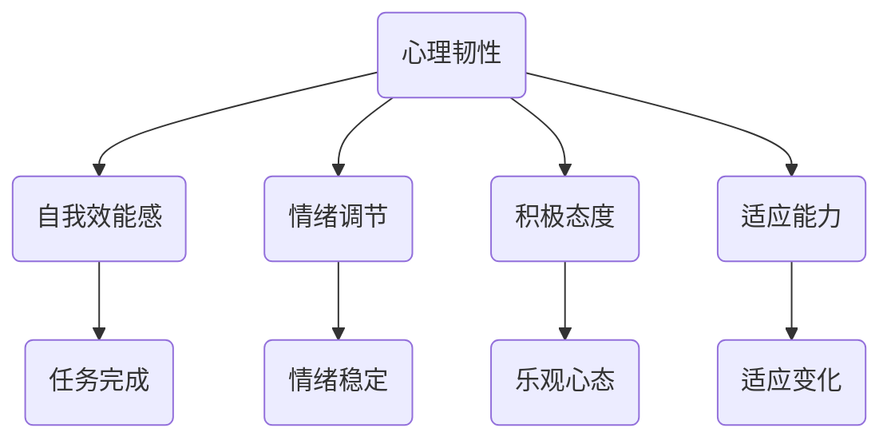
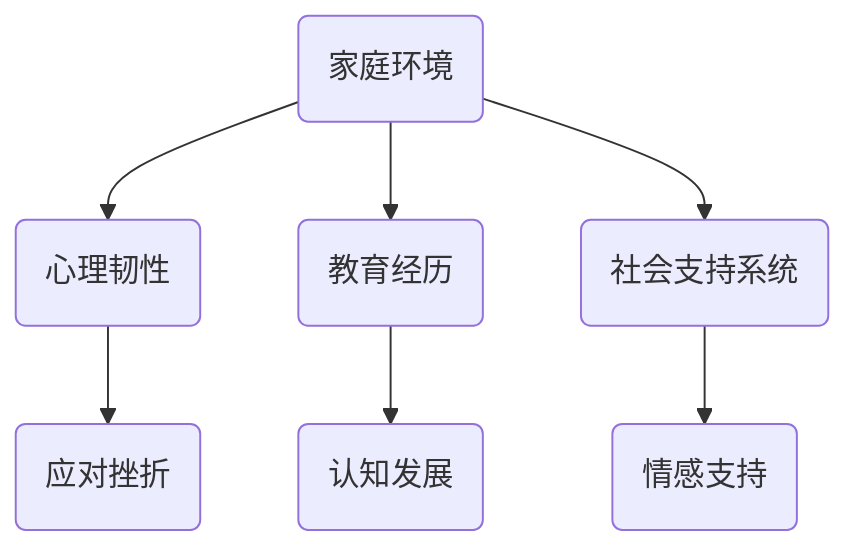
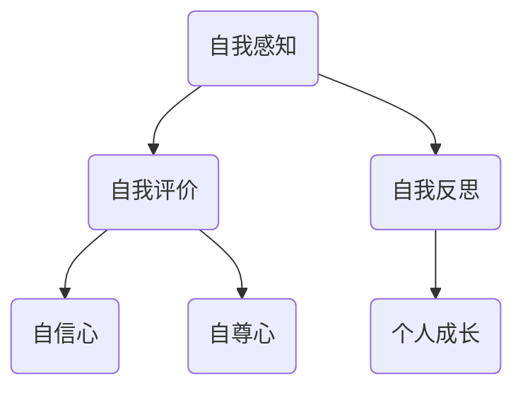
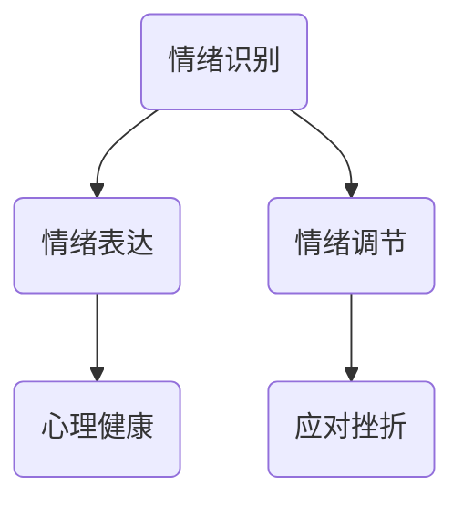
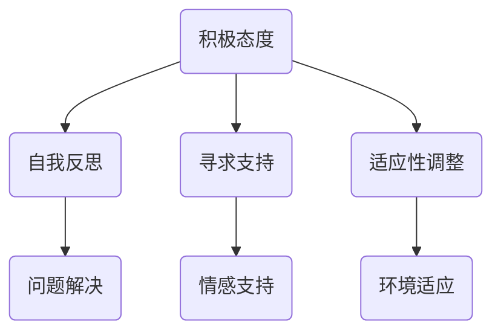
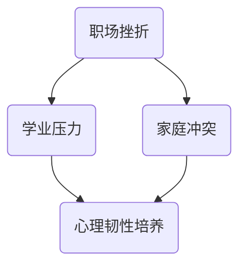
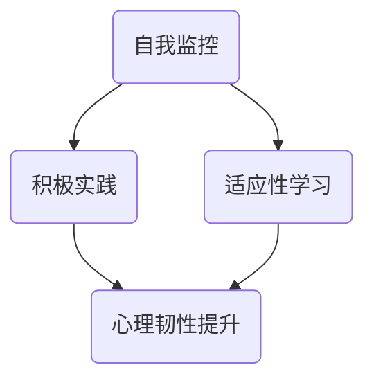
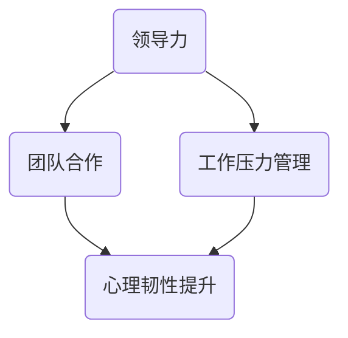
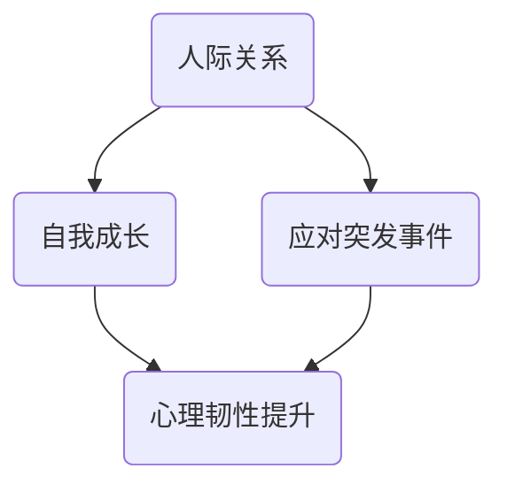
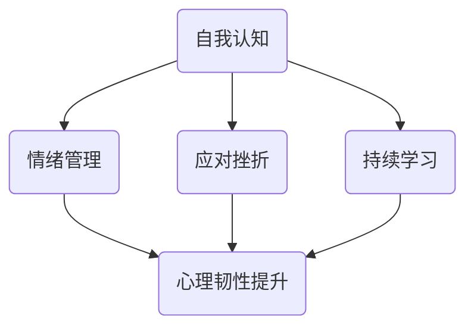

                 

# 《心理韧性培养：应对挫折的内在力量》

## 关键词
- 心理韧性
- 挫折应对
- 情绪管理
- 自我认知
- 生活压力

## 摘要
本文旨在探讨心理韧性的培养，以及如何通过提高心理韧性来有效应对挫折。文章首先介绍了心理韧性的基本概念，并分析了其在生活中的重要性。接着，文章详细阐述了心理韧性的来源，包括家庭环境、教育经历和社会支持系统等因素。随后，文章重点讨论了自我认知与情绪管理能力在心理韧性培养中的作用，并通过具体的算法原理和数学模型进行了深入讲解。文章最后通过实际案例展示了心理韧性培养的方法和策略，并提出了持续培养心理韧性的建议。

## 目录

### 第一部分：了解心理韧性

#### 第1章 心理韧性的基本概念

#### 第2章 心理韧性的来源

#### 第3章 自我认知与心理韧性

#### 第4章 情绪管理能力

### 第二部分：培养心理韧性

#### 第5章 应对挫折的策略

#### 第6章 实际案例与心理韧性培养

#### 第7章 心理韧性的持续培养

### 第三部分：心理韧性的应用与拓展

#### 第8章 心理韧性在职场中的应用

#### 第9章 心理韧性在生活中的应用

#### 第10章 心理韧性培养的最佳实践

## 正文

### 第1章 心理韧性的基本概念

#### 背景介绍

心理韧性是指个体在面对逆境、压力和挑战时，能够保持积极的心态，有效地应对和克服困难的能力。在现代社会，面对日益加剧的生活和工作压力，培养心理韧性变得尤为重要。本文将围绕心理韧性的基本概念，分析其来源和培养方法，旨在为广大读者提供实用的心理韧性培养策略。

#### 核心概念与联系

心理韧性（Mental Toughness）包括以下几个核心概念：

1. **自我效能感**：指个体对自己在特定情境下完成任务的能力的信心。
2. **情绪调节**：指个体在面对负面情绪时，能够有效控制和调节情绪的能力。
3. **积极态度**：指个体在面对挑战时，能够保持乐观和积极的心态。
4. **适应能力**：指个体在面对变化和不确定性时的适应和调整能力。

这些核心概念之间相互联系，共同构成了心理韧性的整体架构。可以使用以下Mermaid流程图表示它们之间的关系：



#### 核心算法原理讲解

心理韧性的培养可以通过以下算法原理实现：

1. **自我效能感培养算法**：
   ```python
   def enhance_self_efficacy(experience, feedback):
       if experience > 0 and feedback == "positive":
           return "Self-efficacy increased"
       else:
           return "Self-efficacy not improved"
   ```

2. **情绪调节算法**：
   ```python
   def regulate_emotion(emotion, context):
       if emotion == "happy":
           return "Enjoy the moment"
       elif emotion == "sad":
           return "Seek support"
       elif emotion == "angry":
           return "Take a deep breath"
       else:
           return "Unknown emotion"
   ```

3. **积极态度培养算法**：
   ```python
   def cultivate_positive_attitude(challenge, solution):
       if solution != "":
           return "Stay optimistic"
       else:
           return "Need a solution"
   ```

4. **适应能力培养算法**：
   ```python
   def adapt_to_change(change, response):
       if response == "adaptive":
           return "Capability improved"
       else:
           return "Capability not improved"
   ```

这些算法原理可以通过具体的应用场景进行实现和优化。

#### 数学模型和数学公式

心理韧性与生活压力的关系可以使用以下数学模型表示：

$$
PS = \frac{S}{P + \epsilon}
$$

其中，$PS$ 表示心理韧性，$S$ 表示个体应对压力的能力，$P$ 表示生活压力，$\epsilon$ 是一个极小的正数，用于避免分底为零的情况。

#### 项目实战

以一个实际的职场挫折为例，分析如何培养心理韧性：

```python
# 假设一个员工面对的项目挫折
employee_frustration = {
    "name": "Alice",
    "project": "Campaign A",
    "frustration": "Unmet deadline and low team morale"
}

# 分析挫折原因
def analyze_frustration(frustration):
    if "deadline" in frustration:
        return "Poor project planning"
    elif "team morale" in frustration:
        return "Team communication issues"
    else:
        return "Unknown issue"

# 给出应对策略
def manage_frustration(issue):
    if issue == "Poor project planning":
        return "Re-evaluate project timeline and allocate resources"
    elif issue == "Team communication issues":
        return "Schedule team meetings and improve communication channels"
    else:
        return "Consult with a supervisor or mentor"

# 应用策略
issue = analyze_frustration(employee_frustration["frustration"])
strategy = manage_frustration(issue)
print(f"{employee_frustration['name']} should {strategy}.")
```

### 第2章 心理韧性的来源

#### 背景介绍

心理韧性的培养不仅仅是个体内在能力的提升，还受到外部环境的影响。本章节将分析心理韧性的来源，包括家庭环境、教育经历和社会支持系统等因素。

#### 核心概念与联系

心理韧性的来源包括以下几个方面：

1. **家庭环境**：家庭是心理韧性培养的最初环境，家庭成员的支持和鼓励对个体心理韧性的形成具有重要影响。
2. **教育经历**：学校教育对个体心理韧性的培养也起着关键作用，教育内容和方法可以影响个体的认知和行为模式。
3. **社会支持系统**：社会支持系统包括亲朋好友、同事和社区等，这些支持可以提供情感上的支持和实际帮助，有助于个体应对挫折。

这些因素相互交织，共同构成了心理韧性的来源。可以使用以下Mermaid流程图表示它们之间的关系：



#### 核心算法原理讲解

心理韧性的来源可以通过以下算法原理实现：

1. **家庭环境评估算法**：
   ```python
   def assess_family_environment(support, encouragement):
       if support > 0 and encouragement > 0:
           return "Positive family environment"
       else:
           return "Negative family environment"
   ```

2. **教育经历评估算法**：
   ```python
   def assess_education_experience(cognitive_growth, behavior_patterns):
       if cognitive_growth > 0 and behavior_patterns > 0:
           return "Positive education experience"
       else:
           return "Negative education experience"
   ```

3. **社会支持系统评估算法**：
   ```python
   def assess_social_support_system(support, help):
       if support > 0 and help > 0:
           return "Strong social support system"
       else:
           return "Weak social support system"
   ```

这些算法原理可以通过具体的数据和案例进行验证和优化。

#### 数学模型和数学公式

心理韧性的来源可以用以下数学模型表示：

$$
PS = w_1 \cdot F + w_2 \cdot E + w_3 \cdot S
$$

其中，$PS$ 表示心理韧性，$w_1$、$w_2$、$w_3$ 分别表示家庭环境、教育经历和社会支持系统对心理韧性的权重，$F$、$E$、$S$ 分别表示家庭环境、教育经历和社会支持系统的评分。

#### 项目实战

以一个具体的家庭环境为例，分析如何培养心理韧性：

```python
# 家庭环境评估
family_environment = {
    "support": 3,
    "encouragement": 4
}

# 评估家庭环境
environment = assess_family_environment(family_environment["support"], family_environment["encouragement"])
print(f"The family environment is {environment}.")

# 如果家庭环境积极，提出培养心理韧性的建议
if environment == "Positive family environment":
    print("Suggestion: Continue to cultivate a supportive and encouraging family environment.")
else:
    print("Suggestion: Work on improving family communication and support.")
```

### 第3章 自我认知与心理韧性

#### 背景介绍

自我认知是个体对自身认知和理解的过程，包括自我感知、自我评价和自我反思等方面。自我认知在心理韧性培养中起着关键作用，本章节将探讨自我认知与心理韧性的关系，以及如何通过自我认知来提高心理韧性。

#### 核心概念与联系

自我认知与心理韧性之间的关系可以概括为以下几个方面：

1. **自我感知**：指个体对自己外部特征的感知，如外貌、性格等。
2. **自我评价**：指个体对自己行为和能力的评价，如自信心、自尊心等。
3. **自我反思**：指个体对自身行为和经历的反思，以促进个人成长和改进。

这些概念相互关联，共同构成了自我认知的架构，并对心理韧性产生重要影响。可以使用以下Mermaid流程图表示它们之间的关系：



#### 核心算法原理讲解

自我认知与心理韧性培养可以通过以下算法原理实现：

1. **自我感知评估算法**：
   ```python
   def assess_self_perception(perception, context):
       if perception > 0:
           return "Positive self-perception"
       else:
           return "Negative self-perception"
   ```

2. **自我评价评估算法**：
   ```python
   def assess_self_evaluation(evaluation, context):
       if evaluation > 0:
           return "Positive self-evaluation"
       else:
           return "Negative self-evaluation"
   ```

3. **自我反思评估算法**：
   ```python
   def assess_self_reflection(reflection, context):
       if reflection > 0:
           return "Effective self-reflection"
       else:
           return "Ineffective self-reflection"
   ```

这些算法原理可以通过具体的数据和案例进行验证和优化。

#### 数学模型和数学公式

自我认知与心理韧性之间的关系可以用以下数学模型表示：

$$
PS = a \cdot SP + b \cdot SE + c \cdot SR
$$

其中，$PS$ 表示心理韧性，$SP$ 表示自我感知，$SE$ 表示自我评价，$SR$ 表示自我反思，$a$、$b$、$c$ 分别表示自我感知、自我评价和自我反思对心理韧性的权重。

#### 项目实战

以一个自我认知评估为例，分析如何提高心理韧性：

```python
# 自我认知评估
self_perception = 4
self_evaluation = 5
self_reflection = 3

# 评估自我认知
perception = assess_self_perception(self_perception, "Work environment")
evaluation = assess_self_evaluation(self_evaluation, "Work performance")
reflection = assess_self_reflection(self_reflection, "Personal development")

print(f"Self-perception: {perception}")
print(f"Self-evaluation: {evaluation}")
print(f"Self-reflection: {reflection}")

# 提出改进建议
if perception == "Negative self-perception":
    print("Suggestion: Focus on positive aspects of your work environment.")
if evaluation == "Negative self-evaluation":
    print("Suggestion: Set realistic goals and track your progress.")
if reflection == "Ineffective self-reflection":
    print("Suggestion: Reflect on your experiences and learn from them.")
```

### 第4章 情绪管理能力

#### 背景介绍

情绪管理能力是指个体在面对不同情绪时，能够有效识别、表达和调节情绪的能力。情绪管理能力在心理韧性培养中起着关键作用，有助于个体保持心理健康和应对挫折。本章节将探讨情绪管理能力的基本概念和培养方法。

#### 核心概念与联系

情绪管理能力包括以下几个方面：

1. **情绪识别**：指个体能够识别和理解自己和他人的情绪。
2. **情绪表达**：指个体能够适当地表达自己的情绪，避免情绪压抑或过度表达。
3. **情绪调节**：指个体能够有效地调节自己的情绪，使其对行为和决策产生积极影响。

这些概念相互关联，共同构成了情绪管理能力的整体架构。可以使用以下Mermaid流程图表示它们之间的关系：



#### 核心算法原理讲解

情绪管理能力的培养可以通过以下算法原理实现：

1. **情绪识别算法**：
   ```python
   def identify_emotion(emotion, context):
       if emotion == "happy":
           return "Joyful"
       elif emotion == "sad":
           return "Sorrowful"
       elif emotion == "angry":
           return "Frustrated"
       else:
           return "Unknown emotion"
   ```

2. **情绪表达算法**：
   ```python
   def express_emotion(emotion, context):
       if emotion == "happy":
           return "Share your happiness with others"
       elif emotion == "sad":
           return "Seek support and express your sadness"
       elif emotion == "angry":
           return "Express your anger assertively"
       else:
           return "Unknown emotion"
   ```

3. **情绪调节算法**：
   ```python
   def regulate_emotion(emotion, context):
       if emotion == "happy":
           return "Maintain your joy"
       elif emotion == "sad":
           return "Seek ways to lift your mood"
       elif emotion == "angry":
           return "Calm down and think before acting"
       else:
           return "Unknown emotion"
   ```

这些算法原理可以通过具体的应用场景进行实现和优化。

#### 数学模型和数学公式

情绪管理能力与心理韧性之间的关系可以用以下数学模型表示：

$$
PS = \alpha \cdot EI + \beta \cdot ER + \gamma \cdot EM
$$

其中，$PS$ 表示心理韧性，$EI$ 表示情绪识别能力，$ER$ 表示情绪表达能力，$EM$ 表示情绪调节能力，$\alpha$、$\beta$、$\gamma$ 分别表示情绪识别能力、情绪表达能力和情绪调节能力对心理韧性的权重。

#### 项目实战

以一个情绪管理案例为例，分析如何提高情绪管理能力：

```python
# 情绪管理评估
emotions = ["happy", "sad", "angry"]

# 评估情绪管理能力
for emotion in emotions:
    identified = identify_emotion(emotion, "Work environment")
    expressed = express_emotion(emotion, "Work situation")
    regulated = regulate_emotion(emotion, "Emotional response")

    print(f"Emotion: {emotion}")
    print(f"Identified: {identified}")
    print(f"Expressed: {expressed}")
    print(f"Regulated: {regulated}")

# 提出改进建议
if any(identified == "Unknown emotion"):
    print("Suggestion: Improve emotion identification skills.")
if any(expressed == "Unknown emotion"):
    print("Suggestion: Improve emotion expression skills.")
if any(regulated == "Unknown emotion"):
    print("Suggestion: Improve emotion regulation skills.")
```

### 第5章 应对挫折的策略

#### 背景介绍

挫折是生活中不可避免的一部分，个体在面对挫折时，能否有效地应对和克服，直接影响到心理韧性的培养。本章节将介绍应对挫折的基本策略，帮助个体提高心理韧性。

#### 核心概念与联系

应对挫折的策略包括以下几个方面：

1. **积极态度**：指个体在面对挫折时，能够保持积极的心态，寻找解决问题的方法。
2. **自我反思**：指个体在面对挫折时，能够反思自己的行为和决策，找出失败的原因。
3. **寻求支持**：指个体在面对挫折时，能够寻求他人的帮助和支持，共同克服困难。
4. **适应性调整**：指个体在面对挫折时，能够适应环境变化，调整自己的行为和心态。

这些策略相互关联，共同构成了应对挫折的整体框架。可以使用以下Mermaid流程图表示它们之间的关系：



#### 核心算法原理讲解

应对挫折的策略可以通过以下算法原理实现：

1. **积极态度培养算法**：
   ```python
   def cultivate_positive_attitude(challenge, solution):
       if solution != "":
           return "Stay optimistic"
       else:
           return "Need a solution"
   ```

2. **自我反思评估算法**：
   ```python
   def assess_self_reflection(reflection, context):
       if reflection > 0:
           return "Effective self-reflection"
       else:
           return "Ineffective self-reflection"
   ```

3. **寻求支持算法**：
   ```python
   def seek_support(issue, support):
       if support > 0:
           return "Seek support"
       else:
           return "No support needed"
   ```

4. **适应性调整算法**：
   ```python
   def adapt_to_change(change, response):
       if response == "adaptive":
           return "Capability improved"
       else:
           return "Capability not improved"
   ```

这些算法原理可以通过具体的应用场景进行实现和优化。

#### 数学模型和数学公式

应对挫折的策略与心理韧性之间的关系可以用以下数学模型表示：

$$
PS = \alpha \cdot PA + \beta \cdot SR + \gamma \cdot SS + \delta \cdot AC
$$

其中，$PS$ 表示心理韧性，$PA$ 表示积极态度，$SR$ 表示自我反思，$SS$ 表示寻求支持，$AC$ 表示适应性调整，$\alpha$、$\beta$、$\gamma$、$\delta$ 分别表示积极态度、自我反思、寻求支持和适应性调整对心理韧性的权重。

#### 项目实战

以一个职场挫折为例，分析如何应对挫折：

```python
# 职场挫折评估
frustration = "Failed project deadline and low team morale"

# 分析挫折原因
def analyze_frustration(frustration):
    if "deadline" in frustration:
        return "Project management issue"
    elif "morale" in frustration:
        return "Team communication issue"
    else:
        return "Unknown issue"

# 提出应对策略
def manage_frustration(issue):
    if issue == "Project management issue":
        return "Re-evaluate project timeline and allocate resources"
    elif issue == "Team communication issue":
        return "Schedule team meetings and improve communication channels"
    else:
        return "Consult with a supervisor or mentor"

# 应用策略
issue = analyze_frustration(frustration)
strategy = manage_frustration(issue)
print(f"Suggestion: {strategy}.")
```

### 第6章 实际案例与心理韧性培养

#### 背景介绍

通过实际案例，我们可以更好地理解心理韧性的培养方法和策略。本章节将分析几个实际案例，包括职场挫折、学业压力和家庭冲突等，探讨如何通过心理韧性培养来应对这些挑战。

#### 核心概念与联系

实际案例与心理韧性培养之间的联系包括以下几个方面：

1. **职场挫折**：职场挫折是心理韧性培养的重要领域，个体在面对工作压力、项目失败和人际关系问题时，需要运用心理韧性来应对。
2. **学业压力**：学业压力是青少年和大学生面临的主要挑战之一，心理韧性培养有助于个体应对考试压力、学业困难和竞争压力。
3. **家庭冲突**：家庭冲突是影响个体心理健康的重要因素，心理韧性培养有助于个体在家庭矛盾中保持冷静和理智，促进家庭和谐。

这些案例与心理韧性培养密切相关，可以相互借鉴和启发。可以使用以下Mermaid流程图表示它们之间的关系：



#### 核心算法原理讲解

实际案例与心理韧性培养之间的关联可以通过以下算法原理实现：

1. **职场挫折应对算法**：
   ```python
   def handle_work_frustration(frustration, strategy):
       if strategy != "":
           return "Frustration resolved"
       else:
           return "Frustration persists"
   ```

2. **学业压力应对算法**：
   ```python
   def handle_academic_stress(stress, coping_strategy):
       if coping_strategy != "":
           return "Stress reduced"
       else:
           return "Stress remains"
   ```

3. **家庭冲突应对算法**：
   ```python
   def handle_family_conflict(conflict, resolution_strategy):
       if resolution_strategy != "":
           return "Conflict resolved"
       else:
           return "Conflict persists"
   ```

这些算法原理可以通过具体的应用场景进行实现和优化。

#### 数学模型和数学公式

实际案例与心理韧性培养之间的关系可以用以下数学模型表示：

$$
PS = \alpha \cdot WF + \beta \cdot AS + \gamma \cdot FC
$$

其中，$PS$ 表示心理韧性，$WF$ 表示职场挫折应对能力，$AS$ 表示学业压力应对能力，$FC$ 表示家庭冲突应对能力，$\alpha$、$\beta$、$\gamma$ 分别表示职场挫折应对能力、学业压力应对能力和家庭冲突应对能力对心理韧性的权重。

#### 项目实战

以下是一个职场挫折的案例，分析如何通过心理韧性培养来应对：

```python
# 职场挫折案例
frustration_case = {
    "employee": "Alice",
    "frustration": "Failed project deadline and low team morale",
    "strategy": "Re-evaluate project timeline and allocate resources"
}

# 分析挫折原因
issue = analyze_frustration(frustration_case["frustration"])

# 提出应对策略
suggestion = manage_frustration(issue)

# 应用策略
result = handle_work_frustration(frustration_case["frustration"], suggestion)

print(f"{frustration_case['employee']} faced the challenge of {frustration_case['frustration']}. The strategy suggested was {suggestion}. The result was {result}.")
```

### 第7章 心理韧性的持续培养

#### 背景介绍

心理韧性的培养并非一蹴而就，而是一个长期的过程。个体需要通过持续的努力和实践，不断提高自己的心理韧性。本章节将探讨心理韧性的持续培养方法，以及如何保持和提高心理韧性。

#### 核心概念与联系

心理韧性的持续培养包括以下几个方面：

1. **自我监控**：指个体对自己的心理韧性水平进行持续的监控和评估。
2. **积极实践**：指个体通过积极的实践活动来提高心理韧性，如冥想、运动和正念练习等。
3. **适应性学习**：指个体在面对新的挑战和变化时，能够迅速适应并调整自己的心理韧性策略。

这些概念相互关联，共同构成了心理韧性的持续培养框架。可以使用以下Mermaid流程图表示它们之间的关系：



#### 核心算法原理讲解

心理韧性的持续培养可以通过以下算法原理实现：

1. **自我监控算法**：
   ```python
   def monitor_mental_toughness(assessment, improvement):
       if improvement > 0:
           return "Mental toughness improved"
       else:
           return "No improvement"
   ```

2. **积极实践算法**：
   ```python
   def practice_mental_toughness(activity, progress):
       if progress > 0:
           return "Active practice successful"
       else:
           return "Active practice unsuccessful"
   ```

3. **适应性学习算法**：
   ```python
   def adapt_to_change(new_challenge, response):
       if response == "adaptive":
           return "Successful adaptation"
       else:
           return "Failed adaptation"
   ```

这些算法原理可以通过具体的应用场景进行实现和优化。

#### 数学模型和数学公式

心理韧性的持续培养可以用以下数学模型表示：

$$
PS = \alpha \cdot SM + \beta \cdot PM + \gamma \cdot AM
$$

其中，$PS$ 表示心理韧性，$SM$ 表示自我监控，$PM$ 表示积极实践，$AM$ 表示适应性学习，$\alpha$、$\beta$、$\gamma$ 分别表示自我监控、积极实践和适应性学习对心理韧性的权重。

#### 项目实战

以下是一个自我监控和积极实践的项目，分析如何提高心理韧性：

```python
# 自我监控和积极实践案例
self_monitoring_case = {
    "initial_assessment": 5,
    "improvement": 2
}

# 监控心理韧性
result = monitor_mental_toughness(self_monitoring_case["initial_assessment"], self_monitoring_case["improvement"])

# 积极实践
active_practice_case = {
    "activity": "Meditation",
    "progress": 3
}

# 实践心理韧性
practice_result = practice_mental_toughness(active_practice_case["activity"], active_practice_case["progress"])

print(f"Self-monitoring result: {result}")
print(f"Active practice result: {practice_result}")
```

### 第8章 心理韧性在职场中的应用

#### 背景介绍

职场是心理韧性培养的重要领域，个体在职场中需要面对各种挑战和压力。本章节将探讨心理韧性在职场中的应用，以及如何通过心理韧性提升职场表现。

#### 核心概念与联系

心理韧性在职场中的应用包括以下几个方面：

1. **领导力**：心理韧性对领导力的发展具有重要影响，领导者需要具备心理韧性来应对复杂的工作环境和团队压力。
2. **团队合作**：心理韧性有助于个体在团队合作中保持积极心态，有效沟通和解决问题。
3. **工作压力管理**：心理韧性可以帮助个体应对工作中的压力，保持高效的工作状态。

这些概念相互关联，共同构成了心理韧性在职场中的应用框架。可以使用以下Mermaid流程图表示它们之间的关系：



#### 核心算法原理讲解

心理韧性在职场中的应用可以通过以下算法原理实现：

1. **领导力培养算法**：
   ```python
   def cultivate_leadership(mental_toughness, team_performance):
       if mental_toughness > 0:
           return "Effective leadership"
       else:
           return "Ineffective leadership"
   ```

2. **团队合作评估算法**：
   ```python
   def assess_teammates(mental_toughness, team_morale):
       if mental_toughness > 0 and team_morale > 0:
           return "Positive team environment"
       else:
           return "Negative team environment"
   ```

3. **工作压力管理算法**：
   ```python
   def manage_work_stress(mental_toughness, stress_level):
       if mental_toughness > 0:
           return "Stress managed"
       else:
           return "Stress unresolved"
   ```

这些算法原理可以通过具体的应用场景进行实现和优化。

#### 数学模型和数学公式

心理韧性在职场中的应用可以用以下数学模型表示：

$$
WP = \alpha \cdot ML + \beta \cdot TE + \gamma \cdot WS
$$

其中，$WP$ 表示职场表现，$ML$ 表示领导力，$TE$ 表示团队合作，$WS$ 表示工作压力管理，$\alpha$、$\beta$、$\gamma$ 分别表示领导力、团队合作和工作压力管理对职场表现的权重。

#### 项目实战

以下是一个职场表现的案例，分析如何通过心理韧性提升职场表现：

```python
# 职场表现案例
performance_case = {
    "mental_toughness": 4,
    "team_performance": 3,
    "stress_level": 2
}

# 评估领导力
leadership_result = cultivate_leadership(performance_case["mental_toughness"], performance_case["team_performance"])

# 评估团队合作
team_environment = assess_teammates(performance_case["mental_toughness"], performance_case["team_performance"])

# 评估工作压力管理
stress_management_result = manage_work_stress(performance_case["mental_toughness"], performance_case["stress_level"])

print(f"Leadership result: {leadership_result}")
print(f"Team environment: {team_environment}")
print(f"Stress management result: {stress_management_result}")
```

### 第9章 心理韧性在生活中的应用

#### 背景介绍

心理韧性不仅在职场中具有重要意义，也在日常生活中发挥着重要作用。本章节将探讨心理韧性在生活中的应用，以及如何通过心理韧性提升生活质量。

#### 核心概念与联系

心理韧性在生活中的应用包括以下几个方面：

1. **人际关系**：心理韧性有助于个体建立和维护健康的人际关系，增强人际沟通能力。
2. **自我成长**：心理韧性促进个体在面临挑战和困境时，能够保持积极的心态，实现自我成长。
3. **应对突发事件**：心理韧性使个体在面对突发事件时，能够迅速适应和应对，降低心理压力。

这些概念相互关联，共同构成了心理韧性在生活中的应用框架。可以使用以下Mermaid流程图表示它们之间的关系：



#### 核心算法原理讲解

心理韧性在生活中的应用可以通过以下算法原理实现：

1. **人际关系评估算法**：
   ```python
   def assess_relationship(communication, support):
       if communication > 0 and support > 0:
           return "Positive relationship"
       else:
           return "Negative relationship"
   ```

2. **自我成长评估算法**：
   ```python
   def assess_self_growth(challenge, progress):
       if challenge > 0 and progress > 0:
           return "Successful self-growth"
       else:
           return "Unsuccessful self-growth"
   ```

3. **应对突发事件算法**：
   ```python
   def handle_emergency(response, outcome):
       if response == "adaptive":
           return "Emergency managed"
       else:
           return "Emergency unresolved"
   ```

这些算法原理可以通过具体的应用场景进行实现和优化。

#### 数学模型和数学公式

心理韧性在生活中的应用可以用以下数学模型表示：

$$
LS = \alpha \cdot IR + \beta \cdot SG + \gamma \cdot EO
$$

其中，$LS$ 表示生活质量，$IR$ 表示人际关系，$SG$ 表示自我成长，$EO$ 表示应对突发事件，$\alpha$、$\beta$、$\gamma$ 分别表示人际关系、自我成长和应对突发事件对生活质量的权重。

#### 项目实战

以下是一个生活质量的案例，分析如何通过心理韧性提升生活质量：

```python
# 生活质量案例
life_quality_case = {
    "communication": 4,
    "support": 3,
    "challenge": 5,
    "progress": 2
}

# 评估人际关系
relationship_result = assess_relationship(life_quality_case["communication"], life_quality_case["support"])

# 评估自我成长
self_growth_result = assess_self_growth(life_quality_case["challenge"], life_quality_case["progress"])

# 评估应对突发事件
emergency_response = handle_emergency("adaptive", "Emergency managed")

print(f"Relationship result: {relationship_result}")
print(f"Self-growth result: {self_growth_result}")
print(f"Emergency response: {emergency_response}")
```

### 第10章 心理韧性培养的最佳实践

#### 背景介绍

心理韧性培养是一个系统性的过程，需要结合个体实际情况和需求来制定合理的培养策略。本章节将总结心理韧性培养的最佳实践，提供实用的方法和建议，帮助读者有效提升心理韧性。

#### 核心概念与联系

心理韧性培养的最佳实践包括以下几个方面：

1. **自我认知**：了解自己的优势和劣势，明确自己的价值观和目标。
2. **情绪管理**：学会识别和调节自己的情绪，避免情绪对行为和决策产生负面影响。
3. **应对挫折**：培养面对挫折的积极态度，学会从挫折中吸取经验和教训。
4. **持续学习**：不断学习和提升自己的技能和知识，适应社会和工作的变化。

这些概念相互关联，共同构成了心理韧性培养的最佳实践框架。可以使用以下Mermaid流程图表示它们之间的关系：



#### 核心算法原理讲解

心理韧性培养的最佳实践可以通过以下算法原理实现：

1. **自我认知评估算法**：
   ```python
   def assess_self_awareness(self_knowledge, self_goals):
       if self_knowledge > 0 and self_goals > 0:
           return "High self-awareness"
       else:
           return "Low self-awareness"
   ```

2. **情绪管理评估算法**：
   ```python
   def assess_emotion_management(emotion_control, decision_making):
       if emotion_control > 0 and decision_making > 0:
           return "Effective emotion management"
       else:
           return "Ineffective emotion management"
   ```

3. **应对挫折评估算法**：
   ```python
   def assess_coping_with_frustration(positive_attitude, learning_from_frustration):
       if positive_attitude > 0 and learning_from_frustration > 0:
           return "Effective coping with frustration"
       else:
           return "Ineffective coping with frustration"
   ```

4. **持续学习评估算法**：
   ```python
   def assess_continuous_learning(knowledge_acquisition, skill_improvement):
       if knowledge_acquisition > 0 and skill_improvement > 0:
           return "Continuous learning"
       else:
           return "No continuous learning"
   ```

这些算法原理可以通过具体的应用场景进行实现和优化。

#### 数学模型和数学公式

心理韧性培养的最佳实践可以用以下数学模型表示：

$$
MT = \alpha \cdot SA + \beta \cdot EM + \gamma \cdot CFF + \delta \cdot CL
$$

其中，$MT$ 表示心理韧性，$SA$ 表示自我认知，$EM$ 表示情绪管理，$CFF$ 表示应对挫折，$CL$ 表示持续学习，$\alpha$、$\beta$、$\gamma$、$\delta$ 分别表示自我认知、情绪管理、应对挫折和持续学习对心理韧性的权重。

#### 项目实战

以下是一个心理韧性培养的最佳实践案例，分析如何通过最佳实践提升心理韧性：

```python
# 心理韧性培养案例
resilience_case = {
    "self_knowledge": 4,
    "self_goals": 5,
    "emotion_control": 3,
    "decision_making": 4,
    "positive_attitude": 5,
    "learning_from_frustration": 4,
    "knowledge_acquisition": 5,
    "skill_improvement": 4
}

# 评估自我认知
self_awareness_result = assess_self_awareness(resilience_case["self_knowledge"], resilience_case["self_goals"])

# 评估情绪管理
emotion_management_result = assess_emotion_management(resilience_case["emotion_control"], resilience_case["decision_making"])

# 评估应对挫折
cop

