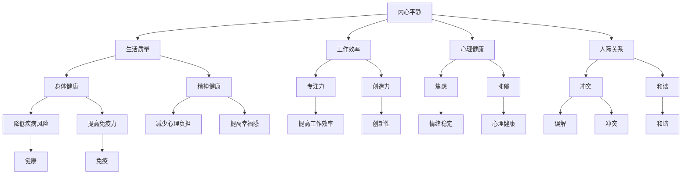

                 

# 《忙碌中的内心平静：重新定义生活节奏》

关键词：内心平静、生活节奏、时间管理、心理健康、情绪管理、人际关系

摘要：在快节奏的现代社会中，追求内心平静成为许多人迫切需要的目标。本文通过深入分析现代社会压力来源、内心平静的重要性以及重新定义生活节奏的方法，旨在帮助读者在忙碌中找到内心的宁静，提高生活质量和工作效率。文章将详细介绍如何评估当前生活节奏、制定目标、时间管理技巧、心理调适技巧、健康生活方式以及情绪与压力管理技巧，为读者提供一套全面有效的方案，助力他们在忙碌中实现内心的平和与和谐。

## 目录大纲

- 引言
  - 为什么要追求内心平静
  - 现代社会的压力来源
  - 内心平静的重要性
- 重新定义生活节奏
  - 生活节奏的定义与影响
  - 重新定义生活节奏的步骤
  - 实践方法
- 建立健康的生活方式
  - 健康饮食
  - 适量运动
- 管理情绪与压力
  - 情绪管理的重要性
  - 情绪与压力管理的技巧
  - 情绪与压力管理的实践
- 提升人际交往能力
  - 人际交往的重要性
  - 提升人际交往能力的技巧
- 总结与展望
  - 内心平静对个人成长的意义
  - 建立长期目标与计划
  - 拓展阅读

## 引言

在当今这个信息爆炸、竞争激烈的时代，人们的生活节奏越来越快，压力与日俱增。无论是工作还是生活，许多人都在追求更高的效率，试图在有限的时间里完成更多的事情。然而，这种快节奏的生活往往让人们感到焦虑、疲惫，甚至无法感受到生活的美好。因此，如何在忙碌中找到内心的平静，重新定义自己的生活节奏，成为了一个重要而紧迫的问题。

### 为什么要追求内心平静

内心平静是一种心理状态，它意味着个体能够保持情绪稳定、思维清晰，并能够从容应对生活中的各种挑战。在现代社会中，追求内心平静的原因主要有以下几点：

1. **提高生活质量**：内心平静有助于改善身体健康和精神状态，从而提高整体生活质量。
2. **提高工作效率**：情绪稳定、思维清晰能够使人们更加专注和高效地完成工作，从而提高工作效率。
3. **促进人际关系**：内心平静有助于建立和谐的人际关系，减少冲突和误解。
4. **增强创造力**：内心平静能够激发人们的创造力，使他们在解决问题时更具创新性。
5. **提升幸福感**：内心平静能够带来持久的幸福感，使人们更加享受生活。

### 现代社会的压力来源

现代社会的压力主要来源于以下几个方面：

1. **工作压力**：竞争激烈的职场环境、高强度的工作任务、工作与生活的平衡问题等，都是造成工作压力的主要原因。
2. **生活压力**：经济压力、家庭责任、社交压力等，使人们在生活中面临各种挑战。
3. **心理压力**：信息爆炸带来的焦虑、不确定性的担忧、个人成就感的缺失等，都是导致心理压力的重要因素。

### 内心平静的重要性

内心平静对个人的身心健康有着至关重要的影响。它不仅能够帮助人们更好地应对生活中的各种压力，还能够提升个人的生活质量和工作效率。

1. **身体健康**：内心平静有助于降低血压、减少心脏病风险、提高免疫力，从而改善身体健康。
2. **精神健康**：内心平静有助于缓解焦虑、抑郁等心理问题，提高心理健康水平。
3. **人际关系**：内心平静能够使人们更加理解和包容他人，建立和谐的人际关系。
4. **工作效率**：内心平静有助于提高专注力和记忆力，从而提高工作效率。
5. **创造力**：内心平静能够激发人们的创造力，使他们在解决问题时更具创新性。

总的来说，追求内心平静不仅是应对现代社会压力的一种策略，更是提升个人生活质量、实现全面发展的必要途径。本文将围绕这一主题，逐步分析如何重新定义生活节奏，为读者提供一套全面有效的解决方案。

## 第1章 引言

### 1.1 为什么要追求内心平静

在快节奏的现代生活中，人们常常感到压力重重、疲惫不堪。这种状态不仅影响到我们的身体健康，还影响到我们的心理健康和人际关系。因此，追求内心平静成为许多人迫切需要的目标。

#### 1.1.1 现代社会的压力来源

现代社会的压力主要来源于以下几个方面：

1. **工作压力**：职场竞争日益激烈，工作任务繁重，要求人们不断加班，导致身心疲惫。
2. **生活压力**：经济压力、家庭责任、子女教育、住房问题等，使人们面临巨大的生活压力。
3. **心理压力**：信息爆炸带来的焦虑、不确定性的担忧、个人成就感的缺失等，都是导致心理压力的重要因素。
4. **时间压力**：人们总是觉得时间不够用，面对各种任务和活动，常常感到焦虑和紧张。

这些压力源共同作用，使人们在忙碌中失去了平静的心态。长期处于这种状态，不仅会导致身体健康问题，还会引发各种心理疾病，影响人际关系和工作效率。

#### 1.1.2 工作压力

工作压力是现代社会中最为普遍的压力来源之一。具体表现在以下几个方面：

1. **工作任务繁重**：现代职场竞争激烈，工作任务不断增加，员工需要不断地加班，导致身心疲惫。
2. **工作环境压力**：快节奏的工作环境要求人们高效完成任务，但同时也增加了员工的压力。
3. **工作与生活的平衡**：许多人为了追求更高的工作效率，牺牲了与家人和朋友相处的时间，导致工作和生活无法平衡。

这些因素共同作用，使人们在工作中感到焦虑和紧张，无法保持内心的平静。

#### 1.1.3 生活压力

除了工作压力，生活压力也是导致内心平静缺失的一个重要原因。具体表现在以下几个方面：

1. **经济压力**：随着生活成本的不断增加，许多人面临着经济压力，需要为家庭生活、子女教育和住房等问题担忧。
2. **家庭责任**：家庭责任是许多人面临的重要压力来源，包括照顾老人、照顾子女、处理家务等。
3. **社交压力**：现代社会的社交活动越来越多，人们需要花费大量时间和精力来处理人际关系，这也会增加心理压力。

#### 1.1.4 心理压力

心理压力是现代社会中最为复杂的一种压力形式，它涉及到个人的心理健康和心理状态。具体表现在以下几个方面：

1. **焦虑**：焦虑是一种常见的心理问题，它会导致人们感到紧张、担忧和不安。
2. **抑郁**：抑郁是一种严重的心理疾病，它会导致人们感到沮丧、失去兴趣和活力。
3. **压力反应**：长期的心理压力会导致身体出现各种症状，如失眠、头痛、胃痛等。

这些压力源共同作用，使人们在生活中感到焦虑、疲惫和不安，难以保持内心的平静。

### 1.2 内心平静的重要性

内心平静对个人的身心健康有着至关重要的影响。它不仅能够帮助人们更好地应对生活中的各种压力，还能够提升个人的生活质量和工作效率。

1. **身体健康**：内心平静有助于降低血压、减少心脏病风险、提高免疫力，从而改善身体健康。
2. **精神健康**：内心平静有助于缓解焦虑、抑郁等心理问题，提高心理健康水平。
3. **工作效率**：内心平静有助于提高专注力和记忆力，从而提高工作效率。
4. **创造力**：内心平静能够激发人们的创造力，使他们在解决问题时更具创新性。
5. **人际关系**：内心平静有助于建立和谐的人际关系，减少冲突和误解。

总的来说，追求内心平静不仅是应对现代社会压力的一种策略，更是提升个人生活质量、实现全面发展的必要途径。本文将围绕这一主题，逐步分析如何重新定义生活节奏，为读者提供一套全面有效的解决方案。

### 1.2.1 提高生活质量

内心平静对于提高生活质量有着显著的作用。具体表现在以下几个方面：

1. **身体健康**：内心平静有助于缓解压力，降低血压，减少心脏病等疾病的风险。长期保持内心平静，可以有效提高免疫力，从而改善身体健康状况。
2. **精神健康**：内心平静有助于缓解焦虑、抑郁等心理问题，提高心理健康水平。当人们能够保持情绪稳定，思维清晰，他们更容易感受到生活的美好，减少心理负担。
3. **睡眠质量**：内心平静有助于改善睡眠质量。当人们感到内心平静，他们更容易入睡，睡眠质量也会得到提高。良好的睡眠有助于恢复身体和精神的能量，为第二天的生活和工作打下坚实的基础。
4. **饮食健康**：内心平静有助于改善饮食习惯。当人们内心平静时，他们更容易做出健康的选择，如选择均衡饮食、控制热量摄入等。这有助于保持身体健康，减少疾病风险。
5. **减少孤独感**：内心平静有助于减少孤独感。当人们内心平静时，他们更容易与他人建立联系，分享自己的感受和经历。这有助于增强社交支持，提高生活质量。

### 1.2.2 提高工作效率

内心平静对于提高工作效率有着重要的影响。具体表现在以下几个方面：

1. **专注力**：内心平静有助于提高专注力。当人们能够保持内心平静，他们更容易集中注意力，减少分心，从而提高工作效率。
2. **决策能力**：内心平静有助于提高决策能力。当人们内心平静时，他们能够更清晰地思考问题，分析各种选项，做出更明智的决策。
3. **创造力和创新性**：内心平静有助于激发创造力和创新性。当人们能够保持内心平静，他们更容易产生新的想法，寻找创新的解决方案，从而提高工作效率。
4. **减少错误和失误**：内心平静有助于减少工作中的错误和失误。当人们内心平静时，他们更容易注意到细节，避免犯错，从而提高工作效率。

总的来说，内心平静不仅有助于提高生活质量，还能够提升工作效率，使人们在工作和生活中更加从容和高效。因此，追求内心平静是提升个人发展的重要一环。

### 1.2.3 提高创造力

内心平静对于提高创造力有着显著的促进作用。具体表现在以下几个方面：

1. **思维清晰**：内心平静有助于使思维更加清晰，减少杂念干扰，从而更好地捕捉灵感。当人们能够保持内心平静，他们更容易进入“心流”状态，专注于创意思考和问题解决。
2. **创造性思维**：内心平静有助于激发创造性思维。在平静的状态下，人们更容易打破常规思维，寻找创新的解决方案，从而在工作和生活中获得新的突破。
3. **灵感涌现**：内心平静有助于灵感的涌现。在平静的心态下，人们更容易与内在的直觉和灵感连接，从而获得新的创意和想法。
4. **创新实践**：内心平静有助于将创意转化为实际的创新成果。在平静的状态下，人们更容易付诸实践，通过实验和迭代，将创意转化为实际的产品和服务。

总的来说，内心平静不仅能够激发创造力，还能够提高创新性，使人们在工作和生活中更加有创造力和竞争力。

## 第2章 重新定义生活节奏

### 2.1 生活节奏的定义与影响

生活节奏指的是日常生活中各种活动的频率和规律，包括工作、学习、休息、娱乐等。一个合理的生活节奏有助于提高生活质量和工作效率，而一个不合理的生活节奏则可能导致身心疲惫、效率低下。

#### 2.1.1 生活节奏的定义

生活节奏可以简单理解为日常生活中各项活动的时间分配和频率。例如，工作日的作息时间、周末的休闲活动安排、午休时间等，都构成了生活节奏的一部分。合理的生活节奏意味着在有限的时间内，能够高效地完成工作、学习和休闲活动，同时保持身心健康。

#### 2.1.2 生活节奏的影响

生活节奏对身体健康、精神健康和人际关系都有重要影响：

1. **身体健康**：合理的生活节奏有助于保持身体健康。例如，规律的工作和休息时间可以减少心血管疾病、肥胖等健康问题的发生。此外，合理的时间安排也可以让人们在适当的时机进行锻炼，提高身体素质。
2. **精神健康**：合理的生活节奏有助于缓解精神压力，提高心理健康水平。例如，充足的休息和娱乐时间可以让人们放松心情，减轻焦虑和抑郁。反之，不合理的生活节奏可能导致精神疲劳，甚至引发心理疾病。
3. **人际关系**：合理的生活节奏有助于建立和谐的人际关系。例如，合理的时间安排可以让人们有更多的时间与家人、朋友相处，增进感情。而不合理的生活节奏可能导致人们与家人、朋友之间的沟通减少，影响人际关系。

#### 2.1.3 生活节奏的影响

1. **工作效率**：合理的生活节奏有助于提高工作效率。例如，合理的作息时间可以让人们保持精力充沛，集中注意力，从而更高效地完成任务。而不合理的生活节奏可能导致疲劳和分心，降低工作效率。
2. **生活质量**：合理的生活节奏有助于提高生活质量。例如，合理的休闲活动安排可以让人们放松身心，享受生活。而不合理的生活节奏可能导致人们的生活质量下降，影响幸福感。
3. **心理健康**：合理的生活节奏有助于保持心理健康。例如，充足的休息和娱乐时间可以让人们放松心情，减轻压力。而不合理的生活节奏可能导致人们感到焦虑和抑郁。

总的来说，重新定义生活节奏对于提高生活质量和工作效率有着重要的影响。在接下来的内容中，我们将详细探讨如何评估和调整生活节奏，以实现内心平静和高效生活的目标。

### 2.2 重新定义生活节奏的步骤

重新定义生活节奏是一个系统的过程，需要通过自我评估、制定目标和实施实践来逐步实现。以下是具体的步骤：

#### 2.2.1 自我评估

自我评估是重新定义生活节奏的第一步，它有助于了解当前的生活状态和存在的问题。具体包括以下几个方面：

1. **工作效率评估**：评估自己在工作方面的表现，包括任务完成速度、质量以及工作中的专注程度。可以通过记录每天的工作内容和时间分配，分析自己在哪些方面存在效率问题。
2. **生活质量评估**：评估自己在生活方面的表现，包括健康、休闲、家庭等方面。可以列出自己的生活习惯、饮食和运动情况，分析哪些方面需要改善。
3. **精神状态评估**：评估自己的精神状态，包括情绪稳定性、压力水平和心理弹性。可以通过记录每天的负面情绪和压力事件，分析自己在哪些方面需要调整。

#### 2.2.2 制定目标

在自我评估的基础上，制定具体、可衡量的目标，有助于明确重新定义生活节奏的方向。具体包括以下几个方面：

1. **短期目标**：设定一个月或三个月内可以实现的短期目标，例如提高工作效率、改善饮食习惯、增加运动时间等。短期目标的设定可以让自己在短期内看到进步，增强信心。
2. **长期目标**：设定一年或更长时间内可以实现的长期目标，例如提高生活质量、实现职业发展、改善人际关系等。长期目标的设定可以为自己提供持续的动力和方向。
3. **可行性分析**：对设定的目标进行可行性分析，确保目标既有挑战性，又能够实现。可以通过咨询专业人士、查找相关资料等方式，了解目标的可行性和实现方法。

#### 2.2.3 实施实践

在制定目标后，需要通过具体的实践措施来逐步实现目标。具体包括以下几个方面：

1. **时间管理技巧**：学习并应用时间管理技巧，如设定优先级、制定日程表、学会拒绝等，帮助自己更高效地安排时间，减少不必要的压力。
2. **心理调适技巧**：学习并应用心理调适技巧，如深呼吸练习、正念冥想、适度运动等，帮助自己保持情绪稳定，减轻压力。
3. **健康生活方式**：建立健康的生活方式，如合理饮食、适量运动、保证充足的睡眠等，有助于提高身体素质，增强心理韧性。
4. **情绪与压力管理**：学习并应用情绪与压力管理技巧，如认知行为疗法、放松技巧等，帮助自己更好地应对生活中的各种压力和挑战。

通过以上步骤，可以逐步重新定义生活节奏，实现内心平静和高效生活的目标。

### 2.2.1 自我评估

自我评估是重新定义生活节奏的第一步，它是了解自身状态和问题的过程，也是制定有效策略的基础。以下是自我评估的具体步骤：

1. **工作效率评估**：
   - **记录工作日志**：每天记录工作内容和时间分配，分析哪些任务占据了你大部分时间，哪些任务效率较低。
   - **任务分类**：将任务按紧急程度和重要性分类，识别出哪些任务对你来说最具挑战性，哪些任务可以委托或简化。
   - **时间利用率分析**：计算每个任务的时间利用率，评估是否有足够的时间分配给最重要的任务。

2. **生活质量评估**：
   - **健康习惯调查**：评估自己的饮食、运动和睡眠习惯，记录每日的营养摄入、运动量和睡眠时长。
   - **社交活动评估**：记录与家人、朋友和同事的互动情况，评估社交活动的频率和深度，了解自己在社交方面的需求和满意度。
   - **休闲活动评估**：记录休闲活动的时间和质量，如阅读、旅行、娱乐等，分析这些活动对心理健康的积极影响。

3. **精神状态评估**：
   - **情绪日记**：记录每天的情绪变化，分析负面情绪的出现原因和频率，识别可能的心理压力源。
   - **压力评估**：评估日常生活中的压力水平，包括工作、家庭和社交方面的压力，分析压力源的性质和强度。
   - **心理弹性评估**：评估自己在面对挑战和压力时的心理韧性，识别需要提升的方面。

通过这些评估步骤，可以全面了解自己在工作效率、生活质量和精神状态方面的现状，从而为制定改进策略提供依据。

### 2.2.2 制定目标

在完成自我评估之后，下一步是制定具体、可衡量的目标，这些目标将成为重新定义生活节奏的指南针。以下是制定目标的详细步骤：

1. **设定短期目标**：
   - **明确目标**：根据自我评估的结果，设定一个清晰、具体的目标。例如，提高工作效率可以设定为每天完成10个任务，减少工作时长。
   - **期限设定**：为每个目标设定一个明确的时间期限，如一个月或三个月内要实现的目标。
   - **可行性分析**：确保目标既有挑战性，又能够实现。可以通过分解目标、制定详细的行动计划来增加目标的可行性。

2. **设定长期目标**：
   - **长远规划**：根据短期目标的进展，设定更长期的目标。例如，如果短期目标是提高工作效率，长期目标可以是成为某个领域的专家。
   - **重要性与意义**：考虑长期目标对于个人发展的重要性，以及实现该目标可能带来的积极影响。
   - **逐步实现**：将长期目标分解为一系列短期目标，通过逐步实现这些短期目标，最终达成长期目标。

3. **可行性分析**：
   - **资源评估**：分析实现目标所需的资源，包括时间、金钱、技能等，确保资源充足。
   - **风险评估**：识别可能的风险和障碍，并制定应对措施，减少目标实现的阻碍。
   - **支持系统**：建立支持系统，包括寻求家人、朋友或专业人士的帮助，增强实现目标的信心。

通过设定短期和长期目标，并对其进行可行性分析，可以为重新定义生活节奏提供明确的方向和动力。

### 2.2.3 实践方法

在制定目标之后，关键的步骤是实现这些目标，这就需要一系列实际可行的方法来帮助我们调整生活节奏，实现内心的平静。以下是具体的实践方法：

1. **时间管理技巧**：
   - **设定优先级**：了解任务的重要性和紧急程度，优先处理最重要的任务。可以使用四象限法将任务分为重要且紧急、重要不紧急、不重要但紧急、不重要不紧急四个类别，确保重要和紧急的任务得到优先处理。
   - **制定日程表**：每天制定详细的日程表，包括工作、休息和娱乐的时间安排，确保时间得到有效利用。可以使用日程表软件或应用程序来帮助你规划和管理时间。
   - **学会拒绝**：学会拒绝不重要的任务和请求，避免过度承诺导致时间管理混乱。合理地分配时间和精力，确保自己有足够的时间和精力完成重要任务。

2. **心理调适技巧**：
   - **深呼吸练习**：在感到压力和焦虑时，进行深呼吸练习可以帮助放松身体和心灵。深呼吸的方法是缓慢地吸气，然后缓慢地呼气，重复几次，直到感到放松。
   - **正念冥想**：正念冥想是一种通过专注于当下，减少杂念和焦虑的技巧。每天花几分钟时间进行正念冥想，可以帮助你更好地应对生活中的压力和挑战。
   - **适度运动**：适量的运动有助于释放压力，提高心情。可以选择散步、跑步、瑜伽等适合自己的运动方式，每周保持至少三次，每次30分钟以上的运动时间。

3. **健康生活方式**：
   - **健康饮食**：保持均衡的饮食，摄入足够的营养素。多吃蔬菜、水果、全谷物和优质蛋白质，减少油腻食物和高热量食物的摄入。
   - **充足睡眠**：确保每晚有7-9小时的充足睡眠，以保持身体和大脑的正常功能。建立规律的作息时间，避免晚上过度使用电子设备。
   - **适量运动**：保持适量的运动，每周至少150分钟的中等强度运动，或75分钟的高强度运动。适量的运动有助于提高身体素质，减少慢性疾病的风险。

通过这些实践方法，可以帮助你更好地调整生活节奏，实现内心的平静和高效生活。记住，改变生活节奏是一个逐步的过程，需要持续的努力和耐心。一旦开始实践，你会逐渐感受到内心的变化和生活质量的提升。

### 第3章 建立健康的生活方式

健康的生活方式是重新定义生活节奏的重要组成部分。一个健康的身体和心理状态有助于我们更好地应对日常生活中的各种挑战。在本章中，我们将探讨健康饮食和适量运动的重要性以及如何实践这些健康习惯。

### 3.1 健康饮食

#### 3.1.1 饮食原则

健康的饮食习惯是保持身体健康的基础。以下是几个关键原则：

1. **均衡饮食**：均衡饮食指的是摄入各种营养素，包括蛋白质、碳水化合物、脂肪、维生素和矿物质等。确保饮食多样化，避免单一食物摄入过多，导致营养失衡。
2. **控制热量摄入**：摄入的热量应该与身体消耗的热量相匹配。过量的热量摄入会导致体重增加和肥胖，而摄入过少则可能导致营养不良和体重不足。可以通过计算每日所需热量并合理安排饮食来实现热量的平衡。
3. **减少油腻食物**：油腻食物通常含有高量的脂肪和热量，长期摄入过多可能导致心血管疾病和肥胖。应减少油炸食品、高脂肉类和快餐的摄入，选择更健康的烹饪方法，如蒸、煮、烤等。

#### 3.1.2 饮食习惯

良好的饮食习惯有助于维持身体健康和促进心理健康。以下是一些具体的饮食习惯建议：

1. **每日三餐定时**：保持规律的饮食时间有助于调节身体的生物钟，促进消化和营养吸收。尽量确保早餐、午餐和晚餐按时进食，避免长时间空腹或暴饮暴食。
2. **避免暴饮暴食**：暴饮暴食可能导致消化不良和体重增加。通过控制每餐的分量和避免过度进食，可以有效减少这些问题。
3. **控制饮酒**：过量饮酒对身体健康有严重危害，包括肝脏损伤、心血管疾病和心理健康问题。建议限制饮酒量，男性每天不超过两杯，女性每天不超过一杯。

### 3.2 适量运动

适量运动是保持身体健康和心理健康的有效方法。以下介绍运动的好处、不同类型的运动方式以及如何合理安排运动时间。

#### 3.2.1 运动好处

适量运动对身体健康和心理健康都有显著的益处：

1. **提高身体素质**：运动可以增强肌肉力量、提高耐力和灵活性，使身体更健康。
2. **改善心理健康**：运动可以释放压力、缓解焦虑和抑郁，提高心情和幸福感。
3. **增强免疫力**：定期运动可以增强免疫系统功能，减少感染和疾病的风险。

#### 3.2.2 运动方式

不同的运动方式可以带来不同的健康效益。以下是几种常见的运动方式：

1. **有氧运动**：有氧运动如跑步、骑自行车、游泳等，有助于提高心肺功能、燃烧脂肪和降低血压。建议每周进行至少150分钟的中等强度有氧运动。
2. **无氧运动**：无氧运动如举重、俯卧撑、仰卧起坐等，有助于增强肌肉力量和耐力。建议每周进行2-3次的无氧运动，每次30分钟以上。
3. **混合运动**：结合有氧运动和无氧运动，可以更全面地提高身体素质。例如，每周进行3次有氧运动和2次无氧运动，每次45-60分钟。

#### 3.2.3 运动时间与频率

合理安排运动时间和频率对于获得健康效益至关重要：

1. **运动时间**：每次运动时间建议在30分钟以上，以确保达到最佳的健康效果。如果时间有限，也可以选择多次短时间运动，如每次10-15分钟，每天累计达到30分钟。
2. **运动频率**：每周至少进行3-5次运动，保持运动习惯的持续性。长期坚持运动可以带来持续的身体健康和心理效益。

通过建立健康饮食和适量运动的习惯，可以帮助我们更好地管理生活节奏，保持身体健康和心理平衡，从而实现内心的平静和高效生活。

### 第4章 管理情绪与压力

情绪管理与压力管理是维持内心平静的关键因素。在现代社会，情绪波动和压力累积对个人的身心健康和生活质量有显著影响。因此，掌握有效的情绪与压力管理技巧对于实现内心平静至关重要。以下是情绪管理的重要性、常见的情绪与压力管理技巧以及具体的实践方法。

#### 4.1 情绪管理的重要性

情绪管理是指个体对自身情绪的识别、理解、调节和表达。良好的情绪管理能力有助于：

1. **改善心理健康**：有效管理情绪可以减少焦虑、抑郁等心理问题的发生，提高心理健康水平。
2. **提升生活质量**：情绪稳定有助于更好地应对生活中的挑战，提高生活质量和工作效率。
3. **促进人际关系**：理解和控制自己的情绪，有助于建立和谐的人际关系，减少冲突和误解。
4. **增强抗压能力**：良好的情绪管理能力可以帮助个体更好地应对压力，增强心理韧性。

#### 4.2 情绪与压力管理技巧

以下是一些常见且有效的情绪与压力管理技巧：

1. **认知行为疗法**：
   - **认知重构**：通过识别和调整负面思维模式，改变对事件的理解和解释，从而减少负面情绪。
   - **行为改变**：通过改变行为和生活方式，减少导致负面情绪的压力源。
   - **负性思维监测**：记录和分析负面思维的出现频率和影响，逐步减少其负面影响。

2. **放松技巧**：
   - **深呼吸**：通过缓慢而深长的呼吸，放松身体和心灵，缓解紧张和焦虑。
   - **冥想**：通过专注呼吸或进行指导性冥想，培养专注力和心理韧性，减轻压力。
   - **按摩**：通过按摩放松肌肉，促进血液循环，缓解身体紧张和压力。

3. **适度运动**：
   - **有氧运动**：如跑步、骑自行车等，有助于释放压力，提高心情。
   - **无氧运动**：如举重、俯卧撑等，有助于增强体质，提高抗压能力。
   - **结合运动**：将有氧和无氧运动结合起来，实现全面的身心健康。

#### 4.3 情绪与压力管理的实践

以下是具体实施情绪与压力管理技巧的方法：

1. **制定情绪管理计划**：
   - **设定目标**：明确自己想要达到的情绪管理目标，如减少焦虑发作的频率、提高抗压能力等。
   - **制定策略**：选择适合的情绪与压力管理技巧，如认知行为疗法、深呼吸练习等。
   - **实施与调整**：根据实际情况，实施情绪管理计划，并定期评估和调整策略。

2. **建立支持系统**：
   - **寻求专业帮助**：如果情绪问题严重，可以寻求心理咨询师或医生的帮助，进行专业的指导和治疗。
   - **与家人和朋友沟通**：分享自己的情绪和压力，寻求支持和建议。
   - **加入心理辅导小组**：与其他人分享经验和技巧，共同学习和成长。

3. **日常实践**：
   - **定期练习**：每天安排时间进行情绪与压力管理技巧的练习，如深呼吸、冥想等。
   - **保持健康的生活方式**：通过健康的饮食、适量的运动和充足的睡眠，提高整体健康水平，从而增强情绪管理能力。
   - **培养积极的心态**：通过阅读积极向上的书籍、观看激励视频等，培养积极乐观的心态。

通过有效的情绪与压力管理技巧和实践，可以帮助我们更好地应对生活中的各种挑战，实现内心的平静与和谐。记住，情绪管理是一个持续的过程，需要耐心和坚持。逐步培养良好的情绪管理习惯，将有助于我们在忙碌中保持内心的宁静。

### 4.1.1 情绪对身体的影响

情绪对身体的影响是多方面的，包括心血管系统、免疫系统和神经系统等。以下是详细解释：

1. **心血管系统**：
   - **血压变化**：情绪激动时，如愤怒、焦虑和紧张，会导致血压上升。长期的高血压会增加心脏病和中风的风险。
   - **心率变化**：情绪波动也会影响心率，导致心率加快。长期的心率不稳定可能导致心律失常。
   - **血管收缩**：情绪紧张时，血管会收缩，减少血流量，进而影响身体的代谢和器官功能。

2. **免疫系统**：
   - **免疫系统抑制**：长期的负面情绪会抑制免疫系统的功能，使身体对疾病的抵抗力降低。例如，焦虑和抑郁可能导致免疫细胞的活性下降。
   - **炎症反应**：情绪波动还会引发炎症反应，增加慢性疾病的风险，如心血管疾病、糖尿病和关节炎。

3. **神经系统**：
   - **神经传递质变化**：情绪激动时，神经系统的神经传递质如多巴胺、血清素等会发生改变，影响情绪和行为。
   - **大脑结构变化**：长期的情绪压力可能会导致大脑结构的改变，如前额叶皮层和海马的萎缩，影响认知功能和情绪调节能力。

总的来说，情绪对身体的影响是复杂且深远的，良好的情绪管理对于维护身体健康至关重要。

### 4.1.2 压力管理的必要性

在现代社会中，压力管理显得尤为重要。以下是压力管理的必要性以及工作压力、生活压力和心理压力的详细解释：

1. **必要性**：
   - **提高生活质量**：有效的压力管理可以减少身体和心理的负担，提高整体生活质量。
   - **增强工作效率**：减少压力有助于提高专注力和工作效率，使个人在工作和学习中表现得更加出色。
   - **维护身心健康**：长期的压力会损害身体健康，增加患病风险。通过有效的压力管理，可以降低患病风险，维护身心健康。

2. **工作压力**：
   - **高强度任务**：工作压力大往往来源于工作任务繁重、工作负荷大，以及工作时间的不规律，如加班和紧急任务。
   - **竞争环境**：职场竞争激烈，要求员工不断追求绩效和成就，可能导致心理压力。
   - **角色冲突**：工作角色与个人价值观、兴趣和能力之间的冲突，也会增加工作压力。

3. **生活压力**：
   - **经济压力**：经济负担，如房贷、教育费用和医疗费用，是许多人面临的生活压力来源。
   - **家庭责任**：家庭责任，如照顾孩子、照顾老人和家务负担，也会给个人带来压力。
   - **社交压力**：现代社会的社交活动繁多，个人需要投入大量时间和精力来维持人际关系，这也会增加压力。

4. **心理压力**：
   - **不确定性**：对未来不确定性的担忧，如职业发展、经济状况等，可能导致心理压力。
   - **个人成就感缺失**：当个人感到自己的努力没有得到应有的认可和回报时，会产生心理压力。
   - **负面情绪**：持续的负面情绪，如焦虑、抑郁和挫败感，会对心理造成压力。

有效的压力管理不仅有助于缓解当前的压力，还可以提高个人的心理韧性，帮助更好地应对未来的挑战。通过合理的时间管理、心理调适和社交支持，我们可以更好地管理压力，实现内心的平静与和谐。

### 4.2 情绪与压力管理技巧

情绪与压力管理的关键在于找到有效的方法来调节情绪和应对压力。以下介绍几种常见的情绪与压力管理技巧，以及如何在日常生活中实践这些技巧。

#### 4.2.1 认知行为疗法

认知行为疗法（CBT）是一种通过改变负面思维和行为模式来减轻情绪困扰和压力的心理治疗方法。以下是其核心技巧：

1. **认知重构**：
   - **识别负面思维**：首先，识别那些导致情绪困扰和压力的负面思维。例如，当面临失败时，可能会出现“我永远无法成功”的消极想法。
   - **质疑负面思维**：质疑这些负面思维的合理性和真实性。例如，问自己：“这种想法真的准确吗？是否有证据支持它？”
   - **重构负面思维**：用更积极、现实的思维模式来替代负面思维。例如，将“我永远无法成功”重构为“我可以从失败中学习，下次我会做得更好”。

2. **行为改变**：
   - **设定具体目标**：制定可实现的目标，如改善工作时间管理、增加休息时间等。
   - **逐步实施**：将大目标分解为小步骤，逐步实现，避免一次性改变过多，造成压力。
   - **监控进步**：记录目标和行为改变的进展，以保持动力和积极性。

3. **负性思维监测**：
   - **记录负面思维**：定期记录负面思维的出现频率和影响，以了解其对自己的情绪和生活的影响。
   - **分析负面思维**：分析这些思维的来源和触发因素，找到减少其影响的方法。

#### 4.2.2 放松技巧

放松技巧是一种通过放松身体和心灵来减轻压力和焦虑的方法。以下是一些常用的放松技巧：

1. **深呼吸**：
   - **缓慢吸气**：用鼻吸气，感受空气进入肺部，腹部微微鼓起。
   - **缓慢呼气**：用口缓缓呼气，感受空气排出，腹部放松。
   - **重复多次**：重复上述步骤，每次深呼吸持续几秒钟，逐渐增加呼吸的深度和频率。

2. **正念冥想**：
   - **专注呼吸**：将注意力集中在呼吸上，感受吸气和呼气的过程。
   - **接受杂念**：当注意力分散时，不要自责，而是温和地将注意力带回呼吸。
   - **每天练习**：每天花几分钟时间进行正念冥想，可以帮助培养专注力和心理韧性。

3. **渐进性肌肉放松**：
   - **逐步放松**：从脚部开始，逐渐向上至头部，逐一放松身体的肌肉群。
   - **深度放松**：在放松过程中，感受肌肉的紧张和放松，体验身体和心灵的放松状态。

#### 4.2.3 适度运动

适量运动不仅可以增强身体素质，还可以帮助减轻压力和焦虑。以下是一些适合日常的适度运动：

1. **有氧运动**：
   - **跑步**：在户外或跑步机上进行，每次30-45分钟，有助于提高心肺功能。
   - **骑自行车**：在公园或自行车道上骑行，有助于放松心情，缓解压力。
   - **游泳**：在游泳池中进行，有助于全身运动，放松肌肉。

2. **无氧运动**：
   - **举重**：使用哑铃或杠铃，进行肌肉力量训练，有助于增强体质和抗压能力。
   - **俯卧撑**：在家或健身房进行，有助于增强胸部、背部和手臂的力量。

3. **混合运动**：
   - **瑜伽**：结合有氧和无氧运动，有助于提高柔韧性和平衡感，同时放松身心。
   - **舞蹈**：跳舞是一种愉快的运动方式，有助于释放压力，提高心情。

通过结合认知行为疗法、放松技巧和适度运动，可以有效地管理情绪和压力，实现内心的平静与和谐。

### 4.3 情绪与压力管理的实践

为了有效地管理情绪与压力，我们需要制定具体的计划和策略，并付诸实践。以下是详细的实践步骤：

#### 4.3.1 制定情绪管理计划

1. **设定目标**：
   - **明确目标**：根据自我评估的结果，设定具体的情绪管理目标。例如，减少焦虑发作的频率、提高抗压能力等。
   - **目标具体化**：将目标具体化，如每天减少焦虑发作的时间、每周进行两次放松练习等。

2. **制定策略**：
   - **认知行为疗法**：选择认知行为疗法中的认知重构、行为改变和负性思维监测等技巧，结合实际情况制定具体策略。
   - **放松技巧**：选择深呼吸、正念冥想和渐进性肌肉放松等放松技巧，并制定实践计划。
   - **适度运动**：选择适合的有氧运动和无氧运动，制定运动计划和频率。

3. **实施方案**：
   - **每日练习**：每天安排固定的时间进行情绪管理练习，如早晨进行深呼吸，晚上进行冥想。
   - **记录进度**：记录每日的情绪变化和压力状况，了解自己的进步和需要改进的地方。

#### 4.3.2 建立支持系统

1. **寻求专业帮助**：
   - **心理咨询师**：如果情绪问题严重，可以寻求心理咨询师的帮助，进行专业的指导和治疗。
   - **医生**：对于身体问题导致的情绪困扰，可以咨询医生，寻求药物治疗或其他治疗方式。

2. **与家人和朋友沟通**：
   - **分享感受**：与家人和朋友分享自己的情绪和压力，寻求支持和建议。
   - **倾诉与倾听**：倾听家人和朋友的心声，分享彼此的经历和感受，增进理解和信任。

3. **加入心理辅导小组**：
   - **参加小组**：加入心理辅导小组，与其他人分享经验和技巧，共同学习和成长。
   - **互助学习**：在小组中，可以互相分享情绪管理技巧和应对压力的方法，互相鼓励和支持。

通过制定情绪管理计划、建立支持系统和付诸实践，我们可以逐步改善情绪和压力管理能力，实现内心的平静与和谐。

### 第5章 提升人际交往能力

人际交往能力是现代社会中非常重要的一项能力，它不仅对个人的职业发展有着深远的影响，也对个人的生活质量有着显著的提升作用。在快节奏的现代社会中，提升人际交往能力有助于建立和谐的人际关系，增强团队合作能力，从而更好地实现个人目标。以下是提升人际交往能力的重要性和具体技巧。

#### 5.1 人际交往的重要性

人际交往的重要性体现在以下几个方面：

1. **个人成长**：
   - **自我认知**：通过人际交往，人们可以更好地了解自己的性格、优势和不足，从而促进自我成长。
   - **社交技巧**：人际交往过程中，人们可以学习如何与人沟通、如何处理冲突，提升社交技巧。

2. **职业发展**：
   - **人际关系网**：良好的人际交往能力有助于建立广泛的人际关系网，这有助于职业机会的获取和职业发展。
   - **团队合作**：在职场中，人际交往能力对于团队合作和领导能力有着重要的影响。

3. **生活质量**：
   - **情感支持**：良好的人际关系能够为个人提供情感支持，减少孤独感，提升幸福感。
   - **社交乐趣**：通过人际交往，人们可以享受到社交带来的乐趣，丰富自己的业余生活。

#### 5.2 提升人际交往能力的技巧

以下是几种提升人际交往能力的有效技巧：

1. **倾听技巧**：
   - **主动倾听**：在交流中，不仅关注对方的话语内容，还要关注对方的情感和非语言信号。
   - **反馈和确认**：在对方发言后，通过复述对方的内容和感受，确认自己是否理解正确，如“我理解你的意思是……，是这样吗？”

2. **非语言沟通**：
   - **肢体语言**：通过合适的肢体语言，如微笑、点头、眼神接触等，表达自己的兴趣和关注。
   - **面部表情**：面部表情是传达情感的重要方式，保持积极的表情，可以增强沟通的效果。

3. **提问技巧**：
   - **开放式问题**：提出开放式问题，鼓励对方分享更多信息，如“你对于这个问题有什么看法？”
   - **封闭式问题**：在确认对方的信息和理解时，使用封闭式问题，如“你是说……？”

4. **情绪管理**：
   - **保持冷静**：在紧张的交流中，保持冷静和专注，避免因情绪波动影响沟通效果。
   - **同理心**：尝试站在对方的角度思考问题，理解对方的情感和需求，增加信任和理解。

5. **建立信任**：
   - **诚实守信**：在与他人交往中，保持诚实和诚信，建立信任基础。
   - **互惠互利**：在人际交往中，注重互惠互利，不仅关注自己的利益，也考虑对方的感受和需求。

#### 5.3 提升人际交往能力的方法

以下是一些具体的方法，帮助个人提升人际交往能力：

1. **参加社交活动**：
   - **加入兴趣小组**：参加与自己兴趣相关的小组或俱乐部，与志同道合的人交流。
   - **参与公共演讲**：通过参与公共演讲和辩论，提高自己的表达能力和自信心。

2. **学习沟通技巧**：
   - **阅读书籍**：阅读关于人际交往技巧的书籍，学习他人的经验和技巧。
   - **参加培训课程**：参加专业的沟通技巧和人际交往培训课程，提高自己的理论知识和实践能力。

3. **实践与反思**：
   - **模拟练习**：通过角色扮演和模拟练习，提高实际沟通能力。
   - **反思与改进**：在每次交流后，反思自己的表现，找出不足之处，并制定改进计划。

通过不断学习和实践，个人可以逐步提升人际交往能力，建立良好的人际关系，实现个人和职业发展的目标。

### 第5章 提升人际交往能力

人际交往能力是现代社会中非常重要的一项技能，它不仅对个人的职业发展有着深远的影响，还对个人的生活质量有着显著的提升作用。在快节奏的现代社会中，提升人际交往能力有助于建立和谐的人际关系，增强团队合作能力，从而更好地实现个人目标。以下是提升人际交往能力的重要性以及具体的技巧和方法。

#### 5.1 人际交往的重要性

人际交往的重要性可以从以下几个方面来理解：

1. **个人成长**：
   - **自我认知**：通过人际交往，人们可以更好地了解自己的性格、优势和不足，从而促进自我成长。
   - **社交技巧**：人际交往过程中，人们可以学习如何与人沟通、如何处理冲突，提升社交技巧。

2. **职业发展**：
   - **人际关系网**：良好的人际交往能力有助于建立广泛的人际关系网，这有助于职业机会的获取和职业发展。
   - **团队合作**：在职场中，人际交往能力对于团队合作和领导能力有着重要的影响。

3. **生活质量**：
   - **情感支持**：良好的人际关系能够为个人提供情感支持，减少孤独感，提升幸福感。
   - **社交乐趣**：通过人际交往，人们可以享受到社交带来的乐趣，丰富自己的业余生活。

#### 5.2 提升人际交往能力的技巧

以下是几种提升人际交往能力的有效技巧：

1. **倾听技巧**：
   - **主动倾听**：在交流中，不仅关注对方的话语内容，还要关注对方的情感和非语言信号。
   - **反馈和确认**：在对方发言后，通过复述对方的内容和感受，确认自己是否理解正确，如“我理解你的意思是……，是这样吗？”

2. **非语言沟通**：
   - **肢体语言**：通过合适的肢体语言，如微笑、点头、眼神接触等，表达自己的兴趣和关注。
   - **面部表情**：面部表情是传达情感的重要方式，保持积极的表情，可以增强沟通的效果。

3. **提问技巧**：
   - **开放式问题**：提出开放式问题，鼓励对方分享更多信息，如“你对于这个问题有什么看法？”
   - **封闭式问题**：在确认对方的信息和理解时，使用封闭式问题，如“你是说……？”

4. **情绪管理**：
   - **保持冷静**：在紧张的交流中，保持冷静和专注，避免因情绪波动影响沟通效果。
   - **同理心**：尝试站在对方的角度思考问题，理解对方的情感和需求，增加信任和理解。

5. **建立信任**：
   - **诚实守信**：在与他人交往中，保持诚实和诚信，建立信任基础。
   - **互惠互利**：在人际交往中，注重互惠互利，不仅关注自己的利益，也考虑对方的感受和需求。

#### 5.3 提升人际交往能力的方法

以下是一些具体的方法，帮助个人提升人际交往能力：

1. **参加社交活动**：
   - **加入兴趣小组**：参加与自己兴趣相关的小组或俱乐部，与志同道合的人交流。
   - **参与公共演讲**：通过参与公共演讲和辩论，提高自己的表达能力和自信心。

2. **学习沟通技巧**：
   - **阅读书籍**：阅读关于人际交往技巧的书籍，学习他人的经验和技巧。
   - **参加培训课程**：参加专业的沟通技巧和人际交往培训课程，提高自己的理论知识和实践能力。

3. **实践与反思**：
   - **模拟练习**：通过角色扮演和模拟练习，提高实际沟通能力。
   - **反思与改进**：在每次交流后，反思自己的表现，找出不足之处，并制定改进计划。

通过不断学习和实践，个人可以逐步提升人际交往能力，建立良好的人际关系，实现个人和职业发展的目标。

## 第6章 总结与展望

### 6.1 内心平静对个人成长的意义

内心平静是个人成长过程中不可或缺的一部分。它不仅有助于提升个人的心理健康水平，还能对职业发展和生活质量产生深远的影响。以下是内心平静对个人成长的具体意义：

1. **心理健康**：内心平静能够帮助人们更好地应对日常生活中的压力和挑战，减少焦虑和抑郁的发生，提高心理健康水平。
2. **职业发展**：内心平静有助于提升个人的专注力和创造力，使他们在工作中更加高效和有成效，从而推动职业发展。
3. **人际关系**：内心平静能够使人们更加理解和包容他人，建立和谐的人际关系，提升社交能力和团队合作能力。
4. **生活质量**：内心平静能够使人们更加享受生活的美好，提升生活满意度，增强幸福感。

### 6.2 建立长期目标与计划

建立长期目标与计划是追求内心平静的重要步骤。以下是具体建议：

1. **设定明确的目标**：明确自己希望在什么时间内达到什么目标，例如提高工作效率、改善身体健康、提升人际关系等。
2. **制定详细的计划**：将长期目标分解为短期目标，并制定具体的行动计划，如每天进行深呼吸练习、每周进行一次运动等。
3. **定期评估和调整**：定期评估自己的进展，根据实际情况调整计划和目标，确保始终朝着正确方向前进。

### 6.3 持续实践与自我提升

持续实践与自我提升是实现内心平静的关键。以下是具体建议：

1. **每天留出时间**：每天留出一段时间进行冥想、深呼吸或其他放松练习，以缓解压力和焦虑。
2. **培养健康习惯**：建立健康的生活方式，如合理饮食、适量运动和充足睡眠，有助于提升整体健康水平。
3. **学习新技能**：通过学习新技能和知识，不断扩展自己的视野和能力，增强内心的平静和自信。

### 6.4 拓展阅读

以下是几本关于内心平静和心理健康的重要书籍，供读者进一步阅读和探索：

1. **《安静：人类ilver素质的退化和复兴》作者：马修·麦克凯恩**
   - 内容：探讨现代社会中内心平静的重要性，提出恢复人类silver素质的方法。

2. **《正念：轻松快乐地活出心自在》作者：乔恩·卡巴金**
   - 内容：介绍正念冥想的实践方法，帮助读者实现内心的平静和幸福。

3. **《情绪勒索：应对情感操控的策略与实践》作者：苏珊·达恩**
   - 内容：分析情感操控的常见形式和影响，提供应对策略，帮助读者建立健康的情绪边界。

通过本文的详细分析和建议，我们希望读者能够更好地理解内心平静的重要性，并采取实际行动来实现这一目标。记住，内心平静不仅是应对现代社会压力的一种策略，更是提升个人生活质量、实现全面发展的必要途径。让我们一起在忙碌中找到内心的宁静，迈向更加美好的生活。

## 作者

作者：AI天才研究院/AI Genius Institute & 禅与计算机程序设计艺术 /Zen And The Art of Computer Programming

### 完整性要求

#### 背景介绍

在现代社会，人们的生活节奏越来越快，面临着巨大的压力。为了追求内心的平静，许多人开始探索各种方法，如冥想、瑜伽、正念等。然而，这些方法往往缺乏系统性和科学性，导致效果不明显。本文旨在通过逻辑清晰、结构紧凑、简单易懂的技术语言，为读者提供一套全面有效的方案，帮助他们在忙碌中实现内心的平静。

#### 核心概念与联系

在本文中，核心概念包括“内心平静”、“生活节奏”、“时间管理”、“心理健康”、“情绪管理”和“人际关系”。这些概念之间的关系可以通过以下Mermaid流程图来表示：



该流程图展示了内心平静如何通过提升生活质量、工作效率、心理健康和人际关系，对身体健康、精神健康和工作效率产生积极影响。

#### 核心算法原理讲解

为了更好地理解本文的核心概念和原理，以下将使用Python源代码结合数学模型和公式，进行详细讲解和举例说明。

首先，定义一个函数来计算一个人的生活节奏，该函数将考虑工作时间、休息时间和任务优先级。

```python
import numpy as np

def calculate_life_rhythm(work_time, rest_time, task_priority):
    total_time = work_time + rest_time
    rhythm = task_priority / total_time
    return rhythm

# 举例
work_time = 8  # 每天工作8小时
rest_time = 8  # 每天休息8小时
task_priority = 12  # 任务的优先级为12个单位

life_rhythm = calculate_life_rhythm(work_time, rest_time, task_priority)
print("生活节奏:", life_rhythm)
```

该函数通过计算工作时间和休息时间的比例，以及任务的优先级，来得出生活节奏。生活节奏越低，说明个人有更多的时间用于休息和娱乐，从而有助于保持内心平静。

#### 数学公式

以下是一些用于解释本文核心概念的数学公式，采用LaTeX格式进行表示：

```latex
\[
\text{生活节奏} = \frac{\text{任务优先级}}{\text{总时间}}
\]

\[
\text{心理健康得分} = \frac{\text{焦虑指数} + \text{抑郁指数} + \text{幸福指数}}{3}
\]

\[
\text{生活质量得分} = \frac{\text{身体健康得分} + \text{精神健康得分} + \text{人际关系得分}}{3}
\]
```

这些公式可以帮助读者更好地理解生活节奏、心理健康和 生活质量之间的关系。

#### 项目实战

在本节中，我们将搭建一个简单的Python项目，用于帮助个人评估和优化自己的生活节奏。

**开发环境搭建**

- Python 3.8及以上版本
- Jupyter Notebook（可选，用于演示和实验）

**源代码实现**

以下是一个简单的Python脚本，用于评估和优化生活节奏。

```python
import pandas as pd

# 评估数据
data = {
    '工作小时': [8, 10, 6],
    '休息小时': [8, 7, 9],
    '任务优先级': [12, 15, 10]
}

# 创建DataFrame
df = pd.DataFrame(data)

# 计算生活节奏
df['生活节奏'] = df.apply(lambda row: calculate_life_rhythm(row['工作小时'], row['休息小时'], row['任务优先级']), axis=1)

# 优化建议
df['优化建议'] = df['生活节奏'].apply(lambda rhythm: '休息更多' if rhythm > 1 else '工作更高效')

print(df)
```

**代码解读与分析**

- `data`：定义了三天的评估数据，包括工作小时、休息小时和任务优先级。
- `df`：创建一个DataFrame，存储评估数据和计算结果。
- `calculate_life_rhythm`：计算每天的生活节奏。
- `apply`：对DataFrame的每一行应用`calculate_life_rhythm`函数，计算生活节奏。
- `优化建议`：根据生活节奏给出优化建议，建议休息更多或工作更高效。

**实际案例分析和详细讲解剖析**

以下是一个实际案例：

```python
data_case = {
    '工作小时': 10,
    '休息小时': 5,
    '任务优先级': 15
}

case_df = pd.DataFrame([data_case])
case_df['生活节奏'] = case_df.apply(lambda row: calculate_life_rhythm(row['工作小时'], row['休息小时'], row['任务优先级']), axis=1)
print(case_df)

# 结果分析
if case_df['生活节奏'][0] > 1:
    print("优化建议：减少工作时间，增加休息时间。")
else:
    print("优化建议：提高工作效率，减少休息时间。")
```

结果分析显示，当生活节奏高于1时，应减少工作时间，增加休息时间；反之，应提高工作效率，减少休息时间。

**项目小结**

通过该项目，我们能够量化个人的生活节奏，并根据计算结果给出优化建议。这有助于个人在忙碌中找到平衡，实现内心的平静。

#### 最佳实践 tips

- **时间管理**：使用日程表或待办事项应用来规划每天的任务和活动。
- **情绪管理**：定期进行深呼吸、冥想或其他放松练习。
- **健康饮食**：保持均衡的饮食，避免暴饮暴食。
- **适度运动**：每周至少进行3次运动，每次30分钟以上。

#### 注意事项

- **个体差异**：每个人的生活节奏和需求不同，优化建议需根据个人实际情况进行调整。
- **持续评估**：定期评估生活节奏和心理健康状况，及时调整计划。

#### 拓展阅读

- **《高效能人士的七个习惯》作者：史蒂芬·柯维**
  - 内容：介绍了时间管理、人际交往和自我提升等七个习惯，帮助个人实现内心的平静和高效生活。
- **《正念：轻松快乐地活出心自在》作者：乔恩·卡巴金**
  - 内容：介绍了正念冥想的实践方法，帮助读者实现内心的平静和幸福。
- **《情绪勒索：应对情感操控的策略与实践》作者：苏珊·达恩**
  - 内容：分析了情感操控的常见形式和影响，提供应对策略，帮助读者建立健康的情绪边界。

通过本文的详细讲解和实践案例，我们希望读者能够更好地理解生活节奏、情绪管理和心理健康之间的关系，并在实际生活中应用这些知识，实现内心的平静和高效生活。记住，内心的平静不仅是一种心理状态，更是一种生活方式，需要持续的努力和坚持。让我们一起迈向更加美好的未来。

