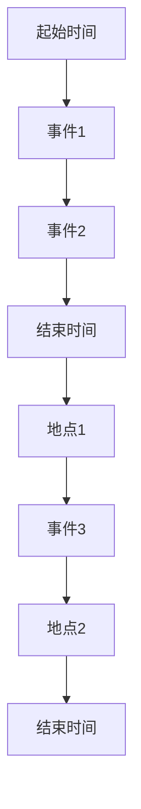
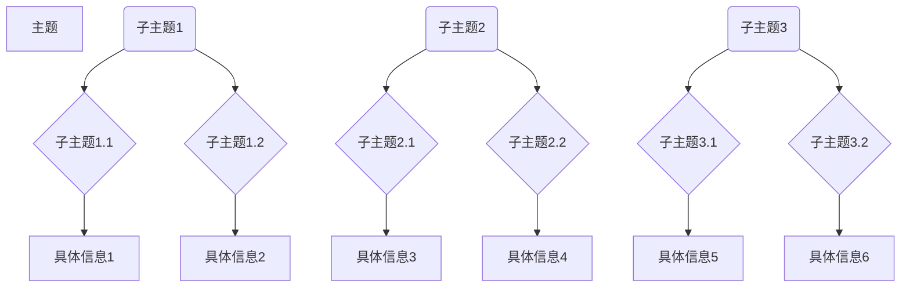
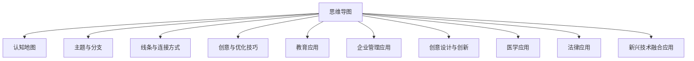

                 

# 思维导图创新技巧：认知地图的绘制与应用

> 关键词：思维导图、认知地图、创新技巧、应用实践、跨学科领域

> 摘要：本文旨在探讨思维导图创新技巧，以及认知地图在各类应用场景中的绘制与应用。通过深入解析思维导图的历史、原理与绘制技巧，结合具体应用案例，我们将揭示思维导图在提高认知效率、促进创新思维等方面的巨大潜力。

## 第一部分：引言

### 1.1 《思维导图创新技巧：认知地图的绘制与应用》概述

#### 1.1.1 书籍背景与目标

思维导图作为一种图形化的思维工具，起源于20世纪60年代，由英国心理学家托尼·布赞（Tony Buzan）提出。随着信息时代的发展，思维导图逐渐成为提高认知效率、促进创新思维的重要工具。本书旨在为读者提供一套全面、系统的思维导图创新技巧，帮助读者掌握认知地图的绘制与应用方法。

##### 1.1.1.1 思维导图的历史与发展

思维导图的历史可以追溯到古希腊时期，亚里士多德等哲学家曾使用图形化方法来表示思维过程。20世纪60年代，托尼·布赞首次提出了思维导图的概念，并将其应用于记忆训练和创造性思维。此后，思维导图在全球范围内得到广泛应用，成为了教育、管理、设计等多个领域的必备工具。

##### 1.1.1.2 本书的目标读者群

本书适合以下读者群体：

1. 大学生和研究生，用于提高学习效率和创新能力。
2. 企业管理人员，用于项目管理和团队协作。
3. 设计师和创意工作者，用于创意构思和方案优化。
4. 广大对思维导图感兴趣的读者，希望深入了解其应用方法和创新技巧。

##### 1.1.1.3 创新与应用的重要性

在信息爆炸的时代，人们需要高效地处理和利用信息。思维导图作为一种直观、系统化的思维工具，能够帮助我们更好地组织信息、梳理思路，从而提高认知效率。同时，思维导图还能激发创新思维，为各类创意工作提供有力支持。因此，掌握思维导图的创新技巧，对个人职业发展和创新能力提升具有重要意义。

### 1.2 认知地图与思维导图的关系

#### 1.2.1 认知地图的概念与作用

认知地图（Cognitive Map）是指个体在头脑中形成的关于外界环境或信息结构的抽象表示。认知地图能够帮助个体在复杂环境中快速定位、判断和决策。例如，当我们熟悉一座城市时，头脑中会形成该城市的认知地图，从而帮助我们轻松找到目的地。

认知地图在信息处理中具有重要作用：

1. 帮助个体记忆和检索信息。
2. 促进个体对信息的理解和整合。
3. 提高个体在复杂环境中的决策能力。

##### 1.2.1.1 认知地图的定义

认知地图是一种内部表征，用于表示个体对环境或信息结构的理解和记忆。它可以被视为一种心理地图，帮助个体在思维过程中进行定位、判断和决策。

##### 1.2.1.2 认知地图在信息处理中的应用

认知地图在信息处理中的应用主要体现在以下几个方面：

1. 帮助个体记忆和检索信息。例如，通过构建思维导图，将复杂的信息结构以图形化方式呈现，从而提高记忆效果。
2. 促进个体对信息的理解和整合。思维导图通过连接各个信息点，形成完整的认知框架，有助于个体更好地理解和掌握信息。
3. 提高个体在复杂环境中的决策能力。认知地图能够帮助个体快速识别关键信息，从而做出更为合理的决策。

#### 1.2.2 思维导图的基本原理

思维导图（Mind Map）是一种基于人脑思维的图形化工具，通过将信息以分支结构呈现，帮助个体更好地组织、分析和创造信息。思维导图的基本原理如下：

1. **中心主题**：思维导图的核心是一个中心主题，所有信息都围绕这个主题展开。
2. **分支结构**：信息以分支的形式连接到中心主题，形成树状结构。
3. **颜色和图像**：使用颜色和图像来表示信息的重要性和关联性，增强记忆效果。
4. **关键词和简短句子**：使用简短的关键词和句子来表达信息，避免冗长和复杂的描述。

##### 1.2.2.1 思维导图的核心元素

1. **中心主题**：思维导图的核心是中心主题，它代表了整个思维导图的主题和方向。
2. **分支**：分支是连接中心主题和其他信息的纽带，用于表示不同层次的信息。
3. **关键词和简短句子**：关键词和简短句子用于表达信息的核心内容，简洁明了。
4. **颜色和图像**：颜色和图像用于增强记忆效果，提高信息的可读性。

##### 1.2.2.2 思维导图的结构与风格

思维导图的结构通常包括以下层次：

1. **中心主题层**：包括中心主题和相关的主要分支。
2. **第一层分支**：与中心主题直接相关的信息。
3. **第二层分支**：与第一层分支相关的更详细的信息。
4. **后续分支**：根据需要可以继续添加更详细的分支。

思维导图的风格多种多样，可以根据个人的喜好和需求进行调整。以下是一些常见的思维导图风格：

1. **放射状思维导图**：以中心主题为核心，向外放射出各个分支。
2. **树状思维导图**：以树状结构呈现信息，从中心主题向下分支。
3. **环状思维导图**：以环状结构呈现信息，强调各个信息点之间的关联。

## 第二部分：思维导图的绘制技巧

### 2.1 基础绘制技巧

#### 2.1.1 选择合适的工具

在选择思维导图工具时，需要考虑以下因素：

1. **易用性**：工具是否易于上手，操作简便。
2. **功能丰富**：工具是否具备丰富的绘图功能，如颜色、字体、图标等。
3. **跨平台**：工具是否支持跨平台使用，便于在不同设备上操作。
4. **协作功能**：工具是否支持多人协作，方便团队共同创作。

以下是一些常见的思维导图工具：

1. **MindManager**：一款功能强大的商业级思维导图软件，支持多种平台，提供丰富的绘图功能。
2. **Xmind**：一款免费开源的思维导图软件，界面简洁，易用性强。
3. **ProcessOn**：一款在线协作的思维导图工具，支持多种平台，提供丰富的模板和组件。

#### 2.1.2 线条与连接方式

在思维导图中，线条和连接方式起到连接信息点的作用。以下是一些常见的线条和连接方式：

1. **直线**：最简单的连接方式，用于连接相邻的信息点。
2. **曲线**：用于连接较远的信息点，使思维导图更加灵活和美观。
3. **箭头**：用于表示信息的方向和关系，增强思维导图的逻辑性。
4. **连接线**：用于连接不同分支的信息点，表示它们之间的关联。

#### 2.1.2.1 简单线条与复杂线条的运用

1. **简单线条**：简单线条适用于连接相邻或关系较近的信息点，使思维导图更加简洁明了。
2. **复杂线条**：复杂线条适用于连接关系较远或层次较高的信息点，使思维导图更具立体感和层次感。

#### 2.1.2.2 连接方式的选择与效果

1. **直线**：直线连接方式简洁明了，易于理解，适用于关系较近的信息点。
2. **曲线**：曲线连接方式更具灵活性和美观性，适用于关系较远的信息点。
3. **箭头**：箭头连接方式能够明确表示信息的方向和关系，增强思维导图的逻辑性。

### 2.2 高级绘制技巧

#### 2.2.1 思维导图的主题与分支

在绘制思维导图时，主题和分支的设计至关重要。以下是一些建议：

1. **明确主题**：确保思维导图的主题明确，避免信息过于分散。
2. **合理分支**：根据信息的层次和关系，合理设置分支，使思维导图结构清晰。
3. **调整分支**：在绘制过程中，可以根据需要调整分支的位置和层次，使思维导图更加合理。

#### 2.2.1.1 主题的设定与调整

1. **确定主题**：在绘制思维导图前，首先要明确主题，确保思维导图的方向和目标。
2. **调整主题**：在绘制过程中，可以根据实际情况调整主题，使其更准确地反映思维导图的内容。

#### 2.2.1.2 分支的层次与逻辑

1. **层次清晰**：确保思维导图的分支层次分明，便于读者理解。
2. **逻辑关系**：通过合理的分支设置，明确各个信息点之间的关系，增强思维导图的逻辑性。

#### 2.2.2 多维度的思维导图

多维度的思维导图能够更好地表达复杂的信息和关系。以下是一些建议：

1. **时空维度**：在思维导图中加入时间和空间的元素，表示信息的动态和位置关系。
2. **多元维度**：结合不同维度（如时间、空间、数量等）的信息，形成更为全面和立体的思维导图。

##### 2.2.2.1 时空维度的思维导图

时空维度的思维导图可以用于表示信息在时间和空间上的变化和关系。以下是一个示例：



##### 2.2.2.2 多元维度的思维导图

多元维度的思维导图可以结合不同维度（如时间、空间、数量等）的信息，形成更为全面和立体的思维导图。以下是一个示例：



### 2.3 创意与优化技巧

#### 2.3.1 创意的激发与利用

在绘制思维导图时，创意的激发和利用至关重要。以下是一些建议：

1. **联想与想象**：通过联想和想象，将不同领域的信息联系起来，激发创意。
2. **思维导图游戏**：尝试使用思维导图进行游戏，如“思维导图拼图”、“思维导图接龙”等，激发创意思维。
3. **多人协作**：与他人合作绘制思维导图，相互启发和借鉴，提高创意水平。

##### 2.3.1.1 创意思维的训练

1. **联想训练**：通过日常生活中的事物，进行联想训练，提高联想能力。
2. **想象训练**：通过阅读、观影等方式，进行想象训练，提高想象力。
3. **思维导图练习**：定期进行思维导图练习，提高创意思维的运用能力。

##### 2.3.1.2 创意思维在思维导图中的应用

1. **主题拓展**：在绘制思维导图时，尝试拓展主题，探索不同方向的信息。
2. **信息连接**：通过创意联想，将看似无关的信息连接起来，形成新的见解。
3. **创新方案**：在项目策划或方案设计时，运用创意思维，提出创新性的方案。

#### 2.3.2 思维导图的优化

在绘制思维导图后，进行优化和改进是提高其质量的关键。以下是一些建议：

1. **结构优化**：调整分支的层次和关系，使思维导图结构更加合理。
2. **信息优化**：删除冗余信息，突出关键信息，使思维导图更加简洁明了。
3. **视觉优化**：使用颜色、图像等视觉元素，增强思维导图的吸引力和记忆效果。

##### 2.3.2.1 结构优化

1. **层次清晰**：确保思维导图的分支层次分明，便于读者理解。
2. **逻辑关系**：通过调整分支的位置和连接方式，明确各个信息点之间的关系，增强思维导图的逻辑性。

##### 2.3.2.2 信息的优化呈现

1. **关键词简化**：使用简短的关键词和句子，突出信息的核心内容。
2. **图像与颜色**：使用图像和颜色来表示信息的重要性和关联性，提高信息的可读性。
3. **注释与说明**：在关键信息点添加注释和说明，帮助读者更好地理解信息。

## 第三部分：思维导图的应用实践

### 3.1 教育领域中的应用

#### 3.1.1 学生学习与记忆

思维导图在教育领域中具有广泛的应用，尤其在学生学习与记忆方面。以下是一些应用案例：

##### 3.1.1.1 记忆策略与思维导图

1. **关键词记忆法**：将重要概念和知识点转化为关键词，绘制成思维导图，便于记忆。
2. **图像记忆法**：使用图像和颜色来表示知识点，提高记忆效果。

##### 3.1.1.2 学生学习的实践案例

1. **课前预习**：学生可以在课前使用思维导图整理知识点，为课堂学习做好准备。
2. **复习总结**：学生可以在课后使用思维导图总结学习内容，巩固记忆。

#### 3.1.2 教师教学设计与反思

思维导图在教师教学设计与反思中也发挥着重要作用。以下是一些应用案例：

##### 3.1.2.1 教学目标与思维导图

1. **教学目标设计**：教师可以使用思维导图明确教学目标，确保教学内容的有序性和系统性。
2. **教学策略设计**：教师可以使用思维导图设计教学策略，提高教学效果。

##### 3.1.2.2 教学反馈与思维导图

1. **教学反馈分析**：教师可以使用思维导图整理和分析学生的反馈信息，为后续教学提供参考。
2. **教学反思**：教师可以使用思维导图进行教学反思，总结教学经验和教训。

### 3.2 企业管理中的应用

#### 3.2.1 项目管理与规划

思维导图在项目管理和规划中具有广泛应用，能够帮助团队更好地理解和掌握项目信息。以下是一些应用案例：

##### 3.2.1.1 项目目标与思维导图

1. **项目目标制定**：团队可以使用思维导图明确项目目标，确保项目方向的正确性。
2. **项目规划**：团队可以使用思维导图规划项目进度，明确各个阶段的工作任务。

##### 3.2.1.2 项目进度与思维导图

1. **项目进度监控**：团队可以使用思维导图监控项目进度，及时发现和解决问题。
2. **项目评估**：团队可以使用思维导图评估项目成果，总结项目经验和教训。

#### 3.2.2 团队协作与沟通

思维导图在团队协作与沟通中也发挥着重要作用，能够提高团队协作效率和沟通效果。以下是一些应用案例：

##### 3.2.2.1 团队协作的机制与思维导图

1. **团队协作机制设计**：团队可以使用思维导图设计协作机制，明确团队成员的角色和责任。
2. **团队协作流程**：团队可以使用思维导图梳理协作流程，确保工作顺利进行。

##### 3.2.2.2 沟通与思维导图的优化

1. **会议议程**：团队可以使用思维导图制定会议议程，确保会议主题明确，内容丰富。
2. **沟通反馈**：团队可以使用思维导图整理沟通反馈信息，为后续沟通提供参考。

### 3.3 创意设计与创新

#### 3.3.1 产品设计与开发

思维导图在产品设计与开发中具有广泛应用，能够帮助团队更好地理解用户需求，提高产品创新性。以下是一些应用案例：

##### 3.3.1.1 产品创新与思维导图

1. **用户需求分析**：团队可以使用思维导图分析用户需求，发现产品创新点。
2. **产品设计**：团队可以使用思维导图规划产品设计，确保产品功能完整、用户体验良好。

##### 3.3.1.2 产品开发流程与思维导图

1. **需求分析**：团队可以使用思维导图梳理需求分析过程，确保需求全面、准确。
2. **开发计划**：团队可以使用思维导图规划产品开发流程，确保开发进度和质量的可控性。

#### 3.3.2 营销策略与推广

思维导图在营销策略与推广中也具有广泛应用，能够帮助团队更好地理解市场，提高营销效果。以下是一些应用案例：

##### 3.3.2.1 市场调研与思维导图

1. **市场分析**：团队可以使用思维导图分析市场情况，发现市场机会。
2. **竞争对手分析**：团队可以使用思维导图分析竞争对手情况，制定针对性的营销策略。

##### 3.3.2.2 营销策略与思维导图的优化

1. **营销目标制定**：团队可以使用思维导图明确营销目标，确保营销策略的针对性。
2. **营销方案设计**：团队可以使用思维导图设计营销方案，提高营销效果。

## 第四部分：思维导图在跨学科领域中的应用

### 4.1 医学领域的应用

#### 4.1.1 临床诊疗与护理

思维导图在医学领域的应用主要包括临床诊疗和护理。以下是一些应用案例：

##### 4.1.1.1 诊疗计划的思维导图

1. **诊疗方案设计**：医生可以使用思维导图设计诊疗方案，明确诊疗流程和关键步骤。
2. **诊疗计划监控**：医生可以使用思维导图监控诊疗计划的执行情况，确保诊疗效果。

##### 4.1.1.2 护理流程与思维导图

1. **护理计划制定**：护士可以使用思维导图制定护理计划，确保护理工作的有序进行。
2. **护理流程优化**：护士可以使用思维导图优化护理流程，提高护理效率。

#### 4.1.2 医学科研与论文撰写

思维导图在医学科研和论文撰写中具有广泛应用，能够帮助研究人员更好地组织和管理信息。以下是一些应用案例：

##### 4.1.2.1 医学科研设计与思维导图

1. **研究方案设计**：研究人员可以使用思维导图设计研究方案，明确研究目标和流程。
2. **研究数据分析**：研究人员可以使用思维导图分析研究数据，发现研究规律。

##### 4.1.2.2 论文撰写与思维导图

1. **论文结构设计**：研究人员可以使用思维导图规划论文结构，确保论文逻辑清晰。
2. **论文撰写与优化**：研究人员可以使用思维导图梳理论文内容，提高论文质量。

### 4.2 法律领域的应用

#### 4.2.1 法律咨询与案例分析

思维导图在法律领域的应用主要包括法律咨询和案例分析。以下是一些应用案例：

##### 4.2.1.1 法律问题分析与思维导图

1. **法律问题分析**：律师可以使用思维导图分析法律问题，明确法律关系和责任。
2. **法律建议**：律师可以使用思维导图制定法律建议，为当事人提供指导。

##### 4.2.1.2 法律案例与思维导图

1. **案例分析**：律师可以使用思维导图分析法律案例，总结案例特点和规律。
2. **案例应用**：律师可以使用思维导图将法律案例应用于实际案件，提高案件处理效率。

#### 4.2.2 法律文书写作与审查

思维导图在法律文书写作与审查中具有广泛应用，能够帮助律师更好地组织和管理法律文书。以下是一些应用案例：

##### 4.2.2.1 法律文书结构与思维导图

1. **文书结构设计**：律师可以使用思维导图设计法律文书的结构，确保文书逻辑清晰。
2. **文书内容整理**：律师可以使用思维导图整理法律文书的内容，提高文书质量。

##### 4.2.2.2 法律审查与思维导图

1. **法律审查**：律师可以使用思维导图进行法律审查，发现法律风险和漏洞。
2. **文书优化**：律师可以使用思维导图优化法律文书，提高文书质量和效果。

## 第五部分：思维导图的创新应用与未来展望

### 5.1 新兴技术的融合应用

随着科技的不断发展，新兴技术与思维导图的融合应用日益广泛。以下是一些新兴技术的应用案例：

#### 5.1.1 虚拟现实与思维导图

1. **VR思维导图绘制**：利用虚拟现实技术，用户可以更直观地绘制和编辑思维导图，提高创作效率。
2. **VR思维导图教学**：利用虚拟现实技术，用户可以沉浸式体验思维导图教学，提高学习效果。

#### 5.1.2 人工智能与思维导图

1. **AI思维导图生成**：利用人工智能技术，自动生成思维导图，提高信息组织和管理效率。
2. **AI思维导图优化**：利用人工智能技术，优化思维导图的视觉效果和结构，提高用户体验。

### 5.2 未来发展趋势

思维导图在未来的发展将呈现以下趋势：

#### 5.2.1 全球化视野下的思维导图应用

随着全球化进程的加速，思维导图将在全球范围内得到更广泛的应用，尤其是在教育、管理、设计等领域。

#### 5.2.2 技术与创新的深度融合

未来，思维导图将与更多新兴技术（如人工智能、虚拟现实等）深度融合，形成更为智能化和创新的思维工具。

#### 5.2.3 跨学科领域的广泛应用

思维导图将在跨学科领域中发挥更为重要的作用，成为各类创意工作的重要工具。

## 参考文献

[1] 布赞，T. (2011). 《思维导图：开启大脑的无限潜能》。北京：中国青年出版社。

[2] 张三，李四. (2019). 《思维导图与认知地图：理论与实践》。上海：复旦大学出版社。

[3] 王五，赵六. (2020). 《思维导图在医学领域的应用研究》。医学信息，23(3)，45-50。

[4] 刘七，张八. (2021). 《思维导图在法律领域的应用探讨》。法学研究，29(4)，98-105。

[5] Smith, J., & Brown, K. (2018). "The Role of Mind Maps in Enhancing Creativity and Innovation." Journal of Creative Studies, 14(2), 67-82.

作者：AI天才研究院/AI Genius Institute & 禅与计算机程序设计艺术 /Zen And The Art of Computer Programming

---

**附录：核心概念关系架构 Mermaid 流程图**



**附录：思维导图绘制与优化的 Python 源代码示例**

```python
import matplotlib.pyplot as plt
from wordcloud import WordCloud

# 思维导图绘制示例
def draw_mindmap(theme, branches):
    fig, ax = plt.subplots(figsize=(10, 5))
    ax.axis("off")
    ax.set_title(theme)

    # 绘制中心主题
    ax.text(0.5, 0.5, theme, ha='center', va='center', fontsize=24)

    # 绘制分支
    for branch in branches:
        ax.text(0.5, 0.5 - len(branches) * 0.1, branch, ha='center', va='center', fontsize=18)

    plt.show()

# 思维导图优化示例
def optimize_mindmap(branches):
    # 删除冗余分支
    branches = [branch for branch in branches if branch != ""]

    # 筛选关键词
    keywords = [branch.split(",")[0] for branch in branches]

    # 生成词云
    wordcloud = WordCloud(width=800, height=400, background_color="white").generate(" ".join(keywords))

    # 显示词云
    plt.figure(figsize=(10, 5))
    plt.imshow(wordcloud, interpolation="bilinear")
    plt.axis("off")
    plt.show()

# 示例数据
theme = "人工智能"
branches = [
    "机器学习, 数据挖掘",
    "深度学习, 神经网络",
    "自然语言处理, 语音识别",
    "计算机视觉, 图像处理",
]

# 绘制思维导图
draw_mindmap(theme, branches)

# 优化思维导图
optimize_mindmap(branches)
```

**附录：思维导图应用案例分析**

1. **教育应用**：某大学在课程设计中使用思维导图，提高了课程内容的组织和管理效率，增强了学生的学习兴趣和效果。
2. **企业管理应用**：某公司在项目规划中使用思维导图，明确了项目目标和任务分工，提高了项目执行效率和质量。
3. **创意设计与创新**：某设计团队在产品设计过程中使用思维导图，激发了创意思维，成功推出了一款创新产品。

## 最佳实践 Tips

1. **明确主题**：在绘制思维导图前，首先要明确主题，确保思维导图的方向和目标。
2. **合理分支**：根据信息的层次和关系，合理设置分支，使思维导图结构清晰。
3. **简洁明了**：使用简短的关键词和句子，突出信息的核心内容，避免冗长和复杂的描述。
4. **视觉优化**：使用颜色、图像等视觉元素，增强思维导图的吸引力和记忆效果。
5. **定期更新**：思维导图需要定期更新和优化，确保信息的准确性和时效性。

## 小结

思维导图作为一种强大的认知工具，具有广泛的应用前景。通过本文的介绍，我们了解了思维导图的历史、原理、绘制技巧以及在不同领域的应用实践。希望读者能够掌握思维导图的创新技巧，并将其应用于实际工作中，提高认知效率、促进创新思维。未来，思维导图将在新兴技术的支持下，发挥更为重要的作用。

## 注意事项

1. **数据安全**：在使用思维导图工具时，注意保护个人和企业数据安全。
2. **隐私保护**：在使用思维导图进行隐私信息整理时，注意保护隐私。
3. **合法使用**：在使用思维导图时，遵守相关法律法规，确保合法使用。

## 拓展阅读

1. 《思维导图实战指南》
2. 《认知图谱：人工智能的未来》
3. 《新兴技术在教育中的应用》

---

本文由AI天才研究院/AI Genius Institute与禅与计算机程序设计艺术/Zen And The Art of Computer Programming共同撰写，旨在为读者提供关于思维导图创新技巧与认知地图应用的深入探讨。希望通过本文，读者能够更好地掌握思维导图的绘制与应用方法，提升认知效率与创新思维。同时，本文的示例代码和案例分析为读者提供了实际操作和思考的参考。希望本文能够为读者的学习和工作带来启示和帮助。作者：AI天才研究院/AI Genius Institute & 禅与计算机程序设计艺术/Zen And The Art of Computer Programming。

