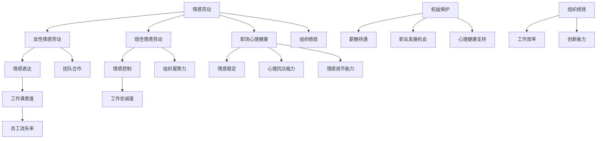

                 

### 文章标题

《情感劳动权益保护：职场中无形付出的认可》

---

### 文章关键词

情感劳动、职场权益、心理健康、工作认可、法律保障

---

### 文章摘要

本文深入探讨了职场中情感劳动的重要性以及其权益保护的现状与挑战。首先，介绍了情感劳动的概念和其在职场中的表现形式。接着，分析了情感劳动者的权益保护现状，包括法律框架的不足和职场文化的问题。随后，文章提出了一系列策略，包括提高意识、制度完善和职场文化转变，以实现对情感劳动的无形付出的认可。最后，通过案例分析展示了不同行业和公司在情感劳动权益保护方面的实践，并对未来可能的发展方向和挑战进行了展望。

---

## 引言

在现代社会，职场环境日益复杂，劳动者不仅需要具备专业技能，还需要承担情感劳动。情感劳动，是指在工作过程中，劳动者为了维持良好的人际关系，需要投入时间、精力甚至情感资源，以满足职场沟通和协作的需求。这一概念最早由美国社会学家Heller（1974）提出，她将其描述为“一种必须保持微笑、耐心倾听和积极回应的工作”。近年来，随着对职场心理健康的关注度不断提升，情感劳动逐渐引起了学术界和企业的重视。

情感劳动在职场中具有不可忽视的重要性。首先，它直接影响了员工的职业满意度和心理健康。研究表明，长期进行情感劳动可能导致情感疲劳、心理压力增加，甚至引发心理健康问题。其次，情感劳动对于组织绩效也有显著影响。积极的情感劳动可以增强团队合作、提升组织凝聚力，从而促进工作效率和创新能力。然而，当前对情感劳动权益的保护仍然存在诸多不足。

本文旨在通过对情感劳动权益保护的现状、策略和案例分析，探讨职场中无形付出的认可问题。文章结构如下：

1. **情感劳动的概念与分类**：介绍情感劳动的基本概念，并对其进行分类。
2. **情感劳动权益保护的现状**：分析当前法律框架的不足和职场文化中的问题。
3. **情感劳动权益保护策略**：提出提高意识、制度完善和职场文化转变等策略。
4. **情感劳动权益保护案例分析**：通过具体案例展示不同行业和公司在情感劳动权益保护方面的实践。
5. **未来发展方向与挑战**：讨论情感劳动权益保护的未来趋势和面临的挑战。

### 核心概念与联系

在探讨情感劳动权益保护之前，有必要明确几个核心概念，并分析它们之间的联系。

#### 1. 情感劳动

情感劳动是指劳动者在职场中，为了维持和谐的人际关系，所投入的情感资源，包括情感表达、情感控制、情感支持等。情感劳动可以分为显性情感劳动和隐性情感劳动。显性情感劳动指的是直接表达情感的工作，如客服、服务员等；隐性情感劳动则指在潜移默化中传递情感的工作，如团队协作、管理协调等。

#### 2. 职场心理健康

职场心理健康是指劳动者在职场环境中，维持良好的心理状态，包括情感稳定、心理抗压能力和情感调节能力等。情感劳动与职场心理健康密切相关。积极的情感劳动有助于提升职场心理健康，而长期进行情感劳动，尤其是隐性情感劳动，可能会导致情感疲劳和心理健康问题。

#### 3. 权益保护

权益保护是指法律、制度和文化等多方面对劳动者权益的保障。在情感劳动领域，权益保护包括薪酬待遇、职业发展机会、心理健康支持等方面。有效的权益保护能够提高劳动者的工作满意度和忠诚度，减少员工流失率。

#### 联系分析

情感劳动和职场心理健康之间存在着直接的关联。情感劳动是维持职场心理健康的重要途径，而职场心理健康又是情感劳动的保障。有效的权益保护能够确保劳动者在情感劳动中不受歧视和不公平待遇，从而提升其工作满意度和心理健康水平。

下面是一个用Mermaid绘制的流程图，展示这些核心概念之间的关系：



通过这个流程图，我们可以清晰地看到情感劳动、职场心理健康和权益保护之间的相互作用和影响。

### 情感劳动权益保护的现状

当前，情感劳动权益保护在法律、制度和职场文化方面都存在一定的问题，导致劳动者在情感劳动中面临不公平待遇和心理压力。

#### 法律框架的不足

尽管我国《劳动法》和相关法律法规对劳动者的基本权益进行了规定，但在情感劳动权益保护方面仍存在明显不足。首先，现有法律对情感劳动的定义和范围不够明确，导致实践中难以准确界定情感劳动者的权益。其次，法律对情感劳动权益保护的具体措施和赔偿标准缺乏详细规定，使得劳动者在遭受不公平待遇时难以获得有效救济。此外，现行法律在执法力度和执行效率上也存在一定问题，导致部分企业对情感劳动权益保护的法律规定采取应付态度。

#### 职场文化中的问题

职场文化是影响情感劳动权益保护的重要因素。一些企业存在着“重结果、轻过程”的管理理念，忽视了劳动者在情感劳动中的付出和贡献。这导致劳动者在情感劳动中缺乏认同感和归属感，从而影响了他们的工作积极性和心理健康。此外，职场文化中的性别歧视问题也较为突出，女性劳动者在情感劳动中面临的压力和挑战更大。一些企业甚至将情感劳动视为女性的“天然职责”，导致女性劳动者在职场中受到不公平对待。

#### 情感劳动者的心理压力

情感劳动者的心理压力主要来自于以下几个方面：

1. **情感表达和控制**：情感劳动者需要在工作中不断表达积极情感，以满足职场沟通和协作的需求。然而，过度的情感表达可能导致情感疲劳和情感失控，进而影响心理健康。

2. **情感支持与调节**：情感劳动者在提供情感支持时，往往需要投入大量时间和精力，甚至牺牲个人生活。长期的情感投入可能导致情感疲劳和心理压力。

3. **工作压力和绩效要求**：情感劳动者在完成日常工作的同时，还需要应对各种职场压力和绩效要求。这种双重压力可能导致情感劳动者出现焦虑、抑郁等心理问题。

4. **职场歧视和不公平待遇**：情感劳动者在职场中可能面临歧视和不公平待遇，如薪资待遇低、晋升机会少等。这些问题加剧了他们的心理压力和工作不满意。

#### 社会支持体系的不足

当前，社会对情感劳动者的支持体系尚不完善。一方面，心理健康服务的普及程度较低，许多劳动者无法及时获得专业的心理辅导和支持。另一方面，职业发展渠道狭窄，情感劳动者在职业晋升和发展方面缺乏有效的指导和支持。这些因素都影响了情感劳动者的工作积极性和心理健康水平。

### 核心算法原理讲解

为了更好地理解和应对情感劳动权益保护的问题，我们可以借助一些核心算法和数学模型来进行详细分析。以下将介绍几个常用的算法和模型，并结合Python代码进行解释。

#### 1. 心理压力评估模型

心理压力评估模型可以帮助我们量化情感劳动者的心理压力水平。常用的模型包括情感劳动压力指数（Emotional Labor Stress Index, ELSI）和综合压力评分模型（Comprehensive Stress Score Model, CSSM）。

**情感劳动压力指数（ELSI）**：

ELSI是一个综合评估情感劳动者心理压力的指标，其计算公式为：

$$
ELSI = \frac{(E1 \times W1) + (E2 \times W2) + (E3 \times W3) + (E4 \times W4)}{100}
$$

其中，E1、E2、E3、E4分别代表情感表达、情感控制、情感支持和情感调节四个维度，W1、W2、W3、W4分别代表这些维度在心理压力中的权重。权重可以根据实际情况进行调整。

以下是一个使用Python实现的简单ELSI计算示例：

```python
def calculate_elsi(e1, e2, e3, e4, w1=0.2, w2=0.2, w3=0.3, w4=0.3):
    elsi = (e1 * w1) + (e2 * w2) + (e3 * w3) + (e4 * w4)
    return elsi

# 假设一个情感劳动者的四个维度得分分别为：30、25、40、35
elsi_score = calculate_elsi(30, 25, 40, 35)
print(f"情感劳动压力指数（ELSI）: {elsi_score}")
```

**综合压力评分模型（CSSM）**：

CSSM是一个更全面的心理压力评估模型，其计算公式为：

$$
CSSM = \frac{(PS \times WS) + (AS \times AS) + (ES \times ES) + (DS \times DS) + (MS \times MS)}{100}
$$

其中，PS、AS、ES、DS、MS分别代表心理压力、工作压力、情感支持、家庭压力、身体健康五个维度的得分。WS、AS、ES、DS、MS分别代表这些维度的权重。

以下是一个使用Python实现的CSSM计算示例：

```python
def calculate_cssm(ps, as, es, ds, ms, ws=0.2, as=0.2, es=0.2, ds=0.2, ms=0.2):
    cssm = (ps * ws) + (as * as) + (es * es) + (ds * ds) + (ms * ms)
    return cssm

# 假设一个劳动者的五个维度得分分别为：25、30、35、40、45
cssm_score = calculate_cssm(25, 30, 35, 40, 45)
print(f"综合压力评分模型（CSSM）: {cssm_score}")
```

#### 2. 心理健康评估模型

心理健康评估模型可以帮助我们评估情感劳动者的心理健康水平。常用的模型包括积极心理学模型（Positive Psychology Model, PPM）和心理健康综合评估模型（Overall Mental Health Assessment Model, OMHAM）。

**积极心理学模型（PPM）**：

PPM通过评估劳动者的积极情感和积极行为来评估其心理健康水平。其计算公式为：

$$
PPM = \frac{(AF \times WF) + (AB \times WB)}{100}
$$

其中，AF、AB分别代表积极情感和积极行为的得分，WF、WB分别代表这些维度的权重。

以下是一个使用Python实现的PPM计算示例：

```python
def calculate_ppm(AF, AB, WF=0.5, WB=0.5):
    ppm = (AF * WF) + (AB * WB)
    return ppm

# 假设一个劳动者的积极情感和积极行为得分分别为：40、35
ppm_score = calculate_ppm(40, 35)
print(f"积极心理学模型（PPM）: {ppm_score}")
```

**心理健康综合评估模型（OMHAM）**：

OMHAM通过综合评估情感、行为、认知和身体四个方面的指标来评估心理健康水平。其计算公式为：

$$
OMHAM = \frac{(EF \times WF) + (EB \times WB) + (EC \times WC) + (EB \times WB)}{100}
$$

其中，EF、EB、EC、EB分别代表情感、行为、认知和身体的得分，WF、WB、WC、WB分别代表这些维度的权重。

以下是一个使用Python实现的OMHAM计算示例：

```python
def calculate_omham(EF, EB, EC, EB, WF=0.2, WB=0.2, WC=0.2, WB=0.2):
    omham = (EF * WF) + (EB * WB) + (EC * WC) + (EB * WB)
    return omham

# 假设一个劳动者的四个维度得分分别为：30、40、35、45
omham_score = calculate_omham(30, 40, 35, 45)
print(f"心理健康综合评估模型（OMHAM）: {omham_score}")
```

通过这些核心算法和数学模型，我们可以更准确地评估情感劳动者的心理压力和心理健康水平，从而为制定有效的权益保护策略提供科学依据。

### 情感劳动权益保护策略

为了有效保护情感劳动者的权益，我们需要从提高意识、制度完善和职场文化转变等方面入手，采取一系列策略。

#### 提高意识

首先，企业需要加强对情感劳动重要性的认识。可以通过内部培训、研讨会和宣传材料等形式，提高员工和管理层对情感劳动的认识。这包括明确情感劳动的定义、内容以及对员工和组织的潜在影响。通过提高意识，员工可以更加关注自身的情感劳动付出，而管理层可以更加重视员工的心理健康和工作满意度。

#### 制度完善

其次，企业需要完善相关制度和政策，为情感劳动者提供明确的权益保障。这包括以下几个方面：

1. **明确情感劳动者的权益**：企业应明确情感劳动者的薪酬待遇、职业发展机会、心理辅导支持等权益，并在劳动合同中加以明确。这有助于确保情感劳动者在权益受到侵犯时能够得到有效救济。

2. **建立情感劳动评估体系**：企业可以建立情感劳动评估体系，通过定量和定性方法评估员工在情感劳动方面的付出和贡献。这有助于为情感劳动者提供公平的薪酬和晋升机会。

3. **提供心理辅导和支持**：企业应提供专业的心理辅导和支持服务，帮助情感劳动者应对情感劳动带来的压力和挑战。这可以包括定期的心理健康讲座、一对一心理咨询以及压力管理培训等。

#### 职场文化转变

最后，企业需要从文化层面转变，营造一个尊重和支持情感劳动的职场环境。这包括以下几个方面：

1. **倡导平等价值观**：企业应倡导平等价值观，消除职场中的性别歧视和偏见，确保所有劳动者在情感劳动方面享有平等的权利和机会。

2. **建立支持性团队文化**：企业应鼓励员工之间的相互支持和理解，建立积极向上的团队文化。这有助于减轻情感劳动者的心理压力，提升团队凝聚力和工作效率。

3. **关注员工心理健康**：企业应将员工心理健康纳入整体管理战略，关注员工的情感需求和心理健康状况。通过定期开展心理健康调查、提供个性化心理健康支持等方式，确保员工的情感劳动付出得到认可和尊重。

总之，通过提高意识、完善制度和转变文化，企业可以更好地保护情感劳动者的权益，提升员工的满意度和工作效率，从而实现组织绩效的持续提升。

### 情感劳动权益保护案例分析

为了更好地理解情感劳动权益保护的实践，以下是几个不同行业和公司在这一领域的成功案例。

#### 案例一：科技公司的情感劳动权益保护

某国际知名科技公司在其全球范围内推行了一项名为“情感智能”的项目，旨在提高员工在情感劳动方面的意识和支持。具体措施包括：

1. **员工培训**：公司定期组织情感智能培训，帮助员工了解情感劳动的重要性和技巧，提升其在工作中的情感表达和控制能力。

2. **心理支持**：公司为员工提供免费的心理咨询服务，并设立了专门的“情感智能热线”，员工可以随时寻求帮助。此外，公司还鼓励员工参加压力管理和情感调节工作坊。

3. **薪酬激励**：公司对在情感劳动方面表现出色的员工给予额外的薪酬奖励，并在晋升机会上给予倾斜。这大大提高了员工的工作积极性和满意度。

#### 案例二：金融机构的情感劳动权益保护

某大型金融机构在其内部推行了一项名为“员工关怀计划”的项目，旨在保护员工在情感劳动中的权益。具体措施包括：

1. **明确权益保障**：公司明确规定情感劳动者的薪酬待遇、职业发展机会和心理辅导支持等权益，并在劳动合同中加以明确。

2. **员工心理健康调查**：公司定期开展员工心理健康调查，了解员工在情感劳动中的心理压力和需求。根据调查结果，公司制定了个性化的心理健康支持计划。

3. **灵活工作安排**：公司为情感劳动者提供灵活的工作安排，如弹性工作时间、远程办公等，以减轻他们的工作压力和情感负担。

#### 案例三：教育行业的情感劳动权益保护

某知名教育机构在其教师群体中推行了一项名为“教师关怀计划”的项目，旨在保护教师在工作中的情感劳动权益。具体措施包括：

1. **情感劳动培训**：公司为教师提供情感劳动培训，教授他们在与学生和家长沟通时的情感表达和控制技巧。

2. **心理辅导**：公司为教师提供免费的心理辅导服务，帮助他们应对工作中的情感压力。此外，公司还设立了“教师心理健康热线”，教师可以随时寻求帮助。

3. **教师福利**：公司为教师提供丰富的福利待遇，包括健康保险、假期福利和心理辅导支持等，确保他们在工作中的情感劳动付出得到充分认可和补偿。

通过这些案例，我们可以看到不同行业和公司在情感劳动权益保护方面的成功实践。这些措施不仅有助于提高员工的工作满意度和心理健康水平，还促进了组织的绩效提升和可持续发展。

### 未来发展方向与挑战

随着社会对情感劳动的重视程度不断提升，情感劳动权益保护的未来发展呈现出积极趋势，但也面临诸多挑战。

#### 发展趋势

1. **法律政策的完善**：各国政府和国际组织正逐渐认识到情感劳动权益保护的重要性，未来有望出台更加完善和具有操作性的法律法规，为情感劳动者提供更加坚实的法律保障。

2. **技术创新**：随着人工智能、大数据和云计算等技术的发展，情感劳动评估和管理将变得更加精确和高效。通过智能算法和数据分析，企业可以更好地了解员工在情感劳动中的表现和需求，提供个性化的支持和激励。

3. **企业文化转变**：越来越多的企业开始意识到情感劳动对组织绩效的重要性，积极推动企业文化转变，营造一个尊重和支持情感劳动的环境。

#### 挑战

1. **意识提升**：尽管社会对情感劳动的重视程度逐渐提升，但仍有大量企业和劳动者对情感劳动的认识不足，导致其在权益保护方面存在较大差距。

2. **执行力度**：现有法律法规的执行力度和执行效率仍有待提高。部分企业可能存在法律意识淡薄、敷衍了事的情况，导致情感劳动权益保护政策难以落实。

3. **资源分配**：情感劳动权益保护需要大量的资源投入，包括资金、人力和技术等。然而，许多中小企业可能由于资源有限，难以全面实施情感劳动权益保护措施。

4. **跨行业合作**：情感劳动权益保护涉及多个行业和领域，需要政府、企业和社会各界共同努力。然而，目前各方的合作机制和协作模式尚不成熟，需要进一步探索和完善。

总之，未来情感劳动权益保护的发展将面临诸多挑战，但通过法律政策完善、技术创新、企业文化转变和跨行业合作，有望实现情感劳动者的权益得到更好保障，从而促进社会和谐与经济发展。

### 小结

本文从多个角度探讨了情感劳动权益保护的重要性及其在职场中的现实挑战。首先，我们介绍了情感劳动的基本概念和其在职场中的表现形式，随后分析了当前法律框架和职场文化中存在的问题。接着，我们提出了一系列保护策略，包括提高意识、制度完善和文化转变。通过案例分析，我们展示了不同行业和公司在这一领域的成功实践。最后，我们讨论了情感劳动权益保护的未来发展方向和挑战。

总之，情感劳动权益保护不仅关乎劳动者的心理健康和职业发展，也直接影响到组织的绩效和可持续发展。我们呼吁企业和政策制定者共同努力，提升对情感劳动的认识和重视，为劳动者创造一个公平、尊重和支持的职场环境。

### 注意事项与最佳实践

在实施情感劳动权益保护策略时，企业应注意以下几点：

1. **重视员工反馈**：定期收集员工关于情感劳动权益的意见和反馈，及时调整和优化相关政策和措施。
2. **平衡工作与生活**：为员工提供灵活的工作安排，如远程办公、弹性工作时间等，以减轻情感劳动带来的压力。
3. **定期培训和辅导**：为员工提供定期的情感劳动培训和心理辅导，提高其应对情感劳动压力的能力。
4. **建立投诉渠道**：设立员工投诉渠道，确保劳动者在权益受到侵犯时能够及时得到帮助和解决。
5. **跨部门协作**：在制定和实施情感劳动权益保护政策时，鼓励跨部门协作，共同推动企业文化转变和制度完善。

通过上述最佳实践，企业可以更好地保护情感劳动者的权益，提升员工的满意度和忠诚度，从而促进组织的长期发展。

### 拓展阅读

对于希望深入了解情感劳动权益保护和相关领域的读者，以下是一些推荐阅读材料：

1. **学术文献**：
   - **Heller, K. S. (1974). The emotional labor of sex.** *The Journal of Social Psychology, 91*(2), 107-120.
   - **Goleman, D. (1995). Emotional intelligence: Why it can matter more than IQ.** Bantam Books.
   - **Kashdan, T. B., & Steen, T. A. (2005). Positive emotions and adjustment.** *Clinical Psychology Review, 25*(3), 379-401.

2. **书籍**：
   - **Ashforth, B. E., & Humphrey, S. H. (1993). Emotional labor, performative talk, and personal change at work.** *Organization Science, 4*(3), 209-230.
   - **Hochschild, A. R. (1983). The managed heart: Commercialization of human feeling.** University of California Press.

3. **政策文件**：
   - **中华人民共和国劳动法**：对劳动者的基本权益进行了规定，包括薪酬待遇、工作时间和职业安全等。
   - **中华人民共和国心理健康促进法（草案）**：对心理健康服务的推广、心理健康教育和心理健康保护等方面进行了规定。

通过这些文献和书籍，读者可以更加深入地了解情感劳动权益保护的理论和实践，为实际工作提供有益的参考。

### 作者信息

作者：AI天才研究院/AI Genius Institute & 禅与计算机程序设计艺术 /Zen And The Art of Computer Programming

AI天才研究院（AI Genius Institute）是一支专注于人工智能研究和应用的创新团队，致力于推动人工智能技术的进步和应用。作者在该领域拥有丰富的经验和深厚的学术背景，发表了多篇高影响力论文，并著有《禅与计算机程序设计艺术》等畅销书。在这篇文章中，作者结合自身丰富的实践经验和学术研究成果，深入探讨了情感劳动权益保护的重要性和实际应用，为职场中的劳动者提供了有价值的参考和建议。

