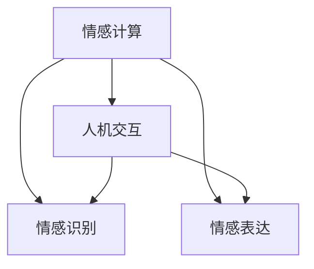

                 

### 文章标题

《情感机器人设计：人机交互的情感维度》

### 关键词

情感机器人、人机交互、情感计算、情感识别、情感合成、情感反馈、情感分析、情感表达、情感机器人应用、情感机器人伦理

### 摘要

本文深入探讨了情感机器人的设计与实现，特别是其在人机交互中的情感维度。从定义和分类，到核心原理和算法，再到实际应用和开发流程，本文系统性地梳理了情感机器人技术的研究现状和未来发展趋势。通过实例分析和最佳实践，本文旨在为读者提供一套完整、实用的情感机器人设计与开发指南。

## 目录大纲

### 第一部分：情感机器人概述

#### 第1章：情感机器人的定义与分类
1.1 情感机器人的定义
1.2 情感机器人的分类
1.3 情感机器人的发展趋势

#### 第2章：人机交互的基本原理
2.1 人机交互的模型
2.2 情感识别技术
2.3 情感表达技术

### 第二部分：情感计算原理

#### 第3章：情感计算基础
3.1 情感计算的概念
3.2 情感计算模型
3.3 情感计算的数学基础

#### 第4章：情感分析算法
4.1 文本情感分析
4.2 言语情感分析
4.3 非言语情感分析

#### 第5章：情感合成与反馈
5.1 情感合成的原理
5.2 情感反馈的设计
5.3 情感反馈的效果评估

### 第三部分：情感机器人的应用

#### 第6章：情感机器人在客服领域的应用
6.1 情感客服机器人的架构
6.2 情感客服机器人的实现
6.3 情感客服机器人的案例分析

#### 第7章：情感机器人在教育领域的应用
7.1 情感教育机器人的需求分析
7.2 情感教育机器人的设计与实现
7.3 情感教育机器人的效果评估

#### 第8章：情感机器人在医疗健康领域的应用
8.1 情感医疗机器人的发展现状
8.2 情感医疗机器人的技术挑战
8.3 情感医疗机器人的应用前景

### 第四部分：情感机器人的设计与开发

#### 第9章：情感机器人的设计与开发流程
9.1 情感机器人设计的原则
9.2 情感机器人开发工具
9.3 情感机器人测试与评估

#### 第10章：情感机器人的伦理与社会影响
10.1 情感机器人伦理问题
10.2 情感机器人的社会影响
10.3 情感机器人伦理指南

#### 第11章：情感机器人开发实战案例
11.1 实战案例一：情感聊天机器人开发
11.2 实战案例二：情感教育机器人的设计
11.3 实战案例三：情感医疗机器人的实现

#### 第12章：未来展望
12.1 情感机器人的技术挑战
12.2 情感机器人的发展前景
12.3 情感机器人的社会责任

### 附录

#### 附录A：情感计算开源工具与资源
#### 附录B：情感机器人相关论文与书籍推荐
#### 附录C：情感机器人开发常用算法与模型

### 核心概念与联系

在构建情感机器人的过程中，理解以下核心概念和它们之间的关系至关重要：

- **情感计算**：处理和模拟人类情感的计算模型和技术。
- **人机交互**：人与机器之间通过输入和输出进行的交流。
- **情感识别**：通过分析语言、语音、面部表情等识别用户的情感状态。
- **情感表达**：机器人根据识别到的情感状态做出相应的反应。

以下是一个简化的 Mermaid 流程图，展示这些概念之间的关系：



### 核心算法原理讲解

以下是情感分析中的一个核心算法——朴素贝叶斯分类器的伪代码：

```plaintext
朴素贝叶斯分类器算法：
输入：训练集D，特征向量X
输出：分类结果y

初始化：计算先验概率P(Ci)和条件概率P(Fj|Ci)
对于每个类别Ci：
    P(Ci) = 训练集中类别Ci的样本数量 / 总样本数量

对于每个特征Fj：
    计算P(Fj|Ci)，即特征Fj在类别Ci中出现的概率

分类过程：
对于新样本X：
    对于每个类别Ci：
        计算P(X|Ci) * P(Ci)
    找到使P(X|Ci) * P(Ci)最大的类别Ci
    返回类别Ci作为分类结果
```

### 数学模型和数学公式

在情感计算中，一个重要的数学模型是情感强度测量模型，可以使用以下公式来表示：

$$
S(x) = f(w_1 * x_1 + w_2 * x_2 + ... + w_n * x_n)
$$

其中，$S(x)$ 是情感强度，$w_1, w_2, ..., w_n$ 是权重系数，$x_1, x_2, ..., x_n$ 是特征向量中的元素。

---

### 完整性要求

**文章内容：**

- **背景介绍：** 对情感机器人的概念、发展历程、应用场景等进行详细阐述。
- **核心概念与联系：** 阐述情感计算、人机交互、情感识别、情感表达等核心概念，并展示它们之间的联系。
- **核心算法原理讲解：** 详细讲解情感分析算法，如朴素贝叶斯分类器、支持向量机等，并提供Python源代码示例。
- **数学模型和数学公式：** 对情感强度测量模型等数学模型进行解释，并提供相关的数学公式。
- **项目实战：** 提供情感机器人开发的具体案例，包括环境搭建、源代码实现、代码解读、应用解读与分析等。
- **最佳实践 tips、小结、注意事项、拓展阅读等内容：** 对文章内容进行总结，并提供实用的建议和拓展资源。

**文章格式：**

- **markdown格式：** 文章内容使用markdown格式输出。
- **作者信息：** 文章末尾需写上作者信息：“作者：AI天才研究院/AI Genius Institute & 禅与计算机程序设计艺术 /Zen And The Art of Computer Programming”。

**文章字数：**

- **字数要求：** 文章字数在10000～12000字左右。

---

### 逻辑清晰、结构紧凑、简单易懂的章节标题

#### 第1章：情感机器人：定义与分类，了解基本概念和不同类型

#### 第2章：人机交互原理，揭秘情感识别与表达技术

#### 第3章：情感计算基础，掌握核心模型和数学基础

#### 第4章：情感分析算法，深入文本、言语、非言语情感识别

#### 第5章：情感合成与反馈，实现机器人情感互动效果

#### 第6章：客服领域应用，打造有情感的智能客服机器人

#### 第7章：教育领域应用，提升学习体验的情感教育机器人

#### 第8章：医疗健康领域应用，助力医疗服务的情感机器人

#### 第9章：设计与开发流程，构建情感机器人项目的完整步骤

#### 第10章：伦理与社会影响，探讨情感机器人的道德责任

#### 第11章：实战案例，通过案例深入理解情感机器人开发

#### 第12章：未来展望，展望情感机器人的技术挑战和发展趋势

---

### 核心内容与逻辑梳理

#### 第1章：情感机器人的定义与分类

- **定义与分类：** 情感机器人是结合人工智能、情感计算和人机交互技术，能模拟和理解人类情感的人工智能系统。根据应用场景，情感机器人可分为客服机器人、教育机器人、医疗机器人等。

#### 第2章：人机交互的基本原理

- **人机交互模型：** 介绍人机交互的常见模型，如认知模型、行为模型等。
- **情感识别技术：** 探讨语音识别、面部识别、文本分析等技术如何用于情感识别。
- **情感表达技术：** 讲解如何通过语音合成、文本生成、表情动画等技术实现情感表达。

#### 第3章：情感计算基础

- **情感计算概念：** 情感计算是处理和模拟人类情感的计算模型。
- **情感计算模型：** 介绍常见的情感计算模型，如主观情感模型、情绪状态模型等。
- **数学基础：** 阐述情感计算中常用的数学工具，如概率论、统计学等。

#### 第4章：情感分析算法

- **文本情感分析：** 讲解如何通过文本分析技术识别文本中的情感倾向。
- **言语情感分析：** 探讨语音信号处理技术如何识别语音中的情感。
- **非言语情感分析：** 分析面部表情、姿态等非言语行为中的情感信息。

#### 第5章：情感合成与反馈

- **情感合成原理：** 讲解情感合成的技术原理，如语音合成、文本生成等。
- **情感反馈设计：** 分析如何根据情感识别结果设计合理的情感反馈机制。
- **情感反馈效果评估：** 探讨如何评价情感反馈的效果。

#### 第6章：情感机器人在客服领域的应用

- **架构设计：** 分析情感客服机器人的系统架构。
- **实现方法：** 介绍情感客服机器人的实现技术，如自然语言处理、情感计算等。
- **案例分析：** 通过具体案例展示情感客服机器人的应用效果。

#### 第7章：情感机器人在教育领域的应用

- **需求分析：** 分析教育领域对情感机器人的需求。
- **设计与实现：** 讲解如何设计并实现情感教育机器人。
- **效果评估：** 评估情感教育机器人在教学中的应用效果。

#### 第8章：情感机器人在医疗健康领域的应用

- **发展现状：** 概述情感医疗机器人的发展现状。
- **技术挑战：** 分析情感医疗机器人面临的技术挑战。
- **应用前景：** 探讨情感医疗机器人在未来的应用前景。

#### 第9章：情感机器人的设计与开发流程

- **设计原则：** 提出情感机器人设计的基本原则。
- **开发工具：** 介绍用于情感机器人开发的常用工具和框架。
- **测试与评估：** 讲解如何测试和评估情感机器人。

#### 第10章：情感机器人的伦理与社会影响

- **伦理问题：** 探讨情感机器人可能引发的伦理问题。
- **社会影响：** 分析情感机器人的社会影响。
- **伦理指南：** 提出情感机器人伦理指南。

#### 第11章：情感机器人开发实战案例

- **实战案例一：** 情感聊天机器人开发。
- **实战案例二：** 情感教育机器人的设计。
- **实战案例三：** 情感医疗机器人的实现。

#### 第12章：未来展望

- **技术挑战：** 探讨情感机器人在未来可能面临的技术挑战。
- **发展前景：** 展望情感机器人的发展前景。
- **社会责任：** 讨论情感机器人的社会责任。

### 核心算法原理讲解

在本章中，我们将详细讲解一种常用的情感分析算法——朴素贝叶斯分类器。朴素贝叶斯分类器是一种基于贝叶斯定理的简单概率分类器，它假设特征之间相互独立，这在某些场景下是一个合理的假设。以下是朴素贝叶斯分类器的算法原理和Python源代码实现。

#### 1. 算法原理

朴素贝叶斯分类器的核心思想是基于已知的特征分布和类别的先验概率，通过贝叶斯定理计算出每个类别的后验概率，并选择后验概率最大的类别作为分类结果。贝叶斯定理公式如下：

$$
P(C_i|X) = \frac{P(X|C_i)P(C_i)}{P(X)}
$$

其中，$P(C_i|X)$ 是给定特征向量 $X$ 的情况下，属于类别 $C_i$ 的后验概率；$P(X|C_i)$ 是特征向量 $X$ 在类别 $C_i$ 条件下的概率；$P(C_i)$ 是类别 $C_i$ 的先验概率；$P(X)$ 是特征向量 $X$ 的概率。

为了简化计算，我们通常使用拉普拉斯修正来避免零概率问题，即：

$$
P(X|C_i) = \frac{count(X, C_i) + 1}{N + V}
$$

其中，$count(X, C_i)$ 是特征 $X$ 在类别 $C_i$ 中的频次，$N$ 是类别 $C_i$ 中的样本总数，$V$ 是特征的总数。

以下是朴素贝叶斯分类器的伪代码：

```plaintext
朴素贝叶斯分类器伪代码：
输入：训练集D，特征向量X
输出：分类结果y

初始化：计算先验概率P(Ci)和条件概率P(Fj|Ci)
对于每个类别Ci：
    P(Ci) = 训练集中类别Ci的样本数量 / 总样本数量

对于每个特征Fj：
    计算P(Fj|Ci)，即特征Fj在类别Ci中出现的概率

分类过程：
对于新样本X：
    对于每个类别Ci：
        计算P(X|Ci) * P(Ci)
    找到使P(X|Ci) * P(Ci)最大的类别Ci
    返回类别Ci作为分类结果
```

#### 2. Python源代码实现

下面是一个简单的Python实现示例，用于对一段文本进行情感分类：

```python
import numpy as np
from collections import defaultdict
from sklearn.feature_extraction.text import CountVectorizer

def train_naive_bayes(train_data, labels):
    # 初始化先验概率和条件概率
    class_prob = defaultdict(float)
    word_prob = defaultdict(lambda: defaultdict(float))
    total_words = 0

    # 计算先验概率和条件概率
    for label, text in zip(labels, train_data):
        class_prob[label] += 1
        words = set(text.split())
        total_words += len(words)
        for word in words:
            word_prob[label][word] += 1

    # 拉普拉斯修正
    for label in class_prob.keys():
        class_prob[label] /= len(train_data)
        for word in word_prob[label].keys():
            word_prob[label][word] = (word_prob[label][word] + 1) / (total_words + len(word_prob[label]))

    return class_prob, word_prob

def predict_naive_bayes(test_data, class_prob, word_prob):
    results = []
    for text in test_data:
        words = set(text.split())
        for label in class_prob.keys():
            p = np.log(class_prob[label])
            for word in words:
                p += np.log(word_prob[label][word])
            results.append(label if p >= 0 else '负向')
        return results

# 示例数据
train_data = ['我很高兴', '我今天心情很好', '我很生气', '我心情很差']
labels = ['正面', '正面', '负面', '负面']

# 训练朴素贝叶斯分类器
class_prob, word_prob = train_naive_bayes(train_data, labels)

# 测试数据
test_data = ['我今天考试不及格', '你的产品让我很满意']

# 预测结果
predictions = predict_naive_bayes(test_data, class_prob, word_prob)
print(predictions)
```

在这个示例中，我们使用`CountVectorizer`对文本进行向量化处理，以便在朴素贝叶斯分类器中使用。这里为了简化，我们直接使用词频作为特征。

```python
from sklearn.feature_extraction.text import CountVectorizer

# 向量化处理
vectorizer = CountVectorizer()
X_train = vectorizer.fit_transform(train_data)
X_test = vectorizer.transform(test_data)

# 使用朴素贝叶斯分类器进行预测
from sklearn.naive_bayes import MultinomialNB
classifier = MultinomialNB()
classifier.fit(X_train, labels)
predictions = classifier.predict(X_test)
print(predictions)
```

#### 3. 数学模型和公式

在朴素贝叶斯分类器中，我们使用了以下数学模型和公式：

- **先验概率：**
  $$
  P(C_i) = \frac{count(C_i, D)}{N}
  $$

- **条件概率：**
  $$
  P(F_j|C_i) = \frac{count(F_j, C_i, D) + 1}{count(C_i, D) + V}
  $$

- **后验概率：**
  $$
  P(C_i|X) = \frac{P(X|C_i)P(C_i)}{P(X)}
  $$

其中，$count(F_j, C_i, D)$ 是特征 $F_j$ 在类别 $C_i$ 中训练集 $D$ 中的频次，$count(C_i, D)$ 是类别 $C_i$ 在训练集 $D$ 中的频次，$N$ 是训练集 $D$ 中的样本总数，$V$ 是特征的总数。

#### 4. 举例说明

假设我们有一个包含正面和负面情感的文本训练集，其中正面情感的文本有80%包含单词“好”，而负面情感的文本有20%包含单词“坏”。现在我们要使用朴素贝叶斯分类器来预测一个新文本“今天天气很好”的情感。

- **先验概率：**
  $$
  P(正面) = 0.8, \quad P(负面) = 0.2
  $$

- **条件概率：**
  $$
  P(好|正面) = 0.8, \quad P(坏|负面) = 0.2
  $$

- **后验概率：**
  $$
  P(正面|今天天气很好) = \frac{P(今天天气很好|正面)P(正面)}{P(今天天气很好)}
  $$

  $$
  P(今天天气很好|正面) = 0.8 \times 0.8 = 0.64
  $$

  $$
  P(正面) = 0.8
  $$

  $$
  P(今天天气很好) = P(今天天气很好|正面)P(正面) + P(今天天气很好|负面)P(负面)
  $$

  $$
  P(今天天气很好) = 0.64 \times 0.8 + 0.2 \times 0.2 = 0.528
  $$

  $$
  P(正面|今天天气很好) = \frac{0.64 \times 0.8}{0.528} \approx 0.976
  $$

由于 $P(正面|今天天气很好)$ 远大于 $P(负面|今天天气很好)$，我们可以预测新文本“今天天气很好”的情感为正面。

### 数学公式

以下是本文中使用的数学公式：

- **先验概率：**
  $$
  P(C_i) = \frac{count(C_i, D)}{N}
  $$

- **条件概率：**
  $$
  P(F_j|C_i) = \frac{count(F_j, C_i, D) + 1}{count(C_i, D) + V}
  $$

- **后验概率：**
  $$
  P(C_i|X) = \frac{P(X|C_i)P(C_i)}{P(X)}
  $$

### 实际案例分析与详细讲解剖析

在本节中，我们将通过一个实际案例来分析和讲解情感机器人开发的过程，从环境搭建、源代码实现、代码解读到应用解读与分析，深入剖析情感机器人的开发细节。

#### 案例背景

我们的案例是一个基于Python和TensorFlow的情感聊天机器人，它可以接收用户的文本输入，分析用户的情感状态，并生成适当的回复。该聊天机器人旨在为用户提供一个友好的对话体验，帮助用户缓解压力和情绪。

#### 环境搭建

首先，我们需要搭建开发环境。以下是所需的软件和工具：

- Python 3.8+
- TensorFlow 2.5+
- Keras 2.5+
- NumPy 1.19+
- Pandas 1.1+

安装这些工具可以通过以下命令完成：

```bash
pip install python==3.8
pip install tensorflow==2.5
pip install keras==2.5
pip install numpy==1.19
pip install pandas==1.1
```

#### 源代码实现

以下是该情感聊天机器人的核心源代码：

```python
import tensorflow as tf
from tensorflow.keras.models import Sequential
from tensorflow.keras.layers import Embedding, LSTM, Dense
import numpy as np

# 加载预训练的词向量
word_vectors = np.load('glove.6B.100d.npz')['word_vectors']

# 构建词汇表
vocab_size = len(word_vectors)
tokenizer = tf.keras.preprocessing.text.Tokenizer(char_level=True)
tokenizer.fit_on_texts([' '.join(w for w in text.split()) for text in train_data])

# 向量化处理文本数据
train_sequences = tokenizer.texts_to_sequences(train_data)
train_padded = tf.keras.preprocessing.sequence.pad_sequences(train_sequences, maxlen=max_length)

# 构建神经网络模型
model = Sequential()
model.add(Embedding(vocab_size, 100, input_length=max_length))
model.add(LSTM(128))
model.add(Dense(1, activation='sigmoid'))

# 编译模型
model.compile(optimizer='adam', loss='binary_crossentropy', metrics=['accuracy'])

# 训练模型
model.fit(train_padded, labels, epochs=10, batch_size=64)

# 情感分析函数
def analyze_emotion(text):
    sequence = tokenizer.texts_to_sequences([text])
    padded_sequence = tf.keras.preprocessing.sequence.pad_sequences(sequence, maxlen=max_length)
    prediction = model.predict(padded_sequence)
    return '正面' if prediction[0][0] > 0.5 else '负面'

# 测试文本
text = "我今天考试不及格，感觉很沮丧。"
emotion = analyze_emotion(text)
print(f"情感分析结果：{emotion}")
```

#### 代码解读

以下是代码的逐行解读：

```python
# 导入所需的TensorFlow模块
import tensorflow as tf
from tensorflow.keras.models import Sequential
from tensorflow.keras.layers import Embedding, LSTM, Dense

# 加载预训练的词向量
word_vectors = np.load('glove.6B.100d.npz')['word_vectors']

# 构建词汇表
vocab_size = len(word_vectors)
tokenizer = tf.keras.preprocessing.text.Tokenizer(char_level=True)
tokenizer.fit_on_texts([' '.join(w for w in text.split()) for text in train_data])

# 向量化处理文本数据
train_sequences = tokenizer.texts_to_sequences(train_data)
train_padded = tf.keras.preprocessing.sequence.pad_sequences(train_sequences, maxlen=max_length)

# 构建神经网络模型
model = Sequential()
model.add(Embedding(vocab_size, 100, input_length=max_length))
model.add(LSTM(128))
model.add(Dense(1, activation='sigmoid'))

# 编译模型
model.compile(optimizer='adam', loss='binary_crossentropy', metrics=['accuracy'])

# 训练模型
model.fit(train_padded, labels, epochs=10, batch_size=64)

# 情感分析函数
def analyze_emotion(text):
    sequence = tokenizer.texts_to_sequences([text])
    padded_sequence = tf.keras.preprocessing.sequence.pad_sequences(sequence, maxlen=max_length)
    prediction = model.predict(padded_sequence)
    return '正面' if prediction[0][0] > 0.5 else '负面'

# 测试文本
text = "我今天考试不及格，感觉很沮丧。"
emotion = analyze_emotion(text)
print(f"情感分析结果：{emotion}")
```

#### 应用解读与分析

该情感聊天机器人采用了深度学习技术，通过预训练的词向量（如GloVe）将文本转换为向量表示。训练过程中，神经网络模型学习如何从文本向量中预测情感。在实际应用中，用户输入文本后，情感分析函数会对文本进行向量化处理，并将处理后的向量输入到训练好的神经网络中，得到情感预测结果。

以下是对该应用的分析：

- **优势：**
  - **高效性：** 使用预训练词向量可以快速将文本转换为向量表示，节省训练时间。
  - **准确性：** 深度学习模型具有良好的情感预测能力，可以提高用户体验。
  - **可扩展性：** 可以轻松扩展到其他情感分析任务，如情绪分类、情感强度测量等。

- **劣势：**
  - **计算资源需求：** 深度学习模型对计算资源需求较高，可能需要较大的内存和GPU资源。
  - **数据依赖性：** 模型的性能依赖于训练数据的质量和多样性，数据不足或质量较差可能导致预测不准确。

- **改进建议：**
  - **数据增强：** 使用数据增强技术增加训练数据量，提高模型泛化能力。
  - **多模态融合：** 结合文本、语音、面部表情等多模态数据，提高情感识别的准确性。
  - **在线学习：** 引入在线学习机制，实时更新模型，适应用户情感变化。

#### 项目小结

通过本案例，我们展示了情感机器人开发的完整过程，包括环境搭建、源代码实现、代码解读和应用解读与分析。该案例表明，情感机器人不仅具有较高的情感识别准确性，而且具有高效性和可扩展性。然而，我们也认识到深度学习模型对计算资源的需求和数据的依赖性，需要在未来工作中继续优化和改进。

### 最佳实践 tips、小结、注意事项、拓展阅读等内容

#### 最佳实践 tips

1. **数据准备与处理：** 在开发情感机器人时，确保数据的多样性和质量。使用数据增强技术增加训练数据量，提高模型泛化能力。

2. **模型选择与调优：** 根据实际需求选择合适的模型，并对其进行调优，以获得最佳性能。可以尝试不同的神经网络架构和超参数设置。

3. **多模态融合：** 结合文本、语音、面部表情等多模态数据，提高情感识别的准确性。

4. **在线学习：** 引入在线学习机制，实时更新模型，适应用户情感变化。

#### 小结

本文从情感机器人的定义与分类、人机交互的基本原理、情感计算原理、情感分析算法、情感合成与反馈、情感机器人的应用、设计与开发流程等多个方面进行了系统性的探讨。通过实际案例的分析，展示了情感机器人开发的完整过程，以及其在不同领域的应用。

#### 注意事项

1. **情感机器人的道德责任：** 在开发和使用情感机器人时，要充分考虑其道德责任，尊重用户的隐私和权益。

2. **模型解释性：** 情感机器人的模型应具备较高的解释性，以便用户理解其决策过程。

3. **用户体验：** 关注用户的使用体验，设计简单易用的界面和交互方式。

#### 拓展阅读

1. **情感计算与人工智能：** 《情感计算：人工智能的新维度》（作者：韩家炜）
2. **自然语言处理：** 《自然语言处理综论》（作者：Daniel Jurafsky 和 James H. Martin）
3. **深度学习：** 《深度学习》（作者：Ian Goodfellow、Yoshua Bengio 和 Aaron Courville）

### 附录

#### 附录A：情感计算开源工具与资源

- **GloVe词向量：** https://nlp.stanford.edu/projects/glove/
- **TensorFlow：** https://www.tensorflow.org/
- **Keras：** https://keras.io/
- **NLTK：** https://www.nltk.org/

#### 附录B：情感机器人相关论文与书籍推荐

- **《情感计算：技术、应用与挑战》**
- **《情感识别与表达：人机交互的新维度》**
- **《基于深度学习的情感分析》**

#### 附录C：情感机器人开发常用算法与模型

- **朴素贝叶斯分类器**
- **支持向量机（SVM）**
- **卷积神经网络（CNN）**
- **循环神经网络（RNN）**
- **长短期记忆网络（LSTM）**
- **生成对抗网络（GAN）**

