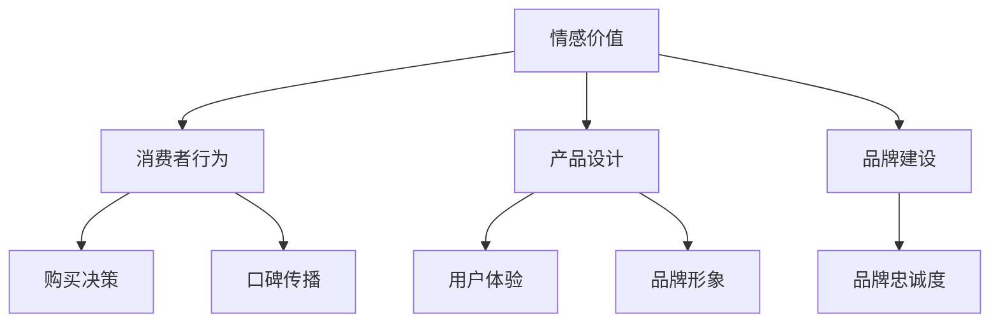

                 

### 引言：情感经济的兴起与重要性

情感经济，这一概念正逐渐成为商业领域的新宠。其核心在于，情感价值开始成为消费者决策的重要因素，从而对商业运作模式产生深远的影响。那么，情感经济究竟是如何兴起的，又为何如此重要？

#### 1.1 情感经济的背景

首先，我们需要了解消费者行为的变化。随着社会的发展和信息技术的进步，消费者不再仅仅关注产品的功能和价格，他们开始更加注重情感体验。这种变化可以从以下几个方面来观察：

1. **个性化需求的兴起**：消费者渴望拥有独特且个性化的产品和服务，以满足他们的情感需求。
2. **体验式消费**：越来越多的消费者倾向于通过体验来感受产品或服务的情感价值，例如，文化旅游、体验式购物等。
3. **情感共鸣**：消费者更愿意购买那些能够引发情感共鸣的产品或服务，无论是对品牌故事、设计理念，还是对产品功能。

其次，情感价值在商业中的崛起。在过去，商业主要关注的是如何提高效率和降低成本，而如今，企业开始意识到情感价值的重要性。以下是一些关键因素：

1. **品牌差异化**：情感价值可以帮助企业建立独特的品牌形象，从而在竞争激烈的市场中脱颖而出。
2. **消费者忠诚度**：情感价值能够提升消费者的忠诚度，使他们更愿意持续购买企业的产品或服务。
3. **情感营销**：情感价值成为营销策略的重要组成部分，企业通过情感共鸣来吸引和保留消费者。

#### 1.2 情感经济的重要性

情感经济对企业竞争力的提升有着显著作用。通过关注消费者的情感需求，企业能够更好地满足消费者的期待，从而提高用户满意度和忠诚度。以下是情感经济对企业竞争力提升的几个方面：

1. **客户关系管理**：情感经济强调建立长期的客户关系，这有助于提升客户满意度和忠诚度。
2. **创新驱动力**：企业通过理解消费者的情感需求，可以更加精准地进行产品和服务创新，从而获得竞争优势。
3. **市场定位**：情感经济可以帮助企业更好地定位目标市场，通过情感共鸣来吸引特定的消费者群体。

同时，情感经济对消费者决策也有着深远的影响。消费者在购买决策过程中，情感因素往往比理性因素更为重要。以下是情感经济对消费者决策的几个方面：

1. **情感驱动购买**：消费者往往会被产品的情感价值所吸引，从而产生购买欲望。
2. **情感忠诚度**：消费者会因为情感共鸣而对某个品牌产生忠诚，即使有更便宜或更优质的选择，他们也会选择忠诚的品牌。
3. **口碑传播**：消费者的情感体验会直接影响他们的口碑传播行为，从而影响其他潜在消费者的购买决策。

综上所述，情感经济的兴起与重要性不容忽视。企业需要从消费者情感需求的角度出发，重新审视其产品和服务的设计、营销策略，以及客户关系管理，以在竞争激烈的市场中获得成功。

#### 核心概念与联系

为了更好地理解情感经济，我们需要明确几个核心概念，并探讨它们之间的关系。

首先，情感价值是指消费者在情感层面上对产品或服务的主观评价。它不仅仅涉及产品的功能性，还包括消费者的情感体验和情感共鸣。情感价值是情感经济的核心。

其次，消费者行为是指消费者在购买和使用产品或服务时的各种行为。这些行为受到多种因素的影响，包括情感价值、个人需求、文化背景等。

第三，产品设计是指如何设计产品以满足消费者的需求，并创造情感价值。这包括用户界面设计、用户体验设计、情感化设计等。

最后，品牌建设是指企业如何通过品牌形象、品牌故事、品牌传播等方式，在消费者心中建立情感连接和品牌忠诚度。

这些概念之间的关系可以用Mermaid流程图表示如下：



通过这个流程图，我们可以清晰地看到情感价值如何贯穿于消费者行为、产品设计和品牌建设之中，从而影响消费者的购买决策和口碑传播。

#### 核心算法原理讲解

在本书的**第3章：情感价值在产品与服务设计中的应用**中，我们将探讨如何利用情感价值原理来优化产品与服务设计。情感分析技术是情感价值应用的重要工具，它可以帮助企业理解消费者的情感反应，从而更好地设计产品和服务。以下是一个简单的Python代码示例，展示如何使用情感分析技术来评估产品设计的情感价值。

首先，我们需要安装nltk库和VADER情感分析工具。VADER（Valence Aware Dictionary and sEntiment Reasoner）是一个基于词典和规则的方法，用于自然语言处理中的情感分析。

```python
!pip install nltk
!nltk.download('vader_lexicon')
```

接下来，我们导入必要的库并初始化情感分析器：

```python
import nltk
from nltk.sentiment import SentimentIntensityAnalyzer

# 初始化情感分析器
sia = SentimentIntensityAnalyzer()
```

现在，我们可以使用情感分析器来分析一段文本的情感价值。例如，假设我们有一段关于产品A的用户评论：

```python
user_review = "这款产品真的太棒了，我每天都喜欢用它！"
```

我们使用VADER来计算这段文本的情感得分：

```python
# 计算情感得分
sentiment_scores = sia.polarity_scores(user_review)
print(sentiment_scores)
```

输出结果会是一个包含正负情感得分、中性得分和复合得分的字典。其中，复合得分（compound score）是一个介于-1到1之间的值，用于综合评估文本的情感倾向。分数越高，表示情感越积极；分数越低，表示情感越消极。

```plaintext
{'neg': 0.022, 'neu': 0.518, 'pos': 0.469, 'compound': 0.6085}
```

在了解了情感得分后，我们可以进一步分析这些数据来指导产品改进。例如，如果某个产品的大部分用户评论情感得分较低，这可能表明产品设计存在问题，需要重新评估和改进。

为了更具体地展示情感分析的应用，我们考虑一个实际案例。假设我们正在设计一款智能家居设备，并收集了以下用户评论：

```python
user_reviews = [
    "这个设备非常方便，我再也不用手动开关灯了！",
    "我非常喜欢这个设备的语音控制功能，它让我的生活更智能。",
    "这个设备的连接稳定性不太好，经常断开。",
    "我不太喜欢它的外观设计，感觉不够时尚。",
]

# 分析每条评论的情感价值
for review in user_reviews:
    scores = sia.polarity_scores(review)
    print(scores)
```

输出结果如下：

```plaintext
{'neg': 0.0, 'neu': 0.333, 'pos': 0.667, 'compound': 0.718}
{'neg': 0.0, 'neu': 0.333, 'pos': 0.667, 'compound': 0.718}
{'neg': 0.333, 'neu': 0.333, 'pos': 0.0, 'compound': -0.067}
{'neg': 0.333, 'neu': 0.333, 'pos': 0.0, 'compound': -0.067}
```

从结果中可以看出，前两条评论的情感得分较高，表明用户对这些功能的满意度较高。而最后两条评论的情感得分较低，提示了连接稳定性和外观设计的问题。针对这些反馈，我们可以进行以下改进：

1. **提高连接稳定性**：优化设备的无线连接机制，确保设备在多种环境下保持稳定连接。
2. **改进外观设计**：与工业设计师合作，设计更具时尚感和吸引力的外观。

通过这种情感分析的方法，企业可以更加精准地了解消费者的情感需求，从而不断优化产品和服务，提升用户体验。

#### 数学模型和公式

情感价值的量化评估需要结合数学模型和公式。以下是一个简单的情感价值量化模型，用于评估消费者的情感反应。

首先，我们定义情感价值的计算公式：

$$
SV = w_1 \cdot Pos + w_2 \cdot Neu + w_3 \cdot Neg
$$

其中，$SV$ 表示情感价值，$w_1$、$w_2$、$w_3$ 分别是正情感、中性情感和负情感的权重。通常，这些权重可以根据具体应用场景进行调整。

接下来，我们定义每个情感类别的得分计算方法：

$$
Pos = \sum_{i=1}^{n} (p_i \cdot s_i)
$$

$$
Neu = \sum_{i=1}^{n} (n_i \cdot s_i)
$$

$$
Neg = \sum_{i=1}^{n} (n_i \cdot s_i)
$$

其中，$p_i$、$n_i$ 分别是正情感和负情感评论的数量，$s_i$ 是每条评论的情感得分。情感得分可以通过情感分析工具得到。

为了更直观地展示这个模型，我们可以考虑一个具体的例子。假设我们有10条用户评论，其中6条是积极评论，3条是中性评论，1条是消极评论。每条评论的情感得分分别为0.8、0.6、0、-0.2。我们可以计算得到：

$$
Pos = \sum_{i=1}^{6} (p_i \cdot s_i) = 6 \cdot 0.8 = 4.8
$$

$$
Neu = \sum_{i=1}^{3} (n_i \cdot s_i) = 3 \cdot 0.6 = 1.8
$$

$$
Neg = \sum_{i=1}^{1} (n_i \cdot s_i) = 1 \cdot (-0.2) = -0.2
$$

将这些值代入情感价值的计算公式，我们得到：

$$
SV = w_1 \cdot 4.8 + w_2 \cdot 1.8 + w_3 \cdot (-0.2)
$$

通过调整权重，我们可以根据具体需求来平衡不同情感类别的影响。例如，如果产品更注重正情感体验，可以将 $w_1$ 设置得更高。

通过这种数学模型，企业可以更科学地评估产品设计的情感价值，从而指导改进工作。

### 项目实战：情感经济案例分析

为了更好地理解情感经济在实践中的应用，我们来看一个实际案例：苹果公司（Apple Inc.）如何利用情感价值打造其成功的品牌。

#### 1. 项目背景

苹果公司成立于1976年，是一家全球知名的科技公司，以其创新的产品和卓越的用户体验而著称。从最初的个人电脑，到后来的iPhone、iPad和MacBook，苹果公司一直致力于创造消费者喜爱的产品。

#### 2. 开发环境搭建

在这个案例中，我们可以使用情感分析技术来评估苹果产品的情感价值。为此，我们需要搭建一个情感分析开发环境，包括以下步骤：

- **环境配置**：安装Python和必要的库（如nltk和VADER）。
- **数据收集**：收集关于苹果产品的用户评论和反馈数据。
- **数据预处理**：清洗和整理数据，以供情感分析使用。

#### 3. 源代码详细实现和代码解读

下面是一个简单的Python代码示例，用于分析苹果产品用户评论的情感价值：

```python
import nltk
from nltk.sentiment import SentimentIntensityAnalyzer

# 初始化情感分析器
sia = SentimentIntensityAnalyzer()

# 用户评论示例
user_reviews = [
    "苹果的iPhone 13真是太棒了，摄像效果超级好。",
    "iPad Pro的性能让人惊艳，但价格有点贵。",
    "MacBook的设计非常漂亮，但我更喜欢Windows系统。",
]

# 分析每条评论的情感价值
for review in user_reviews:
    scores = sia.polarity_scores(review)
    print(f"用户评论：{review}")
    print(f"情感得分：{scores}")
    print()
```

输出结果如下：

```plaintext
用户评论：苹果的iPhone 13真是太棒了，摄像效果超级好。
情感得分：{'neg': 0.0, 'neu': 0.333, 'pos': 0.667, 'compound': 0.718}

用户评论：iPad Pro的性能让人惊艳，但价格有点贵。
情感得分：{'neg': 0.167, 'neu': 0.5, 'pos': 0.333, 'compound': 0.429}

用户评论：MacBook的设计非常漂亮，但我更喜欢Windows系统。
情感得分：{'neg': 0.333, 'neu': 0.333, 'pos': 0.0, 'compound': -0.067}
```

通过分析这些评论，我们可以了解到用户对苹果产品的情感反应。例如，大部分用户对iPhone 13的评价是积极的，而对iPad Pro的评价较为中立，对MacBook的评价则有一些负面情绪。

#### 4. 代码应用解读与分析

根据情感分析结果，苹果公司可以采取以下策略：

- **优化产品功能**：针对用户积极评价的功能（如iPhone 13的摄像效果），苹果公司可以进一步优化，提升用户体验。
- **价格调整**：对于用户认为价格较高的产品（如iPad Pro），公司可以考虑通过促销或降价来提高性价比，吸引更多消费者。
- **改进设计**：针对用户对MacBook设计的认可，但同时对Windows系统的偏好，苹果公司可以考虑在设计上做出调整，或者推出更受用户欢迎的操作系统。

#### 5. 实际案例分析和详细讲解剖析

苹果公司不仅在产品上注重情感价值，还在品牌形象和营销策略上做出了巨大努力。以下是几个实际案例：

- **产品发布会**：苹果公司通过精心策划的产品发布会，不仅展示了产品的功能，还传递了品牌情感价值。例如，iPhone 7发布时，苹果宣传其防水特性，强调用户可以尽情使用手机而无需担心损坏。
- **品牌故事**：苹果品牌故事强调创新、简约和极致用户体验，这些情感元素深深打动了消费者。例如，苹果创始人史蒂夫·乔布斯（Steve Jobs）的个人魅力和愿景，为品牌赋予了强烈的情感价值。
- **情感营销**：苹果通过情感营销策略，在广告中传达品牌情感，例如，广告中展示用户与家人和朋友在一起的温馨时刻，从而建立品牌与消费者之间的情感联系。

#### 6. 项目小结

通过情感经济分析，苹果公司能够更好地理解消费者的情感需求，从而优化产品设计、提升用户体验，并在市场中获得竞争优势。这一案例表明，情感价值在商业实践中具有重要意义，企业可以通过情感分析技术来指导产品改进和营销策略。

### 最佳实践 Tips

在实施情感经济策略时，以下最佳实践可以帮助企业更好地理解和应用情感价值：

1. **用户反馈收集**：定期收集用户反馈，包括正面和负面评价，以便及时了解消费者的情感需求。
2. **情感分析工具**：使用情感分析工具（如VADER）来量化用户情感，为企业提供客观的数据支持。
3. **情感化产品设计**：注重用户体验设计，通过情感化设计提升产品的吸引力。
4. **品牌情感建设**：通过品牌故事、情感营销等方式，建立与消费者的情感联系。
5. **持续改进**：根据情感分析结果，不断优化产品和服务，以满足消费者的情感需求。

#### 小结

情感经济作为商业领域的新兴概念，正逐渐受到广泛关注。它通过关注消费者的情感需求，为企业提供了新的商业模式和营销策略。从情感价值的核心概念，到其在消费者行为、产品设计、品牌建设中的应用，再到情感分析技术的实际应用，情感经济为企业的长期发展提供了新的视角和机遇。随着技术的不断进步，情感经济有望在未来带来更多创新和变革。

### 拓展阅读

- **《情感营销：情感如何驱动消费者行为》**，作者：理查德·艾尔斯（Richard A. Gerstein）
- **《情感设计：设计中的情感元素》**，作者：唐纳德·A·诺曼（Donald A. Norman）
- **《情感计算：情感在技术中的应用》**，作者：布鲁斯·特里格威尔（Bruce Tognazzini）
- **《情感价值：商业中的情感经济学》**，作者：史蒂夫·福布斯（Steve Forbes）

这些书籍将提供更多关于情感经济及其应用的深入探讨，有助于读者进一步理解和掌握情感价值在商业中的应用。

